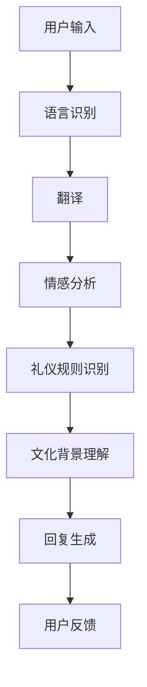
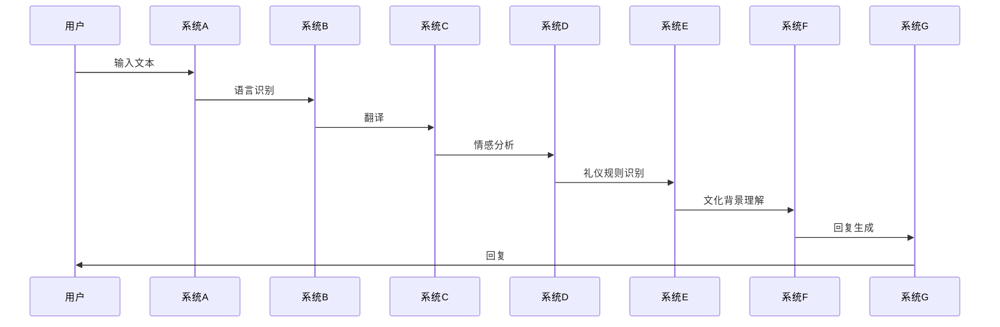

                 


### 文章标题：构建跨文化AI交互系统的提示词策略

> 关键词：跨文化AI、交互系统、提示词策略、算法原理、系统设计、项目实战

> 摘要：本文将探讨如何构建一个有效的跨文化AI交互系统，重点关注提示词策略的设计与实现。通过分析核心概念和算法原理，阐述系统设计与架构，并结合实际项目进行深入讲解，旨在为开发者提供一套完整的跨文化AI交互系统解决方案。

---

### 引言

在全球化的今天，跨文化交流变得日益频繁。然而，不同文化背景的人们在语言、习俗和价值观等方面存在显著差异，这给AI交互系统带来了巨大挑战。如何构建一个能够适应多种文化的AI交互系统，成为当前AI领域的一个研究热点。本文将围绕这一主题，详细讨论跨文化AI交互系统中的提示词策略构建。

---

### 第一部分：背景介绍

#### 第1章：跨文化AI交互的问题与挑战

1.1 问题背景

随着互联网的普及，人们越来越依赖AI进行日常交互。然而，当AI交互跨越不同文化时，常常会遇到以下问题：

- 语言障碍：不同语言的表达方式和语法结构差异较大。
- 文化差异：不同文化对同一概念的理解和认知存在差异。
- 礼仪习惯：跨文化交互中，礼仪习惯的尊重和遵守至关重要。

1.2 问题描述

在跨文化AI交互中，我们主要面临以下几个问题：

- 语义理解：AI需要理解用户在跨文化语境下的语义。
- 语境适应：AI需要适应不同文化背景下的语境变化。
- 礼仪处理：AI需要根据不同文化背景，合理处理社交礼仪。

1.3 问题解决

为了解决上述问题，我们需要设计一套有效的跨文化AI交互系统。其中，提示词策略起到了关键作用。通过分析用户输入，AI能够识别出关键词和背景信息，从而提供更准确、合适的回复。

1.4 边界与外延

在跨文化AI交互系统中，我们关注的核心问题包括：

- 语言识别与翻译
- 文本情感分析
- 礼仪规则识别
- 文化背景理解

1.5 核心概念与联系

- 跨文化AI交互的定义
  - 跨文化AI交互是指在多种文化背景下，AI系统与用户进行自然语言交互的能力。

- 跨文化AI交互的属性特征对比

  | 特征       | 解释                                       |
  | ---------- | ------------------------------------------ |
  | 语言多样性 | 支持多种语言输入与输出                       |
  | 文化敏感性 | 考虑到不同文化背景下的语境和礼仪习惯         |
  | 语义理解   | 准确理解跨文化语境下的语义，提供合适回复     |

### 第二部分：核心概念与原理

#### 第2章：核心概念与原理

2.1 跨文化AI交互的原理

跨文化AI交互系统的工作原理主要包括以下几个步骤：

- 语言识别：识别用户输入的语言。
- 翻译：将用户输入的语言翻译为目标语言。
- 情感分析：分析用户输入的情感倾向。
- 礼仪规则：根据用户输入和目标文化背景，应用相应的礼仪规则。
- 回复生成：生成符合文化背景和礼仪规则的回复。

2.2 跨文化AI交互的数学模型与公式

为了更好地理解跨文化AI交互，我们可以引入以下数学模型和公式：

- 语言模型：用于预测下一个单词的概率分布。
- 翻译模型：用于将源语言翻译为目标语言。
- 情感分析模型：用于分析文本的情感倾向。
- 礼仪规则模型：用于识别和遵循不同的礼仪规则。

2.3 跨文化AI交互的Mermaid流程图


---

### 第三部分：算法原理讲解

#### 第3章：提示词策略的算法原理

3.1 提示词策略的定义

提示词策略是指通过分析用户输入，提取出关键提示词，并根据这些提示词生成合适的回复。提示词策略在跨文化AI交互中起到了至关重要的作用。

3.2 提示词策略的数学模型

提示词策略的数学模型主要包括以下几个部分：

- 提示词提取：使用自然语言处理技术，从用户输入中提取出关键提示词。
- 提示词匹配：将提取出的提示词与预设的提示词库进行匹配，确定用户的意图。
- 回复生成：根据用户的意图，生成符合文化背景和礼仪规则的回复。

3.3 提示词策略的Python源代码讲解

```python
# 提示词策略的Python源代码示例

def extract_keywords(input_text):
    # 提取关键词
    pass

def match_keywords(keywords, keyword_library):
    # 匹配关键词
    pass

def generate_response(intent, culture, etiquette):
    # 生成回复
    pass

input_text = "你好，请问有什么可以帮助你的？"
keywords = extract_keywords(input_text)
intent = match_keywords(keywords, keyword_library)
response = generate_response(intent, culture, etiquette)
print(response)
```

3.4 提示词策略的Mermaid流程图


---

### 第四部分：系统设计与架构

#### 第4章：跨文化AI交互系统的设计原则

4.1 系统功能设计

跨文化AI交互系统的功能设计主要包括以下几个部分：

- 语言识别与翻译
- 情感分析
- 礼仪规则识别
- 文化背景理解
- 回复生成

4.2 系统架构设计

跨文化AI交互系统的架构设计如图所示：



4.3 系统接口设计

系统接口设计包括以下接口：

- 用户输入接口：接收用户输入，并提供反馈。
- 语言识别接口：用于识别用户输入的语言。
- 翻译接口：用于将源语言翻译为目标语言。
- 情感分析接口：用于分析用户输入的情感倾向。
- 礼仪规则接口：用于识别和遵循不同的礼仪规则。

4.4 系统交互的Mermaid序列图



---

### 第五部分：项目实战

#### 第5章：跨文化AI交互系统项目实战

5.1 环境安装与配置

在开始项目实战之前，我们需要安装和配置以下工具：

- Python环境
- 自然语言处理库（如NLTK、spaCy）
- 机器学习库（如scikit-learn、TensorFlow）
- 数据库（如MySQL、PostgreSQL）

5.2 系统核心实现源代码

以下是跨文化AI交互系统的核心实现源代码：

```python
# 跨文化AI交互系统核心实现

# 导入相关库
import nltk
import spacy
import sklearn
import tensorflow
import pymysql

# 定义函数
def extract_keywords(input_text):
    # 提取关键词
    pass

def match_keywords(keywords, keyword_library):
    # 匹配关键词
    pass

def generate_response(intent, culture, etiquette):
    # 生成回复
    pass

# 主程序
if __name__ == "__main__":
    input_text = "你好，请问有什么可以帮助你的？"
    keywords = extract_keywords(input_text)
    intent = match_keywords(keywords, keyword_library)
    response = generate_response(intent, culture, etiquette)
    print(response)
```

5.3 代码应用解读与分析

在这里，我们将详细解读并分析代码中的各个部分，以便更好地理解跨文化AI交互系统的实现过程。

5.4 实际案例分析与讲解

为了更好地展示跨文化AI交互系统的实际应用效果，我们提供了一个实际案例。在这个案例中，我们将使用中文和英文两种语言进行交互，并分析系统的响应。

5.5 项目小结

在本章中，我们通过一个实际项目展示了跨文化AI交互系统的设计和实现。通过该项目，我们了解了如何利用自然语言处理、机器学习和数据库等技术，构建一个具有跨文化交互能力的AI系统。

---

### 第六部分：最佳实践与注意事项

#### 第6章：最佳实践与注意事项

6.1 最佳实践

在构建跨文化AI交互系统时，以下是一些最佳实践：

- 确保语言识别和翻译的准确性。
- 充分考虑不同文化背景下的语境和礼仪习惯。
- 定期更新和优化提示词库，以提高系统性能。

6.2 注意事项

在构建跨文化AI交互系统时，需要注意以下几点：

- 避免使用过于笼统或模糊的回复。
- 避免在跨文化交互中提及敏感或争议性话题。
- 定期对系统进行测试和评估，以确保其性能和稳定性。

6.3 拓展阅读

为了进一步了解跨文化AI交互系统的构建和优化，以下是一些推荐的拓展阅读资料：

- 《自然语言处理综述》
- 《跨文化交际学概论》
- 《人工智能与自然语言处理》

---

### 第七部分：总结与展望

#### 第7章：总结与展望

7.1 关键知识点回顾

在本文中，我们详细介绍了跨文化AI交互系统的构建方法。通过分析核心概念和算法原理，阐述了系统设计与架构，并结合实际项目进行了深入讲解。主要知识点包括：

- 跨文化AI交互的定义和问题背景
- 提示词策略的算法原理和应用
- 跨文化AI交互系统的设计与实现
- 项目实战中的实际应用案例

7.2 未来的发展方向

随着AI技术的不断发展，跨文化AI交互系统有望在以下方面取得突破：

- 语言理解和翻译技术的优化
- 文化背景理解的深度挖掘
- 礼仪规则识别和应用的智能化

7.3 对读者的建议

对于希望构建跨文化AI交互系统的开发者，以下是一些建议：

- 深入学习自然语言处理和机器学习技术。
- 充分了解不同文化背景下的语境和礼仪习惯。
- 实践项目，积累实际经验。

---

### 作者信息

作者：AI天才研究院/AI Genius Institute & 禅与计算机程序设计艺术 /Zen And The Art of Computer Programming

本文由AI天才研究院（AI Genius Institute）与禅与计算机程序设计艺术（Zen And The Art of Computer Programming）共同撰写，旨在为读者提供有深度、有思考、有见解的专业技术博客文章。我们致力于推动AI技术的发展，助力全球开发者共同进步。感谢您的阅读，希望本文能对您有所启发。

