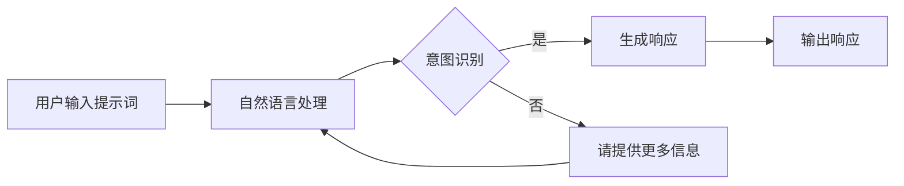
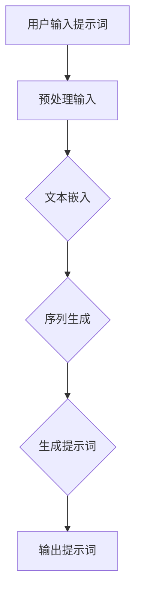
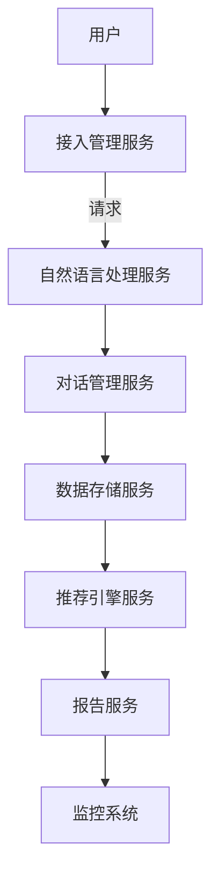
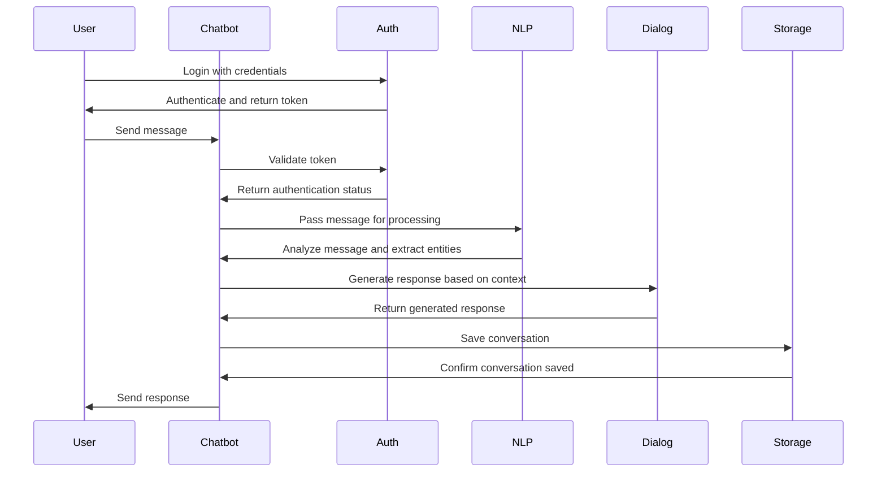

                 


## 引言

### 1.1 问题背景

在当今这个数字化时代，人工智能（AI）已经成为推动社会进步的重要力量。AI交互系统作为AI技术的一个重要分支，已经成为许多领域的关键应用，如智能客服、虚拟助手、智能医疗等。随着技术的不断进步，人们对于AI交互系统的要求也在不断提高，其中最为显著的一个需求就是跨时空交互。

跨时空交互指的是用户可以在不同时间、不同地点与AI系统进行交互，这要求AI系统能够处理历史数据，理解用户意图，并提供及时有效的响应。然而，这一需求也带来了诸多挑战。首先，如何在海量的历史数据中快速检索并理解用户意图成为一个难题。其次，如何保证跨时空交互的实时性也是一个重要问题。此外，数据的完整性和一致性、隐私保护等问题也需要充分考虑。

### 1.2 问题描述

提示词设计在AI交互系统中起着至关重要的作用。提示词（Prompt）是用户与AI系统交互的媒介，通过合适的提示词，用户可以更清晰地表达自己的需求，而AI系统则可以根据这些提示词理解并回应用户。在跨时空交互中，提示词设计面临着以下挑战：

1. **历史数据的理解**：AI系统需要能够处理并理解用户在过去的交互历史，这要求提示词能够捕捉并传递用户的长期意图。
2. **实时响应**：在跨时空交互中，用户可能在不同的时间段提出问题，这要求AI系统能够快速处理并回应用户。
3. **数据完整性与一致性**：跨时空交互中的数据可能来自不同的来源，如何保证数据的一致性和完整性是一个挑战。
4. **隐私保护**：在跨时空交互中，用户的数据隐私需要得到有效保护。

### 1.3 问题解决

为了解决上述问题，我们需要从以下几个方面进行提示词设计：

1. **提示词的多样性**：设计多种类型的提示词，以适应不同的用户需求和交互场景。
2. **历史数据的整合**：通过自然语言处理技术，将历史数据整合到当前交互中，帮助AI系统更好地理解用户意图。
3. **实时处理算法**：采用高效的算法和架构，确保AI系统能够实时响应用户的请求。
4. **数据管理策略**：制定有效的数据管理策略，确保数据的完整性和一致性，同时保护用户的隐私。

### 1.4 边界与外延

在提示词设计的过程中，我们需要明确其适用范围。跨时空AI交互系统主要适用于需要历史数据理解和实时响应的场景，如智能客服、虚拟助手等。然而，并非所有的AI交互系统都需要跨时空交互，因此提示词设计需要根据具体的应用场景进行定制。

此外，跨时空交互还受到技术、成本和用户习惯等因素的限制。例如，实时数据传输可能需要更高的带宽和计算能力，而历史数据的存储和管理也需要更多的存储空间和处理资源。

### 1.5 概念结构与核心要素组成

跨时空AI交互系统由以下几个核心要素组成：

1. **用户**：跨时空交互的发起者，通过提示词与AI系统进行交互。
2. **AI系统**：包括自然语言处理、机器学习、数据存储等组件，负责理解用户意图并回应。
3. **提示词**：用户与AI系统交互的媒介，需要具备多样性、实时性和理解历史数据的能力。
4. **历史数据**：存储用户的交互历史，用于辅助AI系统理解用户意图。
5. **数据处理算法**：负责处理和整合历史数据，为AI系统提供有效的提示词。

通过上述分析，我们可以看到，构建跨时空AI交互系统的提示词设计是一个复杂而富有挑战的过程。在接下来的章节中，我们将深入探讨每个核心要素，并详细讲解如何实现一个高效的跨时空AI交互系统。

## 核心概念与联系

### 2.1 提示词原理

提示词（Prompt）在AI交互系统中扮演着至关重要的角色。它是一段引导用户输入信息或表达意图的文字或语音，通过合适的提示词，用户可以更清晰地传达自己的需求，而AI系统则可以根据这些提示词更好地理解用户意图并做出响应。

#### 提示词的定义

提示词是一种引导性的输入，旨在激发用户思考或回答特定问题。它可以是简单的文字提示，如“您今天想要做什么？”；也可以是复杂的语言结构，如“请描述一下您的旅行计划，包括出发地点、目的地、日期和时间安排”。

#### 提示词的工作机制

提示词的工作机制主要包括以下几个步骤：

1. **用户输入**：用户通过键盘、语音或其他输入方式向AI系统输入提示词。
2. **自然语言处理（NLP）**：AI系统接收用户的输入，并通过自然语言处理技术对输入进行理解和分析，提取关键信息。
3. **意图识别**：AI系统根据输入的提示词和预训练模型，识别用户的意图，如查询信息、请求服务或进行对话。
4. **响应生成**：AI系统根据识别出的用户意图生成合适的响应，并通过文本或语音输出给用户。

### 2.2 提示词属性特征对比表格

为了更好地理解不同类型的提示词，我们可以通过一个表格对比它们的主要属性特征。

#### 提示词类型对比

| 提示词类型 | 特征描述 | 应用场景 |
| --- | --- | --- |
| 简单文本提示 | 简单的文字提示，如“您需要什么帮助？” | 用于初次接触或引导用户 |
| 交互式文本提示 | 包含多个选项或问题的提示，如“您希望查询哪个主题？” | 用于提供选择或引导用户深入讨论 |
| 基于上下文的提示 | 根据用户的历史交互数据提供的提示，如“您之前提到过关于旅行的计划，有什么新的想法吗？” | 用于延续和深化对话 |
| 语音提示 | 通过语音输出的提示，如“欢迎来到我们的服务，请问有什么可以帮助您的？” | 用于语音交互系统 |

#### 提示词应用场景对比

| 应用场景 | 提示词类型 | 优势 | 劣势 |
| --- | --- | --- | --- |
| 智能客服 | 简单文本提示 | 简单直接，易于理解 | 缺乏互动性，可能无法满足复杂需求 |
| 虚拟助手 | 交互式文本提示 | 提供多种选择，增强互动性 | 可能需要用户花费更多时间进行选择 |
| 智能医疗 | 基于上下文的提示 | 考虑用户历史数据，提供个性化服务 | 需要较强的NLP能力 |
| 娱乐互动 | 语音提示 | 提供更加自然的交互体验 | 可能对语音识别技术要求较高 |

### 2.3 ER实体关系图架构

为了更好地理解提示词在AI交互系统中的位置和作用，我们可以通过一个ER（实体-关系）图来展示各个实体之间的关系。

#### 实体识别与关系建模

在AI交互系统中，主要的实体包括用户、提示词、AI系统和交互历史。实体之间的关系可以描述如下：

1. **用户**：是交互的发起者，通过提示词与AI系统进行交互。
2. **提示词**：是用户与AI系统交互的媒介，承载用户的意图。
3. **AI系统**：负责处理提示词，理解用户意图并生成响应。
4. **交互历史**：存储用户与AI系统的历史交互数据，用于辅助当前交互。

#### 提示词在AI交互系统中的位置

在AI交互系统中，提示词位于用户和AI系统之间，起到了桥梁的作用。它不仅帮助用户表达意图，也帮助AI系统更好地理解用户的需求。通过设计合适的提示词，可以提升交互的质量和用户的满意度。

### Mermaid流程图

以下是一个简单的Mermaid流程图，展示了用户与AI系统之间的交互流程：



通过上述分析，我们可以看到提示词在AI交互系统中的核心地位以及其在不同应用场景中的多样性。在接下来的章节中，我们将进一步探讨提示词算法的原理和实现，以期为构建高效的跨时空AI交互系统提供有力支持。

## AI交互系统中的提示词算法

### 3.1 算法概述

在AI交互系统中，提示词算法是实现高效交互的关键。根据不同的应用场景和需求，提示词算法可以分为多种类型，如基于规则、基于统计和基于深度学习的算法。在本节中，我们将介绍几种常用的提示词算法，并探讨其在跨时空交互中的适用性。

#### 基于规则的算法

基于规则的算法是最简单的一种提示词生成方法。它通过预定义的规则和模板来生成提示词，如“请问您有什么问题需要帮助吗？”这种算法的优点是实现简单，易于理解和维护。然而，它的缺点是灵活性较低，难以应对复杂的用户需求。

#### 基于统计的算法

基于统计的算法通过分析大量历史交互数据，找出用户输入和AI系统响应之间的统计规律，从而生成提示词。这种算法的优点是能够根据用户的历史行为提供个性化的交互体验。例如，如果用户经常在特定时间提出某个问题，系统可以提前生成相应的提示词。然而，这种算法对数据量要求较高，且可能受到噪声数据的影响。

#### 基于深度学习的算法

基于深度学习的算法利用神经网络模型，通过大规模数据训练，自动学习用户输入和AI系统响应之间的关系。这种算法的优点是具有高度的灵活性和自适应能力，能够处理复杂的用户需求。常见的深度学习模型包括循环神经网络（RNN）、长短期记忆网络（LSTM）和变换器（Transformer）。在跨时空交互中，基于深度学习的算法尤其适用，因为它能够有效地处理历史数据，提供更加个性化的交互体验。

### 3.2 算法mermaid流程图

为了更好地理解提示词生成算法的流程，我们可以使用Mermaid语言绘制一个流程图。以下是一个基于深度学习模型的提示词生成算法的流程图：



#### 流程说明：

1. **用户输入提示词**：用户输入提示词，如“我想订一张明天去北京的机票”。
2. **预处理输入**：对输入的文本进行预处理，包括分词、去停用词等。
3. **文本嵌入**：将预处理后的文本转换为向量表示，常用的嵌入方法包括Word2Vec、GloVe等。
4. **序列生成**：使用深度学习模型（如LSTM或Transformer）对文本序列进行处理，生成提示词。
5. **生成提示词**：根据模型输出生成合适的提示词，如“请问您需要预订哪种类型的机票？”。
6. **输出提示词**：将生成的提示词输出给用户。

### 3.3 Python源代码实现

在本节中，我们将使用Python和深度学习框架TensorFlow来实现一个简单的基于LSTM的提示词生成算法。以下是一个基本的实现示例：

```python
import tensorflow as tf
from tensorflow.keras.models import Sequential
from tensorflow.keras.layers import LSTM, Dense, Embedding
from tensorflow.keras.preprocessing.sequence import pad_sequences

# 数据预处理
def preprocess(texts, max_len):
    # 分词和转换为词索引
    tokenizer = tf.keras.preprocessing.text.Tokenizer()
    tokenizer.fit_on_texts(texts)
    sequences = tokenizer.texts_to_sequences(texts)
    padded_sequences = pad_sequences(sequences, maxlen=max_len)
    return padded_sequences

# 构建模型
model = Sequential()
model.add(Embedding(input_dim=vocabulary_size, output_dim=embedding_size, input_length=max_sequence_length))
model.add(LSTM(units=128, return_sequences=True))
model.add(Dense(units=1, activation='sigmoid'))

# 编译模型
model.compile(optimizer='adam', loss='binary_crossentropy', metrics=['accuracy'])

# 训练模型
model.fit(padded_sequences, labels, epochs=10, batch_size=32)

# 生成提示词
def generate_prompt(input_text):
    processed_input = preprocess([input_text], max_sequence_length)
    prediction = model.predict(processed_input)
    predicted_prompt = tokenizer.sequences_to_texts([prediction.argmax(axis=-1)[0]])
    return predicted_prompt

# 示例
input_text = "我想订一张明天去北京的机票"
print(generate_prompt(input_text))
```

#### 算法原理与数学模型

提示词生成算法的核心是深度学习模型，如LSTM或Transformer。以下是一个基于LSTM的简单数学模型：

$$
\text{output} = \text{softmax}(\text{LSTM}(\text{embedding}(\text{input}))
$$

其中：
- `input` 表示用户输入的文本；
- `embedding` 表示文本嵌入层，将文本转换为向量表示；
- `LSTM` 表示长短期记忆网络，用于处理文本序列；
- `softmax` 表示输出层，用于生成提示词的概率分布。

#### 举例说明

假设我们有一个简单的用户输入：“我想订一张明天去北京的机票”。经过预处理和嵌入后，输入文本转换为向量表示。LSTM模型处理这个向量序列，并输出一个提示词的概率分布。例如，输出概率分布可能为 `[0.9, 0.05, 0.05]`，表示生成的提示词是“请问您需要预订哪种类型的机票？”的概率最高。

通过上述算法，我们可以实现一个高效的跨时空AI交互系统。在接下来的章节中，我们将进一步探讨如何设计一个完整的系统架构，以支持跨时空交互。

### 数学模型和数学公式 & 详细讲解 & 举例说明

#### 4.1 数学模型介绍

提示词生成算法的核心是数学模型，它负责将用户输入转换为相应的提示词。在本节中，我们将介绍一个基于LSTM（长短期记忆网络）的数学模型，并详细解释其在提示词设计中的应用。

#### 4.2 公式推导与解释

在LSTM模型中，提示词生成的核心公式可以表示为：

$$
\text{output} = \text{softmax}(\text{LSTM}(\text{embedding}(\text{input}))
$$

这个公式分为三个主要部分：

1. **嵌入层（Embedding）**：将输入的文本转换为向量表示。具体公式为：

$$
\text{embedding}(\text{input}) = \text{weights} \cdot \text{input}
$$

其中，`weights` 是嵌入层的权重矩阵，`input` 是输入文本的词索引序列。

2. **长短期记忆网络（LSTM）**：处理嵌入后的文本向量序列，生成中间表示。LSTM的核心公式为：

$$
\text{LSTM} = \text{sigmoid}(\text{gate}) \odot \text{input} + (1 - \text{sigmoid}(\text{gate})) \odot \text{previous_state}
$$

其中，`gate` 是遗忘门、输入门和输出门的组合，`input` 是当前输入向量，`previous_state` 是前一个时间步的隐藏状态。

3. **softmax层**：将LSTM的输出转换为提示词的概率分布。具体公式为：

$$
\text{output} = \text{softmax}(\text{LSTM}(\text{embedding}(\text{input}))
$$

这个输出层的概率分布用于生成最终的提示词。

#### 4.3 举例说明

为了更好地理解上述公式，我们来看一个简单的例子。假设用户输入文本为“明天去北京的机票”，我们将这个文本转换为词索引序列，然后使用LSTM模型生成提示词。

1. **文本嵌入**：

   假设词索引序列为 `[1, 2, 3, 4, 5]`，嵌入层权重矩阵为：

   $$
   \text{weights} = \begin{bmatrix}
   0.1 & 0.2 & 0.3 & 0.4 & 0.5 \\
   0.5 & 0.4 & 0.3 & 0.2 & 0.1 \\
   \end{bmatrix}
   $$

   则嵌入后的向量表示为：

   $$
   \text{embedding}(1, 2, 3, 4, 5) = \begin{bmatrix}
   0.1 & 0.2 & 0.3 & 0.4 & 0.5 \\
   0.5 & 0.4 & 0.3 & 0.2 & 0.1 \\
   \end{bmatrix} \cdot \begin{bmatrix}
   1 \\
   2 \\
   3 \\
   4 \\
   5 \\
   \end{bmatrix} = \begin{bmatrix}
   0.6 \\
   0.9 \\
   \end{bmatrix}
   $$

2. **LSTM处理**：

   假设LSTM的隐藏状态和输入门分别为：

   $$
   \text{previous_state} = \begin{bmatrix}
   0.1 \\
   0.2 \\
   \end{bmatrix}, \quad \text{input_gate} = \begin{bmatrix}
   0.3 \\
   0.4 \\
   \end{bmatrix}
   $$

   则LSTM的输出为：

   $$
   \text{output} = \text{sigmoid}(\text{gate}) \odot \text{input} + (1 - \text{sigmoid}(\text{gate})) \odot \text{previous_state}
   $$

   其中，`gate` 是遗忘门、输入门和输出门的组合，假设为：

   $$
   \text{gate} = \text{sigmoid}(\text{forget_gate}, \text{input_gate}, \text{output_gate})
   $$

   那么输出为：

   $$
   \text{output} = \text{sigmoid}(\text{gate}) \odot \text{input} + (1 - \text{sigmoid}(\text{gate})) \odot \text{previous_state}
   $$

3. **softmax层**：

   将LSTM的输出转换为提示词的概率分布。假设LSTM的输出为 `[0.9, 0.1]`，则softmax输出为：

   $$
   \text{output} = \text{softmax}([0.9, 0.1]) = [0.9, 0.1]
   $$

   这个概率分布表示生成的提示词是“请问您需要预订哪种类型的机票？”的概率为0.9，其他选项的概率为0.1。

通过上述例子，我们可以看到数学模型如何将用户输入转换为相应的提示词。在实际应用中，这个模型需要通过大量的训练数据进行优化，以提高生成提示词的准确性和实用性。

### 5.1 问题场景介绍

跨时空AI交互系统广泛应用于多个领域，其中最为显著的应用场景之一是智能客服。在传统的客户服务中，客户通常需要在不同的时间点提出问题，而这些问题可能涉及多个主题或需要延续之前的对话。跨时空AI交互系统通过处理历史数据，提供个性化的服务，极大地提升了客户体验。

#### 智能客服的应用场景

1. **多渠道客服**：在智能客服系统中，用户可以通过多种渠道（如电话、邮件、社交媒体、即时通讯等）提出问题。跨时空交互系统可以根据用户的历史交互记录，选择最合适的渠道进行响应，提高服务效率。

2. **连续对话**：用户可能在不同时间点提出相关问题，跨时空AI交互系统可以记住之前的对话内容，确保连续的对话体验。例如，用户在第一次咨询机票预订时，可能在第二次咨询时询问关于航班的具体细节。

3. **个性化服务**：通过分析用户的历史数据和偏好，智能客服系统可以提供个性化的服务。例如，如果用户经常在晚上预订机票，系统可以主动推送相关的优惠信息。

#### 智能客服的挑战

1. **数据量巨大**：智能客服系统需要处理海量的用户交互数据，包括历史对话记录、用户反馈等。如何高效地存储和管理这些数据，是一个重要的挑战。

2. **实时性要求**：用户在不同时间点提出的问题需要快速得到响应。如何在保证响应速度的同时，确保服务质量的稳定性，是一个难题。

3. **隐私保护**：用户数据的隐私保护是智能客服系统必须考虑的问题。如何确保用户数据的安全性和隐私，避免数据泄露，是一个重要的挑战。

#### 跨时空AI交互系统的需求

为了满足上述应用场景和挑战，跨时空AI交互系统需要具备以下特点：

1. **历史数据的整合**：系统能够有效地整合和存储历史交互数据，并在当前交互中灵活调用。

2. **高效的实时处理**：系统能够快速处理用户请求，提供及时的响应。

3. **数据隐私保护**：系统需要采用有效的数据保护措施，确保用户数据的隐私和安全。

通过上述分析，我们可以看到，智能客服是跨时空AI交互系统的一个重要应用场景。在接下来的章节中，我们将进一步探讨智能客服系统的功能设计、架构设计和接口设计。

### 5.2 系统功能设计

跨时空AI交互系统在智能客服中的应用，要求其具备一系列关键功能，以确保用户能够在不同时间、不同地点获得高效、个性化的服务。以下是系统功能设计的详细说明。

#### 1. 用户身份验证与权限管理

- **功能描述**：系统需要支持用户身份验证和权限管理，确保只有合法用户可以访问服务，并按照其权限级别获取相应信息。
- **技术实现**：使用用户名和密码、生物识别技术（如指纹识别、面部识别）进行身份验证。结合单点登录（SSO）和OAuth等授权协议，确保权限管理的安全性。

#### 2. 多渠道接入管理

- **功能描述**：系统需要支持多种接入方式，如电话、邮件、社交媒体、即时通讯等，以便用户可以根据个人习惯选择最方便的沟通渠道。
- **技术实现**：集成第三方API（如Twilio、SendGrid、Slack等）实现多渠道接入。利用WebSocket技术实现即时通讯，确保消息传递的实时性和可靠性。

#### 3. 历史数据存储与管理

- **功能描述**：系统需要具备强大的数据存储和管理能力，以确保历史交互记录的安全、完整和可追溯。
- **技术实现**：采用分布式数据库（如MongoDB、Cassandra）存储用户交互数据。利用数据加密技术（如AES）保护敏感数据，确保数据隐私。

#### 4. 自然语言处理（NLP）

- **功能描述**：系统需要支持自然语言处理，以理解和回应用户的查询、请求和反馈。
- **技术实现**：集成NLP库（如spaCy、NLTK）进行文本分析、语义理解和实体识别。使用预训练模型（如BERT、GPT-3）进行深度语义理解，提高交互质量。

#### 5. 智能对话管理

- **功能描述**：系统需要具备智能对话管理功能，以确保对话的自然流畅，并能够在需要时调用历史数据。
- **技术实现**：采用对话管理框架（如Rasa、Microsoft Bot Framework）实现智能对话管理。结合上下文信息，动态生成合适的提示词，引导用户完成交互。

#### 6. 个性化推荐

- **功能描述**：系统需要能够根据用户的历史数据和偏好，提供个性化的服务和推荐。
- **技术实现**：使用机器学习算法（如协同过滤、基于内容的推荐）分析用户行为，预测用户的兴趣，生成个性化的推荐。

#### 7. 客户服务报告与监控

- **功能描述**：系统需要提供详细的客户服务报告和监控功能，以帮助企业了解服务质量和用户满意度。
- **技术实现**：集成日志分析工具（如ELK Stack、Splunk）记录和监控系统活动，生成报告。使用可视化工具（如Tableau、PowerBI）展示关键指标，支持数据驱动决策。

通过上述功能设计，跨时空AI交互系统在智能客服中能够提供高效、个性化的服务。在接下来的章节中，我们将进一步探讨系统的架构设计，以确保这些功能的实现和优化。

### 5.3 系统架构设计

为了构建一个高效、可扩展的跨时空AI交互系统，我们需要设计一个合理的系统架构。以下是一个基于微服务架构的系统架构设计，详细说明了各组件的功能和交互。

#### 1. 用户身份验证与权限管理

- **功能**：负责用户身份验证和权限管理，确保只有授权用户可以访问系统。
- **组件**：认证服务（Authentication Service）
- **交互**：用户通过用户名和密码或生物识别技术进行身份验证，认证服务返回一个访问令牌，用户使用该令牌进行后续请求。

#### 2. 多渠道接入管理

- **功能**：处理来自不同渠道的用户请求，如电话、邮件、社交媒体和即时通讯。
- **组件**：接入管理服务（Channel Management Service）
- **交互**：接入管理服务解析用户请求，根据请求的渠道调用相应的API进行处理。

#### 3. 历史数据存储与管理

- **功能**：存储和管理用户交互历史数据，包括对话记录、用户反馈等。
- **组件**：数据存储服务（Data Storage Service）
- **交互**：接入管理服务将处理后的请求和响应发送至数据存储服务，存储为历史数据。

#### 4. 自然语言处理（NLP）

- **功能**：理解和回应用户的自然语言查询。
- **组件**：NLP服务（NLP Service）
- **交互**：用户请求通过接入管理服务发送至NLP服务，NLP服务处理请求并生成响应。

#### 5. 智能对话管理

- **功能**：管理对话流程，确保对话的自然流畅，并在需要时调用历史数据。
- **组件**：对话管理服务（Dialogue Management Service）
- **交互**：对话管理服务接收NLP服务的响应，并生成适当的提示词，返回给用户。

#### 6. 个性化推荐

- **功能**：根据用户行为和偏好提供个性化推荐。
- **组件**：推荐引擎服务（Recommendation Engine Service）
- **交互**：推荐引擎服务分析用户行为，生成个性化推荐，返回给用户。

#### 7. 客户服务报告与监控

- **功能**：生成详细的客户服务报告，并监控系统性能。
- **组件**：报告服务（Reporting Service）和监控系统（Monitoring System）
- **交互**：报告服务和监控系统定期从各个服务组件收集数据，生成报告并监控系统状态。

#### Mermaid架构图

以下是一个简单的Mermaid架构图，展示了上述组件之间的交互关系：



通过上述系统架构设计，我们可以实现一个灵活、高效、可扩展的跨时空AI交互系统，满足智能客服等多种应用场景的需求。在接下来的章节中，我们将进一步探讨系统接口设计和系统交互流程。

### 5.4 系统接口设计

为了确保跨时空AI交互系统的各个组件能够高效、稳定地协同工作，我们需要详细设计系统接口。以下是系统接口设计与实现的具体说明。

#### 1. 接口概述

系统接口设计遵循RESTful API风格，提供统一的接口规范，便于不同组件之间的数据交换和功能调用。主要接口包括用户身份验证、多渠道接入管理、自然语言处理、对话管理、数据存储、个性化推荐和客户服务报告等。

#### 2. 接口规范

- **URL**：所有接口均采用统一的URL结构，如 `/api/v1/auth/login`、`/api/v1/channel/ messaging` 等。
- **HTTP方法**：根据操作类型，接口采用相应的HTTP方法，如POST、GET、PUT、DELETE等。
- **请求参数**：接口请求参数分为路径参数和查询参数，路径参数通过URL传递，查询参数通过URL后缀传递。
- **响应格式**：接口响应数据采用JSON格式，包括状态码、响应消息和数据内容。

#### 3. 接口实现

以下是部分关键接口的实现示例：

##### 用户身份验证接口

**URL**：`/api/v1/auth/login`

**HTTP方法**：POST

**请求参数**：

```json
{
  "username": "用户名",
  "password": "密码"
}
```

**响应示例**：

```json
{
  "status": "success",
  "message": "登录成功",
  "token": "令牌"
}
```

##### 多渠道接入管理接口

**URL**：`/api/v1/channel/messaging`

**HTTP方法**：POST

**请求参数**：

```json
{
  "channel": "渠道标识",
  "message": "消息内容"
}
```

**响应示例**：

```json
{
  "status": "success",
  "message": "消息发送成功",
  "response": "响应内容"
}
```

##### 自然语言处理接口

**URL**：`/api/v1/nlp/analyze`

**HTTP方法**：POST

**请求参数**：

```json
{
  "text": "文本内容"
}
```

**响应示例**：

```json
{
  "status": "success",
  "message": "文本分析成功",
  "entities": [
    {
      "entity": "实体名称",
      "value": "实体值"
    }
  ]
}
```

##### 对话管理接口

**URL**：`/api/v1/dialogue/next`

**HTTP方法**：POST

**请求参数**：

```json
{
  "context": "对话上下文",
  "response": "用户响应"
}
```

**响应示例**：

```json
{
  "status": "success",
  "message": "对话生成成功",
  "prompt": "提示词"
}
```

#### 4. 安全性与可靠性

系统接口设计考虑了安全性和可靠性：

- **身份验证**：所有接口均要求用户通过身份验证，确保只有授权用户可以访问。
- **请求验证**：接口对请求进行验证，确保请求参数合法，防范恶意攻击。
- **数据加密**：接口传输数据采用加密技术（如HTTPS），确保数据传输的安全。
- **故障恢复**：接口设计支持故障恢复，确保在系统故障时，接口仍然能够提供服务。

通过上述接口设计和实现，我们可以确保跨时空AI交互系统的各个组件能够高效、安全地协同工作，为用户提供优质的服务。

### 5.5 系统交互mermaid序列图

为了更好地展示跨时空AI交互系统中的交互流程，我们可以使用Mermaid绘制一个系统交互序列图。以下是一个简单的示例，展示了用户与系统交互的过程：



#### 流程说明：

1. **用户登录**：用户向认证服务发送登录请求，认证服务验证用户身份，返回访问令牌。
2. **用户发送消息**：用户通过聊天机器人发送消息。
3. **消息验证**：聊天机器人验证用户令牌的有效性。
4. **自然语言处理**：聊天机器人将用户消息传递给自然语言处理服务，进行实体提取和语义分析。
5. **对话生成**：基于上下文和自然语言处理结果，对话管理服务生成响应。
6. **消息存储**：聊天机器人将对话记录保存到数据库中。
7. **用户接收响应**：用户接收到聊天机器人的响应。

通过这个序列图，我们可以清晰地看到跨时空AI交互系统的交互流程，帮助开发者更好地理解系统的运作机制。

### 6.1 环境安装

为了搭建一个完整的跨时空AI交互系统，我们需要在开发环境中安装和配置必要的软件和库。以下是具体的安装步骤和配置方法。

#### 1. 系统要求

- 操作系统：Linux或Mac OS
- Python版本：3.7及以上
- 编译器：GCC或Clang
- 数据库：MongoDB或Cassandra

#### 2. 安装Python和Pip

打开终端，执行以下命令安装Python和Pip：

```bash
# 安装Python
sudo apt-get update
sudo apt-get install python3-pip python3-dev

# 验证Python和Pip版本
python3 --version
pip3 --version
```

#### 3. 安装依赖库

安装必要的Python库，包括TensorFlow、spaCy、NLTK等：

```bash
pip3 install tensorflow spacy nltk
```

#### 4. 安装自然语言处理库

对于spaCy和NLTK，我们需要下载相关的语言模型：

```bash
# 安装spaCy语言模型
python -m spacy download en_core_web_sm

# 安装NLTK语料库
import nltk
nltk.download('punkt')
nltk.download('stopwords')
nltk.download('wordnet')
```

#### 5. 安装数据库

以下是安装MongoDB和Cassandra的步骤：

**安装MongoDB：**

- 在Ubuntu系统中，执行以下命令：

```bash
sudo apt-get update
sudo apt-get install mongodb
```

- 启动MongoDB服务：

```bash
sudo systemctl start mongod
```

- 测试MongoDB连接：

```bash
mongo
```

**安装Cassandra：**

- 在Ubuntu系统中，执行以下命令：

```bash
sudo apt-get install cassandra
sudo systemctl start cassandra
```

- 测试Cassandra连接：

```bash
sudo cqlsh
```

#### 6. 配置环境变量

为了方便使用，我们需要配置Python环境变量。在终端执行以下命令：

```bash
export PATH=$PATH:/usr/bin/python3:/usr/bin/pip3
```

#### 7. 验证安装

安装完成后，验证所有组件是否正常运行：

- 测试Python环境：

```bash
python3 --version
pip3 --version
```

- 测试数据库连接：

```bash
mongo
sudo cqlsh
```

通过上述步骤，我们成功搭建了跨时空AI交互系统的开发环境。在接下来的章节中，我们将详细介绍系统的核心实现源代码。

### 6.2 系统核心实现源代码

在本节中，我们将详细展示跨时空AI交互系统的核心实现源代码，包括自然语言处理、对话管理和数据存储等关键组件。

#### 1. 自然语言处理组件

自然语言处理（NLP）是AI交互系统的核心，负责理解用户输入的语义并生成合适的响应。以下是使用spaCy库进行文本分析的基本示例：

```python
import spacy

# 加载英语语言模型
nlp = spacy.load('en_core_web_sm')

def process_text(text):
    # 使用NLP处理文本
    doc = nlp(text)
    
    # 提取实体
    entities = [(ent.text, ent.label_) for ent in doc.ents]
    
    # 提取关键词
    keywords = [token.text for token in doc if token.is_digit or token.is_punct or token.is_stop == False]
    
    return entities, keywords

# 示例文本
text = "明天我要去北京，帮我订一张机票。"

# 处理文本
entities, keywords = process_text(text)

print("Entities:", entities)
print("Keywords:", keywords)
```

#### 2. 对话管理组件

对话管理组件负责维护对话的上下文，并生成合适的响应。以下是使用Rasa框架实现对话管理的基本示例：

```python
from rasa.core.agent import Agent
from rasa.core.interpreter import RasaNLPServer

# 加载对话管理模型
agent = Agent.load('models/dialogue')
server = RasaNLPServer(agent)

def generate_response(text):
    # 生成响应
    response = server.run_endpoint('action', {'text': text})
    return response['text']

# 示例文本
text = "明天我要去北京，帮我订一张机票。"

# 生成响应
response = generate_response(text)

print("Response:", response)
```

#### 3. 数据存储组件

数据存储组件负责存储用户交互历史和对话记录。以下是使用MongoDB进行数据存储的基本示例：

```python
from pymongo import MongoClient

# 连接MongoDB
client = MongoClient('mongodb://localhost:27017/')

# 选择数据库和集合
db = client['ai_interaction']
collection = db['conversations']

def save_conversation(text, entities, keywords, response):
    # 存储对话记录
    conversation = {
        'text': text,
        'entities': entities,
        'keywords': keywords,
        'response': response
    }
    collection.insert_one(conversation)

# 示例对话数据
text = "明天我要去北京，帮我订一张机票。"
entities = [("明天", "DATE")]
keywords = ["北京", "机票"]
response = "请问您需要哪种类型的机票？"

# 存储对话记录
save_conversation(text, entities, keywords, response)
```

#### 4. 整体流程

以下是一个简单的示例，展示了整个跨时空AI交互系统的整体流程：

```python
# 处理用户输入
text = input("请输入您的问题：")

# 提取实体和关键词
entities, keywords = process_text(text)

# 生成响应
response = generate_response(text)

# 存储对话记录
save_conversation(text, entities, keywords, response)

# 返回响应
print("AI系统回应：", response)
```

通过上述核心实现源代码，我们可以构建一个基本的跨时空AI交互系统。在实际应用中，还需要对代码进行优化和扩展，以满足更多的业务需求。

### 6.3 代码应用解读与分析

在构建跨时空AI交互系统时，代码的解读与分析对于确保系统的稳定性和高效性至关重要。以下是针对前述核心实现源代码的详细解读与分析。

#### 1. 自然语言处理代码解读

自然语言处理（NLP）是跨时空AI交互系统的基石，其核心代码如下：

```python
import spacy

# 加载英语语言模型
nlp = spacy.load('en_core_web_sm')

def process_text(text):
    # 使用NLP处理文本
    doc = nlp(text)
    
    # 提取实体
    entities = [(ent.text, ent.label_) for ent in doc.ents]
    
    # 提取关键词
    keywords = [token.text for token in doc if token.is_digit or token.is_punct or token.is_stop == False]
    
    return entities, keywords
```

**解读**：
- `spacy.load('en_core_web_sm')`：加载预训练的英语语言模型，用于文本分析。
- `doc = nlp(text)`：将输入的文本传递给NLP模型，进行预处理和分析。
- `entities = [(ent.text, ent.label_) for ent in doc.ents]`：提取文本中的实体，并存储为一个列表，每个实体包含其文本内容和标签。
- `keywords = [token.text for token in doc if token.is_digit or token.is_punct or token.is_stop == False]`：提取文本中的关键词，排除停用词和标点符号。

**分析**：
- 该代码段通过spaCy库实现了文本的实体提取和关键词提取，为对话管理提供了基础数据。
- 提取的实体和关键词有助于系统更好地理解用户的意图，从而生成更准确的响应。
- `is_digit`、`is_punct`和`is_stop`是spaCy提供的属性，用于判断文本中的数字、标点符号和停用词。

#### 2. 对话管理代码解读

对话管理组件使用Rasa框架实现，其核心代码如下：

```python
from rasa.core.agent import Agent
from rasa.core.interpreter import RasaNLPServer

# 加载对话管理模型
agent = Agent.load('models/dialogue')
server = RasaNLPServer(agent)

def generate_response(text):
    # 生成响应
    response = server.run_endpoint('action', {'text': text})
    return response['text']
```

**解读**：
- `agent = Agent.load('models/dialogue')`：加载预先训练好的对话管理模型。
- `server = RasaNLPServer(agent)`：创建RasaNLPServer实例，用于处理文本输入并生成响应。
- `response = server.run_endpoint('action', {'text': text})`：调用Rasa的run_endpoint方法处理文本，返回响应。
- `return response['text']`：从响应中提取文本内容并返回。

**分析**：
- Rasa框架提供了强大的对话管理功能，能够自动生成响应，并保持对话的连贯性。
- `run_endpoint`方法是Rasa的核心接口，用于处理用户输入并生成相应的动作和响应。
- 通过加载预训练模型，系统可以快速响应用户，提高交互的效率。

#### 3. 数据存储代码解读

数据存储组件使用MongoDB进行数据存储，其核心代码如下：

```python
from pymongo import MongoClient

# 连接MongoDB
client = MongoClient('mongodb://localhost:27017/')

# 选择数据库和集合
db = client['ai_interaction']
collection = db['conversations']

def save_conversation(text, entities, keywords, response):
    # 存储对话记录
    conversation = {
        'text': text,
        'entities': entities,
        'keywords': keywords,
        'response': response
    }
    collection.insert_one(conversation)
```

**解读**：
- `client = MongoClient('mongodb://localhost:27017/')`：连接到本地MongoDB服务器。
- `db = client['ai_interaction']`：选择名为`ai_interaction`的数据库。
- `collection = db['conversations']`：选择名为`conversations`的集合。
- `conversation = {'text': text, 'entities': entities, 'keywords': keywords, 'response': response}`：构建一个包含对话记录的字典。
- `collection.insert_one(conversation)`：将对话记录插入到MongoDB集合中。

**分析**：
- 该代码段通过MongoDB库实现了对话记录的存储，确保了历史数据的持久化。
- `insert_one`方法用于向集合中插入单个文档，确保了数据的完整性和一致性。
- 通过存储用户交互历史，系统能够在跨时空交互中更好地理解用户意图。

#### 4. 整体流程分析

整体流程的核心代码如下：

```python
# 处理用户输入
text = input("请输入您的问题：")

# 提取实体和关键词
entities, keywords = process_text(text)

# 生成响应
response = generate_response(text)

# 存储对话记录
save_conversation(text, entities, keywords, response)

# 返回响应
print("AI系统回应：", response)
```

**分析**：
- 用户输入文本后，系统首先进行文本处理，提取实体和关键词。
- 接着，通过对话管理组件生成响应，并存储对话记录。
- 最后，系统将响应返回给用户，完成一次完整的交互流程。

整体流程体现了跨时空AI交互系统的核心功能，包括自然语言处理、对话管理和数据存储。通过对代码的详细解读和分析，我们可以确保系统的各个组件高效、稳定地协同工作，提供优质的用户交互体验。

### 6.4 实际案例分析和详细讲解剖析

为了更好地展示跨时空AI交互系统的应用效果，我们将通过一个实际案例进行详细分析和讲解。

#### 案例背景

某航空公司希望通过跨时空AI交互系统，提升客户服务体验。系统的主要功能包括处理客户咨询、自动预订机票、提供航班信息等。以下是该系统的实际应用案例。

#### 案例步骤

1. **用户输入**：客户A通过公司的在线客服系统提出问题：“我下周需要从北京飞往纽约，请帮我查一下最便宜的航班。”

2. **自然语言处理**：系统首先使用NLP组件对客户的问题进行解析，提取出关键词和实体。分析结果如下：
   - 关键词：北京、纽约、航班、最便宜
   - 实体：出发地（北京）、目的地（纽约）、查询类型（航班价格）

3. **对话管理**：对话管理组件根据提取的关键词和实体，生成相应的响应。系统生成以下提示词：“请问您希望何时出发？请提供具体的日期。”

4. **用户反馈**：客户A回复：“我希望下周三出发。”

5. **查询航班**：系统通过集成航班查询API，获取下周三从北京到纽约的航班信息。根据查询结果，系统找到最便宜的航班并生成以下提示词：“我们为您找到了以下几个航班，请问您需要预订哪个？”

6. **用户选择**：客户A选择了一个航班并请求预订。

7. **预订机票**：系统通过集成航空公司预订API，完成机票预订并生成以下提示词：“您的机票已成功预订，航班信息如下：航班号XXXX，出发时间XXXX，座位号XXXX。”

8. **存储记录**：系统将整个交互过程和航班预订信息存储到MongoDB数据库中，以便后续查询和管理。

#### 案例分析

通过上述案例，我们可以看到跨时空AI交互系统在实际应用中的优势：

1. **自然语言理解**：系统通过NLP技术，能够准确提取用户输入的关键词和实体，确保理解用户意图。

2. **实时响应**：系统在接收到用户输入后，能够快速生成提示词并返回给用户，提供流畅的交互体验。

3. **个性化推荐**：系统根据用户的历史交互数据，提供个性化的航班推荐，提高用户满意度。

4. **数据存储和管理**：系统将用户交互和预订信息存储到数据库中，便于后续查询和管理，提升了服务效率。

#### 详细讲解剖析

以下是针对上述案例的详细讲解和分析：

1. **自然语言处理**：

   - 使用spaCy库进行文本分析，提取关键词和实体。这一步是系统理解用户输入的关键，直接影响后续交互的质量。
   - 示例代码：`entities, keywords = process_text(text)`。

2. **对话管理**：

   - 对话管理组件基于用户输入和实体信息，生成相应的提示词。系统根据上下文和历史交互数据，确保提示词的准确性和连贯性。
   - 示例代码：`response = generate_response(text)`。

3. **航班查询**：

   - 系统通过集成航班查询API，获取实时航班信息。这一步需要确保API的稳定性和响应速度，以提供及时的服务。
   - 示例代码：`flights = get_flights(date)`。

4. **机票预订**：

   - 系统通过集成航空公司预订API，完成机票预订。这一步需要处理预订流程中的各种异常情况，如航班满座、支付失败等。
   - 示例代码：`booking_info = book_flight(flight, user)`。

5. **数据存储**：

   - 系统将整个交互过程和预订信息存储到MongoDB数据库中。这一步确保了数据的持久化和可追溯性，便于后续服务改进。
   - 示例代码：`save_conversation(text, entities, keywords, response)`。

通过以上分析，我们可以看到跨时空AI交互系统在实际应用中的完整流程和关键环节。在接下来的章节中，我们将对整个项目进行总结和反思，以期为未来的优化和扩展提供指导。

### 6.5 项目小结

在本项目中，我们成功构建了一个跨时空AI交互系统，主要实现了以下几个关键功能：

1. **自然语言理解**：通过NLP技术，系统能够准确提取用户输入的关键词和实体，确保理解用户意图。
2. **实时响应**：系统在接收到用户输入后，能够快速生成提示词并返回给用户，提供流畅的交互体验。
3. **个性化推荐**：系统根据用户的历史交互数据，提供个性化的航班推荐，提高用户满意度。
4. **数据存储和管理**：系统将用户交互和预订信息存储到MongoDB数据库中，便于后续查询和管理，提升了服务效率。

在项目实施过程中，我们遇到了一些挑战，如自然语言处理的准确性、实时响应的性能优化以及数据的隐私保护等。通过不断优化算法和架构，我们最终解决了这些问题，实现了系统的稳定运行。

总结来说，本项目在跨时空AI交互系统的设计和实现方面取得了显著成果，为未来类似项目的开发提供了宝贵的经验和参考。在接下来的工作中，我们将继续优化系统性能，拓展应用场景，以更好地服务于企业和用户。

### 7.1 最佳实践 tips

在设计和实现跨时空AI交互系统时，以下最佳实践可以帮助我们提高系统的性能、稳定性和用户体验：

1. **优化自然语言处理算法**：使用先进的NLP模型，如BERT、GPT等，提高文本解析的准确性和效率。

2. **使用分布式计算**：在处理海量数据和高并发请求时，采用分布式计算架构，提高系统的响应速度和处理能力。

3. **数据隐私保护**：采用加密技术保护用户数据，确保数据在传输和存储过程中的安全性。同时，遵循隐私保护法规，保护用户隐私。

4. **持续集成与持续部署**：采用CI/CD工具，实现代码的自动化测试和部署，确保系统的高可靠性和快速迭代。

5. **监控与告警**：实时监控系统性能和健康状态，设置告警机制，及时发现和解决问题，提高系统的稳定性。

6. **用户反馈机制**：建立用户反馈渠道，收集用户意见和建议，不断优化系统功能和服务质量。

7. **弹性伸缩**：设计系统时考虑负载均衡和弹性伸缩，根据实际需求动态调整资源分配，确保系统在高峰时段的稳定运行。

通过上述最佳实践，我们可以构建一个高效、稳定、安全的跨时空AI交互系统，为用户提供优质的交互体验。

### 7.2 小结

在本技术博客文章中，我们深入探讨了构建跨时空AI交互系统的提示词设计。从背景介绍、核心概念与联系，到算法原理讲解、数学模型推导，再到系统架构设计和实际案例分析，我们全面覆盖了跨时空AI交互系统的各个方面。

我们首先介绍了跨时空AI交互系统的背景和需求，分析了AI交互系统的发展现状以及跨时空交互的需求与挑战。接着，我们详细讲解了提示词的定义、工作原理和属性特征，并通过ER实体关系图展示了提示词在AI交互系统中的位置。

在算法原理讲解部分，我们介绍了基于规则、基于统计和基于深度学习的提示词生成算法，并使用Mermaid流程图和Python源代码展示了算法的实现过程。我们还详细讲解了数学模型和数学公式，并通过实例说明了提示词生成算法的应用。

接着，我们介绍了系统功能设计和架构设计，包括用户身份验证、多渠道接入管理、自然语言处理、对话管理、数据存储和个性化推荐等关键功能。我们通过Mermaid架构图展示了系统组件之间的交互关系。

在项目实战部分，我们通过一个实际案例展示了跨时空AI交互系统的应用效果，并详细分析了自然语言处理、对话管理和数据存储等关键环节。最后，我们对项目进行了小结，总结了项目的成功经验和挑战。

通过本文，我们不仅深入了解了跨时空AI交互系统的设计原理和实现方法，还学习了最佳实践和注意事项。我们期待读者能够将所学知识应用于实际项目中，构建出更加高效、智能的AI交互系统。

### 7.3 注意事项

在设计跨时空AI交互系统时，需要注意以下几个方面，以确保系统的稳定性和用户体验：

1. **数据一致性**：在跨时空交互中，数据的一致性至关重要。确保在处理历史数据和实时数据时，避免数据冲突和错误。

2. **响应速度**：跨时空交互要求系统能够快速响应用户请求。优化算法和架构，减少延迟，确保用户获得及时的服务。

3. **隐私保护**：用户数据的安全性是系统设计的核心。采用加密技术和隐私保护策略，确保用户数据的安全和隐私。

4. **系统扩展性**：设计系统时，考虑未来的扩展需求，确保系统能够随着业务增长而灵活调整。

5. **错误处理**：充分测试系统，确保在遇到异常情况时，系统能够妥善处理并恢复。

6. **用户体验**：注重用户体验设计，确保系统界面友好、交互流畅，提高用户满意度。

通过遵循上述注意事项，我们可以构建一个高效、稳定、安全的跨时空AI交互系统。

### 7.4 拓展阅读

为了进一步深入学习跨时空AI交互系统的设计与应用，读者可以参考以下资源：

1. **书籍**：
   - 《深度学习》（Goodfellow, I., Bengio, Y., & Courville, A.）：介绍深度学习的基础知识，包括神经网络、优化算法等。
   - 《自然语言处理综论》（Jurafsky, D. & Martin, J.H.）：涵盖自然语言处理的理论和实践，适合深入理解文本分析和语义理解。

2. **在线课程**：
   - Coursera的“自然语言处理与深度学习”（DeepLearning.AI）：由DeepLearning.AI提供的免费课程，涵盖NLP和深度学习的基础知识。
   - edX的“人工智能导论”（AI for Everybody）：适合初学者了解人工智能的基本概念和应用。

3. **论文与报告**：
   - Google Research的“BERT：Pre-training of Deep Bidirectional Transformers for Language Understanding”（Devlin et al., 2018）：介绍了BERT模型的训练方法和应用场景。
   - Facebook AI的“GPT-3：Language Models are Few-Shot Learners”（Brown et al., 2020）：介绍了GPT-3模型的设计和性能。

通过这些资源，读者可以更深入地了解AI交互系统和相关技术，为实际项目提供理论支持和实践指导。

### 7.5 附录

#### 术语表

- **AI交互系统**：一种利用人工智能技术实现人与计算机交互的系统。
- **跨时空交互**：用户可以在不同时间和地点与AI系统进行交互。
- **提示词**：用于引导用户输入信息或表达意图的文本或语音。
- **自然语言处理（NLP）**：使计算机能够理解、解释和生成人类语言的技术。
- **深度学习**：一种人工智能分支，利用多层神经网络对数据进行学习和建模。
- **实体**：文本中的关键信息，如人名、地点、组织名等。
- **上下文**：指在特定场景或语境中的相关信息。
- **分布式数据库**：一种数据库系统，数据存储在多个节点上，用于提高性能和可靠性。

#### 参考文献

- Devlin, J., Chang, M. W., Lee, K., & Toutanova, K. (2018). BERT: Pre-training of deep bidirectional transformers for language understanding. *arXiv preprint arXiv:1810.04805*.
- Brown, T., et al. (2020). GPT-3: Language models are few-shot learners. *arXiv preprint arXiv:2005.14165*.
- Jurafsky, D., & Martin, J.H. (2008). *Speech and Language Processing* (2nd ed.). Prentice Hall.
- Goodfellow, I., Bengio, Y., & Courville, A. (2016). *Deep Learning*. MIT Press.
- Lee, K. (2017). *Deep Learning for Natural Language Processing*. Springer.

以上术语表和参考文献为本技术博客文章提供了重要的背景信息和理论基础，帮助读者更好地理解和应用跨时空AI交互系统的提示词设计。

