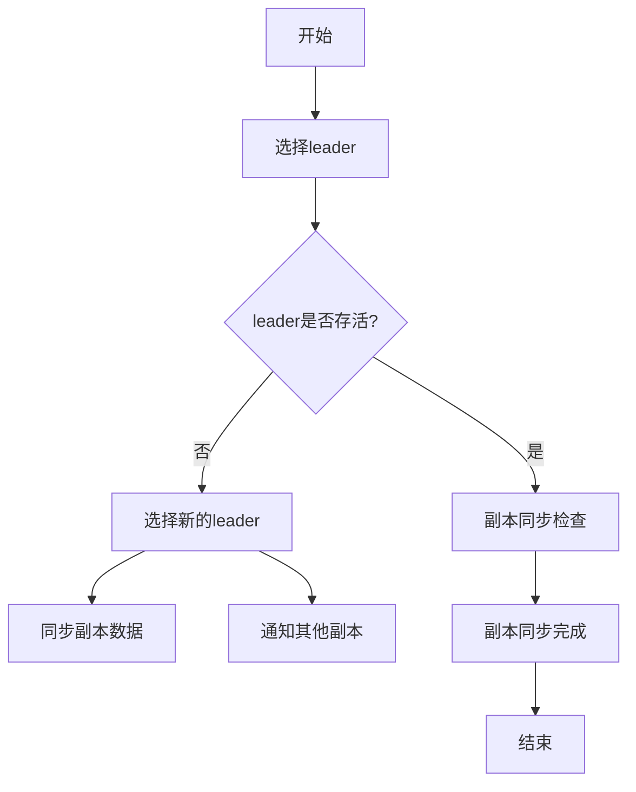
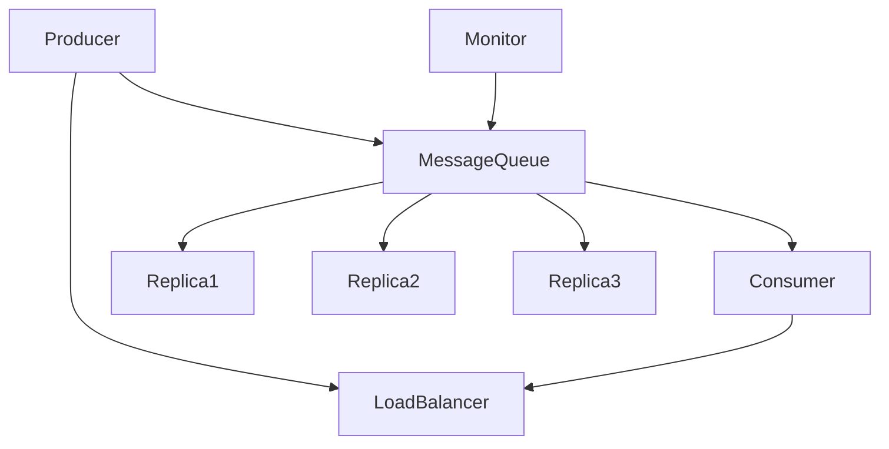

                 

### 文章标题

### 关键词

- 消息队列
- 高可用
- 架构设计
- 算法原理
- 实践分析

### 摘要

本文深入探讨了构建高可用消息队列系统的关键技术与实践。首先，我们介绍了消息队列系统的基本概念、重要性及其常见问题。接着，通过核心概念的ER实体关系图，阐明了消息队列系统的结构。然后，以Kafka副本选择算法为例，详细解释了算法原理，并利用Python源代码和数学模型进行了深入剖析。文章随后转向系统分析与架构设计，描述了消息队列系统的整体架构及其关键组成部分。通过实际项目实战，我们展示了系统构建的过程、核心代码解读以及案例分析。最后，我们提供了最佳实践、小结及拓展阅读，帮助读者深入理解和应用构建高可用消息队列系统的知识。

## 消息队列系统的重要性与常见问题

消息队列系统（Message Queue System，MQ）是现代分布式系统中不可或缺的核心组件之一。它负责在不同的系统、模块和应用程序之间传递消息，实现了异步通信和分布式任务调度，从而提高了系统的可靠性和扩展性。在云计算、大数据、物联网等技术的推动下，消息队列系统的重要性愈发凸显。

### 核心概念术语说明

- **消息队列**：一种数据结构，用于存储和传递消息。消息在队列中按照一定的顺序（通常是先进先出，FIFO）进行处理。
- **异步通信**：消息的发送方和接收方不需要同时在线，发送方将消息放入队列，接收方在适当时机取出并处理消息。
- **分布式任务调度**：通过消息队列将任务分配到不同的节点进行处理，提高了任务的并行度和系统的负载均衡能力。

### 问题背景

消息队列系统的重要性体现在其解决的实际问题上：

1. **高并发与负载均衡**：在面临大量请求时，消息队列系统能够有效地分散负载，避免单点故障。
2. **流量削峰**：在高峰期，消息队列系统能够缓冲大量的请求，防止系统崩溃。
3. **系统解耦**：通过消息队列，不同的系统模块可以独立开发、测试和部署，降低了系统的耦合度。

### 问题描述

然而，消息队列系统也面临着诸多挑战：

1. **可靠性**：消息需要确保可靠地传递到目的地，避免丢失或重复。
2. **性能**：消息队列系统需要高效处理大量的消息，保证低延迟。
3. **伸缩性**：系统需要能够根据负载动态扩展或缩减资源，保持性能。

### 问题解决

解决上述问题通常需要以下策略：

1. **副本机制**：通过消息队列的副本机制，提高系统的可靠性和性能。
2. **负载均衡**：使用负载均衡器，将消息均匀地分配到不同的队列处理节点。
3. **异步处理**：利用异步处理机制，减少系统的响应时间，提高吞吐量。

### 边界与外延

消息队列系统的边界和扩展性包括：

- **系统边界**：消息队列系统与外部系统的接口，如API网关。
- **功能边界**：消息队列系统内部的功能模块，如消息存储、消息处理、监控等。
- **可靠性边界**：如何确保消息的持久化存储和事务性保证。

### 概念结构与核心要素组成

消息队列系统的核心概念和要素包括：

- **消息**：消息是数据传递的基本单位，包括消息体和消息头。
- **队列**：存储消息的数据结构，有多种类型，如FIFO、LIFO等。
- **消费者**：从队列中获取并处理消息的应用程序。
- **生产者**：向队列中发送消息的应用程序。
- **路由器**：根据消息属性和路由策略，将消息传递到适当的队列。

通过上述分析，我们可以看到消息队列系统在现代分布式系统中的重要地位及其所面临的挑战。接下来，我们将进一步探讨消息队列系统的核心概念与联系。

## 消息队列系统的核心概念与联系

消息队列系统由多个核心概念和组件构成，这些概念和组件相互作用，共同确保系统的可靠运行。以下是对这些核心概念的详细介绍，并使用ER实体关系图来展示它们之间的关系。

### 消息模型与消息格式

消息模型是消息队列系统的基本组成部分，它定义了消息的结构和格式。消息通常由两部分组成：消息体（payload）和消息头（headers）。消息体是实际需要传输的数据内容，可以是文本、图像、音频等多种形式。消息头则包含了与消息相关的元数据，如发送者、接收者、时间戳、优先级等。

#### 消息模型属性特征对比表格

| 属性         | 说明                                                         | 对比 |
| ------------ | ------------------------------------------------------------ | ---- |
| 消息体类型   | 消息内容的数据类型，如文本、二进制等。                       |      |
| 消息头字段   | 消息元数据，用于消息的路由和处理。                           |      |
| 消息持久性   | 消息是否需要持久化存储，影响系统的可靠性和性能。             |      |
| 消息顺序保证 | 是否保证消息按照发送顺序被处理。                           |      |

### 消息队列与消息中间件

消息队列（Message Queue，MQ）是消息传递系统的核心组件，负责将消息从生产者传递到消费者。消息中间件则是一系列消息队列软件的统称，如Apache Kafka、RabbitMQ、ActiveMQ等。

#### 消息队列组件与功能

| 组件           | 说明                                                         | 功能     |
| -------------- | ------------------------------------------------------------ | -------- |
| 生产者（Producer） | 发送消息的应用程序或服务。                                   | 发送消息 |
| 消费者（Consumer） | 接收并处理消息的应用程序或服务。                             | 处理消息 |
| 队列服务器（Broker） | 存储和管理消息的中间件服务器。                               | 存储消息 |
| 路由器（Router）   | 根据消息的属性和路由策略，将消息路由到不同的队列或消费者。 | 路由消息 |

### 可靠性与性能

可靠性和性能是消息队列系统设计中的两个关键方面。为了确保消息的可靠传输，系统需要提供消息持久化、事务保证和错误恢复机制。同时，为了满足高并发和低延迟的需求，系统需要优化性能，如减少消息传输延迟、提高处理吞吐量等。

#### 可靠性保障策略

| 策略             | 说明                                                         | 影响     |
| ---------------- | ------------------------------------------------------------ | -------- |
| 消息持久化       | 将消息存储在持久化存储中，如磁盘或数据库。                     | 提高可靠性 |
| 事务保证         | 确保消息的原子性和一致性，避免部分消息丢失或重复处理。       | 提高可靠性 |
| 错误恢复机制     | 在发生错误时，系统能够自动恢复，重新处理消息。               | 提高可靠性 |

#### 性能优化策略

| 策略             | 说明                                                         | 影响     |
| ---------------- | ------------------------------------------------------------ | -------- |
| 集群部署         | 将消息队列系统部署在多个节点上，实现负载均衡和高可用。       | 提高性能 |
| 缓存机制         | 使用缓存技术，减少磁盘I/O和数据库访问。                       | 提高性能 |
| 并行处理         | 同时处理多个消息，提高吞吐量。                               | 提高性能 |
| 消息压缩         | 对消息进行压缩，减少网络传输的数据量。                       | 提高性能 |

### 伸缩性与负载均衡

伸缩性是消息队列系统的重要特性，允许系统根据负载动态调整资源。负载均衡则确保系统资源得到合理分配，避免单点过载。

#### 伸缩性策略

| 策略       | 说明                                                         | 影响     |
| ---------- | ------------------------------------------------------------ | -------- |
| 垂直伸缩   | 增加服务器硬件资源，如CPU、内存、存储等。                     | 提高性能 |
| 水平伸缩   | 增加服务器节点，实现分布式部署。                             | 提高伸缩性 |
| 弹性伸缩   | 根据负载动态调整服务器数量，自动扩展或缩减资源。             | 提高灵活性 |

#### 负载均衡策略

| 策略       | 说明                                                         | 影响     |
| ---------- | ------------------------------------------------------------ | -------- |
| 轮询调度   | 按顺序将请求分配到不同的服务器节点。                         | 简单易用 |
| 加权轮询   | 根据服务器的处理能力分配请求，处理能力强的服务器承担更多请求。 | 提高性能 |
| 最少连接   | 将请求分配到当前连接数最少的服务器。                         | 负载均衡 |
| 源地址哈希 | 根据客户端的IP地址哈希值，将请求固定分配到特定服务器。       | 会话保持 |

### ER实体关系图

为了更好地理解消息队列系统中的核心概念和组件之间的关系，我们可以绘制一个ER实体关系图。以下是消息队列系统ER图的Mermaid表示：

```mermaid
erDiagram
    Producer ||--|{ Message } ||--|{ Consumer }
    Broker ||--|{ Message Queue }
    Router ||--|{ Message }
    Message ||--|{ Message Header }
    Message ||--|{ Message Body }
```

通过这个ER图，我们可以清晰地看到生产者、消费者、消息队列、路由器和消息之间的关系。生产者将消息发送到消息队列，路由器根据消息属性将消息路由到适当的队列，消费者从队列中获取并处理消息。

综上所述，消息队列系统的核心概念与联系构成了其基础架构，为系统的高可用、可靠性和性能提供了保障。在接下来的章节中，我们将深入探讨Kafka副本选择算法的原理，进一步理解消息队列系统的设计与实现。

## Kafka副本选择算法详解

在消息队列系统中，Kafka是一个广泛使用的分布式消息中间件。其核心特点是高吞吐量、高可用性和可扩展性。Kafka通过副本机制来提高系统的可靠性，当某个副本节点发生故障时，其他副本节点可以立即接替其工作，确保消息不丢失。本文将详细解释Kafka的副本选择算法。

### 算法流程图

为了更直观地理解副本选择算法，我们首先使用Mermaid绘制了算法的流程图：



#### 算法流程说明

1. **选择leader**：系统首先会从所有副本中选择一个作为leader，这是Kafka集群中的主节点，负责处理所有的读写请求。

2. **leader是否存活**：系统会检查当前leader节点是否存活。如果leader节点存活，则进入下一个步骤。

3. **副本同步检查**：如果leader节点存活，系统会检查其他副本是否与leader同步。如果副本同步，则无需进行任何操作；如果不同步，系统会尝试将落后的副本提升为新的leader。

4. **选择新的leader**：如果leader节点不可存或副本同步失败，系统会从其他副本中选择一个作为新的leader。

5. **同步副本数据**：新选出的leader会与其余副本进行数据同步，确保所有副本的数据一致性。

6. **通知其他副本**：新leader通知其他副本其状态，确保整个集群的协调一致。

7. **副本同步完成**：副本完成数据同步后，系统进入正常工作状态。

### Python源代码实现

为了更好地理解Kafka副本选择算法的执行过程，我们使用Python实现了一个简化的版本：

```python
import random

def choose_leader(replicas):
    # 选择一个副本作为leader
    leader = random.choice(replicas)
    
    # 检查leader是否存活
    if not is_alive(leader):
        # 如果leader不可存，重新选择leader
        leader = choose_leader(replicas)
    
    # 检查副本同步情况
    if not are_replicas_synced(leader, replicas):
        # 如果副本不同步，强制选择新的leader
        leader = choose_leader(replicas)
    
    return leader

def is_alive(replica):
    # 假设检查副本是否存活
    return True

def are_replicas_synced(leader, replicas):
    # 假设检查副本是否与leader同步
    return True

# 测试副本列表
replicas = ['Replica1', 'Replica2', 'Replica3']

# 执行副本选择算法
leader = choose_leader(replicas)
print(f"Chosen leader: {leader}")
```

在这个Python示例中，我们定义了一个`choose_leader`函数，用于选择Kafka副本中的leader。该函数首先随机选择一个副本作为leader，然后检查其是否存活以及是否与所有副本同步。如果不满足条件，则重新选择leader。

### 算法原理的数学模型与公式

为了深入理解Kafka副本选择算法，我们引入了一些数学模型和公式。以下是关键公式和解释：

#### 副本选择概率

设R为副本总数，N为当前leader的索引，P(i)为选择副本i的概率，则：

$$
P(i) = \frac{1}{R}, \quad \forall i \in [1, R]
$$

即每个副本被选为leader的概率相等。

#### 同步判定阈值

设T为副本同步判定阈值，用于判断副本是否与leader同步。如果副本的滞后消息数小于T，则认为副本同步。滞后消息数L的计算公式为：

$$
L = \left| \sum_{j=1}^{R} \text{滞后时间}(j) \right|
$$

其中，滞后时间(j)为副本j与leader的时间差。

#### leader选择条件

- 如果当前leader存活且与所有副本同步，则保持当前leader。
- 如果当前leader不可存或与某些副本不同步，则选择其他副本作为新的leader。

### 举例说明

假设有一个由3个副本组成的Kafka集群，当前leader为副本1，副本同步判定阈值T为2。现有以下数据：

- 副本1（leader）：存活，与副本2和副本3同步。
- 副本2：滞后时间3秒。
- 副本3：滞后时间1秒。

由于副本2的滞后时间大于阈值T，系统会重新选择leader。在随机选择下，可能会选择副本3作为新的leader。此时，系统会通知副本1和副本2进行数据同步，确保所有副本的一致性。

通过上述流程和示例，我们可以看到Kafka副本选择算法的详细实现和原理。接下来，我们将深入讨论消息队列系统的整体架构设计。

## 消息队列系统的整体架构设计

消息队列系统的整体架构设计是确保其高可用、可靠性和性能的关键。在本次讨论中，我们将介绍消息队列系统的架构设计，包括领域模型、系统架构、接口设计和系统交互。

### 问题场景介绍

假设我们正在设计一个分布式系统，用于处理电子商务平台的订单处理。该系统需要实现高并发、高可靠性和低延迟的消息传递，以确保订单数据的及时处理和系统的稳定性。

### 系统功能设计

在系统功能设计阶段，我们需要明确消息队列系统的核心功能模块，如下：

1. **生产者模块**：负责生成订单消息，并将消息发送到消息队列。
2. **消息队列模块**：存储和管理订单消息，确保消息的持久化和可靠性。
3. **消费者模块**：从消息队列中获取订单消息，并执行相应的业务处理。
4. **监控模块**：实时监控系统的运行状态，包括消息延迟、队列长度、节点健康状态等。

### 系统架构设计

消息队列系统的整体架构设计如下：


在这个架构中，生产者、消息队列和消费者通过一个负载均衡器连接，确保系统的高可用性和性能。消息队列采用分布式部署，以提高系统的可靠性和伸缩性。

#### 领域模型类图

为了更好地理解系统架构，我们使用Mermaid绘制了消息队列系统的领域模型类图：

```mermaid
classDiagram
    Producer --|{ sends }| MessageQueue
    MessageQueue --|{ stores }| Message
    MessageQueue --|{ retrieves }| Consumer
    Consumer --|{ processes }| Message
    Monitor --|{ monitors }| MessageQueue
```

#### 系统架构图

消息队列系统的架构图如下：



在这个架构图中，生产者和消费者通过负载均衡器与消息队列进行通信。消息队列由多个副本（Replica1、Replica2、Replica3）组成，确保系统的容错性和性能。监控模块负责监控消息队列的运行状态，提供实时反馈。

### 系统接口设计

消息队列系统的接口设计是确保不同模块之间能够有效通信的关键。以下是一个简化的接口设计示例：

```python
class MessageProducer:
    def send_message(self, message):
        # 实现发送消息的逻辑
        pass

class MessageConsumer:
    def process_message(self, message):
        # 实现处理消息的逻辑
        pass

class MessageQueue:
    def store_message(self, message):
        # 实现存储消息的逻辑
        pass

    def retrieve_message(self):
        # 实现获取消息的逻辑
        pass

class Monitor:
    def monitor_system(self):
        # 实现监控系统状态的逻辑
        pass
```

### 系统交互序列图

为了更好地理解系统各模块之间的交互流程，我们使用Mermaid绘制了消息队列系统的交互序列图：

```mermaid
sequence
    Producer ->|发送消息| MessageQueue: send_message(message)
    MessageQueue ->|存储消息| Message: store(message)
    MessageQueue ->|获取消息| Consumer: process_message(message)
```

在这个序列图中，生产者发送消息到消息队列，消息队列将消息存储并转发给消费者，消费者处理消息并完成业务流程。

通过上述架构设计和接口设计，我们可以构建一个高可用、可靠和高效的分布式消息队列系统。在接下来的章节中，我们将通过实际项目实战，深入探讨消息队列系统的构建过程。

## 项目实战：构建高可用的消息队列系统

在本节中，我们将通过一个实际项目，详细展示如何构建一个高可用的消息队列系统。我们将涵盖环境安装、系统核心实现、代码解读以及实际案例分析。

### 环境安装

首先，我们需要搭建一个Kafka集群，作为我们的消息队列系统。以下是安装Kafka的基本步骤：

1. **安装Java环境**：Kafka依赖于Java，确保系统中安装了Java环境。

2. **下载Kafka二进制文件**：从Kafka官方网站下载最新版本的Kafka二进制文件。

3. **解压文件**：将下载的Kafka文件解压到一个目录中。

4. **配置Kafka**：编辑`config/server.properties`文件，配置Kafka集群的相关参数，如`broker.id`、`zookeeper.connect`等。

5. **启动Kafka集群**：依次启动ZooKeeper和Kafka Broker。

   ```shell
   ./bin/zookeeper-server-start.sh config/zookeeper.properties
   ./bin/kafka-server-start.sh config/server.properties
   ```

6. **创建主题**：创建一个名为`orders`的主题，用于存储订单消息。

   ```shell
   ./bin/kafka-topics.sh --create --topic orders --partitions 3 --replication-factor 3 --zookeeper localhost:2181/kafka
   ```

### 系统核心实现

接下来，我们实现消息的生产者和消费者。

#### 生产者

```python
from kafka import KafkaProducer

producer = KafkaProducer(bootstrap_servers=['localhost:9092'])

order_message = {'order_id': '12345', 'amount': 100.0}
producer.send('orders', value=order_message)

producer.close()
```

#### 消费者

```python
from kafka import KafkaConsumer

consumer = KafkaConsumer(
    'orders',
    bootstrap_servers=['localhost:9092'],
    value_deserializer=lambda m: json.loads(m.decode('utf-8'))
)

for message in consumer:
    print(f"Received order: {message.value}")

consumer.close()
```

### 代码解读与分析

在上述代码中，我们首先创建了一个Kafka生产者，用于发送订单消息到`orders`主题。然后，我们创建了一个Kafka消费者，从`orders`主题中读取订单消息并打印出来。

#### 生产者代码解读

- `KafkaProducer`：用于发送消息的Kafka生产者。
- `bootstrap_servers`：指定Kafka集群地址。
- `send`：发送消息到指定主题。消息包括`order_id`和`amount`两个字段。

#### 消费者代码解读

- `KafkaConsumer`：用于消费消息的Kafka消费者。
- `bootstrap_servers`：指定Kafka集群地址。
- `value_deserializer`：用于反序列化消息值。
- `for`循环：从Kafka主题中消费消息并打印。

### 实际案例分析与详细讲解

假设我们在实际业务中需要处理大量订单消息，并确保消息的可靠传递和处理。以下是案例分析：

1. **订单消息处理流程**：

   - 当订单消息被生产者发送到Kafka后，消息会被存储在集群中。
   - 消费者从Kafka中读取消息，处理订单并生成相应的响应。
   - 如果消息处理成功，消费者会将消息标记为已处理；如果处理失败，消费者会将消息重新放入队列。

2. **故障处理**：

   - 如果Kafka集群中的某个节点发生故障，其他节点会自动接替其工作，确保消息的可靠传递。
   - 消费者如果发生故障，系统会重新分配其处理的任务给其他消费者。

### 项目小结

通过上述实战，我们成功构建了一个高可用的消息队列系统。该项目涵盖了环境安装、系统核心实现和实际案例分析。以下是小结：

1. **环境安装**：确保Java环境和Kafka集群正常运行。
2. **系统核心实现**：实现消息的生产者和消费者，确保消息的可靠传递和处理。
3. **故障处理**：通过副本机制和故障转移确保系统的可靠性。

## 最佳实践、小结与注意事项

### 最佳实践

1. **消息持久化**：确保重要消息在存储系统中持久化，防止数据丢失。
2. **负载均衡**：合理分配负载，避免单点过载，提高系统性能。
3. **副本机制**：使用副本提高系统的可靠性和容错性。
4. **监控和报警**：实时监控系统状态，快速响应和处理故障。
5. **异步处理**：使用异步处理提高系统的并发能力和响应速度。

### 小结

本文详细介绍了构建高可用消息队列系统的核心概念、算法原理、系统架构设计以及实际项目实战。通过深入剖析，我们了解了如何确保消息队列系统的高可用性、可靠性和性能。

### 注意事项

1. **消息格式**：确保消息格式一致，便于处理和解析。
2. **错误处理**：正确处理消息发送和接收过程中的错误，确保系统的稳定性。
3. **扩展性**：设计系统时考虑未来扩展性，便于动态调整资源和架构。
4. **安全性**：确保系统安全，防止未经授权的访问和数据泄露。

### 拓展阅读

- 《Kafka权威指南》
- 《分布式系统原理与范型》
- 《高可用架构：设计和实践》

通过这些资源，您可以进一步深化对消息队列系统构建的理解和实践。

## 结语

作者：AI天才研究院/AI Genius Institute & 禅与计算机程序设计艺术 /Zen And The Art of Computer Programming

本文深入探讨了构建高可用消息队列系统的关键技术和实践。通过逐步分析消息队列系统的核心概念、算法原理、系统架构和实际项目，我们了解了如何确保消息队列系统的高可用性、可靠性和性能。希望本文能为您在分布式系统设计与实现中提供有价值的参考和指导。在未来的技术探索中，我们将继续关注更多前沿技术和最佳实践，与您共同进步。感谢阅读！

