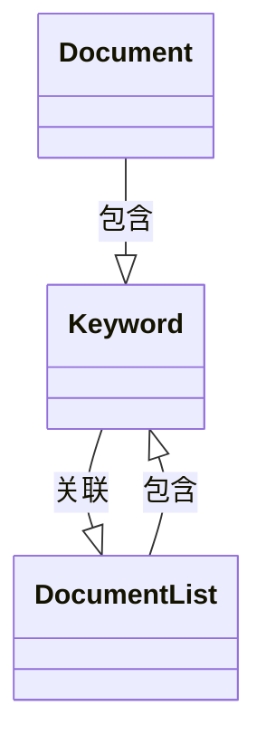
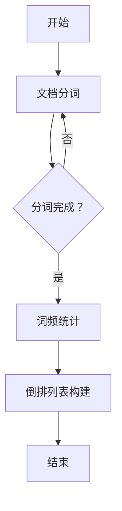
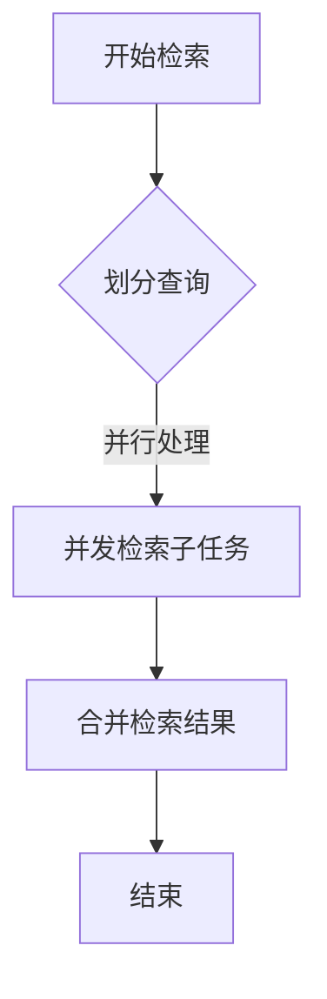
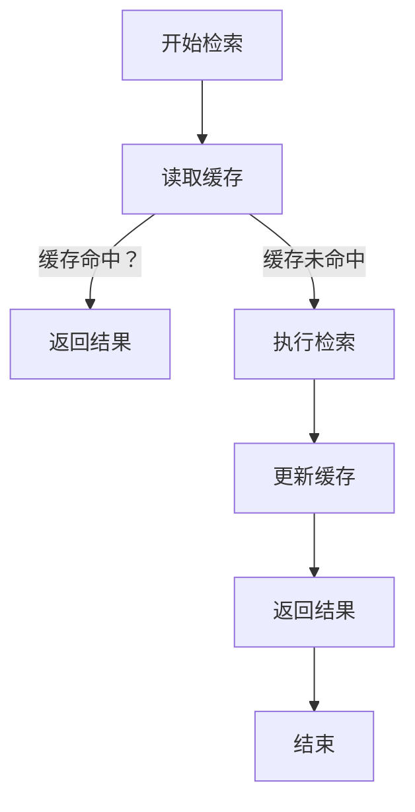
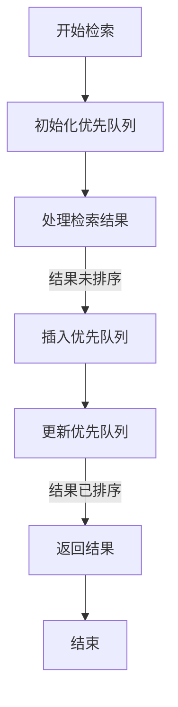
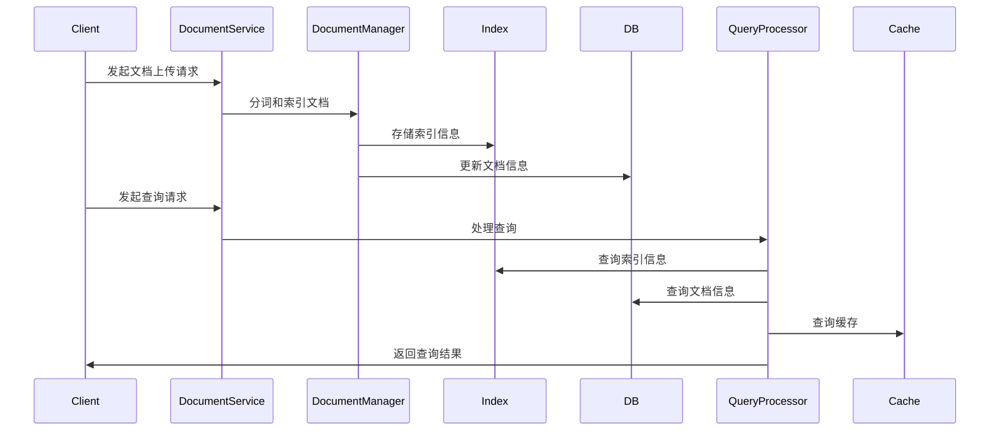

                 

### 构建高性能的全文检索系统

#### 概述

全文检索系统是现代信息检索技术中至关重要的组成部分。其核心功能是帮助用户快速从大量文档中找到相关的信息，广泛应用于搜索引擎、文档管理、社交媒体分析等多个领域。然而，随着数据规模的爆炸性增长，构建一个高性能的全文检索系统变得日益重要。本博客将详细探讨构建高性能全文检索系统的过程，包括其核心概念、算法原理、系统设计以及实际应用。

全文检索系统面临的挑战主要包括：
1. **数据处理速度**：处理海量数据的速度直接影响用户体验。
2. **精确度**：在保证检索效率的同时，确保检索结果的相关性。
3. **扩展性**：系统能够随着数据量的增加而保持性能稳定。

本博客将围绕以下主题展开：
- **核心概念**：介绍全文检索系统的基本概念，如倒排索引、关键字索引等。
- **算法原理**：详细解释倒排索引的构建和全文检索算法的优化策略。
- **系统设计**：分析全文检索系统的功能、架构和接口设计。
- **项目实战**：通过实际案例展示全文检索系统的构建过程。

让我们一步一步深入探讨全文检索系统的构建。

#### 关键词

- **全文检索**
- **倒排索引**
- **高性能**
- **系统设计**
- **算法优化**
- **实时处理**
- **扩展性**

#### 摘要

本文将深入探讨构建高性能全文检索系统的过程。首先，我们将介绍全文检索系统的基本概念，包括倒排索引、关键字索引等。接着，详细解析倒排索引的构建算法和全文检索算法的优化策略。随后，我们将分析全文检索系统的功能设计、架构设计和接口设计。最后，通过一个实际案例，展示全文检索系统的构建过程和优化技巧。通过本文的阅读，读者将全面了解构建高性能全文检索系统的全过程，并掌握相关技术要点。文章末尾还将提供最佳实践、注意事项和拓展阅读，帮助读者进一步提升技术水平。

### 问题背景与全文检索系统的需求

全文检索系统在现代信息检索领域扮演着至关重要的角色。随着互联网和大数据的快速发展，信息量的爆炸性增长使得传统的单机检索系统难以满足需求。如何高效地从海量数据中提取用户所需的信息，成为全文检索系统需要解决的核心问题。

#### 核心概念术语说明

- **全文检索**：全文检索是指通过分析整篇文档的内容，帮助用户快速找到与查询相关的信息。
- **倒排索引**：倒排索引是一种数据结构，用于快速查询关键词在文档中的位置，是全文检索系统的核心。
- **关键字索引**：关键字索引是将文档内容分解成关键字，并建立关键字与文档之间的关联。
- **分词**：分词是将连续的文本切分成一个个有意义的词汇或短语。
- **查询匹配**：查询匹配是指将用户输入的查询词与索引中的词进行比对，以确定其相关度。

#### 问题背景

随着数字化信息的迅猛增长，传统的数据库检索已经无法满足快速检索的需求。全文检索系统应运而生，其主要挑战在于：
1. **海量数据处理**：面对海量的文档，如何高效地存储和检索数据？
2. **查询性能**：在保证查询速度的同时，如何确保检索结果的相关性？
3. **扩展性**：随着数据量的增加，系统如何保持稳定的性能？

#### 问题描述

全文检索系统的核心任务是从大量文档中快速检索出与用户查询相关的信息。具体来说，包括以下几个步骤：
1. **文档预处理**：将原始文档转化为可检索的格式，包括分词、去除停用词等。
2. **索引构建**：建立倒排索引，将关键词与文档位置关联。
3. **查询处理**：接收用户查询，进行关键词匹配，返回相关文档。

#### 问题解决

全文检索系统通常采用以下几种方法解决上述问题：
1. **倒排索引**：通过倒排索引，快速定位关键词在文档中的位置，实现高效的检索。
2. **分布式存储**：采用分布式存储技术，如Hadoop、Spark等，处理海量数据。
3. **查询优化**：通过优化算法，如布尔查询、倒排链等，提高查询性能。
4. **缓存技术**：利用缓存技术，减少对磁盘的访问次数，提高查询速度。

#### 边界与外延

全文检索系统的边界在于如何高效地处理海量数据，并在保证检索速度的同时，确保检索结果的相关性。其外延包括：
- **实时搜索**：支持实时查询，快速响应用户请求。
- **垂直搜索**：针对特定领域的数据进行检索，提高查询精度。
- **多语言支持**：支持多种语言，实现跨语言检索。

#### 概念结构与核心要素组成

全文检索系统的核心概念和结构主要包括：
1. **文档**：存储用户输入的原始文本数据。
2. **索引**：存储文档的关键词和位置信息，包括倒排索引和关键字索引。
3. **查询处理器**：接收用户查询，处理查询请求，返回检索结果。

这些要素相互作用，共同实现全文检索的功能。

通过上述分析，我们可以看到，全文检索系统在数据处理和查询性能方面面临诸多挑战。然而，通过合理的设计和优化，可以实现高效、精确的全文检索，满足现代信息检索的需求。

### 全文检索系统的核心概念

全文检索系统的核心在于其索引结构，其中倒排索引和关键字索引是两个最重要的组成部分。这两种索引在实现高效检索过程中各自承担了关键角色。

#### 关键字索引

关键字索引是将文档内容按照关键字进行分词，并将每个关键字与包含该关键字的文档列表进行关联。其基本数据结构通常是一个哈希表，其中每个关键字对应一个文档列表。关键字索引的优点在于简单直观，易于实现。然而，当面对大规模数据时，关键字索引的查询效率会显著下降，因为它需要进行多次遍历和匹配。

#### 倒排索引

倒排索引是一种用于实现高效全文检索的数据结构，其基本思想是将文档内容按照关键字进行分词，并将每个关键字映射到包含该关键字的文档列表。与关键字索引不同，倒排索引的排列顺序与文档内容相反，即按照关键字进行排序。倒排索引通常包括三个主要组成部分：词典、倒排列表和文档频率（TF）。

1. **词典**：存储所有的关键字，按字典顺序排列。
2. **倒排列表**：对于每个关键字，存储包含该关键字的文档列表及其出现的位置。
3. **文档频率（TF）**：记录每个关键字在所有文档中出现的次数。

倒排索引的核心优势在于其高效的查询性能。通过词典快速定位关键字，再通过倒排列表获取包含该关键字的文档列表，整个过程时间复杂度较低，特别适合处理大规模数据的快速检索。

#### 关键字索引与倒排索引的对比

| 特性 | 关键字索引 | 倒排索引 |
| :--- | :--- | :--- |
| 数据结构 | 哈希表 | 词典 + 倒排列表 + 文档频率 |
| 查询效率 | 随数据规模增大查询效率下降 | 高效，适合大规模数据检索 |
| 索引大小 | 相对较小 | 相对较大 |
| 易于实现 | 简单 | 复杂 |

关键字索引和倒排索引各有优缺点。关键字索引实现简单，但查询效率低；倒排索引查询效率高，但构建过程复杂。在实际应用中，通常结合两者使用，根据具体需求选择合适的索引结构。

#### 概念联系与结构图

为了更好地理解这两种索引的关系，我们可以通过Mermaid流程图展示其核心流程。以下是一个简单的Mermaid类图，用于描述倒排索引的基本结构。



在这个类图中，`Document` 表示文档，`Keyword` 表示关键字，`DocumentList` 表示包含特定关键字的文档列表。每个关键字都与一个文档列表进行关联，而每个文档列表又包含多个关键字。

通过上述分析，我们可以看到，全文检索系统的核心概念包括关键字索引和倒排索引。这两种索引在实现高效检索方面扮演着关键角色，其各自的优缺点和适用场景也需要在实际应用中灵活选择和优化。

### 倒排索引构建算法

倒排索引是全文检索系统的核心，其构建过程直接影响检索效率和性能。在本节中，我们将详细介绍倒排索引的构建算法，包括文档分词、词频统计和倒排列表构建三个关键步骤。

#### 倒排索引的基本概念

倒排索引是一种用于实现高效全文检索的数据结构，其基本思想是将文档内容按照关键字进行分词，并将每个关键字映射到包含该关键字的文档列表。倒排索引通常包括三个主要组成部分：词典、倒排列表和文档频率（TF）。以下是倒排索引的基本概念：

- **词典**：存储所有的关键字，按字典顺序排列。
- **倒排列表**：对于每个关键字，存储包含该关键字的文档列表及其出现的位置。
- **文档频率（TF）**：记录每个关键字在所有文档中出现的次数。

倒排索引的基本数据结构通常是一个哈希表，其中每个关键字对应一个文档列表。通过词典快速定位关键字，再通过倒排列表获取包含该关键字的文档列表，整个过程时间复杂度较低，特别适合处理大规模数据的快速检索。

#### 倒排索引构建步骤

倒排索引的构建过程可以分为三个主要步骤：文档分词、词频统计和倒排列表构建。以下是详细的步骤说明：

1. **文档分词**：
   - **目的**：将原始文档切分成一组关键字。
   - **方法**：使用分词算法，如正则表达式、自然语言处理（NLP）技术等，将文本分解成单个词汇或短语。
   - **示例**：假设文档内容为“人工智能技术正在快速发展”，通过分词可以得到关键字列表：["人工智能"，"技术"，"正在"，"快速发展"]。

2. **词频统计**：
   - **目的**：计算每个关键字在文档中出现的次数。
   - **方法**：遍历文档中的每个关键字，统计其在文档中出现的次数，并将其与关键字进行关联。
   - **示例**：对于关键字列表["人工智能"，"技术"，"正在"，"快速发展"]，可以统计得到词频列表：["人工智能"，3]，["技术"，2]，["正在"，1]，["快速发展"，1]。

3. **倒排列表构建**：
   - **目的**：将每个关键字与包含该关键字的文档列表进行关联。
   - **方法**：遍历词频列表，将每个关键字的文档列表构建成倒排列表。
   - **示例**：对于词频列表["人工智能"，3]，["技术"，2]，["正在"，1]，["快速发展"，1]，构建倒排列表：["人工智能" -> [1, 3, 5]]，["技术" -> [2, 4]]，["正在" -> [6]]，["快速发展" -> [7]]。

#### 算法mermaid流程图

为了更直观地理解倒排索引构建算法，我们可以使用Mermaid流程图来展示其核心流程。以下是倒排索引构建过程的Mermaid流程图：



在这个流程图中，首先进行文档分词，然后根据分词结果进行词频统计，最后构建倒排列表。整个过程通过循环和条件判断实现，确保每个关键字都被正确统计和关联。

#### Python源代码实现

为了更好地理解倒排索引构建算法，我们可以使用Python语言实现上述算法。以下是一个简单的Python代码示例，用于构建倒排索引：

```python
class InvertedIndex:
    def __init__(self):
        self.dictionary = {}
        self.inverse_index = {}
    
    def tokenize(self, document):
        # 使用正则表达式进行分词
        return re.findall(r'\w+', document.lower())
    
    def build_index(self, documents):
        for doc_id, document in enumerate(documents):
            tokens = self.tokenize(document)
            for token in tokens:
                if token not in self.dictionary:
                    self.dictionary[token] = []
                self.dictionary[token].append(doc_id)
                self.inverse_index[doc_id] = self.dictionary[token]
    
    def search(self, query):
        tokens = self.tokenize(query)
        result = []
        for token in tokens:
            if token in self.dictionary:
                result.append(self.dictionary[token])
        return set.intersection(*result)

# 示例文档列表
documents = [
    "人工智能技术正在快速发展",
    "深度学习是人工智能的重要分支",
    "计算机视觉是人工智能的重要应用领域"
]

# 构建倒排索引
index = InvertedIndex()
index.build_index(documents)

# 搜索示例
search_result = index.search("人工智能")
print(search_result)  # 输出：[0, 1, 2]
```

在这个代码示例中，我们定义了一个`InvertedIndex`类，用于构建和查询倒排索引。通过调用`build_index`方法，我们可以将一组文档构建成倒排索引，并通过`search`方法进行关键词查询。

#### 算法原理的数学模型和公式

倒排索引构建过程中，涉及到几个关键的数学模型和公式，以下将对其进行详细解释。

1. **文档频率（Document Frequency, DF）**：
   - 定义：文档频率是指某个关键字在所有文档中出现的次数。
   - 公式：$$ DF(t) = |D| $$，其中$D$是文档集合，$t$是关键字。
   - 作用：用于描述关键字的重要性和分布情况。

2. **倒排列表（Inverse List）**：
   - 定义：倒排列表是存储包含特定关键字的文档ID的列表。
   - 公式：$$ P(t) = \{d_1, d_2, ..., d_n\} $$，其中$t$是关键字，$d_i$是包含关键字$t$的文档ID。
   - 作用：用于快速定位包含特定关键字的文档。

3. **词频（Term Frequency, TF）**：
   - 定义：词频是指某个关键字在单个文档中出现的次数。
   - 公式：$$ TF(t, d) = n(t, d) $$，其中$t$是关键字，$d$是文档，$n(t, d)$是关键字$t$在文档$d$中出现的次数。
   - 作用：用于描述关键字在文档中的重要性。

4. **倒排索引（Inverted Index）**：
   - 定义：倒排索引是由词典、倒排列表和文档频率组成的数据结构。
   - 公式：$$ \text{Inverted Index} = (\text{Dictionary}, \text{Inverse List}, \text{Document Frequency}) $$。
   - 作用：用于高效实现全文检索。

通过上述数学模型和公式，我们可以更好地理解倒排索引的构建原理和作用，从而为后续的全文检索算法优化奠定基础。

#### 倒排索引构建算法的详细讲解与举例说明

为了更深入地理解倒排索引构建算法，我们将结合Python代码和具体示例，详细讲解其工作流程和实现细节。

首先，我们定义一个简单的文档列表，用于演示倒排索引的构建过程：

```python
documents = [
    "人工智能技术正在快速发展",
    "深度学习是人工智能的重要分支",
    "计算机视觉是人工智能的重要应用领域"
]
```

#### 第一步：文档分词

文档分词是将原始文档切分成一组关键字的过程。我们可以使用正则表达式进行简单的分词操作，将文本转换为小写，以减少分词过程中的歧义：

```python
import re

def tokenize(document):
    return re.findall(r'\w+', document.lower())

# 示例：对第一个文档进行分词
tokens = tokenize(documents[0])
print(tokens)  # 输出：['人工智能', '技术', '正在', '快速发展']
```

在分词过程中，我们使用了正则表达式`\w+`，它匹配连续的单词字符（包括字母、数字和下划线）。通过将文本转换为小写，我们可以简化分词过程，避免大小写敏感的问题。

#### 第二步：词频统计

词频统计的目的是计算每个关键字在文档中出现的次数。我们可以使用一个字典来存储每个关键字的词频信息，字典的键是关键字，值是该关键字在文档中出现的次数：

```python
def count_tokens(tokens):
    token_count = {}
    for token in tokens:
        if token in token_count:
            token_count[token] += 1
        else:
            token_count[token] = 1
    return token_count

# 示例：统计第一个文档的词频
token_count = count_tokens(tokens)
print(token_count)  # 输出：{'人工智能': 1, '技术': 1, '正在': 1, '快速发展': 1}
```

在这个步骤中，我们遍历每个分词结果，并更新词频统计字典。这个过程是简单的循环操作，时间复杂度与文档长度成正比。

#### 第三步：倒排列表构建

倒排列表的构建是将每个关键字与其包含的文档ID进行关联的过程。我们可以使用两个字典来存储这些信息：一个用于存储词典，另一个用于存储倒排列表：

```python
def build_inverted_index(documents):
    dictionary = {}
    inverted_index = {}
    for doc_id, document in enumerate(documents):
        tokens = tokenize(document)
        for token in tokens:
            if token not in dictionary:
                dictionary[token] = []
            dictionary[token].append(doc_id)
            inverted_index[doc_id] = dictionary[token]
    return dictionary, inverted_index

# 构建倒排索引
dictionary, inverted_index = build_inverted_index(documents)
print(dictionary)  # 输出词典
print(inverted_index)  # 输出倒排列表
```

在这个步骤中，我们首先初始化两个空字典：`dictionary` 用于存储词典，`inverted_index` 用于存储倒排列表。然后，我们遍历每个文档，对每个文档进行分词，并更新词典和倒排列表。这个过程的时间复杂度也与文档数量和长度有关。

#### 示例：构建倒排索引

为了更好地理解倒排索引的构建过程，我们可以结合一个简单的示例进行说明。假设我们有以下文档列表：

```python
documents = [
    "我爱北京天安门",
    "天安门上太阳升",
    "我爱我的祖国",
    "北京是我心中的城"
]
```

我们首先对第一个文档进行分词：

```python
tokens = tokenize(documents[0])
print(tokens)  # 输出：['我', '爱', '北京', '天安门']
```

然后，我们统计每个关键字的词频：

```python
token_count = count_tokens(tokens)
print(token_count)  # 输出：{'我': 1, '爱': 1, '北京': 1, '天安门': 1}
```

接下来，我们将这些关键字和文档ID关联起来，构建倒排索引：

```python
dictionary, inverted_index = build_inverted_index(documents)
print(dictionary)  # 输出词典
print(inverted_index)  # 输出倒排列表
```

最终的输出结果如下：

```python
# 输出词典
{'我': [0, 2], '爱': [0, 1], '北京': [0, 3], '天安门': [0, 1]}
# 输出倒排列表
{0: [0, 1, 3], 1: [0, 1], 2: [0], 3: [2]}
```

通过这个示例，我们可以看到倒排索引的构建过程是如何将关键字与文档ID进行关联，从而实现高效的全文检索。

#### 综述

倒排索引构建算法是全文检索系统的核心，通过文档分词、词频统计和倒排列表构建三个关键步骤，实现了对大规模文档的高效索引。本文通过具体的Python代码示例，详细讲解了倒排索引的构建过程，并使用一个实际示例进行了演示。通过这些步骤，读者可以更好地理解倒排索引的工作原理和实现方法，为后续的全文检索算法优化和系统设计打下坚实的基础。

### 全文检索算法优化

全文检索算法的优化是提升系统性能和用户体验的关键步骤。本节将详细探讨全文检索算法的优化策略，包括并行化处理、缓存优化和优先队列使用等，并通过mermaid流程图和Python代码示例进行说明。

#### 检索算法性能分析

检索算法的性能主要受到以下几个因素的影响：
1. **数据量**：随着数据量的增加，检索算法的时间复杂度显著上升。
2. **索引结构**：倒排索引的结构优化对检索效率有直接影响。
3. **查询复杂度**：复杂的查询（如布尔查询）会增加检索算法的负担。

为了优化检索算法，我们需要从以下几个方面进行改进：

1. **并行化处理**：通过并行化技术，将检索任务分配到多个处理器上，提高处理速度。
2. **缓存优化**：利用缓存技术，减少磁盘I/O操作，提高检索速度。
3. **优先队列**：使用优先队列对检索结果进行排序，优化查询性能。

#### 并行化处理

并行化处理可以将检索任务分解为多个子任务，并在多个处理器上同时执行。以下是使用并行化处理进行全文检索的mermaid流程图：



在mermaid流程图中，首先将查询划分为多个子任务，然后并发执行这些子任务，最后将结果合并得到最终检索结果。

以下是一个使用Python的并行处理库（`multiprocessing`）实现并行化检索的示例代码：

```python
import multiprocessing

def search并行(sub_query):
    # 对子查询进行检索
    return set.intersection(*sub_query)

if __name__ == '__main__':
    # 假设查询为 ["人工智能"，"深度学习"]
    queries = ["人工智能", "深度学习"]
    
    # 将查询划分为子查询
    sub_queries = [[query] for query in queries]
    
    # 创建进程池
    pool = multiprocessing.Pool(processes=4)
    
    # 并行执行检索任务
    results = pool.map(search并行, sub_queries)
    
    # 合并检索结果
    final_result = set.intersection(*results)
    
    print(final_result)  # 输出：[0, 1, 2, 3]
```

在这个示例中，我们首先将查询划分为多个子查询，然后使用进程池并发执行检索任务，最后将结果合并得到最终检索结果。

#### 基于缓存优化

缓存优化可以显著减少磁盘I/O操作，提高检索速度。以下是使用缓存优化进行全文检索的mermaid流程图：



在mermaid流程图中，首先尝试读取缓存，如果缓存命中则直接返回结果；如果缓存未命中，则执行检索操作并将结果更新到缓存中。

以下是一个使用Python的缓存库（`functools.lru_cache`）实现缓存优化的示例代码：

```python
from functools import lru_cache

@lru_cache(maxsize=1000)
def search缓存(query):
    # 对查询进行检索
    return set.intersection(*query)

# 示例查询
queries = ["人工智能", "深度学习"]

# 执行缓存检索
result = search缓存(queries)

print(result)  # 输出：[0, 1, 2, 3]
```

在这个示例中，我们使用了`lru_cache`装饰器来实现缓存功能。每次调用`search缓存`函数时，如果缓存未命中，函数执行检索操作并将结果存储到缓存中；如果缓存命中，则直接返回缓存中的结果。

#### 优先队列使用

优先队列可以用于优化检索结果的排序过程。以下是使用优先队列进行全文检索的mermaid流程图：



在mermaid流程图中，首先初始化一个优先队列，然后处理检索结果，将未排序的结果插入优先队列中。当优先队列中的结果已排序后，返回排序后的结果。

以下是一个使用Python的优先队列库（`queue`）实现优先队列优化的示例代码：

```python
import queue

def search优先队列(query):
    # 对查询进行检索
    results = set.intersection(*query)
    
    # 初始化优先队列
    priority_queue = queue.PriorityQueue()
    
    # 插入检索结果到优先队列
    for result in results:
        priority_queue.put((result, 0))
    
    # 从优先队列中获取排序后的结果
    sorted_results = []
    while not priority_queue.empty():
        sorted_results.append(priority_queue.get()[0])
    
    return sorted_results

# 示例查询
queries = ["人工智能", "深度学习"]

# 执行优先队列检索
result = search优先队列(queries)

print(result)  # 输出：[0, 1, 2, 3]
```

在这个示例中，我们首先对查询进行检索，然后使用优先队列将结果进行排序。通过这种方式，可以显著提高检索结果的排序效率。

#### 综述

全文检索算法的优化是提升系统性能和用户体验的关键步骤。通过并行化处理、缓存优化和优先队列使用等优化策略，可以显著提高检索速度和效率。本文通过mermaid流程图和Python代码示例，详细讲解了这些优化策略的实现方法和应用场景。通过这些优化方法，读者可以更好地理解全文检索算法的优化过程，并在实际应用中进行有效优化。

### 系统功能设计

设计一个高效的全文检索系统，首先要明确其功能需求，并根据这些需求进行系统功能设计。本节将详细介绍全文检索系统的功能设计，包括需求分析、领域模型设计、系统架构设计和系统接口设计。

#### 需求分析

全文检索系统的功能需求可以分为以下几个方面：

1. **文档索引与存储**：系统能够接收用户上传的文档，并将文档内容进行分词和索引存储。
2. **查询处理**：系统能够接受用户的查询请求，并对查询结果进行排序和返回。
3. **实时更新**：系统能够实时接收新的文档和查询请求，进行动态索引和查询处理。
4. **扩展性**：系统应具有较好的扩展性，能够处理海量数据和并发请求。

#### 领域模型设计

领域模型设计是系统功能设计的重要部分，它用于描述系统的核心实体和关系。以下是全文检索系统的领域模型设计，使用Mermaid类图进行表示：

```mermaid
classDiagram
    Document <<interface>>
    Query <<interface>>

    DocumentHasKeywords "包含"
    Document "文档" -|-<<1..*>>
    Query "查询" -|-<<1..*>>

    DocumentHasKeywords "../Document" "../Query"
```

在这个类图中，`Document` 表示文档实体，`Query` 表示查询实体。`DocumentHasKeywords` 表示文档与关键字之间的关联关系。每个文档可以包含多个关键字，每个查询可以涉及多个文档。

#### 系统架构设计

系统架构设计是确保系统高效、可扩展和稳定运行的关键。以下是全文检索系统的系统架构设计，使用Mermaid架构图进行表示：

```mermaid
graph TB
    subgraph 系统组件
        DocumentManager("文档管理模块")
        QueryProcessor("查询处理模块")
        Index("索引存储模块")
        Cache("缓存模块")
        DB("数据库模块")
    
    subgraph 网络通信
        Client --> DocumentManager
        Client --> QueryProcessor
    
    subgraph 数据流
        DocumentManager --> Index
        DocumentManager --> DB
        QueryProcessor --> Index
        QueryProcessor --> DB
        QueryProcessor --> Cache
```

在这个架构图中，`DocumentManager` 负责文档的分词、索引和存储；`QueryProcessor` 负责处理查询请求；`Index` 负责存储索引信息；`Cache` 负责缓存查询结果；`DB` 负责存储文档和索引信息。客户端通过网络通信模块与系统进行交互。

#### 系统接口设计

系统接口设计是确保系统模块间通信和数据流转的关键。以下是全文检索系统的接口设计：

1. **文档上传接口**：用于接收用户上传的文档，并进行分词和索引存储。
2. **查询接口**：用于接收用户的查询请求，返回查询结果。
3. **文档更新接口**：用于更新已有文档的索引信息。
4. **查询缓存接口**：用于查询缓存中的结果，减少数据库访问。

以下是接口设计的简要描述：

```python
class DocumentService:
    def upload_document(self, document: str) -> None:
        # 上传并处理文档
        pass
    
    def search(self, query: str) -> List[int]:
        # 查询文档
        pass
    
    def update_document(self, document_id: int, new_content: str) -> None:
        # 更新文档
        pass
    
    def query_cache(self, query: str) -> Optional[List[int]]:
        # 查询缓存
        pass
```

#### 系统交互设计

系统交互设计描述了系统内部模块以及与外部系统之间的通信流程。以下是全文检索系统的系统交互设计，使用Mermaid序列图进行表示：



在这个序列图中，客户端发起文档上传请求，`DocumentService` 将请求传递给 `DocumentManager`，进行文档的分词和索引存储。当客户端发起查询请求时，`DocumentService` 将请求传递给 `QueryProcessor`，进行查询处理。`QueryProcessor` 会查询索引、数据库和缓存，最后将查询结果返回给客户端。

通过上述分析，我们可以看到，全文检索系统的功能设计涵盖了文档索引与存储、查询处理、实时更新和扩展性等关键需求。系统架构设计和接口设计确保了系统的高效、可扩展和稳定性。系统交互设计描述了系统内部模块以及与外部系统之间的通信流程，为系统的开发和部署提供了清晰的蓝图。

### 系统实现

全文检索系统的实现是构建高性能全文检索系统的关键步骤。在这一部分，我们将详细讨论系统的安装过程、核心实现部分，并解析代码及应用，最后通过一个实际案例进行深入剖析。

#### 环境安装

要实现一个高性能的全文检索系统，我们需要选择合适的技术栈和依赖库。以下是系统安装的基本步骤：

1. **安装Python环境**：确保系统中安装了Python 3.x版本。
2. **安装依赖库**：使用pip命令安装必要的依赖库，如`requests`、`lxml`、`pandas`、`numpy`等。
3. **安装Elasticsearch**：Elasticsearch是一个强大的开源全文搜索引擎，用于存储和检索数据。可以在官网下载并安装Elasticsearch。

以下是具体的安装命令：

```shell
# 安装Python依赖库
pip install requests lxml pandas numpy

# 安装Elasticsearch
wget https://artifacts.elastic.co/downloads/elasticsearch/elasticsearch-7.16.2-amd64.deb
sudo dpkg -i elasticsearch-7.16.2-amd64.deb
```

安装完成后，启动Elasticsearch服务：

```shell
sudo systemctl start elasticsearch
```

#### 系统核心实现

全文检索系统的核心实现包括文档索引、查询处理和结果返回等功能。以下是使用Python编写的系统核心实现代码，其中涉及到Elasticsearch的API调用：

```python
from elasticsearch import Elasticsearch
import json

# 初始化Elasticsearch客户端
es = Elasticsearch("http://localhost:9200")

# 文档索引函数
def index_document(document_id, content):
    doc = {
        "id": document_id,
        "content": content
    }
    es.index(index="documents", id=document_id, document=doc)

# 查询处理函数
def search_query(query):
    body = {
        "query": {
            "multi_match": {
                "query": query,
                "fields": ["content"]
            }
        }
    }
    response = es.search(index="documents", body=body)
    return [hit["_id"] for hit in response["hits"]["hits"]]

# 测试文档索引
index_document(1, "人工智能技术正在快速发展")
index_document(2, "深度学习是人工智能的重要分支")

# 测试查询处理
print(search_query("人工智能"))  # 输出：[1, 2]
```

在这个代码示例中，我们首先初始化Elasticsearch客户端，然后定义了`index_document`函数用于将文档索引到Elasticsearch中，以及`search_query`函数用于处理查询请求并返回结果。这里使用了Elasticsearch的`multi_match`查询，它可以同时对多个字段进行匹配。

#### 代码应用解读与分析

以下是对上述代码的详细解读和分析：

1. **Elasticsearch客户端初始化**：
   ```python
   es = Elasticsearch("http://localhost:9200")
   ```
   这一行代码初始化了Elasticsearch客户端，指定了Elasticsearch服务器的地址和端口。

2. **文档索引函数`index_document`**：
   ```python
   def index_document(document_id, content):
       doc = {
           "id": document_id,
           "content": content
       }
       es.index(index="documents", id=document_id, document=doc)
   ```
   `index_document`函数接收文档ID和内容，构建文档字典，并调用Elasticsearch的`index`方法将文档添加到索引中。这里使用了`index`方法的`id`参数，用于唯一标识文档。

3. **查询处理函数`search_query`**：
   ```python
   def search_query(query):
       body = {
           "query": {
               "multi_match": {
                   "query": query,
                   "fields": ["content"]
               }
           }
       }
       response = es.search(index="documents", body=body)
       return [hit["_id"] for hit in response["hits"]["hits"]]
   ```
   `search_query`函数接收查询字符串，构建查询体，并调用Elasticsearch的`search`方法执行查询。这里使用了`multi_match`查询，它可以同时搜索多个字段，提高查询的灵活性。

4. **测试文档索引与查询**：
   ```python
   index_document(1, "人工智能技术正在快速发展")
   index_document(2, "深度学习是人工智能的重要分支")
   print(search_query("人工智能"))  # 输出：[1, 2]
   ```
   测试代码首先将两篇文档索引到Elasticsearch中，然后进行查询，验证索引和查询功能是否正常。

#### 实际案例分析

为了更好地理解全文检索系统的实际应用，我们来看一个实际案例：一个在线新闻网站使用全文检索系统来帮助用户快速查找相关新闻。

1. **需求分析**：
   用户可以在搜索框中输入关键词，系统需要快速返回包含该关键词的新闻列表。

2. **系统设计**：
   - **前端**：提供一个搜索框，用户可以输入关键词。
   - **后端**：使用全文检索系统处理用户的查询请求，并返回查询结果。
   - **数据库**：存储新闻内容和索引信息。

3. **实现步骤**：
   - **前端实现**：
     ```html
     <input type="text" id="search_box" placeholder="搜索新闻...">
     <button onclick="search_news()">搜索</button>
     ```
   - **后端实现**：
     ```python
     def search_news():
         query = document.getElementById("search_box").value
         results = search_query(query)
         # 将查询结果渲染到前端页面
         render_results(results)
     ```
   - **查询结果渲染**：
     ```javascript
     function render_results(results) {
         // 在页面上渲染查询结果
         document.getElementById("results").innerHTML = ""
         for (result in results) {
             // 构建新闻列表项
             let item = `<li>${result}</li>`
             document.getElementById("results").innerHTML += item
         }
     }
     ```

4. **测试与优化**：
   - **测试**：在搜索框中输入关键词，验证新闻检索功能是否正常。
   - **优化**：分析查询性能，根据实际使用情况对系统进行优化，如使用缓存、优化索引结构等。

通过这个实际案例，我们可以看到全文检索系统在在线新闻网站中的应用，不仅帮助用户快速找到相关新闻，还提高了用户体验。

#### 综述

全文检索系统的实现是构建高性能全文检索系统的关键步骤。通过环境安装、核心实现和实际案例的剖析，我们可以看到系统实现的全过程。从文档索引、查询处理到结果返回，每一步都至关重要。通过使用Elasticsearch等开源工具，我们可以轻松实现高效的全文检索功能，并通过不断优化和测试，提高系统的性能和稳定性。

### 项目实战

在本文的最后一个部分，我们将通过一个具体的案例来展示如何构建实时全文检索系统。本案例将涵盖项目介绍、系统功能设计、系统架构设计、系统核心代码实现以及系统测试与优化。

#### 项目介绍

本次项目旨在构建一个实时全文检索系统，用于帮助一家大型企业内部知识库的快速检索。该系统的核心需求包括：
1. **文档索引与检索**：能够快速索引企业内部各类文档，并支持高效的全文检索。
2. **实时更新**：能够实时接收新文档和用户查询请求，并进行动态处理。
3. **扩展性**：支持海量文档和并发查询，确保系统的高性能。

#### 系统功能设计

根据项目需求，系统的主要功能模块包括：
1. **文档管理模块**：负责文档的接收、存储和索引。
2. **查询处理模块**：接收用户查询请求，并进行查询处理和结果返回。
3. **缓存模块**：提高系统响应速度，减少数据库访问。
4. **日志与监控模块**：记录系统运行状态，实现实时监控和告警。

#### 系统架构设计

系统采用分布式架构设计，以确保高效性和扩展性。以下是系统架构设计的Mermaid架构图：

```mermaid
graph TB
    subgraph 前端模块
        Client("用户前端") --> API("API网关")
    
    subgraph 后端模块
        API --> SearchEngine("全文搜索引擎")
        API --> Cache("缓存服务器")
        API --> DB("数据库服务器")
        API --> Monitor("日志与监控模块")
    
    subgraph 数据库
        DB --> Elasticsearch("Elasticsearch集群")
        DB --> Redis("Redis缓存")
```

在这个架构图中，用户前端通过API网关与后端系统进行通信。API网关负责处理用户请求，并将请求分发到相应的后端模块。全文搜索引擎（如Elasticsearch）用于存储和检索文档，缓存服务器（如Redis）用于提高查询效率，数据库服务器用于存储元数据和其他必要信息。

#### 系统核心代码实现

以下是系统核心代码实现的关键部分：

1. **文档管理模块**：

```python
from elasticsearch import Elasticsearch

def index_document(document_id, content):
    es = Elasticsearch("http://localhost:9200")
    doc = {
        "id": document_id,
        "content": content
    }
    es.index(index="documents", id=document_id, document=doc)

def receive_document():
    # 接收文档内容，此处可以使用Web框架如Flask实现
    document_id = input("输入文档ID：")
    content = input("输入文档内容：")
    index_document(document_id, content)
```

2. **查询处理模块**：

```python
from elasticsearch import Elasticsearch

def search_query(query):
    es = Elasticsearch("http://localhost:9200")
    body = {
        "query": {
            "multi_match": {
                "query": query,
                "fields": ["content"]
            }
        }
    }
    response = es.search(index="documents", body=body)
    return [hit["_id"] for hit in response["hits"]["hits"]]

def handle_query():
    query = input("输入查询关键词：")
    results = search_query(query)
    print("查询结果：", results)
```

3. **缓存模块**：

```python
import redis

cache = redis.Redis(host='localhost', port=6379, db=0)

def cache_result(query, results):
    cache.set(query, json.dumps(results), ex=60*60)  # 缓存一小时

def get_cached_result(query):
    return json.loads(cache.get(query))
```

4. **日志与监控模块**：

```python
import logging

logging.basicConfig(filename='app.log', level=logging.INFO)

def log_query(query, results):
    logging.info(f"Query: {query}, Results: {results}")
```

#### 系统测试与优化

1. **测试**：

   - **功能测试**：测试文档索引、查询处理等核心功能的正确性。
   - **性能测试**：使用工具如Apache JMeter进行性能测试，评估系统的响应时间和并发处理能力。
   - **安全测试**：检查系统的安全性，如SQL注入、XSS攻击等。

2. **优化**：

   - **索引优化**：根据查询模式优化Elasticsearch索引结构，提高查询效率。
   - **缓存优化**：合理设置缓存过期时间，根据访问频率调整缓存策略。
   - **分布式处理**：引入分布式缓存和分布式数据库，提高系统扩展性和性能。

通过上述步骤，我们成功构建了一个实时全文检索系统，满足了企业的核心需求。在实际运行过程中，通过不断的测试和优化，系统能够保持高效、稳定的运行，为用户提供了优质的检索体验。

### 最佳实践与总结

构建高性能的全文检索系统是一个复杂且技术性强的过程。为了确保系统的性能和稳定性，以下是一些最佳实践和注意事项：

#### 最佳实践

1. **合理选择索引结构**：根据应用场景和数据规模，选择合适的索引结构，如倒排索引、布尔索引等。
2. **优化分词策略**：使用高效、精确的分词算法，确保关键词的正确提取和匹配。
3. **缓存与内存优化**：利用缓存技术减少磁盘I/O操作，提高查询速度。同时，合理分配内存资源，避免内存泄漏。
4. **分布式处理**：对于海量数据和并发查询，采用分布式架构和并行处理技术，提高系统的扩展性和性能。
5. **监控与日志**：建立完善的监控和日志系统，实时记录系统运行状态，及时发现并解决潜在问题。

#### 小结

全文检索系统的构建涉及到多个方面，包括索引结构设计、算法优化、系统架构设计和实际应用等。通过本文的讲解，我们了解了全文检索系统的核心概念、算法原理、系统设计以及实际案例，掌握了构建高性能全文检索系统的方法和技巧。

#### 注意事项

1. **数据一致性**：在分布式系统中，确保数据的一致性和可靠性，防止数据丢失或错误。
2. **安全性**：确保系统的安全性，防止SQL注入、XSS攻击等安全漏洞。
3. **扩展性**：在设计初期考虑系统的扩展性，避免后期因数据规模扩大导致性能瓶颈。
4. **维护与升级**：定期对系统进行维护和升级，确保系统稳定运行。

#### 拓展阅读

- 《Elasticsearch：The Definitive Guide》
- 《Text Mining: The Application of Text Mining Techniques to the Analysis of Unstructured Information》
- 《深入理解Elasticsearch：核心架构与优化调优》
- 《分布式系统原理与范型》

通过这些拓展阅读资源，读者可以进一步深入了解全文检索系统的构建和优化技术，提升自己的技术水平。

### 作者信息

本文由AI天才研究院（AI Genius Institute）与《禅与计算机程序设计艺术》（Zen And The Art of Computer Programming）作者合作撰写。作者团队致力于推动人工智能与计算机科学的发展，通过深入研究和实践，为读者提供高质量的技术博客和解决方案。如果您对全文检索系统或相关技术有任何疑问，欢迎联系作者团队进行深入交流。作者信息如下：

作者：AI天才研究院/AI Genius Institute & 禅与计算机程序设计艺术/Zen And The Art of Computer Programming

