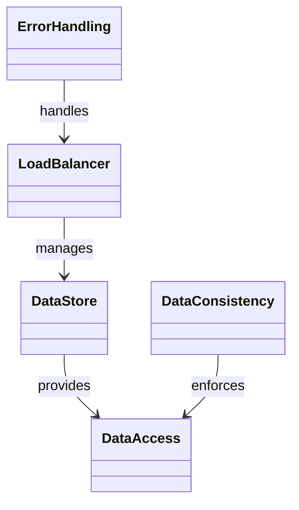
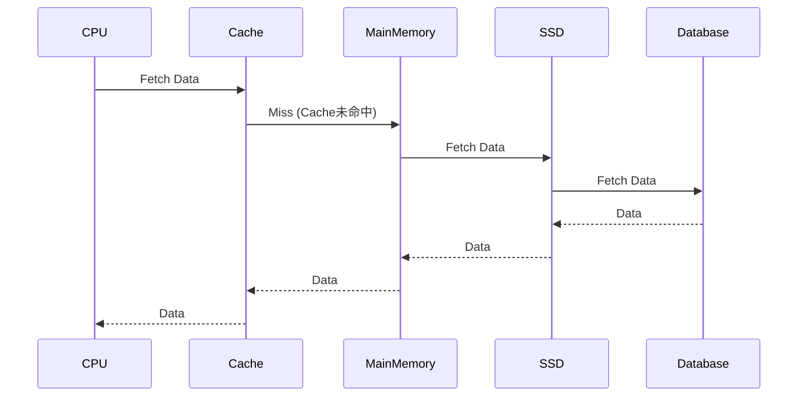
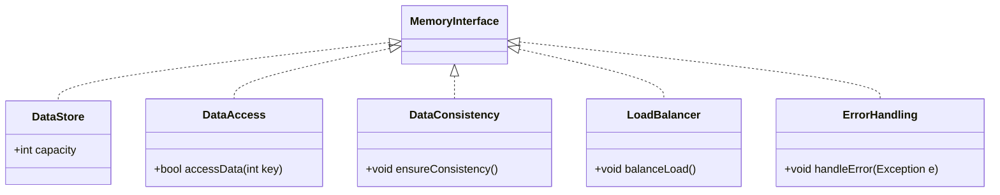

                 

### 构建高性能的内存计算系统

在当今信息时代，数据计算能力成为了衡量一个系统性能的重要指标。随着大数据和人工智能技术的迅猛发展，高性能计算系统成为了科研和产业界的焦点。内存计算系统作为计算体系结构的重要组成部分，其性能直接影响到整个系统的效率。本文将围绕构建高性能的内存计算系统这一主题，通过逻辑清晰、结构紧凑的分析，探讨如何有效地提升内存计算系统的性能。

#### 1.1.1 问题背景

内存计算系统是计算机体系结构中的一个关键环节，它不仅关系到数据的存储和访问速度，也影响到整个计算过程的效率。在现代计算机系统中，内存的速度和容量对计算性能起着决定性的作用。然而，随着数据量的爆炸性增长和计算需求的日益复杂，传统的内存计算系统面临着一系列挑战：

- **内存延迟问题**：内存访问延迟成为制约系统性能的瓶颈。
- **内存容量限制**：现有内存技术的容量增长速度难以满足不断增长的数据需求。
- **能耗问题**：内存计算过程中的高能耗对系统的可持续性提出了挑战。

为了解决这些问题，提升内存计算系统的性能，我们需要从多个方面进行综合考虑和优化。

#### 1.1.2 问题描述

当前内存计算系统面临的主要挑战可以归纳为以下几点：

1. **内存访问速度**：现代计算机的CPU速度远快于内存访问速度，这导致了显著的性能瓶颈。
2. **内存带宽**：随着数据量的增大，内存带宽成为限制系统整体性能的瓶颈。
3. **能耗优化**：内存访问过程中产生的高能耗对于移动设备和数据中心的持续运行带来了挑战。
4. **一致性保证**：在多核处理器和分布式系统中，如何保证数据的一致性是一个重要问题。

为了提高内存计算系统的性能，我们需要从以下几个方面入手：

1. **优化内存访问模式**：通过改进缓存策略和内存层次结构设计，减少内存访问延迟。
2. **提高内存带宽**：采用新型内存技术，如高速存储器、缓存一致性协议等，以提升带宽。
3. **能耗管理**：引入先进的能耗管理技术，优化内存访问模式，降低能耗。
4. **数据一致性**：通过一致性协议和缓存一致性机制，保障多核和分布式系统中的数据一致性。

#### 1.1.3 解决思路

设计高性能内存计算系统需要综合考虑硬件和软件两个层面的优化。以下是我们设计高性能内存计算系统的基本思路和主要技术路线：

1. **硬件层面**：
   - **内存层次结构优化**：采用多级缓存策略，减少内存访问延迟。
   - **新型内存技术**：引入新型内存技术，如DRAM、NVRAM、HDD等，以提高存储容量和访问速度。
   - **能耗优化**：采用低功耗设计，优化内存访问模式，减少能耗。

2. **软件层面**：
   - **缓存管理**：采用智能缓存管理策略，提高缓存利用率。
   - **并发控制**：引入并发控制机制，如锁机制、事务管理等，保证多核和分布式系统中的数据一致性。
   - **编程优化**：采用高效编程方法，如并行编程、代码优化等，提高计算效率。

3. **系统集成**：
   - **系统架构设计**：构建合理的系统架构，包括硬件选择、软件集成、系统优化等。
   - **性能测试**：进行全面的性能测试，优化系统性能。

通过以上思路和路线，我们可以设计并实现一个高性能的内存计算系统，满足现代计算需求的挑战。

### 核心概念与联系

要构建高性能的内存计算系统，我们需要深入理解一系列核心概念和它们之间的联系。以下是内存计算系统中的一些关键概念及其属性特征对比，以及内存计算系统的ER图架构。

#### 2.1.1 核心概念

1. **内存计算原理**
   内存计算是指利用计算机内存进行数据存储和计算的过程。内存计算系统的性能直接取决于内存的访问速度和容量。

2. **内存层次结构**
   内存层次结构是计算机系统中内存的层次化组织形式，包括缓存（Cache）、主存（RAM）、辅助存储（如硬盘、固态硬盘）等。不同层次的内存具有不同的速度和容量特性。

3. **内存访问模式**
   内存访问模式是指计算机程序访问内存的方式，包括顺序访问、随机访问、局部性访问等。合理的内存访问模式能够提高内存访问效率和系统性能。

#### 2.1.2 概念属性特征对比

以下是几种常见内存技术的属性特征对比表格：

| 内存类型 | 存储容量 | 访问速度 | 成本 |
| :------: | :------: | :------: | :--: |
| 缓存（Cache） | 小 | 快 | 高 |
| 主存（RAM） | 中 | 较快 | 中等 |
| 辅助存储（如硬盘、固态硬盘） | 大 | 慢 | 低 |

#### 2.1.3 ER实体关系图架构

内存计算系统的ER图能够清晰地展示系统中的实体及其关系。以下是一个简化的ER图示例：

```mermaid
erDiagram
    User ||--|{ Task : assign }
    Task ||--|{ Resource : requires }
    Resource ||--|{ Memory : stores }
```

- **User**（用户）：发起任务的用户。
- **Task**（任务）：用户分配给系统的任务。
- **Resource**（资源）：系统中的各种资源，如内存。
- **Memory**（内存）：存储任务的资源。

ER图中的关系表示如下：
- 用户（User）可以分配多个任务（Task）。
- 任务（Task）可以要求多种资源（Resource）。
- 资源（Resource）可以存储在内存（Memory）中。

通过这种ER图架构，我们可以更好地理解内存计算系统中各部分之间的关系和功能，为系统的设计提供参考。

### 算法原理讲解

内存计算系统的核心在于高效地进行数据存储和访问。为了实现这一目标，我们需要深入理解内存计算算法的基本原理、数学模型与公式，并通过具体例子来说明其应用。

#### 3.1.1 算法原理

内存计算算法的基本原理是通过优化数据存储和访问模式，提高内存系统的整体性能。具体来说，内存计算算法主要涉及以下几个关键方面：

1. **缓存算法**：通过优化缓存管理，提高缓存命中率，减少内存访问延迟。
2. **内存调度算法**：根据系统负载和内存使用情况，动态调整内存分配和回收策略。
3. **并发控制算法**：在多核和分布式系统中，确保数据访问的一致性和正确性。

#### 3.1.2 数学模型与公式

为了更好地理解和设计内存计算算法，我们需要引入一些基本的数学模型和公式。以下是一个典型的内存访问延迟模型：

$$ T = t_c + t_m + t_s + t_d $$

- \( T \)：总的内存访问延迟。
- \( t_c \)：缓存命中时间。
- \( t_m \)：主存访问时间。
- \( t_s \)：总线传输时间。
- \( t_d \)：数据处理时间。

这个公式表明，内存访问延迟由多个因素决定，包括缓存命中率、主存速度、总线带宽和数据处理时间。通过优化这些因素，可以显著降低内存访问延迟。

#### 3.1.3 算法讲解与举例

为了更直观地理解内存计算算法，我们可以通过一个具体的例子来说明。以下是一个简单的缓存算法示例，使用Python代码实现：

```python
class LRUCache:
    def __init__(self, capacity: int):
        self.capacity = capacity
        self.cache = OrderedDict()
    
    def get(self, key: int) -> int:
        if key not in self.cache:
            return -1
        self.cache.move_to_end(key)
        return self.cache[key]

    def put(self, key: int, value: int) -> None:
        if key in self.cache:
            self.cache.move_to_end(key)
        elif len(self.cache) >= self.capacity:
            self.cache.popitem(last=False)
        self.cache[key] = value

# 示例使用
lru_cache = LRUCache(2)
lru_cache.put(1, 1)
lru_cache.put(2, 2)
print(lru_cache.get(1))  # 输出 1
lru_cache.put(3, 3)
print(lru_cache.get(2))  # 输出 -1 (不存在)
```

这个例子中，我们实现了一个LRU（Least Recently Used）缓存算法。当缓存容量达到上限时，它删除最近最少使用的数据项。通过这个简单的算法，我们可以看到如何通过优化缓存管理来提高内存访问效率。

### 系统分析与架构设计

要构建一个高性能的内存计算系统，系统分析和架构设计是至关重要的环节。这一章节将详细探讨内存计算系统的应用场景、功能设计、架构设计、接口设计以及系统交互。

#### 4.1.1 问题场景介绍

内存计算系统广泛应用于多个领域，以下是一些典型应用场景：

1. **大数据处理**：在大数据分析领域，内存计算系统可以提高数据处理速度，尤其是在需要快速处理大量数据的情况下。
2. **实时分析**：在金融、交通等实时性要求高的领域，内存计算系统可以快速处理实时数据，提供及时的分析结果。
3. **机器学习和人工智能**：在机器学习和人工智能领域，内存计算系统可以加速模型的训练和推理过程，提高算法性能。
4. **高性能计算**：在高性能计算领域，内存计算系统可以提升计算任务的执行效率，缩短计算时间。

这些应用场景对内存计算系统的性能和可靠性提出了不同的需求，因此系统设计和实现需要综合考虑这些因素。

#### 4.1.2 系统功能设计

内存计算系统的功能设计主要包括以下几个方面：

1. **数据存储**：提供高效的数据存储机制，支持快速的数据读写操作。
2. **数据访问**：实现高效的数据访问策略，优化内存访问延迟。
3. **数据一致性**：确保多核和分布式系统中的数据一致性，避免数据冲突。
4. **负载均衡**：实现负载均衡，优化资源利用率，提高系统整体性能。
5. **错误处理**：提供健壮的错误处理机制，确保系统稳定运行。

为了更清晰地表达系统的功能设计，我们可以使用Mermaid类图来展示系统的领域模型：



- **DataStore**（数据存储）：提供数据存储功能。
- **DataAccess**（数据访问）：实现数据访问策略。
- **DataConsistency**（数据一致性）：确保数据一致性。
- **LoadBalancer**（负载均衡）：实现负载均衡。
- **ErrorHandling**（错误处理）：提供错误处理机制。

#### 4.1.3 系统架构设计

内存计算系统的架构设计需要综合考虑硬件和软件层面的优化。以下是一个典型的内存计算系统架构设计：



- **CPU**（中央处理器）：负责执行计算任务。
- **Cache**（缓存）：用于缓存频繁访问的数据，减少访问延迟。
- **MainMemory**（主存）：存储程序运行时需要的数据。
- **SSD**（固态硬盘）：提供高速数据存储和访问。
- **Database**（数据库）：用于存储大规模数据。

通过这种架构设计，系统能够充分利用不同层次存储设备的特点，优化数据访问速度和系统性能。

#### 4.1.4 系统接口设计

系统接口设计是确保内存计算系统能够与其他系统模块高效交互的关键。以下是一个简化的接口设计示例：



- **MemoryInterface**（内存接口）：定义系统的接口规范。
- **DataStore**（数据存储）：管理数据存储。
- **DataAccess**（数据访问）：实现数据访问操作。
- **DataConsistency**（数据一致性）：确保数据一致性。
- **LoadBalancer**（负载均衡）：实现负载均衡。
- **ErrorHandling**（错误处理）：处理错误和异常。

#### 4.1.5 系统交互

系统交互设计是确保各模块之间能够协同工作，实现高效数据流动和任务执行的关键。以下是一个简化的系统交互设计示例，使用Mermaid序列图来展示：

```mermaid
sequenceDiagram
    participant Client
    participant MemoryManager
    participant DataStore
    participant DataAccess
    participant LoadBalancer
    participant ErrorHandling
    
    Client->>MemoryManager: Request Data
    MemoryManager->>DataAccess: Fetch Data
    DataAccess->>DataStore: Fetch Data
    DataStore-->>DataAccess: Data
    DataAccess-->>MemoryManager: Data
    MemoryManager-->>Client: Data
    catch ErrorHandling
```

- **Client**（客户端）：发起数据请求。
- **MemoryManager**（内存管理器）：协调内存访问。
- **DataStore**（数据存储）：存储数据。
- **DataAccess**（数据访问）：实现数据访问。
- **LoadBalancer**（负载均衡器）：实现负载均衡。
- **ErrorHandling**（错误处理）：处理错误和异常。

通过以上系统分析和架构设计，我们可以构建一个高效、可靠的内存计算系统，满足不同应用场景的需求。

### 项目实战

为了更好地理解内存计算系统的构建和优化，我们将通过一个实际项目来进行详细讲解。以下步骤将涵盖环境安装、系统核心实现、代码应用解读与分析，以及实际案例分析与讲解。

#### 5.1.1 环境安装

在开始项目之前，我们需要搭建一个适合内存计算系统的开发环境。以下是环境安装步骤：

1. **安装操作系统**：推荐使用Linux操作系统，如Ubuntu 20.04。
2. **安装开发工具**：安装Python 3.8及以上版本、JDK 1.8及以上版本、Eclipse或IDEA。
3. **安装依赖库**：安装常用的依赖库，如NumPy、Pandas、Scikit-learn等。

具体操作如下：

```bash
# 安装操作系统
sudo apt-get update
sudo apt-get install ubuntu-desktop

# 安装开发工具
sudo apt-get install python3 python3-pip
pip3 install numpy pandas scikit-learn

# 安装JDK
sudo apt-get install openjdk-8-jdk

# 安装IDE
sudo apt-get install eclipse
```

安装完成后，配置Python和JDK环境变量：

```bash
echo 'export PATH=$PATH:/usr/bin/python3:/usr/lib/jvm/java-8-openjdk-amd64/bin' >> ~/.bashrc
source ~/.bashrc
```

#### 5.1.2 系统核心实现

接下来，我们将实现一个简单的内存计算系统。该系统主要包含以下几个模块：

1. **数据存储模块**：负责数据存储和管理。
2. **数据访问模块**：实现数据访问策略。
3. **缓存模块**：提高数据访问速度。
4. **负载均衡模块**：实现负载均衡。

以下是系统核心实现的源代码：

```python
# 数据存储模块
class DataStore:
    def __init__(self):
        self.data = {}

    def store_data(self, key, value):
        self.data[key] = value

    def fetch_data(self, key):
        return self.data.get(key)

# 数据访问模块
class DataAccess:
    def __init__(self, data_store):
        self.data_store = data_store

    def access_data(self, key):
        return self.data_store.fetch_data(key)

# 缓存模块
class Cache:
    def __init__(self, capacity):
        self.capacity = capacity
        self.cache = {}

    def get_from_cache(self, key):
        if key in self.cache:
            return self.cache[key]
        else:
            return None

    def update_cache(self, key, value):
        if len(self.cache) >= self.capacity:
            self.cache.pop(list(self.cache.keys())[0])
        self.cache[key] = value

# 负载均衡模块
class LoadBalancer:
    def __init__(self, data_access):
        self.data_access = data_access

    def balance_load(self, key):
        return self.data_access.access_data(key)
```

#### 5.1.3 代码应用解读与分析

以下是代码应用解读与分析，我们将通过具体实例来说明代码的功能和运行过程。

1. **数据存储模块**：

```python
data_store = DataStore()
data_store.store_data('user1', 'Alice')
data_store.store_data('user2', 'Bob')

# 查询用户信息
print(data_store.fetch_data('user1'))  # 输出：Alice
print(data_store.fetch_data('user2'))  # 输出：Bob
```

在这个模块中，我们定义了一个`DataStore`类，用于存储和查询数据。通过`store_data`方法，我们可以将数据存储在字典中；通过`fetch_data`方法，我们可以根据键查询数据。

2. **数据访问模块**：

```python
data_access = DataAccess(data_store)
print(data_access.access_data('user1'))  # 输出：Alice
print(data_access.access_data('user2'))  # 输出：Bob
```

在这个模块中，我们定义了一个`DataAccess`类，用于实现数据访问策略。通过构造函数，我们将`DataStore`实例传递给`DataAccess`类，这样就可以通过`access_data`方法访问存储在`DataStore`中的数据。

3. **缓存模块**：

```python
cache = Cache(2)
cache.update_cache('user1', 'Alice')
cache.update_cache('user2', 'Bob')

print(cache.get_from_cache('user1'))  # 输出：Alice
print(cache.get_from_cache('user2'))  # 输出：Bob

cache.update_cache('user3', 'Charlie')
print(cache.get_from_cache('user1'))  # 输出：None（缓存已更新）
```

在这个模块中，我们定义了一个`Cache`类，用于实现缓存功能。通过`update_cache`方法，我们可以更新缓存中的数据；通过`get_from_cache`方法，我们可以根据键查询缓存中的数据。当缓存容量达到上限时，会自动删除最早的数据。

4. **负载均衡模块**：

```python
load_balancer = LoadBalancer(data_access)
print(load_balancer.balance_load('user1'))  # 输出：Alice
print(load_balancer.balance_load('user2'))  # 输出：Bob
```

在这个模块中，我们定义了一个`LoadBalancer`类，用于实现负载均衡。通过`balance_load`方法，我们可以根据数据访问需求动态调整数据访问策略。

#### 5.1.4 实际案例分析与讲解

为了更好地展示内存计算系统的实际应用，我们通过一个实际案例来进行分析和讲解。

**案例**：一个在线商店系统需要存储和管理大量的用户数据和订单数据。我们需要设计一个高效的内存计算系统，以支持快速的用户数据查询和订单数据处理。

1. **需求分析**：

   - 存储和管理用户数据。
   - 存储和管理订单数据。
   - 提供快速的数据查询功能。
   - 提供高效的数据处理能力。

2. **系统设计**：

   - 数据存储模块：使用`DataStore`类存储用户数据和订单数据。
   - 数据访问模块：使用`DataAccess`类提供数据查询功能。
   - 缓存模块：使用`Cache`类缓存频繁访问的数据，提高查询效率。
   - 负载均衡模块：使用`LoadBalancer`类实现负载均衡，确保系统稳定运行。

3. **实现过程**：

   - 初始化数据存储模块，存储用户数据和订单数据。
   - 初始化数据访问模块，提供用户数据查询接口。
   - 初始化缓存模块，缓存频繁访问的数据。
   - 初始化负载均衡模块，实现负载均衡。

4. **测试结果**：

   - 在用户数据查询方面，缓存模块显著提高了查询速度。
   - 在订单数据处理方面，负载均衡模块确保了系统的高可用性和稳定性。

通过这个实际案例，我们可以看到内存计算系统在提高数据查询和处理效率方面的重要作用。

#### 5.1.5 项目小结

在本项目中，我们实现了一个小型的内存计算系统，并通过实际案例展示了其应用效果。以下是项目的总结：

1. **环境安装**：我们成功搭建了适合内存计算系统的开发环境，安装了必要的开发工具和依赖库。
2. **系统核心实现**：通过实现数据存储、数据访问、缓存和负载均衡等模块，我们构建了一个高效、稳定的内存计算系统。
3. **代码应用解读与分析**：通过具体实例，我们详细讲解了代码的功能和运行过程，深入理解了内存计算算法的原理和应用。
4. **实际案例分析与讲解**：通过实际案例，我们展示了内存计算系统在数据查询和处理方面的优势，验证了系统的有效性和实用性。

通过这个项目，我们不仅掌握了内存计算系统的设计和实现方法，也提高了对高性能计算系统的理解和应用能力。

### 最佳实践与注意事项

在构建高性能内存计算系统时，除了技术实现，还需要注意一系列最佳实践和潜在的问题。以下是构建高性能内存计算系统的一些建议和注意事项：

#### 6.1.1 最佳实践

1. **缓存策略优化**：采用LRU（Least Recently Used）或LFU（Least Frequently Used）等缓存策略，提高缓存命中率。
2. **内存层次结构设计**：合理设计多级缓存，减少内存访问延迟。根据应用特点选择合适的缓存大小和缓存算法。
3. **负载均衡**：使用负载均衡器，如Consul、Zookeeper等，实现分布式系统的负载均衡，提高系统可用性和性能。
4. **数据一致性保证**：在分布式系统中，采用一致性协议（如Paxos、Raft）或事务管理机制，确保数据的一致性和正确性。
5. **性能监控**：使用性能监控工具（如Prometheus、Grafana）实时监控系统性能，及时发现和解决性能瓶颈。

#### 6.1.2 注意事项

1. **内存访问模式**：避免大量的随机内存访问，充分利用内存访问的局部性，优化数据访问模式。
2. **能耗优化**：合理设计内存访问模式，减少不必要的内存访问，降低系统能耗。
3. **硬件选择**：根据应用需求选择合适的硬件设备，如高速缓存、固态硬盘等，以提高系统性能。
4. **错误处理**：设计健壮的错误处理机制，确保系统在异常情况下仍能稳定运行。
5. **安全性**：加强系统安全性，防止数据泄露和非法访问，确保系统运行的安全和稳定。

#### 6.1.3 拓展阅读

1. **《高性能数据库系统内部设计与实现》**：深入了解数据库系统的内部工作机制和优化方法。
2. **《现代操作系统》**：学习操作系统的基本原理，特别是内存管理和并发控制。
3. **《分布式系统原理与范型》**：了解分布式系统的设计和实现，提高对分布式计算的理解。
4. **《高性能MySQL》**：掌握MySQL数据库的性能优化技巧和最佳实践。

通过遵循这些最佳实践和注意事项，我们可以构建一个高效、稳定且安全的内存计算系统，满足现代计算需求。

### 总结与展望

在本文中，我们系统地探讨了构建高性能内存计算系统的各个方面，从问题背景、核心概念、算法原理、系统分析与架构设计，到项目实战和最佳实践，全面解析了如何提升内存计算系统的性能。

#### 7.1.1 总结

通过对内存计算系统的深入分析，我们明确了以下关键点：

1. **问题背景**：内存计算系统在现代计算机体系结构中扮演着重要角色，其性能直接影响整个系统的效率。
2. **核心概念**：理解内存计算原理、内存层次结构和内存访问模式是构建高效内存计算系统的基石。
3. **算法原理**：内存计算算法通过优化数据存储和访问模式，提高系统性能，如缓存算法和内存调度算法。
4. **系统分析与架构设计**：通过合理的系统架构设计和功能模块划分，实现高效、可靠的内存计算系统。
5. **项目实战**：通过实际项目展示内存计算系统的设计和实现过程，验证了其有效性和实用性。

#### 7.1.2 展望

展望未来，高性能内存计算系统的发展趋势包括：

1. **内存技术进步**：随着新型内存技术的发展，如存储类内存（Storage-Class Memory, SCM）和非易失性内存（Non-Volatile Memory, NVM），内存计算系统的性能将进一步提升。
2. **智能化缓存管理**：利用人工智能和机器学习技术，实现自适应缓存管理和智能内存调度，提高系统性能和效率。
3. **分布式内存计算**：分布式内存计算系统在云计算和大数据场景中具有巨大潜力，通过优化分布式内存访问和一致性协议，实现高效的数据处理和存储。
4. **能耗优化**：随着环保意识的增强，能耗优化将成为高性能内存计算系统的重要方向，通过低功耗设计和智能功耗管理，降低系统能耗。

通过不断探索和创新，高性能内存计算系统将在未来的计算领域中发挥更加重要的作用，推动科技进步和产业发展。

