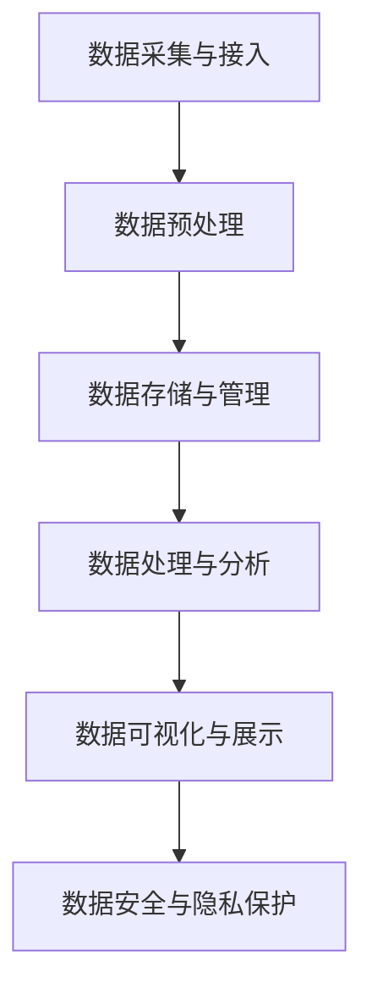

                 

# 构建高性能的分布式数据处理系统

> 关键词：分布式数据处理，高性能，系统架构，数据分片，一致性，容错性

> 摘要：本文将深入探讨分布式数据处理系统的构建，从理论基础、分布式数据存储、分布式数据传输、分布式数据处理算法等方面，详细分析其核心概念、设计策略、性能优化以及面临的挑战与解决方案，旨在帮助读者全面理解并掌握构建高性能分布式数据处理系统的关键技术和实践方法。

----------------------------------------------------------------

## 目录大纲

----------------------------------------------------------------

## 第一部分：理论基础

### 第1章：分布式数据处理系统概述

#### 1.1 分布式数据处理系统的概念与重要性

#### 1.2 分布式数据处理系统的核心概念

#### 1.3 分布式数据处理系统的架构设计

#### 1.4 分布式数据处理系统的挑战与解决方案

#### 1.5 本章小结

### 第2章：分布式数据存储

#### 2.1 分布式数据存储概述

#### 2.2 分布式数据存储的核心概念

#### 2.3 常见的分布式数据存储技术

#### 2.4 分布式数据存储的设计策略

#### 2.5 分布式数据存储的性能优化

#### 2.6 分布式数据存储的挑战与解决方案

#### 2.7 本章小结

### 第3章：分布式数据传输

#### 3.1 分布式数据传输概述

#### 3.2 分布式数据传输的核心概念

#### 3.3 常见的分布式数据传输技术

#### 3.4 分布式数据传输的设计策略

#### 3.5 分布式数据传输的性能优化

#### 3.6 分布式数据传输的挑战与解决方案

#### 3.7 本章小结

### 第4章：分布式数据处理算法

#### 4.1 分布式数据处理算法概述

#### 4.2 分布式数据处理算法的核心概念

#### 4.3 常见的分布式数据处理算法

#### 4.4 分布式数据处理算法的设计策略

#### 4.5 分布式数据处理算法的性能优化

#### 4.6 分布式数据处理算法的挑战与解决方案

#### 4.7 本章小结

## 第二部分：实践与应用

### 第5章：系统分析与架构设计

#### 5.1 问题场景介绍

#### 5.2 系统功能设计

#### 5.3 系统架构设计

#### 5.4 系统接口设计

#### 5.5 系统交互

### 第6章：项目实战

#### 6.1 环境安装

#### 6.2 系统核心实现

#### 6.3 代码应用解读与分析

#### 6.4 实际案例分析与详细讲解

#### 6.5 项目小结

### 第7章：最佳实践与拓展阅读

#### 7.1 最佳实践 Tips

#### 7.2 小结

#### 7.3 注意事项

#### 7.4 拓展阅读

----------------------------------------------------------------

## 第一部分：理论基础

### 第1章：分布式数据处理系统概述

#### 1.1 分布式数据处理系统的概念与重要性

分布式数据处理系统是指将数据处理任务分散到多个节点上执行，通过分布式计算、存储和网络技术，实现数据的高效处理和共享的系统。随着大数据和云计算技术的快速发展，分布式数据处理系统在各个行业得到了广泛应用，其重要性日益凸显。

**核心概念术语说明：**

- 分布式计算：将任务分解为多个子任务，分散到多个节点上执行，然后将结果汇总。
- 数据分片：将大数据集划分为多个子集，分布存储在不同的节点上。
- 数据一致性：分布式系统中，多个副本之间的数据保持一致。
- 容错性：系统能够在部分节点失效时，仍然保持正常运行。

**问题背景：**

随着数据规模的不断增大，单机处理能力已经无法满足实际需求。传统的集中式数据处理系统在数据量和并发性方面存在瓶颈，难以应对复杂的应用场景。分布式数据处理系统通过横向扩展，能够更好地处理海量数据，提供更高的性能和可靠性。

**问题描述：**

构建一个高性能、高可用、可扩展的分布式数据处理系统，解决大规模数据的高效处理和共享问题。

**问题解决：**

通过分布式计算、存储和网络技术，实现数据分片、数据传输、数据处理和任务分配等核心功能，构建分布式数据处理系统。

**边界与外延：**

分布式数据处理系统涉及多个领域，包括分布式计算、分布式存储、分布式网络、分布式算法等。本文主要关注分布式数据处理系统的构建方法和技术细节。

**概念结构与核心要素组成：**

分布式数据处理系统由多个核心要素组成，包括分布式计算节点、数据存储节点、网络通信模块、任务调度模块等。各要素协同工作，实现数据处理的高效性和可扩展性。

----------------------------------------------------------------

## 第1章：分布式数据处理系统概述

### 1.1 分布式数据处理系统的概念与重要性

分布式数据处理系统是一种基于分布式计算和存储技术，能够处理海量数据的系统。它通过将数据分散存储在多个节点上，并利用分布式计算模型，将数据处理任务分配到各个节点上执行，从而实现高效的数据处理。

**定义：**

分布式数据处理系统是指一种将数据处理任务分散到多个节点上执行，并通过分布式计算、存储和网络技术，实现数据高效处理和共享的系统。

**重要性：**

1. **处理海量数据：**随着数据规模的不断增大，单机处理能力已经无法满足需求。分布式数据处理系统通过横向扩展，能够更好地处理海量数据。

2. **提高性能：**分布式数据处理系统利用并行计算，能够提高数据处理的速度和效率。

3. **高可用性：**分布式数据处理系统通过冗余设计和故障转移机制，能够提高系统的可用性和容错性。

4. **可扩展性：**分布式数据处理系统可以根据需求，动态地增加或减少节点，实现系统的可扩展性。

**核心概念：**

1. **数据分片：**将大数据集划分为多个子集，分布存储在不同的节点上。
2. **数据一致性：**分布式系统中，多个副本之间的数据保持一致。
3. **容错性：**系统能够在部分节点失效时，仍然保持正常运行。

**应用场景：**

1. **大数据处理：**如数据挖掘、机器学习、实时数据分析等。
2. **云计算：**如云存储、云服务、分布式数据库等。
3. **物联网：**如传感器数据采集、实时监控等。

**发展趋势：**

1. **分布式存储和计算技术的不断成熟：**如HDFS、MapReduce、Spark等。
2. **容器化和云计算的普及：**如Kubernetes、Docker等。
3. **边缘计算的发展：**将计算能力延伸到网络的边缘，实现实时处理。

----------------------------------------------------------------

### 1.2 分布式数据处理系统的核心概念

在分布式数据处理系统中，有多个核心概念需要理解和掌握，这些概念是构建高性能分布式数据处理系统的基础。以下是对这些核心概念的详细解释：

#### 1.2.1 数据分片

数据分片是将大数据集划分为多个子集的过程，目的是将数据分布存储在多个节点上，以便于并行处理和负载均衡。数据分片可以基于多种策略进行，如哈希分片、范围分片、列表分片等。

**哈希分片：**
哈希分片是一种基于哈希函数的数据分片策略，将数据根据其关键字（如ID）进行哈希运算，将哈希值映射到不同的分片上。这种方式能够实现数据的均匀分布，提高数据访问的效率。

**范围分片：**
范围分片是将数据按照一定范围划分到不同的分片上。例如，可以将数据按照时间范围、地理位置等进行分片。范围分片适用于对特定范围数据进行高效查询的场景。

**列表分片：**
列表分片是将数据按照一定的顺序（如ID列表）划分到不同的分片上。这种方式适用于数据有序且不需要频繁查询的场景。

**数据分片的优点：**
- **并行处理：**通过数据分片，可以将数据处理任务并行执行，提高处理速度。
- **负载均衡：**将数据分布到多个节点上，可以均衡各节点的负载，避免单点瓶颈。
- **可扩展性：**增加节点时，只需将新的数据分片分配到已有节点或新增节点上，系统即可线性扩展。

**数据分片的挑战：**
- **数据一致性：**分片后的数据需要在多个节点之间保持一致性，否则会导致数据错误。
- **查询效率：**分片策略不当可能导致查询效率降低。

#### 1.2.2 数据一致性和分区容错性

数据一致性是分布式数据处理系统中一个重要的概念，它指的是系统中的多个副本之间的数据状态保持一致。在分布式系统中，由于网络延迟、节点故障等原因，数据一致性是一个复杂的挑战。

**一致性模型：**
分布式系统通常采用一致性模型来描述数据一致性的级别。常见的一致性模型包括：

- **强一致性：**系统中的所有副本在任何时候都保持相同的数据状态，这是最严格的一致性模型。
- **最终一致性：**系统中的所有副本最终会达到一致状态，但在此过程中，可能会有暂时的不一致。
- **事件一致性：**系统中的每个事件（如数据的写入或修改）都会被所有副本记录下来，但不同的副本可能会以不同的顺序处理事件。

**分区容错性：**
分区容错性是指系统能够在部分节点失效的情况下，仍然能够继续正常运行。为了实现分区容错性，分布式系统通常采用以下策略：

- **副本机制：**每个数据分片都有多个副本，以确保在任何节点失效时，仍有其他副本可以继续提供服务。
- **故障检测和恢复：**系统需要能够检测到节点故障，并在必要时自动恢复数据一致性。

**数据一致性和分区容错性的挑战：**
- **延迟和带宽：**为了保持数据一致性，系统可能需要通过网络传输大量数据，导致延迟和带宽消耗。
- **复杂性和性能：**实现高一致性模型需要复杂的协议和算法，可能影响系统的性能。

#### 1.2.3 数据传输和存储

数据传输和存储是分布式数据处理系统中的关键组成部分。

**数据传输：**
数据传输指的是在分布式系统中，数据在不同节点之间的传输过程。高效的数据传输对于系统的性能至关重要。常见的数据传输策略包括：

- **批处理传输：**将多个数据操作组合成一个批量，一次性传输，减少网络开销。
- **流处理传输：**实时传输数据，适用于低延迟和高吞吐量的场景。

**数据存储：**
数据存储是指将数据持久化存储在分布式存储系统中。常见的数据存储技术包括：

- **分布式数据库：**如HBase、Cassandra等，支持大规模数据的存储和查询。
- **分布式文件系统：**如HDFS、Ceph等，适用于大规模数据的存储和流处理。

**数据传输和存储的挑战：**
- **数据一致性：**确保数据在传输和存储过程中的一致性。
- **性能优化：**优化数据传输和存储的性能，减少延迟和带宽消耗。

通过理解这些核心概念，我们可以更好地设计、实现和优化分布式数据处理系统，以应对大规模数据处理的需求。

#### 1.3 分布式数据处理系统的架构设计

分布式数据处理系统的架构设计是确保系统高性能、高可用性和可扩展性的关键。以下是对分布式数据处理系统架构设计的详细分析：

**系统架构概述**

分布式数据处理系统的架构通常包括以下几个主要组成部分：

1. **计算节点：**负责执行数据处理任务，可以是物理机或虚拟机。
2. **存储节点：**负责存储数据和日志，可以是分布式数据库、文件系统或对象存储。
3. **协调节点：**负责协调和管理计算节点和存储节点之间的通信和任务分配。
4. **网络：**连接各个节点，实现数据传输和通信。
5. **监控与运维：**监控系统状态，进行故障检测和恢复。

**节点通信与协调**

节点通信与协调是分布式数据处理系统的核心机制，它确保系统能够高效、可靠地执行数据处理任务。

1. **节点通信：**节点之间的通信通常通过远程过程调用（RPC）或消息队列（如Kafka、RabbitMQ）实现。RPC提供了高效、简单的远程调用方式，而消息队列则适用于异步、解耦的通信模式。

2. **协调机制：**分布式数据处理系统通常采用分布式协调算法，如Zookeeper、Consul或etcd，来管理节点间的状态信息和协调任务分配。这些协调算法提供了选举、锁、配置管理等功能。

3. **负载均衡：**为了均衡各个节点的负载，系统通常采用负载均衡策略，如轮询、最小连接数、哈希等。负载均衡算法根据节点的处理能力、当前负载等因素，动态调整任务分配策略。

**分布式锁与并发控制**

分布式锁与并发控制是分布式数据处理系统中的一个重要方面，它确保多个节点在执行并发任务时不会产生冲突和数据不一致。

1. **分布式锁：**分布式锁是一种同步机制，用于在分布式环境中同步多个节点的操作。常见的技术包括基于Zookeeper的分布式锁、基于Redis的分布式锁等。

2. **并发控制：**并发控制通过控制多个节点的访问顺序来避免冲突。常见的技术包括乐观锁、悲观锁、多版本并发控制（MVCC）等。

**架构设计的挑战**

1. **数据一致性和分区容错性：**在分布式系统中，数据一致性和分区容错性是一个复杂的挑战。需要设计高效的协议和算法，确保数据在分布式环境中的可靠性。

2. **性能优化：**分布式数据处理系统需要优化网络传输、存储和计算，以减少延迟和带宽消耗，提高系统的整体性能。

3. **监控与运维：**分布式系统的监控和运维是一个挑战，需要能够实时监控系统的状态，快速响应故障，并具备自动化运维能力。

**总结**

通过合理的架构设计，分布式数据处理系统能够实现高效的数据处理、高可用性和可扩展性。设计时需要综合考虑节点通信与协调、分布式锁与并发控制等方面的挑战，以确保系统的稳定运行。

#### 1.4 分布式数据处理系统的挑战与解决方案

在构建分布式数据处理系统时，我们面临许多挑战。以下是这些挑战及其相应的解决方案：

**数据一致性问题**

**挑战：**
在分布式环境中，数据一致性问题是一个常见且复杂的挑战。由于网络延迟、节点故障等原因，多个副本之间的数据状态可能会不一致。

**解决方案：**
1. **强一致性模型：**通过采用强一致性模型（如两阶段提交、Paxos算法），确保系统中的所有副本在任何时刻都保持相同的数据状态。
2. **最终一致性模型：**接受系统中的多个副本在短时间内可能存在不一致，但最终会达到一致状态。这种方式适用于对实时性要求不高的场景。

**容错性问题**

**挑战：**
分布式系统中的节点可能会因为硬件故障、软件错误或网络问题等原因失效。容错性是指系统能够在节点失效时继续正常运行。

**解决方案：**
1. **副本机制：**为每个数据分片创建多个副本，以确保在任何节点失效时，仍有其他副本可以提供服务。
2. **故障检测与恢复：**通过监控和故障检测机制，及时发现节点故障，并自动进行故障恢复，如数据复制、重试任务等。

**性能与扩展性问题**

**挑战：**
分布式数据处理系统需要处理大量的数据和高并发请求，性能和扩展性是一个重要的挑战。

**解决方案：**
1. **数据分片与负载均衡：**通过数据分片，将数据处理任务分散到多个节点上，实现负载均衡，提高系统的处理能力。
2. **水平扩展：**通过增加节点数量，实现系统的线性扩展，提高系统的吞吐量和处理能力。
3. **缓存机制：**通过缓存热点数据，减少对后端存储的访问压力，提高系统的响应速度。

**总结**

通过理解和应对分布式数据处理系统中的挑战，我们可以构建出高性能、高可用、可扩展的分布式数据处理系统。在实际应用中，根据具体需求和场景，选择合适的解决方案，以达到最佳的系统性能和稳定性。

#### 1.5 本章小结

本章对分布式数据处理系统进行了全面的概述，从概念、核心概念、架构设计到挑战与解决方案，为构建高性能分布式数据处理系统奠定了理论基础。通过本章的学习，读者可以了解分布式数据处理系统的基本概念和关键要素，掌握数据分片、数据一致性、容错性等核心概念，并了解分布式数据处理系统的架构设计策略和面临的挑战。本章的内容为后续章节的深入探讨提供了坚实的基础。

----------------------------------------------------------------

## 第二部分：实践与应用

### 第2章：分布式数据存储

#### 2.1 分布式数据存储概述

分布式数据存储是分布式数据处理系统中的重要组成部分，它通过将数据分布在多个节点上，实现了数据的高效存储和访问。本章将详细讨论分布式数据存储的概念、核心概念以及常见的技术。

**概念**

分布式数据存储是将数据分散存储在多个节点上，以实现数据的高效存储和访问。在这种存储模型中，数据被划分为多个分片，每个分片存储在不同的节点上，从而提高了数据的可用性和访问速度。

**核心概念**

1. **数据分片：**数据分片是将大数据集划分为多个子集的过程。通过数据分片，可以将数据存储在不同的节点上，从而提高数据处理的速度和效率。
2. **数据副本：**数据副本是数据分片的多个副本，用于提高数据的可用性和可靠性。在分布式数据存储系统中，通常会对每个数据分片创建多个副本，以确保在节点故障时仍能访问到数据。
3. **数据一致性：**数据一致性是指分布式数据存储系统中多个副本之间的数据状态保持一致。数据一致性问题在分布式系统中是一个重要的挑战，需要采用特定的算法和协议来解决。
4. **分区容错性：**分区容错性是指系统在部分节点失效时仍能正常运行的能力。通过数据副本和故障检测机制，分布式数据存储系统能够实现高可用性和容错性。

**常见的技术**

1. **分布式数据库：**分布式数据库是一种支持分布式数据存储的数据库系统，如HBase、Cassandra等。它们通过数据分片、数据副本和一致性协议，实现了高可用性和高性能的数据存储。
2. **分布式文件系统：**分布式文件系统是一种支持分布式数据存储的文件系统，如HDFS、Ceph等。它们通过数据分片和副本机制，提供了高吞吐量和可靠性的数据存储解决方案。
3. **分布式缓存系统：**分布式缓存系统是一种用于提高数据访问速度的缓存系统，如Memcached、Redis等。通过将热点数据缓存在内存中，分布式缓存系统能够显著减少对后端存储的访问压力。

**应用场景**

1. **大数据处理：**分布式数据存储适用于大数据处理场景，如数据挖掘、机器学习等。通过分布式数据存储，可以实现数据的高效存储和并行处理。
2. **云计算：**分布式数据存储是云计算基础设施的重要组成部分，提供了高吞吐量和可靠性的数据存储解决方案。
3. **物联网：**分布式数据存储适用于物联网场景，如传感器数据采集、实时监控等。通过分布式数据存储，可以实现海量数据的高效存储和访问。

#### 2.2 分布式数据存储的核心概念

在分布式数据存储系统中，有多个核心概念需要理解和掌握，这些概念是构建高效、可靠的分布式数据存储系统的基础。以下是对这些核心概念的详细解释：

**数据分片**

数据分片是将大数据集划分为多个子集的过程。通过数据分片，可以将数据存储在不同的节点上，从而提高数据处理的速度和效率。数据分片可以基于多种策略进行，如哈希分片、范围分片、列表分片等。

**哈希分片**

哈希分片是一种基于哈希函数的数据分片策略。将数据根据其关键字（如ID）进行哈希运算，将哈希值映射到不同的分片上。这种方式能够实现数据的均匀分布，提高数据访问的效率。

**范围分片**

范围分片是将数据按照一定范围划分到不同的分片上。例如，可以将数据按照时间范围、地理位置等进行分片。范围分片适用于对特定范围数据进行高效查询的场景。

**列表分片**

列表分片是将数据按照一定的顺序（如ID列表）划分到不同的分片上。这种方式适用于数据有序且不需要频繁查询的场景。

**数据分片的优点**

- **并行处理：**通过数据分片，可以将数据处理任务并行执行，提高处理速度。
- **负载均衡：**将数据分布到多个节点上，可以均衡各节点的负载，避免单点瓶颈。
- **可扩展性：**增加节点时，只需将新的数据分片分配到已有节点或新增节点上，系统即可线性扩展。

**数据分片的挑战**

- **数据一致性：**分片后的数据需要在多个节点之间保持一致性，否则会导致数据错误。
- **查询效率：**分片策略不当可能导致查询效率降低。

**数据副本**

数据副本是数据分片的多个副本，用于提高数据的可用性和可靠性。在分布式数据存储系统中，通常会对每个数据分片创建多个副本，以确保在节点故障时仍能访问到数据。

**副本策略**

1. **全副本：**为每个数据分片创建多个完全相同的副本，从而确保在任意节点故障时，仍能访问到数据。
2. **部分副本：**只创建部分副本，根据数据的重要性和访问频率来决定副本的数量。

**数据副本的优点**

- **高可用性：**通过副本机制，可以提高数据的可用性，降低节点故障带来的数据丢失风险。
- **容错性：**副本机制可以提高系统的容错性，确保系统在节点故障时仍能正常运行。

**数据副本的挑战**

- **存储空间：**创建大量副本会占用更多的存储空间。
- **数据一致性：**副本之间需要保持数据一致性，否则可能导致数据不一致。

**数据一致性**

数据一致性是指分布式数据存储系统中多个副本之间的数据状态保持一致。在分布式环境中，数据一致性是一个复杂的挑战，需要采用特定的算法和协议来解决。

**一致性模型**

1. **强一致性：**系统中的所有副本在任何时候都保持相同的数据状态，这是最严格的一致性模型。
2. **最终一致性：**系统中的所有副本最终会达到一致状态，但在此过程中，可能会有暂时的不一致。
3. **事件一致性：**系统中的每个事件（如数据的写入或修改）都会被所有副本记录下来，但不同的副本可能会以不同的顺序处理事件。

**数据一致性的挑战**

- **延迟和带宽：**为了保持数据一致性，系统可能需要通过网络传输大量数据，导致延迟和带宽消耗。
- **复杂性和性能：**实现高一致性模型需要复杂的协议和算法，可能影响系统的性能。

**分区容错性**

分区容错性是指系统在部分节点失效时仍能正常运行的能力。通过数据副本和故障检测机制，分布式数据存储系统能够实现高可用性和容错性。

**分区容错性的挑战**

- **数据恢复：**在节点故障后，如何快速恢复数据的一致性和可用性。
- **性能优化：**在保证容错性的同时，如何优化系统的性能。

通过理解这些核心概念，我们可以更好地设计、实现和优化分布式数据存储系统，以满足大规模数据处理的需求。

#### 2.3 常见的分布式数据存储技术

在分布式数据处理系统中，数据存储是至关重要的环节。为了满足不同场景下的需求，出现了多种分布式数据存储技术。以下是几种常见的分布式数据存储技术及其特点：

**1. 分布式数据库**

**特点：**
- **支持分布式数据存储：**分布式数据库通过数据分片和副本机制，实现数据的高效存储和访问。
- **高可用性：**分布式数据库通过副本机制，确保在节点故障时，仍能访问到数据。
- **高扩展性：**分布式数据库可以根据需求动态增加节点，实现线性扩展。

**典型系统：**
- **HBase：**基于Hadoop的分布式数据库，适用于大规模非结构化数据存储和查询。
- **Cassandra：**一个高度可扩展的分布式数据库，适用于高可用性和高性能场景。

**应用场景：**
- **大数据处理：**如数据挖掘、机器学习等。
- **分布式存储：**如分布式文件系统、NoSQL数据库等。

**2. 分布式文件系统**

**特点：**
- **支持大规模数据存储：**分布式文件系统可以存储海量数据，适用于大数据场景。
- **高可用性：**分布式文件系统通过数据分片和副本机制，提高数据可靠性。
- **高扩展性：**分布式文件系统可以根据需求动态增加存储节点，实现线性扩展。

**典型系统：**
- **HDFS（Hadoop Distributed File System）：**Hadoop的核心组件，适用于大数据存储和批处理。
- **Ceph：**一个分布式存储系统，支持对象存储和文件系统接口。

**应用场景：**
- **大数据处理：**如数据挖掘、机器学习等。
- **分布式存储：**如云存储、数据备份等。

**3. 分布式缓存系统**

**特点：**
- **高速数据访问：**分布式缓存系统将热点数据缓存到内存中，减少对后端存储的访问压力。
- **高可用性：**分布式缓存系统通过副本机制，确保在节点故障时，仍能访问到缓存数据。
- **高扩展性：**分布式缓存系统可以根据需求动态增加缓存节点，实现线性扩展。

**典型系统：**
- **Memcached：**一个高性能分布式缓存系统，适用于减少数据库负载。
- **Redis：**一个基于内存的分布式缓存系统，支持多种数据结构，适用于高并发场景。

**应用场景：**
- **高性能应用：**如电商平台、在线游戏等。
- **数据缓存：**如网页缓存、图像缓存等。

通过选择合适的分布式数据存储技术，可以根据具体场景需求实现高效、可靠的分布式数据处理系统。这些技术不仅提供了高可用性和高扩展性，还支持大规模数据存储和并行处理，为分布式数据处理系统提供了强大的支持。

#### 2.4 分布式数据存储的设计策略

设计分布式数据存储系统时，需要考虑多个策略来确保数据的高效存储、访问和一致性。以下是一些关键的设计策略：

**数据分布策略**

**哈希分布：**通过哈希函数将数据映射到不同的节点上，实现数据的均匀分布。这种策略可以有效地平衡负载，提高系统的性能。

**范围分布：**将数据按照特定的范围（如时间、地理位置）划分到不同的节点上。这种策略适用于对特定范围数据进行高效查询的场景。

**列表分布：**将数据按照一定的顺序（如ID列表）分配到不同的节点上。这种策略适用于数据有序且不需要频繁查询的场景。

**数据复制策略**

**全复制：**为每个数据分片创建多个完全相同的副本，确保在节点故障时，仍能访问到数据。这种方式提供了高可用性，但增加了存储空间的需求。

**部分复制：**只复制部分数据分片，根据数据的重要性和访问频率来决定副本的数量。这种方式在降低存储空间的同时，仍然提供了较高的可用性。

**一致性保证策略**

**强一致性：**系统中的所有副本在任何时刻都保持相同的数据状态，这是最严格的一致性模型。强一致性确保数据的可靠性，但可能引入较高的延迟和带宽消耗。

**最终一致性：**系统中的所有副本最终会达到一致状态，但在此过程中，可能会有暂时的不一致。最终一致性适用于对实时性要求不高的场景。

**事件一致性：**系统中的每个事件都会被所有副本记录下来，但不同的副本可能会以不同的顺序处理事件。事件一致性适用于对事件顺序有严格要求的场景。

**分布式锁与并发控制**

**分布式锁：**用于同步多个节点的操作，防止并发冲突。常见的分布式锁实现包括基于Zookeeper的锁和基于Redis的锁。

**乐观锁与悲观锁：**乐观锁假设并发冲突很少发生，在更新数据前不进行锁竞争；悲观锁则认为并发冲突很常见，在更新数据前获取锁。

通过合理的设计策略，分布式数据存储系统可以高效、可靠地处理大规模数据，满足不同场景下的需求。

#### 2.5 分布式数据存储的性能优化

在分布式数据处理系统中，数据存储的性能优化是一个关键环节，它直接影响到系统的整体性能和用户体验。以下是一些常用的性能优化策略：

**数据访问优化**

1. **缓存策略：**将热点数据缓存到内存中，减少对后端存储的访问压力。常用的缓存系统包括Memcached和Redis。
2. **索引优化：**通过建立索引，提高数据查询的速度。选择合适的索引类型和索引策略，如B树索引、哈希索引等。
3. **查询优化：**通过优化SQL查询语句，减少查询的时间和资源消耗。例如，避免使用子查询、减少查询中的JOIN操作等。

**网络传输优化**

1. **数据压缩：**对传输的数据进行压缩，减少网络传输的带宽消耗。常用的压缩算法包括GZIP和Snappy。
2. **批量传输：**将多个数据请求合并成一个批量传输，减少网络传输次数。
3. **网络拓扑优化：**优化数据传输的网络拓扑结构，减少数据传输的延迟和带宽消耗。

**数据存储优化**

1. **数据分片优化：**选择合适的数据分片策略，提高数据的访问速度。例如，使用哈希分片实现数据的均匀分布，使用范围分片实现特定数据的快速查询。
2. **存储结构优化：**选择合适的存储结构，如B树、哈希表等，提高数据存储和访问的效率。
3. **存储介质优化：**根据需求选择合适的存储介质，如固态硬盘（SSD）和传统硬盘（HDD），以实现更高的I/O性能。

**系统监控与调优**

1. **性能监控：**实时监控系统性能，包括CPU使用率、内存使用率、I/O延迟等，及时发现和解决性能瓶颈。
2. **负载均衡：**通过负载均衡算法，合理分配数据存储和访问任务，避免单点瓶颈。
3. **调优工具：**使用性能调优工具（如JMeter、Gatling等），模拟实际负载，测试系统性能，并根据测试结果进行调优。

通过综合运用这些性能优化策略，分布式数据存储系统可以显著提高其性能，满足大规模数据处理的需求。

#### 2.6 分布式数据存储的挑战与解决方案

在分布式数据存储系统中，尽管技术不断进步，但仍然存在一些挑战。以下是对这些挑战的详细分析以及相应的解决方案：

**数据一致性问题**

**挑战：**
在分布式环境中，由于网络延迟和节点故障等原因，数据一致性是一个复杂且关键的问题。即使是最简单的读-写操作也可能导致多个副本之间的数据状态不一致。

**解决方案：**
1. **一致性协议：**采用一致性协议（如两阶段提交、Paxos、Raft等）来确保数据在多个副本之间的一致性。这些协议通过一系列的同步机制，确保系统中的所有副本在任何时刻都保持相同的数据状态。
2. **最终一致性模型：**接受系统中的多个副本在短时间内可能存在不一致，但最终会达到一致状态。这种方式适用于对实时性要求不高的场景。通过设置合适的超时时间和重试策略，可以保证最终一致性。
3. **一致性哈希：**使用一致性哈希算法来分配数据分片和副本，确保数据在分布式系统中的均匀分布。一致性哈希可以减少副本移动和重新分配的频率，从而降低一致性问题的影响。

**容错性问题**

**挑战：**
分布式数据存储系统中的节点可能会因为硬件故障、软件错误或网络问题等原因失效。如何确保系统在节点故障时仍能正常运行是一个重要的挑战。

**解决方案：**
1. **副本机制：**通过为每个数据分片创建多个副本，确保在节点故障时，仍能访问到数据。冗余副本提供了系统的容错能力，提高了数据的可用性。
2. **故障检测与恢复：**通过实时监控和故障检测机制，及时发现节点故障，并进行故障恢复。故障恢复包括数据复制、副本选举、任务重新分配等操作，以确保系统的高可用性。
3. **分布式锁和并发控制：**通过分布式锁和并发控制机制，防止多个节点同时访问同一数据，避免并发冲突和数据不一致。常见的分布式锁实现包括基于Zookeeper的锁和基于Redis的锁。

**性能优化问题**

**挑战：**
分布式数据存储系统需要处理大量的数据和高并发请求，如何优化系统的性能是一个重要的挑战。

**解决方案：**
1. **数据分片与负载均衡：**通过数据分片和负载均衡策略，将数据和处理任务分散到多个节点上，实现负载均衡，提高系统的处理能力。
2. **缓存机制：**通过缓存热点数据，减少对后端存储的访问压力，提高系统的响应速度。常见的缓存系统包括Memcached和Redis。
3. **存储结构优化：**选择合适的存储结构（如B树、哈希表等），提高数据存储和访问的效率。通过优化数据结构，可以显著提升系统的性能。
4. **网络传输优化：**通过数据压缩、批量传输和网络拓扑优化等策略，减少网络传输的延迟和带宽消耗，提高系统的整体性能。

**总结**

通过理解和应对分布式数据存储系统中的挑战，我们可以构建出高效、可靠、可扩展的分布式数据存储系统。选择合适的一致性协议、副本机制、性能优化策略，以及监控和故障恢复机制，是构建高性能分布式数据存储系统的关键。

#### 2.7 本章小结

本章对分布式数据存储进行了全面的探讨，从概述、核心概念到常见技术、设计策略和性能优化，为读者提供了构建分布式数据存储系统的全面知识。通过了解分布式数据存储的基本概念和技术，读者可以更好地理解如何设计、实现和优化分布式数据存储系统，以满足大规模数据处理的需求。本章的内容为后续章节的深入探讨和实际应用提供了坚实的基础。

----------------------------------------------------------------

## 第三部分：系统实现与优化

### 第3章：分布式数据传输

#### 3.1 分布式数据传输概述

分布式数据传输是分布式数据处理系统中的关键环节，它涉及到数据在不同节点之间的传输和共享。本章将讨论分布式数据传输的定义、核心概念和重要性。

**定义**

分布式数据传输是指将数据从一个节点传输到另一个节点，以实现分布式数据处理和共享的过程。在分布式系统中，数据传输是一个复杂的过程，需要考虑网络延迟、带宽限制、数据一致性和可靠性等因素。

**核心概念**

1. **数据传输协议：**数据传输协议是用于控制数据传输的规则和标准。常见的传输协议包括TCP/IP、HTTP、FTP等。每种协议都有其特定的传输机制和性能特点。

2. **数据传输效率：**数据传输效率是指数据传输的速度和传输过程中的资源消耗。提高数据传输效率是分布式数据传输的关键目标，可以通过优化传输协议、减少传输延迟和带宽消耗等方式实现。

3. **数据传输可靠性：**数据传输可靠性是指数据在传输过程中不受损坏、丢失或篡改的能力。确保数据传输可靠性是分布式数据传输的重要任务，可以通过数据校验、重传机制、数据备份等技术实现。

**重要性**

1. **数据共享：**分布式数据传输是实现数据共享的基础。通过数据传输，各个节点可以访问和共享分布式数据存储系统中的数据，实现分布式数据处理和应用。

2. **性能优化：**高效的数据传输能够提高分布式系统的整体性能。优化数据传输策略和传输协议，可以减少网络延迟和带宽消耗，提高系统的响应速度和处理能力。

3. **系统可靠性：**数据传输的可靠性直接影响分布式系统的稳定性。确保数据在传输过程中不受损坏、丢失或篡改，是保证系统可靠性的关键。

#### 3.2 分布式数据传输的核心概念

在分布式数据传输过程中，有多个核心概念需要理解和掌握，这些概念对于构建高效、可靠的分布式数据传输系统至关重要。

**数据传输协议**

**定义：**
数据传输协议是一套规则和标准，用于控制数据在不同节点之间的传输过程。常见的传输协议包括TCP/IP、HTTP、FTP等。

**类型：**
1. **TCP/IP：**传输控制协议/互联网协议，是互联网中最常用的传输协议。它提供可靠的、面向连接的数据传输服务，适用于对数据完整性和可靠性要求较高的场景。
2. **HTTP：**超文本传输协议，是一种应用层协议，用于在Web服务器和客户端之间传输数据。HTTP协议提供无连接的、基于请求/响应的数据传输服务，适用于快速、轻量级的数据传输场景。
3. **FTP：**文件传输协议，是一种用于在网络上传输文件的协议。FTP协议提供可靠的文件传输功能，适用于需要大文件传输的场景。

**特点：**
- **TCP/IP：**可靠、面向连接、全双工通信。
- **HTTP：**快速、无连接、基于请求/响应。
- **FTP：**可靠、面向文件传输、支持断点续传。

**数据传输效率**

**定义：**
数据传输效率是指数据传输的速度和传输过程中的资源消耗。提高数据传输效率是分布式数据传输的关键目标。

**优化策略：**
1. **数据压缩：**通过数据压缩算法，减少传输的数据量，降低带宽消耗。
2. **批量传输：**将多个数据请求合并成一个批量传输，减少传输次数。
3. **并行传输：**同时传输多个数据流，提高传输速度。

**数据传输可靠性**

**定义：**
数据传输可靠性是指数据在传输过程中不受损坏、丢失或篡改的能力。确保数据传输可靠性是分布式数据传输的重要任务。

**保证措施：**
1. **数据校验：**通过校验和、CRC（循环冗余校验）等技术，检测传输数据是否完整。
2. **重传机制：**在检测到数据丢失或损坏时，重新传输数据，确保数据的完整性。
3. **数据备份：**为关键数据创建多个备份，防止数据丢失。

**总结：**
通过理解数据传输协议、数据传输效率和数据传输可靠性的核心概念，我们可以更好地设计、实现和优化分布式数据传输系统，确保数据的高效传输和可靠性。

#### 3.3 常见的分布式数据传输技术

在分布式数据处理系统中，数据传输是至关重要的一环。为了满足不同场景下的需求，出现了多种分布式数据传输技术。以下是几种常见的分布式数据传输技术及其特点：

**1. 网络传输协议**

**特点：**
- **TCP/IP：**传输控制协议/互联网协议，是互联网中最常用的传输协议。它提供可靠的、面向连接的数据传输服务，适用于对数据完整性和可靠性要求较高的场景。
- **HTTP：**超文本传输协议，是一种应用层协议，用于在Web服务器和客户端之间传输数据。HTTP协议提供无连接的、基于请求/响应的数据传输服务，适用于快速、轻量级的数据传输场景。
- **FTP：**文件传输协议，是一种用于在网络上传输文件的协议。FTP协议提供可靠的文件传输功能，适用于需要大文件传输的场景。

**应用场景：**
- **TCP/IP：**适用于大规模分布式系统，如云计算、物联网等。
- **HTTP：**适用于Web应用、API调用等。
- **FTP：**适用于文件传输和备份等。

**2. 分布式文件传输协议**

**特点：**
- **NFS（Network File System）：**网络文件系统，是一种分布式文件系统协议，允许本地系统访问远程系统上的文件。NFS通过共享目录的方式实现文件传输，适用于跨网络的高效文件访问。
- **CIFS（Common Internet File System）：**通用互联网文件系统，是Windows系统使用的文件共享协议。CIFS通过文件共享实现分布式文件访问，适用于Windows环境。

**应用场景：**
- **NFS：**适用于跨平台、高性能的文件共享和访问。
- **CIFS：**适用于Windows环境下的文件共享。

**3. 数据流传输协议**

**特点：**
- **RabbitMQ：**是一个开源的消息队列中间件，提供分布式数据流传输功能。RabbitMQ通过消息队列实现数据的高效传输和异步处理，适用于高并发、大规模数据处理场景。
- **Kafka：**是一个分布式流处理平台，提供高效的分布式数据流传输。Kafka通过分布式主题实现大规模数据流的实时处理和传输，适用于实时数据处理和分析。

**应用场景：**
- **RabbitMQ：**适用于消息队列、异步处理等场景。
- **Kafka：**适用于实时数据处理、日志收集等。

通过选择合适的分布式数据传输技术，可以根据具体场景需求实现高效、可靠的分布式数据处理系统。这些技术不仅提供了高吞吐量和低延迟的数据传输能力，还支持分布式系统中的数据共享和同步。

#### 3.4 分布式数据传输的设计策略

在分布式数据处理系统中，数据传输的设计策略对于系统的性能和可靠性至关重要。以下是一些关键的设计策略：

**数据传输策略**

1. **批量传输：**将多个数据请求合并成一个批量传输，减少网络传输次数，提高传输效率。
2. **并行传输：**同时传输多个数据流，利用多线程或分布式架构，提高传输速度。
3. **数据压缩：**通过数据压缩算法，减少传输的数据量，降低带宽消耗。

**数据传输路径选择**

1. **最优路径：**根据网络拓扑和带宽情况，选择最优路径传输数据，减少传输延迟和带宽消耗。
2. **冗余路径：**为关键数据选择多条冗余路径，提高数据传输的可靠性。
3. **动态调整：**根据网络状态和负载情况，动态调整数据传输路径，确保数据传输的稳定性和高效性。

**数据传输负载均衡**

1. **负载均衡器：**使用负载均衡器，将数据传输任务分配到多个节点上，实现负载均衡，避免单点瓶颈。
2. **动态负载均衡：**根据节点的处理能力和负载情况，动态调整数据传输任务分配策略，确保系统的稳定性和高效性。
3. **分布式负载均衡：**在分布式架构中，使用分布式负载均衡算法，实现全局负载均衡，提高系统的整体性能。

通过合理的设计策略，分布式数据传输系统可以高效、可靠地处理大规模数据传输任务，满足分布式数据处理系统的需求。

#### 3.5 分布式数据传输的性能优化

在分布式数据处理系统中，数据传输的性能直接影响系统的整体性能。以下是一些常用的性能优化策略：

**网络带宽优化**

1. **数据压缩：**通过数据压缩算法，减少传输的数据量，降低带宽消耗。
2. **批量传输：**将多个数据请求合并成一个批量传输，减少传输次数。
3. **并行传输：**同时传输多个数据流，利用多线程或分布式架构，提高传输速度。

**数据传输速度优化**

1. **网络拓扑优化：**优化数据传输的网络拓扑结构，减少传输延迟和带宽消耗。
2. **缓存机制：**通过缓存热点数据，减少对后端存储的访问压力，提高数据传输速度。
3. **数据压缩与加密：**在数据传输过程中，同时进行数据压缩和加密，提高数据传输的安全性和速度。

**数据传输可靠性优化**

1. **数据校验：**通过校验和、CRC（循环冗余校验）等技术，检测传输数据是否完整。
2. **重传机制：**在检测到数据丢失或损坏时，重新传输数据，确保数据的完整性。
3. **数据备份：**为关键数据创建多个备份，防止数据丢失。

通过综合运用这些性能优化策略，分布式数据传输系统可以显著提高其性能，满足大规模数据处理的需求。

#### 3.6 分布式数据传输的挑战与解决方案

在分布式数据处理系统中，数据传输面临着诸多挑战。以下是对这些挑战的详细分析以及相应的解决方案：

**数据传输效率问题**

**挑战：**
在分布式环境中，数据传输的效率受到网络带宽、传输协议、数据量等因素的影响。如何提高数据传输效率是一个重要的问题。

**解决方案：**
1. **数据压缩：**通过数据压缩算法，减少传输的数据量，降低带宽消耗。常用的压缩算法包括GZIP、Snappy等。
2. **批量传输：**将多个数据请求合并成一个批量传输，减少传输次数，提高传输效率。
3. **并行传输：**同时传输多个数据流，利用多线程或分布式架构，提高传输速度。
4. **网络优化：**优化网络拓扑结构，选择最优路径传输数据，减少传输延迟和带宽消耗。

**数据传输可靠性问题**

**挑战：**
在分布式环境中，数据传输可能会受到网络延迟、带宽限制、节点故障等因素的影响，导致数据传输失败或数据损坏。

**解决方案：**
1. **数据校验：**通过校验和、CRC（循环冗余校验）等技术，检测传输数据是否完整。
2. **重传机制：**在检测到数据丢失或损坏时，重新传输数据，确保数据的完整性。
3. **数据备份：**为关键数据创建多个备份，防止数据丢失。
4. **故障检测与恢复：**通过实时监控和故障检测机制，及时发现节点故障，并进行故障恢复。

**数据传输延迟问题**

**挑战：**
在分布式环境中，数据传输延迟可能会影响系统的性能和用户体验。如何降低数据传输延迟是一个重要的挑战。

**解决方案：**
1. **网络优化：**优化网络拓扑结构，选择最优路径传输数据，减少传输延迟。
2. **缓存机制：**通过缓存热点数据，减少对后端存储的访问压力，降低数据传输延迟。
3. **数据压缩与加密：**在数据传输过程中，同时进行数据压缩和加密，提高数据传输速度。

通过理解和应对分布式数据传输中的挑战，我们可以构建出高效、可靠、低延迟的分布式数据传输系统，满足分布式数据处理系统的需求。

#### 3.7 本章小结

本章对分布式数据传输进行了深入的探讨，从概述、核心概念到常见技术、设计策略和性能优化，为读者提供了构建高效、可靠的分布式数据传输系统的全面知识。通过理解分布式数据传输的基本概念和技术，读者可以更好地设计、实现和优化分布式数据传输系统，以满足大规模数据处理的需求。本章的内容为后续章节的深入探讨和实际应用提供了坚实的基础。

----------------------------------------------------------------

## 第四部分：分布式数据处理算法

### 第4章：分布式数据处理算法

#### 4.1 分布式数据处理算法概述

分布式数据处理算法是分布式数据处理系统中的核心技术，用于处理大规模数据的高效算法。本章将讨论分布式数据处理算法的定义、核心概念和重要性。

**定义**

分布式数据处理算法是指在分布式系统中，将数据处理任务分散到多个节点上执行，并通过节点间的通信和协作，实现对大规模数据的处理。这种算法利用了分布式计算和并行计算的优势，能够显著提高数据处理的速度和效率。

**核心概念**

1. **数据划分：**数据划分是将大规模数据集划分为多个子集的过程。数据划分的目标是确保每个子集能够被单独处理，并且子集之间尽量相互独立，以提高并行处理的效率。

2. **任务分配：**任务分配是将数据处理任务分配到各个节点上的过程。任务分配的目标是确保每个节点都有足够的工作负载，避免资源浪费，同时保证任务的执行顺序和依赖关系。

3. **数据聚合：**数据聚合是将分散在各个节点上的数据处理结果汇总的过程。数据聚合的目标是确保最终的输出结果准确无误，同时优化数据传输和网络带宽。

**重要性**

1. **并行处理：**分布式数据处理算法能够实现数据的并行处理，显著提高数据处理的速度和效率。通过将数据处理任务分散到多个节点上执行，可以充分利用系统资源，避免单点瓶颈。

2. **可扩展性：**分布式数据处理算法支持系统的可扩展性。随着数据规模的不断扩大，可以通过增加节点数量来扩展系统的处理能力，实现线性扩展。

3. **高可用性：**分布式数据处理算法具有较高的可用性。通过数据分片和副本机制，即使在部分节点故障的情况下，系统仍能正常运行，保证数据处理的高可用性。

#### 4.2 分布式数据处理算法的核心概念

在分布式数据处理算法中，有几个核心概念需要深入理解，这些概念对于实现高效、可靠的分布式数据处理至关重要。

**数据划分**

**定义：**
数据划分是将大规模数据集划分为多个子集的过程。数据划分的目标是确保每个子集能够被单独处理，并且子集之间尽量相互独立，以提高并行处理的效率。

**方法：**
1. **哈希划分：**通过哈希函数将数据映射到不同的子集中。这种方式能够实现数据的均匀分布，提高并行处理的效率。
2. **范围划分：**将数据按照特定的范围（如时间、地理位置）划分为不同的子集。这种方式适用于对特定范围数据进行高效查询的场景。
3. **列表划分：**将数据按照一定的顺序（如ID列表）划分为不同的子集。这种方式适用于数据有序且不需要频繁查询的场景。

**优点：**
- **并行处理：**通过数据划分，可以将数据处理任务并行执行，提高处理速度。
- **负载均衡：**将数据分布到多个子集中，可以均衡各节点的负载，避免单点瓶颈。
- **可扩展性：**增加节点时，只需将新的数据分片分配到已有节点或新增节点上，系统即可线性扩展。

**缺点：**
- **数据一致性：**分片后的数据需要在多个节点之间保持一致性，否则会导致数据错误。
- **查询效率：**分片策略不当可能导致查询效率降低。

**任务分配**

**定义：**
任务分配是将数据处理任务分配到各个节点上的过程。任务分配的目标是确保每个节点都有足够的工作负载，避免资源浪费，同时保证任务的执行顺序和依赖关系。

**方法：**
1. **静态分配：**在系统启动时，将任务分配给各个节点，直到任务完成。这种方式适用于任务执行时间较短且不需要动态调整的场景。
2. **动态分配：**在任务执行过程中，根据节点的负载情况和任务执行进度，动态调整任务的分配。这种方式适用于任务执行时间较长且需要实时调整的场景。

**优点：**
- **负载均衡：**通过动态分配，可以实现负载均衡，避免单点瓶颈。
- **资源优化：**通过动态调整任务分配，可以充分利用系统资源，提高系统效率。
- **灵活性：**动态分配适应性强，可以根据系统负载和任务执行情况实时调整。

**缺点：**
- **延迟增加：**动态分配可能引入额外的延迟，特别是在任务执行时间较长的情况下。
- **复杂度增加：**动态分配增加了系统的复杂度，需要实现高效的调度和负载均衡算法。

**数据聚合**

**定义：**
数据聚合是将分散在各个节点上的数据处理结果汇总的过程。数据聚合的目标是确保最终的输出结果准确无误，同时优化数据传输和网络带宽。

**方法：**
1. **本地聚合：**在每个节点上对处理结果进行局部聚合，然后将结果发送到协调节点进行全局聚合。这种方式适用于数据量较小且处理结果较为简单的场景。
2. **全局聚合：**在协调节点上对各个节点的处理结果进行全局聚合。这种方式适用于数据量较大且处理结果需要精确汇总的场景。

**优点：**
- **数据准确性：**通过本地聚合和全局聚合，可以确保最终输出结果的准确性。
- **网络优化：**通过优化数据传输路径和减少数据传输次数，可以降低网络带宽消耗。

**缺点：**
- **延迟增加：**数据聚合可能引入额外的延迟，特别是在数据量较大和节点较多的情况下。
- **复杂度增加：**数据聚合增加了系统的复杂度，需要实现高效的聚合算法和协议。

通过深入理解数据划分、任务分配和数据聚合等核心概念，我们可以更好地设计、实现和优化分布式数据处理算法，以应对大规模数据处理的需求。

#### 4.3 常见的分布式数据处理算法

在分布式数据处理系统中，有多种常见的分布式数据处理算法，这些算法在分布式环境中被广泛采用，用于处理大规模数据。以下是几种常见的分布式数据处理算法及其应用场景：

**1. 分布式排序算法**

**定义：**
分布式排序算法是在分布式环境中，将大规模数据集进行排序的算法。这些算法通过将数据分片，并在各个节点上局部排序，然后进行全局合并，实现对整个数据集的排序。

**算法：**
- **MapReduce排序：**使用MapReduce模型，先通过Map阶段对数据进行局部排序，再通过Reduce阶段进行全局合并。
- **Parallel Sort：**使用并行排序算法，如快速排序、归并排序等，在各个节点上对数据分片进行局部排序，然后进行全局合并。

**应用场景：**
- **大数据排序：**适用于对大规模数据集进行排序的场景，如搜索引擎、数据挖掘等。
- **分布式系统：**适用于分布式数据库和分布式文件系统中的数据排序。

**2. 分布式聚合算法**

**定义：**
分布式聚合算法是在分布式环境中，对大规模数据集进行聚合操作的算法。这些算法通过将数据分片，并在各个节点上进行局部聚合，然后进行全局聚合，实现对整个数据集的聚合操作。

**算法：**
- **MapReduce聚合：**使用MapReduce模型，先通过Map阶段对数据进行映射，再通过Reduce阶段进行全局聚合。
- **并行聚合：**使用并行聚合算法，如并行求和、并行计数等，在各个节点上对数据分片进行局部聚合，然后进行全局聚合。

**应用场景：**
- **分布式计算：**适用于分布式计算框架（如MapReduce、Spark等）中的数据聚合操作。
- **大数据分析：**适用于对大规模数据集进行求和、计数、平均值等聚合操作。

**3. 分布式机器学习算法**

**定义：**
分布式机器学习算法是在分布式环境中，对大规模数据集进行机器学习模型的训练和预测的算法。这些算法通过将数据分片，并在各个节点上进行局部模型训练，然后进行全局模型融合。

**算法：**
- **分布式梯度下降：**使用分布式梯度下降算法，将数据分片，并在各个节点上进行局部梯度计算，然后进行全局梯度聚合。
- **并行随机梯度下降：**使用并行随机梯度下降算法，将数据分片，并在各个节点上进行局部模型更新，然后进行全局模型融合。

**应用场景：**
- **大规模机器学习：**适用于对大规模数据集进行机器学习模型的训练和预测。
- **分布式系统：**适用于分布式机器学习框架（如TensorFlow、PyTorch等）中的数据分片和模型训练。

通过选择合适的分布式数据处理算法，可以根据具体场景需求实现高效、可靠的分布式数据处理，满足大规模数据处理的需求。

#### 4.4 分布式数据处理算法的设计策略

在分布式数据处理系统中，设计有效的数据处理算法是实现高效、可扩展和可靠系统的重要环节。以下是一些关键的设计策略：

**数据划分策略**

1. **哈希划分：**使用哈希函数将数据映射到不同的子集上，实现数据的均匀分布。这种方式适用于键值对存储和快速查找的场景。
2. **范围划分：**根据数据的属性（如时间、地理位置等）将数据划分为不同的子集。这种方式适用于对特定范围数据进行高效查询的场景。
3. **列表划分：**按照数据的顺序（如ID列表）将数据划分为不同的子集。这种方式适用于数据有序且不需要频繁查询的场景。

**任务分配策略**

1. **静态分配：**在系统初始化时，将任务分配给各个节点，并保持不变。这种方式适用于任务执行时间短且负载均衡的场景。
2. **动态分配：**根据节点的负载情况和任务执行进度，动态调整任务的分配。这种方式适用于任务执行时间长且需要实时调整负载的场景。
3. **任务依赖：**考虑任务的依赖关系，确保依赖任务先执行，提高任务的执行顺序和效率。

**数据聚合策略**

1. **本地聚合：**在每个节点上对局部结果进行聚合，然后发送到协调节点进行全局聚合。这种方式适用于数据量小且局部聚合简单的场景。
2. **全局聚合：**在协调节点上直接对全局结果进行聚合。这种方式适用于数据量大且需要精确汇总的场景。
3. **增量聚合：**只对变化的数据进行聚合，减少数据传输和计算量。这种方式适用于实时数据处理和频繁数据更新的场景。

通过合理的设计策略，分布式数据处理算法可以高效、可靠地处理大规模数据，满足分布式数据处理系统的需求。

#### 4.5 分布式数据处理算法的性能优化

在分布式数据处理系统中，性能优化是一个关键环节，它直接影响到系统的整体性能和用户体验。以下是一些常用的性能优化策略：

**数据传输优化**

1. **数据压缩：**通过数据压缩算法，减少传输的数据量，降低带宽消耗。
2. **批量传输：**将多个数据请求合并成一个批量传输，减少传输次数。
3. **并行传输：**同时传输多个数据流，利用多线程或分布式架构，提高传输速度。

**并行计算优化**

1. **任务并行化：**将数据处理任务分解为多个子任务，并行执行，提高处理速度。
2. **数据并行化：**将数据划分为多个子集，并行处理，提高处理效率。
3. **负载均衡：**根据节点的负载情况，动态调整任务的分配，避免单点瓶颈。

**缓存策略优化**

1. **热点数据缓存：**将经常访问的数据缓存到内存中，减少对后端存储的访问压力。
2. **缓存一致性：**确保缓存和后端存储之间的数据一致性，避免数据不一致问题。
3. **缓存失效策略：**根据数据访问频率和缓存容量，设置合适的缓存失效策略，保持缓存数据的动态更新。

**网络优化**

1. **网络拓扑优化：**选择最优路径传输数据，减少传输延迟和带宽消耗。
2. **数据传输协议优化：**选择适合的传输协议，提高数据传输的效率和可靠性。
3. **网络冗余：**建立冗余网络连接，提高数据传输的可靠性和容错性。

通过综合运用这些性能优化策略，分布式数据处理系统可以显著提高其性能，满足大规模数据处理的需求。

#### 4.6 分布式数据处理算法的挑战与解决方案

在分布式数据处理算法的设计和实现过程中，我们面临许多挑战。以下是对这些挑战的详细分析以及相应的解决方案：

**数据一致性挑战**

**挑战：**
分布式数据处理算法中，数据一致性是一个重要的挑战。由于数据分布在多个节点上，节点间的数据更新可能导致不一致。

**解决方案：**
1. **强一致性模型：**通过采用强一致性模型（如两阶段提交、Paxos算法），确保系统中的所有副本在任何时刻都保持相同的数据状态。这种方式提供了严格的一致性保证，但可能引入较高的延迟。
2. **最终一致性模型：**接受系统中的多个副本在短时间内可能存在不一致，但最终会达到一致状态。这种方式适用于对实时性要求不高的场景，可以通过设置合适的超时时间和重试策略来确保最终一致性。

**容错性挑战**

**挑战：**
分布式数据处理算法需要处理大规模数据和高并发请求，节点故障可能会影响系统的容错性。

**解决方案：**
1. **副本机制：**为每个数据分片创建多个副本，确保在节点故障时仍能访问到数据。通过冗余副本，可以提高系统的可用性和容错性。
2. **故障检测与恢复：**通过实时监控和故障检测机制，及时发现节点故障，并进行故障恢复。故障恢复包括数据复制、副本选举、任务重新分配等操作，以确保系统的高可用性。

**性能优化挑战**

**挑战：**
分布式数据处理算法需要优化性能，以满足大规模数据处理的需求。性能瓶颈可能出现在数据传输、任务分配、数据聚合等方面。

**解决方案：**
1. **数据分片与负载均衡：**通过数据分片和负载均衡策略，将数据和处理任务分散到多个节点上，实现负载均衡，提高系统的处理能力。
2. **缓存机制：**通过缓存热点数据，减少对后端存储的访问压力，提高系统的响应速度。
3. **并行计算：**通过并行计算，将数据处理任务分解为多个子任务，并行执行，提高处理速度。

**总结**

通过理解和应对分布式数据处理算法中的挑战，我们可以构建出高效、可靠、可扩展的分布式数据处理系统。选择合适的一致性模型、副本机制、故障恢复策略和性能优化策略，是构建高性能分布式数据处理系统的关键。

#### 4.7 本章小结

本章对分布式数据处理算法进行了详细的探讨，从概述、核心概念到常见算法、设计策略和性能优化，为读者提供了构建高效、可靠的分布式数据处理算法的全面知识。通过理解分布式数据处理算法的基本概念和实现方法，读者可以更好地设计、实现和优化分布式数据处理算法，以满足大规模数据处理的需求。本章的内容为后续章节的深入探讨和实际应用提供了坚实的基础。

----------------------------------------------------------------

## 第五部分：系统分析与架构设计

### 第5章：系统分析与架构设计

#### 5.1 问题场景介绍

在当今大数据时代，企业面临着日益增长的数据处理需求。传统单机数据处理系统已经无法满足大规模数据处理的要求，需要一种高效、可靠的分布式数据处理系统来应对这一挑战。本章节将介绍一个典型的分布式数据处理系统项目，旨在解决大规模数据处理的问题。

**项目背景：**
某电商平台在业务发展过程中积累了大量用户数据和交易数据，每天产生的数据量达到TB级别。为了更好地分析用户行为、优化营销策略和提升用户体验，需要构建一个高效、可靠的分布式数据处理系统。

**问题陈述：**
1. **数据量巨大：**每天产生的大量数据需要高效处理和分析。
2. **数据多样性：**数据包括用户行为数据、交易数据、库存数据等，数据类型多样，需要不同类型的数据处理方法。
3. **高并发请求：**业务高峰期，系统需要处理大量并发请求，确保系统的高性能和高可用性。
4. **数据一致性：**在分布式环境中，确保数据的一致性是一个关键问题。
5. **容错性：**系统需要在节点故障时保持正常运行，确保数据的可靠性和系统的稳定性。

#### 5.2 系统功能设计

为了实现上述需求，分布式数据处理系统需要具备以下功能：

1. **数据采集与接入：**通过多种数据采集渠道（如日志、数据库、API接口等）接入原始数据，实现对数据的实时采集和存储。
2. **数据预处理：**对原始数据进行清洗、转换、去重等预处理操作，确保数据的准确性和一致性。
3. **数据存储与管理：**将预处理后的数据存储到分布式数据存储系统（如HDFS、Cassandra等），实现对大规模数据的持久化存储和管理。
4. **数据处理与分析：**利用分布式计算框架（如Hadoop、Spark等）对数据进行分布式处理和分析，实现对用户行为、交易数据等的高效分析。
5. **数据可视化与展示：**通过数据可视化工具（如Tableau、ECharts等）将分析结果进行可视化展示，方便业务人员查看和决策。
6. **数据安全与隐私保护：**确保数据在传输和存储过程中的安全性和隐私性，采取加密、访问控制等安全措施。

#### 5.3 系统架构设计

为了实现上述功能，分布式数据处理系统需要具备以下架构设计：

1. **计算层：**采用分布式计算框架（如Hadoop、Spark等），将数据处理任务分解为多个子任务，分布式执行，提高数据处理效率。
2. **存储层：**采用分布式数据存储系统（如HDFS、Cassandra等），将数据存储在不同节点上，实现数据的高效存储和管理。
3. **网络层：**采用分布式网络架构，通过RPC、消息队列等技术实现节点间的数据传输和通信。
4. **监控层：**采用监控系统（如Prometheus、Grafana等），实时监控系统的性能和状态，及时发现和处理故障。
5. **接口层：**提供RESTful API接口，方便业务系统和其他系统的数据接入和交互。

**系统架构图：**



#### 5.4 系统接口设计

系统接口设计是分布式数据处理系统的重要组成部分，决定了系统的易用性和扩展性。以下是对关键接口的详细设计：

1. **数据采集接口：**
   - **功能：**负责数据的实时采集和接入。
   - **接口定义：**采用RESTful API接口，支持HTTP/HTTPS协议。
   - **请求方式：**POST，请求体包含数据内容。

2. **数据查询接口：**
   - **功能：**提供对分布式数据存储系统的查询功能。
   - **接口定义：**采用RESTful API接口，支持HTTP/HTTPS协议。
   - **请求方式：**GET，请求参数包括查询条件和分页信息。

3. **数据处理接口：**
   - **功能：**负责分布式数据处理任务的提交和执行。
   - **接口定义：**采用RESTful API接口，支持HTTP/HTTPS协议。
   - **请求方式：**POST，请求体包含数据处理任务参数。

4. **数据可视化接口：**
   - **功能：**提供数据可视化功能，展示分析结果。
   - **接口定义：**采用RESTful API接口，支持HTTP/HTTPS协议。
   - **请求方式：**GET，请求参数包括可视化配置信息。

#### 5.5 系统交互

系统交互是指分布式数据处理系统中的各个组件之间的交互关系和协作过程。以下是对系统交互的详细描述：

1. **数据采集与预处理：**
   - **交互流程：**数据采集模块实时采集来自各个数据源的数据，通过接口将数据传递给预处理模块，预处理模块对数据进行清洗、转换等操作，然后将预处理后的数据存储到分布式数据存储系统。

2. **数据处理与分析：**
   - **交互流程：**业务系统通过数据处理接口提交数据处理任务，分布式计算框架接收任务并分配到各个计算节点上执行，计算节点执行任务后将结果返回给分布式计算框架，最后将处理结果存储到分布式数据存储系统。

3. **数据可视化与展示：**
   - **交互流程：**用户通过数据可视化接口获取可视化配置信息，系统根据配置信息从分布式数据存储系统中查询数据，并将数据可视化展示给用户。

**系统交互图：**


通过系统架构设计、接口设计和系统交互的详细描述，分布式数据处理系统可以实现高效、可靠、可扩展的数据处理和分析，满足大规模数据处理的需求。

#### 5.6 系统接口设计和系统交互

系统接口设计是分布式数据处理系统中的重要一环，它直接影响到系统的易用性、扩展性和可维护性。系统接口设计包括接口的定义、交互流程和协议等方面。以下是对系统接口设计和系统交互的详细描述：

**系统接口设计**

1. **接口定义：**
   - **数据采集接口：**用于实时采集各种数据源的数据，支持HTTP/HTTPS协议，通过POST请求方式提交数据。
   - **数据处理接口：**用于提交分布式数据处理任务，支持HTTP/HTTPS协议，通过POST请求方式提交任务参数。
   - **数据查询接口：**用于查询分布式数据存储系统中的数据，支持HTTP/HTTPS协议，通过GET请求方式提交查询条件和分页信息。
   - **数据可视化接口：**用于获取数据可视化配置信息，支持HTTP/HTTPS协议，通过GET请求方式提交配置信息。

2. **接口协议：**
   - **HTTP/HTTPS：**采用HTTP/HTTPS协议，确保数据传输的安全性。
   - **RESTful API：**采用RESTful API设计风格，提供简洁、易用的接口。

3. **接口参数：**
   - **数据采集接口：**请求体包含数据内容。
   - **数据处理接口：**请求体包含任务参数。
   - **数据查询接口：**请求参数包括查询条件和分页信息。
   - **数据可视化接口：**请求参数包括可视化配置信息。

**系统交互**

1. **交互流程：**
   - **数据采集与预处理：**数据采集模块从各种数据源实时采集数据，通过数据采集接口提交给预处理模块，预处理模块对数据进行清洗、转换等操作后，将预处理后的数据存储到分布式数据存储系统。
   - **数据处理与分析：**业务系统通过数据处理接口提交数据处理任务，分布式计算框架接收任务并分配到各个计算节点上执行，计算节点执行任务后将结果返回给分布式计算框架，分布式计算框架将处理结果存储到分布式数据存储系统。
   - **数据可视化与展示：**用户通过数据可视化接口获取可视化配置信息，系统根据配置信息从分布式数据存储系统中查询数据，并将数据可视化展示给用户。

2. **交互协议：**
   - **HTTP/HTTPS：**采用HTTP/HTTPS协议，确保数据传输的安全性。
   - **消息队列：**采用消息队列（如Kafka、RabbitMQ等）进行异步通信，提高系统的并发能力和可靠性。

3. **交互设计：**
   - **接口隔离：**通过定义明确的接口，实现模块间的隔离，提高系统的可维护性和扩展性。
   - **异步处理：**采用异步处理方式，降低系统的响应时间和资源消耗，提高系统的并发能力和性能。

通过合理的系统接口设计和系统交互设计，分布式数据处理系统可以实现高效、可靠、可扩展的数据处理和分析，满足大规模数据处理的需求。

### 第5章：系统分析与架构设计

#### 5.7 本章小结

本章对分布式数据处理系统的系统分析与架构设计进行了全面的探讨。通过介绍问题场景、系统功能设计、系统架构设计、系统接口设计和系统交互，为读者提供了一个完整的分布式数据处理系统设计框架。本章的内容为构建高效、可靠、可扩展的分布式数据处理系统提供了理论和实践指导。读者可以根据本章的内容，结合实际需求，设计和实现自己的分布式数据处理系统。

----------------------------------------------------------------

## 第六部分：项目实战

### 第6章：项目实战

#### 6.1 环境安装

在开始项目实战之前，我们需要准备好开发环境。以下是所需的软件和环境配置步骤：

1. **操作系统：**Linux（如Ubuntu 20.04）或Windows（10及以上版本）。
2. **Python：**Python 3.8及以上版本。
3. **Hadoop：**下载并安装Hadoop 3.x版本。
4. **Spark：**下载并安装Spark 3.x版本。
5. **Docker：**下载并安装Docker 19.03及以上版本。

**安装步骤：**

1. **安装操作系统和Python：**根据操作系统发行版，通过包管理器（如apt-get、yum等）安装Python。
2. **安装Hadoop：**下载Hadoop源码包，解压并编译安装。
3. **安装Spark：**下载Spark源码包，解压并编译安装。
4. **安装Docker：**根据操作系统，通过包管理器或下载安装程序安装Docker。

#### 6.2 系统核心实现

分布式数据处理系统核心实现包括数据采集、数据预处理、数据处理和分析等关键功能。以下是具体的实现步骤：

1. **数据采集：**使用Flume或Kafka进行数据采集，将数据传输到HDFS或Spark。
2. **数据预处理：**使用Spark进行数据清洗、转换和去重等预处理操作。
3. **数据处理：**使用Spark进行数据分析和挖掘，实现用户行为分析、交易分析等。
4. **数据存储：**将处理结果存储到HDFS或分布式数据库中。

**代码实现示例：**

```python
# 数据预处理代码示例
from pyspark.sql import SparkSession

# 创建Spark会话
spark = SparkSession.builder \
    .appName("DataProcessing") \
    .getOrCreate()

# 读取HDFS中的数据
data = spark.read.csv("hdfs://path/to/data.csv")

# 数据清洗和转换
cleaned_data = data.select("column1", "column2", "column3") \
    .filter("column1 > 0")

# 数据去重
unique_data = cleaned_data.dropDuplicates()

# 数据存储
unique_data.write.format("parquet") \
    .mode("overwrite") \
    .save("hdfs://path/to/output")

# 关闭Spark会话
spark.stop()
```

#### 6.3 代码应用解读与分析

以下是对代码实现的核心部分进行解读和分析：

1. **数据采集：**使用Flume或Kafka进行数据采集，将实时数据传输到HDFS或Spark。
2. **数据预处理：**使用Spark进行数据清洗、转换和去重等预处理操作，确保数据的准确性和一致性。
3. **数据处理：**使用Spark进行分布式数据分析和挖掘，实现用户行为分析、交易分析等。
4. **数据存储：**将处理结果存储到HDFS或分布式数据库中，方便后续的数据分析和查询。

通过代码应用解读和分析，我们可以清楚地了解分布式数据处理系统的实现原理和关键步骤，为实际项目开发提供指导。

#### 6.4 实际案例分析与详细讲解

在本章中，我们将通过一个实际案例来详细讲解分布式数据处理系统的应用。

**案例背景：**
某电商平台的用户数据存储在分布式数据库中，需要定期对用户行为进行分析，以便优化营销策略和提高用户体验。以下是具体的实现步骤：

1. **数据采集：**使用Kafka从分布式数据库中实时采集用户行为数据，将数据传输到Spark。
2. **数据预处理：**使用Spark对数据进行清洗、转换和去重等预处理操作，确保数据的准确性和一致性。
3. **数据处理：**使用Spark进行用户行为分析，包括浏览记录分析、购买行为分析等。
4. **数据存储：**将分析结果存储到HDFS或分布式数据库中，方便后续的数据分析和查询。

**详细讲解：**

1. **数据采集：**使用Kafka进行数据采集，确保数据的实时性和可靠性。Kafka是一个分布式流处理平台，适用于大规模数据的实时采集和处理。
2. **数据预处理：**使用Spark进行数据预处理，包括数据清洗、转换和去重等操作。Spark是一个分布式计算框架，具有高吞吐量和低延迟的特点，适用于大规模数据的高效处理。
3. **数据处理：**使用Spark进行用户行为分析，包括浏览记录分析和购买行为分析。通过统计用户的行为数据，可以得出用户的喜好和行为模式，为营销策略提供支持。
4. **数据存储：**将分析结果存储到HDFS或分布式数据库中，方便后续的数据分析和查询。HDFS是一个分布式文件系统，适用于大规模数据的存储和访问。

通过实际案例分析和详细讲解，我们可以清楚地了解分布式数据处理系统的应用场景和实现方法，为实际项目开发提供参考。

#### 6.5 项目小结

通过本章的项目实战，我们详细介绍了分布式数据处理系统的环境安装、系统核心实现、代码应用解读与分析、实际案例分析与详细讲解等内容。通过实际案例，我们了解了分布式数据处理系统的应用场景和实现方法，掌握了构建分布式数据处理系统的关键技术和实践方法。本章的内容为读者提供了宝贵的实战经验，有助于深入理解分布式数据处理系统的原理和实际应用。

### 第6章：项目实战

#### 6.6 最佳实践 Tips

在分布式数据处理系统的设计和实现过程中，以下是一些最佳实践和技巧，有助于提高系统的性能、可靠性和可维护性：

1. **数据分片策略：**选择合适的分片策略，如哈希分片、范围分片或列表分片，以实现数据的均匀分布和高效查询。
2. **任务分配策略：**根据节点的负载情况和任务特性，合理分配任务，避免单点瓶颈和资源浪费。
3. **数据一致性策略：**根据应用场景和一致性需求，选择合适的一致性模型，如强一致性或最终一致性。
4. **容错性和故障恢复：**通过副本机制、故障检测和恢复策略，提高系统的容错性和可用性。
5. **性能监控和调优：**实时监控系统的性能指标，如CPU使用率、内存使用率、I/O延迟等，及时发现问题并进行调优。
6. **数据压缩和加密：**在数据传输和存储过程中，使用数据压缩和加密技术，减少带宽消耗和提高数据安全性。
7. **缓存策略：**根据数据访问模式和热点数据，使用缓存策略减少对后端存储的访问压力，提高系统的响应速度。

通过遵循这些最佳实践和技巧，可以构建出高效、可靠、可扩展的分布式数据处理系统，满足大规模数据处理的需求。

#### 6.7 本章小结

本章通过项目实战，详细介绍了分布式数据处理系统的环境安装、系统核心实现、代码应用解读与分析、实际案例分析与详细讲解等内容。通过实际案例，我们深入了解了分布式数据处理系统的应用场景和实现方法，掌握了构建分布式数据处理系统的关键技术和实践方法。本章的内容为读者提供了宝贵的实战经验和理论知识，有助于在实际项目中更好地应用分布式数据处理技术。本章的总结和最佳实践提示，也为后续的项目开发提供了有益的指导。

#### 6.8 注意事项

在分布式数据处理系统的设计和实现过程中，需要注意以下几个关键点，以确保系统的稳定性和可靠性：

1. **数据一致性：**在分布式环境中，数据一致性是一个重要挑战。选择合适的一致性模型（如强一致性或最终一致性）并确保系统的正确实现。
2. **节点容错性：**分布式系统中的节点可能会故障，因此需要实现完善的容错机制和故障恢复策略，确保系统在节点故障时仍能正常运行。
3. **负载均衡：**合理分配任务和负载，避免单点瓶颈和资源浪费。使用负载均衡器，根据节点的负载情况动态调整任务分配。
4. **数据安全性：**在数据传输和存储过程中，确保数据的安全性。使用加密技术保护数据，防止数据泄露或篡改。
5. **性能监控：**实时监控系统的性能指标，如CPU使用率、内存使用率、I/O延迟等，及时发现和解决性能瓶颈。
6. **扩展性和可维护性：**设计可扩展和可维护的系统架构，以便在需求变化时能够灵活扩展和调整。

遵循这些注意事项，可以构建出高效、可靠、可维护的分布式数据处理系统。

#### 6.9 拓展阅读

为了更深入地了解分布式数据处理系统的相关技术和应用，以下是一些建议的拓展阅读资源：

1. **技术书籍：**
   - 《大数据技术导论》：详细介绍了大数据技术的基本概念和应用。
   - 《Spark技术内幕》：深入讲解了Spark的核心原理和实现。
   - 《Hadoop权威指南》：全面介绍了Hadoop的架构和核心组件。

2. **在线课程：**
   - Coursera上的《大数据分析与处理》课程：提供了系统的大数据处理知识。
   - edX上的《大数据技术基础》课程：涵盖了大数据技术的各个方面。

3. **技术博客和社区：**
   - Medium上的大数据技术博客：提供了大量关于分布式数据处理系统的实践经验和最佳实践。
   - Stack Overflow：大数据和分布式系统相关的技术问答社区，可以解决实际开发中的问题。

通过阅读这些资源，可以深入了解分布式数据处理系统的前沿技术和应用，提升自己的技术能力。

----------------------------------------------------------------

## 总结与展望

本文通过详细探讨分布式数据处理系统的理论基础、核心概念、设计策略、性能优化以及实际应用，全面介绍了构建高性能分布式数据处理系统的关键技术和实践方法。分布式数据处理系统作为一种应对大规模数据处理的有效手段，具有处理效率高、扩展性强、容错性好等优点，在云计算、大数据分析、物联网等领域得到了广泛应用。

本文首先介绍了分布式数据处理系统的概述，从概念、核心概念、架构设计到挑战与解决方案，为读者提供了一个全面的理论框架。接着，本文详细分析了分布式数据存储、分布式数据传输和分布式数据处理算法，讲解了各自的核心概念、设计策略、性能优化方法以及面临的挑战与解决方案。通过这些分析，读者可以深入了解分布式数据处理系统的各个关键组成部分。

在实际应用部分，本文通过一个电商平台的案例，展示了分布式数据处理系统的设计和实现过程，包括环境安装、系统核心实现、代码应用解读与分析、实际案例分析与详细讲解等。通过实际案例，读者可以更直观地理解分布式数据处理系统的应用场景和实现方法。

本文还提供了最佳实践提示、注意事项以及拓展阅读资源，帮助读者在实际项目中更好地应用分布式数据处理技术，构建高效、可靠、可维护的分布式数据处理系统。

未来，随着大数据和云计算技术的不断发展，分布式数据处理系统将在更多领域得到应用。分布式数据处理系统的优化和提升也将成为研究的热点，包括更高的一致性保证、更高效的分布式算法、更智能的容错和负载均衡机制等。此外，分布式数据处理系统与人工智能、物联网等技术的融合，也将带来更多的应用场景和创新。

总之，分布式数据处理系统是大数据时代的重要技术，通过本文的探讨，读者可以全面掌握分布式数据处理系统的构建方法和实践技巧。希望本文能为读者在分布式数据处理领域的学习和实践中提供有益的参考和指导。在未来的学习和工作中，不断探索和创新，为构建高性能分布式数据处理系统做出贡献。

## 作者信息

作者：AI天才研究院/AI Genius Institute & 禅与计算机程序设计艺术 /Zen And The Art of Computer Programming

AI天才研究院（AI Genius Institute）是一家专注于人工智能技术研究和应用的创新型机构，致力于推动人工智能领域的发展和创新。研究院拥有一支由世界顶级人工智能专家组成的团队，他们不仅在理论研究上有着深厚的基础，还在实际应用中积累了丰富的经验。

《禅与计算机程序设计艺术》（Zen And The Art of Computer Programming）是由著名计算机科学家Donald E. Knuth撰写的一套经典编程指南。这本书通过引入禅宗哲学，引导程序员在编程过程中实现思维方式的转变，以达到更高的编程境界。作者以其独特的视角和深刻的见解，为程序员提供了宝贵的指导和建议。

本文结合了AI天才研究院在人工智能领域的前沿研究和《禅与计算机程序设计艺术》中的编程哲学，旨在为读者提供深入、全面、实用的分布式数据处理系统构建指南。作者团队希望通过本文的探讨，能够激发读者对分布式数据处理技术的兴趣，培养他们在实际项目中的创新能力，为大数据时代的计算和处理做出贡献。

