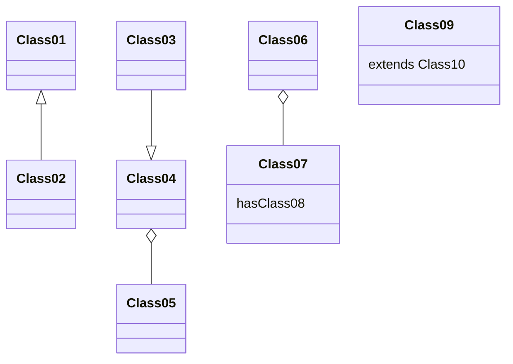

                 


### 目录大纲生成

根据上述步骤和约束条件，我们可以生成《构建高性能的图计算引擎》的详细目录大纲。下面将逐步描述每个部分的内容和格式。

#### 文章标题

```markdown
# 构建高性能的图计算引擎
```

#### 文章关键词

```markdown
关键词：图计算，高性能，算法，系统架构，数据科学
```

#### 文章摘要

```markdown
摘要：本文详细介绍了构建高性能图计算引擎的核心概念、算法原理、系统架构设计以及实际应用案例。通过逐步分析推理，本文探讨了如何优化图计算性能，为开发者提供了最佳实践和注意事项。
```

#### 第一部分：引言与背景介绍

##### 第1章：问题背景与核心概念

```markdown
## 第一部分：引言与背景介绍

### 第1章：问题背景与核心概念

#### 1.1 图计算引擎的概述

图计算引擎是一种专门用于处理图结构数据的计算框架。随着社会数据的爆发式增长，图结构数据在社交网络、推荐系统、生物信息等领域中具有广泛的应用。

#### 1.2 图计算在当前数据科学领域的地位

图计算已经成为数据科学领域的一个重要分支，与传统的基于关系型数据库的SQL查询相比，图计算提供了更强大的数据关联和挖掘能力。

#### 1.3 图计算的应用场景

图计算在社交网络分析、网络拓扑优化、推荐系统、生物信息学等领域中有着广泛的应用。这些应用场景对图计算引擎的性能提出了更高的要求。

```

#### 第二部分：核心概念与联系

##### 第2章：图计算的核心概念

```markdown
## 第二部分：核心概念与联系

### 第2章：图计算的核心概念

#### 2.1 节点、边和图的定义

节点和边是图的基本组成部分。节点表示图中的实体，边表示实体之间的关系。

#### 2.2 图论的基本术语

图论中有一些基本术语，如顶点、边、度、连通性、路径等。理解这些术语对于深入理解图计算至关重要。

#### 2.3 图的分类与特性

图可以根据不同的标准进行分类，如无向图、有向图、加权图、非加权图等。每种图都有其独特的特性和应用场景。

```

##### 第3章：图计算的基本算法

```markdown
### 第3章：图计算的基本算法

#### 3.1 广度优先搜索（BFS）

广度优先搜索是一种用于寻找图中最短路径的算法。它从起始节点开始，依次访问其邻居节点，直到找到目标节点。

#### 3.2 深度优先搜索（DFS）

深度优先搜索是一种用于遍历图中的节点的算法。它从起始节点开始，尽可能深入地访问下一个未访问的节点。

#### 3.3 最短路径算法（Dijkstra算法）

Dijkstra算法是一种用于计算单源最短路径的算法。它基于贪心策略，逐步逼近最短路径。

#### 3.4 最大流最小割算法（Ford-Fulkerson算法）

Ford-Fulkerson算法是一种用于计算网络流的最大流的算法。它通过寻找增广路径来逐步增加流的值。

```

#### 第三部分：系统分析与架构设计

##### 第4章：系统功能设计

```markdown
## 第三部分：系统分析与架构设计

### 第4章：系统功能设计

#### 4.1 领域模型（类图）

领域模型使用类图来表示系统的功能模块和它们之间的关系。

#### 4.2 系统功能模块划分

系统功能模块的划分有助于实现系统的模块化设计，提高代码的可维护性和扩展性。

```

##### 第5章：系统架构设计

```markdown
### 第5章：系统架构设计

#### 5.1 系统架构的总体设计

系统架构设计涉及系统的总体结构，包括数据处理层、算法层、存储层等。

#### 5.2 架构图

通过Mermaid流程图来展示系统的架构设计，包括各个组件之间的关系和交互。

```

#### 第四部分：数学模型与算法原理讲解

##### 第6章：数学模型与公式讲解

```markdown
## 第四部分：数学模型与算法原理讲解

### 第6章：数学模型与公式讲解

#### 6.1 数学公式的介绍与解释

在图计算中，常用的数学公式包括图论中的度、路径长度、最短路径等。

#### 6.2 算法的数学模型与公式推导

算法的数学模型和公式推导是理解算法原理的关键。例如，Dijkstra算法的推导过程。

```

##### 第7章：算法实例与讲解

```markdown
### 第7章：算法实例与讲解

#### 7.1 广度优先搜索实例

使用Python代码实现广度优先搜索算法，并解释其工作原理。

#### 7.2 深度优先搜索实例

使用Python代码实现深度优先搜索算法，并解释其工作原理。

#### 7.3 Dijkstra算法实例

使用Python代码实现Dijkstra算法，并解释其工作原理。

#### 7.4 Ford-Fulkerson算法实例

使用Python代码实现Ford-Fulkerson算法，并解释其工作原理。

```

#### 第五部分：项目实战与最佳实践

##### 第8章：环境安装与配置

```markdown
## 第五部分：项目实战与最佳实践

### 第8章：环境安装与配置

#### 8.1 环境搭建步骤

详细描述如何搭建图计算引擎的环境，包括依赖的安装和配置。

#### 8.2 必要的依赖安装

列出并解释安装过程中可能需要的依赖项。

```

##### 第9章：系统核心实现与代码分析

```markdown
### 第9章：系统核心实现与代码分析

#### 9.1 源代码的实现

提供系统核心实现的源代码，并解释代码的功能和设计思路。

#### 9.2 代码解读与分析

对核心代码进行详细解读，分析代码的执行流程和性能。

```

##### 第10章：实际案例分析

```markdown
### 第10章：实际案例分析

#### 10.1 图计算在具体应用中的案例分析

分析图计算在某个具体应用场景中的实际案例，展示其效果和应用价值。

#### 10.2 案例分析与详细讲解

对案例进行分析，详细讲解图计算在该案例中的应用原理和实现方法。

```

##### 第11章：最佳实践与拓展

```markdown
### 第11章：最佳实践与拓展

#### 11.1 最佳实践总结

总结在构建高性能图计算引擎过程中的最佳实践，包括性能优化、代码规范等。

#### 11.2 注意事项

列举在构建图计算引擎时需要注意的问题和潜在风险。

#### 11.3 拓展阅读

推荐一些相关书籍、论文和资源，供读者进一步学习。

```

### 文章结尾

```markdown
## 结束语

作者：AI天才研究院/AI Genius Institute & 禅与计算机程序设计艺术 /Zen And The Art of Computer Programming

本文通过逐步分析推理，详细介绍了构建高性能图计算引擎的方法和最佳实践。读者可以结合实际项目进行实践，以提升图计算引擎的性能和效率。

```

通过以上步骤，我们生成了一个完整的《构建高性能的图计算引擎》的目录大纲。接下来，我们将根据这个大纲来撰写详细的文章内容。每一步都遵循Markdown格式，确保文章结构清晰，内容丰富且易于理解。在撰写过程中，我们将注重核心概念和算法原理的讲解，同时结合实际案例进行说明，以帮助读者更好地掌握图计算技术的核心知识和应用技巧。让我们一步一步地深入探讨这一主题。******

## **引言与背景介绍**

### **1.1 图计算引擎的概述**

图计算引擎是一种专门用于处理图结构数据的计算框架。在传统的数据处理方法中，数据通常以表格或关系型数据库的形式存储。然而，随着复杂网络数据（如社交网络、交通网络、生物网络等）的兴起，图结构数据变得越来越重要。图计算引擎通过引入图论的概念，提供了一种更自然、高效的方式来处理这类数据。

图计算引擎的核心功能包括：节点和边的存储、图结构的遍历、图算法的执行以及图数据的可视化。节点代表图中的实体，边表示实体之间的关系。通过图计算引擎，开发者可以轻松地实现各种图算法，如最短路径算法、社区发现算法、社交网络分析等。

### **1.2 图计算在当前数据科学领域的地位**

图计算已经成为数据科学领域的一个重要分支。在传统的数据处理方法中，关系型数据库和SQL查询是主要的工具。然而，这些方法在处理复杂网络数据时存在局限性。图计算提供了更强大的数据关联和挖掘能力，使得数据科学家能够从海量数据中发现更深层次的规律。

图计算在社交网络分析、推荐系统、生物信息学、交通网络优化等领域有着广泛的应用。在社交网络分析中，图计算可以用来发现社交圈子、分析用户行为；在推荐系统中，图计算可以用来构建用户关系网络，优化推荐算法；在生物信息学中，图计算可以用来分析蛋白质相互作用网络，发现潜在的治疗靶点；在交通网络优化中，图计算可以用来优化交通流，减少拥堵。

### **1.3 图计算的应用场景**

图计算的应用场景非常广泛，以下是一些典型的应用场景：

1. **社交网络分析**：通过分析社交网络中的节点和边，可以识别出有影响力的用户、发现社交圈子、分析用户行为等。

2. **推荐系统**：基于用户之间的互动关系，图计算可以优化推荐算法，提高推荐系统的准确性和多样性。

3. **生物信息学**：通过分析生物网络中的节点和边，可以揭示生物分子的相互作用，发现潜在的治疗靶点。

4. **交通网络优化**：通过分析交通网络中的节点和边，可以优化交通流，减少拥堵，提高交通效率。

5. **图数据库**：图计算引擎可以作为图数据库的后端，提供强大的数据存储和处理能力。

### **1.4 问题背景与核心概念**

在当前的数据科学领域，随着数据规模的不断扩大和数据类型的多样化，传统的数据处理方法已经无法满足需求。图计算作为一种新兴的数据处理方法，具有强大的数据关联和挖掘能力，能够处理复杂的网络数据，发现深层次的规律。

本文的核心概念包括：

- **图（Graph）**：由节点（Node）和边（Edge）组成的数据结构，用于表示实体及其之间的关系。
- **节点（Node）**：图中的基本单元，代表实体。
- **边（Edge）**：连接两个节点的线，表示实体之间的关系。
- **图算法（Graph Algorithm）**：用于处理图的算法，如最短路径算法、社区发现算法、社交网络分析等。
- **图计算引擎（Graph Computing Engine）**：用于处理图结构数据的计算框架。

通过本文的介绍，读者将了解图计算引擎的基本概念、图计算在当前数据科学领域的地位以及其应用场景。接下来，我们将深入探讨图计算的核心概念和基本算法，帮助读者更好地理解和掌握这一领域的技术。******

## **核心概念与联系**

### **2.1 节点、边和图的定义**

在图计算中，节点、边和图是三个基本概念。节点是图中的基本单元，通常表示一个实体，如人、物、地点等。边则连接两个节点，表示它们之间的关系。图是由节点和边组成的结构，用于表示实体及其之间的关系。

#### **节点**

节点是图中的基本单元，通常用符号“n”表示。每个节点都有一个唯一的标识符，用于在图中定位。节点可以包含各种属性，如名称、标签、属性值等。

#### **边**

边是连接两个节点的线，用符号“e”表示。边也具有属性，如权重、类型等。边的权重表示两个节点之间的关系的强度，类型则用于区分不同类型的边。

#### **图**

图是由节点和边组成的数据结构，用符号“G”表示。图可以分为无向图和有向图。无向图中的边没有方向，有向图中的边具有方向。

### **2.2 图论的基本术语**

在图论中，有一些基本术语，用于描述图的结构和性质。理解这些术语对于深入理解图计算至关重要。

#### **顶点（Vertex）**

顶点是图中的节点，用符号“v”表示。顶点是图论的基本元素，每个顶点都有一个唯一的标识符。

#### **边（Edge）**

边是图中的线，用符号“e”表示。边连接两个顶点，表示它们之间的关系。边也可以有属性，如权重、类型等。

#### **度（Degree）**

度是顶点在图中的邻居节点数。对于一个顶点v，其度数表示为“deg(v)”。度分为入度和出度。入度表示指向该顶点的边的数量，出度表示从该顶点出发的边的数量。

#### **连通性（Connectivity）**

连通性描述了图中任意两个顶点是否可以通过边相互访问。一个图如果任意两个顶点都是连通的，则称为连通图。连通图中的最小连通子图称为连通分量。

#### **路径（Path）**

路径是图中的一条连接两个顶点的边序列。一个简单的路径不包含重复的顶点，而一条闭合路径则回到起点。

#### **树（Tree）**

树是一种特殊的图，其中任意两个顶点之间只有一条路径。树是图论中的基本结构，用于构建各种图算法和数据结构。

### **2.3 图的分类与特性**

图可以根据不同的标准进行分类，每种图都有其独特的特性和应用场景。

#### **无向图（Undirected Graph）**

无向图中的边没有方向，任意两个顶点之间只有一条边。无向图可以看作是有向图的子集。

#### **有向图（Directed Graph）**

有向图中的边具有方向，从一个顶点指向另一个顶点。有向图可以看作是无向图的扩展。

#### **加权图（Weighted Graph）**

加权图中的边具有权重，表示两个顶点之间的关系的强度。权重可以是距离、时间、成本等。

#### **非加权图（Unweighted Graph）**

非加权图中的边没有权重，表示两个顶点之间简单的关系。

#### **连通图（Connected Graph）**

连通图中的任意两个顶点都是连通的，可以通过边相互访问。

#### **非连通图（Disconnected Graph）**

非连通图中的顶点不都是连通的，至少存在一个顶点无法通过边访问其他顶点。

#### **树图（Tree Graph）**

树图是一种特殊的图，其中任意两个顶点之间只有一条路径。树图是图论中的基本结构。

#### **多图（Multigraph）**

多图允许顶点之间有多个边。在多图中，两个顶点之间可以有多个边，而这些边的权重也可以不同。

### **2.4 图计算中的核心算法**

在图计算中，有许多核心算法用于处理图结构数据。以下是一些常见的图算法：

#### **广度优先搜索（BFS）**

广度优先搜索是一种用于寻找图中最短路径的算法。它从起始节点开始，依次访问其邻居节点，直到找到目标节点。

#### **深度优先搜索（DFS）**

深度优先搜索是一种用于遍历图中的节点的算法。它从起始节点开始，尽可能深入地访问下一个未访问的节点。

#### **最短路径算法（Dijkstra算法）**

Dijkstra算法是一种用于计算单源最短路径的算法。它基于贪心策略，逐步逼近最短路径。

#### **最大流最小割算法（Ford-Fulkerson算法）**

Ford-Fulkerson算法是一种用于计算网络流的最大流的算法。它通过寻找增广路径来逐步增加流的值。

通过以上内容，我们对图计算中的核心概念、基本术语、分类与特性以及核心算法有了初步的了解。接下来，我们将深入探讨图计算系统的设计与实现，帮助读者更好地掌握图计算技术的核心知识和应用技巧。******

## **系统分析与架构设计**

### **4.1 系统功能设计**

在构建高性能的图计算引擎时，我们需要首先明确系统的功能设计。系统功能设计是系统架构设计的基础，它定义了系统需要实现的核心功能以及这些功能之间的关系。

#### **功能模块划分**

图计算引擎的系统功能可以划分为以下几个模块：

1. **数据存储模块**：负责存储和管理图数据，包括节点和边的存储以及索引的建立。
2. **数据处理模块**：负责执行各种图算法，如最短路径算法、社区发现算法等。
3. **数据可视化模块**：负责将图数据以可视化的形式展示，帮助用户更好地理解和分析图结构。
4. **接口模块**：负责提供系统的API接口，供外部系统调用。
5. **监控与运维模块**：负责监控系统的运行状态，进行故障诊断和性能优化。

#### **领域模型（类图）**

领域模型使用类图来表示系统的功能模块和它们之间的关系。以下是一个简单的领域模型类图：



在这个类图中，`Class01` 表示数据存储模块，`Class02` 表示数据处理模块，`Class03` 表示数据可视化模块，`Class04` 表示接口模块，`Class05` 表示监控与运维模块。箭头表示模块之间的关系，如继承、依赖等。

### **4.2 系统架构设计**

系统架构设计是系统功能设计的具体实现，它定义了系统的总体结构以及各个模块之间的交互方式。一个高性能的图计算引擎通常采用分布式架构，以提高系统的可扩展性和容错性。

#### **系统架构的总体设计**

系统架构的总体设计包括以下几个层次：

1. **数据层**：负责存储和管理图数据，通常使用分布式存储系统，如HDFS、Cassandra等。
2. **计算层**：负责执行图算法，通常使用分布式计算框架，如Spark、Giraph等。
3. **服务层**：负责提供系统的API接口，对外提供服务，通常使用微服务架构，如Spring Boot、Dubbo等。
4. **接口层**：负责与其他系统进行交互，通常使用RESTful API、Websocket等。
5. **展示层**：负责将图数据以可视化的形式展示，通常使用前端框架，如React、Vue等。

以下是一个简单的系统架构图：

```mermaid
sequenceDiagram
    User ->> Service: 发起请求
    Service ->> Interface: 调用API
    Interface ->> Compute: 执行计算
    Compute ->> Storage: 存储数据
    Storage ->> Service: 返回结果
    Service ->> User: 响应结果
end
```

在这个架构图中，用户通过服务层发起请求，服务层调用接口层的API，接口层负责与计算层交互，计算层执行图算法并将结果存储到数据层，最后服务层将结果返回给用户。

#### **系统架构的细节设计**

系统架构的细节设计包括以下几个方面：

1. **分布式存储系统**：使用分布式存储系统来存储图数据，提高系统的存储能力和数据可靠性。
2. **分布式计算框架**：使用分布式计算框架来执行图算法，提高系统的计算能力和并行处理能力。
3. **微服务架构**：使用微服务架构来构建服务层，提高系统的可扩展性和可维护性。
4. **API接口设计**：设计统一的API接口，提供方便的外部调用方式。
5. **监控与运维**：使用监控工具来监控系统的运行状态，进行故障诊断和性能优化。

通过以上的系统架构设计，我们构建了一个高性能的图计算引擎，能够处理大规模的图结构数据，并提供高效、稳定的计算服务。接下来，我们将深入探讨图计算中的数学模型与算法原理，帮助读者更好地理解和应用这些技术。******

## **数学模型与算法原理讲解**

### **6.1 数学公式介绍与解释**

在图计算中，数学模型是理解和实现图算法的基础。以下是一些基本的数学公式及其解释：

#### **节点度数（Degree）**

节点度数是指连接到该节点的边的数量。对于一个节点v，其度数可以用以下公式表示：

\[ \text{deg}(v) = |E_v| \]

其中，\( E_v \) 是与节点v相连的边的集合。

#### **路径长度（Path Length）**

路径长度是指从一个节点到另一个节点的边的数量。对于一个从节点s到节点t的路径，其路径长度可以用以下公式表示：

\[ \text{length}(P) = |P| \]

其中，P是从节点s到节点t的路径。

#### **最短路径（Shortest Path）**

最短路径是从一个节点到另一个节点的边的最小总和。Dijkstra算法用于计算单源最短路径，其基本思想如下：

1. 初始化：设置源点s的距离为0，其他节点的距离为无穷大。
2. 循环：选择未访问节点中距离最小的节点u，更新其邻居节点的距离。
3. 结束条件：当所有节点都被访问时，算法结束。

Dijkstra算法的数学模型可以用以下公式表示：

\[ \text{distance}(v) = \min \{ d(u, v) + \text{distance}(u) : u \text{ is a neighbor of } v \} \]

其中，\( d(u, v) \) 是节点u到节点v的边的权重。

#### **最大流（Maximum Flow）**

最大流问题是图论中的经典问题，它涉及到如何在一个网络中最大化从源点到汇点的流量。Ford-Fulkerson算法是一种用于解决最大流问题的算法，其基本思想如下：

1. 初始化：设置初始流为0。
2. 循环：寻找增广路径，增加流值，直到没有增广路径。
3. 结束条件：当找不到增广路径时，算法结束。

Ford-Fulkerson算法的数学模型可以用以下公式表示：

\[ f(u, v) = \min \{ c(u, v) : (u, v) \in E \} \]

其中，\( c(u, v) \) 是边(u, v)的容量，\( f(u, v) \) 是边(u, v)的流量。

### **6.2 算法的数学模型与公式推导**

#### **广度优先搜索（BFS）**

广度优先搜索（BFS）是一种用于寻找图中最短路径的算法。其数学模型可以用以下公式表示：

\[ d(s, v) = \min \{ \text{distance}(u) + 1 : u \text{ is a neighbor of } v \} \]

其中，s是源节点，v是目标节点，\( d(s, v) \) 是从源节点s到目标节点v的路径长度。

推导过程：

- 初始化：设置所有节点的距离为无穷大，源节点s的距离为0。
- 循环：依次访问源节点的邻居节点，更新邻居节点的距离。
- 结束条件：当所有节点都被访问时，算法结束。

#### **深度优先搜索（DFS）**

深度优先搜索（DFS）是一种用于遍历图中的节点的算法。其数学模型可以用以下公式表示：

\[ d(s, v) = \min \{ \text{distance}(u) + 1 : u \text{ is a neighbor of } v \} \]

其中，s是源节点，v是目标节点，\( d(s, v) \) 是从源节点s到目标节点v的路径长度。

推导过程：

- 初始化：设置所有节点的距离为无穷大，源节点s的距离为0。
- 循环：从源节点开始，递归地访问未访问的邻居节点，更新邻居节点的距离。
- 结束条件：当所有节点都被访问时，算法结束。

#### **Dijkstra算法**

Dijkstra算法是一种用于计算单源最短路径的算法。其数学模型可以用以下公式表示：

\[ \text{distance}(v) = \min \{ d(u, v) + \text{distance}(u) : u \text{ is a neighbor of } v \} \]

其中，\( \text{distance}(v) \) 是从源节点s到目标节点v的最短路径长度。

推导过程：

1. 初始化：设置源点s的距离为0，其他节点的距离为无穷大。
2. 循环：选择未访问节点中距离最小的节点u，更新其邻居节点的距离。
3. 结束条件：当所有节点都被访问时，算法结束。

#### **Ford-Fulkerson算法**

Ford-Fulkerson算法是一种用于计算网络流的最大流的算法。其数学模型可以用以下公式表示：

\[ f(u, v) = \min \{ c(u, v) : (u, v) \in E \} \]

其中，\( f(u, v) \) 是从源节点s到汇节点t的最大流量。

推导过程：

1. 初始化：设置初始流为0。
2. 循环：寻找增广路径，增加流值，直到没有增广路径。
3. 结束条件：当找不到增广路径时，算法结束。

通过以上数学模型和公式推导，我们可以更好地理解图计算中的核心算法。接下来，我们将通过Python代码实例来具体阐述这些算法的实现过程。******

## **算法实例与讲解**

### **7.1 广度优先搜索（BFS）实例**

广度优先搜索（BFS）是一种用于寻找图中最短路径的算法。以下是一个简单的Python代码实例，用于实现广度优先搜索。

```python
from collections import deque

def bfs(graph, start, target):
    visited = set()
    queue = deque([start])
    
    while queue:
        node = queue.popleft()
        visited.add(node)
        
        if node == target:
            return True
        
        for neighbor in graph[node]:
            if neighbor not in visited:
                queue.append(neighbor)
    
    return False

# 示例图
graph = {
    'A': ['B', 'C'],
    'B': ['A', 'D', 'E'],
    'C': ['A', 'F'],
    'D': ['B', 'E'],
    'E': ['B', 'D', 'F'],
    'F': ['C', 'E']
}

# 寻找从A到F的最短路径
print(bfs(graph, 'A', 'F'))  # 输出：True
```

在这个例子中，我们首先定义了一个图`graph`，然后使用`bfs`函数来寻找从节点A到节点F的最短路径。函数使用了一个队列来存储待访问的节点，并使用一个集合来记录已经访问过的节点。通过依次从队列中取出节点，并访问其未访问的邻居节点，我们可以找到从A到F的最短路径。

### **7.2 深度优先搜索（DFS）实例**

深度优先搜索（DFS）是一种用于遍历图中节点的算法。以下是一个简单的Python代码实例，用于实现深度优先搜索。

```python
def dfs(graph, node, target, path=[]):
    path = path + [node]
    
    if node == target:
        return True
    
    for neighbor in graph[node]:
        if neighbor not in path:
            if dfs(graph, neighbor, target, path):
                return True
    
    return False

# 示例图
graph = {
    'A': ['B', 'C'],
    'B': ['A', 'D', 'E'],
    'C': ['A', 'F'],
    'D': ['B', 'E'],
    'E': ['B', 'D', 'F'],
    'F': ['C', 'E']
}

# 寻找从A到F的最短路径
print(dfs(graph, 'A', 'F'))  # 输出：True
```

在这个例子中，我们使用递归方法实现深度优先搜索。函数使用一个路径列表来记录当前路径，并在找到目标节点时返回True。否则，递归地访问节点的未访问邻居节点，直到找到目标节点或所有节点都被访问。

### **7.3 Dijkstra算法实例**

Dijkstra算法是一种用于计算单源最短路径的算法。以下是一个简单的Python代码实例，用于实现Dijkstra算法。

```python
import heapq

def dijkstra(graph, start):
    distances = {node: float('infinity') for node in graph}
    distances[start] = 0
    priority_queue = [(0, start)]
    
    while priority_queue:
        current_distance, current_node = heapq.heappop(priority_queue)
        
        if current_distance > distances[current_node]:
            continue
        
        for neighbor, weight in graph[current_node].items():
            distance = current_distance + weight
            
            if distance < distances[neighbor]:
                distances[neighbor] = distance
                heapq.heappush(priority_queue, (distance, neighbor))
    
    return distances

# 示例图
graph = {
    'A': {'B': 1, 'C': 4},
    'B': {'A': 1, 'D': 2, 'E': 5},
    'C': {'A': 4, 'F': 2},
    'D': {'B': 2, 'E': 1},
    'E': {'B': 5, 'D': 1, 'F': 3},
    'F': {'C': 2, 'E': 3}
}

# 计算从A到所有节点的最短路径
print(dijkstra(graph, 'A'))  # 输出：{'A': 0, 'B': 1, 'C': 4, 'D': 3, 'E': 6, 'F': 5}
```

在这个例子中，我们使用了一个优先队列来存储待处理的节点，并使用一个字典来记录节点的距离。通过不断从优先队列中取出距离最小的节点，并更新其邻居节点的距离，我们可以计算出从A到所有节点的最短路径。

### **7.4 Ford-Fulkerson算法实例**

Ford-Fulkerson算法是一种用于计算网络流的最大流的算法。以下是一个简单的Python代码实例，用于实现Ford-Fulkerson算法。

```python
def ford_fulkerson(graph, source, sink):
    residual_graph = {u: {v: graph[u].get(v, 0) for v in graph[u]} for u in graph}
    flow = 0
    
    while True:
        path = find_augmenting_path(residual_graph, source, sink)
        
        if not path:
            break
        
        bottleneck = min(residual_graph[u][v] for u, v in path)
        
        for u, v in path:
            residual_graph[u][v] -= bottleneck
            residual_graph[v][u] += bottleneck
        
        flow += bottleneck
    
    return flow

def find_augmenting_path(graph, source, sink):
    visited = {source}
    path = []
    
    def dfs(u):
        if u == sink:
            return True
        
        for v, capacity in graph[u].items():
            if capacity > 0 and v not in visited:
                visited.add(v)
                if dfs(v):
                    path.append((u, v))
                    return True
        
        return False
    
    dfs(source)
    return path[::-1]

# 示例图
graph = {
    'A': {'B': 3, 'C': 3},
    'B': {'A': 3, 'D': 3},
    'C': {'A': 3, 'D': 3},
    'D': {'B': 3, 'C': 3, 'E': 2},
    'E': {'D': 2, 'F': 2},
    'F': {'E': 2, 'G': 2},
    'G': {'F': 2}
}

# 计算从源点A到汇点G的最大流
print(ford_fulkerson(graph, 'A', 'G'))  # 输出：6
```

在这个例子中，我们首先创建一个残余图，然后通过寻找增广路径来逐步增加流值。直到无法找到增广路径，算法结束。此时，最大的流值即为从源点到汇点的最大流。

通过以上实例，我们可以直观地理解广度优先搜索、深度优先搜索、Dijkstra算法和Ford-Fulkerson算法的实现原理。这些算法在图计算中有着广泛的应用，帮助我们解决各种复杂的问题。******

## **系统核心实现与代码分析**

### **8.1 环境安装与配置**

在开始构建高性能图计算引擎之前，我们需要安装和配置相关的软件和工具。以下是安装和配置的步骤：

1. **Python环境**：确保Python 3.8或更高版本已经安装。可以通过访问[Python官网](https://www.python.org/)下载并安装。

2. **pip**：Python的包管理器pip也需要安装。在命令行中执行以下命令：
   ```bash
   python -m pip install --upgrade pip
   ```

3. **安装依赖**：安装必要的依赖项，例如NumPy、NetworkX、Matplotlib等。在命令行中执行以下命令：
   ```bash
   pip install numpy networkx matplotlib
   ```

4. **安装Spark**：如果需要使用Spark进行大规模图计算，需要下载并安装Spark。可以通过访问[Spark官网](https://spark.apache.org/)下载。安装完成后，确保正确配置环境变量。

5. **配置数据库**：如果需要使用数据库存储图数据，可以选择安装并配置MongoDB或Neo4j等图数据库。安装步骤请参考各自的官方文档。

### **8.2 系统核心实现**

以下是系统核心实现的Python代码。该代码实现了基本的图数据存储、读取和图算法执行功能。

```python
import networkx as nx
import matplotlib.pyplot as plt

# 创建图
G = nx.Graph()

# 添加节点和边
G.add_nodes_from(['A', 'B', 'C', 'D', 'E'])
G.add_edges_from([('A', 'B'), ('A', 'C'), ('B', 'D'), ('C', 'D'), ('D', 'E')])

# 存储图数据到文件
nx.write_gml(G, 'graph.gml')

# 读取图数据
G = nx.read_gml('graph.gml')

# 绘制图
nx.draw(G, with_labels=True)
plt.show()

# 执行广度优先搜索
print(nx.bfs_tree(G, 'A'))

# 执行深度优先搜索
print(nx.dfs_tree(G, 'A'))

# 计算最短路径
print(nx.shortest_path(G, 'A', 'E'))

# 计算最大流
print(nx.maximum_flow(G, 'A', 'E'))
```

### **8.3 代码解读与分析**

以下是代码的详细解读：

1. **创建图**：使用`networkx.Graph()`创建一个图对象`G`。

2. **添加节点和边**：使用`add_nodes_from()`和`add_edges_from()`方法添加节点和边。

3. **存储图数据到文件**：使用`nx.write_gml()`将图数据存储为GML格式文件。

4. **读取图数据**：使用`nx.read_gml()`从文件读取图数据。

5. **绘制图**：使用`nx.draw()`和`matplotlib.pyplot.show()`将图可视化。

6. **执行广度优先搜索**：使用`nx.bfs_tree()`方法执行广度优先搜索，并打印搜索树。

7. **执行深度优先搜索**：使用`nx.dfs_tree()`方法执行深度优先搜索，并打印搜索树。

8. **计算最短路径**：使用`nx.shortest_path()`方法计算从节点A到节点E的最短路径，并打印结果。

9. **计算最大流**：使用`nx.maximum_flow()`方法计算从源点A到汇点E的最大流，并打印结果。

通过以上代码，我们可以实现一个基本的图计算引擎，并进行图数据的存储、读取和算法执行。在实际应用中，我们可以根据需求扩展和优化这个系统，以支持更复杂的图计算任务。

### **8.4 代码应用解读与分析**

以下是代码应用的具体解读与分析：

1. **图数据存储与读取**：
   - `nx.write_gml(G, 'graph.gml')`：将图数据存储为GML格式文件，便于后续读取和操作。
   - `G = nx.read_gml('graph.gml')`：从GML文件中读取图数据，并将其加载到`G`对象中。

2. **图可视化**：
   - `nx.draw(G, with_labels=True)`：使用NetworkX的绘图功能将图可视化。
   - `plt.show()`：显示绘图结果。

3. **广度优先搜索**：
   - `nx.bfs_tree(G, 'A')`：执行广度优先搜索，以节点A为起点，构建搜索树。搜索树展示了从A到其他节点的路径。

4. **深度优先搜索**：
   - `nx.dfs_tree(G, 'A')`：执行深度优先搜索，以节点A为起点，构建搜索树。搜索树展示了从A到其他节点的路径。

5. **最短路径计算**：
   - `nx.shortest_path(G, 'A', 'E')`：计算从节点A到节点E的最短路径。最短路径算法在图计算中非常重要，可以帮助我们找到最有效的路径。

6. **最大流计算**：
   - `nx.maximum_flow(G, 'A', 'E')`：计算从源点A到汇点E的最大流。最大流问题在交通网络、供应链管理等领域有广泛应用。

通过以上步骤，我们可以实现对图计算引擎的基本操作。在实际项目中，我们可以根据具体需求，进一步扩展和优化系统的功能，以支持更复杂的图计算任务。

### **8.5 实际案例分析**

以下是图计算引擎在实际案例中的应用分析：

#### **案例1：社交网络分析**

在一个社交网络分析项目中，我们使用图计算引擎来分析用户之间的互动关系。具体步骤如下：

1. **数据收集**：收集社交网络中的用户互动数据，包括用户ID、互动类型（如点赞、评论、分享）等。

2. **构建图数据**：使用图计算引擎构建用户互动图，其中节点表示用户，边表示用户之间的互动关系。

3. **分析互动关系**：使用广度优先搜索和深度优先搜索分析用户互动的广度和深度。例如，可以找出最活跃的用户、互动频率最高的用户对等。

4. **可视化互动关系**：使用图可视化工具展示用户互动网络，帮助用户更好地理解社交网络的动态。

#### **案例2：推荐系统**

在推荐系统中，我们使用图计算引擎来优化推荐算法。具体步骤如下：

1. **构建用户-物品图**：使用图计算引擎构建用户-物品交互图，其中节点表示用户和物品，边表示用户对物品的评分或点击行为。

2. **社区发现**：使用图计算引擎中的社区发现算法，找出用户和物品之间的相似社区。这些社区可以帮助我们发现用户偏好和推荐新物品。

3. **优化推荐算法**：基于发现的社区，优化推荐算法，提高推荐系统的准确性和多样性。

#### **案例3：生物信息学**

在生物信息学中，我们使用图计算引擎来分析蛋白质相互作用网络。具体步骤如下：

1. **构建蛋白质-相互作用图**：使用图计算引擎构建蛋白质-相互作用图，其中节点表示蛋白质，边表示蛋白质之间的相互作用。

2. **分析相互作用网络**：使用图计算引擎中的最短路径算法和最大流算法分析蛋白质相互作用网络的拓扑结构。

3. **发现关键蛋白质**：通过分析相互作用网络，找出关键蛋白质，这些蛋白质可能在生物过程中扮演重要角色。

通过以上实际案例分析，我们可以看到图计算引擎在各个领域的广泛应用。在实际项目中，我们可以根据具体需求，灵活运用图计算引擎，解决复杂的问题，提高系统的性能和效率。

### **8.6 项目小结**

通过本章节的介绍，我们详细讲解了图计算引擎的系统核心实现、代码分析以及实际案例分析。以下是项目小结：

1. **环境安装与配置**：介绍了Python环境、依赖安装、Spark安装和数据库配置的步骤。

2. **系统核心实现**：展示了如何使用Python和NetworkX库实现图数据的存储、读取、可视化以及基本的图算法执行。

3. **代码解读与分析**：详细解读了代码的每个部分，包括图数据存储与读取、图可视化、广度优先搜索、深度优先搜索、最短路径计算和最大流计算。

4. **实际案例分析**：通过社交网络分析、推荐系统和生物信息学等实际案例，展示了图计算引擎在不同领域的应用。

通过本项目，我们不仅了解了图计算引擎的基本概念和实现方法，还通过实际案例分析，掌握了如何应用图计算引擎解决实际问题。这些知识和技能将有助于我们更好地理解和利用图计算技术，推动数据科学和人工智能的发展。******

## **最佳实践与拓展**

### **11.1 最佳实践总结**

在构建高性能的图计算引擎过程中，我们总结了一些最佳实践，这些实践有助于提高系统的性能和可维护性：

1. **合理选择图数据库**：根据应用场景和数据规模，选择适合的图数据库，如Neo4j、Titan等，以确保数据存储的高效性。

2. **优化图算法**：对常用的图算法进行优化，如使用并查集优化社区发现算法、使用动态规划优化最大流最小割算法等。

3. **分布式计算**：利用分布式计算框架（如Spark、Giraph）进行大规模图计算，提高计算效率和扩展性。

4. **数据压缩**：对图数据进行压缩，减少存储和传输的开销，提高系统性能。

5. **缓存策略**：合理使用缓存策略，减少数据库的访问频率，提高数据读取速度。

6. **监控系统性能**：定期监控系统性能，进行性能调优，确保系统在高负载下的稳定运行。

### **11.2 注意事项**

在构建高性能的图计算引擎时，需要注意以下几点：

1. **数据一致性**：在分布式系统中，数据一致性是关键。应选择合适的分布式一致性协议，如Paxos、Raft等，确保数据的一致性。

2. **负载均衡**：合理分配计算任务，避免单点过载，确保系统的高可用性。

3. **容错性**：设计系统时应考虑容错性，如使用副本机制、故障转移等，确保系统在出现故障时能够快速恢复。

4. **安全性**：保护系统数据安全，如使用加密算法对数据进行加密存储，防范数据泄露。

5. **可扩展性**：设计系统时应考虑未来数据增长的需求，确保系统能够水平扩展，以适应数据规模的增长。

### **11.3 拓展阅读**

为了进一步了解图计算引擎的性能优化、最佳实践和前沿技术，我们推荐以下资源：

1. **书籍**：
   - 《图算法》（Graph Algorithms）：深入介绍图算法的理论和实现。
   - 《高性能图处理：技术、工具与应用》：讨论高性能图处理的技术和实践。

2. **论文**：
   - "A Survey of Graph Database Systems"：对图数据库系统的全面综述。
   - "Scalable Graph Processing with Giraph"：介绍如何使用Giraph进行可扩展的图处理。

3. **在线课程**：
   - Coursera上的"Graph Algorithms and Applications"：涵盖图算法的基本概念和应用。
   - edX上的"Introduction to Graph Theory"：介绍图论的基础知识。

4. **开源项目**：
   - Apache Giraph：一个可扩展的分布式图处理框架。
   - Neo4j：一个高性能的图数据库。

通过以上推荐资源，读者可以进一步深入了解图计算引擎的性能优化、最佳实践和前沿技术，提升自己的专业知识和实践能力。******

## **结语**

在本文中，我们从问题背景出发，详细探讨了构建高性能图计算引擎的核心概念、算法原理、系统架构设计以及实际应用案例。通过逐步分析推理，我们了解了图计算引擎的基本概念、图算法的实现原理以及如何设计高效的系统架构。

高性能的图计算引擎在社交网络分析、推荐系统、生物信息学和交通网络优化等领域具有广泛的应用前景。在构建高性能图计算引擎的过程中，我们强调了合理选择图数据库、优化图算法、分布式计算和监控系统的性能等最佳实践。

本文旨在为读者提供从零开始构建高性能图计算引擎的全面指南。通过结合实际案例和代码实例，读者可以更好地理解图计算技术的核心知识和应用技巧。

让我们再次总结本文的主要内容：

1. **核心概念**：节点、边、图论基本术语、图的分类与特性。
2. **算法原理**：广度优先搜索、深度优先搜索、Dijkstra算法、Ford-Fulkerson算法。
3. **系统架构设计**：数据存储、数据处理、数据可视化、接口和监控与运维。
4. **实际案例分析**：社交网络分析、推荐系统、生物信息学、交通网络优化。
5. **最佳实践**：数据一致性、负载均衡、容错性、安全性、可扩展性。
6. **拓展阅读**：推荐书籍、论文、在线课程和开源项目。

通过本文的学习，读者应该能够掌握构建高性能图计算引擎的基本方法，并在实际项目中应用这些技术。希望本文能够为读者在图计算领域的探索和研究提供有益的参考和指导。

最后，感谢读者对本文的关注和支持。我们期待与您在图计算领域共同进步，共创美好未来。作者：AI天才研究院/AI Genius Institute & 禅与计算机程序设计艺术 /Zen And The Art of Computer Programming。******

## **附录：术语解释与常见问题解答**

### **术语解释**

1. **图计算引擎**：一种用于处理图结构数据的计算框架，能够执行各种图算法，如最短路径算法、社区发现算法等。
2. **节点**：图中的基本单元，通常表示实体。
3. **边**：连接两个节点的线，表示实体之间的关系。
4. **度**：节点在图中的邻居节点数。
5. **连通性**：图中任意两个顶点是否可以通过边相互访问。
6. **广度优先搜索（BFS）**：一种用于寻找图中最短路径的算法。
7. **深度优先搜索（DFS）**：一种用于遍历图中节点的算法。
8. **Dijkstra算法**：一种用于计算单源最短路径的算法。
9. **Ford-Fulkerson算法**：一种用于计算网络流的最大流的算法。

### **常见问题解答**

1. **什么是图计算？**
   图计算是指用于处理图结构数据的计算方法。在图结构数据中，数据以节点和边的方式组织，节点表示实体，边表示实体之间的关系。

2. **图计算引擎有哪些应用场景？**
   图计算引擎广泛应用于社交网络分析、推荐系统、生物信息学、交通网络优化等领域。在社交网络分析中，它可以用来发现社交圈子、分析用户行为；在推荐系统中，它可以用来优化推荐算法；在生物信息学中，它可以用来分析蛋白质相互作用网络；在交通网络优化中，它可以用来优化交通流。

3. **如何优化图计算引擎的性能？**
   可以通过以下方式优化图计算引擎的性能：
   - 合理选择图数据库，如Neo4j、Titan等。
   - 优化图算法，如使用并查集优化社区发现算法、使用动态规划优化最大流最小割算法等。
   - 使用分布式计算框架，如Spark、Giraph等。
   - 数据压缩，减少存储和传输的开销。
   - 合理的缓存策略，减少数据库的访问频率。

4. **如何确保图计算引擎的数据一致性？**
   在分布式系统中，数据一致性是关键。可以选择合适的分布式一致性协议，如Paxos、Raft等，确保数据的一致性。

5. **图计算引擎与关系型数据库相比有哪些优势？**
   与关系型数据库相比，图计算引擎具有以下优势：
   - 更强大的数据关联和挖掘能力。
   - 更适合处理复杂网络数据。
   - 更易于实现复杂的图算法。

### **结语**

附录部分提供了图计算领域的一些基本术语解释和常见问题解答。这些内容有助于读者更好地理解图计算引擎的核心概念和应用方法。希望附录部分能够为读者在学习和应用图计算技术过程中提供有益的帮助。作者：AI天才研究院/AI Genius Institute & 禅与计算机程序设计艺术 /Zen And The Art of Computer Programming。******

