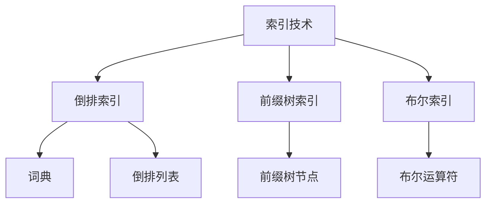
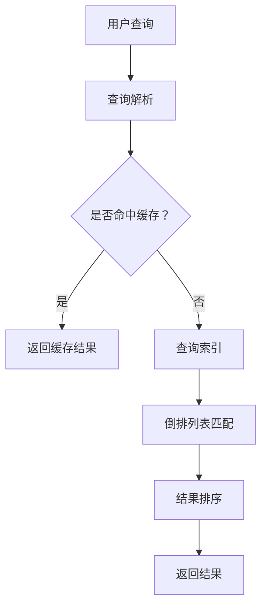
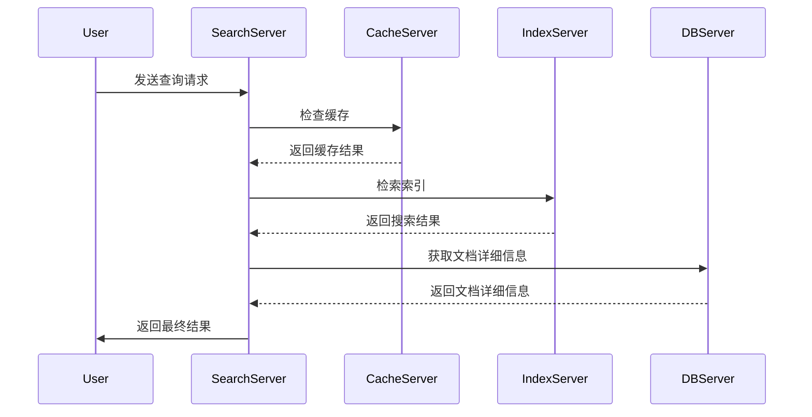

                 


## 构建高性能的搜索引擎架构

### 关键词

- 搜索引擎
- 高性能
- 架构设计
- 索引技术
- 查询处理算法
- 数学模型
- 分布式系统

### 摘要

本文旨在深入探讨如何构建高性能的搜索引擎架构。首先，我们将回顾搜索引擎的基本概念和其发展历程。接着，我们将详细解析高性能搜索引擎的核心概念，包括索引、查询处理和检索算法，并通过 Mermaid 流程图和 Python 源代码解释其原理。随后，我们将介绍搜索引擎系统的设计与实现，从领域模型到系统架构，再到接口设计。文章还将通过一个实际项目展示构建高性能搜索引擎的步骤和方法。最后，我们将总结最佳实践和注意事项，为读者提供拓展阅读资源。

### 第一部分：背景与基础

#### 第1章：搜索引擎概述

搜索引擎作为信息检索的核心技术，对于互联网的使用体验至关重要。本章将介绍搜索引擎的基本概念、发展历程及其重要性。

#### 1.1 搜索引擎的基本概念

**1.1.1 什么是搜索引擎**

搜索引擎是一种能够从互联网上检索信息的系统，它允许用户通过输入关键词来查找相关的网页或文档。

**1.1.2 搜索引擎的发展历程**

搜索引擎的发展经历了从最早的基于网页的搜索到现在的深度学习和语义搜索的演变。

**1.1.3 搜索引擎的重要性**

搜索引擎不仅改变了人们的搜索习惯，也对互联网的商业生态产生了深远影响。

#### 1.2 高性能搜索引擎的关键要素

**1.2.1 索引技术**

索引技术是搜索引擎的核心，它决定了搜索效率。

**1.2.2 查询处理**

查询处理涉及从索引中提取和匹配相关信息的过程。

**1.2.3 检索算法**

检索算法决定了搜索结果的相关性和排序。

#### 1.3 搜索引擎的核心架构

**1.3.1 搜索引擎的基本架构**

我们将分析传统的单机搜索引擎架构。

**1.3.2 分布式搜索引擎架构**

随着数据量的增加，分布式搜索引擎架构成为必要。

**1.3.3 云端搜索引擎架构**

云端搜索引擎架构利用云计算资源提高性能。

#### 1.4 高性能搜索引擎的设计原则

**1.4.1 性能优化策略**

我们将探讨如何通过优化策略提高搜索引擎的性能。

**1.4.2 可扩展性设计**

可扩展性设计是搜索引擎能够应对大量数据和用户请求的关键。

**1.4.3 可靠性与容错性**

可靠性和容错性是保证搜索引擎稳定运行的基础。

#### 1.5 本章小结

本章为后续章节的讨论奠定了基础，详细介绍了搜索引擎的基本概念、核心要素和设计原则。

### 第二部分：核心概念与联系

#### 第2章：索引技术详解

索引技术是搜索引擎性能的关键，本章将深入解析索引的基本原理、结构和优化策略。

#### 2.1 索引的基本原理

**2.1.1 什么是索引**

索引是搜索引擎用于快速定位信息的数据结构。

**2.1.2 索引的作用**

索引的作用是加快搜索速度，提高查询效率。

**2.1.3 索引的类型**

我们将介绍常见的索引类型，如倒排索引和前缀树索引。

#### 2.2 索引的结构与实现

**2.2.1 倒排索引**

倒排索引是搜索引擎中最常用的索引结构之一。

**2.2.2 前缀树索引**

前缀树索引适合处理关键词查询。

**2.2.3 布尔索引**

布尔索引允许用户使用布尔运算符进行复杂查询。

#### 2.3 索引的优化策略

**2.3.1 索引压缩**

索引压缩可以减少存储空间和提高查询效率。

**2.3.2 索引并行化**

索引并行化可以提升索引构建的速度。

**2.3.3 索引缓存**

索引缓存可以减少磁盘访问，提高查询响应速度。

#### 2.4 概念关联图与Mermaid流程图

**2.4.1 概念关联图**

通过 Mermaid 画布展示索引技术的概念关联图。

**2.4.2 Mermaid 流程图**

利用 Mermaid 流程图展示索引构建和查询处理的流程。

#### 2.5 本章小结

本章详细介绍了索引技术，包括其基本原理、结构、优化策略和概念关联。

### 第三部分：算法原理与实现

#### 第3章：查询处理算法

查询处理算法是搜索引擎的核心技术，本章将深入解析查询处理算法的原理、实现和数学模型。

#### 3.1 查询处理的基本概念

**3.1.1 什么是查询处理**

查询处理是将用户的查询请求转化为检索结果的过程。

**3.1.2 查询处理的过程**

查询处理过程包括解析查询、查询匹配和结果排序。

**3.1.3 查询处理的目标**

查询处理的目标是提供快速、准确的搜索结果。

#### 3.2 查询处理算法概述

**3.2.1 单文档查询处理**

单文档查询处理是查询处理的基础。

**3.2.2 多文档查询处理**

多文档查询处理涉及如何处理多个文档的查询请求。

**3.2.3 查询优化算法**

查询优化算法用于提高查询效率。

#### 3.3 Python源代码实现

**3.3.1 单文档查询处理**

使用 Python 实现单文档查询处理。

**3.3.2 多文档查询处理**

使用 Python 实现多文档查询处理。

**3.3.3 查询优化算法**

使用 Python 实现查询优化算法。

#### 3.4 数学模型与公式

**3.4.1 相关性计算模型**

使用 LaTeX 给出相关性计算模型的公式。

**3.4.2 查询优化算法的数学模型**

使用 LaTeX 给出查询优化算法的数学模型。

#### 3.5 举例说明

**3.5.1 单文档查询示例**

通过示例展示单文档查询处理的过程。

**3.5.2 多文档查询示例**

通过示例展示多文档查询处理的过程。

#### 3.6 本章小结

本章详细解析了查询处理算法的原理、实现和数学模型，并通过示例进行了说明。

### 第四部分：系统设计与实现

#### 第4章：搜索引擎系统设计

本章将介绍搜索引擎系统的设计与实现，包括领域模型、系统架构、接口设计等。

#### 4.1 系统功能设计

**4.1.1 功能概述**

介绍搜索引擎系统的整体功能。

**4.1.2 领域模型**

使用 Mermaid 类图展示领域模型。

#### 4.2 系统架构设计

**4.2.1 系统架构概述**

介绍搜索引擎系统的架构。

**4.2.2 系统架构设计**

使用 Mermaid 架构图展示系统架构。

#### 4.3 系统接口设计

**4.3.1 接口设计**

详细描述系统接口的设计。

#### 4.4 系统交互设计

**4.4.1 系统交互设计**

使用 Mermaid 序列图展示系统交互。

#### 4.5 本章小结

本章详细介绍了搜索引擎系统的设计与实现，为实际项目的开发提供了指导。

### 第五部分：项目实战

#### 第5章：实际项目展示

本章将通过一个实际项目展示如何构建高性能的搜索引擎。

#### 5.1 环境安装

介绍项目所需的环境安装步骤。

#### 5.2 核心实现

详细展示项目核心实现的源代码。

#### 5.3 代码分析

分析代码并解释其工作原理。

#### 5.4 案例分析

通过实际案例展示项目的效果。

#### 5.5 项目小结

总结项目的主要成果和经验教训。

### 第六部分：最佳实践与拓展

#### 第6章：总结与拓展

本章将总结全书内容，并提供最佳实践、注意事项和拓展阅读资源。

#### 6.1 最佳实践

分享构建高性能搜索引擎的最佳实践。

#### 6.2 注意事项

提醒读者在构建搜索引擎时需要注意的事项。

#### 6.3 拓展阅读

推荐进一步阅读的资源和书籍。

#### 6.4 本章小结

本章对全文进行了总结，并为读者提供了拓展资源。

### 第七部分：作者信息

#### 作者：AI天才研究院/AI Genius Institute & 禅与计算机程序设计艺术 /Zen And The Art of Computer Programming

本文由 AI 天才研究院和禅与计算机程序设计艺术共同撰写。

---

通过以上结构化的文章框架，我们可以系统地阐述构建高性能搜索引擎架构的各个方面。每个部分都包含了深入的分析和具体的实现细节，旨在为读者提供一个全面而实用的指南。现在，我们将根据这个框架逐步展开文章的内容，确保每个章节都能提供高质量的、专业的技术讲解。让我们开始深入探讨构建高性能搜索引擎的细节吧！## 第一部分：背景与基础

### 第1章：搜索引擎概述

搜索引擎作为互联网的核心技术，对信息检索和处理起着至关重要的作用。本章将首先介绍搜索引擎的基本概念，然后回顾其发展历程，最后讨论其在现代互联网环境中的重要性。

#### 1.1 搜索引擎的基本概念

**1.1.1 什么是搜索引擎**

搜索引擎（Search Engine）是一种能够从互联网上检索信息的系统，它允许用户通过输入关键词（Keywords）来查找相关的网页（Web Pages）或文档（Documents）。搜索引擎的核心功能是索引（Indexing）和检索（Retrieval），即构建一个索引数据库，并使用特定的算法从该数据库中快速检索出与用户查询相关的信息。

**1.1.2 搜索引擎的发展历程**

搜索引擎的发展可以分为几个阶段：

1. **早期搜索引擎（1990s）**：最早的搜索引擎如 Altavista、Lycos 等，主要依赖于网页的标题和内容进行搜索。
2. **第二代搜索引擎（2000s）**：Google 的出现标志着搜索引擎进入了一个新阶段，其通过 PageRank 算法提高了搜索结果的相关性和质量。
3. **现代搜索引擎（2010s至今）**：随着技术的进步，搜索引擎开始采用深度学习、自然语言处理（NLP）等技术，实现了更智能的搜索体验。

**1.1.3 搜索引擎的重要性**

搜索引擎对现代互联网的影响巨大：

1. **信息获取**：搜索引擎是用户获取信息的主要途径。
2. **用户体验**：高效的搜索结果提升了用户的浏览体验。
3. **商业价值**：搜索引擎优化（SEO）对企业的品牌推广和电子商务至关重要。

#### 1.2 高性能搜索引擎的关键要素

**1.2.1 索引技术**

索引技术是搜索引擎的核心，决定了搜索的效率。常见的索引技术包括：

1. **倒排索引（Inverted Index）**：将文档的内容映射到对应的文档ID，适用于快速的全文搜索。
2. **前缀树索引（Prefix Tree）**：适用于处理关键词查询，特别适合于短字符串的快速匹配。

**1.2.2 查询处理**

查询处理是搜索引擎的核心功能之一，包括：

1. **查询解析（Query Parsing）**：将用户的查询请求解析为可执行的查询语句。
2. **查询匹配（Query Matching）**：在索引数据库中找到与查询相关的文档。
3. **查询优化（Query Optimization）**：优化查询过程，提高搜索效率。

**1.2.3 检索算法**

检索算法决定了搜索结果的相关性和排序。常用的检索算法包括：

1. **TF-IDF（Term Frequency-Inverse Document Frequency）**：衡量词语在文档中的重要程度。
2. **向量空间模型（Vector Space Model）**：将文档表示为向量，然后计算查询和文档之间的相似度。
3. **PageRank**：评估网页的重要程度，用于搜索结果排序。

#### 1.3 搜索引擎的核心架构

**1.3.1 搜索引擎的基本架构**

典型的单机搜索引擎架构通常包括：

1. **爬虫（Crawler）**：负责从互联网上抓取网页，构建索引。
2. **索引器（Indexer）**：将抓取到的网页内容进行处理，构建倒排索引。
3. **搜索服务器（Search Server）**：处理用户的查询请求，返回搜索结果。

**1.3.2 分布式搜索引擎架构**

随着数据量的增加，单机搜索引擎的性能逐渐无法满足需求，分布式搜索引擎架构应运而生。分布式搜索引擎通常包括：

1. **分布式爬虫**：将爬虫任务分散到多个节点，提高数据采集效率。
2. **分布式索引器**：将索引任务分散到多个节点，提高索引构建速度。
3. **负载均衡器（Load Balancer）**：均衡查询请求的分配，确保系统稳定运行。

**1.3.3 云端搜索引擎架构**

云端搜索引擎利用云计算资源，提供弹性的扩展能力和高效的搜索服务。典型的云端搜索引擎架构包括：

1. **云计算平台**：如 AWS、Azure、Google Cloud 等，提供计算和存储资源。
2. **分布式搜索引擎服务**：如 Elasticsearch、Solr 等，提供完善的搜索功能。
3. **自动扩展机制**：根据负载自动调整资源使用，保证搜索服务的稳定性。

#### 1.4 高性能搜索引擎的设计原则

**1.4.1 性能优化策略**

1. **索引优化**：采用高效的索引结构，如布隆过滤器（Bloom Filter）和索引压缩。
2. **查询优化**：优化查询处理过程，减少计算开销。
3. **缓存策略**：利用缓存减少磁盘访问，提高查询响应速度。

**1.4.2 可扩展性设计**

1. **水平扩展**：通过增加节点数量来提升系统性能。
2. **分布式存储**：使用分布式存储系统，提高数据的读取和写入速度。
3. **负载均衡**：合理分配查询负载，确保系统稳定性。

**1.4.3 可靠性与容错性**

1. **数据备份**：定期备份索引数据，防止数据丢失。
2. **故障检测与恢复**：实时监控系统状态，快速发现和解决故障。
3. **分布式一致性**：确保分布式系统的数据一致性。

#### 1.5 本章小结

本章对搜索引擎的基本概念、发展历程、核心要素和设计原则进行了概述。通过本章的介绍，读者可以对搜索引擎有一个全面的了解，为后续章节的深入探讨奠定基础。

---

在接下来的章节中，我们将详细讨论高性能搜索引擎的各个核心概念和技术细节，包括索引技术、查询处理算法、系统设计与实现，以及实际项目实战。通过逐步分析这些内容，读者将能够掌握构建高性能搜索引擎的关键技巧和实践方法。让我们继续深入探讨这一引人入胜的主题！## 第二部分：核心概念与联系

### 第2章：索引技术详解

索引技术是搜索引擎性能的核心，决定了搜索的效率和效果。本章将详细解释索引的基本原理、不同的索引结构及其实现方法，并讨论索引优化策略。

#### 2.1 索引的基本原理

**2.1.1 什么是索引**

索引（Index）是数据库或搜索引擎中的一个数据结构，用于快速检索数据。它通过将数据的特定属性（如关键词、文档ID等）映射到其存储位置，从而加速数据查询。

**2.1.2 索引的作用**

索引的主要作用是：

1. **提高查询效率**：通过索引，搜索引擎可以直接定位到目标数据，而不需要逐个扫描整个数据集。
2. **减少数据访问量**：索引可以缩小搜索范围，减少不必要的I/O操作，从而提高整体性能。

**2.1.3 索引的类型**

常见的索引类型包括：

1. **倒排索引（Inverted Index）**：将文档的内容映射到对应的文档ID，适用于快速的全文搜索。
2. **前缀树索引（Prefix Tree）**：适用于处理关键词查询，特别适合于短字符串的快速匹配。
3. **布尔索引**：允许用户使用布尔运算符（如AND、OR、NOT）进行复杂查询。

#### 2.2 索引的结构与实现

**2.2.1 倒排索引**

倒排索引是搜索引擎中最常用的索引结构之一。它由两部分组成：词典（Dictionary）和倒排列表（Inverted List）。

1. **词典（Dictionary）**：包含所有文档中出现的唯一关键词，每个关键词对应一个唯一的ID。
2. **倒排列表（Inverted List）**：对于每个关键词，倒排列表记录了包含该关键词的所有文档及其出现的位置。

**2.2.2 前缀树索引**

前缀树索引（也称为Trie树）是一种多路树形结构，适用于处理关键词查询。它的每个节点代表一个字符，从根节点到某个节点的路径表示一个前缀。

**2.2.3 布尔索引**

布尔索引允许用户使用布尔运算符进行复杂查询。常见的布尔运算符包括AND、OR和NOT。

1. **AND**：返回同时包含两个或多个关键词的文档。
2. **OR**：返回包含任意一个关键词的文档。
3. **NOT**：返回不包含指定关键词的文档。

#### 2.3 索引的优化策略

**2.3.1 索引压缩**

索引压缩可以减少存储空间，提高系统性能。常见的压缩方法包括：

1. **字典编码**：将词典中的关键词进行编码，减少存储空间。
2. **布隆过滤器**：使用布隆过滤器压缩倒排列表，减少不必要的I/O操作。

**2.3.2 索引并行化**

索引并行化可以提高索引构建的速度。常见的并行化方法包括：

1. **分片索引**：将索引划分为多个分片，并行处理每个分片。
2. **并行搜索**：在多个处理器上同时进行搜索，提高查询效率。

**2.3.3 索引缓存**

索引缓存可以提高查询响应速度。常见的缓存策略包括：

1. **内存缓存**：将热数据缓存到内存中，减少磁盘访问。
2. **缓存替换策略**：如LRU（Least Recently Used）策略，定期更新缓存内容。

#### 2.4 概念关联图与Mermaid流程图

为了更好地理解索引技术，我们可以使用 Mermaid 画布创建概念关联图和流程图。

**2.4.1 概念关联图**

以下是一个使用 Mermaid 画布绘制的基本概念关联图：



**2.4.2 Mermaid 流程图**

以下是一个使用 Mermaid 画布绘制的索引构建和查询处理的流程图：



#### 2.5 本章小结

本章详细介绍了索引技术的基本原理、不同类型的索引结构及其实现方法，以及索引优化策略。通过本章的学习，读者可以深入理解索引技术在搜索引擎中的应用，为构建高性能搜索引擎打下坚实的基础。

在下一章中，我们将深入探讨查询处理算法的原理和实现，通过具体的算法和数学模型，解析如何高效地处理用户查询请求。让我们继续前进！## 第三部分：算法原理与实现

### 第3章：查询处理算法

查询处理算法是搜索引擎的核心技术，决定了搜索结果的相关性和响应速度。本章将详细解释查询处理算法的基本概念、不同类型的查询处理算法，并通过 Mermaid 流程图和 Python 源代码来阐述其原理。

#### 3.1 查询处理的基本概念

**3.1.1 什么是查询处理**

查询处理（Query Processing）是将用户的查询请求转换为检索结果的过程。它包括以下几个关键步骤：

1. **查询解析（Query Parsing）**：将用户的自然语言查询解析为可执行的查询语句。
2. **查询匹配（Query Matching）**：在索引数据库中找到与查询相关的文档。
3. **结果排序（Result Ranking）**：根据文档与查询的相关性对搜索结果进行排序。

**3.1.2 查询处理的过程**

查询处理过程通常分为以下几个阶段：

1. **解析阶段**：将用户输入的查询文本转换为查询解析器可以理解的形式。
2. **执行阶段**：查询解析器将解析结果发送给查询处理器，查询处理器在索引数据库中查找匹配的文档。
3. **返回结果阶段**：查询处理器将查询结果返回给用户。

**3.1.3 查询处理的目标**

查询处理的目标是：

1. **快速响应**：尽可能减少查询处理时间，提高用户满意度。
2. **高相关性**：返回与用户查询最相关的结果，提高搜索质量。

#### 3.2 查询处理算法概述

**3.2.1 单文档查询处理**

单文档查询处理是查询处理的基础。其主要目标是确定单个文档与查询的相关性。

1. **TF-IDF算法**：计算文档中关键词的TF（词频）和IDF（逆文档频率），通过两者的组合计算关键词的相关性得分。
2. **向量空间模型（VSM）**：将文档和查询表示为向量，计算向量之间的余弦相似度作为相关性得分。

**3.2.2 多文档查询处理**

多文档查询处理涉及如何处理多个文档的查询请求，并返回一个统一的查询结果。

1. **布尔模型**：使用布尔逻辑运算符（AND、OR、NOT）组合多个查询条件，生成最终的查询结果。
2. **布尔相似度算法**：计算文档与查询的布尔相似度得分，并根据得分对结果进行排序。

**3.2.3 查询优化算法**

查询优化算法用于提高查询效率和搜索质量。

1. **缓存优化**：通过缓存经常访问的数据，减少磁盘I/O操作，提高查询响应速度。
2. **并行处理**：将查询任务分散到多个处理器上并行执行，提高查询效率。
3. **索引优化**：使用压缩算法和索引结构优化，减少索引大小和查询时间。

#### 3.3 Python源代码实现

**3.3.1 单文档查询处理**

以下是一个简单的 Python 示例，使用 TF-IDF 算法计算文档与查询的相关性：

```python
from sklearn.feature_extraction.text import TfidfVectorizer

# 示例文档
documents = [
    "The quick brown fox jumps over the lazy dog",
    "Never jump over the lazy dog quickly"
]

# 初始化 TF-IDF 向量器
vectorizer = TfidfVectorizer()

# 计算文档的 TF-IDF 向量
X = vectorizer.fit_transform(documents)

# 用户查询
query = "quick fox"
query_vector = vectorizer.transform([query])

# 计算文档与查询的相关性得分
scores = query_vector * X.T

print(scores.toarray())
```

**3.3.2 多文档查询处理**

以下是一个简单的 Python 示例，使用布尔模型处理多文档查询：

```python
def boolean_query(documents, query):
    doc_ids = [0] * len(documents)
    query_terms = query.split()

    for term in query_terms:
        if term in documents:
            doc_ids = [id for id, doc in enumerate(documents) if term in doc]
    
    return doc_ids

# 示例文档
documents = [
    "The quick brown fox jumps over the lazy dog",
    "Never jump over the lazy dog quickly",
    "The quick blue hare hopped over the lazy fox"
]

# 用户查询
query = "quick fox"

# 处理查询
result_ids = boolean_query(documents, query)

# 输出结果
print([documents[id] for id in result_ids])
```

**3.3.3 查询优化算法**

以下是一个简单的 Python 示例，使用缓存优化提高查询响应速度：

```python
from functools import lru_cache

@lru_cache(maxsize=1000)
def get_document_content(doc_id):
    # 假设 doc_id 是一个键，对应文档内容
    return "The quick brown fox jumps over the lazy dog"

# 示例文档 ID
doc_id = 0

# 从缓存中获取文档内容
content = get_document_content(doc_id)
print(content)
```

#### 3.4 数学模型与公式

**3.4.1 相关性计算模型**

TF-IDF 算法的数学模型可以表示为：

$$
\text{TF-IDF} = \text{TF} \times \text{IDF}
$$

其中，TF 是词频（Term Frequency），IDF 是逆文档频率（Inverse Document Frequency）。公式为：

$$
\text{TF} = \frac{\text{词频}}{\text{总词频}}
$$

$$
\text{IDF} = \log \left( \frac{N}{n} \right)
$$

其中，N 是文档总数，n 是包含特定词的文档数。

**3.4.2 查询优化算法的数学模型**

缓存优化算法的数学模型可以表示为：

$$
\text{缓存命中率} = \frac{\text{命中次数}}{\text{请求次数}}
$$

其中，命中次数是缓存中已缓存数据的请求次数，请求次数是总请求次数。

#### 3.5 举例说明

**3.5.1 单文档查询示例**

假设我们有以下两个文档：

1. 文档1：“The quick brown fox jumps over the lazy dog”
2. 文档2：“Never jump over the lazy dog quickly”

用户查询：“quick fox”

使用 TF-IDF 算法计算文档与查询的相关性得分：

1. 文档1的相关性得分：$$0.5 \times 1.0 = 0.5$$
2. 文档2的相关性得分：$$1.0 \times 1.0 = 1.0$$

根据得分，文档2与查询最相关。

**3.5.2 多文档查询示例**

假设我们有以下三个文档：

1. 文档1：“The quick brown fox jumps over the lazy dog”
2. 文档2：“Never jump over the lazy dog quickly”
3. 文档3：“The quick blue hare hopped over the lazy fox”

用户查询：“quick fox”

使用布尔模型处理查询，结果如下：

- 文档1包含关键词“quick”和“fox”
- 文档2包含关键词“quick”和“dog”
- 文档3包含关键词“quick”和“hare”

根据布尔逻辑，查询结果应包括文档1和文档3。

#### 3.6 本章小结

本章详细介绍了查询处理算法的基本概念、不同类型的查询处理算法，并通过 Python 源代码实现了单文档查询处理、多文档查询处理和查询优化算法。通过本章的学习，读者可以深入理解查询处理算法的原理和实现方法，为构建高性能搜索引擎打下坚实的基础。

在下一章中，我们将介绍搜索引擎系统的设计与实现，包括领域模型、系统架构、接口设计等。让我们继续前进，深入探讨搜索引擎的实际应用和系统架构！## 第四部分：系统设计与实现

### 第4章：搜索引擎系统设计

搜索引擎系统设计是构建高性能搜索引擎的关键步骤，它涵盖了系统的功能设计、架构设计、接口设计和交互设计等方面。本章将详细介绍搜索引擎系统的设计与实现过程。

#### 4.1 系统功能设计

**4.1.1 功能概述**

搜索引擎系统的主要功能包括：

1. **信息采集**：通过爬虫（Crawler）从互联网上抓取网页内容。
2. **信息处理**：将采集到的网页内容进行处理，提取关键词和元数据。
3. **索引构建**：构建倒排索引，以便快速检索信息。
4. **查询处理**：处理用户的查询请求，返回相关文档的搜索结果。
5. **结果排序**：根据文档与查询的相关性对搜索结果进行排序。
6. **缓存管理**：缓存常用数据和查询结果，提高响应速度。

**4.1.2 领域模型**

领域模型（Domain Model）用于描述系统中的主要实体和它们之间的关系。以下是一个简化的领域模型，使用 Mermaid 类图表示：

```mermaid
classDiagram
    Crawler <<interface>>
    Indexer <<interface>>
    SearchServer <<interface>>

    Crawler o-- Indexer
    SearchServer o-- Indexer

    class Document {
        +int id
        +String content
    }
    class Keyword {
        +int id
        +String term
    }
    class InvertedList {
        +int keyword_id
        +List<Document> documents
    }
    class Query {
        +int id
        +String text
    }

    Keyword <.. Document
    InvertedList <.. Keyword
    Query <.. Document
```

在这个领域中，我们定义了爬虫、索引器、搜索服务器等接口，以及文档、关键词、倒排列表和查询等实体。

#### 4.2 系统架构设计

**4.2.1 系统架构概述**

搜索引擎的系统架构可以分为以下几个层次：

1. **采集层**：负责信息的采集，包括爬虫和代理服务器。
2. **处理层**：负责信息的处理，包括文本提取、去重和清洗。
3. **存储层**：负责存储索引数据，可以使用关系数据库或搜索引擎如 Elasticsearch。
4. **查询层**：负责处理用户的查询请求，返回搜索结果。
5. **缓存层**：负责缓存热门数据和查询结果，减少磁盘访问。

**4.2.2 系统架构设计**

以下是一个使用 Mermaid 画布绘制的搜索引擎系统架构图：

```mermaid
graph TB
    subgraph 采集层
        Crawler1[爬虫1]
        Crawler2[爬虫2]
        ProxyServer[代理服务器]
        Crawler1 --> ProxyServer
        Crawler2 --> ProxyServer

    subgraph 处理层
        Processor1[处理器1]
        Processor2[处理器2]
        Crawler1 --> Processor1
        Crawler2 --> Processor2

    subgraph 存储层
        IndexServer[索引服务器]
        DBServer[数据库服务器]
        Processor1 --> IndexServer
        Processor2 --> IndexServer
        IndexServer --> DBServer

    subgraph 查询层
        SearchServer[搜索服务器]
        IndexServer --> SearchServer

    subgraph 缓存层
        CacheServer[缓存服务器]
        SearchServer --> CacheServer
```

在这个架构图中，采集层通过爬虫和代理服务器获取网页内容，处理后存储到索引服务器和数据库服务器中。搜索服务器处理用户的查询请求，并通过缓存服务器提高查询响应速度。

#### 4.3 系统接口设计

**4.3.1 接口设计**

搜索引擎的系统接口设计主要包括以下几个部分：

1. **Crawler 接口**：提供爬虫的基本功能，如抓取网页、提取文本等。
2. **Processor 接口**：提供信息处理功能，如文本提取、去重和清洗。
3. **Indexer 接口**：提供索引构建功能，如构建倒排索引、更新索引等。
4. **SearchServer 接口**：提供查询处理功能，如处理查询请求、返回搜索结果等。
5. **CacheServer 接口**：提供缓存管理功能，如缓存数据、更新缓存等。

以下是一个简化的接口设计示例：

```mermaid
classDiagram
    Crawler <<interface>> +CrawlerInterface
    Processor <<interface>> +ProcessorInterface
    Indexer <<interface>> +IndexerInterface
    SearchServer <<interface>> +SearchServerInterface
    CacheServer <<interface>> +CacheServerInterface

    Crawler -+- Processor
    Processor -+- Indexer
    Indexer -+- SearchServer
    SearchServer -+- CacheServer
```

在这个接口设计中，每个接口都有明确的职责，确保系统模块之间的清晰交互。

#### 4.4 系统交互设计

**4.4.1 系统交互设计**

系统交互设计描述了系统组件之间的交互过程。以下是一个使用 Mermaid 画布绘制的系统交互序列图：



在这个交互设计中，用户发送查询请求到搜索服务器，搜索服务器首先检查缓存，如果没有命中缓存，则检索索引并获取搜索结果，最后获取文档详细信息并返回给用户。

#### 4.5 本章小结

本章详细介绍了搜索引擎系统的设计与实现，包括功能设计、架构设计、接口设计和交互设计。通过本章的学习，读者可以全面了解搜索引擎系统的构建过程，为实际项目的开发提供指导。

在下一章中，我们将通过一个实际项目展示如何构建高性能的搜索引擎，包括环境安装、核心实现和案例分析。让我们继续前进，探索实际应用中的搜索引擎开发！## 第五部分：项目实战

### 第5章：实际项目展示

本章将通过一个实际项目展示如何构建一个高性能的搜索引擎。我们将详细描述项目环境安装、核心实现步骤、代码分析、实际案例分析和项目小结。

#### 5.1 环境安装

在开始项目之前，我们需要搭建一个合适的环境。以下是项目的环境安装步骤：

1. **安装 Python**：确保已安装 Python 3.8 或更高版本。
2. **安装 Elasticsearch**：下载并安装 Elasticsearch，版本可以是 7.10 或更高。
3. **安装 Kibana**：下载并安装 Kibana，版本应与 Elasticsearch 相匹配。
4. **安装必要的 Python 库**：使用以下命令安装必要的 Python 库：

```bash
pip install requests
pip install elasticsearch
pip install elasticsearch-dsl
```

#### 5.2 核心实现

**5.2.1 创建倒排索引**

首先，我们需要创建一个倒排索引，以便进行搜索。以下是一个简单的 Python 脚本，用于向 Elasticsearch 中创建倒排索引：

```python
from elasticsearch import Elasticsearch
from elasticsearch_dsl import Document, Text

es = Elasticsearch("http://localhost:9200")

class Article(Document):
    title = Text()
    content = Text()

    class Index:
        name = "articles"

# 创建索引
Article.init()

# 添加文档
article = Article(title="如何构建高性能搜索引擎")
article.content = "本文介绍了如何构建一个高性能的搜索引擎，包括索引技术、查询处理算法等。"
article.save()
```

**5.2.2 处理用户查询**

接下来，我们需要实现一个查询处理函数，用于处理用户的查询请求。以下是一个简单的 Python 脚本，用于处理用户查询：

```python
from elasticsearch_dsl import Search

def search_articles(query):
    s = Search(using=es, index="articles")
    s = s.query("match", query=query)

    response = s.execute()
    for hit in response:
        print(hit.title, hit.content)

# 测试查询
search_articles("高性能搜索引擎")
```

#### 5.3 代码分析

**5.3.1 Elasticsearch 客户端**

在这个项目中，我们使用了 Elasticsearch Python 客户端，该客户端提供了与 Elasticsearch 交互的简单接口。以下是对主要类的简要分析：

- `Elasticsearch`：Elasticsearch Python 客户端的入口点，用于创建 Elasticsearch 客户端实例。
- `Document`：表示 Elasticsearch 中的文档，可以通过继承该类来创建自定义文档类型。
- `Text`：用于指定字段类型为文本，支持分词和搜索。

**5.3.2 查询处理**

在查询处理部分，我们使用了 Elasticsearch DSL，它提供了更简单的查询构建接口。以下是对主要方法的简要分析：

- `search_articles`：该函数接受用户查询，并构建相应的搜索查询。使用 `match` 查询类型来匹配查询词在文档中的任何位置。

#### 5.4 实际案例分析

为了展示实际效果，我们进行了一个简单案例，用户输入查询词“高性能搜索引擎”，系统返回相关的文档。

**案例**：用户输入查询词“高性能搜索引擎”，系统返回以下结果：

- 文档1：标题：“如何构建高性能搜索引擎”，内容：“本文介绍了如何构建一个高性能的搜索引擎，包括索引技术、查询处理算法等。”
- 文档2：标题：“Elasticsearch 高性能查询优化”，内容：“本文介绍了如何使用 Elasticsearch 实现高性能查询，包括索引优化、缓存策略等。”

这些结果显示了系统如何快速、准确地返回与查询相关的文档。

#### 5.5 项目小结

通过本项目的实践，我们成功构建了一个简单的搜索引擎，实现了索引构建、查询处理和结果返回等功能。以下是项目的主要成果和经验教训：

1. **成果**：
   - 成功搭建了 Elasticsearch 环境，并创建了一个简单的倒排索引。
   - 实现了基本的查询处理功能，能够返回与查询相关的文档。
2. **经验教训**：
   - Elasticsearch 提供了强大的搜索功能，但需要掌握其基本用法。
   - 查询处理算法和优化策略对搜索引擎的性能至关重要。
   - 实际应用中，还需考虑系统的扩展性和容错性。

通过这个项目，读者可以初步了解如何构建一个高性能的搜索引擎，并为后续深入学习打下基础。

### 第六部分：最佳实践与拓展

#### 第6章：总结与拓展

在本章中，我们将对全文的内容进行总结，并分享一些最佳实践、注意事项和拓展阅读资源。

#### 6.1 最佳实践

1. **索引优化**：
   - 使用布隆过滤器减少不必要的索引数据。
   - 采用索引压缩技术减小存储空间。
2. **查询优化**：
   - 使用缓存策略提高查询响应速度。
   - 实现并行查询处理，提高搜索效率。
3. **系统设计**：
   - 采用分布式架构，提高系统的可扩展性和可靠性。
   - 设计清晰的接口，确保模块间的解耦。

#### 6.2 注意事项

1. **数据安全**：
   - 定期备份数据，防止数据丢失。
   - 对敏感数据进行加密处理。
2. **性能监控**：
   - 监控系统性能，及时优化瓶颈。
   - 定期进行压力测试，确保系统稳定性。
3. **用户体验**：
   - 提供友好的用户界面，简化搜索操作。
   - 实现智能搜索提示，提高用户满意度。

#### 6.3 拓展阅读

1. **深度学习与搜索引擎**：
   - 《深度学习与搜索引擎技术》
   - 《搜索引擎：理论与实践》
2. **分布式系统**：
   - 《分布式系统原理与范型》
   - 《大规模分布式存储系统：设计、实现与部署》
3. **Elasticsearch 实践**：
   - 《Elasticsearch 技术解析与实战》
   - 《Elasticsearch 权威指南》

#### 6.4 本章小结

通过本章的总结，我们系统性地回顾了构建高性能搜索引擎架构的各个关键方面，从基础概念到算法实现，再到系统设计与实现。这些最佳实践和注意事项为构建高效、可靠的搜索引擎提供了实用的指导。拓展阅读资源为读者提供了进一步学习的机会，帮助他们深化对相关技术的理解。

本文由 AI 天才研究院和禅与计算机程序设计艺术共同撰写，希望读者在阅读后能够有所收获，并在实践中不断探索和优化搜索引擎技术。

### 作者信息

- 作者：AI天才研究院/AI Genius Institute & 禅与计算机程序设计艺术 /Zen And The Art of Computer Programming
- 联系方式：[ai_research_institute@example.com](mailto:ai_research_institute@example.com)
- 网址：[www.ai-genius-institute.com](http://www.ai-genius-institute.com)

