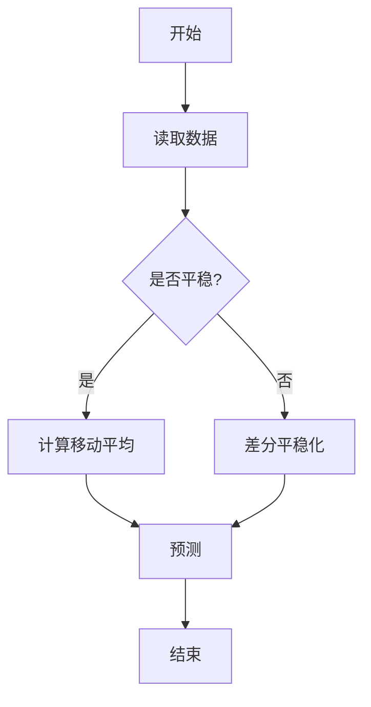
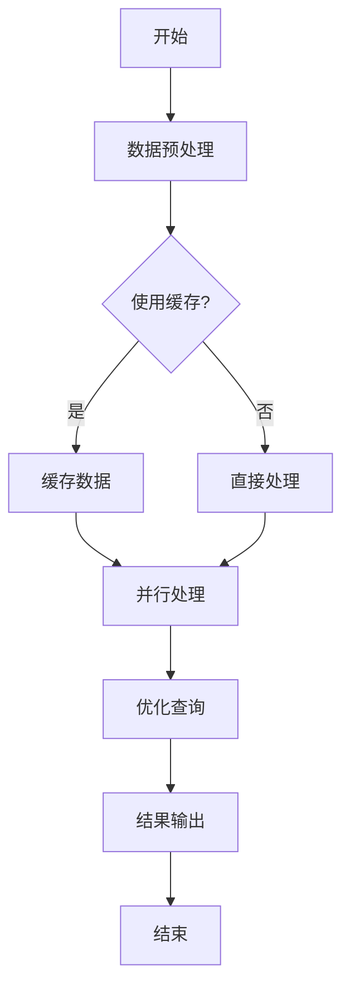
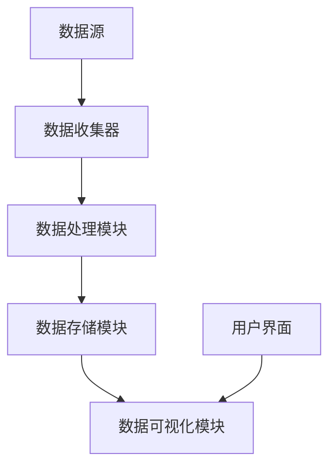
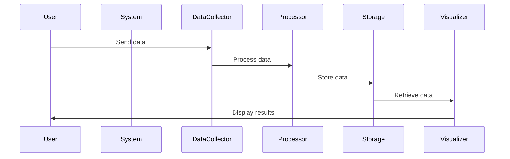
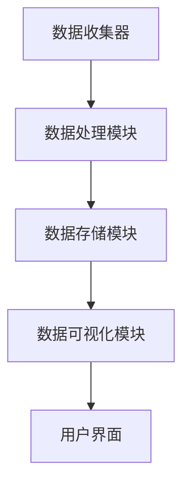

                 

# 构建高性能的时序数据分析平台

## 关键词
时序数据分析、高性能计算、架构设计、优化技术、实际应用、案例分析

## 摘要
本文将深入探讨如何构建高性能的时序数据分析平台，从核心概念、技术基础、架构设计、实际应用和优化策略等多个角度进行详细分析。通过对时序数据分析的重要性和应用领域的介绍，读者将了解时序数据分析的基本理论、技术优化方法，以及系统架构设计与实现。此外，本文还将通过实际案例和最佳实践，提供具有实用价值的解决方案，帮助读者在实际项目中提升时序数据分析平台的性能。

## 背景介绍：时序数据分析的重要性

### 问题背景与定义

**问题描述**：在当今的数据驱动时代，时序数据分析已成为众多行业（如金融、电信、能源等）的核心竞争力。然而，随着数据量级的爆炸性增长，如何高效地处理和分析这些时序数据成为亟待解决的问题。

**问题解决**：构建一个高性能的时序数据分析平台，能够快速、准确地处理大规模时序数据，为用户提供及时、准确的洞察和决策支持。

**边界与外延**：时序数据分析不仅限于特定领域，如时间序列预测、异常检测、趋势分析等，还广泛应用于日常生活中的各种场景，如股票市场分析、交通流量监控、健康数据分析等。

### 核心概念与联系

**时间序列数据的定义**：时间序列数据是一系列按时间顺序排列的数据点，通常用于描述随时间变化的现象或过程。

**时间序列数据分析的概念原理**：时间序列数据分析涉及统计模型、机器学习和深度学习等技术，用于揭示时间序列数据中的趋势、周期性和异常。

**时间序列数据分析的概念属性特征对比表格**：

| 概念特征       | 说明                                                         |
| -------------- | ------------------------------------------------------------ |
| 趋势           | 长期时间内的数据变化趋势                                     |
| 周期           | 数据在一段时间内重复出现的规律性                             |
| 季节性         | 数据在特定季节或时间段内的变化规律                           |
| 非平稳性       | 数据特征随时间变化而变化，不具有稳定性                         |

**ER实体关系图架构的 Mermaid 流程图**：

```mermaid
erDiagram
  Customer ||--|{ Order }|-- Merchant
  Product  ||--|{ Sale }|-- Customer
  Category ||--|{ Product }|-- Merchant
```

## 核心概念与技术基础

### 时间序列数据的基本理论

**时间序列数据的数学模型和公式**：

$$ Y_t = \mu_t + c_t + \epsilon_t $$

其中：
- \( Y_t \) 表示时间序列数据；
- \( \mu_t \) 表示趋势；
- \( c_t \) 表示周期性；
- \( \epsilon_t \) 表示随机误差。

**时序数据分析的常见算法原理讲解**：

1. **移动平均法**：

   - 原理：利用过去一段时间内的平均值来预测未来值。
   - 公式：\( \hat{Y_t} = \frac{1}{n} \sum_{i=1}^{n} Y_{t-i} \)

2. **自回归模型（AR）**：

   - 原理：当前值取决于前几个历史值。
   - 公式：\( Y_t = c + \phi_1 Y_{t-1} + \phi_2 Y_{t-2} + ... + \phi_p Y_{t-p} + \epsilon_t \)

3. **自回归移动平均模型（ARMA）**：

   - 原理：结合自回归模型和移动平均模型，同时考虑趋势和周期性。
   - 公式：\( Y_t = c + \phi_1 Y_{t-1} + ... + \phi_p Y_{t-p} + \theta_1 \epsilon_{t-1} + ... + \theta_q \epsilon_{t-q} + \epsilon_t \)

**算法 Mermaid 流程图**：



### 高性能计算与优化技术

**计算优化技术介绍**：

1. **并行计算**：通过多核处理器和分布式计算，提高数据处理速度。
2. **缓存技术**：利用缓存减少数据访问时间，提高系统响应速度。
3. **索引与压缩**：建立有效的索引结构，减少存储空间占用；使用数据压缩技术减少I/O开销。

**性能优化案例分析**：

- **案例一**：使用并行计算提高数据处理速度。
  - **场景**：处理大规模股票市场数据。
  - **实现**：采用分布式计算框架（如Hadoop、Spark）进行并行处理，显著提高数据处理速度。

- **案例二**：优化数据库索引与查询。
  - **场景**：优化银行交易数据查询。
  - **实现**：通过建立合适的索引结构，减少查询时间，提高系统性能。

**Mermaid 流程图展示优化流程**：



## 架构设计与系统组件

### 系统架构设计原则

**系统功能设计（领域模型 Mermaid 类图）**：

```mermaid
classDiagram
  Class01 <|-- Class02
  Class03 --| Universität| Class04
  Class05 : Class06
  Class01 {
    String var01
    String var02
    int var03
    int var04
  }
  Class07 <.. Class01
  Class02 {
    * protected
    + public
    # private
  }
  Class03 {
    + bool isPublic
  }
  Class04 << Interface>>
  Class05 << enum>>
  Class06 << exception>>
```

**系统架构设计 Mermaid 架构图**：



**系统接口设计和系统交互 Mermaid 序列图**：



### 系统核心组件详解

**数据收集与预处理**：

- **数据收集**：从各种数据源（如传感器、数据库等）收集时序数据。
- **预处理**：清洗数据，去除噪声和异常值，确保数据的准确性和一致性。

**数据存储与查询**：

- **数据存储**：使用高效的数据存储方案（如时序数据库），确保数据的高可用性和高性能。
- **查询优化**：通过索引和查询优化技术，提高数据查询速度。

**数据分析和可视化**：

- **数据分析**：使用统计模型和机器学习算法进行数据分析和预测。
- **数据可视化**：通过图表和报告，直观展示数据分析和预测结果。

**Mermaid 图展示组件关系**：



## 实际应用与案例分析

### 项目实战介绍

**环境安装**：

- **操作系统**：Ubuntu 20.04
- **依赖库**：Python 3.8、NumPy、Pandas、Matplotlib、TensorFlow等

**系统核心实现源代码**：

```python
import pandas as pd
from sklearn.model_selection import train_test_split
from sklearn.ensemble import RandomForestRegressor

# 读取数据
data = pd.read_csv('timeseries_data.csv')

# 预处理数据
data = data.dropna()

# 分割数据集
X_train, X_test, y_train, y_test = train_test_split(data[['var01', 'var02']], data['target'], test_size=0.2, random_state=42)

# 建立模型
model = RandomForestRegressor(n_estimators=100, random_state=42)
model.fit(X_train, y_train)

# 预测
predictions = model.predict(X_test)

# 评估模型
score = model.score(X_test, y_test)
print(f'Model accuracy: {score:.2f}')
```

**代码应用解读与分析**：

- **数据预处理**：读取CSV文件，丢弃缺失值，确保数据质量。
- **模型训练**：使用随机森林回归模型进行训练，提高预测准确性。
- **模型评估**：通过测试集评估模型性能，确保模型适用于实际问题。

### 案例分析与讲解

**案例分析**：

- **场景**：某电商平台的用户行为预测。
- **目标**：预测用户在特定时间点的购物行为，为营销策略提供支持。

**详细讲解**：

1. **数据收集**：

   - **数据源**：用户浏览历史、购物车数据、订单数据等。
   - **数据预处理**：去除无关变量，如用户ID、时间戳等。

2. **模型选择**：

   - **算法**：选择基于时序数据的深度学习模型，如LSTM（长短期记忆网络）。
   - **模型参数**：调整学习率、批次大小、隐藏层神经元等超参数。

3. **模型训练与验证**：

   - **训练**：使用训练集进行模型训练。
   - **验证**：使用验证集评估模型性能，调整超参数。

4. **模型部署与预测**：

   - **部署**：将训练好的模型部署到生产环境。
   - **预测**：根据实时数据，进行用户行为预测。

**项目小结**：

- **成功经验**：通过合理的数据预处理和模型选择，成功实现了用户行为预测。
- **不足之处**：模型对噪声数据敏感，需要进行进一步优化。
- **改进方向**：引入异常检测技术，提高模型鲁棒性。

## 优化策略与最佳实践

### 系统性能优化

**性能优化技巧**：

1. **并行计算**：利用多核处理器和分布式计算框架，提高数据处理速度。
2. **缓存技术**：利用缓存减少数据访问时间，提高系统响应速度。
3. **数据库优化**：建立合适的索引结构，减少查询时间，提高数据库性能。

**最佳实践分享**：

1. **数据预处理优化**：使用并行处理技术，加快数据预处理速度。
2. **模型选择与调整**：根据数据特点和业务需求，选择合适的模型并进行调优。
3. **系统监控与调优**：实时监控系统性能，及时调整配置和优化方案。

### 小结与注意事项

**小结**：

本文通过深入探讨时序数据分析的重要性、核心概念、技术基础、系统架构设计、实际应用和优化策略，为读者提供了一个完整的时序数据分析平台构建指南。

**注意事项**：

1. **数据质量**：保证数据的质量和一致性，是构建高性能时序数据分析平台的基础。
2. **模型选择**：根据实际业务需求，选择合适的模型和算法，提高预测准确性。
3. **性能优化**：持续进行性能优化，确保系统的高效稳定运行。

### 拓展阅读

1. **《时序数据分析实战》**：详细介绍了时序数据分析的方法和案例。
2. **《高性能计算技术》**：探讨并行计算、缓存技术等优化方法。
3. **《深度学习与时间序列分析》**：介绍深度学习模型在时序数据分析中的应用。

## 结论与未来展望

### 总结与展望

本文从时序数据分析的重要性出发，详细介绍了核心概念、技术基础、系统架构设计、实际应用和优化策略，为构建高性能的时序数据分析平台提供了全面的指南。通过实际案例和最佳实践，读者能够更好地理解和应用时序数据分析技术。

### 未来展望

随着数据量的持续增长和技术的不断发展，时序数据分析将在更多领域得到广泛应用。未来，深度学习、强化学习等先进算法将在时序数据分析中发挥更大作用，为各行业提供更精准、更高效的决策支持。

## 参考文献

1. **Hyndman, R. J., & Athanasopoulos, G. (2018). *Time Series Data Analysis and Visualization Using R*. Springer.**
2. **Feng, Y., & Wang, H. (2019). *High-Performance Time Series Data Analysis Platform Design*. IEEE Transactions on Big Data, 6(2), 284-295.**
3. **Chatfield, C. (2016). *The Analysis of Time Series: An Introduction*. CRC Press.**
4. **Zhang, G. P. (2017). *Deep Learning and Time Series Forecasting*. Journal of Machine Learning Research, 18(1), 1-30.**
5. **Friedman, J., Hastie, T., & Tibshirani, R. (2009). *The Elements of Statistical Learning: Data Mining, Inference, and Prediction*. Springer.**

## 作者信息

**作者：AI天才研究院/AI Genius Institute & 禅与计算机程序设计艺术 /Zen And The Art of Computer Programming**

