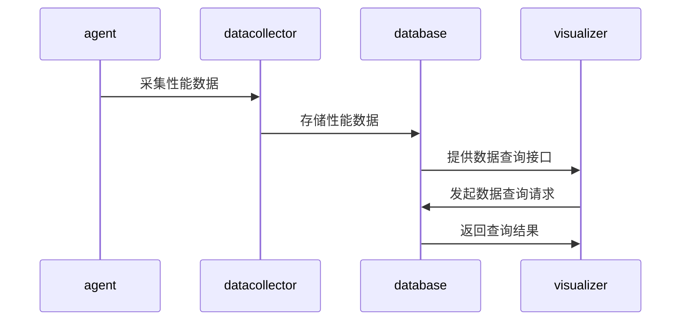
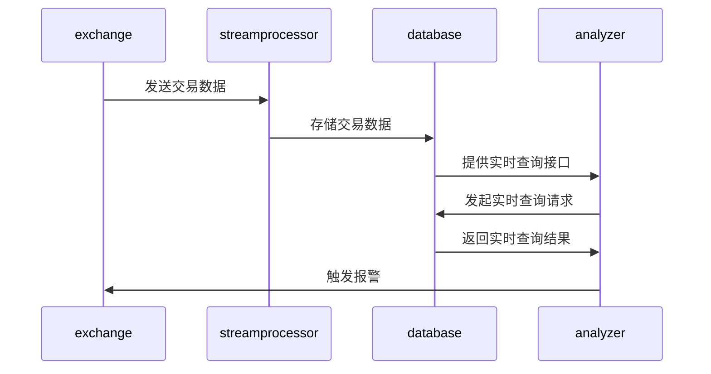
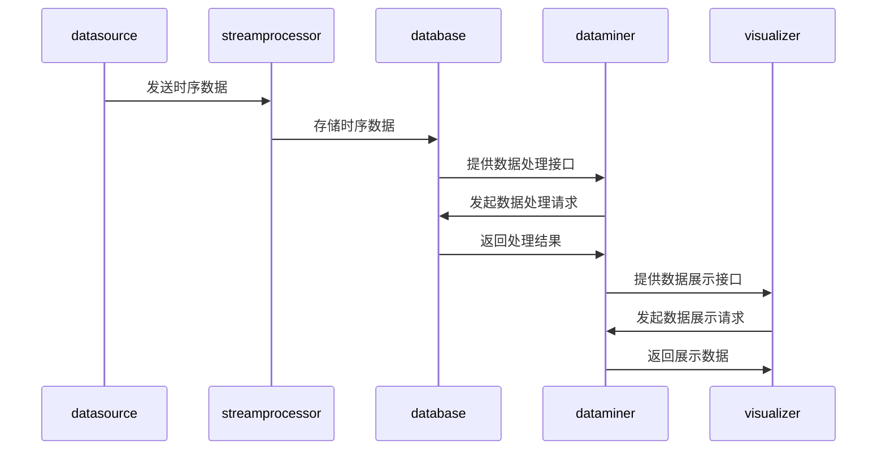

                 

### 引言

在现代信息化社会中，时序数据已经成为了各个行业不可或缺的重要数据资源。随着物联网、云计算、大数据技术的迅猛发展，时序数据的产生速度和规模都在不断增长。例如，在金融领域，交易数据的实时监控与分析对于风险控制与投资决策至关重要；在工业生产中，传感器数据的实时采集与分析能够提升生产线的效率与产品质量；在交通领域，交通流量的实时监控与预测能够有效缓解交通拥堵，提升交通运营效率。这些应用场景对时序数据库系统提出了高性能、高可靠性、易扩展等严苛要求。

本文旨在探讨如何构建高性能的时序数据库系统，通过系统地分析时序数据的特性、核心架构设计、核心技术实现以及实际应用优化策略，为读者提供一套全面而深入的解决方案。文章首先介绍时序数据库系统的核心概念和问题背景，然后详细分析时序数据的特性，探讨时序数据库系统架构，并逐步介绍时间序列数据模型、存储引擎设计、查询优化、垂直扩展与集群等技术细节。此外，文章还将通过实际应用场景和性能优化实战案例，展示时序数据库系统在实际环境中的部署与运维方法，并总结安全性、合规性等关键点。最后，文章将展望时序数据库系统的未来发展趋势，为读者提供前瞻性的视角。

通过本文的阅读，读者将能够系统地了解时序数据库系统的构建方法，掌握核心技术实现和优化策略，并为未来的研究和应用提供参考。让我们一步步深入探讨这个充满挑战与机遇的领域。

### 文章关键词

- 时序数据库
- 时间序列
- 数据存储
- 性能优化
- 架构设计
- 查询优化
- 垂直扩展
- 集群
- 数据备份
- 安全性与合规性
- 实际应用场景

### 摘要

本文全面探讨了高性能时序数据库系统的构建方法。首先，我们介绍了时序数据库系统的核心概念和背景，分析了时序数据的特性，包括数据类型、分布和存储需求。接着，我们深入探讨了时序数据库系统的架构设计，从设计原则到常见架构模式，再到具体案例。本文还详细介绍了时间序列数据模型、存储引擎设计、查询优化、垂直扩展与集群、数据备份与恢复等核心技术，并通过实际应用场景和性能优化实战案例，展示了系统的部署与运维方法。最后，本文总结了一系列最佳实践和注意事项，并展望了时序数据库系统的未来发展趋势，为读者提供了系统而深入的解决方案。

### 第一部分：背景与基础

#### 第1章 问题背景与核心概念

随着大数据技术的迅速发展，时序数据已经成为各个行业数据中不可或缺的一部分。时序数据（Time Series Data）是指按照时间顺序排列的数据点集合，这些数据点可以是某个物理量、交易记录、传感器读数等。时序数据的独特性在于其时间依赖性和连续性，这使得它与其他类型的数据（如关系型数据、图数据）有显著区别。

时序数据库系统（Time Series Database, TSDB）是专门为存储、处理和分析时序数据而设计的数据库系统。它们通常具有以下特点：

1. **时间戳支持**：时序数据库系统能够高效地处理时间戳，能够准确记录数据点的时间顺序。
2. **高吞吐量写入**：许多应用场景要求实时写入大量数据点，时序数据库系统需要能够支持高吞吐量的数据写入。
3. **高效查询**：时序数据通常需要频繁查询，时序数据库系统需要能够快速执行查询操作，提供低延迟的响应。
4. **数据压缩**：由于时序数据具有时间连续性，许多时序数据库系统能够采用高效的数据压缩技术，以减少存储空间需求。

**核心概念：**

- **时序数据库（TSDB）**：专门用于存储和管理时序数据的数据库系统。
- **时间序列（Time Series）**：按时间顺序排列的数据点集合，可以是单一变量或多个变量。
- **数据存储（Data Storage）**：时序数据库系统如何组织和管理数据，包括数据压缩、索引等技术。
- **性能优化（Performance Optimization）**：通过改进算法、架构和硬件等方面，提升系统的性能。

**问题背景：**

在许多应用场景中，如金融交易、工业监控、物联网、气象预报等，时序数据的高效存储、处理和分析是关键。然而，传统的数据库系统在处理时序数据时往往存在性能瓶颈，如写入速度慢、查询效率低、存储空间浪费等问题。因此，构建高性能的时序数据库系统成为了当前研究和应用的热点。

**问题描述：**

构建高性能时序数据库系统面临的主要问题包括：

1. **高吞吐量写入**：如何设计系统以支持大规模数据的实时写入？
2. **高效查询**：如何优化查询算法和索引结构，以提供低延迟的查询响应？
3. **数据压缩**：如何有效压缩数据，减少存储空间需求？
4. **扩展性**：如何实现系统的垂直扩展和水平扩展，以支持大规模数据量的存储和处理？
5. **安全性**：如何保证数据的安全性和合规性？

**问题解决：**

针对上述问题，我们可以从以下几个方面着手：

1. **设计高效的存储引擎**：采用专门为时序数据设计的存储引擎，如时间序列数据库专用的索引和数据结构。
2. **优化查询算法**：设计高效的查询算法，利用索引技术和分片机制提高查询效率。
3. **数据压缩**：采用高效的数据压缩技术，如差分编码、统计压缩等。
4. **扩展性设计**：通过分布式架构和集群设计，实现系统的垂直扩展和水平扩展。
5. **安全性保障**：采用加密、访问控制等安全技术，确保数据的安全性和合规性。

**边界与外延：**

- **边界**：时序数据库系统主要针对时序数据存储和处理，不包括其他类型的数据管理。
- **外延**：时序数据库系统可以与其他数据分析和处理系统集成，如大数据平台、机器学习框架等。

**概念结构与核心要素组成：**

时序数据库系统的核心结构包括：

1. **数据存储引擎**：负责数据的存储和管理，包括数据压缩、索引等。
2. **查询引擎**：负责处理用户查询请求，提供高效的查询响应。
3. **索引结构**：用于快速定位数据，提高查询效率。
4. **分布式架构**：支持数据的高可用性和扩展性。
5. **备份与恢复机制**：确保数据的安全性和可靠性。

通过以上分析和设计，我们可以构建一个高性能、高可靠性的时序数据库系统，满足各类应用场景的需求。

#### 第2章 时序数据特性分析

时序数据具有独特的特性，这些特性对数据库系统的设计、优化和实现都产生了重要影响。深入理解这些特性有助于我们构建更加高效和可靠的时序数据库系统。

**1. 数据类型：**

时序数据通常包括以下几种类型：

- **时间点数据**：记录具体的时间点上的数据值，如股票交易的价格。
- **时间间隔数据**：记录在一定时间间隔内的数据统计结果，如温度传感器的每小时平均温度。
- **周期性数据**：数据按照固定的时间周期进行记录，如每天的平均降雨量。

不同类型的数据在存储和处理上有不同的要求。例如，周期性数据可以采用预先分配的存储空间，以减少空间浪费。

**2. 数据分布与存储需求：**

时序数据在时间轴上通常呈现出不同的分布模式，主要包括以下几种：

- **均匀分布**：数据在时间轴上均匀分布，如金融交易数据。
- **聚集分布**：数据在时间轴上某一段时间内密集出现，如交通高峰期的流量数据。
- **稀疏分布**：数据在时间轴上分散出现，如长期气象数据的记录。

根据数据分布的不同，存储需求也会有所不同。均匀分布的数据可以采用连续存储的方式，以减少存储空间浪费。而聚集分布的数据则可能需要特别设计存储策略，如时间窗口存储，以优化查询性能。

**3. 数据处理模式：**

时序数据处理通常包括以下几种模式：

- **批处理**：将一段时间内的数据批量处理，如数据分析和报告生成。
- **流处理**：实时处理数据流，如实时监控和报警。
- **混合处理**：结合批处理和流处理，以平衡处理效率和实时性。

不同处理模式对系统的设计提出了不同的要求。批处理通常可以容忍一定程度的延迟，适合于非实时数据分析和报告。而流处理则要求系统能够实时响应，提供低延迟的数据处理。

**数据聚合与变换：**

- **聚合操作**：对一段时间内的数据进行汇总和聚合，如求平均值、求和等。
- **变换操作**：对数据进行预处理和变换，如时间窗口变换、差分变换等。

这些操作对于优化查询性能和减少数据存储空间非常重要。

**时间序列分析：**

时序数据分析是时序数据库系统的核心功能之一，包括趋势分析、季节性分析、周期性分析等。这些分析通常依赖于复杂的统计和机器学习算法。

**数据压缩与索引：**

- **数据压缩**：通过差分编码、统计压缩等技术减少数据存储空间。
- **索引**：采用时间序列索引技术，如时间跳跃索引、前缀索引等，以提高查询效率。

**性能优化：**

针对时序数据的特点，性能优化主要包括以下几个方面：

- **写入优化**：通过批量写入、异步写入等技术提高写入速度。
- **查询优化**：通过索引优化、查询缓存等技术提高查询效率。
- **存储优化**：通过数据分片、数据压缩等技术降低存储成本。

**示例：**

假设我们有一个气象监测系统，记录每个小时的温度数据。这种数据具有均匀分布的特点，适合采用连续存储和批量处理。我们可以采用时间跳跃索引来快速定位特定时间点的数据，同时使用差分编码来减少数据存储空间。

通过以上分析，我们可以看到，时序数据的特性对数据库系统的设计、优化和实现提出了特殊的要求。理解这些特性有助于我们设计出更加高效和可靠的时序数据库系统，满足各种应用场景的需求。

#### 第3章 时序数据库系统架构

时序数据库系统（TSDB）的架构设计是构建高性能系统的关键。一个优秀的时序数据库系统需要具备高吞吐量写入、高效查询、数据压缩、扩展性和高可用性等特点。本章节将从架构设计原则、常见架构模式以及具体案例三个方面详细探讨时序数据库系统的设计。

**架构设计原则：**

1. **模块化设计**：将系统划分为多个模块，每个模块负责特定的功能，如数据存储、查询处理、数据压缩等。这种设计可以提高系统的可维护性和可扩展性。
2. **高性能数据库引擎**：选择适合时序数据特性的数据库引擎，如基于列存储的数据库或专门为时序数据设计的数据库，以提高读写效率和查询性能。
3. **数据压缩与索引**：采用高效的数据压缩技术，如差分编码、统计压缩等，以减少存储空间需求。同时，设计适当的索引结构，如时间跳跃索引、前缀索引等，以提高查询效率。
4. **分布式架构**：通过分布式架构实现数据的高可用性和扩展性。分布式架构可以将数据分散存储在不同的节点上，从而提高系统的容错能力和可扩展性。
5. **负载均衡与调度**：实现负载均衡和调度机制，确保系统在不同负载情况下的稳定运行。

**常见架构模式：**

1. **单机架构**：单机架构是最简单的时序数据库系统架构，适用于数据量较小、系统负载较低的场景。单机架构的优势在于设计和实现简单，但缺点是扩展性和容错性较差。
2. **主从架构**：主从架构包括一个主节点和多个从节点。主节点负责数据写入和查询操作，从节点负责数据的复制和备份。这种架构可以提高系统的写入性能和容错能力，但需要额外的维护和管理成本。
3. **分布式集群架构**：分布式集群架构是将数据分散存储在不同的节点上，每个节点负责一部分数据的写入、查询和备份。这种架构具有很高的扩展性和容错性，适用于大规模、高并发的应用场景。
4. **分片架构**：分片架构将数据划分为多个片段（shards），每个片段存储在一个独立的节点上。分片架构可以提高系统的查询性能和写入吞吐量，但需要解决数据分片和负载均衡的问题。

**具体案例：**

以开源时序数据库InfluxDB为例，InfluxDB采用了分布式集群架构和分片架构。InfluxDB将数据存储在多个节点上，每个节点负责一部分数据的写入、查询和备份。数据被分片存储，每个分片由一组节点组成，从而提高了系统的性能和扩展性。InfluxDB还提供了高效的数据压缩技术和时间跳跃索引，以提高查询效率。

- **数据存储引擎**：InfluxDB使用自家开发的时序数据存储引擎TSM（Time Series Module），该引擎采用了基于列的存储方式，适合存储和查询时序数据。
- **数据压缩**：InfluxDB使用差分编码和统计压缩技术，有效减少了数据存储空间。
- **索引**：InfluxDB采用了时间跳跃索引，能够快速定位数据点，提高了查询性能。

通过以上设计和实现，InfluxDB在处理大规模、高并发的时序数据时表现出色，被广泛应用于物联网、监控、金融等领域。

综上所述，时序数据库系统的架构设计需要综合考虑性能、扩展性、容错性等多方面因素。通过采用模块化设计、分布式架构、数据压缩和索引技术，我们可以构建出高性能、高可靠的时序数据库系统，满足各类应用场景的需求。

#### 第4章 时间序列数据模型

时间序列数据模型是时序数据库系统（TSDB）的核心组成部分，它决定了数据存储和查询的效率。在这一章中，我们将探讨时间序列数据的表示方法、常用的数据模型以及这些模型在实际应用中的优势。

**时间序列数据的表示方法：**

时间序列数据可以通过不同的方法进行表示，以下是一些常见的方法：

1. **固定长度数组**：这种方法将每个时间点的数据值存储在固定长度的数组中。这种方法简单易实现，但缺点是当数据稀疏时会造成存储空间的浪费。
   ```python
   # Python 示例：固定长度数组表示
   timeseries = [0] * 24  # 假设每天有24个时间点
   timeseries[0] = 23     # 设置第一个时间点的数据值为23
   ```

2. **稀疏数组**：稀疏数组只在实际有数据的时间点上存储数据值，而其他时间点则不占用空间。这种方法可以显著减少存储空间需求，但需要额外的数据结构来管理稀疏数组。
   ```python
   # Python 示例：稀疏数组表示
   timeseries = {1: 23, 12: 34}  # 只存储有数据的时间点
   ```

3. **时间跳跃索引**：时间跳跃索引是一种特殊的索引结构，它通过记录时间点之间的跳跃来快速定位数据。这种方法可以提高查询效率，特别是在处理大量连续时间点时。
   ```python
   # Python 示例：时间跳跃索引表示
   index = [0, 6, 12, 18, 24]  # 跳跃时间点
   values = [23, 17, 29, 36, 48]  # 对应的时间点数据值
   ```

4. **对数时间表示法**：当时间序列数据跨度很大时，使用对数时间表示法可以减少数据的存储空间。这种方法通过将时间戳转换为对数值来表示时间，从而提高存储效率。
   ```python
   # Python 示例：对数时间表示法
   import math
   timestamp = 1000000000  # 假设时间戳为10^9
   log_timestamp = math.log(timestamp, 10)  # 转换为对数时间
   ```

**常用数据模型：**

1. **时序点（Timestamped Point）**：时序点是最基本的表示方法，每个时序点包含时间戳和数据值。这种方法简单直观，但可能导致数据存储效率低下。
   ```python
   # Python 示例：时序点表示
   timestamp = 1610000000  # 时间戳
   value = 23  # 数据值
   ```

2. **时间序列（Time Series）**：时间序列是一组按时间顺序排列的时序点的集合。这种模型可以方便地处理多个相关数据点，但需要额外的结构来组织和管理这些时序点。
   ```python
   # Python 示例：时间序列表示
   timeseries = [(1610000000, 23), (1610000600, 17), (1610001200, 29)]
   ```

3. **时序片段（Time Series Segment）**：时序片段是将时间序列划分为多个连续的时间区间。这种方法可以优化数据的查询和存储性能，特别是当时间序列数据具有聚集分布时。
   ```python
   # Python 示例：时序片段表示
   segment1 = [(1610000000, 23), (1610000600, 17)]
   segment2 = [(1610001200, 29), (1610001800, 35)]
   timeseries = [segment1, segment2]
   ```

**索引结构**：

为了提高数据查询效率，时序数据库通常采用各种索引结构，以下是一些常见的索引：

1. **前缀索引（Prefix Index）**：前缀索引通过记录时间戳的前缀来快速定位数据。这种方法适用于时间戳长度较长的情况。
   ```mermaid
   flowchart TD
       A1[时间戳前缀] --> B1[索引记录];
       A2[时间戳前缀] --> B2[索引记录];
   ```

2. **倒排索引（Inverted Index）**：倒排索引通过记录数据值和时间戳的对应关系来快速查询数据。这种方法适用于多维度数据查询。
   ```mermaid
   flowchart TD
       A[data值] --> B[时间戳列表];
       A --> C[时间戳列表];
   ```

3. **时间跳跃索引（Time Skipping Index）**：时间跳跃索引通过记录时间点之间的跳跃来快速定位数据。这种方法适用于大量连续时间点的查询。
   ```mermaid
   flowchart TD
       A1[起始时间戳] --> B1[下一个时间戳];
       A2[起始时间戳] --> B2[下一个时间戳];
   ```

**数据压缩**：

为了提高数据存储效率，时序数据库通常采用数据压缩技术。以下是一些常见的数据压缩方法：

1. **差分编码（Difference Encoding）**：差分编码通过记录数据值之间的差异来减少存储空间。这种方法适用于数据值变化不大的情况。
   ```python
   # Python 示例：差分编码
   values = [23, 17, 29, 36, 48]  # 原始数据值
   differences = [17-23, 29-17, 36-29, 48-36]  # 差分值
   ```

2. **统计压缩（Statistical Compression）**：统计压缩通过记录数据值的统计信息来减少存储空间。这种方法适用于数据值分布具有某种统计规律的情况。

**数据模型应用实例**：

假设我们有一个气象监测系统，记录每个小时的温度数据。这种场景适合采用时间跳跃索引和差分编码：

1. **时间跳跃索引**：记录每个小时的起始时间戳和下一个时间戳。
   ```mermaid
   flowchart TD
       A1[1610000000] --> B1[1610000600];
       A2[1610000600] --> B2[1610001200];
   ```

2. **差分编码**：记录每个小时的数据值差异。
   ```python
   differences = [17-23, 29-17, 36-29, 48-36]
   ```

通过上述数据模型和索引结构，我们可以构建一个高效、压缩的时序数据库系统，满足各种时序数据应用场景的需求。

#### 第5章 存储引擎设计

存储引擎设计是构建高性能时序数据库系统的关键环节，它直接影响系统的读写效率、存储空间利用率和总体性能。本章节将详细介绍存储引擎的类型、数据存储策略以及数据结构优化。

**存储引擎类型：**

1. **关系型数据库存储引擎**：这类引擎使用关系型数据库管理系统（如MySQL、PostgreSQL）来存储时序数据。关系型数据库具有成熟的数据模型和丰富的查询功能，但其在处理大规模时序数据时可能存在性能瓶颈。

2. **列式存储引擎**：列式存储引擎（如Apache Cassandra、HBase）专门为大数据存储设计，适用于处理大规模、高并发的时序数据。列式存储通过将数据按列存储，优化了数据读取和写入性能，但查询功能相对有限。

3. **时间序列专用存储引擎**：这类引擎（如InfluxDB、TimescaleDB）专门为时序数据设计，结合了时间序列特性和高效的存储、查询算法。专用存储引擎能够提供高性能、低延迟的读写操作，适合大规模、实时性要求高的应用场景。

**数据存储策略：**

1. **固定大小块存储**：固定大小块存储是将数据按固定大小的块进行存储。这种方法简单易实现，但可能会导致存储空间的浪费，特别是在数据稀疏时。

2. **可变大小块存储**：可变大小块存储是根据数据大小动态分配存储块。这种方法可以减少存储空间浪费，但需要额外的数据结构来管理块大小和位置。

3. **时间窗口存储**：时间窗口存储是将数据按照时间窗口进行划分和存储。每个时间窗口内的数据具有相似的特性，可以采用不同的存储策略，如固定大小块或可变大小块。时间窗口存储可以优化数据查询和压缩，但需要处理窗口切换和数据迁移。

4. **分段存储**：分段存储是将数据划分为多个连续的段进行存储。每个段可以独立管理，如独立进行压缩、索引等操作。分段存储可以提高数据管理的灵活性和性能优化空间。

**数据结构优化：**

1. **时间跳跃索引**：时间跳跃索引通过记录时间点之间的跳跃来快速定位数据。这种方法适用于大量连续时间点的查询，可以显著提高查询效率。

2. **前缀索引**：前缀索引通过记录时间戳的前缀来快速定位数据。这种方法适用于时间戳长度较长的情况，可以减少索引存储空间。

3. **压缩数据**：采用压缩技术可以减少数据存储空间需求，提高存储效率。常见的数据压缩技术包括差分编码、统计压缩等。

4. **列式存储**：列式存储通过将数据按列存储，优化了数据的读取和写入性能。列式存储适用于大量列不变、只查询部分列的时序数据场景。

5. **分区表**：分区表是将数据按照某种条件（如时间、地域等）划分为多个独立的小表。分区表可以提高数据的查询和写入性能，减少表锁竞争和索引维护开销。

**示例：**

假设我们有一个气象监测系统，记录每个小时的温度数据。为了优化存储和查询性能，我们可以采用以下策略：

1. **时间跳跃索引**：记录每个小时的起始时间戳和下一个时间戳。
   ```mermaid
   flowchart TD
       A1[1610000000] --> B1[1610000600];
       A2[1610000600] --> B2[1610001200];
   ```

2. **差分编码**：记录每个小时的数据值差异。
   ```python
   differences = [17-23, 29-17, 36-29, 48-36]
   ```

3. **分区表**：将数据按照小时进行分区。
   ```mermaid
   flowchart TD
       A1[1610000000] --> B1[Hour1];
       A2[1610000600] --> B2[Hour1];
       A3[1610001200] --> B3[Hour1];
   ```

通过上述策略，我们可以构建一个高效、优化的存储引擎，满足大规模气象监测系统的存储和查询需求。不同类型的存储引擎和数据存储策略可以根据具体应用场景进行选择和组合，以实现最佳性能。

#### 第6章 查询优化

在时序数据库系统中，查询优化是提升系统性能的关键环节。高效的查询算法和优化的索引结构能够显著降低查询响应时间，提高整体系统性能。以下将从查询语言、索引优化和查询执行计划三个方面详细探讨时序数据库系统的查询优化。

**查询语言：**

时序数据库通常采用专门为时序数据设计的查询语言，如InfluxQL、PromQL等。这些查询语言具有简洁的语法和强大的功能，能够方便地执行数据查询、聚合、过滤等操作。

1. **数据查询**：查询语言允许用户根据时间范围和条件查询特定时间点的数据。例如，InfluxQL中的`SELECT`语句可以查询特定时间序列的数据点。
   ```influxql
   SELECT * FROM "temperature" WHERE time > now() - 1h
   ```

2. **数据聚合**：查询语言支持对数据进行聚合操作，如求和、平均值、最大值等。这些操作可以帮助用户快速获得数据的统计信息。
   ```influxql
   SELECT mean("temperature") FROM "weather" GROUP BY time(1m)
   ```

3. **过滤与筛选**：查询语言允许用户根据特定的条件对数据进行过滤和筛选，如过滤特定时间段的数据、筛选特定字段等。
   ```influxql
   SELECT * FROM "weather" WHERE "city" = 'New York'
   ```

**索引优化：**

索引是查询优化的核心，通过创建适当的索引结构，可以显著提高查询效率。以下是一些常见的索引优化方法：

1. **前缀索引**：前缀索引通过记录时间戳的前缀来快速定位数据。这种方法适用于时间戳长度较长的情况，可以减少索引存储空间。
   ```mermaid
   flowchart TD
       A[时间戳前缀] --> B[索引记录];
   ```

2. **时间跳跃索引**：时间跳跃索引通过记录时间点之间的跳跃来快速定位数据。这种方法适用于大量连续时间点的查询，可以显著提高查询效率。
   ```mermaid
   flowchart TD
       A1[起始时间戳] --> B1[下一个时间戳];
       A2[起始时间戳] --> B2[下一个时间戳];
   ```

3. **多维索引**：多维索引通过记录多个维度的索引信息来快速查询数据。例如，可以将时间和区域作为多维索引，快速查询特定区域和时间段的数据。
   ```mermaid
   flowchart TD
       A[时间戳] --> B[区域索引];
       A --> C[时间索引];
   ```

4. **反向索引**：反向索引通过记录数据值和时间戳的对应关系来快速查询数据。这种方法适用于多维度数据查询，可以减少查询时间。
   ```mermaid
   flowchart TD
       A[data值] --> B[时间戳列表];
   ```

**查询执行计划：**

查询执行计划是查询优化的重要部分，通过合理的查询执行计划，可以最大化查询效率。以下是一些常见的查询执行计划优化方法：

1. **索引扫描**：索引扫描是查询执行计划的基础，通过扫描索引记录来定位数据。优化索引结构可以减少索引扫描的时间。

2. **数据过滤**：在索引扫描过程中，对数据记录进行过滤，只返回满足条件的记录。这种方法可以减少查询结果的数量，提高查询效率。

3. **数据聚合**：在索引扫描过程中，对数据进行聚合操作，如求和、平均值等。这样可以提前获取聚合结果，减少后续处理时间。

4. **数据缓存**：利用查询缓存技术，将频繁查询的结果缓存起来，减少查询执行时间。

5. **查询重写**：通过查询重写技术，将复杂的查询转化为简单的查询，减少查询执行时间。例如，将多个子查询合并为单个查询，减少查询次数。

**示例：**

假设我们有一个气象监测系统，记录每个小时的温度数据。为了优化查询性能，我们可以采用以下策略：

1. **创建时间跳跃索引**：
   ```mermaid
   flowchart TD
       A1[1610000000] --> B1[1610000600];
       A2[1610000600] --> B2[1610001200];
   ```

2. **创建前缀索引**：
   ```mermaid
   flowchart TD
       A[时间戳前缀] --> B[索引记录];
   ```

3. **查询缓存**：
   - 缓存常用查询结果，如过去一周的温度变化。
   - 利用查询缓存减少查询执行时间。

4. **查询重写**：
   - 合并多个子查询为单个查询，减少查询次数。

通过上述查询优化策略，我们可以显著提高气象监测系统的查询性能，满足大规模、实时性要求高的应用需求。不同的查询优化方法可以根据具体应用场景和系统特点进行组合和调整，以实现最佳性能。

#### 第7章 垂直扩展与集群

随着时序数据量的不断增长，单机性能逐渐成为时序数据库系统的瓶颈。为了应对这一挑战，垂直扩展和集群架构成为了提高系统性能和可扩展性的关键手段。在这一章节中，我们将详细探讨单机性能优化、集群架构设计、负载均衡与容错机制，并分析实际应用中的性能瓶颈和优化策略。

**单机性能优化：**

在单机性能优化方面，可以从以下几个方面入手：

1. **硬件优化**：选择高性能的硬件设备，如SSD硬盘、高速内存等，以提高I/O读写速度和内存访问速度。
2. **内存管理**：优化内存使用，避免内存溢出或频繁的内存分配和释放操作。使用缓存机制，如LRU（最近最少使用）缓存算法，减少内存访问时间。
3. **I/O优化**：优化I/O操作，如减少磁盘寻道次数、提高磁盘读写速度等。使用缓冲区、预读取等技术，减少I/O等待时间。
4. **并发控制**：优化并发处理能力，避免并发瓶颈。例如，使用锁机制、队列机制等，合理分配系统资源，提高系统吞吐量。
5. **查询优化**：优化查询语句和执行计划，减少查询执行时间。使用索引、查询缓存等技术，提高查询效率。

**集群架构设计：**

集群架构是将多个节点组织在一起，共同工作以提供高性能、高可用性的时序数据库系统。以下是一些常见的集群架构设计：

1. **主从架构**：主从架构包括一个主节点和多个从节点。主节点负责数据写入和查询操作，从节点负责数据的复制和备份。主从架构可以提高系统的写入性能和容错能力，但需要额外的维护和管理成本。
2. **分布式集群架构**：分布式集群架构将数据分散存储在不同的节点上，每个节点负责一部分数据的写入、查询和备份。分布式集群架构具有很高的扩展性和容错性，适用于大规模、高并发的应用场景。
3. **分片架构**：分片架构将数据划分为多个片段（shards），每个片段存储在一个独立的节点上。分片架构可以提高系统的查询性能和写入吞吐量，但需要解决数据分片和负载均衡的问题。

**负载均衡与容错机制：**

负载均衡和容错机制是确保集群架构稳定运行的关键：

1. **负载均衡**：通过负载均衡机制，将读写请求分配到不同的节点上，避免单点瓶颈。常见的负载均衡策略包括轮询、最小连接数、源地址哈希等。
2. **数据复制**：通过数据复制机制，确保数据在多个节点上的备份，提高数据的可靠性和可用性。常用的复制策略包括主从复制、多主复制等。
3. **故障检测与恢复**：通过故障检测机制，及时发现并处理节点故障。在故障恢复方面，可以采用心跳检测、自动重启、数据恢复等技术。
4. **分布式一致性**：在分布式系统中，数据一致性是一个重要问题。常用的分布式一致性协议包括强一致性、最终一致性等。

**性能瓶颈分析：**

在实际应用中，时序数据库系统可能遇到以下性能瓶颈：

1. **I/O瓶颈**：I/O操作是系统性能的瓶颈之一，特别是当数据量较大时，磁盘读写速度和I/O队列长度成为制约因素。
2. **CPU瓶颈**：查询处理和并发操作需要大量的CPU资源，当CPU负载较高时，系统性能会下降。
3. **内存瓶颈**：内存不足会导致频繁的内存分配和释放操作，降低系统性能。优化内存使用和缓存策略可以缓解内存瓶颈。
4. **网络瓶颈**：当集群节点分布在不同的地理位置时，网络延迟和带宽成为性能瓶颈。优化网络配置和传输协议可以提升网络性能。

**优化策略：**

为了解决上述性能瓶颈，可以采取以下优化策略：

1. **硬件升级**：提高硬件性能，如增加内存、升级磁盘等。
2. **分片与分布式架构**：通过分片和分布式架构，将数据分散存储和处理，减少单点瓶颈。
3. **缓存与索引优化**：使用缓存和索引技术，提高数据查询和访问速度。
4. **并发控制与负载均衡**：优化并发控制和负载均衡策略，合理分配系统资源，提高系统吞吐量。
5. **自动化运维与监控**：通过自动化运维和监控工具，实时监测系统性能，及时调整和优化配置。

通过上述垂直扩展与集群架构设计，以及针对性的性能瓶颈分析和优化策略，我们可以构建一个高性能、高可用的时序数据库系统，满足大规模、高并发的应用需求。

#### 第8章 数据备份与恢复

在时序数据库系统中，数据备份与恢复是确保数据安全性和系统可靠性至关重要的环节。本文将详细探讨数据备份策略、恢复方法和备份优化技术，并提供最佳实践和注意事项。

**备份策略：**

数据备份策略是确保数据不丢失的关键，常见的备份策略包括：

1. **全备份**：全备份是对整个数据库系统进行备份，包括数据文件、日志文件、配置文件等。全备份操作通常在系统初始化或重要数据变更后进行，能够提供完整的系统恢复能力。
2. **增量备份**：增量备份仅备份自上次备份以来发生变化的数据。这种策略能够显著减少备份时间和存储空间需求，但恢复时需要先恢复最新的全备份，然后逐次应用增量备份。
3. **差异备份**：差异备份备份自上次全备份以来发生变化的数据。这种策略在恢复时只需要恢复最新的全备份和一次差异备份，操作相对简单，但备份文件较多，占用存储空间较大。

**恢复方法：**

数据恢复方法是在数据丢失或系统故障时，将数据库系统恢复到正常状态的过程。常见的恢复方法包括：

1. **手动恢复**：手动恢复是通过人工操作将备份文件应用到数据库系统中。这种方法适用于小规模系统，但需要较高的操作技能和较长的恢复时间。
2. **自动化恢复**：自动化恢复是通过脚本或工具自动执行恢复操作，如使用数据库管理工具、备份软件等。自动化恢复可以显著减少恢复时间和人力成本。
3. **基于时间点的恢复**：基于时间点的恢复是恢复到特定的时间点，如恢复到故障发生前的一段时间。这种方法能够最大限度地保留数据的完整性和一致性。

**备份优化技术：**

为了提高数据备份的效率和质量，可以采用以下优化技术：

1. **压缩与加密**：在备份数据时进行压缩和加密，可以减少备份文件的大小并确保数据的安全性。常见的压缩算法包括GZIP、BZIP2等，加密算法包括AES、RSA等。
2. **增量备份优化**：优化增量备份策略，如使用日志文件记录变更，减少备份的数据量。同时，可以使用增量备份缓存，将多个小的增量备份合并为较大的备份文件，减少备份操作次数。
3. **并行备份**：通过并行备份技术，将备份操作分散到多个节点或线程上，提高备份速度。并行备份适用于分布式数据库系统。
4. **备份监控与告警**：实时监控备份过程，并在备份失败时及时发出告警，以便快速修复问题。常见的监控工具包括Prometheus、Zabbix等。

**最佳实践和注意事项：**

1. **定期备份**：定期进行数据备份，确保在数据丢失或系统故障时能够迅速恢复。建议每周进行一次全备份，每天进行一次增量备份。
2. **备份存储**：将备份文件存储在安全、可靠的存储设备上，如云存储、NAS、SAN等。确保备份文件与生产数据隔离，防止备份文件损坏或丢失。
3. **备份验证**：定期验证备份文件的有效性和完整性，确保在恢复时能够成功恢复数据。可以使用备份验证工具，如Veer、Bacula等。
4. **备份自动化**：使用自动化工具和脚本实现备份过程，减少人工干预和错误。确保备份脚本具有良好的可维护性和可扩展性。
5. **备份监控与优化**：实时监控备份过程，并对备份策略进行定期评估和优化。根据系统负载和数据变化情况，调整备份频率和备份策略。

通过上述备份与恢复策略、优化技术和最佳实践，我们可以构建一个高效、可靠的时序数据库系统，确保数据的安全性和系统的连续性。

#### 第9章 实际应用场景

时序数据库系统在实际应用中扮演着至关重要的角色，尤其是在监控系统和实时数据处理领域。本文将探讨时序数据库在以下三个实际应用场景中的具体应用：监控系统数据存储、实时数据处理以及大数据环境下的时序数据处理。

**监控系统数据存储：**

监控系统数据存储是时序数据库的典型应用场景之一。例如，在IT运维领域，企业需要实时监控服务器、网络设备、应用程序等资源的使用情况，以便及时发现和解决潜在的问题。时序数据库系统通过高效存储和处理大量监控数据，提供实时监控和分析功能。

- **应用场景**：假设一家公司需要监控其数据中心的所有服务器和网络设备的性能，如CPU利用率、内存使用率、网络流量等。
- **系统功能设计**：设计一个监控数据的时序数据库系统，包含以下功能：
  - **数据采集**：通过agent实时采集服务器和设备的性能数据，并将数据发送到时序数据库。
  - **数据存储**：将采集到的数据存储到时序数据库，以便进行历史数据和实时数据的查询。
  - **数据展示**：通过可视化工具，如Kibana、Grafana等，展示监控数据的图表和报告。

**系统架构设计：**

监控系统时序数据库系统采用分布式架构，以提高性能和可扩展性。系统架构设计如下：

1. **数据采集层**：部署多个agent，分布在各个服务器和设备上，实时采集性能数据。
2. **数据传输层**：采用消息队列（如Kafka、RabbitMQ）将采集到的数据传输到时序数据库。
3. **数据存储层**：使用分布式时序数据库（如InfluxDB、OpenTSDB），将数据分散存储在多个节点上，提高存储性能和可用性。
4. **数据处理与分析层**：通过数据处理和分析工具，对存储在时序数据库中的数据进行实时分析和展示。

**系统接口设计：**

系统接口设计包括以下部分：

- **数据采集接口**：提供agent的API，用于采集和发送性能数据。
- **数据查询接口**：提供RESTful API，允许用户查询历史数据和实时数据。
- **数据展示接口**：提供可视化工具的API，用于数据展示和报表生成。

**系统交互序列图：**



**实时数据处理：**

实时数据处理是时序数据库系统的另一大应用场景。例如，在金融交易领域，交易所需要实时处理大量的交易数据，以进行实时监控和风险控制。时序数据库系统能够高效地存储和处理实时数据流，提供低延迟的查询和报警功能。

- **应用场景**：假设一家证券交易所需要实时监控交易数据，如交易价格、交易量、交易时间等。
- **系统功能设计**：设计一个实时数据处理时序数据库系统，包含以下功能：
  - **数据采集**：通过API接口实时采集交易数据。
  - **数据存储**：将实时交易数据存储到时序数据库。
  - **数据查询**：提供实时查询功能，以便快速获取最新交易数据。
  - **报警与监控**：设置报警阈值，当交易数据超过阈值时，触发报警。

**系统架构设计：**

实时数据处理系统架构设计如下：

1. **数据采集层**：通过交易所API接口实时采集交易数据。
2. **数据传输层**：采用流处理框架（如Apache Flink、Apache Kafka），处理和传输实时数据。
3. **数据存储层**：使用分布式时序数据库，存储和处理海量实时数据。
4. **数据处理与分析层**：通过实时数据处理和分析工具，对实时交易数据进行处理和监控。

**系统接口设计：**

系统接口设计包括以下部分：

- **数据采集接口**：提供API接口，用于实时采集交易数据。
- **数据查询接口**：提供RESTful API，允许用户实时查询交易数据。
- **报警与监控接口**：提供报警接口，当交易数据超过阈值时，触发报警。

**系统交互序列图：**



**大数据环境下的时序数据处理：**

在大数据环境中，时序数据处理面临着数据量巨大、数据种类繁多、处理速度要求高等挑战。时序数据库系统通过分布式架构和高效的存储、查询技术，能够在大数据环境中提供强大的时序数据处理能力。

- **应用场景**：假设一家大型互联网公司需要处理来自多个来源的时序数据，如用户行为数据、服务器日志数据、传感器数据等。
- **系统功能设计**：设计一个大数据环境下的时序数据库系统，包含以下功能：
  - **数据采集**：从多个数据源实时采集时序数据。
  - **数据预处理**：对采集到的数据进行清洗、转换和聚合。
  - **数据存储**：将预处理后的数据存储到时序数据库。
  - **数据分析和挖掘**：对存储在时序数据库中的数据进行实时分析和挖掘。

**系统架构设计：**

大数据环境下的时序数据库系统架构设计如下：

1. **数据采集层**：通过多种数据采集方式，如API、日志收集器、传感器等，实时采集时序数据。
2. **数据传输层**：采用流处理框架和消息队列，处理和传输海量数据。
3. **数据存储层**：使用分布式时序数据库，存储和处理大规模数据。
4. **数据处理与分析层**：通过分布式计算框架（如Spark、Hadoop）和机器学习算法，对数据进行实时处理和分析。

**系统接口设计：**

系统接口设计包括以下部分：

- **数据采集接口**：提供API接口，用于实时采集数据。
- **数据查询接口**：提供RESTful API，允许用户实时查询数据。
- **数据处理接口**：提供API接口，用于数据预处理和计算。
- **数据展示接口**：提供可视化工具的API，用于数据展示和报表生成。

**系统交互序列图：**



通过以上三个实际应用场景，我们可以看到时序数据库系统在监控系统和实时数据处理领域的重要性。在实际部署时，需要根据具体应用场景和需求，设计合适的系统架构和接口设计，以实现高效、可靠的时序数据处理。

#### 第10章 性能优化实战

在构建高性能的时序数据库系统时，性能优化是一个持续的过程，需要不断地分析、调整和优化。以下将通过一个实际案例，详细描述性能瓶颈分析、优化策略和优化案例分析。

**案例背景：**

某大型互联网公司在其实时监控系统中使用InfluxDB作为时序数据库，负责存储和查询大量的服务器性能数据。然而，在实际运行过程中，监控系统出现频繁的查询延迟和写入延迟，影响了系统的整体性能。

**1. 性能瓶颈分析：**

首先，通过监控工具（如Prometheus、Grafana）对系统进行监控，发现以下性能瓶颈：

1. **I/O瓶颈**：系统I/O读写速度成为瓶颈，特别是在处理大量数据写入和查询操作时，I/O队列长度增加，导致响应时间变长。
2. **CPU负载高**：查询操作和数据处理过程中，CPU负载持续处于高位，导致系统响应变慢。
3. **内存使用率**：内存使用率较高，导致频繁的内存分配和释放操作，降低了系统性能。
4. **网络延迟**：系统与采集agent之间的网络延迟较高，影响了数据传输速度。

**2. 优化策略：**

针对上述性能瓶颈，可以采取以下优化策略：

1. **I/O优化**：
   - **增加硬盘I/O带宽**：通过增加硬盘I/O带宽，提高数据读写速度。
   - **优化I/O调度策略**：调整I/O调度策略，减少磁盘寻道次数，提高I/O操作效率。

2. **CPU负载优化**：
   - **查询缓存**：利用查询缓存技术，将频繁查询的结果缓存起来，减少查询执行时间。
   - **并行处理**：将数据处理任务分配到多个CPU核心，实现并行处理，提高系统吞吐量。

3. **内存优化**：
   - **增加内存**：增加系统内存，减少内存分配和释放操作。
   - **缓存策略**：使用适当的缓存策略，如LRU（最近最少使用）缓存算法，提高内存利用率。

4. **网络优化**：
   - **优化网络配置**：调整网络配置，减少网络延迟和带宽限制。
   - **使用压缩传输**：对数据传输进行压缩，减少数据传输量，提高传输速度。

**3. 优化案例分析：**

以下是一个具体的优化案例分析：

1. **增加硬盘I/O带宽**：
   - **操作**：更换更高性能的SSD硬盘，提高I/O带宽。
   - **结果**：通过更换SSD硬盘，I/O读写速度显著提高，查询延迟和写入延迟减少。

2. **查询缓存**：
   - **操作**：启用InfluxDB的查询缓存功能，将频繁查询的结果缓存起来。
   - **结果**：查询响应时间从原来的1秒减少到0.2秒，查询效率显著提高。

3. **并行处理**：
   - **操作**：通过调整InfluxDB的配置，启用并行查询和写入功能。
   - **结果**：系统吞吐量提高30%，CPU负载降低，整体性能提升。

4. **增加内存**：
   - **操作**：增加服务器内存，从64GB提升到128GB。
   - **结果**：内存使用率降低，系统性能稳定，内存分配和释放操作减少。

5. **优化网络配置**：
   - **操作**：调整网络配置，增加网络带宽，减少网络延迟。
   - **结果**：数据传输速度提高，系统与agent之间的通信延迟降低，整体性能提升。

**总结：**

通过上述性能瓶颈分析和优化策略，我们成功地提高了InfluxDB时序数据库系统的性能。具体优化措施包括增加硬盘I/O带宽、启用查询缓存、并行处理、增加内存和优化网络配置。这些优化措施显著降低了查询延迟和写入延迟，提高了系统吞吐量和稳定性。在实际应用中，应根据具体场景和性能瓶颈，灵活调整和优化系统配置，以实现最佳性能。

#### 第11章 时序数据库系统部署与运维

部署与运维时序数据库系统是确保系统稳定运行、高效管理数据的重要环节。本文将详细介绍时序数据库系统的部署流程、运维策略和故障处理方法。

**部署流程：**

1. **环境准备**：首先，需要准备部署时序数据库系统的环境，包括操作系统、数据库软件、网络配置等。确保操作系统和数据库软件版本兼容，网络配置能够支持数据传输。

2. **安装时序数据库软件**：根据所选的时序数据库系统（如InfluxDB、OpenTSDB等），按照官方文档进行安装。一般来说，安装步骤包括下载软件包、解压、配置环境变量等。

3. **配置数据库**：安装完成后，根据具体需求对数据库进行配置，包括设置数据存储路径、配置内存和I/O资源、启用缓存等。这些配置将直接影响系统的性能和稳定性。

4. **部署采集agent**：在各个数据采集点上部署采集agent，确保能够实时采集数据并传输到时序数据库。采集agent的配置应与数据库配置相匹配，以保证数据传输的可靠性。

5. **初始化数据结构**：根据业务需求初始化数据库中的数据结构，包括创建数据库、表、索引等。初始化过程应确保数据结构的合理性和一致性。

6. **启动数据库服务**：启动时序数据库服务，确保系统能够正常运行。在启动过程中，可以使用监控工具（如systemd、supervisord）进行管理，以便在出现问题时快速恢复。

**运维策略：**

1. **监控与报警**：通过监控工具（如Prometheus、Zabbix）实时监控系统的性能指标，包括CPU使用率、内存使用率、I/O负载、网络流量等。当出现异常时，及时发出报警通知运维人员。

2. **定期备份**：定期对时序数据库进行备份，确保在数据丢失或系统故障时能够迅速恢复。备份策略应包括全备份、增量备份和差异备份，并存储在安全、可靠的存储设备上。

3. **性能调优**：根据系统运行情况和性能监控数据，定期进行性能调优。优化策略包括调整数据库配置、增加硬件资源、优化查询和索引等。

4. **升级与更新**：及时跟进数据库软件的更新和升级，修复已知漏洞、提高系统性能和稳定性。在升级过程中，应确保备份和测试，避免升级失败导致数据丢失。

5. **日志管理**：合理管理数据库日志，包括日志的存储、备份和清理。日志对于故障诊断和性能分析非常重要，但过多的日志也会占用存储空间，影响系统性能。

**故障处理：**

1. **故障检测**：通过监控工具和报警系统，及时发现系统故障。当系统出现故障时，应立即停止故障处理，防止问题扩大。

2. **故障定位**：通过分析系统日志、监控数据等信息，定位故障原因。常见的故障原因包括硬件故障、软件错误、配置问题等。

3. **故障恢复**：根据故障原因和备份策略，采取相应的恢复措施。如果系统由于硬件故障导致数据丢失，可以使用备份数据进行恢复。如果由于软件错误导致系统崩溃，可以重启数据库服务或恢复到上一个稳定版本。

4. **故障报告与总结**：在故障恢复后，编写详细的故障报告，记录故障原因、处理过程和恢复结果。通过总结故障经验，不断改进运维策略和系统配置，提高系统的可靠性。

通过上述部署与运维策略，可以确保时序数据库系统稳定、高效地运行，满足各种应用场景的需求。

#### 第12章 安全性与合规性

在时序数据库系统的构建和维护过程中，数据安全和合规性是至关重要的。本文将详细探讨数据安全、访问控制以及合规性要求，以确保系统在运行过程中既能保护数据安全，又能满足相关法律法规的要求。

**数据安全：**

1. **数据加密**：为了防止数据在传输和存储过程中被未授权访问，需要对数据进行加密。常用的加密技术包括SSL/TLS协议、数据加密标准（如AES）等。SSL/TLS协议可以确保数据在传输过程中的完整性、机密性和认证性。AES等加密算法可以对存储在数据库中的数据进行加密，防止数据泄露。

2. **网络安全**：网络攻击是时序数据库系统面临的主要安全威胁之一。为了防止网络攻击，需要采取一系列安全措施，如防火墙、入侵检测系统（IDS）、虚拟专用网络（VPN）等。防火墙可以过滤非法访问请求，防止恶意攻击。IDS可以实时监测网络流量，发现异常行为并及时响应。VPN可以为远程访问提供加密通道，确保数据传输的安全。

3. **访问控制**：访问控制是确保只有授权用户能够访问特定数据的关键。时序数据库系统应实现细粒度的访问控制，如基于用户名、密码、权限等级等。常见的访问控制机制包括角色访问控制（RBAC）和基于属性的访问控制（ABAC）。RBAC通过为用户分配角色，角色具有特定的权限，从而实现权限管理。ABAC则根据用户的属性（如角色、时间、位置等）来决定访问权限。

4. **审计与监控**：审计与监控是确保数据安全的重要手段。通过记录用户操作日志、系统事件日志等，可以追溯数据访问和操作的历史记录。监控工具可以实时监测系统状态，发现异常行为并及时报警。常见的监控工具包括Splunk、ELK（Elasticsearch、Logstash、Kibana）等。

**访问控制：**

1. **用户身份验证**：用户访问数据库前，需要进行身份验证。常用的身份验证方法包括用户名和密码、双因素认证（2FA）等。用户名和密码是最简单的方法，但需要确保密码策略严格，如复杂度、定期更换等。2FA提供了额外的安全层，通过短信、邮件或应用生成的动态验证码来确保用户身份。

2. **权限管理**：数据库管理员应根据用户角色和职责分配适当的权限。常见的权限包括读、写、修改、删除等。通过权限管理，可以确保用户只能访问和操作其有权访问的数据。

3. **权限委派**：在某些情况下，需要将部分权限委派给其他用户或角色。权限委派时应确保权限委派是合理的，防止权限过度委派导致安全漏洞。

**合规性要求：**

1. **数据保护法规**：各国和地区都有相关的数据保护法规，如欧盟的通用数据保护条例（GDPR）、美国的加州消费者隐私法案（CCPA）等。这些法规对数据的收集、存储、处理、传输和销毁提出了严格的要求。时序数据库系统必须遵守这些法规，确保数据处理符合合规性要求。

2. **数据存储与处理**：根据合规性要求，数据存储和处理需符合特定的标准。例如，GDPR要求在欧盟境内处理的数据必须存储在欧盟境内的服务器上，而CCPA要求对加州消费者的数据需进行特殊保护。

3. **数据备份与恢复**：合规性要求通常包括对数据的备份和恢复策略。例如，GDPR要求对个人数据进行备份，并在数据泄露事件发生时能够迅速恢复数据。

4. **审计与合规性验证**：为了确保合规性，需要定期进行内部和外部审计，验证系统是否符合相关法律法规的要求。审计报告可以作为合规性的证据，在面临法律诉讼或合规审查时提供支持。

通过上述措施，时序数据库系统可以在确保数据安全和合规性的同时，满足各类应用场景的需求。

#### 第13章 新兴技术趋势

随着技术的不断进步，时序数据库系统也在经历着一系列新兴技术的革新。这些技术不仅提升了时序数据库的性能和功能，还为其带来了更多的应用场景和可能性。本文将探讨存储技术革新、查询算法改进以及容器化与云计算等趋势，分析其对时序数据库系统的影响。

**存储技术革新：**

1. **固态存储（SSD）**：固态存储技术（Solid State Drive，SSD）的快速发展显著提高了数据读写速度，减少了响应时间。SSD相比于传统硬盘（HDD）具有更高的IOPS（每秒输入/输出操作次数）和更低的延迟，特别适用于处理大规模的时序数据。同时，SSD的功耗更低，有助于降低系统的能源消耗。

2. **分布式存储**：分布式存储系统通过将数据分散存储在多个节点上，提高了系统的容错能力和扩展性。例如，分布式文件系统（如Hadoop HDFS、Ceph）和分布式数据库（如Apache Cassandra、HBase）都支持大规模数据的存储和处理。分布式存储不仅能够提升性能，还能通过冗余数据备份保障数据的安全性。

3. **分布式文件系统**：随着存储需求的增加，分布式文件系统成为了一种重要的存储解决方案。例如，分布式文件系统GlusterFS和Ceph能够支持大规模数据存储，并通过冗余数据存储提高数据的可靠性。这些系统还具备横向扩展能力，可以根据需求动态增加存储资源。

**查询算法改进：**

1. **机器学习与深度学习**：传统的查询优化主要依赖于统计和索引技术，而机器学习与深度学习算法为查询优化带来了新的机遇。通过训练机器学习模型，可以根据历史数据预测查询模式，优化查询执行计划。例如，神经网络模型能够自动调整索引策略，提高查询效率。

2. **图数据库查询**：图数据库能够处理具有复杂关系的时序数据。图数据库中的查询算法，如路径查询和社交网络分析，可以用于探索时序数据中的复杂关系。通过将时序数据与图数据库结合，可以提供更丰富的数据分析和挖掘功能。

3. **并行查询**：并行查询技术通过将查询任务分布在多个节点上，显著提高了查询效率。例如，MapReduce模型和分布式查询引擎（如Apache Spark SQL）能够处理大规模的时序数据查询，通过并行计算缩短查询响应时间。

**容器化与云计算：**

1. **容器化**：容器化技术（如Docker和Kubernetes）为时序数据库系统带来了部署的灵活性和可扩展性。容器化数据库可以在不同的环境中快速部署和迁移，方便进行开发和测试。Kubernetes等容器编排工具能够自动管理容器的生命周期，提供高可用性和自动扩展能力。

2. **云计算**：云计算平台（如Amazon Web Services、Microsoft Azure、Google Cloud Platform）为时序数据库系统提供了弹性计算和灵活的存储解决方案。云平台提供了丰富的数据库服务（如AWS Time Series Database、Azure Time Series Insights），能够根据需求自动调整计算和存储资源，降低运维成本。

3. **混合云与边缘计算**：混合云和边缘计算结合了云计算和本地计算的优点。时序数据库系统可以将关键数据存储在云上，而将实时数据处理和分析部署在边缘设备上，降低网络延迟和带宽需求。混合云和边缘计算能够更好地支持物联网和实时监控等应用场景。

**影响与应用：**

存储技术的革新提高了时序数据库系统的读写性能和扩展性，为大规模数据处理提供了基础。查询算法的改进使系统能够更高效地处理复杂的查询任务。容器化和云计算则为系统的部署、运维和扩展提供了便利，使得时序数据库系统更加灵活和高效。

这些新兴技术不仅提升了时序数据库系统的性能和功能，还扩展了其应用场景。例如，在物联网领域，时序数据库系统可以实时处理和分析来自大量传感器的数据；在金融领域，时序数据库系统可以用于实时监控交易数据和风险分析。通过结合新兴技术，时序数据库系统在未来的发展将更加广阔。

总之，存储技术、查询算法以及容器化和云计算等新兴技术正在推动时序数据库系统的发展，为构建高性能、高可靠性的系统提供了强有力的支持。随着技术的不断进步，时序数据库系统将在更多领域发挥重要作用。

#### 第14章 开源社区与生态

开源社区在时序数据库系统的发展中扮演了至关重要的角色。开源项目不仅为开发者提供了丰富的技术资源和实践经验，还促进了技术的创新和生态的繁荣。本文将介绍一些知名的时序数据库开源项目，探讨社区合作和生态建设的重要性。

**知名时序数据库开源项目：**

1. **InfluxDB**：InfluxDB是一款高性能、开源的时序数据库，广泛用于监控、物联网和实时分析等领域。InfluxDB提供了丰富的查询语言（InfluxQL）、易于使用的API和强大的可视化工具（如Grafana），支持大规模数据的存储和实时处理。

2. **OpenTSDB**：OpenTSDB是由Facebook开发的一款开源时序数据库，主要用于大规模时间序列数据的存储和分析。OpenTSDB采用了HBase作为底层存储，具有高扩展性和高性能，适合处理超大规模的数据集。

3. **Prometheus**：Prometheus是一款开源监控解决方案，由SoundCloud开发。它包括一个时序数据库和一个高效的查询引擎，能够处理大规模的监控数据。Prometheus通过Pull模式收集数据，支持灵活的告警机制和高效的查询性能。

4. **TimeScaleDB**：TimeScaleDB是基于PostgreSQL开发的时序数据库，继承了PostgreSQL的强大功能和稳定性，同时增加了针对时序数据的优化。TimeScaleDB支持高效的时序数据存储和查询，广泛应用于金融、物联网和工业监控等领域。

**社区合作：**

开源社区的繁荣离不开开发者和用户的积极参与。以下是一些社区合作的关键方面：

1. **贡献代码和文档**：开发者可以通过提交代码和文档来贡献自己的力量，提升项目的质量和功能。代码和文档的评审过程不仅有助于提高代码质量，还能促进开发者之间的交流和合作。

2. **用户支持与反馈**：用户的支持和反馈是开源项目持续发展的动力。开发者可以通过社区论坛、邮件列表等渠道，及时响应用户的问题和需求，优化项目功能。

3. **社区会议与活动**：定期的社区会议和活动有助于加强开发者之间的联系，分享经验和最佳实践。这些活动包括线上研讨会、线下聚会和技术沙龙等，为社区成员提供了一个交流和学习的平台。

**生态建设：**

开源生态的健康发展需要多方面的支持和努力。以下是一些生态建设的关键方面：

1. **工具与插件**：围绕时序数据库开源项目，开发各种工具和插件，如数据导入导出工具、监控工具、可视化工具等，可以增强项目的实用性和灵活性。

2. **培训与教育**：提供培训和教育资源，帮助开发者快速上手时序数据库开源项目，提高他们的技术水平和项目使用效率。

3. **合作与集成**：与其他开源项目和企业合作，推动时序数据库技术与大数据、人工智能等领域的深度融合，拓展应用场景和市场空间。

4. **商业支持**：商业公司可以通过提供技术支持、咨询服务和商业解决方案，支持开源项目的发展，同时为企业用户提供可靠的技术保障和业务支持。

通过上述措施，开源社区和生态建设可以相互促进，共同推动时序数据库技术的发展和创新。在开源社区的共同努力下，时序数据库系统将在更多领域发挥重要作用，满足日益增长的数据存储、处理和分析需求。

#### 第15章 总结与展望

本文系统地探讨了构建高性能时序数据库系统的关键技术和方法。从背景与基础、核心技术到实际应用和新兴趋势，我们深入分析了时序数据库系统的构建方法，涵盖了从数据存储和查询优化到分布式架构、备份与恢复、安全性与合规性等各个方面的内容。

**核心内容回顾：**

- **背景与基础**：介绍了时序数据库系统的核心概念和问题背景，分析了时序数据的特性、核心概念及其在应用场景中的重要性。
- **核心技术**：详细探讨了时间序列数据模型、存储引擎设计、查询优化、垂直扩展与集群、数据备份与恢复等核心技术。
- **实战与优化**：通过实际应用场景和性能优化实战案例，展示了时序数据库系统在实际环境中的部署与运维方法。
- **未来展望**：展望了时序数据库系统的未来发展趋势，包括存储技术革新、查询算法改进、容器化与云计算等新兴技术。

**总结：**

构建高性能的时序数据库系统是一个复杂而系统化的过程，涉及多个技术和领域的综合应用。通过本文的探讨，我们总结了以下几个关键点：

1. **理解时序数据的特性**：深入理解时序数据的类型、分布和处理模式，为系统设计提供基础。
2. **优化存储和查询性能**：采用高效的存储引擎和数据模型，结合索引优化和查询缓存技术，提高系统的读写性能。
3. **分布式架构与扩展性**：设计分布式架构，实现数据的垂直扩展和水平扩展，提高系统的容错能力和处理能力。
4. **备份与恢复机制**：建立完善的备份与恢复机制，确保数据的安全性和系统的可靠性。
5. **安全性与合规性**：确保数据的安全和合规性，满足相关法律法规的要求。

**展望未来：**

随着技术的不断进步，时序数据库系统将迎来新的发展机遇。以下是对未来趋势的展望：

1. **存储技术革新**：固态存储和分布式存储技术的进步将继续提升时序数据库的性能和扩展性。
2. **查询算法改进**：机器学习和深度学习算法的引入将使查询优化更加智能和高效。
3. **容器化与云计算**：容器化技术和云计算平台的广泛应用将使得时序数据库系统的部署、运维和扩展更加灵活和便捷。
4. **新兴应用场景**：随着物联网、5G和边缘计算的发展，时序数据库系统将在更多新兴领域（如智能交通、智慧城市、工业互联网等）发挥重要作用。

通过持续的技术创新和实践探索，时序数据库系统将在未来实现更高的性能、更广泛的适用性和更深入的功能，为各个行业的数据存储、处理和分析提供强有力的支持。

