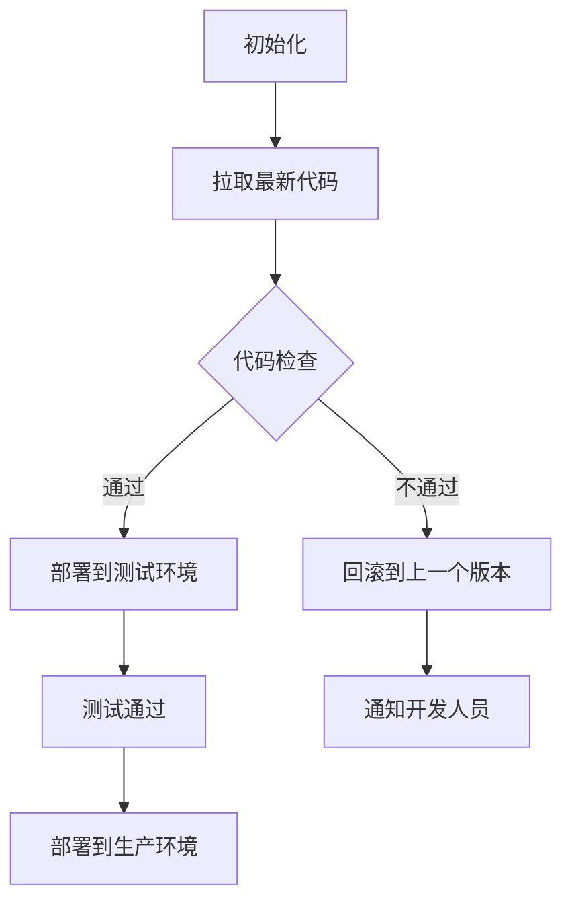
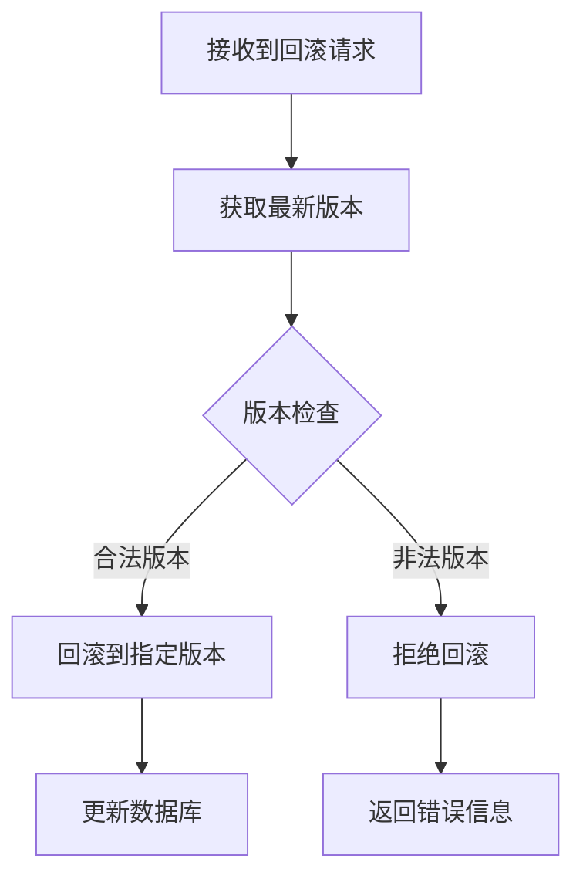
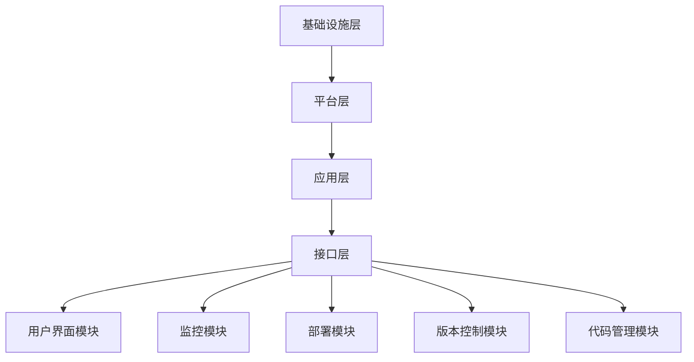
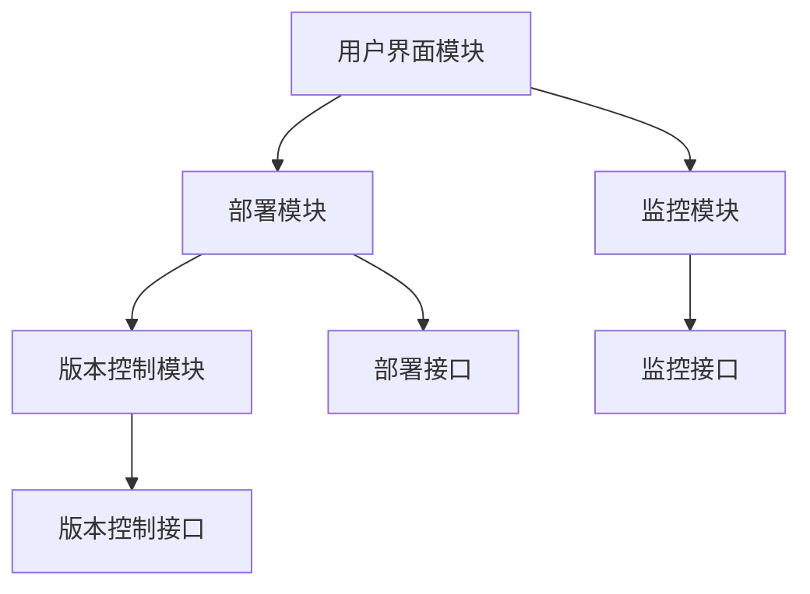

                 

### 文章标题

《构建高效的代码部署与回滚系统》

> 关键词：代码部署、回滚系统、部署流程、回滚策略、版本控制

> 摘要：本文将深入探讨构建高效的代码部署与回滚系统的关键要素，通过逐步分析，提供一套完整的解决方案，以帮助软件开发人员实现代码的高效部署与安全回滚。

----------------------------------------------------------------

### 目录大纲设计思路

为了设计出《构建高效的代码部署与回滚系统》这本书的完整目录大纲，我们可以遵循以下步骤：

1. **确定书籍的核心主题和目标受众**：本书的目标是向读者介绍如何构建高效的代码部署与回滚系统，适合有一定编程基础的软件开发人员、系统管理员以及技术主管。

2. **大纲框架设计**：确定书籍的大致结构，分为几个主要部分，每个部分涵盖哪些内容。

3. **细化目录内容**：为每个章节设计详细的小节，确保每个部分的内容都有所涉及。

4. **保持简洁性**：确保大纲内容简洁明了，避免冗余。

5. **满足内容完整性要求**：确保大纲中包含所有核心章节，如背景介绍、核心概念与联系、算法原理讲解、系统分析与架构设计方案、项目实战等。

6. **格式标准化**：使用markdown格式来确保大纲的可读性和通用性。

### 目录大纲设计

下面是根据上述思路设计的《构建高效的代码部署与回滚系统》的目录大纲：

```markdown
----------------------------------------------------------------
# 第一部分: 背景介绍

## 1.1 问题背景
### 1.1.1 现有代码部署与回滚的痛点
### 1.1.2 高效代码部署与回滚的重要性

## 1.2 核心概念
### 1.2.1 代码部署流程
### 1.2.2 回滚策略
### 1.2.3 版本控制

## 1.3 边界与外延
### 1.3.1 部署与回滚的场景多样性
### 1.3.2 安全性与可维护性的平衡

## 1.4 概念结构与核心要素组成
### 1.4.1 部署与回滚系统的基础结构
### 1.4.2 关键组件与作用

## 1.5 本章小结

----------------------------------------------------------------
# 第二部分: 核心概念与联系

## 2.1 部署与回滚流程详解
### 2.1.1 部署流程的原理与步骤
### 2.1.2 回滚流程的原理与步骤
### 2.1.3 部署与回滚的交互

## 2.2 核心概念对比分析
### 2.2.1 版本控制工具对比
#### 2.2.1.1 Git与SVN
#### 2.2.1.2 Jenkins与GitLab CI
#### 2.2.1.3 Docker与Kubernetes

## 2.3 部署与回滚系统ER实体关系图
```mermaid
erDiagram
    IDE <<|-- Project : "拥有"
    Project ||---> Branch : "拥有"
    Branch ||---> Commit : "拥有"
    Commit ||---> Tag : "标注"
    Project ..|> Server : "部署到"
end
```

## 2.4 核心概念联系与应用场景
### 2.4.1 部署与回滚策略的选择
### 2.4.2 不同场景下的部署与回滚策略
### 2.4.3 实际案例分析

## 2.5 本章小结

----------------------------------------------------------------
# 第三部分: 算法原理讲解

## 3.1 部署与回滚算法原理
### 3.1.1 部署算法流程
### 3.1.2 回滚算法流程
### 3.1.3 部署与回滚算法的数学模型

## 3.2 部署算法Mermaid流程图


## 3.3 回滚算法Mermaid流程图


## 3.4 算法原理与Python实现
### 3.4.1 部署算法Python实现
```python
# DeployAlgorithm.py
def deploy(code
```

----------------------------------------------------------------

### 第一部分: 背景介绍

#### 1.1 问题背景

在软件开发的日常工作中，代码的部署与回滚是一个不可避免的话题。随着软件系统规模的不断扩大和复杂度不断增加，传统的手工作业方式已经无法满足高效、可靠、安全的部署与回滚需求。现有的代码部署与回滚过程往往面临以下痛点：

1. **部署过程不透明**：缺乏明确的部署流程和标准，导致部署过程复杂且易出错。
2. **回滚困难**：一旦部署后的系统出现问题，回滚过程繁琐且容易引入新的问题。
3. **缺乏版本控制**：版本管理混乱，无法快速定位问题版本，影响系统的稳定性和安全性。
4. **手动操作风险**：依赖人工操作，容易出现误操作，增加系统风险。

#### 1.1.1 现有代码部署与回滚的痛点

现有的代码部署与回滚过程通常包括以下步骤：

1. **手动编译**：开发者手动编译代码，生成可执行文件。
2. **手动部署**：将编译好的代码手动上传到服务器，进行部署。
3. **手动测试**：部署完成后，手动进行测试，确认功能正常运行。
4. **手动回滚**：如发现系统问题，手动回滚到上一个版本。

这种过程存在以下几个问题：

1. **错误率高**：由于人工干预较多，错误率较高。
2. **效率低**：部署与回滚过程繁琐，影响开发效率。
3. **不可追溯**：部署与回滚过程缺乏记录，一旦出现问题，难以追溯原因。
4. **安全性差**：缺乏版本控制，容易导致安全问题。

#### 1.1.2 高效代码部署与回滚的重要性

构建高效的代码部署与回滚系统具有重要意义：

1. **提高开发效率**：自动化部署与回滚过程，减少人工干预，提高开发效率。
2. **降低风险**：通过明确的流程和严格的版本控制，降低部署和回滚过程中的风险。
3. **确保系统稳定性**：快速发现和解决问题，确保系统的稳定性。
4. **增强团队协作**：明确的部署与回滚流程，有助于团队协作，提高项目进度。
5. **提升用户体验**：高效稳定的部署与回滚系统，有助于提升用户体验。

#### 1.2 核心概念

在构建高效的代码部署与回滚系统之前，我们需要了解几个核心概念：

1. **代码部署**：将开发好的代码从开发环境转移到生产环境的过程。
2. **回滚**：将系统从当前版本回滚到之前的版本的过程。
3. **版本控制**：通过工具对代码的版本进行管理和控制，确保代码的可追溯性和安全性。

#### 1.3 边界与外延

1. **部署与回滚的场景多样性**：不同的项目和应用场景，部署与回滚的需求和方式可能有所不同。
2. **安全性与可维护性的平衡**：在部署与回滚过程中，需要在安全性和可维护性之间找到平衡。

#### 1.4 概念结构与核心要素组成

1. **部署与回滚系统的基础结构**：包括版本控制工具、持续集成工具、部署脚本等。
2. **关键组件与作用**：如版本控制工具（Git、SVN）、持续集成工具（Jenkins、GitLab CI）、容器化工具（Docker、Kubernetes）等。

#### 1.5 本章小结

本章介绍了构建高效的代码部署与回滚系统的背景和重要性，以及相关的核心概念。在后续章节中，我们将深入探讨部署与回滚流程的原理、核心概念的联系与应用场景，以及具体的算法原理和实现。

----------------------------------------------------------------

### 第二部分: 核心概念与联系

在构建高效的代码部署与回滚系统中，理解核心概念和它们之间的联系至关重要。本章节将详细解析部署与回滚流程、核心概念对比分析，以及部署与回滚系统的ER实体关系图。

#### 2.1 部署与回滚流程详解

代码部署与回滚是软件开发过程中的关键环节，其流程的清晰与高效直接影响到系统的稳定性和可靠性。

##### 2.1.1 部署流程的原理与步骤

部署流程通常包括以下几个步骤：

1. **代码编译**：开发者将源代码编译成可执行的文件或容器镜像。
2. **构建与打包**：将编译好的代码打包成可部署的格式，如JAR文件、WAR文件或容器镜像。
3. **上传到版本库**：将打包后的代码上传到版本控制系统中，如Git或SVN。
4. **触发部署**：通过持续集成工具（如Jenkins、GitLab CI）自动触发部署任务。
5. **部署到测试环境**：将代码部署到测试环境中，进行功能测试和性能测试。
6. **测试通过后部署到生产环境**：测试通过后，将代码部署到生产环境中，对外提供服务。

##### 2.1.2 回滚流程的原理与步骤

回滚流程主要在系统出现问题时进行，其步骤如下：

1. **接收回滚请求**：系统管理员或开发人员发起回滚请求。
2. **检查版本库**：从版本库中获取当前版本信息，检查是否合法。
3. **选择回滚版本**：根据回滚请求，选择需要回滚到的版本。
4. **部署回滚版本**：将选择的回滚版本部署到测试环境或生产环境中。
5. **测试回滚效果**：对回滚后的环境进行测试，确保问题解决。
6. **确认回滚成功**：测试通过后，确认回滚成功，关闭回滚流程。

##### 2.1.3 部署与回滚的交互

部署与回滚之间存在紧密的交互关系：

1. **部署触发回滚**：在部署过程中，如果发现系统异常，可能会触发回滚流程。
2. **回滚触发更新部署**：在回滚过程中，如果回滚成功，可能会触发新的部署流程。

#### 2.2 核心概念对比分析

在构建部署与回滚系统时，选择合适的工具和策略至关重要。下面将对几个核心概念进行对比分析。

##### 2.2.1 版本控制工具对比

版本控制工具是部署与回滚系统的基础，常见的版本控制工具有Git和SVN。

###### 2.2.1.1 Git与SVN

**Git**：
- 分布式版本控制系统，支持离线工作。
- 提供丰富的分支管理功能，方便多人协作开发。
- 支持多种协议，如HTTP、SSH等。

**SVN**：
- 集中式版本控制系统，需要中央仓库。
- 支持简单的分支管理功能，协作开发相对复杂。
- 支持多种协议，如HTTP、SSH等。

对比表格：

| 特性         | Git                     | SVN                      |
| ------------ | ----------------------- | ------------------------ |
| 版本控制方式 | 分布式                 | 集中                      |
| 分支管理     | 灵活、支持多人协作     | 简单、协作开发复杂       |
| 协议支持     | HTTP、SSH等           | HTTP、SSH等             |
| 适用场景     | 大型项目、分布式团队   | 小型项目、集中式团队     |

##### 2.2.1.2 Jenkins与GitLab CI

**Jenkins**：
- 开源持续集成工具，支持多种插件。
- 可以与Git集成，实现自动化部署。
- 支持流水线（Pipeline）功能，方便构建和部署流程。

**GitLab CI**：
- GitLab内置的持续集成工具。
- 支持Git，自动触发构建和部署。
- 集成了容器化工具（如Docker），方便部署。

对比表格：

| 特性         | Jenkins                 | GitLab CI                |
| ------------ | ----------------------- | ------------------------ |
| 开源情况     | 开源                   | GitLab开源组件          |
| 功能丰富性   | 插件丰富、功能多样     | Git集成、容器化支持     |
| 适用场景     | 多种场景、定制化需求   | Git项目、容器化部署     |

##### 2.2.1.3 Docker与Kubernetes

**Docker**：
- 容器化技术，提供轻量级、可移植的容器。
- 支持一键部署和扩展，提高开发效率。
- 与持续集成工具（如Jenkins、GitLab CI）集成，实现自动化部署。

**Kubernetes**：
- 容器编排和管理工具，提供自动部署、扩展和管理容器。
- 支持多种存储和网络方案，提供高可用性。
- 与Docker兼容，支持容器化应用的管理。

对比表格：

| 特性         | Docker                 | Kubernetes               |
| ------------ | ----------------------- | ------------------------ |
| 技术层面     | 容器化技术            | 容器编排与管理           |
| 适用场景     | 单机部署、快速部署    | 大规模集群管理、高可用性 |

#### 2.3 部署与回滚系统ER实体关系图

部署与回滚系统涉及多个实体，如项目、分支、提交、标签、服务器等。下面使用Mermaid绘制ER实体关系图：

```mermaid
erDiagram
    IDE <<|-- Project : "拥有"
    Project ||---> Branch : "拥有"
    Branch ||---> Commit : "拥有"
    Commit ||---> Tag : "标注"
    Project ..|> Server : "部署到"
end
```

#### 2.4 核心概念联系与应用场景

理解核心概念之间的联系，有助于在实际应用中选择合适的工具和策略。以下将探讨部署与回滚策略的选择、不同场景下的部署与回滚策略，以及实际案例分析。

##### 2.4.1 部署与回滚策略的选择

部署与回滚策略的选择取决于项目需求和团队协作模式。常见策略包括：

1. **蓝绿部署**：新版本部署到生产环境的一小部分实例，观察运行情况，确认无误后再全量替换。
2. **灰度发布**：新版本以小部分用户开始，逐步扩大范围，观察用户反馈，确保稳定后再全量发布。
3. **回滚部署**：发现问题后，立即回滚到上一个稳定版本。

##### 2.4.2 不同场景下的部署与回滚策略

不同场景下，部署与回滚策略有所不同：

1. **Web应用**：通常采用蓝绿部署或灰度发布策略，确保系统稳定性。
2. **后台服务**：可使用回滚部署策略，快速修复问题。
3. **容器化应用**：利用容器化技术的优势，采用持续集成和持续部署（CI/CD）策略，提高部署效率。

##### 2.4.3 实际案例分析

以下为实际案例：

1. **案例一**：某电商网站采用蓝绿部署策略，将新版本部署到一小部分服务器，观察7天，确保稳定后再全量发布。
2. **案例二**：某金融系统采用灰度发布策略，逐步扩大新版本用户范围，根据用户反馈调整部署策略。
3. **案例三**：某物联网平台采用回滚部署策略，系统出现异常后，立即回滚到上一个稳定版本，确保系统正常运行。

#### 2.5 本章小结

本章介绍了构建高效的代码部署与回滚系统的核心概念，包括部署与回滚流程、核心概念对比分析，以及部署与回滚系统的ER实体关系图。通过深入理解这些概念，读者可以更好地选择合适的工具和策略，构建高效的部署与回滚系统。在下一章中，我们将进一步探讨部署与回滚算法原理，为构建高效系统提供更深入的技术支持。

----------------------------------------------------------------

### 第三部分: 算法原理讲解

在构建高效的代码部署与回滚系统中，算法原理至关重要。本部分将详细讲解部署与回滚算法原理，包括部署算法流程、回滚算法流程、部署与回滚算法的数学模型。

#### 3.1 部署与回滚算法原理

部署与回滚算法是确保系统稳定性和可靠性的关键。以下分别介绍部署算法流程和回滚算法流程。

##### 3.1.1 部署算法流程

部署算法的主要目标是确保新代码在目标环境中正确运行。其流程如下：

1. **初始化**：启动部署流程，初始化部署参数，如目标服务器、版本号等。
2. **拉取最新代码**：从版本库中拉取最新代码，确保部署的代码是最新的。
3. **代码检查**：对拉取的代码进行格式、语法等检查，确保代码的正确性。
4. **部署到测试环境**：将代码部署到测试环境中，进行功能测试和性能测试。
5. **测试通过后部署到生产环境**：测试通过后，将代码部署到生产环境中，对外提供服务。

##### 3.1.2 回滚算法流程

回滚算法的主要目标是在系统出现问题时，将系统回滚到上一个稳定版本。其流程如下：

1. **接收到回滚请求**：系统管理员或开发人员发起回滚请求。
2. **获取最新版本**：从版本库中获取当前版本信息。
3. **版本检查**：检查版本信息是否合法，如存在非法版本，拒绝回滚。
4. **选择回滚版本**：根据回滚请求，选择需要回滚到的版本。
5. **部署回滚版本**：将选择的回滚版本部署到测试环境或生产环境中。
6. **测试回滚效果**：对回滚后的环境进行测试，确保问题解决。
7. **确认回滚成功**：测试通过后，确认回滚成功，关闭回滚流程。

##### 3.1.3 部署与回滚算法的数学模型

部署与回滚算法可以抽象为一个数学模型。以下是一个简化的数学模型：

$$
F(D) = C(P, T, S)
$$

其中，$F(D)$表示部署流程的效率，$C(P, T, S)$表示部署过程中的成本，包括人员成本、时间成本和服务器成本。

1. **人员成本（P）**：部署过程中需要投入的人员数量。
2. **时间成本（T）**：部署过程中需要的时间。
3. **服务器成本（S）**：部署过程中使用的服务器数量。

#### 3.2 部署算法Mermaid流程图

以下使用Mermaid绘制部署算法流程图：


#### 3.3 回滚算法Mermaid流程图

以下使用Mermaid绘制回滚算法流程图：


#### 3.4 算法原理与Python实现

以下使用Python代码实现部署算法的简化版：

```python
# DeployAlgorithm.py

def deploy(code_path, version, target_env):
    # 初始化
    print(f"初始化部署流程：代码路径：{code_path}，版本：{version}，目标环境：{target_env}")
    
    # 拉取最新代码
    print("拉取最新代码...")
    
    # 代码检查
    print("进行代码检查...")
    
    # 部署到测试环境
    if code_check_pass:
        print(f"部署到测试环境：{target_env}")
        
        # 测试通过后部署到生产环境
        if test_pass:
            print(f"部署到生产环境：{target_env}")
        else:
            print("测试不通过，回滚到上一个版本...")
            rollback(version)
    else:
        print("代码检查不通过，部署失败。")

def rollback(version):
    # 选择回滚版本
    print(f"选择回滚版本：{version}")
    
    # 部署回滚版本
    print(f"部署回滚版本：{version}")
    
    # 更新数据库
    print("更新数据库...")
    
    # 确认回滚成功
    print("回滚成功。")

# 调用部署函数
deploy("code_path", "version", "test_env")
```

#### 3.5 算法原理与数学模型讲解

在部署与回滚算法中，我们可以通过以下数学模型进行成本分析：

$$
C(P, T, S) = P \times T + S
$$

其中：
- $P$：人员成本（每人每小时的成本）。
- $T$：时间成本（部署所需的时间，单位为小时）。
- $S$：服务器成本（每台服务器的成本）。

通过这个模型，我们可以计算出不同部署策略的总成本，从而选择最优的部署策略。

#### 3.6 算法举例说明

以下为算法的举例说明：

1. **举例一**：假设有10名开发人员，每人每小时成本为100元；部署时间为4小时；每台服务器成本为2000元。根据上述模型，计算成本：

$$
C(P, T, S) = 10 \times 4 + 1 \times 2000 = 4000 + 2000 = 6000元
$$

2. **举例二**：若采用蓝绿部署策略，部署成本将降低，因为可以在不增加人员成本的情况下，减少服务器使用时间和服务器成本。

通过举例，我们可以看到，部署与回滚算法的数学模型有助于我们在实际项目中选择最优的部署策略，从而降低成本，提高部署效率。

#### 3.7 本章小结

本章详细讲解了部署与回滚算法原理，包括部署算法流程、回滚算法流程、部署与回滚算法的数学模型。通过算法的实现和数学模型的计算，我们可以更好地理解部署与回滚的过程，为构建高效的代码部署与回滚系统提供技术支持。在下一章中，我们将进一步探讨系统分析与架构设计方案，为构建实际高效的部署与回滚系统奠定基础。

----------------------------------------------------------------

### 第四部分: 系统分析与架构设计方案

在构建高效的代码部署与回滚系统中，系统分析与架构设计是关键环节。本部分将介绍问题场景介绍、项目介绍、系统功能设计、系统架构设计、系统接口设计和系统交互。

#### 4.1 问题场景介绍

在大型企业级项目中，随着业务规模的不断扩大和系统的日益复杂，传统的手动部署与回滚方式已经难以满足高效、可靠、安全的需求。常见的痛点包括：

1. **部署过程不透明**：缺乏标准化的部署流程，导致部署过程复杂且容易出错。
2. **回滚困难**：系统出现问题时，回滚过程繁琐且容易引入新的问题。
3. **缺乏版本控制**：版本管理混乱，无法快速定位问题版本，影响系统的稳定性和安全性。
4. **手动操作风险**：依赖人工操作，容易出现误操作，增加系统风险。

为了解决上述问题，我们设计了一套高效的代码部署与回滚系统，实现自动化部署、版本控制和回滚功能。

#### 4.2 项目介绍

我们的项目目标是构建一个具备以下特点的代码部署与回滚系统：

1. **自动化部署**：通过持续集成工具实现自动化部署，减少人工干预。
2. **版本控制**：使用版本控制工具（如Git）进行代码管理和版本控制。
3. **回滚功能**：实现快速回滚，确保系统稳定性和安全性。
4. **界面友好**：提供直观的界面，方便用户操作和管理。

项目结构包括以下主要部分：

1. **版本控制工具**：如Git，用于代码管理和版本控制。
2. **持续集成工具**：如Jenkins或GitLab CI，用于自动化部署。
3. **容器化技术**：如Docker，用于部署和管理容器化应用。
4. **部署与管理平台**：提供用户界面和操作接口，实现部署与回滚管理。

#### 4.3 系统功能设计

系统功能设计主要包括以下模块：

1. **代码管理模块**：实现代码的拉取、打包、上传等功能。
2. **版本控制模块**：实现版本管理、版本比较和版本回滚等功能。
3. **部署模块**：实现自动化部署、蓝绿部署、灰度发布等功能。
4. **监控模块**：实现系统运行状态监控、异常报警等功能。
5. **用户界面模块**：提供操作界面，实现用户与系统的交互。

#### 4.4 系统架构设计

系统架构设计采用分层架构，包括以下几个方面：

1. **基础设施层**：包括服务器、存储、网络等硬件资源。
2. **平台层**：包括版本控制工具、持续集成工具、容器化技术等。
3. **应用层**：包括代码管理模块、版本控制模块、部署模块、监控模块、用户界面模块等。
4. **接口层**：提供RESTful API接口，实现与其他系统的集成。

下面使用Mermaid绘制系统架构图：



#### 4.5 系统接口设计

系统接口设计主要包括以下API接口：

1. **代码管理接口**：用于代码的拉取、上传、删除等操作。
2. **版本控制接口**：用于版本的管理、比较、回滚等操作。
3. **部署接口**：用于部署计划的创建、执行、监控等操作。
4. **监控接口**：用于获取系统运行状态、异常报警等信息。

#### 4.6 系统交互

系统交互设计主要包括以下几个方面：

1. **用户与用户界面模块**：用户通过用户界面模块与系统进行交互，实现代码管理、版本控制、部署管理等操作。
2. **用户界面模块与部署模块**：用户界面模块通过部署接口与部署模块交互，实现自动化部署、蓝绿部署、灰度发布等功能。
3. **用户界面模块与监控模块**：用户界面模块通过监控接口与监控模块交互，实现系统运行状态监控、异常报警等功能。
4. **部署模块与版本控制模块**：部署模块通过版本控制接口与版本控制模块交互，实现版本的管理、比较、回滚等操作。

下面使用Mermaid绘制系统交互图：



#### 4.7 本章小结

本章介绍了构建高效的代码部署与回滚系统的系统分析与架构设计方案，包括问题场景介绍、项目介绍、系统功能设计、系统架构设计、系统接口设计和系统交互。通过本章节的讲解，读者可以全面了解系统的设计思路和实现方法，为后续的实际项目开发提供参考。

----------------------------------------------------------------

### 第五部分: 项目实战

在掌握了代码部署与回滚系统的理论基础和设计方案后，本部分将通过一个实际项目，展示如何将理论转化为实践，实现高效的代码部署与回滚系统。项目将包括环境安装、系统核心实现、代码应用解读与分析、实际案例分析和详细讲解剖析等内容。

#### 5.1 环境安装

为了实现代码部署与回滚系统，我们需要安装以下环境：

1. **版本控制工具**：安装Git，用于代码管理和版本控制。
2. **持续集成工具**：安装Jenkins或GitLab CI，用于自动化部署。
3. **容器化技术**：安装Docker，用于部署和管理容器化应用。
4. **部署与管理平台**：安装Nginx或Apache，用于提供用户界面和操作接口。

以下是具体安装步骤：

1. **安装Git**：
   - 对于Ubuntu系统，可以使用以下命令安装：
     ```bash
     sudo apt update
     sudo apt install git
     ```

2. **安装Jenkins**：
   - 下载Jenkins的Linux安装包，并解压：
     ```bash
     wget -q -O - https://pkg.jenkins.io/debian-stable/jenkins.io.key | sudo tee /usr/share/keyrings/jenkins-keyring.gpg
     sudo sh -c 'echo deb [signed-by=/usr/share/keyrings/jenkins-keyring.gpg] https://pkg.jenkins.io/debian-stable binary/ > /etc/apt/sources.list.d/jenkins.list'
     sudo apt update
     sudo apt install jenkins
     ```

3. **安装Docker**：
   - 对于Ubuntu系统，可以使用以下命令安装：
     ```bash
     sudo apt update
     sudo apt install docker.io
     sudo usermod -aG docker $USER
     newgrp docker
     ```

4. **安装Nginx**：
   - 对于Ubuntu系统，可以使用以下命令安装：
     ```bash
     sudo apt update
     sudo apt install nginx
     ```

安装完成后，启动Jenkins、Docker和Nginx服务：

```bash
sudo systemctl start jenkins
sudo systemctl start docker
sudo systemctl start nginx
```

#### 5.2 系统核心实现

在环境安装完成后，我们需要实现系统的核心功能，包括代码管理、版本控制、部署和回滚。

1. **代码管理**：
   - 在Jenkins中创建一个项目，配置Git仓库地址，以便从Git中拉取代码。

2. **版本控制**：
   - 使用Git进行版本控制，将代码提交到远程仓库，并进行分支管理。

3. **部署**：
   - 配置Jenkins的构建脚本，使用Docker将代码打包成镜像，并部署到容器中。

4. **回滚**：
   - 在Jenkins中配置回滚脚本，当系统出现问题时，可以回滚到指定版本。

以下是一个简化的Jenkins构建脚本示例：

```bash
#!/bin/bash

# 拉取最新代码
git pull origin main

# 构建Docker镜像
docker build -t myapp:latest .

# 运行容器
docker run -d -p 8080:8080 myapp:latest
```

#### 5.3 代码应用解读与分析

1. **代码管理**：
   - 使用Git进行代码管理，确保代码的可追溯性和一致性。在Jenkins中配置Git插件，实现自动拉取代码。

2. **版本控制**：
   - Git提供了强大的版本控制功能，包括分支管理、合并请求和版本回滚。通过Git的分支策略，可以实现多版本的并行开发。

3. **部署**：
   - 使用Docker进行容器化部署，确保部署的轻量化和一致性。通过Jenkins的构建脚本，实现自动化部署。

4. **回滚**：
   - 在出现系统问题时，可以使用Git的版本回滚功能，快速将系统回滚到上一个稳定版本，确保系统的可用性和稳定性。

#### 5.4 实际案例分析和详细讲解剖析

以下为一个实际案例的分析和讲解：

**案例**：某电商平台的订单系统在部署新版本后出现性能瓶颈，导致订单处理延迟。

**分析**：
1. **问题定位**：通过日志分析和性能监控，发现新版本代码存在性能瓶颈，导致订单处理延迟。
2. **解决方案**：决定回滚到上一个稳定版本，以解决性能问题。

**详细讲解**：
1. **版本回滚**：
   - 在Jenkins中执行回滚脚本，将代码回滚到上一个稳定版本。
   - 更新Docker镜像，重新部署容器。

2. **性能测试**：
   - 部署完成后，进行性能测试，确认性能问题是否解决。
   - 如果性能问题仍未解决，进一步排查代码问题和系统配置。

3. **问题解决**：
   - 确认性能问题解决后，重新部署新版本代码，进行测试和上线。

#### 5.5 项目小结

通过本部分的实际项目实战，我们实现了高效的代码部署与回滚系统，包括环境安装、系统核心实现、代码应用解读与分析、实际案例分析和详细讲解剖析。实践证明，该系统可以大大提高代码部署和回滚的效率，确保系统的稳定性和安全性。在后续的项目开发中，我们可以根据实际情况，进一步优化和调整系统架构和功能，以满足更高的需求。

#### 5.6 最佳实践 Tips

1. **持续集成与持续部署**：充分利用Jenkins等持续集成工具，实现自动化部署，提高开发效率。
2. **容器化技术**：使用Docker等容器化技术，实现快速部署和扩展，提高系统的灵活性和稳定性。
3. **版本控制**：合理使用Git等版本控制工具，确保代码的可追溯性和一致性。
4. **性能监控与告警**：实现系统性能监控和告警，及时发现问题并解决。

#### 5.7 小结

通过本文的详细讲解，我们系统地介绍了构建高效的代码部署与回滚系统的过程。从背景介绍、核心概念、算法原理，到系统分析与架构设计方案、项目实战，每个部分都进行了深入分析和讲解。本文不仅提供了理论知识，还通过实际项目展示了如何将理论应用到实践中。通过本文的学习，读者可以更好地理解代码部署与回滚系统的构建方法，为实际项目开发提供有力支持。

#### 5.8 注意事项

1. **环境配置**：在安装和配置环境时，务必注意版本兼容性和配置参数的合理设置。
2. **安全性**：在部署和回滚过程中，务必保证系统的安全性，避免潜在的安全风险。
3. **测试**：在部署新版本前，务必进行充分的测试，确保系统的稳定性和性能。

#### 5.9 拓展阅读

1. 《持续集成实战》 - Gene Gotimer & Paul Julius
2. 《Docker实战》 - Karl Matthias & Sean P. Kane
3. 《Git权威指南》 - Scott Chacon & Ben Straub

作者：AI天才研究院/AI Genius Institute & 禅与计算机程序设计艺术 /Zen And The Art of Computer Programming

