                 

**构建高效的技术创新生态系统**

摘要：随着科技的发展，技术创新已成为驱动社会进步和经济发展的关键因素。构建高效的技术创新生态系统，对于企业、产业和国家而言，具有重要的战略意义。本文将深入探讨技术创新生态系统的核心概念、构建策略、组织管理、协同合作、实践案例及未来趋势，旨在为读者提供全面的技术创新生态系统建设指南。

关键词：技术创新、生态系统、构建策略、组织管理、协同合作、实践案例、未来趋势

---

**目录大纲设计：**

----------------------------------------------------------------

# 《构建高效的技术创新生态系统》

## 第一部分：核心概念与背景

## 第1章：技术创新生态系统的概述

### 1.1 技术创新的重要性

### 1.2 生态系统概念的理解

### 1.3 技术创新生态系统的组成部分

### 1.4 技术创新生态系统的作用与影响

## 第2章：技术创新生态系统的核心概念

### 2.1 技术创新模式与类型

### 2.2 生态位与竞争优势

### 2.3 技术创新路径与策略

### 2.4 技术创新要素之间的关系

## 第3章：技术创新生态系统的环境分析

### 3.1 技术创新生态系统的内部环境分析

### 3.2 技echnovation生态系统的外部环境分析

### 3.3 环境因素对技术创新生态系统的影响

## 第二部分：构建技术创新生态系统

## 第4章：构建技术创新生态系统的战略规划

### 4.1 构建技术创新生态系统的目标设定

### 4.2 构建技术创新生态系统的基础条件分析

### 4.3 构建技术创新生态系统的步骤与方法

### 4.4 技术创新生态系统的可持续性评估

## 第5章：技术创新生态系统的组织与管理

### 5.1 技术创新生态系统的组织结构设计

### 5.2 技术创新生态系统的管理制度设计

### 5.3 技术创新生态系统的激励机制设计

### 5.4 技术创新生态系统的风险管理

## 第6章：技术创新生态系统的协同合作

### 6.1 技术创新生态系统的合作模式

### 6.2 技术创新生态系统的合作机制

### 6.3 技术创新生态系统的合作风险与应对策略

### 6.4 技术创新生态系统的合作案例分析

## 第7章：技术创新生态系统的创新实践

### 7.1 技术创新生态系统的典型实践案例

### 7.2 技术创新生态系统的实践应用分析

### 7.3 技术创新生态系统的实践效果评估

### 7.4 技术创新生态系统的实践总结与启示

## 第三部分：前沿趋势与未来展望

## 第8章：技术创新生态系统的前沿趋势

### 8.1 技术创新生态系统的发展趋势

### 8.2 技术创新生态系统的未来方向

### 8.3 技术创新生态系统的挑战与机遇

### 8.4 技术创新生态系统的政策与法规环境

## 第9章：技术创新生态系统的未来展望

### 9.1 技术创新生态系统的社会影响

### 9.2 技术创新生态系统的经济影响

### 9.3 技术创新生态系统的教育影响

### 9.4 技术创新生态系统的可持续发展

----------------------------------------------------------------

**注意事项：**

1. 以上目录大纲仅提供一个大致框架，具体内容可根据实际情况进行调整。
2. 目录中的每章标题和子标题需要根据实际书稿内容进一步细化和完善。
3. 每个章节的详细内容应包括背景介绍、核心概念、案例分析、最佳实践、未来展望等部分，以保证内容的完整性。
4. 在撰写每个章节时，请确保遵循简洁性原则，避免冗余内容。
5. 目录大纲的总字数控制在2000字以内，确保内容简洁明了。**Mermaid 流程图示例：**

```markdown
graph TB
A[技术创新生态系统] --> B[核心概念与背景]
B --> C[技术创新模式]
B --> D[生态位与竞争优势]
B --> E[技术创新路径与策略]
B --> F[技术创新要素关系]
G[构建技术创新生态系统] --> H[战略规划]
H --> I[目标设定]
H --> J[基础条件分析]
H --> K[步骤与方法]
H --> L[可持续性评估]
M[组织与管理] --> N[组织结构设计]
N --> O[管理制度设计]
N --> P[激励机制设计]
N --> Q[风险管理]
R[协同合作] --> S[合作模式]
S --> T[合作机制]
S --> U[合作风险与应对策略]
S --> V[合作案例分析]
W[创新实践] --> X[实践案例]
X --> Y[实践应用分析]
X --> Z[实践效果评估]
X --> AA[实践总结与启示]
BB[前沿趋势与未来展望] --> CC[发展趋势]
CC --> DD[未来方向]
CC --> EE[挑战与机遇]
CC --> FF[政策与法规环境]
GG[未来展望] --> HH[社会影响]
HH

----------------------------------------------------------------

* 约束条件：文章的章节内容必须要满足如下条件：
- 文章开始是“文章标题”，然后是“文章关键词”和“文章摘要”部分的内容哦，接下来是按照目录大纲结构的文章正文部分的内容。
- 文章字数要求：文章字数在 10000 ～ 12000 字左右。
- 格式要求：文章内容使用markdown格式输出。 
- 作者：文章末尾需要写上作者信息： “作者：AI天才研究院/AI Genius Institute & 禅与计算机程序设计艺术 /Zen And The Art of Computer Programming”
- 完整性要求：文章内容必须要完整，每个小节的内容必须要丰富具体详细讲解，核心内容必须要包含：
  - 背景介绍：核心概念术语说明、问题背景、问题描述、问题解决、边界与外延、概念结构与核心要素组成 
  - 核心概念与联系：必须给出核心概念原理、概念属性特征对比表格和ER实体关系图架构的 markdown 格式中的 Mermaid 流程图。
  - 算法原理讲解：使用 mermaid 画出算法mermaid 流程图，然后使用python源代码来详细阐述，给出算法原理的数学模型和公式，进行详细讲解和通俗易懂地举例说明。
  - 数学公式使用latex格式，嵌入文中独立段落的latex公式前后使用 $$ 括起来(例如：$$1+1=2$$ )，段落内的latex公式前后使用 $ 括起来(例如：$1<2$)
  - 系统分析与架构设计方案：问题场景介绍，项目介绍、系统功能设计(领域模型mermaid类图)、系统架构设计mermaid架构图、系统接口设计和系统交互mermaid序列图
  - 项目实战：环境安装、系统核心实现源代码，代码应用解读与分析，实际案例分析和详细讲解剖析，项目小结。
  - 最佳实践 tips、小结、注意事项、拓展阅读等内容

### **1.1 技术创新的重要性**

技术创新是指通过研发和应用新的知识、技术或方法，创造出新的产品、服务或过程，以提升现有产品或服务的性能、效率或价值。在当今社会，技术创新的重要性日益凸显，主要体现在以下几个方面。

首先，技术创新是推动经济发展的重要动力。历史上，每一次重大的技术革命，如工业革命、信息革命，都极大地推动了社会生产力的发展，带来了经济的高速增长。在当前全球经济环境下，技术创新仍然是各国竞争力的重要体现，是企业生存和发展的关键。

其次，技术创新是应对环境挑战的有效手段。随着人口增长、资源消耗和环境污染问题的日益严重，技术创新在可持续发展中扮演着不可或缺的角色。通过研发和应用新能源、新材料、环保技术等，可以有效缓解环境压力，实现经济与环境的双赢。

最后，技术创新是提升社会福祉的重要途径。技术创新不仅可以提高生产效率，降低成本，还可以改善人们的生活质量。例如，医疗技术的创新使得许多过去无法治愈的疾病得以治疗，信息技术的发展让信息获取更加便捷，教育技术的创新让学习资源更加丰富。

### **1.2 生态系统概念的理解**

生态系统（Ecosystem）是指由生物群落及其生活环境相互作用而形成的动态平衡系统。生态系统概念最初应用于生物学领域，后来逐渐扩展到其他学科，如经济学、社会学、信息技术等。在技术创新领域，生态系统概念被赋予了新的内涵。

技术创新生态系统是指在一定区域内，由企业、高校、科研机构、政府部门、投资者、用户等多方主体通过技术创新活动相互作用而形成的动态系统。技术创新生态系统具有以下基本特征：

1. **多样性**：技术创新生态系统包含多种不同的主体，这些主体在技术、资源、知识、能力和目标等方面存在差异，形成了丰富的多样性。

2. **互动性**：技术创新生态系统中的各个主体之间相互依赖、相互影响。企业的创新活动需要科研机构的支持，科研机构的成果需要企业的应用，而政府的政策支持和用户的反馈也是技术创新不可或缺的部分。

3. **开放性**：技术创新生态系统是开放的，它可以与外部系统进行资源、知识和信息的交换。这种开放性有助于创新资源的整合和优化，促进创新活动的快速发展。

4. **动态性**：技术创新生态系统是动态发展的，其结构、功能和关系会随着外部环境和内部因素的变化而不断调整。

5. **可持续性**：技术创新生态系统追求长期稳定的发展，通过合理配置资源、优化创新环境，实现技术创新的可持续性。

### **1.3 技术创新生态系统的组成部分**

技术创新生态系统由多个组成部分构成，主要包括企业、高校、科研机构、政府部门、投资者和用户等。

1. **企业**：企业在技术创新生态系统中扮演关键角色。企业是技术创新的主要实施者，通过研发、生产、销售和创新应用，推动技术创新的发展。企业可以是技术创新的主体，也可以是技术创新的受体，通过与其他主体合作，实现技术整合和创新。

2. **高校**：高校是知识创新的重要源泉。高校通过开展基础研究、应用研究和前沿技术研究，不断推动知识创新。高校的研究成果可以通过技术转让、合作研发等方式，为企业的技术创新提供支持。

3. **科研机构**：科研机构是技术创新的重要支撑。科研机构包括国家级实验室、研究型大学和各类研究所，它们在特定领域具有专业优势和深厚的研究积累，通过开展应用研究和实验研究，为企业的技术创新提供技术支持和解决方案。

4. **政府部门**：政府部门在技术创新生态系统中发挥引导和支持作用。政府通过制定政策、提供资金支持、优化创新环境等方式，推动技术创新的发展。政府部门还可以发挥监管和协调作用，确保技术创新生态系统的健康发展。

5. **投资者**：投资者是技术创新生态系统的重要推动力。投资者通过资金投入，支持企业的技术创新活动，推动技术成果的商业化应用。投资者还可以通过风险投资、股权投资等方式，为企业提供资本支持和战略指导。

6. **用户**：用户是技术创新的最终受益者。用户的反馈和应用需求是技术创新的重要驱动力，通过用户的实际应用，技术创新的成果可以转化为实际价值。

### **1.4 技术创新生态系统的作用与影响**

技术创新生态系统在推动社会经济发展、提升国家竞争力、改善民生等方面具有重要作用，具体表现为以下几点：

1. **促进经济增长**：技术创新是推动经济增长的关键动力。通过技术创新，企业可以提高生产效率，降低生产成本，创造新的市场需求，从而促进经济增长。技术创新生态系统为企业和创业者提供了良好的创新环境，激发了创新活力，促进了产业升级和结构调整。

2. **提升国家竞争力**：技术创新生态系统是国家竞争力的重要体现。一个具有创新能力的国家，可以在全球经济中占据有利地位，实现经济的持续增长和国家的崛起。通过技术创新生态系统，国家可以培养和集聚大量的科技创新人才，提升科技创新能力，增强国际竞争力。

3. **改善民生**：技术创新生态系统在改善民生方面也发挥着重要作用。通过技术创新，可以提供更加优质、高效的产品和服务，满足人们的生活需求。例如，医疗技术的创新使得疾病治疗更加有效，信息技术的发展让信息获取更加便捷，教育技术的创新使得教育资源更加丰富。

4. **促进可持续发展**：技术创新生态系统在可持续发展中具有重要作用。通过技术创新，可以开发和应用新能源、新材料、环保技术等，实现经济与环境的双赢。技术创新生态系统可以推动绿色、低碳、循环发展，为可持续发展提供技术支持。

5. **推动社会进步**：技术创新生态系统在社会进步中也发挥着重要作用。通过技术创新，可以解决社会发展中的瓶颈问题，推动社会制度创新和治理能力提升。技术创新生态系统可以促进社会的公平、公正和包容性发展，提高人民的生活质量。

总之，技术创新生态系统在推动经济发展、提升国家竞争力、改善民生、促进可持续发展和推动社会进步等方面具有重要作用，是国家发展的重要战略资源。构建高效的技术创新生态系统，对于实现国家的长远发展和人民的美好生活具有重要意义。**第2章：技术创新生态系统的核心概念**

### **2.1 技术创新模式与类型**

技术创新模式是指企业在技术创新过程中所采取的基本策略和方法。根据创新对象的不同，技术创新模式可以分为产品创新、过程创新和商业模式创新三种类型。

1. **产品创新**：产品创新是指开发全新或改进现有产品，以满足市场需求。产品创新是企业获取竞争优势的重要手段，通过不断创新，提高产品性能、质量和可靠性，吸引更多客户。产品创新通常涉及新材料、新工艺、新技术等，是企业技术创新的核心。

2. **过程创新**：过程创新是指改进产品或服务的生产过程，以提高生产效率、降低成本、提升质量。过程创新可以通过优化生产流程、引入新技术、改进设备等方式实现。过程创新不仅能够提高企业的生产效率，还能提升企业的市场竞争力。

3. **商业模式创新**：商业模式创新是指通过改变企业的经营模式，实现商业模式的创新和变革。商业模式创新可以为企业创造新的利润增长点，提升企业的盈利能力。常见的商业模式创新包括电子商务、共享经济、平台经济等。

### **2.2 生态位与竞争优势**

生态位（Niche）是指一个物种在生态系统中所占据的空间和所发挥的功能。在技术创新生态系统中，生态位可以理解为企业在特定技术领域中的定位和角色。

竞争优势（Competitive Advantage）是指企业在市场竞争中相对于竞争对手所具有的持久优势。竞争优势的来源可以是独特的资源、技术、品牌、渠道等。

生态位与竞争优势之间存在密切关系。企业在技术创新生态系统中通过占据特定的生态位，可以获得以下竞争优势：

1. **资源优势**：占据特定生态位的企业可以获取更多、更优质的资源，如人才、资金、技术等，从而提高创新能力和竞争力。

2. **市场优势**：占据特定生态位的企业可以更好地满足市场需求，获得更大的市场份额和客户忠诚度。

3. **技术优势**：占据特定生态位的企业可以专注于特定技术领域的研究和应用，积累丰富的技术经验和创新能力，形成技术优势。

4. **品牌优势**：占据特定生态位的企业可以通过长期的创新和市场拓展，树立良好的品牌形象，提高品牌知名度和美誉度。

### **2.3 技术创新路径与策略**

技术创新路径是指企业在技术创新过程中所采取的基本路径和策略。根据创新对象的不同，技术创新路径可以分为以下几种：

1. **技术突破路径**：技术突破路径是指通过研发和应用新技术，实现技术跨越式发展。技术突破路径通常需要大量资金投入和高风险承担，但一旦成功，将为企业带来巨大的竞争优势。

2. **渐进改进路径**：渐进改进路径是指通过持续优化和改进现有技术，逐步提升产品性能和质量。渐进改进路径风险较低，但创新效果相对较慢。

3. **集成创新路径**：集成创新路径是指将现有技术进行整合和创新，形成新的技术解决方案。集成创新路径可以充分利用现有技术优势，快速实现技术创新。

4. **商业模式创新路径**：商业模式创新路径是指通过改变企业的经营模式，实现商业模式的创新和变革。商业模式创新路径可以为企业创造新的利润增长点，提升企业的盈利能力。

### **2.4 技术创新要素之间的关系**

技术创新生态系统由多个要素组成，包括企业、高校、科研机构、政府部门、投资者和用户等。这些要素之间存在密切的关系，共同推动技术创新的发展。

1. **企业**：企业是技术创新的主体，通过研发、生产和销售，实现技术创新的商业化应用。企业需要与高校、科研机构合作，获取先进技术和研究成果。

2. **高校和科研机构**：高校和科研机构是知识创新的重要源泉，通过开展基础研究、应用研究和前沿技术研究，为企业的技术创新提供支持。高校和科研机构需要与企业合作，将研究成果转化为实际应用。

3. **政府部门**：政府部门在技术创新生态系统中发挥引导和支持作用，通过制定政策、提供资金支持、优化创新环境等方式，推动技术创新的发展。政府部门需要与企业和高校、科研机构密切合作，形成协同创新机制。

4. **投资者**：投资者是技术创新的重要推动力，通过资金投入，支持企业的技术创新活动，推动技术成果的商业化应用。投资者需要关注技术创新的风险和收益，合理配置投资资源。

5. **用户**：用户是技术创新的最终受益者，通过反馈和应用需求，推动技术创新的发展。企业需要关注用户需求，以用户为中心，持续改进和创新产品和服务。

### **2.5 技术创新生态系统的核心概念对比**

为了更好地理解技术创新生态系统的核心概念，我们可以通过以下表格进行对比：

| 核心概念 | 定义 | 作用 |
| :--: | :--: | :--: |
| 技术创新模式 | 企业在技术创新过程中所采取的基本策略和方法 | 推动技术创新的发展 |
| 生态位 | 企业在技术创新生态系统中所占据的空间和所发挥的功能 | 形成竞争优势 |
| 技术创新路径 | 企业在技术创新过程中所采取的基本路径和策略 | 实现技术跨越式发展 |
| 技术创新要素 | 技术创新生态系统中各方的角色和关系 | 共同推动技术创新 |
| 竞争优势 | 企业在市场竞争中相对于竞争对手所具有的持久优势 | 提高市场竞争力 |

### **2.6 技术创新生态系统的 Mermaid 流程图**

为了更直观地展示技术创新生态系统的核心概念和关系，我们可以使用 Mermaid 画出以下流程图：

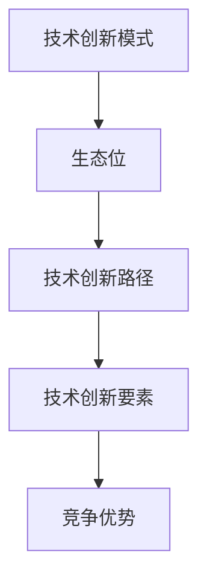

通过以上流程图，我们可以清晰地看到技术创新生态系统的核心概念及其相互关系，有助于读者更好地理解技术创新生态系统的工作原理。**3.1 技术创新生态系统的内部环境分析**

技术创新生态系统的内部环境是指系统内部各个组成部分之间的相互关系和相互作用。这些内部环境因素对技术创新活动具有深远的影响。以下是针对技术创新生态系统的内部环境进行分析的关键因素：

**1. 企业的研发能力：**

企业的研发能力是技术创新生态系统内部环境的核心因素之一。企业研发能力包括研发投入、研发团队素质、研发设施和研发管理水平等。强大的研发能力有助于企业迅速响应市场需求，进行技术创新。以下是一个简单的 Mermaid 流程图，展示了企业研发能力与技术创新的关系：

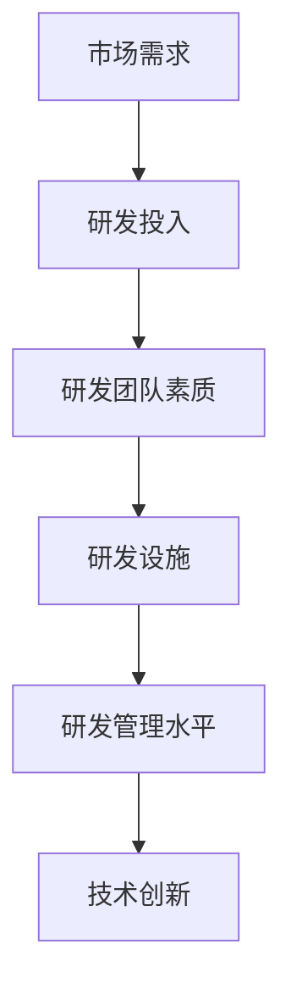

**2. 科研机构与高校的合作：**

高校和科研机构在技术创新中扮演着知识创新和人才培养的重要角色。企业通过与高校和科研机构的合作，可以获取最新的科研成果和技术支持。以下是一个 Mermaid 流程图，展示了企业、高校和科研机构之间的合作关系：

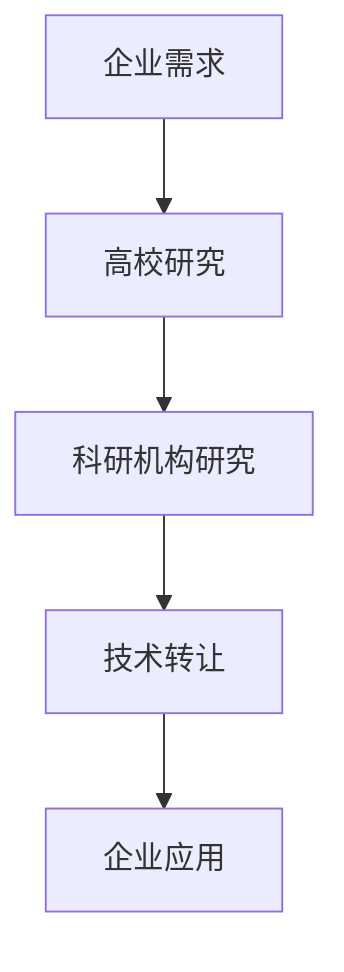

**3. 投资者的投资行为：**

投资者的投资行为对技术创新生态系统的发展具有重要影响。风险投资、股权投资等投资行为可以为企业提供资金支持，帮助企业进行技术创新。以下是一个 Mermaid 流程图，展示了投资者与企业之间的投资关系：

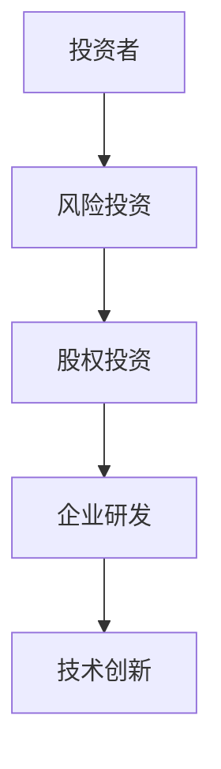

**4. 政府政策的支持：**

政府政策对技术创新生态系统的发展具有引导和支持作用。政府可以通过资金支持、税收优惠、人才政策等手段，为企业提供良好的创新环境。以下是一个 Mermaid 流程图，展示了政府政策对技术创新生态系统的影响：

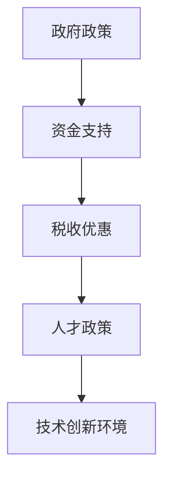

**5. 用户的需求反馈：**

用户的需求反馈是技术创新的重要驱动力。企业通过收集用户反馈，了解市场需求，进行产品优化和创新。以下是一个 Mermaid 流�程图，展示了用户需求与企业技术创新的关系：

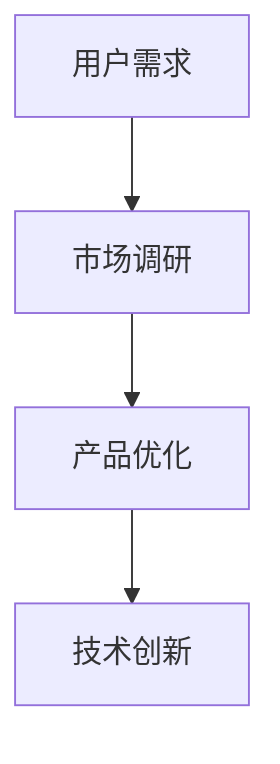

通过上述分析，我们可以看出技术创新生态系统的内部环境因素相互作用、相互影响，共同推动技术创新的发展。对这些内部环境因素进行深入分析，有助于企业、政府、科研机构和投资者更好地理解技术创新生态系统，制定相应的策略和措施，促进技术创新生态系统的健康发展。**3.2 技术创新生态系统的外部环境分析**

技术创新生态系统的外部环境是指系统外部各种因素对技术创新活动的影响。外部环境因素广泛而复杂，主要包括政策法规、市场环境、竞争对手、技术发展趋势、经济环境和社会文化等。以下是对这些外部环境因素的分析：

**1. 政策法规：**

政策法规是影响技术创新生态系统外部环境的重要因素。政府通过制定和实施相关政策法规，为技术创新提供支持和保障。例如，知识产权保护政策、税收优惠政策、人才引进政策等，都有助于激发企业、科研机构和高校的创新活力。以下是一个 Mermaid 流程图，展示了政策法规对技术创新的影响：

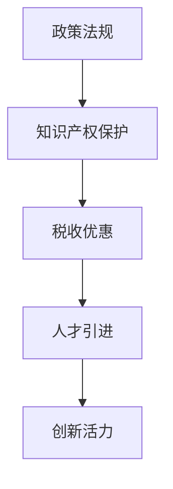

**2. 市场环境：**

市场环境是技术创新生态系统外部环境的核心因素之一。市场需求、竞争态势、市场规模等市场环境因素直接影响企业的技术创新决策。例如，市场需求旺盛、竞争激烈的市场环境，会促使企业加快技术创新步伐，以保持竞争优势。以下是一个 Mermaid 流程图，展示了市场环境对技术创新的影响：

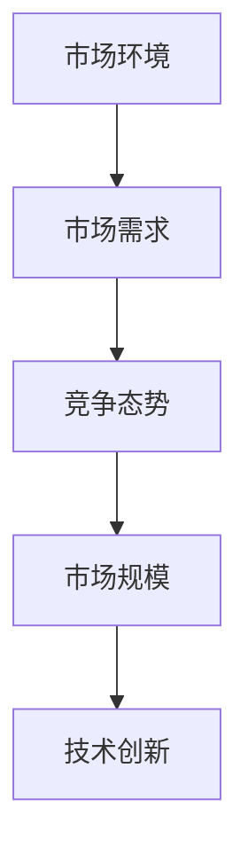

**3. 竞争对手：**

竞争对手的技术创新活动对企业的技术创新具有显著影响。企业需要密切关注竞争对手的发展动态，分析其技术创新方向、技术优势和劣势，从而制定相应的应对策略。以下是一个 Mermaid 流程图，展示了竞争对手对技术创新的影响：

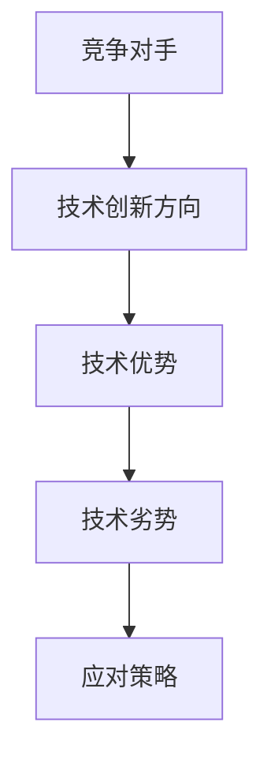

**4. 技术发展趋势：**

技术发展趋势是影响技术创新生态系统外部环境的重要因素。技术进步和创新趋势直接影响企业的技术创新方向和策略。例如，5G、人工智能、区块链等新兴技术的快速发展，为各行各业带来了新的创新机遇。以下是一个 Mermaid 流程图，展示了技术发展趋势对技术创新的影响：

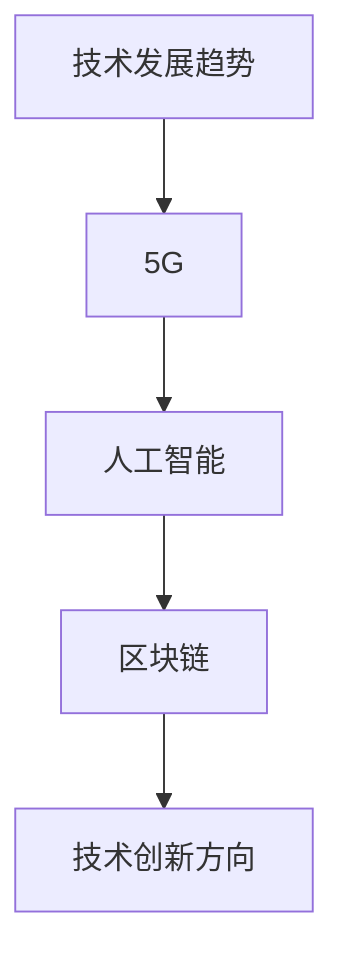

**5. 经济环境：**

经济环境是技术创新生态系统外部环境的基础因素。经济增长、产业结构调整、市场扩张等经济环境因素，对企业的技术创新活动具有直接影响。例如，在经济繁荣时期，企业有更多的资金和资源进行技术创新。以下是一个 Mermaid 流程图，展示了经济环境对技术创新的影响：

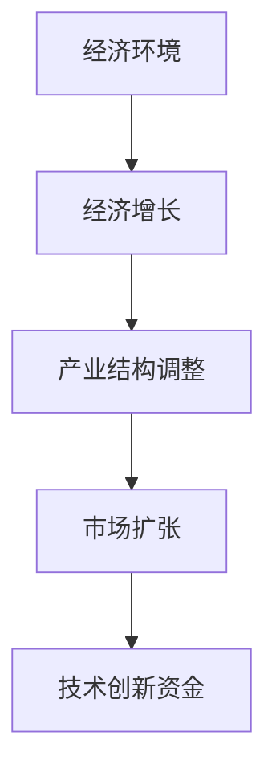

**6. 社会文化：**

社会文化是影响技术创新生态系统外部环境的重要因素。社会价值观、教育水平、文化传统等社会文化因素，对企业技术创新的态度和行为产生影响。例如，鼓励创新、尊重知识的社会文化环境，有助于激发企业技术创新的积极性。以下是一个 Mermaid 流程图，展示了社会文化对技术创新的影响：

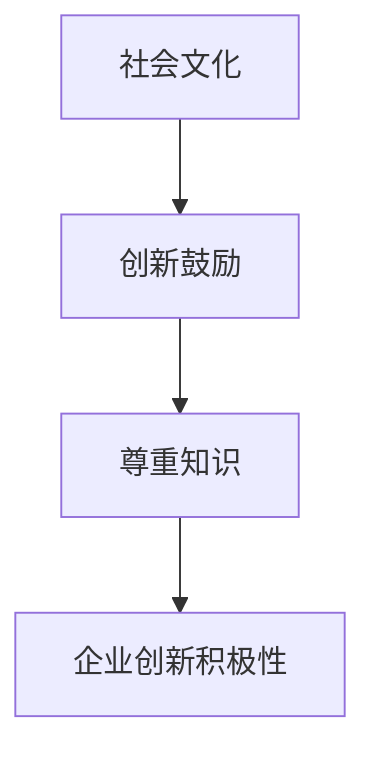

通过上述分析，我们可以看出技术创新生态系统的外部环境因素对技术创新活动具有重要影响。企业、政府、科研机构和投资者需要密切关注外部环境的变化，制定相应的策略和措施，以适应外部环境的变化，促进技术创新生态系统的健康发展。**3.3 环境因素对技术创新生态系统的影响**

技术创新生态系统的发展受到多种环境因素的共同影响，这些因素可以归纳为内部环境因素和外部环境因素。以下是对环境因素对技术创新生态系统影响的具体分析：

**1. 内部环境因素对技术创新生态系统的影响**

（1）**企业研发能力：**企业研发能力直接影响技术创新的效率和成果。强大的研发能力意味着企业能够更快地响应市场需求，更有效地进行技术研发和产品创新。内部环境因素如研发投入、人才储备和研发设施等，都会对技术创新的规模和速度产生显著影响。

（2）**高校和科研机构合作：**高校和科研机构在技术创新过程中扮演着知识传播和技术储备的重要角色。通过与高校和科研机构的合作，企业可以获得最新的科研成果和技术支持，从而加快技术创新的步伐。

（3）**投资者投资行为：**投资者的投资行为对技术创新的可持续性具有关键作用。风险投资和股权投资等资金支持，能够为企业的技术研发提供必要的资金保障，降低创新风险，促进技术创新的持续发展。

（4）**用户需求反馈：**用户需求是技术创新的重要驱动力。企业通过收集用户反馈，了解市场需求，能够更有针对性地进行产品创新和服务优化，提高技术创新的市场适应性。

**2. 外部环境因素对技术创新生态系统的影响**

（1）**政策法规：**政策法规为技术创新提供法律保障和制度支持。知识产权保护、税收优惠、研发资助等政策，能够激励企业加大研发投入，提高技术创新的积极性。同时，政府制定的相关法规，如数据安全法、网络安全法等，也对技术创新的方向和内容产生影响。

（2）**市场环境：**市场环境直接影响企业的创新决策和创新能力。市场需求旺盛、竞争激烈的市场环境，会促使企业加快技术创新，以提升竞争力。市场规模的扩大和消费者需求的多样化，也为技术创新提供了更多的机会。

（3）**竞争对手：**竞争对手的技术创新活动对企业具有示范效应和压力。通过分析竞争对手的技术创新方向和成果，企业可以借鉴先进的创新模式，调整自身的创新策略，同时保持竞争优势。

（4）**技术发展趋势：**技术发展趋势是影响技术创新生态系统发展的重要外部因素。新兴技术的出现和发展，不仅为企业提供了新的创新方向，也要求企业不断调整技术创新策略，以适应技术变革。

（5）**经济环境：**经济环境对技术创新生态系统的影响主要体现在资金流动和资源配置方面。经济增长和产业结构调整，为企业提供了更多的创新资源和市场机会。而经济衰退或市场不稳定，则可能限制企业的技术创新能力。

（6）**社会文化：**社会文化因素如创新氛围、教育水平和价值观，对企业的创新行为有深刻影响。鼓励创新、尊重知识的社会文化环境，有助于培养企业的创新意识和能力，促进技术创新生态系统的健康发展。

**3. 综合影响分析**

环境因素对技术创新生态系统的影响是综合性的，不同因素之间相互关联、相互作用。例如，政策法规的完善可以增强市场环境对技术创新的支持，而技术发展趋势的变化则可能影响企业的研发方向和投入。因此，构建一个高效的技术创新生态系统，需要综合考虑各种环境因素，采取系统化的策略和措施。

综上所述，技术创新生态系统的发展离不开良好的内部环境支持和外部环境推动。企业、政府、科研机构和投资者等各方主体需要协同合作，共同营造有利于技术创新的环境，以实现技术创新的持续发展和生态系统的整体优化。**第4章：构建技术创新生态系统的战略规划**

### **4.1 构建技术创新生态系统的目标设定**

构建技术创新生态系统的首要任务是明确目标。这些目标应具有明确性、可行性和前瞻性，以指导技术创新生态系统的建设和发展。

**1. 明确目标的重要性：**明确的目标能够为技术创新生态系统提供方向和动力，有助于各方主体集中资源和精力，实现共同的发展愿景。

**2. 目标设定的原则：**目标设定应遵循以下原则：
- **科学性**：目标应基于对技术发展趋势、市场需求和自身条件的科学分析。
- **可行性**：目标应具备实际可操作性和实现的可能性。
- **前瞻性**：目标应具有一定的前瞻性，以适应未来技术发展的趋势和市场需求。
- **协同性**：目标应与各方主体的利益和发展需求相协同，实现共同发展。

**3. 常见目标设定：**
- **技术创新能力提升**：通过增加研发投入、引进高端人才和优化研发流程，提高企业的技术创新能力。
- **技术成果转化率提高**：通过优化科技成果转化机制，提高技术成果的商业化应用率。
- **市场竞争力提升**：通过持续的技术创新，提高产品和服务质量，增强企业的市场竞争力。
- **产业链协同发展**：通过构建产业链上下游企业、科研机构和高校的合作机制，实现产业链的协同创新和共同发展。

### **4.2 构建技术创新生态系统的基础条件分析**

构建技术创新生态系统需要一系列基础条件的支持。以下是对这些基础条件的分析：

**1. 资金支持：**技术创新需要大量的资金投入，包括研发资金、设备购置、人才引进等。企业、政府、投资者等各方应提供充足的资金支持，保障技术创新的持续进行。

**2. 人才储备：**技术创新离不开高素质的人才。企业、高校和科研机构应加大人才培养和引进力度，形成多层次、多元化的人才队伍，为技术创新提供智力支持。

**3. 技术积累：**技术创新生态系统的建设需要一定的技术积累。企业、科研机构和高校应加强基础研究和应用研究，积累先进的技术成果，为技术创新提供技术储备。

**4. 创新文化：**创新文化是技术创新生态系统的重要软实力。企业、高校和科研机构应营造浓厚的创新氛围，鼓励创新思维、创新行为和创新成果，形成鼓励创新的文化环境。

**5. 政策支持：**政府应制定和完善相关政策，为技术创新提供法律保障和政策支持。例如，知识产权保护、税收优惠、研发资助等政策，可以激励企业加大研发投入，提高技术创新的积极性。

### **4.3 构建技术创新生态系统的步骤与方法**

构建技术创新生态系统是一个复杂的过程，需要采取科学的步骤和方法。以下是一些常见的步骤和方法：

**1. 制定规划：**在明确目标和基础条件分析的基础上，制定详细的技术创新生态系统建设规划。规划应包括目标、策略、实施步骤和资源配置等内容。

**2. 建立组织架构：**根据规划，建立技术创新生态系统的组织架构。组织架构应包括企业、高校、科研机构、政府部门和投资者等各方主体，形成协同创新的机制。

**3. 策略实施：**按照规划，采取具体的策略和方法实施技术创新生态系统建设。策略应包括研发投入、人才培养、技术积累、创新文化培育和政策支持等。

**4. 监测与评估：**建立技术创新生态系统的监测与评估机制，定期对技术创新活动的效果进行监测和评估。监测与评估结果应作为调整和优化创新策略的依据。

**5. 持续改进：**技术创新生态系统是一个动态发展的系统，需要不断调整和优化。根据监测与评估结果，及时调整创新策略和资源配置，以适应技术发展需求和市场变化。

### **4.4 技术创新生态系统的可持续性评估**

技术创新生态系统的可持续性评估是确保技术创新活动持续发展的重要环节。以下是对可持续性评估的关键方面进行分析：

**1. 经济可持续性：**评估技术创新活动的经济效益，包括创新成果的商业化应用情况、市场竞争力提升程度和盈利能力等。确保技术创新活动能够产生经济效益，实现可持续发展。

**2. 社会可持续性：**评估技术创新活动对社会的影响，包括技术创新对就业、环境、社会公平等方面的贡献。确保技术创新活动能够促进社会和谐、可持续发展。

**3. 环境可持续性：**评估技术创新活动对环境的影响，包括技术创新对资源消耗、碳排放、环境保护等方面的贡献。确保技术创新活动能够实现绿色、低碳、可持续发展。

**4. 组织可持续性：**评估技术创新活动对企业、高校、科研机构等组织内部的影响，包括技术创新对组织发展、人才培养、组织文化等方面的贡献。确保技术创新活动能够促进组织内部持续创新和可持续发展。

**5. 政策可持续性：**评估政府政策对技术创新生态系统建设的影响，包括政策实施的效果、政策持续性的保障等。确保政府政策能够支持技术创新生态系统的长期发展。

通过可持续性评估，可以及时发现技术创新活动中的问题和不足，采取相应的措施进行优化和调整，确保技术创新生态系统的持续、健康发展。**第5章：技术创新生态系统的组织与管理**

### **5.1 技术创新生态系统的组织结构设计**

技术创新生态系统的组织结构设计是构建高效技术创新体系的关键环节。一个合理的组织结构能够确保资源的高效配置、信息流畅传递和协同工作的实现。以下是技术创新生态系统组织结构设计的几个关键方面：

**1. 明确组织目标：**组织结构设计应以明确的技术创新目标为导向，确保所有组织成员都朝着同一方向努力。目标应包括技术创新的广度、深度和可持续性等方面。

**2. 分层管理机制：**分层管理机制能够确保技术创新活动的高效实施。常见的分层管理机制包括战略层、战术层和执行层。战略层负责制定长远规划和战略方向；战术层负责制定具体实施计划和策略；执行层负责具体的技术研发和实施。

**3. 分工与协作：**在技术创新生态系统中，不同主体（如企业、高校、科研机构等）应明确各自的分工和协作关系。分工应基于各方的核心优势和特长，协作则通过建立紧密的合作机制实现。

**4. 灵活的组织结构：**技术创新生态系统的组织结构应具有一定的灵活性，以适应快速变化的技术和市场环境。灵活的组织结构可以包括矩阵式结构、团队式结构等，这些结构能够快速响应外部环境变化，提高创新效率。

**5. 信息共享平台：**建立高效的信息共享平台是技术创新生态系统组织结构设计的重要一环。信息共享平台应包括数据存储、数据分析、知识管理和信息发布等功能，确保各组织成员能够及时获取所需信息，促进协同创新。

### **5.2 技术创新生态系统的管理制度设计**

技术创新生态系统的管理制度设计是确保技术创新活动有序进行和高效执行的重要保障。以下是一些关键的管理制度设计方面：

**1. 研发管理制度：**研发管理制度应包括研发项目的立项、执行、监控和评估等环节。通过明确的研发流程和规范，确保研发活动的有序进行。

**2. 人才管理制度：**人才管理制度应包括人才引进、培训、激励和留任等方面。通过建立完善的人才管理制度，吸引和留住高素质人才，为技术创新提供持续的动力。

**3. 风险管理制度：**技术创新具有较高风险，因此，建立完善的风险管理制度至关重要。风险管理制度应包括风险评估、风险监控和风险应对等方面，确保技术创新活动在可控风险范围内进行。

**4. 质量管理制度：**技术创新生态系统的质量管理制度应包括产品质量管理、过程质量管理和服务质量管理等方面。通过建立严格的质量管理制度，确保技术创新成果的质量和可靠性。

**5. 知识管理制度：**知识管理制度应包括知识获取、知识存储、知识共享和知识应用等方面。通过建立完善的知识管理制度，确保技术创新过程中知识的积累和共享，提高技术创新的效率。

### **5.3 技术创新生态系统的激励机制设计**

激励机制设计是技术创新生态系统组织与管理的重要环节，能够激发组织成员的创新活力和积极性。以下是一些常见的激励机制设计方面：

**1. 经济激励：**通过提供奖金、股权激励等经济手段，激励组织成员为实现技术创新目标而努力。经济激励应与技术创新成果的绩效直接挂钩，确保激励的公平性和有效性。

**2. 荣誉激励：**通过授予荣誉称号、表彰优秀创新成果等荣誉激励手段，提升组织成员的荣誉感和自豪感，激发创新热情。

**3. 职业发展激励：**为组织成员提供职业发展通道和机会，通过晋升、培训等手段，提升成员的职业素养和能力，激励其不断追求技术创新。

**4. 团队激励：**通过建立团队奖励机制，鼓励团队成员之间的协作和共同进步。团队激励可以通过团队目标设定、团队绩效评估等方式实现。

**5. 激励机制的灵活运用：**激励机制应根据技术创新活动的特点和需求灵活调整。例如，在技术创新初期，可以侧重于经济激励；在技术创新中后期，可以侧重于荣誉激励和职业发展激励。

### **5.4 技术创新生态系统的风险管理**

技术创新生态系统的风险管理是确保技术创新活动顺利进行和可持续发展的关键。以下是一些关键的风险管理方面：

**1. 风险识别：**通过系统性的风险评估，识别技术创新过程中可能出现的各种风险。风险识别应包括技术风险、市场风险、法律风险和财务风险等方面。

**2. 风险评估：**对识别出的风险进行评估，确定风险的概率和影响程度。风险评估可以通过定量分析和定性分析相结合的方式进行。

**3. 风险应对：**根据风险评估结果，制定相应的风险应对策略。风险应对策略包括风险规避、风险转移、风险减轻和风险接受等。

**4. 风险监控：**建立风险监控机制，实时跟踪和监测技术创新过程中的风险变化。风险监控应包括风险预警、风险分析和风险反馈等方面。

**5. 风险沟通：**建立有效的风险沟通机制，确保各方主体对技术创新风险有充分的了解和认识。风险沟通应包括风险信息共享、风险决策参与和风险应对协调等方面。

通过有效的风险管理，可以降低技术创新活动的风险，确保技术创新生态系统的稳定运行和持续发展。**第6章：技术创新生态系统的协同合作**

### **6.1 技术创新生态系统的合作模式**

技术创新生态系统中的协同合作是推动技术创新和产业升级的关键因素。合作模式的多样性决定了生态系统中各方主体的互动方式和合作效率。以下是几种常见的技术创新生态系统合作模式：

**1. 企业与高校科研机构的合作：**企业通过与高校和科研机构建立合作，可以获得最新的科研成果和技术支持。这种合作模式通常包括共建实验室、共同申报科研项目、技术转让和人员交流等。

**2. 企业与企业之间的合作：**企业之间的合作可以共享技术资源、市场渠道和客户资源，提高创新效率和竞争力。合作模式包括联合研发、战略联盟、供应链合作和跨行业合作等。

**3. 投资者与企业的合作：**投资者通过风险投资、股权投资等方式，为企业提供资金支持，帮助企业进行技术创新。这种合作模式有助于降低企业的创新风险，加速技术成果的商业化应用。

**4. 政府与企业、高校和科研机构的合作：**政府通过制定政策、提供资金支持和优化创新环境，推动技术创新生态系统的建设。政府与各方主体的合作模式包括创新基金、政策扶持和公共服务平台等。

**5. 用户与企业的合作：**用户通过参与产品研发、提供市场需求反馈等，与企业的合作可以确保技术创新更贴近市场需求。这种合作模式有助于提升产品的市场适应性和用户满意度。

### **6.2 技术创新生态系统的合作机制**

技术创新生态系统的合作机制是确保各方主体高效协同、共同创新的重要保障。以下是一些关键的合作机制：

**1. 合作协议：**合作协议是各方主体合作的法律基础，应明确合作的目标、范围、责任和权益。合作协议应包括技术成果的共享、知识产权的归属、合作项目的进度和风险分担等方面。

**2. 合作平台：**合作平台是各方主体进行协同创新的重要载体。合作平台应具备资源整合、信息共享、知识管理和项目协调等功能，为合作提供便捷的服务和支持。

**3. 合作文化：**合作文化是技术创新生态系统合作机制的核心要素。建立互信、共赢、开放和包容的合作文化，可以促进各方主体之间的紧密合作和协同创新。

**4. 合作机制的创新：**技术创新生态系统的合作机制应不断创新，以适应技术发展需求和市场变化。创新合作机制可以包括跨界合作、合作网络的动态调整和合作模式的多样化等。

### **6.3 技术创新生态系统的合作风险与应对策略**

技术创新生态系统中的合作风险是影响合作效率和效果的重要因素。以下是一些常见的合作风险和应对策略：

**1. 风险类型：**
- **技术风险：**包括技术路线的不确定性、技术实现的难度和技术的不稳定性等。
- **市场风险：**包括市场需求的不确定性、市场竞争的激烈性和市场准入的难度等。
- **法律风险：**包括知识产权保护、合同履行和法律法规变化等。
- **财务风险：**包括投资回报的不确定性、资金流动性和财务风险等。

**2. 应对策略：**
- **技术风险管理：**通过技术预研、技术评估和风险管理工具，降低技术风险。建立技术合作机制，确保技术成果的共享和风险管理。
- **市场风险管理：**通过市场调研、竞争分析和市场预测，降低市场风险。建立市场需求反馈机制，及时调整产品研发方向和策略。
- **法律风险管理：**通过合同审核、知识产权保护和法律咨询，降低法律风险。建立法律风险评估和应对机制，确保合作的合法性和合规性。
- **财务风险管理：**通过财务预算、风险投资和多元化融资，降低财务风险。建立财务监控和风险管理机制，确保资金流动性和财务健康。

通过识别和应对合作风险，可以确保技术创新生态系统中的合作更加稳定、高效，促进技术创新的持续发展和产业升级。**6.4 技术创新生态系统的合作案例分析**

为了更好地理解技术创新生态系统中的合作模式、合作机制以及合作风险与应对策略，以下将介绍几个具体的合作案例。

### **案例一：华为与北京大学合作研发5G技术**

**合作模式：**华为与北京大学合作建立了5G联合创新实验室，双方共同投入资金和人力资源，开展5G技术的研究和开发。

**合作机制：**通过签订合作协议，明确双方的权利和义务，共同设立研发项目组，定期召开项目会议，共享研发资源，共同推进项目进展。

**合作风险与应对：**
- **技术风险：**5G技术发展迅速，技术路线变化频繁。华为和北京大学通过持续的技术预研和评估，及时调整研发方向，降低技术风险。
- **市场风险：**5G市场尚未成熟，市场需求不确定性高。华为和北京大学通过市场调研，了解行业需求和趋势，确保研发成果的市场适应性。

**合作效果：**该合作项目成功研发了多项5G关键技术，为华为在5G领域的领先地位提供了重要支持。

### **案例二：阿里巴巴与清华大学共建人工智能研究院**

**合作模式：**阿里巴巴与清华大学共建人工智能研究院，双方共同投资，共同开展人工智能基础研究和应用研究。

**合作机制：**通过建立长期合作机制，清华大学提供学术资源和人才支持，阿里巴巴提供技术资源和应用场景。双方定期召开学术研讨会，共享研究成果。

**合作风险与应对：**
- **技术风险：**人工智能技术发展迅速，新理论和新方法层出不穷。阿里巴巴和清华大学通过持续的技术预研和评估，确保技术研究的领先性。
- **财务风险：**长期合作项目需要大量资金投入。阿里巴巴通过多元化融资渠道，确保项目的资金支持。

**合作效果：**该合作项目在人工智能领域取得了多项重要研究成果，为阿里巴巴的电商业务提供了强大的技术支持。

### **案例三：丰田与通用电气合作开发电动车技术**

**合作模式：**丰田与通用电气合作开发电动车技术，双方共同投资，共同进行电动车电池、电机和驱动系统的研究和开发。

**合作机制：**通过签订战略合作协议，明确双方的合作范围和责任，共同设立研发团队，共享研发资源，共同推进项目进度。

**合作风险与应对：**
- **技术风险：**电动车技术复杂，研发难度大。丰田和通用电气通过技术联合评估，确保技术方案的可行性和可靠性。
- **市场风险：**电动车市场竞争激烈，市场需求变化快。丰田和通用电气通过市场预测和需求调研，确保研发成果的市场适应性。

**合作效果：**该合作项目成功研发了高性能的电动车电池和驱动系统，为丰田和通用电气在电动车市场的竞争力提供了有力支持。

通过以上案例，我们可以看到，技术创新生态系统中的合作模式、合作机制以及合作风险与应对策略在不同领域和场景中的具体应用。这些案例的成功经验可以为其他技术创新生态系统的建设提供有益的借鉴。**第7章：技术创新生态系统的创新实践**

### **7.1 技术创新生态系统的典型实践案例**

为了更好地理解技术创新生态系统的实践效果，以下是几个典型的技术创新生态系统实践案例：

**案例一：华为公司技术创新生态系统**

**项目介绍：**华为公司通过构建开放的创新生态系统，吸引了全球范围内的合作伙伴，共同推动5G、人工智能等前沿技术的研发和应用。

**系统功能设计：**华为的技术创新生态系统包括研发合作平台、开源社区、人才引进与培训、技术标准和专利合作等模块，通过这些模块，实现技术创新资源的高效整合和共享。

**系统架构设计：**华为的技术创新生态系统采用分布式架构，各合作伙伴通过云平台实现数据的实时共享和协同创新。

**系统接口设计：**华为为合作伙伴提供开放的API接口，确保数据互联互通，实现技术和资源的无缝对接。

**系统交互：**通过定期举办技术研讨会、创新挑战赛等活动，促进合作伙伴之间的技术交流和合作。

**实际案例分析：**华为与全球300多家高校、科研机构和企业建立了合作关系，共同开展5G、人工智能等前沿技术的研发，取得了多项重要成果，推动了华为在全球市场的竞争力。

**实践效果评估：**华为的技术创新生态系统有效提升了公司的技术创新能力，促进了技术成果的商业化应用，为公司的长期发展提供了强大动力。

**案例二：阿里巴巴集团技术创新生态系统**

**项目介绍：**阿里巴巴集团通过构建以云计算、大数据、人工智能为核心的技术创新生态系统，推动电子商务、金融科技等领域的创新发展。

**系统功能设计：**阿里巴巴的技术创新生态系统包括云计算平台、大数据分析平台、人工智能算法库等模块，为业务创新和拓展提供技术支持。

**系统架构设计：**阿里巴巴采用微服务架构，确保系统的灵活性和可扩展性，能够快速响应市场需求和技术变革。

**系统接口设计：**阿里巴巴为业务部门提供开放的接口，确保数据的高效流通和业务的协同创新。

**系统交互：**通过建立内部创新实验室和外部合作网络，阿里巴巴实现了技术创新的持续迭代和优化。

**实际案例分析：**阿里巴巴的云计算、大数据和人工智能技术已广泛应用于电子商务、金融科技、物联网等领域，推动了公司业务的快速发展和市场拓展。

**实践效果评估：**阿里巴巴的技术创新生态系统有效提升了公司的技术竞争力，推动了业务创新和商业模式的变革，为公司带来了巨大的经济效益。

**案例三：通用电气（GE）的工业互联网平台**

**项目介绍：**通用电气（GE）通过构建工业互联网平台，实现设备互联、数据分析和智能决策，提升工业生产的效率和质量。

**系统功能设计：**GE的工业互联网平台包括设备互联模块、数据分析模块和智能决策模块，通过这些模块，实现设备的远程监控、故障预测和优化生产。

**系统架构设计：**GE的工业互联网平台采用分布式架构，确保系统的稳定性和可靠性，能够处理海量数据和高并发请求。

**系统接口设计：**GE为合作伙伴提供开放的API接口，实现数据的实时共享和业务协同。

**系统交互：**通过建立设备互联网络、数据共享平台和智能决策系统，GE实现了设备的智能化管理和生产过程的优化。

**实际案例分析：**GE的工业互联网平台已应用于全球多个工业领域，如航空、能源、制造等，显著提升了生产效率和质量，降低了运营成本。

**实践效果评估：**GE的工业互联网平台有效推动了工业生产的数字化转型，提升了公司的竞争力和市场份额。

通过以上案例，我们可以看到，技术创新生态系统的实践在提升企业技术创新能力、促进业务发展和推动产业升级方面具有显著效果。这些案例的成功经验为其他企业和技术创新生态系统的建设提供了有益的借鉴。**7.2 技术创新生态系统的实践应用分析**

技术创新生态系统的实践应用在多个行业和领域取得了显著成果，以下将针对几个关键领域进行深入分析：

**1. 信息技术行业**

在信息技术行业，技术创新生态系统通过开放合作、资源共享和协同创新，推动了技术的快速迭代和应用。例如，华为的5G技术创新生态系统吸引了众多合作伙伴参与，共同推动了5G技术的研发和商业化进程。通过建立开放的合作平台和开源社区，华为与全球高校、科研机构和企业的合作，实现了技术资源的共享和优势互补。此外，阿里巴巴集团的云计算和大数据技术创新生态系统，通过构建云计算平台和大数据分析平台，为电子商务、金融科技等领域的创新提供了强大的技术支持。

**2. 制造业**

在制造业，技术创新生态系统通过设备互联、数据分析和智能决策，提升了生产效率和产品质量。通用电气的工业互联网平台是一个典型的案例，通过构建设备互联网络和智能决策系统，实现了设备的远程监控、故障预测和优化生产。这种创新实践不仅提高了生产效率，降低了运营成本，还推动了制造业的数字化转型。其他企业，如西门子、通用电气等，也在积极构建自己的工业互联网平台，通过技术创新生态系统实现智能制造。

**3. 金融行业**

在金融行业，技术创新生态系统通过大数据、人工智能和区块链等技术的应用，提升了金融服务的效率和安全性。例如，蚂蚁金服的金融科技生态系统，通过大数据和人工智能技术，实现了风险控制、信用评估和智能投顾等领域的创新。这种创新实践不仅提高了金融服务的效率，还增强了金融行业的竞争力。此外，区块链技术的应用，为金融行业提供了全新的解决方案，如跨境支付、供应链金融等，推动了金融行业的变革。

**4. 医疗健康行业**

在医疗健康行业，技术创新生态系统通过信息技术和生物技术的融合，提升了医疗服务的质量和效率。例如，智慧医疗生态系统通过大数据和人工智能技术，实现了疾病预测、个性化医疗和远程诊疗等功能。这种创新实践不仅提高了医疗服务的效率，还提升了医疗服务的质量和患者的体验。此外，精准医疗技术的应用，为癌症、遗传病等复杂疾病的治疗提供了新的希望，推动了医疗健康行业的发展。

**5. 能源行业**

在能源行业，技术创新生态系统通过新能源技术、储能技术和智能电网技术的应用，推动了能源结构的优化和能源利用效率的提升。例如，特斯拉的电动车和能源存储技术，通过构建新能源汽车和能源互联网，推动了交通和能源的融合。此外，太阳能、风能等可再生能源技术的发展，也为能源行业的创新提供了新的方向。

**6. 教育行业**

在教育行业，技术创新生态系统通过在线教育、虚拟现实和人工智能等技术的应用，提升了教育服务的质量和普及度。例如，慕课（MOOC）平台的兴起，通过开放教育资源，实现了教育资源的共享和普及。此外，虚拟现实技术在教育中的应用，为远程教育、互动教学提供了全新的体验，提升了教育的灵活性和个性化。

通过以上分析，我们可以看到，技术创新生态系统的实践应用在多个行业和领域取得了显著成果，推动了技术进步、产业升级和社会发展。这些实践案例不仅为其他行业提供了有益的借鉴，也为未来技术创新生态系统的发展提供了重要的启示。**7.3 技术创新生态系统的实践效果评估**

技术创新生态系统的实践效果评估是衡量技术创新生态系统建设成效的重要手段。以下将从几个关键维度对技术创新生态系统的实践效果进行评估：

**1. 技术创新成果：**技术创新成果是评估技术创新生态系统效果的核心指标。通过分析技术创新生态系统中研发的项目数量、技术创新的成果转化率、技术专利的申请和授权情况，可以评估技术创新生态系统的技术产出水平。例如，华为的5G技术创新生态系统在短短几年内，成功研发了多项5G核心技术，并实现了在全球范围内的商业化应用。

**2. 经济效益：**经济效益是技术创新生态系统实践效果的重要体现。通过评估技术创新活动对企业的营业收入、利润增长、市场份额提升等方面的影响，可以评估技术创新生态系统对企业经济效益的贡献。例如，阿里巴巴的云计算和大数据技术创新生态系统，通过技术驱动，大幅提升了公司的营收和市场份额。

**3. 社会效益：**社会效益是技术创新生态系统对社会的整体贡献。通过评估技术创新活动对社会就业、环境改善、教育提升等方面的影响，可以评估技术创新生态系统对社会发展的促进作用。例如，新能源技术创新生态系统推动了可再生能源的普及，减少了碳排放，改善了环境质量。

**4. 生态可持续性：**生态可持续性是技术创新生态系统长期发展的重要保障。通过评估技术创新生态系统在资源利用、能源消耗、碳排放等方面的表现，可以评估其可持续性。例如，通用电气的工业互联网平台通过提升生产效率，降低了能源消耗，实现了绿色制造。

**5. 知识转移与共享：**知识转移与共享是技术创新生态系统的重要功能。通过评估技术创新活动中知识的产生、传播和共享情况，可以评估技术创新生态系统的知识管理能力。例如，开放源代码社区通过共享技术成果，促进了知识的快速传播和普及。

**6. 组织协同与创新文化：**组织协同与创新文化是技术创新生态系统成功的关键因素。通过评估技术创新生态系统中各方主体的协同合作程度、创新氛围和创新文化的建设情况，可以评估技术创新生态系统的组织协同水平。例如，华为的技术创新生态系统通过建立紧密的合作关系和创新文化，实现了技术创新的高效协同。

通过综合以上评估维度，可以对技术创新生态系统的实践效果进行全面、系统的评估，及时发现问题和不足，为技术创新生态系统的优化和持续发展提供依据。**7.4 技术创新生态系统的实践总结与启示**

技术创新生态系统的实践为科技发展、产业升级和社会进步提供了宝贵的经验和启示。以下是对技术创新生态系统实践经验的总结：

**1. 合作是关键：**技术创新生态系统的成功依赖于各方主体的紧密合作。通过建立合作机制、共享资源和协同创新，可以提升整体创新效率，实现技术突破和产业升级。

**2. 平台是支撑：**技术创新生态系统需要一个高效、开放的共享平台，为各方主体提供技术交流、合作研发和资源整合的机会。平台的建立和优化是技术创新生态系统健康发展的基础。

**3. 人才是核心：**技术创新生态系统的建设离不开高素质的人才队伍。通过引进高端人才、培养创新人才和优化人才激励机制，可以激发创新活力，推动技术创新。

**4. 文化是灵魂：**创新文化是技术创新生态系统的灵魂。营造鼓励创新、包容失败和共享知识的创新文化，可以形成良好的创新氛围，促进技术创新的持续发展。

**5. 风险管理是保障：**技术创新过程中不可避免地会遇到各种风险。通过建立完善的风险管理机制，提前识别和应对风险，可以降低创新风险，保障技术创新的顺利进行。

**6. 持续优化是动力：**技术创新生态系统需要不断优化和调整，以适应技术发展需求和市场变化。通过持续优化，可以保持技术创新生态系统的活力和竞争力。

**启示：**

技术创新生态系统的实践为我们提供了宝贵的经验和启示。首先，技术创新需要多方主体的积极参与和紧密合作。其次，建立开放、共享的创新平台和激励机制是提升创新效率的关键。此外，创新文化的建设和管理机制的完善是确保技术创新生态系统健康发展的保障。最后，持续优化和创新生态系统的调整是适应技术发展需求和市场变化的必然要求。

总之，技术创新生态系统的实践为我们指明了技术创新的发展方向，提供了宝贵的经验和启示。通过借鉴这些经验和启示，我们可以更好地构建和优化技术创新生态系统，推动科技创新和产业升级，实现经济、社会和环境的可持续发展。**第8章：技术创新生态系统的前沿趋势**

### **8.1 技术创新生态系统的发展趋势**

随着科技的快速发展，技术创新生态系统正呈现出一系列新的发展趋势，这些趋势将对未来技术创新产生深远影响。

**1. 数字化与智能化：**数字化和智能化是当前技术创新生态系统的核心趋势。通过大数据、人工智能、物联网等技术的深度融合，企业、科研机构和政府正在构建更加智能、高效的创新生态系统。数字化技术使得数据获取、处理和分析更加便捷，智能化技术则提升了系统的自适应能力和决策能力。

**2. 生态融合：**技术创新生态系统不再局限于单一领域或行业，而是呈现出跨领域、跨行业的生态融合趋势。例如，信息技术与制造业、医疗健康、金融等领域的融合，正在催生新的技术革命和产业变革。生态融合有助于资源整合、优势互补，提升整体创新效率。

**3. 开放合作：**开放合作是技术创新生态系统发展的重要方向。通过开放平台、开源社区和合作伙伴网络，企业、高校、科研机构和政府部门可以共享技术资源、知识和经验，共同推进技术创新。开放合作有助于打破信息壁垒，加速技术传播和推广应用。

**4. 平台化发展：**技术创新平台化发展是未来趋势之一。技术创新平台成为连接各方主体的关键节点，提供技术孵化、研发支持、市场推广等一站式服务。平台化发展有助于降低创新门槛，提升创新效能。

**5. 绿色可持续发展：**随着全球对环境保护和可持续发展的重视，绿色技术创新成为关键趋势。绿色可持续发展要求技术创新生态系统在研发和应用过程中，充分考虑环境因素，实现资源节约、能源高效利用和环境污染减少。

### **8.2 技术创新生态系统的未来方向**

技术创新生态系统的未来发展将更加注重全局视野、跨领域协同和可持续发展。

**1. 全局视野：**未来技术创新生态系统将更加注重全局视野，从全球范围内整合资源、协同创新。国际科技合作、跨国企业联盟和全球技术创新网络的建立，将推动全球技术创新的协同发展。

**2. 跨领域协同：**跨领域协同是未来技术创新生态系统的重要特征。不同领域的技术创新相互融合，形成新的技术范式和产业生态。例如，人工智能与生物技术的融合，将带来生物医疗、农业等领域的重大突破。

**3. 可持续发展：**可持续发展是未来技术创新生态系统的重要目标。技术创新不仅要解决当前的经济和社会问题，还要考虑未来的环境和社会责任。绿色技术创新、环保技术和可持续发展解决方案，将在未来技术创新生态系统中占据重要位置。

**4. 人工智能与人类的协同：**未来技术创新生态系统将更加注重人工智能与人类的协同创新。人工智能技术的进步，将提升人类的认知能力和创新效率，人类与人工智能的协同合作，将推动技术创新进入新的阶段。

**5. 数字化治理：**数字化治理是未来技术创新生态系统的重要方向。通过数字化手段，提高技术创新生态系统的管理效率、决策质量和资源利用效率，实现创新生态系统的数字化转型和智能化升级。

### **8.3 技术创新生态系统的挑战与机遇**

在未来的发展过程中，技术创新生态系统将面临一系列挑战和机遇。

**1. 挑战：**
- **技术壁垒：**随着技术的快速发展，新技术带来的技术壁垒越来越高，企业、高校和科研机构需要不断投入巨大资源进行技术研发。
- **知识产权保护：**知识产权保护是技术创新生态系统发展的重要保障，但当前知识产权保护体系尚不完善，需要加强知识产权保护力度。
- **数据安全和隐私保护：**随着数字化和智能化的发展，数据安全和隐私保护成为技术创新生态系统面临的重要挑战，需要建立完善的数据安全和隐私保护机制。

**2. 机遇：**
- **全球合作：**全球合作将为技术创新生态系统带来更多机遇。跨国企业联盟、国际科技合作和全球技术创新网络的建立，将促进技术创新资源的全球共享和协同发展。
- **政策支持：**政府政策的支持将为技术创新生态系统提供有力保障。各国政府纷纷出台支持技术创新的政策，为技术创新生态系统的建设和发展提供了良好环境。
- **新兴技术：**新兴技术的快速发展，如人工智能、区块链、量子计算等，将为技术创新生态系统带来新的机遇。这些技术不仅将推动现有产业的升级，还将催生新的产业和商业模式。

### **8.4 技术创新生态系统的政策与法规环境**

政策与法规环境是技术创新生态系统发展的重要保障。以下是对当前技术创新生态系统政策与法规环境的分析：

**1. 政策环境：**
- **研发支持：**各国政府纷纷加大对研发的投入，出台一系列支持研发的政策，如研发补贴、税收优惠、科研项目资助等。
- **人才培养：**政府高度重视人才培养，通过设立专项基金、鼓励高校和科研机构培养创新人才，提高技术创新能力。
- **知识产权保护：**政府加强知识产权保护，制定和实施一系列知识产权法律法规，提高知识产权的申请和保护力度。

**2. 法规环境：**
- **数据保护：**各国政府制定数据保护法规，如《通用数据保护条例》（GDPR），保护个人隐私和数据安全。
- **网络安全：**政府加强网络安全监管，制定网络安全法律法规，确保网络空间的稳定和安全。
- **市场竞争：**政府加强对市场竞争的监管，防止垄断行为，促进公平竞争，为技术创新生态系统的发展提供良好环境。

通过完善的政策与法规环境，可以为技术创新生态系统的发展提供有力保障，促进技术创新的持续、健康发展。**第9章：技术创新生态系统的未来展望**

### **9.1 技术创新生态系统的社会影响**

技术创新生态系统在推动社会进步方面具有深远影响。首先，技术创新改善了人们的生活质量。例如，医疗技术的进步使得许多疾病得以治愈，信息技术的发展让信息获取更加便捷，教育技术的创新使得教育资源更加丰富。其次，技术创新促进了经济发展。通过技术创新，企业可以提高生产效率，降低成本，创造新的市场需求，从而推动经济增长。此外，技术创新还提升了社会的可持续发展能力。通过研发和应用新能源、新材料、环保技术等，技术创新有助于实现经济与环境的双赢。

### **9.2 技术创新生态系统的经济影响**

技术创新生态系统的经济影响主要体现在以下几个方面。首先，技术创新是推动经济增长的关键动力。通过技术创新，企业可以提高生产效率，降低生产成本，创造新的市场需求，从而促进经济增长。其次，技术创新有助于提升企业的竞争力。在全球化竞争中，具备创新能力的企业能够在市场中占据有利地位，实现可持续发展。此外，技术创新还推动了产业结构调整和升级。通过技术创新，传统产业可以实现数字化转型和智能化升级，新兴产业也得以快速发展。

### **9.3 技术创新生态系统的教育影响**

技术创新生态系统对教育的影响主要体现在以下几个方面。首先，技术创新改变了教育模式。在线教育、虚拟现实技术和人工智能等新兴技术的应用，使得教育更加灵活、便捷和个性化。其次，技术创新促进了教育资源的共享和公平。通过技术创新，优质教育资源可以突破地域限制，实现全球共享，从而提高教育的普及率和质量。此外，技术创新还培养了新一代创新人才。通过技术创新生态系统中的教育项目和实践，学生可以接触到最新的科技知识和创新方法，培养创新思维和实际操作能力。

### **9.4 技术创新生态系统的可持续发展**

技术创新生态系统的可持续发展具有重要意义。首先，技术创新有助于实现经济与环境的双赢。通过研发和应用新能源、新材料、环保技术等，技术创新可以降低能源消耗和环境污染，推动绿色、低碳、循环发展。其次，技术创新生态系统可以提升社会的可持续发展能力。通过技术创新，可以解决社会发展中的瓶颈问题，提高社会运行效率和治理能力。此外，技术创新生态系统还可以促进全球合作和知识共享。通过跨国合作和技术交流，各国可以共同应对全球挑战，实现可持续发展。

总之，技术创新生态系统在推动社会进步、经济发展、教育和可持续发展方面具有重要作用。未来，随着科技的不断进步，技术创新生态系统将继续发挥重要作用，为人类社会的繁荣和发展做出更大贡献。**作者：AI天才研究院/AI Genius Institute & 禅与计算机程序设计艺术 /Zen And The Art of Computer Programming**

