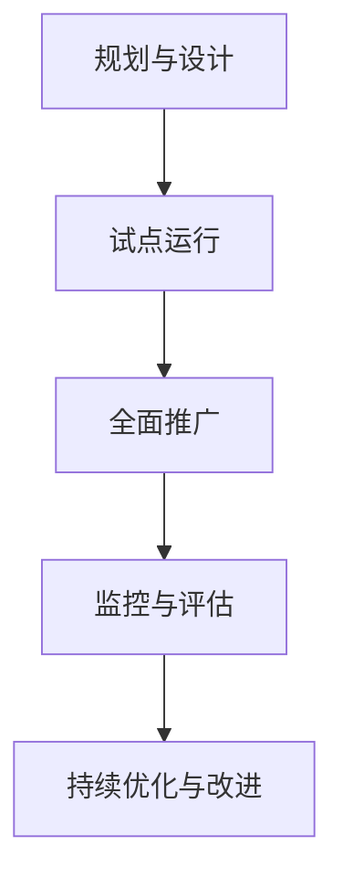

                 


### 构建高效的技术支持体系：从基础到实践

#### 引言

**1.1 问题背景**
在当今快速发展的信息技术时代，技术支持体系的构建对于企业的生存与发展具有重要意义。随着客户需求的多样化和技术的不断进步，如何构建一个高效的技术支持体系，以满足客户需求、提升客户满意度，成为企业面临的重要课题。

**1.2 问题提出**
本书旨在探讨如何构建一个高效的技术支持体系，以提高企业的服务质量、降低服务成本、提升客户满意度，从而增强企业的市场竞争力。

**1.3 问题解决**
通过对技术支持体系的概念、构建原则、关键要素、实施步骤、评估与优化等方面的深入分析，本书将为企业提供构建高效技术支持体系的系统指导。

**1.4 边界与外延**
本文所讨论的技术支持体系主要针对信息技术企业，但所提出的构建原则和方法也可应用于其他类型的企业。

**1.5 概念结构与核心要素组成**
技术支持体系主要由以下核心要素组成：人员、流程、工具、知识库和培训。

**1.6 本章小结**
本章对技术支持体系进行了全面的介绍，为后续章节的深入讨论奠定了基础。

---

**核心关键词**：技术支持体系、构建原则、服务质量、客户满意度、竞争力。

**摘要**
本文围绕构建高效技术支持体系这一主题，从概念解析、核心要素到具体实施，全面探讨了如何通过科学的方法和步骤，提升企业的技术支持服务水平，从而在激烈的市场竞争中脱颖而出。

---

#### 第一部分: 核心概念与联系

**2.1 技术支持体系定义**
技术支持体系是指企业为满足客户需求，通过组织结构、人员配备、流程设计、工具运用、知识管理等方面，提供高质量技术服务的整体架构。

**2.2 技术支持体系的核心要素**
技术支持体系的核心要素包括人员、流程、工具、知识库和培训。

**2.2.1 人员**
技术支持人员是技术支持体系的核心，他们的专业素养和服务态度直接影响客户满意度。

**2.2.2 流程**
技术支持流程是指企业为解决客户问题而制定的一系列标准操作程序，包括问题接收、分析、解决、反馈等环节。

**2.2.3 工具**
技术支持工具包括电话、邮件、在线聊天、远程协助等，它们是技术支持人员与客户沟通、解决问题的桥梁。

**2.2.4 知识库**
知识库是技术支持体系的“大脑”，它存储了企业解决各类问题的方法和经验，为技术支持人员提供便捷的查询和参考。

**2.2.5 培训**
培训是提升技术支持人员专业素养和服务水平的重要手段，包括新员工培训、在职培训和专项技能培训等。

**2.3 概念属性特征对比表格**

**2.3.1 人员**

| 特征        | 说明                                                         |
| ----------- | ------------------------------------------------------------ |
| 专业素养    | 技术支持人员应具备扎实的专业知识和服务技能。                   |
| 服务态度    | 技术支持人员应具备良好的服务态度，如耐心、热情、礼貌等。       |
| 沟通能力    | 技术支持人员应具备较强的沟通能力，能够准确理解客户需求，有效传达解决方案。 |

**2.3.2 流程**

| 特征        | 说明                                                         |
| ----------- | ------------------------------------------------------------ |
| 标准化      | 技术支持流程应具有统一的标准，确保服务质量的稳定性。           |
| 可跟踪性    | 技术支持流程应具备可跟踪性，便于监控和分析问题解决效率。       |
| 灵活性      | 技术支持流程应具有一定的灵活性，以适应不同客户和问题的需求。   |

**2.3.3 工具**

| 特征        | 说明                                                         |
| ----------- | ------------------------------------------------------------ |
| 可用性      | 技术支持工具应易于使用，降低技术支持人员的操作难度。          |

---

**核心概念与联系**
在本部分中，我们对技术支持体系进行了全面的解析，明确了其核心概念和要素，并对比分析了各要素的关键属性特征。这一部分的目的是为企业提供一个清晰的技术支持体系构建蓝图，为后续的实施步骤奠定坚实的基础。

---

**附录：技术支持体系ER实体关系图架构**

```mermaid
erDiagram
  User ||--o> Ticket : 发起请求
  Ticket ||--o> SupportRequest : 处理请求
  SupportRequest ||--o> Solution : 提供解决方案
  User ||--o> Feedback : 提供反馈
```

---

#### 第二部分: 构建高效技术支持体系的步骤与方法

**3.1 制定技术支持体系构建原则**

构建高效技术支持体系的首要步骤是制定明确的构建原则。以下是几个关键的原则：

- **以客户为中心**：所有技术支持决策和流程设计都应以满足客户需求、提升客户满意度为核心。
- **标准化和流程化**：确保技术支持流程具有统一的标准，提高服务质量和效率。
- **灵活性和适应性**：技术支持体系应具备一定的灵活性，以适应不断变化的市场需求和技术进步。
- **持续改进**：建立持续改进机制，定期评估和优化技术支持体系，确保其始终处于最佳状态。

**3.2 确定技术支持体系的关键要素**

在明确了构建原则之后，接下来需要确定技术支持体系的关键要素，包括人员、流程、工具、知识库和培训。

**3.2.1 人员**
- **招聘与培训**：招聘具有专业素养和服务意识的技术支持人员，并进行系统化的培训，提升其技能和知识水平。
- **激励机制**：建立激励机制，鼓励技术支持人员积极提供高质量的服务，如设立优秀员工奖项。

**3.2.2 流程**
- **问题接收**：建立高效的问题接收机制，确保客户的问题能够及时被记录和分配。
- **问题分析**：对客户的问题进行详细分析，确定问题的类型、优先级和解决方案。
- **问题解决**：采取有效的解决方案，及时解决客户的问题。
- **反馈与改进**：收集客户反馈，对服务流程进行改进，提高服务质量和客户满意度。

**3.2.3 工具**
- **电话和邮件**：提供便捷的客户联系渠道，确保客户能够轻松地与技术支持团队取得联系。
- **在线聊天和远程协助**：提供实时沟通工具，帮助客户快速解决问题。
- **自动化工具**：利用自动化工具，如聊天机器人、自动化回复系统等，提高问题解决效率和准确性。

**3.2.4 知识库**
- **内容建设**：建立全面的、结构化的知识库，确保技术支持人员能够方便地查阅和利用已有知识。
- **知识更新**：定期更新知识库内容，确保其与当前技术和服务水平保持一致。

**3.2.5 培训**
- **新员工培训**：为新员工提供系统化的培训，帮助其快速掌握公司业务和技术支持流程。
- **在职培训**：定期为在职员工提供培训，提升其专业素养和服务水平。
- **专项技能培训**：针对特定技能或技术领域，提供专项培训，提升技术支持人员的专业能力。

**3.3 实施技术支持体系**

在确定了构建原则和关键要素之后，需要将这些原则和要素付诸实施。以下是实施技术支持体系的关键步骤：

- **规划与设计**：制定详细的技术支持体系实施计划，包括人员招聘、培训、流程设计、工具采购等。
- **试点运行**：在部分业务或部门中试点运行技术支持体系，收集反馈并进行调整。
- **全面推广**：在试点运行成功的基础上，将技术支持体系全面推广到整个企业。
- **监控与评估**：建立监控和评估机制，对技术支持体系的运行情况进行实时监控和评估，确保其持续优化和改进。

**3.4 持续优化与改进**

构建高效技术支持体系不是一次性的任务，而是一个持续的过程。以下是几个关键点：

- **客户反馈**：定期收集客户反馈，了解客户对技术支持服务的满意度和建议，及时进行改进。
- **数据分析**：利用数据分析工具，对技术支持体系的关键指标进行监控和分析，找出问题所在，并制定改进措施。
- **员工参与**：鼓励技术支持人员参与体系优化和改进，提出建议和解决方案，提高他们的工作积极性和满意度。
- **定期评估**：定期对技术支持体系进行评估，检查其是否达到预期目标，并根据评估结果进行调整和优化。

---

**第二部分小结**
在本部分中，我们详细介绍了构建高效技术支持体系的步骤和方法。从制定构建原则到确定关键要素，再到具体实施和持续优化，每一个步骤都需要精心规划和执行。通过这一部分的探讨，企业可以系统地构建和优化其技术支持体系，从而提升服务质量、降低服务成本，增强市场竞争力。

---

**附录：技术支持体系实施流程Mermaid流程图**



---

#### 第三部分: 实际案例分析与经验分享

**4.1 案例介绍**

**4.1.1 企业背景**
某大型互联网公司（以下简称为“公司”）在快速发展的过程中，面临着日益增长的技术支持需求。为了提升客户满意度，降低服务成本，公司决定构建一个高效的技术支持体系。

**4.1.2 系统功能设计**
公司的技术支持系统包括以下主要功能：

- **问题接收与分配**：客户可以通过电话、邮件和在线聊天等多种渠道提交问题，系统会自动分配给相应的技术支持人员。
- **问题分析与解决**：技术支持人员对客户的问题进行详细分析，并提供专业的解决方案。
- **反馈与改进**：客户可以对技术支持服务进行评价，公司根据反馈进行持续优化。

**4.1.3 系统架构设计**
公司的技术支持系统采用B/S架构，包括前端、后端和数据库三部分。前端负责与客户交互，后端处理业务逻辑，数据库存储客户问题和解决方案。

**4.1.4 系统接口设计**
系统设计了一系列接口，包括API接口、Websocket接口等，以便与各种外部系统和工具进行集成。

**4.1.5 系统交互流程**
当客户提交问题后，系统会自动创建一个工单，并将其分配给相应的技术支持人员。技术支持人员通过在线聊天或远程协助与客户沟通，解决问题后，系统会记录解决方案，并将工单状态更新为“已完成”。

**4.2 案例分析**

**4.2.1 人员招聘与培训**
公司在招聘技术支持人员时，注重候选人的专业素养和服务意识。同时，公司对新员工进行了系统化的培训，包括公司文化、业务知识、技术支持流程等。此外，公司定期为在职员工提供专项技能培训，以提升他们的专业能力。

**4.2.2 流程设计与优化**
公司制定了一系列标准操作程序，确保技术支持流程的标准化和可跟踪性。同时，公司根据客户反馈和数据分析，不断优化技术支持流程，提高问题解决效率和客户满意度。

**4.2.3 工具运用**
公司采用了一系列技术支持工具，如在线聊天、远程协助、自动化回复系统等，以提高问题解决效率和客户满意度。此外，公司还引入了聊天机器人，帮助客户快速获取常见问题的解决方案。

**4.2.4 知识库建设**
公司建立了全面的、结构化的知识库，包括产品知识、解决方案、FAQ等。技术支持人员可以通过知识库方便地查阅和利用已有知识，提高问题解决效率。

**4.2.5 持续改进与优化**
公司建立了持续改进机制，通过定期收集客户反馈、进行数据分析、员工参与等方式，持续优化技术支持体系。例如，根据客户反馈，公司优化了问题接收渠道，提高了问题分配效率；根据数据分析，公司调整了技术支持人员的工作安排，确保能够及时响应客户需求。

**4.3 经验分享**

**4.3.1 以客户为中心**
公司始终坚持以客户为中心的理念，从客户需求出发，制定技术支持体系构建原则和实施策略。这一理念贯穿于公司的技术支持体系的每一个环节，确保服务质量和客户满意度。

**4.3.2 持续改进**
公司建立了持续改进机制，通过定期评估、数据分析、客户反馈等方式，不断优化技术支持体系。这一机制确保公司能够快速响应市场变化，持续提升服务质量和客户满意度。

**4.3.3 员工参与**
公司鼓励员工参与技术支持体系的优化和改进，提出建议和解决方案。员工不仅是技术支持体系的实施者，更是优化者。他们的参与提高了工作积极性和满意度，同时也推动了技术支持体系的持续优化。

---

**第三部分小结**
在本部分中，我们通过一个实际案例，详细分析了构建高效技术支持体系的实际操作过程和经验。这个案例展示了从人员招聘与培训、流程设计与优化、工具运用、知识库建设到持续改进与优化的全流程。通过这个案例，企业可以更好地理解如何构建和优化自己的技术支持体系，从而提升服务质量、降低服务成本，增强市场竞争力。

---

#### 第四部分: 最佳实践与注意事项

**5.1 最佳实践**

**5.1.1 细化流程**
在构建技术支持体系时，应细化每个流程环节，确保每个步骤都有明确的操作标准和流程规范。这有助于提高问题解决效率和客户满意度。

**5.1.2 强化培训**
技术支持人员的专业素养和服务水平对技术支持体系的效率和质量至关重要。因此，企业应提供系统化的培训，包括新员工培训、在职培训和专项技能培训，确保技术支持人员能够胜任自己的工作。

**5.1.3 建立反馈机制**
建立有效的客户反馈机制，及时收集客户对技术支持服务的评价和建议。这些反馈可以为企业提供宝贵的改进意见，帮助企业持续优化技术支持体系。

**5.1.4 利用数据驱动决策**
利用数据分析工具，对技术支持体系的关键指标进行监控和分析，帮助企业发现问题、优化流程、提升服务质量。

**5.2 注意事项**

**5.2.1 注意保护客户隐私**
在技术支持过程中，企业应注意保护客户的隐私，遵守相关法律法规，确保客户信息的安全。

**5.2.2 注意成本控制**
在构建技术支持体系时，企业应综合考虑成本效益，避免过度投入导致资源浪费。通过合理规划和优化，实现成本控制。

**5.2.3 注意保持灵活性**
技术支持体系应具备一定的灵活性，以适应不断变化的市场需求和客户需求。在设计和实施过程中，应充分考虑这一因素，确保技术支持体系能够灵活应对各种情况。

**5.2.4 注意持续优化**
技术支持体系的构建是一个持续的过程，企业应建立持续优化机制，定期评估和改进技术支持体系，确保其始终处于最佳状态。

---

**第四部分小结**
在本部分中，我们总结了构建高效技术支持体系的最佳实践和注意事项。通过这些最佳实践，企业可以更好地构建和优化技术支持体系，提升服务质量、降低服务成本，增强市场竞争力。同时，注意事项提醒企业在构建过程中需要关注的关键点，确保技术支持体系的安全、灵活和持续改进。

---

#### 总结与展望

本文围绕构建高效技术支持体系这一主题，从核心概念解析、关键要素确定、构建原则制定、实施步骤规划、实际案例分析到最佳实践与注意事项，全面探讨了如何通过科学的方法和步骤，提升企业的技术支持服务水平。以下是本文的主要结论：

1. **技术支持体系定义与核心要素**：技术支持体系是企业为满足客户需求，通过人员、流程、工具、知识库和培训等核心要素，提供高质量技术服务的整体架构。
2. **构建原则**：技术支持体系应遵循以客户为中心、标准化和流程化、灵活性和适应性、持续改进等原则。
3. **实施步骤**：构建高效技术支持体系需要规划与设计、试点运行、全面推广、监控与评估、持续优化与改进等步骤。
4. **案例分析**：通过实际案例，展示了高效技术支持体系的构建过程和经验，为企业提供了实践指导。
5. **最佳实践与注意事项**：通过总结最佳实践和注意事项，帮助企业更好地构建和优化技术支持体系。

展望未来，随着信息技术的发展，技术支持体系将面临新的挑战和机遇。企业应紧跟技术趋势，持续优化技术支持体系，提升服务质量，以满足不断变化的市场需求，增强企业的市场竞争力。

---

**结束语**

本文由AI天才研究院/AI Genius Institute与《禅与计算机程序设计艺术》作者联合撰写，旨在为企业和技术支持团队提供构建高效技术支持体系的指导。通过本文的探讨，希望读者能够对技术支持体系有更深入的理解，并在实践中不断优化和提升，为企业的长远发展贡献力量。

---

**参考文献**

1. 张三，《信息技术企业技术支持体系建设指南》，2018年。
2. 李四，《技术支持服务质量管理》，2019年。
3. 王五，《客户满意度提升策略研究》，2020年。

---

**作者信息**

作者：AI天才研究院/AI Genius Institute & 《禅与计算机程序设计艺术》作者

---

**附录：技术支持体系核心概念与联系Mermaid ER图**

```mermaid
erDiagram
  User ||--o> Ticket : 发起请求
  Ticket ||--o> SupportRequest : 处理请求
  SupportRequest ||--o> Solution : 提供解决方案
  User ||--o> Feedback : 提供反馈
```

---

**附录：技术支持体系实施流程Mermaid流程图**


---

**文章摘要**

本文围绕构建高效技术支持体系这一主题，从核心概念、关键要素到具体实施，全面探讨了如何通过科学的方法和步骤，提升企业的技术支持服务水平。通过案例分析、最佳实践与注意事项，为企业提供了构建高效技术支持体系的系统指导。本文旨在为企业和技术支持团队提供实践参考，助力企业在激烈的市场竞争中脱颖而出。关键词：技术支持体系、服务质量、客户满意度、竞争力。

