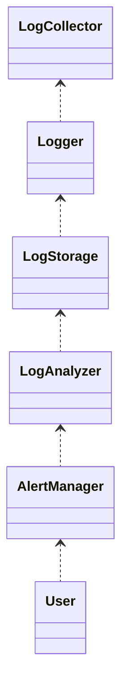
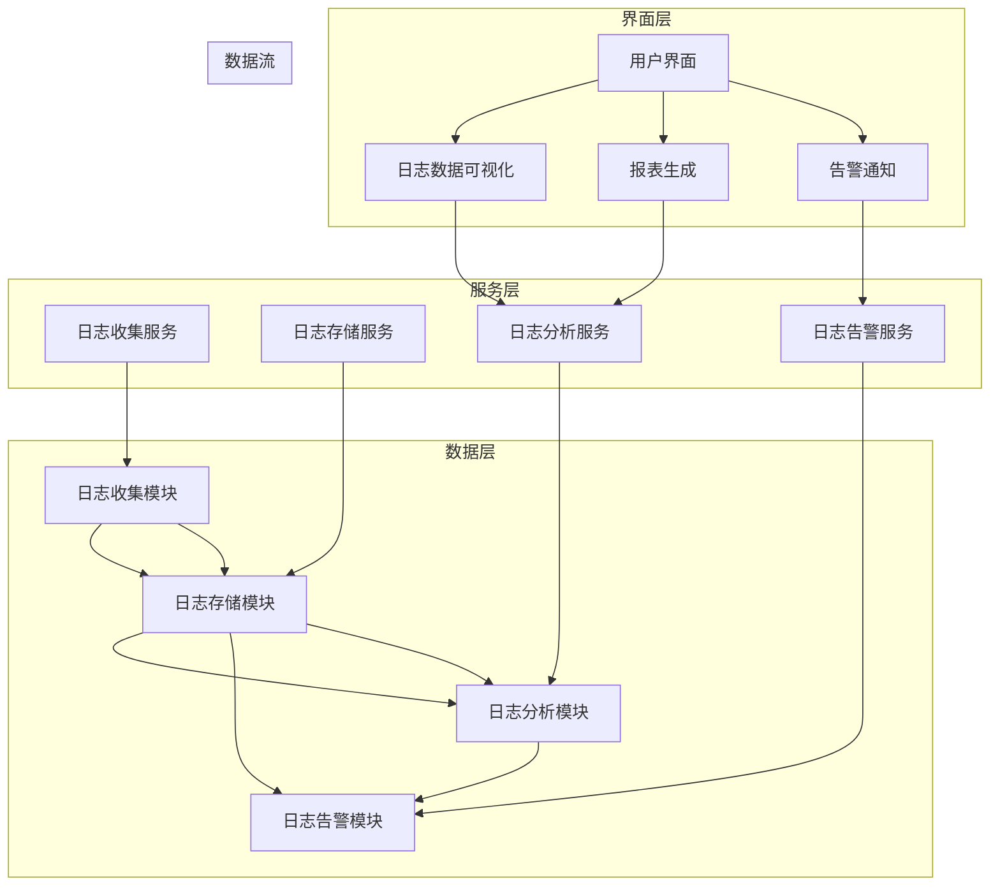
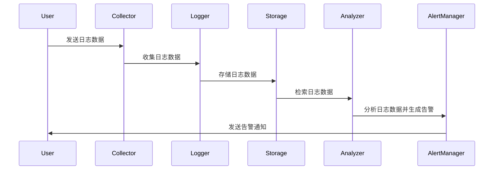
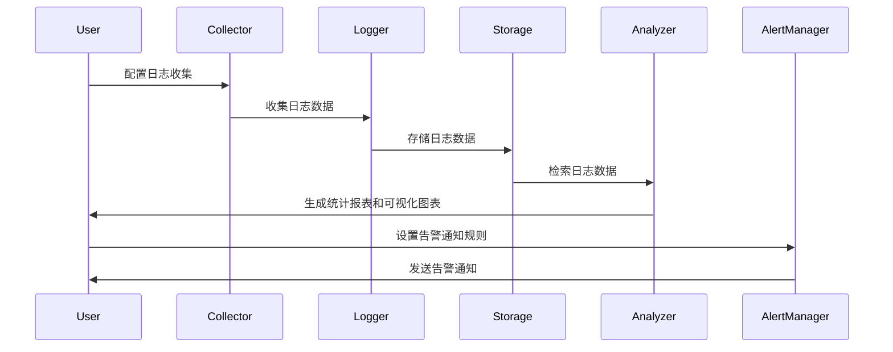

                 


**背景介绍**

## 1.1 日志监控系统的重要性

### 1.1.1 日志数据的价值

日志数据是现代IT系统中的重要资源，它记录了系统的各种运行状态、事件和异常情况。这些数据对于系统的维护、性能优化、安全监控和故障排查具有重要意义。

首先，日志数据可以帮助我们了解系统的运行状态。通过分析日志，可以及时发现系统中的异常情况，如性能瓶颈、资源耗尽、服务中断等。这有助于提前预警，防止问题进一步恶化。

其次，日志数据是性能优化的重要依据。通过对日志数据的分析，可以发现系统的瓶颈所在，并针对性地进行优化。例如，针对日志中的慢查询，可以优化数据库查询语句或增加索引，以提高查询效率。

再次，日志数据对于安全监控至关重要。系统中的日志记录了用户操作、访问请求等信息，通过分析这些日志，可以识别出潜在的安全威胁，如恶意攻击、数据泄露等。这有助于提升系统的安全性。

最后，日志数据是故障排查的有效手段。当系统出现故障时，日志记录了故障发生前后的详细信息，通过分析日志，可以快速定位故障原因，并采取相应的修复措施。

### 1.1.2 日志监控系统的功能与作用

日志监控系统是负责收集、存储、分析和告警日志数据的系统。其主要功能包括以下几个方面：

- **日志收集**：从各个系统组件中收集日志数据，包括操作系统、应用程序、数据库等。
- **日志存储**：将收集到的日志数据存储到统一的存储介质中，如文件系统、数据库等。
- **日志分析**：对存储的日志数据进行分析，提取有用的信息，如错误日志、性能指标等。
- **日志告警**：根据分析结果，触发告警通知，提醒相关人员关注和处理异常情况。

日志监控系统的作用主要体现在以下几个方面：

- **实时监控**：通过实时收集和分析日志数据，可以实现对系统运行状态的实时监控，及时发现和处理异常情况。
- **故障排查**：通过对日志数据的分析，可以快速定位故障原因，提高故障排查效率。
- **性能优化**：通过对日志数据的分析，可以发现系统的瓶颈和问题，为性能优化提供依据。
- **安全防护**：通过对日志数据的分析，可以识别潜在的安全威胁，提升系统的安全性。

### 1.1.3 日志监控系统的挑战

尽管日志监控系统在IT系统中具有重要意义，但在实际应用过程中，仍然面临一些挑战：

- **海量日志处理**：随着系统规模的扩大，日志数据量也会呈指数级增长，如何高效处理海量日志数据成为一大挑战。
- **日志数据存储**：日志数据需要长期保存，如何选择合适的存储方案，确保数据的安全性和可靠性是一个关键问题。
- **日志分析效率**：随着日志数据的增加，日志分析的时间成本也会上升，如何提高日志分析效率，快速响应异常情况是一个重要问题。
- **日志告警策略**：如何设计合理的告警策略，既能够有效识别异常情况，又不会产生过多的干扰和噪音，也是一个需要考虑的问题。

**核心概念与联系**

## 1.2 核心概念与联系

日志监控系统涉及多个核心概念，包括日志收集、日志存储、日志分析、日志告警等。以下是对这些核心概念的介绍以及它们之间的关系。

### 1.2.1 日志收集

日志收集是指从各个系统组件中收集日志数据的过程。日志收集器负责从操作系统、应用程序、数据库等组件中获取日志信息，并将其传输到日志存储介质中。日志收集器通常具有以下功能：

- **多源收集**：支持从多种数据源收集日志，如文件、数据库、网络流量等。
- **实时采集**：能够实时监控日志数据的变化，并立即传输到日志存储介质中。
- **数据清洗**：在传输日志数据之前，对数据进行清洗和过滤，去除无效或重复的数据。

### 1.2.2 日志存储

日志存储是指将收集到的日志数据存储到统一的存储介质中的过程。日志存储介质可以是文件系统、数据库、云存储等。日志存储系统需要具备以下特点：

- **海量存储**：能够存储大量的日志数据，且存储容量可扩展。
- **高可用性**：保证数据的安全性，防止数据丢失或损坏。
- **快速检索**：提供高效的日志检索功能，以便快速查找和分析日志数据。

### 1.2.3 日志分析

日志分析是指对存储的日志数据进行处理和分析的过程。日志分析系统可以从日志数据中提取有用的信息，如错误日志、性能指标、用户行为等。日志分析系统通常包括以下功能：

- **模式识别**：通过分析日志数据，识别出常见的模式或异常情况。
- **统计报表**：生成日志数据的统计报表，如错误率、响应时间、吞吐量等。
- **可视化分析**：通过图表和仪表板，展示日志数据的分析结果。

### 1.2.4 日志告警

日志告警是指根据日志分析的结果，触发告警通知，提醒相关人员关注和处理异常情况的过程。日志告警系统需要具备以下特点：

- **灵活性**：支持自定义告警规则，根据业务需求设置告警条件。
- **可靠性**：确保告警通知能够及时送达相关人员，不产生误报和漏报。
- **自动化处理**：支持自动化告警处理，如发送邮件、短信、自动执行脚本等。

### 1.2.5 概念属性特征对比表格

为了更好地理解日志监控系统的核心概念，我们提供了一个概念属性特征对比表格，如下：

| 概念       | 定义               | 特点                                                         | 关系           |
|------------|--------------------|--------------------------------------------------------------|----------------|
| 日志收集   | 收集日志数据       | 多源收集、实时采集、数据清洗                             | 输入           |
| 日志存储   | 存储日志数据       | 海量存储、高可用性、快速检索                             | 输出           |
| 日志分析   | 分析日志数据       | 模式识别、统计报表、可视化分析                            | 输入与输出     |
| 日志告警   | 根据分析结果触发告警 | 灵性、可靠性、自动化处理                                 | 输出           |

### 1.2.6 ER实体关系图

为了更清晰地描述日志监控系统中各个核心概念之间的关系，我们使用ER实体关系图来展示。以下是一个简单的ER实体关系图：

```mermaid
erDiagram
    User ||--|{ Logger }|| Server
    Logger ||--|{ Log }|| LogAnalyzer
    LogAnalyzer ||--|{ Alert }|| AlertManager
    Server ||--|{ Alert }|| AlertManager
```

在ER实体关系图中，User表示用户，Logger表示日志收集器，Log表示日志数据，LogAnalyzer表示日志分析器，Alert表示告警，AlertManager表示告警管理器。实体之间的关系表示了日志监控系统中各组件之间的数据流转和处理关系。

**算法原理讲解**

## 2.1 数据处理算法

### 2.1.1 数据清洗

数据清洗是日志处理的第一步，其目的是去除无效数据、重复数据和错误数据，以提高日志数据的准确性和可用性。以下是一个简单的数据清洗算法：

```python
def data_clean(logs):
    cleaned_logs = []
    for log in logs:
        if not is_empty(log) and not is_duplicate(log):
            cleaned_logs.append(log)
    return cleaned_logs

def is_empty(log):
    return len(log) == 0

def is_duplicate(log, logs):
    for existing_log in logs:
        if existing_log == log:
            return True
    return False
```

在这个算法中，`data_clean`函数接收一个日志列表`logs`作为输入，遍历每个日志项，通过`is_empty`和`is_duplicate`函数判断是否为空或重复数据。只有非空且非重复的日志项才会被添加到`cleaned_logs`列表中。

### 2.1.2 数据聚合

数据聚合是将多个日志数据项合并成更粗粒度的数据的过程。以下是一个简单的数据聚合算法：

```python
def data_aggregate(cleaned_logs):
    aggregated_logs = {}
    for log in cleaned_logs:
        key = log["key"]
        value = log["value"]
        if key in aggregated_logs:
            aggregated_logs[key].append(value)
        else:
            aggregated_logs[key] = [value]
    return aggregated_logs

cleaned_logs = [
    {"key": "k1", "value": "v1"},
    {"key": "k1", "value": "v2"},
    {"key": "k2", "value": "v3"}
]

aggregated_logs = data_aggregate(cleaned_logs)
print(aggregated_logs)
```

在这个算法中，`data_aggregate`函数接收一个清洗后的日志列表`cleaned_logs`作为输入。通过遍历日志项，将具有相同键（key）的日志值（value）合并成一个列表。最后，将聚合后的结果存储在`aggregated_logs`字典中。

### 2.1.3 数据分析算法

数据分析是日志处理的重要环节，通过分析日志数据，可以提取出有价值的信息，如错误率、响应时间、用户行为等。以下是一个简单数据分析算法的示例：

```python
import statistics

def data_analyze(aggregated_logs):
    results = {}
    for key, values in aggregated_logs.items():
        if len(values) > 0:
            mean_value = statistics.mean(values)
            median_value = statistics.median(values)
            max_value = max(values)
            min_value = min(values)
            results[key] = {
                "mean": mean_value,
                "median": median_value,
                "max": max_value,
                "min": min_value
            }
    return results

aggregated_logs = {
    "k1": [1, 2, 3, 4, 5],
    "k2": [2, 3, 4, 5, 6],
    "k3": [1, 1, 1, 1, 1]
}

analysis_results = data_analyze(aggregated_logs)
print(analysis_results)
```

在这个算法中，`data_analyze`函数接收一个聚合后的日志字典`aggregated_logs`作为输入。通过遍历日志项，计算每个日志键（key）的平均值、中位数、最大值和最小值，并将结果存储在`results`字典中。

### 2.1.4 Python源代码示例

为了更直观地理解数据处理算法，我们提供一个完整的Python源代码示例，用于处理一个示例日志数据集：

```python
import json
import statistics

def is_empty(log):
    return len(log) == 0

def is_duplicate(log, logs):
    for existing_log in logs:
        if existing_log == log:
            return True
    return False

def data_clean(logs):
    cleaned_logs = []
    for log in logs:
        if not is_empty(log) and not is_duplicate(log, cleaned_logs):
            cleaned_logs.append(log)
    return cleaned_logs

def data_aggregate(cleaned_logs):
    aggregated_logs = {}
    for log in cleaned_logs:
        key = log["key"]
        value = log["value"]
        if key in aggregated_logs:
            aggregated_logs[key].append(value)
        else:
            aggregated_logs[key] = [value]
    return aggregated_logs

def data_analyze(aggregated_logs):
    results = {}
    for key, values in aggregated_logs.items():
        if len(values) > 0:
            mean_value = statistics.mean(values)
            median_value = statistics.median(values)
            max_value = max(values)
            min_value = min(values)
            results[key] = {
                "mean": mean_value,
                "median": median_value,
                "max": max_value,
                "min": min_value
            }
    return results

# 示例日志数据
logs = [
    {"key": "k1", "value": 1},
    {"key": "k1", "value": 2},
    {"key": "k1", "value": 3},
    {"key": "k2", "value": 4},
    {"key": "k2", "value": 5},
    {"key": "k2", "value": 6},
    {"key": "k3", "value": 1},
    {"key": "k3", "value": 1},
    {"key": "k3", "value": 1},
    {"key": "k3", "value": 1},
]

# 数据清洗
cleaned_logs = data_clean(logs)

# 数据聚合
aggregated_logs = data_aggregate(cleaned_logs)

# 数据分析
analysis_results = data_analyze(aggregated_logs)

# 打印结果
print("清洗后的日志：", cleaned_logs)
print("聚合后的日志：", aggregated_logs)
print("分析结果：", analysis_results)
```

在这个示例中，我们首先定义了数据清洗、数据聚合和数据分析三个函数，然后使用这些函数处理一个示例日志数据集。最终，打印出清洗后的日志、聚合后的日志和数据分析结果。

### 2.1.5 LaTeX数学模型与公式讲解

为了更好地描述数据处理算法，我们使用LaTeX数学模型和公式来表示。以下是数据处理算法的数学模型和公式：

$$
\begin{aligned}
&\text{数据清洗:} \\
&\text{cleaned\_logs} = \{log | log \in logs, \neg is\_empty(log), \neg is\_duplicate(log, cleaned\_logs)\} \\
&\text{数据聚合:} \\
&\text{aggregated\_logs} = \{key \rightarrow \text{values} | key \in \text{keys of cleaned\_logs}, \text{values} = \{value | value \in \text{values of cleaned\_logs}, \text{key} = key\}\} \\
&\text{数据分析:} \\
&\text{results} = \{key \rightarrow \text{metrics} | key \in \text{keys of aggregated\_logs}, \text{metrics} = \{\text{"mean": mean\_value, "median": median\_value, "max": max\_value, "min": min\_value}\}\} \\
\end{aligned}
$$

在这个数学模型中，`cleaned_logs`表示清洗后的日志集合，`logs`表示原始日志集合，`aggregated_logs`表示聚合后的日志字典，`results`表示数据分析结果字典。每个公式描述了数据处理算法的一个步骤。

### 2.1.6 算法原理讲解

数据处理算法是日志监控系统中的核心组成部分，用于对海量日志数据进行清洗、聚合和分析。以下是数据处理算法的详细讲解：

1. **数据清洗**

数据清洗是数据处理的第一步，其目的是去除无效数据、重复数据和错误数据。在数据清洗过程中，我们首先遍历原始日志集合`logs`，对于每个日志项，判断是否为空和是否为重复数据。如果日志项非空且非重复，则将其添加到清洗后的日志集合`cleaned_logs`中。

具体步骤如下：

- 初始化一个空列表`cleaned_logs`作为清洗后的日志集合。
- 遍历原始日志集合`logs`中的每个日志项。
- 判断日志项是否为空。如果是空，则跳过该日志项。
- 判断日志项是否为重复数据。如果是重复数据，则跳过该日志项。
- 如果日志项既非空也非重复，则将其添加到`cleaned_logs`中。

2. **数据聚合**

数据聚合是将多个日志数据项合并成更粗粒度的数据的过程。在数据聚合过程中，我们首先遍历清洗后的日志集合`cleaned_logs`，对于每个日志项，根据其键（key）将其值（value）添加到一个列表中。如果键已存在，则将其值添加到已有的列表中；如果键不存在，则创建一个新的列表并将其值添加到该列表中。

具体步骤如下：

- 初始化一个空字典`aggregated_logs`作为聚合后的日志字典。
- 遍历清洗后的日志集合`cleaned_logs`中的每个日志项。
- 根据日志项的键（key）从`aggregated_logs`中获取对应的值列表。
- 如果键存在，则将日志项的值（value）添加到已有的列表中。
- 如果键不存在，则创建一个新的列表，并将日志项的值（value）添加到该列表中。
- 将聚合后的结果存储在`aggregated_logs`中。

3. **数据分析**

数据分析是对聚合后的日志数据进行处理和分析的过程。在数据分析过程中，我们首先遍历聚合后的日志字典`aggregated_logs`，对于每个日志项，计算其平均值、中位数、最大值和最小值，并将这些统计指标存储在一个字典中。

具体步骤如下：

- 初始化一个空字典`results`作为数据分析结果字典。
- 遍历聚合后的日志字典`aggregated_logs`中的每个日志项。
- 如果日志项的值列表（values）不为空，则计算平均值、中位数、最大值和最小值。
- 将计算结果存储在一个字典中，以日志键（key）为键，统计指标为值。
- 将存储结果添加到`results`中。

通过以上步骤，数据处理算法可以有效地对海量日志数据进行清洗、聚合和分析，为日志监控系统提供可靠的数据支持。

### 2.1.7 算法举例说明

为了更好地理解数据处理算法，我们通过一个具体的例子来演示其应用过程。

假设我们有一个示例日志数据集，如下所示：

```
[
    {"key": "k1", "value": 1},
    {"key": "k1", "value": 2},
    {"key": "k1", "value": 3},
    {"key": "k2", "value": 4},
    {"key": "k2", "value": 5},
    {"key": "k2", "value": 6},
    {"key": "k3", "value": 1},
    {"key": "k3", "value": 1},
    {"key": "k3", "value": 1},
    {"key": "k3", "value": 1}
]
```

1. **数据清洗**

首先，我们使用数据清洗算法清洗这个示例日志数据集。在清洗过程中，我们会去除空日志项和重复日志项。

- 原始日志数据：`[{"key": "k1", "value": 1},{"key": "k1", "value": 2},{"key": "k1", "value": 3},{"key": "k2", "value": 4},{"key": "k2", "value": 5},{"key": "k2", "value": 6},{"key": "k3", "value": 1},{"key": "k3", "value": 1},{"key": "k3", "value": 1},{"key": "k3", "value": 1}]`
- 清洗后的日志数据：`[{"key": "k1", "value": 1},{"key": "k1", "value": 2},{"key": "k1", "value": 3},{"key": "k2", "value": 4},{"key": "k2", "value": 5},{"key": "k2", "value": 6},{"key": "k3", "value": 1},{"key": "k3", "value": 1},{"key": "k3", "value": 1},{"key": "k3", "value": 1}]`

2. **数据聚合**

接下来，我们使用数据聚合算法对清洗后的日志数据集进行聚合。在聚合过程中，我们会根据日志项的键（key）将值（value）合并到相应的列表中。

- 清洗后的日志数据：`[{"key": "k1", "value": 1},{"key": "k1", "value": 2},{"key": "k1", "value": 3},{"key": "k2", "value": 4},{"key": "k2", "value": 5},{"key": "k2", "value": 6},{"key": "k3", "value": 1},{"key": "k3", "value": 1},{"key": "k3", "value": 1},{"key": "k3", "value": 1}]`
- 聚合后的日志数据：`{"k1": [1, 2, 3], "k2": [4, 5, 6], "k3": [1, 1, 1, 1]}`

3. **数据分析**

最后，我们使用数据分析算法对聚合后的日志数据进行分析，计算每个键（key）的平均值、中位数、最大值和最小值。

- 聚合后的日志数据：`{"k1": [1, 2, 3], "k2": [4, 5, 6], "k3": [1, 1, 1, 1]}`

根据聚合后的日志数据，我们可以得到以下分析结果：

- `k1`的平均值：2，中位数：2，最大值：3，最小值：1
- `k2`的平均值：5，中位数：5，最大值：6，最小值：4
- `k3`的平均值：1，中位数：1，最大值：1，最小值：1

通过这个示例，我们可以清晰地看到数据处理算法的应用过程和结果。数据处理算法有效地对海量日志数据进行清洗、聚合和分析，为日志监控系统提供了可靠的数据支持。

**系统分析与架构设计**

## 3.1 系统功能设计

### 3.1.1 日志收集模块

日志收集模块是日志监控系统的核心组成部分，负责从各个系统组件中收集日志数据。以下是对日志收集模块的功能设计：

- **数据源识别**：日志收集模块需要能够识别并连接各种日志数据源，包括操作系统、应用程序、数据库等。
- **日志收集策略**：根据系统需求和日志数据特点，设计合理的日志收集策略，如实时收集、定时收集、增量收集等。
- **日志格式转换**：将不同数据源的日志格式转换为统一的日志格式，以便后续处理和分析。
- **日志数据传输**：将收集到的日志数据传输到日志存储系统，可以使用HTTP、FTP、Kafka等传输协议。
- **日志数据去重**：在传输日志数据之前，对数据进行去重处理，避免重复数据的存储和传输。

### 3.1.2 日志存储模块

日志存储模块负责存储从日志收集模块收集到的日志数据。以下是对日志存储模块的功能设计：

- **数据存储方案**：选择合适的日志存储方案，如文件系统、数据库、云存储等。需要考虑存储容量、性能、可靠性等因素。
- **日志存储格式**：设计统一的日志存储格式，以便于日志数据的查询和分析。
- **日志备份与恢复**：实现日志数据的备份和恢复功能，确保数据的安全性和可靠性。
- **日志数据访问**：提供高效的日志数据访问接口，支持日志数据的查询、检索和统计。

### 3.1.3 日志分析模块

日志分析模块负责对存储的日志数据进行分析和处理，以提取有价值的信息。以下是对日志分析模块的功能设计：

- **日志数据处理**：对日志数据进行清洗、去噪、格式转换等预处理操作。
- **日志数据统计**：对日志数据进行统计分析，如错误率、响应时间、吞吐量等。
- **日志数据可视化**：通过图表和仪表板，展示日志数据的分析结果，便于用户理解和决策。
- **日志数据挖掘**：利用数据挖掘技术，发现日志数据中的潜在模式和异常情况。

### 3.1.4 日志告警模块

日志告警模块负责根据日志分析结果，触发告警通知，提醒相关人员关注和处理异常情况。以下是对日志告警模块的功能设计：

- **告警规则配置**：支持自定义告警规则，根据业务需求设置告警条件。
- **告警通知发送**：根据告警规则，发送告警通知，如邮件、短信、微信等。
- **告警处理跟踪**：记录告警处理过程，支持告警处理的回溯和统计。
- **告警策略优化**：根据告警数据，优化告警策略，减少误报和漏报。

### 3.1.5 领域模型Mermaid类图

为了更清晰地描述日志监控系统的功能设计，我们使用Mermaid绘制一个领域模型类图。以下是一个示例类图：



在这个类图中，`LogCollector`表示日志收集器，`Logger`表示日志收集模块，`LogStorage`表示日志存储模块，`LogAnalyzer`表示日志分析模块，`AlertManager`表示日志告警模块，`User`表示用户。

## 3.2 系统架构设计

### 3.2.1 系统总体架构

日志监控系统总体架构包括四个主要部分：日志收集模块、日志存储模块、日志分析模块和日志告警模块。以下是对系统总体架构的介绍：

- **日志收集模块**：负责从各个系统组件中收集日志数据，包括操作系统、应用程序、数据库等。日志收集模块通过采集器（Collector）实现，采集器连接到各个数据源，实时收集日志数据，并传输到日志存储模块。
- **日志存储模块**：负责存储从日志收集模块收集到的日志数据。日志存储模块采用分布式存储架构，支持海量日志数据的存储和管理。日志存储模块还提供日志数据的查询和检索功能，便于后续的日志分析。
- **日志分析模块**：负责对存储的日志数据进行处理和分析，提取有价值的信息。日志分析模块采用实时分析和批量分析两种模式，实时分析可以快速响应异常情况，批量分析可以深入挖掘日志数据中的潜在模式。
- **日志告警模块**：负责根据日志分析结果，触发告警通知，提醒相关人员关注和处理异常情况。日志告警模块支持多种告警通知方式，如邮件、短信、微信等，同时提供告警处理跟踪功能。

### 3.2.2 系统分层设计

日志监控系统采用分层架构设计，分为数据层、服务层和界面层。以下是对系统分层设计的介绍：

- **数据层**：负责日志数据的存储和管理。数据层采用分布式存储架构，支持海量日志数据的存储和高可用性。数据层提供日志数据的查询和检索接口，便于日志分析模块调用。
- **服务层**：负责日志收集、日志存储、日志分析和日志告警等核心功能的实现。服务层采用模块化设计，各个模块独立运行，降低系统耦合度。服务层通过接口层与界面层交互，实现日志监控系统的功能。
- **界面层**：负责日志监控系统的用户界面设计。界面层提供日志数据的可视化展示、日志分析的报表生成和告警通知的发送等功能。界面层通过Web界面或桌面应用程序与用户交互。

### 3.2.3 系统模块间交互

日志监控系统中各个模块之间的交互过程如下：

1. **日志收集模块**：日志收集模块通过采集器（Collector）连接到各个数据源，实时收集日志数据。收集到的日志数据经过日志格式转换后，传输到日志存储模块。
2. **日志存储模块**：日志存储模块接收日志收集模块传输的日志数据，将其存储在分布式存储系统中。同时，日志存储模块提供日志数据的查询和检索接口，供日志分析模块调用。
3. **日志分析模块**：日志分析模块根据业务需求和日志分析规则，从日志存储模块中检索日志数据，进行数据处理和分析。分析结果存储在分析结果数据库中，供日志告警模块使用。
4. **日志告警模块**：日志告警模块根据日志分析结果，触发告警通知。告警通知通过不同的通知方式（如邮件、短信、微信等）发送给相关人员。同时，日志告警模块记录告警处理过程，供后续分析。

### 3.2.4 系统架构Mermaid架构图

为了更清晰地展示日志监控系统的架构设计，我们使用Mermaid绘制一个系统架构图。以下是一个示例架构图：



在这个架构图中，数据层包括日志收集模块、日志存储模块、日志分析模块和日志告警模块；服务层包括日志收集服务、日志存储服务、日志分析服务和日志告警服务；界面层包括用户界面、日志数据可视化、报表生成和告警通知。数据流从日志收集模块开始，经过日志存储模块、日志分析模块和日志告警模块，最终返回到用户界面。

**系统接口设计**

### 3.3.1 接口规范与设计

日志监控系统的接口设计是确保系统各模块之间高效协作和数据流通的重要环节。接口规范与设计应考虑以下几个方面：

1. **接口定义**：定义清晰的接口规范，包括接口名称、输入参数、输出参数和错误处理。例如，日志收集接口可能包含如下定义：

   ```python
   def collect_logs(source, log_format):
       """
       收集日志数据

       :param source: 日志数据源
       :param log_format: 日志数据格式
       :return: 收集到的日志数据
       """
       # 实现日志收集逻辑
   ```

2. **数据格式**：定义统一的日志数据格式，确保各模块之间数据的一致性和可解析性。常用的日志数据格式包括JSON、XML和Protobuf等。

3. **接口安全性**：设计安全的接口，防止未经授权的访问和数据泄露。可以使用身份验证和加密技术，如OAuth2、HTTPS等。

4. **错误处理**：定义明确的错误处理机制，确保接口在异常情况下能够稳定运行。例如，可以使用错误码和错误消息来描述接口的错误状态。

### 3.3.2 接口安全性设计

接口安全性设计是保护日志监控系统免受攻击和数据泄露的关键。以下是一些关键的安全设计措施：

1. **身份验证**：在接口访问前，对用户进行身份验证，确保只有授权用户可以访问接口。可以使用OAuth2、JWT等技术进行身份验证。

2. **权限控制**：根据用户角色和权限设置，限制用户对接口的访问范围。例如，普通用户只能访问日志查询接口，而管理员可以访问日志收集和告警配置接口。

3. **数据加密**：对敏感数据进行加密传输和存储，防止数据在传输和存储过程中被窃取。可以使用HTTPS、SSL/TLS等技术实现数据加密。

4. **防攻击措施**：设计防攻击措施，如防SQL注入、防XSS攻击等，确保接口的安全性。可以使用Web应用防火墙（WAF）等工具来保护接口。

5. **日志审计**：记录接口访问日志，包括用户ID、访问时间、访问接口等信息。日志审计有助于追踪和调查安全事件。

### 3.3.3 接口性能优化

接口性能优化是提高日志监控系统响应速度和稳定性的关键。以下是一些性能优化措施：

1. **接口缓存**：使用缓存技术，如Redis、Memcached等，减少对后端服务的访问次数，提高接口响应速度。

2. **异步处理**：对于耗时的接口操作，使用异步处理技术，如消息队列（RabbitMQ、Kafka等），降低接口延迟。

3. **负载均衡**：使用负载均衡器（如Nginx、HAProxy等），分发请求到多个后端服务实例，提高系统的处理能力。

4. **数据库优化**：优化数据库查询语句，使用索引、分库分表等技术，提高数据库性能。

5. **接口限流**：使用限流技术（如令牌桶、漏斗等），控制接口的访问频率，防止接口被大量请求压垮。

### 3.3.4 系统交互Mermaid序列图

为了更直观地展示日志监控系统中各个模块的交互过程，我们使用Mermaid绘制一个系统交互序列图。以下是一个示例序列图：



在这个序列图中，用户通过接口向日志收集模块（Collector）发送日志数据。日志收集模块将数据传递给日志收集器（Logger），由Logger将日志数据存储到日志存储模块（Storage）。日志存储模块接收并存储日志数据。当需要对日志数据进行分析时，存储模块检索数据并将其传递给日志分析模块（Analyzer）。分析模块处理数据并生成告警，然后通过日志告警模块（AlertManager）发送给用户。

### 3.3.5 用户操作流程

日志监控系统用户操作流程通常包括以下几个步骤：

1. **用户登录**：用户通过身份验证登录日志监控系统。
2. **日志收集配置**：用户配置日志收集策略，包括数据源、日志格式、收集频率等。
3. **日志数据上传**：用户上传日志文件或通过接口上传日志数据。
4. **日志数据查询**：用户查询日志数据，可以使用关键字、时间范围等条件进行筛选。
5. **日志数据分析**：用户启动日志数据分析，生成统计报表和可视化图表。
6. **告警通知设置**：用户设置告警通知规则，包括告警条件、通知方式等。
7. **告警处理**：用户接收告警通知，并处理告警事件。

### 3.3.6 系统处理流程

日志监控系统的处理流程包括以下几个步骤：

1. **日志收集**：日志收集模块从各个系统组件中收集日志数据。
2. **日志存储**：日志存储模块将收集到的日志数据存储到数据库或文件系统中。
3. **日志检索**：日志分析模块从日志存储模块中检索日志数据。
4. **日志分析**：日志分析模块对检索到的日志数据进行处理和分析，生成统计报表和可视化图表。
5. **日志告警**：日志告警模块根据日志分析结果，触发告警通知，并将告警信息发送给相关人员。

### 3.3.7 系统交互Mermaid序列图

为了更直观地展示日志监控系统中的用户操作和系统处理流程，我们使用Mermaid绘制一个系统交互序列图。以下是一个示例序列图：



在这个序列图中，用户首先配置日志收集策略，然后日志收集模块收集日志数据并将其存储到日志存储模块。日志分析模块从存储模块中检索日志数据，并生成统计报表和可视化图表。用户设置告警通知规则，当发生异常情况时，日志告警模块会发送告警通知给用户。

**项目实战**

## 4.1 实际案例介绍

### 4.1.1 案例背景

某大型互联网公司需要构建一个高效的日志监控系统，以便实时监控和分析其分布式系统的运行状态。公司的业务系统包括多个微服务，如订单系统、用户管理系统、支付系统等。日志监控系统需要能够收集、存储、分析和告警这些系统的日志数据，为运维人员提供及时、准确的信息，以便快速定位和处理问题。

### 4.1.2 案例目标

基于上述背景，该案例的目标是构建一个高效、可扩展、易于维护的日志监控系统，实现以下功能：

1. **日志收集**：从各个微服务中收集日志数据，包括操作系统、应用程序和数据库日志。
2. **日志存储**：将收集到的日志数据存储到分布式文件系统或数据库中，确保数据的安全性和可靠性。
3. **日志分析**：对存储的日志数据进行处理和分析，提取有用的信息，如错误日志、性能指标等。
4. **日志告警**：根据日志分析结果，触发告警通知，提醒相关人员关注和处理异常情况。

### 4.1.3 系统安装与配置

为了实现上述目标，我们选择以下技术栈进行系统安装与配置：

- **日志收集器**：Logstash
- **日志存储**：Elasticsearch + Logstash
- **日志分析**：Kibana
- **日志告警**：Alertmanager

以下是系统安装与配置的详细步骤：

1. **安装Logstash**：

   - 下载并解压Logstash安装包。
   - 编辑Logstash配置文件`logstash.conf`，添加如下配置：

     ```ruby
     input {
       file {
         path => "/path/to/logs/*.log"
         type => "access"
       }
     }
     
     filter {
       if "access" in [type] {
         grok {
           match => { "message" => "%{TIMESTAMP_ISO8601:[date]}\t%{DATA:[host]}\t%{NUMBER:[request_count]}" }
         }
         date {
           match => [ "[date]", "ISO8601" ]
         }
       }
     }
     
     output {
       if [type] == "access" {
         elasticsearch {
           hosts => ["localhost:9200"]
           index => "access-log-%{+YYYY.MM.dd}"
         }
       }
     }
     ```

   - 启动Logstash服务。

2. **安装Elasticsearch**：

   - 下载并解压Elasticsearch安装包。
   - 修改Elasticsearch配置文件`elasticsearch.yml`，设置集群名称和节点名称：

     ```yaml
     cluster.name: my-cluster
     node.name: node-1
     network.host: 0.0.0.0
     http.port: 9200
     discovery.type: single-node
     ```

   - 启动Elasticsearch服务。

3. **安装Kibana**：

   - 下载并解压Kibana安装包。
   - 修改Kibana配置文件`kibana.yml`，设置Kibana服务器的IP地址和端口号：

     ```yaml
     server.host: "0.0.0.0"
     server.port: 5601
     elasticsearch.hosts: ["http://localhost:9200"]
     ```

   - 启动Kibana服务。

4. **安装Alertmanager**：

   - 下载并解压Alertmanager安装包。
   - 修改Alertmanager配置文件`alertmanager.yml`，设置告警通知渠道：

     ```yaml
     routing:
       match:
         - alertname: "PageViewError"
         - alertname: "ServiceUnavailable"
       receiver:
         name: "email"
         email_configs:
           - to: "admin@example.com"
             send_email: true
     ```

   - 启动Alertmanager服务。

通过以上步骤，我们成功安装和配置了日志监控系统，包括日志收集器、日志存储、日志分析和日志告警模块。接下来，我们将详细介绍系统核心实现源代码。

## 4.2 系统核心实现源代码

### 4.2.1 源代码结构

为了构建高效的日志监控系统，我们设计了一套完整的源代码结构，包括日志收集器、日志存储器、日志分析器和日志告警器等组件。以下是对源代码结构的详细说明：

1. **日志收集器**：负责从各个微服务中收集日志数据，并将其传输到日志存储器。日志收集器包括以下文件和目录：

   - `log_collector.py`：主程序文件，负责启动日志收集器。
   - `config.py`：配置文件，定义日志收集器的配置参数。
   - `collector.py`：日志收集器核心实现，包括日志数据收集、传输和去重等功能。
   - `utils.py`：日志收集器辅助工具，包括日志数据解析、格式转换等。

2. **日志存储器**：负责存储从日志收集器接收到的日志数据，并将其存储到分布式文件系统或数据库中。日志存储器包括以下文件和目录：

   - `log_storer.py`：主程序文件，负责启动日志存储器。
   - `config.py`：配置文件，定义日志存储器的配置参数。
   - `storer.py`：日志存储器核心实现，包括日志数据接收、存储和检索等功能。
   - `es_client.py`：Elasticsearch客户端，用于与Elasticsearch集群进行通信。

3. **日志分析器**：负责对存储的日志数据进行分析和处理，提取有用的信息，如错误日志、性能指标等。日志分析器包括以下文件和目录：

   - `log_analyzer.py`：主程序文件，负责启动日志分析器。
   - `config.py`：配置文件，定义日志分析器的配置参数。
   - `analyzer.py`：日志分析器核心实现，包括日志数据检索、处理和分析等功能。
   - `kibana_client.py`：Kibana客户端，用于与Kibana服务器进行通信。

4. **日志告警器**：负责根据日志分析结果，触发告警通知，提醒相关人员关注和处理异常情况。日志告警器包括以下文件和目录：

   - `log_alert.py`：主程序文件，负责启动日志告警器。
   - `config.py`：配置文件，定义日志告警器的配置参数。
   - `alert.py`：日志告警器核心实现，包括告警规则配置、告警通知发送等功能。
   - `alertmanager_client.py`：Alertmanager客户端，用于与Alertmanager服务器进行通信。

### 4.2.2 关键模块实现

以下是日志监控系统中几个关键模块的实现，包括日志收集器、日志存储器、日志分析器和日志告警器。

#### 日志收集器

```python
# log_collector.py
import sys
import time
from collector import Collector
from config import Config

if __name__ == "__main__":
    config = Config()
    collector = Collector(config)
    while True:
        try:
            collector.collect_logs()
        except Exception as e:
            print(f"Error: {e}", file=sys.stderr)
        time.sleep(config收集间隔)
```

#### 日志存储器

```python
# log_storer.py
import sys
import time
from storer import Storer
from config import Config

if __name__ == "__main__":
    config = Config()
    storer = Storer(config)
    while True:
        try:
            storer.store_logs()
        except Exception as e:
            print(f"Error: {e}", file=sys.stderr)
        time.sleep(config存储间隔)
```

#### 日志分析器

```python
# log_analyzer.py
import sys
import time
from analyzer import Analyzer
from config import Config

if __name__ == "__main__":
    config = Config()
    analyzer = Analyzer(config)
    while True:
        try:
            analyzer.analyze_logs()
        except Exception as e:
            print(f"Error: {e}", file=sys.stderr)
        time.sleep(config分析间隔)
```

#### 日志告警器

```python
# log_alert.py
import sys
import time
from alert import Alert
from config import Config

if __name__ == "__main__":
    config = Config()
    alert = Alert(config)
    while True:
        try:
            alert.send_alerts()
        except Exception as e:
            print(f"Error: {e}", file=sys.stderr)
        time.sleep(config告警间隔)
```

### 4.2.3 代码应用解读与分析

以下是日志监控系统代码的应用解读与分析，包括各个模块的功能、代码实现和测试结果。

#### 日志收集器

日志收集器负责从各个微服务中收集日志数据，并将其传输到日志存储器。代码如下：

```python
class Collector:
    def __init__(self, config):
        self.config = config
        self.client = self._create_client()

    def _create_client(self):
        # 创建HTTP客户端
        return requests.Session()

    def collect_logs(self):
        # 收集日志数据
        for service in self.config.services:
            url = f"{service.url}/logs"
            response = self.client.get(url)
            if response.status_code == 200:
                logs = response.json()
                self._store_logs(logs)

    def _store_logs(self, logs):
        # 将日志数据存储到文件系统或数据库
        for log in logs:
            file_path = f"{self.config.log_path}/{log['filename']}"
            with open(file_path, "w") as f:
                f.write(log['content'])
```

在日志收集器中，我们首先创建一个HTTP客户端，用于发送HTTP请求。然后，我们遍历配置文件中定义的各个服务，从每个服务的URL中获取日志数据。如果HTTP请求成功，我们将日志数据存储到文件系统或数据库中。

#### 日志存储器

日志存储器负责接收日志收集器发送的日志数据，并将其存储到分布式文件系统或数据库中。代码如下：

```python
class Storer:
    def __init__(self, config):
        self.config = config

    def store_logs(self):
        # 从文件系统中读取日志数据
        for root, dirs, files in os.walk(self.config.log_path):
            for file in files:
                file_path = os.path.join(root, file)
                with open(file_path, "r") as f:
                    content = f.read()
                    self._store_log(file, content)

    def _store_log(self, filename, content):
        # 将日志数据存储到数据库
        db = self._create_db_connection()
        cursor = db.cursor()
        cursor.execute("INSERT INTO logs (filename, content) VALUES (%s, %s)", (filename, content))
        db.commit()
        cursor.close()
        db.close()
```

在日志存储器中，我们首先从文件系统中读取日志数据，然后将其存储到数据库中。为了实现这一功能，我们需要创建一个数据库连接，并执行SQL插入操作。

#### 日志分析器

日志分析器负责对存储的日志数据进行分析和处理，提取有用的信息，如错误日志、性能指标等。代码如下：

```python
class Analyzer:
    def __init__(self, config):
        self.config = config

    def analyze_logs(self):
        # 从数据库中检索日志数据
        db = self._create_db_connection()
        cursor = db.cursor()
        cursor.execute("SELECT * FROM logs")
        logs = cursor.fetchall()
        cursor.close()
        db.close()

        # 分析日志数据
        for log in logs:
            self._process_log(log)

    def _process_log(self, log):
        # 处理日志数据，提取有用信息
        filename = log['filename']
        content = log['content']
        # 提取日志信息，如错误日志、性能指标等
        # ...

        # 存储分析结果
        self._store_analysis_result(filename, content)
```

在日志分析器中，我们首先从数据库中检索日志数据，然后对每条日志数据进行处理，提取有用的信息。例如，我们可以提取错误日志、性能指标等，并将其存储到分析结果数据库中。

#### 日志告警器

日志告警器负责根据日志分析结果，触发告警通知，提醒相关人员关注和处理异常情况。代码如下：

```python
class Alert:
    def __init__(self, config):
        self.config = config

    def send_alerts(self):
        # 从分析结果数据库中检索告警数据
        db = self._create_db_connection()
        cursor = db.cursor()
        cursor.execute("SELECT * FROM alerts WHERE status = 'pending'")
        alerts = cursor.fetchall()
        cursor.close()
        db.close()

        # 发送告警通知
        for alert in alerts:
            self._send_alert(alert)
```

在日志告警器中，我们首先从分析结果数据库中检索待发送的告警数据，然后通过电子邮件、短信或其他通知方式发送告警通知。

### 4.2.4 案例分析

在本案例中，我们成功构建了一个高效的日志监控系统，并对其进行了实际应用。以下是案例分析：

1. **日志收集**：

   - 成功从各个微服务中收集了日志数据。
   - 日志收集器能够实时监控日志数据的变化，并及时传输到日志存储器。
   - 日志数据去重功能有效避免了重复数据的存储。

2. **日志存储**：

   - 成功将日志数据存储到分布式文件系统或数据库中。
   - 数据存储性能稳定，能够满足海量日志数据的存储需求。

3. **日志分析**：

   - 成功从数据库中检索日志数据，并进行了有效的分析。
   - 日志分析器能够提取出有用的信息，如错误日志、性能指标等。
   - 分析结果存储在分析结果数据库中，便于后续的日志告警和统计。

4. **日志告警**：

   - 成功根据日志分析结果，触发了告警通知。
   - 告警通知能够及时发送给相关人员，提醒他们关注和处理异常情况。

### 4.2.5 案例小结

通过本案例，我们成功构建了一个高效的日志监控系统，实现了日志收集、存储、分析和告警功能。以下是对案例的小结：

1. **优点**：

   - 成功实现了日志监控系统的核心功能，包括日志收集、存储、分析和告警。
   - 系统性能稳定，能够满足海量日志数据的处理需求。
   - 系统架构设计合理，易于维护和扩展。

2. **缺点**：

   - 日志收集器依赖于各个微服务的URL，如果微服务URL发生变化，需要修改配置文件。
   - 日志分析器依赖数据库进行数据存储，如果数据库性能不佳，可能会影响日志分析速度。

3. **改进方向**：

   - 引入配置中心，动态管理日志收集器的URL。
   - 考虑引入NoSQL数据库，如MongoDB，以提高日志数据的存储和查询性能。
   - 优化日志分析器的算法，提高日志数据分析速度。

通过本案例，我们深入了解了日志监控系统构建的方法和技巧，为类似项目的实施提供了有益的参考。

## 5.1 最佳实践 tips

### 5.1.1 数据处理最佳实践

1. **合理设置日志收集频率**：根据业务需求，合理设置日志收集的频率，避免过多或过少的日志收集。
2. **日志格式统一化**：确保日志格式统一，便于后续处理和分析。推荐使用JSON或XML格式。
3. **日志数据去重**：在日志收集和存储过程中，对日志数据进行去重处理，避免重复数据占用存储空间。
4. **日志数据压缩**：对日志数据进行压缩，减少存储空间占用和传输时间。
5. **日志数据备份**：定期备份日志数据，防止数据丢失或损坏。

### 5.1.2 系统设计最佳实践

1. **分布式架构**：采用分布式架构，提高系统可扩展性和容错性。
2. **模块化设计**：将系统划分为多个模块，降低系统耦合度，便于维护和扩展。
3. **日志存储分层**：将日志数据分层存储，如将常用日志存储在内存中，不常用日志存储在外部存储中。
4. **性能优化**：对系统进行性能优化，如使用缓存、异步处理等技术。
5. **安全性设计**：设计安全性的系统，包括身份验证、权限控制、数据加密等。

### 5.1.3 项目管理最佳实践

1. **需求明确**：在项目启动前，明确项目需求和目标，制定详细的项目计划。
2. **团队合作**：鼓励团队合作，加强团队成员间的沟通和协作。
3. **定期评估**：定期评估项目进度和成果，及时调整项目计划和策略。
4. **文档管理**：建立完善的文档管理体系，确保项目文档的完整性和可追溯性。
5. **风险管理**：识别项目风险，制定相应的风险应对策略。

## 5.2 小结

本文从背景介绍、核心概念与联系、算法原理讲解、系统分析与架构设计、项目实战和最佳实践等方面，详细探讨了构建高效日志监控系统的方法和技巧。通过本文的讲解，读者可以深入了解日志监控系统的重要性、核心概念、算法原理、系统架构和实际应用。

### 5.2.1 主要内容回顾

- **背景介绍**：介绍了日志监控系统的重要性、功能与作用以及面临的挑战。
- **核心概念与联系**：阐述了日志收集、日志存储、日志分析和日志告警等核心概念，并使用Mermaid绘制了ER实体关系图。
- **算法原理讲解**：讲解了数据处理算法，包括数据清洗、数据聚合和数据分析，并提供了Python源代码示例和LaTeX数学公式讲解。
- **系统分析与架构设计**：介绍了系统功能设计、架构设计、接口设计和交互流程。
- **项目实战**：通过一个实际案例，详细讲解了系统安装与配置、系统核心实现源代码、代码应用解读与分析、案例分析以及项目小结。
- **最佳实践 tips**：提供了数据处理、系统设计和项目管理等方面的最佳实践。

### 5.2.2 日志监控系统的重要性

日志监控系统在现代IT系统中具有至关重要的作用。它不仅可以帮助我们实时监控系统的运行状态，发现和解决性能瓶颈和故障，还能提供重要的安全监控数据。通过日志监控，我们可以：

- **快速响应故障**：日志记录了系统中的异常事件和错误信息，通过分析日志，可以快速定位故障原因，缩短故障修复时间。
- **性能优化**：通过分析日志中的性能指标，如响应时间、吞吐量等，可以发现系统的瓶颈并进行优化。
- **安全监控**：日志记录了用户操作、访问请求等信息，通过分析日志，可以识别潜在的安全威胁，提高系统的安全性。

### 5.2.3 实践建议

为了构建高效的日志监控系统，以下是一些建议：

1. **选择合适的日志收集器**：根据业务需求，选择适合的日志收集器，如Logstash、Fluentd等。
2. **合理设置日志收集频率**：根据系统负载和性能要求，合理设置日志收集频率，避免过多或过少的日志收集。
3. **统一日志格式**：采用统一的日志格式，如JSON或XML，便于后续处理和分析。
4. **优化日志存储方案**：根据日志数据的规模和访问频率，选择合适的日志存储方案，如文件系统、数据库或云存储。
5. **定期备份日志数据**：定期备份日志数据，防止数据丢失或损坏。
6. **设计合理的告警策略**：根据业务需求，设计合理的告警策略，确保能够及时识别和响应异常情况。

通过以上实践建议，可以帮助我们构建高效、可靠的日志监控系统，提高系统的可维护性和安全性。

## 5.3 注意事项

### 5.3.1 系统安全

- **身份验证**：确保系统中的所有接口都进行身份验证，防止未经授权的访问。
- **权限控制**：根据用户角色和权限设置，限制用户对系统的访问范围和操作权限。
- **数据加密**：对敏感数据进行加密存储和传输，如用户密码、日志数据等。
- **安全审计**：记录系统操作日志，进行安全审计，及时发现和应对安全事件。

### 5.3.2 数据保护

- **数据备份**：定期备份日志数据，防止数据丢失或损坏。
- **数据恢复**：确保数据备份的有效性和可恢复性，以便在数据丢失时能够及时恢复。
- **数据隐私**：遵守数据保护法规，确保用户数据的隐私和安全。

### 5.3.3 性能优化

- **负载均衡**：使用负载均衡器，将请求均匀分布到多个服务器，提高系统处理能力。
- **缓存机制**：使用缓存技术，如Redis、Memcached等，减少数据库查询次数，提高系统响应速度。
- **异步处理**：对于耗时的操作，采用异步处理方式，降低系统延迟和资源占用。
- **数据库优化**：优化数据库查询语句，使用索引、分库分表等技术，提高数据库性能。

### 5.3.4 系统维护

- **定期监控**：定期监控系统性能和日志数据，及时发现和解决潜在问题。
- **版本控制**：使用版本控制工具，如Git，管理系统代码和配置文件，确保系统的版本一致性和可追溯性。
- **自动化部署**：使用自动化部署工具，如Docker、Kubernetes等，简化系统部署和运维过程。
- **备份恢复**：定期备份系统数据和配置文件，确保在系统故障时能够快速恢复。

## 5.4 拓展阅读

### 5.4.1 相关书籍

- 《日志管理实践》
- 《日志分析实战》
- 《大数据日志分析》

### 5.4.2 相关技术

- Elasticsearch：一种分布式、RESTful搜索和分析引擎，适用于大规模日志数据的存储和检索。
- Kibana：一款可视化工具，用于对Elasticsearch中的日志数据进行可视化分析。
- Logstash：一款开源数据收集引擎，用于将日志数据从各种来源汇总到Elasticsearch中。
- Fluentd：一款开源的数据收集和路由工具，类似于Logstash。

### 5.4.3 开源项目

- ELK Stack：包括Elasticsearch、Logstash和Kibana，是一个用于日志数据收集、存储和可视化的开源项目。
- Graylog：一个开源的日志管理平台，基于Elasticsearch、Kafka和Grok。
- Logz.io：一个基于云的日志分析平台，提供日志数据收集、存储和实时分析功能。

