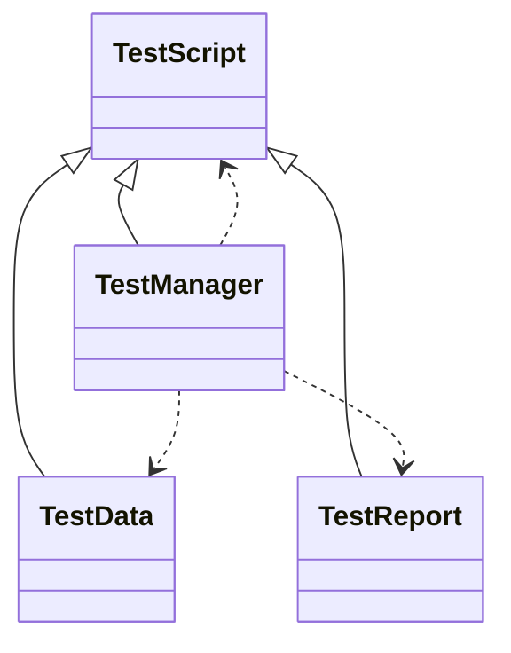

                 

# 构建高效的测试自动化体系

关键词：测试自动化、测试策略、工具和框架、流程设计与实施

摘要：本文旨在深入探讨构建高效测试自动化体系的方法和策略。我们将从核心概念出发，分析自动化测试的优势与挑战，设计并实施一个切实可行的自动化测试策略，选择合适的工具和框架，设计并实现一个自动化测试框架，最终通过实际案例展示最佳实践。

## 1. 引言

在软件开发的各个阶段中，测试是确保软件质量不可或缺的一环。随着软件复杂度和开发速度的不断增加，传统的手工测试逐渐暴露出效率低下、成本高昂等问题。测试自动化应运而生，成为提高软件质量和开发效率的重要手段。

### 1.1 什么是测试自动化

测试自动化指的是使用软件工具和脚本自动执行测试过程，包括测试用例的编写、执行、结果分析和报告生成等。通过自动化，可以减少人工操作，提高测试的覆盖率和效率，降低测试成本。

### 1.2 自动化的背景和动机

1. **软件复杂度增加**：现代软件系统功能日益复杂，传统手工测试难以满足全面测试的需求。
2. **测试重复性高**：许多测试用例具有高度重复性，自动化可以大幅减少重复劳动。
3. **提高测试效率**：自动化测试可以在短时间内执行大量测试用例，提高测试效率。
4. **降低成本**：自动化测试可以减少测试人员的工作量，降低人力成本。

### 1.3 目标和范围

本文的目标是探讨构建高效测试自动化体系的方法和策略，包括：

- 分析自动化测试的核心概念和优势。
- 设计和实施一个可行的自动化测试策略。
- 选择合适的测试工具和框架。
- 设计并实现一个自动化测试框架。
- 通过实际案例展示自动化测试的最佳实践。

本文的范围涵盖测试自动化的基础理论、设计实施策略、工具选择、框架设计以及实际应用案例。

## 2. 核心概念

### 2.1 自动化测试

自动化测试是一种通过软件工具和脚本自动执行测试用例的方法。它不仅包括测试用例的编写和执行，还包括测试结果的分析和报告生成。自动化测试可以大幅度提高测试的覆盖率和效率，降低测试成本。

### 2.2 测试用例

测试用例是测试过程中的基本单位，用于验证软件功能是否按照预期工作。每个测试用例包括输入条件、执行步骤、预期结果和实际结果。

### 2.3 自动化测试框架

自动化测试框架是一种组织和管理自动化测试的工具集，它提供了一套标准的流程和结构，使得自动化测试的编写、执行和维护更加容易。一个良好的自动化测试框架可以提高测试的效率和可维护性。

### 2.4 测试工具

测试工具是用于编写、执行和监控自动化测试的软件。常见的测试工具有Selenium、JUnit、TestNG、QTP等。

### 2.5 测试策略

测试策略是测试过程的总体规划和指导，它包括测试范围、测试方法、测试工具和资源分配等。

## 3. 测试自动化策略

### 3.1 设计自动化策略的步骤

1. **需求分析**：明确自动化测试的目标和范围。
2. **评估现有测试**：分析现有测试的可行性和自动化潜力。
3. **选择工具和框架**：根据需求选择合适的测试工具和框架。
4. **制定自动化计划**：确定自动化测试的实施步骤和时间表。
5. **培训与团队协作**：确保团队成员掌握自动化测试的技能。

### 3.2 自动化测试与手工测试的比较

#### 3.2.1 优点

- **效率高**：自动化测试可以快速执行大量测试用例。
- **成本低**：自动化测试可以减少人力成本。
- **覆盖全面**：自动化测试可以覆盖更多测试场景。

#### 3.2.2 缺点

- **前期投入大**：自动化测试需要一定的开发和维护成本。
- **可维护性要求高**：自动化测试代码需要不断维护和更新。
- **适用范围有限**：不是所有测试都适合自动化。

### 3.2.3 适用场景

- **重复性高**：例如回归测试、性能测试等。
- **回归频繁**：例如Web应用、移动应用等。
- **测试数据量大**：例如大数据应用、金融应用等。

## 4. 选择和实现自动化工具和框架

### 4.1 常见的测试工具和框架

- **Selenium**：适用于Web应用的自动化测试工具。
- **JUnit**：Java编写的单元测试框架。
- **TestNG**：Java编写的测试框架，提供了更多的功能和灵活性。
- **QTP**：适用于功能测试和回归测试的自动化测试工具。

### 4.2 选择工具和框架的考虑因素

- **测试类型**：不同类型的测试适合不同的工具和框架。
- **开发语言**：选择与项目开发语言兼容的工具和框架。
- **社区支持**：有良好社区支持的工具和框架更容易解决遇到的问题。
- **成本**：评估工具和框架的成本，包括购买、维护和培训等。

### 4.3 实现自动化工具和框架

- **环境搭建**：安装所需的测试工具和框架。
- **测试脚本编写**：根据测试用例编写自动化测试脚本。
- **执行测试**：运行自动化测试脚本，生成测试报告。

## 5. 设计测试自动化框架

### 5.1 测试自动化框架的组件

- **测试脚本**：用于执行测试的脚本。
- **测试数据**：测试过程中使用的数据。
- **测试报告**：测试执行结果和统计分析。
- **测试管理**：测试用例的管理和执行调度。

### 5.2 测试自动化框架的设计原则

- **可维护性**：框架应易于维护和更新。
- **可扩展性**：框架应支持添加新的测试用例和功能。
- **可重用性**：框架应提供可重用的测试组件。

### 5.3 测试自动化框架的设计

使用Mermaid绘制测试自动化框架的类图：



## 6. 实现测试自动化

### 6.1 实现自动化测试的步骤

- **需求分析**：明确自动化测试的需求。
- **测试用例设计**：编写详细的测试用例。
- **脚本编写**：根据测试用例编写自动化测试脚本。
- **执行测试**：运行自动化测试脚本。
- **结果分析**：分析测试结果，调整测试策略。

### 6.2 测试脚本编写

以下是一个简单的Python自动化测试脚本示例：

```python
import unittest

class TestLogin(unittest.TestCase):
    def test_login_success(self):
        # 测试成功登录
        result = login("username", "password")
        self.assertEqual(result, "登录成功")

    def test_login_failure(self):
        # 测试失败登录
        result = login("username", "wrong_password")
        self.assertEqual(result, "登录失败")

if __name__ == "__main__":
    unittest.main()
```

### 6.3 测试执行与结果分析

运行测试脚本，生成测试报告，分析测试结果，根据反馈调整测试策略。

## 7. 案例分析与最佳实践

### 7.1 案例分析

以某个电商网站为例，该网站使用了Selenium进行自动化测试。通过自动化测试，显著提高了测试效率，减少了测试成本，并且确保了关键功能的质量。

### 7.2 最佳实践

- **需求分析**：明确测试目标和范围，避免盲目自动化。
- **测试用例设计**：编写详细的测试用例，确保测试覆盖全面。
- **脚本编写**：编写可维护、可重用的测试脚本。
- **持续集成**：将自动化测试集成到持续集成流程中。
- **反馈与改进**：定期分析测试结果，根据反馈调整测试策略。

## 8. 结论

构建高效的测试自动化体系是提高软件质量和开发效率的关键。通过合理的测试策略、合适的工具和框架选择、以及良好的设计实践，可以实现自动化测试的高效运行。在实际项目中，应结合具体情况，灵活运用自动化测试方法，不断提升软件质量。

## 9. 拓展阅读

- 《软件测试的艺术》
- 《自动化测试实战》
- 《Selenium WebDriver自动化测试实战》

## 10. 作者信息

作者：AI天才研究院/AI Genius Institute & 禅与计算机程序设计艺术 /Zen And The Art of Computer Programming

