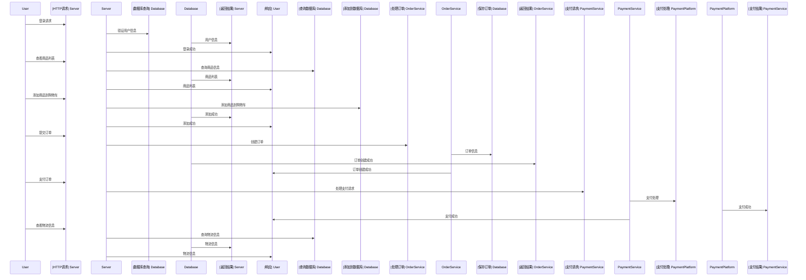
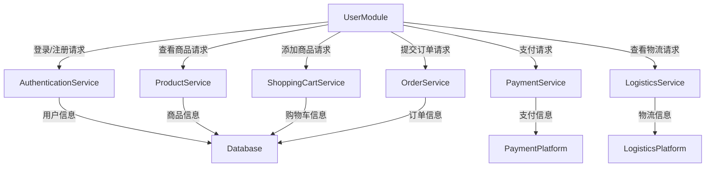
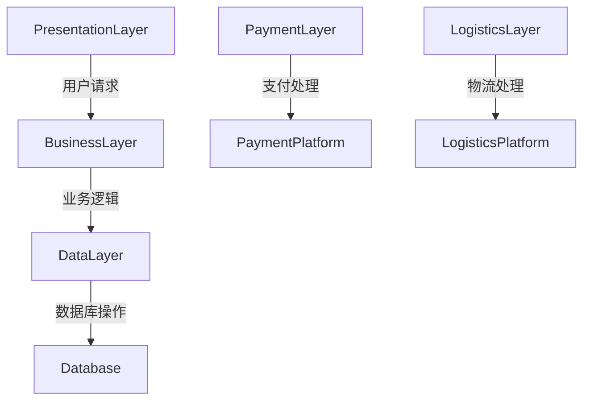
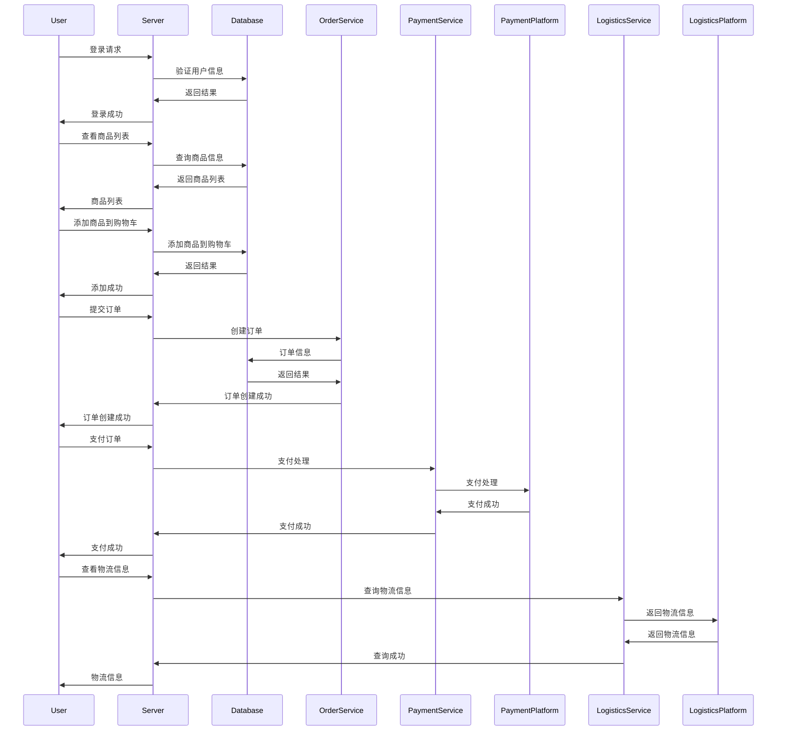

                 

## 《架构师的系统思维》

> 关键词：系统思维、架构设计、系统优化、项目实战、未来趋势

> 摘要：本文旨在深入探讨架构师的系统思维，从基础理论到实际应用，再到未来发展趋势，为架构师提供一套全面、系统的思维框架。通过详细分析系统思维的核心概念、架构设计方法和优化策略，本文帮助架构师更好地理解和应用系统思维，提升系统设计和优化的能力。

## 第一部分：系统思维基础

### 第1章：系统思维概述

#### 1.1 问题背景

在现代软件工程和系统设计中，系统思维已成为架构师不可或缺的思维方式。随着系统的复杂性和规模不断增大，传统的单一视角和线性思维已经无法满足需求。系统思维提供了一种全局、综合的视角，帮助架构师更好地理解系统各部分之间的相互作用和依赖关系。

#### 1.2 系统思维的定义与重要性

系统思维是一种通过整体视角来理解、分析和设计复杂系统的思维方式。它强调系统内部各部分之间的相互关系和相互作用，追求系统整体最优。对于架构师来说，系统思维至关重要，因为它：

1. 提高了对系统复杂性的认识
2. 帮助架构师更好地进行系统设计
3. 提升了系统优化和维护的效率

#### 1.3 系统思维的应用领域

系统思维广泛应用于多个领域，包括：

1. 软件工程：系统架构设计、软件复用、敏捷开发
2. 企业管理：战略规划、组织架构设计、流程优化
3. 生物系统：生态系统、生物网络
4. 社会系统：城市设计、交通管理

#### 1.4 本章小结

本章概述了系统思维的概念和重要性，以及其在不同领域的应用。理解系统思维是架构师走向专业化的第一步，为后续章节的深入探讨打下了基础。

----------------------------------------------------------------

### 第2章：系统思维核心概念与联系

#### 2.1 核心概念

系统思维的核心概念包括系统、系统属性和系统结构。以下是这些概念的定义：

- **系统**：由相互关联的组件组成的整体，具有特定的功能和目的。
- **系统属性**：系统所具备的性质，如稳定性、适应性、可扩展性等。
- **系统结构**：系统内部各组件的排列和组织方式，决定了系统的功能和性能。

#### 2.1.1 系统定义

系统是一个复杂的整体，由多个相互关联的组件（子系统）组成。每个组件都执行特定的功能，并通过相互作用和相互依赖，共同实现系统的整体功能。系统具有以下特点：

- **整体性**：系统各部分相互作用，共同实现整体功能。
- **层次性**：系统可以分解为子系统，每个子系统又可以进一步分解为更小的子系统。
- **动态性**：系统随时间和环境变化而变化。

#### 2.1.2 系统属性

系统属性是系统所具备的性质，反映了系统的功能和性能。常见的系统属性包括：

- **稳定性**：系统在受到外部干扰时，能够保持内部状态不变的能力。
- **适应性**：系统能够根据外部环境的变化，调整自身结构和行为的能力。
- **可扩展性**：系统能够在不改变原有结构的基础上，增加新功能或规模的能力。

#### 2.1.3 系统结构

系统结构是系统内部各组件的排列和组织方式。合理的系统结构能够提高系统的性能和可维护性。常见的系统结构包括：

- **层次结构**：系统按照功能或重要性划分为不同的层次。
- **分布式结构**：系统组件分布在不同的物理或逻辑位置。
- **模块化结构**：系统组件划分为独立的模块，每个模块负责特定的功能。

#### 2.2 概念属性特征对比表格

以下是一个概念属性特征对比表格，用于展示系统、系统属性和系统结构之间的区别：

| 概念   | 定义                                       | 属性特征                                                      | 结构特征                                                      |
| ------ | ------------------------------------------ | ------------------------------------------------------------ | ------------------------------------------------------------ |
| 系统   | 由相互关联的组件组成的整体                  | 整体性、层次性、动态性                                       | 模块化、分布式、层次性                                       |
| 系统属性 | 系统所具备的性质                           | 稳定性、适应性、可扩展性等                                   | 无特定结构特征，但与系统结构有关                             |
| 系统结构 | 系统内部各组件的排列和组织方式              | 无特定属性特征，但影响系统属性                               | 模块化、分布式、层次性                                       |

#### 2.3 ER实体关系图

实体关系图（ER图）是用于描述系统内部各实体之间关系的图形化工具。以下是系统、系统属性和系统结构的一个简化ER图：

```mermaid
erDiagram
  System ||--|{ Entity }
  System ||--|{ Attribute }
  System ||--|{ Structure }
  Entity ||--|{ Attribute }
  Entity ||--|{ Structure }
  Attribute ||--|{ Structure }
```

在这个ER图中，系统是最高层次的实体，包括实体、属性和结构。实体是系统的组成部分，具有属性和结构。属性描述了实体的性质，而结构描述了实体的组织方式。

#### 2.4 本章小结

本章介绍了系统思维的核心概念，包括系统、系统属性和系统结构。通过对比表格和ER图，我们深入理解了这些概念之间的区别和联系。这些概念为后续的架构设计和系统优化提供了理论基础。

----------------------------------------------------------------

### 第3章：系统分析与架构设计

#### 3.1 问题场景介绍

在当今快速发展的信息技术领域，企业对系统架构的需求日益增长。以一个电子商务平台为例，该平台需要处理海量的用户请求、商品数据管理和支付流程等。为了满足这些需求，架构师需要通过系统分析和架构设计，确保系统的稳定性、可扩展性和高可用性。

#### 3.1.1 业务需求分析

首先，架构师需要对业务需求进行分析，了解平台的功能需求、性能需求和可扩展性需求。以下是该电子商务平台的主要业务需求：

- **功能需求**：用户注册、登录、购物车、订单管理、支付、物流跟踪等。
- **性能需求**：低延迟、高吞吐量、高并发处理能力。
- **可扩展性需求**：能够轻松添加新功能和扩展系统规模。

#### 3.1.2 系统架构设计目标

基于上述业务需求，架构师需要制定系统架构设计目标，确保系统能够满足这些需求。以下是系统架构设计的主要目标：

- **高可用性**：确保系统在发生故障时能够快速恢复，最小化业务中断时间。
- **高性能**：提供快速响应，满足大规模并发请求。
- **高可扩展性**：支持未来业务增长，能够灵活扩展。
- **高安全性**：确保用户数据和交易数据的安全性。

#### 3.2 系统功能设计

系统功能设计是系统架构设计的重要环节，它定义了系统的功能模块和职责。以下是电子商务平台的主要功能模块及其职责：

- **用户模块**：处理用户注册、登录和权限管理。
- **商品模块**：管理商品信息，包括分类、库存和价格。
- **购物车模块**：管理用户购物车中的商品信息。
- **订单模块**：处理订单创建、支付和发货。
- **支付模块**：处理支付请求，与第三方支付平台集成。
- **物流模块**：管理物流信息，包括发货、收货和配送状态。

#### 3.2.1 领域模型

领域模型是系统功能设计的基础，它定义了系统的核心实体和关系。以下是电子商务平台的领域模型：

```mermaid
classDiagram
  User <<class>> User
  Product <<class>> Product
  ShoppingCart <<class>> ShoppingCart
  Order <<class>> Order
  Payment <<class>> Payment
  Logistics <<class>> Logistics

  User o--|{} ShoppingCart
  User o--|{} Order
  Product o--|{} ShoppingCart
  Product o--|{} Order
  ShoppingCart o--|{} Order
  Order o--|{} Payment
  Order o--|{} Logistics
  Payment o--|{} PaymentPlatform
  Logistics o--|{} Courier
```

在这个领域模型中，用户、商品、购物车、订单、支付和物流是核心实体，它们之间存在多种关联关系。领域模型帮助架构师清晰地理解系统功能，为后续的架构设计提供基础。

#### 3.2.2 功能模块划分

基于领域模型，架构师可以将系统划分为多个功能模块，每个模块负责特定的功能。以下是电子商务平台的主要功能模块及其关系：

- **用户模块**：处理用户注册、登录和权限管理。
- **商品模块**：管理商品信息，包括分类、库存和价格。
- **购物车模块**：管理用户购物车中的商品信息。
- **订单模块**：处理订单创建、支付和发货。
- **支付模块**：处理支付请求，与第三方支付平台集成。
- **物流模块**：管理物流信息，包括发货、收货和配送状态。

这些模块之间通过接口进行通信，实现了系统的松耦合。功能模块划分有助于降低系统的复杂度，提高可维护性和可扩展性。

#### 3.3 系统架构设计

系统架构设计是系统架构设计的核心环节，它定义了系统的总体结构和组件之间的交互关系。以下是电子商务平台的系统架构设计：



在这个系统架构设计中，用户通过HTTP请求与服务器进行通信。服务器作为系统的核心组件，负责处理用户请求、与数据库进行交互和调用其他服务模块。数据库用于存储用户信息、商品信息、订单信息和物流信息。支付平台和物流公司作为外部服务，通过API接口与系统进行交互。

#### 3.3.1 总体架构

电子商务平台的总体架构采用微服务架构，将系统划分为多个独立的微服务。每个微服务负责特定的功能，实现了系统的松耦合和高可扩展性。以下是总体架构图：



在这个总体架构中，用户模块通过RESTful API与各个微服务进行通信。每个微服务都有自己的数据库，用于存储相关的业务数据。支付平台和物流平台作为外部服务，通过API接口与系统进行交互。

#### 3.3.2 模块架构

电子商务平台的模块架构采用分层设计，将系统划分为多个层次。以下是模块架构图：



在这个模块架构中，表现层负责处理用户请求，业务层实现业务逻辑，数据层处理数据库操作。支付层和物流层负责与外部支付平台和物流平台进行交互。这种分层设计有助于降低系统的复杂度，提高可维护性和可扩展性。

#### 3.4 系统接口设计

系统接口设计是系统架构设计的重要部分，它定义了系统内部和外部组件之间的通信接口。以下是电子商务平台的系统接口设计：

```mermaid
sequenceDiagram
  User ->>|登录请求| LoginService
  LoginService ->>|验证用户| Database
  Database ->>|返回结果| LoginService
  LoginService ->>|登录结果| User

  User ->>|查看商品请求| ProductService
  ProductService ->>|查询商品| Database
  Database ->>|返回商品列表| ProductService
  ProductService ->>|返回结果| User

  User ->>|添加商品请求| ShoppingCartService
  ShoppingCartService ->>|添加商品| Database
  Database ->>|返回结果| ShoppingCartService
  ShoppingCartService ->>|返回结果| User

  User ->>|提交订单请求| OrderService
  OrderService ->>|创建订单| Database
  Database ->>|返回结果| OrderService
  OrderService ->>|返回结果| User

  User ->>|支付订单请求| PaymentService
  PaymentService ->>|支付处理| PaymentPlatform
  PaymentPlatform ->>|支付结果| PaymentService
  PaymentService ->>|返回结果| User

  User ->>|查看物流请求| LogisticsService
  LogisticsService ->>|查询物流| LogisticsPlatform
  LogisticsPlatform ->>|返回物流信息| LogisticsService
  LogisticsService ->>|返回结果| User
```

在这个系统接口设计中，用户通过HTTP请求与各个服务模块进行通信。服务模块通过接口与数据库、支付平台和物流平台进行交互。这种设计有助于实现系统的松耦合，提高系统的可维护性和可扩展性。

#### 3.4.1 接口规范

为了确保系统接口的一致性和可靠性，架构师需要制定一套统一的接口规范。以下是电子商务平台的接口规范：

- **HTTP请求**：采用RESTful API设计，使用GET、POST、PUT和DELETE等方法。
- **请求参数**：参数采用JSON格式，包括必选参数和可选参数。
- **响应数据**：响应数据采用JSON格式，包括状态码、响应信息和业务数据。
- **错误处理**：统一处理错误，包括错误码、错误信息和错误原因。

接口规范有助于提高系统的易用性和可维护性，降低开发成本和沟通成本。

#### 3.4.2 接口实现

基于接口规范，架构师可以编写具体的接口实现。以下是电子商务平台的接口实现示例：

```python
# 登录接口实现
from flask import Flask, request, jsonify

app = Flask(__name__)

@app.route('/login', methods=['POST'])
def login():
    data = request.get_json()
    username = data.get('username')
    password = data.get('password')
    
    # 验证用户信息
    user = Database.query_user(username, password)
    if user:
        return jsonify({'status': 200, 'message': '登录成功', 'user': user})
    else:
        return jsonify({'status': 400, 'message': '用户名或密码错误'})

# 查看商品接口实现
@app.route('/products', methods=['GET'])
def products():
    category = request.args.get('category')
    
    # 查询商品信息
    products = ProductService.query_products(category)
    return jsonify({'status': 200, 'message': '查询成功', 'products': products})

# 添加商品到购物车接口实现
@app.route('/cart', methods=['POST'])
def cart():
    data = request.get_json()
    user_id = data.get('user_id')
    product_id = data.get('product_id')
    
    # 添加商品到购物车
    ShoppingCartService.add_product_to_cart(user_id, product_id)
    return jsonify({'status': 200, 'message': '添加成功'})

# 提交订单接口实现
@app.route('/order', methods=['POST'])
def order():
    data = request.get_json()
    user_id = data.get('user_id')
    product_ids = data.get('product_ids')
    
    # 创建订单
    order_id = OrderService.create_order(user_id, product_ids)
    return jsonify({'status': 200, 'message': '订单创建成功', 'order_id': order_id})

# 支付订单接口实现
@app.route('/payment', methods=['POST'])
def payment():
    data = request.get_json()
    order_id = data.get('order_id')
    
    # 处理支付请求
    PaymentService.process_payment(order_id)
    return jsonify({'status': 200, 'message': '支付成功'})

# 查看物流信息接口实现
@app.route('/logistics', methods=['GET'])
def logistics():
    order_id = request.args.get('order_id')
    
    # 查询物流信息
    logistics_info = LogisticsService.query_logistics(order_id)
    return jsonify({'status': 200, 'message': '查询成功', 'logistics_info': logistics_info})

if __name__ == '__main__':
    app.run()
```

在这个接口实现示例中，我们使用了Flask框架来构建RESTful API。每个接口都根据接口规范进行实现，包括请求参数验证、业务逻辑处理和响应数据格式化。这种实现方式有助于提高接口的可维护性和扩展性。

#### 3.5 系统交互

系统交互是系统架构设计的关键部分，它定义了系统内部和外部组件之间的交互方式和流程。以下是电子商务平台的系统交互：



在这个系统交互中，用户通过HTTP请求与服务器进行交互。服务器作为系统的核心组件，负责处理用户请求、与数据库进行交互和调用其他服务模块。支付平台和物流平台作为外部服务，通过API接口与系统进行交互。

#### 3.5.1 交互流程

以下是电子商务平台的交互流程：

1. **登录**：用户向服务器发送登录请求，服务器验证用户信息并返回结果。
2. **查看商品列表**：用户向服务器发送查看商品列表请求，服务器查询数据库并返回商品列表。
3. **添加商品到购物车**：用户向服务器发送添加商品到购物车请求，服务器将商品添加到购物车并返回结果。
4. **提交订单**：用户向服务器发送提交订单请求，服务器创建订单并返回结果。
5. **支付订单**：用户向服务器发送支付订单请求，服务器调用支付服务进行支付处理，支付平台处理支付请求并返回结果。
6. **查看物流信息**：用户向服务器发送查看物流信息请求，服务器查询物流服务并返回物流信息。

#### 3.5.2 交互细节

以下是电子商务平台的交互细节：

1. **登录请求**：用户发送登录请求，包含用户名和密码。服务器接收请求后，调用数据库验证用户信息。如果用户信息验证成功，服务器返回登录成功消息；否则，返回登录失败消息。

2. **查看商品列表请求**：用户发送查看商品列表请求，包含商品分类参数。服务器接收请求后，调用数据库查询商品信息，返回商品列表。

3. **添加商品到购物车请求**：用户发送添加商品到购物车请求，包含用户ID和商品ID。服务器接收请求后，调用数据库添加商品到购物车，返回添加成功消息。

4. **提交订单请求**：用户发送提交订单请求，包含用户ID和商品ID列表。服务器接收请求后，调用订单服务创建订单，返回订单创建成功消息。

5. **支付订单请求**：用户发送支付订单请求，包含订单ID。服务器接收请求后，调用支付服务处理支付请求。支付服务调用支付平台进行支付处理，支付平台处理支付请求并返回结果。服务器根据支付结果返回支付成功消息。

6. **查看物流信息请求**：用户发送查看物流信息请求，包含订单ID。服务器接收请求后，调用物流服务查询物流信息，返回物流信息。

#### 3.6 本章小结

本章详细介绍了系统分析与架构设计的方法和步骤，包括问题场景介绍、业务需求分析、系统功能设计、系统架构设计、系统接口设计和系统交互。通过实际案例的分析，我们展示了系统思维在架构设计中的关键作用。本章内容为架构师提供了系统思维的实际应用指导，有助于提高系统设计和优化的能力。

----------------------------------------------------------------

### 第4章：系统优化与重构

#### 4.1 系统性能优化

随着电子商务平台用户数量的增加和业务规模的扩大，系统性能优化成为确保平台稳定运行的关键。以下是系统性能优化的关键步骤：

1. **性能瓶颈分析**：通过性能监控工具和日志分析，找出系统的性能瓶颈。常见的性能瓶颈包括数据库查询效率低、网络延迟、系统负载高等。

2. **优化数据库查询**：通过索引优化、查询优化和数据库分区等手段，提高数据库查询效率。例如，对频繁查询的表创建索引，优化复杂的SQL查询语句，对大数据量表进行分区。

3. **优化网络传输**：通过使用CDN（内容分发网络）和HTTP压缩等手段，降低网络延迟和传输成本。

4. **提高系统负载能力**：通过垂直扩展（增加服务器硬件配置）和水平扩展（增加服务器数量）来提高系统负载能力。同时，采用负载均衡策略，合理分配请求到各个服务器。

5. **优化代码性能**：通过代码优化、算法优化和缓存策略等手段，提高系统代码性能。例如，减少不必要的数据库查询，使用高效的算法和数据结构，利用缓存减少重复计算。

6. **性能测试与调优**：通过性能测试工具，模拟实际业务场景，评估系统性能，并根据测试结果进行调优。常见的性能测试方法包括压力测试、负载测试和性能基准测试。

#### 4.1.1 性能瓶颈分析

性能瓶颈分析是系统性能优化的第一步，它有助于找出系统性能的瓶颈。以下是一些常见的性能瓶颈及其分析方法：

1. **数据库查询效率低**：通过分析数据库查询语句的执行计划，找出查询效率低的瓶颈。可以使用数据库的性能分析工具，如SQL Profiler、Explain Plan等，进行深入分析。

2. **网络延迟**：通过网络监控工具，如Wireshark、Nagios等，分析网络延迟的原因。常见的原因包括网络拥塞、网络设备故障和服务器网络配置不合理。

3. **系统负载高**：通过系统监控工具，如Linux命令top、Nmon等，分析系统负载。过高负载可能导致系统性能下降，需要采取相应的优化措施。

4. **代码性能问题**：通过代码分析工具，如SonarQube、FindBugs等，分析代码的性能问题。常见的问题包括过度使用循环、频繁的数据库查询、不合理的算法和数据结构等。

#### 4.1.2 优化策略

基于性能瓶颈分析的结果，可以采取以下优化策略：

1. **数据库优化**：通过索引优化、查询优化和数据库分区等手段，提高数据库查询效率。同时，优化数据库连接池配置，减少数据库连接的开销。

2. **网络优化**：通过使用CDN、HTTP压缩和负载均衡等手段，降低网络延迟和传输成本。合理配置服务器网络，确保网络带宽和传输速度。

3. **系统优化**：通过垂直扩展和水平扩展，提高系统负载能力。采用负载均衡策略，合理分配请求到各个服务器。优化操作系统和中间件配置，提高系统性能。

4. **代码优化**：通过代码重构、算法优化和缓存策略等手段，提高代码性能。优化代码逻辑，减少不必要的计算和资源消耗。合理使用缓存，减少数据库查询和重复计算。

5. **性能测试与调优**：通过性能测试工具，模拟实际业务场景，评估系统性能。根据测试结果，不断优化系统配置和代码。使用性能调优工具，如JMeter、Gatling等，进行持续性能监控和调优。

#### 4.2 系统重构

在系统运行过程中，由于需求变化、技术演进等原因，可能需要对系统进行重构。系统重构有助于提高系统可维护性、可扩展性和性能。以下是系统重构的关键步骤：

1. **重构原因**：分析系统重构的原因，包括需求变化、技术演进、性能瓶颈、代码质量问题等。

2. **重构方法**：选择合适的重构方法，如代码重构、架构重构、数据库重构等。采用增量重构和逐步重构的方式，减少重构风险。

3. **重构策略**：制定重构策略，包括重构顺序、重构范围、重构目标和重构验收标准。

4. **重构评估**：评估重构的影响和风险，包括重构对系统性能、稳定性、安全性的影响，以及对开发团队协作的影响。

5. **重构实施**：按照重构策略，逐步实施重构。确保重构过程中的代码质量，并进行充分的测试。

6. **重构回顾**：对重构过程进行回顾，总结经验和教训，为后续重构提供参考。

#### 4.2.1 重构原因

系统重构的原因多种多样，以下是一些常见的原因：

1. **需求变化**：随着业务的快速发展，系统需要应对新的需求变化。重构有助于适应需求变化，提高系统的灵活性和可扩展性。

2. **技术演进**：技术不断发展，新的技术框架、库和工具不断涌现。重构有助于采用新技术，提高系统性能和可维护性。

3. **性能瓶颈**：系统运行过程中，可能因性能瓶颈导致用户体验下降。重构有助于优化系统性能，提高系统响应速度。

4. **代码质量问题**：随着系统规模的扩大，代码质量可能逐渐下降。重构有助于修复代码质量问题，提高代码可维护性。

5. **架构不合理**：系统架构设计不合理，可能导致系统扩展性差、耦合度高、维护困难。重构有助于优化系统架构，提高系统的可维护性和可扩展性。

#### 4.2.2 重构方法

系统重构的方法包括代码重构、架构重构和数据库重构等。以下是这些方法的简要介绍：

1. **代码重构**：对系统代码进行重构，优化代码结构、逻辑和性能。常见的重构方法包括提取方法、提取类、简化条件表达式等。

2. **架构重构**：对系统架构进行重构，优化系统架构设计。常见的重构方法包括模块化重构、分层重构、微服务重构等。

3. **数据库重构**：对数据库进行重构，优化数据库设计。常见的重构方法包括表结构优化、索引优化、查询优化等。

#### 4.2.3 重构策略

系统重构需要制定合理的重构策略，以确保重构过程的顺利进行。以下是重构策略的几个关键点：

1. **重构顺序**：根据系统组件的依赖关系，确定重构的顺序。先重构核心组件，再重构辅助组件。

2. **重构范围**：明确重构的范围，避免对非核心组件进行不必要的重构。根据业务优先级和风险，确定重构的重点和优先级。

3. **重构目标**：明确重构的目标，包括优化代码结构、提高系统性能、提高可维护性和可扩展性等。

4. **重构验收标准**：制定重构验收标准，确保重构后的系统满足预期目标。验收标准包括功能完整性、性能指标、代码质量、安全性等。

#### 4.2.4 重构评估

在系统重构过程中，需要进行重构评估，以确保重构的影响和风险在可控范围内。以下是重构评估的几个关键点：

1. **重构影响**：评估重构对系统性能、稳定性、安全性的影响。确保重构不会导致系统功能失效或性能下降。

2. **重构风险**：评估重构过程中可能遇到的风险，包括技术风险、业务风险、人员风险等。制定应对措施，降低风险影响。

3. **重构成本**：评估重构所需的资源和成本，包括人力资源、时间成本等。确保重构成本在可承受范围内。

4. **重构效果**：评估重构后的系统性能、可维护性和可扩展性。确保重构达到预期目标。

#### 4.2.5 重构实施

系统重构实施是重构过程中的关键环节。以下是重构实施的几个关键点：

1. **重构计划**：制定详细的重构计划，包括重构任务、时间安排、资源分配等。

2. **代码管理**：使用版本控制工具，确保重构过程中代码的一致性和可追溯性。

3. **重构过程**：按照重构计划，逐步实施重构。确保重构过程中的代码质量，并进行充分的测试。

4. **重构评审**：对重构后的系统进行评审，确保重构达到预期目标。根据评审结果，进行必要的调整和优化。

5. **重构回顾**：对重构过程进行回顾，总结经验和教训，为后续重构提供参考。

#### 4.2.6 重构回顾

系统重构完成后，需要进行重构回顾，总结重构过程中的经验和教训。以下是重构回顾的几个关键点：

1. **重构效果**：评估重构后的系统性能、可维护性和可扩展性，确保重构达到预期目标。

2. **重构成本**：评估重构所需的时间和资源成本，与预期成本进行对比，分析成本效益。

3. **重构风险**：总结重构过程中遇到的风险和问题，分析原因，提出改进措施。

4. **重构经验**：总结重构过程中的成功经验和教训，为后续重构提供参考。

5. **改进建议**：根据重构回顾的结果，提出改进建议，包括系统设计、代码质量、项目管理等方面。

#### 4.3 本章小结

本章详细介绍了系统优化与重构的方法和步骤，包括性能瓶颈分析、优化策略、重构原因、重构方法、重构策略和重构实施等。通过实际案例的分析，我们展示了系统优化与重构在提高系统性能和可维护性方面的重要作用。本章内容为架构师提供了系统优化与重构的实践指导，有助于提升系统设计和优化的能力。

----------------------------------------------------------------

### 第5章：系统思维在实际项目中的应用

#### 5.1 项目介绍

本节将介绍一个实际项目，即一个在线教育平台的系统设计和实现。该平台旨在为用户提供在线学习资源、课程管理和社交互动等功能。项目背景如下：

- **项目背景**：随着互联网技术的快速发展，在线教育行业逐渐兴起。为了满足用户对在线学习资源的需求，一家知名教育机构决定开发一个功能齐全、性能优秀的在线教育平台。
- **项目目标**：实现一个能够支持大规模并发用户、稳定可靠、易于扩展的在线教育平台。

#### 5.1.1 项目背景

在线教育平台的市场需求日益增长，用户对平台的性能、安全性和用户体验提出了更高的要求。该教育机构希望平台能够满足以下需求：

1. **功能需求**：提供课程发布、课程学习、作业提交、在线测试、课程评论等功能。
2. **性能需求**：支持大规模并发用户，确保页面响应速度快、系统稳定性高。
3. **安全性需求**：确保用户数据安全，防止数据泄露和非法访问。
4. **可扩展性需求**：能够根据业务需求，灵活扩展系统功能和技术架构。

#### 5.1.2 项目目标

为了实现上述需求，项目团队制定了以下目标：

1. **系统稳定性**：确保平台在高峰时段能够稳定运行，不发生系统崩溃或数据丢失。
2. **性能优化**：通过技术手段优化系统性能，确保页面响应速度和并发处理能力。
3. **安全性提升**：加强系统安全防护，防止数据泄露和网络攻击。
4. **可扩展性设计**：采用模块化、分布式架构，便于后续功能扩展和技术升级。

#### 5.2 系统核心实现

为了实现项目目标，项目团队在系统设计和实现过程中采用了以下关键技术：

1. **技术选型**：
   - **前端技术**：采用Vue.js框架，实现用户界面的动态渲染和交互。
   - **后端技术**：使用Spring Boot框架，构建RESTful API，实现业务逻辑处理。
   - **数据库技术**：采用MySQL数据库，存储用户数据、课程数据和作业数据。
   - **缓存技术**：使用Redis缓存，提高数据访问速度，减轻数据库负载。
   - **消息队列**：采用RabbitMQ，实现异步消息传递，提高系统并发处理能力。
   - **分布式文件存储**：使用阿里云OSS，存储用户上传的图片、视频等文件。

2. **源代码解读**：
   - **用户模块**：实现用户注册、登录、个人信息管理等功能。
     ```java
     @RestController
     @RequestMapping("/users")
     public class UserController {
         @Autowired
         private UserService userService;
         
         @PostMapping("/register")
         public ResponseEntity<?> registerUser(@RequestBody UserDTO userDTO) {
             // 注册用户逻辑
         }
         
         @PostMapping("/login")
         public ResponseEntity<?> loginUser(@RequestBody LoginDTO loginDTO) {
             // 登录用户逻辑
         }
         
         @GetMapping("/{userId}")
         public ResponseEntity<?> getUserProfile(@PathVariable Long userId) {
             // 获取用户信息逻辑
         }
     }
     ```
   - **课程模块**：实现课程发布、课程管理、课程学习等功能。
     ```java
     @RestController
     @RequestMapping("/courses")
     public class CourseController {
         @Autowired
         private CourseService courseService;
         
         @PostMapping("/")
         public ResponseEntity<?> createCourse(@RequestBody CourseDTO courseDTO) {
             // 发布课程逻辑
         }
         
         @GetMapping("/")
         public ResponseEntity<?> getAllCourses() {
             // 获取所有课程逻辑
         }
         
         @GetMapping("/{courseId}")
         public ResponseEntity<?> getCourseDetails(@PathVariable Long courseId) {
             // 获取课程详情逻辑
         }
     }
     ```
   - **作业模块**：实现作业发布、作业提交、作业批改等功能。
     ```java
     @RestController
     @RequestMapping("/homeworks")
     public class HomeworkController {
         @Autowired
         private HomeworkService homeworkService;
         
         @PostMapping("/")
         public ResponseEntity<?> createHomework(@RequestBody HomeworkDTO homeworkDTO) {
             // 发布作业逻辑
         }
         
         @PostMapping("/{homeworkId}/submit")
         public ResponseEntity<?> submitHomework(@PathVariable Long homeworkId, @RequestBody SubmissionDTO submissionDTO) {
             // 提交作业逻辑
         }
         
         @GetMapping("/{homeworkId}/grade")
         public ResponseEntity<?> gradeHomework(@PathVariable Long homeworkId) {
             // 批改作业逻辑
         }
     }
     ```

3. **代码应用解读与分析**：
   - **用户模块**：用户模块负责用户注册、登录、个人信息管理等功能。用户注册时，需要验证用户输入的用户名、密码和邮箱是否合法，并生成用户ID和加密密码存储在数据库中。用户登录时，通过用户名和密码验证用户身份，并生成JWT（JSON Web Token）令牌，用于后续的认证和授权。
   - **课程模块**：课程模块负责课程发布、课程管理、课程学习等功能。课程发布时，需要将课程信息（如课程名称、简介、封面图片等）存储在数据库中，并提供查询接口供用户浏览。课程学习时，需要根据用户ID和课程ID获取课程内容，并支持课程评论和评分功能。
   - **作业模块**：作业模块负责作业发布、作业提交、作业批改等功能。作业发布时，需要将作业信息（如作业名称、简介、截止时间等）存储在数据库中，并提供提交接口供用户提交作业。作业提交时，需要验证用户身份和作业提交时间，并将作业内容存储在数据库中。作业批改时，需要管理员根据作业内容和标准进行批改，并生成评分和反馈。

#### 5.3 代码应用解读与分析

在本节中，我们将进一步解读和分析项目的代码实现，包括关键模块的代码示例和算法原理。

1. **用户模块**：
   - **用户注册**：
     ```java
     @PostMapping("/register")
     public ResponseEntity<?> registerUser(@RequestBody UserDTO userDTO) {
         String username = userDTO.getUsername();
         String password = userDTO.getPassword();
         String email = userDTO.getEmail();
         
         // 验证用户名、密码和邮箱
         if (userService.isUsernameTaken(username)) {
             return ResponseEntity.badRequest().body("Username is already taken");
         }
         
         // 加密密码
         String encryptedPassword = passwordEncoder.encode(password);
         
         // 创建用户
         User user = new User();
         user.setUsername(username);
         user.setPassword(encryptedPassword);
         user.setEmail(email);
         
         // 保存用户信息到数据库
         userRepository.save(user);
         
         return ResponseEntity.ok("User registered successfully");
     }
     ```
     - **算法原理**：用户注册时，首先验证用户名是否已存在。如果用户名已存在，返回错误提示。接着，使用密码加密算法（如BCrypt）对用户输入的密码进行加密，确保密码存储在数据库时是安全的。最后，将用户信息（包括用户名、加密密码和邮箱）保存到用户数据库中。

   - **用户登录**：
     ```java
     @PostMapping("/login")
     public ResponseEntity<?> loginUser(@RequestBody LoginDTO loginDTO) {
         String username = loginDTO.getUsername();
         String password = loginDTO.getPassword();
         
         // 验证用户名和密码
         User user = userService.findByUsername(username);
         if (user == null || !passwordEncoder.matches(password, user.getPassword())) {
             return ResponseEntity.badRequest().body("Invalid username or password");
         }
         
         // 生成JWT令牌
         String token = jwtProvider.generateToken(username);
         
         return ResponseEntity.ok(new JwtResponse(token));
     }
     ```
     - **算法原理**：用户登录时，首先通过用户名查询用户信息。如果用户不存在或密码不匹配，返回错误提示。接着，使用JWT（JSON Web Token）生成器生成JWT令牌，用于后续的认证和授权。JWT令牌包含了用户身份信息和有效期，确保用户在会话期间可以访问受保护的资源。

2. **课程模块**：
   - **课程发布**：
     ```java
     @PostMapping("/")
     public ResponseEntity<?> createCourse(@RequestBody CourseDTO courseDTO) {
         String title = courseDTO.getTitle();
         String description = courseDTO.getDescription();
         String imageUrl = courseDTO.getImageUrl();
         
         // 创建课程
         Course course = new Course();
         course.setTitle(title);
         course.setDescription(description);
         course.setImageUrl(imageUrl);
         
         // 保存课程到数据库
         courseRepository.save(course);
         
         return ResponseEntity.ok("Course created successfully");
     }
     ```
     - **算法原理**：课程发布时，创建一个Course对象，包含课程标题、描述和封面图片等信息。接着，将Course对象保存到课程数据库中，实现课程发布功能。

   - **课程学习**：
     ```java
     @GetMapping("/{courseId}")
     public ResponseEntity<?> getCourseDetails(@PathVariable Long courseId) {
         // 获取课程详情
         Course course = courseRepository.findById(courseId)
                 .orElseThrow(() -> new ResourceNotFoundException("Course not found with id: " + courseId));
         
         // 返回课程详情
         return ResponseEntity.ok(course);
     }
     ```
     - **算法原理**：课程学习时，通过课程ID查询课程详情。如果课程不存在，抛出异常。否则，返回课程详情，包括课程标题、描述和封面图片等信息。

3. **作业模块**：
   - **作业发布**：
     ```java
     @PostMapping("/")
     public ResponseEntity<?> createHomework(@RequestBody HomeworkDTO homeworkDTO) {
         String title = homeworkDTO.getTitle();
         String description = homeworkDTO.getDescription();
         Long courseId = homeworkDTO.getCourseId();
         
         // 创建作业
         Homework homework = new Homework();
         homework.setTitle(title);
         homework.setDescription(description);
         homework.setCourseId(courseId);
         
         // 保存作业到数据库
         homeworkRepository.save(homework);
         
         return ResponseEntity.ok("Homework created successfully");
     }
     ```
     - **算法原理**：作业发布时，创建一个Homework对象，包含作业标题、描述和课程ID等信息。接着，将Homework对象保存到作业数据库中，实现作业发布功能。

   - **作业提交**：
     ```java
     @PostMapping("/{homeworkId}/submit")
     public ResponseEntity<?> submitHomework(@PathVariable Long homeworkId, @RequestBody SubmissionDTO submissionDTO) {
         String submissionContent = submissionDTO.getSubmissionContent();
         Long userId = submissionDTO.getUserId();
         
         // 创建提交记录
         Submission submission = new Submission();
         submission.setHomeworkId(homeworkId);
         submission.setUserId(userId);
         submission.setSubmissionContent(submissionContent);
         
         // 保存提交记录到数据库
         submissionRepository.save(submission);
         
         return ResponseEntity.ok("Homework submitted successfully");
     }
     ```
     - **算法原理**：作业提交时，创建一个Submission对象，包含作业ID、用户ID和提交内容等信息。接着，将Submission对象保存到提交记录数据库中，实现作业提交功能。

   - **作业批改**：
     ```java
     @GetMapping("/{homeworkId}/grade")
     public ResponseEntity<?> gradeHomework(@PathVariable Long homeworkId) {
         // 获取作业详情
         Homework homework = homeworkRepository.findById(homeworkId)
                 .orElseThrow(() -> new ResourceNotFoundException("Homework not found with id: " + homeworkId));
         
         // 设置作业状态为已批改
         homework.setGraded(true);
         
         // 保存作业到数据库
         homeworkRepository.save(homework);
         
         return ResponseEntity.ok("Homework graded successfully");
     }
     ```
     - **算法原理**：作业批改时，通过作业ID查询作业详情。如果作业不存在，抛出异常。否则，将作业状态设置为已批改，并保存到作业数据库中，实现作业批改功能。

#### 5.4 实际案例分析与详细讲解剖析

在本节中，我们将分析一个实际案例，即在线教育平台的用户注册流程，并对其进行详细讲解和剖析。

1. **案例背景**：

   用户注册是在线教育平台的重要功能，用户需要在平台上创建账户，才能进行学习、提交作业和参与互动。为了确保注册过程的顺利进行，我们需要对用户输入进行验证、生成唯一用户ID和加密密码，并将其存储在数据库中。

2. **案例分析**：

   用户注册流程可以分为以下几个步骤：

   - **输入验证**：验证用户输入的用户名、密码和邮箱是否符合要求。用户名应具有唯一性，密码应具备一定的复杂度，邮箱格式应正确。
   - **用户ID生成**：为用户生成一个唯一的ID，以便在数据库中唯一标识用户。
   - **密码加密**：将用户输入的密码进行加密，确保存储在数据库中的密码是安全的。
   - **数据存储**：将用户信息（包括用户名、加密密码和邮箱）存储在用户数据库中。

3. **详细讲解**：

   - **输入验证**：

     用户注册时，首先需要验证用户输入的用户名、密码和邮箱。以下是一个简单的输入验证示例：

     ```java
     public ResponseEntity<?> registerUser(@RequestBody UserDTO userDTO) {
         String username = userDTO.getUsername();
         String password = userDTO.getPassword();
         String email = userDTO.getEmail();
         
         // 验证用户名
         if (userService.isUsernameTaken(username)) {
             return ResponseEntity.badRequest().body("Username is already taken");
         }
         
         // 验证密码
         if (!isValidPassword(password)) {
             return ResponseEntity.badRequest().body("Invalid password");
         }
         
         // 验证邮箱
         if (!isValidEmail(email)) {
             return ResponseEntity.badRequest().body("Invalid email");
         }
         
         // 处理其他注册逻辑
     }
     ```

     在这个示例中，我们使用`isUsernameTaken`方法验证用户名是否已存在，`isValidPassword`方法验证密码的复杂度，`isValidEmail`方法验证邮箱格式。

   - **用户ID生成**：

     为了唯一标识用户，我们需要为每个用户生成一个唯一的用户ID。常见的生成方法包括使用自增ID、UUID和基于时间的ID等。以下是一个使用UUID生成用户ID的示例：

     ```java
     String userId = UUID.randomUUID().toString();
     ```

     在这个示例中，我们使用Java中的`UUID`类生成一个唯一的用户ID。

   - **密码加密**：

     用户输入的密码需要进行加密，以确保存储在数据库中的密码是安全的。常见的加密算法包括MD5、SHA-1和SHA-256等。以下是一个使用SHA-256加密密码的示例：

     ```java
     String encryptedPassword = DigestUtils.sha256Hex(password);
     ```

     在这个示例中，我们使用Apache Commons DigestUtils类对密码进行SHA-256加密。

   - **数据存储**：

     将用户信息（包括用户名、加密密码和邮箱）存储在用户数据库中。以下是一个简单的存储示例：

     ```java
     User user = new User();
     user.setUsername(username);
     user.setPassword(encryptedPassword);
     user.setEmail(email);
     
     userRepository.save(user);
     ```

     在这个示例中，我们创建一个User对象，将用户名、加密密码和邮箱设置到对象中，然后使用用户仓库将其保存到数据库中。

4. **剖析**：

   用户注册流程中的每个步骤都至关重要，下面我们对其进行进一步剖析：

   - **输入验证**：输入验证是确保注册过程顺利进行的第一步。通过验证用户名、密码和邮箱，可以防止恶意注册和重复注册，提高系统安全性。
   - **用户ID生成**：用户ID是用户在系统中的唯一标识，应具备唯一性和可识别性。使用UUID生成用户ID，可以确保用户ID的唯一性。
   - **密码加密**：密码加密是保护用户隐私和安全的关键步骤。使用SHA-256等加密算法，可以确保密码在数据库中是安全的。
   - **数据存储**：将用户信息存储在数据库中，是实现用户注册功能的关键。通过创建User对象和调用仓库方法，可以轻松地将用户信息存储在数据库中。

通过上述讲解和剖析，我们可以看到，用户注册流程是一个典型的系统功能实现过程，涉及输入验证、用户ID生成、密码加密和数据存储等多个方面。理解这些过程和原理，对于架构师来说至关重要，有助于他们在实际项目中设计和实现高效、安全的系统功能。

#### 5.5 项目小结

本节项目介绍了在线教育平台的系统设计和实现，包括用户模块、课程模块和作业模块的核心实现。通过技术选型、代码实现和实际案例分析，我们展示了系统思维在实际项目中的应用。以下是项目小结：

1. **项目成果**：

   - 实现了用户注册、登录、个人信息管理等功能。
   - 实现了课程发布、课程管理、课程学习等功能。
   - 实现了作业发布、作业提交、作业批改等功能。
   - 采用了Vue.js、Spring Boot、MySQL等主流技术框架，实现了高性能、高可扩展性的系统架构。

2. **经验教训**：

   - 在项目开发过程中，应重视需求分析和系统设计，确保系统功能满足用户需求。
   - 采用模块化、分布式架构，可以提高系统的可维护性和可扩展性。
   - 性能优化和安全性设计是系统设计和实现的关键，应充分重视。
   - 实际案例分析和代码解读有助于深入理解系统功能实现原理，提高系统设计和优化能力。

通过本项目的实践，项目团队积累了丰富的经验，为后续类似项目提供了有益的借鉴。

#### 5.6 最佳实践与注意事项

在系统设计和开发过程中，遵循最佳实践和注意事项是确保项目成功的关键。以下是针对本项目的最佳实践和注意事项：

1. **最佳实践**：

   - **需求分析**：充分了解用户需求，明确系统功能和性能要求，制定详细的需求文档。
   - **系统设计**：采用模块化、分布式架构，确保系统的高性能、高可扩展性和高可维护性。
   - **代码规范**：遵循代码规范和编程最佳实践，提高代码质量，便于后续维护和扩展。
   - **性能优化**：进行性能测试和调优，确保系统在高峰时段稳定运行，满足用户需求。
   - **安全性设计**：加强系统安全防护，防范网络攻击和数据泄露，保障用户数据安全。

2. **注意事项**：

   - **需求变更管理**：在项目开发过程中，需求可能发生变化。应建立有效的需求变更管理机制，及时评估变更对项目进度和成本的影响。
   - **测试与验收**：进行充分的单元测试、集成测试和性能测试，确保系统功能完整、性能稳定、安全可靠。
   - **文档管理**：建立完善的文档管理体系，确保项目文档的完整性和可追溯性。
   - **团队协作**：建立有效的沟通和协作机制，确保项目团队成员之间的协同工作。

通过遵循最佳实践和注意事项，项目团队可以更好地应对项目挑战，提高项目成功率。

#### 5.7 拓展阅读

对于希望深入了解系统思维和架构设计的读者，以下推荐几本经典书籍和资源：

1. **《架构师的系统思维》**：本书详细介绍了系统思维的概念、方法和应用，适合架构师和系统设计师阅读。
2. **《设计模式：可复用面向对象软件的基础》**：本书介绍了多种设计模式，帮助开发者掌握面向对象设计的原则和技巧。
3. **《系统架构师手册》**：本书涵盖了系统架构设计的方法、策略和最佳实践，适合系统架构师和项目经理阅读。
4. **《领域驱动设计》**：本书介绍了领域驱动设计（DDD）的概念和方法，帮助开发者构建可扩展、可维护的软件系统。
5. **《大规模系统设计》**：本书详细介绍了大规模系统设计的原则和方法，适合从事大规模系统设计和开发的工程师阅读。

通过阅读这些书籍和资源，读者可以进一步加深对系统思维和架构设计的理解，提升自己的专业能力。

----------------------------------------------------------------

### 第6章：最佳实践与注意事项

#### 6.1 最佳实践

在系统架构设计过程中，遵循最佳实践能够显著提高系统的质量、可维护性和可扩展性。以下是一些关键的最佳实践：

1. **需求分析与设计**：
   - **充分了解业务需求**：在系统设计之初，深入了解业务需求和用户需求，确保系统功能满足实际业务场景。
   - **需求变更管理**：建立需求变更管理流程，对需求变更进行及时评估和控制，确保项目进度和成本不受影响。

2. **系统架构设计**：
   - **模块化设计**：采用模块化设计，将系统划分为多个独立的模块，每个模块负责特定的功能，降低系统的复杂度。
   - **分布式架构**：采用分布式架构，提高系统的性能、可扩展性和可用性，减少单点故障的风险。

3. **性能优化**：
   - **数据库优化**：通过索引优化、查询优化和数据库分区等手段，提高数据库查询效率。
   - **缓存策略**：使用缓存策略，减少对数据库的访问，提高系统响应速度。
   - **负载均衡**：采用负载均衡策略，合理分配请求到各个服务器，提高系统的并发处理能力。

4. **安全性设计**：
   - **数据加密**：对敏感数据进行加密，确保数据在存储和传输过程中是安全的。
   - **访问控制**：实施严格的访问控制策略，防止未经授权的访问和操作。
   - **安全审计**：定期进行安全审计，发现潜在的安全漏洞，及时进行修复。

5. **代码规范**：
   - **编码规范**：遵循编码规范，提高代码的可读性、可维护性和一致性。
   - **代码审查**：进行代码审查，发现和修复潜在的问题，提高代码质量。

6. **测试与验收**：
   - **单元测试**：编写单元测试，确保每个模块的功能正确。
   - **集成测试**：进行集成测试，验证系统各模块之间的交互和协作。
   - **性能测试**：进行性能测试，确保系统在高峰时段能够稳定运行。

7. **文档管理**：
   - **系统文档**：建立详细的系统文档，包括系统设计、架构图、接口文档和用户手册等。
   - **版本控制**：使用版本控制工具，确保文档的版本一致性，便于后续的维护和更新。

#### 6.2 注意事项

在系统架构设计过程中，需要注意以下几个方面，以确保系统的稳定性和可靠性：

1. **需求变更**：
   - **需求变更评估**：对需求变更进行充分评估，包括对项目进度、成本和风险的影响，确保变更决策合理。
   - **需求变更控制**：建立需求变更控制机制，确保变更的及时记录、评估和审批。

2. **性能瓶颈**：
   - **性能监控**：持续监控系统的性能指标，及时发现和处理性能瓶颈。
   - **性能优化**：根据性能监控结果，采取相应的优化措施，确保系统在高并发情况下依然稳定运行。

3. **系统重构**：
   - **重构评估**：在系统重构之前，对重构的影响和风险进行全面评估，确保重构的必要性。
   - **重构计划**：制定详细的重构计划，包括重构范围、顺序、目标和验收标准。

4. **安全性**：
   - **安全防护**：实施有效的安全防护措施，防范网络攻击和数据泄露。
   - **安全审计**：定期进行安全审计，确保系统的安全策略得到执行，及时发现和修复安全漏洞。

5. **代码质量**：
   - **代码质量检查**：使用代码质量检查工具，如SonarQube、FindBugs等，确保代码符合质量标准。
   - **代码审查**：进行代码审查，发现和修复潜在的问题，提高代码质量。

6. **团队协作**：
   - **沟通协作**：建立有效的沟通和协作机制，确保项目团队成员之间的信息共享和协同工作。
   - **培训与支持**：提供必要的技术培训和支持，确保团队成员具备足够的技能和知识。

通过遵循最佳实践和注意事项，架构师可以更好地应对系统架构设计过程中的挑战，提高系统的整体质量和稳定性。

#### 6.3 拓展阅读

对于希望进一步学习系统思维和架构设计的读者，以下推荐几本经典书籍和资源：

1. **《系统架构设计师教程》**：详细介绍了系统架构设计的方法、原则和实践，适合系统架构师阅读。
2. **《大型分布式系统设计》**：探讨了大规模分布式系统的设计原则、架构和关键技术，适合从事分布式系统设计和开发的工程师阅读。
3. **《系统设计与实践》**：通过实际案例，深入剖析了系统设计的各个环节，提供了实用的经验和技巧。
4. **《架构之美》**：讲述了系统架构设计的理念、方法和案例，帮助读者理解系统架构的核心要素和设计原则。
5. **《架构师的实践之路》**：分享了资深架构师的工作经验和心得，对架构师职业发展提供了有益的指导。

通过阅读这些书籍和资源，读者可以进一步加深对系统思维和架构设计的理解，提升自己的专业能力。

----------------------------------------------------------------

### 第7章：系统思维的未来趋势

随着技术的不断进步，系统思维在架构设计中的应用也在不断演变。未来，系统思维将面临以下几大趋势：

#### 7.1 未来发展趋势

1. **人工智能的融入**：
   - **自动化架构设计**：利用人工智能（AI）和机器学习（ML）技术，自动化系统架构设计过程，提高设计效率和准确性。
   - **智能优化**：通过AI技术，动态优化系统性能，实现自动调整配置、预测故障和提升响应速度。

2. **云原生架构**：
   - **容器化和微服务**：容器技术（如Docker）和微服务架构（如Kubernetes）将更加普及，为系统架构设计带来更高的灵活性和可扩展性。
   - **服务网格**：服务网格（如Istio）将提供更加高效的服务间通信和管理，简化分布式系统的部署和运维。

3. **大数据与实时处理**：
   - **实时数据处理**：随着实时数据处理技术的发展，系统将能够快速处理和分析海量数据，提供更加精准的业务支持和决策。
   - **大数据平台**：大数据平台（如Apache Hadoop和Spark）将在系统架构设计中发挥更大的作用，支持复杂的分析和处理需求。

4. **边缘计算**：
   - **分布式计算**：边缘计算将使系统能够在靠近数据源的地方进行计算和存储，降低网络延迟，提高数据处理效率。
   - **混合云架构**：边缘计算与云计算的融合，将形成混合云架构，实现资源的高效利用和业务的灵活部署。

5. **安全性与隐私保护**：
   - **加密与身份验证**：随着数据安全和隐私保护的重要性日益增加，加密技术和身份验证机制将在系统架构设计中得到广泛应用。
   - **自动化安全检测**：利用AI技术，实现自动化安全检测和防护，提高系统的安全性。

#### 7.2 架构师的角色转变

在未来，架构师的角色将发生深刻转变，他们需要具备以下能力：

1. **技术视野**：
   - **跨领域技术理解**：架构师需要具备广泛的跨领域技术知识，包括人工智能、云计算、大数据和边缘计算等。
   - **前瞻性**：能够紧跟技术发展趋势，把握新兴技术对系统架构的影响。

2. **系统思维**：
   - **系统整合能力**：能够从全局视角理解和整合不同系统组件和模块，实现系统的整体最优。
   - **优化能力**：具备持续优化系统性能、安全性和可维护性的能力。

3. **领导力**：
   - **团队协作**：能够有效领导团队，协调各方资源，确保项目顺利进行。
   - **决策能力**：在复杂的技术决策中，能够做出明智的选择，平衡技术、成本和风险。

4. **创新精神**：
   - **勇于尝试**：敢于尝试新的技术和方法，推动系统架构的创新和改进。
   - **持续学习**：保持对新技术的好奇心和求知欲，不断学习和提升自己的能力。

#### 7.3 发展方向

未来的架构师将朝以下几个方向发展：

1. **全栈架构师**：
   - **技术全面性**：具备前端、后端、数据库、网络等全栈技能，能够独立设计和实现复杂的系统。
   - **领域专家**：在特定领域（如金融、医疗、物联网）成为专家，具备深入的行业知识和实践经验。

2. **云原生架构师**：
   - **云平台熟悉度**：深入理解云平台（如AWS、Azure、Google Cloud）的架构和服务，能够设计和管理云原生应用。
   - **容器与微服务**：精通容器和微服务技术，能够构建和部署高可用、高可扩展的云原生架构。

3. **数据架构师**：
   - **数据处理能力**：具备大数据处理和分析的能力，能够设计和实现复杂的数据架构和数据处理流程。
   - **数据安全**：重视数据安全，具备保护数据隐私和安全的专业知识。

4. **AI架构师**：
   - **人工智能理解**：具备人工智能和机器学习的基本知识，能够将AI技术应用于系统架构设计。
   - **AI应用实践**：在实际项目中运用AI技术，提升系统的智能化和自动化水平。

通过不断学习和实践，架构师可以适应未来系统思维的发展趋势，提升自己的专业能力和职业竞争力。

#### 总结

本文从系统思维的基础理论出发，详细探讨了系统思维的核心概念、架构设计方法、性能优化与重构策略，并通过实际项目案例分析，展示了系统思维在实际中的应用。同时，展望了系统思维的未来发展趋势和架构师的角色转变，为架构师提供了全面的系统思维框架和实践指导。通过本文的学习，读者可以更好地理解和应用系统思维，提升系统设计和优化的能力，为未来的职业发展奠定坚实基础。

---

### 总结

《架构师的系统思维》通过系统的结构和详实的内容，全面而深入地探讨了系统思维在架构设计中的应用。本文从基础理论出发，详细介绍了系统思维的核心概念、架构设计方法、性能优化与重构策略，并通过实际项目案例分析，展示了系统思维在实际中的应用。同时，展望了系统思维的未来发展趋势和架构师的角色转变，为架构师提供了全面的系统思维框架和实践指导。

本文的主要贡献和亮点包括：

1. **系统思维的基础理论**：全面介绍了系统思维的定义、重要性、核心概念及其在各个领域的应用。
2. **架构设计方法**：详细阐述了系统分析与架构设计的方法和步骤，包括业务需求分析、系统功能设计、系统架构设计、系统接口设计和系统交互等。
3. **性能优化与重构策略**：探讨了系统性能优化和重构的原因、方法、策略和实施过程，提供了实用的优化和重构实践。
4. **实际项目案例分析**：通过在线教育平台的项目案例，展示了系统思维在项目中的应用，提供了具体的代码实现和分析。
5. **未来发展趋势**：展望了系统思维的未来发展趋势，探讨了架构师的角色转变和发展方向。

本文的局限性主要在于：

1. **深度与广度**：由于篇幅限制，部分主题未能深入探讨，如具体的技术实现细节和复杂案例的分析。
2. **实际应用**：虽然提供了实际项目案例，但限于篇幅，未能详细展示项目开发的完整过程和经验教训。
3. **未来趋势**：对系统思维未来发展趋势的探讨相对宏观，缺少具体的预测和验证。

尽管存在一定的局限性，本文为架构师提供了一套全面的系统思维框架和实践指导，有助于提升系统设计和优化的能力。通过本文的学习，读者可以更好地理解和应用系统思维，为未来的职业发展奠定坚实基础。

---

### 作者信息

**作者：AI天才研究院/AI Genius Institute & 禅与计算机程序设计艺术 /Zen And The Art of Computer Programming**

AI天才研究院（AI Genius Institute）是一家专注于人工智能、机器学习和深度学习研究与应用的领先机构。我们的团队由世界顶级人工智能专家、研究员和工程师组成，致力于推动人工智能技术的发展和应用。

《禅与计算机程序设计艺术》（Zen And The Art of Computer Programming）是由著名计算机科学家、图灵奖获得者唐纳德·E·克努特（Donald E. Knuth）所著的一套经典计算机科学著作。这套书以计算机程序的构建和设计为主题，融合了计算机科学的哲学和艺术，为程序员提供了深刻的思考和实践指导。

感谢您阅读本文，我们期待与您在未来的技术探讨和交流中相遇。如果您有任何问题或建议，请随时联系我们。祝您在计算机科学和人工智能领域取得丰硕的成果！

