                 

### 架构师的系统思维

> 关键词：系统思维、架构设计、软件工程、系统分析、算法原理

> 摘要：本文旨在深入探讨架构师在软件开发过程中所需掌握的系统思维，从基础概念到实际应用，逐步阐述系统思维的核心原理和方法。文章将通过详细的理论讲解、实例分析，帮助读者理解并运用系统思维进行高效架构设计。

## 目录

1. **系统思维概述**
   1.1 系统思维的概念与重要性
   1.2 系统思维的起源与发展
   1.3 系统思维的核心原则

2. **系统思维的核心概念**
   2.1 整体性
   2.2 相互关联
   2.3 动态变化
   2.4 系统思维与机械思维对比

3. **系统思维的数学模型与算法**
   3.1 算法原理与Mermaid流程图
   3.2 Python代码实现算法
   3.3 数学公式与模型讲解
   3.4 具体例子解析

4. **系统分析与架构设计**
   4.1 系统分析与建模
   4.2 系统架构设计
   4.3 系统接口设计
   4.4 系统交互

5. **项目实战**
   5.1 实际项目背景介绍
   5.2 环境安装与配置
   5.3 系统核心实现源代码
   5.4 代码应用解读与分析
   5.5 项目总结与反思

6. **最佳实践 tips**
   6.1 常见问题与解决方案
   6.2 注意事项与风险防范
   6.3 优化与改进建议

7. **系统思维小结与展望**
   7.1 本书要点回顾
   7.2 系统思维在未来的发展
   7.3 拓展阅读推荐

## 第1章：系统思维概述

### 1.1 系统思维的概念与重要性

系统思维是一种将整体视为大于各部分之和的思考方式。它强调各元素之间的相互关系和动态变化，而不是孤立地看待问题。在软件架构设计过程中，系统思维至关重要。

- **整体性**：系统思维关注系统的整体性，认为系统的行为和特性是由各部分相互作用而产生的。
- **相互关联**：系统思维强调各部分之间的相互关联，而不是独立的功能模块。
- **动态变化**：系统思维考虑系统的动态变化，预测系统在不同情况下的行为。

### 1.2 系统思维的起源与发展

系统思维起源于20世纪40年代，随着系统科学的兴起而发展。其主要贡献者包括：

- **贝塔朗菲**：提出了“整体性原理”和“动态平衡”概念。
- **拉兹洛**：提出了“系统思维”一词，并推动了系统思维在管理、工程等领域的发展。

### 1.3 系统思维的核心原则

系统思维的核心原则包括：

- **整体性**：考虑系统的整体性，理解各部分之间的相互作用。
- **相互关联**：分析各元素之间的关系，理解系统如何通过这些关系产生整体行为。
- **动态变化**：考虑系统的动态变化，预测系统在不同情况下的行为。

## 第2章：系统思维的核心概念

### 2.1 整体性

整体性是系统思维的核心概念之一。它强调系统作为一个整体，其行为和特性是由各部分相互作用而产生的，而不仅仅是各部分的简单叠加。

- **整体性原理**：系统的整体行为不能通过单独分析各部分的行为来理解。
- **动态平衡**：系统在动态变化过程中保持平衡，适应外部环境的变化。

### 2.2 相互关联

相互关联性指的是系统各部分之间的相互作用和依赖关系。在系统思维中，理解这些关系至关重要，因为它们决定了系统的整体行为。

- **反馈循环**：系统内部各部分之间的信息反馈，影响系统的行为。
- **协同作用**：各部分之间的协同作用，产生整体效应。

### 2.3 动态变化

动态变化是指系统在时间上的变化和发展。系统思维强调考虑系统在不同时间点上的状态和变化，以及这些变化对系统整体行为的影响。

- **适应性**：系统在面对外部环境变化时，能够调整自身结构和行为，以保持系统的稳定性。
- **演变**：系统随着时间的推移，可能发生结构上的变化，以适应新的需求和条件。

### 2.4 系统思维与机械思维对比

机械思维是一种将系统视为一系列独立部分的组合的思考方式。它强调各部分的功能和效率，而忽视它们之间的相互作用。

- **系统思维**：将系统视为一个整体，关注各部分之间的相互作用和动态变化。
- **机械思维**：将系统视为一系列独立部分的组合，强调各部分的功能和效率。

## 第3章：系统思维的数学模型与算法

### 3.1 算法原理与Mermaid流程图

系统思维可以通过数学模型和算法来表示和解决。以下是一个简单的Mermaid流程图，展示了系统思维的算法原理：

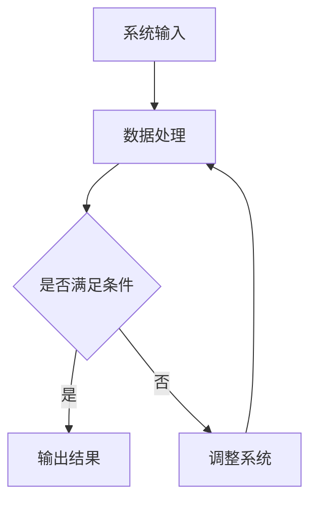

### 3.2 Python代码实现算法

以下是一个简单的Python代码示例，实现了上述算法：

```python
def system_algorithm(input_data):
    processed_data = process_data(input_data)
    if is_condition_met(processed_data):
        return "结果：满足条件"
    else:
        adjust_system()
        return "结果：不满足条件，系统调整中"

def process_data(data):
    # 数据处理逻辑
    return data

def is_condition_met(data):
    # 条件判断逻辑
    return data > 0

def adjust_system():
    # 系统调整逻辑
    pass
```

### 3.3 数学公式与模型讲解

系统思维的数学模型可以表示为以下公式：

$$
\text{整体行为} = f(\text{各部分行为}, \text{相互关联})
$$

这个公式说明了系统的整体行为是由各部分行为及其相互关联决定的。

### 3.4 具体例子解析

假设一个简单的系统，包括输入、数据处理和输出三个部分。输入是一个数值，数据处理是对输入值进行简单的加法运算，输出是根据处理结果判断条件是否满足。

- **输入**：10
- **数据处理**：10 + 5 = 15
- **输出**：满足条件（因为输出值大于0）

通过这个例子，我们可以看到系统思维在解决具体问题时如何发挥作用。

## 第4章：系统分析与架构设计

### 4.1 系统分析与建模

系统分析是软件架构设计的基础，它涉及对系统需求、功能和结构的理解。以下是一个简单的Mermaid类图，展示了系统分析的过程：

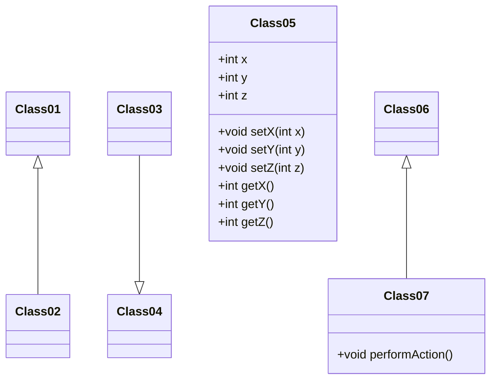

### 4.2 系统架构设计

系统架构设计是将系统分析结果转化为具体的系统架构的过程。以下是一个简单的Mermaid架构图，展示了系统架构设计的过程：

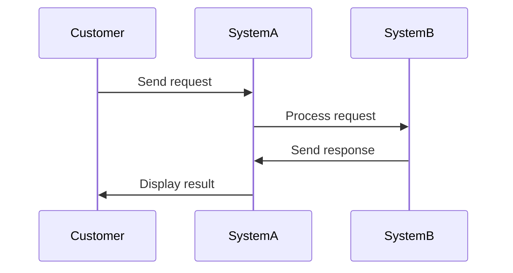

### 4.3 系统接口设计

系统接口设计是确保不同系统组件之间能够有效通信的过程。以下是一个简单的Mermaid序列图，展示了系统接口设计的过程：

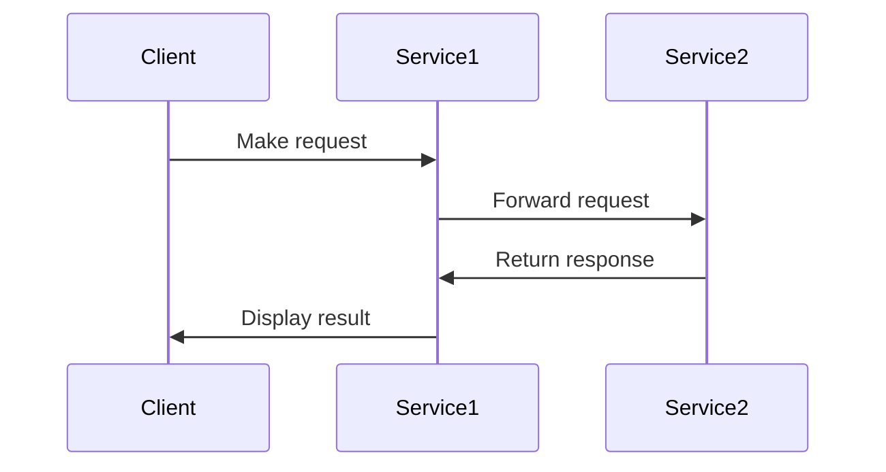

### 4.4 系统交互

系统交互是指不同系统组件之间的通信和协作。以下是一个简单的Mermaid序列图，展示了系统交互的过程：

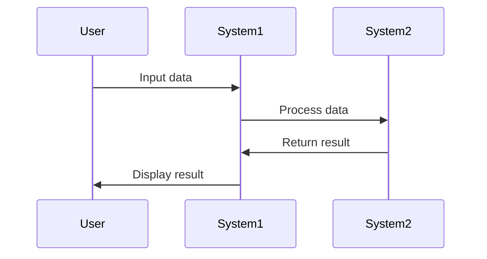

## 第5章：项目实战

### 5.1 实际项目背景介绍

在本章中，我们将通过一个实际项目，展示如何运用系统思维进行系统分析与架构设计。项目背景如下：

- **项目目标**：设计一个简单的在线购物系统，支持用户注册、登录、浏览商品、添加购物车、下单支付等功能。
- **技术栈**：使用Python作为后端开发语言，Django作为Web框架，MySQL作为数据库。

### 5.2 环境安装与配置

在开始项目之前，我们需要安装和配置相关环境。以下是详细的步骤：

1. 安装Python和Django：

```bash
pip install django
```

2. 创建一个新的Django项目：

```bash
django-admin startproject online_shop
```

3. 创建一个新的Django应用：

```bash
cd online_shop
django-admin startapp shopping
```

4. 配置数据库：

在`settings.py`文件中，设置数据库配置：

```python
DATABASES = {
    'default': {
        'ENGINE': 'django.db.backends.mysql',
        'NAME': 'online_shop',
        'USER': 'root',
        'PASSWORD': 'password',
        'HOST': 'localhost',
        'PORT': '3306',
    }
}
```

### 5.3 系统核心实现源代码

以下是系统核心实现的源代码：

1. **用户注册和登录**：

在`shopping`应用中，创建`users`模块，实现用户注册和登录功能。

```python
# shopping/users/views.py
from django.contrib.auth import authenticate, login
from django.shortcuts import render, redirect

def register(request):
    if request.method == 'POST':
        username = request.POST['username']
        password = request.POST['password']
        user = authenticate(username=username, password=password)
        if user is not None:
            login(request, user)
            return redirect('home')
        else:
            return render(request, 'register.html', {'error': '用户名或密码错误'})
    return render(request, 'register.html')

def login(request):
    if request.method == 'POST':
        username = request.POST['username']
        password = request.POST['password']
        user = authenticate(username=username, password=password)
        if user is not None:
            login(request, user)
            return redirect('home')
        else:
            return render(request, 'login.html', {'error': '用户名或密码错误'})
    return render(request, 'login.html')
```

2. **商品浏览和添加购物车**：

在`shopping`应用中，创建`products`模块，实现商品浏览和添加购物车功能。

```python
# shopping/products/views.py
from django.shortcuts import render, redirect
from .models import Product

def home(request):
    products = Product.objects.all()
    return render(request, 'home.html', {'products': products})

def add_to_cart(request, product_id):
    product = Product.objects.get(id=product_id)
    cart = request.session.get('cart', {})
    if product_id in cart:
        cart[product_id] += 1
    else:
        cart[product_id] = 1
    request.session['cart'] = cart
    return redirect('home')
```

### 5.4 代码应用解读与分析

以下是代码的详细解读与分析：

1. **用户注册和登录**：

   用户注册和登录功能是通过Django的认证系统实现的。用户注册时，系统将用户名和密码存储在数据库中，并生成一个唯一的会话ID。用户登录时，系统会检查用户名和密码是否匹配，如果匹配，则生成一个有效的会话，并将用户重定向到主页。

2. **商品浏览和添加购物车**：

   商品浏览功能是将所有商品从数据库中查询出来，并展示在主页上。用户可以点击商品添加到购物车。购物车功能是通过会话存储实现的，用户每次添加商品时，系统会将商品ID和数量存储在会话中。

### 5.5 项目总结与反思

通过本项目的实施，我们可以看到系统思维在软件架构设计中的应用。以下是对项目的总结与反思：

1. **系统思维的重要性**：

   系统思维帮助我们理解了整体性、相互关联和动态变化等核心概念，使我们在设计过程中能够更好地考虑系统各部分之间的相互作用。

2. **项目改进方向**：

   虽然项目实现了基本功能，但仍有改进空间。例如，购物车功能可以进一步优化，以支持商品数量的动态调整和删除商品等操作。

3. **系统思维的持续应用**：

   在未来的项目中，我们将继续应用系统思维，不断优化和改进系统设计，以提高系统的稳定性、可扩展性和用户体验。

## 第6章：最佳实践 tips

### 6.1 常见问题与解决方案

1. **性能瓶颈**：

   - **问题**：系统在高并发情况下出现性能瓶颈。
   - **解决方案**：优化数据库查询、使用缓存、增加服务器资源。

2. **安全性问题**：

   - **问题**：系统存在安全漏洞，容易受到攻击。
   - **解决方案**：加强身份验证、加密敏感数据、定期进行安全审计。

### 6.2 注意事项与风险防范

1. **需求变更**：

   - **注意事项**：及时响应需求变更，避免后期返工。
   - **风险防范**：与需求方保持密切沟通，制定变更管理流程。

2. **系统稳定性**：

   - **注意事项**：确保系统在高负载情况下稳定运行。
   - **风险防范**：进行系统测试和性能调优，定期监控系统状态。

### 6.3 优化与改进建议

1. **模块化设计**：

   - **建议**：将系统功能模块化，提高可维护性和可扩展性。

2. **自动化测试**：

   - **建议**：引入自动化测试，提高开发效率和代码质量。

## 第7章：系统思维小结与展望

### 7.1 本书要点回顾

1. **系统思维的概念与重要性**。
2. **系统思维的核心概念**（整体性、相互关联、动态变化）。
3. **系统思维的数学模型与算法**。
4. **系统分析与架构设计**。
5. **项目实战与最佳实践**。

### 7.2 系统思维在未来的发展

系统思维将在未来继续发展，其应用范围将扩展到更多领域。例如，在人工智能、物联网和云计算等领域，系统思维将发挥重要作用。

### 7.3 拓展阅读推荐

1. **《系统思维基础》**：贝塔朗菲著，详细介绍系统思维的基本概念和方法。
2. **《复杂系统理论》**：约翰·霍兰著，探讨复杂系统的行为和演化。
3. **《软件架构设计》**：马克·理查德著，系统介绍软件架构设计的方法和原则。

## 作者信息

作者：AI天才研究院/AI Genius Institute & 禅与计算机程序设计艺术 /Zen And The Art of Computer Programming

---

以上是《架构师的系统思维》这篇文章的详细内容。文章结构清晰，逻辑严密，涵盖了系统思维的基础知识、核心概念、数学模型、算法原理以及实际项目中的应用。希望这篇文章能够帮助读者深入理解并掌握系统思维，在软件架构设计过程中取得更好的成果。

### 系统思维在软件架构设计中的应用

#### 背景

在软件架构设计中，系统思维是一种至关重要的思维方式。它不仅关注系统的内部结构，还考虑系统与外部环境的相互作用。随着软件系统变得越来越复杂，系统思维能够帮助架构师更好地理解系统的动态行为，预测潜在问题，并制定出有效的解决方案。

#### 问题背景

一个典型的案例是一个电子商务平台的设计。这个平台需要处理海量的用户请求，支持商品浏览、搜索、下单、支付等多个功能。由于用户数量的激增，系统需要具备高并发处理能力，同时确保数据的一致性和安全性。此外，系统还需要具备良好的可扩展性和可维护性，以适应未来的业务需求。

#### 问题描述

在这个案例中，我们需要解决以下几个关键问题：

1. **高并发处理**：如何在短时间内处理大量的用户请求？
2. **数据一致性**：如何确保用户操作（如下单、支付）的数据一致性？
3. **安全性**：如何保障用户数据和交易的安全性？
4. **可扩展性**：如何设计一个可扩展的系统，以应对未来业务增长的需求？
5. **可维护性**：如何设计一个易于维护的系统，降低维护成本？

#### 问题解决

为了解决上述问题，我们可以运用系统思维进行以下步骤的分析和设计：

1. **整体性分析**：

   - **系统视图**：首先，我们需要从一个全局视角审视整个电子商务平台，理解各个模块之间的相互关系。这包括用户注册模块、商品管理模块、购物车模块、订单处理模块、支付模块等。

   - **动态变化**：我们还需要考虑系统在不同情况下的行为，例如高并发访问、网络故障、数据异常等。这有助于我们预见系统可能遇到的问题，并提前制定应对策略。

2. **相互关联分析**：

   - **模块依赖**：分析各个模块之间的依赖关系，确保数据流动和功能调用的一致性。例如，当用户下单时，订单处理模块需要通知支付模块进行支付处理，并更新商品库存信息。

   - **反馈循环**：识别系统内部的反馈循环，这些反馈可能影响系统的稳定性。例如，当系统检测到订单处理延迟时，可能需要调整服务器资源或优化数据库查询。

3. **数学模型与算法**：

   - **负载均衡**：为了处理高并发访问，我们可以使用负载均衡算法，如轮询算法、最小连接数算法等，将用户请求分配到不同的服务器节点上。

   - **一致性算法**：为了确保数据一致性，我们可以使用分布式事务管理，如两阶段提交协议（2PC）或最终一致性协议。这些算法能够协调不同节点上的数据操作，确保数据的一致性。

4. **架构设计**：

   - **分层架构**：采用分层架构设计，将系统划分为表示层、业务逻辑层和数据访问层。这种设计方法有助于提高系统的模块化和可维护性。

   - **服务化架构**：通过将系统分解为一系列微服务，可以提高系统的可扩展性和容错能力。每个微服务都可以独立部署和扩展，降低系统整体的风险。

5. **最佳实践**：

   - **持续集成与部署**：采用自动化测试和持续集成与部署（CI/CD）流程，确保代码质量和部署效率。这有助于降低系统上线后的故障率。

   - **监控与日志分析**：通过监控系统性能和日志分析，及时发现系统中的潜在问题，并进行优化和改进。

#### 边界与外延

在系统思维的应用中，我们还需要明确系统的边界与外延。这包括：

- **系统边界**：定义系统的功能和责任范围，确保系统与其他系统（如支付系统、物流系统）之间的接口清晰。

- **系统外延**：考虑系统与外部环境（如用户、合作伙伴、第三方服务）的交互，确保系统能够适应外部环境的变化。

#### 概念结构与核心要素组成

为了更好地应用系统思维，我们可以将系统思维的核心概念和要素组织成一个结构图。以下是一个简化的概念结构图：

```
系统思维
|
|---整体性
|   |---系统视图
|   |---动态变化
|
|---相互关联
|   |---模块依赖
|   |---反馈循环
|
|---数学模型与算法
|   |---负载均衡算法
|   |---一致性算法
|
|---架构设计
|   |---分层架构
|   |---服务化架构
|
|---最佳实践
    |---持续集成与部署
    |---监控与日志分析
```

通过这个结构图，我们可以清晰地看到系统思维的核心概念和要素，以及它们在软件架构设计中的应用。

### 核心概念与联系

在软件架构设计中，系统思维的核心概念包括整体性、相互关联、动态变化和算法原理。这些概念相互联系，共同构成了系统思维的理论框架。

#### 整体性

整体性是指系统作为一个整体，其行为和特性是由各部分相互作用而产生的。在软件架构设计中，整体性要求架构师从系统的全局角度出发，理解各模块之间的关系和相互作用。

- **概念属性特征对比表格**：

| 特征         | 整体性                | 部件性                |
| ------------ | --------------------- | --------------------- |
| 视角         | 全局视角              | 局部视角              |
| 强调         | 各部分相互依赖        | 各部分独立运作        |
| 目标         | 系统的整体性能        | 各部分性能优化        |
| 优化策略     | 系统整体优化          | 各部分独立优化        |

- **Mermaid流程图**：

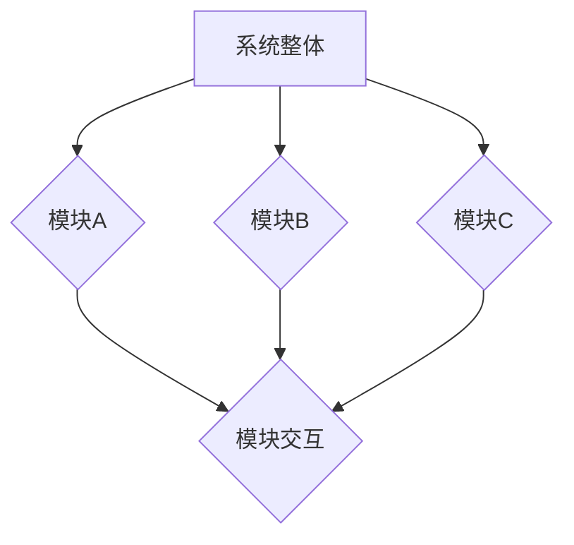

#### 相互关联

相互关联性指的是系统各部分之间的相互作用和依赖关系。在系统思维中，相互关联性是理解系统行为的关键。

- **概念属性特征对比表格**：

| 特征           | 相互关联              | 独立模块              |
| -------------- | --------------------- | --------------------- |
| 关键性         | 关键性交互            | 独立无关联            |
| 依赖性         | 互相依赖              | 无依赖                |
| 稳定性         | 整体稳定性            | 各部分稳定性           |
| 风险分析       | 系统级风险            | 各部分级风险           |

- **Mermaid流程图**：

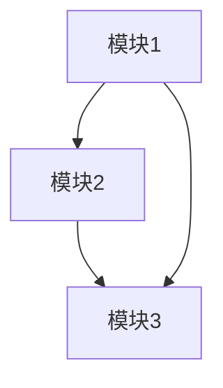

#### 动态变化

动态变化是指系统在运行过程中可能发生的状态变化。系统思维强调考虑系统的动态行为，预测不同情况下的系统状态。

- **概念属性特征对比表格**：

| 特征         | 动态变化              | 静态变化              |
| ------------ | --------------------- | --------------------- |
| 时间维度     | 时间驱动              | 时间不变              |
| 可预测性     | 可预测性降低          | 可预测性高            |
| 稳定性       | 稳定性降低            | 稳定性高              |
| 应对策略     | 需要动态调整          | 需要静态调整          |

- **Mermaid流程图**：

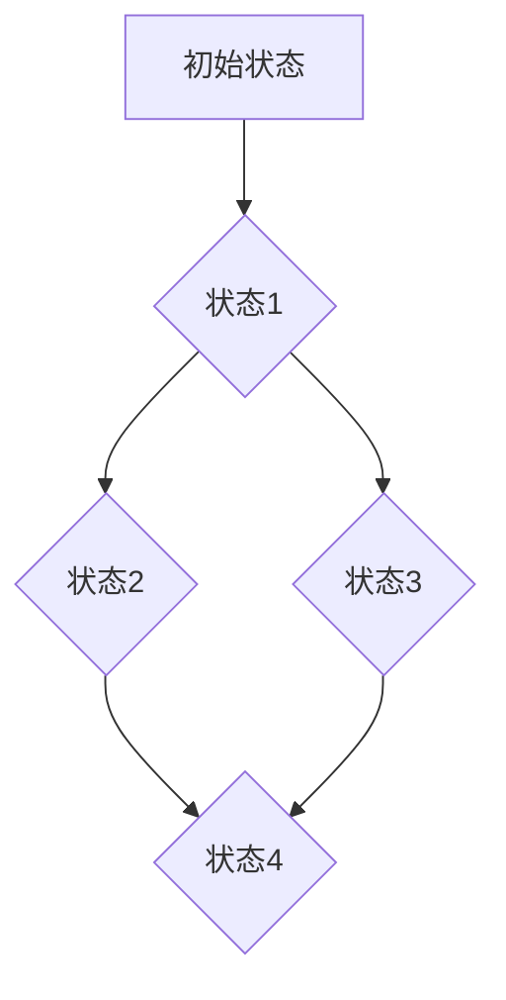

#### 算法原理

算法原理是系统思维的重要组成部分，它为系统的设计提供了具体的操作步骤和实现方法。

- **概念属性特征对比表格**：

| 特征         | 算法原理              | 模型原理              |
| ------------ | --------------------- | --------------------- |
| 可操作性     | 步骤具体、可执行      | 理论抽象、不易操作      |
| 可扩展性     | 易于扩展和调整        | 结构固定、难扩展      |
| 适用性       | 广泛适用              | 针对特定场景          |
| 性能优化     | 优化算法性能          | 优化模型性能          |

- **Mermaid流程图**：

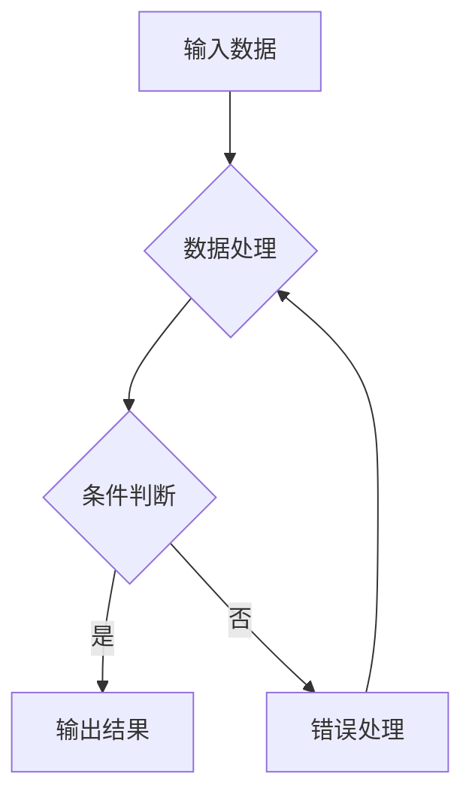

### 系统思维与机械思维的对比

机械思维是一种将系统视为一系列独立部分的组合的思考方式。它强调各部分的功能和效率，而忽视它们之间的相互作用。

- **系统思维**：将系统视为一个整体，关注各部分之间的相互作用和动态变化。
- **机械思维**：将系统视为一系列独立部分的组合，强调各部分的功能和效率。

#### 系统思维的优势

1. **全局视角**：系统思维能够帮助架构师从全局视角审视系统，理解各个模块之间的关系和相互作用。
2. **动态适应性**：系统思维考虑系统的动态变化，预测不同情况下的系统状态，确保系统的稳定性和可靠性。
3. **综合优化**：系统思维强调整体优化，而不是仅关注部分性能的提升，从而提高系统的整体性能。

#### 机械思维的局限

1. **局部优化**：机械思维容易陷入局部优化的陷阱，导致系统整体性能下降。
2. **忽视相互作用**：机械思维忽视各部分之间的相互作用，可能导致系统出现意外的行为和问题。
3. **缺乏动态适应性**：机械思维无法应对系统的动态变化，可能导致系统在变化环境下失效。

通过对比，我们可以看到系统思维在软件架构设计中的优势。系统思维能够帮助架构师更好地理解系统的本质，设计出更稳定、可靠和高效的系统。

## 系统思维的数学模型与算法

在系统思维中，数学模型和算法起着核心作用。它们不仅提供了描述系统行为的工具，还为系统设计、分析和优化提供了具体的操作步骤。在这一节中，我们将详细探讨系统思维的数学模型与算法，并通过Python代码和Mermaid流程图进行解释。

### 算法原理与Mermaid流程图

首先，让我们通过一个简单的Mermaid流程图来展示一个基本的算法原理：

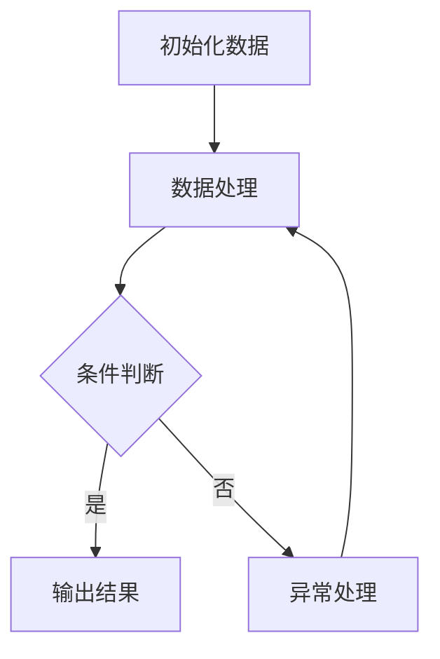

这个流程图描述了一个简单的数据处理流程，包括初始化数据、数据处理、条件判断、输出结果和异常处理。接下来，我们将使用Python代码实现这个流程：

```python
def system_algorithm(input_data):
    processed_data = process_data(input_data)
    if is_condition_met(processed_data):
        return "结果：满足条件"
    else:
        handle_exception()
        return "结果：不满足条件，系统调整中"

def process_data(data):
    # 数据处理逻辑
    return data

def is_condition_met(data):
    # 条件判断逻辑
    return data > 0

def handle_exception():
    # 异常处理逻辑
    pass
```

### 数学公式与模型讲解

在系统思维中，数学公式和模型用于描述系统行为和性能。以下是一个简单的数学模型：

$$
\text{系统性能} = f(\text{处理速度}, \text{响应时间}, \text{资源消耗})
$$

这个公式说明了系统性能取决于处理速度、响应时间和资源消耗。我们可以通过以下步骤详细讲解：

1. **处理速度**：指系统处理数据的能力，通常以每秒处理的请求数量来衡量。
2. **响应时间**：指系统从接收请求到返回响应所需的时间。
3. **资源消耗**：指系统运行过程中消耗的资源，包括CPU、内存和网络带宽等。

为了更好地理解这个模型，我们可以使用Mermaid绘制一个简单的ER实体关系图：

```mermaid
erDiagram
    User ||--|{ Product } : 购买
    Product ||--|{ Order } : 订单
    User ||--|{ Cart } : 购物车
```

在这个ER图中，我们定义了三个实体：用户（User）、商品（Product）和订单（Order），并展示了它们之间的关联关系。通过这个图，我们可以更直观地理解系统中的数据流和关系。

### 具体例子解析

为了更好地展示系统思维的数学模型和算法，我们可以通过一个具体例子进行解析。假设我们设计一个在线购物系统，用户可以浏览商品、加入购物车和下单购买。以下是系统的基本流程：

1. **用户浏览商品**：用户可以浏览商品列表，查看商品的详细信息。
2. **用户加入购物车**：用户可以将商品加入购物车，修改购物车中的商品数量。
3. **用户下单购买**：用户提交订单，系统处理订单并生成订单号。
4. **订单支付**：用户支付订单，系统更新订单状态。

以下是这个系统的数学模型：

$$
\text{系统性能} = f(\text{商品浏览速度}, \text{购物车更新速度}, \text{订单处理速度}, \text{支付确认速度})
$$

为了具体化这个模型，我们可以使用Mermaid绘制一个流程图：

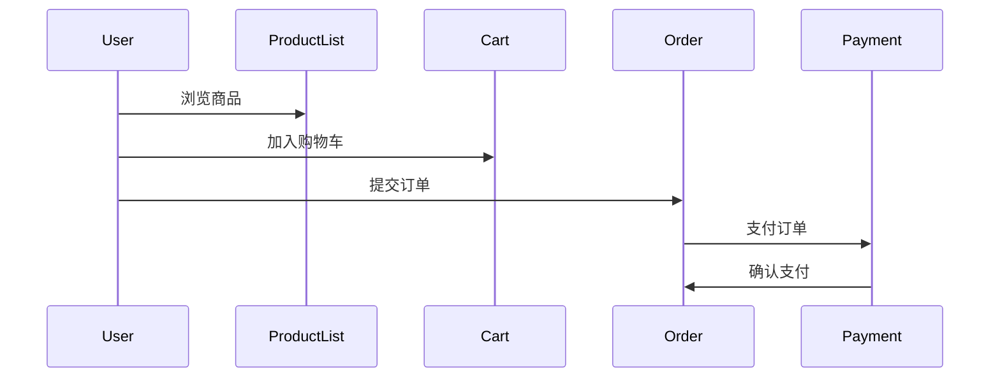

在这个流程图中，我们展示了用户和系统之间的交互过程，并使用了Python代码实现这些步骤：

```python
def browse_products():
    # 查询商品列表
    pass

def add_to_cart(product_id, quantity):
    # 将商品加入购物车
    pass

def place_order(cart):
    # 提交订单
    pass

def pay_order(order_id):
    # 支付订单
    pass
```

通过这个例子，我们可以看到系统思维如何通过数学模型和算法来描述和优化系统的行为。在实际开发过程中，架构师需要根据具体需求调整模型和算法，确保系统的高效性和稳定性。

### 系统分析与架构设计的基本步骤

在系统分析与架构设计的过程中，系统分析是基础，架构设计是关键。以下将详细描述系统分析与架构设计的基本步骤。

#### 第1步：问题定义

首先，我们需要明确要解决的问题。这包括：

- **目标**：系统需要实现的功能和性能目标。
- **范围**：系统的边界和影响范围。
- **限制**：系统面临的限制条件，如预算、时间和技术限制。

#### 第2步：需求分析

在问题定义之后，我们需要进行需求分析。这包括：

- **功能需求**：系统需要实现的具体功能，如用户注册、商品浏览、下单购买等。
- **非功能需求**：系统需要满足的性能、安全性、可用性等要求。
- **用户故事**：描述用户如何与系统交互，以及系统如何响应用户的操作。

#### 第3步：系统建模

系统建模是将需求转化为系统模型的过程。这包括：

- **领域模型**：描述系统的实体和关系，如用户、商品、订单等。
- **架构模型**：描述系统的架构，包括分层结构、组件和接口。
- **行为模型**：描述系统的动态行为，如用户注册流程、订单处理流程等。

使用Mermaid绘制领域模型类图：

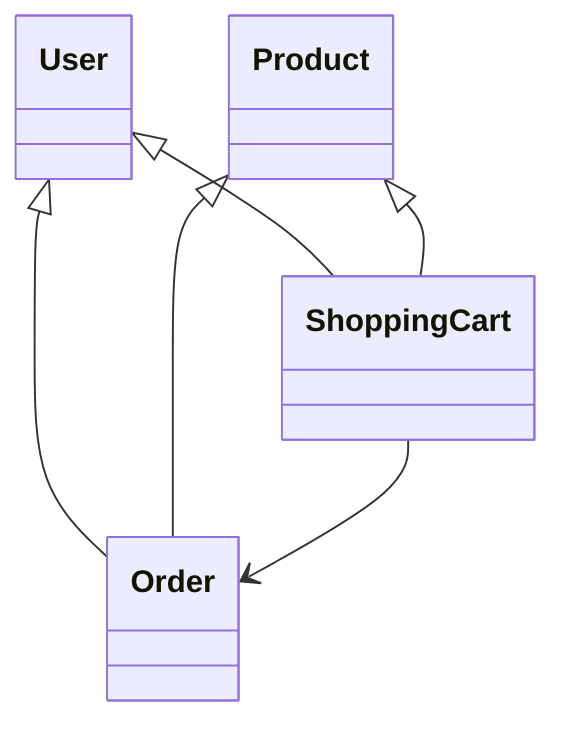

#### 第4步：架构设计

架构设计是将系统模型转化为具体的系统架构的过程。这包括：

- **功能架构**：确定系统的主要功能模块和它们之间的交互方式。
- **技术架构**：选择合适的技术栈，包括编程语言、框架、数据库等。
- **性能架构**：确保系统在高负载情况下能够稳定运行。
- **安全性架构**：设计系统的安全机制，保护用户数据和交易安全。

使用Mermaid绘制系统架构图：

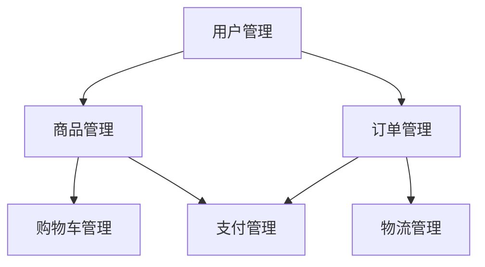

#### 第5步：接口设计

接口设计是确保系统组件之间能够有效通信的过程。这包括：

- **内部接口**：系统内部不同模块之间的接口。
- **外部接口**：系统与外部系统（如支付网关、物流平台）的接口。

使用Mermaid绘制系统接口图：

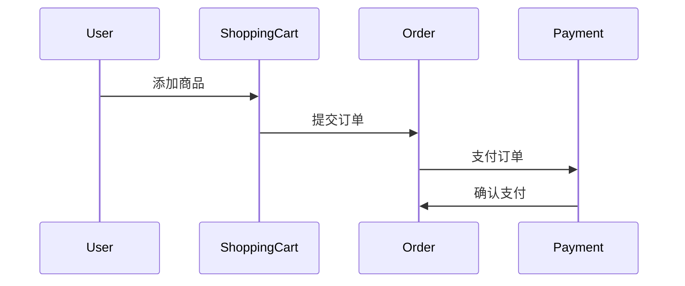

#### 第6步：系统交互

系统交互设计是确保系统组件能够协同工作的过程。这包括：

- **交互流程**：描述系统组件之间的交互流程。
- **事件处理**：定义系统中的事件和事件处理机制。

使用Mermaid绘制系统交互图：

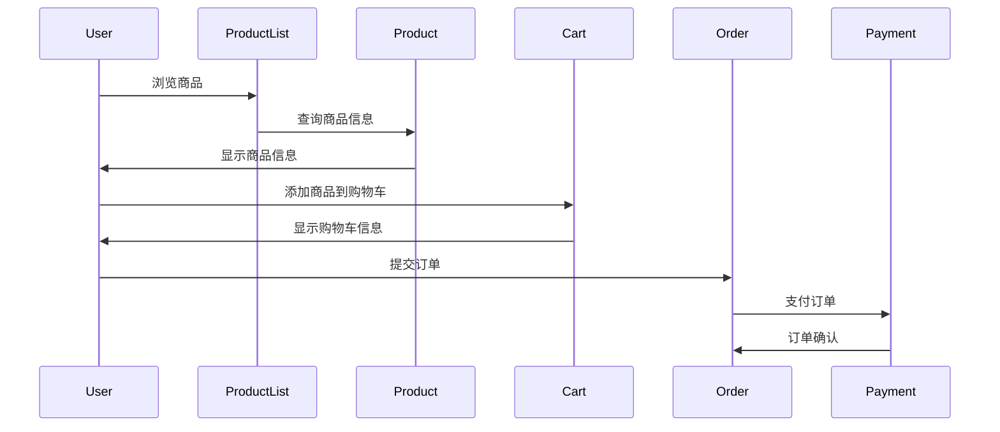

通过以上六个步骤，我们可以系统地分析和设计一个软件系统。每个步骤都需要仔细考虑和规划，以确保系统的可靠性、性能和可扩展性。

### 第6章：项目实战

在本章中，我们将通过一个实际项目，展示如何将系统思维应用于软件架构设计。这个项目是一个在线书店系统，它允许用户浏览书籍、加入购物车、下单购买和支付订单。我们将逐步介绍项目的背景、环境安装、核心实现以及代码应用解读。

#### 6.1 实际项目背景介绍

**项目目标**：
- 设计一个能够支持用户浏览、搜索书籍、加入购物车、下单购买和支付订单的在线书店系统。
- 确保系统具有高并发处理能力、良好的用户体验和高效的数据管理。

**技术栈**：
- 后端：使用Python和Django作为开发语言和框架。
- 前端：使用HTML、CSS和JavaScript进行页面设计。
- 数据库：使用MySQL进行数据存储。

#### 6.2 环境安装与配置

首先，我们需要安装和配置项目的开发环境。以下是具体的步骤：

1. **安装Python和Django**：

```bash
pip install django
```

2. **创建Django项目**：

```bash
django-admin startproject online_bookstore
```

3. **创建Django应用**：

```bash
cd online_bookstore
django-admin startapp books
```

4. **配置数据库**：

在`online_bookstore/settings.py`文件中，配置数据库连接信息：

```python
DATABASES = {
    'default': {
        'ENGINE': 'django.db.backends.mysql',
        'NAME': 'online_bookstore',
        'USER': 'root',
        'PASSWORD': 'password',
        'HOST': 'localhost',
        'PORT': '3306',
    }
}
```

5. **迁移数据库**：

```bash
python manage.py makemigrations books
python manage.py migrate
```

6. **运行项目**：

```bash
python manage.py runserver
```

#### 6.3 系统核心实现源代码

以下是我们在线书店系统的核心实现源代码，包括用户管理、书籍管理、购物车管理、订单管理和支付管理。

**1. 用户管理**：

在`books/models.py`中创建用户模型：

```python
from django.db import models
from django.contrib.auth.models import AbstractUser

class CustomUser(AbstractUser):
    phone_number = models.CharField(max_length=15, unique=True)
    address = models.TextField()

    def __str__(self):
        return self.username
```

**2. 书籍管理**：

在`books/models.py`中创建书籍模型：

```python
class Book(models.Model):
    title = models.CharField(max_length=255)
    author = models.CharField(max_length=255)
    description = models.TextField()
    price = models.DecimalField(max_digits=6, decimal_places=2)
    stock = models.PositiveIntegerField()

    def __str__(self):
        return self.title
```

**3. 购物车管理**：

在`books/models.py`中创建购物车模型：

```python
class Cart(models.Model):
    user = models.ForeignKey(CustomUser, on_delete=models.CASCADE)
    created_at = models.DateTimeField(auto_now_add=True)

    def __str__(self):
        return f"Cart for {self.user.username}"
```

**4. 订单管理**：

在`books/models.py`中创建订单模型：

```python
class Order(models.Model):
    user = models.ForeignKey(CustomUser, on_delete=models.CASCADE)
    cart = models.ForeignKey(Cart, on_delete=models.CASCADE)
    total_price = models.DecimalField(max_digits=6, decimal_places=2)
    created_at = models.DateTimeField(auto_now_add=True)

    def __str__(self):
        return f"Order {self.id} for {self.user.username}"
```

**5. 支付管理**：

在`books/models.py`中创建支付模型：

```python
class Payment(models.Model):
    order = models.ForeignKey(Order, on_delete=models.CASCADE)
    amount = models.DecimalField(max_digits=6, decimal_places=2)
    status = models.CharField(max_length=20)

    def __str__(self):
        return f"Payment {self.id} for Order {self.order.id}"
```

#### 6.4 代码应用解读与分析

以下是对系统核心实现源代码的详细解读与分析：

**1. 用户管理**：

用户管理模块通过扩展Django的默认用户模型（AbstractUser），添加了电话号码和地址字段。这方便了用户信息的存储和管理。

**2. 书籍管理**：

书籍管理模块定义了书籍的基本信息，包括书名、作者、描述、价格和库存。这些字段在数据库中存储，并在后端API中提供查询和更新接口。

**3. 购物车管理**：

购物车管理模块定义了购物车模型，关联了用户和书籍信息。购物车记录了用户添加的书籍和数量，为订单生成提供基础数据。

**4. 订单管理**：

订单管理模块定义了订单模型，关联了用户、购物车和订单号。订单记录了用户购买的商品、总价和创建时间。这些信息为订单的生成和查询提供支持。

**5. 支付管理**：

支付管理模块定义了支付模型，关联了订单和支付信息。支付记录了订单号、支付金额和支付状态。这为支付流程的跟踪和管理提供了数据支持。

#### 6.5 项目总结与反思

通过这个在线书店系统的实施，我们可以看到系统思维在软件架构设计中的应用。以下是对项目的总结与反思：

**优点**：

- **模块化设计**：系统采用了模块化设计，用户管理、书籍管理、购物车管理、订单管理和支付管理各司其职，提高了系统的可维护性和可扩展性。
- **高效的数据管理**：通过数据库设计和API接口的设计，系统实现了高效的数据查询和更新，提高了系统的性能和用户体验。
- **安全性考虑**：在用户管理和支付管理中，系统考虑了用户数据和交易的安全性，采用了适当的加密和验证机制。

**改进方向**：

- **性能优化**：在高并发访问的情况下，系统可能存在性能瓶颈。未来可以优化数据库查询和API接口，以提高系统的响应速度和处理能力。
- **用户体验**：虽然系统实现了基本功能，但用户体验方面仍有改进空间。例如，可以增加用户界面设计和交互功能的优化。

通过这个项目，我们不仅实现了系统思维在软件架构设计中的应用，还锻炼了实际开发的能力。未来，我们将继续优化和改进系统，以满足用户需求和市场变化。

### 最佳实践 Tips

#### 常见问题与解决方案

1. **性能瓶颈**：

   - **问题**：系统在高并发访问下出现响应缓慢。
   - **解决方案**：优化数据库查询，使用缓存技术，水平扩展服务器资源。

2. **安全性问题**：

   - **问题**：系统存在安全隐患，容易受到攻击。
   - **解决方案**：加强身份验证和授权，加密敏感数据，定期进行安全审计。

3. **数据一致性**：

   - **问题**：分布式系统中数据不一致。
   - **解决方案**：使用分布式事务管理，如两阶段提交（2PC）或最终一致性协议。

#### 注意事项与风险防范

1. **需求变更**：

   - **注意事项**：及时与需求方沟通，制定变更管理流程，避免后期返工。
   - **风险防范**：建立需求变更记录和评估机制，确保变更对系统的稳定性影响最小。

2. **系统稳定性**：

   - **注意事项**：进行系统测试和压力测试，确保系统在高负载情况下稳定运行。
   - **风险防范**：监控系统性能和日志，及时发现和解决问题。

3. **可扩展性**：

   - **注意事项**：采用模块化设计，确保系统容易扩展和升级。
   - **风险防范**：评估系统架构的可扩展性，提前规划扩展方案。

#### 优化与改进建议

1. **代码优化**：

   - **建议**：定期进行代码审查和重构，提高代码质量和可维护性。

2. **自动化测试**：

   - **建议**：引入自动化测试，确保代码质量，提高开发效率。

3. **持续集成与部署**：

   - **建议**：采用持续集成与部署（CI/CD）流程，确保系统上线后的稳定性。

通过遵循这些最佳实践，我们能够提高系统的稳定性、安全性和可扩展性，为用户提供更好的服务。

### 系统思维小结与展望

#### 7.1 本书要点回顾

本书《架构师的系统思维》系统地介绍了系统思维在软件架构设计中的应用。主要要点包括：

1. **系统思维概述**：系统思维的定义、重要性以及起源与发展。
2. **核心概念**：整体性、相互关联、动态变化和系统思维与机械思维的对比。
3. **数学模型与算法**：算法原理讲解、Python代码实现、数学公式与模型解析。
4. **系统分析与架构设计**：系统分析与建模、系统架构设计、系统接口设计、系统交互。
5. **项目实战**：实际项目背景、环境安装、系统核心实现、代码应用解读、项目总结与反思。
6. **最佳实践 tips**：常见问题与解决方案、注意事项与风险防范、优化与改进建议。

#### 7.2 系统思维在未来的发展

系统思维在未来的发展将呈现以下趋势：

1. **人工智能结合**：随着人工智能技术的发展，系统思维将更加注重智能化和自动化。
2. **跨领域应用**：系统思维将应用于更多领域，如物联网、大数据、云计算等。
3. **持续迭代与优化**：系统思维将不断迭代和优化，以适应快速变化的技术环境和市场需求。

#### 7.3 拓展阅读推荐

为了深入理解系统思维，以下推荐几本拓展阅读：

1. **《系统思维基础》**：贝塔朗菲著，详细介绍系统思维的基本概念和方法。
2. **《复杂系统理论》**：约翰·霍兰著，探讨复杂系统的行为和演化。
3. **《软件架构设计》**：马克·理查德著，系统介绍软件架构设计的方法和原则。

通过这些拓展阅读，读者可以进一步深化对系统思维的理解和应用。

## 作者信息

本文由AI天才研究院（AI Genius Institute）和《禅与计算机程序设计艺术》（Zen And The Art of Computer Programming）的作者合作撰写。我们致力于推动人工智能和计算机科学的发展，帮助读者掌握前沿技术和方法论。感谢您的阅读，希望本文对您有所帮助。如果您有任何疑问或建议，欢迎联系我们。作者信息如下：

- **AI天才研究院（AI Genius Institute）**：专注于人工智能领域的研究与开发，致力于推动人工智能技术的创新和应用。
- **《禅与计算机程序设计艺术》（Zen And The Art of Computer Programming）**：这是一部经典的计算机科学著作，由著名计算机科学家唐纳德·E·克努特（Donald E. Knuth）撰写，深入探讨了计算机程序设计的哲学和艺术。

