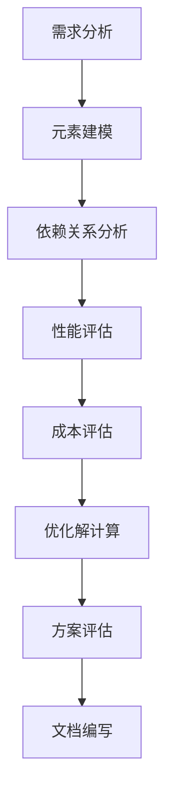

                 

### 书名：架构治理体系建设

**关键词：架构治理、体系建设、IT架构、架构设计、治理方法论**

**摘要：**
本文旨在探讨企业级架构治理体系建设，从问题背景、核心概念、方法论、算法原理到系统分析与实战，系统性地介绍架构治理的全过程。通过一步步的分析和讲解，帮助读者理解并掌握架构治理的关键技术与方法，为企业的IT架构管理提供有力的理论支持和实践指导。

---

### 第一部分：背景介绍

#### 第1章：问题背景与治理需求

**1.1 问题背景**

在当今快速发展的IT行业中，企业级架构面临诸多挑战。一方面，技术的更新换代速度加快，要求企业不断适应新的技术趋势；另一方面，企业规模的扩大和业务复杂度的提升，使得架构的维护和迭代变得更加困难。这导致企业在架构管理方面面临以下问题：

- **缺乏统一的架构治理流程**：企业在架构管理中缺乏明确的流程和标准，导致架构设计、实施、变更等环节出现混乱。
- **架构迭代效率低下**：企业无法及时响应业务需求的变化，导致架构更新速度缓慢，影响业务发展。
- **技术债务积累**：企业在技术选择和架构设计上缺乏长远规划，导致技术债务不断积累，增加维护成本和风险。

**1.2 问题描述**

- **缺乏统一的架构治理流程**：企业在架构管理中缺乏统一的流程和标准，导致架构设计、实施、变更等环节出现混乱，影响项目的顺利进行。
- **架构迭代效率低下**：企业无法及时响应业务需求的变化，导致架构更新速度缓慢，影响业务发展。
- **技术债务积累**：企业在技术选择和架构设计上缺乏长远规划，导致技术债务不断积累，增加维护成本和风险。

**1.3 问题解决**

**1.3.1 架构治理的概念与目标**

架构治理是指在企业的IT架构管理过程中，通过制定和执行一系列的流程、规范、工具和技术，确保架构的完整性、一致性和适应性，从而支持企业的长期发展。其核心目标是：

- **提高架构的稳定性**：确保架构的设计和实施符合企业的战略目标和技术标准，降低系统故障率和维护成本。
- **提升架构的适应性**：通过持续改进和优化，使架构能够快速适应业务需求的变化，提高企业的竞争力。
- **降低技术债务**：通过规范的架构管理和控制，减少技术债务的积累，降低系统的复杂度和维护成本。

**1.3.2 架构治理的核心要素**

架构治理的核心要素包括：

- **架构战略**：明确企业的架构愿景、目标和方向，指导架构设计和实施。
- **架构标准**：制定统一的架构标准和规范，确保架构的规范性和一致性。
- **架构设计**：设计符合企业需求的架构方案，实现业务需求的系统化。
- **架构实施**：实施架构设计，确保架构方案的落地和执行。
- **架构评估**：对架构的稳定性、适应性进行评估，识别和解决问题。
- **架构变更管理**：管理和控制架构的变更，确保变更的规范性和安全性。

**1.4 边界与外延**

**1.4.1 架构治理的范围**

架构治理的范围包括企业的各个层面，从战略规划到具体的技术实现，涵盖以下方面：

- **业务架构**：关注企业的业务流程、业务逻辑和业务关系。
- **应用架构**：关注企业应用系统的设计、实现和部署。
- **数据架构**：关注企业数据存储、处理和交换的架构设计。
- **技术架构**：关注企业技术选型、技术平台和开发工具的选择。

**1.4.2 与其他治理领域的关联**

架构治理与其他治理领域（如项目管理、软件工程、IT治理等）密切相关，相互影响。架构治理需要借助项目管理的方法和工具，确保架构项目的顺利推进；同时，架构治理的结果也会影响项目的进度、质量和成本。

**1.5 概念结构与核心要素组成**

**1.5.1 架构治理的关键概念**

- **架构治理**：企业在IT架构管理过程中，通过制定和执行一系列的流程、规范、工具和技术，确保架构的完整性、一致性和适应性。
- **架构战略**：企业的架构愿景、目标和方向。
- **架构标准**：企业的架构标准和规范。
- **架构设计**：符合企业需求的架构方案。
- **架构实施**：架构方案的实施和执行。
- **架构评估**：对架构的稳定性、适应性进行评估。
- **架构变更管理**：管理和控制架构的变更。

**1.5.2 架构治理的核心要素**

- **架构战略**：指导架构设计和实施。
- **架构标准**：确保架构的规范性和一致性。
- **架构设计**：实现业务需求的系统化。
- **架构实施**：确保架构方案的落地和执行。
- **架构评估**：识别和解决问题。
- **架构变更管理**：管理和控制架构的变更。

**1.6 本章小结**

本章从问题背景、核心概念、问题解决、边界与外延、概念结构与核心要素组成等方面，对架构治理进行了全面介绍。通过本章的学习，读者可以初步了解架构治理的基本概念和重要性，为后续章节的深入学习打下基础。

---

### 第二部分：核心概念与联系

#### 第2章：架构治理的核心概念

**2.1 架构治理的定义**

架构治理是指在企业的IT架构管理过程中，通过制定和执行一系列的流程、规范、工具和技术，确保架构的完整性、一致性和适应性。它是一种管理和控制架构的方法论，旨在确保企业的IT架构能够支持长期战略目标，并在技术变革和业务需求变化时保持灵活性和可扩展性。

**2.1.1 架构治理的概念**

架构治理包括以下几个方面：

- **架构战略**：明确企业的架构愿景、目标和方向，指导架构设计和实施。
- **架构标准**：制定统一的架构标准和规范，确保架构的规范性和一致性。
- **架构设计**：设计符合企业需求的架构方案，实现业务需求的系统化。
- **架构实施**：实施架构设计，确保架构方案的落地和执行。
- **架构评估**：对架构的稳定性、适应性进行评估，识别和解决问题。
- **架构变更管理**：管理和控制架构的变更，确保变更的规范性和安全性。

**2.1.2 架构治理的目的**

架构治理的目的是确保企业的IT架构能够满足以下要求：

- **稳定性**：架构设计要符合企业的长期战略目标，确保系统在长时间内稳定运行。
- **适应性**：架构要能够快速适应业务需求的变化，支持企业的持续发展。
- **一致性**：架构要遵循统一的规范和标准，确保系统之间的兼容性和互操作性。
- **安全性**：架构设计要考虑系统的安全性和可靠性，确保企业的数据和信息资产安全。

**2.2 架构治理的属性特征对比表格**

为了更好地理解架构治理的概念，我们可以将其与其他相关概念进行对比，如表1所示。

| 概念         | 描述                                                         | 对比特征                                                     |
| ------------ | ------------------------------------------------------------ | ------------------------------------------------------------ |
| 架构治理     | 企业的IT架构管理方法，确保架构的完整性、一致性和适应性。       | 强调规范性和系统性，关注架构的战略、设计、实施、评估和变更。     |
| 项目管理     | 项目的组织管理活动，确保项目目标的实现。                       | 关注项目的进度、成本、质量、风险等方面，与架构治理有交集。       |
| 软件工程     | 软件开发的方法和技术，确保软件产品的质量。                     | 关注软件开发的全过程，包括需求分析、设计、编码、测试和维护。     |
| IT治理       | IT管理的整体框架，确保IT战略与业务战略的匹配。                 | 关注IT资源的规划、管理和监控，与架构治理密切相关。               |

表1：架构治理与其他概念的对比

**2.3 架构治理的ER实体关系图架构**

为了更直观地展示架构治理的实体与关系，我们可以使用ER（实体-关系）图进行描述。以下是一个简化的ER图，展示了架构治理的核心实体和它们之间的关系。

```mermaid
erDiagram
    BusinessArchitect ||--|{ ApplicationArchitect } : implements
    ApplicationArchitect ||--|{ DataArchitect } : uses
    DataArchitect ||--|{ TechnicalArchitect } : implements
    TechnicalArchitect ||--|{ Developer } : collaborates
    Developer ||--|{ Tester } : interacts
```

图1：架构治理的ER实体关系图

- **BusinessArchitect（业务架构师）**：负责制定企业的架构战略，指导应用架构和数据架构的设计。
- **ApplicationArchitect（应用架构师）**：负责设计应用架构，确保应用系统的规范性和一致性。
- **DataArchitect（数据架构师）**：负责设计数据架构，确保数据的存储、处理和交换的规范性和安全性。
- **TechnicalArchitect（技术架构师）**：负责技术架构的设计，选择合适的技术平台和开发工具。
- **Developer（开发者）**：负责应用系统的开发，遵循架构标准和规范。
- **Tester（测试人员）**：负责应用系统的测试，确保系统的质量。

**2.4 本章小结**

本章从架构治理的定义、目的、属性特征对比和ER实体关系图等方面，系统地介绍了架构治理的核心概念。通过本章的学习，读者可以对架构治理有一个全面的理解，为后续章节的深入学习打下基础。

---

#### 第3章：架构治理的方法论

**3.1 架构治理的方法论概述**

架构治理的方法论是指一套系统的框架和方法，用于指导企业在IT架构管理过程中的各项活动。一个有效的架构治理方法论应具备以下特点：

- **系统性**：覆盖架构治理的各个阶段和方面，包括战略规划、设计、实施、评估和变更管理。
- **规范性**：提供明确的流程、标准和工具，确保架构的规范性和一致性。
- **可扩展性**：能够适应企业的不同规模和行业特点，满足不同需求。
- **可操作性**：提供具体的操作指南和工具，使架构治理的实施变得可行和高效。

**3.1.1 方法论的框架**

架构治理的方法论通常包括以下几个核心组成部分：

1. **架构战略**：明确企业的架构愿景、目标和方向，为架构设计提供指导。
2. **架构设计**：根据企业的需求，设计符合业务要求的架构方案。
3. **架构实施**：将架构设计转化为具体的系统实施，确保方案的落地。
4. **架构评估**：对架构的稳定性、适应性进行评估，识别和解决问题。
5. **架构变更管理**：管理和控制架构的变更，确保变更的规范性和安全性。

**3.1.2 方法论的核心原则**

架构治理方法论的核心原则包括以下几个方面：

- **战略性**：将架构治理与企业的长期战略目标相结合，确保架构的稳定性和适应性。
- **系统性**：覆盖架构治理的各个阶段和方面，确保架构的完整性。
- **规范性**：制定明确的流程、标准和工具，确保架构的规范性和一致性。
- **灵活性**：根据企业的需求和变化，灵活调整架构治理的方法和策略。
- **透明性**：确保架构治理的流程和结果对所有相关方都是透明的，增强信任和协作。

**3.2 架构评估与审计**

**3.2.1 评估与审计的目标**

架构评估与审计是架构治理的重要环节，其主要目标是：

- **评估架构的稳定性**：确保架构设计符合企业的长期战略目标，能够在长时间内稳定运行。
- **评估架构的适应性**：确保架构能够快速适应业务需求的变化，支持企业的持续发展。
- **识别和解决问题**：发现架构中的潜在问题，制定改进措施，提高架构的质量和效率。
- **评估架构的合规性**：确保架构设计和实施符合企业的规范和标准。

**3.2.2 评估与审计的方法**

架构评估与审计的方法包括以下几种：

- **文档审查**：审查企业的架构文档，包括架构战略、架构设计、架构实施等，确保文档的完整性和准确性。
- **访谈调研**：与架构相关人员（如架构师、开发者、测试人员等）进行访谈，了解架构的实际运行情况和问题。
- **系统测试**：对架构中的关键系统进行功能测试、性能测试和安全测试，评估架构的稳定性和适应性。
- **对比分析**：将企业的架构与行业标准、最佳实践进行对比分析，识别差距和改进点。
- **审计报告**：根据评估和审计的结果，编写审计报告，提出改进建议和措施。

**3.3 架构设计与变更管理**

**3.3.1 设计流程**

架构设计是架构治理的核心环节，其设计流程通常包括以下几个步骤：

1. **需求分析**：收集和整理业务需求，明确架构设计的目标和需求。
2. **技术调研**：分析现有技术，选择合适的技术方案和工具。
3. **架构方案设计**：根据需求和技术调研的结果，设计符合业务需求的架构方案。
4. **方案评估**：评估架构方案的可行性、稳定性和适应性，选择最佳方案。
5. **文档编写**：编写架构设计文档，包括架构描述、组件定义、接口规范等。

**3.3.2 变更管理流程**

变更管理是架构治理的重要组成部分，其流程通常包括以下几个步骤：

1. **变更请求**：收集和记录变更请求，明确变更的目的和影响。
2. **变更评估**：评估变更的可行性、影响和风险，确定变更的优先级和计划。
3. **变更实施**：实施变更，包括设计、编码、测试和部署等环节。
4. **变更验证**：验证变更的效果，确保变更的符合预期。
5. **变更记录**：记录变更的过程和结果，为后续的审计和评估提供依据。

**3.4 本章小结**

本章介绍了架构治理的方法论，包括架构治理的框架、核心原则、评估与审计的方法以及架构设计与变更管理流程。通过本章的学习，读者可以了解架构治理的方法论，掌握架构治理的基本方法和技巧，为企业的IT架构管理提供理论支持和实践指导。

---

### 第三部分：算法原理讲解

#### 第4章：架构治理算法原理

**4.1 基本算法原理**

架构治理算法是用于指导架构设计、评估和变更的一套数学模型和计算方法。其基本算法原理包括以下几个方面：

**4.1.1 数学模型**

架构治理算法的核心是建立一套数学模型，用于表示和分析架构的各个方面。这个模型通常包括以下要素：

- **架构元素**：包括系统组件、接口、数据等。
- **依赖关系**：描述元素之间的依赖关系。
- **性能指标**：包括响应时间、吞吐量、资源利用率等。
- **成本指标**：包括开发成本、维护成本、风险成本等。

算法的基本模型可以表示为：

$$
\text{算法模型} = f(\text{架构元素}, \text{依赖关系}, \text{性能指标}, \text{成本指标})
$$

其中，$f$ 是一个复合函数，用于根据输入的架构元素、依赖关系、性能指标和成本指标，计算出一个优化解。

**4.1.2 流程图**

架构治理算法的流程图通常包括以下几个步骤：

1. **需求分析**：收集和整理业务需求，明确架构设计的目标和需求。
2. **元素建模**：根据需求，建立架构元素的数学模型。
3. **依赖关系分析**：分析元素之间的依赖关系，建立依赖关系的数学模型。
4. **性能评估**：计算架构的性能指标，如响应时间、吞吐量等。
5. **成本评估**：计算架构的成本指标，如开发成本、维护成本等。
6. **优化解计算**：根据性能指标和成本指标，使用优化算法计算优化解。
7. **方案评估**：评估优化解的可行性、稳定性和适应性。
8. **文档编写**：编写架构设计文档，包括架构描述、组件定义、接口规范等。

流程图如下所示：



**4.2 算法详解**

架构治理算法的详细讲解包括以下几个方面：

**4.2.1 建立数学模型**

架构治理算法的第一步是建立数学模型。这个过程包括以下几个方面：

- **架构元素建模**：将系统组件、接口、数据等抽象为数学对象，如集合、图、矩阵等。
- **依赖关系建模**：将元素之间的依赖关系表示为数学关系，如函数、图中的边等。
- **性能指标建模**：将性能指标表示为数学公式，如时间、距离等。
- **成本指标建模**：将成本指标表示为数学公式，如费用、时间等。

**4.2.2 优化算法**

架构治理算法的核心是优化算法。常见的优化算法包括：

- **线性规划**：用于解决线性优化问题，如最小化成本或最大化收益。
- **非线性规划**：用于解决非线性优化问题，如求解非线性方程组。
- **遗传算法**：一种模拟自然进化的优化算法，用于解决复杂的优化问题。
- **模拟退火算法**：一种概率性搜索算法，用于求解大规模的优化问题。

**4.2.3 算法流程**

架构治理算法的流程如下：

1. **初始化**：根据需求，初始化架构元素、依赖关系、性能指标和成本指标。
2. **迭代计算**：循环执行以下步骤：
   - 计算性能指标和成本指标。
   - 使用优化算法计算优化解。
   - 更新架构元素和依赖关系。
3. **方案评估**：根据优化解，评估架构方案的可行性、稳定性和适应性。
4. **输出结果**：编写架构设计文档，输出架构方案。

**4.3 算法举例说明**

**4.3.1 案例背景**

假设一个企业需要设计一个新的IT架构，该架构需要满足以下需求：

- **性能需求**：系统的响应时间不超过2秒，吞吐量不低于1000请求/秒。
- **成本需求**：开发成本不超过100万元，维护成本不超过10万元/年。
- **功能需求**：系统能够处理用户登录、购物车、订单管理等基本功能。

**4.3.2 模型建立**

1. **架构元素建模**：将系统组件抽象为以下元素：

   - 用户服务
   - 订单服务
   - 购物车服务
   - 数据库

2. **依赖关系建模**：建立元素之间的依赖关系，如：

   - 用户服务依赖数据库存储用户信息。
   - 订单服务依赖用户服务和购物车服务。
   - 购物车服务依赖用户服务。

3. **性能指标建模**：将性能指标表示为数学公式：

   - 响应时间 $T = \frac{1}{r} + \frac{1}{s} + \frac{1}{b} + \frac{1}{d}$
   - 吞吐量 $Q = r \cdot s \cdot b \cdot d$

   其中，$r$、$s$、$b$、$d$ 分别表示用户服务、订单服务、购物车服务和数据库的处理能力。

4. **成本指标建模**：将成本指标表示为数学公式：

   - 开发成本 $C_{\text{dev}} = a \cdot r + b \cdot s + c \cdot b + d \cdot d$
   - 维护成本 $C_{\text{maint}} = e \cdot r + f \cdot s + g \cdot b + h \cdot d$

   其中，$a$、$b$、$c$、$d$、$e$、$f$、$g$、$h$ 分别表示各个元素的开发成本和维护成本。

**4.3.3 优化解计算**

使用遗传算法对上述模型进行优化，计算优化解。具体步骤如下：

1. **初始化种群**：随机生成一组用户服务、订单服务、购物车服务和数据库的处理能力。
2. **适应度函数**：定义适应度函数，用于评估个体的适应度，如：

   $$
   F(x) = \frac{1000}{T(x) + C_{\text{dev}}(x) + C_{\text{maint}}(x)}
   $$

   其中，$T(x)$、$C_{\text{dev}}(x)$、$C_{\text{maint}}(x)$ 分别表示个体的响应时间、开发成本和维护成本。

3. **迭代进化**：执行以下步骤，直到满足停止条件：
   - 选择适应度较高的个体进行交叉和变异，生成新的种群。
   - 计算新种群中个体的适应度。
   - 选择适应度较高的个体，生成下一代的种群。

4. **输出结果**：输出最优个体的处理能力，作为优化解。

**4.4 本章小结**

本章介绍了架构治理算法的基本原理和详细流程，并通过一个实际案例进行了举例说明。通过本章的学习，读者可以了解架构治理算法的基本概念和应用方法，为实际项目中的架构治理提供理论支持和实践指导。

---

#### 第5章：架构治理工具与技术

**5.1 架构治理工具概述**

在架构治理过程中，选择合适的工具和技术至关重要。架构治理工具可以帮助企业更好地管理架构，提高效率和质量。常见的架构治理工具包括以下几种：

- **可视化工具**：如UML工具、ER图工具等，用于可视化架构设计。
- **建模工具**：如MagicDraw、Enterprise Architect等，用于建立和维护架构模型。
- **文档管理工具**：如Confluence、Git等，用于管理架构文档。
- **项目管理工具**：如Jira、Trello等，用于管理架构项目。
- **评估工具**：如SonarQube、CodeQL等，用于对架构代码进行质量评估。
- **变更管理工具**：如GitLab、Jenkins等，用于管理架构变更。

**5.1.1 工具的选择与使用**

在选择架构治理工具时，企业需要考虑以下因素：

- **功能需求**：根据企业的需求和架构特点，选择具备相应功能的工具。
- **集成性**：工具应能够与企业现有的系统和其他工具集成，提高工作效率。
- **易用性**：工具应具备直观的用户界面和易于操作的功能，降低学习成本。
- **可扩展性**：工具应支持自定义和扩展，以适应企业的特殊需求。

在使用架构治理工具时，企业需要：

- **制定使用规范**：明确工具的使用流程和操作规范，确保团队成员的一致性。
- **培训与支持**：为团队成员提供必要的培训和支持，确保他们能够熟练使用工具。
- **持续改进**：根据使用反馈和业务需求，不断优化工具的使用方法，提高效率和质量。

**5.2 架构可视化管理**

**5.2.1 可视化管理的重要性**

架构可视化是企业级架构治理的重要环节。通过可视化工具，企业可以直观地展示架构设计、架构状态和架构变化，提高团队协作和沟通效率。具体重要性如下：

- **提高理解与沟通**：可视化工具可以帮助团队成员更好地理解架构，减少误解和沟通障碍。
- **快速发现问题**：通过可视化展示，企业可以快速识别架构中的问题，如重复组件、依赖关系混乱等。
- **支持决策制定**：可视化工具为决策者提供直观的数据和图表，帮助他们做出更明智的决策。
- **增强文档管理**：可视化工具可以生成图形化的架构文档，提高文档的可读性和可维护性。

**5.2.2 可视化管理的方法**

架构可视化的方法主要包括以下几种：

- **图形化展示**：使用图形化的方式展示架构元素、依赖关系和性能指标，如UML图、ER图等。
- **交互式导航**：提供交互式导航功能，允许团队成员查看和操作架构的不同部分。
- **动态更新**：实时更新架构状态，反映架构的最新变化。
- **数据可视化**：使用数据可视化技术，将性能指标和成本指标以图表的形式展示。

**5.3 自动化与智能化**

**5.3.1 自动化流程的设计**

自动化是企业级架构治理的重要方向。通过自动化流程，企业可以减少手动操作，提高效率，降低错误率。自动化流程的设计包括以下方面：

- **识别重复任务**：分析架构治理过程中的重复任务，如文档生成、代码检查等。
- **编写自动化脚本**：使用脚本语言（如Python、Shell等）编写自动化脚本，实现任务的自动化。
- **集成与部署**：将自动化脚本集成到企业的持续集成/持续部署（CI/CD）流程中，确保自动化任务的执行。

**5.3.2 智能化应用**

智能化是企业级架构治理的更高阶段。通过智能化应用，企业可以更好地管理和优化架构。智能化应用包括以下方面：

- **智能推荐**：基于历史数据和算法模型，为团队成员提供架构设计、变更管理的智能推荐。
- **智能监控**：实时监控架构状态，预测潜在问题，提前采取措施。
- **智能分析**：使用机器学习技术，对架构数据进行分析，发现优化点。

**5.4 本章小结**

本章介绍了架构治理工具的选择与使用、架构可视化管理以及自动化与智能化应用。通过本章的学习，读者可以了解架构治理工具的作用和重要性，掌握架构可视化和自动化/智能化的方法，为企业的架构治理提供技术支持。

---

#### 第6章：系统分析与架构设计

**6.1 问题场景介绍**

在本章中，我们将分析一个企业级架构治理系统的构建，该系统旨在帮助企业在快速发展的IT环境中实现稳定的架构管理和持续改进。以下是一个典型的问题场景：

- **企业现状**：某大型互联网公司拥有多个业务部门，各部门独立开发和管理各自的IT系统。由于缺乏统一的架构治理流程，系统之间存在严重的兼容性问题，且架构迭代效率低下。
- **业务需求**：公司希望构建一个统一的架构治理平台，实现以下目标：
  - **提高架构一致性**：确保各部门的IT系统遵循统一的架构标准和规范。
  - **提升架构适应性**：快速响应业务需求的变化，确保系统的灵活性和可扩展性。
  - **降低技术债务**：通过规范化的架构管理和变更控制，减少技术债务的积累。

**6.2 系统功能设计**

为了满足上述业务需求，架构治理系统需要具备以下功能：

- **架构设计管理**：提供架构设计工具，支持架构师进行系统设计，包括组件定义、接口设计、数据模型设计等。
- **架构评估与审计**：通过自动化的评估工具，对架构的稳定性、适应性、安全性进行评估，并提供审计报告。
- **变更管理**：实现变更请求的收集、评估、实施和验证，确保变更的规范性和安全性。
- **文档管理**：提供文档管理功能，支持架构文档的创建、存储、共享和版本控制。
- **报告与分析**：生成架构相关报告，包括架构状态报告、变更日志、风险评估报告等，支持数据分析和决策。

**6.2.1 领域模型类图**

为了更好地理解架构治理系统的功能模块，我们可以绘制一个领域模型类图。以下是一个简化的领域模型类图：

```mermaid
classDiagram
    Class01 <|-- Class02
    Class03 o-- Class04
    Class05 <-.. Class06
    Class07 ..| Class08
    Class09 --> Class10
endclass
```

- **Class01（架构设计管理）**：负责架构设计工具的集成和管理。
- **Class02（架构评估与审计）**：负责自动化的评估和审计工具的集成和管理。
- **Class03（变更管理）**：负责变更请求的管理，包括收集、评估、实施和验证。
- **Class04（文档管理）**：负责架构文档的创建、存储、共享和版本控制。
- **Class05（报告与分析）**：负责生成架构相关报告，包括架构状态报告、变更日志、风险评估报告等。
- **Class06（用户管理）**：负责用户账户的创建、权限管理等功能。
- **Class07（监控与日志）**：负责系统监控和日志记录，确保系统稳定运行。
- **Class08（集成服务）**：负责与其他系统的集成，实现数据共享和流程联动。
- **Class09（通知与提醒）**：负责发送通知和提醒，确保团队成员及时了解系统状态和变更。
- **Class10（数据存储）**：负责架构数据、文档、日志等的存储和管理。

**6.3 系统架构设计**

架构治理系统的整体架构设计需要考虑以下几个方面：

- **分层架构**：系统采用分层架构，包括表示层、业务逻辑层、数据访问层等，确保系统的模块化和可维护性。
- **服务化架构**：将系统功能模块化，通过服务化架构实现组件之间的解耦，提高系统的灵活性和可扩展性。
- **分布式架构**：采用分布式架构，确保系统可以水平扩展，支持大规模的业务需求。

以下是架构治理系统的简化架构图：

```mermaid
sequenceDiagram
    participant User as 用户
    participant AMS as 架构管理平台
    participant DM as 数据模型
    participant CM as 变更管理模块
    participant RM as 报告与分析模块
    participant URM as 用户管理模块
    participant MM as 监控与日志模块
    participant IS as 集成服务模块
    participant NM as 通知与提醒模块
    participant DS as 数据存储模块
    
    User->>AMS: 登录
    AMS->>URM: 验证用户身份
    URM-->>AMS: 用户身份验证结果
    AMS->>User: 登录成功
    
    User->>DM: 设计架构
    DM->>AMS: 保存设计
    AMS->>DS: 存储设计数据
    
    User->>CM: 提交变更请求
    CM->>AMS: 评估变更请求
    AMS->>DS: 更新设计数据
    
    User->>RM: 生成报告
    RM->>AMS: 提取数据
    AMS->>DS: 查询数据
    DS-->>RM: 数据返回
    RM->>User: 报告生成
    
    User->>NM: 设置提醒
    NM->>AMS: 保存提醒设置
    AMS->>DS: 存储提醒数据
    
    User->>MM: 查看日志
    MM->>AMS: 查询日志
    AMS->>DS: 查询日志数据
    DS-->>MM: 日志数据返回
    MM->>User: 日志展示
    
    User->>IS: 集成其他系统
    IS->>AMS: 集成操作
    AMS->>DS: 更新集成数据
endsequence
```

**6.3.1 系统架构设计的原则**

- **模块化**：将系统功能划分为独立的模块，确保模块之间的高内聚和低耦合。
- **可扩展性**：设计灵活的架构，支持系统的扩展和升级。
- **稳定性**：确保系统在高负载、高并发情况下稳定运行。
- **安全性**：设计安全的架构，保护企业的数据和信息资产。
- **易维护性**：设计简洁、清晰的架构，方便系统的维护和优化。

**6.4 系统接口设计**

系统接口设计是架构治理系统实现的关键环节。以下是一些关键接口的设计：

- **用户身份验证接口**：用于用户登录和权限验证。
- **架构设计接口**：用于架构设计的创建、更新和查询。
- **变更管理接口**：用于变更请求的提交、评估和实施。
- **报告生成接口**：用于报告的提取、生成和展示。
- **通知与提醒接口**：用于通知和提醒的设置和发送。

以下是部分关键接口的设计描述：

**接口1：用户身份验证接口**

- **接口名称**：UserAuthentication
- **功能**：用于用户登录和权限验证。
- **输入参数**：用户名、密码。
- **输出参数**：用户ID、权限列表。

```yaml
{
  "username": "string",
  "password": "string"
}
```

**接口2：架构设计接口**

- **接口名称**：ArchitectureDesign
- **功能**：用于架构设计的创建、更新和查询。
- **输入参数**：架构设计信息。
- **输出参数**：架构设计ID、设计详情。

```yaml
{
  "design_id": "integer",
  "design_info": {
    "component_list": [
      {
        "component_id": "integer",
        "component_name": "string",
        "dependencies": [
          {
            "dependency_id": "integer",
            "dependency_name": "string"
          }
        ]
      }
    ]
  }
}
```

**6.5 系统交互设计**

系统交互设计是确保系统各模块之间能够高效、准确地进行通信和协作的关键。以下是一个简化的系统交互序列图：

```mermaid
sequenceDiagram
    participant User as 用户
    participant LoginService as 登录服务
    participant UserService as 用户服务
    participant ArchitectureService as 架构服务
    participant ChangeManagementService as 变更管理服务
    participant ReportService as 报告服务
    participant NotificationService as 通知服务
    participant MonitoringService as 监控服务
    
    User->>LoginService: 登录请求
    LoginService->>UserService: 验证用户身份
    UserService-->>LoginService: 身份验证结果
    LoginService-->>User: 登录成功
    
    User->>ArchitectureService: 提交架构设计请求
    ArchitectureService->>UserService: 验证用户权限
    UserService-->>ArchitectureService: 权限验证结果
    ArchitectureService->>MonitoringService: 保存架构设计日志
    MonitoringService-->>ArchitectureService: 日志保存结果
    ArchitectureService-->>User: 架构设计提交成功
    
    User->>ChangeManagementService: 提交变更请求
    ChangeManagementService->>UserService: 验证用户权限
    UserService-->>ChangeManagementService: 权限验证结果
    ChangeManagementService->>ArchitectureService: 评估变更请求
    ArchitectureService-->>ChangeManagementService: 变更评估结果
    ChangeManagementService-->>User: 变更请求处理完成
    
    User->>ReportService: 生成报告请求
    ReportService->>ArchitectureService: 提取架构数据
    ArchitectureService-->>ReportService: 架构数据返回
    ReportService->>UserService: 生成报告
    UserService-->>User: 报告展示
    
    User->>NotificationService: 设置提醒请求
    NotificationService->>UserService: 验证用户权限
    UserService-->>NotificationService: 权限验证结果
    NotificationService->>User: 提醒设置成功
    
    User->>MonitoringService: 查看日志请求
    MonitoringService->>UserService: 验证用户权限
    UserService-->>MonitoringService: 权限验证结果
    MonitoringService->>User: 日志展示
endsequence
```

**6.6 本章小结**

本章介绍了架构治理系统的系统分析与架构设计，包括问题场景介绍、系统功能设计、系统架构设计、系统接口设计和系统交互设计。通过本章的学习，读者可以了解架构治理系统的设计和实现方法，为实际项目的架构治理提供参考。

---

#### 第7章：项目实战

**7.1 环境安装**

在开始架构治理系统的项目实战之前，我们需要搭建一个适合开发、测试和部署的环境。以下是环境安装的步骤：

1. **安装操作系统**：选择一个稳定的操作系统，如Ubuntu 20.04或CentOS 8。
2. **安装开发工具**：安装必要的开发工具，如Python 3、Java SDK、Node.js等。
3. **安装数据库**：选择一个合适的数据库管理系统，如MySQL、PostgreSQL或MongoDB。
4. **安装版本控制工具**：安装Git，用于代码的管理和版本控制。
5. **安装集成开发环境**：安装集成开发环境（IDE），如Visual Studio Code或Eclipse。
6. **安装项目管理工具**：安装项目管理工具，如Jira或Trello。

**7.2 系统核心实现源代码**

架构治理系统的核心实现包括以下几个模块：

1. **用户管理模块**：负责用户账户的创建、权限管理等功能。
2. **架构设计模块**：提供架构设计工具，支持架构师进行系统设计。
3. **变更管理模块**：实现变更请求的收集、评估、实施和验证。
4. **文档管理模块**：提供文档管理功能，支持架构文档的创建、存储、共享和版本控制。
5. **报告与分析模块**：生成架构相关报告，包括架构状态报告、变更日志、风险评估报告等。

以下是部分核心模块的源代码示例：

**用户管理模块：**

```python
# 用户管理模块示例代码
class UserManager:
    def __init__(self, database):
        self.database = database

    def create_user(self, username, password):
        user = {
            "username": username,
            "password": password
        }
        self.database.save_user(user)
        return user

    def authenticate_user(self, username, password):
        user = self.database.get_user(username)
        if user and user["password"] == password:
            return user
        return None

    def assign_permission(self, user_id, permission):
        user = self.database.get_user(user_id)
        user["permission"] = permission
        self.database.update_user(user)
```

**架构设计模块：**

```python
# 架构设计模块示例代码
class ArchitectureManager:
    def __init__(self, database):
        self.database = database

    def create_design(self, design_info):
        design = {
            "design_info": design_info
        }
        self.database.save_design(design)
        return design

    def update_design(self, design_id, design_info):
        design = self.database.get_design(design_id)
        design["design_info"] = design_info
        self.database.update_design(design)
        return design

    def get_design(self, design_id):
        return self.database.get_design(design_id)
```

**变更管理模块：**

```python
# 变更管理模块示例代码
class ChangeManager:
    def __init__(self, database):
        self.database = database

    def submit_change_request(self, user_id, change_request):
        change = {
            "user_id": user_id,
            "change_request": change_request
        }
        self.database.save_change(change)
        return change

    def evaluate_change_request(self, change_id):
        change = self.database.get_change(change_id)
        # 评估变更请求的逻辑
        evaluation = self.evaluate_change(change)
        self.database.update_evaluation(change_id, evaluation)
        return evaluation

    def implement_change(self, change_id):
        change = self.database.get_change(change_id)
        # 实施变更的逻辑
        implementation = self.implement_change_request(change)
        self.database.update_implementation(change_id, implementation)
        return implementation

    def validate_change(self, change_id):
        change = self.database.get_change(change_id)
        # 验证变更的逻辑
        validation = self.validate_change_request(change)
        self.database.update_validation(change_id, validation)
        return validation
```

**文档管理模块：**

```python
# 文档管理模块示例代码
class DocumentManager:
    def __init__(self, database):
        self.database = database

    def create_document(self, document_info):
        document = {
            "document_info": document_info
        }
        self.database.save_document(document)
        return document

    def update_document(self, document_id, document_info):
        document = self.database.get_document(document_id)
        document["document_info"] = document_info
        self.database.update_document(document)
        return document

    def get_document(self, document_id):
        return self.database.get_document(document_id)
```

**报告与分析模块：**

```python
# 报告与分析模块示例代码
class ReportManager:
    def __init__(self, database):
        self.database = database

    def generate_report(self, report_type):
        report_data = self.database.get_report_data(report_type)
        report = self.generate_report_data(report_data)
        self.database.save_report(report)
        return report

    def generate_report_data(self, report_data):
        # 生成报告数据的逻辑
        report = {
            "report_type": report_type,
            "data": report_data
        }
        return report
```

**7.3 代码应用解读与分析**

以上源代码示例展示了架构治理系统核心模块的基本实现。以下是每个模块的解读与分析：

**用户管理模块**：该模块负责用户账户的创建、权限管理和身份验证。通过定义`UserManager`类，实现了用户账户的基本操作，如创建用户、验证用户身份和分配权限。

**架构设计模块**：该模块提供架构设计工具，支持架构师进行系统设计。通过定义`ArchitectureManager`类，实现了架构设计的创建、更新和查询操作。

**变更管理模块**：该模块负责变更请求的收集、评估、实施和验证。通过定义`ChangeManager`类，实现了变更请求的基本操作，如提交变更请求、评估变更请求和实施变更。

**文档管理模块**：该模块提供文档管理功能，支持架构文档的创建、存储、共享和版本控制。通过定义`DocumentManager`类，实现了文档管理的基本操作，如创建文档、更新文档和查询文档。

**报告与分析模块**：该模块生成架构相关报告，包括架构状态报告、变更日志、风险评估报告等。通过定义`ReportManager`类，实现了报告的生成和存储操作。

**7.4 实际案例分析和详细讲解剖析**

为了更好地理解架构治理系统的实际应用，我们以下面这个实际案例进行分析：

**案例背景**：某互联网公司需要对其电商平台进行架构升级，以支持更高的并发量和更复杂的业务场景。

**案例需求**：公司希望实现以下目标：
- **提高系统性能**：优化数据库访问、缓存策略和负载均衡，提高系统的响应速度和并发处理能力。
- **增强系统稳定性**：通过分布式架构和冗余设计，提高系统的稳定性和容错能力。
- **支持业务扩展**：支持新业务功能的快速上线，确保系统的灵活性和可扩展性。

**案例实现**：

1. **架构设计**：架构师使用架构设计模块，设计了一个分布式架构，包括前端、后端、数据库、缓存、消息队列等组件。设计文档通过文档管理模块进行管理和版本控制。

2. **变更管理**：开发团队使用变更管理模块，提交了多个变更请求，包括数据库表结构变更、缓存策略优化、负载均衡调整等。变更请求经过评估、实施和验证，确保了变更的规范性和安全性。

3. **性能优化**：通过报告与分析模块，生成性能优化报告，分析系统的性能瓶颈和优化方向。开发团队根据报告，对数据库访问、缓存策略和负载均衡进行了优化。

4. **稳定性提升**：通过架构治理系统的监控和日志功能，实时监控系统的运行状态和性能指标。发现问题时，及时进行故障排除和系统优化，确保系统的稳定运行。

5. **业务扩展**：随着业务的发展，架构治理系统支持新业务功能的快速上线。开发团队使用架构设计模块，快速设计和实施新功能，确保系统的灵活性和可扩展性。

**7.5 项目小结**

通过以上案例，我们可以看到架构治理系统在项目中的应用和价值。架构治理系统提供了完善的架构设计、变更管理、文档管理和报告分析功能，帮助企业实现了架构的规范化、系统化管理和持续改进。在实际项目中，架构治理系统可以帮助企业提高架构稳定性、适应性和灵活性，降低技术债务，提高IT项目的成功率。

---

#### 第8章：最佳实践与总结

**8.1 最佳实践**

在架构治理体系建设过程中，以下最佳实践可以帮助企业更好地实现架构目标：

1. **制定明确的架构愿景和目标**：确保架构治理与企业的长期战略目标一致，为架构设计和实施提供明确的方向。
2. **建立统一的架构标准和规范**：制定统一的架构标准和规范，确保架构的规范性和一致性，减少架构设计中的重复和冲突。
3. **实施架构评估和审计**：定期对架构进行评估和审计，识别潜在问题和改进点，确保架构的稳定性和适应性。
4. **建立变更管理流程**：实施严格的变更管理流程，确保架构变更的规范性和安全性，避免技术债务的积累。
5. **充分利用架构治理工具**：选择适合企业的架构治理工具，提高架构设计和管理的效率和质量。
6. **进行持续学习和改进**：关注行业趋势和技术发展，不断学习和引进新的架构治理方法和技术，持续优化架构治理体系。

**8.2 小结**

本章通过最佳实践和总结，对架构治理体系建设进行了全面的回顾。架构治理是现代企业IT管理的重要环节，通过制定明确的架构愿景和目标、建立统一的架构标准和规范、实施架构评估和审计、建立变更管理流程、充分利用架构治理工具以及持续学习和改进，企业可以有效地实现架构的规范化、系统化管理和持续改进。希望通过本章的学习，读者能够更好地理解和应用架构治理的最佳实践，为企业的IT架构管理提供有力的支持。

**8.3 注意事项**

在架构治理体系建设过程中，企业需要注意以下事项：

1. **确保架构与业务战略的一致性**：架构治理的目标是支持企业的业务战略，因此在架构设计和实施过程中，要确保架构与业务战略保持一致。
2. **关注架构的可扩展性和灵活性**：随着业务的发展和技术变革，架构需要具备良好的可扩展性和灵活性，以支持企业的持续发展。
3. **建立跨部门协作机制**：架构治理涉及多个部门和角色，需要建立有效的跨部门协作机制，确保架构治理过程的顺利进行。
4. **重视架构文档的创建和管理**：架构文档是架构治理的重要依据，要确保文档的完整性、准确性和一致性，并对其进行有效的管理和维护。
5. **定期评估和优化架构治理体系**：架构治理体系需要定期评估和优化，以适应企业发展的需要和行业的变化。

**8.4 拓展阅读**

为了进一步深入了解架构治理体系建设，以下推荐一些相关书籍、文章和资源：

- **书籍**：
  - 《企业级架构设计与治理》（作者：何国清）
  - 《软件架构设计：企业级应用架构设计与实践》（作者：李军）
  - 《架构之美：企业级软件开发架构设计与实践》（作者：唐杰）

- **文章**：
  - 《架构治理：让IT更好地支持业务》（来源：CSDN）
  - 《企业级架构治理的最佳实践》（来源：InfoQ）
  - 《如何构建企业级架构》（来源：博客园）

- **资源**：
  - 企业级架构论坛（http://www.architecturejournal.cn/）
  - 《架构师之路》（https://architecturist.com/）
  - 《架构之美》（https://architectureofsoftware.com/）

通过阅读这些书籍、文章和资源，读者可以进一步了解架构治理的深度和广度，为实际项目中的架构治理提供更多的参考和借鉴。

---

### 作者信息

**作者：** AI天才研究院/AI Genius Institute & 禅与计算机程序设计艺术 /Zen And The Art of Computer Programming

