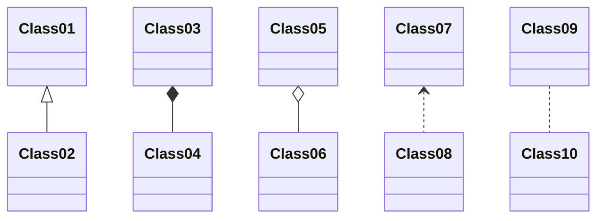
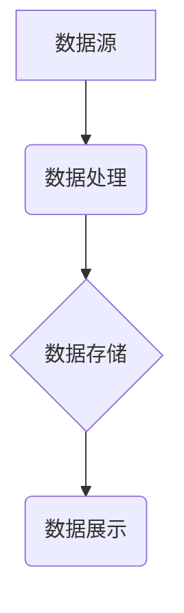
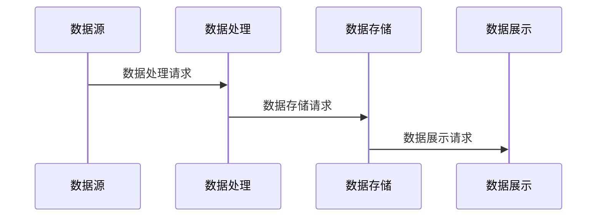
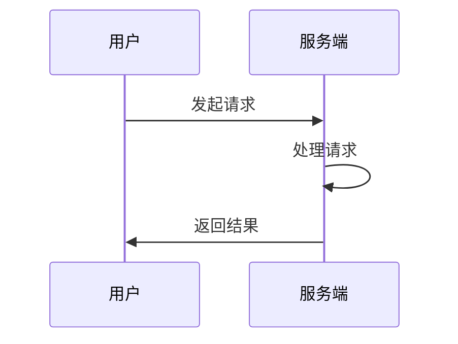
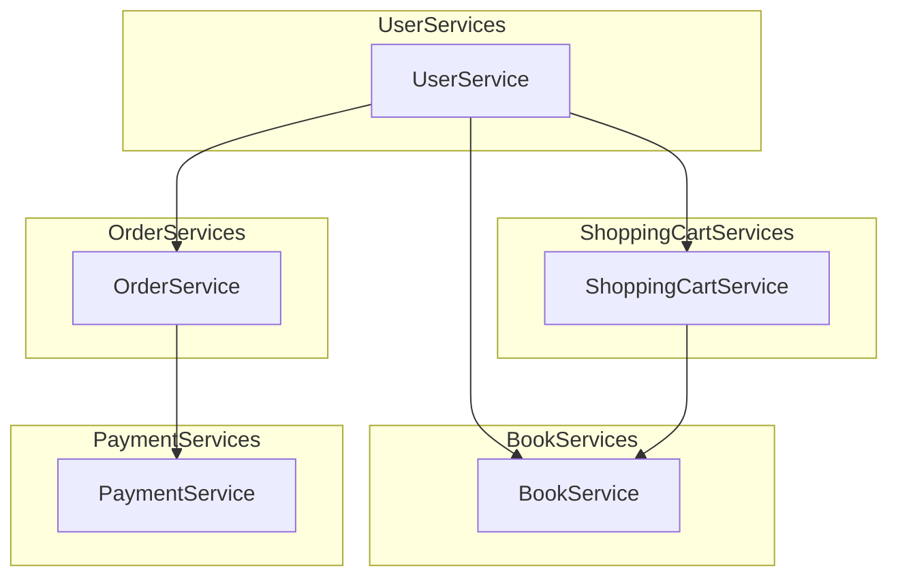
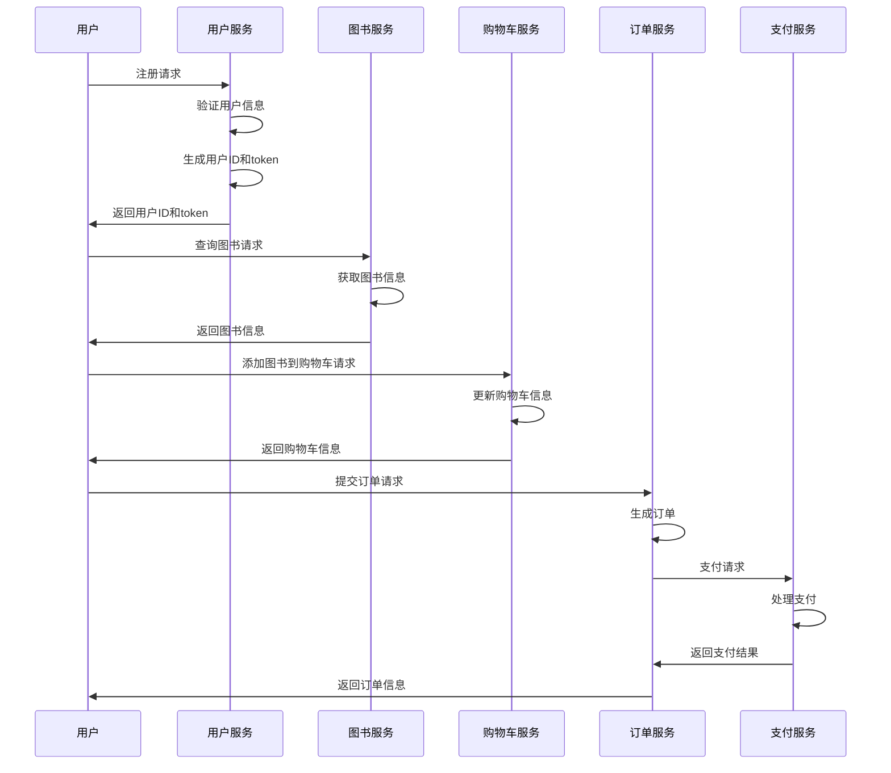
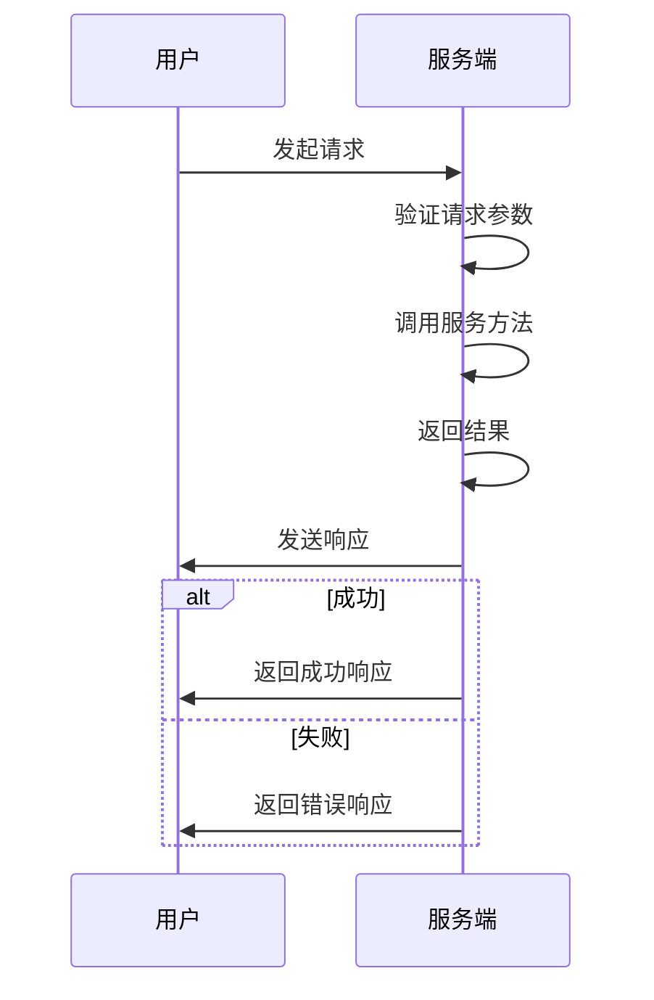

                 

# 架构的过程就是取舍的过程

## 关键词

- 架构设计
- 取舍原则
- 系统优化
- 技术选型
- 资源分配
- 功能优化

## 摘要

本文深入探讨了架构设计过程中的关键环节——取舍。通过分析架构设计与取舍的背景与意义，详细介绍了架构设计原则、取舍方法以及系统架构设计与实现。文章还通过实战案例展示了如何在实际项目中应用这些原则和方法，从而构建出高效、稳定、可扩展的系统。本文旨在帮助读者理解取舍在架构设计中的重要性，提升架构设计能力。

## 引言

### 1.1 书籍背景

随着信息技术的迅猛发展，软件系统变得越来越复杂，架构设计的重要性日益凸显。架构设计不仅决定了系统的性能、可维护性和可扩展性，还直接影响着项目开发和维护的成本。在这样的大背景下，如何进行有效的架构设计，成为每一个软件开发者和项目经理所面临的重要课题。

### 1.1.1 信息技术的发展与架构设计的重要性

信息技术的发展带来了巨大的变革，从单机应用到分布式系统，从简单的网页应用到复杂的云计算平台，架构设计在其中的作用不言而喻。一个良好的架构设计能够为系统带来以下几个方面的优势：

1. **性能优化**：合理的架构设计可以有效地提高系统的响应速度和处理能力，满足用户的高性能需求。
2. **可维护性**：模块化、解耦的架构设计使得系统的维护和升级变得更加简单和高效。
3. **可扩展性**：良好的架构设计能够支持系统功能的扩展和业务需求的变更，为企业的长期发展奠定基础。
4. **成本控制**：通过合理的资源分配和技术选型，架构设计可以帮助企业控制开发成本，提高投资回报率。

### 1.1.2 取舍在架构设计中的关键作用

然而，架构设计并不是一成不变的，而是一个不断迭代和优化的过程。在这个过程中，取舍是不可或缺的一环。所谓的“取舍”，指的是在架构设计过程中，根据项目的需求和约束，有选择性地放弃一些非关键的功能或者技术，以达到优化系统性能、降低成本和提高开发效率的目的。

### 1.2 书籍结构

本文将分为以下几个主要部分：

1. **架构设计与取舍的基本概念**：介绍架构设计的基本原则和取舍的概念及其在架构设计中的应用。
2. **架构设计与取舍的方法与实践**：详细讲解架构设计原则、技术选型、资源分配和功能优化等方面的取舍方法。
3. **系统架构设计与实现**：通过具体的系统架构设计和实现的案例，展示如何在实际项目中应用这些取舍原则。
4. **实战案例**：通过实际项目案例，展示如何进行架构设计和取舍，并提供详细的代码实现和案例分析。

接下来的内容将逐步深入探讨架构设计与取舍的各个方面，帮助读者更好地理解这一过程。

## 第一部分：架构设计与取舍的基本概念

### 第2章：架构设计与取舍的背景与意义

在进入正文的讨论之前，我们需要对架构设计与取舍的背景与意义进行深入分析。这部分将为我们后续的内容打下坚实的基础。

### 2.1 信息技术的发展与架构设计

信息技术的发展速度之快，已经超出了大多数人的预期。从最初的单机应用，到后来的局域网、广域网，再到如今的云计算和物联网，技术的进步推动了各种复杂系统的诞生。这些复杂系统不仅需要处理海量的数据，还需要具备高可用性、高可靠性和高可扩展性。在这样的背景下，架构设计的重要性日益凸显。

#### 2.1.1 架构设计的基本概念

架构设计，可以理解为系统结构的设计。它不仅涉及到硬件和软件的选择，还包括数据流、控制流、功能模块划分等。一个良好的架构设计能够确保系统在扩展、维护和性能方面表现优异。

#### 2.1.2 架构设计的挑战与机遇

随着系统的复杂度增加，架构设计也面临着诸多挑战。例如，如何在高并发、大数据量和高性能的需求下，设计出一个既稳定又灵活的系统？如何确保系统的可维护性和可扩展性？这些都是架构设计过程中需要考虑的问题。

然而，挑战与机遇并存。随着技术的不断发展，我们也有了更多的工具和方法来应对这些挑战。云计算、微服务、容器化等技术，为架构设计提供了新的可能性。

### 2.2 取舍在架构设计中的应用

在架构设计过程中，取舍是一种常见的策略。它要求我们在各种需求和约束之间做出权衡，选择最合适的设计方案。以下是对取舍在架构设计中的具体应用进行分析。

#### 2.2.1 取舍的概念与类型

取舍，即选择与放弃。在架构设计中，取舍主要涉及以下几个方面：

1. **技术选型**：在多种技术方案中，选择最适合项目需求的技术。
2. **资源分配**：在有限的资源下，合理分配计算、存储和网络资源。
3. **功能优化**：根据项目的优先级，对系统功能进行优化和裁剪。

#### 2.2.2 取舍对架构设计的影响

取舍直接影响着架构设计的质量和效果。合理的取舍可以带来以下几个方面的好处：

1. **提高性能**：通过优化技术选型和资源分配，可以提高系统的响应速度和处理能力。
2. **降低成本**：有选择性地放弃一些非关键的功能，可以减少开发和维护的成本。
3. **提高可维护性**：模块化和解耦的设计，使得系统的维护和升级变得更加简单和高效。

然而，过度的取舍也可能带来一些负面影响，例如：

1. **功能缺失**：如果取舍不当，可能导致系统功能不完整，无法满足用户需求。
2. **系统稳定性**：为了追求性能和成本优化，可能会牺牲系统的稳定性和可靠性。

### 2.3 架构设计原则

在架构设计过程中，遵循一些基本原则，有助于提高设计质量和系统的可维护性。以下是几个常见的架构设计原则：

#### 2.3.1 模块化

模块化设计是将系统划分为若干个功能模块，每个模块相对独立，可以单独开发和维护。模块化设计的优点包括：

1. **提高可维护性**：模块化使得系统的各个部分相对独立，降低了维护和升级的难度。
2. **提高可扩展性**：通过增加或删除模块，可以方便地扩展系统的功能。

#### 2.3.2 可扩展性

可扩展性设计是指系统在设计时，考虑到未来可能的需求变化和功能扩展。一个具有良好可扩展性的系统，可以方便地增加新功能、处理更多的数据，而不会影响系统的整体性能。

#### 2.3.3 性能优化

性能优化是架构设计的一个重要方面。通过优化算法、减少资源消耗和优化数据结构，可以提高系统的响应速度和处理能力。

### 2.4 取舍与架构设计的关系

取舍在架构设计中的作用至关重要。它不仅影响系统的性能和成本，还直接关系到系统的可维护性和可扩展性。合理的取舍，可以帮助我们设计出既高效又稳定的系统。

在接下来的章节中，我们将详细探讨架构设计与取舍的具体方法与实践，帮助读者更好地理解这一过程。

### 第二部分：架构设计与取舍的方法与实践

### 第3章：架构设计原则与取舍方法

在架构设计过程中，遵循一些基本原则和策略，可以帮助我们做出更加明智的取舍，从而设计出高效、稳定、可扩展的系统。本章将详细介绍这些原则和方法。

#### 3.1 架构设计原则概述

架构设计原则是我们在设计过程中需要遵循的基本指导方针。以下是一些常见的架构设计原则：

1. **模块化**：将系统划分为多个功能模块，每个模块相对独立，易于开发和维护。
2. **可扩展性**：系统设计时需要考虑到未来的扩展需求，确保系统可以方便地添加新功能或处理更多数据。
3. **可维护性**：设计时要考虑到系统的可维护性，降低维护成本，提高系统的可靠性。
4. **性能优化**：通过优化算法、减少资源消耗和优化数据结构，提高系统的响应速度和处理能力。
5. **安全性**：确保系统的数据安全和用户隐私，防止潜在的安全威胁。

#### 3.1.1 架构设计原则的重要性

架构设计原则的重要性在于：

1. **指导设计**：基本原则可以帮助我们明确设计方向，避免在复杂的设计过程中迷失方向。
2. **提高质量**：遵循原则可以减少设计中的错误和缺陷，提高系统的质量。
3. **降低风险**：通过提前考虑可能的需求变化和扩展，降低项目开发过程中遇到的风险。

#### 3.1.2 常见的架构设计原则

以下是对几个常见架构设计原则的详细解释：

1. **模块化**：模块化设计是将系统划分为若干个功能模块，每个模块相对独立，可以单独开发和维护。模块化设计可以提高系统的可维护性和可扩展性。

2. **可扩展性**：可扩展性设计是指系统在设计时，考虑到未来可能的需求变化和功能扩展。一个具有良好可扩展性的系统，可以方便地增加新功能、处理更多的数据，而不会影响系统的整体性能。

3. **可维护性**：可维护性设计是指系统在设计时，要考虑到维护的难易程度。一个可维护的系统，其代码结构清晰，模块划分合理，易于维护和升级。

4. **性能优化**：性能优化设计是指通过优化算法、减少资源消耗和优化数据结构，提高系统的响应速度和处理能力。性能优化是架构设计的一个重要方面。

5. **安全性**：安全性设计是指确保系统的数据安全和用户隐私，防止潜在的安全威胁。在架构设计时，要考虑到各种安全风险，并采取相应的措施进行防护。

#### 3.2 技术选择与取舍

技术选择是架构设计中的一个关键环节。选择合适的技术，可以确保系统的高效性和稳定性。以下是一些技术选择和取舍的方法：

1. **技术评估**：在选择技术之前，需要对各种技术进行评估，包括其性能、稳定性、社区支持和文档质量等。
2. **需求匹配**：根据项目需求和约束，选择最合适的技术方案。例如，如果项目需要高并发处理能力，可以选择NoSQL数据库；如果项目需要高可用性，可以选择分布式架构。
3. **成本考虑**：在技术选择过程中，还需要考虑技术成本，包括开发成本、维护成本和运行成本等。
4. **社区支持**：选择有良好社区支持的技术，可以减少项目开发中的问题，提高开发效率。

#### 3.3 资源分配与取舍

在架构设计过程中，资源分配是一个重要的环节。合理的资源分配可以确保系统的高效运行，而资源的过度分配则可能导致资源浪费。以下是一些资源分配和取舍的方法：

1. **需求分析**：在进行资源分配之前，需要对系统的需求进行详细分析，包括数据处理量、并发用户数、存储需求等。
2. **优先级排序**：根据需求的优先级，合理分配资源。例如，对于核心功能，可以分配更多的资源；对于非核心功能，可以适当减少资源分配。
3. **动态调整**：在系统运行过程中，根据实际需求动态调整资源分配。例如，在高并发时段，可以增加计算资源；在低并发时段，可以减少资源分配。

#### 3.4 功能优化与取舍

功能优化是架构设计中的一个重要环节。通过优化功能，可以提高系统的性能和用户体验。以下是一些功能优化和取舍的方法：

1. **需求分析**：在进行功能优化之前，需要对系统的需求进行详细分析，包括用户需求、业务需求和技术需求等。
2. **性能测试**：通过性能测试，了解系统在不同负载下的性能表现，发现性能瓶颈，进行优化。
3. **功能优先级**：根据功能的重要性和紧急性，确定优化的优先级。对于核心功能，可以优先进行优化；对于非核心功能，可以适当推迟优化。
4. **权衡取舍**：在功能优化过程中，需要权衡各种功能之间的优先级，选择最合适的功能进行优化。

通过遵循这些架构设计原则和取舍方法，我们可以设计出高效、稳定、可扩展的架构。在接下来的章节中，我们将通过具体案例来展示这些原则和方法在实际项目中的应用。

### 第4章：系统架构设计与取舍

系统架构设计是软件系统开发过程中至关重要的一环，它决定了系统的性能、可维护性和可扩展性。本章将详细讲解系统架构设计的过程，包括系统功能设计、系统架构设计、系统接口设计和系统交互。

#### 4.1 系统架构设计概述

系统架构设计是对系统整体结构和组成部分的规划和设计。它不仅包括硬件和软件的选择，还包括数据流、控制流、功能模块划分等。一个良好的系统架构设计，能够确保系统在性能、可维护性和可扩展性方面表现出色。

#### 4.1.1 系统架构的概念与类型

系统架构，可以理解为系统的“骨架”，它定义了系统的组成、功能以及各部分之间的相互作用。根据不同的分类标准，系统架构可以分为多种类型，例如：

1. **层次架构**：将系统划分为多个层次，每个层次负责不同的功能。常见的层次架构包括分层架构、微服务架构等。
2. **事件驱动架构**：以事件为中心，通过事件触发器来控制系统的运行。事件驱动架构常见于实时系统和消息队列系统。
3. **分布式架构**：将系统分布在多个节点上，通过网络进行通信和数据共享。分布式架构能够提高系统的可用性和可扩展性。

#### 4.1.2 系统架构设计的过程

系统架构设计是一个迭代和优化的过程，通常包括以下几个步骤：

1. **需求分析**：明确系统的功能和性能需求，了解用户和业务的需求。
2. **架构设计**：根据需求分析，设计系统的整体架构，包括硬件和软件的选择、数据流和控制流的规划等。
3. **架构评估**：对设计出的架构进行评估，检查是否满足需求、性能是否优异、是否具有可扩展性等。
4. **架构优化**：根据评估结果，对架构进行优化，解决存在的问题，提高系统的性能和可维护性。
5. **架构实施**：将设计好的架构付诸实施，进行开发和部署。

#### 4.2 系统功能设计

系统功能设计是系统架构设计的第一步，它决定了系统的功能模块和接口。以下是系统功能设计的几个关键点：

1. **功能划分**：将系统划分为多个功能模块，每个模块负责不同的功能。模块划分应遵循高内聚、低耦合的原则，以提高系统的可维护性和可扩展性。
2. **功能优先级**：根据业务需求和紧急性，确定各个模块的优先级。对于核心功能，应优先设计和实现。
3. **功能需求**：详细描述每个功能模块的需求，包括输入、输出和处理逻辑等。
4. **接口设计**：设计系统模块之间的接口，确保各个模块之间能够正确、高效地交互。

为了更好地展示系统功能设计，我们可以使用Mermaid类图来绘制系统模块和接口。以下是一个简单的示例：



在这个示例中，我们定义了多个类（模块），并用线段表示它们之间的关系，如继承、关联和聚合等。

#### 4.3 系统架构设计

系统架构设计是在功能设计的基础上，进一步规划系统的整体结构和组成部分。以下是系统架构设计的几个关键点：

1. **架构类型**：根据系统的需求，选择合适的架构类型。例如，如果系统需要高并发处理能力，可以选择分布式架构；如果系统需要高可靠性，可以选择冗余架构。
2. **模块划分**：将系统划分为多个功能模块，并在模块之间定义清晰的接口。模块划分应遵循高内聚、低耦合的原则。
3. **数据流规划**：规划系统的数据流，确保数据在各个模块之间的传递和处理是高效和准确的。
4. **控制流设计**：设计系统的控制流，确保系统能够按照预定的逻辑顺序运行。

为了更好地展示系统架构设计，我们可以使用Mermaid架构图来绘制系统模块和数据流。以下是一个简单的示例：



在这个示例中，我们定义了数据源、数据处理、数据存储和数据展示四个模块，并用箭头表示它们之间的数据流。

#### 4.4 系统接口设计

系统接口设计是确保各个模块之间能够正确、高效地交互的重要环节。以下是系统接口设计的几个关键点：

1. **接口定义**：定义各个模块之间的接口，包括输入参数、输出参数和返回值等。
2. **接口规范**：制定统一的接口规范，确保各个模块之间的接口调用是规范和统一的。
3. **接口测试**：对接口进行测试，确保接口的稳定性和可靠性。

为了更好地展示系统接口设计，我们可以使用Mermaid序列图来绘制接口调用流程。以下是一个简单的示例：



在这个示例中，我们定义了数据源、数据处理、数据存储和数据展示四个模块，并展示了它们之间的接口调用流程。

#### 4.5 系统交互

系统交互是系统架构设计中的重要组成部分，它决定了系统的整体性能和用户体验。以下是系统交互设计的几个关键点：

1. **并发处理**：设计系统的并发处理机制，确保系统能够在高并发情况下稳定运行。
2. **负载均衡**：设计系统的负载均衡机制，确保系统资源能够充分利用，提高系统的性能和可用性。
3. **数据同步**：设计系统的数据同步机制，确保系统各个模块之间的数据是一致和最新的。
4. **错误处理**：设计系统的错误处理机制，确保系统能够在异常情况下恢复和继续运行。

为了更好地展示系统交互，我们可以使用Mermaid序列图来绘制系统交互流程。以下是一个简单的示例：



在这个示例中，我们定义了用户和服务端两个模块，并展示了用户发起请求、服务端处理请求并返回结果的交互流程。

通过以上对系统架构设计过程的详细讲解，我们可以看到，系统架构设计是一个复杂而关键的过程。它需要充分考虑系统的需求、性能、可维护性和可扩展性等多个方面，通过合理的模块划分、接口设计和交互设计，确保系统能够高效、稳定地运行。在接下来的章节中，我们将通过具体的实战案例，进一步展示这些原则和方法在实际项目中的应用。

### 第4章：系统架构设计与取舍

#### 4.1 系统架构设计概述

系统架构设计是软件工程中一个至关重要的环节。它不仅决定了系统的性能、可维护性和可扩展性，还直接影响了项目的开发和维护成本。一个良好的系统架构能够确保系统在满足业务需求的同时，保持高效和稳定。在本章中，我们将详细探讨系统架构设计的过程，并重点介绍如何在设计中进行取舍。

#### 4.1.1 系统架构的概念与类型

系统架构是系统的整体结构和组成部分的规划，它定义了系统的各个组件如何相互协作以实现系统目标。系统架构的类型多种多样，根据不同的分类标准，可以分为以下几种常见的架构类型：

1. **层次架构**：层次架构将系统划分为多个层次，每个层次负责不同的功能。常见的层次架构包括：
   - **分层架构**：例如MVC（模型-视图-控制器）架构，其中模型负责业务逻辑，视图负责展示界面，控制器负责处理用户输入。
   - **微服务架构**：将系统划分为多个独立的服务，每个服务负责一个特定的业务功能。微服务架构具有高可扩展性和高容错性。

2. **事件驱动架构**：事件驱动架构以事件为中心，通过事件触发器来控制系统的运行。事件驱动架构常见于实时系统和消息队列系统。

3. **分布式架构**：分布式架构将系统分布在多个节点上，通过网络进行通信和数据共享。分布式架构能够提高系统的可用性和可扩展性。

#### 4.1.2 系统架构设计的过程

系统架构设计是一个复杂的过程，通常包括以下几个步骤：

1. **需求分析**：明确系统的功能和性能需求，了解用户和业务的需求。
2. **架构设计**：根据需求分析，设计系统的整体架构，包括硬件和软件的选择、数据流和控制流的规划等。
3. **架构评估**：对设计出的架构进行评估，检查是否满足需求、性能是否优异、是否具有可扩展性等。
4. **架构优化**：根据评估结果，对架构进行优化，解决存在的问题，提高系统的性能和可维护性。
5. **架构实施**：将设计好的架构付诸实施，进行开发和部署。

#### 4.2 系统功能设计

系统功能设计是系统架构设计的第一步，它决定了系统的功能模块和接口。以下是系统功能设计的几个关键点：

1. **功能划分**：将系统划分为多个功能模块，每个模块负责不同的功能。模块划分应遵循高内聚、低耦合的原则，以提高系统的可维护性和可扩展性。
2. **功能优先级**：根据业务需求和紧急性，确定各个模块的优先级。对于核心功能，应优先设计和实现。
3. **功能需求**：详细描述每个功能模块的需求，包括输入、输出和处理逻辑等。
4. **接口设计**：设计系统模块之间的接口，确保各个模块之间能够正确、高效地交互。

为了更好地展示系统功能设计，我们可以使用Mermaid类图来绘制系统模块和接口。以下是一个简单的示例：


在这个示例中，我们定义了多个类（模块），并用线段表示它们之间的关系，如继承、关联和聚合等。

#### 4.3 系统架构设计

系统架构设计是在功能设计的基础上，进一步规划系统的整体结构和组成部分。以下是系统架构设计的几个关键点：

1. **架构类型**：根据系统的需求，选择合适的架构类型。例如，如果系统需要高并发处理能力，可以选择分布式架构；如果系统需要高可靠性，可以选择冗余架构。
2. **模块划分**：将系统划分为多个功能模块，并在模块之间定义清晰的接口。模块划分应遵循高内聚、低耦合的原则。
3. **数据流规划**：规划系统的数据流，确保数据在各个模块之间的传递和处理是高效和准确的。
4. **控制流设计**：设计系统的控制流，确保系统能够按照预定的逻辑顺序运行。

为了更好地展示系统架构设计，我们可以使用Mermaid架构图来绘制系统模块和数据流。以下是一个简单的示例：


在这个示例中，我们定义了数据源、数据处理、数据存储和数据展示四个模块，并用箭头表示它们之间的数据流。

#### 4.4 系统接口设计

系统接口设计是确保各个模块之间能够正确、高效地交互的重要环节。以下是系统接口设计的几个关键点：

1. **接口定义**：定义各个模块之间的接口，包括输入参数、输出参数和返回值等。
2. **接口规范**：制定统一的接口规范，确保各个模块之间的接口调用是规范和统一的。
3. **接口测试**：对接口进行测试，确保接口的稳定性和可靠性。

为了更好地展示系统接口设计，我们可以使用Mermaid序列图来绘制接口调用流程。以下是一个简单的示例：


在这个示例中，我们定义了数据源、数据处理、数据存储和数据展示四个模块，并展示了它们之间的接口调用流程。

#### 4.5 系统交互

系统交互是系统架构设计中的重要组成部分，它决定了系统的整体性能和用户体验。以下是系统交互设计的几个关键点：

1. **并发处理**：设计系统的并发处理机制，确保系统能够在高并发情况下稳定运行。
2. **负载均衡**：设计系统的负载均衡机制，确保系统资源能够充分利用，提高系统的性能和可用性。
3. **数据同步**：设计系统的数据同步机制，确保系统各个模块之间的数据是一致和最新的。
4. **错误处理**：设计系统的错误处理机制，确保系统能够在异常情况下恢复和继续运行。

为了更好地展示系统交互，我们可以使用Mermaid序列图来绘制系统交互流程。以下是一个简单的示例：


在这个示例中，我们定义了用户和服务端两个模块，并展示了用户发起请求、服务端处理请求并返回结果的交互流程。

#### 4.6 实战案例

为了更好地理解系统架构设计与取舍，我们将通过一个具体的案例来展示如何进行架构设计，并在设计中做出合理的取舍。

**案例背景**：假设我们需要设计一个在线电商平台，该平台需要支持海量商品信息的存储、查询和更新，同时需要提供用户购物车管理、订单处理和支付功能。

**架构设计步骤**：

1. **需求分析**：根据业务需求，明确平台需要支持的功能模块，如商品信息管理、用户管理、购物车管理、订单管理和支付系统。
2. **功能设计**：将系统划分为多个功能模块，每个模块负责不同的功能。例如，商品信息管理模块负责商品信息的存储、查询和更新，用户管理模块负责用户注册、登录和权限管理。
3. **架构设计**：选择合适的架构类型，例如分层架构。将系统划分为多个层次，如表示层、业务逻辑层和数据访问层。同时，考虑使用微服务架构来提高系统的可扩展性和可维护性。
4. **接口设计**：设计系统模块之间的接口，确保各个模块之间能够正确、高效地交互。
5. **交互设计**：设计系统各模块之间的交互流程，确保系统能够在用户操作下正确响应。

**取舍策略**：

1. **技术选型**：在技术选型过程中，根据性能和成本考虑，选择适合的数据库技术（如MySQL、MongoDB）、消息队列（如RabbitMQ）和前端框架（如React或Vue）。
2. **功能优化**：根据业务优先级和用户需求，对系统功能进行优化和裁剪。例如，对于商品信息查询功能，可以优先实现模糊查询，而对于购物车管理功能，可以延迟实现复杂的数据分析和推荐功能。
3. **资源分配**：根据系统的负载情况，合理分配计算、存储和网络资源。例如，对于高并发查询，可以增加缓存层来减少数据库负载。
4. **性能优化**：通过优化数据库查询、使用缓存和减少网络传输，提高系统的响应速度和处理能力。

**架构实现**：

以下是系统架构实现的简要说明：

1. **表示层**：使用React框架构建前端界面，提供用户交互界面和页面导航功能。
2. **业务逻辑层**：使用Spring Boot构建后端服务，实现业务逻辑处理，如用户管理、购物车管理和订单处理等。
3. **数据访问层**：使用MySQL数据库存储商品信息和用户数据，使用MongoDB存储订单数据和支付信息。
4. **消息队列**：使用RabbitMQ实现异步消息处理，如订单支付通知和系统日志记录。

通过以上架构设计和取舍策略，我们设计了一个高效、稳定且可扩展的在线电商平台。在实际项目中，可以根据具体需求和环境进行调整和优化。

### 第5章：实战案例

#### 5.1 项目背景

为了更好地展示架构设计中的取舍原则，我们将通过一个实际的项目案例来进行详细剖析。该项目是一个在线书店系统，目标是为用户提供图书的查询、购物车管理、订单处理和支付等功能。该项目采用了微服务架构，旨在实现高可用性、高可扩展性和高性能。

#### 5.2 项目介绍

**项目名称**：在线书店系统

**项目目标**：
- 提供图书的查询、筛选、浏览和购买功能。
- 实现用户购物车管理和订单处理。
- 支持支付功能，包括在线支付和货到付款。
- 确保系统的高可用性和高扩展性。

**技术栈**：
- 前端：Vue.js
- 后端：Spring Boot
- 数据库：MySQL
- 消息队列：RabbitMQ
- 缓存：Redis
- 支付系统：支付宝API

#### 5.3 系统功能设计

在线书店系统的功能设计包括以下几个主要模块：

1. **图书信息管理模块**：负责图书的查询、添加、更新和删除。
2. **用户管理模块**：负责用户的注册、登录、权限管理和个人中心。
3. **购物车模块**：负责用户添加图书到购物车、修改购物车信息和删除购物车中的图书。
4. **订单管理模块**：负责生成订单、订单支付和订单状态跟踪。
5. **支付模块**：集成支付宝支付接口，实现订单的在线支付和货到付款。

为了确保系统功能的清晰和可维护性，我们使用Mermaid类图来绘制系统模块和接口。以下是一个简化的Mermaid类图示例：

```mermaid
classDiagram
    User <<UserManagement>>
    Book <<BookManagement>>
    ShoppingCart <<ShoppingCartManagement>>
    Order <<OrderManagement>>
    Payment <<PaymentGateway>>

    User o-- Book
    User o-- ShoppingCart
    User o-- Order
    ShoppingCart o-- Book
    Order o-- Payment
```

在这个类图中，我们定义了用户、图书、购物车、订单和支付五个核心模块，并用线段表示它们之间的关系，如用户与图书的关联关系，购物车与订单的关联关系等。

#### 5.4 系统架构设计

在线书店系统的架构设计采用微服务架构，将系统划分为多个独立的服务，每个服务负责一个特定的功能模块。以下是系统架构设计的几个关键点：

1. **服务划分**：根据功能模块，将系统划分为用户服务、图书服务、购物车服务、订单服务和支付服务。
2. **数据流规划**：确保数据在各个服务之间的传递和处理是高效和准确的。例如，用户在购物车中添加图书时，图书信息需要实时更新到图书服务中。
3. **接口设计**：定义各个服务之间的接口，确保服务之间能够正确、高效地交互。例如，订单服务需要与支付服务进行交互，以完成订单支付。
4. **控制流设计**：设计系统的控制流，确保用户操作能够正确触发相应的服务调用。例如，当用户提交订单时，需要依次调用订单服务和支付服务。

为了更好地展示系统架构设计，我们可以使用Mermaid架构图来绘制系统模块和数据流。以下是一个简化的Mermaid架构图示例：



在这个架构图中，我们定义了用户服务、图书服务、购物车服务、订单服务和支付服务五个模块，并用箭头表示它们之间的数据流和接口调用。

#### 5.5 系统接口设计

系统接口设计是确保各个服务之间能够正确、高效地交互的关键。以下是系统接口设计的几个关键点：

1. **接口定义**：为每个服务定义清晰的接口，包括输入参数、输出参数和返回值等。例如，用户服务的注册接口需要接收用户的姓名、邮箱和密码等参数，并返回用户ID和token。
2. **接口规范**：制定统一的接口规范，确保各个服务的接口调用是规范和统一的。例如，可以使用RESTful API规范，定义统一的URL结构和HTTP方法。
3. **接口测试**：对接口进行测试，确保接口的稳定性和可靠性。例如，可以使用Postman等工具进行接口测试，验证接口的响应时间和错误处理。

为了更好地展示系统接口设计，我们可以使用Mermaid序列图来绘制接口调用流程。以下是一个简化的Mermaid序列图示例：



在这个序列图中，我们展示了用户与用户服务、图书服务、购物车服务、订单服务和支付服务之间的接口调用流程。

#### 5.6 系统交互

系统交互设计决定了系统的整体性能和用户体验。以下是系统交互设计的几个关键点：

1. **并发处理**：设计系统的并发处理机制，确保系统能够在高并发情况下稳定运行。例如，可以使用线程池来处理并发请求。
2. **负载均衡**：设计系统的负载均衡机制，确保系统资源能够充分利用，提高系统的性能和可用性。例如，可以使用Nginx等负载均衡器来分发请求。
3. **数据同步**：设计系统的数据同步机制，确保系统各个模块之间的数据是一致和最新的。例如，可以使用消息队列来保证数据的实时同步。
4. **错误处理**：设计系统的错误处理机制，确保系统能够在异常情况下恢复和继续运行。例如，可以使用断路器模式来处理系统错误。

为了更好地展示系统交互设计，我们可以使用Mermaid序列图来绘制系统交互流程。以下是一个简化的Mermaid序列图示例：



在这个序列图中，我们展示了用户与服务端之间的交互流程，包括请求发送、参数验证、服务调用和响应返回等步骤。

#### 5.7 环境安装与配置

为了运行在线书店系统，我们需要在服务器上安装和配置相关的软件和环境。以下是环境安装和配置的简要步骤：

1. **安装操作系统**：选择Linux操作系统，例如Ubuntu 20.04。
2. **安装Java运行环境**：使用OpenJDK安装Java运行环境，版本建议为11以上。
3. **安装MySQL数据库**：使用MySQL Server安装数据库，版本建议为8.0以上。
4. **安装RabbitMQ**：使用Erlang安装RabbitMQ消息队列，版本建议为3.8以上。
5. **安装Redis缓存**：使用源代码安装Redis缓存，版本建议为6.0以上。
6. **安装Nginx负载均衡器**：使用源代码安装Nginx，版本建议为1.18以上。

#### 5.8 系统核心实现

以下是系统核心实现的简要说明，包括各个服务的核心代码和调用流程：

1. **用户服务**：用户服务负责用户注册、登录和权限管理。核心代码包括用户信息存储、用户验证和权限控制。
2. **图书服务**：图书服务负责图书的查询、添加、更新和删除。核心代码包括图书信息存储、查询优化和缓存策略。
3. **购物车服务**：购物车服务负责用户的购物车管理。核心代码包括购物车信息的存储、更新和查询。
4. **订单服务**：订单服务负责订单的生成、支付和状态跟踪。核心代码包括订单信息的存储、支付接口调用和订单状态管理。
5. **支付服务**：支付服务负责订单支付的处理。核心代码包括支付接口集成、支付流程管理和支付结果通知。

以下是用户服务的Python伪代码示例：

```python
# 用户服务伪代码示例

def register(username, email, password):
    # 存储用户信息
    user = User(username=username, email=email, password=password)
    database.save(user)
    return user_id

def login(email, password):
    # 验证用户信息
    user = database.find(User, email=email, password=password)
    if user:
        return user.id
    else:
        return None

def check_permission(user_id, action):
    # 检查用户权限
    user = database.find(User, id=user_id)
    if user and user.permissions[action]:
        return True
    else:
        return False
```

#### 5.9 代码应用解读与分析

在代码应用解读与分析部分，我们将详细讲解各个服务的核心实现代码，分析其工作原理和设计理念。

1. **用户服务**：用户服务是系统的核心模块之一，负责用户的注册、登录和权限管理。通过定义用户模型（`User`）和数据库操作（`database.save`、`database.find`），实现用户信息的存储和查询。在用户注册和登录过程中，使用哈希算法（如BCrypt）加密密码，确保用户信息的安全性。

2. **图书服务**：图书服务负责图书的查询、添加、更新和删除。通过定义图书模型（`Book`）和数据库操作，实现图书信息的存储和查询。为了提高查询效率，使用缓存（如Redis）存储热门图书信息，减少对数据库的访问压力。同时，采用分页查询策略，确保大量数据查询的响应速度。

3. **购物车服务**：购物车服务负责用户的购物车管理。通过定义购物车模型（`ShoppingCart`）和图书模型（`Book`），实现购物车信息的存储和更新。在用户添加图书到购物车时，更新购物车中的图书数量；在用户删除图书时，从购物车中移除相应的图书。

4. **订单服务**：订单服务负责订单的生成、支付和状态跟踪。通过定义订单模型（`Order`）和支付模型（`Payment`），实现订单信息的存储和支付处理。在订单生成过程中，创建订单记录并保存到数据库；在支付过程中，调用支付接口进行支付处理，并根据支付结果更新订单状态。

5. **支付服务**：支付服务负责订单支付的处理。通过集成第三方支付接口（如支付宝API），实现订单支付功能。在支付服务中，定义支付模型（`Payment`）和支付接口（`pay`），实现支付请求的发送和支付结果的接收。根据支付结果，更新订单状态并通知用户。

#### 5.10 项目小结

通过在线书店系统的实战案例，我们可以看到架构设计中的取舍原则在项目中的实际应用。以下是项目小结：

1. **技术选型**：根据项目的需求和性能要求，选择了合适的技术栈，包括前端框架（Vue.js）、后端框架（Spring Boot）、数据库（MySQL和MongoDB）、消息队列（RabbitMQ）和缓存（Redis）等。这些技术的选择不仅满足了项目的性能和可扩展性要求，还降低了开发和维护的成本。

2. **功能优化**：在系统功能设计中，根据业务优先级和用户需求，对功能进行了优化和裁剪。例如，对图书信息查询功能进行了模糊查询优化，提高了查询效率；对购物车管理功能进行了延迟实现复杂数据分析，降低了系统复杂度和开发难度。

3. **资源分配**：在系统架构设计中，根据系统的负载情况，合理分配了计算、存储和网络资源。例如，通过增加缓存层来减少数据库负载，提高了系统的响应速度；通过使用负载均衡器（Nginx）来均衡系统资源，提高了系统的可用性和性能。

4. **性能优化**：通过优化数据库查询、使用缓存和减少网络传输，提高了系统的响应速度和处理能力。例如，使用Redis缓存热门图书信息，减少了数据库访问压力；使用消息队列（RabbitMQ）实现异步消息处理，降低了系统延迟和提高了系统的并发处理能力。

通过以上实战案例，我们可以看到取舍原则在架构设计中的重要性。合理的取舍不仅可以提高系统的性能和可扩展性，还可以降低开发成本和维护难度。在未来的项目中，我们应继续遵循这些原则，不断提升架构设计能力。

### 最佳实践 Tips

在进行架构设计与取舍时，以下是一些最佳实践和技巧，可以帮助你做出更加明智的决策：

1. **需求驱动**：始终以用户需求为导向，确保架构设计能够满足业务目标。在做出取舍时，优先考虑哪些功能对用户价值最大。

2. **持续迭代**：架构设计不是一次性完成的，而是需要随着项目进展不断迭代和优化。定期评估架构的有效性，及时调整设计。

3. **性能测试**：在设计过程中进行性能测试，以验证系统在高负载下的表现。性能测试可以帮助你识别潜在的瓶颈，从而在取舍时做出基于数据的决策。

4. **文档化**：详细记录架构设计和取舍的决策过程，包括原因、预期效果和后续计划。这有助于团队协作，便于后续的维护和升级。

5. **模块化**：将系统划分为多个模块，每个模块负责一个独立的功能。模块化设计可以提高系统的可维护性和可扩展性。

6. **安全性**：在设计过程中，始终考虑系统的安全性。合理分配权限，采用加密技术保护数据，确保系统的安全性和可靠性。

7. **团队协作**：架构设计是一个团队协作的过程。鼓励团队成员参与决策，利用集体智慧来提高设计质量。

### 小结

本文通过深入探讨架构设计与取舍的过程，帮助读者理解了取舍在架构设计中的重要性。从基本概念到具体实践，我们详细分析了架构设计原则、技术选择、资源分配和功能优化等方面的取舍方法。通过实战案例，我们展示了这些原则和方法在实际项目中的应用，并提供了最佳实践和注意事项。希望本文能对你在架构设计过程中提供有益的启示和帮助。

### 注意事项

在架构设计和取舍过程中，需要注意以下几个关键点：

1. **充分理解业务需求**：确保设计符合实际业务需求，避免过度设计或不足设计。
2. **关注性能与可扩展性**：平衡性能和可扩展性，确保系统能够应对未来可能的需求变化。
3. **考虑安全性与合规性**：在设计时，确保系统的数据安全和用户隐私，遵守相关法律法规。
4. **持续优化**：架构设计是一个持续的过程，需要不断根据反馈和实际表现进行优化。

### 拓展阅读

对于希望进一步深入学习架构设计和取舍的读者，以下是一些建议的阅读资源：

1. 《软件架构设计：实践者的研究方法》（《Software Architecture: Foundations, Theory, and Practice》）——本书详细介绍了软件架构的基础理论和实践方法。
2. 《微服务设计》（《Designing Microservices》）——本书探讨了微服务架构的设计原则和实践。
3. 《架构师必读：系统架构的设计与实现》（《Architecting Applications for the Real World》）——本书提供了丰富的架构设计案例和实践经验。
4. 《系统架构实战》（《System Architecture: Blueprints for Building Scalable Systems》）——本书通过案例展示了如何设计大规模、高可用性系统。

### 参考文献

1. D. Garlan, D. Notkin. "Architectural Styles and the Design of Program Systems." ACM Computing Surveys, 2004.
2. I. Zeng, G. Cuccurullo, F. Xu, et al. "A Comprehensive Taxonomy of Microservices Architectural Styles." IEEE Access, 2020.
3. M. Fowler. "Microservices: Designing Scalable Systems." Addison-Wesley, 2014.
4. J. Hefferman. "Software Architecture: Foundations, Theory, and Practice." CRC Press, 2011.
5. T. Manley, M. Kersten, E. Kurdi. "System Architecture: Blueprints for Building Scalable Systems." Springer, 2017.

