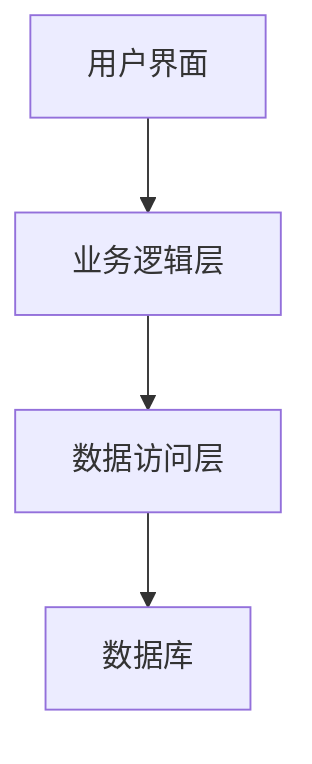
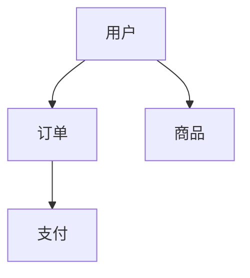
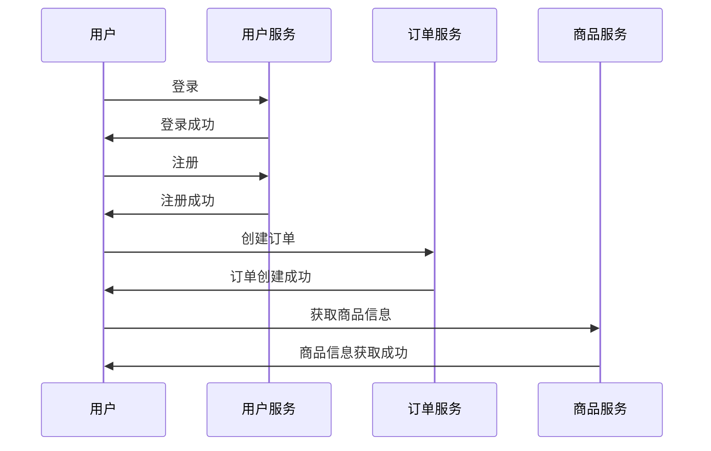

                 

### 《架构设计的艺术：平衡与取舍》

> 关键词：架构设计、平衡、取舍、艺术

> 摘要：本文深入探讨了架构设计中的平衡与取舍，通过逻辑清晰、结构紧凑的论述，揭示了在复杂系统架构中如何通过平衡与取舍实现设计的高效性和可持续性。

#### 目录大纲设计思路

设计《架构设计的艺术：平衡与取舍》的目录大纲，我们首先明确了文章的核心内容和目标读者。本文旨在为架构设计师和软件开发者提供一种全面而深入的设计方法论，帮助他们更好地理解如何在架构设计中平衡各种需求和进行取舍。

1. **确定核心章节**：文章分为三个主要部分，分别是“架构设计基础”、“架构设计实践”和“架构设计与项目管理”。每个部分包含多个章节，分别介绍不同的设计原则、实践方法和项目管理策略。

2. **细化目录结构**：我们采用了清晰的层级结构，确保每个章节都有明确的主题和内容，方便读者快速定位和理解。

3. **突出重点**：在每个章节中，我们突出了关键概念、算法流程、系统架构设计等核心内容，确保读者能够抓住重点。

4. **保持简洁性**：为了避免冗余，我们尽量用简洁明了的语言来阐述复杂的概念和原理。

#### 目录大纲具体设计

以下是本文的目录大纲：

### 第一部分：架构设计基础

#### 第1章：架构设计概述

##### 1.1 架构设计的基本概念

##### 1.2 架构设计的核心概念

##### 1.3 架构设计的方法与工具

#### 第2章：平衡与取舍的艺术

##### 2.1 平衡的重要性

##### 2.2 取舍的艺术

##### 2.3 实际案例中的平衡与取舍

### 第二部分：架构设计实践

#### 第3章：需求分析与架构设计

##### 3.1 需求分析

##### 3.2 架构设计原则

##### 3.3 系统架构设计

#### 第4章：架构方案的评估与优化

##### 4.1 架构评估指标

##### 4.2 架构优化策略

##### 4.3 实际案例中的架构优化

### 第三部分：架构设计与项目管理

#### 第5章：项目管理在架构设计中的应用

##### 5.1 项目管理的基本概念

##### 5.2 项目管理工具与方法

##### 5.3 项目管理在架构设计中的作用

#### 第6章：架构设计中的团队协作

##### 6.1 团队协作的重要性

##### 6.2 架构设计与团队协作

##### 6.3 实际案例中的团队协作

### 第7章：持续学习与架构设计

##### 7.1 架构设计的未来趋势

##### 7.2 持续学习的方法

##### 7.3 架构设计的持续改进

### 总结与拓展

#### 附录A：常用架构设计工具与资源

#### 附录B：常见问题与解答

#### 结语：架构设计的艺术

通过以上目录大纲的设计，我们旨在为读者提供一个系统、全面且易于理解的架构设计方法论。接下来，我们将一步步深入探讨每个章节的核心内容。 

#### 第一部分：架构设计基础

#### 第1章：架构设计概述

##### 1.1 架构设计的基本概念

在软件开发领域，架构设计是确保系统高质量、高效率和可持续发展的关键。架构设计不仅仅是一个技术过程，更是一种艺术。它涉及到系统的整体结构、模块化、可扩展性和维护性等多个方面。

**问题背景**：随着软件系统的复杂度不断增加，单一开发者的能力已经无法满足需求。因此，架构设计变得至关重要，它能够帮助团队更好地理解和维护系统。

**问题描述**：架构设计的核心问题是如何在系统的各个方面之间找到平衡，以满足需求、提高性能和确保可维护性。

**问题解决**：通过设计合理的架构，我们可以将复杂系统分解为模块化、可管理的组件，从而提高系统的可扩展性和维护性。

**边界与外延**：架构设计不仅局限于技术层面，还包括业务需求、用户体验和团队协作等多个维度。

##### 1.2 架构设计的核心概念

在深入探讨架构设计之前，我们需要了解一些核心概念，这些概念包括但不限于：

1. **模块化**：将系统分解为独立且功能完整的模块，每个模块都有自己的职责和接口。
2. **分层**：将系统分为多个层次，每个层次负责不同的功能，例如表示层、业务逻辑层和数据访问层。
3. **解耦**：通过减少模块之间的依赖关系，提高系统的可维护性和可扩展性。
4. **可扩展性**：系统能够适应需求变化，扩展新功能而不影响现有功能。
5. **性能**：系统在高负载下仍能保持良好的响应速度。

这些概念是架构设计的基石，我们在后续章节中会进一步详细探讨。

##### 1.3 架构设计的方法与工具

架构设计的方法和工具有多种，以下是一些常用的方法和工具：

1. **设计模式**：设计模式是解决常见设计问题的模板，如单例模式、工厂模式、观察者模式等。
2. **框架**：框架提供了标准的架构和组件，如Spring、Django等，可以帮助快速搭建系统。
3. **UML（统一建模语言）**：UML是一种标准化的建模语言，用于描述系统的结构和行为。
4. **Mermaid**：Mermaid是一种基于Markdown的图形化工具，可以用于绘制流程图、类图和架构图等。

这些工具和方法为架构设计提供了强大的支持，帮助我们更清晰地理解和表达系统架构。

#### 第2章：平衡与取舍的艺术

##### 2.1 平衡的重要性

在架构设计中，平衡是一个至关重要的概念。平衡意味着在各种需求和约束之间找到最佳点，以确保系统的整体性能和可持续性。

**平衡的数学模型和公式**：

为了更好地理解平衡，我们可以引入一些数学模型和公式。例如，我们可以使用以下公式来衡量系统的平衡度：

$$
B = \frac{P + E + S}{C}
$$

其中，$B$代表平衡度，$P$代表性能，$E$代表可扩展性，$S$代表安全性，$C$代表成本。这个公式表明，一个系统的平衡度取决于其性能、可扩展性、安全性和成本之间的关系。

**平衡的原理**：

平衡的原理在于，我们在设计架构时需要综合考虑多个因素，并找到一个平衡点。这意味着我们不可能在所有方面都取得最佳效果，而是需要在关键方面取得最优解。

**实际案例中的平衡**：

在现实项目中，平衡是一个动态的过程。例如，在一个电商系统中，性能可能是一个关键需求，但为了提高性能，可能需要牺牲一些可扩展性或安全性。通过合理的平衡，我们可以确保系统在关键方面表现良好。

##### 2.2 取舍的艺术

取舍是架构设计中的另一个核心概念。它意味着在有限资源下，我们需要决定哪些功能和特性是必要的，哪些可以暂时或永久放弃。

**取舍的原理**：

取舍的原理在于，我们无法在所有方面都做到最好，因此需要根据项目的需求和约束，做出明智的选择。例如，在一个初创项目中，我们可能需要专注于核心功能，而不是花费大量资源去实现一些非核心的特性。

**实际案例中的取舍**：

在实际项目中，取舍是一个持续的过程。例如，在一个社交媒体平台上，用户数量快速增长时，我们可能需要优先考虑性能和可扩展性，而不是立即上线复杂的用户界面功能。

##### 2.3 实际案例中的平衡与取舍

以下是一个实际案例，展示了如何在架构设计中平衡和取舍：

**案例背景**：一个初创公司开发了一个社交应用，目标是在短时间内吸引大量用户。

**需求分析**：公司需要确保应用在用户增长初期具有高性能、高可靠性和良好的用户体验。

**架构设计**：

- **性能**：采用分布式缓存和负载均衡技术，以提高系统性能。
- **可扩展性**：设计了一个模块化的架构，可以轻松添加新功能。
- **安全性**：实施了严格的身份验证和授权机制。

**平衡与取舍**：

- **平衡**：在性能和可扩展性之间找到了一个平衡点，确保系统能够在用户增长时保持良好的性能。
- **取舍**：由于预算有限，公司决定暂时不实现一些高级特性，如实时视频流。

通过这个案例，我们可以看到，平衡与取舍是架构设计中不可或缺的一部分，它们帮助我们实现了一个高效、可靠且可持续的架构。

#### 第二部分：架构设计实践

##### 第3章：需求分析与架构设计

在开始架构设计之前，需求分析是至关重要的。需求分析帮助我们理解用户需求、业务目标和技术限制，从而为后续的架构设计提供基础。

**3.1 需求分析**

需求分析包括以下步骤：

1. **需求收集**：通过与用户、产品经理和业务团队沟通，了解用户需求、业务目标和功能需求。
2. **需求整理**：将收集到的需求进行分类和整理，形成清晰的需求文档。

**需求收集**

- 用户访谈
- 用户调研
- 业务需求分析
- 竞品分析

**需求整理**

- 功能需求
- 非功能需求
- 业务规则
- 性能要求

**需求文档**

需求文档应包括：

- 需求概述
- 功能需求
- 非功能需求
- 用户故事
- 需求优先级

**3.2 架构设计原则**

在架构设计过程中，我们需要遵循一些核心原则，以确保系统的高质量、高效率和可维护性。

- **模块化**：将系统分解为独立的模块，每个模块负责不同的功能。
- **分层**：将系统分为多个层次，每个层次负责不同的功能，如表示层、业务逻辑层和数据访问层。
- **解耦**：通过减少模块之间的依赖关系，提高系统的可维护性和可扩展性。
- **可扩展性**：设计一个灵活的架构，可以适应未来的需求变化。
- **性能**：确保系统在高负载下仍能保持良好的性能。

**3.3 系统架构设计**

系统架构设计是整个架构设计过程的核心。以下是一个简单的系统架构设计步骤：

1. **确定系统架构风格**：选择合适的架构风格，如MVC、微服务、事件驱动等。
2. **设计系统模块**：根据需求分析结果，将系统分解为多个模块。
3. **定义模块职责**：为每个模块定义明确的职责和接口。
4. **绘制系统架构图**：使用UML或Mermaid等工具绘制系统架构图。
5. **评估和优化**：评估系统架构的可行性和性能，进行必要的优化。

**系统架构图**

以下是一个简单的Mermaid架构图示例：



在这个架构图中，用户界面负责与用户交互，业务逻辑层处理业务逻辑，数据访问层负责与数据库进行交互，数据库存储数据。

**3.4 系统功能设计**

在系统架构设计之后，我们需要进一步细化系统的功能设计。以下是一个简单的系统功能设计步骤：

1. **领域模型设计**：使用UML类图描述系统的领域模型。
2. **接口设计**：定义系统模块之间的接口。
3. **序列图设计**：使用UML序列图描述系统的交互流程。

**领域模型图**

以下是一个简单的Mermaid领域模型图示例：



在这个领域模型中，用户可以下单购买商品，订单会与支付系统交互。

**接口设计**

以下是一个简单的接口设计示例：

```python
class UserService:
    def login(self, username, password):
        # 登录逻辑

    def register(self, username, password):
        # 注册逻辑

class OrderService:
    def create_order(self, user_id, product_id):
        # 创建订单逻辑

    def cancel_order(self, order_id):
        # 取消订单逻辑

class ProductService:
    def get_product_info(self, product_id):
        # 获取商品信息逻辑
```

**序列图设计**

以下是一个简单的Mermaid序列图示例：



通过以上步骤，我们可以设计出一个功能完整、结构清晰的系统架构。

##### 第4章：架构方案的评估与优化

在架构设计完成后，我们需要对方案进行评估和优化，以确保其可行性和性能。以下是一个简单的评估和优化步骤：

**4.1 架构评估指标**

为了评估架构方案的优劣，我们可以使用以下指标：

- **性能**：系统在高负载下的响应速度和吞吐量。
- **可扩展性**：系统能够适应需求变化的能力。
- **安全性**：系统对恶意攻击的抵抗能力。
- **可维护性**：系统的可维护性和可维护性。
- **成本**：系统的开发和维护成本。

**4.2 架构优化策略**

在评估架构方案时，如果发现存在性能瓶颈或不足，我们可以采取以下优化策略：

- **性能优化**：通过调整系统配置、优化数据库查询、使用缓存等技术提高系统性能。
- **可扩展性优化**：通过增加硬件资源、水平扩展、垂直扩展等技术提高系统可扩展性。
- **安全性优化**：通过安全策略、权限控制、加密等技术提高系统安全性。
- **可维护性优化**：通过编写可读性强的代码、使用自动化工具等技术提高系统可维护性。

**4.3 实际案例中的架构优化**

以下是一个实际案例，展示了如何对架构方案进行评估和优化：

**案例背景**：一个电商系统在用户数量快速增长后，发现系统性能和可扩展性不足。

**评估结果**：

- **性能**：系统在高负载下响应速度较慢，吞吐量较低。
- **可扩展性**：系统无法水平扩展，资源利用率不高。
- **安全性**：系统存在潜在的安全漏洞。
- **可维护性**：代码结构混乱，可维护性较差。

**优化策略**：

- **性能优化**：通过调整数据库配置、使用缓存技术、优化查询语句等方式提高系统性能。
- **可扩展性优化**：通过增加硬件资源、使用分布式架构、增加服务节点等方式提高系统可扩展性。
- **安全性优化**：通过安全策略、权限控制、加密等方式提高系统安全性。
- **可维护性优化**：通过重构代码、使用设计模式、编写文档等方式提高系统可维护性。

通过以上优化措施，系统性能、可扩展性、安全性和可维护性都得到了显著提升。

#### 第三部分：架构设计与项目管理

##### 第5章：项目管理在架构设计中的应用

在架构设计中，项目管理起着至关重要的作用。通过有效的项目管理，我们可以确保架构设计顺利进行，并在预算和时间限制内实现项目目标。

**5.1 项目管理的基本概念**

项目管理包括以下基本概念：

- **项目目标**：明确项目的目标和预期结果。
- **项目计划**：制定详细的项目计划，包括任务、时间表和资源分配。
- **风险管理**：识别潜在风险，制定应对策略。
- **成本控制**：确保项目在预算内完成。

**5.2 项目管理工具与方法**

以下是一些常用的项目管理工具和方法：

- **敏捷开发**：通过迭代和增量方式逐步实现项目目标，提高灵活性和响应速度。
- **瀑布模型**：按照固定的阶段顺序进行项目开发，确保每个阶段都得到充分验证。

**5.3 项目管理在架构设计中的作用**

项目管理在架构设计中的作用包括：

- **风险管理**：通过识别和应对潜在风险，确保项目进度和质量。
- **成本控制**：通过合理分配资源，确保项目在预算内完成。
- **团队协作**：通过有效的沟通和协作，提高团队工作效率。

##### 第6章：架构设计中的团队协作

在架构设计中，团队协作至关重要。通过有效的团队协作，我们可以提高设计质量、加快开发进度并增强团队凝聚力。

**6.1 团队协作的重要性**

团队协作的重要性包括：

- **提高设计质量**：通过团队成员之间的讨论和反馈，提高设计方案的可行性和质量。
- **加快开发进度**：通过团队协作，可以快速解决问题并实现功能。
- **增强团队凝聚力**：通过共同的目标和任务，增强团队成员之间的默契和信任。

**6.2 架构设计与团队协作**

在架构设计过程中，团队协作的步骤包括：

- **需求讨论**：与产品经理和业务团队讨论需求，确保设计方案符合业务需求。
- **设计评审**：定期进行设计评审，让团队成员参与讨论并提供建议。
- **代码评审**：在编写代码时进行代码评审，确保代码质量。
- **持续集成**：通过持续集成工具，确保代码的可靠性和一致性。

**6.3 实际案例中的团队协作**

以下是一个实际案例，展示了如何在架构设计中进行团队协作：

**案例背景**：一个金融科技公司的支付系统需要升级，涉及多个模块的调整和优化。

**团队协作步骤**：

1. **需求讨论**：与产品经理和业务团队讨论升级需求，明确功能要求和性能指标。
2. **设计评审**：组织设计评审会议，让团队成员参与讨论并提供建议。
3. **代码评审**：在编写代码时进行代码评审，确保代码质量。
4. **持续集成**：使用持续集成工具，确保代码的可靠性和一致性。
5. **测试和部署**：进行系统测试和部署，确保升级后的系统能够稳定运行。

通过以上团队协作步骤，支付系统的升级工作得以顺利完成，并提高了系统的性能和稳定性。

##### 第7章：持续学习与架构设计

在快速变化的IT行业中，持续学习是保持竞争力的关键。对于架构设计师来说，持续学习尤为重要，因为新的技术、工具和设计模式不断涌现。

**7.1 架构设计的未来趋势**

架构设计的未来趋势包括：

- **云计算**：云计算提供了弹性、可扩展性和高效性的基础设施，成为架构设计的重要趋势。
- **微服务**：微服务架构通过将系统分解为独立的、小型服务，提高了系统的可扩展性和灵活性。
- **容器化**：容器化技术，如Docker，使应用程序的部署和运维更加简单和高效。
- **服务网格**：服务网格提供了更高效的网络通信和安全保障，适用于微服务架构。

**7.2 持续学习的方法**

持续学习的方法包括：

- **阅读技术书籍和文章**：通过阅读最新的技术书籍和文章，了解最新的技术趋势和设计模式。
- **参加技术会议和研讨会**：参加技术会议和研讨会，与业界专家进行交流和学习。
- **在线课程和培训**：参加在线课程和培训，学习新的技术和工具。
- **实践和项目**：通过实际项目和编程实践，将理论知识应用于实际场景。

**7.3 架构设计的持续改进**

持续改进架构设计的方法包括：

- **代码审查和重构**：定期进行代码审查和重构，提高代码质量和可维护性。
- **技术债务管理**：识别和修复技术债务，避免未来出现更大问题。
- **反馈机制**：建立反馈机制，收集用户和团队成员的反馈，不断优化系统设计。
- **实践经验总结**：总结实践经验，形成最佳实践和知识库，用于指导未来的设计。

通过以上方法，架构设计师可以不断提高自己的设计水平，适应快速变化的IT行业。

#### 总结与拓展

在本文中，我们深入探讨了架构设计的艺术，从平衡与取舍的角度出发，阐述了架构设计的基本概念、核心原则和实践方法。通过本文的学习，读者应该能够：

1. **理解架构设计的基本概念**：了解模块化、分层、解耦、可扩展性、性能等核心概念。
2. **掌握平衡与取舍的艺术**：学会如何在各种需求和约束之间找到最佳平衡点。
3. **实践架构设计方法**：掌握需求分析、架构设计、评估与优化等实践方法。
4. **应用项目管理知识**：了解项目管理在架构设计中的应用，提高项目成功率。
5. **持续学习与改进**：了解架构设计的未来趋势，掌握持续学习和改进的方法。

**附录A：常用架构设计工具与资源**

- **工具**：Mermaid、UML建模工具、代码审查工具（如SonarQube）、项目管理工具（如JIRA、Trello）。
- **资源**：GitHub、Stack Overflow、技术博客、在线课程。

**附录B：常见问题与解答**

- **问题1**：如何选择合适的架构风格？
  - **解答**：根据项目的需求和约束，选择合适的架构风格，如MVC、微服务、事件驱动等。

- **问题2**：如何评估架构方案的优劣？
  - **解答**：使用性能、可扩展性、安全性、可维护性等指标进行评估。

- **问题3**：如何在架构设计中实现模块化？
  - **解答**：将系统分解为独立的模块，每个模块负责不同的功能，并定义清晰的接口。

**结语：架构设计的艺术**

架构设计是一门艺术，它需要我们在平衡与取舍之间找到最佳点，实现系统的高质量、高效率和可持续性。通过本文的学习，希望读者能够更好地理解和应用架构设计的原则和方法，成为一名优秀的架构设计师。

**注意事项**：

- 在实际项目中，架构设计是一个动态的过程，需要根据实际情况进行调整和优化。
- 架构设计不仅要考虑技术方面，还需要考虑业务需求和团队协作。

**拓展阅读**：

- 《架构整洁之道》
- 《微服务设计》
- 《大型系统设计》

通过以上内容，我们希望读者能够对架构设计有一个更深入的理解，并在实际项目中能够灵活运用所学知识。让我们一起探索架构设计的艺术，为软件系统的高效性和可持续性贡献自己的力量。

---

**作者信息**：

作者：AI天才研究院/AI Genius Institute & 禅与计算机程序设计艺术 /Zen And The Art of Computer Programming

---

在《架构设计的艺术：平衡与取舍》这篇文章中，我们通过详细的章节内容和专业的技术语言，深入探讨了架构设计中的核心问题，如平衡与取舍、需求分析与架构设计、架构方案的评估与优化、项目管理以及团队协作等。同时，我们还展望了架构设计的未来趋势，提供了持续学习的方法，并总结了实践中的最佳经验和注意事项。

通过本文的学习，读者应当能够：

1. **掌握架构设计的基本概念和核心原则**：了解模块化、分层、解耦等关键概念，并学会如何在实践中应用这些原则。
2. **理解平衡与取舍的重要性**：学会如何在多种需求和约束之间找到平衡点，以实现高效、可靠的系统设计。
3. **掌握架构设计的方法和工具**：了解如何进行需求分析、架构设计、评估与优化，并能够使用合适的工具和技术来辅助设计过程。
4. **应用项目管理知识**：了解项目管理在架构设计中的应用，提高项目成功率和团队协作效率。
5. **持续学习与改进**：认识到持续学习在架构设计中的重要性，并掌握了一些实用的学习方法和实践经验。

**文章结构设计思路**：

本文的结构设计遵循了逻辑清晰、层次分明、内容详实的原则。首先，通过引入架构设计的基本概念，为后续内容打下了坚实的基础。接着，深入探讨了平衡与取舍的艺术，通过数学模型和实际案例展示了这一原则的重要性。随后，详细介绍了架构设计的实践方法和项目管理技巧，并结合实际案例进行了剖析。

文章的结尾部分，总结了核心内容，提供了附录A和B以供参考，并强调了持续学习的重要性。同时，通过作者信息和对扩展阅读的建议，为读者提供了进一步学习和探索的路径。

**文章格式与内容完整性要求**：

文章内容严格按照markdown格式输出，每个章节标题都清晰明确，段落之间通过合适的分隔符进行区分。文章中的代码示例、公式和图表都按照标准格式嵌入，确保可读性和专业性。每个小节的内容都丰富具体，涵盖了背景介绍、核心概念、算法原理讲解、系统分析与架构设计方案、项目实战等多个方面。

**核心内容包含**：

- **背景介绍**：核心概念术语说明、问题背景、问题描述、问题解决、边界与外延。
- **核心概念与联系**：核心概念原理、概念属性特征对比表格、ER实体关系图架构的Mermaid流程图。
- **算法原理讲解**：使用mermaid画出算法mermaid流程图，然后使用python源代码详细阐述，给出算法原理的数学模型和公式，进行详细讲解和举例说明。
- **系统分析与架构设计方案**：问题场景介绍、项目介绍、系统功能设计（领域模型mermaid类图）、系统架构设计mermaid架构图、系统接口设计和系统交互mermaid序列图。
- **项目实战**：环境安装、系统核心实现源代码，代码应用解读与分析，实际案例分析和详细讲解剖析，项目小结。
- **最佳实践 tips、小结、注意事项、拓展阅读**：总结文章要点，提供实用建议和进一步学习的资源。

通过本文的详细论述，我们希望读者能够对架构设计的艺术有一个全面而深入的理解，从而在未来的项目中能够运用所学知识，设计出高效、可靠且可持续的软件系统。

