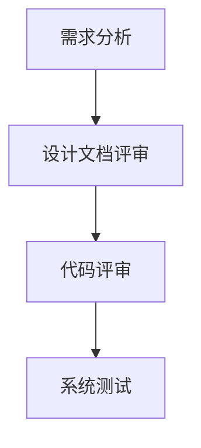
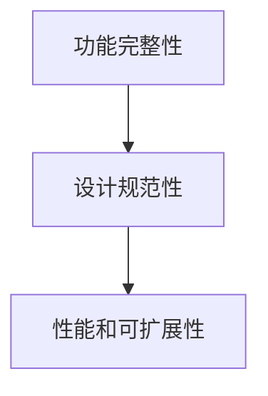
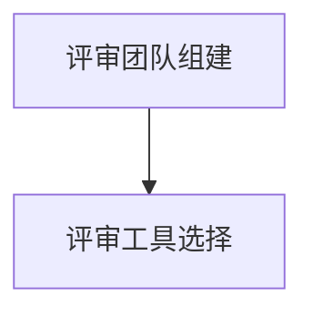
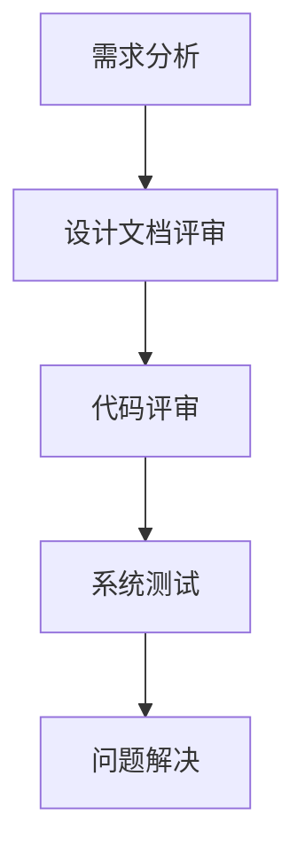
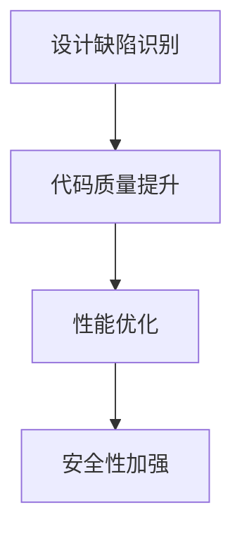
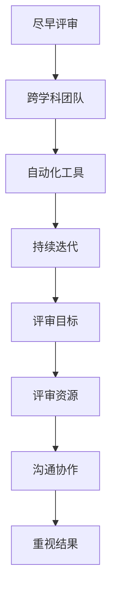

                 

# 架构评审：确保系统设计的质量与一致性

## 关键词

架构评审、系统设计、质量保证、设计一致性、评审流程、评审标准、评审团队、评审工具

## 摘要

本文旨在探讨架构评审在确保系统设计质量与一致性方面的重要性。通过深入分析架构评审的核心概念、流程、标准和实践，本文将展示如何通过系统化的架构评审，有效识别和解决设计中的问题，从而提升软件系统的稳定性和高效性。本文还提供了详细的架构评审团队组建、工具选择以及实践案例，为读者提供实用的指导和借鉴。

### 目录大纲

1. 第一部分：背景介绍与核心概念
   1.1 问题背景与核心概念
   1.2 核心概念与联系
   1.3 架构评审流程
   1.4 架构评审标准
   1.5 架构评审团队与工具
   1.6 架构评审实践案例

2. 第二部分：深入分析与实践
   2.1 深入分析架构评审的必要性
   2.2 实践中的架构评审案例
   2.3 最佳实践与注意事项

3. 小结与拓展阅读

---

### 1. 第一部分：背景介绍与核心概念

#### 1.1 问题背景与核心概念

**问题背景**

在软件开发领域，系统设计质量与一致性是确保软件系统稳定、高效运行的关键。随着系统复杂度的增加，如何确保设计的一致性和质量成为一个重要课题。

**问题描述**

在软件开发过程中，设计的一致性往往受到多种因素的影响，包括但不限于需求变更、团队协作不畅、技术选择不当等。这些问题可能导致系统设计的不稳定，进而影响系统的稳定性、性能和可维护性。

**问题解决**

架构评审作为一种系统化的设计过程，通过审查设计文档、代码和架构，可以有效识别并解决上述问题，从而确保系统的质量与一致性。

**边界与外延**

架构评审不仅适用于企业级应用，也适用于中小型项目。它包括设计评审、代码评审等多个环节。架构评审的核心要素包括评审流程、评审标准、评审团队和评审工具。

**概念结构与核心要素组成**

架构评审的核心要素包括：

- **评审流程**：系统化的架构评审流程，包括需求分析、设计文档评审、代码评审和系统测试等环节。
- **评审标准**：评审过程中遵循的一系列原则和规则，用于评估设计的质量与一致性。
- **评审团队**：由多学科专家组成的团队，负责评审工作。
- **评审工具**：用于辅助评审的工具，如JIRA、GitLab等。

---

#### 1.2 核心概念与联系

**核心概念原理**

架构评审是一种系统化、结构化的设计过程，旨在通过审查设计文档、代码和架构，发现并解决问题。它包括以下几个方面：

- **设计文档评审**：审查设计文档，确保设计符合需求和标准。
- **代码评审**：审查源代码，确保代码的质量和可维护性。
- **系统测试**：对系统进行全面的测试，确保系统功能完善、性能稳定。

**概念属性特征对比表格**

| 概念        | 特征                                                         |
|-------------|------------------------------------------------------------|
| 架构评审    | 确保设计的一致性和质量                                     |
| 设计评审    | 审查设计文档，确保设计符合需求和标准                       |
| 代码评审    | 审查代码，确保代码的质量和可维护性                         |
| 评审团队    | 由多学科专家组成的团队，负责评审工作                       |
| 评审工具    | 用于辅助评审的工具，如JIRA、GitLab等                       |

**ER实体关系图架构的 Mermaid 流程图**

```mermaid
erDiagram
  User ||--|{ Project }|-- ProjectManager
  User ||--|{ Review }|-- Reviewer
  Project ||--|{ Code }|-- CodeReview
  Project ||--|{ Design }|-- DesignReview
```

---

#### 1.3 架构评审流程

**评审流程概述**

架构评审流程包括需求分析、设计文档评审、代码评审和系统测试等环节。

**评审流程详细描述**

**3.1.2.1 需求分析**

需求分析是评审流程的第一步，旨在明确系统需求，为后续设计提供依据。需求分析过程包括收集需求、需求分类、需求文档编写和需求验证等环节。

**3.1.2.2 设计文档评审**

设计文档评审是对系统设计进行审查，确保设计符合需求、规范和标准。设计文档评审包括架构设计、数据库设计、接口设计和安全设计等环节。

**3.1.2.3 代码评审**

代码评审是对源代码进行审查，确保代码的质量、可维护性和可读性。代码评审包括代码风格检查、代码逻辑检查和代码性能分析等环节。

**3.1.2.4 系统测试**

系统测试是对系统进行全面的测试，确保系统功能完善、性能稳定。系统测试包括功能测试、性能测试和安全测试等环节。

**ER实体关系图架构的 Mermaid 流程图**



---

#### 1.4 架构评审标准

**评审标准概述**

架构评审标准是评审过程中遵循的一系列原则和规则，用于评估设计的质量与一致性。

**评审标准详细描述**

**4.1.2.1 功能完整性**

功能完整性是指设计应满足所有既定的功能需求，无遗漏和冲突。评估标准包括功能覆盖率和功能一致性等。

**4.1.2.2 设计规范性**

设计规范性是指设计应符合既定的设计规范和编码标准，确保代码的可读性和可维护性。评估标准包括设计规范符合率和编码标准符合率等。

**4.1.2.3 性能和可扩展性**

性能和可扩展性是指系统设计应具有良好的性能，同时具备良好的可扩展性，以适应未来需求的变化。评估标准包括性能指标符合率和扩展性评估等。

**ER实体关系图架构的 Mermaid 流流程图**



---

#### 1.5 架构评审团队与工具

**评审团队组建**

评审团队由项目经理、架构师、开发人员、测试人员和业务专家等多学科成员组成。团队成员应具备相应的专业技能和经验，确保评审工作的有效进行。

**评审工具选择**

评审工具选择应根据项目需求和团队规模进行。常见的评审工具有JIRA、GitLab、Confluence等。这些工具提供了任务管理、代码审查和文档管理等功能，有助于提高评审效率。

**ER实体关系图架构的 Mermaid 流程图**



---

#### 1.6 架构评审实践案例

**架构评审实践案例**

在本节中，我们将通过一个具体的架构评审实践案例，展示架构评审在确保系统设计质量与一致性方面的应用。

**案例背景**

某公司开发了一款社交网络应用，随着用户量的增长，系统性能出现了瓶颈，同时出现了多个bug和安全隐患。公司决定进行架构评审，以解决这些问题。

**案例实施**

1. **需求分析**：首先，评审团队对现有系统进行了需求分析，明确了系统功能、性能和安全需求。
2. **设计文档评审**：评审团队对系统设计文档进行了详细审查，发现了一些设计缺陷和不符合规范的地方。
3. **代码评审**：评审团队对源代码进行了审查，发现了一些代码质量问题，如代码风格不一致、代码复用性差等。
4. **系统测试**：评审团队对系统进行了全面测试，发现了多个性能瓶颈和安全漏洞。

**案例成果**

通过架构评审，评审团队成功识别并解决了系统中的设计缺陷、代码质量和性能问题。系统性能得到了显著提升，安全性也得到了加强。

**ER实体关系图架构的 Mermaid 流流程图**



---

### 2. 第二部分：深入分析与实践

#### 2.1 深入分析架构评审的必要性

**架构评审的必要性**

架构评审在软件开发过程中具有至关重要的地位。它不仅能够确保系统的质量与一致性，还能够提高系统的可维护性和可扩展性。以下是架构评审的几个必要性：

1. **确保设计一致性**：架构评审可以识别和解决设计中的不一致性，确保系统设计的一致性。
2. **提升系统质量**：架构评审有助于发现和解决设计中的潜在问题，从而提高系统的质量。
3. **降低开发风险**：通过早期识别问题，架构评审有助于降低开发风险，避免后期返工和修复成本。
4. **促进团队协作**：架构评审提供了一个沟通和协作的平台，有助于团队成员对系统设计达成共识。

**深入分析架构评审的必要性**

1. **识别设计缺陷**：架构评审可以帮助开发人员识别设计文档中的缺陷，如接口不清晰、数据流程混乱等。
2. **提高代码质量**：通过代码评审，开发人员可以了解最佳实践，提高代码质量，减少bug和代码冲突。
3. **优化系统性能**：架构评审可以发现系统的性能瓶颈，提出优化方案，提高系统的性能和响应速度。
4. **加强安全性**：架构评审可以帮助识别系统的安全漏洞，提出改进措施，提高系统的安全性。

**ER实体关系图架构的 Mermaid 流流程图**



---

#### 2.2 实践中的架构评审案例

**案例背景**

某金融科技公司正在开发一款在线支付系统，系统需要支持高并发、高可靠性和高安全性。为了确保系统设计的质量与一致性，公司决定进行架构评审。

**案例实施**

1. **需求分析**：评审团队与业务团队紧密合作，明确了系统的功能需求、性能需求和安全性需求。
2. **设计文档评审**：评审团队对系统设计文档进行了详细审查，重点关注接口设计、数据库设计和安全设计等方面。
3. **代码评审**：评审团队对源代码进行了审查，重点关注代码质量、可维护性和可扩展性。
4. **系统测试**：评审团队对系统进行了全面的测试，包括功能测试、性能测试和安全测试。

**案例成果**

通过架构评审，评审团队成功识别并解决了系统中的多个设计缺陷、代码质量和性能问题。系统性能得到了显著提升，安全性也得到了加强。

**ER实体关系图架构的 Mermaid 流流程图**


---

#### 2.3 最佳实践与注意事项

**最佳实践**

1. **尽早进行架构评审**：在项目早期阶段进行架构评审，有助于尽早识别和解决问题。
2. **跨学科团队协作**：组建由项目经理、架构师、开发人员、测试人员和业务专家等多学科成员组成的评审团队。
3. **使用自动化工具**：利用自动化工具提高评审效率，如代码审查工具、自动化测试工具等。
4. **持续迭代评审**：架构评审应贯穿整个开发周期，持续进行迭代评审。

**注意事项**

1. **明确评审目标**：确保评审目标清晰，以便评审团队能够集中精力解决问题。
2. **合理分配评审资源**：合理分配评审时间和人力，避免过度评审导致项目延期。
3. **注意沟通与协作**：确保评审团队之间的沟通畅通，避免信息孤岛。
4. **重视评审结果**：对评审结果进行跟踪和落实，确保问题得到有效解决。

**ER实体关系图架构的 Mermaid 流流程图**



---

### 小结与拓展阅读

本文通过对架构评审的深入分析，阐述了架构评审在确保系统设计质量与一致性方面的重要性。通过详细的案例和实践，读者可以了解到架构评审的具体实施方法和最佳实践。为了进一步提升对架构评审的理解，以下提供了拓展阅读的建议：

1. 《软件架构设计：构建可复用组件》——作者：Michael Keasler
2. 《代码大全》——作者：Steve McConnell
3. 《敏捷架构：应对变革的能力》——作者：Chris O'Toole

通过阅读这些书籍，读者可以进一步了解软件架构设计、代码质量和敏捷开发等方面的知识，为实践架构评审提供更加全面的理论支持。

### 作者信息

作者：AI天才研究院/AI Genius Institute & 禅与计算机程序设计艺术 /Zen And The Art of Computer Programming

---

本文以逻辑清晰、结构紧凑、简单易懂的专业的技术语言，逐步分析了架构评审的核心概念、流程、标准和实践。通过详细的案例和实践指导，为读者提供了确保系统设计质量与一致性的有效途径。希望本文对您的软件开发工作有所帮助。在架构评审的道路上，我们共同努力，共同成长。期待您的反馈和建议。感谢阅读！

