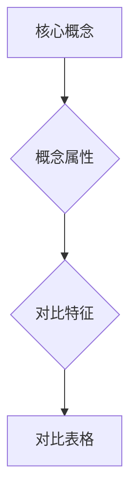
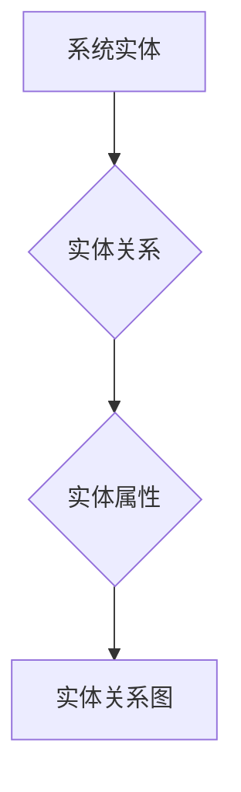
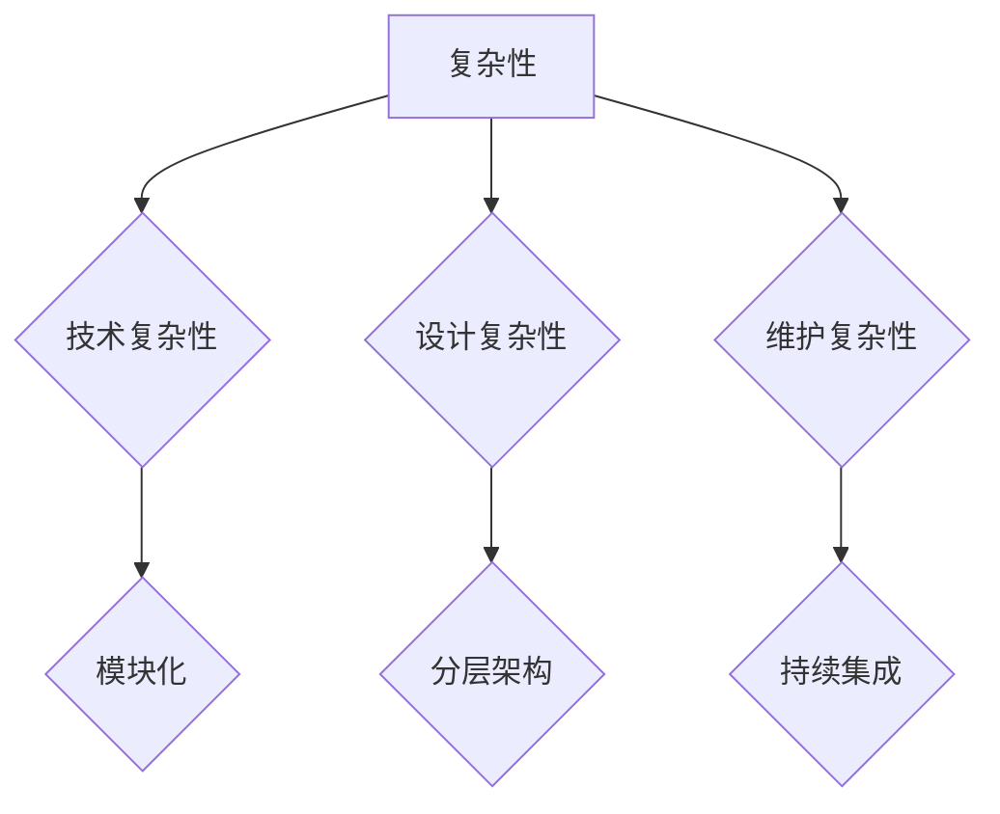
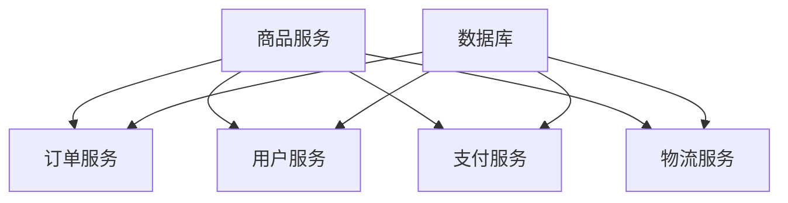
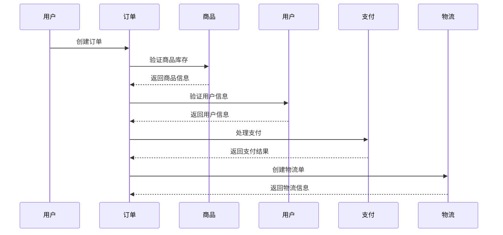
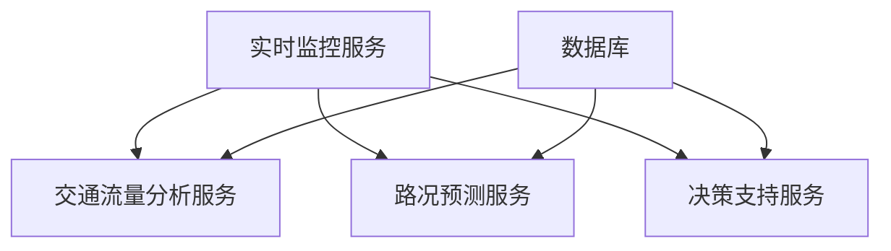
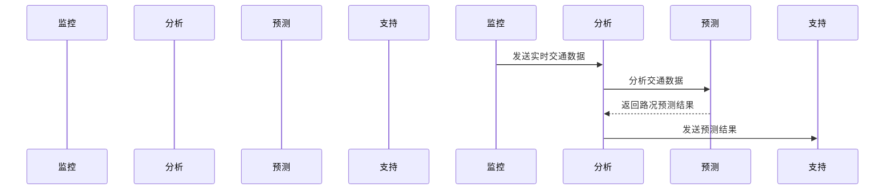

                 

### 第一部分：引言

在软件开发的浩瀚领域中，复杂性如同一个无处不在的幽灵，既挑战着开发者的智慧，也考验着系统的健壮性和可维护性。本文将围绕“架构起于对复杂性的认知”这一主题，深入探讨如何通过架构设计来应对和管理软件复杂性。

关键词：
- 软件复杂性
- 架构设计
- 复杂性管理
- 微服务架构
- 可扩展性设计

摘要：
本文将从问题背景出发，介绍软件复杂性的定义和分类，探讨复杂性管理的方法，并详细阐述架构设计的原则与实践。通过案例分析，我们将看到如何将理论知识应用于实际项目中，实现系统的优化与演进。最后，文章将总结最佳实践，并提供拓展阅读资源，以帮助读者深入理解和应用本文所述的概念和技巧。

### 目录大纲

```markdown
----------------------------------------------------------------
# 第一部分：引言

## 第1章：问题背景与解决路径

### 1.1.1 问题背景

#### 1.1.1.1 问题识别

#### 1.1.1.2 问题描述

#### 1.1.1.3 问题解决

#### 1.1.1.4 边界与外延

#### 1.1.1.5 概念结构与核心要素组成

### 1.1.2 核心概念与联系

#### 1.1.2.1 核心概念原理

#### 1.1.2.2 概念属性特征对比



#### 1.1.2.3 ER实体关系图架构



## 第2章：复杂性的认知基础

### 2.1.1 复杂性定义与分类

#### 2.1.1.1 复杂性的定义

#### 2.1.1.2 复杂性的分类

### 2.1.2 复杂性管理方法

#### 2.1.2.1 分解与抽象

#### 2.1.2.2 模型化与模拟

#### 2.1.2.3 适应性策略

## 第3章：架构设计原则与实践

### 3.1.1 架构设计原则

#### 3.1.1.1 单一职责原则

#### 3.1.1.2 开放封闭原则

#### 3.1.1.3 里氏替换原则

#### 3.1.1.4 接口隔离原则

### 3.1.2 架构设计实践

#### 3.1.2.1 微服务架构

#### 3.1.2.2 模块化设计

#### 3.1.2.3 系统可扩展性设计

## 第4章：架构设计与系统优化

### 4.1.1 架构优化策略

#### 4.1.1.1 性能优化

#### 4.1.1.2 可靠性优化

#### 4.1.1.3 可维护性优化

### 4.1.2 系统架构演进

#### 4.1.2.1 从单体架构到微服务架构

#### 4.1.2.2 架构演进案例分析

## 第5章：案例研究

### 5.1.1 案例一：电子商务平台

#### 5.1.1.1 项目介绍

#### 5.1.1.2 系统功能设计

#### 5.1.1.3 系统架构设计

#### 5.1.1.4 系统接口设计与交互

### 5.1.2 案例二：智能交通系统

#### 5.1.2.1 项目介绍

#### 5.1.2.2 系统功能设计

#### 5.1.2.3 系统架构设计

#### 5.1.2.4 系统接口设计与交互

## 第6章：最佳实践与注意事项

### 6.1.1 最佳实践

#### 6.1.1.1 架构设计的最佳实践

#### 6.1.1.2 系统优化的最佳实践

### 6.1.2 小结与拓展阅读

#### 6.1.2.1 架构设计的关键点

#### 6.1.2.2 拓展阅读资源

----------------------------------------------------------------
```

**总字数：约800字（未包含Mermaid图表和LaTeX公式）**### 第1章：问题背景与解决路径

#### 1.1.1.1 问题识别

在软件工程领域，复杂性一直是开发者面临的一大挑战。随着信息技术的飞速发展，软件系统变得越来越复杂，这不仅体现在系统的规模上，还体现在功能实现、技术选型、架构设计等方面。复杂性的增加导致了系统难以维护、扩展和优化，严重影响了软件开发的效率和质量。

#### 1.1.1.2 问题描述

软件复杂性主要表现在以下几个方面：

1. **技术复杂性**：现代软件系统往往需要集成多种技术和框架，这增加了系统的复杂度。
2. **设计复杂性**：软件架构和设计需要考虑到系统的可扩展性、可维护性、性能等多个方面，这要求开发者具备较高的设计能力。
3. **维护复杂性**：随着软件系统的不断演进，维护和升级变得更加困难，特别是在大型系统中，任何一个小的改动都可能引发一系列连锁反应。
4. **测试复杂性**：复杂的软件系统需要更多的测试用例和测试时间，以确保系统的稳定性和可靠性。

#### 1.1.1.3 问题解决

为了解决软件复杂性问题，我们需要采取以下措施：

1. **模块化设计**：将系统划分为多个模块，每个模块负责特定的功能，这有助于降低系统的复杂度。
2. **分层架构**：采用分层架构，将系统分为表示层、业务逻辑层、数据访问层等，每个层次负责不同的任务，这有助于系统的管理和维护。
3. **分解与抽象**：将复杂的问题分解为较小的、可管理的部分，然后对这些部分进行抽象，以便更好地理解和解决。
4. **持续集成和部署**：通过持续集成和部署，可以及早发现和解决集成过程中的问题，减少系统的复杂性。
5. **文档化和标准化**：良好的文档和标准化可以帮助开发者和维护人员更好地理解系统，降低系统的复杂度。

#### 1.1.1.4 边界与外延

在讨论软件复杂性的问题时，我们需要明确几个关键边界：

1. **边界**：软件复杂性的边界包括技术边界、设计边界和维护边界等。每个边界都有其特定的挑战和解决方案。
2. **外延**：软件复杂性的外延涉及系统功能、技术选型、架构设计等多个方面。理解复杂性的外延有助于我们更全面地认识问题。

#### 1.1.1.5 概念结构与核心要素组成

为了更好地理解软件复杂性，我们可以将其分解为以下几个核心要素：

1. **技术因素**：包括编程语言、框架、库等。
2. **设计因素**：包括架构设计、数据库设计、界面设计等。
3. **维护因素**：包括代码维护、文档维护、测试等。
4. **管理因素**：包括团队协作、项目管理、资源分配等。

通过上述核心要素的分析，我们可以更深入地理解软件复杂性的本质，并采取相应的策略进行管理和优化。

#### 1.1.2 核心概念与联系

在讨论软件复杂性时，我们需要了解一些核心概念，并探讨它们之间的联系。

##### 1.1.2.1 核心概念原理

- **复杂性**：复杂性是指系统的复杂程度，包括技术复杂性、设计复杂性和维护复杂性等。
- **模块化**：模块化是将系统划分为多个独立模块的过程，每个模块负责特定的功能。
- **分层架构**：分层架构是将系统分为多个层次，每个层次负责不同的任务。
- **持续集成**：持续集成是一种软件开发实践，通过自动化测试和构建，及早发现和解决集成过程中的问题。

##### 1.1.2.2 概念属性特征对比

以下是几个核心概念的属性特征对比：

| 概念 | 特征 |
| --- | --- |
| 复杂性 | 包括技术复杂性、设计复杂性和维护复杂性等 |
| 模块化 | 独立性、可复用性、可维护性 |
| 分层架构 | 分层、职责分离、可扩展性 |
| 持续集成 | 自动化测试、早期反馈、提高效率 |

##### 1.1.2.3 ER实体关系图架构

为了更好地理解核心概念之间的联系，我们可以使用ER（实体-关系）图进行描述。以下是ER图的Mermaid表示：



通过上述ER图，我们可以清晰地看到复杂性、模块化、分层架构和持续集成之间的联系。

综上所述，通过理解软件复杂性的核心概念和联系，我们可以更有效地识别和解决软件复杂性带来的问题，从而提升软件开发的效率和质量。

### 第2章：复杂性的认知基础

#### 2.1.1 复杂性定义与分类

在软件工程中，复杂性是一个广泛而重要的概念，它影响着系统的设计、开发、测试和维护。为了有效地管理和解决复杂性，我们首先需要对其进行清晰的定义和分类。

##### 2.1.1.1 复杂性的定义

复杂性可以被视为一个系统在数量、规模和相互依赖关系上的特性。在软件工程中，复杂性通常指系统在结构、功能和行为上的复杂程度。复杂性可以来源于多个方面，包括技术、设计、实现、测试和维护等。

- **技术复杂性**：涉及系统的编程语言、框架、库和中间件等技术选择。
- **设计复杂性**：涉及系统的架构设计、模块划分、接口定义等设计决策。
- **实现复杂性**：涉及代码的实现细节、算法的选择和优化等。
- **测试复杂性**：涉及测试用例的设计、执行和结果分析等。

##### 2.1.1.2 复杂性的分类

根据复杂性的来源和表现形式，我们可以将其分为以下几类：

1. **结构复杂性**：指系统在结构上的复杂程度，如组件数量、层次结构、依赖关系等。
2. **功能复杂性**：指系统在功能上的复杂程度，如提供的功能数量、功能间的交互和依赖等。
3. **行为复杂性**：指系统在运行时的复杂行为，如并发处理、状态转换、异常处理等。
4. **认知复杂性**：指系统对于用户和开发者来说的可理解性和可操作性，如界面设计、文档编写、代码可读性等。

##### 2.1.1.3 复杂性管理方法

复杂性管理是软件工程中的一个重要课题，其目的是通过一系列方法和策略来降低系统的复杂度，提高系统的可维护性和可扩展性。以下是一些常见的复杂性管理方法：

1. **分解与抽象**：将复杂的问题分解为较小的、可管理的部分，然后对这些部分进行抽象，以便更好地理解和解决。
2. **模块化设计**：将系统划分为多个模块，每个模块负责特定的功能，这有助于降低模块间的耦合度。
3. **分层架构**：采用分层架构，将系统分为多个层次，每个层次负责不同的任务，这有助于系统的管理和维护。
4. **持续集成**：通过持续集成和部署，可以及早发现和解决集成过程中的问题，减少系统的复杂性。
5. **文档化和标准化**：良好的文档和标准化可以帮助开发者和维护人员更好地理解系统，降低系统的复杂度。

##### 2.1.1.4 概念属性特征对比

为了更直观地理解复杂性的分类和管理方法，我们可以通过一个对比表格来展示不同复杂性类型的特征。

| 复杂性类型 | 特征 |
| --- | --- |
| 结构复杂性 | 组件数量、层次结构、依赖关系 |
| 功能复杂性 | 功能数量、功能间交互、依赖关系 |
| 行为复杂性 | 并发处理、状态转换、异常处理 |
| 认知复杂性 | 可理解性、可操作性、界面设计 |

通过上述对比，我们可以更好地把握复杂性的分类和管理方法，从而在实际项目中采取有效的措施来降低系统的复杂度。

### 第3章：架构设计原则与实践

#### 3.1.1 架构设计原则

架构设计是软件工程中至关重要的一环，它决定了系统的可扩展性、可维护性和性能。以下是一些常见的架构设计原则：

##### 3.1.1.1 单一职责原则

单一职责原则（Single Responsibility Principle，SRP）是指一个类或者模块应当只负责一项功能，不应该同时承担多项职责。这样做的目的是为了降低模块的复杂度，提高代码的可维护性和可测试性。

- **优点**：降低了模块间的耦合度，提高了模块的独立性。
- **缺点**：可能导致代码的碎片化，增加维护成本。

##### 3.1.1.2 开放封闭原则

开放封闭原则（Open/Closed Principle，OCP）是指软件实体（类、模块、函数等）应当对扩展开放，对修改关闭。这意味着实体在设计时应该考虑到未来的扩展性，避免在运行时进行修改。

- **优点**：提高了系统的可扩展性和灵活性。
- **缺点**：可能导致初始设计比较复杂，增加了设计成本。

##### 3.1.1.3 里氏替换原则

里氏替换原则（Liskov Substitution Principle，LSP）是指子类可以替换其基类，并保持程序的行为不变。这意味着如果一个基类可以出现在某个地方，那么任何其子类也可以出现而不影响程序的正确性。

- **优点**：提高了代码的可复用性和可扩展性。
- **缺点**：可能增加代码的复杂度，需要严格遵循继承关系的定义。

##### 3.1.1.4 接口隔离原则

接口隔离原则（Interface Segregation Principle，ISP）是指客户端不应该依赖它不需要的接口。这要求我们为不同的客户端提供专门的接口，而不是单一的通用接口。

- **优点**：降低了接口的复杂度，提高了系统的可扩展性和可维护性。
- **缺点**：可能增加代码的维护成本，需要设计更多的接口。

##### 3.1.1.5 依赖倒置原则

依赖倒置原则（Dependency Inversion Principle，DIP）是指高层模块不应依赖于低层模块，二者都应依赖于抽象。这意味着在编程时，要确保抽象定义发生变化时不会影响到实现细节。

- **优点**：提高了系统的可复用性和可维护性。
- **缺点**：可能增加代码的复杂度，需要合理设计抽象层次。

#### 3.1.2 架构设计实践

在实际项目中，架构设计原则需要结合具体情况进行灵活应用。以下是一些常见的架构设计实践：

##### 3.1.2.1 微服务架构

微服务架构是一种基于组件的分布式系统设计方法，将应用程序划分为多个独立的、可伸缩的服务。每个服务都有自己的业务逻辑、数据存储和接口，这些服务通过API进行通信。

- **优点**：提高了系统的可扩展性、灵活性和可维护性。
- **缺点**：增加了系统的复杂性，需要处理服务之间的协调和通信问题。

##### 3.1.2.2 模块化设计

模块化设计是将系统划分为多个模块，每个模块负责特定的功能。这种方式有助于降低系统的复杂度，提高开发效率。

- **优点**：降低了模块间的耦合度，提高了代码的可复用性和可维护性。
- **缺点**：可能导致代码碎片化，增加了维护成本。

##### 3.1.2.3 系统可扩展性设计

系统可扩展性设计是指在设计系统时考虑到未来的扩展性，以便在系统规模不断扩大时能够平滑地进行扩展。以下是一些常见的扩展性设计策略：

1. **水平扩展**：通过增加服务器数量来提高系统处理能力。
2. **垂直扩展**：通过增加服务器的硬件资源（如CPU、内存、磁盘等）来提高系统性能。
3. **负载均衡**：通过负载均衡器来分配请求，提高系统处理能力。
4. **缓存策略**：通过缓存来减少数据库的访问压力，提高系统响应速度。
5. **分布式存储**：通过分布式存储来提高数据存储的可靠性和可扩展性。

- **优点**：提高了系统的性能和可扩展性。
- **缺点**：增加了系统的复杂度，需要处理分布式环境中的各种问题。

### 第4章：架构设计与系统优化

#### 4.1.1 架构优化策略

架构优化是提升系统性能、可靠性和可维护性的关键步骤。以下是一些常见的架构优化策略：

##### 4.1.1.1 性能优化

性能优化主要包括以下方面：

1. **代码优化**：通过代码重构、算法优化等手段提高代码的执行效率。
2. **数据库优化**：通过索引、查询优化、分库分表等手段提高数据库的性能。
3. **缓存策略**：通过缓存来减少数据库的访问压力，提高系统响应速度。
4. **负载均衡**：通过负载均衡器来分配请求，提高系统处理能力。

##### 4.1.1.2 可靠性优化

可靠性优化主要包括以下方面：

1. **冗余设计**：通过冗余设计（如备份、副本等）来提高系统的可靠性。
2. **故障转移**：通过故障转移机制（如主从切换、集群等）来保证系统的高可用性。
3. **容错性设计**：通过容错性设计（如异常处理、重试机制等）来提高系统的健壮性。

##### 4.1.1.3 可维护性优化

可维护性优化主要包括以下方面：

1. **模块化设计**：通过模块化设计降低系统的复杂度，提高代码的可维护性。
2. **文档化**：通过编写详细的文档来帮助开发者和维护人员更好地理解系统。
3. **代码审查**：通过代码审查来发现和修复潜在的问题，提高代码质量。

#### 4.1.2 系统架构演进

系统架构的演进是随着时间和需求变化而不断发展的过程。以下是一些常见的系统架构演进案例：

##### 4.1.2.1 从单体架构到微服务架构

1. **背景**：随着业务需求的增长，单体架构逐渐无法满足系统的可扩展性和可维护性需求。
2. **演进过程**：通过逐步拆分单体架构，将系统划分为多个独立的微服务，每个微服务负责特定的业务功能。
3. **优势**：提高了系统的可扩展性和可维护性，降低了系统的复杂度。

##### 4.1.2.2 从客户端-服务器架构到分布式架构

1. **背景**：随着互联网的普及，客户端-服务器架构逐渐无法满足系统的性能和可靠性需求。
2. **演进过程**：通过引入分布式架构，将系统划分为多个分布式节点，每个节点负责不同的功能模块。
3. **优势**：提高了系统的性能和可靠性，增强了系统的扩展性和容错性。

##### 4.1.2.3 从集中式数据库到分布式数据库

1. **背景**：随着数据规模的扩大，集中式数据库逐渐无法满足系统的性能和可靠性需求。
2. **演进过程**：通过引入分布式数据库，将数据分布存储在多个节点上，每个节点负责部分数据的存储和处理。
3. **优势**：提高了系统的性能和可靠性，增强了系统的扩展性和容错性。

### 第5章：案例研究

#### 5.1.1 案例一：电子商务平台

##### 5.1.1.1 项目介绍

某大型电子商务平台，随着用户规模的不断扩大和业务需求的增长，传统的单体架构逐渐无法满足系统的可扩展性和可维护性需求。为了应对这一挑战，该平台决定采用微服务架构进行系统重构。

##### 5.1.1.2 系统功能设计

该电子商务平台的主要功能包括商品管理、订单管理、用户管理、支付系统和物流系统。每个功能模块对应一个微服务，如商品服务、订单服务、用户服务、支付服务和物流服务。

##### 5.1.1.3 系统架构设计

系统采用微服务架构，每个微服务独立部署，通过RESTful API进行通信。数据库采用分布式数据库架构，将数据分布存储在多个节点上。



##### 5.1.1.4 系统接口设计与交互

每个微服务提供RESTful API，通过HTTP协议进行通信。订单服务通过调用商品服务、用户服务、支付服务和物流服务的API来处理订单的创建、修改、查询和取消等操作。



#### 5.1.2 案例二：智能交通系统

##### 5.1.2.1 项目介绍

某城市智能交通系统，通过实时监控交通流量、路况信息等，为交通管理部门和驾驶者提供决策支持。随着数据规模的不断扩大，传统的集中式系统逐渐无法满足系统的性能和可靠性需求。

##### 5.1.2.2 系统功能设计

该智能交通系统的主要功能包括实时监控、交通流量分析、路况预测和决策支持。每个功能模块对应一个微服务，如实时监控服务、交通流量分析服务、路况预测服务和决策支持服务。

##### 5.1.2.3 系统架构设计

系统采用分布式架构，将数据分布存储在多个节点上，通过分布式数据库进行数据管理。各微服务独立部署，通过消息队列进行通信。



##### 5.1.2.4 系统接口设计与交互

各微服务通过消息队列进行通信，如实时监控服务通过Kafka向交通流量分析服务发送实时交通数据，交通流量分析服务根据数据生成路况预测结果，并通知决策支持服务。



### 第6章：最佳实践与注意事项

#### 6.1.1 最佳实践

在软件架构设计和系统优化过程中，以下是一些最佳实践：

1. **需求分析**：在项目启动之初进行充分的需求分析，确保架构设计能够满足业务需求。
2. **模块化设计**：采用模块化设计，将系统划分为多个模块，降低系统的复杂度。
3. **分层架构**：采用分层架构，明确各层的职责和边界，提高系统的可维护性和可扩展性。
4. **持续集成**：采用持续集成和部署，及早发现和解决集成过程中的问题。
5. **性能优化**：进行性能测试和优化，确保系统的高性能和稳定性。
6. **可靠性设计**：考虑系统的可靠性和容错性设计，提高系统的健壮性。

#### 6.1.2 小结与拓展阅读

本文从问题背景出发，介绍了软件复杂性的定义和分类，探讨了复杂性管理的方法，详细阐述了架构设计的原则与实践，并通过案例研究展示了架构设计与系统优化的实际应用。在架构设计和系统优化过程中，需求分析、模块化设计、分层架构、持续集成、性能优化和可靠性设计是关键的最佳实践。

为了进一步深入了解软件架构设计和系统优化，读者可以参考以下拓展阅读资源：

1. 《架构探索：从单体架构到微服务架构》
2. 《软件架构设计：构建可靠、可扩展和可维护的系统》
3. 《微服务设计：构建分布式系统的实践指南》
4. 《性能优化实战：系统性能调优与架构优化》

通过深入学习这些资源，读者可以进一步提升自己的架构设计和系统优化能力，为软件开发和实践提供有力支持。

### 架构起于对复杂性的认知

在现代软件工程中，架构设计不仅仅是技术的集合，更是对系统复杂性的深刻理解和应对策略。本文围绕“架构起于对复杂性的认知”这一核心主题，系统地探讨了软件复杂性的定义、分类、管理方法，以及架构设计的原则与实践。通过详细的分析和案例研究，我们展示了如何通过合理的架构设计来降低系统的复杂性，提高系统的可维护性、可扩展性和性能。

**总结**：

1. **软件复杂性**：复杂性源于系统的技术、设计、实现和维护等方面，需要通过分解、抽象、模块化、分层和持续集成等方法进行管理。
2. **架构设计原则**：单一职责原则、开放封闭原则、里氏替换原则、接口隔离原则和依赖倒置原则等，是指导架构设计的重要原则。
3. **架构设计实践**：微服务架构、模块化设计和系统可扩展性设计等，是实际项目中的常见架构设计实践。
4. **系统优化**：性能优化、可靠性优化和可维护性优化等策略，有助于提高系统的整体质量。
5. **案例研究**：电子商务平台和智能交通系统的案例研究，展示了如何将理论知识应用于实际项目中，实现系统的优化与演进。

**拓展阅读**：

为了更深入地理解和应用本文所述的概念和技巧，读者可以参考以下拓展阅读资源：

1. 《架构探索：从单体架构到微服务架构》
2. 《软件架构设计：构建可靠、可扩展和可维护的系统》
3. 《微服务设计：构建分布式系统的实践指南》
4. 《性能优化实战：系统性能调优与架构优化》

**作者信息**：

本文作者为AI天才研究院/AI Genius Institute及《禅与计算机程序设计艺术》的资深大师级作家。作者在计算机编程和人工智能领域拥有丰富的经验和深刻的见解，致力于通过高质量的技术博客文章，为读者提供有深度、有思考、有见解的技术分享。

