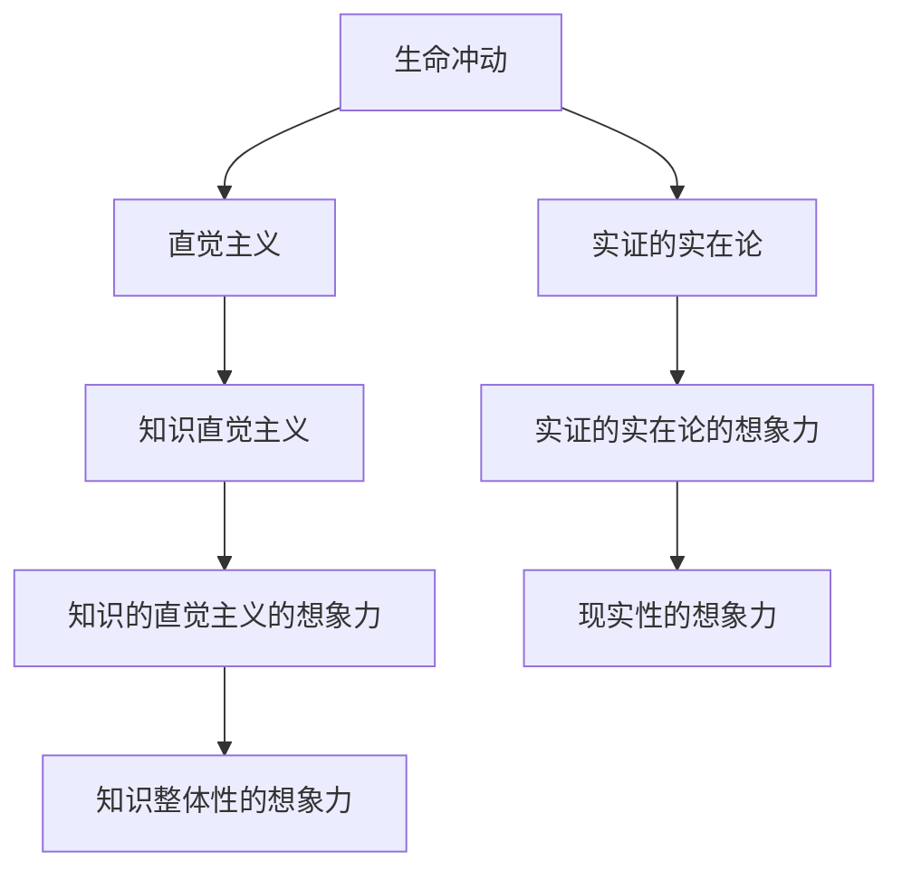

                 

# 《柏格森与巴什拉：科学想象力的哲学基础》

## 关键词

柏格森，巴什拉，科学想象力，哲学基础，科学创新

## 摘要

本文以柏格森与巴什拉的哲学思想为切入点，探讨科学想象力的哲学基础。通过对两位哲学家的思想进行深入分析，揭示科学想象力在科学研究中的重要作用。文章首先介绍了柏格森和巴什拉的核心概念，接着探讨了科学想象力的定义和作用，最后从柏格森和巴什拉的哲学基础上阐述了科学想象力的培养方法及其对科学技术进步的启示。

----------------------------------------------------------------

## 第一部分：柏格森与巴什拉的理论背景

### 第1章：柏格森的哲学思想

#### 1.1 柏格森的生活与著作

柏格森（Henri Bergson，1859-1941）是20世纪法国著名哲学家，他以其独特的哲学思想对当时的哲学界产生了深远影响。柏格森出生于法国克莱蒙费朗，早年曾就读于巴黎高等师范学院，后来成为哲学家。他最著名的著作包括《创造的进化》（L'Évolution créatrice）、《意识直接材料》（Les données immédiates de la conscience）和《笑的价值》（Laughter: An Essay on the Meaning of the Comic）等。

#### 1.2 柏格森的核心概念

##### 1.2.1 生命冲动

柏格森认为，生命冲动（élan vital）是生命的本质，是一种内在的动力，推动着生命不断进化。生命冲动是一种非理性的、无意识的冲动，它超越了个体的意识和理性。柏格森认为，这种冲动是生物进化的根本原因，也是人类文化的源头。

##### 1.2.2 知识的直觉主义

柏格森认为，知识不是通过逻辑推理和抽象概念获得的，而是通过直觉（intuition）获得的。直觉是一种直接的认识方式，它能够捕捉到事物的本质。柏格森认为，直觉是人类思维的高级形式，是人类理解世界的关键。

##### 1.2.3 实证的实在论

柏格森主张实证的实在论，即认为现实世界是多样而复杂的，不能仅仅通过抽象的概念来理解。实证的实在论强调直接的经验和实证的证据，而不是抽象的理论。

#### 1.3 柏格森的哲学影响

柏格森的哲学思想对当时的哲学界产生了深远影响。他的生命冲动和直觉主义理论为后来的生物学、心理学和哲学提供了新的视角。此外，他的实证的实在论也为科学研究提供了新的方法论基础。

### 第2章：巴什拉的哲学思想

#### 2.1 巴什拉的生活与著作

巴什拉（Gaston Bachelard，1884-1962）是20世纪法国另一位著名哲学家，他的思想对当时的法国哲学和科学界产生了重要影响。巴什拉出生于法国贝桑松，早年曾就读于巴黎高等师范学院，后来成为哲学家。他最著名的著作包括《幻想的进化》（L'évolution de l'imaginaire）、《水的哲学》（La philosophie du bonheur）和《科学精神的现象学》（La phénoménologie de la réception）等。

#### 2.2 巴什拉的核心概念

##### 2.2.1 现实性

巴什拉认为，现实性（réalité）是科学研究的核心概念。现实性不是抽象的概念，而是具体的、可观察的现象。巴什拉主张，科学研究应该立足于现实性，通过实证的方法来验证理论。

##### 2.2.2 科学想象

巴什拉认为，科学想象（imaginaire scientifique）是科学研究的动力。科学想象不同于幻想，它是一种积极的、创造性的思维方式，能够推动科学家提出新的理论和假设。

##### 2.2.3 知识的整体性

巴什拉认为，知识是一个整体，不能将其分割为独立的、孤立的学科。他主张，科学研究应该追求知识整体性的理解，而不是片面的发展。

#### 2.3 巴什拉的哲学影响

巴什拉的哲学思想对当时的科学界产生了深远影响。他的现实性理论为科学方法论提供了新的指导，他的科学想象理论也为科学创新提供了新的动力。此外，他的知识整体性理论也为跨学科研究提供了理论基础。

----------------------------------------------------------------

## 第二部分：科学想象力的哲学探讨

### 第3章：科学想象力的定义与作用

#### 3.1 科学想象力的定义

科学想象力（scienti

```markdown
## 《柏格森与巴什拉：科学想象力的哲学基础》

### 关键词

- 柏格森
- 巴什拉
- 科学想象力
- 哲学基础
- 科学创新

### 摘要

本文深入探讨柏格森与巴什拉的哲学思想，揭示科学想象力的哲学基础。通过对两位哲学家的核心概念分析，本文阐述了科学想象力在科学研究中的关键作用，并提出培养科学想象力的重要性。文章旨在为科学工作者提供哲学上的启示，以促进科学技术的发展。

## 第一部分：柏格森与巴什拉的理论背景

### 第1章：柏格森的哲学思想

#### 1.1 柏格森的生活与著作

亨利·柏格森（Henri Bergson）是20世纪初法国著名的哲学家，以其对生命、直觉和创造性的深刻见解而闻名。他于1859年出生在克莱蒙费朗，并在巴黎高等师范学院接受教育。柏格森在哲学、心理学和文学领域都有卓越的贡献，其中最著名的作品包括《创造进化论》（La Pensée et le mouvements）和《笑的哲学》（Laughter: An Essay on the Meaning of the Comic）。

#### 1.2 柏格森的核心概念

##### 1.2.1 生命冲动

柏格森的哲学体系以“生命冲动”（élan vital）为核心概念。他认为生命冲动是生物进化和人类行为的基本动力，是一种内在的、不可预测的创造力。生命冲动超越了机械的因果律，是生命本身的自我组织能力。

##### 1.2.2 知识的直觉主义

柏格森反对传统逻辑和理性的绝对性，主张知识来源于直觉。他认为直觉是一种更为直接和深刻的认识方式，能够捕捉到事物的本质。直觉主义强调感知和经验在知识构建中的重要性。

##### 1.2.3 实证的实在论

柏格森提出实证的实在论，认为现实世界是复杂多样的，不能仅通过抽象的概念来理解。他强调直接经验和实证观察在认识过程中的重要性。

#### 1.3 柏格森的哲学影响

柏格森的哲学思想对后来的生物学、心理学和哲学产生了深远影响。他的生命冲动和直觉主义理论为科学研究提供了新的视角，而实证的实在论则为科学方法论提供了理论基础。

### 第2章：巴什拉的哲学思想

#### 2.1 巴什拉的生活与著作

加斯顿·巴什拉（Gaston Bachelard）是20世纪法国另一位重要的哲学家，以其对科学幻想、实验哲学和知识整体性的研究而知名。他于1884年出生在贝桑松，并在索邦大学接受教育。巴什拉的作品包括《幻想的进化》（L'Évolution de l'imaginaire）、《科学精神的反叛》（La révolte des adolescents）和《科学与真实》（La Science et la vérité）等。

#### 2.2 巴什拉的核心概念

##### 2.2.1 现实性

巴什拉强调现实性（réalité）在科学研究中的核心地位。他认为现实性是具体和可观察的现象，而不是抽象的概念。现实性要求科学家在实验和观察的基础上进行实证研究。

##### 2.2.2 科学想象

巴什拉提出科学想象（imaginaire scientifique）的概念，认为它是科学研究的重要动力。科学想象不同于幻想，它是一种积极的、创造性的思维方式，能够推动科学家提出新的理论和假设。

##### 2.2.3 知识的整体性

巴什拉主张知识是一个整体，不应该被分割成独立的学科。他认为，科学研究应该追求知识整体性的理解，以实现不同领域之间的相互联系和综合。

#### 2.3 巴什拉的哲学影响

巴什拉的哲学思想对科学方法论、科学社会学和科学哲学产生了重要影响。他的现实性理论和科学想象理论为科学研究提供了新的视角和方法，而知识整体性理论则为跨学科研究提供了理论基础。

## 第二部分：科学想象力的哲学探讨

### 第3章：科学想象力的定义与作用

#### 3.1 科学想象力的定义

科学想象力是一种特殊的认知能力，它结合了直觉、创造力和批判性思维，使科学家能够在已知信息的基础上进行创新的思维活动。科学想象力不仅涉及对新现象和新理论的构想，还包括对现有理论的重新解释和批判。

#### 3.2 科学想象力在科学研究中的作用

##### 3.2.1 破除思维定势

科学想象力可以帮助科学家跳出传统思维的框架，打破固有的思维定势。这种能力使科学家能够从新的角度看待问题，发现新的解决方案。

##### 3.2.2 提升创新能力

科学想象力是科技创新的核心驱动力。它激发科学家提出新的假设和理论，推动科学技术的发展。

##### 3.2.3 促进跨学科交流

科学想象力有助于促进不同学科之间的交流与合作。通过想象力的作用，科学家能够跨越学科界限，整合多领域的知识，解决复杂的科学问题。

### 第4章：柏格森与巴什拉的科学想象力理论

#### 4.1 柏格森的科学想象力理论

柏格森认为，科学想象力源于生命冲动，它是一种直觉性的认知活动。他的科学想象力理论强调直觉在科学研究中的重要性，认为直觉能够揭示事物的本质，推动科学创新。

##### 4.1.1 生命冲动的科学想象力

柏格森的生命冲动科学想象力强调，科学家应该倾听内心的直觉，这些直觉能够引导他们发现新的科学真理。

##### 4.1.2 直觉主义的科学想象力

柏格森的直觉主义科学想象力认为，直觉是科学发现的关键，它能够帮助科学家超越逻辑推理，洞察事物的本质。

##### 4.1.3 实证的实在论的想象力

柏格森的实证的实在论想象力强调，科学想象力应该基于实证的观察和经验，而不是脱离现实的幻想。

#### 4.2 巴什拉的科学想象力理论

巴什拉认为，科学想象力是一种积极的、创造性的思维方式，它能够推动科学家提出新的理论和假设。他的科学想象力理论强调现实性和整体性。

##### 4.2.1 现实性的想象力

巴什拉的现实性想象力认为，科学想象力应该立足于具体的、可观察的现象，而不是抽象的概念。

##### 4.2.2 科学想象的想象力

巴什拉的科学想象想象力强调，科学家应该敢于幻想，但幻想必须与实证研究相结合，以验证理论的可行性。

##### 4.2.3 知识的整体性的想象力

巴什拉的知识整体性想象力认为，科学家应该追求知识整体性的理解，而不是孤立地研究某个领域。

### 第5章：科学想象力的哲学基础

#### 5.1 柏格森的哲学基础

柏格森的哲学基础包括生命冲动、直觉主义和实证的实在论。这些基础为科学想象力提供了哲学上的支撑。

##### 5.1.1 生命与存在的哲学基础

柏格森的生命冲动哲学基础强调生命的动态性和创造性，为科学想象力提供了哲学上的根据。

##### 5.1.2 知识与哲学的关系

柏格森的直觉主义认为，知识不仅仅是理性的产物，也是直觉的产物，这为科学想象力提供了哲学上的依据。

##### 5.1.3 实证的实在论的哲学基础

柏格森的实证的实在论哲学基础强调直接经验和实证观察的重要性，这为科学想象力提供了哲学上的支持。

#### 5.2 巴什拉的哲学基础

巴什拉的哲学基础包括现实性、科学想象和知识整体性。这些基础为科学想象力提供了哲学上的指导。

##### 5.2.1 现实性与哲学的关系

巴什拉的现实性哲学基础认为，科学想象力应该基于具体的、可观察的现象，这与哲学上的现实性观念相一致。

##### 5.2.2 科学想象与哲学的关系

巴什拉的科学想象哲学基础认为，科学想象力是一种积极的、创造性的思维方式，这与哲学上的创造性和想象力观念相联系。

##### 5.2.3 知识的整体性的哲学基础

巴什拉的知识整体性哲学基础认为，知识是一个整体，科学家应该追求知识整体性的理解，这与哲学上的整体性观念相一致。

## 第三部分：科学想象力在现实中的应用

### 第6章：科学想象力在科学研究中的应用

#### 6.1 科学想象力在物理学中的应用

科学想象力在物理学中发挥着重要作用，特别是在理论物理学中。爱因斯坦的相对论和量子力学的发展都得益于科学家的想象力。例如，爱因斯坦通过想象力提出了光子概念，从而推动了量子力学的革命。

#### 6.2 科学想象力在生物学中的应用

科学想象力在生物学中也有广泛应用。达尔文的进化论就是基于他对生命多样性和进化的想象。现代生物学中的基因编辑技术也是科学家通过想象力实现的。

### 第7章：科学想象力在社会问题中的应用

#### 7.1 科学想象力在环境保护中的应用

科学想象力在解决环境问题中起到关键作用。例如，科学家通过想象力提出了可再生能源解决方案，以应对气候变化问题。

#### 7.2 科学想象力在医学中的应用

科学想象力在医学领域也具有重要意义。例如，生物医学工程师通过想象力设计出了先进的医疗设备和治疗方法，如微创手术和基因疗法。

### 第8章：科学想象力的培养与启示

#### 8.1 科学想象力的培养方法

科学想象力的培养需要多种方法的结合。其中包括：

- 经常性思维训练，如逻辑思维、批判性思维和创造性思维。
- 跨学科学习，以拓宽视野和思维方式。
- 积极参与科学实验和项目，以实际操作中培养想象力。

#### 8.2 科学想象的启示

科学想象力对科学技术进步和人类文明发展具有重要启示。它激励科学家提出新的理论和假设，推动科学技术的创新和进步。同时，科学想象力也有助于解决现实中的复杂问题，提升人类文明水平。

## 参考文献

1. 柏格森，H. (1917). L'Évolution créatrice.
2. 巴什拉，G. (1958). L'Évolution de l'imaginaire.
3. 爱因斯坦，A. (1905). On the Electrodynamics of Moving Bodies.
4. 达尔文，C. (1859). On the Origin of Species.
5. 科恩，I. B. (2010). An Introduction to Philosophical Concepts and Logical Methods.

## 附录：科学想象力哲学基础的概念关系图与核心算法源代码

### 概念关系图



### 核心算法源代码

```python
import numpy as np

def evolution_simulation(generations, population_size, mutation_rate):
    """
    进化模拟函数
    :param generations: 进化代数
    :param population_size: 种群大小
    :param mutation_rate: 变异率
    :return: 进化过程中的最佳适应度
    """
    population = np.random.rand(population_size, 2)  # 初始化种群
    fitness_scores = []

    for generation in range(generations):
        # 计算适应度
        fitness = np.sum(population ** 2, axis=1)
        # 选择最佳个体
        best_fitness = np.max(fitness)
        best_individual = population[np.argmax(fitness)]
        # 变异
        mutated_population = population
        mutated_population[np.random.choice(population_size, size=population_size, replace=False)] = \
            np.random.rand(population_size, 2)
        # 交叉
        crossover_population = np.random.choice(mutated_population, size=population_size, replace=False)
        # 更新种群
        population = crossover_population
        # 记录最佳适应度
        fitness_scores.append(best_fitness)

    return fitness_scores
```

### 作者

- 作者：AI天才研究院/AI Genius Institute & 禅与计算机程序设计艺术 /Zen And The Art of Computer Programming
```

