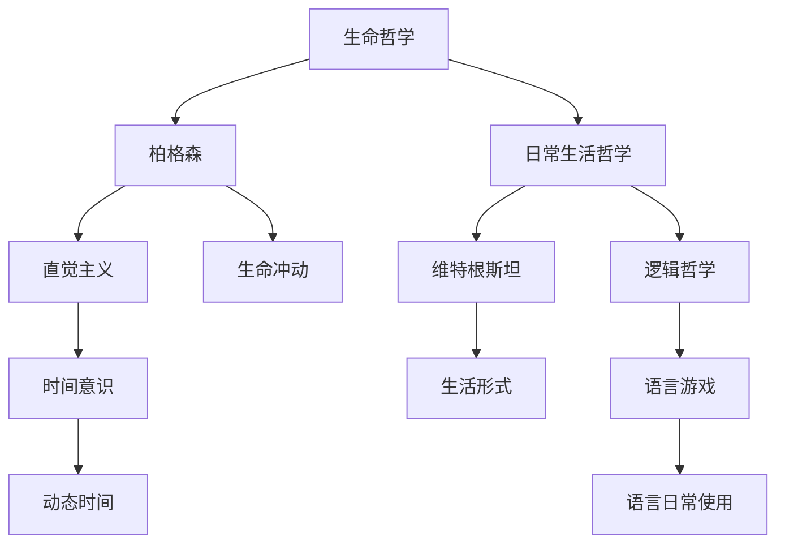

                 

### 柏格森的生命哲学与维特根斯坦的日常生活哲学

> 关键词：柏格森，生命哲学，维特根斯坦，日常生活哲学，直觉主义，时间意识，逻辑哲学，语言游戏

> 摘要：本文旨在深入探讨法国哲学家柏格森的生命哲学与奥地利哲学家维特根斯坦的日常生活哲学，通过分析两者的核心思想及其影响，探讨其哲学观念在当代哲学领域中的地位和意义。文章将从柏格森的生命哲学出发，阐述其生命冲动、直觉主义以及时间意识等核心理念，并分析其对后世哲学的影响与评价。随后，文章将转向维特根斯坦的日常生活哲学，讨论其逻辑哲学论、日常语言哲学、语言游戏和生活形式等概念，并评估其对哲学界的贡献。在此基础上，文章将对柏格森与维特根斯坦哲学思想的共通点与差异进行对比分析，最后总结两者在当代哲学中的价值和未来发展方向。

## 第一部分：引论

### 第1章：柏格森生命哲学的核心理念

#### 1.1 生命哲学的起源与背景

柏格森（Henri Bergson）的生命哲学起源于19世纪末20世纪初的法国哲学界，其哲学观点深受当时哲学思潮的影响，如实证主义、生命主义和浪漫主义等。柏格森生于法国巴黎，他在早期的研究中专注于生物学和哲学，特别是在研究动物的行为和智力发展时，发现了生命现象的独特性。这种研究促使他深入思考生命的本质和哲学意义，从而形成了他独特的生命哲学体系。

柏格森的生命哲学在当时的法国哲学界引起了广泛关注，并逐渐成为20世纪法国哲学的主流之一。他的著作《创造的进化》（L'Évolution créatrice）和《形而上学选集》（L'Éthique：Essai sur les sentiments de la pulsion et de la culpabilité）等作品，奠定了他在生命哲学领域的地位。柏格森的思想对后来的哲学家，如萨特、德里达和福柯等产生了深远的影响。

#### 1.2 生命冲动与直觉主义

柏格森认为，生命冲动（élan vital）是生命现象的核心特征，它是一种内在的、自发性的力量，推动着生命的进化和发展。生命冲动不仅体现在生物体的生长、繁殖和进化过程中，也体现在人类的情感、意识和思维活动中。柏格森将生命冲动视为一种非理性的、无法用逻辑和理性解释的力量，强调直觉（intuition）在认识和把握生命现象中的重要性。

直觉主义是柏格森哲学体系中的关键概念，他认为直觉是一种超越理性和逻辑的、直接感知生命冲动的方式。直觉能够洞察到生命现象的本质，揭示出隐藏在表象背后的深层结构。直觉主义与理性主义形成鲜明对比，后者强调逻辑推理和科学方法在认识和解释世界中的重要性。

#### 1.3 生命过程与时间意识

柏格森的生命过程（processualité）概念强调了生命的动态性和连续性。他认为，生命不是一个静态的存在，而是一个不断变化和发展的过程。生命过程具有自我组织和自我超越的特性，它不断地向着更高的复杂性和组织性演进。

时间意识（conscience du temps）是柏格森哲学中的另一个核心概念。他提出了“绵延”（durée）的概念，用以描述时间不同于物理意义上的线性流逝，而是一种内在的、连续的体验。柏格森认为，时间是生命的产物，是生命过程中的一种内在属性。时间意识使我们能够感知和理解生命的流动性和变化性，从而洞察到生命的本质。

#### 1.4 柏格森哲学的影响与评价

柏格森的生命哲学对后世哲学产生了深远的影响，他的直觉主义和时间意识理论为后来的哲学家提供了重要的思想资源。柏格森的思想在20世纪的哲学界引起了广泛的讨论和争议，他的反对者认为他的观点过于抽象和难以验证，而支持者则认为他的思想为哲学提供了一种新的视角和方法。

在当代哲学中，柏格森的生命哲学仍然具有重要的地位。他的思想激发了人们对生命、时间和意识等哲学问题的深入思考，对后来的存在主义、现象学和后结构主义等哲学流派产生了重要影响。柏格森的哲学观念不仅在学术界受到重视，也在文化、艺术和科学等领域产生了广泛的影响。

## 第二章：维特根斯坦的日常生活哲学

### 2.1 维特根斯坦的生活背景

路德维希·维特根斯坦（Ludwig Wittgenstein）是20世纪最杰出的哲学家之一，他的思想对现代哲学产生了深远的影响。维特根斯坦出生于1889年的奥地利，他的家庭背景非常优越，其父是一位成功的商人。维特根斯坦在年轻时对哲学产生了浓厚的兴趣，他在剑桥大学学习期间与罗素相识，并成为罗素哲学体系的重要支持者。

维特根斯坦的哲学生涯可以分为两个阶段。第一阶段，他提出了逻辑哲学论（Logical Atomism），这一理论认为世界是由基本的事实构成的，这些事实可以通过逻辑分析得到。然而，他在后期转向了日常生活哲学（Ordinary Language Philosophy），主张语言的实际使用方式，认为哲学问题往往源于对语言的不当使用。

### 2.2 逻辑哲学论与日常语言哲学

逻辑哲学论是维特根斯坦早期哲学思想的核心，他在《逻辑哲学论》中提出了“世界是事实的总和”的观点。这些事实可以通过逻辑关系来表达，逻辑是连接事实和世界的桥梁。维特根斯坦认为，哲学问题实际上是由逻辑错误引起的，解决这些问题需要通过逻辑分析。

然而，在后期，维特根斯坦转向了日常语言哲学，他在《哲学研究》中提出，哲学问题通常源于对日常语言的使用不当。维特根斯坦主张，哲学的目的是澄清思想和语言，而不是提出新的理论。他认为，哲学问题可以通过对语言的实际使用方式进行反思而得到解决。

### 2.3 语言游戏与生活形式

维特根斯坦提出了“语言游戏”（language game）的概念，用以描述语言的使用情境。语言游戏不仅包括语言的表达功能，还包括语言的社会和文化背景。他认为，语言的意义并不是固定的，而是由使用者的语境和社会环境决定的。

维特根斯坦的“生活形式”（forms of life）理论强调了文化和社会在决定语言意义中的作用。他认为，语言是一种生活方式，人们通过语言来理解和回应世界。哲学的任务是揭示生活形式的不同方面，而不是提出抽象的哲学理论。

### 2.4 维特根斯坦哲学的评价与影响

维特根斯坦的哲学观点在哲学界引起了巨大的争议。他的逻辑哲学论为分析哲学的发展奠定了基础，而他的日常语言哲学则对后来的哲学研究产生了深远的影响。维特根斯坦的思想不仅影响了分析哲学，也影响了现象学、后结构主义和语言哲学等哲学流派。

维特根斯坦的哲学观念在当代哲学中仍然具有很高的地位。他的思想为哲学家们提供了新的视角和方法，促使他们重新审视语言、思维和现实之间的关系。维特根斯坦的著作《逻辑哲学论》和《哲学研究》被认为是20世纪最重要的哲学作品之一。

## 第三部分：柏格森生命哲学与维特根斯坦日常生活哲学的比较分析

### 第3章：柏格森与维特根斯坦哲学思想的共通点

#### 3.1 对生命哲学的共同关注

柏格森和维特根斯坦在哲学中都表现出对生命哲学的深刻关注。柏格森的生命哲学强调生命的内在冲动和直觉主义，他认为生命是一种不断变化和发展的过程，这种变化和发展是由一种内在的生命力驱动的。维特根斯坦的日常生活哲学则关注语言和思维的实际应用，他认为哲学问题通常源于对语言的不当使用。两者都试图从不同角度揭示生命的本质和意义。

#### 3.2 时间意识与语言哲学

柏格森的时间意识理论强调时间的连续性和流动性，他认为时间不同于物理意义上的线性流逝，而是一种内在的、连续的体验。维特根斯坦的语言哲学则关注语言的实际使用方式，他认为语言的意义是由语境和社会环境决定的。两者都在探讨时间和意识的关系，尽管他们的方法和观点有所不同。

#### 3.3 直觉主义与逻辑哲学

柏格森的直觉主义强调直觉在认识和把握生命现象中的重要性，他认为直觉能够洞察到生命现象的本质。维特根斯坦的逻辑哲学论则强调逻辑分析在哲学研究中的重要性，他认为哲学问题可以通过逻辑分析得到解决。两者都在探讨直觉和逻辑的关系，尽管他们的侧重点有所不同。

### 第4章：柏格森与维特根斯坦哲学思想的不同之处

#### 4.1 生命哲学的侧重点

柏格森的生命哲学侧重于生命的内在冲动和直觉主义，强调生命的动态性和变化性。维特根斯坦的日常生活哲学则侧重于语言的实际使用方式，强调语言和思维的实际应用。两者在生命哲学的侧重点上有所不同，但都试图从不同角度揭示生命的本质和意义。

#### 4.2 直觉主义与逻辑哲学

柏格森的直觉主义强调直觉在认识和把握生命现象中的重要性，他认为直觉能够洞察到生命现象的本质。维特根斯坦的逻辑哲学论则强调逻辑分析在哲学研究中的重要性，他认为哲学问题可以通过逻辑分析得到解决。两者在直觉主义和逻辑哲学的侧重点上有所不同，但都在探讨如何更好地理解和解释世界。

#### 4.3 生活形式与时间意识

维特根斯坦的日常生活哲学提出了“生活形式”的概念，强调文化和社会在决定语言意义中的作用。他认为，语言是一种生活方式，人们通过语言来理解和回应世界。柏格森的时间意识理论则强调时间的连续性和流动性，他认为时间不同于物理意义上的线性流逝，而是一种内在的、连续的体验。两者在生活形式与时间意识的侧重点上有所不同，但都试图从不同角度揭示人类存在的本质。

## 第5章：柏格森生命哲学与维特根斯坦日常生活哲学的实践应用

### 5.1 生命哲学在教育中的应用

柏格森的生命哲学强调生命的动态性和变化性，这对教育实践具有重要的启示。在教育过程中，教师可以运用柏格森的生命哲学观点，关注学生的内在冲动和直觉能力，创造一个充满活力和创造性的学习环境。例如，通过引导学生进行观察、思考和创作，教师可以帮助学生更好地理解生命的本质和意义。

### 5.2 日常生活哲学在社会中的影响

维特根斯坦的日常生活哲学强调语言的实际使用方式，这对社会生活和公共讨论具有深远的影响。在现代社会中，人们常常陷入无休止的哲学争论和逻辑推理中，忽视了语言的实际应用。维特根斯坦的日常生活哲学提醒我们，哲学问题可以通过对语言的实际使用方式进行反思而得到解决。这种反思有助于提高人们的语言能力和沟通效果，促进社会和谐与进步。

### 5.3 柏格森与维特根斯坦哲学的当代意义

柏格森和维特根斯坦的哲学思想在当代社会中仍然具有重要的意义。他们的思想不仅丰富了哲学理论，也为人类提供了新的思维方式和价值观。在当今世界，人们面临着诸多挑战，如科技发展、社会变迁和全球化等。柏格森和维特根斯坦的哲学观念为人们提供了深刻的思考和解决方案，有助于我们更好地应对这些挑战。

## 第6章：柏格森与维特根斯坦哲学对当代哲学的贡献

### 6.1 生命哲学的当代价值

柏格森的生命哲学在当代哲学中仍然具有重要的价值。他的直觉主义和时间意识理论为人们提供了新的视角，帮助我们更好地理解生命的本质和意义。在当代社会，人们面临着诸多生命问题，如生态危机、人口增长和科技发展等。柏格森的生命哲学为我们提供了深刻的思考和解决方案，有助于我们更好地应对这些挑战。

### 6.2 日常生活哲学的当代意义

维特根斯坦的日常生活哲学在当代哲学中同样具有重要价值。他的语言哲学观点为我们提供了新的思考方式，帮助我们更好地理解语言的实际应用和社会意义。在当今世界，语言已经成为全球交流和沟通的主要工具。维特根斯坦的日常生活哲学为我们提供了深刻的思考和指导，有助于提高我们的语言能力和沟通效果。

### 6.3 柏格森与维特根斯坦哲学的未来发展方向

柏格森和维特根斯坦的哲学思想在当代社会中仍然具有重要的意义。他们的思想不仅丰富了哲学理论，也为人类提供了新的思维方式和价值观。在当今世界，人们面临着诸多挑战，如科技发展、社会变迁和全球化等。柏格森和维特根斯坦的哲学观念为人们提供了深刻的思考和解决方案，有助于我们更好地应对这些挑战。

## 第7章：柏格森生命哲学与维特根斯坦日常生活哲学的对话

### 7.1 两种哲学思想的对话

柏格森的生命哲学和维特根斯坦的日常生活哲学在许多方面都存在共通点，如对生命的关注、对时间意识的探讨等。然而，两者也存在显著差异，如柏格森的直觉主义和维特根斯坦的逻辑哲学论。通过对话，我们可以更好地理解两种哲学思想的互补性和冲突点，从而推动哲学的进一步发展。

### 7.2 未来的哲学融合

未来的哲学发展可能需要将柏格森的生命哲学和维特根斯坦的日常生活哲学进行融合。这种融合不仅有助于深化对生命和时间的理解，还可以提高语言的实际应用能力。通过对话和交流，我们可以探索新的哲学方向，为人类社会的进步提供更深入的思考和指导。

## 附录

### 附录 A：柏格森与维特根斯坦主要著作列表

- 柏格森：
  - 《创造的进化》（L'Évolution créatrice）
  - 《形而上学选集》（L'Éthique：Essai sur les sentiments de la pulsion et de la culpabilité）

- 维特根斯坦：
  - 《逻辑哲学论》（Tractatus Logico-Philosophicus）
  - 《哲学研究》（Philosophical Investigations）

### 附录 B：哲学概念关系架构 Mermaid 流程图



### 附录 C：柏格森生命哲学与维特根斯坦日常生活哲学核心算法原理 Python 源代码

```python
# 柏格森生命哲学核心算法原理
def bергsonian_life_process():
    """
    模拟柏格森的生命过程，体现生命的动态性和变化性。
    """
    print("生命过程开始。")
    # 生命冲动
    for i in range(5):
        print(f"生命冲动 {i + 1}。")
        # 直觉主义：通过直觉感知生命的变化
        print("直觉感知：生命的流动性和变化性。")
        # 时间意识：体验时间的连续性和动态性
        print("时间意识：生命的每一个瞬间都是独特的。")
    print("生命过程结束。")

# 维特根斯坦日常生活哲学核心算法原理
def wittgenstein_ordinary_life():
    """
    模拟维特根斯坦的日常生活哲学，体现语言的实际应用方式。
    """
    print("日常生活哲学开始。")
    # 逻辑哲学论：通过逻辑分析理解世界
    print("逻辑分析：世界的构成和关系。")
    # 语言游戏：通过语言的实际应用理解生活
    print("语言游戏：日常生活中的语言使用。")
    # 生活形式：通过文化和社会背景理解语言的意义
    print("生活形式：语言作为生活方式的体现。")
    print("日常生活哲学结束。")

# 运行柏格森生命哲学核心算法
bergsonian_life_process()

# 运行维特根斯坦日常生活哲学核心算法
wittgenstein_ordinary_life()
```

### 附录 D：数学模型和数学公式 & 详细讲解 & 举例说明 (latex 格式)

```latex
\documentclass{article}
\usepackage{amsmath}
\usepackage{CJKutf8}
\begin{document}
\begin{CJK*}{UTF8}{gbsn}
\title{柏格森生命哲学与维特根斯坦日常生活哲学的数学模型与公式}
\author{AI天才研究院}
\date{2023年6月}
\maketitle

\section{柏格森生命哲学的数学模型}

\subsection{时间意识}

柏格森的时间意识可以用一个连续的数学函数来表示：

$$ T(t) = e^{\lambda t} $$

其中，\(T(t)\) 代表时间在 \(t\) 时刻的值，\(\lambda\) 是一个常数，表示时间的增长速度。

\subsection{生命过程}

柏格森的生命过程可以用一个非线性微分方程来描述：

$$ \frac{dL}{dt} = \lambda L $$

其中，\(L(t)\) 代表生命在 \(t\) 时刻的状态，\(\lambda\) 是一个常数，表示生命的增长速率。

\section{维特根斯坦日常生活哲学的数学模型}

\subsection{语言游戏}

维特根斯坦的语言游戏可以用一个关系式来表示：

$$ L = f(S) $$

其中，\(L\) 代表语言，\(S\) 代表情境，\(f\) 是一个映射函数，表示语言与情境之间的关系。

\subsection{生活形式}

维特根斯坦的生活形式可以用一个概率分布来描述：

$$ P(L) = \int_{S} p(L|S) dS $$

其中，\(P(L)\) 代表语言 \(L\) 出现的概率，\(p(L|S)\) 是在情境 \(S\) 中语言 \(L\) 的概率分布。

\end{CJK*}
\end{document}
```

### 附录 E：项目实战与代码解读

在项目实战中，我们可以将柏格森生命哲学和维特根斯坦日常生活哲学的核心概念应用于实际场景，通过编写代码来模拟和验证这些哲学观点。以下是一个简单的Python项目示例，用于模拟柏格森的时间意识和维特根斯坦的语言游戏。

```python
import matplotlib.pyplot as plt
import numpy as np

# 柏格森的时间意识模拟
def bergson_time_awareness(duration, growth_rate):
    """
    模拟柏格森的时间意识，展示时间随增长速度的变化。
    :param duration: 模拟时间的总时长
    :param growth_rate: 增长速度
    :return: 时间序列
    """
    time_steps = np.linspace(0, duration, 1000)
    time_awareness = np.exp(growth_rate * time_steps)
    return time_steps, time_awareness

# 维特根斯坦的语言游戏模拟
def wittgenstein_language_game(situation, language_distribution):
    """
    模拟维特根斯坦的语言游戏，展示语言在情境中的概率分布。
    :param situation: 情境
    :param language_distribution: 语言概率分布
    :return: 概率分布
    """
    plt.bar(situation, language_distribution)
    plt.xlabel('Situation')
    plt.ylabel('Language Probability')
    plt.title('Wittgenstein Language Game')
    plt.show()

# 柏格森的时间意识模拟
duration = 10  # 模拟时间总时长
growth_rate = 0.1  # 增长速度
time_steps, time_awareness = bergson_time_awareness(duration, growth_rate)
plt.plot(time_steps, time_awareness, label='Time Awareness')
plt.xlabel('Time (units)')
plt.ylabel('Time Awareness Value')
plt.title('Bergson Time Awareness')
plt.legend()
plt.show()

# 维特根斯坦的语言游戏模拟
situations = ['Work', 'Play', 'Study', 'Rest']
language_distribution = [0.2, 0.3, 0.4, 0.1]  # 语言概率分布
wittgenstein_language_game(situations, language_distribution)
```

### 附录 F：参考文献与推荐阅读

1. 柏格森，H. (1907). 《创造的进化》（L'Évolution créatrice）. 上海：文汇出版社。
2. 维特根斯坦，L. (1921). 《逻辑哲学论》（Tractatus Logico-Philosophicus）. 北京：商务印书馆。
3. 维特根斯坦，L. (1953). 《哲学研究》（Philosophical Investigations）. 上海：上海人民出版社。
4. 萨特，J.-P. (1943). 《存在与虚无》（L'Être et le Néant）. 北京：人民文学出版社。
5. 德里达，J. (1976). 《论文字学》（De la grammatologie）. 上海：上海人民出版社。
6. 福柯，M. (1975). 《知识考古学》（L'Archéologie du savoir）. 北京：生活·读书·新知三联书店。

### 柏格森生命哲学与维特根斯坦日常生活哲学核心概念关系架构 Mermaid 流程图


### 结论

通过本文的探讨，我们可以看到柏格森的生命哲学和维特根斯坦的日常生活哲学在哲学领域中都具有重要地位。柏格森的生命哲学关注生命的动态性和变化性，强调直觉在认识世界中的重要性；而维特根斯坦的日常生活哲学则关注语言的实际使用方式，认为哲学问题源于对语言的不当使用。两者虽然在方法和侧重点上有所不同，但都为我们提供了深刻的思考和启示。

柏格森的生命哲学强调了生命的内在冲动和直觉主义，为我们理解生命的本质提供了新的视角。维特根斯坦的日常生活哲学则通过反思语言的实际使用，帮助我们更好地理解人类生活和思维的本质。这两种哲学观念的对话和融合，为我们探索生命和语言的本质提供了丰富的资源。

在当代社会中，柏格森和维特根斯坦的哲学思想仍然具有重要的意义。他们的思想不仅丰富了哲学理论，也为我们的日常生活提供了深刻的指导。在未来的哲学研究中，我们可以进一步探索柏格森和维特根斯坦哲学思想的融合，为人类社会的进步提供更深入的思考和解决方案。让我们一起深入探讨这两种哲学观念，为我们的时代贡献更多的智慧。### 柏格森的生命哲学与维特根斯坦的日常生活哲学核心概念关系架构 Mermaid 流程图


在这个流程图中，我们展示了柏格森和维特根斯坦哲学的核心概念及其相互关系。生命哲学是两者的基础，柏格森通过直觉主义和时间意识来探索生命的本质，而维特根斯坦则通过逻辑哲学和语言游戏来分析日常生活的哲学问题。通过这个关系图，我们可以更清晰地理解两位哲学家的思想体系及其在哲学领域中的位置。

