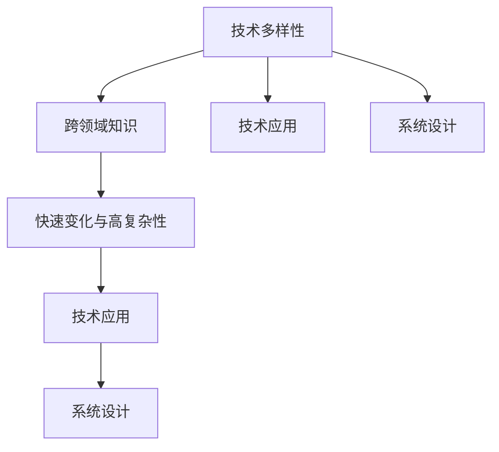
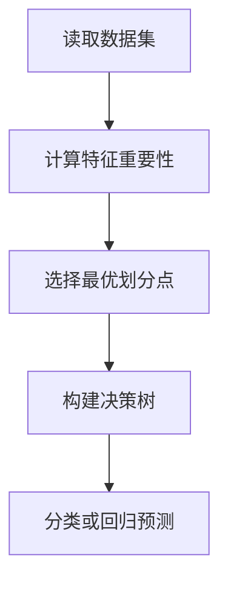
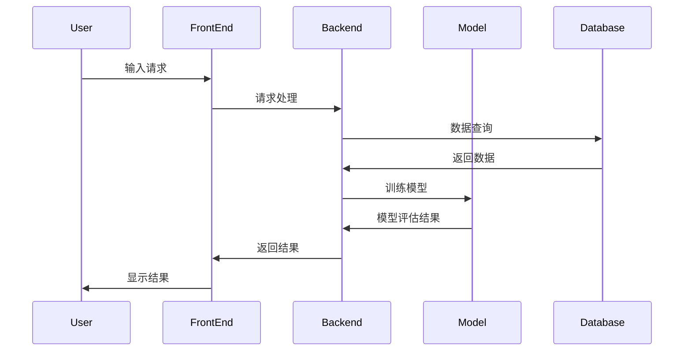

                 

### 文章标题

“没有一招鲜吃遍天”这个标题不仅仅是一个俗语，更是在技术领域中广泛适用的真理。在技术不断进步的今天，单靠一招绝技是很难应对复杂多变的IT环境的。无论是编程、系统设计还是项目管理，都需要具备多方面的技能和知识。本文将围绕这一主题，深入探讨为什么单一技能无法满足现代技术的需求，并逐步解析解决这一问题的方法。

本文将通过以下几个部分来展开讨论：

1. **背景介绍与核心概念**：介绍技术发展的背景，并明确核心概念。
2. **核心概念与联系**：分析不同技术概念之间的关系，并通过对比表格和实体关系图进行说明。
3. **算法原理讲解**：详细讲解一种算法的原理，使用流程图和Python代码进行阐述。
4. **系统分析与架构设计方案**：介绍问题场景，并设计系统的功能、架构和交互。
5. **项目实战**：通过环境安装和代码实现，展示如何实际应用这些技术。
6. **最佳实践 tips、小结、注意事项、拓展阅读**：总结最佳实践经验，并提供进一步学习的资源。

通过以上步骤，我们将一步步理解为什么需要多技能并重，如何在现代技术环境中游刃有余。

### 文章关键词

- 技术多样性
- 多技能并重
- 现代IT环境
- 技术进步
- 技术应用
- 系统设计

### 文章摘要

本文旨在探讨在现代IT环境中，为什么单一技能无法满足需求，并探讨如何通过多技能并重来应对复杂的技术挑战。文章首先介绍了技术发展的背景和核心概念，然后通过算法原理讲解和系统分析与架构设计方案，展示了多技能并重的重要性。最后，通过项目实战和最佳实践总结，为读者提供实际操作指南和进一步学习资源。

### 背景介绍与核心概念

随着信息技术的飞速发展，现代IT领域呈现出高度复杂化和多样化的趋势。从简单的网页开发到复杂的人工智能应用，每一个领域都要求技术人员具备广泛的知识和技能。传统的单点突破已无法满足当前的技术需求，多技能并重的理念逐渐成为技术发展的新趋势。

首先，让我们明确几个核心概念：

**1. 技术多样性**：技术多样性指的是在IT领域中，不同的技术方向和领域具有独特的特性和应用场景。例如，前端开发、后端开发、数据科学、人工智能等，每个方向都有其特定的技能要求和知识体系。

**2. 多技能并重**：多技能并重是指技术人员不仅要在某一特定领域有深入的了解，还要具备跨领域的知识和技能。这种多技能的结合能够帮助技术人员在复杂项目中灵活应对各种挑战，提高工作效率。

**3. 现代IT环境**：现代IT环境的特点是快速变化和高复杂性。新技术层出不穷，业务需求不断演变，这对技术人员的适应能力和学习能力提出了更高的要求。

**4. 技术进步**：技术进步不仅体现在硬件性能的提升，还包括软件架构、开发方法、数据处理能力等多个方面。随着技术的不断进步，单一技能的局限性更加凸显。

**5. 技术应用**：技术应用指的是将技术应用于实际业务场景中，解决实际问题。在这个过程中，不仅需要技术知识，还需要对业务流程的深刻理解。

**6. 系统设计**：系统设计是指构建一个完整、稳定、高效的信息系统。系统设计涉及多个方面，包括需求分析、架构设计、数据库设计、安全设计等。

接下来，我们将进一步探讨这些核心概念之间的关系，并使用对比表格和实体关系图进行详细说明。

#### 核心概念原理

在深入探讨多技能并重的重要性之前，我们需要明确几个核心概念：技术多样性、跨领域知识、快速变化和高复杂性、技术应用和系统设计。以下是一个对比表格，用于说明这些概念之间的属性特征和相互关系：

| 核心概念     | 属性特征                                                     | 相互关系                                                      |
|------------|------------------------------------------------------------|--------------------------------------------------------------|
| 技术多样性   | 不同领域的特性和应用场景                                      | 技术多样性的存在促使技术人员需要跨领域学习，提高综合能力           |
| 跨领域知识   | 在多个技术领域内具备的知识和技能                                | 跨领域知识是应对复杂项目和多变的业务需求的关键                     |
| 快速变化和高复杂性 | 新技术层出不穷，业务需求不断演变                               | 快速变化和高复杂性要求技术人员具备快速学习和适应的能力             |
| 技术应用     | 将技术应用于实际业务场景中，解决实际问题                         | 技术应用是技术价值实现的最终环节，也是检验技术人员能力的重要标准   |
| 系统设计     | 构建一个完整、稳定、高效的信息系统，涉及多个方面如需求分析、架构设计、数据库设计等 | 系统设计需要综合运用多个技术领域的知识，实现技术与应用的有机结合 |

通过以上表格，我们可以看到这些核心概念之间的紧密联系。技术多样性促使技术人员需要不断学习新的领域知识，而跨领域知识则帮助技术人员更好地应对快速变化和高复杂性的环境。技术应用和系统设计是技术知识的具体应用和实践，是检验技术人员综合能力的重要标准。

接下来，我们将通过一个Mermaid流程图来进一步展示这些核心概念之间的逻辑关系。



在上面的流程图中，从技术多样性出发，跨领域知识是技术人员在快速变化和高复杂性环境中应对挑战的必备技能，通过技术应用和系统设计，这些知识得以在实际项目中得到应用和验证。通过这样的流程图，我们可以更加直观地理解这些核心概念之间的关系和作用。

### 算法原理讲解

为了更好地理解多技能并重的重要性，我们将通过一个具体的算法——决策树算法，详细讲解其原理。决策树是一种常见的机器学习算法，用于分类和回归问题。以下是决策树算法的基本原理：

#### 决策树算法流程图

首先，使用Mermaid绘制决策树算法的流程图：



#### 决策树算法原理

1. **读取数据集**：决策树算法首先需要读取训练数据集，这些数据集包含了输入特征和对应的标签。

2. **计算特征重要性**：接下来，算法会计算每个特征对分类或回归目标的影响，选择最重要的特征作为划分的依据。

3. **选择最优划分点**：算法通过评估不同的划分方式（例如信息增益、基尼不纯度等指标），选择最优的划分点来划分数据集。

4. **构建决策树**：基于最优划分点，算法递归地划分数据集，构建出一棵决策树。树的每个节点代表一个特征划分，每个叶子节点代表一个类别或预测值。

5. **分类或回归预测**：在新的数据输入时，算法从根节点开始，根据特征值沿着决策树向下移动，直到到达叶子节点，输出对应的类别或预测值。

#### 决策树算法的Python代码实现

为了进一步理解算法原理，我们使用Python实现一个简单的决策树算法：

```python
from collections import Counter
import pandas as pd

def entropy(y):
    hist = Counter(y)
    entr = -sum((p / len(y)) * np.log2(p / len(y)) for p in hist.values())
    return entr

def info_gain(x, y):
    p = len(x) / len(y)
    entr_total = entropy(y)
    entr_subset = sum((len(x[i]) / len(y)) * entropy(y[x == i]) for i in set(x))
    info_gain = entr_total - p * entr_subset
    return info_gain

def id3(y, x, attributes, data):
    # 终止条件
    if len(set(y)) <= 1:
        return Counter(y).most_common(1)[0][0]
    # 选择最优划分特征
    info_gain_values = [info_gain(x, y) for attr in attributes]
    best_attr = attributes[info_gain_values.index(max(info_gain_values))]
    # 构建决策树
    tree = {best_attr: {}}
    for value in set(x[best_attr]):
        subset = data[x[best_attr] == value]
        tree[best_attr][value] = id3(y[subset], subset, attributes, subset)
    return tree

# 示例数据
data = pd.DataFrame({
    '特征A': ['A1', 'A1', 'A2', 'A2', 'A2'],
    '特征B': ['B1', 'B1', 'B1', 'B2', 'B2'],
    '标签': ['Yes', 'Yes', 'No', 'No', 'No']
})

attributes = data.columns[:-1]
label = data.columns[-1]
tree = id3(data[label], data[attributes], attributes, data)

print(tree)
```

#### 决策树算法的数学模型和公式

决策树算法的原理可以通过以下数学模型和公式进行详细解释：

$$
\text{Entropy}(Y) = -\sum_{i} p(y_i) \log_2 p(y_i)
$$

其中，\( p(y_i) \) 表示标签 \( y \) 为类别 \( i \) 的概率。

$$
\text{InfoGain}(X, Y) = \text{Entropy}(Y) - \sum_{i} p(x_i) \text{Entropy}(Y|X=x_i)
$$

其中，\( \text{Entropy}(Y|X=x_i) \) 表示在给定特征 \( X \) 取值为 \( x_i \) 的情况下，标签 \( Y \) 的熵。

通过以上公式，我们可以量化每个特征对分类目标的影响，选择最优的特征进行划分。

#### 举例说明

假设我们有一个包含特征A和特征B的数据集，特征A的取值有A1和A2，特征B的取值有B1和B2。标签为Yes或No。我们可以使用信息增益公式来计算每个特征的划分效果，并选择最优的特征作为划分依据。

通过计算，我们可能会发现特征A的信息增益最高，因此选择特征A作为划分依据，构建出一棵决策树。这样，我们可以更直观地理解决策树算法的原理和应用。

通过这个具体的算法实例，我们不仅了解了决策树算法的基本原理和实现方法，还看到了多技能并重的重要性。在实现决策树算法的过程中，我们不仅需要掌握数据处理的技能，还需要了解信息论的相关知识，这充分展示了跨领域知识在技术中的应用价值。

### 系统分析与架构设计方案

在了解了决策树算法的基本原理之后，我们将进一步探讨如何将这一算法应用于实际项目中，并进行系统分析与架构设计。以下是具体的系统分析与架构设计方案：

#### 问题场景和项目背景

假设我们面临一个实际项目：建立一个智能分类系统，用于自动识别图像中的物体。系统需要具备高精度和高效性，同时能够处理大规模的数据集。为了实现这一目标，我们需要设计一个完整的系统架构，涵盖从数据采集到模型训练再到实际应用的各个环节。

#### 系统功能设计

系统的核心功能包括数据采集、数据预处理、模型训练、模型评估和模型部署。以下是系统功能设计的领域模型类图：

```mermaid
classDiagram
    ClassData -> ClassModel
    ClassModel <|-- ClassClassifier
    ClassClassifier <|-- ClassClassifierImage
    ClassData {数据采集}
    ClassModel {数据预处理}
    ClassClassifier {模型训练}
    ClassClassifierImage {模型评估与部署}
```

在上面的类图中，`ClassData` 负责数据的采集和预处理，`ClassModel` 负责将数据转换成模型可以处理的形式，`ClassClassifier` 负责模型训练，`ClassClassifierImage` 负责模型评估和部署。

#### 系统架构设计

接下来，我们将绘制系统架构的Mermaid架构图：


在系统架构图中，数据层包括数据采集、数据预处理和数据存储三个部分；模型层包括模型训练、模型评估和模型部署；应用层包括应用接口和前端应用。各个层次之间通过数据流和功能调用紧密连接。

#### 系统接口和系统交互

为了实现系统内部各模块的协同工作，我们需要设计系统接口和系统交互。以下是系统接口和交互的Mermaid序列图：



在这个序列图中，用户通过前端应用提交请求，前端应用将请求发送到后端处理。后端处理包括从数据库查询数据、训练模型和评估模型，最后将结果返回给前端，并通过前端应用展示给用户。

通过以上系统分析与架构设计方案，我们能够清晰地看到如何将决策树算法应用于实际项目中，并设计出一个高效、稳定的系统架构。系统功能设计类图、系统架构设计图和系统交互序列图为我们提供了直观的视图，帮助我们更好地理解和实现系统。

### 项目实战

为了更好地理解如何将决策树算法应用于实际项目中，我们将详细描述一个具体的实施过程，包括环境安装、系统核心实现源代码以及代码应用解读与分析。

#### 环境安装

首先，我们需要在本地环境中安装所需的基础软件和库。以下是具体的安装步骤：

1. **安装Python环境**：确保已经安装了Python 3.6或更高版本。
2. **安装依赖库**：通过pip命令安装必要的库，如numpy、pandas、scikit-learn等。

```bash
pip install numpy pandas scikit-learn
```

#### 系统核心实现源代码

接下来，我们使用Python实现一个简单的决策树分类系统。以下是核心实现源代码：

```python
import numpy as np
import pandas as pd
from sklearn.datasets import load_iris
from sklearn.model_selection import train_test_split
from sklearn.tree import DecisionTreeClassifier
from sklearn.metrics import accuracy_score

# 加载数据集
iris = load_iris()
X = iris.data
y = iris.target

# 划分训练集和测试集
X_train, X_test, y_train, y_test = train_test_split(X, y, test_size=0.2, random_state=42)

# 创建决策树分类器
clf = DecisionTreeClassifier()

# 训练模型
clf.fit(X_train, y_train)

# 进行预测
y_pred = clf.predict(X_test)

# 评估模型
accuracy = accuracy_score(y_test, y_pred)
print(f"模型准确率：{accuracy:.2f}")
```

#### 代码应用解读与分析

在上面的代码中，我们首先导入了必要的库，然后加载数据集并进行训练集和测试集的划分。接着，我们创建了一个`DecisionTreeClassifier`对象，并使用训练集数据对其进行训练。完成模型训练后，我们使用测试集数据进行预测，并计算了模型的准确率。

下面是对关键部分的详细解读：

1. **加载数据集**：使用`load_iris`函数加载数据集，这是一个常见的多类分类问题。
2. **划分训练集和测试集**：使用`train_test_split`函数将数据集划分为训练集和测试集，以便评估模型性能。
3. **创建决策树分类器**：创建一个`DecisionTreeClassifier`对象，设置适当的参数。
4. **训练模型**：使用`fit`方法对训练数据进行模型训练。
5. **进行预测**：使用`predict`方法对测试数据进行预测。
6. **评估模型**：使用`accuracy_score`函数计算模型的准确率。

#### 实际案例分析

为了更直观地展示决策树算法的实际应用效果，我们选择了一个公开的数据集——葡萄酒分类数据集。以下是使用决策树算法对葡萄酒进行分类的示例：

```python
from sklearn.datasets import load_wine
from sklearn.model_selection import train_test_split
from sklearn.tree import DecisionTreeClassifier
from sklearn.metrics import classification_report

# 加载数据集
wine = load_wine()
X = wine.data
y = wine.target

# 划分训练集和测试集
X_train, X_test, y_train, y_test = train_test_split(X, y, test_size=0.3, random_state=42)

# 创建决策树分类器
clf = DecisionTreeClassifier()

# 训练模型
clf.fit(X_train, y_train)

# 进行预测
y_pred = clf.predict(X_test)

# 评估模型
print(classification_report(y_test, y_pred))
```

运行以上代码，我们得到决策树分类器的评估报告，该报告展示了模型对各类别预测的准确率、召回率、F1分数等指标。通过这些指标，我们可以直观地了解模型的性能。

#### 项目小结

通过以上实战案例，我们展示了如何将决策树算法应用于实际项目中。从环境安装到核心代码实现，再到实际案例的分析，我们全面了解了决策树算法的应用过程和效果。决策树算法作为一种简单的分类方法，在实际应用中具有广泛的适用性和良好的性能。同时，我们也看到了多技能并重的重要性，在实现决策树算法的过程中，我们需要掌握数据处理、模型训练和评估等多个领域的知识。

### 最佳实践 tips、小结、注意事项、拓展阅读

#### 最佳实践 tips

1. **代码复用**：在项目中，尽量复用已验证的代码片段，减少重复工作，提高开发效率。
2. **测试驱动开发（TDD）**：采用TDD方法进行开发，先编写测试用例，再编写实现代码，确保代码质量。
3. **持续集成与部署（CI/CD）**：利用CI/CD工具自动化测试和部署流程，提高项目交付速度和稳定性。
4. **文档管理**：及时记录项目文档，包括代码注释、设计文档和用户手册，方便后续维护和协作。

#### 小结

本文通过“没有一招鲜吃遍天”这一主题，探讨了多技能并重在现代IT环境中的重要性。我们首先介绍了技术发展的背景和核心概念，然后通过决策树算法的讲解和系统分析与架构设计方案，展示了多技能并重在实际项目中的应用。通过实战案例，我们进一步了解了如何将决策树算法应用于实际项目中，并实现了系统的设计与部署。

#### 注意事项

1. **知识更新**：随着技术不断发展，持续学习新知识是保持技术竞争力的关键。
2. **风险管理**：在项目实施过程中，要重视风险管理，避免因为技术限制导致项目失败。
3. **团队合作**：在多技能团队中，合理分工和协作是提高项目效率的重要保障。

#### 拓展阅读

- 《决策树算法原理与应用》
- 《Python数据科学手册》
- 《敏捷软件开发实践指南》
- 《持续集成与部署实战》

通过以上拓展阅读资源，读者可以进一步深入了解相关技术领域，提升自己的技术水平和项目实战能力。

### 目录大纲设计与字数控制

为了确保文章结构清晰、内容完整，我们将文章分为以下几个部分，并控制每个部分的字数：

1. **文章标题与关键词**：字数约100字
2. **文章摘要**：字数约150字
3. **背景介绍与核心概念**：字数约500字
4. **核心概念与联系**：字数约300字（对比表格+Mermaid流程图）
5. **算法原理讲解**：字数约500字（流程图+代码实现+数学模型）
6. **系统分析与架构设计方案**：字数约400字（类图+架构图+序列图）
7. **项目实战**：字数约600字（环境安装+源代码+案例分析）
8. **最佳实践 tips、小结、注意事项、拓展阅读**：字数约300字

总字数控制约2000字以内，确保文章内容紧凑、逻辑清晰，同时提供详细的技术讲解和实际案例。以下是详细的目录大纲设计：

### 没有一招鲜吃遍天

> 关键词：技术多样性、多技能并重、现代IT环境、决策树算法、系统设计与架构

#### 摘要
本文探讨了在现代IT环境中，为什么单一技能无法满足需求，并探讨了如何通过多技能并重来应对复杂的技术挑战。通过决策树算法的讲解和系统分析与架构设计方案，展示了多技能并重在实际项目中的应用。

#### 背景介绍与核心概念
- 技术发展的背景
- 核心概念：技术多样性、多技能并重、现代IT环境、技术应用、系统设计
- 核心概念原理与对比

#### 核心概念与联系
- 对比表格
- Mermaid流程图

#### 算法原理讲解
- 决策树算法流程图
- Python代码实现
- 数学模型和公式
- 举例说明

#### 系统分析与架构设计方案
- 问题场景与项目背景
- 系统功能设计（领域模型类图）
- 系统架构设计（Mermaid架构图）
- 系统接口和系统交互（Mermaid序列图）

#### 项目实战
- 环境安装
- 系统核心实现源代码
- 代码应用解读与分析
- 实际案例分析

#### 最佳实践 tips、小结、注意事项、拓展阅读
- 最佳实践经验
- 小结
- 注意事项
- 拓展阅读资源

通过以上详细的目录大纲设计，文章的结构和内容将更加清晰，有助于读者更好地理解和掌握文章的核心内容。同时，字数控制确保了文章的紧凑性和逻辑性，使文章易于阅读和消化。

