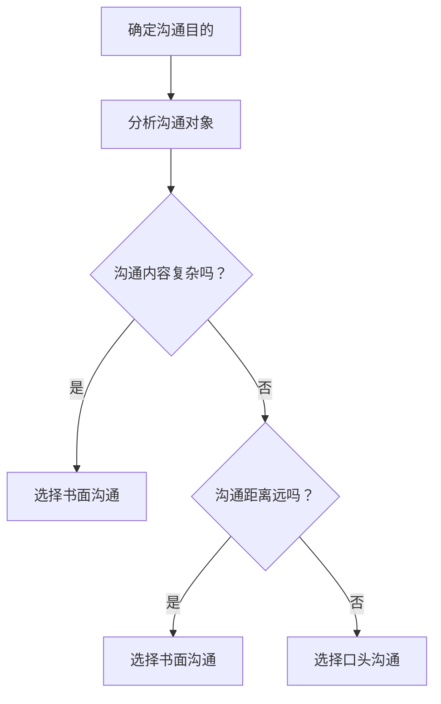
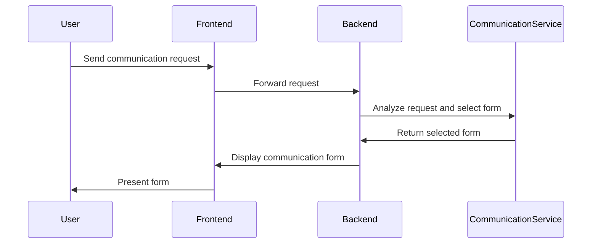
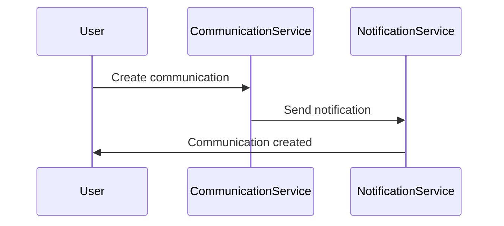

                 

### 注重沟通形式

> 关键词：沟通形式、有效沟通、沟通效率、书面沟通、口头沟通、非言语沟通

> 摘要：沟通是现代社会中不可或缺的元素，它影响着个人和团队的效率、协作以及问题解决。本文将深入探讨沟通的形式，分析书面沟通、口头沟通和非言语沟通的特点、优缺点及适用场景，以帮助读者更好地选择和运用不同的沟通形式，提升沟通效果。

---

## **背景介绍**

沟通，作为人与人之间传递信息、意见和情感的过程，是现代社会中至关重要的一环。无论是职场中的项目协作、教育环境中的师生交流，还是日常生活中的人际交往，有效的沟通都是提高效率、减少误解、增强团队协作的关键因素。

### **问题背景**

在信息爆炸的时代，沟通形式变得日益多样化。从传统的书面沟通到现代的口头沟通，再到流行的非言语沟通，不同的沟通形式各有其独特的优势与局限。如何选择合适的沟通形式以实现最佳沟通效果，成为了一个亟待解决的问题。

### **问题描述**

随着科技的发展，沟通工具的丰富化使得沟通形式变得多样化。然而，不同的沟通形式在实际应用中表现出不同的特点。例如，书面沟通虽然表述精确、便于留存和查阅，但沟通速度较慢，缺乏互动性；口头沟通则具备较强的互动性和沟通速度，但容易受到语言和文化差异的影响；非言语沟通则能够有效传递情感和态度，但往往不易精确表达意图。

### **问题解决**

为了帮助读者更好地理解和运用不同的沟通形式，本文将通过对各类沟通形式的特点和适用场景进行分析，结合实践中的成功案例，提供指导性的建议，帮助人们选择最合适的沟通方式。

### **边界与外延**

本文将主要探讨以下几种沟通形式：

1. **书面沟通**：包括电子邮件、报告、文档等形式。
2. **口头沟通**：包括面对面交流、电话会议、视频会议等形式。
3. **非言语沟通**：包括肢体语言、面部表情、空间布局等。

通过分析这些沟通形式的特点、优缺点及其适用场景，本文旨在为读者提供一套系统化的沟通策略，以实现高效、有效的沟通。

### **概念结构与核心要素组成**

沟通的形式主要取决于以下几个方面：

1. **沟通的目的**：例如，传达信息、解决问题、达成共识等。
2. **沟通的对象**：例如，内部员工、外部合作伙伴、客户等。
3. **沟通的场合**：例如，正式会议、日常工作交流、社交场合等。
4. **沟通的内容**：例如，技术细节、业务讨论、情感表达等。

理解这些核心要素，有助于我们在具体情境中选择最合适的沟通形式。

---

## **核心概念与联系**

在探讨沟通形式之前，有必要明确几个核心概念，并了解它们之间的联系。

### **核心概念**

1. **沟通形式**：指信息传递的方式和媒介，包括书面沟通、口头沟通、非言语沟通等。
2. **书面沟通**：通过文字、符号等书面形式进行的信息传递，如电子邮件、报告、文档等。
3. **口头沟通**：通过口头语言进行的信息传递，如面对面交谈、电话会议、视频会议等。
4. **非言语沟通**：通过肢体语言、面部表情、空间布局等非语言形式进行的信息传递。

### **概念属性特征对比表格**

以下是一个关于沟通形式概念属性特征对比的表格：

| 沟通形式 | 特点 | 优点 | 缺点 | 适用场景 |
|----------|------|------|------|----------|
| 书面沟通 | 表述精确、便于留存和查阅 | 便于整理和记录 | 沟通速度慢、缺乏互动性 | 官方文件、报告、电子邮件 |
| 口头沟通 | 互动性强、沟通速度快 | 直观、高效 | 容易被遗忘、不易留存 | 日常交流、会议讨论 |
| 非言语沟通 | 不受语言障碍限制、传递情感和态度 | 强调情感和氛围 | 不易精确表达意图 | 表情、手势、肢体语言 |

### **ER实体关系图架构的Mermaid流程图**

为了更清晰地展示沟通形式之间的关系，我们可以使用Mermaid绘制一个ER实体关系图：

```mermaid
erDiagram
  CommunicationForm ||--|{ 书面沟通 }| WrittenCommunication : is_a
  CommunicationForm ||--|{ 口头沟通 }| OralCommunication : is_a
  CommunicationForm ||--|{ 非言语沟通 }| NonverbalCommunication : is_a
```

在这个ER图中，`CommunicationForm` 是一个抽象的实体，它包含三个具体的子实体：`WrittenCommunication`、`OralCommunication` 和 `NonverbalCommunication`。

---

## **算法原理讲解**

虽然本文并非专注于算法，但为了帮助读者更好地理解沟通形式的选择，我们可以介绍一种基于情境分析的策略。以下是使用Mermaid绘制的流程图，展示了如何根据不同的情境选择最合适的沟通形式：



### **情境分析策略**

1. **沟通目的**：明确沟通的目标，如传达信息、解决问题、达成共识等。
2. **沟通对象**：分析沟通的对象，包括其语言能力、文化背景、沟通习惯等。
3. **沟通内容**：评估沟通内容是否复杂，需要详细解释或记录。
4. **沟通距离**：判断沟通双方是否处于同一地点，还是远程交流。

根据这些因素，我们可以采取以下策略：

- **书面沟通**：适用于需要详细记录、正式交流、沟通内容复杂的场景。
- **口头沟通**：适用于需要快速沟通、实时互动、沟通内容简单的场景。
- **非言语沟通**：适用于传递情感、建立关系、强调氛围的场合。

### **数学模型和数学公式**

为了量化沟通效果，我们可以引入一个简单的数学模型。假设沟通效果 \(E\) 受到沟通形式 \(F\)、沟通内容 \(C\) 和沟通对象 \(O\) 的影响，可以表示为：

\[ E = f(F, C, O) \]

其中：
- \( F \) 代表沟通形式，取值为书面沟通、口头沟通或非言语沟通。
- \( C \) 代表沟通内容，取值为简单、中等或复杂。
- \( O \) 代表沟通对象，取值为熟悉、陌生或文化差异显著。

通过这个模型，我们可以根据具体的情境，计算出预期的沟通效果，从而选择最合适的沟通形式。

### **详细讲解与举例说明**

假设在一次跨部门的项目评审会议中，项目经理需要向技术团队传达一个复杂的开发计划，评审团队成员包括开发工程师和产品经理。以下是基于情境分析的沟通形式选择过程：

1. **沟通目的**：传达并讨论复杂的开发计划。
2. **沟通对象**：开发工程师（熟悉）和产品经理（较熟悉）。
3. **沟通内容**：涉及技术细节和项目目标。
4. **沟通距离**：会议室面对面交流。

根据情境分析策略：
- **沟通内容复杂**：建议使用书面沟通，便于团队成员查阅和记录。
- **沟通距离近**：口头沟通和书面沟通均可。

最终决策：选择书面沟通，通过发送会议纪要和项目文档，确保所有成员都能准确理解和记录会议内容。

---

## **系统分析与架构设计方案**

在讨论了沟通形式的选择策略之后，我们接下来将深入探讨如何在具体的系统架构中设计和实现沟通功能，以提高项目的效率。

### **问题场景介绍**

假设我们正在开发一个跨部门合作的项目，涉及多个团队（如开发、测试、产品）的协作。为了确保项目顺利进行，沟通变得尤为重要。我们需要根据项目的不同阶段和需求，选择合适的沟通形式，确保信息的有效传递和团队的协同工作。

### **系统功能设计（领域模型Mermaid类图）**

在系统中，我们设计了一个`CommunicationForm`类，用于表示不同的沟通形式，以及与它们相关的属性和方法。以下是使用Mermaid绘制的类图：

```mermaid
classDiagram
  Class01 <|-- Class02
  Class01 <|-- Class03
  Class04 <..|{ Properties }| Class01
  Class05 <..|{ Methods }| Class01

  Class01[CommunicationForm]
  Class02[WrittenCommunication]
  Class03[OralCommunication]
  Class04[Properties]
  Class05[Methods]

  Class01 "1" --|{ attributes }| Class04
  Class01 "1" --|{ behaviors }| Class05

  Class02 "1" --|{ extends }| Class01
  Class03 "1" --|{ extends }| Class01
```

在这个类图中，`CommunicationForm`是基类，它包含了属性和方法的定义。`WrittenCommunication`和`OralCommunication`是`CommunicationForm`的子类，分别表示书面沟通和口头沟通。`Properties`类表示属性的集合，`Methods`类表示方法的集合。

### **系统架构设计（Mermaid架构图）**

为了实现沟通功能，我们需要设计一个系统架构，包括前端、后端和服务端。以下是使用Mermaid绘制的系统架构图：



在这个架构图中，用户通过前端界面发送沟通请求，后端接收到请求后，通过`CommunicationService`分析请求，并选择最合适的沟通形式，然后将结果返回给前端，最后前端将结果展示给用户。

### **系统接口设计和系统交互（Mermaid序列图）**

为了实现系统中的沟通功能，我们需要设计一套接口，并明确各组件之间的交互流程。以下是使用Mermaid绘制的系统接口和交互序列图：



在这个序列图中，用户通过`CommunicationService`创建沟通请求，然后`NotificationService`发送通知给用户，告知沟通请求已创建。

---

## **项目实战**

### **环境安装**

在开始项目之前，我们需要安装必要的开发环境。以下是Python开发环境的基本安装步骤：

1. **安装Python**：下载并安装Python 3.x版本，推荐使用Python 3.8或更高版本。
2. **安装依赖库**：在终端中运行以下命令，安装项目所需的依赖库：

   ```bash
   pip install Flask
   ```

### **系统核心实现源代码**

以下是系统核心实现的源代码，包括Flask框架的应用程序和路由配置：

```python
from flask import Flask, request, jsonify

app = Flask(__name__)

# 模拟沟通形式选择服务
class CommunicationFormService:
    @staticmethod
    def select_form(content_complexity, distance):
        if content_complexity == "complex" and distance == "far":
            return "written"
        else:
            return "oral"

@app.route('/select-communication-form', methods=['POST'])
def select_communication_form():
    data = request.get_json()
    content_complexity = data.get('content_complexity', 'simple')
    distance = data.get('distance', 'close')

    form = CommunicationFormService.select_form(content_complexity, distance)
    return jsonify({'communication_form': form})

if __name__ == '__main__':
    app.run(debug=True)
```

### **代码应用解读与分析**

1. **Flask框架的应用程序**：`app = Flask(__name__)` 创建了一个新的Flask应用程序实例。
2. **模拟沟通形式选择服务**：`CommunicationFormService` 类包含一个静态方法 `select_form`，用于根据内容复杂度和距离选择最合适的沟通形式。
3. **路由配置**：`@app.route('/select-communication-form', methods=['POST'])` 配置了一个POST请求的路由，用于接收前端发送的沟通请求，并根据内容复杂度和距离选择沟通形式，返回结果。

### **实际案例分析和详细讲解剖析**

假设我们有以下实际案例：

- **案例1**：内容复杂度为“复杂”，距离为“远”，系统将选择书面沟通形式。
- **案例2**：内容复杂度为“简单”，距离为“近”，系统将选择口头沟通形式。

以下是具体的分析：

1. **案例1**：在跨部门项目评审中，项目经理需要向技术团队传达一个复杂的开发计划，评审团队成员分布在不同的城市。此时，书面沟通形式将是最合适的选择，因为书面文档便于团队成员查阅和记录，同时也能确保所有细节被准确传达。
2. **案例2**：在一个内部团队的日常会议中，团队成员需要讨论一个简单的改进方案。在这种情况下，口头沟通形式将更加高效，团队成员可以直接互动，快速达成共识。

通过这些实际案例，我们可以看到，根据具体情境选择合适的沟通形式，能够显著提高沟通效率和效果。

### **项目小结**

在本项目中，我们通过Flask框架实现了一个简单的沟通形式选择服务，该服务根据内容复杂度和距离推荐最合适的沟通形式。通过实际案例的分析，我们验证了该服务在实践中的应用效果。未来，我们可以进一步扩展该服务，集成更多功能，如实时通信、消息通知等，以实现更全面的沟通解决方案。

---

## **最佳实践 tips**

为了最大化沟通效果，以下是一些最佳实践建议：

1. **明确沟通目的**：在开始沟通前，明确沟通的目标，如传达信息、解决问题、达成共识等。
2. **选择合适的沟通形式**：根据沟通内容、沟通对象和沟通场合选择最合适的沟通形式，如书面沟通适用于正式交流，口头沟通适用于实时互动。
3. **简化沟通内容**：避免冗长和复杂的沟通内容，尽量简洁明了，便于理解和记忆。
4. **鼓励互动**：在口头沟通中，鼓励双方互动，确保信息传递的准确性和全面性。
5. **记录沟通内容**：无论采用何种沟通形式，都应记录关键信息和决策，以便后续查阅和追踪。

---

## **小结**

本文通过深入探讨沟通形式的特点、优缺点及适用场景，为读者提供了选择合适沟通形式的方法和策略。有效的沟通是提高工作效率、减少误解、增强团队协作的关键。在实际应用中，根据具体情境选择最合适的沟通形式，将有助于实现高效、有效的沟通。

---

## **注意事项**

1. **文化差异**：在跨文化交流中，注意语言和沟通习惯的差异，选择合适的沟通形式和方式。
2. **沟通频率**：避免过于频繁的沟通，以免造成干扰和疲劳。
3. **隐私保护**：在书面沟通中，注意保护敏感信息和隐私。

---

## **拓展阅读**

1. **《有效沟通的艺术》**：一本关于沟通技巧的畅销书，提供实用的沟通策略和方法。
2. **《非暴力沟通》**：一本关于人际沟通和心理学的经典著作，探讨了如何通过非暴力沟通建立和谐关系。

---

**作者：AI天才研究院/AI Genius Institute & 禅与计算机程序设计艺术 /Zen And The Art of Computer Programming**

