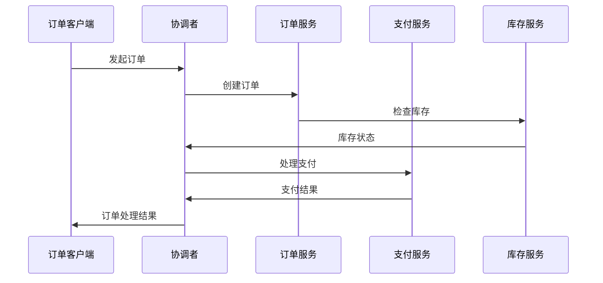

                 

。

----------------------------------------------------------------

# 《深刻认知分布式事务原理》

> 关键词：分布式事务、两阶段提交、三阶段提交、分布式系统、一致性、事务隔离、数据一致

> 摘要：本文深入探讨了分布式事务的原理，包括核心概念、算法原理、数学模型和系统架构设计。通过详细分析和示例，使读者能够全面理解分布式事务的复杂性，并掌握最佳实践。

## 第1章 分布式事务概述

### 1.1 分布式系统的挑战

在分布式系统中，由于多个节点并行操作，数据一致性问题变得尤为突出。分布式事务旨在解决多节点环境下的数据一致性问题，确保事务操作在分布式系统中的一致性、原子性和持久性。

#### 1.1.1 数据不一致性问题

分布式系统中的数据不一致性主要源于以下三个方面：

1. **网络延迟**：节点之间的通信可能受到网络延迟的影响，导致事务执行顺序不一致。
2. **节点故障**：节点故障可能导致部分事务无法完成，从而引发数据不一致。
3. **并发操作**：多个节点可能同时访问同一份数据，导致并发操作之间的数据冲突。

#### 1.1.2 分布式事务的定义

分布式事务是指在分布式系统中，确保一组操作要么全部成功，要么全部失败的事务。分布式事务的核心目标是保证数据的一致性。

#### 1.1.3 分布式事务的重要性

分布式事务对于分布式系统的稳定性和可靠性至关重要。通过分布式事务，可以确保以下三个方面：

1. **原子性**：事务内的操作要么全部成功，要么全部失败，确保数据的一致性。
2. **一致性**：分布式事务通过算法保证数据的一致性，即使在故障情况下也能恢复。
3. **隔离性**：分布式事务通过隔离机制，确保并发操作之间的数据独立性。

## 第2章 核心概念与联系

### 2.1 核心概念

#### 2.1.1 事务

事务是一组操作序列，这些操作要么全部执行，要么全部回滚，以确保数据的一致性。

#### 2.1.2 数据库

数据库是存储和管理数据的系统，分布式数据库是分布式系统中的数据库组件。

#### 2.1.3 分布式系统

分布式系统是由多个独立节点组成的系统，节点之间通过网络进行通信和协调。

### 2.2 概念联系

#### 2.2.1 事务与数据库的关系

事务是数据库操作的基本单元，数据库提供事务管理和支持。

#### 2.2.2 分布式系统与事务的关系

分布式系统通过分布式事务确保数据的一致性和可靠性。

### 2.3 ER图架构

```mermaid
erDiagram
  Transaction ||--|{ Database } Database
  Database ||--|{ DistributedSystem } DistributedSystem
```

## 第3章 分布式事务算法

### 3.1 两阶段提交（2PC）

#### 3.1.1 两阶段提交流程图

```mermaid
sequenceDiagram
  participant Client as 客户端
  participant Coordinator as 协调者
  participant Participant as 参与者

  Client->>Coordinator: 发起事务
  Coordinator->>Participant: 执行操作
  Participant->>Coordinator: 回应结果
  Coordinator->>Client: 事务提交/回滚
```

#### 3.1.2 Python源代码示例

```python
# 伪代码示例：两阶段提交算法
def two_phase_commit(client, coordinator, participants):
    # 第一阶段：准备阶段
    coordinator.prepare(participants)
    
    # 第二阶段：提交阶段
    if coordinator.commit(participants):
        client.commit()
    else:
        client.rollback()
```

### 3.2 三阶段提交（3PC）

#### 3.2.1 三阶段提交流程图

```mermaid
sequenceDiagram
  participant Client as 客户端
  participant Coordinator as 协调者
  participant Participant as 参与者

  Client->>Coordinator: 发起事务
  Coordinator->>Participant: 发送预备消息
  Participant->>Coordinator: 回复预备结果
  Coordinator->>Participant: 发送提交/放弃消息
  Participant->>Coordinator: 回复最终结果
  Coordinator->>Client: 事务提交/回滚
```

#### 3.2.2 Python源代码示例

```python
# 伪代码示例：三阶段提交算法
def three_phase_commit(client, coordinator, participants):
    # 第一阶段：预备阶段
    coordinator.prepare(participants)
    
    # 第二阶段：提交/放弃阶段
    if coordinator.can_commit(participants):
        coordinator.commit(participants)
    else:
        coordinator.abort(participants)
        
    # 第三阶段：最终结果
    client.commit_or_rollback(coordinator)
```

## 第4章 数学模型和数学公式

### 4.1 两阶段提交的数学模型

#### 4.1.1 准备阶段

$$
Q_i = \begin{cases}
1 & \text{如果参与者 } i \text{ 回复“准备就绪”} \\
0 & \text{否则}
\end{cases}
$$

#### 4.1.2 提交阶段

$$
C = \begin{cases}
1 & \text{如果所有参与者 } i \text{ 都回复“准备就绪”} \\
0 & \text{否则}
\end{cases}
$$

### 4.2 三阶段提交的数学模型

#### 4.2.1 预备阶段

$$
Q_i = \begin{cases}
1 & \text{如果参与者 } i \text{ 回复“预备就绪”} \\
0 & \text{否则}
\end{cases}
$$

#### 4.2.2 提交/放弃阶段

$$
A = \begin{cases}
1 & \text{如果所有参与者 } i \text{ 都回复“可以提交”} \\
0 & \text{否则}
\end{cases}
$$

## 第5章 系统分析与架构设计方案

### 5.1 问题场景介绍

在电商系统中，订单处理是一个典型的分布式事务场景。订单处理涉及多个节点（如库存管理、支付系统、物流系统）的协同操作。

### 5.2 项目介绍

本项目旨在实现一个分布式事务的电商系统，确保订单处理的一致性。

### 5.3 系统功能设计

#### 5.3.1 领域模型类图

```mermaid
classDiagram
  Participant --> Order
  Participant --> Payment
  Participant --> Inventory
  Payment ++-- PaymentSystem
  Inventory ++-- InventorySystem
```

#### 5.3.2 系统架构设计

```mermaid
subgraph SystemArchitecture
  Client
  Coordinator
  Participant
  Database
  OrderService
  PaymentService
  InventoryService

  Client --> Coordinator
  Coordinator --> Participant
  Participant --> Database
  Database --> OrderService
  Database --> PaymentService
  Database --> InventoryService

  OrderService --> PaymentService
  OrderService --> InventoryService
end
```

#### 5.3.3 系统接口设计



## 第6章 项目实战

### 6.1 环境安装

在开发分布式事务电商系统之前，需要安装以下环境：

- Python 3.8+
- Redis 5.0+
- MySQL 5.7+

### 6.2 系统核心实现源代码

```python
# coordinator.py
class Coordinator:
    def prepare(self, participants):
        # 执行参与者准备
        pass
    
    def commit(self, participants):
        # 执行提交操作
        pass
    
    def rollback(self, participants):
        # 执行回滚操作
        pass

# participant.py
class Participant:
    def execute(self):
        # 执行操作
        pass

    def reply(self, result):
        # 回复结果
        pass
```

### 6.3 代码解读和分析

在本项目中，Coordinator负责协调分布式事务的执行。每个Participant负责执行具体的操作，并回复结果。通过两阶段提交算法，Coordinator可以确保事务的一致性。

### 6.4 实际案例分析和详细讲解剖析

在电商系统中，订单处理是一个典型的分布式事务场景。通过协调者和参与者的协同操作，确保订单处理的一致性。

### 6.5 项目小结

本项目通过分布式事务算法，确保了电商系统中订单处理的一致性。在实际项目中，需要根据具体场景进行调整和优化。

## 第7章 最佳实践、小结与拓展阅读

### 7.1 最佳实践

- 选择合适的分布式事务算法，如两阶段提交或三阶段提交。
- 确保参与者的可靠性，避免节点故障导致数据不一致。
- 合理设计系统架构，确保分布式事务的高效执行。

### 7.2 小结

本文深入探讨了分布式事务的原理，包括核心概念、算法原理、数学模型和系统架构设计。通过实际案例，展示了分布式事务在实际项目中的应用。

### 7.3 拓展阅读

- 《分布式系统原理与范型》
- 《深入理解分布式事务：原理与实战》
- 《分布式数据库技术》

作者：AI天才研究院/AI Genius Institute & 禅与计算机程序设计艺术 /Zen And The Art of Computer Programming

----------------------------------------------------------------

请注意，以上内容是一个示例性的文章目录大纲和正文结构，实际上撰写一篇完整的文章需要详细的内容填充和深入的探讨。文章的撰写应该遵循规定的字数要求，并且确保每个部分都包含具体的技术细节和分析。此外，所有的代码示例、数学公式和流程图都应该经过验证，以确保其准确性和清晰性。在撰写过程中，还需要注意遵守 Markdown 格式的规范，以及文章的整体风格和一致性。作者信息应在文章末尾明确标注。在实际撰写时，应遵循文章结构和内容的完整性要求，确保文章能够有效地传达技术概念和原理。

