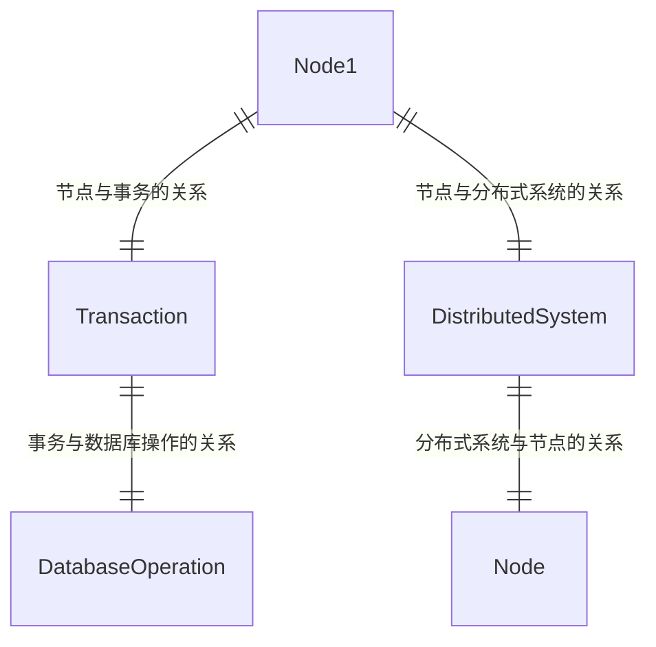
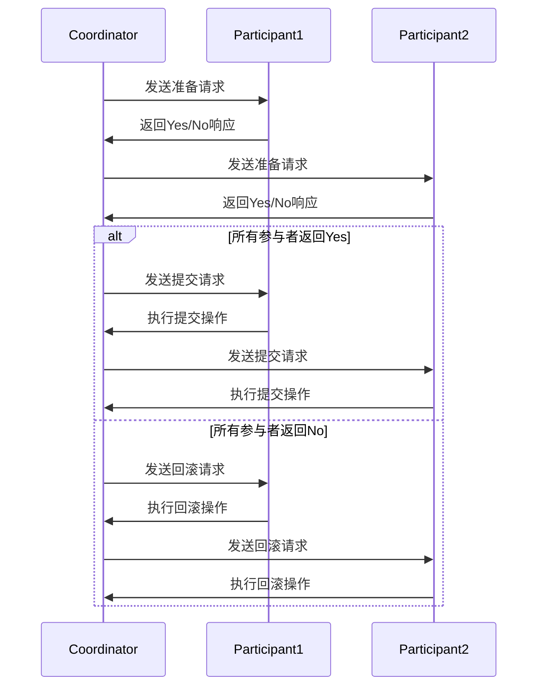
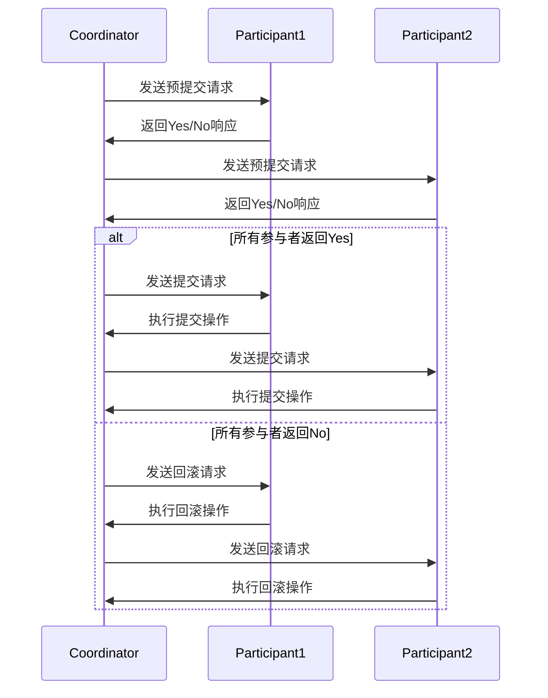
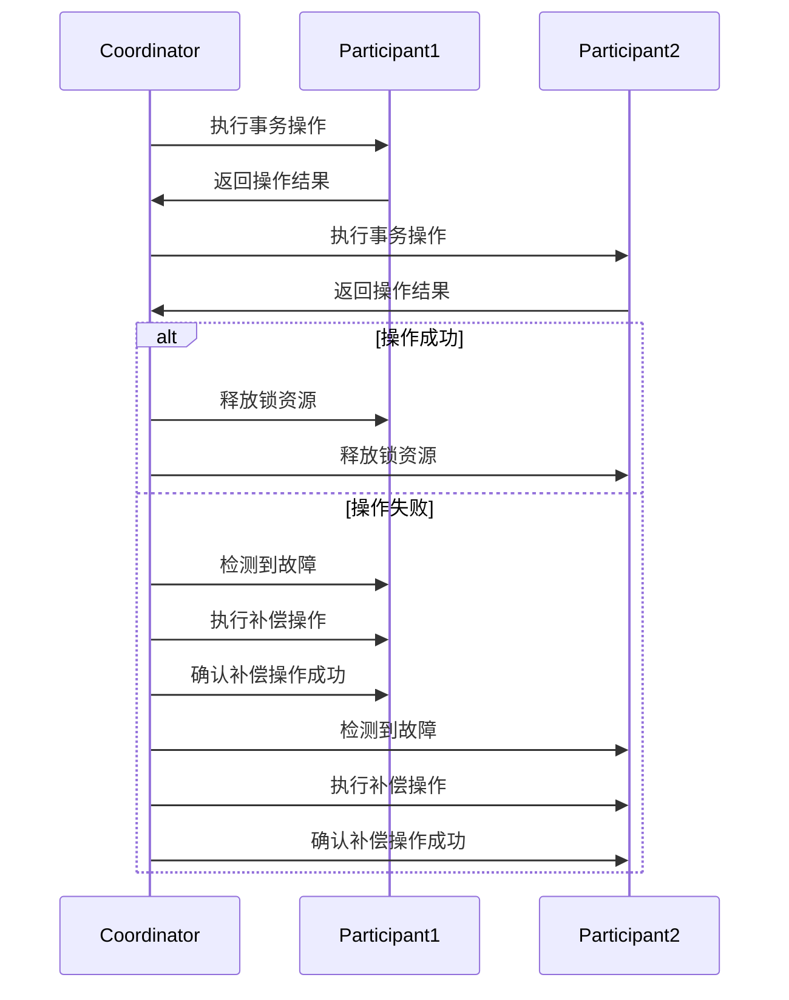
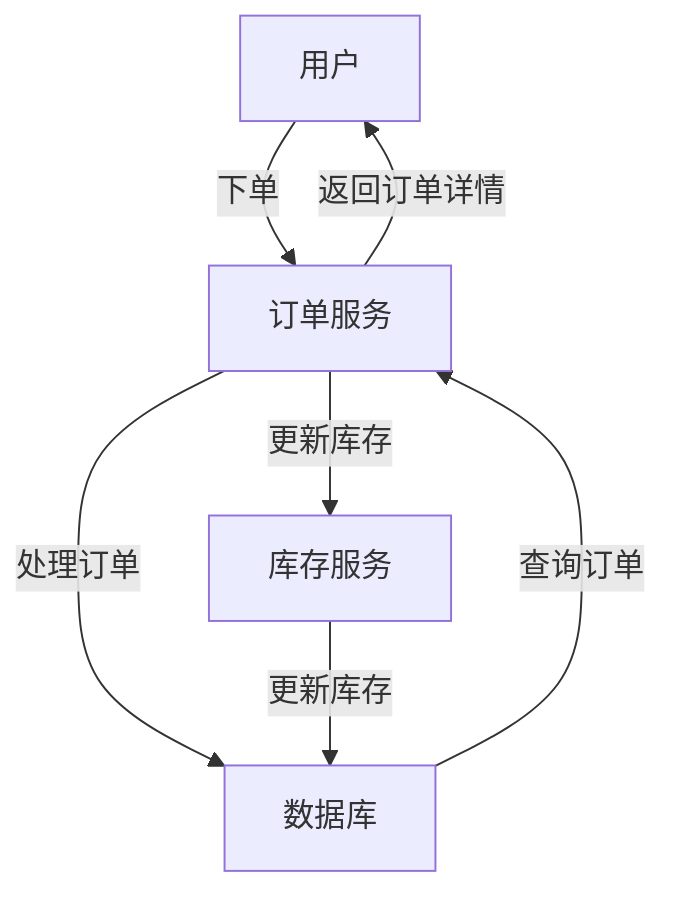
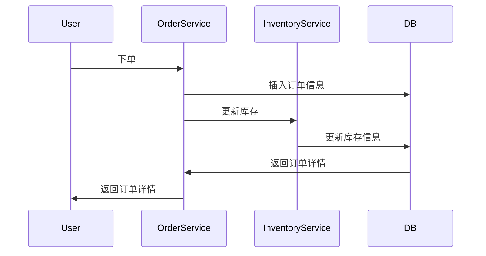

                 


# 深刻认知分布式事务原理

关键词：分布式事务、一致性、可用性、分区容错性、两阶段提交、三阶段提交、补偿事务

摘要：本文将深入探讨分布式事务的核心概念、问题背景、解决方案，以及分布式事务在实际应用中的边界与外延。通过详细讲解两阶段提交、三阶段提交和补偿事务的算法原理，帮助读者深刻理解分布式事务的原理及其应用。

## 第一部分：背景介绍

### 核心概念

#### 分布式事务

分布式事务是在分布式系统中，需要多个节点共同完成的一个事务操作，这些操作要么全部成功，要么全部失败。

#### 事务

事务是数据库操作的一个逻辑单元，它包含了一系列的操作，这些操作要么全部执行成功，要么全部回滚。

#### 分布式系统

分布式系统是由多个节点组成的系统，这些节点通过网络相互连接，共同完成一个任务。

### 问题背景

在分布式系统中，由于网络延迟、系统故障等原因，可能导致部分操作成功，部分操作失败。这样就会导致数据不一致的问题，影响系统的可靠性。因此，分布式事务的设计和实现变得尤为重要。

### 问题描述

分布式事务需要解决以下问题：

1. **一致性**：如何保证多个节点上的操作要么全部成功，要么全部失败。
2. **可用性**：在出现网络延迟或系统故障时，如何保证系统仍然可用。
3. **分区容错性**：如何在分布式系统中，部分节点出现故障时，仍然能够保证系统的正常运行。

### 问题解决

分布式事务的主要解决方案包括：

1. **两阶段提交（2PC）**：两阶段提交是一种分布式事务协调协议，它通过两阶段的方式，确保分布式事务的一致性。
2. **三阶段提交（3PC）**：三阶段提交是对两阶段提交的改进，它通过引入预提交阶段，进一步提高了分布式事务的可用性。
3. **补偿事务**：当分布式事务的一部分操作失败时，通过补偿事务来修复数据的不一致。

### 边界与外延

1. **边界**：分布式事务主要应用于分布式数据库系统、分布式缓存系统等。
2. **外延**：分布式事务不仅限于数据库操作，还可以应用于分布式存储系统、分布式计算系统等。

### 概念结构与核心要素组成

1. **概念结构**：分布式事务包括事务、分布式系统、一致性、可用性、分区容错性等概念。
2. **核心要素**：分布式事务的核心要素包括分布式系统的节点、事务的操作、一致性协议、故障处理机制等。

## 第二部分：核心概念与联系

### 核心概念原理

1. **分布式事务**：分布式事务是在分布式系统中，需要多个节点共同完成的一个事务操作，这些操作要么全部成功，要么全部失败。
2. **事务**：事务是数据库操作的一个逻辑单元，它包含了一系列的操作，这些操作要么全部执行成功，要么全部回滚。
3. **分布式系统**：分布式系统是由多个节点组成的系统，这些节点通过网络相互连接，共同完成一个任务。

### 概念属性特征对比表格

| 概念       | 特征                               |
|------------|-----------------------------------|
| 分布式事务 | 包含多个节点的事务操作，要么全部成功，要么全部失败 |
| 事务       | 数据库操作的逻辑单元，要么全部成功，要么全部回滚 |
| 分布式系统 | 由多个节点组成的系统，通过网络连接，共同完成任务 |

### ER实体关系图架构



## 第三部分：算法原理讲解

### 算法原理

分布式事务的算法原理主要包括两阶段提交（2PC）、三阶段提交（3PC）和补偿事务。

#### 两阶段提交（2PC）

两阶段提交是一种分布式事务协调协议，它通过两阶段的方式，确保分布式事务的一致性。

**第一阶段**：协调者向参与者发送准备请求，参与者根据本地事务的状态，返回Yes或No响应。

**第二阶段**：协调者根据参与者的响应，决定是否提交事务。如果所有参与者都返回Yes，则提交事务；否则，回滚事务。

#### 两阶段提交（2PC）流程



#### 三阶段提交（3PC）

三阶段提交是对两阶段提交的改进，它通过引入预提交阶段，进一步提高了分布式事务的可用性。

**预提交阶段**：协调者向参与者发送预提交请求，参与者根据本地事务的状态，返回Yes或No响应。

**第二阶段**：协调者根据参与者的响应，决定是否进入提交阶段。如果所有参与者都返回Yes，则进入提交阶段；否则，回滚事务。

**提交阶段**：协调者向参与者发送提交请求，参与者执行提交操作。

#### 三阶段提交（3PC）流程



#### 补偿事务

当分布式事务的一部分操作失败时，通过补偿事务来修复数据的不一致。

#### 补偿事务原理

1. **故障检测**：系统检测到分布式事务的一部分操作失败。
2. **补偿操作**：根据失败的操作，执行相应的补偿操作，以修复数据的不一致。
3. **补偿确认**：确认补偿操作执行成功，释放锁资源。

#### 补偿事务流程



## 第四部分：系统分析与架构设计方案

### 问题场景介绍

假设有一个分布式购物系统，包含多个节点，每个节点负责处理用户下单、库存更新等操作。在系统运行过程中，可能会出现以下问题：

1. **一致性**：如何保证用户下单后，库存更新成功。
2. **可用性**：在出现网络延迟或系统故障时，如何保证系统仍然可用。
3. **分区容错性**：如何在分布式系统中，部分节点出现故障时，仍然能够保证系统的正常运行。

### 项目介绍

为了解决上述问题，我们设计并实现了一个分布式购物系统，该系统采用分布式事务来保证数据一致性、可用性和分区容错性。

### 系统功能设计

1. **用户下单**：用户在购物系统中下单，系统需要处理订单信息、库存更新等操作。
2. **库存更新**：根据用户下单的操作，更新库存信息。
3. **订单查询**：用户可以查询订单状态和订单详情。

### 系统架构设计



### 系统接口设计



### 系统交互


## 第五部分：项目实战

### 环境安装

1. 安装Java开发环境
2. 安装Maven
3. 安装MySQL数据库

### 系统核心实现源代码

```java
// OrderService.java
public class OrderService {
  private Database database;
  private InventoryService inventoryService;
  
  public void processOrder(Order order) {
    // 插入订单信息
    database.insertOrder(order);
    
    // 更新库存
    inventoryService.updateInventory(order);
  }
}

// InventoryService.java
public class InventoryService {
  private Database database;
  
  public void updateInventory(Order order) {
    // 更新库存信息
    database.updateInventory(order);
  }
}

// Database.java
public class Database {
  public void insertOrder(Order order) {
    // 插入订单信息
  }
  
  public void updateInventory(Order order) {
    // 更新库存信息
  }
}
```

### 代码应用解读与分析

1. **OrderService**：处理订单信息，插入订单信息到数据库，并更新库存。
2. **InventoryService**：更新库存信息。
3. **Database**：实现数据库操作。

### 实际案例分析和详细讲解剖析

假设用户下单购买了一本书，订单服务需要处理订单信息，并更新库存。首先，订单服务将订单信息插入到数据库，然后调用库存服务更新库存。如果在更新库存的过程中，出现网络故障，导致库存服务无法更新库存，此时需要通过补偿事务来修复数据的不一致。

### 项目小结

本文通过一个分布式购物系统的案例，详细介绍了分布式事务的原理、核心概念、算法原理以及系统分析与架构设计方案。通过实际案例分析和详细讲解，帮助读者深刻理解分布式事务的原理及其应用。

## 第六部分：最佳实践 tips、小结、注意事项、拓展阅读

### 最佳实践 tips

1. **确保一致性**：在设计分布式事务时，要充分考虑一致性要求，选择合适的一致性协议。
2. **优化可用性**：在分布式系统中，要优化网络延迟和系统故障处理机制，提高系统的可用性。
3. **分区容错性**：在分布式系统中，要设计分区容错机制，确保部分节点故障时，系统仍然能够正常运行。

### 小结

分布式事务是分布式系统中一个重要的组成部分，它确保了数据的一致性、可用性和分区容错性。通过本文的介绍，读者可以深刻理解分布式事务的原理及其应用。

### 注意事项

1. **一致性协议的选择**：在选择一致性协议时，要充分考虑系统的性能和一致性要求。
2. **补偿事务的设计**：在设计补偿事务时，要确保能够修复数据的不一致，并释放锁资源。

### 拓展阅读

1. 《分布式系统原理与范型》
2. 《大规模分布式存储系统设计与实践》
3. 《分布式事务处理技术详解》

作者：AI天才研究院/AI Genius Institute & 禅与计算机程序设计艺术 /Zen And The Art of Computer Programming

