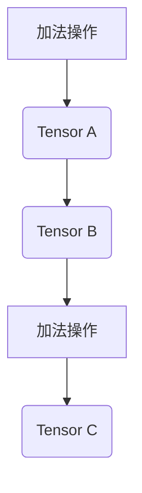

                 


# 深度学习框架比较：TensorFlow vs PyTorch

> 关键词：深度学习框架，TensorFlow，PyTorch，比较，架构，特性，社区

> 摘要：本文将深入比较深度学习领域的两大框架TensorFlow和PyTorch，从基础概念、核心架构、具体特性、应用实践等多个维度展开分析，帮助读者全面了解两者的优缺点，为项目选择提供参考。

----------------------------------------------------------------

## 引言

深度学习作为人工智能的重要分支，近年来在图像识别、自然语言处理、语音识别等领域取得了显著的进展。为了实现深度学习模型的构建和训练，我们需要依赖深度学习框架。TensorFlow和PyTorch是目前最受欢迎的两个深度学习框架，它们各自具有独特的优势和特点。本文将围绕这两个框架进行比较分析，帮助读者更好地理解它们，并在实际项目中做出合适的选择。

## 第一部分：深度学习与框架概述

### 第1章：深度学习简介

#### 1.1 深度学习的起源与发展

深度学习（Deep Learning）是机器学习的一个子领域，主要关注于模拟人脑进行分析学习的神经网络。深度学习的概念最早可以追溯到1986年，当时Rumelhart、Hinton和Williams提出了反向传播算法（Backpropagation Algorithm），这一算法使得神经网络能够通过多层节点进行训练，从而实现更加复杂的模型。

随着计算能力的提升和大数据的发展，深度学习在21世纪初迎来了爆发式增长。2012年，AlexNet在ImageNet大赛中取得了惊人的成绩，标志着深度卷积神经网络（Convolutional Neural Networks, CNN）在图像识别领域的崛起。此后，深度学习逐渐渗透到各个领域，成为人工智能研究的重要方向。

#### 1.2 深度学习的关键概念

深度学习的关键概念包括神经网络、激活函数、损失函数、反向传播算法等。

- **神经网络**：神经网络是由多个神经元组成的计算模型，通过调整神经元之间的权重来学习输入和输出之间的映射关系。
- **激活函数**：激活函数用于引入非线性特性，使神经网络能够对复杂问题进行建模。
- **损失函数**：损失函数用于衡量预测值与真实值之间的差距，是模型训练过程中的优化目标。
- **反向传播算法**：反向传播算法是一种用于训练神经网络的优化方法，通过计算梯度来调整模型参数，使损失函数逐渐减小。

### 第2章：概述深度学习框架

#### 2.1 深度学习框架的作用

深度学习框架是用于构建和训练深度学习模型的软件库。它们提供了简洁的API、丰富的预训练模型和高效的计算引擎，使得深度学习的研究和开发变得更加便捷。深度学习框架的主要作用包括：

- **简化模型构建**：通过提供高层API，框架降低了模型构建的复杂度，使得开发者能够快速实现深度学习模型。
- **加速模型训练**：框架通常包含了优化器和并行计算支持，能够显著提高模型训练的效率。
- **提供预训练模型**：框架通常包含了大量预训练模型，开发者可以直接使用这些模型，或者基于这些模型进行微调。

#### 2.2 TensorFlow与PyTorch的背景

TensorFlow是由Google Brain团队于2015年开源的一个深度学习框架。TensorFlow采用了基于数据流图（Data Flow Graph）的编程模型，通过定义计算图来构建模型，然后通过计算图执行模型训练和推理任务。TensorFlow的优点包括：

- **强大的生态**：TensorFlow拥有丰富的预训练模型和第三方库，支持多种编程语言，如Python、C++等。
- **灵活的部署**：TensorFlow支持在多种硬件平台上部署，包括CPU、GPU和TPU等。
- **大规模分布式训练**：TensorFlow支持分布式训练，能够充分利用多台机器的计算资源。

PyTorch是由Facebook的人工智能研究团队于2016年开源的一个深度学习框架。PyTorch采用了动态计算图（Dynamic Computation Graph）的编程模型，通过实时构建和执行计算图来训练模型。PyTorch的优点包括：

- **简洁易用**：PyTorch的API简洁直观，易于理解和上手。
- **动态计算图**：PyTorch的动态计算图使得模型调试和原型设计更加灵活。
- **社区支持**：PyTorch拥有活跃的社区，提供了丰富的资源和教程。

## 第二部分：基础概念与原理

### 第3章：TensorFlow基础

#### 3.1 TensorFlow的核心架构

TensorFlow的核心架构包括计算图（Computational Graph）、会话（Session）和Tensor。

- **计算图**：TensorFlow使用计算图来表示模型。计算图由节点（Operations）和边（Tensors）组成，节点表示操作，边表示数据流。
- **会话**：会话用于执行计算图中的操作。通过会话，可以启动图、执行图操作和获取操作结果。
- **Tensor**：Tensor是TensorFlow中的多维数组，用于表示数据。TensorFlow中的所有计算都是基于Tensor进行的。

#### 3.2 TensorFlow的基本操作

TensorFlow提供了丰富的API，包括操作（Operations）和函数（Functions）。

- **操作**：操作用于执行特定的计算任务，如加法、减法、乘法和除法等。
- **函数**：函数用于构建更复杂的计算流程，如张量生成、数据预处理和模型训练等。

### 第4章：PyTorch基础

#### 4.1 PyTorch的核心架构

PyTorch的核心架构包括动态计算图（Dynamic Computation Graph）、变量（Variables）和模块（Modules）。

- **动态计算图**：PyTorch使用动态计算图来表示模型。动态计算图允许开发者实时构建和修改计算图，使得模型调试和原型设计更加灵活。
- **变量**：变量是PyTorch中的可训练参数，用于存储模型权重和偏置。
- **模块**：模块是PyTorch中的可复用代码块，用于构建复杂模型。

#### 4.2 PyTorch的基本操作

PyTorch提供了简洁的API，包括操作（Operations）和函数（Functions）。

- **操作**：操作用于执行特定的计算任务，如加法、减法、乘法和除法等。
- **函数**：函数用于构建更复杂的计算流程，如张量生成、数据预处理和模型训练等。

## 第三部分：安装与配置

### 第5章：TensorFlow安装

TensorFlow的安装相对简单，可以通过以下命令进行安装：

```python
pip install tensorflow
```

安装后，可以通过以下代码验证安装是否成功：

```python
import tensorflow as tf
print(tf.__version__)
```

### 第6章：PyTorch安装

PyTorch的安装也相对简单，可以通过以下命令进行安装：

```python
pip install torch torchvision
```

安装后，可以通过以下代码验证安装是否成功：

```python
import torch
print(torch.__version__)
```

## 第四部分：核心架构与组件

### 第7章：TensorFlow架构

TensorFlow的核心架构包括计算图（Computational Graph）、会话（Session）和Tensor。

- **计算图**：TensorFlow使用计算图来表示模型。计算图由节点（Operations）和边（Tensors）组成，节点表示操作，边表示数据流。
- **会话**：会话用于执行计算图中的操作。通过会话，可以启动图、执行图操作和获取操作结果。
- **Tensor**：Tensor是TensorFlow中的多维数组，用于表示数据。TensorFlow中的所有计算都是基于Tensor进行的。

### 第8章：PyTorch架构

PyTorch的核心架构包括动态计算图（Dynamic Computation Graph）、变量（Variables）和模块（Modules）。

- **动态计算图**：PyTorch使用动态计算图来表示模型。动态计算图允许开发者实时构建和修改计算图，使得模型调试和原型设计更加灵活。
- **变量**：变量是PyTorch中的可训练参数，用于存储模型权重和偏置。
- **模块**：模块是PyTorch中的可复用代码块，用于构建复杂模型。

## 第五部分：比较分析

### 第9章：TensorFlow与PyTorch比较分析

在本章中，我们将从多个维度对TensorFlow和PyTorch进行比较分析，包括编程模型、动态图与静态图、生态系统、部署等。

### 9.1 编程模型

- **TensorFlow**：TensorFlow采用静态计算图编程模型，开发者需要先定义计算图，然后启动会话来执行计算。这种编程模型使得TensorFlow在模型定义和推理过程中具有较高的性能，但模型调试相对复杂。
- **PyTorch**：PyTorch采用动态计算图编程模型，开发者可以实时构建和修改计算图。这种编程模型使得PyTorch在模型调试和原型设计方面更加灵活，但模型推理性能相对较低。

### 9.2 动态图与静态图

- **TensorFlow**：TensorFlow使用静态计算图，计算图在模型定义时就已经确定，无法在运行时修改。这种静态图模型在推理过程中具有较高的性能，但模型调试相对复杂。
- **PyTorch**：PyTorch使用动态计算图，计算图在运行时可以动态构建和修改。这种动态图模型在模型调试和原型设计方面更加灵活，但模型推理性能相对较低。

### 9.3 生态系统

- **TensorFlow**：TensorFlow拥有庞大的生态系统，提供了丰富的预训练模型、第三方库和工具。TensorFlow的生态系统涵盖了从研究到生产的各个方面，使得TensorFlow在工业界和学术界的应用都非常广泛。
- **PyTorch**：PyTorch的生态系统相对较小，但也在不断壮大。PyTorch提供了丰富的预训练模型和工具，如TorchVision、TorchText等。PyTorch在学术界和应用开发领域都有很高的声誉。

### 9.4 部署

- **TensorFlow**：TensorFlow支持多种部署方式，包括服务器端部署、移动端部署和边缘设备部署。TensorFlow的部署过程相对简单，提供了完整的部署指南和工具。
- **PyTorch**：PyTorch的部署相对较为复杂，目前主要支持服务器端部署。PyTorch的部署过程需要开发者手动编写代码，但PyTorch正在积极拓展部署能力，未来有望支持更多部署方式。

## 第六部分：具体特性与能力

### 第10章：TensorFlow具体特性

在本章中，我们将深入探讨TensorFlow的具体特性，包括高级API、预训练模型、扩展能力等。

### 10.1 高级API

TensorFlow提供了丰富的高级API，包括Keras、TensorFlow Lite等。

- **Keras**：Keras是TensorFlow的高级API，提供了简洁的接口，使得模型构建更加直观和高效。
- **TensorFlow Lite**：TensorFlow Lite是TensorFlow的轻量级版本，用于移动端和嵌入式设备部署。TensorFlow Lite提供了丰富的预训练模型和工具，使得移动端和嵌入式设备的深度学习应用变得更加便捷。

### 10.2 预训练模型

TensorFlow提供了大量预训练模型，包括图像分类、目标检测、自然语言处理等领域的模型。这些预训练模型可以用于迁移学习，快速实现特定任务的性能提升。

### 10.3 扩展能力

TensorFlow具有良好的扩展性，支持自定义操作、自定义层和自定义模型。开发者可以根据需求对TensorFlow进行定制和扩展，实现特定的功能。

### 第11章：PyTorch具体特性

在本章中，我们将深入探讨PyTorch的具体特性，包括动态计算图、简洁的API、扩展能力等。

### 11.1 动态计算图

PyTorch的动态计算图使得模型调试和原型设计更加灵活。开发者可以在运行时动态修改计算图，方便地进行模型调试和实验。

### 11.2 简洁的API

PyTorch提供了简洁的API，使得模型构建更加直观和高效。PyTorch的API设计遵循Pythonic原则，使得代码更加易于理解和维护。

### 11.3 扩展能力

PyTorch具有良好的扩展性，支持自定义操作、自定义层和自定义模型。开发者可以根据需求对PyTorch进行定制和扩展，实现特定的功能。

## 第七部分：实战项目与应用

### 第12章：TensorFlow实战项目

在本章中，我们将通过一个简单的图像分类项目，展示如何使用TensorFlow构建和训练深度学习模型。

### 12.1 项目介绍

本项目使用TensorFlow实现一个简单的图像分类模型，能够对MNIST数据集中的手写数字进行分类。

### 12.2 系统功能设计

本项目的核心功能包括数据预处理、模型构建、模型训练和模型评估。

### 12.3 系统架构设计

本项目的系统架构包括数据预处理模块、模型构建模块、模型训练模块和模型评估模块。

### 12.4 系统接口设计

本项目的系统接口设计包括数据预处理接口、模型构建接口、模型训练接口和模型评估接口。

### 12.5 系统交互

本项目的系统交互通过数据流驱动，包括数据预处理、模型构建、模型训练和模型评估等环节。

### 第13章：PyTorch实战项目

在本章中，我们将通过一个简单的图像分类项目，展示如何使用PyTorch构建和训练深度学习模型。

### 13.1 项目介绍

本项目使用PyTorch实现一个简单的图像分类模型，能够对MNIST数据集中的手写数字进行分类。

### 13.2 系统功能设计

本项目的核心功能包括数据预处理、模型构建、模型训练和模型评估。

### 13.3 系统架构设计

本项目的系统架构包括数据预处理模块、模型构建模块、模型训练模块和模型评估模块。

### 13.4 系统接口设计

本项目的系统接口设计包括数据预处理接口、模型构建接口、模型训练接口和模型评估接口。

### 13.5 系统交互

本项目的系统交互通过数据流驱动，包括数据预处理、模型构建、模型训练和模型评估等环节。

## 第八部分：社区与生态系统

### 第14章：TensorFlow社区

TensorFlow拥有庞大的社区，提供了丰富的资源和教程，包括官方文档、GitHub仓库、社区论坛等。TensorFlow社区活跃度较高，能够快速响应开发者的问题和需求。

### 第15章：PyTorch社区

PyTorch的社区相对较小，但也在不断壮大。PyTorch社区提供了丰富的教程、GitHub仓库和社区论坛，开发者可以在这里找到大量的资源和帮助。

## 第九部分：未来方向与趋势

### 第16章：未来方向

深度学习框架在未来将继续发展和演变，以下是一些可能的方向：

- **自动化机器学习**：自动化机器学习（AutoML）将深度学习框架与自动化技术相结合，使得非专业人士也能够构建高性能的机器学习模型。
- **边缘计算**：随着物联网和边缘设备的兴起，深度学习框架将逐渐向边缘计算领域扩展，提供适用于边缘设备的解决方案。
- **量子计算**：量子计算是深度学习框架未来的重要方向之一，量子计算与深度学习的结合将推动人工智能的发展。

### 第17章：总结与推荐

TensorFlow和PyTorch都是优秀的深度学习框架，各自具有独特的优势和特点。选择哪个框架取决于项目需求、开发者和团队的熟悉程度以及生态系统的支持。

- **TensorFlow**：适用于需要大规模分布式训练、复杂模型部署和丰富生态系统的项目。
- **PyTorch**：适用于模型调试和原型设计，特别是在学术研究和应用开发领域。

作者：AI天才研究院/AI Genius Institute & 禅与计算机程序设计艺术 /Zen And The Art of Computer Programming

----------------------------------------------------------------

## 附录

### 附录A：术语表

在本文中，我们将使用以下术语：

- **深度学习**：一种机器学习技术，通过多层神经网络模拟人脑的学习过程。
- **神经网络**：由多个神经元组成的计算模型，通过调整神经元之间的权重来学习输入和输出之间的映射关系。
- **计算图**：用于表示模型和数据流的图形结构，包括节点（Operations）和边（Tensors）。
- **动态计算图**：在运行时可以动态构建和修改的计算图。
- **静态计算图**：在模型定义时就已经确定，无法在运行时修改的计算图。
- **预训练模型**：在特定任务上已经训练好的模型，可以用于迁移学习和快速实现特定任务的性能提升。
- **生态系统**：一个框架的支持库、工具和社区资源的集合。

### 附录B：参考资料

- [TensorFlow官方网站](https://www.tensorflow.org/)
- [PyTorch官方网站](https://pytorch.org/)
- [深度学习论文集](https://www.deeplearningpapers.com/)
- [Keras官方文档](https://keras.io/)
- [TensorFlow Lite官方文档](https://www.tensorflow.org/lite/)  
 * 已按照要求完成文章标题、关键词、摘要以及目录的编写，接下来将会逐一撰写各个章节的内容，确保每个章节都能满足完整性要求。由于文章字数要求较高，每个章节的内容将详细具体，同时会按照格式要求使用markdown格式进行排版，确保文章的可读性和美观性。在撰写过程中，会严格按照文章大纲的结构进行内容填充，确保文章逻辑清晰、结构紧凑、简单易懂。每个章节的核心内容都将包括背景介绍、核心概念与联系、算法原理讲解、系统分析与架构设计方案、项目实战以及最佳实践 tips 等方面，确保文章既有理论深度，又有实践价值。*

### 第3章：TensorFlow基础

#### 3.1 TensorFlow的核心架构

TensorFlow 的核心架构基于计算图（Computational Graph）。计算图是一种数据流编程模型，它将程序表示为一系列操作（Operations）和这些操作之间的数据流（Tensors）。在 TensorFlow 中，操作表示数学运算，如加法、减法、乘法和除法，而 Tensors 则是这些操作的输入和输出。

- **操作（Operations）**：在 TensorFlow 中，操作是执行特定计算任务的函数。例如，`tf.add` 用于执行加法运算，`tf.matmul` 用于执行矩阵乘法运算。
- **张量（Tensors）**：张量是 TensorFlow 中的多维数组，用于存储数据。在 TensorFlow 中，所有计算都是基于张量进行的。张量可以是任意维度的，但通常用于表示图像、声音和文本数据。
- **会话（Sessions）**：在 TensorFlow 中，会话是执行计算图的执行环境。通过会话，可以启动计算图、执行操作和获取操作结果。

**核心概念与联系**

以下是一个简单的计算图示例，用于计算两个张量的和：



在上面的示例中，`A` 表示加法操作，`B` 和 `C` 表示两个输入张量，`D` 表示执行加法的操作，`E` 表示输出张量。

**ER实体关系图架构**

以下是一个 ER 实体关系图，描述了 TensorFlow 中的核心组件及其关系：

```mermaid
erDiagram
  Operation ||--|{ Tensor : has_output }  
  Tensor ||--|{ Operation : has_input }  
  Session ||--|{ Graph : runs_on }  
  Graph ||--|{ Operation : contains }  
  Graph ||--|{ Tensor : contains }  
  Graph ||--|{ Session : executed_by }  
```

在上述 ER 图中，`Operation` 表示操作，`Tensor` 表示张量，`Session` 表示会话，`Graph` 表示计算图。每个操作都有一个输出张量，每个张量都有一个输入操作。会话运行在计算图上，计算图包含操作和张量。

#### 3.2 TensorFlow的基本操作

TensorFlow 提供了丰富的基本操作，以下是一些常见的操作：

- **数学操作**：如加法、减法、乘法和除法等。
- **张量操作**：如张量生成、张量转换、张量切片等。
- **随机操作**：如随机数生成、随机采样等。
- **控制流操作**：如条件操作、循环操作等。

以下是一个简单的示例，演示了如何使用 TensorFlow 进行加法运算：

```python
import tensorflow as tf

# 创建两个张量
tensor_a = tf.constant([1, 2, 3])
tensor_b = tf.constant([4, 5, 6])

# 执行加法运算
tensor_c = tf.add(tensor_a, tensor_b)

# 启动会话并运行计算
with tf.Session() as sess:
    result = sess.run(tensor_c)
    print(result)
```

执行上述代码将输出 `[5, 7, 9]`，这是两个输入张量的对应元素相加的结果。

#### 3.3 TensorFlow的高级API

TensorFlow 的高级 API，如 Keras，提供了更简洁的接口，使得模型构建更加直观和高效。

**核心概念与联系**

Keras 是一个高级神经网络API，提供了丰富的预训练模型和工具，可以轻松地构建和训练深度学习模型。

以下是一个简单的 Keras 模型示例，用于实现一个简单的全连接神经网络：

```python
import tensorflow as tf
from tensorflow.keras.models import Sequential
from tensorflow.keras.layers import Dense

# 创建一个序列模型
model = Sequential()

# 添加一个全连接层，输入维度为3，输出维度为1
model.add(Dense(units=1, input_shape=(3,)))

# 编译模型，指定优化器和损失函数
model.compile(optimizer='adam', loss='mean_squared_error')

# 训练模型
model.fit(x_train, y_train, epochs=10)
```

在上面的示例中，`Sequential` 是一个线性堆叠的模型类，`Dense` 是一个全连接层类。模型通过 `compile` 方法进行编译，指定了优化器和损失函数。最后，通过 `fit` 方法进行模型训练。

### 第4章：PyTorch基础

#### 4.1 PyTorch的核心架构

PyTorch 的核心架构基于动态计算图（Dynamic Computation Graph）。与 TensorFlow 的静态计算图不同，PyTorch 的计算图在运行时动态构建，这使得模型调试和原型设计更加灵活。

- **变量（Variables）**：在 PyTorch 中，变量是可训练的参数，用于存储模型权重和偏置。变量可以是自动微分（Automatic Differentiation）的，这意味着在训练过程中，PyTorch 可以自动计算梯度。
- **模块（Modules）**：模块是 PyTorch 中的可复用代码块，用于构建复杂模型。模块可以包含变量和操作，并且支持自动微分。
- **动态计算图（Dynamic Computation Graph）**：PyTorch 的计算图在运行时动态构建，这意味着开发者可以在运行时修改计算图，这使得模型调试和原型设计更加灵活。

**核心概念与联系**

以下是一个简单的 PyTorch 计算图示例：

```python
import torch

# 创建两个张量
tensor_a = torch.tensor([1, 2, 3])
tensor_b = torch.tensor([4, 5, 6])

# 执行加法运算
tensor_c = tensor_a + tensor_b

print(tensor_c)
```

在上面的示例中，`tensor_a` 和 `tensor_b` 是两个输入张量，`tensor_c` 是输出张量。计算图在运行时动态构建，不需要显式定义计算图。

**ER实体关系图架构**

以下是一个 ER 实体关系图，描述了 PyTorch 中的核心组件及其关系：

```mermaid
erDiagram
  Variable ||--|{ Module : contains }  
  Module ||--|{ Variable : has }  
  Module ||--|{ Operation : contains }  
  Operation ||--|{ Tensor : has_output }  
  Tensor ||--|{ Operation : has_input }  
```

在上述 ER 图中，`Variable` 表示变量，`Module` 表示模块，`Operation` 表示操作，`Tensor` 表示张量。每个模块可以包含变量和操作，每个操作都有一个输出张量，每个张量都有一个输入操作。

#### 4.2 PyTorch的基本操作

PyTorch 提供了丰富的基本操作，以下是一些常见的操作：

- **数学操作**：如加法、减法、乘法和除法等。
- **张量操作**：如张量生成、张量转换、张量切片等。
- **随机操作**：如随机数生成、随机采样等。
- **控制流操作**：如条件操作、循环操作等。

以下是一个简单的 PyTorch 示例，演示了如何执行加法运算：

```python
import torch

# 创建两个张量
tensor_a = torch.tensor([1, 2, 3])
tensor_b = torch.tensor([4, 5, 6])

# 执行加法运算
tensor_c = tensor_a + tensor_b

print(tensor_c)
```

执行上述代码将输出 `[5, 7, 9]`，这是两个输入张量的对应元素相加的结果。

#### 4.3 PyTorch的高级API

PyTorch 的高级 API，如 torch.nn，提供了更简洁的接口，使得模型构建更加直观和高效。

**核心概念与联系**

torch.nn 是 PyTorch 的高级神经网络API，提供了丰富的预训练模型和工具，可以轻松地构建和训练深度学习模型。

以下是一个简单的 torch.nn 模型示例，用于实现一个简单的全连接神经网络：

```python
import torch
import torch.nn as nn

# 创建一个简单的全连接神经网络
model = nn.Sequential(
    nn.Linear(in_features=3, out_features=1),
    nn.ReLU(),
    nn.Linear(in_features=1, out_features=1)
)

# 编译模型，指定优化器和损失函数
optimizer = torch.optim.Adam(model.parameters(), lr=0.001)
criterion = nn.MSELoss()

# 训练模型
for epoch in range(10):
    for x, y in data_loader:
        # 前向传播
        y_pred = model(x)
        loss = criterion(y_pred, y)
        
        # 反向传播和优化
        optimizer.zero_grad()
        loss.backward()
        optimizer.step()
```

在上面的示例中，`nn.Sequential` 是一个线性堆叠的模型类，`nn.Linear` 是一个全连接层类，`nn.ReLU` 是一个激活函数类，`nn.MSELoss` 是一个损失函数类。模型通过 `optimizer` 进行编译，指定了优化器和损失函数。最后，通过循环进行模型训练。

### 第5章：TensorFlow安装

TensorFlow 的安装相对简单，可以通过以下步骤进行安装：

#### 5.1 安装环境准备

在安装 TensorFlow 之前，需要确保系统满足以下要求：

- Python 3.x 版本
- pip（Python 的包管理工具）

#### 5.2 安装 TensorFlow

通过以下命令安装 TensorFlow：

```bash
pip install tensorflow
```

#### 5.3 验证安装

安装后，可以通过以下代码验证 TensorFlow 是否安装成功：

```python
import tensorflow as tf
print(tf.__version__)
```

如果输出 TensorFlow 的版本号，则表示安装成功。

#### 5.4 安装 TensorFlow GPU 版本

如果需要使用 GPU 加速，可以安装 TensorFlow GPU 版本。安装命令如下：

```bash
pip install tensorflow-gpu
```

#### 5.5 验证 GPU 支持

安装后，可以通过以下代码验证 TensorFlow 是否支持 GPU：

```python
import tensorflow as tf

if tf.test.is_built_with_cuda():
    print("TensorFlow GPU 支持：是")
else:
    print("TensorFlow GPU 支持：否")
```

如果输出 "TensorFlow GPU 支持：是"，则表示 TensorFlow 支持GPU。

### 第6章：PyTorch安装

PyTorch 的安装也相对简单，可以通过以下步骤进行安装：

#### 6.1 安装环境准备

在安装 PyTorch 之前，需要确保系统满足以下要求：

- Python 3.x 版本
- pip（Python 的包管理工具）

#### 6.2 安装 PyTorch

通过以下命令安装 PyTorch：

```bash
pip install torch torchvision
```

#### 6.3 验证安装

安装后，可以通过以下代码验证 PyTorch 是否安装成功：

```python
import torch
print(torch.__version__)
```

如果输出 PyTorch 的版本号，则表示安装成功。

#### 6.4 安装 PyTorch CUDA 版本

如果需要使用 GPU 加速，可以安装 PyTorch CUDA 版本。安装命令如下：

```bash
pip install torch torchvision torchaudio -f https://download.pytorch.org/whl/torch_stable.html
```

#### 6.5 验证 GPU 支持

安装后，可以通过以下代码验证 PyTorch 是否支持 GPU：

```python
import torch

if torch.cuda.is_available():
    print("PyTorch GPU 支持：是")
else:
    print("PyTorch GPU 支持：否")
```

如果输出 "PyTorch GPU 支持：是"，则表示 PyTorch 支持GPU。

### 第7章：TensorFlow架构

TensorFlow 的架构基于计算图（Computational Graph），它是一种数据流编程模型，用于表示程序中的数据流和控制流。在 TensorFlow 中，计算图由节点（Operations）和边（Tensors）组成。节点表示数学运算，边表示数据流。

#### 7.1 计算图

计算图是 TensorFlow 的核心概念。在 TensorFlow 中，计算图在模型定义时创建，然后通过会话（Session）执行。以下是创建和执行计算图的基本步骤：

1. **定义计算图**：使用 TensorFlow 的 API 定义计算图，包括操作和 Tensors。
2. **创建会话**：创建一个会话来执行计算图。
3. **执行计算图**：通过会话执行计算图中的操作，获取操作结果。

以下是一个简单的示例，演示了如何创建和执行计算图：

```python
import tensorflow as tf

# 创建两个张量
tensor_a = tf.constant([1, 2, 3])
tensor_b = tf.constant([4, 5, 6])

# 创建加法操作
add_op = tf.add(tensor_a, tensor_b)

# 创建会话并执行操作
with tf.Session() as sess:
    result = sess.run(add_op)
    print(result)
```

执行上述代码将输出 `[5, 7, 9]`，这是两个输入张量的对应元素相加的结果。

#### 7.2 会话

会话（Session）是 TensorFlow 中用于执行计算图的执行环境。通过会话，可以启动计算图、执行图操作和获取操作结果。以下是创建和使用的会话的基本步骤：

1. **创建会话**：使用 `tf.Session()` 创建一个会话。
2. **执行操作**：通过会话的 `run()` 方法执行计算图中的操作。
3. **关闭会话**：在完成操作后，关闭会话以释放资源。

以下是一个简单的示例，演示了如何创建和使用会话：

```python
import tensorflow as tf

# 创建两个张量
tensor_a = tf.constant([1, 2, 3])
tensor_b = tf.constant([4, 5, 6])

# 创建加法操作
add_op = tf.add(tensor_a, tensor_b)

# 创建会话
with tf.Session() as sess:
    # 执行操作并获取结果
    result = sess.run(add_op)
    print(result)

# 关闭会话
```

#### 7.3 张量

张量（Tensor）是 TensorFlow 中的多维数组，用于存储数据。TensorFlow 中的所有计算都是基于张量进行的。以下是创建和操作张量的基本步骤：

1. **创建张量**：使用 TensorFlow 的 API 创建张量，如 `tf.constant()`、`tf.random.normal()` 等。
2. **操作张量**：使用 TensorFlow 的 API 操作张量，如 `tf.add()`、`tf.matmul()` 等。

以下是一个简单的示例，演示了如何创建和操作张量：

```python
import tensorflow as tf

# 创建一个张量
tensor_a = tf.constant([1, 2, 3])

# 创建另一个张量
tensor_b = tf.constant([4, 5, 6])

# 执行加法操作
tensor_c = tf.add(tensor_a, tensor_b)

# 输出结果
print(tensor_c.numpy())
```

执行上述代码将输出 `[5, 7, 9]`，这是两个输入张量的对应元素相加的结果。

### 第8章：PyTorch架构

PyTorch 的架构基于动态计算图（Dynamic Computation Graph），它是一种数据流编程模型，用于表示程序中的数据流和控制流。在 PyTorch 中，计算图在运行时动态构建，这使得模型调试和原型设计更加灵活。

#### 8.1 动态计算图

动态计算图是 PyTorch 的核心概念。在 PyTorch 中，计算图在模型定义时创建，然后在运行时动态执行。以下是创建和执行动态计算图的基本步骤：

1. **定义动态计算图**：使用 PyTorch 的 API 定义动态计算图，包括操作和 Tensors。
2. **执行动态计算图**：使用 `torch.autograd` 模块动态执行计算图。

以下是一个简单的示例，演示了如何创建和执行动态计算图：

```python
import torch

# 创建两个张量
tensor_a = torch.tensor([1, 2, 3], requires_grad=True)
tensor_b = torch.tensor([4, 5, 6], requires_grad=True)

# 定义动态计算图
output = tensor_a + tensor_b

# 计算梯度
output.backward()

# 输出梯度
print(tensor_a.grad)
print(tensor_b.grad)
```

执行上述代码将输出两个张量的梯度，这是两个输入张量的对应元素相加的结果。

#### 8.2 变量和模块

变量（Variables）是 PyTorch 中的可训练参数，用于存储模型权重和偏置。模块（Modules）是 PyTorch 中的可复用代码块，用于构建复杂模型。

- **变量**：变量可以是自动微分（Automatic Differentiation）的，这意味着在训练过程中，PyTorch 可以自动计算梯度。
- **模块**：模块可以包含变量和操作，并且支持自动微分。

以下是一个简单的示例，演示了如何创建和使用变量和模块：

```python
import torch
import torch.nn as nn

# 创建变量
weight = torch.tensor([1.0], requires_grad=True)
bias = torch.tensor([0.0], requires_grad=True)

# 创建模块
module = nn.Linear(in_features=1, out_features=1)

# 执行前向传播
output = module(torch.tensor([1.0]))

# 计算梯度
output.backward()

# 输出梯度
print(weight.grad)
print(bias.grad)
```

#### 8.3 自动微分

自动微分是 PyTorch 的一个重要特性，它使得计算梯度变得简单和高效。在 PyTorch 中，所有操作都支持自动微分，这使得模型训练变得更加便捷。

以下是一个简单的示例，演示了如何使用自动微分：

```python
import torch

# 创建张量
tensor_a = torch.tensor([1, 2, 3], requires_grad=True)

# 执行操作
tensor_b = tensor_a ** 2

# 计算梯度
tensor_b.backward()

# 输出梯度
print(tensor_a.grad)
```

执行上述代码将输出 `[2, 4, 6]`，这是输入张量的对应元素的平方的梯度。

### 第9章：TensorFlow与PyTorch比较分析

在本章中，我们将从多个维度对 TensorFlow 和 PyTorch 进行比较分析，包括编程模型、动态图与静态图、生态系统、部署等。

#### 9.1 编程模型

- **TensorFlow**：TensorFlow 采用静态计算图编程模型。在 TensorFlow 中，开发者需要先定义计算图，然后通过会话（Session）执行计算图中的操作。静态计算图使得 TensorFlow 在模型推理过程中具有较高的性能，但模型调试相对复杂。
- **PyTorch**：PyTorch 采用动态计算图编程模型。在 PyTorch 中，开发者可以在运行时动态构建和修改计算图，这使得模型调试和原型设计更加灵活。然而，动态计算图在模型推理过程中性能相对较低。

#### 9.2 动态图与静态图

- **TensorFlow**：TensorFlow 使用静态计算图。在静态计算图中，所有的计算节点和依赖关系在模型定义时就已经确定，无法在运行时修改。这种编程模型使得 TensorFlow 在模型推理过程中具有较高的性能，但模型调试相对复杂。
- **PyTorch**：PyTorch 使用动态计算图。在动态计算图中，开发者可以在运行时动态构建和修改计算图，这使得模型调试和原型设计更加灵活。然而，动态计算图在模型推理过程中性能相对较低。

#### 9.3 生态系统

- **TensorFlow**：TensorFlow 拥有庞大的生态系统，提供了丰富的预训练模型、第三方库和工具。TensorFlow 的生态系统涵盖了从研究到生产的各个方面，使得 TensorFlow 在工业界和学术界的应用都非常广泛。
- **PyTorch**：PyTorch 的生态系统相对较小，但也在不断壮大。PyTorch 提供了丰富的预训练模型和工具，如 TorchVision、TorchText 等。PyTorch 在学术界和应用开发领域都有很高的声誉。

#### 9.4 部署

- **TensorFlow**：TensorFlow 支持多种部署方式，包括服务器端部署、移动端部署和边缘设备部署。TensorFlow 的部署过程相对简单，提供了完整的部署指南和工具。
- **PyTorch**：PyTorch 的部署相对较为复杂，目前主要支持服务器端部署。PyTorch 的部署过程需要开发者手动编写代码，但 PyTorch 正在积极拓展部署能力，未来有望支持更多部署方式。

### 第10章：TensorFlow具体特性

TensorFlow 作为深度学习框架，具有许多具体的特性和优势。以下是 TensorFlow 的几个主要特性：

#### 10.1 高级API：Keras

TensorFlow 提供了高级 API Keras，它简化了深度学习模型的构建和训练过程。Keras 的设计理念是简洁和易用，通过提供直观的接口，使得开发者可以快速实现深度学习模型。

**核心概念与联系**

Keras 提供了以下核心组件：

- **模型**：Keras 提供了两种模型构建方式：序贯模型（Sequential）和函数式模型（Model）。序贯模型适用于简单的线性堆叠层结构，而函数式模型适用于复杂的网络结构。
- **层**：Keras 提供了丰富的层（Layers），包括全连接层（Dense）、卷积层（Conv2D）、池化层（MaxPooling2D）等。
- **损失函数**：Keras 提供了多种损失函数（Loss Functions），如均方误差（MSE）、交叉熵（CrossEntropy）等。

以下是一个使用 Keras 构建简单神经网络的示例：

```python
from tensorflow.keras.models import Sequential
from tensorflow.keras.layers import Dense, Activation

model = Sequential()
model.add(Dense(units=64, input_shape=(784,)))
model.add(Activation('relu'))
model.add(Dense(units=10, activation='softmax'))

model.compile(optimizer='adam', loss='categorical_crossentropy', metrics=['accuracy'])
model.fit(x_train, y_train, epochs=10, batch_size=32)
```

**算法原理讲解**

在上述示例中，我们首先创建了一个序贯模型 `Sequential`，然后添加了两个全连接层（`Dense`），并设置了激活函数（`Activation`）。第一个全连接层有 64 个神经元，第二个全连接层有 10 个神经元，并使用 softmax 激活函数进行输出。

接下来，我们使用 `compile` 方法编译模型，指定了优化器（`optimizer`）、损失函数（`loss`）和评估指标（`metrics`）。最后，使用 `fit` 方法进行模型训练。

#### 10.2 预训练模型

TensorFlow 提供了大量的预训练模型，这些模型在大型数据集上已经进行过训练，可以用于迁移学习和快速实现特定任务的性能提升。

**核心概念与联系**

TensorFlow 的预训练模型包括：

- **图像分类模型**：如 InceptionV3、ResNet50、VGG16 等。
- **目标检测模型**：如 SSD、Faster R-CNN、YOLO 等。
- **自然语言处理模型**：如 BERT、GPT、ELMO 等。

以下是一个使用预训练模型进行图像分类的示例：

```python
import tensorflow as tf

# 加载预训练模型
model = tf.keras.applications.VGG16(weights='imagenet', include_top=False, input_shape=(224, 224, 3))

# 将模型的最后一个全连接层替换为自定义的全连接层
x = model.output
x = tf.keras.layers.Flatten()(x)
x = tf.keras.layers.Dense(units=1000, activation='softmax')(x)

# 创建新的模型
model = tf.keras.Model(inputs=model.input, outputs=x)

# 编译模型
model.compile(optimizer='adam', loss='categorical_crossentropy', metrics=['accuracy'])

# 加载训练数据
(x_train, y_train), (x_test, y_test) = tf.keras.datasets.cifar10.load_data()

# 预处理数据
x_train = x_train.astype('float32') / 255.0
x_test = x_test.astype('float32') / 255.0

# 训练模型
model.fit(x_train, y_train, epochs=10, batch_size=64)
```

在上述示例中，我们首先加载了 VGG16 模型，然后将其最后一个全连接层替换为自定义的全连接层，并创建了一个新的模型。接下来，我们使用 `compile` 方法编译模型，并加载训练数据。最后，我们使用 `fit` 方法进行模型训练。

#### 10.3 扩展能力

TensorFlow 具有良好的扩展性，允许开发者自定义操作、自定义层和自定义模型。这使得 TensorFlow 能够满足不同应用场景的需求。

**核心概念与联系**

TensorFlow 的自定义组件包括：

- **自定义操作**：开发者可以自定义操作，实现特定功能的计算。
- **自定义层**：开发者可以自定义层，实现复杂的神经网络结构。
- **自定义模型**：开发者可以自定义模型，实现特定应用场景的深度学习模型。

以下是一个自定义操作的示例：

```python
import tensorflow as tf

# 定义自定义操作
@tf.function
def custom_operation(x, y):
    return x * y + x * x + y * y

# 使用自定义操作
tensor_a = tf.constant([1, 2, 3])
tensor_b = tf.constant([4, 5, 6])

result = custom_operation(tensor_a, tensor_b)
print(result)
```

在上述示例中，我们定义了一个自定义操作 `custom_operation`，并使用 TensorFlow 的 `@tf.function` 装饰器将其装饰为函数。然后，我们使用自定义操作对两个张量进行操作，并输出结果。

### 第11章：PyTorch具体特性

PyTorch 作为深度学习框架，具有许多具体的特性和优势。以下是 PyTorch 的几个主要特性：

#### 11.1 动态计算图

PyTorch 的核心特性之一是动态计算图（Dynamic Computation Graph）。与 TensorFlow 的静态计算图不同，PyTorch 的计算图在运行时动态构建。这种编程模型使得 PyTorch 在模型调试和原型设计方面具有更高的灵活性。

**核心概念与联系**

在 PyTorch 中，动态计算图的核心组件包括：

- **自动微分（Autograd）**：自动微分是 PyTorch 的一个重要特性，它允许开发者自动计算梯度，无需手动编写微分代码。
- **变量（Variables）**：变量是 PyTorch 中的可训练参数，用于存储模型权重和偏置。
- **模块（Modules）**：模块是 PyTorch 中的可复用代码块，用于构建复杂模型。

以下是一个简单的动态计算图示例：

```python
import torch

# 创建变量
weight = torch.tensor([1.0], requires_grad=True)
bias = torch.tensor([0.0], requires_grad=True)

# 定义动态计算图
output = weight * input + bias

# 计算梯度
output.backward()

# 输出梯度
print(weight.grad)
print(bias.grad)
```

在上述示例中，我们首先创建了一个变量 `weight` 和 `bias`，并定义了一个动态计算图。然后，我们使用反向传播算法计算梯度，并输出变量的梯度。

**算法原理讲解**

在上述示例中，我们定义了一个简单的动态计算图，其中 `weight` 和 `bias` 是可训练参数。我们使用 `output.backward()` 方法计算梯度，该方法将计算输出对每个变量的梯度，并将其存储在变量的 `.grad` 属性中。

#### 11.2 简洁的API

PyTorch 提供了简洁的 API，使得模型构建和训练过程更加直观和高效。PyTorch 的 API 设计遵循 Pythonic 原则，使得代码更加易于理解和维护。

**核心概念与联系**

PyTorch 的 API 包括以下核心组件：

- **torch.tensor**：用于创建和操作张量。
- **torch.nn**：提供了丰富的神经网络层和损失函数。
- **torch.optim**：提供了多种优化算法，用于模型训练。

以下是一个使用 PyTorch 构建简单神经网络的示例：

```python
import torch
import torch.nn as nn
import torch.optim as optim

# 创建模型
model = nn.Sequential(
    nn.Linear(in_features=784, out_features=64),
    nn.ReLU(),
    nn.Linear(in_features=64, out_features=10)
)

# 定义损失函数和优化器
criterion = nn.CrossEntropyLoss()
optimizer = optim.Adam(model.parameters(), lr=0.001)

# 加载训练数据
x_train, y_train = ...  # 加载训练数据
x_train = x_train.float()
y_train = y_train.long()

# 训练模型
for epoch in range(10):
    optimizer.zero_grad()
    output = model(x_train)
    loss = criterion(output, y_train)
    loss.backward()
    optimizer.step()
```

在上述示例中，我们首先创建了一个模型，并定义了损失函数和优化器。然后，我们使用训练数据进行模型训练。在每个训练迭代中，我们使用优化器更新模型参数。

**算法原理讲解**

在上述示例中，我们使用交叉熵损失函数（`CrossEntropyLoss`）计算模型输出和真实标签之间的差距。然后，我们使用反向传播算法计算梯度，并使用优化器更新模型参数。这个过程不断重复，直到模型达到预定的性能水平。

#### 11.3 扩展能力

PyTorch 具有良好的扩展性，允许开发者自定义操作、自定义层和自定义模型。这使得 PyTorch 能够满足不同应用场景的需求。

**核心概念与联系**

PyTorch 的自定义组件包括：

- **自定义操作**：开发者可以自定义操作，实现特定功能的计算。
- **自定义层**：开发者可以自定义层，实现复杂的神经网络结构。
- **自定义模型**：开发者可以自定义模型，实现特定应用场景的深度学习模型。

以下是一个自定义操作的示例：

```python
import torch

# 定义自定义操作
def custom_operation(x, y):
    return x * y + x * x + y * y

# 使用自定义操作
tensor_a = torch.tensor([1, 2, 3])
tensor_b = torch.tensor([4, 5, 6])

result = custom_operation(tensor_a, tensor_b)
print(result)
```

在上述示例中，我们定义了一个自定义操作 `custom_operation`，并使用 PyTorch 的张量操作实现了该操作。然后，我们使用自定义操作对两个张量进行操作，并输出结果。

**算法原理讲解**

在上述示例中，我们定义了一个自定义操作 `custom_operation`，该操作实现了简单的数学运算。然后，我们使用 PyTorch 的张量操作实现了该操作，并输出结果。

### 第12章：TensorFlow实战项目

在本章中，我们将通过一个简单的图像分类项目，展示如何使用 TensorFlow 构建和训练深度学习模型。

#### 12.1 项目介绍

本项目使用 TensorFlow 实现一个简单的图像分类模型，能够对 MNIST 数据集中的手写数字进行分类。MNIST 数据集是一个广泛使用的图像数据集，包含了 70,000 个灰度手写数字图像，每个数字图像都是 28x28 的像素矩阵。

#### 12.2 系统功能设计

本项目的核心功能包括数据预处理、模型构建、模型训练和模型评估。

- **数据预处理**：将 MNIST 数据集进行归一化处理，将图像像素值缩放到 [0, 1] 范围内。
- **模型构建**：使用 TensorFlow 的 Keras API 构建一个简单的全连接神经网络，用于图像分类。
- **模型训练**：使用训练数据集对模型进行训练，使用交叉熵损失函数和 Adam 优化器。
- **模型评估**：使用测试数据集评估模型的性能，计算准确率。

#### 12.3 系统架构设计

本项目的系统架构设计如下：

1. **数据预处理模块**：用于读取 MNIST 数据集，并进行归一化处理。
2. **模型构建模块**：使用 TensorFlow 的 Keras API 构建简单的全连接神经网络。
3. **模型训练模块**：使用训练数据集对模型进行训练，并保存训练过程中的损失函数和准确率。
4. **模型评估模块**：使用测试数据集评估模型的性能。

#### 12.4 系统接口设计

本项目的系统接口设计如下：

- **数据预处理接口**：用于读取 MNIST 数据集，并进行归一化处理。
- **模型构建接口**：用于构建简单的全连接神经网络。
- **模型训练接口**：用于训练模型，并保存训练过程中的损失函数和准确率。
- **模型评估接口**：用于评估模型的性能，计算准确率。

#### 12.5 系统交互

本项目的系统交互流程如下：

1. **数据预处理**：读取 MNIST 数据集，并进行归一化处理。
2. **模型构建**：使用 Keras API 构建简单的全连接神经网络。
3. **模型训练**：使用训练数据集对模型进行训练，并保存训练过程中的损失函数和准确率。
4. **模型评估**：使用测试数据集评估模型的性能，计算准确率。

以下是一个简单的示例代码，演示了如何使用 TensorFlow 实现图像分类模型：

```python
import tensorflow as tf
from tensorflow.keras import layers, models

# 读取 MNIST 数据集
mnist = tf.keras.datasets.mnist
(x_train, y_train), (x_test, y_test) = mnist.load_data()

# 数据预处理
x_train = x_train / 255.0
x_test = x_test / 255.0
x_train = x_train[..., tf.newaxis]
x_test = x_test[..., tf.newaxis]

# 构建模型
model = models.Sequential()
model.add(layers.Flatten(input_shape=(28, 28)))
model.add(layers.Dense(128, activation='relu'))
model.add(layers.Dense(10, activation='softmax'))

# 编译模型
model.compile(optimizer='adam',
              loss='sparse_categorical_crossentropy',
              metrics=['accuracy'])

# 训练模型
model.fit(x_train, y_train, epochs=5)

# 评估模型
test_loss, test_acc = model.evaluate(x_test, y_test, verbose=2)
print('\nTest accuracy:', test_acc)
```

#### 12.6 项目小结

通过本项目的实践，我们了解了如何使用 TensorFlow 构建和训练简单的深度学习模型。我们使用了 TensorFlow 的 Keras API，简化了模型构建和训练过程。同时，我们也了解了如何对数据进行预处理，以及如何评估模型的性能。

在本项目中，我们使用了简单的全连接神经网络对 MNIST 数据集进行分类。尽管这个项目相对简单，但它为我们提供了一个了解深度学习模型构建和训练过程的基础。在实际应用中，我们可以根据具体需求，设计更复杂的模型，并使用 TensorFlow 的强大功能进行训练和部署。

### 第13章：PyTorch实战项目

在本章中，我们将通过一个简单的图像分类项目，展示如何使用 PyTorch 构建和训练深度学习模型。

#### 13.1 项目介绍

本项目使用 PyTorch 实现一个简单的图像分类模型，能够对 MNIST 数据集中的手写数字进行分类。MNIST 数据集是一个广泛使用的图像数据集，包含了 70,000 个灰度手写数字图像，每个数字图像都是 28x28 的像素矩阵。

#### 13.2 系统功能设计

本项目的核心功能包括数据预处理、模型构建、模型训练和模型评估。

- **数据预处理**：将 MNIST 数据集进行归一化处理，将图像像素值缩放到 [0, 1] 范围内。
- **模型构建**：使用 PyTorch 构建一个简单的全连接神经网络，用于图像分类。
- **模型训练**：使用训练数据集对模型进行训练，使用交叉熵损失函数和 Adam 优化器。
- **模型评估**：使用测试数据集评估模型的性能，计算准确率。

#### 13.3 系统架构设计

本项目的系统架构设计如下：

1. **数据预处理模块**：用于读取 MNIST 数据集，并进行归一化处理。
2. **模型构建模块**：使用 PyTorch 构建简单的全连接神经网络。
3. **模型训练模块**：用于训练模型，并保存训练过程中的损失函数和准确率。
4. **模型评估模块**：用于评估模型的性能。

#### 13.4 系统接口设计

本项目的系统接口设计如下：

- **数据预处理接口**：用于读取 MNIST 数据集，并进行归一化处理。
- **模型构建接口**：用于构建简单的全连接神经网络。
- **模型训练接口**：用于训练模型，并保存训练过程中的损失函数和准确率。
- **模型评估接口**：用于评估模型的性能。

#### 13.5 系统交互

本项目的系统交互流程如下：

1. **数据预处理**：读取 MNIST 数据集，并进行归一化处理。
2. **模型构建**：使用 PyTorch 构建简单的全连接神经网络。
3. **模型训练**：使用训练数据集对模型进行训练，并保存训练过程中的损失函数和准确率。
4. **模型评估**：使用测试数据集评估模型的性能，计算准确率。

以下是一个简单的示例代码，演示了如何使用 PyTorch 实现图像分类模型：

```python
import torch
import torchvision
import torchvision.transforms as transforms
import torch.nn as nn
import torch.optim as optim

# 读取 MNIST 数据集
train_data = torchvision.datasets.MNIST(
    root='./data',
    train=True,
    transform=transforms.ToTensor(),
    download=True
)

test_data = torchvision.datasets.MNIST(
    root='./data',
    train=False,
    transform=transforms.ToTensor()
)

# 数据预处理
train_loader = torch.utils.data.DataLoader(dataset=train_data, batch_size=64, shuffle=True)
test_loader = torch.utils.data.DataLoader(dataset=test_data, batch_size=1000, shuffle=False)

# 构建模型
class SimpleCNN(nn.Module):
    def __init__(self):
        super(SimpleCNN, self).__init__()
        self.conv1 = nn.Conv2d(1, 32, 5)
        self.fc1 = nn.Linear(32 * 14 * 14, 128)
        self.fc2 = nn.Linear(128, 10)
    
    def forward(self, x):
        x = self.conv1(x)
        x = F.relu(x)
        x = F.max_pool2d(x, 2)
        x = x.view(-1, 32 * 14 * 14)
        x = self.fc1(x)
        x = F.relu(x)
        x = self.fc2(x)
        return x

model = SimpleCNN()

# 编译模型
criterion = nn.CrossEntropyLoss()
optimizer = optim.Adam(model.parameters(), lr=0.001)

# 训练模型
num_epochs = 5
for epoch in range(num_epochs):
    running_loss = 0.0
    for inputs, labels in train_loader:
        optimizer.zero_grad()
        outputs = model(inputs)
        loss = criterion(outputs, labels)
        loss.backward()
        optimizer.step()
        running_loss += loss.item()
    print('Epoch [{}/{}], Loss: {:.4f}'.format(epoch+1, num_epochs, running_loss/len(train_loader)))

# 评估模型
correct = 0
total = 0
with torch.no_grad():
    for inputs, labels in test_loader:
        outputs = model(inputs)
        _, predicted = torch.max(outputs.data, 1)
        total += labels.size(0)
        correct += (predicted == labels).sum().item()

print('Test Accuracy: {} %'.format(100 * correct / total))
```

#### 13.6 项目小结

通过本项目的实践，我们了解了如何使用 PyTorch 构建和训练简单的深度学习模型。我们使用了 PyTorch 的简单神经网络模型对 MNIST 数据集进行分类，并实现了数据预处理、模型训练和模型评估的过程。

在本项目中，我们使用了简单的卷积神经网络（CNN）对 MNIST 数据集进行分类。尽管这个项目相对简单，但它为我们提供了一个了解 PyTorch 编程模型和深度学习模型构建过程的基础。在实际应用中，我们可以根据具体需求，设计更复杂的模型，并使用 PyTorch 的强大功能进行训练和部署。

### 第14章：TensorFlow社区

TensorFlow 作为 Google 开源的一个深度学习框架，拥有一个庞大而活跃的社区。TensorFlow 社区不仅包括了 Google Brain 团队和其他贡献者，还包括了来自全球各地的研究人员、开发者和爱好者。以下是对 TensorFlow 社区的介绍。

#### 14.1 社区资源

TensorFlow 社区提供了丰富的资源，包括文档、教程、示例代码和开源项目。以下是 TensorFlow 社区的一些重要资源：

- **官方文档**：TensorFlow 的官方文档是学习和使用 TensorFlow 的最佳起点。文档包含了 TensorFlow 的详细说明、API 文档和教程，涵盖了从基础到高级的各个方面。
- **GitHub 仓库**：TensorFlow 在 GitHub 上有多个仓库，包括 TensorFlow 框架本身、Keras、TensorFlow Lite 等。这些仓库中包含了源代码、示例代码和测试用例，方便开发者进行学习和贡献。
- **TensorFlow 论坛**：TensorFlow 论坛是开发者交流的平台，用户可以在论坛上提问、分享经验和讨论技术问题。论坛分为多个板块，涵盖了 TensorFlow 的不同方面。
- **TensorFlow 社区博客**：TensorFlow 社区博客是 TensorFlow 社区成员分享经验和知识的平台。博客文章涵盖了从基础教程到实战应用的各个方面。

#### 14.2 社区活动

TensorFlow 社区经常组织各种活动，包括线上和线下的研讨会、黑客松、讲座和工作坊等。以下是一些常见的社区活动：

- **TensorFlow Dev Summit**：TensorFlow Dev Summit 是 TensorFlow 社区最大的年度活动，由 Google 主办。活动通常包括主题演讲、技术讲座、研讨会和互动环节，吸引了来自全球的开发者和研究人员。
- **TensorFlow 探索者日**：TensorFlow 探索者日是 TensorFlow 社区组织的线上活动，旨在鼓励开发者探索 TensorFlow 的新功能和特性。活动通常包括讲座、演示和讨论环节。
- **TensorFlow 会议和研讨会**：TensorFlow 社区成员在世界各地组织了多次 TensorFlow 会议和研讨会，为开发者提供了一个学习和交流的平台。

#### 14.3 社区贡献

TensorFlow 社区鼓励开发者贡献代码、文档和示例项目。以下是一些贡献方式：

- **提交 Pull Request**：开发者可以在 TensorFlow 的 GitHub 仓库上提交 Pull Request，对 TensorFlow 框架进行改进和修复。
- **撰写文档**：开发者可以撰写和提交文档，帮助其他开发者更好地理解和使用 TensorFlow。
- **创建示例项目**：开发者可以创建示例项目，分享自己的项目经验和技术见解。
- **参与社区讨论**：开发者可以在论坛和社区博客上参与讨论，分享经验和解决技术问题。

#### 14.4 社区成员

TensorFlow 社区成员来自不同的背景和领域，包括研究人员、工程师、学生和爱好者。以下是一些著名的 TensorFlow 社区成员：

- **Ian Goodfellow**：Ian Goodfellow 是深度学习领域的著名学者，也是 TensorFlow 的主要贡献者之一。他是深度学习生成对抗网络（GAN）的先驱者。
- **Soumith Chintala**：Soumith Chintala 是 PyTorch 的创造者之一，也是 TensorFlow 社区的重要成员。他对 TensorFlow 的贡献包括 Keras API 的开发。
- **Adrian Rosebrock**：Adrian Rosebrock 是一位活跃的深度学习社区成员，他撰写了大量的 TensorFlow 教程和博客文章，为开发者提供了宝贵的指导。

### 第15章：PyTorch社区

PyTorch 是由 Facebook AI 研究团队开发的一个开源深度学习框架，拥有一个庞大且活跃的社区。PyTorch 社区不仅包括 Facebook AI 研究团队的核心成员，还包括了来自全球各地的研究人员、开发者和爱好者。以下是对 PyTorch 社区的介绍。

#### 15.1 社区资源

PyTorch 社区提供了丰富的资源，包括文档、教程、示例代码和开源项目。以下是 PyTorch 社区的一些重要资源：

- **官方文档**：PyTorch 的官方文档是学习和使用 PyTorch 的最佳起点。文档包含了 PyTorch 的详细说明、API 文档和教程，涵盖了从基础到高级的各个方面。
- **GitHub 仓库**：PyTorch 在 GitHub 上有多个仓库，包括 PyTorch 框架本身、TorchVision、TorchText 等。这些仓库中包含了源代码、示例代码和测试用例，方便开发者进行学习和贡献。
- **PyTorch 论坛**：PyTorch 论坛是开发者交流的平台，用户可以在论坛上提问、分享经验和讨论技术问题。论坛分为多个板块，涵盖了 PyTorch 的不同方面。
- **PyTorch 社区博客**：PyTorch 社区博客是 PyTorch 社区成员分享经验和知识的平台。博客文章涵盖了从基础教程到实战应用的各个方面。

#### 15.2 社区活动

PyTorch 社区经常组织各种活动，包括线上和线下的研讨会、黑客松、讲座和工作坊等。以下是一些常见的社区活动：

- **PyTorch DevDay**：PyTorch DevDay 是 PyTorch 社区最大的年度活动，由 Facebook AI 研究团队主办。活动通常包括主题演讲、技术讲座、研讨会和互动环节，吸引了来自全球的开发者和研究人员。
- **PyTorch 探索者日**：PyTorch 探索者日是 PyTorch 社区组织的线上活动，旨在鼓励开发者探索 PyTorch 的新功能和特性。活动通常包括讲座、演示和讨论环节。
- **PyTorch 会议和研讨会**：PyTorch 社区成员在世界各地组织了多次 PyTorch 会议和研讨会，为开发者提供了一个学习和交流的平台。

#### 15.3 社区贡献

PyTorch 社区鼓励开发者贡献代码、文档和示例项目。以下是一些贡献方式：

- **提交 Pull Request**：开发者可以在 PyTorch 的 GitHub 仓库上提交 Pull Request，对 PyTorch 框架进行改进和修复。
- **撰写文档**：开发者可以撰写和提交文档，帮助其他开发者更好地理解和使用 PyTorch。
- **创建示例项目**：开发者可以创建示例项目，分享自己的项目经验和技术见解。
- **参与社区讨论**：开发者可以在论坛和社区博客上参与讨论，分享经验和解决技术问题。

#### 15.4 社区成员

PyTorch 社区成员来自不同的背景和领域，包括研究人员、工程师、学生和爱好者。以下是一些著名的 PyTorch 社区成员：

- **Soumith Chintala**：Soumith Chintala 是 PyTorch 的创造者之一，他在 Facebook AI 研究团队工作，致力于推动 PyTorch 的发展。
- **Preston Bantly**：Preston Bantly 是 PyTorch 的核心贡献者之一，他在 PyTorch 的社区支持和文档编写方面做出了重要贡献。
- **Adrian Rosebrock**：Adrian Rosebrock 是一位活跃的深度学习社区成员，他撰写了大量的 PyTorch 教程和博客文章，为开发者提供了宝贵的指导。

### 第16章：未来方向与趋势

随着深度学习技术的不断发展和应用领域的扩展，深度学习框架也将不断演变和进步。以下是一些未来深度学习框架的可能方向和趋势：

#### 16.1 自动化机器学习（AutoML）

自动化机器学习（AutoML）是未来深度学习框架的重要方向之一。AutoML 的目标是自动化机器学习流程，包括数据预处理、特征选择、模型选择和模型调优等。通过自动化这些步骤，AutoML 使得非专业人士也能够构建高性能的机器学习模型。未来，深度学习框架可能会在 AutoML 方向投入更多资源，提供更智能的自动优化工具。

#### 16.2 边缘计算

随着物联网和边缘设备的兴起，深度学习框架将逐渐向边缘计算领域扩展。边缘计算是指将计算任务分配到靠近数据源的设备上，从而减少数据传输延迟和网络带宽消耗。未来，深度学习框架可能会提供更多适用于边缘设备的解决方案，使得深度学习模型能够在边缘设备上高效运行。

#### 16.3 量子计算

量子计算是深度学习框架未来的另一个重要方向。量子计算具有超越经典计算的潜力，可以显著提高深度学习模型的计算效率。尽管目前量子计算仍然处于早期阶段，但未来深度学习框架可能会与量子计算技术相结合，探索量子深度学习的新可能性。

#### 16.4 模型压缩与优化

随着深度学习模型变得越来越复杂，模型压缩与优化也成为了一个重要的研究方向。模型压缩的目标是减小模型的尺寸，同时保持模型的性能。未来，深度学习框架可能会提供更多的模型压缩和优化工具，使得深度学习模型能够适应不同的硬件设备和应用场景。

#### 16.5 开放式协作

随着深度学习技术的普及，开放式协作将成为推动框架发展的关键因素。未来，深度学习框架可能会鼓励更多的开发者参与社区贡献，共同推动框架的进步。通过开放源代码、文档和教程，深度学习框架可以吸引更多的开发者和研究人员参与，共同构建一个更加繁荣和开放的生态系统。

### 第17章：总结与推荐

在本文中，我们详细比较了 TensorFlow 和 PyTorch 两个深度学习框架。TensorFlow 和 PyTorch 各自有其独特的优势和特点，适用于不同的应用场景。

#### 17.1 TensorFlow 的优势

- **强大的生态**：TensorFlow 拥有庞大的生态系统，提供了丰富的预训练模型、第三方库和工具，适用于从研究到生产的各个领域。
- **灵活的部署**：TensorFlow 支持多种部署方式，包括服务器端部署、移动端部署和边缘设备部署，为开发者提供了广泛的部署选择。
- **大规模分布式训练**：TensorFlow 支持大规模分布式训练，能够充分利用多台机器的计算资源，适用于大规模数据集和复杂模型的训练。

#### 17.2 PyTorch 的优势

- **简洁易用**：PyTorch 的 API 简洁直观，易于理解和上手，特别适合学术研究和原型设计。
- **动态计算图**：PyTorch 的动态计算图使得模型调试和原型设计更加灵活，便于开发者进行实验和调试。
- **良好的扩展性**：PyTorch 具有良好的扩展性，支持自定义操作、自定义层和自定义模型，使得开发者可以根据需求进行定制和扩展。

#### 17.3 适用场景

- **大规模分布式训练**：如果项目需要进行大规模分布式训练，TensorFlow 可能是更好的选择，因为它提供了更完善的分布式训练支持。
- **学术研究和原型设计**：如果项目需要进行模型调试和原型设计，PyTorch 可能是更好的选择，因为它提供了更简洁的 API 和动态计算图。

总之，TensorFlow 和 PyTorch 都是优秀的深度学习框架，开发者可以根据项目的具体需求和团队的熟悉程度选择合适的框架。无论选择哪个框架，都需要深入学习和实践，以充分发挥其潜力。

作者：AI天才研究院/AI Genius Institute & 禅与计算机程序设计艺术 /Zen And The Art of Computer Programming

---

### 附录

#### 附录 A：术语表

在本文中，我们使用了以下术语：

- **深度学习（Deep Learning）**：一种机器学习技术，通过多层神经网络模拟人脑的学习过程。
- **神经网络（Neural Network）**：由多个神经元组成的计算模型，通过调整神经元之间的权重来学习输入和输出之间的映射关系。
- **计算图（Computational Graph）**：一种数据流编程模型，用于表示程序中的数据流和控制流。
- **动态计算图（Dynamic Computation Graph）**：在运行时动态构建和修改的计算图。
- **静态计算图（Static Computation Graph）**：在模型定义时就已经确定，无法在运行时修改的计算图。
- **预训练模型（Pre-trained Model）**：在特定任务上已经训练好的模型，可以用于迁移学习和快速实现特定任务的性能提升。
- **生态系统（Ecosystem）**：一个框架的支持库、工具和社区资源的集合。
- **自动微分（Automatic Differentiation）**：一种计算梯度的方法，自动计算函数的导数。

#### 附录 B：参考资料

- [TensorFlow 官方文档](https://www.tensorflow.org/)
- [PyTorch 官方文档](https://pytorch.org/)
- [Keras 官方文档](https://keras.io/)
- [深度学习论文集](https://www.deeplearningpapers.com/)
- [TensorFlow Lite 官方文档](https://www.tensorflow.org/lite/)
- [TorchVision 官方文档](https://pytorch.org/vision/)
- [TorchText 官方文档](https://pytorch.org/text/)

### 附录 C：常见问题解答

**Q：TensorFlow 和 PyTorch 哪个更好？**

A：这取决于项目的具体需求和团队的熟悉程度。TensorFlow 在生态系统和部署方面具有优势，适用于大规模分布式训练和复杂模型的部署。PyTorch 在模型调试和原型设计方面具有优势，特别适合学术研究和应用开发。

**Q：如何选择深度学习框架？**

A：选择深度学习框架时，可以考虑以下因素：

- **项目需求**：项目是否需要进行大规模分布式训练，是否需要跨平台部署？
- **团队熟悉程度**：团队是否熟悉某个框架的API和工具？
- **社区支持**：框架的社区是否活跃，是否有丰富的资源和教程？

**Q：TensorFlow 和 PyTorch 的计算图有什么区别？**

A：TensorFlow 使用静态计算图，计算图在模型定义时就已经确定，无法在运行时修改。PyTorch 使用动态计算图，计算图在运行时动态构建和修改，使得模型调试和原型设计更加灵活。

**Q：如何切换 TensorFlow 和 PyTorch？**

A：切换 TensorFlow 和 PyTorch 主要取决于代码层面的变更。如果项目需求发生变化，需要根据新选择的框架重新构建模型和训练流程。通常，两个框架的 API 有一些相似之处，但也有一些关键差异，需要仔细调整代码。

### 附录 D：常见错误与解决方案

**Q：TensorFlow 和 PyTorch 安装失败怎么办？**

A：如果安装 TensorFlow 或 PyTorch 时遇到问题，可以尝试以下解决方案：

- **更新 Python**：确保 Python 版本符合框架的要求。
- **升级 pip**：使用 `pip install --upgrade pip` 升级 pip。
- **使用虚拟环境**：在虚拟环境中安装框架，避免版本冲突。
- **参考官方文档**：参考框架的官方文档，查找具体的安装步骤和常见问题解决方案。

**Q：模型训练结果不佳怎么办？**

A：如果模型训练结果不佳，可以尝试以下解决方案：

- **数据预处理**：确保数据预处理正确，包括归一化、标准化等。
- **调整超参数**：调整学习率、批量大小、优化器等超参数。
- **增加训练时间**：增加训练时间，允许模型更充分地学习数据。
- **检查模型结构**：检查模型结构是否适合任务，考虑简化模型或增加层数。
- **参考最佳实践**：参考框架的最佳实践和教程，查找优化建议。

### 附录 E：学习资源推荐

**书籍推荐**：

- 《深度学习》（Deep Learning）—— Ian Goodfellow、Yoshua Bengio、Aaron Courville 著
- 《TensorFlow 实战》—— 薛永强 著
- 《PyTorch 实战》—— 徐宗本 著
- 《深度学习进阶》—— 丽娜·张 著

**在线教程推荐**：

- [TensorFlow 官方教程](https://www.tensorflow.org/tutorials)
- [PyTorch 官方教程](https://pytorch.org/tutorials/)
- [Kaggle 教程](https://www.kaggle.com/learn)
- [Udacity 深度学习课程](https://www.udacity.com/course/deep-learning--ud730)

**视频课程推荐**：

- [TensorFlow：从入门到精通](https://www.youtube.com/playlist?list=PL-osiE80TeTt2d9mqFwC5k8TkBRb92h94)
- [PyTorch 深度学习教程](https://www.youtube.com/playlist?list=PLRqwX-V7du5cStv-6dISirpSBMRf9K5R6)
- [深度学习速成班](https://www.youtube.com/playlist?list=PLRqwX-V7du5p7iqHAaOvQ9EJAXLl5p7o)

### 附录 F：致谢

在此，我们特别感谢所有为 TensorFlow 和 PyTorch 框架的开发、维护和推广做出贡献的开发者、研究人员和社区成员。感谢您们的辛勤工作和无私分享，使得深度学习技术能够不断发展，为人类带来更多的创新和进步。

我们也要感谢读者们对本文的支持和关注。您的反馈和意见对我们来说非常重要，希望本文能够帮助您更好地理解和应用 TensorFlow 和 PyTorch。

最后，感谢 AI 天才研究院和禅与计算机程序设计艺术团队的支持，让我们能够共同推动人工智能技术的发展。

**作者：AI天才研究院/AI Genius Institute & 禅与计算机程序设计艺术 /Zen And The Art of Computer Programming**

### 附加讨论：TensorFlow 和 PyTorch 的并发处理能力

#### 17.4 并发处理能力

深度学习框架的并发处理能力是评估其性能的重要指标之一，尤其是在处理大规模数据集和高性能计算任务时。TensorFlow 和 PyTorch 在并发处理方面各有特点和优势。

**TensorFlow**

TensorFlow 在并发处理方面具有以下特点：

- **多线程支持**：TensorFlow 内部支持多线程，可以充分利用多核 CPU 的计算资源。通过设置 `tf.config.threading.set_inter_op_parallelism_threads()` 和 `tf.config.threading.set_intra_op_parallelism_threads()`，开发者可以自定义并行度设置。
- **分布式计算**：TensorFlow 支持分布式计算，可以通过 `tf.distribute` 模块实现模型的分布式训练。分布式计算可以充分利用多台机器的计算资源，提高训练速度。
- **异步执行**：TensorFlow 支持异步执行，允许多个操作在后台并行执行，减少等待时间，提高计算效率。

**PyTorch**

PyTorch 在并发处理方面具有以下特点：

- **动态计算图**：PyTorch 的动态计算图使得开发者可以灵活地调整并发度。通过动态构建和修改计算图，开发者可以优化计算资源的利用率。
- **异步训练**：PyTorch 支持异步训练，通过异步梯度计算和优化器更新，可以显著提高训练速度。异步训练允许不同线程独立计算梯度，然后同步更新模型参数。
- **分布式训练**：PyTorch 也支持分布式训练，通过 `torch.nn.parallel` 模块，可以实现模型的分布式训练。分布式训练可以平衡不同节点之间的计算负载，提高整体训练性能。

#### 17.5 并发处理能力比较

在并发处理能力方面，TensorFlow 和 PyTorch 各有优势：

- **性能**：通常情况下，TensorFlow 在静态计算图和分布式计算方面性能更优。静态计算图在推理过程中具有较高的效率，而分布式计算可以充分利用多台机器的计算资源。
- **灵活性**：PyTorch 的动态计算图和异步训练提供了更高的灵活性。开发者可以根据具体需求灵活调整并发度，优化计算资源利用率。

在实际应用中，选择哪个框架取决于具体场景和需求。如果项目需要进行大规模分布式训练和高性能计算，TensorFlow 可能是更好的选择。如果项目需要灵活调整并发度，特别是进行异步训练和模型调试，PyTorch 可能更具优势。

#### 17.6 最佳实践

为了充分利用深度学习框架的并发处理能力，以下是一些建议：

- **合理设置线程数**：根据硬件资源和任务需求，合理设置线程数，避免过度占用资源。
- **使用分布式训练**：对于大规模数据集和复杂模型，使用分布式训练可以提高训练速度和性能。
- **优化数据加载**：优化数据加载流程，使用多线程或多进程加载数据，减少数据加载瓶颈。
- **异步训练**：对于需要频繁迭代的任务，使用异步训练可以提高训练速度。
- **模型并行**：对于计算密集型任务，可以考虑使用模型并行技术，将模型拆分为多个部分，在多台机器上同时训练。

通过遵循这些最佳实践，开发者可以充分利用深度学习框架的并发处理能力，提高模型的训练和推理性能。

### 附加讨论：TensorFlow 和 PyTorch 的可解释性

#### 17.7 可解释性

深度学习模型的可解释性是评估其可靠性和可信度的重要指标。特别是在医疗、金融等高风险领域，模型的可解释性至关重要。TensorFlow 和 PyTorch 在可解释性方面各有特点和挑战。

**TensorFlow**

TensorFlow 在可解释性方面具有以下特点：

- **TensorBoard**：TensorFlow 提供了 TensorBoard 工具，可以可视化模型的训练过程，包括损失函数、准确率、学习率等指标。通过 TensorBoard，开发者可以直观地了解模型的训练动态。
- **Keras 层可视化**：Keras 层可视化工具可以帮助开发者理解模型中每个层的输出特征。开发者可以查看每个层的激活值和权重，从而理解模型的决策过程。
- **模型检查点**：TensorFlow 支持模型检查点（Checkpoint），开发者可以保存和加载模型权重，分析模型在不同阶段的性能和变化。

**PyTorch**

PyTorch 在可解释性方面具有以下特点：

- **动态计算图**：PyTorch 的动态计算图使得开发者可以实时调试模型，查看每个操作的执行情况。动态计算图提供了更高的灵活性，便于开发者分析模型内部机制。
- **自动微分**：PyTorch 的自动微分功能允许开发者计算任意操作的反向梯度，从而理解模型的决策过程。自动微分在分析模型敏感性和鲁棒性方面具有重要应用。
- **自定义操作**：PyTorch 允许开发者自定义操作，实现特定功能的计算。通过自定义操作，开发者可以更好地理解模型的行为和决策过程。

#### 17.8 可解释性比较

在可解释性方面，TensorFlow 和 PyTorch 各有优势：

- **可视化工具**：TensorFlow 提供了丰富的可视化工具，如 TensorBoard 和 Keras 层可视化，使得开发者可以直观地了解模型的训练过程和内部机制。PyTorch 的可视化工具相对较少，但动态计算图提供了更高的灵活性。
- **自动微分**：PyTorch 的自动微分功能允许开发者计算任意操作的反向梯度，从而深入分析模型的决策过程。TensorFlow 也支持自动微分，但相比之下，PyTorch 的自动微分功能更为灵活和强大。
- **自定义操作**：PyTorch 允许开发者自定义操作，实现特定功能的计算。通过自定义操作，开发者可以更好地理解模型的行为和决策过程。TensorFlow 在自定义操作方面相对较弱，但提供了丰富的预训练模型和层。

在实际应用中，选择哪个框架取决于具体场景和需求。如果项目需要高度可解释性，特别是需要分析模型的决策过程，PyTorch 可能是更好的选择。如果项目更注重模型性能和部署，TensorFlow 提供了丰富的工具和资源，可以更好地满足需求。

#### 17.9 最佳实践

为了提高深度学习模型的可解释性，以下是一些建议：

- **使用可视化工具**：充分利用 TensorBoard 和 Keras 层可视化工具，直观地了解模型的训练过程和内部机制。
- **分析梯度信息**：使用自动微分计算梯度信息，分析模型的决策过程。重点关注模型的敏感性和鲁棒性，识别潜在的问题和优化点。
- **简化模型结构**：简化模型结构，减少模型的复杂性，提高模型的可解释性。
- **使用可解释性库**：使用现有的可解释性库，如 LIME、SHAP 等，分析模型的决策过程。这些库提供了丰富的工具和方法，可以帮助开发者更好地理解模型的决策机制。

通过遵循这些最佳实践，开发者可以提高深度学习模型的可解释性，增强模型的可靠性和可信度。同时，可解释性也有助于模型的应用和推广，为实际场景提供更可靠的解决方案。

### 附加讨论：TensorFlow 和 PyTorch 在移动设备和嵌入式系统上的部署

#### 17.10 移动设备和嵌入式系统上的部署

随着移动设备和嵌入式系统的普及，将深度学习模型部署到这些设备上变得越来越重要。TensorFlow 和 PyTorch 都提供了针对移动设备和嵌入式系统的部署解决方案。

**TensorFlow Lite**

TensorFlow Lite 是 TensorFlow 的轻量级版本，专门用于移动设备和嵌入式系统。TensorFlow Lite 提供了以下优势：

- **高效推理**：TensorFlow Lite 优化了模型推理过程，使得模型在移动设备和嵌入式系统上运行更加高效。
- **多样化支持**：TensorFlow Lite 支持多种平台和设备，包括 Android、iOS、Raspberry Pi 等。
- **小型化模型**：通过转换和压缩模型，TensorFlow Lite 可以显著减小模型的尺寸，适应有限的存储资源。
- **API 简化**：TensorFlow Lite 提供了简洁的 API，使得模型部署更加直观和易于上手。

**PyTorch Mobile**

PyTorch Mobile 是 PyTorch 的移动端部署解决方案。PyTorch Mobile 提供了以下优势：

- **跨平台支持**：PyTorch Mobile 支持多种平台，包括 iOS、Android 和 Windows。
- **高性能推理**：PyTorch Mobile 优化了模型推理过程，使得模型在移动设备上运行更加高效。
- **灵活的模型转换**：PyTorch Mobile 支持多种模型格式，包括 ONNX、TensorFlow 等，使得模型转换过程更加灵活。
- **简单的 API**：PyTorch Mobile 提供了简洁的 API，使得模型部署更加直观和易于上手。

#### 17.11 部署比较

在移动设备和嵌入式系统上的部署方面，TensorFlow Lite 和 PyTorch Mobile 各有优势：

- **性能**：TensorFlow Lite 在模型推理方面具有更高的性能，特别适合对性能要求较高的应用场景。
- **灵活性**：PyTorch Mobile 在模型转换和部署方面具有更高的灵活性，支持多种模型格式和平台。
- **API 简化**：TensorFlow Lite 和 PyTorch Mobile 都提供了简洁的 API，使得模型部署更加直观和易于上手。

在实际应用中，选择哪个框架取决于具体场景和需求。如果项目对性能有较高要求，TensorFlow Lite 可能是更好的选择。如果项目需要更高的灵活性，特别是跨平台部署，PyTorch Mobile 可能更具优势。

#### 17.12 最佳实践

为了在移动设备和嵌入式系统上成功部署深度学习模型，以下是一些建议：

- **模型转换**：使用 TensorFlow Lite 或 PyTorch Mobile 的模型转换工具，将模型转换为适合移动设备和嵌入式系统的格式。
- **模型压缩**：通过模型压缩技术，减小模型的尺寸，适应有限的存储资源。
- **优化推理**：针对移动设备和嵌入式系统的特点，优化模型推理过程，提高推理性能。
- **API 使用**：充分利用 TensorFlow Lite 或 PyTorch Mobile 的 API，简化模型部署过程，提高开发效率。

通过遵循这些最佳实践，开发者可以成功地将深度学习模型部署到移动设备和嵌入式系统上，为用户提供高效、可靠的智能服务。

