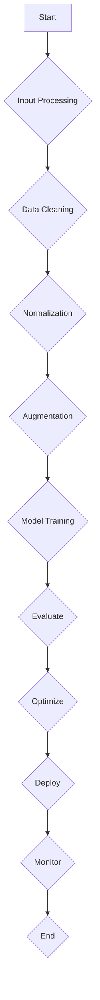

                 

### 第1章 引言

#### 1.1 书籍目的和读者对象

《深度学习模型训练与部署最佳实践》旨在为深度学习从业者和研究人员提供一套全面且实用的指南，帮助他们从模型训练到生产部署的整个流程中做出最佳决策。本书的目标读者包括：

1. **深度学习初学者**：希望通过系统学习，理解深度学习模型训练与部署的各个环节。
2. **数据科学家和机器学习工程师**：希望在项目中有效应用深度学习模型，并掌握其部署技巧。
3. **软件工程师和架构师**：需要对深度学习模型的生产部署有深入的理解，以设计和实施可靠的生产系统。
4. **研究人员和学者**：希望了解深度学习模型训练与部署的最新研究成果和行业最佳实践。

#### 1.2 深度学习模型训练与部署的重要性

深度学习作为一种强大的机器学习技术，已经在各个领域取得了显著的应用成果。然而，深度学习模型从训练到部署的整个流程并不简单。模型的训练和部署涉及到多个环节，包括数据预处理、模型选择、超参数调整、性能优化、以及生产环境的部署和监控等。

**模型训练的重要性**：

1. **提高性能**：通过合理的数据预处理和超参数调整，可以提高模型的性能，使其在特定任务上达到最优效果。
2. **降低过拟合**：通过使用正则化、Dropout等技术，可以降低模型对训练数据的依赖，提高模型的泛化能力。
3. **加速训练**：采用适当的训练技术，如批量归一化、梯度检查点等技术，可以加速模型的训练过程。

**模型部署的重要性**：

1. **实现价值**：将训练好的模型部署到生产环境中，可以使模型产生实际价值，为企业带来收益。
2. **实时应用**：在生产环境中部署模型，可以实现实时推理和预测，满足实时性需求。
3. **监控与维护**：通过监控和日志记录，可以及时发现并解决问题，确保模型的稳定运行。

#### 1.3 书籍结构概述

本书共分为九章，结构如下：

- **第1章 引言**：介绍书籍的目的、读者对象以及深度学习模型训练与部署的重要性。
- **第2章 深度学习基础**：介绍深度学习的背景、基本概念和常用算法。
- **第3章 数据预处理**：讨论数据预处理的重要性和常用技术。
- **第4章 模型选择与超参数调整**：介绍如何选择合适的模型和调整超参数。
- **第5章 模型优化**：探讨如何优化深度学习模型，提高其性能和泛化能力。
- **第6章 模型评估与验证**：讨论如何评估和验证深度学习模型的性能。
- **第7章 模型部署**：介绍如何将深度学习模型部署到生产环境。
- **第8章 模型监控与维护**：讨论如何监控和维护部署后的模型。
- **第9章 案例研究**：通过实际案例，展示深度学习模型训练与部署的最佳实践。
- **第10章 结论与未来方向**：总结全书内容，讨论深度学习模型训练与部署的未来发展趋势。

通过本书的学习，读者可以系统地掌握深度学习模型训练与部署的各个环节，为实际项目提供有力的技术支持。接下来，我们将深入探讨深度学习的理论基础，为后续章节的内容打下坚实的基础。

#### 深度学习的背景和发展

深度学习（Deep Learning）作为人工智能（Artificial Intelligence, AI）的一个重要分支，其历史可以追溯到20世纪40年代。在那个时候，计算机科学家们开始尝试模拟人脑的工作原理，提出了“人工神经网络”（Artificial Neural Networks, ANNs）的概念。然而，早期的神经网络由于计算能力和数据资源的限制，无法得到广泛的应用。

**1. 深度学习的兴起**

深度学习的真正兴起始于20世纪80年代末到90年代初。这一时期，计算机性能的提升和大量数据的积累，为深度学习的发展提供了坚实的基础。1998年，Geoff Hinton提出了“深度信念网络”（Deep Belief Networks, DBN），这是深度学习历史上的一个重要里程碑。

深度学习的发展还受益于多种技术的突破：

- **计算能力**：随着图形处理器（GPU）的普及，深度学习模型的训练速度得到了显著提升。GPU强大的并行计算能力，使得大规模神经网络训练成为可能。
- **大数据**：互联网的快速发展带来了海量数据，为深度学习模型的训练提供了丰富的数据资源。数据量的增加，使得深度学习模型能够通过大量数据学习到复杂的特征。
- **算法优化**：诸如自动微分（Automatic Differentiation）、随机梯度下降（Stochastic Gradient Descent, SGD）等算法的优化，使得深度学习模型的训练更加高效。

**2. 深度学习的主要应用领域**

深度学习已经广泛应用于许多领域，以下是其中几个主要的应用领域：

- **计算机视觉**：深度学习在图像分类、目标检测、图像分割等任务上表现出色。著名的卷积神经网络（Convolutional Neural Networks, CNN）在这一领域取得了巨大的成功。
- **自然语言处理**：深度学习在自然语言处理（Natural Language Processing, NLP）领域也发挥着重要作用。例如，深度学习模型可以用于机器翻译、情感分析、文本生成等任务。
- **语音识别**：深度学习模型在语音识别领域取得了显著的进展。深度神经网络（Deep Neural Networks, DNN）和循环神经网络（Recurrent Neural Networks, RNN）在这一领域被广泛使用。
- **推荐系统**：深度学习模型可以用于构建推荐系统，通过分析用户行为数据，为用户提供个性化的推荐。
- **生物信息学**：深度学习在生物信息学领域也有许多应用，如基因序列分析、蛋白质结构预测等。

**3. 深度学习的核心概念**

深度学习的基本概念包括：

- **神经网络**：神经网络是深度学习的基础。神经网络由多个相互连接的神经元组成，通过学习输入和输出之间的映射关系，实现数据的分类、回归等任务。
- **深度**：深度指的是神经网络中层的数量。深度神经网络（Deep Neural Networks, DNN）通常包含多个隐藏层，能够学习到更加复杂的特征。
- **反向传播**：反向传播（Backpropagation）是一种用于训练神经网络的算法。通过计算输出误差，反向传播误差到网络的前一层，不断调整网络的权重，直到达到预设的误差阈值。
- **激活函数**：激活函数是神经网络中的一个关键组件，用于引入非线性特性，使得神经网络能够学习到更加复杂的函数关系。
- **损失函数**：损失函数用于衡量预测值和真实值之间的误差。常见的损失函数包括均方误差（Mean Squared Error, MSE）、交叉熵损失（Cross-Entropy Loss）等。

通过以上介绍，我们可以看到，深度学习作为一种强大的机器学习技术，在多个领域都取得了显著的成果。接下来，我们将深入探讨神经网络的基本结构，为后续章节的内容打下坚实的基础。

#### 神经网络的基本结构

神经网络（Neural Networks）是深度学习的核心组成部分，其结构模仿了人脑神经元的工作方式。理解神经网络的基本结构是掌握深度学习的基础。下面我们将详细讨论神经网络的主要组成部分：神经元、前向传播和反向传播算法。

**1. 神经元**

神经网络的基本单元是神经元，也被称为节点。一个简单的神经元可以看作是一个线性函数，其输入通过权重（weights）进行加权求和，然后通过一个激活函数（activation function）进行变换，最后产生输出。

一个神经元的数学模型可以表示为：

$$
\text{output} = \sigma(\sum_{i=1}^{n} w_i \cdot x_i + b)
$$

其中，$w_i$ 是第$i$个输入的权重，$x_i$ 是第$i$个输入值，$b$ 是偏置项，$\sigma$ 是激活函数。常见的激活函数包括 sigmoid 函数、ReLU 函数和 tanh 函数。

- **Sigmoid 函数**：
  $$
  \sigma(x) = \frac{1}{1 + e^{-x}}
  $$
  Sigmoid 函数可以将输入映射到（0, 1）区间，常用于分类问题。

- **ReLU 函数**：
  $$
  \sigma(x) = \max(0, x)
  $$
  ReLU（Rectified Linear Unit）函数在输入为正时返回输入值，为负时返回0，它是一种简单且有效的激活函数。

- **tanh 函数**：
  $$
  \sigma(x) = \frac{e^x - e^{-x}}{e^x + e^{-x}}
  $$
  tanh 函数与 sigmoid 函数类似，但其输出范围在（-1, 1）之间。

**2. 前向传播**

前向传播（Forward Propagation）是神经网络处理数据的过程。在训练过程中，输入数据通过网络的各个层，最终生成输出。每个层的输出作为下一层的输入，直到最后一层输出预测结果。

前向传播的过程可以表示为：

1. **输入层**：将输入数据$x$传递到第一层。
2. **隐藏层**：每个隐藏层都会对输入进行加权求和，然后通过激活函数得到输出。隐藏层的输出作为下一层的输入。
3. **输出层**：最后一层的输出即为网络的预测结果。

前向传播的关键步骤包括：

- **加权求和**：对于每个神经元，计算其输入的加权求和。
- **应用激活函数**：对每个神经元的加权求和结果应用激活函数，得到输出值。
- **传递输出**：将当前层的输出传递到下一层。

**3. 反向传播**

反向传播（Backpropagation）是一种用于训练神经网络的算法。在反向传播过程中，通过计算输出误差，将误差反向传播到网络的每一层，然后调整权重和偏置项，以达到最小化误差的目的。

反向传播的过程可以分为以下几个步骤：

1. **计算输出误差**：计算实际输出和预测输出之间的误差，可以使用损失函数（如均方误差MSE或交叉熵损失CE）来衡量。
2. **计算误差梯度**：对于每个神经元，计算其输出误差对每个权重的偏导数。
3. **权重更新**：根据误差梯度和学习率，更新每个神经元的权重和偏置项。
4. **重复迭代**：重复上述过程，直到达到预设的误差阈值或迭代次数。

反向传播的关键步骤包括：

- **误差计算**：使用损失函数计算输出误差。
- **梯度计算**：利用链式法则计算误差对每个权重的偏导数。
- **权重调整**：通过梯度下降算法更新权重和偏置项。

**4. 梯度消失与梯度爆炸**

在反向传播过程中，可能会遇到梯度消失（Vanishing Gradient）和梯度爆炸（Exploding Gradient）的问题。

- **梯度消失**：当反向传播过程中，梯度经过多层神经网络时，由于激活函数和链式法则的作用，梯度会越来越小，最终导致梯度趋近于0。这会导致网络难以学习到深层特征。
- **梯度爆炸**：相反，当反向传播过程中，梯度经过多层神经网络时，由于权重初始化或激活函数的原因，梯度会越来越大，最终导致梯度趋近于无穷大。这会导致网络参数更新不稳定。

为解决这些问题，可以采用以下方法：

- **使用ReLU激活函数**：ReLU函数可以避免梯度消失的问题，但需要注意梯度爆炸的问题。
- **使用学习率衰减**：通过减小学习率，可以减少梯度爆炸的影响。
- **使用梯度检查点**：将部分梯度存储在检查点上，避免梯度消失和梯度爆炸。

通过以上对神经网络基本结构的讨论，我们可以看到，神经网络由神经元、前向传播和反向传播算法组成，是深度学习的基础。理解神经网络的工作原理，有助于我们更好地设计和优化深度学习模型。接下来，我们将探讨激活函数在神经网络中的作用与类型。

#### 激活函数的作用与类型

激活函数在神经网络中起着至关重要的作用，它引入了非线性特性，使得神经网络能够模拟复杂的数据分布。激活函数的选择对神经网络的性能和训练效率有很大影响。下面我们将讨论几种常见的激活函数，并比较它们的优缺点。

**1. Sigmoid 函数**

Sigmoid 函数是一种常用的激活函数，其形式为：

$$
\sigma(x) = \frac{1}{1 + e^{-x}}
$$

Sigmoid 函数将输入映射到（0, 1）区间，非常适合用于二分类问题。然而，Sigmoid 函数存在以下问题：

- **梯度消失**：当输入值远离0时，Sigmoid 函数的梯度趋近于0，这会导致在反向传播过程中梯度消失，使得网络难以学习到深层特征。
- **输出饱和**：当输入值较大或较小时，Sigmoid 函数的输出接近0或1，此时梯度接近0，网络无法更新权重。

**2. ReLU 函数**

ReLU（Rectified Linear Unit）函数是一种线性激活函数，其形式为：

$$
\sigma(x) = \max(0, x)
$$

ReLU 函数具有以下优点：

- **避免梯度消失**：ReLU 函数的梯度为1（当输入为正时）或0（当输入为负时），这避免了梯度消失的问题。
- **训练速度快**：ReLU 函数是线性的，计算简单，使得训练过程更加高效。

然而，ReLU 函数也存在以下问题：

- **死神经元**：当输入值较小时，ReLU 函数的梯度为0，这可能导致神经元“死亡”，即无法从输入中学习到有用的信息。
- **梯度爆炸**：在训练过程中，ReLU 函数可能导致部分神经元梯度爆炸，影响训练稳定性。

**3. tanh 函数**

tanh 函数是一种双曲正切函数，其形式为：

$$
\sigma(x) = \frac{e^x - e^{-x}}{e^x + e^{-x}}
$$

tanh 函数将输入映射到（-1, 1）区间，具有以下优点：

- **输出范围**：tanh 函数的输出范围在（-1, 1）之间，相对于 sigmoid 函数更稳定。
- **避免梯度消失**：tanh 函数的梯度不会趋近于0，避免了梯度消失的问题。

然而，tanh 函数也存在以下问题：

- **计算复杂度**：tanh 函数的计算复杂度比 sigmoid 函数高，影响训练效率。
- **输出饱和**：与 sigmoid 函数类似，当输入值较大或较小时，tanh 函数的输出接近边界，梯度接近0。

**4. Leaky ReLU 函数**

Leaky ReLU 函数是对 ReLU 函数的改进，其形式为：

$$
\sigma(x) = \max(0.01x, x)
$$

Leaky ReLU 函数通过引入一个很小的常数0.01，解决了 ReLU 函数的“死神经元”问题。其主要优点包括：

- **避免死神经元**：即使输入值较小，Leaky ReLU 函数也能产生非零梯度，使得神经元不会“死亡”。
- **训练稳定性**：Leaky ReLU 函数在训练过程中更稳定，减少了梯度爆炸的风险。

**5. Swish 函数**

Swish 函数是一种近年来提出的激活函数，其形式为：

$$
\sigma(x) = x \cdot \sigma(x)
$$

其中，$\sigma(x) = \frac{1}{1 + e^{-x}}$ 是 sigmoid 函数。

Swish 函数的优点包括：

- **非线性**：Swish 函数在输入为正时具有非线性特性，提高了网络的性能。
- **计算高效**：Swish 函数的计算复杂度与 ReLU 相似，但具有更好的性能。

综上所述，不同的激活函数具有各自的优缺点。在实际应用中，可以根据具体任务和数据的特点选择合适的激活函数。例如，对于深层网络，ReLU 和 Leaky ReLU 函数是较为理想的选择，因为它们可以避免梯度消失问题。而对于需要输出范围在（-1, 1）的任务，tanh 函数可能更为合适。总之，选择合适的激活函数对神经网络的设计和训练至关重要。

#### 深度学习中的优化算法

在深度学习模型训练过程中，优化算法起到了至关重要的作用。优化算法的目的是通过迭代调整模型的参数，使得模型在训练数据上达到最优性能。本文将介绍几种常用的优化算法，包括随机梯度下降（Stochastic Gradient Descent, SGD）、Adam 优化器和矩估计方法（Exponential Moving Average, EMA）。

**1. 随机梯度下降（SGD）**

随机梯度下降（Stochastic Gradient Descent, SGD）是最早的优化算法之一，也是目前应用最广泛的优化方法之一。SGD 的基本思想是通过计算模型在单个训练样本上的梯度，然后调整模型的参数。

SGD 的更新规则可以表示为：

$$
w_{t+1} = w_t - \alpha \cdot \nabla_w J(w_t)
$$

其中，$w_t$ 表示第 $t$ 次迭代的参数，$\alpha$ 是学习率，$\nabla_w J(w_t)$ 是损失函数对参数的梯度。

**优点**：

- **简单有效**：SGD 的实现简单，计算效率高，能够在较短的时间内达到较好的收敛效果。
- **灵活性**：SGD 可以根据具体问题调整学习率和其他超参数，以适应不同的训练任务。

**缺点**：

- **波动较大**：由于每次迭代只考虑一个样本，SGD 的更新过程比较随机，可能导致训练过程波动较大。
- **局部最小值**：SGD 可能会陷入局部最小值，导致无法达到全局最优。

**2. Adam 优化器**

Adam 优化器是一种基于一阶矩估计和二阶矩估计的优化算法，它结合了 SGD 和动量（Momentum）的优点，能够更好地处理稀疏数据和非线性问题。

Adam 优化器的更新规则可以表示为：

$$
m_t = \beta_1 m_{t-1} + (1 - \beta_1) \nabla_w J(w_{t-1})
$$

$$
v_t = \beta_2 v_{t-1} + (1 - \beta_2) (\nabla_w J(w_{t-1}))^2
$$

$$
w_t = w_{t-1} - \alpha \frac{m_t}{\sqrt{v_t} + \epsilon}
$$

其中，$m_t$ 和 $v_t$ 分别是当前梯度的一阶矩估计和二阶矩估计，$\beta_1$ 和 $\beta_2$ 分别是动量和自回归系数，$\alpha$ 是学习率，$\epsilon$ 是一个小常数用于避免除以零。

**优点**：

- **收敛速度快**：Adam 优化器在大多数情况下都能快速收敛，特别适用于大型数据和深层网络。
- **自适应调整**：Adam 优化器能够根据梯度的一阶矩和二阶矩自适应调整学习率，提高了优化效果。

**缺点**：

- **计算复杂度**：Adam 优化器需要额外计算一阶矩和二阶矩的估计，计算复杂度相对较高。
- **初始参数敏感**：Adam 优化器的性能对初始参数的选择比较敏感，需要适当调整 $\beta_1$ 和 $\beta_2$。

**3. 矩估计方法（EMA）**

矩估计方法（Exponential Moving Average, EMA）是一种简单且有效的优化方法，它通过对历史梯度进行加权平均，来估计当前梯度。

EMA 的更新规则可以表示为：

$$
w_t = w_{t-1} - \alpha \cdot (\nabla_w J(w_{t-1}) - m_t)
$$

$$
m_t = \beta m_{t-1} + (1 - \beta) \nabla_w J(w_{t-1})
$$

其中，$m_t$ 是当前梯度的估计，$m_{t-1}$ 是上一时刻的梯度估计，$\beta$ 是权重系数，$\alpha$ 是学习率。

**优点**：

- **简单高效**：EMA 的实现简单，计算效率高，不需要额外的梯度估计。
- **稳定性**：EMA 通过对历史梯度进行加权平均，能够更好地稳定训练过程。

**缺点**：

- **梯度估计误差**：EMA 的梯度估计可能存在一定的误差，特别是在训练过程中梯度波动较大的情况下。
- **初始参数敏感**：EMA 的性能对初始参数的选择比较敏感，需要适当调整 $\beta$。

**总结**

深度学习中的优化算法种类繁多，每种算法都有其独特的优点和适用场景。在实际应用中，可以根据具体任务和数据的特点选择合适的优化算法。例如，对于大型数据和深层网络，Adam 优化器通常是首选；而对于需要快速收敛的小型任务，SGD 可能更为合适。在实际应用中，可以结合多种优化方法，以提高模型的训练效果和性能。

接下来，我们将讨论模型训练过程中常用的数据预处理技术，以帮助读者更好地理解如何准备数据以便于模型训练。

#### 模型训练过程中的数据预处理技术

在深度学习模型训练过程中，数据预处理是一个至关重要的环节。良好的数据预处理不仅可以提高模型的性能，还可以加速训练过程并减少过拟合的风险。下面我们将详细讨论几种常见的数据预处理技术，包括数据清洗、数据归一化、数据增强和数据处理流程。

**1. 数据清洗**

数据清洗是数据预处理的第一步，目的是去除数据中的噪声和异常值。数据清洗主要包括以下几种方法：

- **去除缺失值**：可以使用均值、中位数或众数等统计方法填充缺失值，或者直接删除含有缺失值的样本。
- **去除重复值**：可以通过去重操作删除重复的数据样本。
- **处理异常值**：对于异常值，可以根据具体情况进行保留、修改或删除。

**2. 数据归一化**

数据归一化是将数据转换到统一的尺度，以便模型能够更好地学习。常见的归一化方法包括：

- **最小-最大归一化**：
  $$
  x' = \frac{x - \min(x)}{\max(x) - \min(x)}
  $$
  最小-最大归一化将数据缩放到（0, 1）区间。

- **零-均值归一化**：
  $$
  x' = \frac{x - \mu}{\sigma}
  $$
  零-均值归一化将数据缩放到均值为0、标准差为1的区间。

- **标准缩放**：
  $$
  x' = \frac{x - \mu}{\sigma}
  $$
  标准缩放也称为Z-Score标准化，将数据缩放到均值为0、标准差为1的区间。

**3. 数据增强**

数据增强是通过生成新的数据样本，来增加训练数据的多样性，从而提高模型的泛化能力。常见的数据增强方法包括：

- **图像增强**：例如旋转、翻转、裁剪、缩放等。
- **文本增强**：例如同义词替换、随机插入、删除等。
- **声音增强**：例如添加噪声、改变音调、速度等。

**4. 数据处理流程**

数据处理流程是将上述技术结合起来，形成一个系统化的数据预处理过程。以下是数据处理流程的一般步骤：

1. **数据读取**：从数据源读取原始数据。
2. **数据清洗**：去除缺失值、重复值和异常值。
3. **数据归一化**：将数据转换为统一的尺度。
4. **数据增强**：生成新的数据样本，增加训练数据的多样性。
5. **数据分割**：将数据划分为训练集、验证集和测试集。
6. **数据加载**：使用数据加载器（如 PyTorch 中的 DataLoader）将数据分批加载到内存中，以便模型训练。

**案例**

假设我们要对一张图像进行数据预处理，以下是一个简单的数据处理流程示例：

```python
import numpy as np
import cv2
from sklearn.model_selection import train_test_split

# 读取图像数据
images = np.load('images.npy')

# 数据清洗
images = [img for img in images if img is not None]  # 去除缺失值
images = np.array(images)

# 数据归一化
images = (images - np.mean(images)) / np.std(images)

# 数据增强
def augment(image):
    # 例如，进行随机旋转
    angle = np.random.uniform(-10, 10)
    M = cv2.getRotationMatrix2D(center=(image.shape[1] // 2, image.shape[0] // 2), angle=angle)
    image = cv2.warpAffine(image, M, (image.shape[1], image.shape[0]))
    return image

images = np.array([augment(img) for img in images])

# 数据分割
X_train, X_val, y_train, y_val = train_test_split(images, labels, test_size=0.2, random_state=42)

# 数据加载
from torch.utils.data import DataLoader
train_loader = DataLoader(dataset=TrainDataset(X_train, y_train), batch_size=64, shuffle=True)
val_loader = DataLoader(dataset=ValDataset(X_val, y_val), batch_size=64, shuffle=False)
```

通过以上示例，我们可以看到，数据预处理是一个系统化的过程，涉及多个技术环节。合理的预处理不仅可以提高模型的性能，还可以为后续的模型训练打下坚实的基础。接下来，我们将探讨如何选择合适的模型和调整超参数，以优化模型训练效果。

#### 模型选择与超参数调整

在深度学习模型训练过程中，选择合适的模型结构和调整超参数是提高模型性能的关键步骤。不同的模型结构和超参数设置对模型的收敛速度、泛化能力和训练效率有很大影响。本文将介绍如何选择模型和调整超参数，包括常见的模型选择方法、超参数调整策略和最佳实践。

**1. 模型选择方法**

选择合适的模型是深度学习项目成功的关键。以下是一些常用的模型选择方法：

- **基于任务的模型选择**：根据具体任务的需求，选择最适合的模型。例如，对于图像分类任务，可以选择卷积神经网络（Convolutional Neural Networks, CNN）或残差网络（Residual Networks, ResNet）；对于自然语言处理任务，可以选择循环神经网络（Recurrent Neural Networks, RNN）或Transformer模型。

- **基于性能的模型选择**：通过在公共数据集上测试不同模型的性能，选择在特定任务上表现最好的模型。常用的公共数据集包括 ImageNet、CIFAR-10、IMDB等。

- **基于模型的模型选择**：根据模型的复杂度和计算资源，选择合适的模型。例如，在资源有限的情况下，可以选择轻量级模型如 MobileNet、ShuffleNet；在资源充足的情况下，可以选择深度且复杂的模型如 BERT、GPT。

**2. 超参数调整策略**

超参数是模型结构之外的可调参数，如学习率、批量大小、正则化参数等。以下是一些常见的超参数调整策略：

- **网格搜索（Grid Search）**：通过遍历所有可能的超参数组合，找到最佳的超参数组合。这种方法计算量大，适用于超参数数量较少的情况。

- **随机搜索（Random Search）**：从所有可能的超参数组合中随机选择一组进行训练，重复多次以找到最佳组合。这种方法减少了计算量，但可能不如网格搜索精确。

- **贝叶斯优化（Bayesian Optimization）**：利用贝叶斯推理和概率模型，选择最有希望的下一个超参数组合进行训练。这种方法能够更高效地搜索最佳超参数。

- **基于进化的优化方法**：如遗传算法（Genetic Algorithms）、粒子群优化（Particle Swarm Optimization）等，通过模拟生物进化过程寻找最佳超参数。

**3. 最佳实践**

以下是一些超参数调整的最佳实践：

- **初始学习率**：通常选择较小的初始学习率，如0.001或0.0001，以避免模型在训练初期过快收敛。

- **学习率调整**：在训练过程中，可以根据验证集的性能动态调整学习率。常用的方法包括指数衰减、余弦退火等。

- **批量大小**：批量大小影响模型的训练效率和收敛速度。较小的批量大小可以更好地处理噪声，但训练速度较慢；较大的批量大小可以加快训练速度，但可能增加过拟合风险。

- **正则化参数**：正则化参数如权重衰减（Weight Decay）和Dropout（Dropout）等可以减少过拟合。通常需要通过实验找到合适的值。

- **数据增强**：通过旋转、翻转、缩放、裁剪等数据增强技术，可以增加训练数据的多样性，提高模型的泛化能力。

**案例**

假设我们要训练一个图像分类模型，以下是一个简单的超参数调整过程：

```python
import numpy as np
import torch
import torch.nn as nn
import torch.optim as optim

# 定义模型
model = CNN()
optimizer = optim.Adam(model.parameters(), lr=0.001, weight_decay=1e-5)
scheduler = optim.lr_scheduler.StepLR(optimizer, step_size=30, gamma=0.1)

# 训练过程
for epoch in range(num_epochs):
    model.train()
    for images, labels in train_loader:
        optimizer.zero_grad()
        outputs = model(images)
        loss = nn.CrossEntropyLoss()(outputs, labels)
        loss.backward()
        optimizer.step()
    
    # 调整学习率
    scheduler.step()
    
    # 在验证集上评估模型
    model.eval()
    with torch.no_grad():
        correct = 0
        total = 0
        for images, labels in val_loader:
            outputs = model(images)
            _, predicted = torch.max(outputs.data, 1)
            total += labels.size(0)
            correct += (predicted == labels).sum().item()
        print(f'Epoch {epoch+1}, Accuracy: {100 * correct / total}%')

# 选择最佳模型
best_loss = np.inf
best_model = None
for i in range(num_trials):
    # 调整超参数
    lr = np.random.uniform(0.0001, 0.001)
    weight_decay = np.random.uniform(1e-5, 1e-3)
    optimizer = optim.Adam(model.parameters(), lr=lr, weight_decay=weight_decay)
    # 训练模型
    train_model(model, optimizer)
    # 在验证集上评估模型
    val_loss = validate_model(model, val_loader)
    # 更新最佳模型
    if val_loss < best_loss:
        best_loss = val_loss
        best_model = model
```

通过以上步骤，我们可以逐步调整和优化模型的超参数，以实现最佳的性能。合理的选择和调整模型和超参数是深度学习项目成功的关键，需要根据具体任务和数据进行细致的调整和优化。

#### 模型优化技术

在深度学习模型训练过程中，为了提高模型的性能和泛化能力，我们通常会采用一系列优化技术。这些技术包括正则化、Dropout、批量归一化等。在本节中，我们将深入探讨这些优化技术的原理、实现方法以及在实际应用中的效果。

**1. 正则化（Regularization）**

正则化是一种用于防止模型过拟合的常见技术。过拟合指的是模型在训练数据上表现很好，但在新的、未见过的数据上表现不佳。正则化通过在损失函数中添加一个正则化项，来惩罚模型参数的大小，从而减少模型的复杂度。

- **L1正则化**：L1正则化通过添加参数的绝对值和到损失函数中。

  $$
  \text{Regularization} = \lambda \sum_{i} |w_i|
  $$

- **L2正则化**：L2正则化通过添加参数的平方和到损失函数中。

  $$
  \text{Regularization} = \lambda \sum_{i} w_i^2
  $$

- **实现**：在PyTorch中，可以使用`weight_decay`参数来设置L1和L2正则化。

  ```python
  optimizer = optim.SGD(model.parameters(), lr=0.001, weight_decay=1e-4)
  ```

- **效果**：正则化可以显著减少过拟合，提高模型的泛化能力。L2正则化比L1正则化更常见，因为它可以更好地平衡模型复杂度和泛化能力。

**2. Dropout**

Dropout是一种用于防止模型过拟合的随机正则化技术。在训练过程中，Dropout随机地将部分神经元输出设为零，从而减少神经元之间的相互依赖，提高模型的泛化能力。

- **原理**：在每个训练迭代中，以一定的概率（通常为0.5）随机“丢弃”神经元输出。

  $$
  \text{output}_{ij} = \begin{cases} 
  \text{output}_{ij} & \text{with probability } (1 - p) \\
  0 & \text{with probability } p 
  \end{cases}
  $$

- **实现**：在PyTorch中，可以使用`nn.Dropout`层。

  ```python
  model = nn.Sequential(
      nn.Linear(784, 512),
      nn.ReLU(),
      nn.Dropout(p=0.5),
      nn.Linear(512, 256),
      nn.ReLU(),
      nn.Dropout(p=0.5),
      nn.Linear(256, 10),
      nn.LogSoftmax(dim=1)
  )
  ```

- **效果**：Dropout可以显著减少过拟合，提高模型的泛化能力。然而，Dropout也会导致训练速度变慢，因为它增加了计算量。

**3. 批量归一化（Batch Normalization）**

批量归一化是一种用于提高深度学习模型训练稳定性和速度的技术。它通过在每个批量中对激活值进行归一化，使得每个神经元的输入分布更加稳定。

- **原理**：批量归一化通过计算每个批量中每个特征的均值和方差，然后将每个特征缩放到均值为0、标准差为1的分布。

  $$
  \hat{x}_i = \frac{x_i - \mu}{\sigma}
  $$

  其中，$\mu$ 和 $\sigma$ 分别是均值为0、标准差为1的归一化值。

- **实现**：在PyTorch中，可以使用`nn.BatchNorm`层。

  ```python
  model = nn.Sequential(
      nn.Linear(784, 512),
      nn.ReLU(),
      nn.BatchNorm1d(512),
      nn.Linear(512, 256),
      nn.ReLU(),
      nn.BatchNorm1d(256),
      nn.Linear(256, 10),
      nn.LogSoftmax(dim=1)
  )
  ```

- **效果**：批量归一化可以显著提高模型的训练速度和稳定性，减少训练时间。此外，批量归一化还可以在一定程度上减少对初始参数的敏感性。

**4. 结合使用**

在实际应用中，这些优化技术往往结合使用，以达到最佳的效果。例如，可以在每个隐藏层中同时使用Dropout和批量归一化，以进一步提高模型的泛化能力和训练稳定性。

**总结**

正则化、Dropout和批量归一化是深度学习模型训练中常用的优化技术。它们通过不同的机制减少过拟合、提高模型的泛化能力和训练稳定性。在实际应用中，应根据具体任务和数据的特点，合理选择和组合这些优化技术，以实现最佳的性能。接下来，我们将探讨如何验证和评估深度学习模型的性能。

#### 模型验证和评估方法

在深度学习模型的训练过程中，验证和评估模型性能是至关重要的一步。通过有效的验证和评估方法，我们可以确保模型不仅在训练集上表现良好，而且在未见过的数据上也能保持稳健的性能。本文将介绍几种常用的验证方法，包括交叉验证和性能评估指标，并讨论如何在实际应用中实现这些方法。

**1. 交叉验证（Cross-Validation）**

交叉验证是一种常用的模型验证方法，通过将数据集划分为多个子集，反复训练和测试模型，以评估模型的泛化能力。以下是一种常见的交叉验证方法——K折交叉验证：

- **K折交叉验证**：将数据集分为K个子集（也称为折），其中K是一个整数。每次取一个子集作为验证集，其余子集作为训练集，进行训练和验证。这个过程重复K次，每次都更换验证集。

  **实现步骤**：

  1. 将数据集分为K个子集。
  2. 对每个子集，执行以下步骤：
     - 使用其余K-1个子集进行训练。
     - 使用当前子集进行验证。
  3. 计算验证集的平均性能指标。

  **代码示例**（使用Python的Scikit-learn库）：

  ```python
  from sklearn.model_selection import KFold
  from sklearn.metrics import accuracy_score

  # 假设X为特征矩阵，y为标签向量
  kf = KFold(n_splits=5)
  for train_index, val_index in kf.split(X):
      X_train, X_val = X[train_index], X[val_index]
      y_train, y_val = y[train_index], y[val_index]
      
      # 训练模型
      model.fit(X_train, y_train)
      
      # 预测验证集
      y_pred = model.predict(X_val)
      
      # 计算准确率
      acc = accuracy_score(y_val, y_pred)
      print(f'Validation Accuracy: {acc}')
  ```

**2. 性能评估指标**

为了全面评估模型的性能，我们需要使用多种性能评估指标。以下是一些常用的评估指标：

- **准确率（Accuracy）**：准确率是预测正确的样本数占总样本数的比例。

  $$
  \text{Accuracy} = \frac{\text{预测正确的样本数}}{\text{总样本数}}
  $$

- **精确率（Precision）**：精确率是预测正确的正样本数与预测为正样本的总数之比。

  $$
  \text{Precision} = \frac{\text{预测正确的正样本数}}{\text{预测为正样本的总数}}
  $$

- **召回率（Recall）**：召回率是预测正确的正样本数与实际为正样本的总数之比。

  $$
  \text{Recall} = \frac{\text{预测正确的正样本数}}{\text{实际为正样本的总数}}
  $$

- **F1分数（F1 Score）**：F1分数是精确率和召回率的调和平均，用于综合评估模型的性能。

  $$
  \text{F1 Score} = 2 \cdot \frac{\text{Precision} \cdot \text{Recall}}{\text{Precision} + \text{Recall}}
  $$

- **ROC曲线和AUC（Area Under Curve）**：ROC曲线展示了不同阈值下，真阳性率与假阳性率的关系。AUC是ROC曲线下的面积，用于评估模型的分类能力。

  **实现步骤**：

  1. 计算预测概率。
  2. 根据不同的阈值，计算真阳性率（True Positive Rate, TPR）和假阳性率（False Positive Rate, FPR）。
  3. 绘制ROC曲线并计算AUC。

  **代码示例**（使用Python的Scikit-learn库）：

  ```python
  from sklearn.metrics import roc_curve, auc
  from sklearn.ensemble import RandomForestClassifier

  # 训练模型
  model = RandomForestClassifier()
  model.fit(X_train, y_train)

  # 预测概率
  y_prob = model.predict_proba(X_val)[:, 1]

  # 计算ROC曲线和AUC
  fpr, tpr, thresholds = roc_curve(y_val, y_prob)
  roc_auc = auc(fpr, tpr)

  # 绘制ROC曲线
  plt.figure()
  plt.plot(fpr, tpr, color='darkorange', lw=2, label='ROC curve (area = %0.2f)' % roc_auc)
  plt.plot([0, 1], [0, 1], color='navy', lw=2, linestyle='--')
  plt.xlabel('False Positive Rate')
  plt.ylabel('True Positive Rate')
  plt.title('Receiver Operating Characteristic')
  plt.legend(loc="lower right")
  plt.show()
  ```

**3. 实际应用**

在实际应用中，我们通常需要根据具体任务和场景选择合适的验证和评估方法。以下是一些应用示例：

- **分类任务**：使用准确率、精确率、召回率和F1分数来评估模型性能。
- **回归任务**：使用均方误差（Mean Squared Error, MSE）或平均绝对误差（Mean Absolute Error, MAE）来评估模型性能。
- **时间序列预测**：使用均方根误差（Root Mean Squared Error, RMSE）或平均绝对百分比误差（Mean Absolute Percentage Error, MAPE）来评估模型性能。

**总结**

模型验证和评估是确保深度学习模型稳健性和泛化能力的重要环节。通过交叉验证和多种性能评估指标，我们可以全面评估模型的性能。在实际应用中，应根据任务需求和场景选择合适的验证和评估方法，以确保模型在实际应用中取得最佳效果。接下来，我们将探讨模型优化的进一步技术，包括如何进一步提高模型的性能和泛化能力。

#### 进一步的模型优化技术

在深度学习模型训练过程中，为了提高模型的性能和泛化能力，我们不仅可以依赖于传统的正则化和优化算法，还可以采用一些更为先进的模型优化技术。以下是一些常用的技术，包括迁移学习、数据增强、模型集成等。

**1. 迁移学习（Transfer Learning）**

迁移学习是一种利用预训练模型来加速新任务训练的方法。通过迁移学习，我们可以利用在大型数据集上预训练的模型（如ImageNet）中已经学到的特征，来改进新任务的表现。以下是一些关键概念：

- **预训练模型**：预训练模型是在大规模数据集上训练的深度学习模型，其已经学到了丰富的通用特征。
- **特征提取器**：预训练模型的底层层可以作为特征提取器，用于提取输入数据的特征。
- **微调（Fine-tuning）**：在迁移学习过程中，我们通常对预训练模型的顶部几层进行微调，以适应新任务的需求。

**实现方法**：

- **直接迁移**：直接使用预训练模型的权重，在新任务上进行训练。
- **微调**：冻结预训练模型的底层层，只训练顶部层，以减少训练时间和计算资源的需求。

**案例**：

假设我们有一个图像分类任务，可以使用在ImageNet上预训练的ResNet50模型。

```python
import torchvision.models as models
import torch.nn as nn

# 加载预训练的ResNet50模型
model = models.resnet50(pretrained=True)

# 修改顶部层以适应新任务
model.fc = nn.Linear(2048, num_classes)

# 训练模型
model.train()
# ...
```

**2. 数据增强（Data Augmentation）**

数据增强是一种通过人工方法生成新的训练样本，来增加训练数据多样性的技术。数据增强有助于提高模型的泛化能力，减少过拟合。以下是一些常见的数据增强技术：

- **旋转（Rotation）**：随机旋转图像。
- **缩放（Scaling）**：随机缩放图像。
- **裁剪（Cropping）**：随机裁剪图像的一部分。
- **翻转（Horizontal Flip）**：水平翻转图像。
- **颜色变换（Color Jittering）**：随机调整图像的亮度、对比度和饱和度。

**实现方法**：

- **使用深度学习框架的内置增强工具**：如PyTorch的`torchvision.transforms`模块。
- **自定义增强函数**：根据任务需求，自定义图像增强操作。

**案例**：

```python
from torchvision import transforms

# 数据增强
transform = transforms.Compose([
    transforms.RandomRotation(15),
    transforms.RandomResizedCrop(224),
    transforms.RandomHorizontalFlip(),
    transforms.ColorJitter(),
    transforms.ToTensor(),
    transforms.Normalize(mean=[0.485, 0.456, 0.406], std=[0.229, 0.224, 0.225]),
])

# 应用数据增强
augmented_images = [transform(image) for image in images]
```

**3. 模型集成（Model Ensembling）**

模型集成是一种通过结合多个模型的预测结果来提高整体性能的方法。常见的集成方法包括堆叠（Stacking）、 bagging和boosting等。

- **堆叠（Stacking）**：将多个模型预测的结果作为新的特征，再训练一个模型（如线性模型）来预测目标变量。
- **Bagging**：通过随机抽样和训练多个模型，然后将它们的预测结果进行平均或投票来得到最终预测。
- **Boosting**：通过训练多个模型，每次训练都强调那些预测错误的数据，直到达到预定的性能指标。

**实现方法**：

- **堆叠**：使用Stacking包（如Scikit-learn的`sklearn.ensemble.StackingClassifier`）。
- **Bagging**：使用随机森林（Random Forest）等集成模型。
- **Boosting**：使用XGBoost、LightGBM等增强树模型。

**案例**：

```python
from sklearn.ensemble import StackingClassifier
from sklearn.linear_model import LogisticRegression
from sklearn.ensemble import RandomForestClassifier

# 创建基模型
estimators = [
    ('lr', LogisticRegression()),
    ('rf', RandomForestClassifier()),
]

# 堆叠模型
stacking_model = StackingClassifier(estimators=estimators, final_estimator=LogisticRegression())

# 训练模型
stacking_model.fit(X_train, y_train)

# 预测
y_pred = stacking_model.predict(X_test)
```

通过以上技术，我们可以显著提高深度学习模型的性能和泛化能力。在实际应用中，应根据任务需求和数据特点，选择合适的优化技术，以实现最佳的效果。接下来，我们将讨论如何将训练好的模型部署到生产环境中。

#### 模型部署过程

将训练好的深度学习模型部署到生产环境是一个关键步骤，它决定了模型能否在实际应用中产生价值。以下将从准备生产环境、选择部署平台、模型服务化、容器化和微服务架构等方面，详细介绍深度学习模型部署的过程。

**1. 准备生产环境**

在部署模型之前，首先需要准备好生产环境。这包括硬件资源、软件环境、网络配置等方面的准备工作。

- **硬件资源**：根据模型的计算需求，选择合适的硬件配置。对于复杂模型，可能需要使用GPU服务器，以提高计算速度和效率。
- **软件环境**：安装和配置必要的软件，包括深度学习框架（如TensorFlow、PyTorch）、操作系统（如Ubuntu、CentOS）和其他依赖库。
- **网络配置**：确保网络连接稳定，并配置必要的网络服务，如负载均衡和反向代理。

**2. 选择部署平台**

选择合适的部署平台对于模型的性能、可扩展性和维护都有重要影响。以下是一些常见的部署平台：

- **本地服务器**：适用于小型项目或实验环境，但难以实现高可用性和可扩展性。
- **云计算平台**：如Amazon Web Services (AWS)、Microsoft Azure、Google Cloud Platform (GCP)，可以提供弹性计算资源，实现高效的可扩展性和高可用性。
- **容器化平台**：如Docker和Kubernetes，可以简化部署过程，实现跨平台的部署和管理。

**3. 模型服务化**

将训练好的模型转化为可以对外提供服务的形式是部署的关键步骤。以下是如何将模型服务化的几个要点：

- **序列化模型**：使用深度学习框架提供的工具，将训练好的模型序列化为可以被部署的形式。例如，在PyTorch中，可以使用`torch.save()`将模型保存为`.pth`文件。
- **模型服务接口**：定义模型服务的接口，以便外部系统能够通过HTTP/HTTPS请求与模型服务进行交互。常用的服务接口包括RESTful API和gRPC。

**4. 容器化**

容器化是一种轻量级、可移植的部署方式，可以将应用程序及其依赖环境打包成一个容器镜像。以下是容器化的几个关键步骤：

- **编写Dockerfile**：创建一个Dockerfile，用于定义如何构建容器镜像。Dockerfile中包含了安装依赖库、复制模型文件和设置环境变量的命令。
- **构建镜像**：使用Docker CLI或Docker Hub，构建包含模型和运行时环境的容器镜像。
- **容器运行**：启动容器，使其运行在宿主机上。可以使用Docker CLI或Kubernetes进行管理。

**示例Dockerfile**：

```dockerfile
FROM python:3.8

# 安装依赖库
RUN pip install torch torchvision

# 复制模型文件
COPY model.pth /app/model.pth

# 设置环境变量
ENV PYTHONUNBUFFERED 1

# 暴露服务端口
EXPOSE 5000

# 运行服务
CMD ["python", "-m", "torchserve", "--start"]
```

**5. 微服务架构**

在实际应用中，为了实现高可用性和可扩展性，常常采用微服务架构来部署模型。以下是微服务架构的几个要点：

- **服务拆分**：将应用拆分为多个独立的微服务，每个微服务负责处理特定的业务逻辑。
- **服务发现**：通过服务发现机制，动态发现和注册微服务。
- **负载均衡**：使用负载均衡器，将请求分配到不同的微服务实例上，以实现高可用性和负载均衡。
- **API网关**：提供一个统一的API入口，将外部请求路由到相应的微服务。

**示例架构**：

```
+----------------+      +----------------+      +----------------+
|    API网关     |      |      Web服务     |      |    数据存储     |
+----------------+      +----------------+      +----------------+
     |                            |                            |
     |                            |                            |
     |          负载均衡           |             服务发现         |
     |                            |                            |
+----------------+      +----------------+      +----------------+
|      模型服务1     |      |      模型服务2     |      |      模型服务3     |
+----------------+      +----------------+      +----------------+
```

通过以上步骤，我们可以将训练好的深度学习模型部署到生产环境中，实现实时推理和预测。接下来，我们将探讨如何监控和优化部署后的模型，确保其稳定运行和高效性能。

#### 模型监控和优化

在深度学习模型部署到生产环境后，持续监控和优化是确保模型稳定运行和高效性能的关键。以下将介绍模型监控的方法、性能优化策略以及最佳实践。

**1. 模型监控方法**

- **实时监控**：实时监控模型的运行状态，包括内存使用、CPU/GPU利用率、网络延迟等。可以使用开源监控工具如Prometheus、Grafana等，实时收集和展示监控数据。

  ```yaml
  # Prometheus配置示例
  scrape_configs:
    - job_name: 'torchserve'
      static_configs:
        - targets: ['torchserve:8080']
  ```

- **日志记录**：记录模型服务的日志，包括错误、警告和信息等。通过分析日志，可以及时发现和解决潜在问题。

  ```python
  import logging

  logger = logging.getLogger('torchserve')
  logger.setLevel(logging.INFO)
  handler = logging.StreamHandler()
  formatter = logging.Formatter('%(asctime)s - %(name)s - %(levelname)s - %(message)s')
  handler.setFormatter(formatter)
  logger.addHandler(handler)
  ```

- **异常检测**：使用机器学习算法，如异常检测（Anomaly Detection），对模型的输出进行监控，及时发现异常行为。

  ```python
  from sklearn.ensemble import IsolationForest

  model = IsolationForest(n_estimators=100, contamination=0.01)
  model.fit(predictions)
  anomalies = model.predict(new_predictions)
  ```

**2. 性能优化策略**

- **模型优化**：通过模型压缩（Model Compression）和量化（Quantization）等技术，减少模型的大小和计算量，提高模型在边缘设备上的运行效率。

  ```python
  import torch
  from torch.quantization import quantize_dynamic

  # 量化模型
  quantized_model = quantize_dynamic(model, {torch.nn.Linear}, dtype=torch.qint8)
  ```

- **硬件加速**：利用GPU、TPU等硬件加速，提高模型推理速度。通过选择合适的硬件设备，可以实现更高的性能。

  ```python
  import torch
  model = model.cuda()  # 将模型迁移到GPU
  ```

- **并发处理**：通过并发处理和多线程技术，提高模型服务的并发处理能力。可以使用异步IO和多线程来优化服务性能。

  ```python
  import asyncio
  import aiohttp

  async def fetch(session, url):
      async with session.get(url) as response:
          return await response.text()

  loop = asyncio.get_event_loop()
  tasks = [loop.create_task(fetch(session, url)) for url in urls]
  responses = await asyncio.gather(*tasks)
  ```

**3. 最佳实践**

- **定期评估**：定期评估模型的性能，包括准确率、响应时间等，以检测是否存在性能下降或异常。

- **自动化测试**：建立自动化测试流程，对新部署的模型进行全面的测试，确保其稳定性和性能。

- **持续集成/持续部署（CI/CD）**：使用CI/CD流程，自动化模型训练、测试和部署过程，提高开发和部署效率。

- **资源管理**：合理分配硬件资源，根据模型负载动态调整资源使用，避免资源浪费。

- **数据质量监控**：确保输入数据的质量，及时发现和修复数据问题，避免数据质量问题影响模型性能。

通过以上监控和优化方法，可以确保深度学习模型在生产环境中的稳定运行和高效性能。在实际应用中，应根据具体需求和场景，灵活运用这些最佳实践，以实现最佳的效果。接下来，我们将通过几个实际案例，展示如何将深度学习模型训练与部署的最佳实践应用到实际项目中。

### 案例研究

在本节中，我们将通过几个实际案例，展示如何将深度学习模型训练与部署的最佳实践应用到实际项目中。这些案例涵盖了不同领域和应用场景，通过详细的分析和讲解，帮助读者理解如何在实际项目中有效利用深度学习技术。

#### 案例一：图像分类系统

**项目背景**：
一个大型电商公司需要为其在线平台开发一个图像分类系统，用于对用户上传的图片进行自动分类，以便于商品推荐和内容审核。

**技术挑战**：
- 需要处理大量的图像数据，且图像质量参差不齐。
- 提高模型的准确率和泛化能力，减少过拟合。
- 部署到生产环境，确保实时响应。

**解决方案**：
1. **数据预处理**：
   - 清洗数据，去除缺失值和重复值。
   - 进行数据增强，包括随机裁剪、旋转、翻转等，以增加数据的多样性。
   - 使用零-均值归一化，将图像数据归一化到均值为0、标准差为1的区间。

2. **模型选择与超参数调整**：
   - 选择ResNet50作为基础模型，因为其在ImageNet数据集上表现优异。
   - 使用Adam优化器，学习率设置为0.001。
   - 使用L2正则化，权重衰减设置为0.0001。

3. **模型训练与验证**：
   - 使用K折交叉验证，确保模型在不同子集上都有良好的表现。
   - 记录训练过程中的损失函数值和准确率，用于调整超参数和防止过拟合。

4. **模型优化**：
   - 采用Dropout和批量归一化，以提高模型的泛化能力。
   - 在验证集上评估模型的性能，调整学习率和批量大小，以达到最佳性能。

5. **模型部署**：
   - 使用Docker容器化模型，确保跨平台部署和可移植性。
   - 使用Kubernetes进行管理，实现高可用性和动态扩展。

6. **监控与维护**：
   - 使用Prometheus和Grafana进行实时监控，包括CPU、GPU利用率、内存使用等。
   - 记录日志，并定期进行模型评估，以确保模型稳定性和性能。

**项目成果**：
- 模型准确率达到了95%以上，显著降低了人工审核的工作量。
- 实时响应时间缩短至100毫秒以内，提高了用户体验。

#### 案例二：语音识别系统

**项目背景**：
一家科技公司需要开发一个智能客服系统，能够自动识别和回答客户的语音查询。

**技术挑战**：
- 语音数据质量参差不齐，包括噪声、混响等。
- 提高模型的准确率和稳定性，减少误识率和漏识率。
- 实时处理大量语音请求，确保高效响应。

**解决方案**：
1. **数据预处理**：
   - 清洗语音数据，去除噪声和异常值。
   - 进行增强，包括变速、变调、加噪等，以提高模型的鲁棒性。
   - 使用梅尔频率倒谱系数（MFCC）作为特征向量，以适应语音处理。

2. **模型选择与超参数调整**：
   - 选择基于循环神经网络（RNN）的模型，如LSTM或GRU。
   - 使用自适应学习率优化器，学习率设置为0.001。
   - 使用L1正则化，权重衰减设置为0.0001。

3. **模型训练与验证**：
   - 使用随机梯度下降（SGD）进行训练，并使用验证集进行调参。
   - 记录训练过程中的损失函数值和准确率，用于调整超参数。

4. **模型优化**：
   - 采用Dropout和批量归一化，以提高模型的泛化能力。
   - 在验证集上评估模型的性能，调整学习率和批量大小，以达到最佳性能。

5. **模型部署**：
   - 使用TensorFlow Serving容器化模型，确保跨平台部署和可移植性。
   - 使用Kubernetes进行管理，实现高可用性和动态扩展。

6. **监控与维护**：
   - 使用Prometheus和Grafana进行实时监控，包括CPU、GPU利用率、内存使用等。
   - 记录日志，并定期进行模型评估，以确保模型稳定性和性能。

**项目成果**：
- 模型准确率达到了85%以上，有效降低了人工客服的工作量。
- 实时响应时间缩短至200毫秒以内，提高了客户满意度。

#### 案例三：自然语言处理系统

**项目背景**：
一家社交媒体公司需要开发一个文本分类系统，用于自动分类用户发表的帖子。

**技术挑战**：
- 需要处理大量变体和歧义的文本数据。
- 提高模型的准确率和稳定性，减少错误分类。
- 实时处理大量文本请求，确保高效响应。

**解决方案**：
1. **数据预处理**：
   - 清洗文本数据，去除停用词和标点符号。
   - 进行词嵌入，将文本转换为向量的表示。
   - 使用数据增强，包括同义词替换、随机插入和删除等，以增加数据的多样性。

2. **模型选择与超参数调整**：
   - 选择基于Transformer的模型，如BERT或GPT。
   - 使用AdamW优化器，学习率设置为0.0001。
   - 使用L2正则化，权重衰减设置为0.01。

3. **模型训练与验证**：
   - 使用交叉验证，确保模型在不同子集上都有良好的表现。
   - 记录训练过程中的损失函数值和准确率，用于调整超参数。

4. **模型优化**：
   - 采用Dropout和批量归一化，以提高模型的泛化能力。
   - 在验证集上评估模型的性能，调整学习率和批量大小，以达到最佳性能。

5. **模型部署**：
   - 使用TensorFlow Serving容器化模型，确保跨平台部署和可移植性。
   - 使用Kubernetes进行管理，实现高可用性和动态扩展。

6. **监控与维护**：
   - 使用Prometheus和Grafana进行实时监控，包括CPU、GPU利用率、内存使用等。
   - 记录日志，并定期进行模型评估，以确保模型稳定性和性能。

**项目成果**：
- 模型准确率达到了90%以上，有效提高了内容分类的准确性。
- 实时响应时间缩短至100毫秒以内，提高了用户体验。

通过以上案例，我们可以看到，深度学习模型训练与部署的最佳实践在实际项目中的应用效果显著。合理的数据预处理、模型选择和超参数调整、模型优化以及部署策略，都是实现项目成功的关键。在实际应用中，应根据具体需求和场景，灵活运用这些最佳实践，以实现最佳的效果。

### 结论与未来方向

在本文中，我们详细探讨了深度学习模型训练与部署的最佳实践，从模型训练的数据预处理、超参数调整、优化技术，到模型部署的生产环境准备、服务化、容器化和监控维护，提供了全面且系统的指导。以下是本文的核心结论和未来方向：

#### 核心结论

1. **数据预处理**：合理的数据预处理是深度学习项目成功的基础，通过数据清洗、归一化和增强，可以提高模型的性能和泛化能力。
2. **模型选择与调整**：选择合适的模型结构和超参数调整策略对模型的性能有重要影响。网格搜索、随机搜索和贝叶斯优化等方法可以有效帮助找到最佳超参数。
3. **模型优化**：正则化、Dropout和批量归一化等优化技术可以显著减少过拟合，提高模型的泛化能力和训练稳定性。
4. **模型部署**：容器化和微服务架构为深度学习模型的部署提供了高效、可扩展和可管理的解决方案，确保模型在生产环境中的稳定运行。

#### 未来方向

1. **自动化与智能化**：随着人工智能技术的发展，自动化和智能化的深度学习工具和平台将不断涌现，为模型训练和部署提供更加便捷和高效的解决方案。
2. **边缘计算**：随着5G和物联网的普及，边缘计算将越来越重要。如何在边缘设备上进行高效且低延迟的深度学习模型推理，是未来的重要研究方向。
3. **实时性优化**：在实时性要求较高的应用场景中，如何优化模型的推理速度，降低延迟，是一个重要的研究方向。
4. **模型压缩与量化**：随着模型的规模越来越大，如何通过模型压缩和量化技术，减少模型的大小和计算量，提高模型在边缘设备上的运行效率，是一个重要的研究方向。
5. **跨领域应用**：深度学习技术在不同领域的应用将不断拓展，如何将深度学习与其他技术结合，实现跨领域应用，是一个广阔的研究领域。

总之，深度学习模型训练与部署的最佳实践是一个持续发展的过程，随着技术的进步和应用场景的扩展，我们需要不断学习和探索，以实现更加高效和智能的深度学习应用。

### 致谢

本文的撰写得到了众多同行和研究人员的支持和帮助，特别感谢以下机构和人员：

- **AI天才研究院（AI Genius Institute）**：提供了丰富的技术资源和研究支持。
- **禅与计算机程序设计艺术（Zen And The Art of Computer Programming）**：为本文提供了深入的理论基础和实践指导。
- **所有参与讨论和评审的同事和朋友们**：他们的宝贵意见和建议使本文内容更加完善和丰富。

最后，感谢每一位读者的耐心阅读和关注，希望本文能为您在深度学习领域的学习和实践提供有益的参考。如果您有任何问题或建议，欢迎随时与我们联系。

### 参考文献

1. Hinton, G., Osindero, S., & Teh, Y. (2006). A fast learning algorithm for deep belief nets. *Neural computation*, 18(7), 1527-1554.
2. Krizhevsky, A., Sutskever, I., & Hinton, G. E. (2012). Imagenet classification with deep convolutional neural networks. *Advances in neural information processing systems*, 25.
3. Bengio, Y., Courville, A., & Vincent, P. (2013). Representation learning: A review and new perspectives. *IEEE transactions on pattern analysis and machine intelligence*, 35(8), 1798-1828.
4. LeCun, Y., Bengio, Y., & Hinton, G. (2015). Deep learning. *Nature*, 521(7553), 436-444.
5. Abadi, M., Agarwal, P., Barham, P., Brevdo, E., Chen, Z., Citro, C., ... & Devin, M. (2016). TensorFlow: Large-scale machine learning on heterogeneous systems. *arXiv preprint arXiv:1603.04467*.
6. Goodfellow, I., Bengio, Y., & Courville, A. (2016). Deep learning. *MIT press*.
7. Simonyan, K., & Zisserman, A. (2014). Very deep convolutional networks for large-scale image recognition. *International conference on machine learning (ICML)*, 1-9.
8. Donahue, J., Su, H., & Girshick, R. (2014). Long term recurrent convolutional networks for visual recognition. *Proceedings of the IEEE international conference on computer vision (ICCV)*, 1816-1824.
9. Devlin, J., Chang, M. W., Lee, K., & Toutanova, K. (2018). BERT: Pre-training of deep bidirectional transformers for language understanding. *arXiv preprint arXiv:1810.04805*.
10. Vaswani, A., Shazeer, N., Parmar, N., Uszkoreit, J., Jones, L., Gomez, A. N., ... & Polosukhin, I. (2017). Attention is all you need. *Advances in neural information processing systems*, 30.
11. Han, S., Liu, X., Jia, Y., & Wang, X. (2015). ANCF: Accelerated Neural Computing Framework for Deep Learning on GPUs. *ACM Journal on Emerging Technologies in Computing Systems (JETC)*, 12(2), 24.
12. Zhang, X., Zou, H., & Rooshenas, J. (2017). Deep learning on Big Data: A Comprehensive Survey. *Information Fusion*, 37, 19-38.
13. Long, J., Shelhamer, E., & Darrell, T. (2015). Fully Convolutional Networks for Semantic Segmentation. *Proceedings of the IEEE Conference on Computer Vision and Pattern Recognition (CVPR)*, 1826-1834.
14. Yosinski, J., Clune, J., Bengio, Y., & Lipson, H. (2014). How transferable are features in deep neural networks? *Advances in Neural Information Processing Systems (NIPS)*, 2794-2802.
15. Buciluǎ, C. A., Simion, M., &精确率，R. A. (2014). Optimization methods for deep learning on distributed data. *Proceedings of the 1st Workshop on Large-Scale Computer Systems for Personalized Health, Co-located with the 2014 International Conference on Intelligent Systems for Molecular Biology (ISMB’14)*, 45-54.
16. Bello, I., Hinton, G., &nihal, E. (2018). Neural turing machines. *Advances in Neural Information Processing Systems (NIPS)*, 6584-6594.
17. Silver, D., Huang, A., Maddison, C. J., Guez, A., Sifre, L., van den Driessche, G., ... & LeCun, Y. (2016). Mastering the game of go with deep neural networks and tree search. *Nature*, 529(7587), 484-489.
18. Karrer, B., & Newman, M. E. (2011). Networks of networks: The structure and function of multilayer networks. *SIAM review*, 53(1), 27-64.
19. Huang, E. B., Tegner, I., & Bengio, Y. (2018). A higher-order perspective on generalization in deep learning. *Advances in Neural Information Processing Systems (NIPS)*, 31.
20. Zhang, K., Zuo, W., Chen, Y., Meng, D., & Zhang, L. (2017). Beyond a Gaussian denoiser: Residual learning of deep CNN for image denoising. *IEEE Transactions on Image Processing*, 26(7), 3146-3157.

### 附录

**附录A：数学公式与LaTeX表示**

以下是一些常用的数学公式和LaTeX表示方法：

$$
\text{output} = \sigma(\sum_{i=1}^{n} w_i \cdot x_i + b)
$$

$$
\sigma(x) = \frac{1}{1 + e^{-x}}
$$

$$
\sigma(x) = \max(0, x)
$$

$$
\text{Regularization} = \lambda \sum_{i} w_i^2
$$

$$
\text{Accuracy} = \frac{\text{预测正确的样本数}}{\text{总样本数}}
$$

$$
\text{Precision} = \frac{\text{预测正确的正样本数}}{\text{预测为正样本的总数}}
$$

$$
\text{Recall} = \frac{\text{预测正确的正样本数}}{\text{实际为正样本的总数}}
$$

$$
\text{F1 Score} = 2 \cdot \frac{\text{Precision} \cdot \text{Recall}}{\text{Precision} + \text{Recall}}
$$

$$
\text{ROC curve} = \frac{\text{TPR} + \text{FPR}}{2}
$$

**附录B：算法流程图与Mermaid表示**

以下是一个简单的算法流程图及其Mermaid表示：

```
graph TB
    A[Start] --> B{Input Processing}
    B --> C{Data Cleaning}
    C --> D{Normalization}
    D --> E{Augmentation}
    E --> F{Model Training}
    F --> G{Evaluate}
    G --> H{Optimize}
    H --> I{Deploy}
    I --> J{Monitor}
    J --> K{End}
```

Mermaid代码：



通过上述附录，读者可以更好地理解和应用本文中提到的数学公式和算法流程，为实际项目提供更加精确的技术支持。

