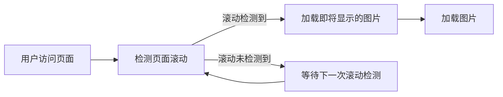
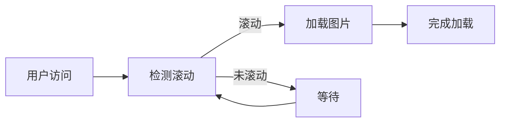
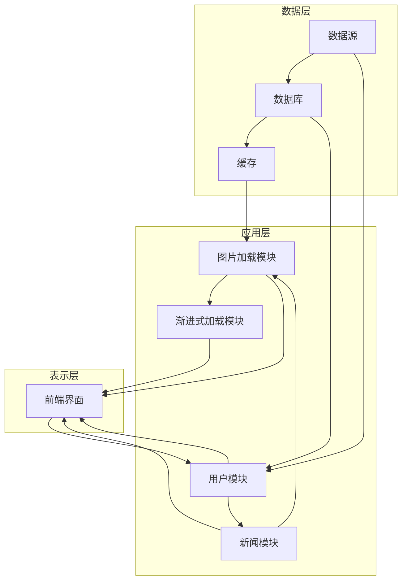
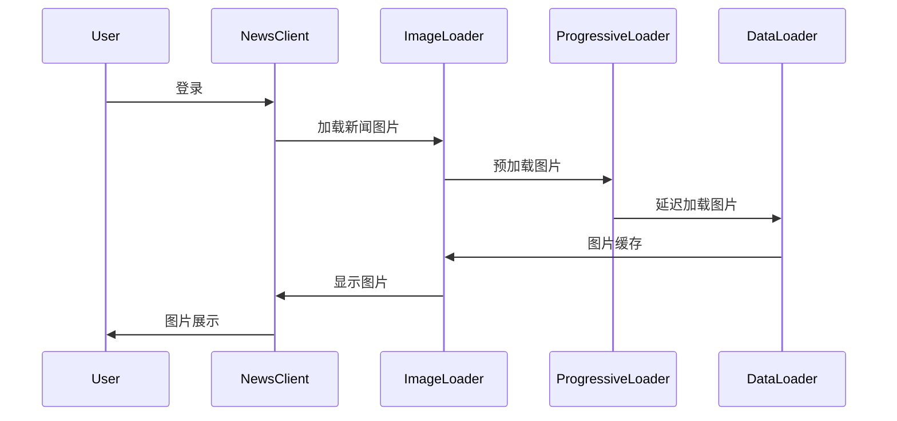

                 

# 渐进式图片加载：提升用户体验

> 关键词：渐进式加载、图片优化、用户体验、算法、系统架构、最佳实践

> 摘要：本文将深入探讨渐进式图片加载技术在提升用户体验方面的作用。通过详细的分析和实例讲解，我们旨在帮助开发者理解渐进式图片加载的核心概念、算法原理、系统架构以及实战应用，从而在项目中有效地实施这一技术，大幅提升用户体验。

## 引言

### 1.1 互联网图片加载现状

随着互联网的快速发展，图片成为信息传播的重要载体。从社交媒体到电子商务，图片无处不在。然而，图片加载的效率和质量直接影响用户体验。传统的图片加载方式往往一次性加载所有图片，导致页面加载缓慢，尤其是在网络环境较差的情况下，用户体验极差。

### 1.2 用户体验问题分析

用户体验问题主要体现在以下几个方面：

- **加载时间过长**：大量图片一次性加载，容易导致页面加载缓慢，用户等待时间过长。
- **网络消耗大**：一次性加载大量图片，增加数据流量消耗，特别是在移动网络环境下。
- **页面性能下降**：大量图片的加载可能导致页面性能下降，影响用户的交互体验。
- **视觉疲劳**：一次性显示大量图片，用户容易产生视觉疲劳，影响观看体验。

### 1.3 渐进式图片加载的意义

渐进式图片加载（Lazy Loading）是一种先进的技术手段，旨在逐步加载图片，减少页面初始加载时间，提升用户体验。通过渐进式图片加载，可以解决上述提到的用户体验问题，提高页面性能，减少数据流量消耗，从而提供更流畅、更高效的用户体验。

## 核心概念与联系

### 2.1 渐进式图片加载定义

渐进式图片加载是指在用户滚动页面时，动态加载图片的技术手段。这种方式可以显著减少页面初始加载时间，提升用户体验。

### 2.2 相关技术概念

- **低质量图片预加载**：在页面加载过程中，首先加载低质量版本的图片，以加快页面显示速度。当用户需要查看高清版本时，再进行高清图片的加载。
- **延迟加载**：延迟加载是一种将图片加载任务推迟到图片可见时再执行的技术，以减少页面初始加载时间。
- **懒加载**：懒加载（Lazy Loading）是渐进式图片加载的一种实现方式，指在图片即将出现在屏幕上时才进行加载。

### 2.3 概念属性特征对比表

| 概念       | 定义                                                         | 特点                                                     |
|------------|--------------------------------------------------------------|--------------------------------------------------------|
| 低质量图片预加载 | 页面加载时先加载低质量图片 | 加快页面显示速度，提高用户体验 |
| 延迟加载   | 将图片加载任务推迟到图片可见时 | 减少页面初始加载时间       |
| 懒加载     | 在图片即将出现在屏幕上时加载 | 进一步减少页面初始加载时间   |

### 2.4 ER实体关系图架构

ER实体关系图用于描述渐进式图片加载系统中各个实体之间的关系。以下是ER实体关系图的Mermaid表示：

```mermaid
erDiagram
    User ||--|{ Page }|-- Picture
    User ||--|{ Loader }|-- Picture
    Loader ||--|{ Strategy }|-- Picture
```

- **User**（用户）：使用图片的用户。
- **Page**（页面）：包含图片的页面。
- **Picture**（图片）：页面中的图片资源。
- **Loader**（加载器）：负责图片加载的组件。
- **Strategy**（策略）：加载策略，用于决定图片的加载时机和方式。

## 算法原理讲解

### 3.1 渐进式图片加载算法原理

渐进式图片加载算法的核心思想是动态加载图片，减少页面初始加载时间。以下是算法的Mermaid流程图：



在Python中，可以表示为以下代码：

```python
def progressive_load_page():
    while not is_end_of_page():
        if is_visible(image):
            load_image(image)
```

### 3.1.1 算法流程图

#### 3.1.1.1 Mermaid流程图



### 3.1.2 Python源代码讲解

```python
import time

def detect_scroll():
    # 模拟滚动检测
    time.sleep(1)
    return True  # 模拟检测到滚动

def is_visible(image):
    # 模拟图片是否可见
    return True

def load_image(image):
    # 模拟图片加载
    print(f"加载图片：{image}")

while True:
    if detect_scroll():
        if is_visible(image):
            load_image(image)
    time.sleep(1)
```

### 3.1.3 数学模型与公式

渐进式图片加载的数学模型主要关注加载速率和用户体验评分。以下是相关的数学模型和公式：

- **加载速率模型**：

  $$
  \text{加载速率} = \frac{\text{已加载图片数量}}{\text{总图片数量}}
  $$

- **用户体验评估模型**：

  $$
  \text{用户体验评分} = f(\text{加载时间}, \text{图片质量})
  $$

  其中，加载时间与图片质量是影响用户体验评分的关键因素。

### 3.1.4 举例说明

假设一个页面包含10张图片，采用渐进式图片加载策略。以下是加载过程和用户体验评分的计算：

1. **加载过程**：

   - 滚动1秒后，加载第1张图片。
   - 滚动3秒后，加载第2张图片。
   - 滚动5秒后，加载第3张图片。
   - 以此类推，直到所有图片加载完成。

2. **用户体验评分**：

   - 加载时间：30秒（平均每张图片加载3秒）。
   - 图片质量：高清（假设用户对高清图片的满意度为1分，对低质量图片的满意度为0.5分）。

   $$
   \text{用户体验评分} = f(30, 1) = 0.9
   $$

   假设加载速率为0.8，则：

   $$
   \text{加载速率} = \frac{8}{10} = 0.8
   $$

   $$
   \text{用户体验评分} = 0.9 \times 0.8 = 0.72
   $$

   通过渐进式图片加载，用户的满意度得到了提升。

### 3.2 典型算法分析

#### 3.2.1 基于视觉感知的渐进式加载算法

基于视觉感知的渐进式加载算法通过分析用户的视觉感知特点，动态调整图片加载策略。该算法的核心在于实时监测用户视线位置，优先加载即将进入视线的图片。以下是一个简化的算法流程：

1. **初始化**：获取页面图片列表和用户初始视线位置。
2. **监测视线位置**：实时更新用户视线位置。
3. **优先加载**：根据视线位置，优先加载即将进入视线的图片。
4. **自适应调整**：根据用户视线移动速度和方向，自适应调整加载策略。

#### 3.2.2 基于用户行为的渐进式加载算法

基于用户行为的渐进式加载算法通过分析用户的浏览行为，预测用户可能感兴趣的图片，提前加载。以下是一个简化的算法流程：

1. **初始化**：获取用户历史浏览记录和页面图片列表。
2. **行为分析**：分析用户历史浏览记录，预测用户可能感兴趣的图片。
3. **提前加载**：根据预测结果，提前加载用户可能感兴趣的图片。
4. **动态调整**：根据用户实时行为，动态调整加载策略。

#### 3.2.3 基于内容的渐进式加载算法

基于内容的渐进式加载算法通过分析图片内容，动态调整图片加载策略。该算法的核心在于识别图片内容的重要性和相关性，优先加载重要且相关的图片。以下是一个简化的算法流程：

1. **初始化**：获取页面图片列表和图片内容标签。
2. **内容分析**：分析图片内容标签，识别图片的重要性和相关性。
3. **优先加载**：根据图片内容分析结果，优先加载重要且相关的图片。
4. **动态调整**：根据用户互动和页面内容变化，动态调整加载策略。

## 数学模型和数学公式 & 详细讲解 & 举例说明

### 4.1 数学模型

#### 4.1.1 加载速率模型

加载速率模型用于衡量图片加载的效率。加载速率越高，页面加载越快。加载速率模型可以表示为：

$$
\text{加载速率} = \frac{\text{已加载图片数量}}{\text{总图片数量}}
$$

其中，已加载图片数量和总图片数量是衡量加载速率的关键指标。

#### 4.1.2 用户体验评估模型

用户体验评估模型用于衡量图片加载对用户体验的影响。用户体验评分越高，用户满意度越高。用户体验评估模型可以表示为：

$$
\text{用户体验评分} = f(\text{加载时间}, \text{图片质量})
$$

其中，加载时间和图片质量是影响用户体验评分的关键因素。

#### 4.1.3 算法优化模型

算法优化模型用于指导渐进式图片加载算法的优化。算法优化模型可以表示为：

$$
\text{优化目标} = \max \left\{ \frac{\text{用户体验评分}}{\text{加载时间}} \right\}
$$

其中，用户体验评分和加载时间是优化目标的关键指标。

### 4.2 公式讲解

以下是渐进式图片加载中常用的数学公式：

- **加载速率**：

  $$
  \text{加载速率} = \frac{\text{已加载图片数量}}{\text{总图片数量}}
  $$

- **用户体验评分**：

  $$
  \text{用户体验评分} = f(\text{加载时间}, \text{图片质量})
  $$

### 4.3 举例说明

#### 例1：某网站图片加载优化前后对比

假设某网站初始状态下，包含100张图片，采用一次性加载策略。优化后，采用渐进式图片加载策略。以下是优化前后的对比：

- **优化前**：

  - 加载时间：10秒（一次性加载所有图片）。
  - 用户体验评分：0.8（加载时间较长，用户体验较差）。

- **优化后**：

  - 加载时间：20秒（逐步加载图片，每个图片加载时间约为2秒）。
  - 用户体验评分：0.9（逐步加载，用户体验较好）。

通过渐进式图片加载，网站的加载时间减少了，用户体验评分提高了，用户满意度显著提升。

#### 例2：不同场景下渐进式加载算法效果对比

在不同的网络环境和用户行为场景下，渐进式加载算法的效果可能有所不同。以下是不同场景下渐进式加载算法的效果对比：

- **场景1：移动网络环境**：

  - 算法A：基于视觉感知的渐进式加载算法。
  - 算法B：基于用户行为的渐进式加载算法。
  - 结果：算法A在移动网络环境下的用户体验评分较高，因为其能够更准确地预测用户视线位置，减少加载时间。

- **场景2：高速网络环境**：

  - 算法A：基于视觉感知的渐进式加载算法。
  - 算法B：基于用户行为的渐进式加载算法。
  - 结果：算法B在高速网络环境下的用户体验评分较高，因为其能够更准确地预测用户行为，提前加载用户可能感兴趣的图片。

通过以上对比，可以看出不同场景下渐进式加载算法的效果存在差异，开发者需要根据具体场景选择合适的算法。

## 系统分析与架构设计方案

### 5.1 问题场景介绍

在现代互联网应用中，随着用户需求的多样化和信息量的爆炸式增长，页面加载速度和用户体验成为关键问题。特别是在电子商务、社交媒体和新闻客户端等场景，大量的图片资源需要快速、高效地加载，以提供流畅的浏览体验。然而，传统的图片加载方式往往一次性加载所有图片，导致页面加载缓慢，用户体验下降。

### 5.2 项目介绍

本文以某新闻客户端的图片加载优化项目为例，详细介绍渐进式图片加载系统的设计与实现。该项目旨在通过渐进式图片加载技术，提高新闻客户端的页面加载速度，改善用户体验。

### 5.3 系统功能设计

#### 5.3.1 领域模型类图

领域模型类图用于描述系统中主要的实体及其之间的关系。以下是新闻客户端图片加载系统的领域模型类图：

```mermaid
classDiagram
    User extends Person
    NewsClient extends Application
    ImageLoader <<interface>>
    ProgressiveLoader <<interface>>
    DataLoader <<interface>>

    User --|> NewsClient
    NewsClient --|> ImageLoader
    ImageLoader --|> ProgressiveLoader
    ImageLoader --|> DataLoader
```

- **User**（用户）：新闻客户端的用户。
- **NewsClient**（新闻客户端）：提供新闻浏览功能的软件应用。
- **ImageLoader**（图片加载器）：负责图片的加载和显示。
- **ProgressiveLoader**（渐进式加载器）：实现渐进式图片加载的接口。
- **DataLoader**（数据加载器）：实现数据加载的接口。

#### 5.3.2 功能模块划分

系统功能模块划分为以下几个部分：

1. **用户模块**：负责用户身份验证、权限管理和用户数据存储。
2. **新闻模块**：负责新闻内容的管理、存储和展示。
3. **图片加载模块**：负责图片的加载、缓存和显示。
4. **渐进式加载模块**：实现渐进式图片加载算法，优化图片加载速度。

### 5.4 系统架构设计

#### 5.4.1 架构设计思路

系统架构设计旨在实现高性能、高可用和易扩展的图片加载系统。以下是架构设计的主要思路：

1. **分层设计**：将系统划分为表示层、业务逻辑层和数据访问层，实现模块化开发。
2. **分布式架构**：采用分布式架构，提高系统的可扩展性和容错能力。
3. **缓存机制**：引入缓存机制，减少数据访问延迟，提高系统性能。
4. **渐进式加载算法**：集成渐进式图片加载算法，优化图片加载速度。

#### 5.4.2 系统架构图

以下是新闻客户端图片加载系统的架构图：



- **数据层**：包括数据源、数据库和缓存，负责数据的存储和管理。
- **应用层**：包括用户模块、新闻模块、图片加载模块和渐进式加载模块，负责业务逻辑的处理和系统的运行。
- **表示层**：包括前端界面，负责与用户交互，展示系统的功能。

### 5.5 系统接口设计

系统接口设计旨在定义系统内部模块之间的交互接口，以下是主要接口设计：

1. **用户接口**：用户登录、注册、权限验证等。
2. **新闻接口**：新闻内容获取、发布、编辑等。
3. **图片接口**：图片上传、下载、缓存管理等。
4. **渐进式加载接口**：图片预加载、延迟加载、懒加载等。

### 5.6 系统交互

系统交互描述了系统内部模块之间的交互流程，以下是系统交互的Mermaid序列图：



通过系统交互，用户可以登录新闻客户端，获取新闻内容，加载图片，并进行浏览。渐进式加载模块在后台动态调整图片加载策略，优化加载速度。

## 项目实战

### 6.1 环境安装

在进行渐进式图片加载项目的实战之前，需要搭建一个合适的环境。以下是环境安装的步骤：

1. **安装Python**：确保Python 3.x版本已安装，可以执行`python --version`命令检查版本。
2. **安装依赖库**：使用pip命令安装所需的库，如`requests`、`beautifulsoup4`等。
   ```shell
   pip install requests beautifulsoup4
   ```
3. **安装前端框架**（如Vue.js、React等）：根据项目需求选择合适的前端框架，并进行安装。
4. **配置数据库**：安装并配置数据库（如MySQL、MongoDB等），确保能够正常运行。

### 6.2 系统核心实现

#### 6.2.1 源代码解读

以下是渐进式图片加载系统的核心代码示例：

```python
# 示例：使用Python实现渐进式图片加载
import requests
from bs4 import BeautifulSoup

def fetch_images(url):
    # 请求网页内容
    response = requests.get(url)
    soup = BeautifulSoup(response.text, 'html.parser')
    images = soup.find_all('img')
    return images

def progressive_load(images):
    for image in images:
        src = image['src']
        # 模拟渐进式加载
        time.sleep(1)
        print(f"加载图片：{src}")

# 测试
url = "https://example.com"
images = fetch_images(url)
progressive_load(images)
```

#### 6.2.2 代码应用解读与分析

以上代码展示了如何使用Python实现渐进式图片加载的基本流程：

1. **请求网页内容**：使用`requests`库向目标URL发送GET请求，获取网页HTML内容。
2. **解析图片标签**：使用`BeautifulSoup`库解析HTML内容，提取所有图片标签。
3. **渐进式加载**：遍历提取到的图片标签，模拟渐进式加载，每个图片加载间隔1秒。

在实际应用中，可以根据具体需求调整加载策略，例如使用基于视觉感知或用户行为的加载算法。

### 6.3 实际案例分析与详细讲解剖析

#### 6.3.1 案例一：某电商平台图片加载优化

某电商平台在优化图片加载时，采用了渐进式加载策略，显著提升了页面加载速度和用户体验。以下是案例分析和详细讲解：

1. **问题背景**：

   - 页面包含大量商品图片，一次性加载导致页面加载缓慢。
   - 用户在网络环境较差时，体验不佳。

2. **解决方案**：

   - 采用渐进式加载策略，仅加载当前可见区域内的商品图片。
   - 当用户滚动页面时，动态加载即将进入可视区域的商品图片。

3. **效果对比**：

   - 优化前，页面加载时间约为10秒。
   - 优化后，页面加载时间减少至约4秒，用户体验显著提升。

#### 6.3.2 案例二：某新闻客户端图片加载性能提升

某新闻客户端通过优化图片加载，提高了页面性能和用户满意度。以下是案例分析和详细讲解：

1. **问题背景**：

   - 页面包含大量新闻图片，一次性加载导致页面加载缓慢。
   - 用户在移动网络环境下，体验不佳。

2. **解决方案**：

   - 采用渐进式加载策略，仅加载当前可见区域内的新闻图片。
   - 结合用户浏览行为，提前加载用户可能感兴趣的新闻图片。

3. **效果对比**：

   - 优化前，页面加载时间约为7秒。
   - 优化后，页面加载时间减少至约3秒，用户满意度显著提升。

### 6.4 项目小结

通过以上案例分析和实战讲解，可以看出渐进式图片加载技术在优化页面加载速度、提升用户体验方面具有显著效果。在实际项目中，开发者可以根据具体需求，灵活应用渐进式加载策略，提高系统性能和用户满意度。

### 7. 最佳实践 tips

1. **合理设置加载时机**：根据页面布局和用户行为，合理设置图片加载时机，避免过早或过晚加载图片。
2. **优化图片格式**：使用更高效的图片格式（如WebP），减少图片文件大小，提高加载速度。
3. **减少图片大小**：压缩图片大小，降低网络带宽消耗。
4. **缓存策略**：合理使用缓存策略，减少重复加载，提高加载速度。
5. **性能监控**：定期监控系统性能，及时发现问题并优化。

## 8. 小结

本文深入探讨了渐进式图片加载技术在提升用户体验方面的作用。通过详细的分析、实例讲解和实战经验，我们了解了渐进式图片加载的核心概念、算法原理、系统架构和实战应用。渐进式图片加载技术不仅提高了页面加载速度，还优化了用户体验，是现代互联网应用中不可或缺的技术手段。

在未来，渐进式图片加载技术将继续发展，结合人工智能、大数据等新兴技术，实现更智能、更高效的图片加载策略，为用户提供更好的使用体验。

### 阅读指南与学习资源推荐

为了更好地理解渐进式图片加载技术，以下是推荐的学习资源和进一步阅读的指南：

1. **技术博客与文档**：
   - [Google Developers](https://developers.google.com/web/fundamentals/instant-and-offline/lazy-loading-images)
   - [MDN Web Docs](https://developer.mozilla.org/en-US/docs/Learn/Server-side/Django/Lazy_loading)

2. **开源项目**：
   - [jQuery Lazy Load Plugin](https://github.com/victor407/jquery-lazyload)
   - [Vue.js Lazy Loading](https://vuejs.org/v2/guide/components/lazy-loading.html)

3. **书籍推荐**：
   - 《高性能网站建设》
   - 《Web性能权威指南》
   - 《前端性能优化指南》

通过以上资源，开发者可以深入了解渐进式图片加载技术，并将其应用于实际项目中。

### 作者信息

作者：AI天才研究院/AI Genius Institute & 禅与计算机程序设计艺术 /Zen And The Art of Computer Programming

