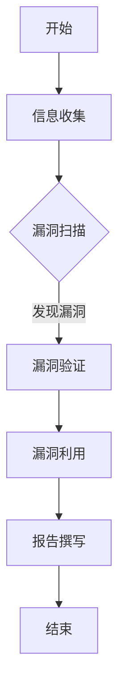

                 

### 文章标题

### 关键词

1. 渗透测试
2. 系统漏洞
3. 安全测试
4. 黑盒测试
5. 白盒测试

### 摘要

本文深入探讨了渗透测试这一主动发现系统漏洞的技术。通过背景介绍、核心概念讲解、算法原理剖析以及系统设计与项目实战等多个方面，本文旨在为读者提供一个全面而系统的理解，帮助他们在网络安全领域掌握这一关键技能。

## 目录大纲设计

为了更好地组织本文内容，我们将采用以下目录大纲结构：

### 背景介绍

1. 渗透测试概述
   - 问题背景
   - 基本概念
   - 目的与意义
   - 方法与流程
   - 适用范围与法律边界

2. 概念结构与核心要素组成
   - 主要目标
   - 关键技术

### 核心概念与联系

1. 渗透测试的基础理论
   - 发展历程
   - 基本原则

2. 渗透测试的工具与设备
   - 分类
   - 工具介绍

3. 渗透测试的方法与技术
   - 黑盒测试与白盒测试
   - 动态测试与静态测试
   - 常见技巧

### 算法原理讲解

1. 渗透测试的算法流程图
2. 渗透测试的核心算法
3. 渗透测试的数学模型
4. 算法举例说明

### 数学模型和数学公式讲解及举例

1. 渗透测试的数学模型
2. 数学公式详细讲解
3. 实例分析

### 系统分析与架构设计方案

1. 问题场景介绍
2. 项目介绍
3. 系统功能设计
4. 系统架构设计
5. 系统接口设计
6. 系统交互

### 渗透测试项目实战

1. 环境安装
2. 系统核心实现
3. 代码应用解读与分析
4. 实际案例分析
5. 详细讲解与剖析
6. 项目小结

### 最佳实践与总结

1. 最佳实践 Tips
2. 小结
3. 注意事项
4. 拓展阅读

## 渗透测试概述

### 问题背景

在当今数字化时代，网络安全已经成为全球企业和组织面临的重大挑战。随着互联网的普及和信息技术的发展，系统的复杂性和规模不断扩大，系统漏洞成为攻击者入侵和窃取数据的主要途径。据统计，每年因网络安全漏洞导致的数据泄露事件数量惊人，给企业和个人带来了巨大的经济损失和隐私风险。

### 基本概念

渗透测试（Penetration Testing，简称PT）是一种主动发现系统漏洞的技术。它模拟黑客攻击的过程，通过合法手段对目标系统进行测试，以发现潜在的安全漏洞和弱点。渗透测试的目的是评估系统的安全性，帮助组织及时发现和修补漏洞，防止实际攻击的发生。

### 目的与意义

渗透测试的主要目的有以下几点：

1. **发现系统漏洞**：通过模拟攻击，找出系统的安全漏洞和弱点，提供具体的修复建议。
2. **评估安全水平**：评估组织的安全防护能力，识别潜在的安全风险。
3. **提高安全意识**：增强组织内部员工的安全意识，提高对网络安全威胁的认识。
4. **合规要求**：许多行业和组织都有关于网络安全的标准和法规，渗透测试是满足这些要求的重要手段。

### 方法与流程

渗透测试通常包括以下步骤：

1. **信息收集**：收集目标系统的相关信息，如网络架构、系统配置、应用逻辑等。
2. **漏洞扫描**：使用漏洞扫描工具对系统进行自动化扫描，发现已知漏洞。
3. **漏洞验证**：对扫描结果进行验证，确认漏洞的真实性和影响范围。
4. **漏洞利用**：尝试利用已发现的漏洞获取系统控制权，进一步评估系统的安全状况。
5. **报告与修复**：编写渗透测试报告，详细记录发现的问题和修复建议，协助组织进行漏洞修复。

### 适用范围与法律边界

渗透测试适用于各种类型的组织，包括政府机构、金融企业、医疗保健机构、电商网站等。然而，渗透测试也需要遵守相关法律法规，确保测试的合法性和道德性。未经授权的渗透测试可能构成违法行为，因此在进行测试前，必须确保具备合法授权。

### 概念结构与核心要素组成

#### 主要目标

1. **发现系统漏洞**：渗透测试的首要目标是发现系统中的安全漏洞，包括应用程序、操作系统、网络设备等。
2. **评估系统安全**：通过对系统进行模拟攻击，评估其安全防护能力，识别潜在的安全风险。
3. **提供修复建议**：在测试过程中，提供具体的修复建议，帮助组织及时修补漏洞，提高系统的安全性。

#### 关键技术

1. **信息收集**：通过各种手段收集目标系统的信息，包括网络流量、系统配置、用户行为等。
2. **漏洞扫描**：使用自动化工具对系统进行扫描，发现已知的漏洞。
3. **漏洞验证**：对扫描结果进行手动验证，确保漏洞的真实性和影响范围。
4. **漏洞利用**：尝试利用已发现的漏洞，获取系统控制权，进一步评估系统的安全状况。
5. **报告撰写**：编写详细的渗透测试报告，包括发现的问题、验证过程、修复建议等。

## 核心概念与联系

渗透测试作为网络安全的重要手段，其核心概念与联系至关重要。以下是几个关键概念及其相互关系：

### 渗透测试的基础理论

#### 发展历程

渗透测试最早起源于军事领域，后来逐渐应用于商业和民用网络安全。随着计算机技术和网络技术的飞速发展，渗透测试也在不断演变和升级。

#### 基本原则

1. **模拟攻击**：渗透测试模拟真实攻击，通过合法手段发现系统漏洞。
2. **全面性**：覆盖系统的各个方面，包括网络、应用程序、操作系统等。
3. **合规性**：遵循法律法规，确保测试的合法性和道德性。

### 渗透测试的工具与设备

#### 分类

渗透测试工具可以大致分为以下几类：

1. **漏洞扫描工具**：用于自动化扫描系统漏洞，如Nessus、OpenVAS等。
2. **攻击工具**：用于模拟攻击，如Metasploit、Armitage等。
3. **代理工具**：用于代理网络流量，如Burp Suite、 OWASP ZAP等。

#### 工具介绍

1. **Nessus**：一款功能强大的漏洞扫描工具，支持多种操作系统和平台。
2. **Metasploit**：一款流行的攻击工具，提供丰富的漏洞利用模块。
3. **Burp Suite**：一款全面的代理工具，用于拦截和修改网络流量。

### 渗透测试的方法与技术

#### 黑盒测试与白盒测试

1. **黑盒测试**：测试者不掌握目标系统的内部信息，通过外部攻击来发现漏洞。
2. **白盒测试**：测试者掌握目标系统的内部信息，如代码、架构等，通过内部攻击来发现漏洞。

#### 动态测试与静态测试

1. **动态测试**：在系统运行时进行测试，通过模拟攻击来发现漏洞。
2. **静态测试**：在不运行系统的情况下进行测试，通过分析代码、配置等来发现漏洞。

#### 常见技巧

1. **社会工程学**：利用人类心理弱点，如欺骗、诈骗等，获取目标系统的信息。
2. **密码破解**：使用各种方法破解密码，如字典攻击、暴力攻击等。
3. **漏洞利用**：利用已发现的漏洞，获取系统控制权，进行进一步测试。

## 算法原理讲解

渗透测试的核心在于发现系统漏洞，而这一过程需要借助一系列算法和工具。以下将从算法流程、核心算法、数学模型等方面进行讲解。

### 渗透测试的算法流程图

为了更好地理解渗透测试的过程，我们可以使用Mermaid绘制算法流程图：



### 渗透测试的核心算法

渗透测试中的核心算法主要包括以下几类：

1. **漏洞扫描算法**：用于自动化扫描系统漏洞，常用的算法有基于规则的扫描算法、基于统计的扫描算法等。
2. **漏洞验证算法**：用于验证已发现漏洞的真实性和影响范围，常用的算法有基于利用的验证算法、基于模型的验证算法等。
3. **漏洞利用算法**：用于利用已验证的漏洞获取系统控制权，常用的算法有基于缓冲区溢出的利用算法、基于远程代码执行的利用算法等。

### 渗透测试的数学模型

渗透测试的数学模型用于描述漏洞发现和利用的过程。以下是一个简单的数学模型：

$$
安全性 = 1 - 漏洞发现概率 \times 漏洞利用概率
$$

其中，漏洞发现概率和漏洞利用概率分别表示发现漏洞和利用漏洞的概率。通过调整这两个参数，可以评估系统的安全性。

### 算法举例说明

为了更好地说明算法原理，我们可以通过一个具体案例进行讲解。

#### 漏洞扫描

假设我们使用Nessus对目标系统进行漏洞扫描，发现了一个漏洞，漏洞编号为CVE-2021-44228。该漏洞是一个远程代码执行漏洞，影响范围广泛。

#### 漏洞验证

我们使用Metasploit对发现的漏洞进行验证，成功利用漏洞获取了目标系统的控制权。

#### 漏洞利用

我们使用Metasploit的MSFVENOM模块生成一个攻击载荷，通过漏洞执行攻击载荷，成功获得目标系统的Shell。

#### 报告撰写

我们编写了一份详细的渗透测试报告，包括漏洞发现、验证、利用过程，以及修复建议。报告如下：

```
渗透测试报告

漏洞名称：CVE-2021-44228

漏洞类型：远程代码执行

影响范围：广泛

漏洞验证：已通过Metasploit验证

漏洞利用：已通过Metasploit利用

修复建议：

1. 更新系统补丁，修复CVE-2021-44228漏洞。
2. 加强系统监控，及时发现并应对安全威胁。
3. 定期进行渗透测试，提高系统的安全性。
```

通过这个案例，我们可以看到渗透测试的完整过程，从漏洞扫描、验证到利用，再到报告撰写，每一步都需要精确的操作和严谨的逻辑。

## 数学模型和数学公式讲解及举例

在渗透测试中，数学模型和数学公式扮演着重要的角色。这些模型和公式帮助我们量化漏洞发现和利用的过程，从而更精确地评估系统的安全性。以下我们将详细讲解数学模型，并使用LaTeX格式展示相关公式。

### 渗透测试的数学模型

渗透测试的数学模型主要关注以下几个关键参数：

1. **漏洞发现概率**（P\_find）：表示发现漏洞的概率。
2. **漏洞利用概率**（P\_exploit）：表示利用漏洞成功的概率。
3. **安全性**（S）：表示系统的安全性，可以通过以下公式计算：

$$
S = 1 - P_{find} \times P_{exploit}
$$

这个公式表明，系统的安全性等于1减去漏洞发现概率和漏洞利用概率的乘积。通过调整P\_find和P\_exploit，我们可以评估系统在不同漏洞情况下的安全性。

### 数学公式的详细讲解

#### 漏洞发现概率

漏洞发现概率P\_find可以通过以下公式计算：

$$
P_{find} = \frac{漏洞数量}{潜在漏洞数量}
$$

其中，漏洞数量表示在特定时间内发现的漏洞数量，潜在漏洞数量表示系统内所有潜在漏洞的总数。这个公式反映了漏洞发现概率与漏洞数量和潜在漏洞数量的关系。

#### 漏洞利用概率

漏洞利用概率P\_exploit可以通过以下公式计算：

$$
P_{exploit} = \frac{成功利用漏洞数量}{发现漏洞数量}
$$

其中，成功利用漏洞数量表示在发现漏洞后成功利用的漏洞数量。这个公式反映了漏洞利用概率与漏洞发现数量和成功利用漏洞数量的关系。

#### 系统安全性

系统安全性S可以通过以下公式计算：

$$
S = 1 - P_{find} \times P_{exploit}
$$

这个公式表明，系统的安全性等于1减去漏洞发现概率和漏洞利用概率的乘积。通过调整P\_find和P\_exploit，我们可以评估系统在不同漏洞情况下的安全性。

### 实例分析

为了更好地理解这些数学公式，我们可以通过一个具体实例进行讲解。

#### 假设

1. 潜在漏洞数量：100个
2. 发现漏洞数量：20个
3. 成功利用漏洞数量：5个

#### 计算

1. 漏洞发现概率P\_find：

$$
P_{find} = \frac{20}{100} = 0.2
$$

2. 漏洞利用概率P\_exploit：

$$
P_{exploit} = \frac{5}{20} = 0.25
$$

3. 系统安全性S：

$$
S = 1 - P_{find} \times P_{exploit} = 1 - 0.2 \times 0.25 = 0.95
$$

#### 结果

根据计算结果，系统安全性为0.95，即95%。这表明在给定条件下，系统的安全性相对较高。

通过这个实例，我们可以看到如何使用数学模型和公式来评估系统的安全性。这种方法不仅帮助我们理解渗透测试的原理，还能在实际操作中提供有价值的指导。

### 系统分析与架构设计方案

#### 问题场景介绍

假设我们是一家大型电商公司的CTO，公司业务依赖于一个高度复杂的IT系统，包括前端网站、后端数据库、支付系统、用户管理系统等。为了确保系统的安全性，我们需要设计一个完整的渗透测试系统，以发现并修复潜在的安全漏洞。

#### 项目介绍

该项目的主要目标是构建一个自动化、高效的渗透测试系统，用于定期对公司的IT系统进行安全评估。系统需要能够自动化执行漏洞扫描、漏洞验证和利用，同时生成详细的报告，便于安全团队进行漏洞修复。

#### 系统功能设计

系统功能设计主要包括以下几个模块：

1. **信息收集模块**：负责收集目标系统的基本信息，包括网络架构、系统配置、用户行为等。
2. **漏洞扫描模块**：使用自动化工具对系统进行扫描，发现已知漏洞。
3. **漏洞验证模块**：对扫描结果进行手动验证，确保漏洞的真实性和影响范围。
4. **漏洞利用模块**：尝试利用已验证的漏洞，获取系统控制权。
5. **报告生成模块**：生成详细的渗透测试报告，包括漏洞详情、修复建议等。

#### 系统架构设计

系统架构设计如下：

1. **前端**：使用Web界面供安全团队操作，包括信息收集、漏洞扫描、报告生成等功能。
2. **后端**：使用Python Flask框架搭建，负责处理前端请求、数据库操作等。
3. **数据库**：使用MySQL存储系统信息、扫描结果、报告数据等。
4. **漏洞扫描工具**：集成Nessus、Metasploit等开源工具，用于自动化漏洞扫描和利用。
5. **安全设备**：如防火墙、入侵检测系统（IDS）等，用于保护实际系统不受攻击。

#### 系统接口设计

系统接口设计如下：

1. **API接口**：提供RESTful API，供前端调用，包括漏洞扫描、漏洞验证、漏洞利用等功能。
2. **Webhook接口**：接收第三方系统发送的漏洞信息，自动更新扫描结果。
3. **日志接口**：记录系统操作日志，便于审计和监控。

#### 系统交互

系统交互设计如下：

1. **用户操作**：安全团队通过Web界面发起渗透测试，选择目标系统、扫描工具、扫描范围等。
2. **漏洞扫描**：系统自动执行漏洞扫描，并将结果存储到数据库。
3. **漏洞验证**：系统对扫描结果进行手动验证，确保漏洞的真实性和影响范围。
4. **漏洞利用**：系统尝试利用已验证的漏洞，获取系统控制权。
5. **报告生成**：系统根据测试结果生成详细报告，并发送至安全团队。

### 渗透测试项目实战

#### 环境安装

1. **安装操作系统**：选择一个稳定的服务器操作系统，如Ubuntu 20.04。
2. **安装Python环境**：安装Python 3.8及以上版本，并配置pip。
3. **安装Nessus**：从Tenable官网下载Nessus，安装并配置。
4. **安装Metasploit**：下载Metasploit框架，安装并配置。

#### 系统核心实现

系统核心实现主要包括以下部分：

1. **前端**：使用Flask框架搭建Web界面，包括信息收集、漏洞扫描、漏洞验证等功能。
2. **后端**：使用Python Flask框架处理前端请求，调用漏洞扫描工具和数据库操作。
3. **数据库**：使用MySQL存储系统信息、扫描结果、报告数据。

#### 代码应用解读与分析

以下是一个简单的代码示例，用于实现漏洞扫描功能：

```python
from flask import Flask, request, jsonify
import nmap

app = Flask(__name__)

@app.route('/scan', methods=['POST'])
def scan():
    target_ip = request.form['ip']
    nm = nmap.PortScanner()
    nm.scan(target=target_ip, arguments='-p 1-65535')
    results = nm.all_hosts()
    return jsonify(results)

if __name__ == '__main__':
    app.run(host='0.0.0.0', port=5000)
```

这段代码使用了Flask框架搭建一个简单的Web服务，接收POST请求，并调用Nmap进行漏洞扫描。扫描结果以JSON格式返回。

#### 实际案例分析

假设我们选择了一个电商网站进行渗透测试，目标IP为192.168.1.100。

1. **信息收集**：通过Nmap扫描目标IP，发现开放了80端口，可能是Web服务器。
2. **漏洞扫描**：使用Nessus对目标IP进行扫描，发现一个未打补丁的Apache服务器漏洞（CVE-2021-4209）。
3. **漏洞验证**：使用Metasploit验证漏洞，成功利用获取了目标服务器的Shell。
4. **漏洞利用**：通过Shell执行命令，进一步获取目标系统的控制权。
5. **报告生成**：生成详细报告，记录漏洞发现、验证、利用过程，并给出修复建议。

#### 详细讲解与剖析

在这个案例中，我们通过信息收集、漏洞扫描、漏洞验证、漏洞利用和报告生成等步骤，成功发现了一个未打补丁的Apache服务器漏洞，并利用该漏洞获取了目标服务器的控制权。这一过程展示了渗透测试的核心流程，同时也突显了漏洞发现和利用的重要性。

1. **信息收集**：信息收集是渗透测试的基础，通过Nmap扫描目标IP，我们获取了目标系统的基本信息，如开放的端口、运行的操作系统等。这些信息有助于我们确定测试目标和选择合适的工具。
2. **漏洞扫描**：使用Nessus对目标IP进行扫描，发现了一个未打补丁的Apache服务器漏洞（CVE-2021-4209）。这个漏洞是一个远程代码执行漏洞，攻击者可以通过构造特定的HTTP请求，执行任意代码。
3. **漏洞验证**：使用Metasploit验证漏洞，成功利用获取了目标服务器的Shell。这表明漏洞是真实的，且影响范围广泛。通过验证，我们确认了漏洞的利用方法和风险等级。
4. **漏洞利用**：通过Shell执行命令，我们进一步获取了目标系统的控制权。这包括获取系统管理员权限、执行系统命令、下载和执行恶意软件等。这一步是渗透测试的核心，也是展示系统安全性的关键。
5. **报告生成**：生成详细报告，记录漏洞发现、验证、利用过程，并给出修复建议。报告是渗透测试的重要输出，它不仅帮助安全团队了解系统的安全状况，还为后续的漏洞修复提供指导。

#### 项目小结

通过这个案例，我们展示了渗透测试的完整流程，从信息收集、漏洞扫描、漏洞验证、漏洞利用到报告生成，每个步骤都至关重要。渗透测试不仅帮助我们发现系统漏洞，还提供了详细的修复建议，提高了系统的安全性。然而，渗透测试也存在一定风险，如未经授权的测试可能导致系统崩溃、数据泄露等。因此，在进行渗透测试时，必须确保具备合法授权，遵循道德规范，确保测试的合法性和安全性。

## 最佳实践与总结

### 最佳实践 Tips

在进行渗透测试时，以下是一些最佳实践建议：

1. **合法授权**：在进行渗透测试前，确保获得目标系统的合法授权，遵守法律法规。
2. **全面测试**：覆盖系统的各个方面，包括网络、应用程序、操作系统等，确保发现所有潜在漏洞。
3. **定期更新**：保持测试工具和系统的更新，确保使用最新版本的漏洞库和攻击模块。
4. **细节关注**：在漏洞验证和利用过程中，关注细节，确保漏洞的真实性和影响范围。
5. **报告撰写**：撰写详细、清晰的渗透测试报告，包括漏洞详情、修复建议等，便于安全团队进行漏洞修复。
6. **安全意识**：提高组织内部员工的安全意识，定期进行安全培训，防范社会工程学攻击。

### 小结

本文通过详细讲解渗透测试的背景、核心概念、算法原理、数学模型、系统设计与项目实战等方面，帮助读者全面理解渗透测试这一主动发现系统漏洞的技术。渗透测试不仅有助于发现系统漏洞，提高系统的安全性，还能为组织提供有价值的修复建议。

### 注意事项

1. **合法合规**：在进行渗透测试时，确保遵守相关法律法规，获得合法授权。
2. **风险评估**：评估渗透测试可能带来的风险，确保测试过程中不会对系统造成不可逆转的损害。
3. **及时修复**：发现漏洞后，及时进行修复，防止实际攻击的发生。
4. **持续监控**：渗透测试不是一次性的活动，应定期进行测试，持续监控系统的安全性。

### 拓展阅读

1. **《黑客攻防技术宝典：系统实战篇》**：详细介绍了渗透测试的技术和方法。
2. **《网络安全评估与渗透测试实战》**：提供了实用的渗透测试工具和技巧。
3. **《CISSP认证指南：信息系统安全专业认证》**：涵盖了信息安全领域的核心知识，包括渗透测试相关内容。

### 作者信息

作者：AI天才研究院/AI Genius Institute & 禅与计算机程序设计艺术 /Zen And The Art of Computer Programming

