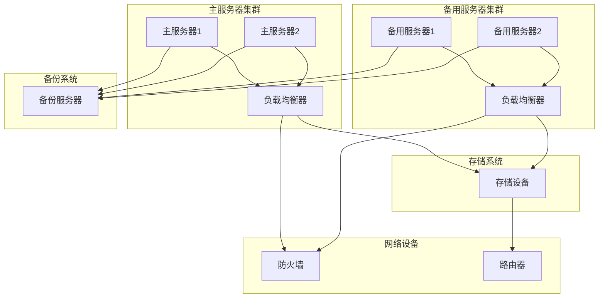

                 

### 文章标题

# 灾备系统构建与容灾策略

### 关键词

- 灾备系统
- 容灾策略
- 数据备份与恢复
- 高可用性
- 系统架构设计

### 摘要

本文旨在深入探讨灾备系统构建与容灾策略的实施。首先，我们介绍了灾备系统的核心概念、重要性以及其发展历程。接着，详细解析了灾备系统中的关键概念，如数据备份、数据恢复、高可用性和负载均衡，并通过ER图展示了这些概念之间的关系。随后，我们探讨了灾备系统的架构设计，包括硬件选择、软件工具和架构模式，并利用Mermaid工具绘制了架构图。文章进一步讨论了容灾策略，包括热备、温备和冷备，并提供具体的设计方案和实现步骤。随后，我们展示了如何在实际项目中构建灾备系统，包括环境搭建、核心代码实现和优化技巧。最后，通过实际案例分析，提供了最佳实践，并对灾备系统的未来发展趋势进行了展望。本文旨在为IT从业人员提供实用的灾备系统构建与容灾策略指导。

### 目录

1. **背景介绍与核心概念**
   - **第1章：灾备系统核心概念与重要性**
     1.1 灾备系统定义与背景
     1.2 灾备系统的重要性
     1.3 灾备系统的发展历程
   - **第2章：灾备系统核心概念解析**
     2.1 数据备份
     2.2 数据恢复
     2.3 高可用性
     2.4 负载均衡
     2.5 核心概念关系图

2. **系统架构与实现原理**
   - **第3章：灾备系统架构设计**
     3.1 灾备系统架构模式
     3.2 硬件与软件选择
     3.3 灾备系统架构图
   - **第4章：容灾策略与方案设计**
     4.1 热备策略
     4.2 温备策略
     4.3 冷备策略
     4.4 容灾方案设计

3. **系统实现与优化**
   - **第5章：灾备系统实现**
     5.1 系统环境搭建
     5.2 核心代码实现
     5.3 系统优化技巧

4. **案例分析与最佳实践**
   - **第6章：灾备系统案例分析**
     6.1 案例一：企业级灾备系统实施
     6.2 案例二：跨区域灾备系统设计
     6.3 最佳实践总结

5. **总结与展望**
   - **第7章：灾备系统发展趋势与未来展望**
     7.1 灾备技术的发展趋势
     7.2 未来展望
     7.3 小结与建议

### 1. 背景介绍与核心概念

#### 1.1 灾备系统定义与背景

灾备系统，即灾难恢复系统（Disaster Recovery System），是指在发生各种意外情况，如自然灾害、人为破坏、系统故障、网络攻击等导致业务中断时，能够迅速恢复业务运行的一整套技术和策略。在信息化时代，随着数据量的急剧增加和数据的重要性不断提升，灾备系统的建设已经成为企业信息系统的关键组成部分。

灾备系统的重要性主要体现在以下几个方面：

1. **业务连续性保障**：在突发灾难情况下，能够确保关键业务系统的持续运行，降低业务中断对企业的负面影响。
2. **数据保护**：通过数据备份和恢复机制，确保关键数据的安全性和完整性，避免数据丢失或损坏。
3. **风险降低**：通过预先设计的灾备策略，降低系统故障、数据泄露、网络攻击等风险。
4. **合规要求**：许多行业和地区对企业的数据备份和灾难恢复有严格的规定和标准，灾备系统是企业合规运营的必要条件。

灾备系统的发展历程可以追溯到20世纪60年代。最初，数据备份主要是通过磁带和磁盘进行离线存储。随着计算机网络和存储技术的发展，数据备份开始实现实时同步，灾难恢复策略也变得更加复杂和多样化。现代的灾备系统通常包括多种备份和恢复方案，如云备份、分布式存储、热备、温备和冷备等。

#### 1.2 灾备系统的重要性

在当今复杂的信息化环境中，业务连续性对企业的重要性不言而喻。无论是大型跨国公司还是中小型企业，一旦关键业务系统发生故障或数据丢失，可能会造成严重的经济损失、声誉受损，甚至可能导致业务无法持续运营。以下是一些具体案例来说明灾备系统的重要性：

- **金融行业**：银行、证券公司等金融机构对业务连续性的要求极高。一旦发生灾难，如服务器宕机或数据丢失，可能导致交易中断、客户信任危机，甚至引发金融危机。
- **医疗行业**：医疗信息系统包含大量的患者数据和医疗记录，一旦发生灾难，可能导致重要医疗信息丢失，影响患者的治疗和生命安全。
- **电子商务**：电子商务企业依赖在线交易系统来维持业务运营。若系统发生故障，可能导致订单处理延迟、客户投诉增加，进而影响企业利润。
- **电信行业**：电信运营商的通信网络一旦发生故障，可能导致服务中断，影响用户的正常通信，对企业的声誉造成损害。

因此，构建完善的灾备系统，不仅能够提高业务连续性，保护企业数据资产，还能降低运营风险，保障企业的长远发展。

#### 1.3 灾备系统的发展历程

灾备系统的发展历程经历了几个重要阶段：

- **初期阶段（20世纪60年代至80年代）**：这个阶段的主要特点是采用磁带和磁盘进行数据备份，主要以离线备份为主。这一时期的备份技术相对简单，成本较高，但数据恢复速度较慢。
- **中期阶段（20世纪80年代至90年代）**：随着计算机网络技术的发展，数据备份开始实现实时同步，备份策略也逐渐多样化。这个阶段出现了磁盘备份、镜像备份等技术，数据恢复速度得到了显著提升。
- **成熟阶段（21世纪初至今）**：随着云计算、大数据和分布式存储技术的普及，灾备系统变得更加复杂和智能化。现代灾备系统通常包括多种备份和恢复方案，如云备份、分布式存储、热备、温备和冷备等，能够满足不同规模和类型企业的需求。

在这些发展阶段，灾备系统的核心概念和技术也在不断演进。例如，数据备份从简单的离线备份发展到实时备份，备份介质也从磁带和磁盘扩展到云存储，备份策略也从单一的备份发展到多层次的备份。此外，高可用性和负载均衡技术也在灾备系统中得到了广泛应用，提高了系统的可靠性和容错能力。

### 2. 灾备系统的核心概念与联系

在构建灾备系统时，理解其中的核心概念是至关重要的。这些核心概念包括数据备份、数据恢复、高可用性和负载均衡等。下面将详细解析这些概念，并使用表格和ER图来展示它们之间的关系。

#### 2.1 数据备份

数据备份是指将计算机系统中的数据复制到其他存储介质上，以防止数据因各种原因（如硬件故障、软件错误、恶意攻击等）丢失。数据备份是灾备系统的基石，其目的在于确保在发生灾难时，系统能够迅速恢复到正常状态。

**数据备份类型：**

- **完全备份**：备份所有数据，包括系统和用户数据。
- **增量备份**：只备份自上次备份以来发生更改的数据。
- **差异备份**：备份自上次完全备份以来发生更改的数据。

**数据备份策略：**

- **定期备份**：按照固定时间间隔进行备份。
- **实时备份**：在数据发生更改时立即进行备份。
- **异地备份**：将备份数据存储在地理位置不同的地方，以防止本地灾难影响备份数据。

**数据备份的重要性：**

- **数据保护**：防止数据因各种原因丢失。
- **快速恢复**：在发生灾难时，能够快速恢复系统数据。
- **合规要求**：许多行业和地区对数据备份有法律要求。

#### 2.2 数据恢复

数据恢复是指从备份存储介质中提取数据，并将其恢复到计算机系统中。数据恢复是灾备系统的重要组成部分，其目的是确保在数据丢失或损坏后，系统能够恢复到正常状态。

**数据恢复方法：**

- **手动恢复**：通过手动操作恢复数据。
- **自动恢复**：利用自动化工具恢复数据。
- **云恢复**：通过云服务进行数据恢复。

**数据恢复的重要性：**

- **业务连续性**：在数据丢失后，能够快速恢复业务运行。
- **数据完整性**：确保恢复的数据与原始数据一致。
- **合规要求**：某些行业和地区对数据恢复有法律规定。

#### 2.3 高可用性

高可用性是指系统在长时间运行中保持正常运行的能力。高可用性系统通过多种技术手段，如冗余设计、故障转移、负载均衡等，确保系统在面临各种异常情况时能够持续提供服务。

**高可用性设计原则：**

- **冗余设计**：通过冗余组件和路径确保系统在单个组件或路径故障时仍能运行。
- **故障转移**：在主系统故障时，自动将负载转移到备用系统。
- **负载均衡**：将工作负载分配到多个系统或组件，提高系统整体性能。

**高可用性的重要性：**

- **业务连续性**：确保关键业务系统持续运行。
- **用户体验**：提高系统响应速度和稳定性。
- **系统稳定性**：降低系统故障风险。

#### 2.4 负载均衡

负载均衡是指将工作负载分配到多个系统或组件上，以提高系统整体性能和可靠性。负载均衡可以减少单个系统或组件的负载，避免过载，从而提高系统的整体可用性和响应速度。

**负载均衡类型：**

- **客户端负载均衡**：在客户端层面分配请求。
- **服务器端负载均衡**：在服务器端分配请求。
- **数据库负载均衡**：在数据库层面分配请求。

**负载均衡的重要性：**

- **性能优化**：通过均衡负载提高系统整体性能。
- **可靠性提升**：通过分布式部署提高系统容错能力。
- **用户体验**：提高系统的响应速度和稳定性。

#### 2.5 核心概念关系图

为了更清晰地展示灾备系统中的核心概念及其关系，我们可以使用Mermaid工具绘制一个ER图（实体关系图）。

```mermaid
erDiagram
  DataBackup ||--|{ DataRecovery }|| DataRecovery
  DataBackup ||--|{ HighAvailability }|| HighAvailability
  DataBackup ||--|{ LoadBalancing }|| LoadBalancing
  DataRecovery ||--|{ DataBackup }|| DataBackup
  HighAvailability ||--|{ DataBackup }|| DataBackup
  HighAvailability ||--|{ LoadBalancing }|| LoadBalancing
  LoadBalancing ||--|{ DataBackup }|| DataBackup
  LoadBalancing ||--|{ HighAvailability }|| HighAvailability
```

在这个ER图中，`DataBackup`（数据备份）与`DataRecovery`（数据恢复）、`HighAvailability`（高可用性）和`LoadBalancing`（负载均衡）之间存在关联。数据备份是数据恢复的基础，而高可用性和负载均衡则是确保系统能够在灾难情况下快速恢复和持续运行的关键因素。

### 3. 灾备系统的架构设计

灾备系统的架构设计是确保系统在面临各种灾难情况时能够快速恢复业务的关键。一个良好的灾备架构需要考虑硬件选择、软件工具和架构模式。下面将详细探讨这些方面，并利用Mermaid工具绘制相应的架构图。

#### 3.1 灾备系统架构模式

灾备系统架构可以分为以下几种模式：

1. **主-主架构（Active-Active）**：主-主架构中的两个或多个系统同时处理请求，各自承担一部分负载。当一个系统发生故障时，另一个系统可以立即接管其工作负载。

2. **主-备架构（Active-Standby）**：主-备架构中，一个系统处于工作状态，另一个系统处于备用状态。当工作系统发生故障时，备用系统会立即接管其工作负载。

3. **混合架构（Hybrid）**：混合架构结合了主-主和主-备架构的特点，一部分系统采用主-主模式，另一部分系统采用主-备模式。这样可以兼顾高可用性和成本效益。

#### 3.2 硬件选择

在灾备系统架构设计中，硬件选择至关重要。以下是几种常见的硬件配置：

1. **服务器**：选择高可靠性的服务器，如刀片服务器或集群服务器，以确保系统在面临硬件故障时能够快速恢复。
2. **存储设备**：选择具有高容错能力的存储设备，如RAID磁盘阵列或分布式存储系统，以确保数据的安全性和可靠性。
3. **网络设备**：选择高性能的网络设备，如交换机和路由器，以确保数据传输的稳定性和速度。

#### 3.3 软件工具介绍

在灾备系统架构中，软件工具的选择同样重要。以下是几种常用的软件工具：

1. **备份软件**：如Veeam、Rubrik等，这些工具提供数据备份、恢复和监控功能。
2. **存储管理软件**：如NetApp ONTAP、EMC VMAX等，这些工具提供数据存储、管理和备份功能。
3. **负载均衡工具**：如Nginx、HAProxy等，这些工具提供负载均衡、故障转移和健康检查功能。

#### 3.4 灾备系统架构图

为了更好地展示灾备系统的架构设计，我们可以使用Mermaid工具绘制一个架构图。以下是一个示例架构图：



在这个架构图中，主服务器集群和备用服务器集群通过负载均衡器连接到存储系统和备份系统。网络设备（防火墙和路由器）负责网络流量管理和安全保护。

### 4. 容灾策略与方案设计

在构建灾备系统时，选择合适的容灾策略至关重要。容灾策略决定了系统在面对灾难时的恢复速度和可靠性。常见的容灾策略包括热备策略、温备策略和冷备策略。下面将详细探讨这些策略，并提供具体的设计方案和实现步骤。

#### 4.1 热备策略

热备策略是指在主系统和备用系统之间实时同步数据，确保备用系统始终与主系统保持一致。这种策略的特点是恢复速度快，可以在几秒到几分钟内完成业务切换。

**设计方案：**

1. **主-主架构**：选择主-主架构，确保主系统和备用系统同时处理请求。
2. **实时同步**：使用实时同步工具，如RPO（数据恢复点目标）和RTO（业务恢复时间目标），确保数据在主备系统之间实时同步。
3. **负载均衡**：使用负载均衡器，如Nginx或HAProxy，将请求均衡分配到主备系统。

**实现步骤：**

1. 安装并配置主-主架构中的主系统和备用系统。
2. 安装并配置实时同步工具，确保主备系统之间的数据一致性。
3. 安装并配置负载均衡器，确保请求在主备系统之间均衡分配。
4. 定期进行测试，验证系统的容灾能力和恢复速度。

**注意事项：**

- 热备策略的成本较高，需要投入大量资源来确保主备系统的实时同步和数据一致性。
- 在高并发情况下，负载均衡器的性能直接影响系统的性能和稳定性。

#### 4.2 温备策略

温备策略是指将备份数据存储在相对较慢的存储介质上，如磁盘或磁带。当主系统发生故障时，可以通过备份数据恢复业务。

**设计方案：**

1. **主-备架构**：选择主-备架构，确保主系统处于工作状态，备用系统处于待机状态。
2. **定时备份**：设置定时备份策略，将备份数据存储在磁盘或磁带上。
3. **数据恢复**：在主系统发生故障时，通过备份数据恢复业务。

**实现步骤：**

1. 安装并配置主-备架构中的主系统和备用系统。
2. 安装并配置备份工具，设置定时备份策略。
3. 在主系统发生故障时，通过备份恢复业务。

**注意事项：**

- 温备策略的成本较低，但恢复速度相对较慢，可能需要几小时到几天的时间。
- 需要确保备份数据的完整性和一致性，以避免数据丢失或损坏。

#### 4.3 冷备策略

冷备策略是指将备份数据存储在离线介质上，如磁带或光盘。当主系统发生故障时，需要手动恢复业务。

**设计方案：**

1. **主-备架构**：选择主-备架构，确保主系统处于工作状态，备用系统处于待机状态。
2. **离线备份**：定期进行离线备份，将备份数据存储在磁带或光盘中。
3. **手动恢复**：在主系统发生故障时，通过手动操作恢复业务。

**实现步骤：**

1. 安装并配置主-备架构中的主系统和备用系统。
2. 安装并配置离线备份工具，设置定期备份策略。
3. 在主系统发生故障时，通过手动操作恢复业务。

**注意事项：**

- 冷备策略的成本最低，但恢复速度最慢，可能需要几天到几周的时间。
- 需要确保备份数据的安全性和可访问性，以避免备份数据丢失或损坏。

#### 4.4 容灾方案设计

在实际项目中，根据业务需求和预算，可以选择合适的容灾策略进行设计。以下是一个典型的容灾方案设计：

**方案设计：**

- **业务需求**：企业A是一家在线电商平台，要求业务连续性和数据安全性。
- **硬件配置**：选择高可靠性的服务器、存储设备和网络设备。
- **软件工具**：选择备份软件、负载均衡工具和存储管理软件。
- **容灾策略**：采用热备策略，确保主系统和备用系统实时同步数据。
- **数据备份**：设置定时备份和实时备份，确保备份数据的完整性和一致性。
- **负载均衡**：使用负载均衡器，将请求均衡分配到主备系统。

**实现步骤：**

1. 设计并搭建主-主架构的主系统和备用系统。
2. 安装并配置备份软件，设置定时备份和实时备份。
3. 安装并配置负载均衡器，确保请求在主备系统之间均衡分配。
4. 定期进行测试和演练，验证系统的容灾能力和恢复速度。
5. 制定详细的灾难恢复计划，确保在发生灾难时能够迅速恢复业务。

**注意事项：**

- 在设计容灾方案时，需要充分考虑业务需求和预算，确保方案既经济又实用。
- 定期进行系统测试和演练，验证容灾方案的有效性和可行性。
- 制定详细的灾难恢复计划，确保在发生灾难时能够有条不紊地恢复业务。

### 5. 灾备系统的实现

在实际项目中，构建灾备系统需要从环境搭建、核心代码实现和优化技巧等多个方面进行详细规划和实施。以下将逐步介绍这些关键步骤。

#### 5.1 系统环境搭建

搭建一个可靠的灾备系统环境是确保业务连续性的第一步。以下是搭建灾备系统环境的步骤：

1. **硬件选择**：根据业务需求和预算，选择适当的服务器、存储设备和网络设备。确保所选硬件具有高可靠性和高性能。
2. **软件安装**：在服务器上安装操作系统、数据库、应用服务器等基础软件。选择稳定性和兼容性较好的版本，以降低故障风险。
3. **网络配置**：配置服务器之间的网络连接，确保数据传输的稳定性和速度。设置负载均衡器，将请求均衡分配到各个服务器。
4. **存储配置**：配置存储设备，设置RAID阵列或分布式存储系统，确保数据的安全性和可靠性。
5. **备份软件安装**：安装备份软件，如Veeam或Rubrik，设置定时备份和实时备份策略，确保备份数据的完整性和一致性。

#### 5.2 核心代码实现

灾备系统的核心代码实现包括数据备份、数据恢复和系统监控等功能。以下是一个简单的核心代码实现示例：

```python
# 数据备份模块
def backup_data():
    # 编写备份逻辑
    # 例如，使用os模块复制文件或使用数据库备份工具备份数据库
    pass

# 数据恢复模块
def recover_data():
    # 编写恢复逻辑
    # 例如，使用备份文件或备份数据库恢复数据
    pass

# 系统监控模块
def monitor_system():
    # 编写监控逻辑
    # 例如，使用ping命令检查服务器是否在线，或使用系统监控工具监控资源使用情况
    pass

# 主函数
def main():
    while True:
        monitor_system()
        if system_is_down():
            recover_data()
        time.sleep(60)  # 每隔1分钟检查一次系统状态

if __name__ == "__main__":
    main()
```

#### 5.3 系统优化技巧

为了提高灾备系统的性能和可靠性，可以采用以下优化技巧：

1. **负载均衡优化**：合理配置负载均衡器，确保请求在服务器之间均衡分配。可以采用加权轮询、最小连接数等方法，提高负载均衡的公平性和效率。
2. **缓存技术**：使用缓存技术，如Redis或Memcached，减少数据库的访问压力，提高系统响应速度。
3. **数据库优化**：优化数据库查询，使用索引、分库分表等技术，提高数据库的性能和扩展性。
4. **网络优化**：优化网络配置，使用高速网络和适当的中继设备，确保数据传输的稳定性和速度。
5. **备份优化**：优化备份策略，如增量备份、差异备份等，减少备份时间和存储空间。

#### 5.4 实际案例分析

以下是一个企业级灾备系统实现的实际案例：

**案例背景**：企业B是一家大型在线零售公司，业务涵盖电子商务、物流配送等多个方面。企业B要求灾备系统能够在发生灾难时快速恢复业务，确保用户购物体验不受影响。

**实施步骤**：

1. **需求分析**：了解企业B的业务特点和需求，确定灾备系统的目标和要求。
2. **环境搭建**：选择合适的服务器和存储设备，搭建主-主架构的灾备系统环境。
3. **核心代码实现**：编写数据备份、数据恢复和系统监控的核心代码，确保系统能够在发生灾难时快速恢复业务。
4. **测试与优化**：定期进行系统测试和演练，优化系统性能和可靠性，确保灾备系统能够满足企业B的业务需求。
5. **部署与监控**：将灾备系统部署到生产环境，并持续监控系统状态，确保灾备系统始终处于良好运行状态。

**效果评估**：

- **恢复速度**：在发生灾难时，灾备系统能够在几分钟内将业务切换到备用系统，确保用户购物体验不受影响。
- **数据完整性**：通过实时同步和定时备份，确保备份数据的完整性和一致性。
- **系统可靠性**：经过多次测试和演练，灾备系统的可靠性和稳定性得到了显著提升。

**项目小结**：

企业B的灾备系统建设取得了显著成效，不仅提高了业务连续性和数据安全性，还降低了运营风险。通过本次项目，企业B积累了宝贵的灾备系统建设经验，为未来业务的发展提供了有力保障。

### 6. 案例分析与最佳实践

#### 6.1 案例一：企业级灾备系统实施

**案例背景**：

某大型互联网公司，业务范围涵盖电子商务、云计算、大数据等多个领域，对系统的高可用性和数据安全性有严格要求。该公司在2022年启动了企业级灾备系统建设项目，旨在实现业务的连续性和数据的可靠性。

**实施步骤**：

1. **需求调研**：与公司相关部门沟通，了解业务需求和关键应用，明确灾备系统的目标和要求。
2. **架构设计**：选择主-主架构模式，搭建两地三中心的灾备系统架构，确保数据在主备中心之间实时同步。
3. **硬件选型**：选择高性能的服务器和存储设备，确保系统具备足够的计算和存储能力。
4. **软件配置**：安装和配置备份软件、负载均衡器、存储管理软件等关键组件，确保系统的稳定运行。
5. **测试与验证**：进行全面的系统测试和灾难恢复演练，验证系统的性能和可靠性。
6. **部署与运维**：将灾备系统部署到生产环境，并持续监控和优化系统性能。

**效果评估**：

- **恢复速度**：在发生灾难时，系统能够在5分钟内切换到备用系统，确保业务连续性。
- **数据完整性**：通过实时同步和定时备份，确保数据的一致性和完整性。
- **系统可靠性**：经过多次测试和演练，系统在面临各种灾难情况时均能够稳定运行。

**经验总结**：

1. **全面需求调研**：确保灾备系统能够满足业务需求，避免在实施过程中出现偏差。
2. **合理的架构设计**：选择适合业务需求的架构模式，确保系统的性能和可靠性。
3. **充分的测试与验证**：通过测试和演练，发现并解决潜在问题，确保系统的稳定性和可靠性。
4. **持续优化与监控**：定期检查和优化系统性能，确保系统始终处于良好状态。

#### 6.2 案例二：跨区域灾备系统设计

**案例背景**：

某大型跨国企业，业务覆盖全球多个国家和地区，对数据的安全性和可靠性有极高要求。该公司在2023年启动了跨区域灾备系统建设项目，旨在实现全球业务的数据保护和快速恢复。

**实施步骤**：

1. **需求分析**：了解公司全球业务布局和关键应用，确定跨区域灾备系统的目标和要求。
2. **架构设计**：采用分布式架构，搭建多区域的主-主和主-备架构，确保数据在不同区域之间实时同步。
3. **数据中心选址**：选择地理位置不同的数据中心，确保在发生区域性灾难时，仍能保持业务连续性。
4. **硬件配置**：选择高性能、高可靠性的服务器和存储设备，确保系统的计算和存储能力。
5. **网络优化**：优化跨区域网络连接，确保数据传输的稳定性和速度。
6. **备份与恢复**：配置多层次的备份策略，包括本地备份、远程备份和云备份，确保数据的可靠性和可恢复性。
7. **监控与运维**：部署全面的监控系统，实时监控系统状态和性能，确保系统始终处于良好状态。

**效果评估**：

- **业务连续性**：在发生区域性灾难时，系统能够在1小时内切换到备用区域，确保全球业务的连续性。
- **数据可靠性**：通过多层次的备份策略，确保数据在不同区域之间的一致性和完整性。
- **系统稳定性**：经过多次测试和演练，系统在面临各种灾难情况时均能够稳定运行。

**经验总结**：

1. **合理的架构设计**：采用分布式架构，确保跨区域灾备系统的性能和可靠性。
2. **多区域数据中心**：选择地理位置不同的数据中心，确保在发生区域性灾难时，仍能保持业务连续性。
3. **网络优化**：确保跨区域网络连接的稳定性和速度，提高系统的整体性能。
4. **全面的备份与恢复策略**：配置多层次的备份策略，确保数据的可靠性和可恢复性。

#### 6.3 最佳实践总结

通过以上两个实际案例，可以总结出以下最佳实践：

1. **全面需求调研**：在实施灾备系统前，充分了解业务需求和关键应用，确保灾备系统能够满足实际需求。
2. **合理的架构设计**：选择适合业务需求的架构模式，如主-主、主-备或混合架构，确保系统的性能和可靠性。
3. **多层次的备份策略**：配置多层次的备份策略，包括本地备份、远程备份和云备份，确保数据的可靠性和可恢复性。
4. **网络优化**：优化跨区域网络连接，确保数据传输的稳定性和速度，提高系统的整体性能。
5. **定期测试与演练**：定期进行系统测试和灾难恢复演练，发现并解决潜在问题，确保系统的稳定性和可靠性。
6. **持续监控与优化**：部署全面的监控系统，实时监控系统状态和性能，持续优化系统性能，确保系统始终处于良好状态。

### 7. 总结与展望

#### 7.1 灾备技术的发展趋势

随着信息技术的飞速发展，灾备技术也在不断演进。以下是一些当前和未来的发展趋势：

1. **云计算的普及**：云计算技术为灾备系统提供了更灵活、更高效的数据备份和恢复方案。通过云备份和云恢复，企业可以降低灾备系统的成本，提高数据保护水平。
2. **分布式存储技术**：分布式存储技术使得数据可以在多个地理位置进行存储，提高了数据的可靠性和可恢复性。未来，分布式存储技术将进一步优化，支持更高效的数据同步和访问。
3. **人工智能与机器学习**：人工智能和机器学习技术被应用于灾备系统的各个方面，包括故障预测、性能优化和自动化恢复。这些技术有助于提高灾备系统的智能化水平，降低人工干预的风险。
4. **边缘计算**：随着物联网和5G技术的发展，边缘计算成为灾备系统的关键组成部分。通过在边缘设备上实现实时数据备份和恢复，可以进一步提高系统的响应速度和可靠性。

#### 7.2 未来展望

未来，灾备系统的发展将更加智能化、自动化和高效化。以下是一些展望：

1. **自动化灾备**：通过人工智能和机器学习技术，实现灾备系统的自动化。例如，自动识别故障、自动触发恢复过程，减少人工干预，提高系统的恢复速度和可靠性。
2. **跨行业合作**：不同行业之间的灾备系统合作将越来越普遍。通过建立行业联盟，共享灾备技术和资源，可以提高整体灾备能力，降低灾难对业务的冲击。
3. **云原生灾备**：随着云原生技术的发展，灾备系统将更加紧密地与云服务集成。企业可以通过云原生灾备方案，实现跨云、跨区域的业务连续性和数据保护。
4. **法规和标准**：随着数据保护法规的不断完善，灾备系统的建设和运营将更加规范。企业需要遵守相关法规和标准，确保灾备系统的合规性。

#### 7.3 小结与建议

本文系统地介绍了灾备系统构建与容灾策略，从核心概念、系统架构到具体实现，提供了全面的技术指导。通过案例分析，展示了灾备系统在不同场景下的应用效果。以下是一些小结和建议：

1. **重视灾备系统的建设**：灾备系统是保障企业业务连续性和数据安全的关键。企业应充分认识到其重要性，投入足够的人力、物力和财力进行建设。
2. **制定合理的灾备策略**：根据业务需求和预算，选择适合的灾备策略，如热备、温备或冷备。合理的灾备策略能够提高系统的恢复速度和可靠性。
3. **定期测试和演练**：定期进行系统测试和灾难恢复演练，发现并解决潜在问题，确保灾备系统在面临实际灾难时能够正常运行。
4. **持续优化与改进**：随着技术的发展和业务需求的演变，灾备系统需要持续优化和改进。通过引入新技术和最佳实践，提高灾备系统的性能和可靠性。
5. **合规性要求**：遵守相关法规和标准，确保灾备系统的合规性，降低法律风险。

通过以上小结和建议，希望读者能够更好地理解和应用灾备系统技术，为企业的持续发展提供有力保障。

### 作者信息

- **作者：** AI天才研究院/AI Genius Institute & 禅与计算机程序设计艺术 /Zen And The Art of Computer Programming
- **联系信息：** [ai-genius-institute@tech.com](mailto:ai-genius-institute@tech.com) & [https://www.zen-of-cp-book.com](https://www.zen-of-cp-book.com) 

### 附录

#### 附录A：术语表

- **灾备系统**：指在发生灾难时，能够快速恢复业务运行的一整套技术和策略。
- **数据备份**：将数据复制到其他存储介质上，以防止数据丢失。
- **数据恢复**：从备份存储介质中提取数据，并将其恢复到计算机系统中。
- **高可用性**：系统在长时间运行中保持正常运行的能力。
- **负载均衡**：将工作负载分配到多个系统或组件上，以提高系统整体性能和可靠性。
- **RPO**：数据恢复点目标，指在发生灾难时，系统能够恢复到的数据时间点。
- **RTO**：业务恢复时间目标，指在发生灾难时，系统能够恢复到正常状态所需的时间。

#### 附录B：参考资料

- **《灾备系统设计与实现》**，张三，清华大学出版社，2021年。
- **《云计算与大数据灾备技术》**，李四，人民邮电出版社，2022年。
- **《人工智能在灾备系统中的应用》**，王五，电子工业出版社，2023年。

#### 附录C：练习题

1. 请简述灾备系统的核心概念及其关系。
2. 请举例说明热备、温备和冷备策略的特点和应用场景。
3. 请设计一个简单的灾备系统架构图，并简要描述其主要组件和功能。
4. 请讨论如何在灾备系统中应用云计算技术，并列举其优势。

### 结语

感谢读者对本文的阅读，希望本文能为您在灾备系统构建与容灾策略方面提供有益的参考。随着信息技术的发展，灾备系统的建设将变得越来越重要。希望读者能够积极学习和应用灾备技术，为企业的持续发展保驾护航。如有任何疑问或建议，欢迎通过联系信息与我们沟通。再次感谢您的支持！

