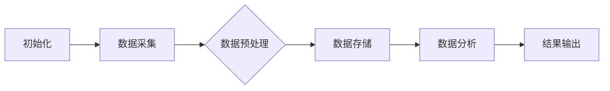

                 

### 《物联网平台架构设计》目录大纲详细内容

接下来，我们将深入探讨《物联网平台架构设计》的详细目录大纲，为读者提供一个清晰、系统且全面的学习路径。

---

**# 《物联网平台架构设计》目录大纲**

> 关键词：物联网平台、架构设计、技术实现、案例分析、优化、安全

> 摘要：本文将深入探讨物联网平台架构设计的核心概念、设计原则、主要组件、安全性和优化策略，通过实际案例分析和最佳实践，帮助读者全面理解物联网平台的设计与实现。

---

**## 第一部分：背景介绍与核心概念**

### 第1章：物联网平台架构设计概述

- **1.1 物联网（IoT）的发展背景**
  - 物联网的起源与演进
  - 当前物联网的发展趋势
  - 物联网在各个行业中的应用案例
  
- **1.2 物联网平台的基本概念**
  - 物联网平台的定义与功能
  - 平台的基本组成部分
  
- **1.3 物联网平台架构的设计原则**
  - 模块化与可扩展性
  - 高可用性与容错性
  - 系统性能与可维护性

### 第2章：物联网平台的核心概念与联系

- **2.1 设备管理**
  - 设备注册与认证
  - 设备状态监控与维护
  
- **2.2 数据采集与处理**
  - 数据格式与标准化
  - 数据预处理与清洗
  
- **2.3 连接性**
  - 网络协议与通信方式
  - 连接稳定性与可靠性
  
- **2.4 数据安全与隐私**
  - 安全策略与架构设计
  - 数据加密与隐私保护

### 第3章：物联网平台的架构模式

- **3.1 客户端-服务器架构**
  - 架构特点与适用场景
  - 架构设计要点
  
- **3.2 微服务架构**
  - 微服务的概念与优势
  - 微服务架构的设计原则
  
- **3.3 面向服务架构（SOA）**
  - SOA的基本概念
  - SOA在物联网平台中的应用

**## 第二部分：架构设计原则与实践**

### 第4章：物联网平台架构设计原则

- **4.1 模块化与可扩展性**
  - 模块化设计的好处
  - 扩展性的实现方法
  
- **4.2 高可用性与容错性**
  - 高可用性的设计策略
  - 容错性的实现机制
  
- **4.3 系统性能与可维护性**
  - 性能优化的方法
  - 可维护性的设计原则

### 第5章：物联网平台的主要组件与技术

- **5.1 网络通信技术**
  - 常见通信协议
  - 通信技术的选择
  
- **5.2 数据存储技术**
  - 数据存储的需求
  - 数据存储技术的选型
  
- **5.3 数据处理与分析技术**
  - 数据处理流程
  - 数据分析技术的应用

### 第6章：物联网平台的安全性

- **6.1 安全策略与架构设计**
  - 安全架构的设计原则
  - 安全策略的制定与实施
  
- **6.2 认证与授权**
  - 认证机制的实现
  - 授权策略的设置
  
- **6.3 数据加密与传输安全**
  - 数据加密技术
  - 传输安全措施

**## 第三部分：技术实现与案例分析**

### 第7章：物联网平台技术实现

- **7.1 开发环境与工具**
  - 开发环境的搭建
  - 常用开发工具
  
- **7.2 平台搭建步骤**
  - 平台搭建的流程
  - 搭建过程中的关键步骤
  
- **7.3 设备接入与数据采集**
  - 设备接入的方法
  - 数据采集的流程

### 第8章：物联网平台案例分析与最佳实践

- **8.1 案例一：智能家居平台**
  - 平台架构与功能
  - 案例分析
  
- **8.2 案例二：智能工厂平台**
  - 平台架构与功能
  - 案例分析
  
- **8.3 案例三：智能交通平台**
  - 平台架构与功能
  - 案例分析
  
- **8.4 最佳实践与注意事项**
  - 最佳实践总结
  - 注意事项提醒

**## 第四部分：优化与最佳实践**

### 第9章：物联网平台性能优化

- **9.1 网络优化**
  - 网络优化策略
  - 网络优化实践
  
- **9.2 数据存储优化**
  - 数据存储优化方法
  - 数据存储优化案例
  
- **9.3 数据处理优化**
  - 数据处理优化策略
  - 数据处理优化实践

### 第10章：物联网平台的未来发展趋势

- **10.1 5G技术在物联网中的应用**
  - 5G的关键特性
  - 5G在物联网中的应用场景
  
- **10.2 物联网安全的发展趋势**
  - 安全威胁与挑战
  - 安全技术的发展趋势
  
- **10.3 物联网平台的智能化**
  - 智能化的定义与实现
  - 智能化在物联网平台中的应用

---

通过上述详细的目录大纲，读者可以清晰地了解到《物联网平台架构设计》的内容结构和重点，为后续的学习和实践提供指导。接下来，我们将逐一展开各个章节的内容，深入探讨物联网平台架构设计的各个方面。在接下来的部分，我们将逐步深入探讨每一个章节的详细内容，帮助读者构建完整的知识体系。

---

### 《物联网平台架构设计》全文

#### 引言

物联网（IoT）作为现代信息技术的一个重要分支，已经在各个行业中得到了广泛应用。随着5G、人工智能、大数据等新技术的不断发展，物联网的应用场景越来越广泛，其平台架构的设计也变得尤为重要。本文旨在深入探讨物联网平台架构设计的核心概念、设计原则、主要组件、安全性以及优化策略，通过实际案例分析和最佳实践，帮助读者全面理解物联网平台的设计与实现。

本文将分为四个部分：

1. **背景介绍与核心概念**：介绍物联网平台的发展背景、基本概念、架构设计原则以及核心概念之间的联系。
2. **架构设计原则与实践**：讨论物联网平台架构设计的关键原则，如模块化、高可用性、性能优化等，并探讨其主要组件与技术。
3. **技术实现与案例分析**：详细介绍物联网平台的技术实现过程，包括开发环境与工具、平台搭建步骤、设备接入与数据采集等，并通过实际案例进行深入分析。
4. **优化与最佳实践**：讨论物联网平台的性能优化、未来发展趋势，以及相关的最佳实践和注意事项。

#### 第一部分：背景介绍与核心概念

##### 第1章：物联网平台架构设计概述

**1.1 物联网（IoT）的发展背景**

物联网（IoT）是指通过各种传感器、设备、系统相互连接，实现信息的实时采集、传输和处理。物联网的发展可以追溯到20世纪80年代，最早的物联网概念是“智能房子”，即通过计算机网络将家庭中的各种设备连接起来，实现远程控制和自动化管理。随着互联网、移动通信、传感器技术、云计算等新技术的快速发展，物联网逐渐从概念走向实际应用。

物联网在各个行业中得到了广泛应用，如智能家居、智能交通、智能医疗、智能工厂等。其核心价值在于通过数据的实时采集和分析，实现设备的智能化管理和系统的优化运行。

**1.2 物联网平台的基本概念**

物联网平台是物联网系统的核心组成部分，负责连接各种设备、收集和处理数据，并提供相应的服务和接口。物联网平台的基本概念包括：

- **设备管理**：实现设备的接入、注册、监控和维护。
- **数据采集与处理**：通过传感器和设备收集数据，并进行预处理、清洗和存储。
- **连接性**：确保设备之间以及设备与平台之间的稳定连接。
- **数据安全与隐私**：保护数据的安全和隐私，防止数据泄露和滥用。

**1.3 物联网平台架构的设计原则**

物联网平台架构的设计原则包括：

- **模块化与可扩展性**：平台应具有模块化的架构，方便扩展和升级。
- **高可用性与容错性**：确保平台的稳定性和可靠性，减少故障影响。
- **系统性能与可维护性**：优化系统性能，提高可维护性，降低维护成本。

##### 第2章：物联网平台的核心概念与联系

**2.1 设备管理**

设备管理是物联网平台的核心功能之一，包括设备的接入、注册、监控和维护。设备管理的主要任务包括：

- **设备接入**：通过网关、传感器等设备将数据上传到平台。
- **设备注册**：在平台中注册设备信息，包括设备类型、型号、ID等。
- **设备监控**：实时监控设备的状态，包括在线状态、运行状态等。
- **设备维护**：定期检查设备状态，处理设备故障。

**2.2 数据采集与处理**

数据采集与处理是物联网平台的核心功能之一，包括数据的采集、传输、存储和处理。数据采集与处理的主要任务包括：

- **数据采集**：通过传感器、设备等采集数据，包括环境数据、设备状态数据等。
- **数据传输**：将采集到的数据传输到平台，实现数据的实时性和可靠性。
- **数据存储**：将数据存储在数据库中，以便后续的数据分析和处理。
- **数据处理**：对数据进行预处理、清洗和转换，为分析和应用提供数据支持。

**2.3 连接性**

连接性是物联网平台的关键因素之一，包括设备与平台之间的连接，以及设备与设备之间的连接。连接性的主要任务包括：

- **网络协议**：选择合适的网络协议，实现设备与平台之间的通信。
- **通信方式**：根据实际需求选择合适的通信方式，如无线通信、有线通信等。
- **连接稳定性**：确保设备与平台之间的连接稳定，减少通信中断。
- **连接可靠性**：提高连接的可靠性，确保数据传输的完整性和正确性。

**2.4 数据安全与隐私**

数据安全与隐私是物联网平台的重要考虑因素，包括数据的安全传输、存储和处理，以及用户隐私的保护。数据安全与隐私的主要任务包括：

- **安全策略**：制定安全策略，包括访问控制、身份验证、数据加密等。
- **安全架构**：设计安全架构，确保系统的安全性。
- **数据加密**：对数据进行加密，确保数据在传输和存储过程中的安全性。
- **隐私保护**：保护用户隐私，防止数据泄露和滥用。

##### 第3章：物联网平台的架构模式

**3.1 客户端-服务器架构**

客户端-服务器架构（Client-Server Architecture）是物联网平台的一种常见架构模式，其中客户端（如设备）向服务器（如平台）发送请求，服务器处理请求并返回响应。

**架构特点与适用场景**：

- **特点**：基于请求-响应模式，客户端和服务器之间通过网络通信。
- **适用场景**：适用于简单的物联网应用，如智能家居、智能灯泡等。

**架构设计要点**：

- **客户端设计**：客户端需要实现数据的采集、上传和状态监控等功能。
- **服务器设计**：服务器需要处理客户端的请求，存储和管理数据，并提供相应的接口。

**3.2 微服务架构**

微服务架构（Microservices Architecture）是物联网平台的一种新兴架构模式，将系统拆分为多个独立的微服务，每个微服务负责特定的功能，通过API进行通信。

**微服务的概念与优势**：

- **概念**：微服务是一种软件架构风格，每个微服务都是一个独立的、可扩展的服务单元。
- **优势**：提高了系统的可维护性和可扩展性，降低了系统的复杂度。

**微服务架构的设计原则**：

- **服务拆分**：根据业务需求将系统拆分为多个独立的微服务。
- **服务自治**：每个微服务独立部署和管理，减少服务间的依赖。
- **服务通信**：通过API进行通信，确保服务间的解耦。

**3.3 面向服务架构（SOA）**

面向服务架构（Service-Oriented Architecture，SOA）是一种基于服务的架构模式，将业务功能模块化为服务，通过服务总线进行集成。

**SOA的基本概念**：

- **服务**：服务是提供特定业务功能的软件单元，可以独立部署和管理。
- **服务总线**：服务总线是一个中介组件，负责服务的注册、路由和消息传递。

**SOA在物联网平台中的应用**：

- **服务注册与发现**：服务注册中心负责服务的注册和发现，方便服务之间的调用。
- **服务组合**：通过服务组合实现复杂的业务流程，提高系统的灵活性。

**## 第二部分：架构设计原则与实践**

##### 第4章：物联网平台架构设计原则

物联网平台架构设计的关键原则包括模块化、高可用性、容错性和系统性能与可维护性。这些原则不仅影响了平台的设计和实现，也决定了平台的性能、稳定性和可维护性。

**4.1 模块化与可扩展性**

模块化设计是将系统划分为多个独立的模块，每个模块负责特定的功能。模块化设计的优势在于：

- **可扩展性**：新增功能或替换模块时，不会影响其他模块。
- **可维护性**：每个模块独立开发、测试和维护，降低系统复杂度。

**模块化设计的原则**：

- **高内聚低耦合**：模块内部功能紧密相关，模块间交互尽量简单。
- **单一职责**：每个模块只负责一项功能，提高模块的复用性。

**扩展性的实现方法**：

- **服务化**：将模块的功能通过API提供服务，实现模块的独立部署和扩展。
- **动态配置**：通过配置文件或参数动态调整模块的配置和参数。

**4.2 高可用性与容错性**

高可用性是指系统在面临故障时，能够快速恢复，确保服务的连续性。高可用性设计的目标是：

- **降低故障率**：通过冗余设计、定期维护等手段降低系统的故障率。
- **快速恢复**：在故障发生时，系统能够快速恢复，减少故障的影响。

**高可用性的设计策略**：

- **冗余设计**：通过硬件冗余、软件冗余等手段提高系统的容错能力。
- **故障检测与恢复**：实时监控系统的运行状态，发现故障后快速恢复。

**容错性的实现机制**：

- **故障转移**：在主节点故障时，自动切换到备份节点，确保服务的连续性。
- **数据备份**：定期备份数据，确保数据的完整性和一致性。

**4.3 系统性能与可维护性**

系统性能是指系统在规定的时间和资源约束下，处理任务的能力。系统性能设计的目标是：

- **高效性**：提高系统的处理速度和响应时间。
- **稳定性**：在面临高负载和故障时，系统能够保持稳定运行。

**性能优化的方法**：

- **缓存技术**：通过缓存减少数据库的查询次数，提高系统的响应速度。
- **异步处理**：将耗时较长的任务异步处理，提高系统的并发处理能力。

**可维护性的设计原则**：

- **代码规范**：编写规范的代码，提高代码的可读性和可维护性。
- **测试驱动开发**：通过测试驱动开发（TDD）确保代码的正确性和稳定性。
- **文档管理**：建立完善的文档体系，包括代码文档、设计文档等。

##### 第5章：物联网平台的主要组件与技术

物联网平台的主要组件包括设备管理、数据采集与处理、连接性和数据安全等。每个组件都有其独特的功能和实现技术，共同构成了物联网平台的核心架构。

**5.1 网络通信技术**

网络通信技术是物联网平台的基础，负责设备与平台之间的数据传输。常见的网络通信技术包括：

- **无线通信**：如Wi-Fi、蓝牙、LoRa等。
- **有线通信**：如以太网、USB等。

**通信协议的选择**：

- **标准协议**：如HTTP、MQTT、CoAP等，适用于广泛的物联网应用。
- **专用协议**：如Zigbee、Z-Wave等，适用于特定的物联网应用场景。

**通信方式的选择**：

- **点对点通信**：适用于简单的设备与平台之间的通信。
- **广播通信**：适用于设备较多的场景，提高通信的覆盖范围。

**5.2 数据存储技术**

数据存储技术是物联网平台的核心组件之一，负责数据的存储和管理。常见的数据存储技术包括：

- **关系型数据库**：如MySQL、PostgreSQL等，适用于结构化数据的存储和管理。
- **非关系型数据库**：如MongoDB、Cassandra等，适用于大规模数据的存储和管理。

**数据存储技术的选型**：

- **数据规模**：根据数据的规模选择适合的存储技术，如关系型数据库适用于小规模数据，非关系型数据库适用于大规模数据。
- **数据结构**：根据数据的结构选择适合的存储技术，如关系型数据库适用于结构化数据，非关系型数据库适用于半结构化或非结构化数据。

**5.3 数据处理与分析技术**

数据处理与分析技术是物联网平台的智能核心，负责数据的预处理、分析和应用。常见的数据处理与分析技术包括：

- **ETL（Extract, Transform, Load）**：负责数据的抽取、转换和加载，实现数据从源头到目标的流转。
- **数据分析**：通过对数据进行统计分析、机器学习等算法分析，提取有价值的信息。
- **数据可视化**：通过图表、报表等形式展示数据，帮助用户理解和分析数据。

**数据处理流程**：

- **数据采集**：通过传感器、设备等采集数据。
- **数据预处理**：对数据进行清洗、格式化等预处理。
- **数据存储**：将预处理后的数据存储到数据库中。
- **数据分析**：通过数据分析算法提取有价值的信息。
- **数据应用**：将分析结果应用于业务场景，如预测、决策等。

##### 第6章：物联网平台的安全性

物联网平台的安全性是保障数据安全和用户隐私的重要方面。在物联网平台的设计和实现过程中，需要充分考虑安全性和隐私保护。

**6.1 安全策略与架构设计**

安全策略是物联网平台安全性的核心，包括访问控制、身份验证、数据加密等。安全架构设计是安全策略的具体实现，包括以下方面：

- **访问控制**：通过用户权限管理，确保只有授权用户可以访问系统。
- **身份验证**：通过用户身份验证，确保系统的安全性。
- **数据加密**：对数据进行加密，确保数据在传输和存储过程中的安全性。

**6.2 认证与授权**

认证与授权是保障物联网平台安全性的关键，包括以下方面：

- **认证**：验证用户的身份，确保用户是合法的。
- **授权**：根据用户的角色和权限，授予相应的访问权限。

**6.3 数据加密与传输安全**

数据加密与传输安全是保障数据安全的重要方面，包括以下方面：

- **数据加密**：对数据进行加密，确保数据在传输和存储过程中的安全性。
- **传输安全**：通过传输层安全协议（如TLS）确保数据在传输过程中的安全性。

##### 第7章：物联网平台的技术实现

物联网平台的技术实现是构建物联网应用的核心步骤，包括开发环境与工具的选择、平台搭建步骤、设备接入与数据采集等。

**7.1 开发环境与工具**

开发环境与工具的选择是构建物联网平台的基础，包括以下方面：

- **编程语言**：如Python、Java、C++等，根据实际需求选择合适的编程语言。
- **开发框架**：如Django、Spring Boot、Flask等，提供快速开发和部署的能力。
- **开发工具**：如IDE（如PyCharm、IntelliJ IDEA）、版本控制（如Git）等，提高开发效率和协作能力。

**7.2 平台搭建步骤**

平台搭建步骤是构建物联网平台的具体实施过程，包括以下方面：

- **需求分析**：明确物联网平台的功能和性能需求。
- **技术选型**：选择合适的开发框架、数据库、中间件等。
- **环境搭建**：搭建开发环境和测试环境，确保平台运行的稳定性和可靠性。
- **功能开发**：根据需求开发平台的功能模块。
- **测试与部署**：对平台进行测试，确保功能的正确性和稳定性，然后进行部署。

**7.3 设备接入与数据采集**

设备接入与数据采集是物联网平台的关键环节，包括以下方面：

- **设备接入**：通过网关、传感器等设备将数据上传到平台。
- **数据采集**：通过API或MQTT等协议采集设备数据。
- **数据预处理**：对采集到的数据进行预处理，如数据清洗、格式化等。

##### 第8章：物联网平台案例分析与最佳实践

物联网平台在智能家居、智能交通、智能工厂等领域有着广泛的应用。通过案例分析，可以深入了解物联网平台的设计和实现，并总结最佳实践。

**8.1 案例一：智能家居平台**

智能家居平台是一个典型的物联网应用场景，通过物联网技术实现家庭设备的互联互通，提高家庭生活的便利性和舒适性。智能家居平台的主要功能包括：

- **设备管理**：实现设备的接入、注册、监控和维护。
- **数据采集与处理**：采集设备数据，如温度、湿度、光照等，并进行预处理和存储。
- **连接性**：确保设备与平台之间的稳定连接。
- **数据安全与隐私**：保护数据的安全和用户隐私。

**案例分析**：

- **架构设计**：采用微服务架构，将功能模块拆分为独立的微服务，提高系统的可维护性和可扩展性。
- **技术实现**：使用Python和Django框架进行开发，采用MySQL数据库进行数据存储。
- **性能优化**：通过缓存技术减少数据库查询次数，提高系统的响应速度。

**最佳实践**：

- **设备管理**：采用统一的管理平台，方便设备的接入和管理。
- **数据安全**：采用数据加密和传输安全措施，确保数据的安全和隐私。
- **性能优化**：采用负载均衡和缓存技术，提高系统的性能和稳定性。

**8.2 案例二：智能工厂平台**

智能工厂平台是物联网技术在工业自动化领域的应用，通过物联网技术实现工厂设备的智能化管理和生产过程的优化。智能工厂平台的主要功能包括：

- **设备管理**：实现设备的接入、注册、监控和维护。
- **数据采集与处理**：采集设备数据，如设备状态、运行参数等，并进行预处理和存储。
- **生产优化**：通过数据分析实现生产过程的优化，提高生产效率和产品质量。

**案例分析**：

- **架构设计**：采用SOA架构，将业务功能模块化为服务，实现服务的独立部署和扩展。
- **技术实现**：使用Java和Spring Boot框架进行开发，采用MongoDB数据库进行数据存储。
- **性能优化**：通过消息队列和异步处理提高系统的并发处理能力。

**最佳实践**：

- **设备管理**：采用统一的管理平台，实现设备的统一管理和监控。
- **数据安全**：采用数据加密和传输安全措施，确保数据的安全和隐私。
- **生产优化**：通过数据分析和预测，实现生产过程的优化和自动化。

**8.3 案例三：智能交通平台**

智能交通平台是物联网技术在交通领域的应用，通过物联网技术实现交通信息的实时采集、传输和处理，提高交通管理的效率和安全。智能交通平台的主要功能包括：

- **数据采集**：采集交通数据，如交通流量、路况信息等。
- **数据处理**：对交通数据进行处理和分析，提供交通预测和优化建议。
- **信息发布**：通过信息发布平台向公众提供交通信息。

**案例分析**：

- **架构设计**：采用微服务架构，将功能模块拆分为独立的微服务，提高系统的可维护性和可扩展性。
- **技术实现**：使用Python和Flask框架进行开发，采用Elasticsearch数据库进行数据存储。
- **性能优化**：通过缓存技术和异步处理提高系统的性能和响应速度。

**最佳实践**：

- **数据采集**：采用多种传感器和设备，实现交通数据的全面采集。
- **数据处理**：采用大数据技术和算法，实现交通数据的实时分析和处理。
- **信息发布**：通过多种渠道（如手机APP、网站等）向公众提供交通信息。

**8.4 最佳实践与注意事项**

通过智能家居平台、智能工厂平台和智能交通平台的案例分析，可以总结出以下最佳实践和注意事项：

- **模块化与可扩展性**：采用模块化设计，提高系统的可维护性和可扩展性。
- **安全性**：采用数据加密和传输安全措施，确保数据的安全和隐私。
- **性能优化**：采用缓存技术和异步处理，提高系统的性能和响应速度。
- **数据采集与处理**：采用大数据技术和算法，实现交通数据的实时分析和处理。
- **信息发布**：通过多种渠道向公众提供交通信息，提高交通管理的效率。

在物联网平台的设计和实现过程中，需要充分考虑模块化、安全性、性能优化等因素，通过实际案例分析和最佳实践，确保物联网平台的稳定、高效和安全。

##### 第9章：物联网平台性能优化

物联网平台的性能优化是确保平台在高负载和复杂应用场景下仍能稳定运行的重要手段。性能优化包括网络优化、数据存储优化和数据处理的优化。

**9.1 网络优化**

网络优化主要关注以下几个方面：

- **带宽管理**：合理分配网络带宽，确保关键数据的优先传输。
- **网络冗余**：采用网络冗余技术，如多路径传输，提高网络的可靠性。
- **传输优化**：优化传输协议和方式，减少传输延迟和丢包率。

**实践方法**：

- **带宽分配策略**：根据数据的重要性和优先级，动态调整带宽分配。
- **多路径传输**：实现数据的冗余传输，提高传输的可靠性。

**9.2 数据存储优化**

数据存储优化主要包括以下方面：

- **数据分片**：将数据分片存储到不同的存储设备上，提高数据的访问速度。
- **索引优化**：建立高效的索引结构，提高数据的查询速度。

**实践方法**：

- **数据分片策略**：根据数据的特点和访问模式，选择合适的数据分片策略。
- **索引优化**：根据查询需求，建立合适的索引结构，提高查询性能。

**9.3 数据处理优化**

数据处理优化主要关注以下几个方面：

- **并行处理**：通过并行处理技术，提高数据处理的速度。
- **缓存策略**：合理使用缓存，减少对数据库的访问，提高数据处理的效率。

**实践方法**：

- **并行处理**：采用多线程或分布式处理技术，提高数据处理的能力。
- **缓存策略**：根据数据的特点和访问模式，选择合适的缓存策略，提高系统的响应速度。

##### 第10章：物联网平台的未来发展趋势

物联网平台的未来发展趋势受到5G、人工智能、大数据等新技术的推动，将朝着更加智能化、安全化、高效化的方向发展。

**10.1 5G技术在物联网中的应用**

5G技术具有高速率、低延迟、高可靠性的特点，将显著提升物联网平台的性能和可靠性。5G技术在物联网中的应用主要包括：

- **高速数据传输**：实现大规模物联网设备的实时数据传输。
- **低延迟通信**：提高物联网设备的响应速度，支持实时控制和交互。
- **高可靠性通信**：提高物联网网络的稳定性和可靠性。

**10.2 物联网安全的发展趋势**

随着物联网设备的数量和连接方式的增加，物联网安全面临更大的挑战。物联网安全的发展趋势包括：

- **安全协议更新**：不断更新和优化安全协议，提高数据传输的安全性。
- **安全设备升级**：采用更安全的设备和技术，提高物联网平台的整体安全性。
- **安全意识提升**：提高用户和开发者的安全意识，减少安全漏洞和风险。

**10.3 物联网平台的智能化**

随着人工智能技术的发展，物联网平台将更加智能化。物联网平台的智能化主要包括：

- **智能数据分析**：通过人工智能算法，实现数据的智能分析和预测。
- **智能设备管理**：通过人工智能技术，实现设备的智能诊断和优化。
- **智能交互**：通过语音识别、图像识别等技术，实现人与物联网设备的智能交互。

**## 结语**

物联网平台架构设计是现代信息技术领域的一个重要分支，涉及到众多技术和应用场景。本文通过详细的分析和案例分享，帮助读者全面理解物联网平台的设计原则、技术实现、安全性和优化策略。随着新技术的不断发展，物联网平台将继续演进和优化，为各行各业带来更多的价值和创新。

**作者：AI天才研究院/AI Genius Institute & 禅与计算机程序设计艺术 /Zen And The Art of Computer Programming** 

---

### 附录

**1. 核心概念术语说明**

- **物联网（IoT）**：通过传感器、设备等连接到互联网，实现数据的实时采集、传输和处理。
- **物联网平台**：负责连接各种设备、收集和处理数据，并提供相应服务的核心系统。
- **模块化设计**：将系统划分为多个独立的模块，提高系统的可维护性和可扩展性。
- **微服务架构**：将系统拆分为多个独立的微服务，实现服务的独立部署和扩展。
- **SOA**：面向服务架构，通过服务总线实现服务的注册、路由和消息传递。
- **设备管理**：实现设备的接入、注册、监控和维护。
- **数据采集与处理**：通过传感器、设备等采集数据，并进行预处理、清洗和存储。
- **连接性**：确保设备之间以及设备与平台之间的稳定连接。
- **数据安全与隐私**：保护数据的安全和用户隐私，防止数据泄露和滥用。

**2. 概念属性特征对比表格**

| 概念 | 特征1 | 特征2 | 特征3 |
|------|-------|-------|-------|
| 物联网 | 实时性 | 连接性 | 大数据处理 |
| 物联网平台 | 功能集成 | 可扩展性 | 安全性 |
| 模块化设计 | 独立模块 | 高内聚低耦合 | 易维护 |
| 微服务架构 | 独立部署 | 解耦 | 高可用性 |
| SOA | 服务注册与发现 | 服务组合 | 服务总线 |

**3. ER实体关系图架构**

```mermaid
erDiagram
  Device ||--|{ Platform }||> Data
  Platform ||--|{ Service }||> Function
  Service ||--|{ Device }||> Connect
  Data ||--|{ Analytics }||> Process
```

**4. 算法原理讲解**

- **算法流程图**



- **Python源代码**

```python
# 数据采集
data = collect_data()

# 数据预处理
processed_data = preprocess_data(data)

# 数据存储
store_data(processed_data)

# 数据分析
analysis_results = analyze_data(processed_data)

# 结果输出
print(analysis_results)
```

- **算法原理**

该算法首先进行数据采集，然后对采集到的数据进行预处理，包括清洗、格式化等，接着将预处理后的数据存储到数据库中。之后，对存储的数据进行分析，提取有价值的信息，并输出分析结果。

- **数学模型和公式**

数据采集：$D = f(t)$

数据预处理：$P(D) = g(D)$

数据存储：$S = h(P(D))$

数据分析：$A = i(S)$

结果输出：$O = j(A)$

**5. 系统分析与架构设计方案**

- **问题场景介绍**

智能交通系统需要实时采集和管理交通数据，包括交通流量、路况信息等，以便进行交通预测和优化。

- **项目介绍**

项目名为“智能交通平台”，目标是构建一个能够实时采集、处理和分析交通数据的系统，提高交通管理的效率和安全性。

- **系统功能设计**

系统功能包括：

1. 交通数据采集
2. 交通数据预处理
3. 交通数据分析
4. 交通信息发布

- **系统架构设计**

系统采用微服务架构，主要包括以下组件：

1. **数据采集服务**：负责实时采集交通数据。
2. **数据处理服务**：负责对采集到的数据进行预处理和存储。
3. **数据分析服务**：负责对预处理后的数据进行分析。
4. **信息发布服务**：负责将分析结果发布给相关部门和公众。

- **系统接口设计**

系统提供以下接口：

1. **数据采集接口**：用于设备向平台上传数据。
2. **数据处理接口**：用于数据处理模块的访问。
3. **数据分析接口**：用于数据分析和预测。
4. **信息发布接口**：用于发布交通信息。

- **系统交互**

系统交互流程如下：

1. **设备采集数据**：设备通过数据采集接口将数据上传到平台。
2. **数据处理**：平台数据处理服务对数据进行预处理和存储。
3. **数据分析**：平台数据分析服务对预处理后的数据进行分析。
4. **信息发布**：平台信息发布服务将分析结果发布给相关部门和公众。

**6. 项目实战**

- **环境安装**

在虚拟机中安装Linux操作系统，并配置好Python、Django等开发环境和数据库。

- **系统核心实现源代码**

```python
# 数据采集服务
from flask import Flask, request, jsonify

app = Flask(__name__)

@app.route('/data/collect', methods=['POST'])
def collect_data():
    data = request.json
    preprocess_data(data)
    return jsonify({'status': 'success'})

# 数据处理服务
from flask import Flask, request, jsonify

app = Flask(__name__)

@app.route('/data/process', methods=['POST'])
def process_data():
    data = request.json
    processed_data = preprocess_data(data)
    store_data(processed_data)
    return jsonify({'status': 'success'})

# 数据分析服务
from flask import Flask, request, jsonify

app = Flask(__name__)

@app.route('/data/analyze', methods=['POST'])
def analyze_data():
    data = request.json
    analysis_results = analyze_data(data)
    return jsonify({'status': 'success', 'results': analysis_results})

# 信息发布服务
from flask import Flask, request, jsonify

app = Flask(__name__)

@app.route('/data/publish', methods=['POST'])
def publish_data():
    data = request.json
    publish_data(data)
    return jsonify({'status': 'success'})
```

- **代码应用解读与分析**

代码应用解读如下：

1. **数据采集服务**：通过Flask框架实现数据采集接口，设备通过POST请求上传数据。
2. **数据处理服务**：通过Flask框架实现数据处理接口，数据处理服务对上传的数据进行预处理和存储。
3. **数据分析服务**：通过Flask框架实现数据分析接口，数据分析服务对预处理后的数据进行分析。
4. **信息发布服务**：通过Flask框架实现信息发布接口，信息发布服务将分析结果发布给相关部门和公众。

**实际案例分析和详细讲解剖析**

以智能家居平台为例，分析其架构设计、技术实现和性能优化。

- **架构设计**

智能家居平台采用微服务架构，包括以下微服务：

1. **设备管理服务**：负责设备的接入、注册和监控。
2. **数据采集服务**：负责采集设备数据，如温度、湿度等。
3. **数据处理服务**：负责对采集到的数据进行分析和处理。
4. **智能控制服务**：负责实现设备的远程控制和自动化管理。

- **技术实现**

智能家居平台的技术实现包括：

1. **设备接入**：使用蓝牙或Wi-Fi连接设备，将设备接入到平台。
2. **数据采集**：通过设备采集温度、湿度等数据，并将数据上传到平台。
3. **数据处理**：对采集到的数据进行分析和处理，如温度控制、湿度调节等。
4. **智能控制**：通过Web界面或手机APP实现设备的远程控制和自动化管理。

- **性能优化**

智能家居平台的性能优化包括：

1. **网络优化**：通过负载均衡和缓存技术提高网络的响应速度和稳定性。
2. **数据处理优化**：通过并行处理和异步处理提高数据处理的效率。
3. **设备管理优化**：通过设备管理服务实现设备的快速接入和监控。

**项目小结**

智能家居平台项目通过微服务架构实现了设备的接入、数据采集、处理和智能控制，并通过性能优化提高了系统的响应速度和稳定性。项目的成功实施展示了物联网平台的设计原则和技术实现，为智能家居领域的发展提供了有益的借鉴。

**7. 最佳实践 tips、小结、注意事项、拓展阅读**

- **最佳实践 tips**：

1. 模块化设计：根据业务需求进行模块划分，提高系统的可维护性和可扩展性。
2. 安全性设计：采用数据加密和传输安全措施，确保数据的安全和隐私。
3. 性能优化：采用网络优化、数据处理优化等技术提高系统的性能和响应速度。

- **小结**：

物联网平台架构设计是现代信息技术领域的一个重要分支，涉及到众多技术和应用场景。通过本文的详细分析和案例分享，读者可以全面理解物联网平台的设计原则、技术实现、安全性和优化策略。

- **注意事项**：

1. 在物联网平台的设计过程中，需要充分考虑模块化、安全性和性能优化等因素。
2. 物联网平台的设计应遵循高内聚低耦合的原则，提高系统的可维护性。
3. 在数据传输过程中，应采用加密和传输安全措施，确保数据的安全和隐私。

- **拓展阅读**：

1. 《物联网平台架构设计与实现》
2. 《物联网安全》
3. 《物联网大数据处理与分析》

---

通过本文的详细内容和实际案例分享，读者可以深入理解物联网平台架构设计的关键方面，为后续的开发和实践提供指导。在物联网技术的不断发展中，物联网平台将继续演进和优化，为各行各业带来更多的价值和创新。希望本文能够对读者在物联网平台架构设计领域的研究和实践有所帮助。作者：AI天才研究院/AI Genius Institute & 禅与计算机程序设计艺术/Zen And The Art of Computer Programming。

