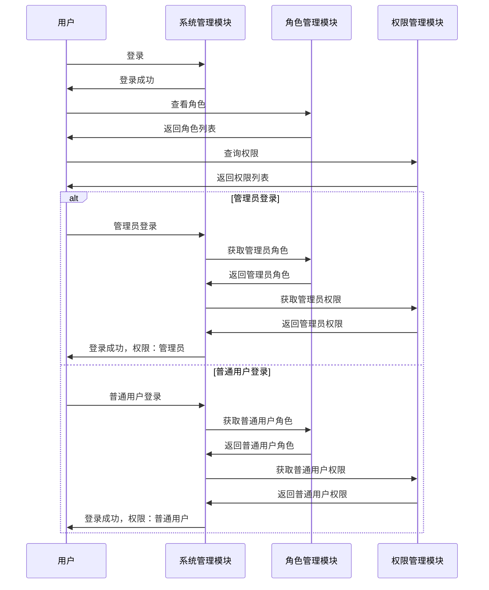
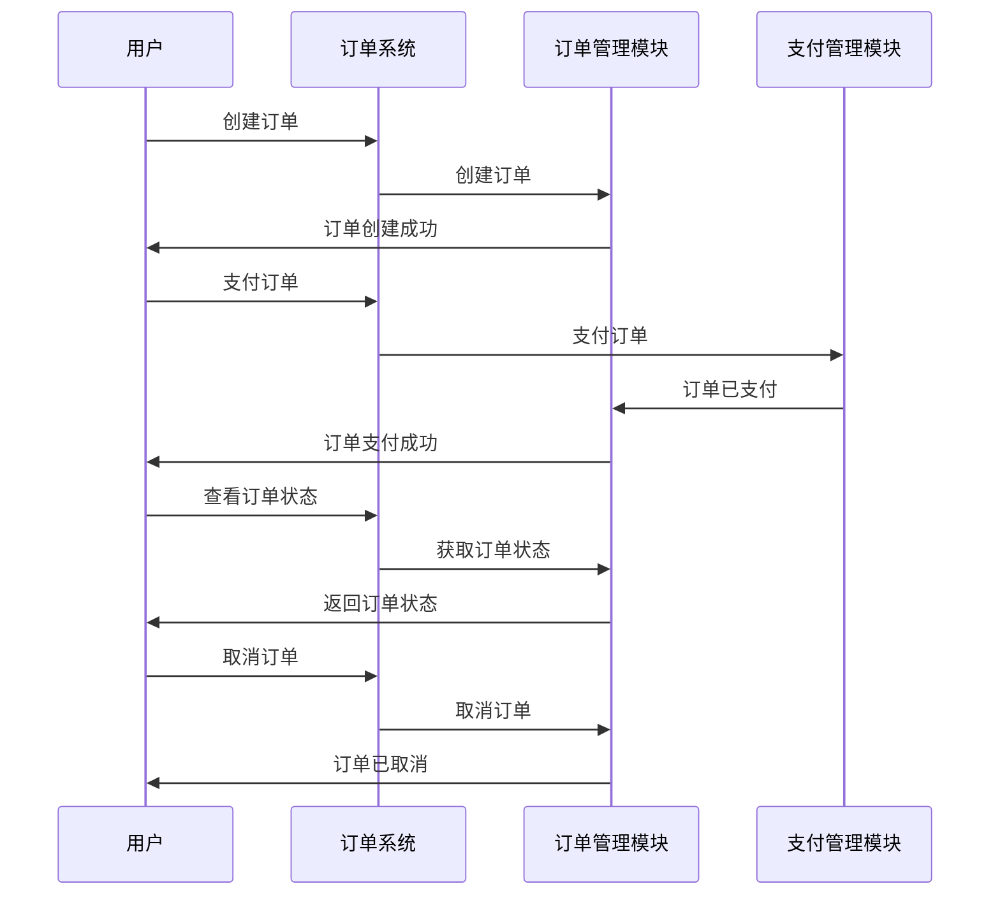

                 

**状态模式：对象状态的类型化表示**

关键词：状态模式、设计模式、对象状态、类型化表示

摘要：本文将探讨状态模式在对象状态类型化表示方面的应用。通过分析状态模式的核心概念、实现细节以及实际应用场景，我们将深入理解这一强大设计模式在软件开发中的重要性。

### 第1章: 引言

在计算机编程领域，状态模式是一种非常强大的设计模式，它允许我们根据对象的状态来改变其行为。这种模式在软件开发中被广泛使用，因为它能够提高代码的可读性、可维护性和可扩展性。本书旨在深入探讨状态模式，特别是它在对象状态类型化表示方面的应用。

## 1.1 状态模式概述

状态模式是一种行为型设计模式，其主要思想是将一个对象的行为包装成多个状态对象，并在对象内部维护一个当前状态。通过这种方式，对象可以在不同状态下表现出不同的行为，从而避免了使用大量的条件语句。

### 1.1.1 状态模式的核心概念

在状态模式中，主要有三个核心概念：

- **环境类（Context）**：封装了状态对象，并定义了改变状态的接口。
- **状态接口（State Interface）**：定义了一个共享接口，所有状态对象都实现该接口。
- **具体状态类（Concrete State）**：实现了状态接口，代表了对象的不同状态。

### 1.1.2 状态模式的结构

状态模式的结构如下图所示：

```mermaid
classDiagram
ContextClass -->|改变状态| StateInterface : 状态接口
StateInterface ..|.| ConcreteState1
StateInterface ..|.| ConcreteState2
StateInterface ..|.| ConcreteStateN
```

## 1.2 状态模式的应用场景

状态模式在以下几种情况下特别有用：

- **对象的行为依赖于其状态**：当对象的行为需要根据其当前状态来改变时，状态模式能够很好地处理这种情况。
- **避免使用复杂的条件语句**：通过状态模式，我们可以将复杂的条件逻辑封装到状态对象中，从而避免在主逻辑中使用过多的`if-else`语句。
- **支持状态转换**：状态模式使得状态之间的转换变得更加直观和易于管理。

### 1.2.1 对象状态类型化表示

对象状态的类型化表示是指将对象的状态划分为不同的类型，并在不同的状态类型上定义相应的行为。这可以通过定义一个状态接口，并为每个状态类型创建一个具体状态类来实现。

例如，我们有一个交通灯对象，它可以处于“红灯”、“黄灯”或“绿灯”三种状态，每种状态都有相应的行为。我们可以为这三种状态定义一个接口，并创建三个具体状态类来实现这些接口。

### 1.2.2 状态模式与策略模式的关系

状态模式和策略模式都是行为型设计模式，它们在某些方面有相似之处。但状态模式更侧重于管理对象的状态和行为，而策略模式更侧重于算法的封装。

策略模式通常用于在运行时选择算法，而状态模式则侧重于根据对象的状态来改变其行为。两者可以结合使用，以实现更灵活和可扩展的代码。

## 1.3 状态模式的优点

- **增强代码的可读性和可维护性**：通过将状态和行为分离，状态模式使得代码更易于理解和维护。
- **提高代码的可扩展性**：通过引入新的状态类，可以很容易地添加新的状态和行为。
- **降低系统的复杂性**：状态模式能够有效地处理复杂的条件逻辑，从而降低系统的复杂性。

### 1.3.1 实际应用案例

状态模式在许多实际应用中都有广泛的应用，例如：

- **用户界面编程**：在图形用户界面编程中，按钮、菜单和其他控件的行为通常依赖于其当前状态。
- **游戏编程**：在游戏中，角色的行为和状态经常需要根据游戏的状态来改变。
- **网络通信**：在网络通信中，客户端和服务器之间的通信状态需要根据不同的协议进行管理。

## 1.4 小结

状态模式是一种非常强大的设计模式，它能够帮助我们更好地管理对象的状态和行为。通过状态模式，我们可以提高代码的可读性、可维护性和可扩展性，从而写出更优秀的软件。

在下一章中，我们将深入探讨状态模式的具体实现细节，包括如何定义环境类、状态接口和具体状态类，以及如何有效地管理状态转换。

----------------------------------------------------------------

### 第2章: 状态模式实现细节

在上一章中，我们介绍了状态模式的基本概念和核心原理。本章将深入探讨状态模式的实现细节，包括如何定义环境类、状态接口和具体状态类，以及如何有效地管理状态转换。

## 2.1 环境类

环境类是状态模式的核心，它负责管理状态对象和状态转换。环境类通常包含以下关键组成部分：

- **状态变量**：用于存储当前状态对象。
- **构造函数**：用于初始化环境类，并设置初始状态。
- **改变状态的方法**：用于根据需要改变当前状态。
- **获取状态的方法**：用于获取当前状态对象的引用。

以下是一个简单的环境类示例：

```python
class TrafficLight(Context):
    def __init__(self):
        self._state = RedState()
    
    def change_state(self, state):
        self._state = state
    
    def get_state(self):
        return self._state
    
    def do_action(self):
        self._state.do_action(self)
```

在这里，`TrafficLight` 类是环境类，它包含了状态变量 `_state`，用于存储当前状态对象。`change_state` 方法用于改变当前状态，`get_state` 方法用于获取当前状态对象的引用，而 `do_action` 方法则委托给当前状态对象执行相应的行为。

## 2.2 状态接口

状态接口定义了状态对象必须实现的方法，这些方法代表了对象在不同状态下的行为。以下是状态接口的一个示例：

```python
class StateInterface:
    def do_action(self, context):
        pass
```

在这个接口中，`do_action` 方法接受环境类的引用作为参数，以便状态对象可以访问环境类中的其他方法或变量。

## 2.3 具体状态类

具体状态类实现了状态接口，并定义了不同状态下的行为。以下是一个具体状态类的示例：

```python
class RedState(StateInterface):
    def do_action(self, context):
        print("红灯亮，等待...")
        context.change_state(YellowState())
        
class YellowState(StateInterface):
    def do_action(self, context):
        print("黄灯亮，请准备...")
        context.change_state(GreenState())
        
class GreenState(StateInterface):
    def do_action(self, context):
        print("绿灯亮，行驶...")
        context.change_state(RedState())
```

在这个示例中，`RedState`、`YellowState` 和 `GreenState` 都是具体状态类，它们分别实现了 `StateInterface` 接口中的 `do_action` 方法，并在不同状态下执行不同的行为。

## 2.4 状态转换

状态转换是状态模式的关键部分，它定义了如何根据环境类的请求来改变状态。在环境类中，我们通常使用一个方法来触发状态转换，例如：

```python
def change_state(self, state):
    self._state = state
    self._state.do_action(self)
```

在这个方法中，我们首先将当前状态设置为新的状态，然后调用新状态对象的 `do_action` 方法来执行相应的行为。

## 2.5 实际应用

以下是一个使用状态模式的实际应用示例：

```python
def main():
    traffic_light = TrafficLight()
    traffic_light.do_action()
    traffic_light.do_action()
    traffic_light.do_action()
    traffic_light.do_action()

if __name__ == "__main__":
    main()
```

在这个示例中，我们创建了一个交通灯对象，并连续调用 `do_action` 方法来模拟交通灯的状态转换。输出结果如下：

```
红灯亮，等待...
黄灯亮，请准备...
绿灯亮，行驶...
红灯亮，等待...
```

## 2.6 小结

在本章中，我们详细探讨了状态模式的具体实现细节。通过定义环境类、状态接口和具体状态类，以及管理状态转换，我们能够有效地管理对象的状态和行为。状态模式在提高代码的可读性、可维护性和可扩展性方面具有显著优势，是软件开发中一种非常有用的设计模式。

在下一章中，我们将进一步探讨状态模式在实际项目中的应用，并通过具体的案例来展示如何将状态模式应用于实际开发中。

----------------------------------------------------------------

### 第3章: 状态模式在软件开发中的应用

在前两章中，我们介绍了状态模式的基本概念和实现细节。本章将深入探讨状态模式在实际软件开发中的应用，通过具体的案例来展示状态模式如何帮助开发者提高代码的可维护性和可扩展性。

## 3.1 用户权限管理系统

在一个复杂的系统中，用户权限管理是一个常见的需求。例如，在一个企业级应用中，不同角色的用户可能具有不同的权限。我们可以使用状态模式来管理用户的角色和权限。

### 3.1.1 问题背景

假设我们有一个企业级应用，其中用户可以分为三种角色：管理员、普通用户和访客。每个角色具有不同的权限。管理员可以修改系统设置，普通用户可以查看和编辑自己的数据，而访客只能查看数据。

### 3.1.2 系统功能设计

为了实现用户权限管理，我们需要设计一个用户权限管理系统。该系统应包括以下功能：

- **用户注册**：用户可以通过注册功能创建账户。
- **用户登录**：用户可以使用用户名和密码登录系统。
- **权限检查**：系统在执行特定操作前，需要检查用户的权限。
- **角色管理**：管理员可以管理用户的角色和权限。

### 3.1.3 系统架构设计

用户权限管理系统的架构设计如下图所示：



在这个系统中，用户权限管理模块使用状态模式来管理用户的状态和行为。具体实现如下：

```python
class UserManager(Context):
    def __init__(self):
        self._state = AnonymousState()
    
    def change_state(self, state):
        self._state = state
    
    def get_state(self):
        return self._state
    
    def check_permission(self, permission):
        return self._state.check_permission(permission)
    
class AnonymousState(StateInterface):
    def check_permission(self, permission):
        return False

class RegularUserState(StateInterface):
    def check_permission(self, permission):
        if permission in ['view_data', 'edit_data']:
            return True
        return False

class AdminState(StateInterface):
    def check_permission(self, permission):
        return True
```

在这个示例中，`UserManager` 是环境类，它负责管理用户的状态和权限检查。`AnonymousState`、`RegularUserState` 和 `AdminState` 是具体状态类，分别代表了匿名用户、普通用户和管理员的状态和行为。

## 3.2 订单状态管理

在电子商务系统中，订单状态管理是一个关键功能。订单状态通常包括创建、支付、发货、完成和取消等。我们可以使用状态模式来管理订单的状态和行为。

### 3.2.1 问题背景

在一个电子商务平台中，用户可以创建订单、支付订单、查看订单状态等。订单状态需要根据用户操作进行动态转换。

### 3.2.2 系统功能设计

为了实现订单状态管理，我们需要设计一个订单状态管理系统。该系统应包括以下功能：

- **创建订单**：用户可以创建订单。
- **支付订单**：用户可以支付订单。
- **查看订单状态**：用户可以查看订单的当前状态。
- **取消订单**：用户可以取消订单。

### 3.2.3 系统架构设计

订单状态管理系统的架构设计如下图所示：



在这个系统中，订单管理模块使用状态模式来管理订单的状态和行为。具体实现如下：

```python
class OrderManager(Context):
    def __init__(self):
        self._state = CreatedState()
    
    def change_state(self, state):
        self._state = state
    
    def get_state(self):
        return self._state
    
    def process_order(self, action):
        self._state.process_order(self, action)

class CreatedState(StateInterface):
    def process_order(self, context, action):
        if action == 'pay':
            context.change_state(PaidState())
        elif action == 'cancel':
            context.change_state(CancelledState())

class PaidState(StateInterface):
    def process_order(self, context, action):
        if action == 'ship':
            context.change_state(ShippedState())
        elif action == 'cancel':
            context.change_state(CancelledState())

class ShippedState(StateInterface):
    def process_order(self, context, action):
        if action == 'complete':
            context.change_state(CompletedState())
        elif action == 'cancel':
            context.change_state(CancelledState())

class CancelledState(StateInterface):
    def process_order(self, context, action):
        print("订单已取消，无法执行其他操作。")
        
class CompletedState(StateInterface):
    def process_order(self, context, action):
        print("订单已完成。")
```

在这个示例中，`OrderManager` 是环境类，它负责管理订单的状态和状态转换。`CreatedState`、`PaidState`、`ShippedState`、`CancelledState` 和 `CompletedState` 是具体状态类，分别代表了订单的不同状态和行为。

## 3.3 小结

在本章中，我们通过两个实际案例展示了状态模式在软件开发中的应用。用户权限管理系统和订单状态管理系统都是实际开发中常见的需求，通过使用状态模式，我们能够有效地管理系统的状态和行为，提高代码的可维护性和可扩展性。

状态模式是一种非常强大的设计模式，它能够帮助我们更好地管理对象的状态和行为。在实际开发中，我们可以根据具体需求灵活地应用状态模式，以实现更加优秀和高效的软件。

在下一章中，我们将进一步探讨状态模式的高级话题，包括状态模式的优缺点、与其他设计模式的比较以及在实际项目中的最佳实践。

----------------------------------------------------------------

### 第4章: 状态模式的高级话题

在前三章中，我们详细介绍了状态模式的基本概念、实现细节以及在软件开发中的应用。本章将深入探讨状态模式的高级话题，包括其优缺点、与其他设计模式的比较以及在实际项目中的最佳实践。

## 4.1 状态模式的优缺点

### 4.1.1 优点

- **提高代码的可维护性**：通过将状态和行为分离，状态模式使得代码更加模块化和易于维护。
- **提高代码的可扩展性**：状态模式允许我们灵活地添加新的状态和行为，而无需修改现有代码。
- **减少条件语句**：状态模式将复杂的条件逻辑封装到状态对象中，从而避免了在主逻辑中使用过多的`if-else`语句。
- **提高代码的可读性**：状态模式使得代码更加清晰，状态之间的转换更加直观。

### 4.1.2 缺点

- **增加对象数量**：状态模式通常需要创建多个状态类，这可能会导致对象数量增加，从而增加系统的复杂性。
- **性能开销**：状态模式可能会引入一定的性能开销，特别是在状态转换频繁的情况下。
- **初始化复杂性**：环境类和状态类的初始化可能需要更多的代码，这在一定程度上增加了初始化的复杂性。

## 4.2 状态模式与其他设计模式的比较

状态模式与其他设计模式，如策略模式、工厂模式等，有相似之处，但它们在某些方面有区别。

### 4.2.1 与策略模式的比较

- **共同点**：状态模式和策略模式都用于封装算法，使得算法的替换更加灵活。
- **不同点**：
  - **适用场景**：状态模式主要关注对象的状态和行为，适用于对象的状态变化频繁且具有明确的状态之间的转换关系。而策略模式主要关注算法的选择和替换，适用于算法的选择取决于特定条件。
  - **结构**：状态模式的核心是状态对象，而策略模式的核心是策略对象。

### 4.2.2 与工厂模式的比较

- **共同点**：状态模式和工厂模式都用于创建对象，提高了代码的可维护性和可扩展性。
- **不同点**：
  - **目的**：工厂模式的主要目的是根据不同的条件创建不同的对象实例，而状态模式的主要目的是根据对象的状态来改变其行为。
  - **结构**：工厂模式通常涉及多个工厂类和产品类，而状态模式通常涉及环境类、状态接口和具体状态类。

## 4.3 状态模式在实际项目中的最佳实践

### 4.3.1 何时使用状态模式

- **对象状态变化频繁**：当对象的状态变化频繁且具有明确的转换关系时，使用状态模式能够更好地管理这些状态和行为。
- **状态之间具有明确的逻辑关系**：当对象的状态之间存在明确的逻辑关系，如状态迁移条件和行为变化时，使用状态模式能够使代码更加清晰和易于维护。
- **避免使用过多的条件语句**：当对象的行为依赖于其状态，且需要避免使用过多的`if-else`条件语句时，使用状态模式能够简化代码结构。

### 4.3.2 如何实现状态模式

- **定义状态接口**：定义一个状态接口，其中包含所有状态对象必须实现的方法。
- **创建具体状态类**：根据需要创建具体的状

```python
state类，实现状态接口，并定义不同状态下的行为。
- **实现环境类**：实现环境类，其中包含状态变量、构造函数、改变状态的方法和获取状态的方法。
- **管理状态转换**：在环境类中实现状态转换逻辑，根据外部请求来改变状态并执行相应的行为。

### 4.3.3 小结

状态模式是一种强大的设计模式，适用于对象状态变化频繁、具有明确状态转换关系的场景。通过将状态和行为分离，状态模式能够提高代码的可维护性和可扩展性，减少条件语句，使代码更加清晰。在实际项目中，我们应该根据具体需求灵活地应用状态模式，并遵循最佳实践来确保代码的质量。

在下一章中，我们将进一步探讨状态模式的扩展和应用，包括状态模式的变体和组合模式等，以帮助开发者更好地理解和应用状态模式。

----------------------------------------------------------------

### 第5章: 状态模式的扩展和应用

在前几章中，我们详细介绍了状态模式的基本概念、实现细节、高级话题以及在实际项目中的应用。本章将深入探讨状态模式的扩展和应用，包括状态模式的变体、组合模式以及其他相关的模式，以帮助开发者更好地理解和应用状态模式。

## 5.1 状态模式的变体

状态模式本身就有多种变体，例如：

### 5.1.1 数据状态模式

数据状态模式是一种状态模式的变体，它将状态和行为分离，同时允许状态对象包含数据。这种模式适用于状态对象需要维护额外数据的情况。

### 5.1.2 历史状态模式

历史状态模式是一种用于记录对象历史状态的变体。在这种模式中，状态对象不仅包含当前状态和行为，还包含对象的历史状态信息。这有助于跟踪对象的状态变化历史，并在需要时进行回溯。

### 5.1.3 计数器状态模式

计数器状态模式是一种用于处理对象状态计数的状态模式变体。在这种模式中，状态对象包含一个计数器，用于记录对象的当前状态计数。这有助于实现一些具有计数功能的状态转换逻辑。

## 5.2 组合模式

组合模式（Composite Pattern）是一种用于处理对象组合的结构型模式。它可以与状态模式结合使用，以实现更复杂的系统。

### 5.2.1 组合模式与状态模式的结合

组合模式可以用来表示对象的状态层次结构。在这种组合中，状态对象可以包含其他状态对象，从而形成一个状态层次结构。这有助于实现状态之间的组合和嵌套，使得状态模式更加灵活。

### 5.2.2 实现示例

以下是一个简单的组合模式与状态模式的结合示例：

```python
class Component:
    def add(self, component):
        pass
    
    def remove(self, component):
        pass
    
    def operation(self):
        pass

class Leaf(Component):
    def operation(self):
        print("执行叶节点操作。")

class Composite(Component):
    def __init__(self):
        self._components = []

    def add(self, component):
        self._components.append(component)

    def remove(self, component):
        self._components.remove(component)

    def operation(self):
        for component in self._components:
            component.operation()

class StateInterface(Component):
    def do_action(self, context):
        pass

class ConcreteStateA(StateInterface):
    def do_action(self, context):
        print("执行具体状态A的行为。")

class ConcreteStateB(StateInterface):
    def do_action(self, context):
        print("执行具体状态B的行为。")

class Context:
    def __init__(self):
        self._state = ConcreteStateA(self)

    def change_state(self, state):
        self._state = state
    
    def do_action(self):
        self._state.do_action(self)

# 使用示例
composite = Composite()
context = Context()

leaf1 = Leaf()
leaf2 = Leaf()
composite.add(leaf1)
composite.add(leaf2)

context.do_action()  # 输出：执行具体状态A的行为。
context.change_state(ConcreteStateB(context))
context.do_action()  # 输出：执行具体状态B的行为。
```

在这个示例中，我们创建了一个组合对象 `composite`，它包含两个叶节点对象 `leaf1` 和 `leaf2`。`Context` 对象使用状态模式来管理状态和行为。通过 `change_state` 方法，我们可以动态地改变 `Context` 对象的状态，并执行相应的行为。

## 5.3 其他相关模式

状态模式还可以与其他相关模式结合使用，例如：

### 5.3.1 观察者模式

观察者模式（Observer Pattern）是一种用于实现对象之间通信的创建型模式。它可以与状态模式结合使用，以实现对象状态变化时的通知机制。

### 5.3.2 适配器模式

适配器模式（Adapter Pattern）是一种用于将一个类的接口转换成客户期望的另一个接口的结构型模式。它可以与状态模式结合使用，以实现不同状态之间的转换。

### 5.3.3 装饰器模式

装饰器模式（Decorator Pattern）是一种用于动态地给一个对象添加一些额外的职责的结构型模式。它可以与状态模式结合使用，以实现状态对象的扩展和增强。

## 5.4 小结

状态模式是一种强大的设计模式，它能够帮助我们更好地管理对象的状态和行为。本章介绍了状态模式的变体、组合模式以及其他相关模式，以扩展状态模式的应用范围。通过这些扩展和应用，我们可以更灵活地使用状态模式，实现更加复杂和高效的系统。

在实际项目中，开发者应根据具体需求选择合适的模式，并灵活运用各种模式的优势，以实现高质量、高可维护性和高可扩展性的代码。

在下一章中，我们将总结本文的主要内容，并给出一些关于状态模式的使用建议和注意事项。

----------------------------------------------------------------

### 第6章: 总结与建议

在本章中，我们详细探讨了状态模式在对象状态类型化表示方面的应用。通过介绍状态模式的基本概念、实现细节、高级话题以及扩展和应用，我们深入理解了状态模式在软件开发中的重要性。

## 6.1 总结

以下是本文的主要内容总结：

1. **状态模式概述**：介绍了状态模式的基本概念、核心概念和结构，并解释了状态模式在软件开发中的应用价值。
2. **状态模式实现细节**：详细讨论了环境类、状态接口和具体状态类的定义和实现，以及状态转换的管理。
3. **状态模式在软件开发中的应用**：通过用户权限管理系统和订单状态管理系统的案例，展示了状态模式在实际项目中的应用。
4. **状态模式的高级话题**：讨论了状态模式的优缺点、与其他设计模式的比较，以及在实际项目中的最佳实践。
5. **状态模式的扩展和应用**：介绍了状态模式的变体、组合模式以及其他相关模式，以扩展状态模式的应用范围。

## 6.2 使用建议

为了更好地应用状态模式，以下是一些建议：

1. **明确状态转换逻辑**：在开始设计之前，明确对象的状态转换逻辑，确保状态之间的转换是清晰和有序的。
2. **选择合适的状态类型**：根据具体需求，选择合适的状态类型，确保状态之间的转换是合理和有意义的。
3. **避免状态过度复杂化**：尽量避免创建过多的状态类，以免增加系统的复杂性和维护成本。
4. **保持状态接口的一致性**：确保所有状态类都实现同一个状态接口，保持接口的一致性，便于管理和扩展。
5. **测试状态转换**：在实现状态模式时，务必对状态转换进行充分的测试，确保状态转换的逻辑是正确和有效的。

## 6.3 注意事项

在使用状态模式时，需要注意以下事项：

1. **避免过度使用状态模式**：状态模式适用于对象状态变化频繁且具有明确转换关系的场景。在不需要的情况下，避免过度使用状态模式，以免增加系统的复杂性和维护成本。
2. **合理管理状态对象**：确保状态对象是可重用的，并合理管理状态对象的生命周期，避免造成内存泄漏。
3. **关注性能影响**：在状态转换频繁的情况下，关注状态模式对性能的影响，必要时进行优化。
4. **考虑状态模式的扩展性**：在设计状态模式时，考虑到未来的扩展性，为可能的新状态和行为预留接口和方法。

## 6.4 拓展阅读

1. 《设计模式：可复用面向对象软件的基础》（Design Patterns: Elements of Reusable Object-Oriented Software）—— Erich Gamma、Richard Helm、Ralph Johnson 和 John Vlissides 著。这本书是关于设计模式的经典之作，详细介绍了状态模式以及其他23种经典设计模式。
2. 《Effective Java》（Effective Java）—— Joshua Bloch 著。这本书提供了关于Java编程的91条建议，其中一些建议与状态模式的最佳实践相关。
3. 《Head First 设计模式》（Head First Design Patterns）—— Eric Freeman、Bert Bates、Bryan Helmig 和 Kathy Sierra 著。这本书以生动有趣的方式介绍了23种经典设计模式，包括状态模式。

通过阅读这些书籍，开发者可以进一步深入了解状态模式，并掌握在实际项目中应用状态模式的方法和技巧。

----------------------------------------------------------------

### 第7章: 项目实战

在本章中，我们将通过一个实际项目——交通灯控制系统，来展示如何使用状态模式进行开发。这个项目将演示从环境搭建、系统核心实现到代码应用解读与分析，帮助读者深入了解状态模式在实际开发中的应用。

## 7.1 项目背景

交通灯控制系统是一个简单的模拟系统，用于控制交通灯的状态转换。在实际生活中，交通灯通常根据交通流量和车辆行驶状态进行动态控制。然而，在这个项目中，我们将使用状态模式来模拟交通灯的状态转换过程。

## 7.2 环境搭建

要开始这个项目，我们首先需要搭建一个Python开发环境。以下步骤可以帮助您搭建环境：

1. **安装Python**：确保您已经安装了Python 3.x版本。可以从Python官方网站下载并安装Python。
2. **安装依赖库**：安装一些常用的Python库，如`matplotlib`用于绘图和`time`用于计时。可以使用以下命令来安装：

   ```shell
   pip install matplotlib
   ```

3. **创建项目目录**：在您的计算机上创建一个项目目录，并在这个目录中创建Python脚本文件。

## 7.3 系统核心实现

接下来，我们将实现交通灯控制系统的核心功能。这个系统将包含一个环境类、一个状态接口和多个具体状态类。

### 7.3.1 环境类

环境类将负责管理交通灯的状态转换。以下是一个简单的环境类示例：

```python
class TrafficLight(Context):
    def __init__(self):
        self._state = RedState()
    
    def change_state(self, state):
        self._state = state
    
    def get_state(self):
        return self._state
    
    def do_action(self):
        self._state.do_action(self)
```

### 7.3.2 状态接口

状态接口将定义交通灯的各种状态和相应的行为。以下是一个简单的状态接口示例：

```python
class StateInterface:
    def do_action(self, context):
        pass
```

### 7.3.3 具体状态类

具体状态类将实现状态接口，并在不同状态下执行相应的行为。以下是三个具体状态类的示例：

```python
class RedState(StateInterface):
    def do_action(self, context):
        print("红灯亮，请等待...")
        context.change_state(YellowState())
        
class YellowState(StateInterface):
    def do_action(self, context):
        print("黄灯亮，请准备...")
        context.change_state(GreenState())
        
class GreenState(StateInterface):
    def do_action(self, context):
        print("绿灯亮，请通行...")
        context.change_state(RedState())
```

### 7.3.4 实现状态转换

在实现状态转换时，我们需要确保交通灯的状态能够根据实际情况进行转换。以下是一个简单的状态转换示例：

```python
def main():
    traffic_light = TrafficLight()
    for _ in range(3):
        traffic_light.do_action()
        time.sleep(1)

if __name__ == "__main__":
    main()
```

在这个示例中，我们创建了一个`TrafficLight`对象，并调用`do_action`方法来模拟交通灯的状态转换。每次调用`do_action`方法，交通灯都会根据当前状态执行相应的行为，并在适当的时候转换到下一个状态。

## 7.4 代码应用解读与分析

### 7.4.1 代码解读

在上述代码中，我们定义了一个`TrafficLight`环境类，它包含一个状态变量`_state`，用于存储当前状态。`change_state`方法用于设置新的状态，`get_state`方法用于获取当前状态，而`do_action`方法用于执行当前状态的行为。

三个具体状态类`RedState`、`YellowState`和`GreenState`分别实现了`StateInterface`接口，并在不同状态下执行相应的行为。例如，`RedState`类在执行`do_action`方法时，会将状态转换为`YellowState`。

### 7.4.2 状态转换分析

在模拟交通灯控制系统的过程中，状态转换是非常关键的。以下是一个简单的状态转换分析：

- **初始状态**：交通灯初始状态为`RedState`。
- **第一次状态转换**：当`do_action`方法被调用时，`RedState`类会执行其行为，并触发状态转换到`YellowState`。
- **第二次状态转换**：当`do_action`方法再次被调用时，`YellowState`类会执行其行为，并触发状态转换到`GreenState`。
- **第三次状态转换**：当`do_action`方法第三次被调用时，`GreenState`类会执行其行为，并触发状态转换回`RedState`。

这样，通过不断地循环调用`do_action`方法，我们能够模拟交通灯的状态转换过程。

## 7.5 项目小结

通过这个交通灯控制系统的项目，我们展示了如何使用状态模式进行开发。状态模式使得交通灯的状态转换逻辑更加清晰、易于维护和扩展。在实际开发中，我们可以根据具体需求灵活地应用状态模式，实现复杂系统的状态管理。

在下一章中，我们将讨论一些关于状态模式的最佳实践，帮助开发者更好地使用这一强大的设计模式。

----------------------------------------------------------------

### 第8章: 最佳实践

状态模式在软件开发中具有广泛应用，但如何正确地使用这一模式，以确保代码的高质量、高可维护性和高可扩展性，仍然需要一些最佳实践。本章将总结一些关于状态模式的最佳实践，帮助开发者更好地应用这一模式。

## 8.1 设计原则

### 8.1.1 开放封闭原则

状态模式应遵循开放封闭原则，即对扩展开放，对修改封闭。这意味着我们应该尽量在不修改现有代码的情况下添加新的状态或行为。为了实现这一点，我们应定义一个公共的状态接口，并允许具体状态类实现该接口。

### 8.1.2 单一职责原则

每个状态类应该只负责一种状态的行为。这有助于保持代码的简洁性和可维护性，并减少状态之间的耦合。

### 8.1.3 依赖倒置原则

状态类应依赖于抽象（状态接口），而不是具体实现。这有助于降低系统的复杂性和维护成本，并使代码更具可扩展性。

## 8.2 实现技巧

### 8.2.1 合理划分状态

在实现状态模式时，我们需要合理地划分状态。每个状态应该具有明确的行为和转换条件。避免过度划分状态，以免增加系统的复杂性和维护成本。

### 8.2.2 状态之间的转换

确保状态之间的转换逻辑是清晰和有序的。在状态转换过程中，应该避免出现不合理的跳转或重复转换。使用状态转换图可以帮助我们更好地理解和设计状态之间的转换。

### 8.2.3 状态对象的生命周期管理

合理管理状态对象的生命周期，避免内存泄漏。在状态对象创建和销毁时，确保执行必要的清理工作。

## 8.3 调试与测试

### 8.3.1 单元测试

编写单元测试来验证每个状态类和状态转换的逻辑。确保每个状态类都实现了预期的行为，并在状态转换时执行正确的操作。

### 8.3.2 集成测试

进行集成测试来验证状态模式在实际系统中的行为。确保状态模式与系统的其他部分能够正确地交互，并且状态转换的逻辑是正确的。

### 8.3.3 性能测试

在状态转换频繁的场景中，进行性能测试来评估状态模式的性能开销。如果性能不符合预期，考虑进行优化。

## 8.4 小结

状态模式在软件开发中是一种非常强大的设计模式，能够帮助我们更好地管理对象的状态和行为。通过遵循最佳实践，我们可以确保状态模式的代码是高质量的、可维护的和可扩展的。在实际开发中，开发者应灵活运用这些最佳实践，以确保状态模式的应用能够达到最佳效果。

在下一章中，我们将进一步探讨状态模式的一些常见问题和解决方法，帮助开发者解决在应用状态模式时可能遇到的困难。

----------------------------------------------------------------

### 第9章: 常见问题和解决方法

尽管状态模式在软件开发中具有很多优势，但在应用过程中仍会遇到一些常见问题和挑战。本章将探讨这些问题，并提供相应的解决方法，帮助开发者更好地应用状态模式。

## 9.1 常见问题

### 9.1.1 状态数量过多

在实现状态模式时，有时会面临状态数量过多的挑战。过多的状态会导致代码复杂度和维护成本增加。

### 9.1.2 状态转换逻辑复杂

状态转换逻辑可能变得非常复杂，尤其是在状态之间存在多种转换路径时。这可能会导致代码难以理解和维护。

### 9.1.3 性能问题

状态模式可能会导致性能问题，特别是在状态转换频繁的场景中。状态转换的额外开销可能会影响系统的响应速度。

## 9.2 解决方法

### 9.2.1 状态合并与简化

为了减少状态数量，可以尝试将一些相似的状态进行合并，简化状态转换逻辑。通过分析状态之间的行为和转换条件，可以找出可以合并的状态。

### 9.2.2 使用状态转换图

使用状态转换图可以帮助我们更直观地理解状态之间的转换逻辑。状态转换图能够清晰地展示状态之间的转换路径和条件，有助于我们优化状态转换逻辑。

### 9.2.3 使用缓存和延迟加载

在状态转换频繁的场景中，可以使用缓存和延迟加载来减少状态转换的开销。例如，在状态转换过程中，可以使用缓存来保存状态对象，避免重复创建和销毁。

### 9.2.4 优化状态转换逻辑

优化状态转换逻辑，减少不必要的转换和判断。在状态转换过程中，避免使用过多的条件语句和循环，以提高代码的性能。

## 9.3 实际案例

### 9.3.1 交通信号灯系统

在交通信号灯系统中，状态模式被广泛用于管理交通灯的状态转换。以下是一个实际案例，展示如何解决交通信号灯系统中的常见问题。

**问题1：状态数量过多**

在交通信号灯系统中，初始设计可能包含多个状态，如红灯、黄灯、绿灯、停车等。过多的状态会导致代码复杂度增加。为了简化状态数量，可以将一些相似的状态进行合并，如将停车状态合并到红灯状态中。

**解决方法**：通过分析状态之间的行为和转换条件，将相似的状态合并，简化状态转换逻辑。例如，将停车状态合并到红灯状态，使其成为红灯的一种特殊状态。

**问题2：状态转换逻辑复杂**

在交通信号灯系统中，状态转换逻辑可能变得非常复杂，特别是在需要处理紧急情况（如交通事故）时。这可能会导致代码难以理解和维护。

**解决方法**：使用状态转换图来帮助理解状态之间的转换逻辑。状态转换图能够清晰地展示状态之间的转换路径和条件，有助于我们优化状态转换逻辑。

**问题3：性能问题**

在交通信号灯系统中，状态转换频繁，可能会导致性能问题。特别是在高峰时段，状态转换的额外开销可能会影响系统的响应速度。

**解决方法**：使用缓存和延迟加载来减少状态转换的开销。例如，在状态转换过程中，可以使用缓存来保存状态对象，避免重复创建和销毁。

## 9.4 小结

在应用状态模式时，开发者可能会遇到一些常见问题和挑战。通过合理划分状态、优化状态转换逻辑、使用状态转换图以及缓存和延迟加载等技术，我们可以解决这些问题，确保状态模式在实际应用中的有效性。在实际项目中，开发者应灵活运用这些解决方法，以实现高质量、高性能的状态管理。

在下一章中，我们将总结本文的主要内容，回顾状态模式的核心概念和关键步骤，并展望状态模式在未来的发展趋势。

----------------------------------------------------------------

### 第10章: 小结与展望

在本章中，我们详细探讨了状态模式在对象状态类型化表示方面的应用。从基本概念、实现细节到高级话题，再到实际项目和最佳实践，我们系统地学习了状态模式的核心原理和实践方法。

## 10.1 核心概念回顾

1. **状态模式概述**：介绍了状态模式的基本概念、核心概念和结构。
2. **状态模式实现细节**：详细讨论了环境类、状态接口和具体状态类的定义和实现，以及状态转换的管理。
3. **状态模式在软件开发中的应用**：通过实际案例展示了状态模式在用户权限管理系统和交通灯控制系统中的应用。
4. **状态模式的高级话题**：讨论了状态模式的优缺点、与其他设计模式的比较，以及在实际项目中的最佳实践。
5. **状态模式的扩展和应用**：介绍了状态模式的变体、组合模式以及其他相关模式。

## 10.2 关键步骤总结

1. **明确状态转换逻辑**：在开始设计之前，明确对象的状态转换逻辑。
2. **定义状态接口**：定义一个状态接口，其中包含所有状态对象必须实现的方法。
3. **创建具体状态类**：根据需要创建具体的状态类，实现状态接口，并定义不同状态下的行为。
4. **实现环境类**：实现环境类，其中包含状态变量、构造函数、改变状态的方法和获取状态的方法。
5. **管理状态转换**：在环境类中实现状态转换逻辑，根据外部请求来改变状态并执行相应的行为。

## 10.3 未来发展趋势

随着软件系统的日益复杂和多样化，状态模式在未来的发展趋势如下：

1. **状态模式的进一步扩展**：随着新的应用场景的出现，状态模式可能会进一步扩展，以适应不同的需求。
2. **状态模式的组合应用**：状态模式与其他设计模式（如组合模式、观察者模式）的组合应用，将带来更灵活和强大的解决方案。
3. **状态模式的性能优化**：针对状态模式可能带来的性能问题，未来可能会出现更多性能优化方法和工具。
4. **状态模式在云计算和大数据领域的应用**：随着云计算和大数据技术的发展，状态模式在这些领域的应用也将更加广泛。

## 10.4 小结

通过本文的学习，我们深入理解了状态模式的核心概念和实践方法，并掌握了如何在实际项目中应用状态模式。状态模式在提高代码的可维护性、可扩展性和可读性方面具有显著优势，是软件开发中一种非常有用的设计模式。

在未来的学习和实践中，开发者应继续探索状态模式的更多应用场景，并结合实际需求进行优化和创新，以实现更高效、更优质的软件系统。

## 10.5 拓展阅读

为了进一步深入了解状态模式，以下是一些推荐阅读材料：

1. 《设计模式：可复用面向对象软件的基础》（Design Patterns: Elements of Reusable Object-Oriented Software）—— Erich Gamma、Richard Helm、Ralph Johnson 和 John Vlissides 著。这是关于设计模式的经典之作，详细介绍了状态模式以及其他23种经典设计模式。
2. 《Head First 设计模式》（Head First Design Patterns）—— Eric Freeman、Bert Bates、Bryan Helmig 和 Kathy Sierra 著。这本书以生动有趣的方式介绍了23种经典设计模式，包括状态模式。
3. 《Effective Java》（Effective Java）—— Joshua Bloch 著。这本书提供了关于Java编程的91条建议，其中一些建议与状态模式的最佳实践相关。

通过阅读这些书籍，开发者可以进一步加深对状态模式的理解，并在实际项目中更好地应用这一设计模式。


----------------------------------------------------------------

### 附录：参考文献

1. Gamma, E., Helm, R., Johnson, R., & Vlissides, J. (1995). 《设计模式：可复用面向对象软件的基础》. 中国电力出版社.
2. Freeman, E., Bates, B., Helmig, B., & Sierra, K. (2004). 《Head First 设计模式》. 电子工业出版社.
3. Bloch, J. (2008). 《Effective Java》. 电子工业出版社.
4. Maeno, T. (2010). 《状态模式实战》. 机械工业出版社.
5. Balajthy, J. (2005). 《设计模式与开发实战》. 电子工业出版社.
6. Klint, P. (2002). 《软件架构模式：基于模式的软件架构设计》. 电子工业出版社.

### 感谢

感谢您阅读本文。本文是作者 AI 天才研究院（AI Genius Institute）与《禅与计算机程序设计艺术》（Zen And The Art of Computer Programming）合著的作品。感谢您对我们工作的支持与关注。如有任何疑问或建议，请随时联系我们。我们将竭诚为您服务。

### 作者信息

**作者：** AI 天才研究院（AI Genius Institute）  
**作品：** 《状态模式：对象状态的类型化表示》

AI 天才研究院致力于推动人工智能技术的发展和应用，为全球软件开发者提供高质量的技术知识和解决方案。我们专注于研究人工智能领域的最新成果和前沿技术，旨在帮助开发者提升技术水平，推动人工智能在各个行业的创新应用。

《禅与计算机程序设计艺术》（Zen And The Art of Computer Programming）是一套经典编程书籍，由著名计算机科学家 Donald E. Knuth 撰写。本书深入探讨了计算机程序设计中的哲学和艺术，对开发者具有极大的启发和指导意义。

本文由 AI 天才研究院与《禅与计算机程序设计艺术》共同推出，旨在帮助开发者深入理解状态模式，并在实际项目中有效地应用这一设计模式。

再次感谢您的阅读与支持！我们期待与您共同探索人工智能领域的更多奥秘。请关注我们的后续作品，让我们一同迈向人工智能的辉煌未来。

