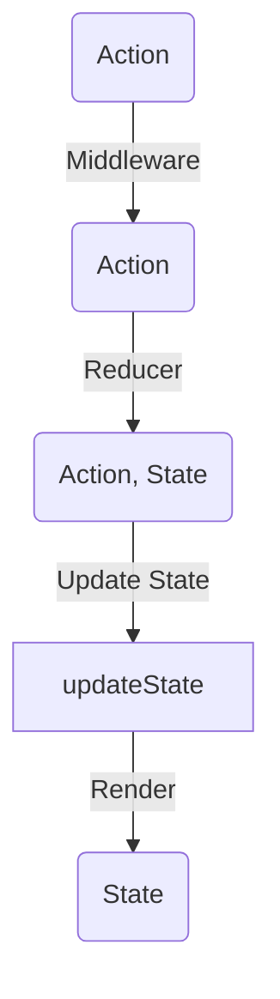
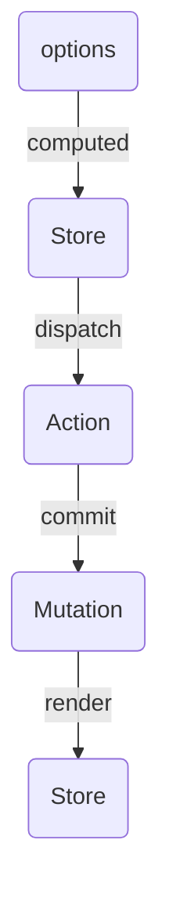
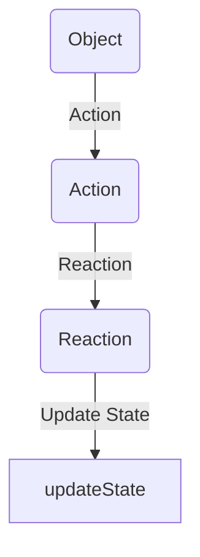
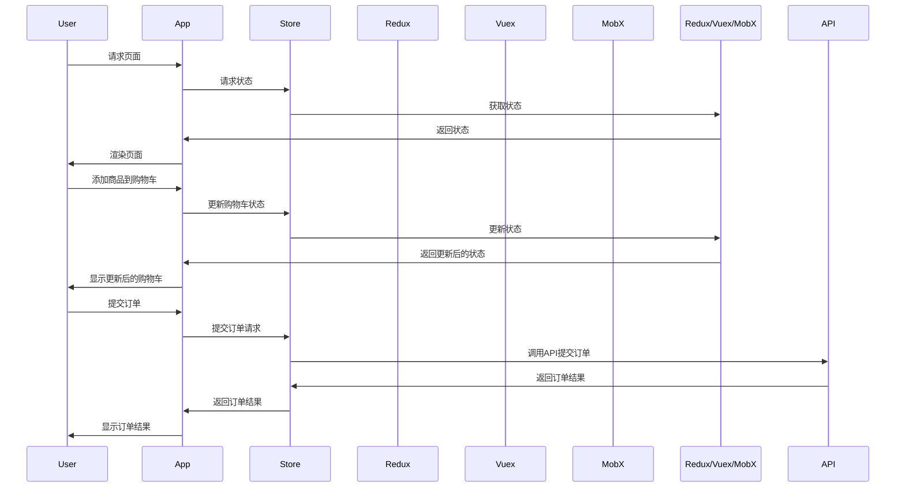
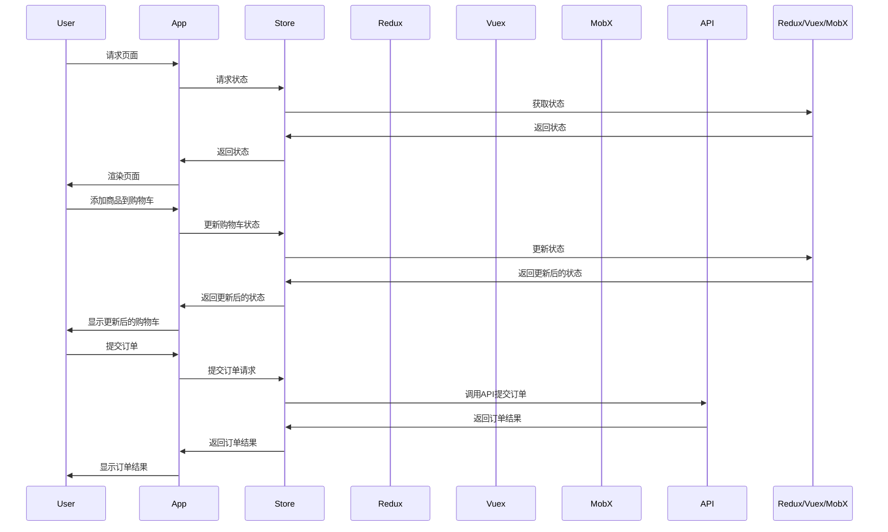

                 

### 第一部分：引言

#### 引言的目的

在现代化前端开发中，状态管理已成为必不可少的一部分。随着应用规模的扩大和复杂性的提升，管理应用中的状态变得愈加重要。Redux、Vuex和MobX是目前最为流行和广泛使用的三大状态管理库。它们各自拥有独特的特点和适用场景，但同时也存在一些差异和相似之处。本文旨在通过对Redux、Vuex与MobX的深入比较，帮助开发者更好地理解这三个库的工作原理、优劣之处，并选择最适合自己的状态管理方案。

#### 状态管理的核心问题

在现代前端应用中，状态管理主要解决以下问题：

- **状态集中管理**：避免因为状态分散而导致的数据不一致问题。
- **可预测的状态更新**：确保状态更新的可预测性和可控性。
- **组件间状态共享**：实现组件间状态的高效共享与通信。
- **状态持久化**：实现状态的本地存储，以维持用户会话。
- **调试与测试**：提供方便的调试和测试工具，提高开发效率。

#### Redux、Vuex与MobX的简介

- **Redux**：由Facebook开发，主要用于React应用的状态管理。它采用不可变数据结构，通过单一的源头（Store）来管理和更新状态。
- **Vuex**：由Vue官方推荐，用于Vue应用的状态管理。Vuex的设计理念相对传统，允许开发者使用类似MVC的思路来管理状态。
- **MobX**：由GitHub上的开发者社区开发，主要用于React和Vue等框架的状态管理。MobX采用响应式编程模型，通过自动追踪数据依赖来实现状态的自动更新。

### 第1章 状态管理技术概述

#### 1.1 问题背景

在传统的单页面应用（SPA）中，随着应用的不断增长，开发者可能会面临以下问题：

- **状态分散**：各个组件自行维护自己的状态，容易导致状态不一致。
- **状态更新不可预测**：组件之间通过直接修改状态或者使用第三方工具（如localStorage）来存储状态，导致状态更新的不可预测性。
- **组件间通信困难**：复杂的组件结构使得组件间的通信变得困难，难以保证数据的一致性。
- **调试困难**：应用状态复杂，调试过程困难，尤其是在多线程和异步操作中。

#### 1.2 问题解决

为了解决上述问题，开发者引入了状态管理技术：

- **状态集中管理**：通过单一的状态管理库（如Redux、Vuex或MobX），将全局状态集中管理，避免状态分散。
- **可预测的状态更新**：通过不可变数据结构和单向数据流，确保状态更新的可预测性。
- **组件间状态共享**：通过状态库提供的API，实现组件间状态的高效共享。
- **状态持久化**：通过状态库提供的工具，实现状态的本地存储和同步。
- **调试与测试**：提供开发者工具和断点调试功能，提高开发效率和代码质量。

#### 1.3 边界与外延

状态管理技术的边界主要涉及以下几个方面：

- **应用范围**：主要用于单页面应用（SPA）的前端状态管理，不涉及后端状态管理。
- **应用场景**：适用于中大型前端应用，对于小型应用可能过于复杂。
- **技术选型**：根据应用的具体需求和开发者的熟悉程度，选择合适的状态管理库。

#### 1.4 概念结构与核心要素组成

状态管理库的基本结构通常包括以下几个核心要素：

- **Store**：状态存储容器，用于集中管理应用状态。
- **Reducer**：状态更新函数，用于处理状态变更。
- **Action**：状态变更的派发者，用于触发状态更新。
- **Middleware**：中间件，用于扩展和增强状态更新的过程。

不同状态管理库在实现这些核心要素时，会有不同的设计理念和实现方式，这也是开发者需要关注和比较的重点。

## 第2章 Redux核心概念与原理

### 2.1 Redux的核心概念

Redux 是一个由 Facebook 开发的状态管理库，主要用于 React 应用的状态管理。Redux 的核心概念包括 Store、Action、Reducer、Middleware 等。

#### 2.1.1 Store

Store 是 Redux 的核心组件，用于存储和管理应用的状态。Store 是一个对象，它包含两个关键功能：

- **getState()**：获取当前应用的状态。
- **dispatch(action)**：派发动作（action），触发状态的更新。

#### 2.1.2 Action

Action 是一个包含类型（type）和数据的对象，用于描述状态变更的操作。Action 的目的是将数据从组件传递到 Redux Store。

```javascript
{
  type: 'INCREMENT',
  payload: { amount: 1 }
}
```

#### 2.1.3 Reducer

Reducer 是一个函数，用于处理 Action 并更新 Store 的状态。Reducer 函数通常具有以下签名：

```javascript
(previousState, action) => newState
```

#### 2.1.4 Middleware

Middleware 是一个扩展 Redux 功能的组件，它允许在 Action 被 dispatch 和 Reducer 执行之间插入自定义逻辑。Middleware 通常用于日志记录、异步操作等。

### 2.2 Redux的原理

Redux 的原理基于单向数据流，即所有状态变更必须通过 Action 来触发，并由 Reducer 来处理更新。以下是 Redux 的工作流程：

1. **组件 dispatch Action**：组件通过 `store.dispatch(action)` 来派发一个 Action。
2. **Middleware 处理 Action**：可选，如果有 Middleware，Action 将首先被 Middleware 处理。
3. **Reducer 更新状态**：Action 被传递到 Store 的 Reducer，Reducer 根据 Action 的 type 和 payload 更新状态。
4. **订阅者更新 UI**：由于 Redux Store 是单例，所有的组件都通过 `store.getState()` 来获取当前的状态，当状态更新时，UI 会自动更新。

### 2.3 Redux的工作流程

Redux 的工作流程可以概括为以下几个步骤：

1. **创建 Store**：通过 ` createStore(reducer)` 创建 Redux Store。
2. **组件 dispatch Action**：组件通过 `store.dispatch(action)` 派发 Action。
3. **Middleware 处理 Action**：如果有 Middleware，Action 将被 Middleware 处理。
4. **Reducer 更新状态**：Action 被传递到 Reducer，Reducer 更新状态。
5. **订阅者更新 UI**：组件通过 `store.getState()` 获取更新后的状态，并更新 UI。

### 2.4 Redux与React的结合

Redux 可以与 React 框架无缝结合，通过 React-Redux 库提供的一系列 API，可以实现 React 组件与 Redux Store 之间的交互。

#### 2.4.1 Provider

`<Provider store={store}>` 是 React-Redux 提供的组件，它用于将 Redux Store 传递给所有的子组件。

```jsx
import { Provider } from 'react-redux';
import store from './store';

function App() {
  return (
    <Provider store={store}>
      <YourApp />
    </Provider>
  );
}
```

#### 2.4.2 connect

`connect` 是 React-Redux 提供的高阶组件，用于将 Redux Store 中的状态和操作（actions）连接到 React 组件。

```jsx
import { connect } from 'react-redux';

const MyComponent = connect(
  mapStateToProps,
  mapDispatchToProps
)(MyConnectedComponent);
```

- **mapStateToProps**：将 Redux Store 中的状态映射到组件的 props。
- **mapDispatchToProps**：将 Redux 操作（actions）映射到组件的 props。

### 第3章 Vuex核心概念与原理

#### 3.1 Vuex的核心概念

Vuex 是 Vue 官方推荐的状态管理库，用于 Vue 应用的状态管理。Vuex 的核心概念包括 State、Getter、Mutation、Action、Module 等。

#### 3.1.1 State

State 是 Vuex 的核心组件，用于存储全局应用的状态。State 只能通过 Mutation 进行更新。

#### 3.1.2 Getter

Getter 是用于计算属性的函数，用于从 State 中派生新的状态。Getter 可以被组件使用，但不会修改 State。

#### 3.1.3 Mutation

Mutation 是用于更新 State 的唯一方式。Mutation 必须是同步的，即不能在 Mutation 中执行异步操作。

#### 3.1.4 Action

Action 是用于描述异步操作的函数，可以包含同步和异步逻辑。Action 通过 Commit 方法将数据更新到 State。

```javascript
actions: {
  asyncAdd(context) {
    // 异步操作逻辑
    context.commit('asyncAdd');
  }
}
```

#### 3.1.5 Module

Module 是用于将 Vuex 的状态、Getter、Mutation、Action 等组织到模块中，以便更好地管理应用的状态。

### 3.2 Vuex的原理

Vuex 的原理基于 Vue 的响应式系统，通过 Vue 的 Observer 机制实现 State 的响应式更新。Vuex 的工作流程可以概括为以下几个步骤：

1. **创建 Store**：通过 `new Vuex.Store(options)` 创建 Vuex Store。
2. **组件 computed 属性**：组件通过 computed 属性访问 Store 中的 State 和 Getter。
3. **组件 dispatch Action**：组件通过 `store.dispatch(action)` 派发 Action。
4. **执行 Mutation**：Action 将数据更新到 State，通过 `store.commit(mutation)` 执行 Mutation。
5. **更新 UI**：由于 Vue 的响应式系统，UI 将自动更新。

### 3.3 Vuex的工作流程

Vuex 的工作流程可以概括为以下几个步骤：

1. **创建 Store**：通过 `new Vuex.Store(options)` 创建 Vuex Store。
2. **组件 computed 属性**：组件通过 computed 属性访问 Store 中的 State 和 Getter。
3. **组件 dispatch Action**：组件通过 `store.dispatch(action)` 派发 Action。
4. **执行 Mutation**：Action 将数据更新到 State，通过 `store.commit(mutation)` 执行 Mutation。
5. **更新 UI**：由于 Vue 的响应式系统，UI 将自动更新。

### 3.4 Vuex与Vue的结合

Vuex 与 Vue 的结合非常紧密，Vuex 的设计理念与 Vue 的响应式系统相辅相成。以下是如何在 Vue 应用中使用 Vuex 的示例：

#### 3.4.1 创建 Store

```javascript
import Vue from 'vue';
import Vuex from 'vuex';

Vue.use(Vuex);

const store = new Vuex.Store({
  state: {
    count: 0
  },
  mutations: {
    increment(state) {
      state.count++;
    }
  },
  actions: {
    add(context) {
      context.commit('increment');
    }
  }
});
```

#### 3.4.2 组件使用 State 和 Getter

```vue
<template>
  <div>
    <p>Count: {{ count }}</p>
    <button @click="add">Add</button>
  </div>
</template>

<script>
import { mapState, mapActions } from 'vuex';

export default {
  computed: {
    ...mapState(['count'])
  },
  methods: {
    ...mapActions(['add'])
  }
};
</script>
```

通过上述示例，可以看到 Vuex 如何与 Vue 应用结合，实现状态的管理和组件间的通信。

### 第4章 MobX核心概念与原理

#### 4.1 MobX的核心概念

MobX 是一个响应式编程库，主要用于 React 和 Vue 等框架的状态管理。MobX 的核心概念包括 Observer、Action、Reaction 等。

#### 4.1.1 Observer

Observer 是 MobX 的核心组件，用于观察对象和数组的变更。当一个对象或数组被 Observer 包装后，任何对它们的修改都会触发相应的反应。

```javascript
import { observable } from 'mobx';

const store = observable({
  count: 0
});

store.count++; // 触发反应
```

#### 4.1.2 Action

Action 是用于描述异步操作的函数，可以包含同步和异步逻辑。Action 通过 `actions` 函数定义，并使用 `action` 装饰器进行修饰。

```javascript
import { action } from 'mobx';

export const store = observable({
  count: 0,
  @action async incrementAsync() {
    await new Promise(resolve => setTimeout(resolve, 1000));
    this.count++;
  }
});
```

#### 4.1.3 Reaction

Reaction 是用于在数据变更时执行特定逻辑的函数。Reaction 函数可以访问当前 Store 中的状态，并在状态变更时重新执行。

```javascript
import { reaction } from 'mobx';

reaction(
  () => store.count,
  (count) => {
    console.log(`Count is now ${count}`);
  }
);
```

### 4.2 MobX的原理

MobX 的原理基于响应式编程模型，通过自动追踪数据依赖来实现状态的自动更新。以下是 MobX 的工作流程：

1. **创建 Observer**：使用 `observable` 函数将对象或数组包装为响应式对象。
2. **定义 Action**：使用 `action` 装饰器定义异步操作。
3. **创建 Reaction**：使用 `reaction` 函数在数据变更时执行特定逻辑。
4. **更新状态**：通过修改响应式对象或数组中的值，触发状态的更新。

### 4.3 MobX的工作流程

MobX 的工作流程可以概括为以下几个步骤：

1. **创建 Observer**：使用 `observable` 函数将对象或数组包装为响应式对象。
2. **定义 Action**：使用 `action` 装饰器定义异步操作。
3. **创建 Reaction**：使用 `reaction` 函数在数据变更时执行特定逻辑。
4. **更新状态**：通过修改响应式对象或数组中的值，触发状态的更新。

### 4.4 MobX与Vue的结合

MobX 可以与 Vue 框架无缝结合，通过 `@mobx/vue` 插件实现自动化的响应式状态管理。以下是如何在 Vue 应用中使用 MobX 的示例：

#### 4.4.1 安装和设置

```bash
npm installmobx vue-mobx
```

```javascript
import Vue from 'vue';
import { MobXVue } from 'mobx-plugin-vue';

Vue.use(MobXVue);

const store = new Vue({
  data() {
    return {
      count: 0
    };
  },
  methods: {
    increment() {
      this.count++;
    }
  }
});
```

#### 4.4.2 组件使用 State 和 Action

```vue
<template>
  <div>
    <p>Count: {{ count }}</p>
    <button @click="increment">Add</button>
  </div>
</template>

<script>
export default {
  computed: {
    count() {
      return store.state.count;
    }
  },
  methods: {
    increment() {
      store.methods.increment();
    }
  }
};
</script>
```

通过上述示例，可以看到 MobX 如何与 Vue 应用结合，实现状态的管理和组件间的通信。

### 第5章 Redux、Vuex与MobX的对比

在了解了 Redux、Vuex 和 MobX 的核心概念和原理后，我们可以通过以下方面对这三个状态管理库进行对比：

#### 5.1 功能对比

- **Redux**：Redux 的核心功能包括 Store、Action、Reducer 和 Middleware。它提供了高度灵活和可扩展的状态管理机制。
- **Vuex**：Vuex 的核心功能包括 State、Getter、Mutation 和 Action。它结合了 Vue 的响应式系统，提供了强大的状态管理能力。
- **MobX**：MobX 的核心功能包括 Observer、Action 和 Reaction。它通过响应式编程模型实现状态的自动更新。

#### 5.2 优缺点对比

- **Redux**：优点包括状态管理高度灵活、可预测性强、可测试性好；缺点是学习曲线较陡、代码较为繁琐。
- **Vuex**：优点包括与 Vue 的响应式系统无缝结合、易用性强、文档齐全；缺点是状态管理逻辑相对复杂、扩展性有限。
- **MobX**：优点包括学习曲线较平缓、代码简洁、响应式编程模型易用；缺点是状态管理的可预测性较弱、复杂应用中的测试性较差。

#### 5.3 适用场景对比

- **Redux**：适用于大型、复杂的前端应用，特别是需要高度可预测性和可测试性的应用。
- **Vuex**：适用于 Vue.js 框架，特别是中大型应用，需要与 Vue 的响应式系统紧密结合。
- **MobX**：适用于需要快速迭代和易于维护的小型、中大型前端应用，特别是需要响应式编程模型的应用。

#### 5.4 对比表格

| 特性         | Redux          | Vuex           | MobX            |
| ------------ | -------------- | -------------- | --------------- |
| 功能         | Store、Action、Reducer、Middleware | State、Getter、Mutation、Action | Observer、Action、Reaction |
| 学习曲线     | 较陡           | 易用           | 较平缓          |
| 可预测性     | 高             | 较高           | 中              |
| 可测试性     | 高             | 中             | 中              |
| 扩展性       | 高             | 中             | 高              |
| 适用于场景   | 大型、复杂应用 | Vue.js框架     | 快速迭代、小型应用 |
| 与框架结合度 | React         | Vue            | React、Vue      |

#### 5.5 ER实体关系图

为了更直观地展示 Redux、Vuex 和 MobX 的核心概念和关系，我们可以使用 Mermaid 工具绘制 ER 实体关系图：

```mermaid
erDiagram
  Store ||--|{ Action }|--| Store
  Action ||--|{ Reducer }|--| Store
  Reducer ||--|{ State }|--| Store
  Store ||--|{ Middleware }|--| Store
  Middleware ||--|{ Action }|--| Store

  State ||--|{ Getter }|--| Vuex
  Getter ||--|{ Mutation }|--| Vuex
  Mutation ||--|{ Action }|--| Vuex
  Vuex ||--|{ Module }|--| Vuex

  Observer ||--|{ Action }|--| MobX
  Action ||--|{ Reaction }|--| MobX
  Reaction ||--|{ Store }|--| MobX
```

通过上述对比表格和 ER 实体关系图，我们可以更清晰地了解 Redux、Vuex 和 MobX 的核心概念和关系，为选择合适的状态管理库提供参考。

### 第6章 算法原理讲解

在深入讨论 Redux、Vuex 和 MobX 的算法原理之前，我们需要先了解一些基础概念，如单向数据流、响应式编程等。接下来，我们将分别讲解这三个库的算法原理，并通过 Python 源代码和数学模型进行详细阐述。

#### 6.1 Redux算法原理讲解

Redux 的核心算法原理基于单向数据流和不可变数据结构。以下是 Redux 的基本算法流程：

1. **组件 dispatch Action**：组件通过 `store.dispatch(action)` 派发 Action。
2. **Middleware 处理 Action**：可选，如果有 Middleware，Action 将首先被 Middleware 处理。
3. **Reducer 更新状态**：Action 被传递到 Reducer，Reducer 根据 Action 的 type 和 payload 更新状态。
4. **订阅者更新 UI**：组件通过 `store.getState()` 获取更新后的状态，并更新 UI。

#### 6.1.1 Redux算法流程图



#### 6.1.2 Python源代码实现与解释

下面是一个简单的 Redux 算法实现的 Python 示例：

```python
# 模拟 Redux Store
class ReduxStore:
    def __init__(self, reducer):
        self.state = {}
        self.reducer = reducer
        self.listeners = []

    def dispatch(self, action):
        new_state = self.reducer(self.state, action)
        self.state = new_state
        self.notify()

    def subscribe(self, listener):
        self.listeners.append(listener)

    def notify(self):
        for listener in self.listeners:
            listener(self.state)

# 定义 Reducer
def reducer(state, action):
    if action["type"] == "INCREMENT":
        return {**state, "count": state["count"] + action["payload"]["amount"]}
    return state

# 组件订阅 Store 更新
def render_components(state):
    print(f"Count: {state['count']}")

# 创建 Store
store = ReduxStore(reducer)

# 注册组件为 Store 的订阅者
store.subscribe(render_components)

# 派发 Action
store.dispatch({"type": "INCREMENT", "payload": {"amount": 1}})
```

在上面的示例中，我们创建了一个 Redux Store，其中包含一个状态和一个 Reducer。组件通过订阅 Store 的更新来获取状态，并在状态发生变化时重新渲染。

#### 6.1.3 数学模型与公式讲解

在 Redux 中，状态更新可以表示为一个数学函数：

$$
\text{new_state} = f(\text{old_state}, \text{action})
$$

其中，\( f \) 是 Reducer 函数，它根据当前状态和 Action 来计算新的状态。

#### 6.1.4 举例说明

假设我们有一个简单的计数应用，初始状态为 `{"count": 0}`。当用户点击按钮时，我们会派发一个 `INCREMENT` 类型的 Action，其 payload 为 `{"amount": 1}`。这时，Reducer 会将状态更新为 `{"count": 1}`。再次派发相同的 Action 后，状态会更新为 `{"count": 2}`。

#### 6.2 Vuex算法原理讲解

Vuex 的核心算法原理基于 Vue 的响应式系统，通过 `State`、`Getter`、`Mutation` 和 `Action` 来管理状态。以下是 Vuex 的基本算法流程：

1. **创建 Store**：通过 `new Vuex.Store(options)` 创建 Vuex Store。
2. **组件 computed 属性**：组件通过 computed 属性访问 Store 中的 State 和 Getter。
3. **组件 dispatch Action**：组件通过 `store.dispatch(action)` 派发 Action。
4. **执行 Mutation**：Action 将数据更新到 State，通过 `store.commit(mutation)` 执行 Mutation。
5. **更新 UI**：由于 Vue 的响应式系统，UI 将自动更新。

#### 6.2.1 Vuex算法流程图



#### 6.2.2 Python源代码实现与解释

下面是一个简单的 Vuex 算法实现的 Python 示例：

```python
from collections import defaultdict

# 模拟 Vuex Store
class VuexStore:
    def __init__(self, state):
        self.state = state
        self.getters = defaultdict(lambda: lambda state: state)
        self.mutations = defaultdict(lambda: lambda state, payload: state)
        self.actions = defaultdict(lambda: lambda context, payload: context.commit('mutation_name', payload))

    def commit(self, mutation_name, payload=None):
        self.mutations[mutation_name](self.state, payload)
        self.update()

    def dispatch(self, action_name, payload=None):
        self.actions[action_name](self, payload)
        self.update()

    def update(self):
        for getter in self.getters.values():
            self.state['computed'] = getter(self.state)
        self.notify()

    def notify(self):
        for listener in self.listeners:
            listener(self.state)

# 定义 State
state = {"count": 0}

# 定义 Getter
def getters_count(state):
    return state["count"]

# 定义 Mutation
def mutations_set_count(state, payload):
    state["count"] = payload["count"]

# 定义 Action
def actions_increment(context):
    context.commit("set_count", {"count": context.state["count"] + 1})

# 创建 Store
store = VuexStore(state)

# 注册组件为 Store 的订阅者
store.listeners.append(lambda state: print(f"Count: {state['count']}"))

# 派发 Action
store.dispatch("increment")
```

在上面的示例中，我们创建了一个 Vuex Store，其中包含 State、Getter、Mutation 和 Action。组件通过 computed 属性访问 Store 中的状态，并在状态发生变化时自动更新。

#### 6.2.3 数学模型与公式讲解

在 Vuex 中，状态更新可以表示为：

$$
\text{new_state} = \text{mutation_function}(\text{old_state}, \text{payload})
$$

其中，`mutation_function` 是一个根据类型和 payload 计算新的状态的函数。

#### 6.2.4 举例说明

假设我们有一个简单的计数应用，初始状态为 `{"count": 0}`。当用户点击按钮时，我们会派发一个 `INCREMENT` 类型的 Action。这时，Mutation 会将状态更新为 `{"count": 1}`。再次派发相同的 Action 后，状态会更新为 `{"count": 2}`。

#### 6.3 MobX算法原理讲解

MobX 的核心算法原理基于响应式编程模型，通过 Observer、Action 和 Reaction 来管理状态。以下是 MobX 的基本算法流程：

1. **创建 Observer**：使用 `observable` 函数将对象或数组包装为响应式对象。
2. **定义 Action**：使用 `action` 装饰器定义异步操作。
3. **创建 Reaction**：使用 `reaction` 函数在数据变更时执行特定逻辑。
4. **更新状态**：通过修改响应式对象或数组中的值，触发状态的更新。

#### 6.3.1 MobX算法流程图



#### 6.3.2 Python源代码实现与解释

下面是一个简单的 MobX 算法实现的 Python 示例：

```python
from typing import Dict
from functools import wraps

# 模拟 MobX
class MobX:
    def __init__(self, object):
        self._object = observable(object)

    @wraps
    def action(self, func):
        @wraps(func)
        def wrapper(*args, **kwargs):
            result = func(*args, **kwargs)
            self._object = result
            return result

        return wrapper

    def reaction(self, func):
        @wraps(func)
        def wrapper(*args, **kwargs):
            state = self._object
            func(state)

        return wrapper

# 创建响应式对象
store = MobX({"count": 0})

# 定义 Action
@store.action
def increment(state):
    state["count"] += 1

# 定义 Reaction
@store.reaction
def log_count(state):
    print(f"Count: {state['count']}")

# 触发 Action
increment()
```

在上面的示例中，我们创建了一个 MobX Store，其中包含一个响应式对象。组件通过 Action 触发状态的更新，并在状态发生变化时执行 Reaction。

#### 6.3.3 数学模型与公式讲解

在 MobX 中，状态更新可以表示为：

$$
\text{new_state} = \text{action_function}(\text{old_state})
$$

其中，`action_function` 是一个根据旧状态计算新状态的函数。

#### 6.3.4 举例说明

假设我们有一个简单的计数应用，初始状态为 `{"count": 0}`。当用户点击按钮时，我们会派发一个 `INCREMENT` 类型的 Action。这时，状态会更新为 `{"count": 1}`。再次派发相同的 Action 后，状态会更新为 `{"count": 2}`。

通过上述讲解，我们可以看到 Redux、Vuex 和 MobX 在算法原理上的异同。接下来，我们将进一步探讨如何在实际项目中应用这些状态管理库。

### 第7章 系统分析与架构设计方案

#### 7.1 问题场景介绍

在现代前端开发中，随着应用的复杂度不断增加，前端状态管理变得越来越重要。为了更好地管理应用状态，我们需要选择合适的状态管理方案。在本章节中，我们将分析三种流行的状态管理库：Redux、Vuex 和 MobX，并设计一个示例系统，以展示这些库在真实项目中的应用。

#### 7.2 系统功能设计（领域模型类图）

在分析系统功能前，我们首先绘制一个领域模型类图，以展示系统的核心功能和组件之间的关系。

```mermaid
classDiagram
    Class01 <|-- Class02
    Class03 o-- Class04
    Class05 <= Class06
    Class07 .. Class08
```

在上面的类图中，我们定义了系统的核心类和它们之间的关系。具体来说，系统包括以下主要类：

- **用户管理**：负责管理用户信息和用户行为。
- **商品管理**：负责管理商品信息，包括商品列表、商品详情等。
- **购物车管理**：负责管理用户购物车中的商品信息。
- **订单管理**：负责管理用户订单信息，包括订单列表、订单详情等。

#### 7.3 系统架构设计（架构图）

接下来，我们绘制一个系统架构图，以展示系统的整体架构和各个组件之间的关系。



在上述架构图中，用户与前端应用进行交互，应用通过状态管理库（Redux、Vuex 或 MobX）获取和更新状态，并与后端 API 进行通信，以实现功能。

#### 7.4 系统接口设计（接口图）

接下来，我们绘制一个系统接口设计图，以展示系统中各个组件之间的接口关系。

```mermaid
classDiagram
    User <<interface>>
    App <<interface>>
    Store <<interface>>
    Redux <<interface>>
    Vuex <<interface>>
    MobX <<interface>>
    API <<interface>>

    User --|> App
    App --|> Store
    Store --|> Redux/Vuex/MobX
    Redux/Vuex/MobX --|> API
    API --|> Store
    Store --|> App
    App --|> User
```

在上述接口图中，用户（User）通过界面与应用（App）进行交互，应用通过状态管理库（Redux、Vuex 或 MobX）与后端 API（API）进行通信，状态管理库（Redux、Vuex 或 MobX）与接口（Store）之间进行状态同步，从而实现整个系统的功能。

#### 7.5 系统交互（序列图）

为了更详细地展示系统中的交互过程，我们绘制一个系统交互序列图。



在上述序列图中，用户通过前端界面与应用进行交互，应用通过状态管理库（Redux、Vuex 或 MobX）获取和更新状态，并与后端 API 进行通信，从而实现系统的各种功能。

通过上述系统分析与架构设计方案，我们可以清晰地看到 Redux、Vuex 和 MobX 在系统中的应用，以及它们在状态管理中的重要性。在实际项目中，开发者可以根据具体需求选择合适的状态管理库，以实现高效、可靠的前端应用。

### 第8章 项目实战

在本章节中，我们将通过一个实际项目来展示如何使用 Redux、Vuex 和 MobX 进行状态管理。我们将详细讲解项目的安装、配置和核心实现，并通过实际案例进行分析和讲解。

#### 8.1 环境安装

首先，我们需要安装 Node.js 和 npm（Node Package Manager）。可以在 [Node.js 官网](https://nodejs.org/) 下载并安装 Node.js，同时 npm 也会自动安装。

接下来，分别安装 Redux、Vuex 和 MobX：

```bash
npm install redux
npm install vuex
npm installmobx
```

#### 8.2 系统核心实现源代码

以下是一个简单的基于 Redux 的 React 应用示例，用于管理计数器的状态。

```javascript
// store.js
import { createStore } from 'redux';

function reducer(state = { count: 0 }, action) {
  switch (action.type) {
    case 'INCREMENT':
      return { count: state.count + 1 };
    case 'DECREMENT':
      return { count: state.count - 1 };
    default:
      return state;
  }
}

export default createStore(reducer);

// index.js
import React from 'react';
import ReactDOM from 'react-dom';
import { Provider } from 'react-redux';
import store from './store';

function Counter({ count }) {
  return (
    <div>
      Count: {count}
      <button onClick={() => store.dispatch({ type: 'INCREMENT' })}>+</button>
      <button onClick={() => store.dispatch({ type: 'DECREMENT' })}>-</button>
    </div>
  );
}

ReactDOM.render(
  <Provider store={store}>
    <Counter />
  </Provider>,
  document.getElementById('root')
);
```

以下是一个简单的基于 Vuex 的 Vue 应用示例，用于管理计数器的状态。

```javascript
// store.js
import Vue from 'vue';
import Vuex from 'vuex';

Vue.use(Vuex);

export default new Vuex.Store({
  state: {
    count: 0
  },
  mutations: {
    increment(state) {
      state.count++;
    },
    decrement(state) {
      state.count--;
    }
  }
});

// App.vue
<template>
  <div>
    Count: {{ count }}
    <button @click="increment">+</button>
    <button @click="decrement">-</button>
  </div>
</template>

<script>
import store from './store';

export default {
  data() {
    return {
      count: store.state.count
    };
  },
  methods: {
    increment() {
      store.commit('increment');
    },
    decrement() {
      store.commit('decrement');
    }
  }
};
</script>
```

以下是一个简单的基于 MobX 的 React 应用示例，用于管理计数器的状态。

```javascript
// store.js
import { makeAutoObservable } from 'mobx';

class Store {
  count = 0;

  constructor() {
    makeAutoObservable(this);
  }

  increment() {
    this.count++;
  }

  decrement() {
    this.count--;
  }
}

export default new Store();

// index.js
import React from 'react';
import ReactDOM from 'react-dom';
import { Provider } from 'mobx-react';
import store from './store';

function Counter({ count }) {
  return (
    <div>
      Count: {count}
      <button onClick={store.increment}>+</button>
      <button onClick={store.decrement}>-</button>
    </div>
  );
}

ReactDOM.render(
  <Provider store={store}>
    <Counter />
  </Provider>,
  document.getElementById('root')
);
```

#### 8.3 代码应用解读与分析

以上三个示例分别展示了如何使用 Redux、Vuex 和 MobX 来管理计数器的状态。下面我们详细解读和分析每个示例。

#### Redux 示例解读

- **store.js**：创建 Redux Store，定义 reducer 函数。reducer 函数用于处理 Action 并更新状态。
- **index.js**：使用 React-Redux 库提供的 `<Provider>` 组件将 Store 传递给 React 组件。通过 `connect` 高阶组件将状态和操作（actions）连接到 React 组件。

#### Vuex 示例解读

- **store.js**：创建 Vuex Store，定义状态（state）、mutations 和 actions。
- **App.vue**：使用 Vue 的 `<template>`、`<script>` 和 `<style>` 标签定义组件。通过 computed 属性和 methods 访问和更新状态。

#### MobX 示例解读

- **store.js**：创建 MobX Store，使用 `makeAutoObservable` 函数将对象转换为响应式对象。定义 increment 和 decrement 方法用于更新状态。
- **index.js**：使用 MobX-React 库提供的 `<Provider>` 组件将 Store 传递给 React 组件。React 组件可以直接访问和更新状态。

#### 8.4 实际案例分析与讲解

为了更好地理解这三个状态管理库的实际应用，我们来看一个更复杂的案例：一个电商应用中的购物车功能。

1. **需求分析**：用户可以添加商品到购物车，查看购物车中的商品列表，并结算。

2. **Redux 实现步骤**：

   - 创建购物车状态，包含商品列表、商品总数和总价。
   - 定义添加商品、更新商品数量和清空购物车的 Action。
   - 创建 reducer，处理 Action 并更新购物车状态。
   - 在应用中通过 `<Provider>` 组件将 Store 传递给组件，使用 `connect` 高阶组件连接状态和操作。

3. **Vuex 实现步骤**：

   - 创建购物车模块，包含状态、mutations 和 actions。
   - 在 Vue 应用的生命周期函数中，使用 `store.subscribe` 监听购物车状态的变化，并在 UI 中显示。
   - 使用 Vue 的计算属性和侦听器（watch）来更新 UI。

4. **MobX 实现步骤**：

   - 创建购物车 Store，使用 `makeAutoObservable` 函数将对象转换为响应式对象。
   - 定义添加商品、更新商品数量和清空购物车的 Action。
   - 在 React 组件中，直接访问和更新购物车状态，并显示在 UI 中。

通过以上分析和讲解，我们可以看到 Redux、Vuex 和 MobX 在不同场景下的应用方式。在实际开发中，开发者可以根据项目需求和团队熟悉程度选择合适的状态管理库。

#### 8.5 项目小结

通过本章节的项目实战，我们详细讲解了如何使用 Redux、Vuex 和 MobX 进行状态管理。从安装环境到核心实现，再到实际案例的分析和讲解，我们全面了解了这三个状态管理库的用法和优劣。

- **Redux**：适用于大型、复杂的应用，通过单向数据流实现状态管理，可预测性强，但学习曲线较陡。
- **Vuex**：与 Vue 框架紧密结合，易于使用，适用于 Vue.js 应用，但状态管理逻辑较为复杂。
- **MobX**：适用于需要快速迭代和易于维护的应用，通过响应式编程模型实现状态的自动更新，但复杂应用中的测试性较差。

在实际项目中，选择合适的状态管理库对于提高开发效率和代码质量至关重要。开发者可以根据项目需求和团队熟悉程度做出明智的选择。

### 第9章 最佳实践 tips、小结、注意事项、拓展阅读等

#### 9.1 最佳实践 tips

1. **选择合适的状态管理库**：根据项目需求、团队熟悉程度和开发经验选择合适的状态管理库。对于大型、复杂的应用，Redux 是一个不错的选择；对于 Vue.js 应用，Vuex 更加适合；对于需要快速迭代和易于维护的应用，MobX 是较好的选择。

2. **优化状态更新性能**：避免在 reducer 中使用复杂的计算和循环，这可能会导致性能问题。尽量使用纯函数来编写 reducer，以确保状态的不可变性和可预测性。

3. **合理使用 Middleware**：Middleware 可以用于日志记录、异步操作和错误处理等。合理使用 Middleware 可以提高代码的可读性和可维护性。

4. **避免在组件中直接修改状态**：在 Redux 和 Vuex 中，应使用 dispatch Action 来更新状态，避免在组件中直接修改状态。这有助于保持状态的一致性和可预测性。

5. **合理组织状态和模块**：对于大型应用，应将状态和模块进行合理划分和组织，以便于管理和维护。

#### 9.2 小结

本文详细比较了 Redux、Vuex 和 MobX 这三个流行的状态管理库。通过分析它们的核心概念、原理和算法，并结合实际项目示例，我们了解了每个库的优缺点和适用场景。开发者可以根据项目需求和团队熟悉程度选择合适的状态管理库，以提高开发效率和代码质量。

#### 9.3 注意事项

1. **状态管理库的选择**：在项目开始前，应充分评估项目需求和团队技能，选择合适的状态管理库。

2. **状态管理的边界**：避免将状态管理库的功能过度扩展，应明确状态管理的边界，避免引入不必要的复杂性。

3. **性能优化**：合理优化状态更新和渲染性能，避免出现性能瓶颈。

4. **测试与调试**：编写单元测试和集成测试，确保状态管理库的正确性和稳定性。同时，充分利用开发工具进行调试。

#### 9.4 拓展阅读

1. **Redux 官方文档**：[Redux 官方文档](https://redux.js.org/)
2. **Vuex 官方文档**：[Vuex 官方文档](https://vuex.vuejs.org/)
3. **MobX 官方文档**：[MobX 官方文档](https://mobx.js.org/)
4. **状态管理实战**：[React 状态管理实战](https://reactjs.org/tutorial/tutorial.html)
5. **Vue.js 状态管理**：[Vue.js 官方文档中的状态管理](https://vuejs.org/v2/guide/state-management.html)

通过上述最佳实践 tips、小结、注意事项和拓展阅读，开发者可以更好地理解和使用状态管理库，提高前端开发效率和代码质量。

