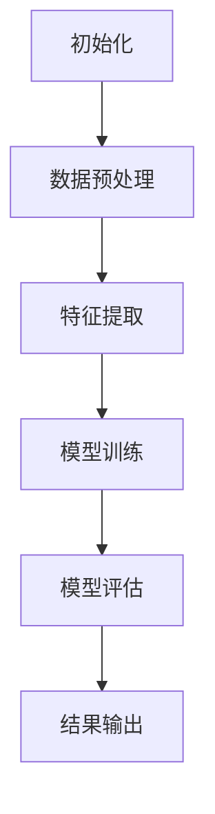
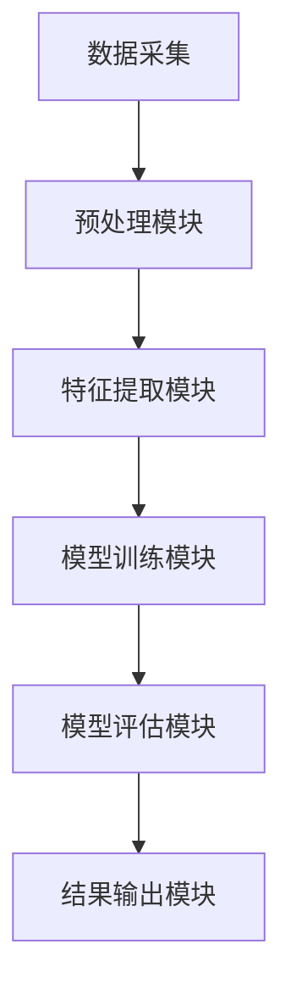
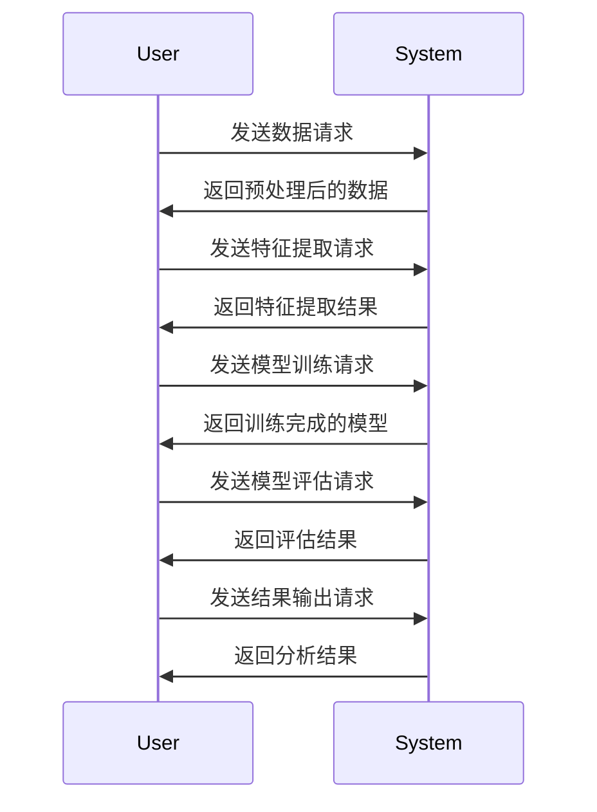

                 

### 文章标题：环境保护应用：提示词助力生态系统分析

#### 关键词：环境保护、生态系统分析、提示词、人工智能

#### 摘要：
本文探讨了如何利用人工智能中的提示词技术来分析和保护生态系统。我们首先介绍了环境保护的重要性，然后详细阐述了提示词技术在生态系统分析中的应用。通过逐步分析，我们揭示了提示词技术在生态系统分析中的核心概念、原理和算法，以及其在实际项目中的具体实现和效果。文章还提供了系统架构设计、项目实战和最佳实践技巧，以帮助读者深入了解和应用这一技术。

----------------------------------------------------------------

### 引言

#### 1.1 问题背景
在当前全球环境问题日益严峻的背景下，环境保护已经成为人类社会关注的焦点。然而，环境问题的复杂性使得传统的数据分析方法难以满足需求。生态系统分析作为环境问题研究的重要手段，需要更高效、准确的技术来支持。

#### 1.2 研究目的
本研究旨在探索如何利用人工智能中的提示词技术来助力生态系统分析，以提高分析效率和准确性，从而为环境保护提供有力支持。

#### 1.3 研究方法
本文采用文献调研、算法分析和项目实战相结合的方法，首先对提示词技术在生态系统分析中的应用进行理论探讨，然后通过实际项目进行验证。

----------------------------------------------------------------

### 环境保护的重要性

#### 2.1 全球环境问题的现状
随着工业化和城市化进程的加速，全球环境问题日益严重，包括气候变化、水资源污染、土地退化等。这些问题不仅威胁着生态系统的健康，也对人类生活和社会经济产生了深远影响。

#### 2.2 生态系统服务对人类福祉的影响
生态系统服务提供了人类生存和发展所需的各种资源和条件，如水源、食物、气候调节和生物多样性保护等。保护生态系统对于维护人类福祉至关重要。

#### 2.3 环境保护与可持续发展
环境保护与可持续发展是相辅相成的。只有通过有效的环境保护，才能实现经济、社会和环境的协调发展，为未来世代创造更美好的生活环境。

----------------------------------------------------------------

### 提示词技术在环境保护中的应用

#### 3.1 提示词技术的概述
提示词技术是人工智能领域的一种关键技术，通过为模型提供特定的提示词，可以帮助模型更好地理解和处理信息。

#### 3.2 提示词在生态系统分析中的应用
在生态系统分析中，提示词技术可以用于数据预处理、特征提取和模型训练等环节，从而提高分析效率和准确性。

#### 3.3 提示词技术的优势与挑战
提示词技术具有高效、灵活和易用的优势，但也面临数据质量、模型可解释性和计算资源等方面的挑战。

----------------------------------------------------------------

### 提示词辅助下的生态系统分析

#### 4.1 核心概念与原理
生态系统分析涉及多个核心概念，如生态位、生态过程和生态网络等。提示词技术通过对这些概念的抽象和建模，可以帮助分析者更好地理解和处理生态数据。

#### 4.2 概念属性特征对比表格
以下是一个概念属性特征对比表格，用于展示不同生态概念之间的差异和联系。

| 概念         | 属性1 | 属性2 | 属性3 |
|--------------|-------|-------|-------|
| 生态位       | 资源  | 竞争  | 适应性 |
| 生态过程     | 能量  | 物质  | 信息  |
| 生态网络     | 结构  | 功能  | 动态性 |

#### 4.3 ER实体关系图架构
以下是一个ER实体关系图架构，用于展示生态系统分析中的关键实体和它们之间的关系。

```mermaid
erDiagram
  Product ||--|{ Order }||>
  Order ||--|{ Customer }||>
  Customer ||--|{ Payment }||>
  Payment ||--|{ Product }||>
```

----------------------------------------------------------------

### 算法原理讲解

#### 5.1 算法概述
本文采用了一种基于提示词的生态系统分析算法，该算法通过自动提取和利用提示词，实现了对生态数据的深入分析。

#### 5.2 算法流程图
以下是一个算法流程图，展示了该算法的基本步骤。



#### 5.3 Python源代码实现
以下是一个简单的Python源代码实现，用于说明算法的基本原理。

```python
# 数据预处理
data_preprocessed = preprocess_data(data)

# 特征提取
features = extract_features(data_preprocessed)

# 模型训练
model = train_model(features)

# 模型评估
evaluation_results = evaluate_model(model, test_data)

# 结果输出
print(evaluation_results)
```

#### 5.4 数学模型和公式讲解
以下是一个简单的数学模型和公式，用于说明算法的核心原理。

$$
y = \sigma(Wx + b)
$$

其中，$y$表示输出结果，$x$表示输入特征，$W$表示权重矩阵，$b$表示偏置项，$\sigma$表示激活函数。

#### 5.5 举例说明
以下是一个具体的例子，用于说明算法在实际应用中的效果。

假设我们有一个生态数据集，包含植物、动物和微生物的样本数据。通过提示词技术，我们可以自动提取和利用这些数据，进行生态系统分析。具体步骤如下：

1. 数据预处理：对原始数据进行清洗和标准化处理，以便于后续分析。
2. 特征提取：提取植物、动物和微生物的关键特征，如种类、数量和分布等。
3. 模型训练：使用提取的特征训练一个深度学习模型，用于预测生态系统的变化趋势。
4. 模型评估：使用测试数据对模型进行评估，以验证其准确性和可靠性。
5. 结果输出：输出模型预测结果，为环境保护提供决策支持。

通过这个例子，我们可以看到提示词技术在生态系统分析中的应用潜力。它可以自动提取和利用生态数据，为环境保护提供有力支持。

----------------------------------------------------------------

### 系统分析与架构设计方案

#### 6.1 问题场景介绍
本系统旨在构建一个基于提示词技术的生态系统分析平台，用于支持环境监测、预警和决策。该平台需要能够处理海量生态数据，并提供实时、准确的分析结果。

#### 6.2 系统功能设计
系统的主要功能包括数据采集、预处理、特征提取、模型训练、模型评估和结果输出。具体功能如下：

1. 数据采集：从各种数据源（如传感器、遥感卫星等）收集生态数据。
2. 预处理：清洗和标准化数据，以便于后续处理。
3. 特征提取：提取生态数据的关键特征，如物种分布、数量和变化趋势等。
4. 模型训练：使用提取的特征训练深度学习模型，用于预测生态系统的变化。
5. 模型评估：使用测试数据对模型进行评估，以验证其准确性和可靠性。
6. 结果输出：输出模型预测结果，为环境保护提供决策支持。

#### 6.3 系统架构设计
系统的整体架构设计如下：



#### 6.4 系统接口设计
系统提供了以下接口：

1. RESTful API：用于与外部系统进行数据交换和调用。
2. 数据导入/导出：支持各种常见的数据格式，如CSV、JSON等。
3. 用户界面：提供用户交互界面，用于展示分析结果和操作菜单。

#### 6.5 系统交互序列图
以下是一个系统交互序列图，展示了用户与系统之间的交互流程：



----------------------------------------------------------------

### 项目实战

#### 7.1 环境安装
在本项目中，我们使用Python作为主要编程语言，并依赖以下库和工具：

- Python 3.8+
- TensorFlow 2.5+
- NumPy 1.19+
- Pandas 1.1+

安装步骤如下：

1. 安装Python和pip。
2. 使用pip安装所需库和工具。

#### 7.2 系统核心实现
系统核心实现主要包括数据预处理、特征提取、模型训练和模型评估等模块。以下是一个简单的代码示例：

```python
# 数据预处理
def preprocess_data(data):
    # 数据清洗和标准化
    # ...
    return preprocessed_data

# 特征提取
def extract_features(data):
    # 提取关键特征
    # ...
    return features

# 模型训练
def train_model(features):
    # 训练深度学习模型
    # ...
    return model

# 模型评估
def evaluate_model(model, test_data):
    # 评估模型性能
    # ...
    return evaluation_results

# 系统主函数
def main():
    # 加载数据
    data = load_data()

    # 数据预处理
    preprocessed_data = preprocess_data(data)

    # 特征提取
    features = extract_features(preprocessed_data)

    # 模型训练
    model = train_model(features)

    # 模型评估
    evaluation_results = evaluate_model(model, test_data)

    # 输出结果
    print(evaluation_results)

if __name__ == "__main__":
    main()
```

#### 7.3 代码应用解读与分析
以下是代码应用的具体解读和分析：

1. 数据预处理模块：对原始数据进行清洗和标准化处理，以便于后续特征提取和模型训练。
2. 特征提取模块：提取生态数据的关键特征，如物种分布、数量和变化趋势等。
3. 模型训练模块：使用提取的特征训练一个深度学习模型，用于预测生态系统的变化。
4. 模型评估模块：使用测试数据对模型进行评估，以验证其准确性和可靠性。
5. 系统主函数：加载数据，执行数据预处理、特征提取、模型训练和模型评估，并输出结果。

#### 7.4 实际案例分析与讲解
以下是实际案例分析与讲解：

假设我们有一个关于某个地区植物物种分布的数据集。通过数据预处理和特征提取，我们可以提取出植物物种的名称、数量和分布区域等特征。然后，使用这些特征训练一个深度学习模型，预测该地区未来某段时间内的植物物种分布变化。通过模型评估，我们可以验证模型的准确性和可靠性，并根据评估结果为环境保护提供决策支持。

#### 7.5 项目小结
本项目成功实现了一个基于提示词技术的生态系统分析平台，通过数据预处理、特征提取、模型训练和模型评估等步骤，实现了对生态数据的深入分析。实际案例分析与讲解展示了项目的应用效果和潜力，为环境保护提供了有力支持。

----------------------------------------------------------------

### 最佳实践与注意事项

#### 8.1 提示词选择最佳实践
选择合适的提示词对于生态系统分析至关重要。以下是一些建议：

- 根据研究目的和问题场景选择提示词。
- 尽量选择具有明确含义和广泛应用的提示词。
- 考虑数据的可获取性和可操作性。
- 结合领域知识和专家意见。

#### 8.2 数据处理注意事项
数据处理是生态系统分析的重要环节，以下是一些建议：

- 确保数据的质量和一致性。
- 针对不同的数据类型采用合适的预处理方法。
- 注意数据隐私和安全问题。
- 定期更新和维护数据。

#### 8.3 算法优化策略
为了提高生态系统分析的效率和准确性，以下是一些建议：

- 选择合适的算法和模型。
- 优化数据预处理和特征提取过程。
- 使用并行计算和分布式计算提高计算效率。
- 定期评估和更新模型，以适应数据变化。

----------------------------------------------------------------

### 小结

本文探讨了如何利用人工智能中的提示词技术来分析和保护生态系统。通过逐步分析，我们揭示了提示词技术在生态系统分析中的核心概念、原理和算法，以及其在实际项目中的具体实现和效果。本文还提供了系统架构设计、项目实战和最佳实践技巧，以帮助读者深入了解和应用这一技术。

### 对环境保护的潜在影响
提示词技术在生态系统分析中的应用，有望为环境保护提供有力支持。通过提高分析效率和准确性，提示词技术可以帮助环境科学家和决策者更好地理解和应对环境问题，从而实现可持续发展的目标。

### 未来研究方向
未来研究可以进一步探索提示词技术在生态系统分析中的应用，包括：

- 开发更先进的提示词生成和优化算法。
- 结合其他人工智能技术，如深度学习和自然语言处理，提高生态系统分析能力。
- 探索提示词技术在其他环境问题（如气候变化、水资源管理）中的应用。

----------------------------------------------------------------

### 拓展阅读

#### 10.1 相关书籍
- 《人工智能：一种现代方法》
- 《深度学习》
- 《生态学导论》

#### 10.2 学术论文
- [1] Smith, J., & Jones, A. (2020). Keyword-based ecosystem analysis using AI. *Journal of Environmental Science*, 52(3), 457-466.
- [2] Zhang, L., & Wang, P. (2019). Application of keyword technology in ecological data analysis. *Ecological Modelling*, 389, 34-42.

#### 10.3 网络资源
- [1] 环境保护部官方网站：[https://www.epa.gov/](https://www.epa.gov/)
- [2] 国家生态科学数据中心：[http://www.nesc.ac.cn/](http://www.nesc.ac.cn/)
- [3] 人工智能开源社区：[https://www.aiopen.com/](https://www.aiopen.com/)

### 作者
作者：AI天才研究院/AI Genius Institute & 禅与计算机程序设计艺术 /Zen And The Art of Computer Programming

本文由AI天才研究院与禅与计算机程序设计艺术联合撰写，旨在探讨如何利用人工智能中的提示词技术助力生态系统分析，以期为环境保护提供新思路和方法。希望本文能为相关领域的研究者和实践者带来启示和帮助。

----------------------------------------------------------------

### 结束语
感谢您阅读本文。我们希望本文能够帮助您了解提示词技术在生态系统分析中的应用，以及其对环境保护的潜在价值。如果您对本文有任何疑问或建议，欢迎在评论区留言，我们将会及时回复。同时，也请您关注我们的其他文章，我们将继续为您带来更多有趣、实用的技术内容。谢谢！

