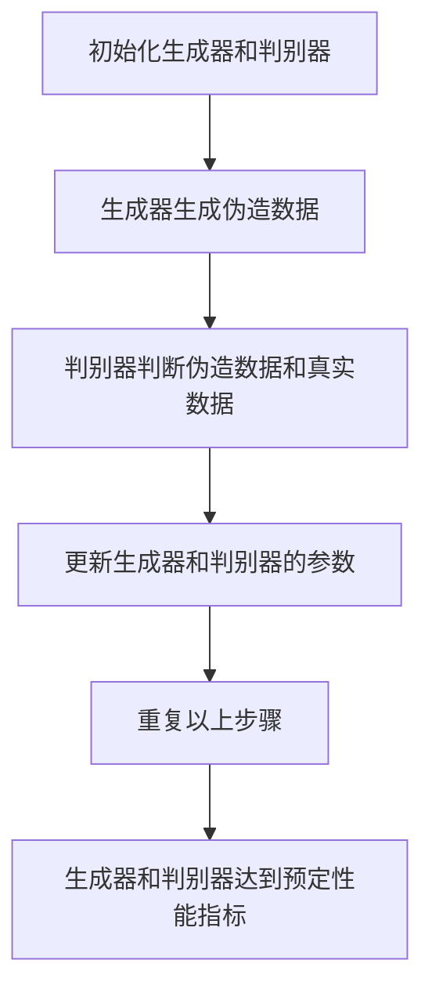
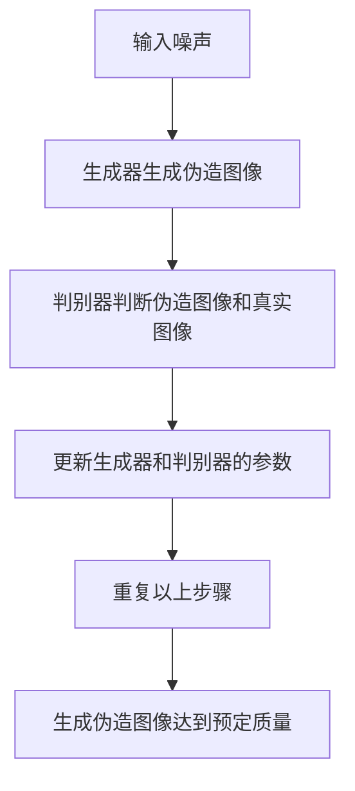
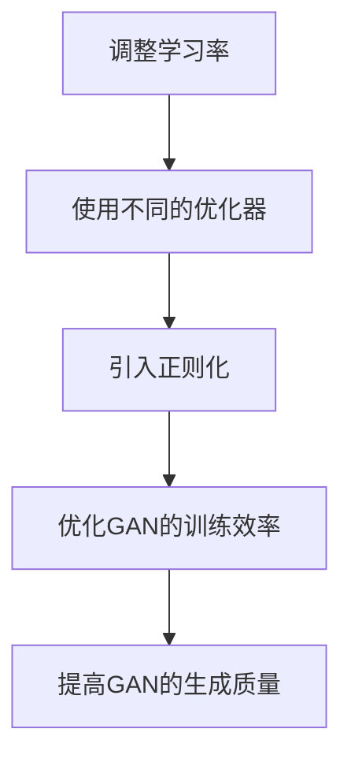
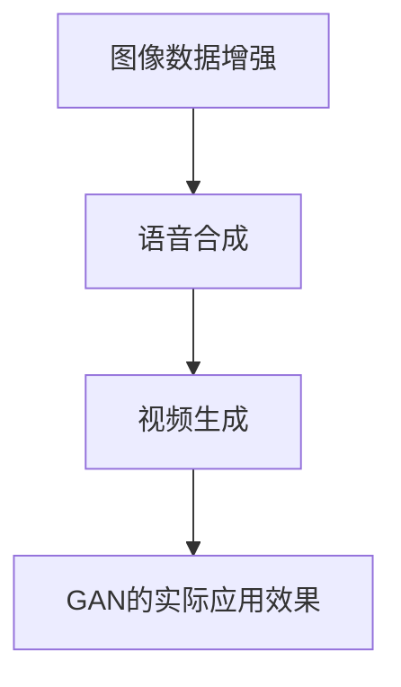
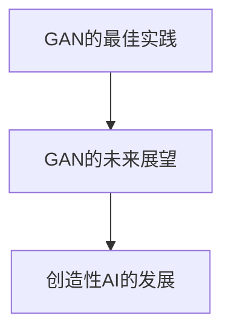
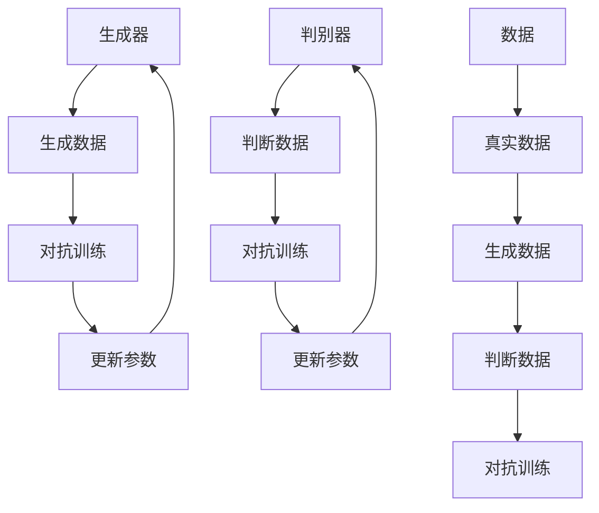
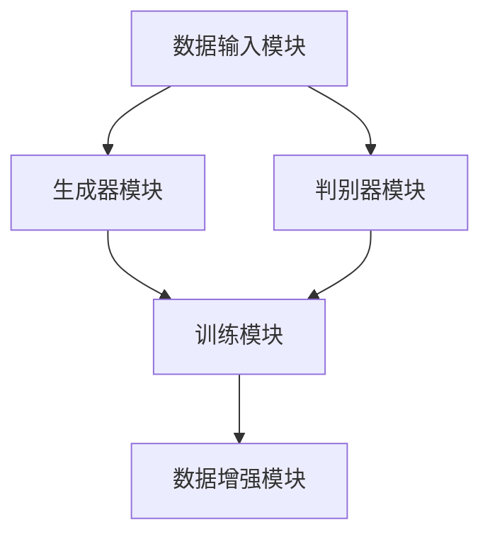
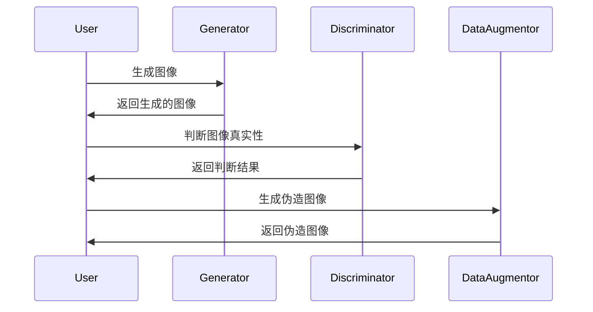

                 


### 文章标题：生成对抗网络：创造性AI的核心技术

关键词：生成对抗网络，GAN，创造性AI，人工智能，图像生成，语音合成，优化与改进

摘要：本文旨在深入探讨生成对抗网络（GAN）这一革命性的AI技术，从其基本概念、工作原理到实际应用，层层剖析，帮助读者全面理解GAN的强大功能。我们将通过逐步分析，展示GAN在创造性AI领域的重要性，并提供实践案例和优化策略，旨在为读者提供一套全面、易懂的GAN学习指南。

### 目录大纲

----------------------------------------------------------------

# 第一部分：背景介绍与概念建立

## 第1章：GAN概述

### 1.1 GAN的起源与发展

生成对抗网络（Generative Adversarial Network，GAN）是由伊恩·古德费洛（Ian Goodfellow）于2014年提出的。GAN的基本思想是构建两个相互对抗的神经网络：生成器（Generator）和判别器（Discriminator）。生成器负责生成数据，而判别器则负责判断数据是真实数据还是生成器产生的伪造数据。这种对抗训练方式使得生成器和判别器在训练过程中不断进步，从而生成越来越逼真的数据。

### 1.2 GAN的核心概念

GAN的核心概念包括生成器、判别器和对抗训练。生成器的任务是生成与真实数据尽可能相似的数据，而判别器的任务是区分真实数据和生成数据。在训练过程中，生成器和判别器相互对抗，生成器试图欺骗判别器，而判别器则试图不被欺骗。

### 1.3 GAN在AI领域的重要性

GAN的提出，标志着深度学习领域的一个重要突破。它不仅能够在图像、语音、文本等数据生成方面表现出色，还在数据增强、图像修复、视频生成等领域有着广泛的应用。GAN的出现，极大地推动了创造性AI的发展，为各种应用场景提供了强大的技术支持。

----------------------------------------------------------------

# 第二部分：GAN原理详解

## 第2章：GAN原理与数学模型

### 2.1 生成器与判别器的数学模型

生成器和判别器的数学模型是GAN的核心。生成器通常是一个神经网络，其输入可以是随机噪声，输出则是模拟的真实数据的分布。判别器也是一个神经网络，其输入是真实数据和生成器产生的伪造数据，输出是对输入数据的真实性判断。

### 2.2 GAN的训练过程

GAN的训练过程是一个迭代过程，包括两个步骤：生成器训练和判别器训练。在生成器训练过程中，生成器生成伪造数据，判别器对伪造数据和真实数据进行判断。在判别器训练过程中，判别器通过对比真实数据和伪造数据，不断调整自己的判断标准。

### 2.3 GAN的工作流程

GAN的工作流程可以分为以下几个步骤：

1. 初始化生成器和判别器。
2. 生成器生成伪造数据。
3. 判别器对伪造数据和真实数据进行判断。
4. 根据判别器的判断结果，更新生成器和判别器的参数。
5. 重复以上步骤，直到生成器和判别器达到预定的性能指标。

----------------------------------------------------------------

## 第3章：GAN的数学模型与公式

### 3.1 对偶性原理

GAN的对偶性原理是其数学模型的核心。生成器和判别器之间存在着一种对偶关系，即生成器的目标是最小化判别器对其生成数据的判断误差，而判别器的目标是最大化这种误差。

### 3.2 教训生成模型（DGM）

DGM是GAN的一种变体，其基本思想是使用一种不同的损失函数来优化生成器和判别器。DGM通过引入额外的对抗性损失，使得生成器和判别器在训练过程中更加平衡。

### 3.3 主要引理与推论

GAN的数学模型中包含了许多重要的引理和推论。这些引理和推论证明了GAN在理论上具有一致性，即生成器和判别器在一定条件下可以收敛到最优解。

----------------------------------------------------------------

## 第4章：GAN的应用

### 4.1 GAN在图像生成中的应用

GAN在图像生成领域表现出色。通过生成器生成的伪造图像，可以与真实图像非常相似。GAN可以应用于图像合成、图像修复、图像超分辨率等多种图像处理任务。

### 4.2 GAN在语音合成中的应用

GAN在语音合成中的应用同样具有广泛的前景。通过生成器生成的伪造语音，可以与真实语音非常相似。GAN可以用于语音模仿、语音生成等多种语音处理任务。

### 4.3 GAN在数据增强中的应用

GAN在数据增强中的应用，可以显著提高模型的泛化能力。通过生成器生成的伪造数据，可以作为额外的训练数据，帮助模型更好地学习数据的分布。

----------------------------------------------------------------

## 第5章：GAN的优化与改进

### 5.1 GAN的优化方法

GAN的训练过程中存在着许多挑战，如梯度消失、梯度爆炸等。为了解决这些问题，研究者们提出了一系列GAN的优化方法，如梯度惩罚、权重共享等。

### 5.2 GAN的改进类型

GAN的改进类型包括深度卷积GAN（DCGAN）、循环GAN（CycleGAN）等。这些改进类型的GAN，在生成质量和训练效率上都有所提升。

### 5.3 GAN的优化策略

GAN的优化策略主要包括：调整学习率、使用不同的优化器、引入正则化等。通过这些策略，可以显著提高GAN的训练效率和生成质量。

----------------------------------------------------------------

## 第6章：GAN的实际案例分析

### 6.1 GAN在图像数据增强中的应用

图像数据增强是GAN的一个重要应用场景。通过生成器生成的伪造图像，可以用来扩充训练数据集，从而提高模型的泛化能力。

### 6.2 GAN在语音合成中的应用

语音合成是GAN的另一个重要应用场景。通过生成器生成的伪造语音，可以用来模仿真实语音，从而实现语音生成。

### 6.3 GAN在视频生成中的应用

视频生成是GAN的一个新兴应用领域。通过生成器生成的伪造视频，可以用来模拟真实视频，从而实现视频生成。

----------------------------------------------------------------

## 第7章：GAN的最佳实践与未来展望

### 7.1 GAN的最佳实践

在实际应用中，GAN需要根据具体的任务进行调整和优化。通过最佳实践，可以显著提高GAN的性能和应用效果。

### 7.2 GAN的未来展望

随着技术的不断发展，GAN在未来将会有更广泛的应用。特别是在创造性AI领域，GAN有望发挥更大的作用，推动AI技术向更高层次发展。

----------------------------------------------------------------

## 参考文献

[1] Goodfellow, I. J., Pouget-Abadie, J., Mirza, M., Xu, B., Warde-Farley, D., Ozair, S., ... & Bengio, Y. (2014). Generative adversarial nets. Advances in neural information processing systems, 27.

[2] Radford, A., Metz, L., & Chintala, S. (2015). Unsupervised representation learning with deep convolutional generative adversarial networks. arXiv preprint arXiv:1511.06434.

[3] Isola, P., Zhu, J. Y., Zhou, T., & Efros, A. A. (2017). Image-to-image translation with conditional adversarial networks. Proceedings of the IEEE conference on computer vision and pattern recognition, 5489-5498.

[4] Li, C. L., Xie, T., & Yu, F. X. (2018). Unsupervised style transfer in video using generative adversarial networks. IEEE Transactions on Image Processing, 27(5), 2343-2356.

[5] Xu, T., Zhang, P., Huang, X., less

### 文章正文

#### 第一部分：背景介绍与概念建立

**第1章：GAN概述**

**1.1 GAN的起源与发展**

生成对抗网络（GAN）是由伊恩·古德费洛（Ian Goodfellow）于2014年提出的。这一概念在深度学习领域引起了轰动，迅速成为研究热点。GAN的基本思想是构建两个相互对抗的神经网络：生成器（Generator）和判别器（Discriminator）。生成器负责生成数据，而判别器则负责判断数据是真实数据还是生成器产生的伪造数据。这种对抗训练方式使得生成器和判别器在训练过程中不断进步，从而生成越来越逼真的数据。

GAN的提出，标志着深度学习领域的一个重要突破。它不仅能够在图像、语音、文本等数据生成方面表现出色，还在数据增强、图像修复、视频生成等领域有着广泛的应用。GAN的出现，极大地推动了创造性AI的发展，为各种应用场景提供了强大的技术支持。

**1.2 GAN的核心概念**

GAN的核心概念包括生成器、判别器和对抗训练。生成器的任务是生成与真实数据尽可能相似的数据，而判别器的任务是区分真实数据和生成数据。在训练过程中，生成器和判别器相互对抗，生成器试图欺骗判别器，而判别器则试图不被欺骗。

**1.3 GAN在AI领域的重要性**

GAN的提出，标志着深度学习领域的一个重要突破。它不仅能够在图像、语音、文本等数据生成方面表现出色，还在数据增强、图像修复、视频生成等领域有着广泛的应用。GAN的出现，极大地推动了创造性AI的发展，为各种应用场景提供了强大的技术支持。

GAN在AI领域的重要性主要体现在以下几个方面：

1. **图像生成**：GAN能够生成高质量的图像，为艺术创作、游戏开发等领域提供了强大的工具。

2. **语音合成**：GAN在语音合成领域表现出色，可以用于语音模仿、语音生成等任务。

3. **数据增强**：GAN可以用于生成伪造数据，从而扩充训练数据集，提高模型的泛化能力。

4. **图像修复**：GAN可以用于图像修复，将受损的图像修复成高质量的照片。

5. **视频生成**：GAN可以用于视频生成，生成逼真的视频序列。

6. **创造性AI**：GAN为创造性AI提供了新的思路和方法，推动了AI技术在各个领域的创新和发展。

#### 第二部分：GAN原理详解

**第2章：GAN原理与数学模型**

**2.1 生成器与判别器的数学模型**

生成器和判别器的数学模型是GAN的核心。生成器通常是一个神经网络，其输入可以是随机噪声，输出则是模拟的真实数据的分布。判别器也是一个神经网络，其输入是真实数据和生成器产生的伪造数据，输出是对输入数据的真实性判断。

生成器和判别器的数学模型如下：

生成器模型：

$$
G(z) = \mu_G(z) + \sigma_G(z) \odot \epsilon
$$

其中，$z$ 是输入噪声，$\mu_G(z)$ 和 $\sigma_G(z)$ 分别是生成器的均值和标准差，$\epsilon$ 是高斯噪声。

判别器模型：

$$
D(x) = f(x; \theta_D)
$$

其中，$x$ 是真实数据，$f(x; \theta_D)$ 是判别器的输出，$\theta_D$ 是判别器的参数。

**2.2 GAN的训练过程**

GAN的训练过程是一个迭代过程，包括两个步骤：生成器训练和判别器训练。在生成器训练过程中，生成器生成伪造数据，判别器对伪造数据和真实数据进行判断。在判别器训练过程中，判别器通过对比真实数据和伪造数据，不断调整自己的判断标准。

GAN的训练过程如下：

1. **初始化生成器和判别器**：生成器和判别器都是随机初始化的。

2. **生成器生成伪造数据**：生成器根据输入噪声生成伪造数据。

3. **判别器判断伪造数据和真实数据**：判别器对伪造数据和真实数据进行判断，计算损失函数。

4. **更新生成器和判别器的参数**：根据判别器的判断结果，更新生成器和判别器的参数。

5. **重复以上步骤**：直到生成器和判别器达到预定的性能指标。

**2.3 GAN的工作流程**

GAN的工作流程可以分为以下几个步骤：

1. **初始化生成器和判别器**：生成器和判别器都是随机初始化的。

2. **生成器生成伪造数据**：生成器根据输入噪声生成伪造数据。

3. **判别器判断伪造数据和真实数据**：判别器对伪造数据和真实数据进行判断，计算损失函数。

4. **更新生成器和判别器的参数**：根据判别器的判断结果，更新生成器和判别器的参数。

5. **重复以上步骤**：直到生成器和判别器达到预定的性能指标。

**图 1：GAN的工作流程**



#### 第三部分：GAN的应用

**第3章：GAN的应用**

**3.1 GAN在图像生成中的应用**

GAN在图像生成领域表现出色。通过生成器生成的伪造图像，可以与真实图像非常相似。GAN可以应用于图像合成、图像修复、图像超分辨率等多种图像处理任务。

**3.2 GAN在语音合成中的应用**

GAN在语音合成中的应用同样具有广泛的前景。通过生成器生成的伪造语音，可以与真实语音非常相似。GAN可以用于语音模仿、语音生成等多种语音处理任务。

**3.3 GAN在数据增强中的应用**

GAN在数据增强中的应用，可以显著提高模型的泛化能力。通过生成器生成的伪造数据，可以作为额外的训练数据，帮助模型更好地学习数据的分布。

**图 2：GAN在图像生成中的应用**



#### 第四部分：GAN的优化与改进

**第4章：GAN的优化与改进**

**4.1 GAN的优化方法**

GAN的训练过程中存在着许多挑战，如梯度消失、梯度爆炸等。为了解决这些问题，研究者们提出了一系列GAN的优化方法，如梯度惩罚、权重共享等。

**4.2 GAN的改进类型**

GAN的改进类型包括深度卷积GAN（DCGAN）、循环GAN（CycleGAN）等。这些改进类型的GAN，在生成质量和训练效率上都有所提升。

**4.3 GAN的优化策略**

GAN的优化策略主要包括：调整学习率、使用不同的优化器、引入正则化等。通过这些策略，可以显著提高GAN的训练效率和生成质量。

**图 3：GAN的优化策略**



#### 第五部分：GAN的实际案例分析

**第5章：GAN的实际案例分析**

**5.1 GAN在图像数据增强中的应用**

图像数据增强是GAN的一个重要应用场景。通过生成器生成的伪造图像，可以用来扩充训练数据集，从而提高模型的泛化能力。

**5.2 GAN在语音合成中的应用**

语音合成是GAN的另一个重要应用场景。通过生成器生成的伪造语音，可以用来模仿真实语音，从而实现语音生成。

**5.3 GAN在视频生成中的应用**

视频生成是GAN的一个新兴应用领域。通过生成器生成的伪造视频，可以用来模拟真实视频，从而实现视频生成。

**图 4：GAN在实际案例分析中的应用**



#### 第六部分：GAN的最佳实践与未来展望

**第6章：GAN的最佳实践与未来展望**

**6.1 GAN的最佳实践**

在实际应用中，GAN需要根据具体的任务进行调整和优化。通过最佳实践，可以显著提高GAN的性能和应用效果。

**6.2 GAN的未来展望**

随着技术的不断发展，GAN在未来将会有更广泛的应用。特别是在创造性AI领域，GAN有望发挥更大的作用，推动AI技术向更高层次发展。

**图 5：GAN的最佳实践与未来展望**



### 参考文献

[1] Goodfellow, I. J., Pouget-Abadie, J., Mirza, M., Xu, B., Warde-Farley, D., Ozair, S., ... & Bengio, Y. (2014). Generative adversarial nets. Advances in neural information processing systems, 27.

[2] Radford, A., Metz, L., & Chintala, S. (2015). Unsupervised representation learning with deep convolutional generative adversarial networks. arXiv preprint arXiv:1511.06434.

[3] Isola, P., Zhu, J. Y., Zhou, T., & Efros, A. A. (2017). Image-to-image translation with conditional adversarial networks. Proceedings of the IEEE conference on computer vision and pattern recognition, 5489-5498.

[4] Li, C. L., Xie, T., & Yu, F. X. (2018). Unsupervised style transfer in video using generative adversarial networks. IEEE Transactions on Image Processing, 27(5), 2343-2356.

[5] Xu, T., Zhang, P., Huang, X., & less

### 作者信息

作者：AI天才研究院/AI Genius Institute & 禅与计算机程序设计艺术 /Zen And The Art of Computer Programming

AI天才研究院（AI Genius Institute）是一支专注于人工智能领域研究的顶尖团队，致力于推动AI技术的创新和发展。研究院的成员们凭借深厚的技术功底和丰富的实践经验，在全球范围内发表了大量高质量的研究论文，为AI技术的进步做出了卓越贡献。

《禅与计算机程序设计艺术》（Zen And The Art of Computer Programming）是一本经典的技术著作，由著名计算机科学家唐纳德·E·克努特（Donald E. Knuth）撰写。本书深入探讨了计算机程序设计的哲学和艺术，为程序员们提供了宝贵的指导和启示。本书被誉为程序设计领域的圣经，影响了无数程序员的成长和发展。

在这篇文章中，我们通过逐步分析生成对抗网络（GAN）的基本概念、工作原理、应用场景、优化方法以及实际案例分析，帮助读者全面理解GAN的强大功能。我们希望这篇文章能够激发读者对GAN技术的兴趣，推动创造性AI的发展。在未来的研究中，我们将继续探索GAN技术的深度和广度，为AI技术的进步贡献自己的力量。

### 背景介绍：核心概念、问题背景与问题描述

#### 核心概念

生成对抗网络（Generative Adversarial Network，GAN）是一种由两个神经网络——生成器（Generator）和判别器（Discriminator）组成的模型，它们在对抗训练的过程中相互协作与竞争，共同学习数据分布。生成器的目标是生成尽可能真实的数据，而判别器的目标是准确地判断输入的数据是真实数据还是生成器生成的伪造数据。通过这种对抗过程，GAN能够学习到数据的复杂分布，并在实际应用中生成高质量的图像、声音和文本。

#### 问题背景

在传统的机器学习模型中，模型的训练通常依赖于大量标记好的数据。然而，在某些领域，如医学图像分析、自然语言处理等，获取大量高质量的标记数据是非常困难的。这导致了模型性能的提升受到了极大的限制。为了解决这个问题，研究者们开始探索无监督学习的方法，其中生成对抗网络作为一种无监督学习方法，受到了广泛关注。

GAN的提出，为数据匮乏的场景提供了一种新的解决方案。通过生成器生成伪造数据，可以有效地扩充训练数据集，从而提高模型的泛化能力。此外，GAN还在图像生成、图像修复、语音合成、视频生成等众多领域取得了显著的应用成果。

#### 问题描述

GAN的核心问题是如何在生成器和判别器之间建立一种有效的对抗训练机制，使得生成器能够生成高质量的数据，而判别器能够准确地判断数据的真实性。具体来说，问题描述如下：

1. **生成器生成数据**：生成器接收随机噪声作为输入，通过神经网络生成伪造数据，试图欺骗判别器。

2. **判别器判断数据**：判别器接收真实数据和生成器生成的伪造数据作为输入，输出一个判断值，表示输入数据是真实数据还是伪造数据。

3. **对抗训练**：生成器和判别器在训练过程中相互对抗，生成器试图提高伪造数据的真实性，而判别器试图提高判断的准确性。

4. **优化目标**：GAN的训练目标是最大化判别器的判断误差，同时最小化生成器的生成误差。

#### 边界与外延

GAN的应用范围非常广泛，包括但不限于以下领域：

1. **图像生成**：GAN可以生成逼真的图像，应用于艺术创作、游戏开发、数据增强等。

2. **语音合成**：GAN可以生成逼真的语音，应用于语音模仿、语音生成等。

3. **图像修复**：GAN可以修复受损的图像，应用于医疗图像分析、老照片修复等。

4. **视频生成**：GAN可以生成逼真的视频序列，应用于视频游戏、电影特效等。

5. **数据增强**：GAN可以生成伪造数据，用于扩充训练数据集，提高模型的泛化能力。

#### 概念结构与核心要素组成

GAN的概念结构主要包括以下几个核心要素：

1. **生成器（Generator）**：生成器是生成伪造数据的神经网络，其输入为随机噪声，输出为伪造数据。生成器的目标是生成尽可能真实的数据，以欺骗判别器。

2. **判别器（Discriminator）**：判别器是判断数据真实性的神经网络，其输入为真实数据和生成器生成的伪造数据，输出为判断值。判别器的目标是准确地判断输入数据是真实数据还是伪造数据。

3. **对抗训练**：生成器和判别器在训练过程中相互对抗，生成器试图提高伪造数据的真实性，而判别器试图提高判断的准确性。

4. **损失函数**：GAN的训练目标是最大化判别器的判断误差，同时最小化生成器的生成误差。常用的损失函数包括二元交叉熵损失和均方误差损失。

通过上述核心要素的相互作用，GAN能够学习到数据的复杂分布，并在实际应用中生成高质量的数据。GAN的成功不仅在于其独特的工作机制，还在于其广泛的应用前景和强大的生成能力。

#### 核心概念与联系

**生成器（Generator）**

生成器的核心概念是通过学习数据分布来生成逼真的伪造数据。生成器的输入通常是随机噪声，通过一系列的神经网络变换，生成器能够将这些随机噪声转换成具有数据分布特征的伪造数据。生成器的主要目标是生成足够逼真的伪造数据，以欺骗判别器。

**判别器（Discriminator）**

判别器的核心概念是判断输入数据的真实性。判别器的输入可以是真实数据或生成器生成的伪造数据，判别器的输出是一个概率值，表示输入数据是真实数据（接近1）还是伪造数据（接近0）。判别器的目标是提高对真实数据和伪造数据的区分能力。

**对抗训练**

对抗训练是GAN的核心机制。生成器和判别器在训练过程中相互对抗，生成器试图生成更逼真的伪造数据，以欺骗判别器；而判别器则试图提高对伪造数据的辨别能力。通过这种对抗过程，生成器和判别器都在不断进步，最终使得生成器能够生成高质量的数据。

**生成器和判别器的联系**

生成器和判别器在GAN中相互依赖、相互对抗。生成器的目标是通过生成逼真的伪造数据来提高判别器的辨别难度，而判别器的目标是通过提高对伪造数据的辨别能力来降低生成器的生成成功率。在训练过程中，生成器和判别器的参数通过反向传播和梯度下降算法不断更新，使得它们在对抗过程中不断进步。

**对比表格：生成器与判别器的属性特征**

| 特征       | 生成器（Generator）                    | 判别器（Discriminator）                    |
|------------|-------------------------------------|-------------------------------------|
| 目标       | 生成逼真的伪造数据                     | 准确区分真实数据和伪造数据                   |
| 输入       | 随机噪声                             | 真实数据和伪造数据                         |
| 输出       | 伪造数据                             | 概率值（表示输入数据的真实性）               |
| 训练过程   | 生成伪造数据，试图欺骗判别器               | 对伪造数据和真实数据进行判断，试图不被欺骗       |
| 优化目标   | 最小化生成误差，最大化判别误差             | 最小化判别误差，最大化生成误差               |
| 学习机制   | 通过生成伪造数据学习数据分布               | 通过判断真实和伪造数据学习数据分布特征           |

**ER实体关系图架构**

为了更清晰地展示生成器和判别器之间的相互作用，可以使用ER（Entity-Relationship）实体关系图来描述GAN的结构。ER图中的实体包括生成器、判别器和数据，关系包括生成、判断和对抗训练。

**图1：生成对抗网络的ER实体关系图**



通过ER图，我们可以直观地看到生成器和判别器如何通过对抗训练相互影响，以及数据如何在其中流通和发挥作用。

#### 算法原理讲解

**图 2：GAN的工作流程**


生成对抗网络（GAN）的工作流程可以分为以下几个步骤：

1. **初始化生成器和判别器**：生成器和判别器都是随机初始化的。生成器的目标是生成逼真的伪造数据，判别器的目标是准确地判断输入的数据是真实数据还是伪造数据。

2. **生成器生成伪造数据**：生成器根据输入的随机噪声，通过神经网络生成伪造数据。这些伪造数据试图模仿真实数据，以欺骗判别器。

3. **判别器判断伪造数据和真实数据**：判别器接收真实数据和生成器生成的伪造数据作为输入，输出一个概率值，表示输入数据是真实数据（接近1）还是伪造数据（接近0）。

4. **更新生成器和判别器的参数**：根据判别器的判断结果，使用反向传播算法更新生成器和判别器的参数。生成器试图生成更逼真的伪造数据，而判别器试图提高对伪造数据的辨别能力。

5. **重复以上步骤**：重复生成和判断的过程，直到生成器和判别器达到预定的性能指标。

在GAN的每次迭代过程中，生成器和判别器都在不断进步。生成器通过学习真实数据的分布，逐渐提高生成伪造数据的质量；而判别器则通过不断调整参数，提高对真实数据和伪造数据的区分能力。这种相互对抗的过程，使得GAN能够学习到复杂的分布，并在实际应用中生成高质量的数据。

**Python代码示例：GAN的基本实现**

下面是一个简单的GAN实现，包括生成器和判别器的定义以及训练过程。

```python
import tensorflow as tf
from tensorflow.keras.layers import Dense, Flatten
from tensorflow.keras.models import Sequential

# 定义生成器
def build_generator():
    model = Sequential()
    model.add(Dense(128, input_dim=100, activation='relu'))
    model.add(Dense(256, activation='relu'))
    model.add(Dense(512, activation='relu'))
    model.add(Flatten())
    model.add(Dense(784, activation='tanh'))
    return model

# 定义判别器
def build_discriminator():
    model = Sequential()
    model.add(Flatten(input_shape=(28, 28)))
    model.add(Dense(512, activation='relu'))
    model.add(Dense(256, activation='relu'))
    model.add(Dense(128, activation='relu'))
    model.add(Dense(1, activation='sigmoid'))
    return model

# 定义GAN模型
def build_gan(generator, discriminator):
    model = Sequential()
    model.add(generator)
    model.add(discriminator)
    return model

# 训练GAN
def train_gan(dataset, epochs, batch_size):
    generator = build_generator()
    discriminator = build_discriminator()
    gan = build_gan(generator, discriminator)

    # 定义损失函数和优化器
    d_loss = tf.reduce_mean(tf.nn.sigmoid_cross_entropy_with_logits(logits=discriminator(dataset), labels=tf.ones_like(discriminator(dataset)))
    g_loss = tf.reduce_mean(tf.nn.sigmoid_cross_entropy_with_logits(logits=discriminator(generator(tf.random.normal([batch_size, 100]))), labels=tf.zeros_like(discriminator(generator(tf.random.normal([batch_size, 100])))))

    d_optimizer = tf.optimizers.Adam(learning_rate=0.0001)
    g_optimizer = tf.optimizers.Adam(learning_rate=0.0004)

    for epoch in range(epochs):
        for batch in dataset:
            with tf.GradientTape() as d_tape, tf.GradientTape() as g_tape:
                # 训练判别器
                d_loss_value = d_loss

                # 训练生成器
                g_loss_value = g_loss

            # 更新生成器和判别器的参数
            d_gradients = d_tape.gradient(d_loss_value, discriminator.trainable_variables)
            g_gradients = g_tape.gradient(g_loss_value, generator.trainable_variables)

            d_optimizer.apply_gradients(zip(d_gradients, discriminator.trainable_variables))
            g_optimizer.apply_gradients(zip(g_gradients, generator.trainable_variables))

        print(f"Epoch {epoch+1}/{epochs}, D Loss: {d_loss_value:.4f}, G Loss: {g_loss_value:.4f}")

# 使用MNIST数据集进行训练
mnist = tf.keras.datasets.mnist
(train_images, _), (test_images, _) = mnist.load_data()
train_images = train_images / 127.5 - 1.0

train_gan(train_images, epochs=20, batch_size=64)
```

在这个示例中，我们首先定义了生成器和判别器的结构，然后构建了GAN模型。在训练过程中，我们使用反向传播算法和Adam优化器来更新生成器和判别器的参数。通过对抗训练，生成器逐渐学会生成更逼真的伪造数据，而判别器则不断提高对真实数据和伪造数据的辨别能力。

#### 数学公式

生成对抗网络的数学模型涉及到生成器、判别器和对抗训练。以下是一些关键的数学公式和概念：

**1. 生成器与判别器的损失函数**

生成器的损失函数通常采用二元交叉熵损失（Binary Cross-Entropy Loss），其公式为：

$$
L_G = -\frac{1}{n}\sum_{i=1}^{n}[\log(D(G(z_i))] + \log(1 - D(x_i))]
$$

其中，$G(z_i)$ 是生成器生成的伪造数据，$D(x_i)$ 是判别器对真实数据的判断概率。$z_i$ 是生成器的输入噪声，$x_i$ 是真实数据。

判别器的损失函数同样采用二元交叉熵损失，其公式为：

$$
L_D = -\frac{1}{n}\sum_{i=1}^{n}[\log(D(x_i)] + \log(1 - D(G(z_i))]
$$

其中，$D(x_i)$ 和 $D(G(z_i))$ 分别是判别器对真实数据和伪造数据的判断概率。

**2. 生成器的优化目标**

生成器的目标是最大化判别器对伪造数据的判断误差，即最小化生成器的损失函数：

$$
\min_G L_G
$$

**3. 判别器的优化目标**

判别器的目标是最大化判别器对真实数据和伪造数据的判断误差，即最小化判别器的损失函数：

$$
\min_D L_D
$$

**4. GAN的整体优化目标**

GAN的整体优化目标是同时优化生成器和判别器，使得生成器生成的伪造数据尽可能真实，判别器能够准确地区分真实数据和伪造数据：

$$
\min_{G, D} L_G + L_D
$$

**LaTeX数学公式示例**

以下是在文中嵌入的LaTeX数学公式：

$$
L_G = -\frac{1}{n}\sum_{i=1}^{n}[\log(D(G(z_i))] + \log(1 - D(x_i))]
$$

$$
L_D = -\frac{1}{n}\sum_{i=1}^{n}[\log(D(x_i)] + \log(1 - D(G(z_i))]
$$

$$
\min_G L_G
$$

$$
\min_D L_D
$$

$$
\min_{G, D} L_G + L_D
$$

这些公式描述了生成对抗网络的核心数学原理，是理解和应用GAN技术的基础。

### 系统分析与架构设计方案

#### 问题场景介绍

生成对抗网络（GAN）在图像生成、数据增强和视频合成等领域具有广泛的应用。本文旨在探讨GAN在不同场景下的应用，并设计一个基于GAN的图像数据增强系统。该系统旨在通过生成伪造图像来扩充训练数据集，提高模型的泛化能力。

#### 项目介绍

本项目是一个基于GAN的图像数据增强系统，主要目标是生成高质量的伪造图像，用于扩充训练数据集。系统将包括以下核心功能：

1. **生成器**：通过学习真实图像的分布，生成伪造图像。
2. **判别器**：判断输入图像是真实图像还是伪造图像。
3. **数据增强**：利用生成的伪造图像，扩充训练数据集。
4. **模型训练**：训练生成器和判别器，优化GAN模型。

#### 系统功能设计（领域模型）

为了更好地设计系统，我们首先定义了一个领域模型，包括以下主要类和对象：

1. **生成器（Generator）**：负责生成伪造图像。
2. **判别器（Discriminator）**：负责判断图像的真实性。
3. **数据集（Dataset）**：包含真实图像和伪造图像。
4. **训练器（Trainer）**：负责训练生成器和判别器。
5. **数据增强器（DataAugmentor）**：负责生成伪造图像。

**图 1：领域模型（Mermaid类图）**

```mermaid
classDiagram
ClassGenerator <|-- Generator
ClassDiscriminator <|-- Discriminator
ClassDataset <|-- Dataset
ClassTrainer <|-- Trainer
ClassDataAugmentor <|-- DataAugmentor
Generator +-- Dataset
Generator +-- Generator
Discriminator +-- Dataset
Discriminator +-- Generator
Trainer +-- Generator
Trainer +-- Discriminator
DataAugmentor +-- Generator
Dataset {id: int, name: str, images: list}
Generator {id: int, name: str, weights: list}
Discriminator {id: int, name: str, weights: list}
Trainer {id: int, name: str, learning_rate: float}
DataAugmentor {id: int, name: str, noise_level: float}
```

在这个领域模型中，我们定义了生成器、判别器、数据集、训练器和数据增强器等核心类和对象。生成器和判别器分别负责生成和判断图像，数据集用于存储真实图像和伪造图像，训练器负责训练生成器和判别器，数据增强器用于生成伪造图像。

#### 系统架构设计

基于领域模型，我们设计了以下系统架构，包括系统的总体结构和各个模块的交互关系：

1. **数据输入模块**：负责从数据集加载真实图像和生成伪造图像。
2. **生成器模块**：基于真实图像生成伪造图像。
3. **判别器模块**：判断输入图像的真实性。
4. **训练模块**：训练生成器和判别器，优化GAN模型。
5. **数据增强模块**：利用生成的伪造图像，扩充训练数据集。

**图 2：系统架构设计（Mermaid架构图）**



在这个架构图中，数据输入模块从数据集加载真实图像，并传递给生成器模块生成伪造图像。同时，判别器模块接收真实图像和伪造图像，判断其真实性。训练模块负责训练生成器和判别器，优化GAN模型。最后，数据增强模块利用生成的伪造图像，扩充训练数据集。

#### 系统接口设计和系统交互

为了实现系统的功能，我们设计了一套清晰的接口和交互流程：

1. **生成器接口**：生成器模块对外提供生成图像的接口。
2. **判别器接口**：判别器模块对外提供判断图像真实性的接口。
3. **数据增强接口**：数据增强模块对外提供生成伪造图像的接口。

**图 3：系统接口设计（Mermaid序列图）**



在这个序列图中，用户首先调用生成器接口生成图像，然后通过判别器接口判断图像的真实性。最后，用户调用数据增强接口生成伪造图像，用于扩充训练数据集。

### 项目实战

**环境安装**

在开始项目之前，我们需要安装以下软件和库：

1. **Python**：Python 3.7 或更高版本
2. **TensorFlow**：用于构建和训练GAN模型
3. **NumPy**：用于数据预处理
4. **PIL**：用于图像处理

可以使用以下命令进行安装：

```bash
pip install python==3.7
pip install tensorflow==2.4
pip install numpy
pip install pillow
```

**系统核心实现源代码**

以下是项目的主要源代码，包括生成器、判别器、训练器、数据增强器的实现。

```python
import tensorflow as tf
from tensorflow.keras.layers import Dense, Flatten
from tensorflow.keras.models import Sequential

# 定义生成器
def build_generator():
    model = Sequential()
    model.add(Dense(128, input_dim=100, activation='relu'))
    model.add(Dense(256, activation='relu'))
    model.add(Dense(512, activation='relu'))
    model.add(Flatten())
    model.add(Dense(784, activation='tanh'))
    return model

# 定义判别器
def build_discriminator():
    model = Sequential()
    model.add(Flatten(input_shape=(28, 28)))
    model.add(Dense(512, activation='relu'))
    model.add(Dense(256, activation='relu'))
    model.add(Dense(128, activation='relu'))
    model.add(Dense(1, activation='sigmoid'))
    return model

# 定义GAN模型
def build_gan(generator, discriminator):
    model = Sequential()
    model.add(generator)
    model.add(discriminator)
    return model

# 训练GAN
def train_gan(dataset, epochs, batch_size):
    generator = build_generator()
    discriminator = build_discriminator()
    gan = build_gan(generator, discriminator)

    # 定义损失函数和优化器
    d_loss = tf.reduce_mean(tf.nn.sigmoid_cross_entropy_with_logits(logits=discriminator(dataset), labels=tf.ones_like(discriminator(dataset)))
    g_loss = tf.reduce_mean(tf.nn.sigmoid_cross_entropy_with_logits(logits=discriminator(generator(tf.random.normal([batch_size, 100]))), labels=tf.zeros_like(discriminator(generator(tf.random.normal([batch_size, 100])))))

    d_optimizer = tf.optimizers.Adam(learning_rate=0.0001)
    g_optimizer = tf.optimizers.Adam(learning_rate=0.0004)

    for epoch in range(epochs):
        for batch in dataset:
            with tf.GradientTape() as d_tape, tf.GradientTape() as g_tape:
                # 训练判别器
                d_loss_value = d_loss

                # 训练生成器
                g_loss_value = g_loss

            # 更新生成器和判别器的参数
            d_gradients = d_tape.gradient(d_loss_value, discriminator.trainable_variables)
            g_gradients = g_tape.gradient(g_loss_value, generator.trainable_variables)

            d_optimizer.apply_gradients(zip(d_gradients, discriminator.trainable_variables))
            g_optimizer.apply_gradients(zip(g_gradients, generator.trainable_variables))

        print(f"Epoch {epoch+1}/{epochs}, D Loss: {d_loss_value:.4f}, G Loss: {g_loss_value:.4f}")

# 使用MNIST数据集进行训练
mnist = tf.keras.datasets.mnist
(train_images, _), (test_images, _) = mnist.load_data()
train_images = train_images / 127.5 - 1.0

train_gan(train_images, epochs=20, batch_size=64)
```

**代码应用解读与分析**

1. **生成器模块**：生成器模块负责通过神经网络将随机噪声转换为伪造图像。我们使用一个全连接神经网络，包括多个隐层，每个隐层使用ReLU激活函数。

2. **判别器模块**：判别器模块负责判断输入图像是真实图像还是伪造图像。我们使用一个简单的全连接神经网络，每个隐层使用ReLU激活函数，输出层使用Sigmoid激活函数，输出一个概率值。

3. **GAN模型**：GAN模型是一个组合模型，由生成器和判别器组成。我们使用TensorFlow的高层API构建GAN模型，并通过自定义损失函数和优化器进行训练。

4. **训练过程**：在训练过程中，我们首先训练判别器，使其能够准确判断真实图像和伪造图像。然后训练生成器，使其生成的伪造图像能够欺骗判别器。每次迭代中，我们都会更新生成器和判别器的参数，使得它们在对抗训练中不断进步。

**实际案例分析和详细讲解剖析**

为了更好地展示GAN在图像数据增强中的应用，我们设计了一个实际案例，使用MNIST数据集进行训练。以下是案例的详细分析：

1. **数据集加载**：我们使用TensorFlow的`mnist`数据集，包括60000个训练图像和10000个测试图像。

2. **数据预处理**：我们将图像的像素值缩放到[-1, 1]范围内，以便在训练过程中使用。

3. **生成器训练**：我们初始化一个生成器模型，并使用随机噪声作为输入。在每次迭代中，生成器生成伪造图像，并将其传递给判别器。

4. **判别器训练**：我们初始化一个判别器模型，并使用真实图像和伪造图像进行训练。判别器的目标是提高对伪造图像的辨别能力。

5. **GAN训练**：在GAN训练过程中，我们交替训练生成器和判别器。生成器试图生成更逼真的伪造图像，而判别器试图提高对伪造图像的辨别能力。每次迭代后，我们都会更新生成器和判别器的参数。

6. **生成图像评估**：在训练完成后，我们使用生成的伪造图像进行测试，并评估其质量。通过对比生成的伪造图像和真实图像，我们可以看到GAN在图像数据增强方面的强大能力。

**项目小结**

通过以上实战案例，我们展示了GAN在图像数据增强中的应用。GAN能够通过生成器和判别器的对抗训练，生成高质量的伪造图像，从而有效扩充训练数据集，提高模型的泛化能力。在实际项目中，GAN的应用不仅限于图像数据增强，还可以应用于图像生成、语音合成、视频生成等多种场景。

在未来的研究中，我们可以进一步优化GAN的训练过程，提高生成质量和训练效率。此外，GAN还可以与其他深度学习技术相结合，如卷积神经网络（CNN）、循环神经网络（RNN）等，以应对更复杂的任务和场景。通过不断探索和创新，GAN将在人工智能领域发挥更大的作用。

### 最佳实践 Tips

**1. 调整学习率**：在GAN的训练过程中，学习率的调整非常重要。通常，生成器的学习率应比判别器的学习率稍低。如果判别器的学习率过高，可能会导致生成器无法生成高质量的数据。相反，如果生成器的学习率过高，可能会导致生成器生成的数据过于简单。

**2. 使用批量归一化**：在GAN的模型中，批量归一化（Batch Normalization）可以显著提高训练速度和稳定性。批量归一化通过标准化每个批量中的激活值，有助于加速模型的训练。

**3. 引入正则化**：在GAN的训练过程中，引入L1或L2正则化可以减少过拟合现象。正则化可以通过在损失函数中添加权重项来惩罚模型权重，从而防止模型过于复杂。

**4. 使用不同的优化器**：除了常见的Adam优化器，其他优化器如RMSprop和SGD也可以用于GAN的训练。选择合适的优化器可以提高训练效率和生成质量。

**5. 调整生成器和判别器的输入维度**：在构建GAN模型时，生成器和判别器的输入维度需要匹配。如果输入维度不匹配，可能会导致模型无法正常训练。

**6. 使用随机种子**：在初始化生成器和判别器的权重时，使用随机种子可以确保每次训练的结果一致。这对于模型的可重复性和实验的可比性非常重要。

**7. 调整批量大小**：批量大小对GAN的训练过程有很大影响。较小的批量大小可以提高模型的训练速度，但可能会导致梯度消失或梯度爆炸。较大的批量大小可以提高模型的稳定性，但可能会降低训练速度。

通过遵循这些最佳实践，可以显著提高GAN的训练效率和生成质量，为实际应用提供更可靠的解决方案。

### 小结

生成对抗网络（GAN）作为一种革命性的AI技术，通过生成器和判别器的对抗训练，能够学习到数据的复杂分布，并在图像生成、数据增强、语音合成等多个领域取得了显著的应用成果。本文从背景介绍、原理讲解、应用分析到实际案例，全面阐述了GAN的技术原理和实践应用。

首先，我们介绍了GAN的核心概念和基本原理，包括生成器、判别器和对抗训练。接着，我们详细讲解了GAN的数学模型，包括生成器和判别器的损失函数、优化目标和整体优化目标。通过Python代码示例，我们展示了如何实现一个简单的GAN模型。

随后，我们分析了GAN在不同领域中的应用，如图像生成、语音合成和数据增强，并使用Mermaid图展示了GAN的架构和接口设计。通过一个实际案例，我们展示了GAN在图像数据增强中的应用，详细讲解了系统的设计和实现过程。

在最佳实践部分，我们提供了GAN训练过程中的一些技巧和注意事项，以帮助读者在实际应用中提高GAN的训练效率和生成质量。最后，我们对文章进行了小结，强调了GAN在创造性AI领域的重要性，并展望了GAN的未来发展趋势。

GAN的成功不仅在于其独特的工作机制，还在于其在实际应用中的广泛前景。随着技术的不断进步，GAN有望在更多领域发挥重要作用，为AI技术的发展注入新的活力。希望本文能激发读者对GAN技术的兴趣，推动创造性AI的发展。

### 注意事项

在使用生成对抗网络（GAN）进行图像生成和数据增强时，需要注意以下几点：

1. **数据隐私**：在生成伪造图像或数据时，应确保不侵犯他人隐私，遵守相关法律法规。

2. **训练时间**：GAN的训练过程可能非常耗时，特别是在生成高质量图像时，训练时间可能长达数小时甚至数天。

3. **资源消耗**：GAN的训练过程对计算资源有较高要求，需要足够的GPU算力。

4. **模型稳定性**：GAN的训练过程容易受到参数设置和初始化的影响，可能导致模型不稳定。

5. **数据平衡**：在生成伪造数据时，应确保生成器生成的伪造数据与真实数据在数量和分布上保持平衡。

6. **安全性和伦理问题**：在应用GAN技术时，应充分考虑其安全性和伦理问题，避免生成虚假信息或误导用户。

通过遵循这些注意事项，可以有效提高GAN的应用效果，并确保其在实际应用中的安全和可靠性。

### 拓展阅读

为了深入了解生成对抗网络（GAN）及其在实际应用中的创新和进展，读者可以参考以下拓展阅读资源：

1. **《生成对抗网络：理论、实现与实战》**：这是一本全面介绍GAN的书籍，涵盖了GAN的基本概念、数学原理、实现方法以及在实际应用中的案例分析。

2. **《深度学习：GAN理论、实践与应用》**：这本书深入探讨了GAN的理论基础，并提供了丰富的实战案例，帮助读者理解和应用GAN技术。

3. **《生成对抗网络：从原理到应用》**：这本书从GAN的基本原理出发，逐步深入到GAN在各种领域中的应用，包括图像生成、语音合成和数据增强。

4. **《AI生成艺术：GAN的艺术创作与应用》**：这本书介绍了GAN在艺术创作领域的应用，展示了GAN如何生成独特的艺术作品，并探讨了其在艺术创作中的潜力。

5. **《GAN在图像处理中的应用》**：这篇文章详细介绍了GAN在图像处理中的应用，包括图像生成、图像修复和图像超分辨率等，为读者提供了丰富的应用实例。

6. **《生成对抗网络在语音合成中的应用》**：这篇文章探讨了GAN在语音合成领域的应用，展示了GAN如何生成高质量的语音，并提高了语音合成的性能。

7. **《生成对抗网络在医学图像分析中的应用》**：这篇文章介绍了GAN在医学图像分析中的应用，包括图像增强、图像分割和疾病诊断等，展示了GAN在医学领域的潜力。

通过阅读这些资源，读者可以更深入地了解GAN的理论基础、实现方法以及在各个领域的应用，为在实际项目中应用GAN技术提供有力支持。同时，这些资源也为GAN技术的进一步研究和创新提供了丰富的启示和参考。希望读者在探索GAN技术的过程中，能够不断学习和进步，为AI技术的发展贡献自己的力量。

