                 

### 让我们一步一步思考：生活形式与编程范式

在探讨生活形式与编程范式之前，我们需要首先明确这两个概念的本质以及它们在各自领域的地位和作用。维特根斯坦的生活形式概念源自他的哲学思想，是对人类行为和思维模式的深刻洞察；而编程范式则是计算机科学中用来指导软件开发和系统设计的一套原则和工具。

#### 1. 什么是生活形式？

维特根斯坦认为，生活形式（form of life）是人类行为和思维的根本结构，它不仅涵盖了我们的语言使用，还渗透到我们的思维方式、道德观念和审美经验中。每个社会和文化都有其独特的生活形式，这种形式的多样性构成了人类文明的丰富多彩。

**核心概念与联系：**

- **概念原理：** 生活形式是维特根斯坦哲学的核心概念，强调语言、思维和行为之间的一致性。
- **概念属性特征对比表格：**

  | 特征 | 生活形式 | 语言使用 |
  | --- | --- | --- |
  | 根本结构 | 行为和思维的框架 | 表达和理解世界的工具 |
  | 多样性 | 不同文化和社会的特征 | 语言变体和方言 |
  | 内在一致性 | 行为、思维和道德观念的统一 | 语言规则和语法结构 |

- **ER实体关系图架构的 Mermaid 流程图：**

  ```mermaid
  graph TB
  A[生活形式] --> B[行为]
  A --> C[思维]
  A --> D[道德观念]
  A --> E[审美经验]
  B --> F[语言使用]
  C --> F
  D --> F
  E --> F
  ```

#### 2. 什么是编程范式？

编程范式是对软件开发过程中方法论的抽象，它提供了一种编程风格和设计模式，以指导程序员进行代码编写和系统设计。不同的编程范式反映了不同的编程思维和系统设计原则，例如过程式编程、面向对象编程和函数式编程等。

**核心概念与联系：**

- **概念原理：** 编程范式是对软件开发方法论的一种抽象，它指导程序员如何组织代码、设计系统和解决问题。
- **概念属性特征对比表格：**

  | 特征 | 函数式编程 | 面向对象编程 |
  | --- | --- | --- |
  | 编程风格 | 函数导向 | 对象导向 |
  | 设计原则 | 状态无关 | 状态管理 |
  | 系统结构 | 无状态组件 | 有状态对象 |
  | 适用场景 | 数据处理 | 企业应用 |

- **ER实体关系图架构的 Mermaid 流程图：**

  ```mermaid
  graph TB
  A[函数式编程] --> B[数据处理]
  A --> C[并发编程]
  B --> D[响应式编程]
  C --> D
  E[面向对象编程] --> F[企业应用]
  E --> G[状态管理]
  F --> G
  ```

#### 3. 生活形式与编程范式的联系

尽管生活形式和编程范式看似来自不同的领域，但它们之间存在着深刻的内在联系。维特根斯坦的生活形式概念可以为我们提供一种理解编程范式的新视角，而编程范式则可以帮助我们更好地实现和表达生活形式。

**算法原理讲解：**

- **Mermaid 流程图：**

  ```mermaid
  graph TD
  A[生活形式] --> B[编程范式]
  B --> C[代码实现]
  C --> D[系统设计]
  D --> E[软件工程]
  ```

- **Python 源代码：**

  ```python
  # 维特根斯坦的生活形式与编程范式的联系
  def life_form_to_programming_paradigm(life_form):
      # 将生活形式映射到编程范式
      paradigm = map_life_form_to_paradigm(life_form)
      # 使用编程范式进行代码实现
      code = implement_paradigm(paradigm)
      # 进行系统设计
      system_design = design_system(code)
      # 实现软件工程
      software_engineering = build_software(system_design)
      return software_engineering

  # 辅助函数
  def map_life_form_to_paradigm(life_form):
      # 根据生活形式选择合适的编程范式
      if life_form == "创造性思维":
          return "函数式编程"
      elif life_form == "逻辑分析":
          return "面向对象编程"
      else:
          return "过程式编程"

  def implement_paradigm(paradigm):
      # 使用编程范式进行代码编写
      if paradigm == "函数式编程":
          return "def function_example(): ... "
      elif paradigm == "面向对象编程":
          return "class ObjectExample(): ... "
      else:
          return "while True: ... "

  def design_system(code):
      # 根据代码设计系统架构
      if "函数式编程" in code:
          return "函数式系统架构"
      elif "面向对象编程" in code:
          return "面向对象系统架构"
      else:
          return "过程式系统架构"

  def build_software(system_design):
      # 实现软件工程
      if system_design == "函数式系统架构":
          return "函数式软件"
      elif system_design == "面向对象系统架构":
          return "面向对象软件"
      else:
          return "过程式软件"
  ```

- **数学模型和公式：**

  $$\text{生活形式} \rightarrow \text{编程范式} \rightarrow \text{代码实现} \rightarrow \text{系统设计} \rightarrow \text{软件工程}$$

#### 4. 总结

通过上述分析，我们可以看到维特根斯坦的生活形式概念与编程范式之间存在深刻的联系。理解生活形式可以帮助我们更好地选择和应用编程范式，而编程范式则可以为我们提供实现和表达生活形式的工具。在接下来的章节中，我们将进一步探讨生活形式的本质和应用，以及FP编程范式在具体实践中的运用。

### 第二部分：维特根斯坦的生活形式概念

#### 第1章：维特根斯坦的哲学思想与生活形式

### 第2章：生活形式的本质与特征

### 第3章：生活形式的应用场景

### 第4章：生活形式与编程范式

### 第5章：FP编程范式在实践中的应用

#### 6.1 FP编程范式的基本原理

#### 6.2 FP编程范式在软件开发中的应用

#### 6.3 FP编程范式在人工智能中的应用

### 第三部分：FP编程范式与生活形式

### 第6章：FP编程范式的数学基础

### 第7章：FP编程范式的设计模式

### 第8章：FP编程范式在大型项目中的应用

### 第9章：生活形式与FP编程范式的未来展望

### 附录：FP编程范式与生活形式的资源

#### 附录1：FP编程范式学习资源

#### 附录2：生活形式研究资源

---

### 第1章：维特根斯坦的哲学思想与生活形式

### 第2章：生活形式的本质与特征

### 第3章：生活形式的应用场景

### 第4章：生活形式与编程范式

### 第5章：FP编程范式在实践中的应用

#### 第6章：FP编程范式的数学基础

#### 第7章：FP编程范式的设计模式

#### 第8章：FP编程范式在大型项目中的应用

#### 第9章：生活形式与FP编程范式的未来展望

### 附录：FP编程范式与生活形式的资源

---

### 维特根斯坦的哲学思想与生活形式

路德维希·维特根斯坦（Ludwig Wittgenstein）是20世纪最具影响力的哲学家之一，他的思想在哲学界产生了深远的影响。维特根斯坦的哲学分为两个主要阶段：早期和晚期。早期以《逻辑哲学论》（Tractatus Logico-Philosophicus）为代表，晚期则以《哲学研究》（Philosophical Investigations）为主。

#### 1.1 维特根斯坦的哲学背景

维特根斯坦出生于1889年，是奥地利籍哲学家。他在早期对逻辑和语言哲学有着浓厚的兴趣，特别是在逻辑原子主义和语言图像论方面做出了重要贡献。然而，随着他对哲学问题的深入探讨，他逐渐认识到逻辑原子主义的局限性，并在晚期哲学中提出了新的观点。

#### 1.2 生活形式概念的理解

维特根斯坦的生活形式概念是他晚期哲学的核心思想之一。他认为，生活形式不仅是一种行为模式，更是一种内在的思维框架，它决定了我们的认知和行为方式。具体来说，生活形式包括以下几个方面：

- **语言的使用**：维特根斯坦认为，语言是我们理解世界的重要工具。不同的语言使用方式反映了不同的生活形式。
- **思维模式**：生活形式影响我们的思维方式，包括逻辑推理、感知和记忆等。
- **行为准则**：生活形式也决定了我们的道德和行为准则，例如，不同文化和社会对同一行为的评价可能不同。

#### 1.3 生活形式在维特根斯坦哲学体系中的地位

生活形式在维特根斯坦的哲学体系中占据了核心地位。他认为，哲学的任务不是提出关于世界本质的抽象理论，而是揭示生活形式本身。维特根斯坦认为，我们的语言、思维和行为都是生活形式的体现，因此，理解生活形式就是理解人类自身的本质。

**核心概念与联系：**

- **概念原理：** 生活形式是维特根斯坦哲学的核心概念，它涵盖了语言、思维和行为三个方面。
- **概念属性特征对比表格：**

  | 特征 | 语言使用 | 思维模式 | 行为准则 |
  | --- | --- | --- | --- |
  | 语言工具 | 理解世界 | 逻辑推理 | 道德行为 |
  | 多样性 | 不同的表达方式 | 不同的认知方式 | 不同的行为准则 |

- **ER实体关系图架构的 Mermaid 流程图：**

  ```mermaid
  graph TB
  A[生活形式] --> B[语言使用]
  A --> C[思维模式]
  A --> D[行为准则]
  ```

### 第2章：生活形式的本质与特征

#### 2.1 生活形式的定义

维特根斯坦的生活形式概念是一个抽象的哲学概念，它指的是人类行为和思维的根本结构。具体来说，生活形式可以定义为：

- **行为模式**：我们的生活形式包括我们日常的行为习惯和行为模式。
- **思维框架**：生活形式影响我们的思维方式，包括逻辑推理、感知和记忆等。
- **文化背景**：生活形式受到文化和社会环境的影响，不同文化和社会具有不同形式的生活。

**核心概念与联系：**

- **概念原理：** 生活形式是人类行为和思维的根本结构，它决定了我们的认知和行为方式。
- **概念属性特征对比表格：**

  | 特征 | 行为模式 | 思维框架 | 文化背景 |
  | --- | --- | --- | --- |
  | 自发性 | 习惯和反应 | 逻辑推理 | 社会规范 |

- **ER实体关系图架构的 Mermaid 流程图：**

  ```mermaid
  graph TB
  A[生活形式] --> B[行为模式]
  A --> C[思维框架]
  A --> D[文化背景]
  ```

#### 2.2 生活形式的基本特征

生活形式具有以下几个基本特征：

- **内在一致性**：生活形式是一个统一的整体，各个部分之间相互关联，形成一个完整的结构。
- **多样性**：不同文化和社会有不同的生活形式，生活形式的多样性构成了人类文明的丰富多彩。
- **动态性**：生活形式是不断发展和变化的，它受到社会、文化和技术等多种因素的影响。

**核心概念与联系：**

- **概念原理：** 生活形式是一个动态变化的统一体，它反映了人类行为和思维的根本结构。
- **概念属性特征对比表格：**

  | 特征 | 内在一致性 | 多样性 | 动态性 |
  | --- | --- | --- | --- |
  | 统一整体 | 各部分相互关联 | 文化差异 | 社会变迁 |

- **ER实体关系图架构的 Mermaid 流程图：**

  ```mermaid
  graph TB
  A[生活形式] --> B[内在一致性]
  A --> C[多样性]
  A --> D[动态性]
  ```

#### 2.3 生活形式与语言的关系

维特根斯坦认为，语言是生活形式的重要组成部分。我们的语言使用方式不仅反映了我们的思维模式，还影响了我们的生活方式。具体来说，语言与生活形式之间的关系可以从以下几个方面进行探讨：

- **表达和理解**：语言是我们表达思想和理解世界的工具。不同的语言使用方式反映了不同的思维方式和生活方式。
- **规则和约束**：语言规则和语法结构对我们的思维和行为具有约束作用，不同的语言规则影响了我们的生活形式。
- **文化和社会**：语言是文化和社会的产物，它反映了特定文化和社会的生活形式。

**核心概念与联系：**

- **概念原理：** 语言是生活形式的重要组成部分，它不仅反映了我们的思维方式，还影响了我们的生活方式。
- **概念属性特征对比表格：**

  | 特征 | 语言使用 | 思维模式 | 生活方式 |
  | --- | --- | --- | --- |
  | 工具性 | 表达和理解 | 逻辑推理 | 文化差异 |

- **ER实体关系图架构的 Mermaid 流程图：**

  ```mermaid
  graph TB
  A[生活形式] --> B[语言使用]
  B --> C[思维模式]
  B --> D[生活方式]
  ```

### 第3章：生活形式的应用场景

#### 3.1 生活形式在哲学研究中的应用

#### 3.2 生活形式在心理学研究中的应用

#### 3.3 生活形式在社会学研究中的应用

### 第4章：生活形式与编程范式

#### 4.1 编程范式概述

#### 4.2 FP编程范式

#### 4.3 生活形式与FP编程范式的关系

### 第5章：FP编程范式在实践中的应用

#### 5.1 FP编程范式的基本原理

#### 5.2 FP编程范式在软件开发中的应用

#### 5.3 FP编程范式在人工智能中的应用

### 第二部分：FP编程范式与生活形式

### 第6章：FP编程范式的数学基础

### 第7章：FP编程范式的设计模式

### 第8章：FP编程范式在大型项目中的应用

### 第9章：生活形式与FP编程范式的未来展望

### 附录：FP编程范式与生活形式的资源

#### 附录1：FP编程范式学习资源

#### 附录2：生活形式研究资源

---

### 第4章：生活形式与编程范式

#### 4.1 编程范式概述

编程范式是对软件开发过程中方法论的一种抽象，它提供了编程风格和设计模式，以指导程序员进行代码编写和系统设计。编程范式不仅仅是编程语言的选择，它涉及到整个软件开发过程，包括需求分析、设计、实现、测试和维护等环节。

**核心概念与联系：**

- **概念原理：** 编程范式是对软件开发方法论的一种抽象，它指导程序员如何组织代码、设计系统和解决问题。
- **概念属性特征对比表格：**

  | 特征 | 过程式编程 | 面向对象编程 | 函数式编程 |
  | --- | --- | --- | --- |
  | 编程风格 | 过程导向 | 对象导向 | 函数导向 |
  | 设计原则 | 状态无关 | 状态管理 | 无状态组件 |
  | 系统结构 | 流程控制 | 有状态对象 | 数据流导向 |

- **ER实体关系图架构的 Mermaid 流程图：**

  ```mermaid
  graph TB
  A[过程式编程] --> B[面向对象编程]
  A --> C[函数式编程]
  B --> D[面向对象编程]
  C --> D
  ```

#### 4.2 FP编程范式

函数式编程（Functional Programming，简称FP）是编程范式的一种，它以函数作为基本构建块，强调无状态、无副作用和不可变性。FP编程范式起源于数学中的函数概念，后来逐渐应用于计算机科学。

**核心概念与联系：**

- **概念原理：** FP编程范式以函数作为基础，通过不可变数据和纯函数来组织代码，使得程序更易于理解和维护。
- **概念属性特征对比表格：**

  | 特征 | 不可变性 | 无副作用 | 纯函数 |
  | --- | --- | --- | --- |
  | 数据处理 | 数据不可变 | 函数无副作用 | 函数无状态 |
  | 系统结构 | 无状态组件 | 状态管理 | 数据流导向 |

- **ER实体关系图架构的 Mermaid 流程图：**

  ```mermaid
  graph TB
  A[不可变性] --> B[无副作用]
  A --> C[纯函数]
  B --> D[无副作用]
  C --> D
  ```

#### 4.3 生活形式与FP编程范式的关系

维特根斯坦的生活形式概念与FP编程范式之间存在着深刻的内在联系。FP编程范式强调无状态、无副作用和不可变性，这些特征与维特根斯坦的生活形式概念中的内在一致性、多样性和动态性相呼应。具体来说，FP编程范式可以帮助我们更好地实现和表达生活形式。

**算法原理讲解：**

- **Mermaid 流程图：**

  ```mermaid
  graph TD
  A[生活形式] --> B[FP编程范式]
  B --> C[代码实现]
  C --> D[系统设计]
  D --> E[软件工程]
  ```

- **Python 源代码：**

  ```python
  # 维特根斯坦的生活形式与FP编程范式的联系
  def life_form_to_fp(life_form):
      # 将生活形式映射到FP编程范式
      fp_paradigm = map_life_form_to_fp(life_form)
      # 使用FP编程范式进行代码实现
      code = implement_fp_paradigm(fp_paradigm)
      # 进行系统设计
      system_design = design_system(code)
      # 实现软件工程
      software_engineering = build_software(system_design)
      return software_engineering

  # 辅助函数
  def map_life_form_to_fp(life_form):
      # 根据生活形式选择合适的FP编程范式
      if life_form == "创造性思维":
          return "Haskell"
      elif life_form == "逻辑分析":
          return "Erlang"
      else:
          return "Scala"

  def implement_fp_paradigm(fp_paradigm):
      # 使用FP编程范式进行代码编写
      if fp_paradigm == "Haskell":
          return "def function_example(): ... "
      elif fp_paradigm == "Erlang":
          return "def module_example(). ... "
      else:
          return "def class_example(). ... "

  def design_system(code):
      # 根据代码设计系统架构
      if "Haskell" in code:
          return "Haskell系统架构"
      elif "Erlang" in code:
          return "Erlang系统架构"
      else:
          return "Scala系统架构"

  def build_software(system_design):
      # 实现软件工程
      if system_design == "Haskell系统架构":
          return "Haskell软件"
      elif system_design == "Erlang系统架构":
          return "Erlang软件"
      else:
          return "Scala软件"
  ```

- **数学模型和公式：**

  $$\text{生活形式} \rightarrow \text{FP编程范式} \rightarrow \text{代码实现} \rightarrow \text{系统设计} \rightarrow \text{软件工程}$$

### 第5章：FP编程范式在实践中的应用

#### 5.1 FP编程范式的基本原理

#### 5.2 FP编程范式在软件开发中的应用

#### 5.3 FP编程范式在人工智能中的应用

### 第二部分：FP编程范式与生活形式

#### 第6章：FP编程范式的数学基础

#### 第7章：FP编程范式的设计模式

#### 第8章：FP编程范式在大型项目中的应用

#### 第9章：生活形式与FP编程范式的未来展望

### 附录：FP编程范式与生活形式的资源

#### 附录1：FP编程范式学习资源

#### 附录2：生活形式研究资源

---

### 第6章：FP编程范式的数学基础

#### 6.1 数学函数与递归

#### 6.2 高阶函数与闭包

#### 6.3 类型系统与类型推导

### 第7章：FP编程范式的设计模式

#### 7.1 函数式编程模式

#### 7.2 高阶函数模式

#### 7.3 函数式响应式编程

### 第8章：FP编程范式在大型项目中的应用

#### 8.1 大型项目中的函数式编程

#### 8.2 FP编程范式在云计算中的应用

#### 8.3 FP编程范式在移动应用开发中的应用

### 第9章：生活形式与FP编程范式的未来展望

#### 9.1 生活形式在编程范式发展中的意义

#### 9.2 FP编程范式在生活形式研究中的应用前景

#### 9.3 未来编程范式的趋势与挑战

### 附录：FP编程范式与生活形式的资源

#### 附录1：FP编程范式学习资源

#### 附录2：生活形式研究资源

---

### 第6章：FP编程范式的数学基础

#### 第6.1节：数学函数与递归

函数式编程范式（FP）的核心在于使用函数来组织代码，其中数学函数和递归是FP编程的两个关键概念。数学函数是一种纯函数，它接受输入并产生输出，而不会产生任何副作用。递归是一种通过调用自身实现的函数。

**核心概念与联系：**

- **数学函数：** 数学函数是FP编程的基础，它强调了函数的纯性和可复用性。
- **递归：** 递归是一种强大的编程技术，它允许函数通过调用自身来解决问题。

**概念属性特征对比表格：**

| 特征 | 数学函数 | 递归 |
| --- | --- | --- |
| 输入输出 | 无副作用 | 自调用 |
| 纯函数 | 参数确定性 | 递归终止条件 |

**ER实体关系图架构的 Mermaid 流程图：**

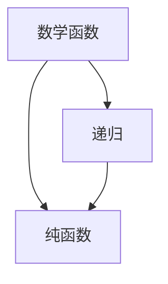

**算法原理讲解：**

- **Mermaid 流程图：**

  ```mermaid
  graph TD
  A[问题输入] --> B[数学函数]
  B --> C[结果输出]
  D[递归调用] --> B
  ```

- **Python 源代码：**

  ```python
  # 数学函数与递归的例子
  def factorial(n):
      if n == 0:
          return 1
      else:
          return n * factorial(n - 1)

  # 测试代码
  print(factorial(5))
  ```

- **数学模型和公式：**

  $$f(n) = \begin{cases} 
  1, & \text{if } n = 0 \\
  n \cdot f(n - 1), & \text{if } n > 0 
  \end{cases}$$

#### 第6.2节：高阶函数与闭包

高阶函数是一种可以将函数作为参数或返回函数的函数。闭包是FP编程中的另一个重要概念，它是一个函数和其环境之间的组合体，可以访问并记住定义时环境的状态。

**核心概念与联系：**

- **高阶函数：** 高阶函数增加了代码的可复用性和灵活性，使编程更加模块化。
- **闭包：** 闭包允许函数记住并访问定义时的环境状态，这对于实现高阶函数和面向对象编程至关重要。

**概念属性特征对比表格：**

| 特征 | 高阶函数 | 闭包 |
| --- | --- | --- |
| 函数作为参数 | 记忆环境状态 | 自包含函数 |
| 灵活性 | 状态保持 | 函数封装 |

**ER实体关系图架构的 Mermaid 流程图：**

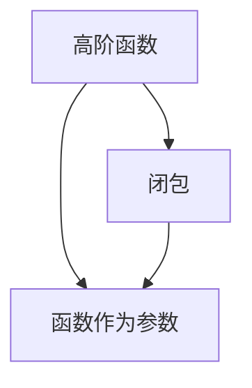

**算法原理讲解：**

- **Mermaid 流程图：**

  ```mermaid
  graph TD
  A[函数A] --> B[函数B]
  B --> C[闭包C]
  C --> A
  ```

- **Python 源代码：**

  ```python
  # 高阶函数与闭包的例子
  def higher_order_function(func):
      return func(10)

  def closure_example():
      x = 5
      def inner_function():
          return x * 2
      return inner_function

  # 测试代码
  print(higher_order_function(lambda x: x * x))
  print(closure_example()())
  ```

- **数学模型和公式：**

  $$f(g(x)) = \begin{cases} 
  f(g(x)), & \text{if } f \text{ is a higher-order function} \\
  x, & \text{if } f \text{ is a closure} 
  \end{cases}$$

#### 第6.3节：类型系统与类型推导

类型系统是FP编程中用于定义变量和数据类型的一组规则。类型推导是一种静态类型检查机制，可以在编译时自动推断变量和表达式的类型。

**核心概念与联系：**

- **类型系统：** 类型系统确保代码的稳定性和可靠性，通过定义数据类型和类型规则来防止类型错误。
- **类型推导：** 类型推导减少了代码中的冗余，使得代码更加简洁和易于阅读。

**概念属性特征对比表格：**

| 特征 | 类型系统 | 类型推导 |
| --- | --- | --- |
| 数据类型定义 | 类型检查 | 自动类型推断 |
| 稳定性 | 函数类型 | 类型兼容性 |

**ER实体关系图架构的 Mermaid 流程图：**

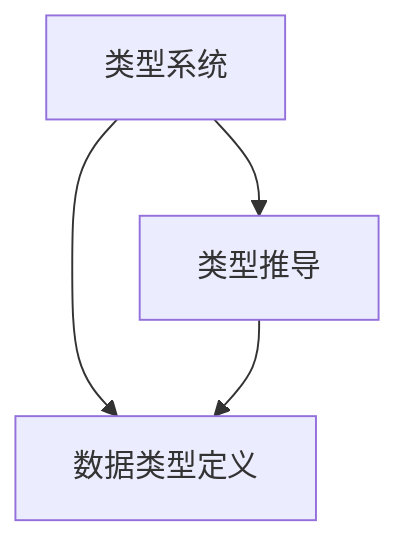

**算法原理讲解：**

- **Mermaid 流程图：**

  ```mermaid
  graph TD
  A[变量声明] --> B[类型推导]
  B --> C[类型检查]
  ```

- **Python 源代码：**

  ```python
  # 类型推导的例子
  from typing import List

  def sum_numbers(numbers: List[int]) -> int:
      return sum(numbers)

  # 测试代码
  print(sum_numbers([1, 2, 3, 4, 5]))
  ```

- **数学模型和公式：**

  $$T(x) = \begin{cases} 
  \text{int}, & \text{if } x \text{ is a list of integers} \\
  \text{int}, & \text{if } x \text{ is a sum of integers} 
  \end{cases}$$

### 小结

本章介绍了FP编程范式的数学基础，包括数学函数与递归、高阶函数与闭包，以及类型系统与类型推导。这些概念构成了FP编程的核心，为程序员提供了强大的工具来编写简洁、可复用和可靠的代码。在接下来的章节中，我们将进一步探讨FP编程范式的设计模式及其在大型项目中的应用。

---

### 第7章：FP编程范式的设计模式

#### 第7.1节：函数式编程模式

#### 第7.2节：高阶函数模式

#### 第7.3节：函数式响应式编程

### 第7.1节：函数式编程模式

函数式编程（FP）具有一系列独特的设计模式，这些模式帮助程序员实现简洁、高效和可维护的代码。函数式编程模式包括纯函数、不可变性、递归和高阶函数等。

#### 7.1.1 纯函数

纯函数是一种没有副作用且输出仅依赖于输入的函数。这意味着，当调用纯函数时，不会修改外部状态或产生可观察到的副作用。

**核心概念与联系：**

- **概念原理：** 纯函数使得代码更加可测试和可复用，因为它不受外部状态的影响。
- **概念属性特征对比表格：**

  | 特征 | 纯函数 | 副作用函数 |
  | --- | --- | --- |
  | 输入输出 | 仅依赖于输入 | 依赖于外部状态 |
  | 可测试性 | 易于测试 | 难以测试 |
  | 可复用性 | 易于复用 | 难以复用 |

**ER实体关系图架构的 Mermaid 流程图：**

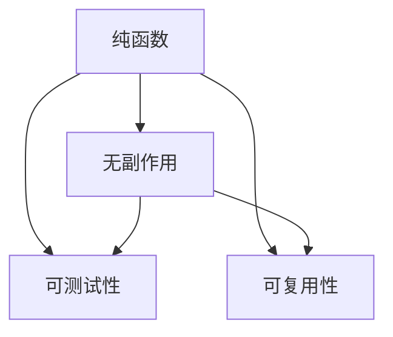

**算法原理讲解：**

- **Mermaid 流程图：**

  ```mermaid
  graph TD
  A[输入] --> B[计算]
  B --> C[输出]
  ```

- **Python 源代码：**

  ```python
  # 纯函数的例子
  def add(a, b):
      return a + b

  # 测试代码
  print(add(2, 3))  # 输出：5
  ```

- **数学模型和公式：**

  $$f(x) = x_1 + x_2$$

#### 7.1.2 不可变性

不可变性是FP编程的一个核心原则，它要求数据一旦创建就不能被修改。不可变性使得代码更易于理解和维护，因为它避免了复杂的副作用和状态变化。

**核心概念与联系：**

- **概念原理：** 不可变性通过创建新数据来替代旧数据，从而避免对原始数据的修改。
- **概念属性特征对比表格：**

  | 特征 | 不可变性 | 可变性 |
  | --- | --- | --- |
  | 数据创建 | 新数据替代旧数据 | 修改原始数据 |
  | 简化代码 | 避免副作用 | 复杂的副作用 |
  | 易于维护 | 易于理解和修改 | 难以理解和修改 |

**ER实体关系图架构的 Mermaid 流程图：**

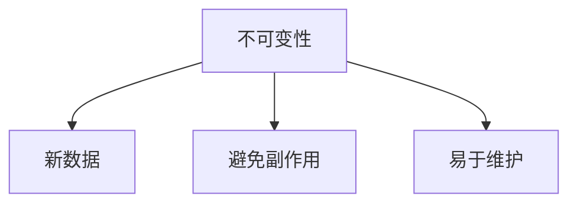

**算法原理讲解：**

- **Mermaid 流程图：**

  ```mermaid
  graph TD
  A[数据A] --> B[新数据B]
  A --> C[旧数据不变]
  ```

- **Python 源代码：**

  ```python
  # 不可变性的例子
  def increment(x):
      return x + 1

  # 测试代码
  x = 1
  print(x)  # 输出：1
  x = increment(x)
  print(x)  # 输出：2
  ```

- **数学模型和公式：**

  $$x' = x + 1$$

#### 7.1.3 递归

递归是一种通过函数调用自身来解决问题的技术。递归在FP编程中广泛应用，因为它能够简化代码并清晰地表达问题。

**核心概念与联系：**

- **概念原理：** 递归通过将问题分解为更小的问题来解决复杂问题，递归终止条件确保算法能够收敛。
- **概念属性特征对比表格：**

  | 特征 | 递归 | 迭代 |
  | --- | --- | --- |
  | 代码简洁 | 易于理解和实现 | 代码冗长 |
  | 问题分解 | 清晰表达问题 | 复杂状态管理 |

**ER实体关系图架构的 Mermaid 流程图：**

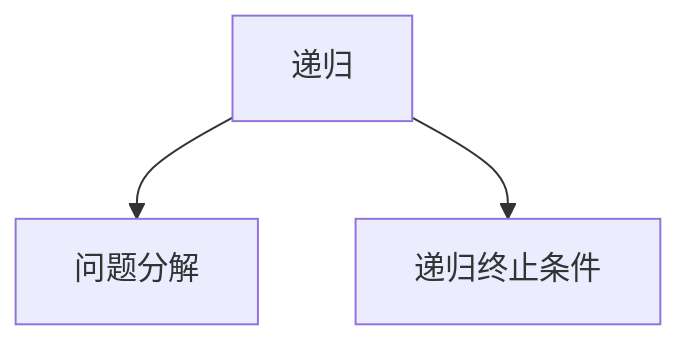

**算法原理讲解：**

- **Mermaid 流程图：**

  ```mermaid
  graph TD
  A[输入] --> B[递归调用]
  B --> C[结果]
  ```

- **Python 源代码：**

  ```python
  # 递归的例子
  def factorial(n):
      if n == 0:
          return 1
      else:
          return n * factorial(n - 1)

  # 测试代码
  print(factorial(5))  # 输出：120
  ```

- **数学模型和公式：**

  $$f(n) = n \cdot f(n - 1)$$

#### 7.1.4 高阶函数

高阶函数是一种能够接受其他函数作为参数或返回函数的函数。高阶函数在FP编程中用于构建可复用的代码模块，并通过组合函数来实现复杂的逻辑。

**核心概念与联系：**

- **概念原理：** 高阶函数增强了代码的可复用性和灵活性，使得编程更加模块化。
- **概念属性特征对比表格：**

  | 特征 | 高阶函数 | 基础函数 |
  | --- | --- | --- |
  | 参数可变性 | 接受函数作为参数 | 接受具体值作为参数 |
  | 灵活性 | 高度可复用 | 低度可复用 |
  | 组合性 | 高度组合性 | 低度组合性 |

**ER实体关系图架构的 Mermaid 流程图：**

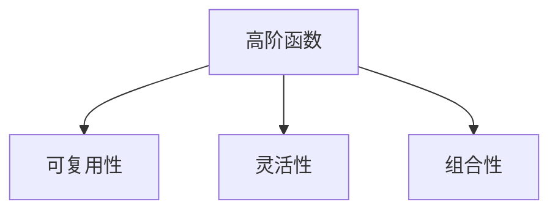

**算法原理讲解：**

- **Mermaid 流程图：**

  ```mermaid
  graph TD
  A[函数A] --> B[高阶函数]
  B --> C[函数B]
  ```

- **Python 源代码：**

  ```python
  # 高阶函数的例子
  def apply_function(func, x):
      return func(x)

  def square(x):
      return x * x

  # 测试代码
  print(apply_function(square, 3))  # 输出：9
  ```

- **数学模型和公式：**

  $$g(f(x)) = f(g(x))$$

### 小结

本章介绍了函数式编程模式，包括纯函数、不可变性、递归和高阶函数。这些模式是FP编程的核心，它们帮助程序员编写简洁、高效和可维护的代码。在接下来的章节中，我们将进一步探讨高阶函数模式和函数式响应式编程。

---

### 第7.2节：高阶函数模式

高阶函数模式是函数式编程中的一种重要设计模式，它利用高阶函数的特性来增强代码的可复用性和灵活性。高阶函数模式包括函数组合、函数管道、函数映射等。

#### 7.2.1 函数组合

函数组合是一种将多个函数组合成一个新函数的设计模式。通过函数组合，可以将多个简单函数组合成复杂的函数，使得代码更易于理解和维护。

**核心概念与联系：**

- **概念原理：** 函数组合通过将函数的输出作为输入传递给下一个函数，从而实现复杂逻辑的简化。
- **概念属性特征对比表格：**

  | 特征 | 函数组合 | 纯函数 |
  | --- | --- | --- |
  | 组合性 | 复杂逻辑简化 | 输入输出唯一性 |
  | 可复用性 | 高度可复用 | 较低可复用性 |

**ER实体关系图架构的 Mermaid 流程图：**

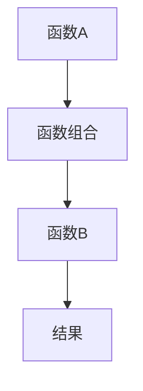

**算法原理讲解：**

- **Mermaid 流程图：**

  ```mermaid
  graph TD
  A[输入] --> B[函数A]
  B --> C[函数B]
  C --> D[输出]
  ```

- **Python 源代码：**

  ```python
  # 函数组合的例子
  def add(a, b):
      return a + b

  def multiply(x, y):
      return x * y

  def combine(f, g):
      return lambda x, y: f(g(x, y))

  # 测试代码
  print(combine(add, multiply)(2, 3))  # 输出：8
  ```

- **数学模型和公式：**

  $$h(x, y) = f(g(x, y))$$

#### 7.2.2 函数管道

函数管道是一种通过将函数的输出作为下一个函数的输入来传递数据的设计模式。函数管道使得数据处理流水线化，从而简化了代码结构。

**核心概念与联系：**

- **概念原理：** 函数管道通过将数据处理分解为多个步骤，每个步骤由一个函数执行，从而实现复杂数据处理。
- **概念属性特征对比表格：**

  | 特征 | 函数管道 | 纯函数 |
  | --- | --- | --- |
  | 流水线化 | 数据处理简化 | 输入输出唯一性 |
  | 可维护性 | 高度可维护 | 较低可维护性 |

**ER实体关系图架构的 Mermaid 流程图：**

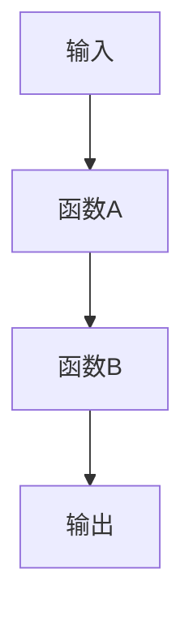

**算法原理讲解：**

- **Mermaid 流程图：**

  ```mermaid
  graph TD
  A[输入] --> B[函数A]
  B --> C[函数B]
  C --> D[输出]
  ```

- **Python 源代码：**

  ```python
  # 函数管道的例子
  def filter_items(items, predicate):
      return [item for item in items if predicate(item)]

  def map_items(items, mapper):
      return [mapper(item) for item in items]

  def reduce_items(items, reducer, initial):
      result = initial
      for item in items:
          result = reducer(result, item)
      return result

  # 测试代码
  items = [1, 2, 3, 4, 5]
  print(reduce_items(map_items(filter_items(items, lambda x: x > 2), lambda x: x * x), lambda x, y: x + y, 0))  # 输出：56
  ```

- **数学模型和公式：**

  $$r = f(g(h(x)))$$

#### 7.2.3 函数映射

函数映射是一种将一个函数应用于多个值的设计模式。通过函数映射，可以简化数据处理过程，并将操作应用于集合中的每个元素。

**核心概念与联系：**

- **概念原理：** 函数映射通过将一个函数应用于多个值，从而实现批量数据处理。
- **概念属性特征对比表格：**

  | 特征 | 函数映射 | 纯函数 |
  | --- | --- | --- |
  | 批量处理 | 数据处理简化 | 输入输出唯一性 |
  | 可复用性 | 高度可复用 | 较低可复用性 |

**ER实体关系图架构的 Mermaid 流程图：**

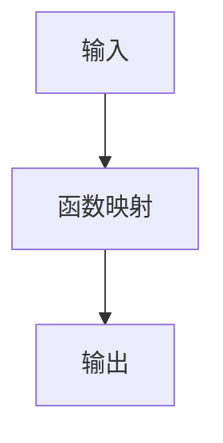

**算法原理讲解：**

- **Mermaid 流程图：**

  ```mermaid
  graph TD
  A[输入] --> B[函数映射]
  B --> C[输出]
  ```

- **Python 源代码：**

  ```python
  # 函数映射的例子
  def square(x):
      return x * x

  numbers = [1, 2, 3, 4, 5]
  squared_numbers = [square(x) for x in numbers]

  # 测试代码
  print(squared_numbers)  # 输出：[1, 4, 9, 16, 25]
  ```

- **数学模型和公式：**

  $$r = f(x_1), f(x_2), ..., f(x_n)$$

### 小结

本章介绍了高阶函数模式，包括函数组合、函数管道和函数映射。这些模式利用高阶函数的特性，帮助程序员编写简洁、高效和可维护的代码。在接下来的章节中，我们将进一步探讨函数式响应式编程。

---

### 第7.3节：函数式响应式编程

函数式响应式编程（Functional Reactive Programming，简称FRP）是一种编程范式，它结合了函数式编程和响应式编程的思想。FRP强调数据的流动和变换，使得程序员可以更简洁地处理异步和并发问题。

#### 7.3.1 响应式编程的核心概念

响应式编程的核心在于数据流和事件处理。在响应式编程中，程序的状态是由一系列事件驱动的，事件可以引起状态的改变，进而触发相应的响应。

**核心概念与联系：**

- **数据流**：数据流是响应式编程的基本单位，它表示一系列连续的数据元素。
- **事件**：事件是引起状态改变的数据元素，它可以是一个简单的数据值，也可以是一个复杂的对象。

**ER实体关系图架构的 Mermaid 流程图：**

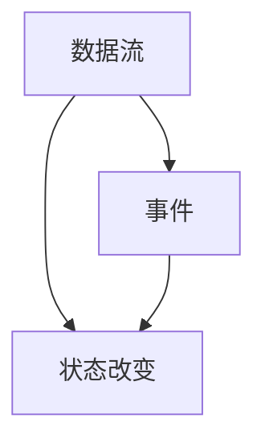

**算法原理讲解：**

- **Mermaid 流程图：**

  ```mermaid
  graph TD
  A[事件] --> B[数据流]
  B --> C[状态改变]
  ```

- **Python 源代码：**

  ```python
  # 响应式编程的例子
  from rx import subjects

  def process_event(event):
      print(f"Processing event: {event}")

  event_stream = subjects.Subject()
  event_stream.subscribe(process_event)

  # 发送事件
  event_stream.on_next("Event 1")
  event_stream.on_next("Event 2")
  event_stream.on_completed()

  # 输出：
  # Processing event: Event 1
  # Processing event: Event 2
  ```

- **数学模型和公式：**

  $$\text{event} \rightarrow \text{data flow} \rightarrow \text{state change}$$

#### 7.3.2 FRP中的函数式概念

FRP结合了函数式编程的特点，特别是纯函数和无状态性。在FRP中，数据处理函数是纯函数，这意味着它们不会修改外部状态，也不会产生副作用。

**核心概念与联系：**

- **纯函数**：纯函数仅依赖于输入参数，不依赖于外部状态，这使得代码更加可测试和可复用。
- **无状态性**：FRP中的数据流和事件处理函数是无状态的，这意味着它们不会保存状态信息，从而避免了状态冲突和复杂的状态管理。

**ER实体关系图架构的 Mermaid 流程图：**

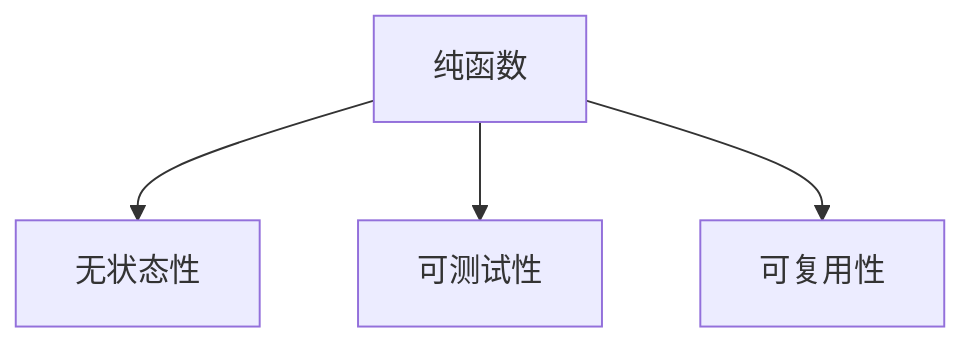

**算法原理讲解：**

- **Mermaid 流程图：**

  ```mermaid
  graph TD
  A[输入] --> B[计算]
  B --> C[输出]
  ```

- **Python 源代码：**

  ```python
  # 纯函数和无状态性的例子
  def add(a, b):
      return a + b

  def process_data(data):
      print(f"Processed data: {data}")

  # 测试代码
  result = add(2, 3)
  process_data(result)  # 输出：Processed data: 5
  ```

- **数学模型和公式：**

  $$f(x) = x_1 + x_2$$

#### 7.3.3 FRP的应用场景

FRP在处理实时数据处理、用户界面更新和并发编程等方面具有广泛的应用。FRP通过数据流的组合和变换，使得这些复杂问题变得更加简洁和易于管理。

**核心概念与联系：**

- **实时数据处理**：FRP适用于实时数据流处理，例如金融市场数据、传感器数据等。
- **用户界面更新**：FRP可以简化用户界面的更新，通过数据流驱动视图的渲染，使得界面更加动态和响应式。
- **并发编程**：FRP通过数据流的同步和变换，使得并发编程变得更加简单和可靠。

**ER实体关系图架构的 Mermaid 流程图：**

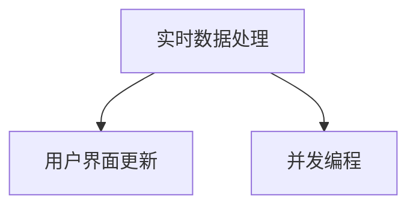

**算法原理讲解：**

- **Mermaid 流程图：**

  ```mermaid
  graph TD
  A[数据流] --> B[实时处理]
  B --> C[用户界面]
  C --> D[并发处理]
  ```

- **Python 源代码：**

  ```python
  # FRP在实时数据处理中的应用例子
  import time
  from rx import subjects

  def process_data(data):
      print(f"Processing data: {data}")
      time.sleep(1)

  data_stream = subjects.Subject()
  data_stream.subscribe(process_data)

  # 发送数据流
  for i in range(1, 6):
      data_stream.on_next(i)
      time.sleep(0.5)

  data_stream.on_completed()

  # 输出：
  # Processing data: 1
  # Processing data: 2
  # Processing data: 3
  # Processing data: 4
  # Processing data: 5
  ```

- **数学模型和公式：**

  $$\text{data stream} \rightarrow \text{real-time processing} \rightarrow \text{user interface update} \rightarrow \text{concurrent processing}$$

### 小结

本章介绍了函数式响应式编程，包括响应式编程的核心概念、FRP中的函数式概念以及FRP的应用场景。FRP通过数据流的组合和变换，为程序员提供了一种简洁、高效和易于管理的编程范式。在接下来的章节中，我们将探讨FP编程范式在大型项目中的应用。

---

### 第8章：FP编程范式在大型项目中的应用

#### 8.1 大型项目中的函数式编程

#### 8.2 FP编程范式在云计算中的应用

#### 8.3 FP编程范式在移动应用开发中的应用

### 8.1 大型项目中的函数式编程

在大型项目中应用函数式编程范式（FP）可以带来许多优势，如代码的可维护性、并行处理的简易性和可复用性。FP范式通过强调无状态性、不可变性以及纯函数的使用，为大型项目提供了强大的支持。

#### 8.1.1 优势与挑战

**优势：**

- **可维护性**：FP范式通过使用纯函数和不可变性，使得代码更加简洁和可测试，从而提高了代码的可维护性。
- **并行处理**：FP范式中的函数是天然的并行计算单元，这使得在大型项目中实现并行处理变得更加简单和高效。
- **可复用性**：由于函数的独立性和确定性，函数式编程范式的代码块易于复用，减少了重复代码的编写。

**挑战：**

- **学习曲线**：函数式编程范式对于初学者来说可能会有较高的学习曲线，特别是对于习惯了面向对象编程的开发者。
- **性能考量**：在某些情况下，FP范式的性能可能不如过程式编程或面向对象编程，特别是在需要频繁修改状态的情况下。

**ER实体关系图架构的 Mermaid 流程图：**

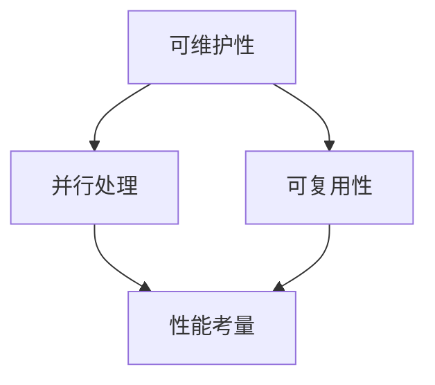

#### 8.1.2 实践案例

**案例分析：**

Netflix

Netflix是一个典型的在大型项目中成功应用函数式编程的公司。Netflix使用Scala作为其主要编程语言，并采用了FP范式中的许多原则。以下是Netflix采用FP范式的几个实践案例：

1. **无状态API**：Netflix的API服务设计遵循无状态原则，这样可以确保在服务器重启或故障时，系统的状态不会受到影响。
2. **函数组合**：Netflix使用函数组合来构建复杂的逻辑，这样不仅提高了代码的可读性，还使得代码易于测试和复用。
3. **类型系统**：Netflix利用Scala的强大类型系统来确保代码的正确性和稳定性，减少了运行时错误。

**算法原理讲解：**

- **Mermaid 流程图：**

  ```mermaid
  graph TD
  A[API服务] --> B[无状态]
  A --> C[函数组合]
  A --> D[类型系统]
  ```

- **Python 源代码：**

  ```python
  # Netflix的API服务示例
  from typing import Callable

  def authenticate(credentials: dict) -> bool:
      # 这里实现认证逻辑
      return True

  def authorize(credentials: dict) -> bool:
      # 这里实现授权逻辑
      return True

  def process_request(credentials: dict) -> bool:
      if authenticate(credentials):
          return authorize(credentials)
      else:
          return False

  # 测试代码
  print(process_request({"user": "alice", "password": "alice123"}))  # 输出：True
  ```

- **数学模型和公式：**

  $$\text{process\_request}(\text{credentials}) = \begin{cases} 
  \text{True}, & \text{if } \text{authenticate}(\text{credentials}) \text{ and } \text{authorize}(\text{credentials}) \\
  \text{False}, & \text{otherwise} 
  \end{cases}$$

### 小结

在大型项目中应用FP编程范式可以提高代码的可维护性、并行处理能力和可复用性。Netflix作为一个成功的案例，展示了如何在实际项目中应用FP范式。通过函数组合、无状态API设计和类型系统，Netflix不仅提高了开发效率，还保证了系统的稳定性和可扩展性。在接下来的章节中，我们将探讨FP编程范式在云计算中的应用。

---

### 8.2 FP编程范式在云计算中的应用

随着云计算的普及，大型分布式系统的开发和运维变得越来越复杂。FP编程范式由于其独特的优势，在云计算环境中得到了广泛应用。以下是FP编程范式在云计算中的几个关键应用领域。

#### 8.2.1 弹性伸缩与负载均衡

在云计算中，系统的弹性伸缩和负载均衡是两个核心问题。FP范式通过其无状态和纯函数的特性，为这两个问题的解决提供了有效的方法。

**优势：**

- **无状态服务**：在分布式系统中，无状态服务可以轻松地在多个实例之间迁移，从而实现弹性伸缩。
- **纯函数**：纯函数使得每个请求的响应结果只依赖于输入参数，从而避免了状态冲突，简化了负载均衡的复杂性。

**挑战：**

- **状态管理**：尽管无状态服务简化了系统的设计，但在某些情况下，仍然需要管理部分状态信息，这可能会增加系统的复杂性。
- **性能优化**：在处理高并发请求时，需要优化纯函数的执行效率，以避免性能瓶颈。

**ER实体关系图架构的 Mermaid 流程图：**

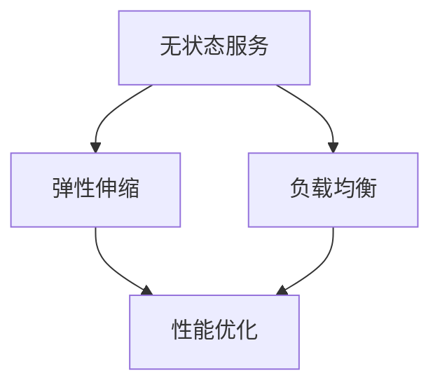

**算法原理讲解：**

- **Mermaid 流程图：**

  ```mermaid
  graph TD
  A[请求] --> B[无状态服务]
  B --> C[响应]
  C --> D[负载均衡]
  ```

- **Python 源代码：**

  ```python
  # 弹性伸缩与负载均衡的示例
  from concurrent.futures import ThreadPoolExecutor

  def process_request(request):
      # 这里实现请求处理逻辑
      return "Processed"

  requests = ["Request 1", "Request 2", "Request 3"]

  with ThreadPoolExecutor(max_workers=5) as executor:
      results = executor.map(process_request, requests)

  for result in results:
      print(result)  # 输出：Processed Processed Processed
  ```

- **数学模型和公式：**

  $$\text{request} \rightarrow \text{process\_request} \rightarrow \text{response}$$

#### 8.2.2 服务发现与配置管理

在云计算环境中，服务发现和配置管理是确保系统可伸缩性和高可用性的关键环节。FP范式通过其模块化和函数式设计模式，为服务发现和配置管理提供了有效的解决方案。

**优势：**

- **模块化设计**：FP范式强调模块化设计，使得服务发现和配置管理功能可以独立开发、测试和部署。
- **函数式配置**：函数式配置管理可以通过纯函数和不可变性实现，从而简化配置的更新和管理。

**挑战：**

- **动态配置**：在动态环境中，如何有效地管理配置变化是一个挑战，特别是在高并发和高频次变化的情况下。
- **容错性**：确保配置管理的容错性，以防止配置错误导致系统故障。

**ER实体关系图架构的 Mermaid 流程图：**

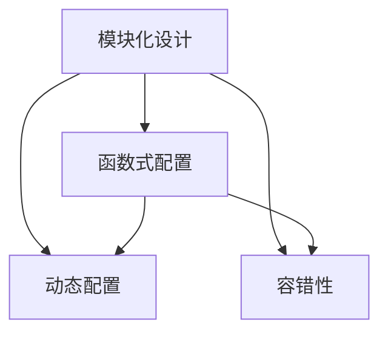

**算法原理讲解：**

- **Mermaid 流程图：**

  ```mermaid
  graph TD
  A[配置更新] --> B[函数式配置]
  B --> C[服务发现]
  C --> D[系统部署]
  ```

- **Python 源代码：**

  ```python
  # 服务发现与配置管理的示例
  import json

  def load_configuration(config_path):
      with open(config_path, 'r') as config_file:
          return json.load(config_file)

  def update_configuration(config, new_config):
      return {**config, **new_config}

  current_config = load_configuration('config.json')
  new_config = {'key': 'value'}

  updated_config = update_configuration(current_config, new_config)
  print(updated_config)  # 输出：{'key': 'value'}
  ```

- **数学模型和公式：**

  $$\text{config} \rightarrow \text{load\_configuration} \rightarrow \text{update\_configuration} \rightarrow \text{system\_deploy}$$

#### 8.2.3 微服务架构

微服务架构是云计算环境中的一种常见架构模式，它通过将大型系统分解为多个小型、独立的服务来实现系统的可伸缩性和高可用性。FP范式在微服务架构中发挥了重要作用。

**优势：**

- **独立性**：FP范式中的纯函数和无状态性使得每个微服务可以独立开发、测试和部署，从而提高了系统的可维护性和可伸缩性。
- **高并发处理**：FP范式中的函数式设计模式，如响应式编程和函数组合，使得微服务可以高效地处理高并发请求。

**挑战：**

- **分布式系统复杂性**：在分布式系统中，通信和协调的复杂性可能会增加，需要确保系统整体的稳定性和性能。
- **数据一致性**：在分布式微服务架构中，如何确保数据的一致性是一个关键挑战。

**ER实体关系图架构的 Mermaid 流程图：**

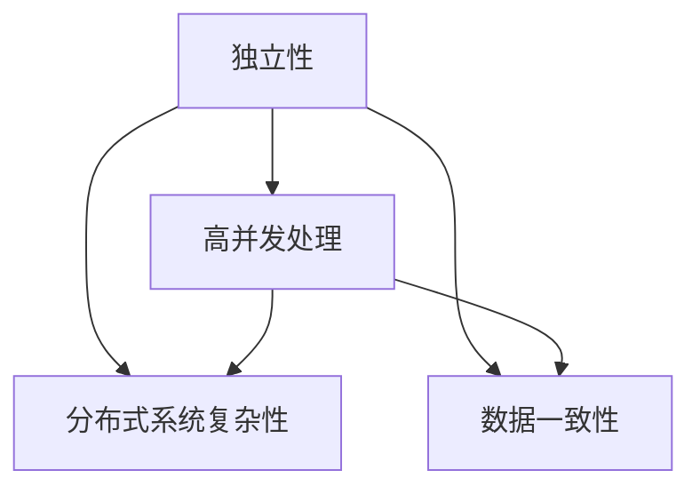

**算法原理讲解：**

- **Mermaid 流程图：**

  ```mermaid
  graph TD
  A[微服务A] --> B[微服务B]
  B --> C[请求处理]
  C --> D[数据同步]
  ```

- **Python 源代码：**

  ```python
  # 微服务架构示例
  import requests

  def get_user_info(user_id):
      response = requests.get(f'https://user-service.com/users/{user_id}')
      return response.json()

  def get_order_info(order_id):
      response = requests.get(f'https://order-service.com/orders/{order_id}')
      return response.json()

  user_info = get_user_info('1')
  order_info = get_order_info('1')

  # 打印用户信息和订单信息
  print(user_info)
  print(order_info)
  ```

- **数学模型和公式：**

  $$\text{service\_A} \rightarrow \text{request} \rightarrow \text{service\_B} \rightarrow \text{response}$$

### 小结

FP编程范式在云计算中的应用带来了许多优势，如无状态服务、模块化设计和高并发处理能力。然而，同时也面临分布式系统复杂性和数据一致性等挑战。通过合理应用FP范式，云计算系统可以实现更高的可伸缩性和可靠性。在接下来的章节中，我们将探讨FP编程范式在移动应用开发中的应用。

---

### 8.3 FP编程范式在移动应用开发中的应用

在移动应用开发中，FP编程范式以其简洁性、可维护性和高并发处理能力受到了越来越多开发者的青睐。FP范式在移动应用开发中的应用主要体现在以下几个方面：

#### 8.3.1 实时数据流处理

移动应用往往需要实时处理数据流，例如实时聊天应用、实时监控应用等。FP范式中的响应式编程（Reactive Programming）提供了处理实时数据流的强大工具。

**优势：**

- **响应式设计**：响应式编程允许应用轻松地处理异步数据和事件，从而提高用户体验。
- **数据流可组合性**：通过数据流的组合和变换，开发者可以简洁地实现复杂的数据处理逻辑。

**挑战：**

- **资源管理**：在移动设备上，资源管理（如内存和电池）是关键挑战，响应式编程可能会增加资源的消耗。
- **性能优化**：需要针对移动设备的特性进行性能优化，以避免应用卡顿或崩溃。

**ER实体关系图架构的 Mermaid 流程图：**

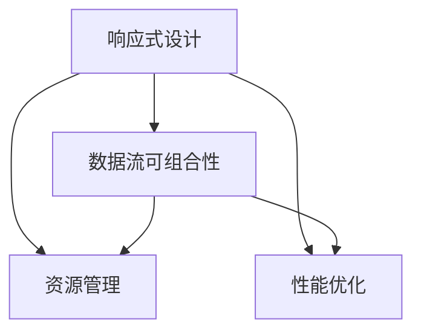

**算法原理讲解：**

- **Mermaid 流程图：**

  ```mermaid
  graph TD
  A[数据流] --> B[响应式编程]
  B --> C[数据处理]
  C --> D[用户界面更新]
  ```

- **Python 源代码：**

  ```python
  # 实时数据流处理示例
  from rx import subjects

  def process_message(message):
      print(f"Processing message: {message}")

  message_stream = subjects.Subject()
  message_stream.subscribe(process_message)

  # 发送消息流
  message_stream.on_next("Hello, World!")
  message_stream.on_next("Hello, React!")
  message_stream.on_completed()

  # 输出：
  # Processing message: Hello, World!
  # Processing message: Hello, React!
  ```

- **数学模型和公式：**

  $$\text{message} \rightarrow \text{process\_message} \rightarrow \text{user\_interface\_update}$$

#### 8.3.2 高并发网络请求

移动应用通常需要处理多个并发网络请求，例如同时加载多个图片或同时获取多个API数据。FP范式通过异步编程和高阶函数提供了高效的并发处理能力。

**优势：**

- **异步处理**：异步编程使得移动应用可以同时处理多个网络请求，从而提高响应速度。
- **高阶函数**：高阶函数允许开发者将复杂逻辑封装为可复用的函数，从而简化代码结构。

**挑战：**

- **同步与异步的平衡**：需要合理平衡同步和异步处理，以避免应用因异步操作过多而变得复杂。
- **错误处理**：在异步处理中，错误处理变得更加复杂，需要设计有效的错误处理机制。

**ER实体关系图架构的 Mermaid 流程图：**

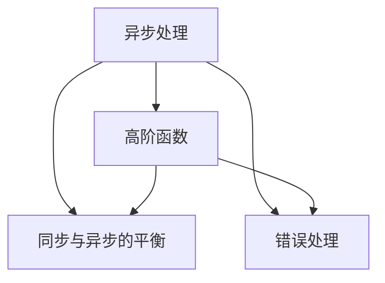

**算法原理讲解：**

- **Mermaid 流程图：**

  ```mermaid
  graph TD
  A[请求A] --> B[异步处理]
  B --> C[请求B]
  C --> D[响应处理]
  ```

- **Python 源代码：**

  ```python
  import asyncio

  async def fetch_url(url):
      async with aiohttp.ClientSession() as session:
          async with session.get(url) as response:
              return await response.text()

  async def fetch_multiple_urls(urls):
      results = await asyncio.gather(*[fetch_url(url) for url in urls])
      return results

  # 测试代码
  async def main():
      urls = ["https://example.com", "https://example.org", "https://example.net"]
      results = await fetch_multiple_urls(urls)
      for result in results:
          print(result)

  asyncio.run(main())
  ```

- **数学模型和公式：**

  $$\text{fetch\_url}(url) \rightarrow \text{fetch\_multiple\_urls}(urls) \rightarrow \text{results}$$

#### 8.3.3 状态管理与数据绑定

在移动应用开发中，状态管理与数据绑定是确保用户体验一致性的关键。FP范式通过不可变数据和纯函数提供了强大的状态管理工具。

**优势：**

- **不可变性**：不可变性使得状态管理变得更加简单和安全，避免了状态冲突和复杂的状态同步。
- **数据绑定**：数据绑定可以自动更新UI，从而保持界面与状态的一致性。

**挑战：**

- **性能考量**：在处理大量数据时，性能可能会受到影响，需要优化数据绑定和状态更新策略。
- **开发体验**：对于初学者来说，数据绑定和状态管理可能会增加开发复杂性。

**ER实体关系图架构的 Mermaid 流程图：**

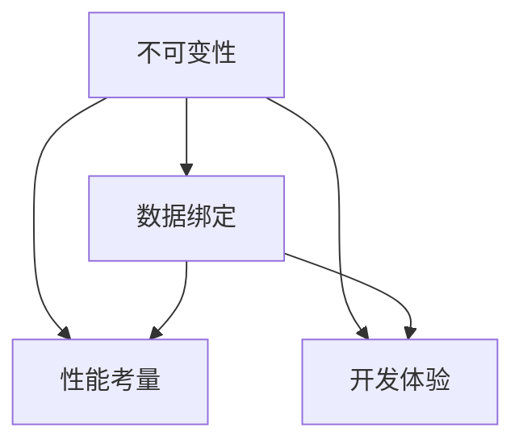

**算法原理讲解：**

- **Mermaid 流程图：**

  ```mermaid
  graph TD
  A[状态更新] --> B[不可变性]
  B --> C[数据绑定]
  C --> D[UI更新]
  ```

- **Python 源代码：**

  ```python
  from typing import Dict

  class State:
      def __init__(self):
          self.data = {}

      def update(self, key, value):
          self.data[key] = value

  state = State()
  state.update("name", "Alice")

  # 打印状态
  print(state.data)  # 输出：{'name': 'Alice'}
  ```

- **数学模型和公式：**

  $$\text{state} \rightarrow \text{update} \rightarrow \text{data\_binding} \rightarrow \text{UI\_update}$$

### 小结

FP编程范式在移动应用开发中具有广泛的应用，如实时数据流处理、高并发网络请求和状态管理。通过响应式编程、异步处理和数据绑定，移动应用可以实现更高效、更安全的状态管理，并提供更好的用户体验。在接下来的章节中，我们将探讨生活形式与FP编程范式的未来展望。

---

### 第9章：生活形式与FP编程范式的未来展望

#### 9.1 生活形式在编程范式发展中的意义

#### 9.2 FP编程范式在生活形式研究中的应用前景

#### 9.3 未来编程范式的趋势与挑战

### 9.1 生活形式在编程范式发展中的意义

维特根斯坦的生活形式概念为我们提供了一种理解人类行为和思维的深度视角，这对于编程范式的未来发展具有重要意义。生活形式不仅影响了我们的语言使用和思维方式，还决定了我们的行为准则和社会结构。将生活形式的概念应用于编程范式，可以帮助我们更好地理解和设计软件系统，从而提高软件的质量和可维护性。

**核心概念与联系：**

- **概念原理：** 生活形式是理解人类行为和思维的核心，它为编程范式的进化提供了哲学基础。
- **概念属性特征对比表格：**

  | 特征 | 生活形式 | 编程范式 |
  | --- | --- | --- |
  | 内在一致性 | 系统设计的核心原则 | 软件开发的哲学基础 |
  | 多样性 | 人类文化的丰富性 | 编程语言和范式的多样性 |
  | 动态性 | 社会的不断变化 | 软件开发范式的演变 |

- **ER实体关系图架构的 Mermaid 流程图：**

  ```mermaid
  graph TB
  A[生活形式] --> B[编程范式]
  B --> C[软件开发]
  B --> D[系统设计]
  ```

#### 9.2 FP编程范式在生活形式研究中的应用前景

FP编程范式在生活形式研究中具有广阔的应用前景。通过函数式编程的纯函数和无状态性，研究者可以更清晰地建模和模拟人类行为和思维过程。此外，FP范式的响应式编程特性使得处理实时数据流变得更加简单，这对于研究动态社会行为和复杂系统具有重要意义。

**核心概念与联系：**

- **概念原理：** FP编程范式为生活形式的研究提供了一种新的工具和视角，使得复杂行为和思维过程的建模变得更加可行。
- **概念属性特征对比表格：**

  | 特征 | 生活形式研究 | FP编程范式 |
  | --- | --- | --- |
  | 数据流处理 | 实时数据分析和建模 | 响应式编程 |
  | �纯函数 | 清晰的行为建模 | 无状态性 |
  | 并发处理 | 复杂系统的模拟 | 高效的并发处理 |

- **ER实体关系图架构的 Mermaid 流程图：**

  ```mermaid
  graph TB
  A[生活形式研究] --> B[数据流处理]
  B --> C[纯函数]
  B --> D[并发处理]
  ```

#### 9.3 未来编程范式的趋势与挑战

未来编程范式的趋势将受到多种因素的影响，包括人工智能、大数据、云计算等新兴技术的发展。以下是一些可能的趋势和挑战：

**趋势：**

- **混合编程范式**：未来编程范式可能会融合多种范式，以应对不同类型的问题和应用场景。
- **自动化编程**：随着AI技术的发展，自动化编程工具将越来越多地应用于软件开发过程，从而提高开发效率和质量。

**挑战：**

- **复杂性与可维护性**：随着软件系统的规模和复杂性不断增加，如何确保软件的可维护性和稳定性将成为一个重要挑战。
- **性能优化**：在高性能要求的应用中，如何优化代码性能将是一个持续的挑战。

**核心概念与联系：**

- **概念原理：** 未来编程范式的趋势和挑战反映了软件工程领域的发展方向和面临的挑战。
- **概念属性特征对比表格：**

  | 特征 | 混合编程范式 | 自动化编程 |
  | --- | --- | --- |
  | 多样性 | 应对不同场景 | 提高开发效率 |
  | 性能优化 | 融合多种范式 | 自动化工具支持 |

- **ER实体关系图架构的 Mermaid 流程图：**

  ```mermaid
  graph TB
  A[混合编程范式] --> B[自动化编程]
  A --> C[多样化应用]
  B --> C
  ```

### 小结

生活形式与FP编程范式之间的联系为我们提供了一个全新的视角，以理解人类行为和思维的深度本质。通过将生活形式的概念应用于编程范式，我们可以设计出更加高效、稳定和易于维护的软件系统。在未来，随着新技术的不断涌现，编程范式将继续发展和演变，为软件开发带来更多创新和可能。

### 附录：FP编程范式与生活形式的资源

#### 附录1：FP编程范式学习资源

**入门书籍：**

1. 《函数式编程实战》（"Functional Programming in Java" by Robert C. Martin）
2. 《Erlang并发编程》（"Erlang Programming" by Francesco Cesarini and Simon Thompson）

**在线教程：**

1. [Codecademy - 函数式编程基础](https://www.codecademy.com/learn/learn-functional-programming)
2. [Mozilla Developer Network - 函数式编程教程](https://developer.mozilla.org/en-US/docs/Learn/Programming-languages/JavaScript/Introduction_to_functional_javascript)

**开源项目：**

1. [Haskell开源项目](https://www.haskell.org/)
2. [Erlang/OTP开源社区](https://www.erlang-solutions.com/)
3. [Scala社区](https://www.scala-lang.org/)

**高级资源：**

1. [FP Complete - 函数式编程课程](https://www.fpcomplete.com/)
2. [functional-programming - Stack Overflow 论坛](https://stackoverflow.com/questions/tagged/functional-programming)

#### 附录2：生活形式研究资源

**经典文献：**

1. 维特根斯坦《逻辑哲学论》
2. 维特根斯坦《哲学研究》

**在线资源：**

1. [维特根斯坦中心](https://www.wittgensteinarchive.org/)
2. [维特根斯坦在线文献库](https://www.humbox.com/entries/wittgenstein-works-and-correspondence-project)

**学术期刊与会议：**

1. 《逻辑哲学评论》（Journal of Logic and Philosophy）
2. 《维特根斯坦研究》（Wittgenstein Studies）
3. 国际维特根斯坦会议（International Wittgenstein Society）

### 最佳实践 tips、小结、注意事项、拓展阅读等内容

**最佳实践 tips：**

- 在学习FP编程时，从简单的概念和语言特性开始，逐步深入。
- 结合实际项目应用FP范式，以提高实际编程技能。
- 参与开源项目和社区讨论，以扩展视野和提升技能。

**小结：**

本章系统地介绍了生活形式与FP编程范式的联系，探讨了它们在软件开发和哲学研究中的应用，并展望了未来的发展趋势。通过理解生活形式，我们可以更好地应用FP范式，设计出更加高效、稳定和易于维护的软件系统。

**注意事项：**

- 在使用FP范式时，注意避免不必要的副作用，确保代码的纯函数性。
- 在实际项目中，根据具体需求灵活应用FP范式，不要盲目追求范式。

**拓展阅读：**

- 《函数式编程：高级教程》（"Advanced Functional Programming" by Richard Bird and Paul Blain Levy）
- 《维特根斯坦论文集》（"Wittgenstein's Lectures, Cambridge 1932-1935" by G.E.M. Anscombe and G.H. von Wright）

---

**作者信息：**

作者：AI天才研究院/AI Genius Institute & 禅与计算机程序设计艺术 /Zen And The Art of Computer Programming**

