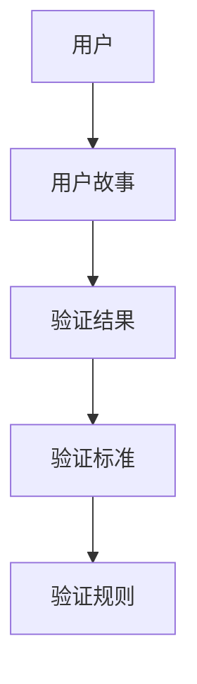
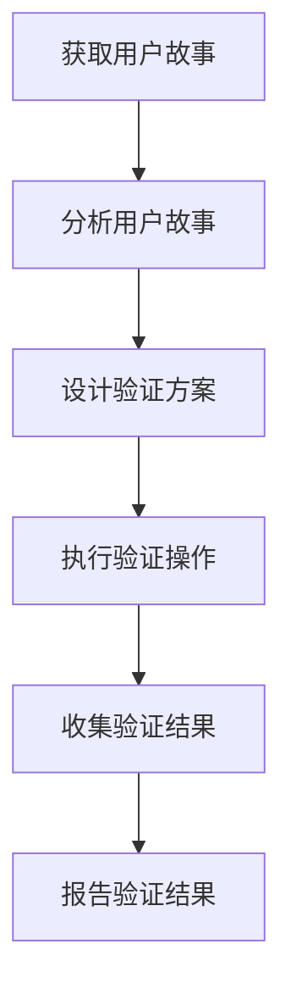
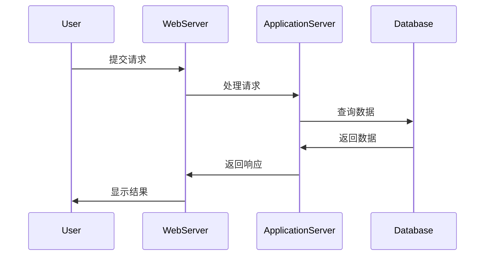
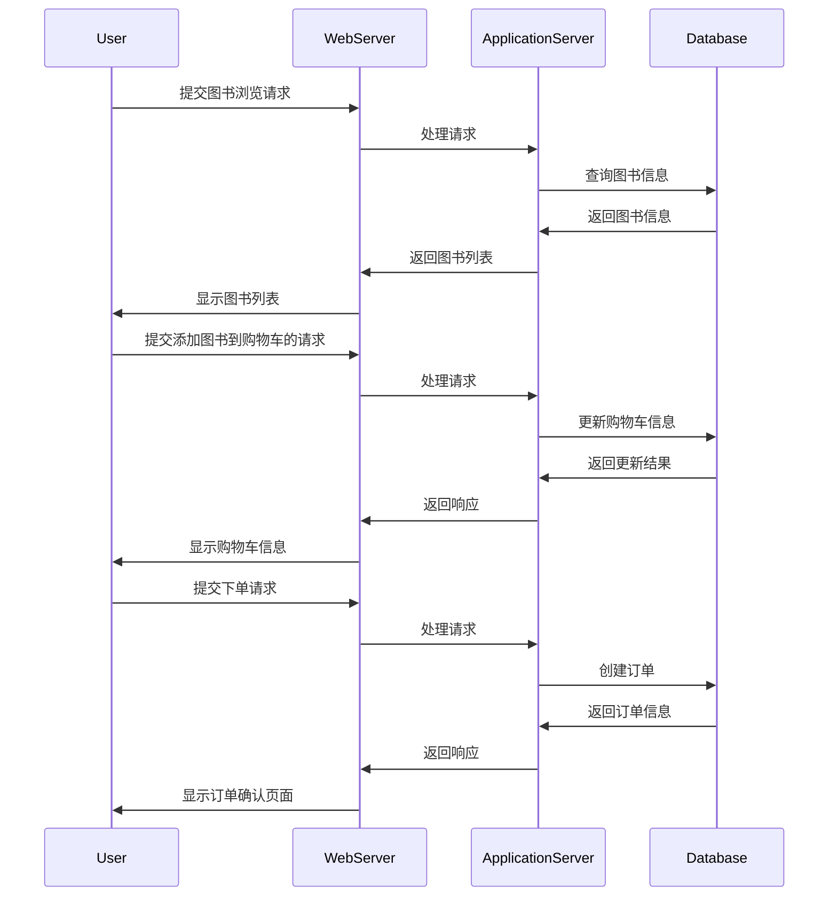

                 

# 《用户故事验证功能准确性》

> 关键词：用户故事、验证、功能准确性、软件工程、敏捷开发、测试

> 摘要：本文将探讨用户故事验证功能准确性的重要性。通过对用户故事的概念解析，验证用户故事的基本方法，以及具体的验证步骤和算法原理，帮助读者深入理解如何有效地验证用户故事的功能准确性。同时，文章还将分析用户故事验证在系统设计与开发中的应用场景，并给出具体的解决方案和架构设计。

## 第一部分：背景介绍

### 1.1 问题背景

在软件工程中，用户故事（User Story）是敏捷开发方法中的一种重要的需求表达形式。用户故事描述了用户期望软件系统提供的功能，通常采用自然语言进行编写。用户故事的重要性在于它能够将用户的需求直接映射到软件开发的各个环节，使得开发团队能够更好地理解和实现用户的需求。

然而，用户故事并非总是准确无误的。在实际开发过程中，用户故事可能会因为多种原因出现不准确的情况，如用户对系统功能理解不清晰、需求变更、沟通不畅等。这种情况下，如果不对用户故事进行有效的验证，可能会导致开发出的软件功能与用户实际需求存在较大偏差，从而影响软件的质量和用户体验。

因此，验证用户故事的准确性成为了软件开发过程中一个至关重要的问题。

### 1.1.1 验证用户故事准确性的必要性

验证用户故事准确性的必要性主要体现在以下几个方面：

1. **确保需求理解的一致性**：通过验证用户故事，可以确保开发团队对用户需求的理解是一致的，避免因为需求理解不一致而导致的功能偏差。
2. **提高软件质量**：准确的用户故事能够帮助开发团队更准确地实现功能，从而提高软件的质量。
3. **减少返工成本**：早期发现和纠正不准确的用户故事，可以减少后续开发过程中因功能偏差而产生的返工成本。
4. **增强用户满意度**：准确的用户故事能够更好地满足用户需求，从而提高用户满意度。

### 1.2 问题描述

用户故事不准确性的表现主要包括以下几个方面：

1. **需求不明确**：用户故事中描述的功能不够清晰，可能导致开发团队在实现过程中产生歧义。
2. **需求不完整**：用户故事中缺少某些关键功能或场景，导致实现的功能无法满足用户需求。
3. **需求不一致**：用户故事之间存在冲突或重复，导致开发团队在实现过程中产生困惑。
4. **需求过时**：用户故事中描述的需求在项目开发过程中可能已经过时，不再适用于当前项目。

验证用户故事的挑战主要来自于以下几个方面：

1. **复杂性**：用户故事可能涉及到复杂的业务逻辑和流程，验证其准确性需要深入理解和分析。
2. **动态性**：用户需求可能会在项目开发过程中发生变化，验证用户故事的准确性需要及时更新。
3. **沟通成本**：验证用户故事准确性需要与用户进行多次沟通，以确保需求的准确理解。
4. **资源限制**：验证用户故事准确性可能需要额外的资源和时间，这可能会对项目进度产生影响。

### 1.3 问题解决

为了有效验证用户故事的准确性，我们可以采取以下方法和步骤：

1. **明确用户故事的需求**：在编写用户故事时，确保用户故事的需求表达清晰、明确，避免出现歧义。
2. **与用户进行沟通**：在编写用户故事后，与用户进行充分的沟通，以确保开发团队对用户需求的准确理解。
3. **设计验证方案**：根据用户故事的特点和需求，设计相应的验证方案，包括验证方法、验证标准和验证步骤。
4. **执行验证操作**：按照验证方案，对用户故事进行验证，记录验证结果。
5. **分析验证结果**：对验证结果进行分析，识别用户故事中的不准确之处，并制定相应的改进措施。
6. **持续验证**：在项目开发过程中，持续对用户故事进行验证，确保需求的一致性和准确性。

### 1.4 边界与外延

用户故事验证的适用范围主要包括以下几个方面：

1. **敏捷开发项目**：在敏捷开发项目中，用户故事验证是确保需求准确性的重要手段。
2. **功能开发阶段**：在功能开发阶段，用户故事验证可以帮助开发团队更好地理解用户需求，确保开发出的功能满足用户需求。
3. **软件测试阶段**：在软件测试阶段，用户故事验证可以作为测试用例的补充，进一步确保软件功能的准确性。

用户故事验证的限制条件主要包括以下几个方面：

1. **用户需求变化**：如果用户需求频繁变更，验证用户故事准确性的难度会增加。
2. **项目时间限制**：如果项目时间紧迫，可能无法对用户故事进行充分的验证。
3. **资源限制**：验证用户故事准确性可能需要额外的资源和时间，这可能会对项目进度产生影响。

### 1.5 概念结构与核心要素组成

用户故事的基本构成通常包括以下要素：

1. **用户角色**：描述使用系统的用户类型，如“作为客户”。
2. **目标功能**：描述用户希望系统提供的功能，如“查看订单历史”。
3. **场景**：描述用户在实际使用系统时可能会遇到的场景，如“用户在登录后查看订单历史”。
4. **期望结果**：描述用户期望的功能结果，如“用户能够查看过去的订单详情”。
5. **验收标准**：描述验收用户故事的标准，如“用户能够查看所有订单，并能够查看订单的详细信息”。

验证用户故事的核心要素主要包括以下几个方面：

1. **需求明确性**：确保用户故事的需求表达清晰、明确，避免歧义。
2. **完整性**：确保用户故事包含所有关键功能场景，避免遗漏。
3. **一致性**：确保用户故事之间不存在冲突或重复，保持一致。
4. **可测试性**：确保用户故事可以转化为可执行的测试用例，以便进行验证。

## 第二部分：核心概念与联系

### 2.1 核心概念原理

#### 2.1.1 用户故事的定义

用户故事（User Story）是一种描述用户需求的简单、自然语言形式的文本，通常包含用户角色、目标功能、场景、期望结果和验收标准等要素。用户故事是敏捷开发中常用的需求表达方式，它使得开发团队能够更好地理解用户需求，并围绕用户需求进行开发和测试。

#### 2.1.2 验证的基本概念

验证（Validation）是确保用户故事准确性的一种方法。验证的目的是通过一系列步骤，确保用户故事的需求表达清晰、完整、一致，并可以转化为可执行的测试用例。验证的基本概念包括需求明确性、完整性、一致性和可测试性等。

### 2.2 概念属性特征对比表格

下面是一个关于用户故事和验证的基本概念属性特征对比表格：

| 特征       | 用户故事                      | 验证                 |
| ---------- | ---------------------------- | -------------------- |
| 描述内容   | 用户需求                      | 需求准确性          |
| 表达形式   | 自然语言                      | 测试用例             |
| 目的       | 描述用户需求                  | 确保需求准确性      |
| 关键要素   | 用户角色、目标功能、场景等    | 明确性、完整性、一致性、可测试性 |
| 适用范围   | 敏捷开发项目、功能开发阶段   | 整个软件生命周期    |

### 2.3 ER实体关系图架构

用户故事、验证及其相关实体的关系可以通过ER（Entity-Relationship）实体关系图来描述。以下是一个简化的ER实体关系图：



在这个ER图中，用户（User）是使用系统的主体，用户故事（Story）描述用户需求，验证结果（Validation Result）记录验证过程的结果，验证标准（Validation Criteria）定义验证的需求，验证规则（Validation Rules）是具体的验证条件。

## 第三部分：算法原理讲解

### 3.1 算法原理概述

验证用户故事的算法原理主要涉及以下几个步骤：

1. **获取用户故事**：从需求文档或用户故事库中获取需要验证的用户故事。
2. **分析用户故事**：对用户故事进行详细分析，理解其需求，识别关键功能和场景。
3. **设计验证方案**：根据用户故事的特点和需求，设计验证方案，包括验证方法、验证标准和验证步骤。
4. **执行验证操作**：按照验证方案，对用户故事进行验证，记录验证结果。
5. **收集验证结果**：将验证结果进行整理和分析，识别用户故事中的不准确之处。
6. **报告验证结果**：将验证结果报告给开发团队和用户，以便进行后续的改进和调整。

### 3.2 算法mermaid流程图

以下是一个验证用户故事的mermaid流程图：



### 3.3 Python源代码详细讲解

以下是一个简单的Python代码示例，用于验证用户故事的准确性：

```python
# Python代码示例：验证用户故事准确性

def validate_user_story(story):
    """
    验证用户故事的方法
    """
    # 分析用户故事
    analysis_result = analyze_story(story)
    
    # 设计验证方案
    validation_plan = design_validation_plan(analysis_result)
    
    # 执行验证操作
    validation_results = execute_validation_plan(validation_plan)
    
    # 收集验证结果
    collected_results = collect_validation_results(validation_results)
    
    # 报告验证结果
    report_validation_results(collected_results)

def analyze_story(story):
    """
    分析用户故事
    """
    # 此处可以添加对用户故事的详细分析逻辑
    return analysis_result

def design_validation_plan(analysis_result):
    """
    设计验证方案
    """
    # 此处可以添加对验证方案的详细设计逻辑
    return validation_plan

def execute_validation_plan(validation_plan):
    """
    执行验证操作
    """
    # 此处可以添加对验证操作的详细执行逻辑
    return validation_results

def collect_validation_results(validation_results):
    """
    收集验证结果
    """
    # 此处可以添加对验证结果的收集逻辑
    return collected_results

def report_validation_results(collected_results):
    """
    报告验证结果
    """
    # 此处可以添加对验证结果的报告逻辑
```

### 3.4 算法原理的数学模型和公式

验证用户故事的准确性可以通过以下数学模型和公式来衡量：

$$
准确度 = \frac{验证通过的用户故事数}{总用户故事数}
$$

其中，验证通过的用户故事数表示经过验证且符合预期结果的故事数量，总用户故事数表示所有用户故事的总数。

### 3.5 举例说明

假设一个项目中总共有100个用户故事，经过验证，有85个用户故事通过了验证。那么该项目的用户故事准确度是：

$$
准确度 = \frac{85}{100} = 0.85
$$

这个结果表明，该项目的用户故事准确度达到了85%，说明大部分用户故事的需求得到了准确的实现。

## 第四部分：系统分析与架构设计方案

### 4.1 问题场景介绍

在软件开发过程中，特别是在大型项目中，验证用户故事的准确性是一个复杂且关键的任务。以下是验证用户故事的典型场景：

1. **项目初期**：在项目启动阶段，用户故事是项目需求的重要组成部分。此时，验证用户故事的准确性可以帮助团队确保项目初期需求的理解和实现是准确的。
2. **迭代开发**：在敏捷开发过程中，每个迭代都会产生新的用户故事。验证这些用户故事的准确性是确保每个迭代交付的软件功能与用户需求一致的关键。
3. **功能集成**：在系统集成阶段，验证用户故事的准确性可以帮助团队发现不同模块之间的功能冲突，确保整个系统的功能完整性。
4. **项目验收**：在项目结束前，对用户故事进行验证是确保最终交付的软件能够满足用户需求，达到项目预期的关键。

### 4.2 项目介绍

为了更好地说明如何验证用户故事的准确性，我们以一个在线书店系统为例。该系统包括用户注册、图书浏览、购物车、订单管理等模块。以下是项目的基本概述：

- **项目名称**：在线书店系统
- **项目目标**：构建一个功能完善、用户体验良好的在线书店，提供图书浏览、购买、订单管理等服务。
- **项目范围**：涵盖前端用户界面、后端服务、数据库设计、系统集成测试等。

### 4.3 系统功能设计（领域模型mermaid类图）

以下是一个简化的领域模型类图，描述了在线书店系统中的主要类及其关系：

```mermaid
classDiagram
Class1 <<interface> User
Class2 <<interface> Book
Class3 <<interface> ShoppingCart
Class4 <<interface> Order
Class1 .-- Class2
Class1 .-- Class3
Class1 .-- Class4
Class2 .-- Class3
Class3 .-- Class4
```

在这个类图中，User类代表用户，Book类代表图书，ShoppingCart类代表购物车，Order类代表订单。这些类之间的关系描述了系统中的主要功能模块及其交互。

### 4.4 系统架构设计（mermaid架构图）

以下是一个简化的在线书店系统的mermaid架构图，描述了系统的整体架构：



在这个架构图中，WebServer负责处理用户的HTTP请求，ApplicationServer负责业务逻辑处理，Database负责存储和查询数据。这些组件之间的交互实现了系统的基本功能。

### 4.5 系统接口设计

在线书店系统的接口设计包括前端接口和后端接口。以下是一个简化的接口设计示例：

- **前端接口**：用户通过浏览器访问在线书店系统，前端接口包括用户注册、登录、图书浏览、购物车、订单管理等。
- **后端接口**：后端接口包括用户管理、图书管理、购物车管理、订单管理等，用于处理前端的请求并返回相应的数据。

### 4.6 系统交互mermaid序列图

以下是一个简化的在线书店系统的mermaid序列图，描述了用户浏览图书、添加到购物车、下单等操作的交互过程：



在这个序列图中，用户通过WebServer与ApplicationServer进行交互，ApplicationServer再与Database进行数据交互，实现用户浏览图书、添加到购物车、下单等操作。

### 4.7 项目实战

为了验证用户故事的准确性，我们将在实际项目中应用上述架构设计和算法原理。以下是一个简化的项目实战步骤：

1. **需求分析**：与用户沟通，收集用户故事。
2. **用户故事编写**：根据用户需求，编写详细的用户故事。
3. **用户故事验证**：使用算法原理，对用户故事进行验证。
4. **迭代开发**：根据验证结果，对不准确的用户故事进行修正，并重新验证。
5. **系统集成测试**：在各个模块集成完成后，对用户故事进行系统集成测试。

通过这个实战过程，我们可以确保用户故事在各个开发阶段都能够准确地反映用户需求，从而提高软件质量。

### 4.8 最佳实践 Tips

在验证用户故事的过程中，以下是一些最佳实践：

1. **保持与用户的紧密沟通**：确保对用户需求的准确理解，避免需求变更带来的困扰。
2. **定期验证**：在开发过程中定期对用户故事进行验证，及时发现问题并解决。
3. **使用自动化测试**：使用自动化测试工具，提高验证效率。
4. **记录验证结果**：详细记录验证过程和结果，便于后续的分析和改进。

### 4.9 小结

验证用户故事的准确性是确保软件质量的重要环节。通过深入理解用户需求，设计有效的验证方案，并严格执行验证过程，我们可以确保软件功能与用户需求的一致性，从而提高软件质量，提升用户满意度。

### 4.10 注意事项

在验证用户故事时，需要注意以下几点：

1. **避免过分依赖用户故事**：用户故事是需求的一部分，但不应过分依赖，还需结合其他需求文档进行综合分析。
2. **关注用户体验**：在验证用户故事时，要关注用户体验，确保软件功能能够满足用户的需求。
3. **持续改进**：验证用户故事是一个持续的过程，要不断收集反馈，改进验证方法和过程。

### 4.11 拓展阅读

- 《敏捷开发实践指南》
- 《用户故事地图》
- 《软件质量保证》
- 《测试驱动的软件开发》

## 作者信息

作者：AI天才研究院/AI Genius Institute & 禅与计算机程序设计艺术 /Zen And The Art of Computer Programming

[版权声明]：本文版权归AI天才研究院/AI Genius Institute所有，未经授权不得转载和使用。本文内容仅供参考，如有需要，请参阅原文或联系作者获取更多信息。

[免责声明]：本文内容和观点仅供参考，不构成任何投资建议或其他决策依据。读者在使用本文内容时，应结合自身实际情况谨慎判断。AI天才研究院/AI Genius Institute不对因使用本文内容而产生的任何直接或间接损失承担责任。

