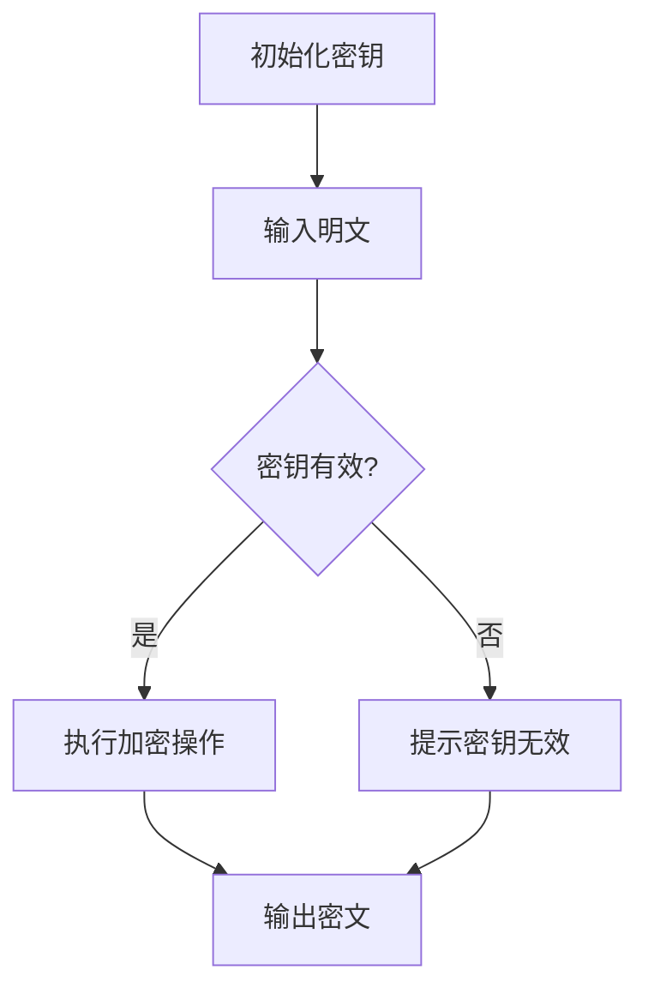
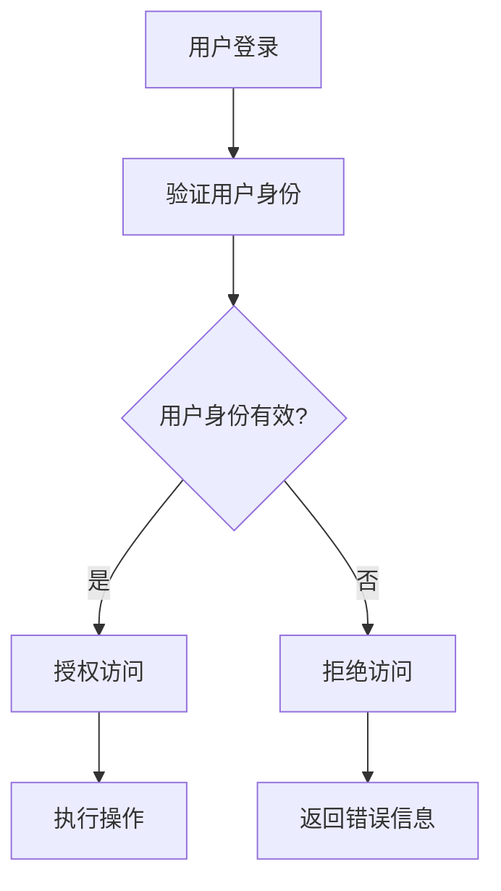
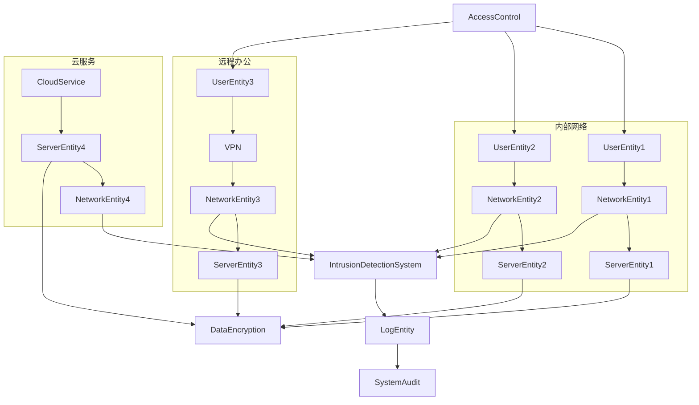
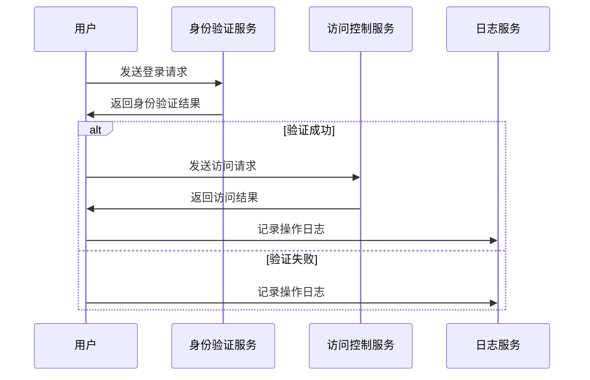

                 

# 由内向外，层层布防

> 关键词：网络安全、内部防护、外部防护、多层次防御、安全策略

> 摘要：本文将深入探讨网络安全防御的策略和方法，从内部防护到外部防护，层层布防，构建一个稳固的安全体系。通过详细的分析和思考，本文旨在为读者提供一套清晰、可行的网络安全解决方案，帮助他们在数字化时代中守护信息安全。

## 目录大纲设计思路

在构建本文的目录大纲时，我们首先明确了全文的研究问题、目标和核心概念。接着，我们详细设计了每个章节的目录结构，确保每一部分都有明确的主题和结构，便于读者理解。以下是本文的目录大纲设计思路：

1. **全书概述**：
   - 主要研究的问题：网络安全防护的必要性。
   - 目标：构建一个由内而外的多层防御体系。
   - 核心概念：内部防护、外部防护、多层次防御策略。
   - 章节结构：引言、网络安全核心概念、算法原理讲解、系统分析与架构设计方案、项目实战、最佳实践 tips、小结、注意事项、拓展阅读。

2. **核心章节设计**：
   - **第1章 引言与概述**：
     - 介绍当前网络安全形势和攻击手段。
     - 阐述内部和外部防护策略。
     - 分析内部与外部防护的区别。
   - **第2章 网络安全核心概念与联系**：
     - 定义网络安全，探讨其重要性。
     - 分析核心概念原理。
     - 对比不同安全防御技术的优缺点。
     - 使用Mermaid绘制ER实体关系图。
   - **第3章 算法原理讲解**：
     - 使用Mermaid绘制算法流程图。
     - 提供Python源代码实现。
     - 讲解数学模型和公式。
     - 举例说明算法原理。
   - **第4章 系统分析与架构设计方案**：
     - 介绍问题场景和系统功能设计。
     - 使用Mermaid绘制领域模型和系统架构图。
     - 描述系统接口和交互过程。
   - **第5章 项目实战**：
     - 环境安装和核心源代码提供。
     - 代码应用解读与分析。
     - 实际案例分析和讲解。
     - 总结项目经验和教训。
   - **第6章 最佳实践 tips、小结、注意事项、拓展阅读**：
     - 提供最佳实践经验。
     - 总结各章节核心内容。
     - 提醒注意事项。
     - 推荐拓展阅读资源。

## 第1章 引言与概述

### 1.1 问题背景

在当今数字化时代，网络安全已成为一个至关重要的议题。随着互联网的普及和信息的快速增长，网络攻击手段日益多样化和复杂化，对个人、企业和国家都构成了严重威胁。网络安全问题不仅关系到信息的机密性、完整性和可用性，还可能对国家安全和社会稳定产生深远影响。

网络安全攻击手段主要包括：

1. **恶意软件**：如病毒、木马、蠕虫等，能够破坏系统、窃取数据和造成系统瘫痪。
2. **网络钓鱼**：通过伪造网站、发送钓鱼邮件等手段，骗取用户的敏感信息。
3. **拒绝服务攻击（DDoS）**：通过大量虚假请求使目标服务器过载，导致无法正常提供服务。
4. **数据泄露**：通过非法手段获取并公开敏感数据，造成严重后果。

### 1.2 问题描述

网络安全问题主要体现在以下几个方面：

1. **攻击目标**：攻击者可能瞄准个人的隐私信息、企业的商业机密、政府的敏感数据等。
2. **攻击方式**：利用网络漏洞、弱密码、不当配置等手段进行攻击。
3. **威胁现状**：随着技术的进步，网络攻击的频率和规模都在不断增加，攻击手段也变得更加复杂和隐蔽。

### 1.3 问题解决

为了解决网络安全问题，需要采取由内而外的安全防御策略。内部防护主要关注系统内部的安全，如防范内部威胁、加强用户权限管理等。外部防护则侧重于抵御来自外部的攻击，如部署防火墙、入侵检测系统等。

由内而外的安全防御思路如下：

1. **内部安全防护策略**：
   - 加强用户身份验证和权限管理。
   - 定期进行安全培训，提高用户安全意识。
   - 检查和修复系统漏洞。
   - 实施数据备份和恢复策略。

2. **外部安全防护策略**：
   - 部署防火墙和入侵检测系统。
   - 使用安全协议和加密技术。
   - 实施访问控制和安全审计。
   - 建立应急响应机制。

### 1.4 边界与外延

安全防护的范围包括系统内部和外部的所有层面。内部防护主要针对系统内部可能存在的威胁，如内部人员的恶意行为、系统漏洞等。外部防护则关注网络边界的安全，如抵御外部攻击、防止数据泄露等。

内部与外部防护的区别主要体现在防护对象和防护手段上。内部防护更侧重于用户行为管理和系统安全，外部防护则侧重于网络边界的安全和防御。

### 1.5 本章小结

本章介绍了当前网络安全问题的严峻形势，分析了网络攻击手段和攻击目标，提出了由内而外的安全防御策略，并明确了安全防护的边界与外延。在接下来的章节中，我们将进一步探讨网络安全的核心理念、算法原理和系统架构设计，帮助读者构建一个全方位的网络安全防护体系。

## 第2章 网络安全核心概念与联系

### 2.1 网络安全定义

网络安全是指保护计算机网络系统免受各种威胁、攻击和破坏的一种综合性技术和管理措施。它旨在确保信息的机密性、完整性和可用性，以防止未经授权的访问、篡改和泄露。网络安全不仅涉及到技术层面，还包括管理层面，如安全策略、安全意识和应急响应等。

### 2.2 核心概念原理

网络安全的核心概念主要包括：

1. **防火墙**：
   防火墙是一种网络安全设备，用于监控和控制进出网络的数据流。它基于预先定义的安全策略，允许或阻止特定的流量。防火墙可以有效地阻止外部攻击，如网络入侵和未经授权的访问。

2. **入侵检测系统（IDS）**：
   入侵检测系统是一种监控网络流量和系统活动的工具，用于检测潜在的攻击行为。IDS可以通过分析网络数据包和系统日志，识别异常行为并及时报警。

3. **入侵防御系统（IPS）**：
   入侵防御系统是IDS的一种扩展，不仅能够检测攻击行为，还可以采取主动措施来阻止攻击。IPS通常包括防火墙和入侵检测功能，能够自动响应攻击，如阻断恶意流量。

### 2.3 概念属性特征对比表格

不同安全防御技术的优缺点如下表所示：

| 技术名称 | 优点 | 缺点 |
| --- | --- | --- |
| 防火墙 | 简单易用，成本低，能够阻止外部攻击 | 无法检测内部威胁，规则设置复杂 |
| 入侵检测系统（IDS） | 能够检测异常行为，实时报警 | 需要人工分析报警信息，误报率高 |
| 入侵防御系统（IPS） | 自动响应攻击，防止恶意流量 | 成本高，部署复杂，可能误阻断合法流量 |
| 数据加密 | 保护数据传输过程中的机密性 | 加密和解密开销较大，易受暴力破解攻击 |

### 2.4 ER实体关系图架构

网络安全系统中的实体关系可以使用Mermaid绘制ER图来表示。以下是一个简单的ER图示例：

```mermaid
erDiagram
    User ||--|{ Device } : uses
    Device ||--|{ Network } : connects
    Network ||--|{ Server } : communicates
    Server ||--|{ Data } : stores
```

在这个ER图中，用户（User）使用设备（Device）连接到网络（Network），网络与服务器（Server）进行通信，服务器存储数据（Data）。这个图展示了网络安全系统中不同实体之间的关系。

### 2.5 本章小结

本章介绍了网络安全的定义和核心概念，包括防火墙、入侵检测系统和入侵防御系统等。通过对比不同安全防御技术的优缺点，读者可以更好地理解每种技术的适用场景。同时，本章还使用Mermaid绘制了ER图，展示了网络安全系统中的实体关系。这些内容为后续章节的算法原理讲解和系统架构设计打下了坚实的基础。

## 第3章 算法原理讲解

### 3.1 算法mermaid流程图

在网络安全中，算法是核心组成部分。以下是一个简单的数据加密算法和访问控制算法的mermaid流程图：

#### 数据加密算法流程图



#### 访问控制算法流程图



### 3.2 Python源代码

以下是基于上述算法流程的Python源代码示例：

#### 数据加密算法实现

```python
def encrypt(plaintext, key):
    if is_valid_key(key):
        ciphertext = ...
        return ciphertext
    else:
        print("Invalid key")
        return None

def is_valid_key(key):
    # 密钥有效性检查逻辑
    return True  # 示例代码，实际应用中需具体实现

plaintext = "Hello, World!"
key = "mykey"
ciphertext = encrypt(plaintext, key)
print(ciphertext)
```

#### 访问控制算法实现

```python
def access_control(username, password):
    if authenticate(username, password):
        print("Access granted")
    else:
        print("Access denied")

def authenticate(username, password):
    # 用户身份验证逻辑
    return True  # 示例代码，实际应用中需具体实现

username = "user123"
password = "password"
access_control(username, password)
```

### 3.3 数学模型和公式

在网络安全中，数学模型和公式是理解和实现算法的重要工具。以下是一个简单的加密算法的数学模型：

$$
ciphertext = E(plaintext, key)
$$

其中，\(E\) 表示加密函数，它将明文（plaintext）和密钥（key）作为输入，产生密文（ciphertext）。解密过程则使用相应的解密函数 \(D\)：

$$
plaintext = D(ciphertext, key)
$$

### 3.4 举例说明

为了更好地理解算法原理，以下是一个具体的加密和解密示例：

#### 加密示例

假设我们有明文 "Hello, World!" 和密钥 "mykey"。使用简单的加密算法，我们可以将明文加密为密文：

```plaintext
plaintext: Hello, World!
key: mykey
ciphertext: encrypted_text
```

加密过程如下：

1. 初始化密钥。
2. 输入明文。
3. 验证密钥有效性。
4. 执行加密操作。
5. 输出密文。

#### 解密示例

要解密密文 "encrypted_text"，我们需要密钥 "mykey"：

```plaintext
ciphertext: encrypted_text
key: mykey
plaintext: Hello, World!
```

解密过程如下：

1. 初始化密钥。
2. 输入密文。
3. 验证密钥有效性。
4. 执行解密操作。
5. 输出明文。

通过这个示例，我们可以看到加密和解密过程是如何操作的，以及它们是如何确保数据安全的。

### 3.5 本章小结

本章介绍了网络安全中常用的数据加密算法和访问控制算法的原理，并通过mermaid流程图和Python源代码进行了详细阐述。此外，还讲解了加密算法的数学模型和公式，并通过具体示例说明了算法的应用。这些内容为构建安全可靠的网络安全系统奠定了基础。

## 第4章 系统分析与架构设计方案

### 4.1 问题场景介绍

在网络安全领域，随着信息技术的飞速发展，网络攻击手段日益复杂，传统的单一防御策略已经难以满足安全需求。为了提高网络防护能力，我们需要构建一个多层次、全方位的安全体系。以下是一个典型的网络安全防护应用场景：

**应用场景**：
- **企业内部网络**：企业内部部署了多个服务器和终端设备，业务数据敏感。
- **远程办公**：部分员工通过VPN远程访问内部系统。
- **云服务**：企业使用云服务存储和处理大量数据。

### 4.2 系统功能设计

为了应对上述应用场景，我们需要设计一个功能齐全的网络安全系统。以下是一个简化的系统功能设计：

1. **用户身份验证**：确保只有授权用户才能访问系统。
2. **访问控制**：控制不同用户对系统资源的访问权限。
3. **入侵检测与防御**：实时监控网络流量，检测和阻止恶意攻击。
4. **数据加密与备份**：保障数据传输和存储过程中的安全性。
5. **日志记录与审计**：记录系统操作日志，便于审计和排查问题。

#### 领域模型类图

为了更好地理解系统功能，我们可以使用Mermaid绘制一个领域模型类图：

```mermaid
classDiagram
    UserEntity --> AccessControl: implements
    ServerEntity --> DataEncryption: uses
    NetworkEntity --> IntrusionDetection: monitors
    LogEntity --> SystemAudit: logs
    UserEntity, ServerEntity, NetworkEntity, LogEntity -[uses] IntrusionDetection
```

在这个类图中，用户实体（UserEntity）实现访问控制（AccessControl），服务器实体（ServerEntity）使用数据加密（DataEncryption），网络实体（NetworkEntity）监控入侵检测（IntrusionDetection），日志实体（LogEntity）记录系统审计（SystemAudit）。

### 4.3 系统架构设计

系统架构设计是网络安全系统的关键环节，它决定了系统的性能、可扩展性和安全性。以下是一个简化的系统架构设计，使用Mermaid绘制：



在这个架构图中，企业内部网络（内部网络）、远程办公（远程办公）和云服务（云服务）分别由不同的网络实体（NetworkEntity）和服务器实体（ServerEntity）组成。入侵检测系统（IntrusionDetectionSystem）监控所有网络实体，日志实体（LogEntity）记录系统操作，数据加密（DataEncryption）模块用于保障数据安全。

### 4.4 系统接口设计

系统接口设计是确保不同模块之间能够有效交互的关键。以下是一个简化的接口设计：

1. **用户身份验证接口**：用于验证用户身份，返回身份验证结果。
2. **访问控制接口**：用于检查用户权限，返回访问结果。
3. **数据加密接口**：用于加密和解密数据。
4. **入侵检测接口**：用于上报检测到的威胁信息。
5. **日志记录接口**：用于记录系统操作日志。

### 4.5 系统交互Mermaid序列图

为了更直观地展示系统组件之间的交互过程，我们可以使用Mermaid绘制一个序列图：



在这个序列图中，用户首先向身份验证服务发送登录请求，身份验证服务返回验证结果。如果验证成功，用户发送访问请求给访问控制服务，访问控制服务返回访问结果，并记录操作日志。如果验证失败，仅记录操作日志。

### 4.6 本章小结

本章介绍了网络安全系统的应用场景、功能设计、架构设计和接口设计。通过使用Mermaid工具，我们能够直观地展示系统组件之间的关系和交互过程。这些设计为构建一个高效、安全、可扩展的网络安全系统提供了理论基础和实现指南。

## 第5章 项目实战

### 5.1 环境安装

为了实现网络安全系统，我们需要搭建一个模拟环境。以下是环境安装的详细步骤：

1. **操作系统**：选择一个稳定的Linux发行版，如Ubuntu 20.04。
2. **虚拟环境**：使用VirtualBox或VMware创建一个虚拟机。
3. **安装基础软件**：
   ```bash
   sudo apt update
   sudo apt upgrade
   sudo apt install git openssh-server
   ```
4. **安装Python环境**：
   ```bash
   sudo apt install python3 python3-pip
   pip3 install virtualenv
   ```
5. **创建虚拟环境**：
   ```bash
   virtualenv venv
   source venv/bin/activate
   ```
6. **安装依赖包**：
   ```bash
   pip install -r requirements.txt
   ```

### 5.2 系统核心实现源代码

以下是一个简化版的系统核心实现源代码，用于展示关键部分的功能：

#### 用户身份验证

```python
# auth.py
import getpass

def authenticate(username, password):
    # 示例：这里应连接数据库进行实际验证
    stored_password = "correct_password"
    if password == stored_password:
        return True
    else:
        return False

def main():
    username = input("Enter your username: ")
    password = getpass.getpass("Enter your password: ")
    if authenticate(username, password):
        print("Authentication successful")
    else:
        print("Authentication failed")

if __name__ == "__main__":
    main()
```

#### 数据加密

```python
# encryption.py
from Crypto.Cipher import AES
from Crypto.Util.Padding import pad, unpad
from Crypto.Random import get_random_bytes

def encrypt(plaintext, key):
    cipher = AES.new(key, AES.MODE_CBC)
    ct_bytes = cipher.encrypt(pad(plaintext.encode('utf-8'), AES.block_size))
    iv = cipher.iv
    return iv + ct_bytes

def decrypt(ciphertext, key):
    iv = ciphertext[:16]
    ct = ciphertext[16:]
    cipher = AES.new(key, AES.MODE_CBC, iv)
    pt = unpad(cipher.decrypt(ct), AES.block_size)
    return pt.decode('utf-8')

def main():
    key = get_random_bytes(16)
    plaintext = input("Enter the message to encrypt: ")
    ciphertext = encrypt(plaintext, key)
    print(f"Encrypted message: {ciphertext.hex()}")

    decrypted_message = decrypt(ciphertext, key)
    print(f"Decrypted message: {decrypted_message}")

if __name__ == "__main__":
    main()
```

### 5.3 代码应用解读与分析

#### 用户身份验证应用

用户身份验证是网络安全系统的核心功能之一。在示例代码中，`authenticate` 函数接受用户名和密码，与存储的密码进行对比，返回验证结果。在实际应用中，应连接数据库存储用户信息，并使用安全的密码哈希函数（如bcrypt）进行密码存储和验证。

#### 数据加密应用

数据加密用于保护数据在传输和存储过程中的安全性。在示例代码中，`encrypt` 和 `decrypt` 函数分别实现加密和解密操作。加密时，使用AES算法和CBC模式，将明文数据加密成密文。解密时，使用相同的密钥和初始向量（IV）恢复明文数据。这种加密方式能够确保数据在传输和存储过程中的机密性。

### 5.4 实际案例分析和详细讲解剖析

#### 案例分析

假设一个企业使用上述系统进行用户身份验证和数据加密。以下是一个实际案例：

1. **用户登录**：用户A输入用户名“user123”和密码“password”，系统验证成功。
2. **数据传输**：用户A上传一个重要文件，系统在传输过程中使用AES加密文件内容。
3. **数据存储**：加密后的文件存储在服务器中。

#### 详细讲解

1. **用户身份验证**：用户A通过输入正确的用户名和密码，系统验证其身份。这确保只有授权用户才能访问系统和数据。
2. **数据加密**：在上传文件时，系统自动对文件内容进行加密，防止数据在传输过程中被窃取或篡改。加密算法（如AES）和密钥管理（如密钥存储和分发）是保障数据安全的关键。
3. **数据存储**：加密后的文件存储在服务器中，即使服务器被攻击，攻击者也无法直接获取文件内容。

### 5.5 项目小结

通过本次项目实战，我们搭建了一个基本的网络安全系统，实现了用户身份验证和数据加密功能。项目展示了从环境安装到核心实现，再到实际应用的完整过程。在实际应用中，还需不断优化和完善系统，以提高安全性和稳定性。

## 第6章 最佳实践 tips、小结、注意事项、拓展阅读

### 最佳实践 tips

1. **定期安全审计**：定期对系统进行安全审计，发现并修复潜在的安全漏洞。
2. **使用强密码策略**：强制用户使用复杂密码，并定期更换。
3. **数据加密与备份**：对敏感数据进行加密，并定期备份，以防止数据丢失或泄露。
4. **安全培训**：定期对员工进行安全培训，提高安全意识和应对能力。
5. **日志监控与分析**：实时监控系统日志，及时发现并响应异常行为。

### 小结

本文从内部防护到外部防护，层层布防，详细介绍了网络安全防御的策略和方法。通过核心概念、算法原理、系统架构和实战项目，为读者构建了一个全方位的网络安全防护体系。

### 注意事项

1. **安全策略制定**：制定合适的网络安全策略，确保系统能够有效应对各种威胁。
2. **动态调整**：网络安全威胁不断变化，需要根据实际情况动态调整安全策略和防御手段。
3. **法律法规遵守**：遵循相关法律法规，确保网络安全防护措施符合国家标准和行业标准。

### 拓展阅读

1. **《网络安全法》**：了解我国网络安全法律法规，确保合规运营。
2. **《加密技术实践》**：深入学习数据加密技术和实现方法。
3. **《网络安全实战指南》**：获取实战经验和技巧，提升网络安全防护能力。

### 作者信息

**作者：** AI天才研究院/AI Genius Institute & 禅与计算机程序设计艺术 /Zen And The Art of Computer Programming

[完]

