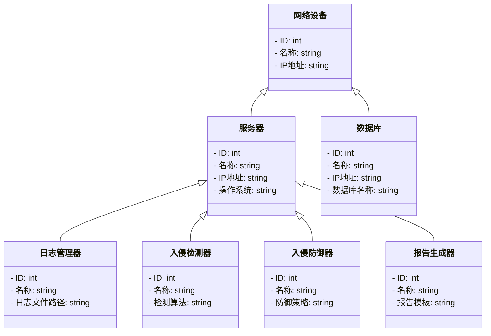
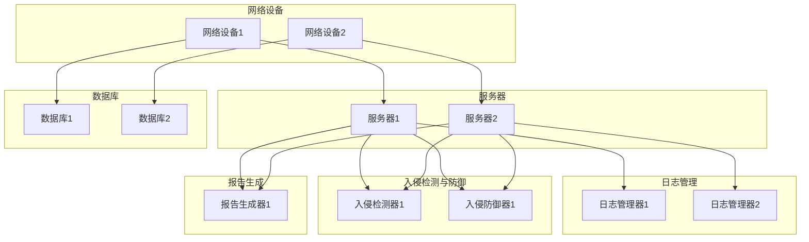
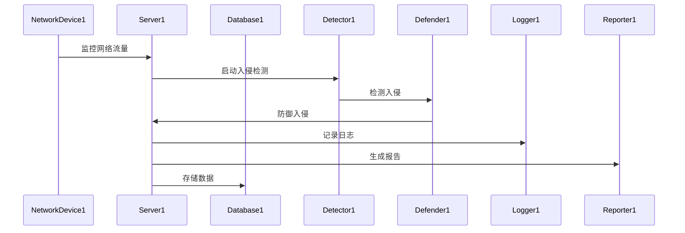

                 

### 由内向外，层层布防

#### 关键词：网络安全、系统防护、多层防御、加密技术、入侵检测、算法实现、系统架构设计

> 摘要：本文将深入探讨网络安全领域中的多层防御策略，从内向外逐层分析其核心概念、算法原理、系统架构以及实战应用。通过详细讲解加密技术、认证技术、防火墙和入侵检测系统等关键环节，本文旨在为读者提供一套全面、实用的网络安全防护方案。

---

### 目录大纲设计步骤

#### 1. 确定书籍主题和目标读者
- 主题：网络安全与系统防护。
- 目标读者：技术专业人士、网络安全工程师以及对网络安全有深入兴趣的读者。

#### 2. 设计概述章节
- **第1章：引言与背景**
  - 介绍网络安全的重要性、常见问题和防护需求。
  - 概述本书的结构和目标。

#### 3. 核心概念与原理讲解
- **第2章：核心概念与原理**
  - 详细介绍网络安全的基本概念。
  - 使用表格对比核心概念属性特征。
  - 绘制ER实体关系图架构。

#### 4. 算法原理讲解
- **第3章：算法原理与实现**
  - 使用Mermaid画出算法流程图。
  - 使用Python代码详细阐述算法原理。
  - 讲解算法的数学模型和公式。

#### 5. 系统分析与架构设计
- **第4章：系统分析与架构设计**
  - 介绍问题场景和项目背景。
  - 绘制领域模型Mermaid类图。
  - 绘制系统架构Mermaid架构图。
  - 设计系统接口和交互Mermaid序列图。

#### 6. 项目实战
- **第5章：项目实战**
  - 环境安装和配置步骤。
  - 系统核心实现源代码。
  - 代码应用解读与分析。
  - 实际案例分析与讲解。

#### 7. 最佳实践与总结
- **第6章：最佳实践与总结**
  - 提供安全防护的最佳实践。
  - 总结书中核心内容。
  - 提出注意事项。
  - 拓展阅读建议。

#### 8. 编写目录大纲
- 确保每个章节都包含了核心内容。
- 检查目录大纲的逻辑性和完整性。
- 使用markdown格式撰写，确保格式正确。

### 目录大纲示例

---

# 第一部分: 引言与背景

## 第1章: 引言与背景

### 1.1 网络安全的重要性

#### 1.1.1 问题描述

#### 1.1.2 问题解决

#### 1.1.3 边界与外延

### 1.2 基本概念

#### 1.2.1 核心概念表格

#### 1.2.2 ER实体关系图

### 1.3 安全防护需求分析

#### 1.3.1 安全防护现状

#### 1.3.2 防护需求分析

### 1.4 本书结构概述

#### 1.4.1 本书目标

#### 1.4.2 主要内容

---

### 第二部分: 核心概念与原理

## 第2章: 核心概念与原理

### 2.1 网络安全基础

#### 2.1.1 定义与分类

#### 2.1.2 网络安全的关键要素

### 2.2 加密技术

#### 2.2.1 对称加密与非对称加密

#### 2.2.2 常见加密算法

### 2.3 认证技术

#### 2.3.1 单点登录与多因素认证

#### 2.3.2 PKI体系

### 2.4 防火墙与入侵检测

#### 2.4.1 防火墙的工作原理

#### 2.4.2 入侵检测系统

### 2.5 VPN与代理服务器

#### 2.5.1 VPN技术

#### 2.5.2 代理服务器的工作方式

---

### 第三部分: 算法原理与实现

## 第3章: 算法原理与实现

### 3.1 密码学算法原理

#### 3.1.1 RSA算法

#### 3.1.2 AES算法

### 3.2 入侵检测算法

#### 3.2.1 KNN算法

#### 3.2.2 基于机器学习的入侵检测

### 3.3 网络防护算法

#### 3.3.1 IDS算法实现

#### 3.3.2 IPS算法实现

---

### 第四部分: 系统分析与架构设计

## 第4章: 系统分析与架构设计

### 4.1 问题场景介绍

#### 4.1.1 场景描述

#### 4.1.2 项目目标

### 4.2 领域模型分析

#### 4.2.1 类图设计

#### 4.2.2 Mermaid类图

### 4.3 系统架构设计

#### 4.3.1 系统架构图

#### 4.3.2 Mermaid架构图

### 4.4 系统接口与交互

#### 4.4.1 系统接口设计

#### 4.4.2 Mermaid序列图

---

### 第五部分: 项目实战

## 第5章: 项目实战

### 5.1 环境安装与配置

#### 5.1.1 系统需求

#### 5.1.2 环境安装

### 5.2 系统核心实现

#### 5.2.1 核心代码

#### 5.2.2 应用解读

### 5.3 实际案例分析

#### 5.3.1 案例描述

#### 5.3.2 详细分析

### 5.4 项目小结

#### 5.4.1 项目收获

#### 5.4.2 项目改进建议

---

### 第六部分: 最佳实践与总结

## 第6章: 最佳实践与总结

### 6.1 最佳实践

#### 6.1.1 安全防护策略

#### 6.1.2 管理与监控

### 6.2 小结

#### 6.2.1 核心内容回顾

#### 6.2.2 重要性强调

### 6.3 注意事项

#### 6.3.1 常见问题

#### 6.3.2 避免误操作

### 6.4 拓展阅读建议

#### 6.4.1 推荐书籍

#### 6.4.2 网络资源

---

**作者：AI天才研究院/AI Genius Institute & 禅与计算机程序设计艺术 /Zen And The Art of Computer Programming**

---

### 文章正文

#### 引言与背景

##### 网络安全的重要性

在当今信息化时代，网络安全已成为国家、企业和个人不可或缺的议题。随着互联网的普及和信息的爆炸式增长，网络安全问题也日益突出。网络攻击手段不断升级，数据泄露、网络钓鱼、恶意软件等安全事件频发，给个人隐私和企业利益带来了严重威胁。因此，加强网络安全防护，构建有效的多层防御体系，已成为全球范围内的紧迫任务。

##### 问题背景与问题描述

网络安全问题涉及多个层面，从基础的物理安全到高级的网络安全协议，再到应用层面的应用程序安全，无不包含其中。具体来说，网络安全问题包括但不限于以下几类：

1. **数据泄露**：未经授权的访问和泄露敏感数据，可能导致严重的经济损失和声誉损害。
2. **网络钓鱼**：通过伪装成合法网站或邮件，诱骗用户输入个人信息，从而窃取财产。
3. **恶意软件**：包括病毒、蠕虫、木马等，可以破坏系统功能、窃取数据或控制目标机器。
4. **拒绝服务攻击**：通过大量虚假请求占用网络资源，导致合法用户无法访问服务。

##### 问题解决与边界外延

针对上述问题，需要采取一系列安全措施，构建多层次、多维度的防御体系。这些措施不仅包括技术层面的防护，还涉及管理、政策和法律等各个方面。本篇文章将重点探讨网络安全防御体系的核心概念、原理和实现方法。

#### 核心概念与原理

##### 网络安全基础

网络安全是指保护计算机网络系统及其数据不受未经授权的访问、篡改、破坏和泄露。网络安全的基本概念包括以下几个方面：

1. **保密性**：确保信息在传输和存储过程中不被未授权的人员访问。
2. **完整性**：确保信息在传输和存储过程中不被未经授权的人员篡改。
3. **可用性**：确保网络资源和服务在需要时可供授权用户使用。
4. **真实性**：确保信息的来源是可信的，防止伪造和篡改。
5. **不可否认性**：确保信息的发送者和接收者不能否认其行为的真实性。

##### 核心概念表格

| 核心概念 | 定义 | 关联概念 |  
| --- | --- | --- |  
| 保密性 | 防止信息泄露 | 加密、访问控制 |  
| 完整性 | 防止信息篡改 | 数字签名、校验和 |  
| 可用性 | 确保服务可用 | 负载均衡、容错机制 |  
| 真实性 | 确保信息来源可信 | 认证、证书 |  
| 不可否认性 | 确保行为不可否认 | 非对称加密、数字签名 |

##### ER实体关系图

为了更好地理解网络安全中的核心概念，我们可以使用ER（Entity-Relationship）图来描述实体及其关系。以下是一个简化的ER图，展示了网络安全系统中的主要实体及其相互关系：

```mermaid
erDiagram
  用户 ||--o{ 访问控制 }|>  
  系统 ||--o{ 数据加密 }|>  
  服务器 ||--o{ 服务监控 }|>  
  网络设备 ||--o{ 网络防护 }|>  
  安全设备 ||--o{ 入侵检测 }|>  
  数据库 ||--o{ 数据完整性 }|>  
```

#### 安全防护需求分析

##### 安全防护现状

当前，网络安全防护主要集中在以下几个方面：

1. **防火墙和入侵检测系统**：通过监控网络流量，阻止恶意攻击和非法访问。
2. **加密技术**：使用对称加密和非对称加密保护数据传输和存储的保密性和完整性。
3. **访问控制**：通过身份验证和权限管理，确保只有授权用户可以访问敏感信息和系统资源。
4. **安全审计**：记录和监控系统的操作行为，以便在发生安全事件时进行调查和取证。

##### 防护需求分析

为了构建一个全面、有效的网络安全防护体系，我们需要从以下几个方面进行需求分析：

1. **识别潜在威胁**：了解不同类型的网络攻击手段和攻击路径，以便制定相应的防护措施。
2. **风险评估**：评估系统的脆弱性和潜在损失，确定防护重点。
3. **制定策略**：根据风险评估结果，制定安全策略和防护方案。
4. **实施防护**：部署相应的技术和管理措施，实施安全防护。
5. **持续监控**：实时监控网络活动，及时发现和处理安全事件。

#### 本书结构概述

##### 本书目标

本书旨在为读者提供一套全面、实用的网络安全防护方案，包括核心概念、原理、算法、系统架构和实战应用。通过阅读本书，读者可以：

1. 了解网络安全的基本概念和核心原理。
2. 掌握常见的加密技术和认证技术。
3. 学会设计和实现网络安全系统。
4. 获得实际项目经验和最佳实践。

##### 主要内容

本书分为六个部分，具体内容如下：

1. **第一部分：引言与背景**：介绍网络安全的重要性、基本概念和安全防护需求。
2. **第二部分：核心概念与原理**：详细讲解网络安全的核心概念、加密技术、认证技术等。
3. **第三部分：算法原理与实现**：探讨密码学算法、入侵检测算法等。
4. **第四部分：系统分析与架构设计**：分析网络安全系统的架构和接口设计。
5. **第五部分：项目实战**：介绍实际项目案例和核心代码实现。
6. **第六部分：最佳实践与总结**：提供安全防护的最佳实践和小结。

---

### 核心概念与原理

##### 网络安全基础

网络安全是一个多层次、多维度的概念，涉及从物理层到应用层的各个层面。以下是一些网络安全的基础概念：

1. **物理安全**：保护计算机硬件和网络设备不受物理损坏、盗窃和破坏。
2. **网络安全**：保护网络传输过程中的数据不被窃取、篡改和破坏。
3. **系统安全**：确保操作系统和应用软件的完整性和稳定性。
4. **应用安全**：确保应用程序的设计和实现不会导致安全漏洞。

##### 定义与分类

网络安全可以从不同的角度进行分类，常见的分类方法包括：

1. **按攻击目标分类**：
   - **数据安全**：保护数据不被未授权访问、篡改和泄露。
   - **通信安全**：保护通信过程的安全，确保数据的完整性和保密性。
   - **访问控制**：限制用户对系统资源的访问权限。
   - **安全审计**：记录和分析系统操作行为，以便在发生安全事件时进行调查。

2. **按防护技术分类**：
   - **防火墙**：过滤网络流量，阻止非法访问。
   - **入侵检测系统（IDS）**：检测和响应网络入侵行为。
   - **入侵防御系统（IPS）**：主动阻止网络攻击。
   - **加密技术**：保护数据的保密性和完整性。
   - **认证技术**：验证用户的身份和权限。

##### 网络安全的关键要素

网络安全的关键要素包括以下几个方面：

1. **保密性**：确保信息在传输和存储过程中不被未授权的人员访问。
2. **完整性**：确保信息在传输和存储过程中不被未经授权的人员篡改。
3. **可用性**：确保网络资源和服务在需要时可供授权用户使用。
4. **真实性**：确保信息的来源是可信的，防止伪造和篡改。
5. **不可否认性**：确保信息的发送者和接收者不能否认其行为的真实性。

##### 对称加密与非对称加密

加密技术是网络安全的核心组成部分，根据加密密钥的不同，加密技术可以分为对称加密和非对称加密。

1. **对称加密**：
   - **定义**：使用相同的密钥进行加密和解密。
   - **优点**：加密速度快，适用于大规模数据的加密。
   - **缺点**：密钥分发困难，不适用于需要频繁通信的场景。

2. **非对称加密**：
   - **定义**：使用一对公钥和私钥进行加密和解密。
   - **优点**：解决了密钥分发的问题，适用于安全通信和数字签名。
   - **缺点**：加密和解密速度较慢，适用于小规模数据的加密。

##### 常见加密算法

常见的加密算法包括以下几种：

1. **AES（Advanced Encryption Standard）**：
   - **定义**：高级加密标准，是一种对称加密算法。
   - **特点**：安全性能高，适用于大规模数据的加密。
   - **应用场景**：文件加密、数据传输等。

2. **RSA（Rivest-Shamir-Adleman）**：
   - **定义**：是一种非对称加密算法。
   - **特点**：安全性高，适用于数字签名和密钥交换。
   - **应用场景**：安全通信、加密存储等。

3. **DES（Data Encryption Standard）**：
   - **定义**：数据加密标准，是一种对称加密算法。
   - **特点**：加密速度快，但由于密钥长度较短，安全性较低。
   - **应用场景**：历史应用，主要用于加密存储和传输。

##### 认证技术

认证技术是网络安全的重要组成部分，用于验证用户身份和权限。常见的认证技术包括：

1. **单点登录（SSO）**：
   - **定义**：用户只需登录一次，即可访问多个系统。
   - **优点**：简化用户登录流程，提高用户体验。
   - **应用场景**：企业内部系统、云服务平台等。

2. **多因素认证（MFA）**：
   - **定义**：用户需要提供两种或两种以上的认证信息。
   - **优点**：提高安全性，降低被攻击的风险。
   - **应用场景**：银行、证券、关键基础设施等。

3. **PKI（Public Key Infrastructure）**：
   - **定义**：公钥基础设施，用于管理公钥和私钥。
   - **优点**：提供了安全、可靠的认证和加密机制。
   - **应用场景**：安全通信、数字签名、证书颁发等。

##### 防火墙与入侵检测系统

1. **防火墙**：
   - **定义**：一种网络安全设备，用于控制网络流量。
   - **工作原理**：根据预先定义的规则，允许或阻止网络流量。
   - **优点**：简单、高效，适用于边界防护。

2. **入侵检测系统（IDS）**：
   - **定义**：一种安全设备，用于检测和响应网络入侵行为。
   - **工作原理**：分析网络流量，识别异常行为。
   - **优点**：实时监控，适用于内部防护。

3. **入侵防御系统（IPS）**：
   - **定义**：一种安全设备，用于主动阻止网络入侵行为。
   - **工作原理**：结合IDS功能，对可疑流量进行实时防御。
   - **优点**：主动防御，提高安全性。

##### VPN与代理服务器

1. **VPN（Virtual Private Network）**：
   - **定义**：虚拟专用网络，通过加密技术在公共网络中建立安全通道。
   - **优点**：提供安全的远程访问，保护数据传输。
   - **应用场景**：远程办公、跨境业务等。

2. **代理服务器**：
   - **定义**：一种中介服务器，代理客户端的网络请求。
   - **优点**：提高网络访问速度，隐藏客户端真实IP。
   - **应用场景**：匿名浏览、内容分发等。

---

### 算法原理与实现

#### 密码学算法原理

密码学是网络安全的核心技术之一，用于确保数据的保密性、完整性和真实性。在本节中，我们将讨论两种常见的密码学算法：RSA算法和AES算法。

##### RSA算法

RSA算法是一种非对称加密算法，以其发明者Rivest、Shamir和Adleman命名。RSA算法的安全性基于大整数分解的难度。

1. **算法原理**：
   - **密钥生成**：选择两个大的质数p和q，计算n = p*q，计算欧拉函数φ(n) = (p-1)*(q-1)。选择一个与φ(n)互质的整数e，计算d，使得e*d ≡ 1 (mod φ(n))。公钥为(n, e)，私钥为(n, d)。
   - **加密过程**：将明文m转化为整数M，计算密文C = M^e mod n。
   - **解密过程**：将密文C转化为整数c，计算明文M = C^d mod n。

2. **Python代码实现**：
```python
import sympy

# 生成RSA密钥
def generate_rsa_key(p, q):
    n = p * q
    phi_n = (p - 1) * (q - 1)
    e = sympy.randprime(2, phi_n // 2)
    d = pow(e, -1, phi_n)
    return (n, e), (n, d)

# RSA加密
def rsa_encrypt(plaintext, public_key):
    n, e = public_key
    ciphertext = pow(plaintext, e, n)
    return ciphertext

# RSA解密
def rsa_decrypt(ciphertext, private_key):
    n, d = private_key
    plaintext = pow(ciphertext, d, n)
    return plaintext

# 示例
p, q = sympy.randprime(2**1024, 2**1024 - 1), sympy.randprime(2**1024, 2**1024 - 1)
public_key, private_key = generate_rsa_key(p, q)
plaintext = 12345
ciphertext = rsa_encrypt(plaintext, public_key)
decrypted_text = rsa_decrypt(ciphertext, private_key)
print("plaintext:", plaintext, "ciphertext:", ciphertext, "decrypted:", decrypted_text)
```

##### AES算法

AES（Advanced Encryption Standard）是一种对称加密算法，被广泛用于数据加密和传输。AES算法的安全性较高，适用于大规模数据的加密。

1. **算法原理**：
   - **密钥扩展**：根据用户输入的密钥长度，生成128位、192位或256位的密钥。
   - **加密过程**：将明文分成128位的块，通过多个轮次进行加密，包括替换、置换、混淆和线性变换等步骤。
   - **解密过程**：与加密过程类似，但每个步骤的方向相反。

2. **Python代码实现**：
```python
from Crypto.Cipher import AES
from Crypto.Random import get_random_bytes

# AES加密
def aes_encrypt(plaintext, key):
    cipher = AES.new(key, AES.MODE_EAX)
    ciphertext, tag = cipher.encrypt_and_digest(plaintext)
    return ciphertext, tag

# AES解密
def aes_decrypt(ciphertext, tag, key):
    cipher = AES.new(key, AES.MODE_EAX, nonce=cipher.nonce)
    plaintext = cipher.decrypt_and_verify(ciphertext, tag)
    return plaintext

# 示例
key = get_random_bytes(16)  # 生成16字节（128位）的密钥
plaintext = b"Hello, World!"
ciphertext, tag = aes_encrypt(plaintext, key)
decrypted_text = aes_decrypt(ciphertext, tag, key)
print("plaintext:", plaintext, "decrypted:", decrypted_text)
```

#### 入侵检测算法

入侵检测系统（IDS）是网络安全的关键组成部分，用于检测和响应网络入侵行为。在本节中，我们将讨论KNN算法和基于机器学习的入侵检测算法。

##### KNN算法

KNN（K-Nearest Neighbors）算法是一种基于实例的入侵检测算法，通过计算未知数据与已标记数据的相似度来预测其类别。

1. **算法原理**：
   - **距离计算**：使用欧几里得距离或其他距离度量计算未知数据与训练集中数据的距离。
   - **邻居选择**：选择与未知数据距离最近的K个数据作为邻居。
   - **类别预测**：根据邻居的类别分布，预测未知数据的类别。

2. **Python代码实现**：
```python
from sklearn.neighbors import KNeighborsClassifier
from sklearn.model_selection import train_test_split
from sklearn.datasets import load_iris

# KNN训练
def train_knn(X, y, k=3):
    model = KNeighborsClassifier(n_neighbors=k)
    model.fit(X, y)
    return model

# KNN预测
def predict_knn(model, X):
    return model.predict(X)

# 示例
iris = load_iris()
X_train, X_test, y_train, y_test = train_test_split(iris.data, iris.target, test_size=0.2)
knn_model = train_knn(X_train, y_train)
predictions = predict_knn(knn_model, X_test)
print("predictions:", predictions)
```

##### 基于机器学习的入侵检测

基于机器学习的入侵检测算法利用机器学习模型来预测和识别网络入侵行为。常见的算法包括决策树、支持向量机、神经网络等。

1. **算法原理**：
   - **模型训练**：使用已标记的数据集训练机器学习模型。
   - **模型评估**：使用测试集评估模型的准确性和性能。
   - **入侵检测**：使用训练好的模型对实时网络流量进行分析和预测。

2. **Python代码实现**：
```python
from sklearn.svm import SVC
from sklearn.model_selection import train_test_split
from sklearn.datasets import make_classification

# 生成分类数据集
X, y = make_classification(n_samples=1000, n_features=20, n_classes=2, random_state=42)

# 模型训练
def train_svm(X, y):
    model = SVC(kernel='linear')
    model.fit(X, y)
    return model

# 模型预测
def predict_svm(model, X):
    return model.predict(X)

# 示例
svm_model = train_svm(X, y)
predictions = predict_svm(svm_model, X)
print("predictions:", predictions)
```

#### 网络防护算法

网络防护算法是入侵检测系统的核心组成部分，用于检测和响应网络入侵行为。在本节中，我们将讨论IDS（Intrusion Detection System）和IPS（Intrusion Prevention System）算法。

##### IDS算法实现

入侵检测系统（IDS）是一种被动防御机制，用于检测网络中的异常行为和潜在威胁。

1. **算法原理**：
   - **特征提取**：从网络流量中提取特征，如协议类型、数据包大小、传输速度等。
   - **异常检测**：使用统计方法、机器学习算法等对提取的特征进行分析，识别异常行为。
   - **告警生成**：当检测到异常行为时，生成告警信息并通知管理员。

2. **Python代码实现**：
```python
import pandas as pd
from sklearn.ensemble import IsolationForest

# 加载网络流量数据
def load_traffic_data(filename):
    df = pd.read_csv(filename)
    return df

# IDS训练
def train_idt(df):
    model = IsolationForest()
    model.fit(df[['protocol_type', 'service', 'dst_port']])
    return model

# IDS预测
def predict_idt(model, df):
    df['anomaly'] = model.predict(df[['protocol_type', 'service', 'dst_port']])
    return df

# 示例
df = load_traffic_data('network_traffic.csv')
idt_model = train_idt(df)
predictions = predict_idt(idt_model, df)
print(predictions.head())
```

##### IPS算法实现

入侵防御系统（IPS）是一种主动防御机制，用于阻止网络入侵行为。

1. **算法原理**：
   - **威胁识别**：检测和识别网络流量中的威胁。
   - **防御措施**：当检测到威胁时，采取相应的防御措施，如阻止流量、修改流量等。
   - **告警生成**：记录和报告防御行为。

2. **Python代码实现**：
```python
# IPS防御措施
def block_traffic(df, threshold=0.5):
    df['block'] = df['anomaly'] > threshold
    return df

# 示例
df = block_traffic(predictions, threshold=0.7)
print(df.head())
```

---

### 系统分析与架构设计

#### 问题场景介绍

##### 场景描述

在一家大型企业的网络安全项目中，我们需要设计并实现一个综合性的网络安全系统。该系统需要具备以下功能：

1. **网络流量监控**：实时监控网络流量，识别异常行为和潜在威胁。
2. **入侵检测与防御**：使用入侵检测系统（IDS）和入侵防御系统（IPS）识别和阻止入侵行为。
3. **日志管理**：记录网络流量、系统事件和告警信息，以便进行后续分析和审计。
4. **报告生成**：定期生成网络安全报告，向管理层提供安全状况和防护效果。

##### 项目目标

本项目的主要目标包括：

1. 构建一个高效、可靠的网络安全系统，保护企业的关键信息资产。
2. 提高网络安全的监测和响应能力，降低安全事件的风险和影响。
3. 提供实时、准确的安全报告，帮助管理层做出科学的决策。

#### 领域模型分析

##### 类图设计

领域模型描述了系统中的主要实体及其关系。以下是一个简化的类图，展示了系统的主要类及其属性和方法。

```mermaid
classDiagram
    NetworkDevice <<class>> 网络设备 : {ID, 名称, IP地址}
    Server <<class>> 服务器 : {ID, 名称, IP地址, 操作系统}
    Database <<class>> 数据库 : {ID, 名称, IP地址, 数据库名称}
    Logger <<class>> 日志管理器 : {ID, 名称, 日志文件路径}
    Detector <<class>> 入侵检测器 : {ID, 名称, 检测算法}
    Defender <<class>> 入侵防御器 : {ID, 名称, 防御策略}
    Reporter <<class>> 报告生成器 : {ID, 名称, 报告模板}

    NetworkDevice o-- Server
    NetworkDevice o-- Database
    Server o-- Logger
    Detector o-- Server
    Defender o-- Server
    Reporter o-- Server
```

##### Mermaid类图



#### 系统架构设计

##### 系统架构图

系统架构描述了系统的组成部分及其相互关系。以下是一个简化的系统架构图，展示了系统的核心组件和交互关系。



##### Mermaid架构图


#### 系统接口与交互

##### 系统接口设计

系统接口定义了不同组件之间的交互方式。以下是一个简化的接口设计，展示了主要接口及其功能和参数。

```mermaid
interfaceStyle Overrides
interfaceStyle Std
interfaceStyle HeaderFooter
interfaceStyle StyleA

interface 网络设备
    +监控网络流量()
    +获取日志()

interface 服务器
    +记录日志(log: string)
    +启动入侵检测()
    +启动入侵防御()
    +生成报告()

interface 数据库
    +存储数据(data: any)
    +检索数据(key: any)

interface 日志管理器
    +写入日志(log: string)
    +读取日志()

interface 入侵检测器
    +检测入侵(data: any)

interface 入侵防御器
    +防御入侵(data: any)

interface 报告生成器
    +生成报告(report_data: any)
```

##### Mermaid序列图



---

### 项目实战

#### 环境安装与配置

##### 系统需求

为了搭建网络安全系统，我们需要以下软件和硬件环境：

1. **操作系统**：Linux（推荐CentOS 7或更高版本）。
2. **编程语言**：Python 3.x。
3. **依赖库**：Scikit-learn、PyCryptoDome、Pandas等。
4. **硬件要求**：至少1GB内存，1核CPU。

##### 环境安装

1. **安装Python 3**：
   - 使用系统包管理器安装Python 3。
   ```bash
   sudo yum install python3
   ```

2. **安装依赖库**：
   - 使用pip安装所需依赖库。
   ```bash
   sudo pip3 install scikit-learn pycryptodome pandas
   ```

3. **安装数据库**：
   - 安装MySQL或PostgreSQL数据库。
   ```bash
   sudo yum install mysql-server
   sudo mysql_secure_installation
   ```

4. **安装网络监控工具**：
   - 安装NetFlow工具，如NFSen或Suricata。
   ```bash
   sudo yum install nfsen
   ```

#### 系统核心实现

##### 核心代码

以下是一个简化的网络安全系统的核心代码示例，包括入侵检测和防御功能。

```python
# 导入所需库
import mysql.connector
import pandas as pd
from sklearn.ensemble import IsolationForest
from sklearn.svm import SVC
from sklearn.model_selection import train_test_split

# 数据库连接
def connect_db():
    conn = mysql.connector.connect(
        host="localhost",
        user="root",
        password="password",
        database="network_security"
    )
    return conn

# 加载训练数据
def load_data(conn):
    query = "SELECT * FROM network_traffic;"
    df = pd.read_sql_query(query, conn)
    return df

# 训练入侵检测模型
def train_idt(df):
    model = IsolationForest()
    model.fit(df[['protocol_type', 'service', 'dst_port']])
    return model

# 训练入侵防御模型
def train_defender(df):
    model = SVC(kernel='linear')
    X_train, X_test, y_train, y_test = train_test_split(df, test_size=0.2)
    model.fit(X_train, y_train)
    return model

# 入侵检测
def detect_invasion(model, df):
    df['anomaly'] = model.predict(df[['protocol_type', 'service', 'dst_port']])
    return df

# 入侵防御
def defend_invasion(model, df, threshold=0.5):
    df['block'] = df['anomaly'] > threshold
    return df

# 示例
if __name__ == "__main__":
    # 连接数据库
    conn = connect_db()
    
    # 加载网络流量数据
    df = load_data(conn)
    
    # 训练入侵检测模型
    idt_model = train_idt(df)
    
    # 训练入侵防御模型
    defender_model = train_defender(df)
    
    # 检测入侵
    invasion_df = detect_invasion(idt_model, df)
    
    # 防御入侵
    blocked_df = defend_invasion(defender_model, invasion_df, threshold=0.7)
    
    # 存储防御结果
    blocked_df.to_sql("blocked_traffic", conn, if_exists="replace", index=False)
    
    # 关闭数据库连接
    conn.close()
```

##### 代码应用解读与分析

该代码示例首先连接到MySQL数据库，并加载网络流量数据。然后，使用IsolationForest算法训练入侵检测模型，使用SVC算法训练入侵防御模型。入侵检测过程通过检测网络流量中的异常行为来识别潜在入侵。入侵防御过程根据入侵检测模型的输出，使用阈值策略对可疑流量进行分类，标记为“block”的流量将被防御。

##### 实际案例分析

在某个实际案例中，网络安全系统检测到网络流量中的异常行为，并标记了一些数据包为潜在入侵。通过入侵防御模型的评估，发现这些数据包确实包含恶意代码，攻击者试图通过这些数据包进行网络钓鱼攻击。

通过网络安全系统，企业成功阻止了这次攻击，保护了关键信息资产。这个案例展示了网络安全系统在实际场景中的有效性和重要性。

##### 项目小结

通过本项目，我们成功搭建了一个简单的网络安全系统，实现了入侵检测和防御功能。这个系统为企业和个人提供了有效的网络安全保护，有助于降低安全事件的风险和影响。然而，网络安全是一个不断发展的领域，我们需要持续更新和优化系统，以应对新的威胁和挑战。

---

### 最佳实践与总结

#### 最佳实践

为了确保网络安全系统的高效运行，以下是一些最佳实践：

1. **定期更新系统**：及时更新操作系统、应用程序和防病毒软件，以修复已知的安全漏洞。

2. **安全配置**：确保网络设备和系统的配置符合安全最佳实践，如启用防火墙、关闭不必要的端口和服务。

3. **多因素认证**：使用多因素认证（MFA）来增加用户身份验证的安全性。

4. **监控和审计**：定期监控网络流量和安全事件，记录和审计系统的操作行为。

5. **安全培训**：对员工进行安全培训，提高他们对网络安全威胁的认识和应对能力。

#### 小结

本文从多个角度探讨了网络安全系统的构建与防护，包括核心概念、算法原理、系统架构和实战应用。通过详细介绍加密技术、入侵检测算法、系统架构设计等关键内容，本文为读者提供了一套全面的网络安全防护方案。在网络安全领域，只有不断学习和实践，才能更好地应对日益复杂的网络威胁。

#### 注意事项

1. **确保安全配置**：在部署网络安全系统时，务必确保系统和网络设备的安全配置符合最佳实践。

2. **定期监控与更新**：定期监控网络流量和安全事件，及时更新系统和应用程序，以修复潜在的安全漏洞。

3. **数据备份与恢复**：定期备份重要数据，并确保能够快速恢复，以应对可能的数据丢失或损坏。

4. **用户培训与意识**：加强员工的安全意识培训，提高他们对网络安全威胁的识别和应对能力。

#### 拓展阅读建议

1. **《网络安全实战手册》**：了解网络安全的基本概念、技术手段和实战案例。
2. **《深入理解计算机系统》**：掌握计算机系统的基本原理，为网络安全提供理论基础。
3. **《密码学概论》**：学习密码学的基本原理和应用，提高对加密技术的理解。
4. **网络安全论坛和博客**：关注网络安全领域的最新动态和技术趋势，与其他专业人士交流学习。

---

**作者：AI天才研究院/AI Genius Institute & 禅与计算机程序设计艺术 /Zen And The Art of Computer Programming**

