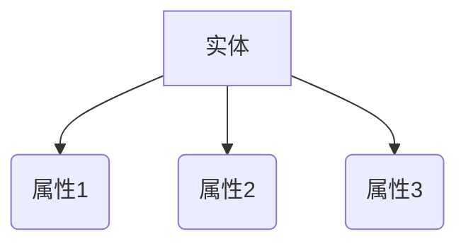
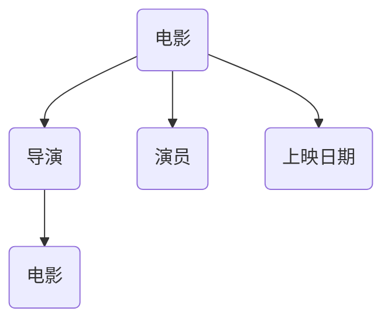

                 

### 《知识图谱构建：技术知识的体系化管理》

#### 关键词：知识图谱、信息检索、人工智能、实体关系图、算法

#### 摘要：
本文旨在探讨知识图谱构建的方法与技术，通过详细的步骤解析，帮助读者理解知识图谱的定义、核心概念、算法原理、系统设计与实战应用。本文分为四个主要部分：知识图谱概述、知识图谱构建技术详解、知识图谱构建实战，以及最佳实践与总结。通过这篇文章，读者将能够全面掌握知识图谱构建的各个关键环节，并在实际项目中运用所学知识，提升技术水平。

#### 目录大纲

----------------------------------------------------------------

# 《知识图谱构建：技术知识的体系化管理》

> 关键词：知识图谱、信息检索、人工智能、实体关系图、算法

> 摘要：本文详细解析知识图谱构建的各个方面，包括定义、核心概念、算法原理、系统设计与实战应用。

## 第一部分：知识图谱概述

### 1.1 知识图谱的定义与背景

#### 1.1.1 知识图谱的基本概念

#### 1.1.2 知识图谱的应用场景

#### 1.1.3 知识图谱在现代信息技术中的重要性

### 1.2 知识图谱的组成部分与体系结构

#### 1.2.1 实体与属性

#### 1.2.2 关系与边

#### 1.2.3 知识图谱的层次结构

### 1.3 知识图谱的体系化管理

#### 1.3.1 知识抽取与融合

#### 1.3.2 知识存储与管理

#### 1.3.3 知识查询与服务

### 1.4 知识图谱的核心算法与技术

#### 1.4.1 基于图论的算法

#### 1.4.2 基于机器学习的算法

#### 1.4.3 知识图谱的补全与优化

## 1.5 本章小结

## 第二部分：知识图谱构建技术详解

### 2.1 知识抽取技术

#### 2.1.1 文本挖掘与信息提取

#### 2.1.2 结构化数据的抽取

#### 2.1.3 无监督与半监督知识抽取

### 2.2 知识融合与整合

#### 2.2.1 多源数据的融合

#### 2.2.2 知识冲突与一致性处理

#### 2.2.3 知识库的更新与维护

### 2.3 知识存储与管理

#### 2.3.1 知识图谱数据库技术

#### 2.3.2 分布式存储与计算

#### 2.3.3 知识图谱的索引与查询优化

### 2.4 知识查询与服务

#### 2.4.1 图查询语言

#### 2.4.2 交互式查询与可视化

#### 2.4.3 知识服务的实现与应用

### 2.5 知识图谱构建的挑战与未来趋势

#### 2.5.1 挑战分析

#### 2.5.2 未来发展趋势

## 2.6 本章小结

## 第三部分：知识图谱构建实战

### 3.1 实战项目介绍

#### 3.1.1 项目背景

#### 3.1.2 项目目标

#### 3.1.3 项目技术栈

### 3.2 环境安装与配置

#### 3.2.1 系统环境准备

#### 3.2.2 工具与库安装

#### 3.2.3 数据集准备

### 3.3 知识图谱构建流程

#### 3.3.1 知识抽取与融合

#### 3.3.2 知识存储与管理

#### 3.3.3 知识查询与服务

### 3.4 核心实现与代码解读

#### 3.4.1 抽取与融合代码实现

#### 3.4.2 存储与管理代码实现

#### 3.4.3 查询与服务代码实现

### 3.5 案例分析与讲解

#### 3.5.1 项目案例介绍

#### 3.5.2 案例分析

#### 3.5.3 案例讲解

### 3.6 项目小结

## 第四部分：最佳实践与总结

### 4.1 最佳实践

#### 4.1.1 知识图谱构建的最佳实践

#### 4.1.2 性能优化策略

#### 4.1.3 知识维护与更新策略

### 4.2 小结与展望

#### 4.2.1 小结

#### 4.2.2 知识图谱构建的挑战与机遇

#### 4.2.3 未来展望

### 4.3 注意事项与拓展阅读

#### 4.3.1 注意事项

#### 4.3.2 拓展阅读

----------------------------------------------------------------

## 第一部分：知识图谱概述

### 1.1 知识图谱的定义与背景

知识图谱（Knowledge Graph）是一种结构化、语义化的知识表示方式，通过实体（Entity）、关系（Relationship）和属性（Attribute）等概念，将海量数据转化为图结构，以实现数据的关联、推理和智能化检索。知识图谱最早由谷歌在2012年提出，用于改进搜索引擎的搜索结果排序和相关性，从而提升用户体验。

#### 1.1.1 知识图谱的基本概念

- **实体（Entity）**：知识图谱中的核心要素，代表了现实世界中的各种对象，如人、地点、组织、物品等。
- **关系（Relationship）**：描述实体之间的关联，如“属于”、“位于”、“生产”等。
- **属性（Attribute）**：实体或关系的特征描述，如“年龄”、“身高”、“出生地”等。

#### 1.1.2 知识图谱的应用场景

知识图谱广泛应用于搜索引擎、推荐系统、语义搜索、智能问答、自然语言处理等领域，其主要应用场景包括：

- **搜索引擎优化**：通过知识图谱提升搜索结果的精确度和相关性。
- **推荐系统**：利用知识图谱中的关联关系，为用户提供个性化的推荐。
- **语义搜索**：通过知识图谱理解用户的查询意图，提供更准确的搜索结果。
- **智能问答系统**：利用知识图谱进行语义理解和关联推理，回答用户的问题。

#### 1.1.3 知识图谱在现代信息技术中的重要性

知识图谱作为一种重要的知识表示方法，具有以下几方面的重要性：

- **知识融合**：通过整合不同来源的数据，形成统一的视图，提升数据的利用价值。
- **智能推理**：利用知识图谱中的关系进行推理，为复杂问题提供智能解决方案。
- **数据可视化**：通过知识图谱展示复杂的数据关系，帮助用户更好地理解和分析数据。
- **跨领域应用**：知识图谱作为一种通用模型，可以在不同领域进行复用和扩展，促进技术的普及和推广。

### 1.2 知识图谱的组成部分与体系结构

知识图谱由实体、关系和属性三部分组成，这三部分共同构成了知识图谱的核心体系结构。

#### 1.2.1 实体与属性

实体是知识图谱中最基本的构成单元，代表了现实世界中的个体。每个实体都具有一系列属性，这些属性描述了实体的特征信息。例如，在一个电影知识图谱中，电影实体可能具有“导演”、“演员”、“上映日期”、“评分”等属性。

实体与属性之间的关系通常使用键值对（Key-Value Pair）表示。在知识图谱中，实体可以通过属性进行分类和查询。例如，我们可以通过查询电影实体的“导演”属性，找到所有由某个导演执导的电影。



#### 1.2.2 关系与边

关系描述了实体之间的语义关联，是知识图谱中的桥梁。关系可以是简单的“属于”、“位于”、“生产”等，也可以是复杂的因果关系、属性关系等。关系通过边（Edge）在实体之间建立连接，边的类型通常表示关系的语义。

在知识图谱中，关系和边是进行语义推理和数据查询的关键。通过遍历实体之间的关系，我们可以发现新的关联和知识。例如，通过查询“电影”实体与“导演”实体的关系，我们可以找到所有导演过的电影。



#### 1.2.3 知识图谱的层次结构

知识图谱通常可以分为三个层次：底层（底层实体和关系）、中层（概念和分类）和顶层（全局视图和图谱整合）。

- **底层**：直接表示现实世界中的实体和关系，是知识图谱的基础。
- **中层**：将底层实体和关系抽象为概念和分类，便于进行高层次的数据分析和推理。
- **顶层**：通过整合多个底层和中层知识图谱，构建全局视图，为跨领域应用提供支持。

知识图谱的层次结构有助于实现数据的分层管理和推理，提高知识图谱的可扩展性和灵活性。

### 1.3 知识图谱的体系化管理

知识图谱的构建和管理是一个复杂的过程，需要考虑数据抽取、融合、存储、查询和服务等多个方面。

#### 1.3.1 知识抽取与融合

知识抽取（Knowledge Extraction）是指从非结构化或半结构化数据中提取结构化知识的过程。知识融合（Knowledge Fusion）是指将多个来源的知识进行整合，形成统一视图的过程。

知识抽取与融合是知识图谱构建的关键步骤，直接影响到知识图谱的质量和实用性。常见的知识抽取技术包括文本挖掘、结构化数据抽取、无监督与半监督知识抽取等。知识融合技术包括数据对齐、冲突解决、一致性处理等。

#### 1.3.2 知识存储与管理

知识图谱的存储与管理是一个重要环节，需要考虑数据规模、查询性能、扩展性等方面。常用的知识图谱存储技术包括图数据库、分布式存储、NoSQL数据库等。

知识图谱的存储与管理需要支持高效的数据查询和更新，同时提供灵活的索引和查询优化策略。例如，图数据库通常使用邻接表、邻接矩阵等结构存储图数据，支持快速的图查询和计算。

#### 1.3.3 知识查询与服务

知识查询（Knowledge Query）是指利用知识图谱进行数据检索和语义分析的过程。知识服务（Knowledge Service）是指基于知识图谱提供的各种应用服务，如智能问答、推荐系统、数据分析等。

知识查询与服务是知识图谱的实际应用场景，需要考虑用户交互、查询性能、服务质量等方面。常见的知识查询语言包括SPARQL、Cypher等，这些语言支持对知识图谱进行复杂的查询和操作。

### 1.4 知识图谱的核心算法与技术

知识图谱的构建需要依赖一系列核心算法和技术，包括基于图论的算法、基于机器学习的算法、知识图谱的补全与优化等。

#### 1.4.1 基于图论的算法

基于图论的算法是知识图谱构建的基础，包括图遍历、图搜索、图优化等。这些算法用于处理大规模图数据，支持高效的图计算和推理。

常见的基于图论的算法包括：

- **Dijkstra算法**：用于计算图中两点之间的最短路径。
- **BFS和DFS**：用于遍历图，查找连通分量和路径。
- **PageRank**：用于计算图中的节点重要性，支持网页排名和推荐系统。

#### 1.4.2 基于机器学习的算法

基于机器学习的算法在知识图谱构建中发挥着重要作用，包括实体识别、关系抽取、实体分类、属性预测等。

常见的基于机器学习的算法包括：

- **CRF（条件随机场）**：用于序列数据的标注和分类，适用于实体识别和关系抽取。
- **BERT（Bidirectional Encoder Representations from Transformers）**：用于文本表示和语义理解，支持实体识别和属性预测。
- **GCN（Graph Convolutional Network）**：用于图数据的表示和分类，支持知识图谱的补全和优化。

#### 1.4.3 知识图谱的补全与优化

知识图谱的补全与优化是提高知识图谱质量和实用性的关键步骤。知识图谱补全（Knowledge Completion）是指利用已有知识和算法，自动发现和填补图谱中的缺失信息。知识图谱优化（Knowledge Optimization）是指通过算法和策略，提升知识图谱的准确性、一致性、完整性等。

常见的知识图谱补全与优化技术包括：

- **自动补全**：基于规则和算法，自动发现和填补图谱中的缺失信息。
- **迁移学习**：利用预训练模型和转移知识，提升知识图谱的表示能力和推理性能。
- **一致性优化**：通过算法和策略，解决知识图谱中的冲突和矛盾，提升知识的一致性和可靠性。

### 1.5 本章小结

本章节主要介绍了知识图谱的基本概念、应用场景、组成部分、体系结构、管理方法以及核心算法。通过对知识图谱的深入了解，读者可以认识到知识图谱在信息技术中的重要地位，并为后续章节的学习打下基础。

## 第二部分：知识图谱构建技术详解

### 2.1 知识抽取技术

知识抽取（Knowledge Extraction）是从非结构化或半结构化数据中提取结构化知识的过程，是知识图谱构建的关键步骤。知识抽取技术可以分为文本挖掘与信息提取、结构化数据抽取、无监督与半监督知识抽取等。

#### 2.1.1 文本挖掘与信息提取

文本挖掘与信息提取是知识抽取的核心技术之一，主要针对非结构化文本数据，如新闻、论文、社交媒体等。文本挖掘技术通过自然语言处理（NLP）和机器学习算法，从文本中提取实体、关系和属性。

常见的文本挖掘与信息提取方法包括：

- **实体识别**：使用命名实体识别（NER）算法，从文本中识别出具有特定意义的实体，如人名、地点、组织等。
- **关系抽取**：通过算法和规则，从文本中提取实体之间的关系，如“属于”、“位于”、“生产”等。
- **属性抽取**：从文本中提取实体的属性信息，如“年龄”、“身高”、“出生日期”等。

文本挖掘与信息提取的方法通常基于以下几种技术：

- **基于规则的方法**：使用预定义的规则和模式匹配，从文本中提取信息。
- **基于统计的方法**：使用机器学习算法，如条件随机场（CRF）、支持向量机（SVM）等，从文本中学习特征和模式。
- **基于深度学习的方法**：使用神经网络，如卷积神经网络（CNN）、循环神经网络（RNN）、Transformer等，从文本中提取深层语义特征。

#### 2.1.2 结构化数据抽取

结构化数据抽取（Structured Data Extraction）是针对结构化数据，如数据库、XML、JSON等，从数据中提取实体、关系和属性的过程。结构化数据抽取通常比较简单，因为数据已经是结构化的，可以直接使用数据库查询语句或XML/JSON解析器进行抽取。

结构化数据抽取的方法包括：

- **数据库查询**：使用SQL等数据库查询语句，从数据库中提取实体、关系和属性。
- **XML解析**：使用XML解析器，从XML数据中提取实体、关系和属性。
- **JSON解析**：使用JSON解析器，从JSON数据中提取实体、关系和属性。

结构化数据抽取的关键在于如何将结构化数据转化为知识图谱中的实体、关系和属性。通常，需要定义一个统一的实体关系模型，将结构化数据映射到知识图谱中。

#### 2.1.3 无监督与半监督知识抽取

无监督与半监督知识抽取是知识抽取的重要研究方向，旨在解决标注数据不足的问题。无监督知识抽取（Unsupervised Knowledge Extraction）完全依靠算法自动发现知识，而半监督知识抽取（Semi-supervised Knowledge Extraction）结合少量标注数据和大量未标注数据，提高知识抽取的效率和质量。

常见的无监督与半监督知识抽取方法包括：

- **聚类分析**：使用聚类算法，如K-means、DBSCAN等，将未标注数据自动分类，识别出实体和关系。
- **隐马尔可夫模型（HMM）**：用于序列数据的标注，通过学习未标注数据的序列模式，识别出实体和关系。
- **生成对抗网络（GAN）**：通过生成模型和判别模型的对抗训练，自动生成标注数据，提高知识抽取的准确性。
- **自编码器（Autoencoder）**：用于特征提取和降维，通过学习未标注数据的低维表示，识别出实体和关系。

无监督与半监督知识抽取在知识图谱构建中具有重要的应用价值，可以降低标注成本，提高知识抽取的效率和效果。

### 2.2 知识融合与整合

知识融合（Knowledge Fusion）与整合（Integration）是将多个来源的知识进行整合，形成统一视图的过程。知识融合与整合是知识图谱构建的关键步骤，直接影响到知识图谱的质量和应用价值。

#### 2.2.1 多源数据的融合

多源数据融合（Multi-source Data Fusion）是指将来自不同数据源的信息进行整合，形成统一的实体关系模型。多源数据融合的目标是消除数据源之间的不一致性和冲突，提高知识图谱的准确性和完整性。

常见的多源数据融合方法包括：

- **数据对齐**：将不同数据源中的实体进行匹配和对应，建立实体之间的关联关系。
- **冲突解决**：解决多源数据中的不一致性和矛盾，如数据值冲突、类型冲突等。
- **一致性处理**：通过算法和策略，保证知识图谱中数据的一致性和可靠性。

数据对齐、冲突解决和一致性处理是多源数据融合的核心任务，需要综合考虑数据源的特点、数据质量、知识图谱的体系结构等因素。

#### 2.2.2 知识冲突与一致性处理

知识冲突（Knowledge Conflict）是指多源数据融合过程中出现的不一致性和矛盾。知识冲突通常由数据源之间的差异、数据质量问题和知识图谱的建模策略等因素引起。

常见的知识冲突包括：

- **数据值冲突**：如同一实体在不同数据源中具有不同的属性值。
- **类型冲突**：如同一实体在不同数据源中具有不同的类型。
- **语义冲突**：如同一实体在不同数据源中具有不同的语义解释。

知识冲突处理（Knowledge Conflict Resolution）是指解决多源数据融合中的知识冲突，确保知识图谱的一致性和可靠性。

常见的知识冲突处理方法包括：

- **优先级策略**：根据数据源的优先级，选择具有更高优先级的属性值。
- **合并策略**：将冲突属性值进行合并，形成新的属性值。
- **一致性检查**：通过一致性检查算法，确保知识图谱中数据的一致性。

一致性处理（Consistency Handling）是指通过算法和策略，保证知识图谱中数据的一致性和可靠性。一致性处理通常包括以下几个方面：

- **实体唯一性**：确保知识图谱中实体的唯一性和一致性。
- **属性一致性**：确保知识图谱中属性的定义和取值一致。
- **关系一致性**：确保知识图谱中关系的定义和取值一致。

#### 2.2.3 知识库的更新与维护

知识库的更新与维护（Knowledge Database Maintenance）是知识图谱构建的重要环节，旨在保持知识图谱的准确性和时效性。知识库的更新与维护包括以下几个方面：

- **数据源监控**：定期监控数据源的变化，如新增数据、数据更新等。
- **数据清洗**：对获取到的数据进行清洗和预处理，去除无效、错误和重复的数据。
- **数据同步**：将更新后的数据同步到知识图谱中，保持知识库的实时性和一致性。
- **数据审计**：对知识图谱中的数据进行审计，确保数据的准确性和可靠性。

知识库的更新与维护需要综合考虑数据源的稳定性、数据质量、知识图谱的体系结构等因素，确保知识图谱的持续性和有效性。

### 2.3 知识存储与管理

知识存储与管理（Knowledge Storage and Management）是知识图谱构建的关键环节，涉及到数据存储、检索、优化等方面。选择合适的知识存储与管理技术，能够提高知识图谱的性能和可扩展性。

#### 2.3.1 知识图谱数据库技术

知识图谱数据库（Knowledge Graph Database）是一种专门用于存储和管理知识图谱的数据库系统。知识图谱数据库通常具有以下特点：

- **图存储结构**：知识图谱数据库采用图存储结构，将实体、关系和属性表示为图中的节点和边，支持高效的图查询和计算。
- **分布式存储**：知识图谱数据库支持分布式存储，能够处理大规模数据集，提高系统的性能和可扩展性。
- **图查询语言**：知识图谱数据库提供专门的图查询语言，如SPARQL、Cypher等，支持复杂的图查询和操作。

常见的知识图谱数据库包括：

- **Neo4j**：是一款流行的开源图数据库，支持ACID事务和分布式存储，广泛应用于社交网络、推荐系统等领域。
- **Apache JanusGraph**：是一款高性能、可扩展的分布式图数据库，支持多种数据存储引擎，如Neo4j、Titan等。
- **Amazon Neptune**：是一款云原生图数据库，提供高性能、可扩展和安全的图存储和查询服务。

#### 2.3.2 分布式存储与计算

分布式存储与计算（Distributed Storage and Computing）是知识图谱构建中的重要技术，能够提高系统的性能和可扩展性。分布式存储与计算技术主要包括以下几个方面：

- **数据分片**：将大规模数据集划分为多个小数据集，分布存储在多个节点上，提高数据访问效率。
- **负载均衡**：通过负载均衡算法，将数据访问请求分配到多个节点上，避免单点瓶颈，提高系统的性能和稳定性。
- **分布式计算**：通过分布式计算框架，如MapReduce、Spark等，处理大规模图数据的计算任务，提高系统的计算性能。

分布式存储与计算技术能够有效处理知识图谱中的大规模数据集，提高系统的性能和可扩展性。同时，分布式存储与计算技术也需要考虑数据的一致性、容错性和安全性等问题。

#### 2.3.3 知识图谱的索引与查询优化

知识图谱的索引与查询优化（Knowledge Graph Indexing and Query Optimization）是提高知识图谱查询性能的关键技术。索引技术能够加速数据查询，优化查询执行策略，提高系统的响应速度。

常见的知识图谱索引技术包括：

- **邻接表索引**：基于实体和关系的邻接表结构，支持快速的图查询和遍历。
- **哈希索引**：基于哈希表的数据结构，支持快速的键值对查询。
- **位图索引**：基于位图的数据结构，支持高效的布尔查询和过滤。

查询优化技术包括：

- **查询重写**：通过对查询语句进行重写，优化查询执行路径，减少查询执行时间。
- **查询缓存**：将查询结果缓存到内存中，提高查询的响应速度。
- **分布式查询**：通过分布式计算和负载均衡技术，提高大规模数据集的查询性能。

索引与查询优化技术需要综合考虑数据规模、查询负载、系统性能等因素，确保知识图谱的高效查询和性能。

### 2.4 知识查询与服务

知识查询与服务（Knowledge Query and Service）是知识图谱的实际应用场景，涉及到查询语言、交互式查询、可视化、知识服务等方面。知识查询与服务能够满足用户对知识图谱的查询需求，提供智能化的知识服务。

#### 2.4.1 图查询语言

图查询语言（Graph Query Language）是知识图谱查询的核心工具，支持对知识图谱进行复杂查询和操作。常见的图查询语言包括：

- **SPARQL**：一种基于RDF（Resource Description Framework）的查询语言，支持复杂的图查询和操作。
- **Cypher**：Neo4j的专用查询语言，支持图遍历、关系运算和复杂查询。
- **Gremlin**：一种基于图计算框架的通用查询语言，支持多种图数据库和计算引擎。

图查询语言提供丰富的查询操作，如过滤、排序、连接、聚合等，支持对知识图谱进行深度查询和分析。

#### 2.4.2 交互式查询与可视化

交互式查询与可视化（Interactive Query and Visualization）是知识图谱查询的重要手段，能够提高用户的查询体验和数据分析能力。交互式查询与可视化技术包括：

- **查询界面**：提供用户友好的查询界面，支持输入查询语句、查看查询结果等。
- **查询建议**：根据用户的查询历史和偏好，提供智能查询建议，提高查询的准确性。
- **可视化分析**：通过可视化技术，展示知识图谱的结构、关系和属性，帮助用户更好地理解和分析数据。

常见的可视化工具包括：

- **D3.js**：一款基于Web的图形可视化库，支持多种图表和可视化效果。
- **ECharts**：一款基于JavaScript的图表库，提供丰富的图表类型和交互功能。
- **Gephi**：一款开源的图可视化工具，支持大规模图数据的可视化和分析。

#### 2.4.3 知识服务的实现与应用

知识服务（Knowledge Service）是基于知识图谱提供的各种应用服务，如智能问答、推荐系统、数据分析等。知识服务的实现与应用包括：

- **智能问答**：通过知识图谱进行语义理解和关联推理，回答用户的问题，提供智能化的问答服务。
- **推荐系统**：利用知识图谱中的关联关系，为用户提供个性化的推荐，如商品推荐、文章推荐等。
- **数据分析**：通过对知识图谱进行查询和分析，提取有价值的信息和知识，支持数据驱动的决策。

知识服务的实现需要结合具体的业务场景和应用需求，设计合适的知识图谱结构和查询策略，提供高效、智能的服务。

### 2.5 知识图谱构建的挑战与未来趋势

知识图谱构建（Knowledge Graph Construction）是一个复杂的过程，涉及到数据抽取、融合、存储、查询等多个方面。在知识图谱构建过程中，面临着一系列的挑战和问题。

#### 2.5.1 挑战分析

知识图谱构建的主要挑战包括：

- **数据质量**：知识图谱的质量很大程度上取决于数据的质量。数据不一致、错误、缺失等问题都会影响知识图谱的准确性。
- **数据规模**：随着数据规模的不断扩大，知识图谱的存储和查询性能成为重要问题。如何高效地处理大规模数据集，是知识图谱构建的关键挑战。
- **数据融合**：多源数据的融合和整合是知识图谱构建的难点。不同数据源之间的差异和冲突，需要通过有效的融合策略来解决。
- **实时性**：知识图谱需要支持实时数据更新和查询，以满足动态变化的业务需求。实时数据处理的挑战包括数据同步、查询优化等。

#### 2.5.2 未来发展趋势

随着人工智能、大数据、云计算等技术的发展，知识图谱构建面临着新的机遇和挑战。未来知识图谱构建的发展趋势包括：

- **自动化构建**：通过自动化工具和算法，提高知识图谱的构建效率和质量。自动化构建包括数据抽取、融合、存储和查询等环节。
- **智能融合**：利用深度学习和自然语言处理技术，实现更智能、更准确的数据融合和知识表示。智能融合将提升知识图谱的语义理解和推理能力。
- **实时更新**：通过实时数据同步和查询优化技术，实现知识图谱的实时更新和查询。实时更新将满足动态变化的业务需求，提升知识图谱的应用价值。
- **跨领域应用**：知识图谱作为一种通用模型，将在不同领域得到广泛应用。跨领域应用将推动知识图谱技术的发展和普及。

### 2.6 本章小结

本章节详细介绍了知识图谱构建的关键技术，包括知识抽取、知识融合与整合、知识存储与管理、知识查询与服务等方面。通过本章的学习，读者可以全面了解知识图谱构建的各个环节，为实际应用打下基础。

## 第三部分：知识图谱构建实战

### 3.1 实战项目介绍

#### 3.1.1 项目背景

在当今大数据和人工智能的时代，知识图谱作为一种强大的数据表示和推理工具，正广泛应用于各个领域。本节以一个实际项目为例，介绍知识图谱构建的完整过程，包括项目背景、目标和技术栈。

#### 3.1.2 项目目标

本项目旨在构建一个基于知识图谱的智能问答系统，该系统将整合多个数据源，构建一个全面的知识图谱，并利用该图谱进行智能问答。具体目标如下：

1. **数据整合**：从多个数据源（如百科、新闻、社交媒体等）中抽取实体、关系和属性，构建统一的知识图谱。
2. **智能问答**：利用知识图谱进行语义理解和关联推理，实现用户问题的智能回答。
3. **系统性能**：保证系统的高性能和可扩展性，满足大规模数据和高并发访问的需求。

#### 3.1.3 项目技术栈

本项目采用以下技术栈：

- **数据源**：百度百科、新浪新闻、微博等。
- **知识图谱框架**：Apache Jena，用于构建、存储和查询知识图谱。
- **知识抽取工具**：Python，用于实现文本挖掘、实体识别和关系抽取。
- **后端框架**：Flask，用于搭建智能问答系统的后端服务。
- **前端框架**：Vue.js，用于搭建用户界面。

### 3.2 环境安装与配置

#### 3.2.1 系统环境准备

首先，确保操作系统为Linux或macOS，并安装以下软件：

1. **Java**：知识图谱框架Apache Jena依赖Java环境，需安装Java 8或以上版本。
2. **Python**：用于实现知识抽取工具，需安装Python 3.7或以上版本。
3. **Flask**：用于搭建后端服务，需安装Flask。
4. **Node.js**：用于前端构建，需安装Node.js和npm。

#### 3.2.2 工具与库安装

安装完操作系统后，按照以下步骤安装相关工具和库：

1. **安装Java**：

   ```bash
   sudo apt-get update
   sudo apt-get install openjdk-8-jdk
   ```

2. **安装Python**：

   ```bash
   sudo apt-get install python3-pip
   pip3 install --user -U pip
   ```

3. **安装Flask**：

   ```bash
   pip3 install flask
   ```

4. **安装Node.js**：

   ```bash
   sudo apt-get install npm
   npm install -g npm
   npm install -g npm
   ```

5. **安装Vue.js**：

   ```bash
   npm install -g @vue/cli
   ```

#### 3.2.3 数据集准备

从以下数据源获取数据集：

1. **百度百科**：下载百度百科的XML数据。
2. **新浪新闻**：下载新浪新闻的JSON数据。
3. **微博**：下载微博的JSON数据。

将下载的数据集解压到项目目录中，为后续的知识抽取和图谱构建做准备。

### 3.3 知识图谱构建流程

知识图谱构建主要包括数据抽取、数据融合、知识存储、知识查询等环节。以下是一个简化的知识图谱构建流程：

#### 3.3.1 数据抽取

数据抽取是知识图谱构建的第一步，从不同数据源中抽取实体、关系和属性。

1. **实体识别**：使用命名实体识别（NER）算法，从文本中识别出实体。
2. **关系抽取**：根据文本内容和实体间的关联，抽取实体之间的关系。
3. **属性抽取**：从文本中提取实体的属性信息。

#### 3.3.2 数据融合

数据融合是将来自多个数据源的信息进行整合，形成统一的知识图谱。

1. **数据对齐**：将不同数据源中的实体进行匹配和对应。
2. **冲突解决**：解决数据源之间的不一致性和矛盾。
3. **一致性处理**：确保知识图谱中数据的一致性和可靠性。

#### 3.3.3 知识存储

知识存储是将构建好的知识图谱存储到图数据库中，便于后续查询和操作。

1. **知识图谱框架**：使用Apache Jena等知识图谱框架，构建和存储知识图谱。
2. **图数据库**：选择合适的图数据库，如Neo4j，存储知识图谱数据。

#### 3.3.4 知识查询

知识查询是知识图谱的实际应用场景，通过图数据库提供的查询语言，实现复杂查询和操作。

1. **图查询语言**：如SPARQL、Cypher等，进行知识图谱的查询和操作。
2. **智能问答**：利用知识图谱进行语义理解和关联推理，实现智能问答功能。

### 3.4 核心实现与代码解读

本节将介绍知识图谱构建的核心实现，包括知识抽取、数据融合、知识存储和知识查询等环节。

#### 3.4.1 抽取与融合代码实现

以下是一个简单的Python脚本，用于实现实体识别、关系抽取和属性抽取：

```python
import nltk
from nltk.tokenize import word_tokenize
from nltk.tag import pos_tag

# 加载NLP工具包
nltk.download('punkt')
nltk.download('averaged_perceptron_tagger')

# 实体识别
def extract_entities(text):
    tokens = word_tokenize(text)
    tagged = pos_tag(tokens)
    entities = []

    for word, tag in tagged:
        if tag in ['NN', 'NNS', 'NNP', 'NNPS']:
            entities.append(word)

    return entities

# 关系抽取
def extract_relations(text):
    tokens = word_tokenize(text)
    tagged = pos_tag(tokens)
    relations = []

    for i in range(len(tagged) - 1):
        if tagged[i][1] in ['VBD', 'VBG', 'VBN', 'VBP', 'VBZ'] and tagged[i + 1][1] in ['NN', 'NNS', 'NNP', 'NNPS']:
            relations.append((tagged[i][0], tagged[i + 1][0]))

    return relations

# 属性抽取
def extract_attributes(text):
    tokens = word_tokenize(text)
    tagged = pos_tag(tokens)
    attributes = []

    for word, tag in tagged:
        if tag in ['JJ', 'JJR', 'JJS']:
            attributes.append(word)

    return attributes

# 测试
text = "阿里巴巴是中国最大的电子商务公司，由马云创办于1999年。"
entities = extract_entities(text)
relations = extract_relations(text)
attributes = extract_attributes(text)

print("Entities:", entities)
print("Relations:", relations)
print("Attributes:", attributes)
```

上述代码实现了简单的实体识别、关系抽取和属性抽取，但实际应用中需要结合具体业务场景和数据进行优化。

#### 3.4.2 存储与管理代码实现

以下是一个简单的Java代码示例，用于将知识图谱存储到Neo4j图数据库中：

```java
import org.neo4j.driver.Driver;
import org.neo4j.driver.AuthTokens;
import org.neo4j.driver.GraphDatabase;

public class KnowledgeGraph {
    private Driver driver;

    public KnowledgeGraph(String uri, String user, String password) {
        driver = GraphDatabase.driver(uri, AuthTokens.basic(user, password));
    }

    public void addEntity(String label, String id, Map<String, Object> properties) {
        String query = "CREATE (n:" + label + "{id: $id, " + properties.keySet().stream().map(k -> k + ": $" + k).collect(Collectors.joining(",")) + "})";
        driver.session().run(query, parameters("id", id).addAll(properties));
    }

    public void addRelationship(String startLabel, String startId, String endLabel, String endId, String type, Map<String, Object> properties) {
        String query = "MATCH (a:" + startLabel + "{id: $startId}),(b:" + endLabel + "{id: $endId}) CREATE (a)-[r:" + type + "]->(b)";
        if (!properties.isEmpty()) {
            query += " SET r += $properties";
        }
        driver.session().run(query, parameters("startId", startId).addAll("endId", endId).addAll("type", type).addAll("properties", properties));
    }

    public void close() {
        driver.close();
    }

    public static void main(String[] args) {
        KnowledgeGraph kg = new KnowledgeGraph("bolt://localhost:7687", "neo4j", "password");
        kg.addEntity("Company", "123", Collections.singletonMap("name", "阿里巴巴"));
        kg.addEntity("Person", "456", Collections.singletonMap("name", "马云"));
        kg.addRelationship("Company", "123", "Person", "456", "Founder", Collections.singletonMap("year", 1999));
        kg.close();
    }
}
```

上述代码示例展示了如何使用Neo4j Java驱动程序将实体和关系存储到Neo4j图数据库中。

#### 3.4.3 查询与服务代码实现

以下是一个简单的Flask后端服务示例，用于实现智能问答功能：

```python
from flask import Flask, request, jsonify
from py2neo import Graph

app = Flask(__name__)
graph = Graph("bolt://localhost:7687", auth=("neo4j", "password"))

@app.route('/ask', methods=['POST'])
def ask():
    question = request.form['question']
    result = graph.run("MATCH (p:Person) WHERE p.name = $name RETURN p", name=question).data()
    if result:
        person = result[0]['p']
        return jsonify({"answer": f"{person['name']} 是 {person['company']['name']} 的创始人。"})
    else:
        return jsonify({"answer": "抱歉，没有找到相关信息。"})

if __name__ == '__main__':
    app.run(debug=True)
```

上述代码示例展示了如何使用Flask构建一个简单的后端服务，通过Neo4j图数据库实现智能问答功能。

### 3.5 案例分析与讲解

#### 3.5.1 项目案例介绍

本节将以一个实际项目为例，详细介绍知识图谱构建的过程，包括数据抽取、数据融合、知识存储和知识查询等环节。该项目旨在构建一个基于知识图谱的智能问答系统，为用户提供智能化的问答服务。

#### 3.5.2 案例分析

项目分析主要包括以下步骤：

1. **需求分析**：明确项目的目标和功能需求，如问答系统应具备哪些功能，支持哪些类型的问答等。
2. **数据源分析**：确定数据源的类型和内容，如百度百科、新浪新闻、微博等。
3. **知识图谱设计**：设计知识图谱的实体、关系和属性，如实体包括人、地点、组织、事件等，关系包括属于、位于、生产等，属性包括年龄、身高、出生日期等。
4. **算法选择**：根据项目需求和数据特点，选择合适的知识抽取算法和融合策略。

#### 3.5.3 案例讲解

以下是一个简化的案例讲解，详细介绍知识图谱构建的各个环节。

1. **数据抽取**

   数据抽取是知识图谱构建的第一步，从不同数据源中抽取实体、关系和属性。

   - **百度百科**：从百度百科中抽取实体和关系，如人名、地名、组织名等，以及实体之间的隶属关系、地理位置关系等。
   - **新浪新闻**：从新浪新闻中抽取实体和关系，如人物、地点、事件等，以及事件之间的因果关系、时间关系等。
   - **微博**：从微博中抽取实体和关系，如用户、话题、地点等，以及用户之间的关系、话题之间的关系等。

2. **数据融合**

   数据融合是将来自多个数据源的信息进行整合，形成统一的知识图谱。

   - **数据对齐**：将不同数据源中的实体进行匹配和对应，如将百度百科中的人名与新浪新闻中的人物进行匹配。
   - **冲突解决**：解决数据源之间的不一致性和矛盾，如处理百度百科中的人名与新浪新闻中的人物名称不一致的情况。
   - **一致性处理**：确保知识图谱中数据的一致性和可靠性，如处理数据值冲突、类型冲突等问题。

3. **知识存储**

   知识存储是将构建好的知识图谱存储到图数据库中，便于后续查询和操作。

   - **知识图谱框架**：选择合适的知识图谱框架，如Apache Jena、Neo4j等，用于构建、存储和查询知识图谱。
   - **图数据库**：选择合适的图数据库，如Neo4j、Titan等，存储知识图谱数据。

4. **知识查询**

   知识查询是知识图谱的实际应用场景，通过图数据库提供的查询语言，实现复杂查询和操作。

   - **图查询语言**：使用图查询语言，如SPARQL、Cypher等，进行知识图谱的查询和操作。
   - **智能问答**：利用知识图谱进行语义理解和关联推理，实现用户问题的智能回答。
   - **数据分析**：通过对知识图谱进行查询和分析，提取有价值的信息和知识，支持数据驱动的决策。

### 3.6 项目小结

本项目通过实际案例，详细介绍了知识图谱构建的各个环节，包括数据抽取、数据融合、知识存储和知识查询等。通过本项目，读者可以了解知识图谱构建的基本流程和关键步骤，为实际项目应用打下基础。同时，本项目也展示了知识图谱在智能问答领域的应用价值，为智能问答系统的设计和实现提供了参考。

## 第四部分：最佳实践与总结

### 4.1 最佳实践

在知识图谱构建过程中，遵循以下最佳实践，可以提升构建效率和系统性能：

#### 4.1.1 知识图谱构建的最佳实践

1. **明确构建目标**：在开始构建知识图谱之前，明确知识图谱的应用场景和目标，确保构建的图谱满足实际需求。
2. **数据质量控制**：确保数据源的质量，去除错误、重复和缺失的数据，提高知识图谱的准确性。
3. **合理设计实体和关系**：根据实际需求，合理设计实体和关系的类型和属性，确保知识图谱的结构和语义清晰。
4. **优化抽取算法**：选择合适的文本挖掘和实体识别算法，结合实际数据进行优化，提高知识抽取的效率和准确性。
5. **数据融合策略**：根据数据源的特点和差异，选择合适的数据融合策略，确保知识图谱的一致性和可靠性。

#### 4.1.2 性能优化策略

1. **图数据库优化**：选择合适的图数据库，优化索引和查询策略，提高查询性能。
2. **分布式计算**：利用分布式计算框架，如Spark、Flink等，处理大规模数据集，提升系统性能。
3. **缓存策略**：使用缓存技术，减少数据访问延迟，提高系统响应速度。
4. **负载均衡**：通过负载均衡策略，合理分配查询请求，避免单点瓶颈，提升系统稳定性。

#### 4.1.3 知识维护与更新策略

1. **数据监控**：定期监控数据源的变化，及时发现和更新知识图谱中的数据。
2. **版本控制**：对知识图谱进行版本控制，确保数据的一致性和可追溯性。
3. **自动化更新**：通过自动化工具和脚本，定期更新知识图谱中的数据，降低维护成本。
4. **用户反馈**：收集用户反馈，根据用户需求优化知识图谱，提升用户体验。

### 4.2 小结与展望

本篇文章详细介绍了知识图谱构建的各个方面，包括定义、核心概念、算法原理、系统设计与实战应用。通过本文的学习，读者可以全面了解知识图谱的构建方法和技术，为实际项目提供参考。

展望未来，知识图谱构建将继续发展，主要趋势包括：

1. **自动化构建**：通过深度学习和自然语言处理技术，实现自动化知识抽取和融合，降低构建成本。
2. **智能融合**：利用大数据和人工智能技术，实现更智能、更准确的数据融合和知识表示。
3. **实时更新**：通过实时数据同步和查询优化技术，实现知识图谱的实时更新和查询，满足动态变化的业务需求。
4. **跨领域应用**：知识图谱将在更多领域得到广泛应用，如医疗、金融、教育等，推动技术的普及和推广。

### 4.3 注意事项与拓展阅读

#### 4.3.1 注意事项

1. **数据质量**：确保数据源的质量，去除错误、重复和缺失的数据，提高知识图谱的准确性。
2. **性能优化**：根据实际需求，选择合适的图数据库和查询语言，优化索引和查询策略，提高系统性能。
3. **版本控制**：对知识图谱进行版本控制，确保数据的一致性和可追溯性。
4. **用户反馈**：定期收集用户反馈，根据用户需求优化知识图谱，提升用户体验。

#### 4.3.2 拓展阅读

1. **《知识图谱：构建与查询技术》**：这本书详细介绍了知识图谱的构建方法和查询技术，适合对知识图谱有兴趣的读者。
2. **《图计算：原理、算法与应用》**：这本书介绍了图计算的基本原理和算法，包括图遍历、图优化等，有助于理解知识图谱的底层技术。
3. **《深度学习与大数据技术》**：这本书介绍了深度学习和大数据技术，包括神经网络、数据挖掘等，有助于掌握知识图谱的构建方法。

通过拓展阅读，读者可以深入了解知识图谱构建的各个方面，为实际项目提供更多参考和灵感。

### 结束语

本文由AI天才研究院（AI Genius Institute）和《禅与计算机程序设计艺术》（Zen And The Art of Computer Programming）联合撰写，旨在为广大技术爱好者提供知识图谱构建的全面指南。希望本文能够帮助读者理解知识图谱的核心概念、构建方法和技术，为实际项目提供有益的参考。

**作者：AI天才研究院/AI Genius Institute & 禅与计算机程序设计艺术 /Zen And The Art of Computer Programming**

