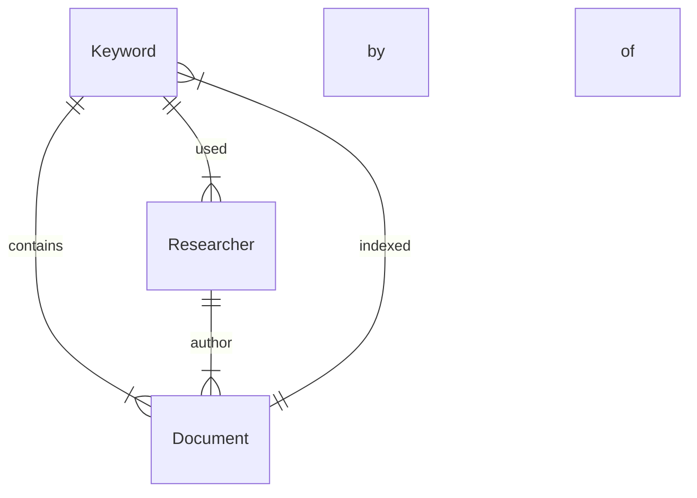

                 


# 科研助手：利用提示词加速文献综述过程

> 关键词：科研文献、提示词、文献综述、检索、自然语言处理、算法、优化

> 摘要：本文旨在探讨如何利用提示词这一工具，加速科研文献的综述过程。通过详细解析提示词的基本原理、检索算法，以及在文献阅读与分析中的应用，本文将为科研工作者提供一套实用的策略，以提升文献综述的效率和质量。

### 目录大纲

```markdown
----------------------------------------------------------------
# 第一部分: 背景与核心概念

## 第1章: 科研文献综述的重要性与挑战
### 1.1.1 科研文献综述的概述
### 1.1.2 科研文献综述的挑战
### 1.1.3 提示词在文献综述中的作用

## 第2章: 提示词的基本原理
### 2.1 提示词的定义与类型
### 2.2 提示词在自然语言处理中的应用
### 2.3 提示词设计的原则与方法

## 第3章: 利用提示词加速文献检索
### 3.1 文献检索的基本步骤
### 3.2 提示词在检索中的优化策略
### 3.3 提示词检索案例解析

## 第4章: 提示词辅助文献阅读与分析
### 4.1 文献阅读的常见障碍
### 4.2 提示词在文献阅读中的应用
### 4.3 提示词辅助文献分析的案例

## 第5章: 提示词在文献综述中的具体应用
### 5.1 文献综述的流程与方法
### 5.2 提示词在文献综述中的应用步骤
### 5.3 提示词在文献综述中的案例分析

## 第6章: 提示词在科研项目管理中的应用
### 6.1 科研项目管理的基本概念
### 6.2 提示词在科研项目管理中的作用
### 6.3 提示词在项目决策中的应用案例

## 第7章: 提示词在科研领域的拓展应用
### 7.1 提示词在科研协作中的应用
### 7.2 提示词在科研传播与交流中的应用
### 7.3 提示词在未来科研发展中的潜力

## 第8章: 提示词应用的实践与优化
### 8.1 提示词应用实践中的问题与挑战
### 8.2 提示词应用的优化策略
### 8.3 提示词应用的未来发展趋势

----------------------------------------------------------------
```

## 第1章: 科研文献综述的重要性与挑战

### 1.1.1 科研文献综述的概述

科研文献综述是对某一研究领域内已发表文献的系统整理和综合分析，旨在梳理出研究的现状、进展、热点和趋势。它不仅为科研工作者提供了丰富的知识资源，还帮助研究者明确研究方向、发现研究空白、促进跨学科交流。在科研工作中，文献综述具有以下重要作用：

1. **知识整合**：通过综述，研究者能够将分散的文献资料进行整合，形成系统化的知识体系。
2. **研究定位**：综述有助于研究者了解自己所在领域的研究现状，为确定研究问题提供参考。
3. **指导实践**：综述中的成功经验和方法可以为后续研究提供指导，避免重复劳动。
4. **促进交流**：综述是学术交流的重要形式，有助于促进不同研究团队之间的合作与交流。

### 1.1.2 科研文献综述的挑战

尽管文献综述具有重要的价值，但其过程往往面临诸多挑战：

1. **信息过载**：随着科研文献数量的急剧增加，研究者面临着信息过载的问题，难以在短时间内全面了解某一领域的研究进展。
2. **文献筛选困难**：从海量的文献中筛选出与自己的研究主题相关的文献是一项费时费力的工作。
3. **信息不一致**：不同研究者在综述过程中可能对同一文献的理解存在差异，导致综述结果的准确性受到影响。
4. **综述质量参差不齐**：文献综述的质量往往受到研究者个人能力、经验和态度的影响，高质量的综述相对较少。

### 1.1.3 提示词在文献综述中的作用

为了应对上述挑战，提示词作为一种有效的工具，可以在文献综述过程中发挥重要作用：

1. **精确检索**：提示词能够帮助研究者快速定位到相关文献，提高检索效率。
2. **信息筛选**：通过提示词，研究者可以筛选出与研究主题高度相关的文献，减少信息过载的问题。
3. **文献归类**：提示词可以帮助研究者对文献进行分类整理，形成系统的文献综述结构。
4. **分析深度**：提示词的使用有助于研究者深入挖掘文献中的关键信息，提高综述的深度和质量。

## 第2章: 提示词的基本原理

### 2.1 提示词的定义与类型

#### 提示词的定义

提示词是指为了在文献检索、阅读和分析中提供指导性的词汇或短语。它们在科研文献中频繁出现，能够概括文献的主题和内容。提示词是文献综述过程中不可或缺的元素，其重要性在于：

- **提高检索效率**：通过使用准确的提示词，研究者可以快速找到相关的文献，节省大量时间和精力。
- **促进文献筛选**：提示词可以帮助研究者筛选出与研究主题高度相关的文献，提高文献综述的质量。
- **辅助信息分析**：提示词是文献内容的核心词汇，它们能够帮助研究者深入理解文献的主旨和细节。

#### 提示词的类型

根据用途和特性，提示词可以分为以下几种类型：

1. **主题提示词**：直接反映文献主题的词汇，如“人工智能”、“机器学习”等。这类提示词通常具有高度的概括性和普遍性，是文献综述中最为常见的类型。

2. **关键词**：关键词是指在文献标题、摘要或正文中频繁出现的词汇，用于概括文献内容的要点。关键词通常具有较明确的含义，能够准确反映文献的核心内容。

3. **同义词**：同义词是与主题提示词意思相近或相关的词汇，如“算法”和“方法”。在文献检索过程中，使用同义词可以帮助研究者找到更多相关文献。

4. **上下位词**：上下位词是指一类事物和其具体实例之间的词汇关系，如“计算机科学”和“人工智能”。上位词泛指一类事物，下位词则具体指某一种事物。这类提示词有助于研究者从不同的角度审视文献。

### 2.2 提示词在自然语言处理中的应用

#### 提示词在文本分类中的应用

文本分类是自然语言处理（NLP）中的一个重要任务，其目的是将文本数据归类到预定义的类别中。提示词在文本分类中发挥着关键作用：

- **特征提取**：通过提取文本中的提示词，可以将无结构的文本数据转换为有结构的特征向量，从而便于机器学习模型进行处理。
- **分类器训练**：提示词可以作为特征向量的一部分，用于训练分类模型，提高分类的准确性和效率。

#### 提示词在实体识别中的应用

实体识别是NLP中的另一个重要任务，旨在识别文本中的特定实体，如人名、地点、组织等。提示词在实体识别中具有以下作用：

- **特征引导**：通过分析文本中的提示词，可以引导模型识别出特定的实体，如“人工智能”可以引导模型识别出相关的组织或研究者。
- **增强准确性**：提示词可以作为辅助特征，提高实体识别的准确性，特别是在实体边界不清晰的情况下。

#### 提示词在信息抽取中的应用

信息抽取是从大量文本中抽取结构化信息的过程，如事件、关系等。提示词在信息抽取中具有以下作用：

- **关键信息定位**：通过分析文本中的提示词，可以快速定位到文本中的关键信息，如“研究进展”可以引导模型识别出研究的关键点。
- **关系建模**：提示词可以作为信息抽取过程中的辅助因素，帮助模型建立文本中的关系模型，如“合作研究”可以帮助模型识别出合作关系。

### 2.3 提示词设计的原则与方法

#### 提示词设计的原则

为了确保提示词的有效性和实用性，设计提示词时需要遵循以下原则：

- **精确性**：提示词应准确反映文献的核心内容，避免使用过于泛化的词汇。例如，在研究“人工智能”时，应避免使用“技术”或“科学”等过于宽泛的词汇。
- **全面性**：提示词应覆盖文献讨论的多个方面，避免遗漏重要信息。例如，在研究“机器学习”时，除了使用“机器学习”外，还可以使用“算法”、“应用”等相关的提示词。
- **可扩展性**：提示词应具有一定的适应性，能够随着研究领域的扩展而进行更新。例如，随着“深度学习”的兴起，可以在提示词中增加“深度学习”等词汇。
- **易用性**：提示词应易于用户理解和操作，避免过于专业或复杂的术语。例如，在研究“自然语言处理”时，可以使用“语言处理”等更为通俗易懂的词汇。

#### 提示词设计的方法

以下是几种常用的提示词设计方法：

- **词频分析法**：通过对文献中出现频率较高的词汇进行分析，筛选出高频率的提示词。这种方法简单直观，但可能无法完全反映文献的核心内容。
- **主题模型法**：使用主题模型（如LDA）对文献进行主题分析，提取出潜在的提示词。这种方法能够揭示文献中的主题结构，有助于发现新的提示词。
- **专家评审法**：邀请领域内的专家对文献进行评审，根据专家的意见和建议筛选出提示词。这种方法能够确保提示词的专业性和准确性，但可能较为耗时。
- **自动生成法**：使用自然语言处理技术（如词性标注、实体识别等）自动生成提示词。这种方法高效便捷，但需要确保生成算法的准确性和可靠性。

### 提示词的基本原理

提示词在科研文献综述中发挥着关键作用，其基本原理主要包括以下几个方面：

1. **概念识别**：提示词能够帮助研究者识别文献中的关键概念，如主题、关键词、同义词和上下位词等。
2. **信息筛选**：通过提示词，研究者可以快速筛选出与研究主题相关的文献，避免信息过载的问题。
3. **文献归类**：提示词可以帮助研究者对文献进行分类整理，形成系统的文献综述结构。
4. **深度分析**：提示词的使用有助于研究者深入挖掘文献中的关键信息，提高综述的深度和质量。

为了更好地理解提示词的基本原理，下面我们将通过一个Mermaid ER实体关系图来展示提示词、文献和研究者之间的关系：



在这个ER图中，Keyword（提示词）是核心实体，它与Document（文献）和Researcher（研究者）之间存在着复杂的关联关系。提示词包含在文献中，文献被索引为特定的提示词，研究者则是文献的作者或使用提示词进行文献综述的工作者。

通过这个实体关系图，我们可以清晰地看到提示词在科研文献综述中的作用，它不仅是文献内容的概括，也是研究者理解和分析文献的重要工具。

### 提示词在文献检索中的应用

在文献检索过程中，提示词发挥着至关重要的作用，能够显著提高检索效率和准确性。以下是提示词在文献检索中的基本步骤和优化策略：

#### 3.1 文献检索的基本步骤

1. **确定检索目标**：首先，研究者需要明确自己的研究目标，确定需要检索的文献范围和主题。
2. **选择检索工具**：根据研究目标和文献类型，选择合适的检索工具，如数据库、搜索引擎或文献管理软件。
3. **构建检索策略**：利用提示词构建检索策略，选择适当的检索词和检索式，进行初步检索。
4. **筛选和整理结果**：根据检索结果，对文献进行筛选和整理，去除重复和无关文献，保留与研究主题相关的文献。

#### 3.2 提示词在检索中的优化策略

1. **关键词选择**：选择具有高相关性的关键词，确保能够覆盖研究的各个方面。可以使用词频分析法或主题模型法来筛选关键词。
2. **词义扩展**：考虑到同一主题可能有多种表述方式，选择具有上下位词关系和同义词的词汇，以提高检索的全面性。
3. **逻辑组合**：使用逻辑运算符（如AND、OR、NOT）组合提示词，构建复合检索式，提高检索的精确性。
4. **排除噪声**：使用排除词（也称为减词策略），排除与研究主题无关的常见词汇，减少无关结果的干扰。

#### 3.3 提示词检索案例解析

以下是一个具体的提示词检索案例：

假设研究者需要检索关于“深度学习在医疗影像分析中的应用”的相关文献。

1. **确定检索目标**：研究者需要找到关于深度学习在医疗影像分析领域应用的研究文献。
2. **选择检索工具**：选择专业的医学数据库，如PubMed或IEEE Xplore。
3. **构建检索策略**：选择以下提示词：
   - 提示词1：深度学习
   - 提示词2：医疗影像
   - 提示词3：应用
   - 提示词4：算法
   - 提示词5：模型
4. **初步检索**：构建检索式：“深度学习” AND “医疗影像” AND “应用”。
5. **筛选和整理结果**：根据初步检索结果，筛选出与研究主题高度相关的文献，去除无关文献。

通过上述步骤，研究者可以快速定位到相关文献，提高文献检索的效率和准确性。

### 提示词辅助文献阅读与分析

在文献阅读与分析过程中，提示词能够发挥重要作用，帮助研究者更有效地理解文献内容，提取关键信息，并进行深入分析。以下是提示词在文献阅读与分析中的应用策略和案例分析：

#### 4.1 文献阅读的常见障碍

在阅读和分析文献时，研究者常常面临以下障碍：

1. **语言障碍**：科研文献通常使用专业术语和复杂的句子结构，给非母语研究者带来理解困难。
2. **信息过载**：大量文献信息需要处理，研究者难以在短时间内掌握所有细节。
3. **信息一致性**：不同研究者对同一文献的理解可能存在差异，导致信息不一致。
4. **时间限制**：科研任务往往时间紧迫，研究者需要高效地阅读和分析文献。

#### 4.2 提示词在文献阅读中的应用

为了克服上述障碍，提示词在文献阅读中可以发挥以下作用：

1. **定位关键信息**：通过提示词，研究者可以快速定位到文献中的关键信息，如研究方法、结果和结论。
2. **理解专业术语**：提示词可以帮助研究者理解专业术语的含义，通过上下文推测术语的用法。
3. **简化阅读过程**：使用提示词可以简化文献阅读过程，帮助研究者集中注意力，避免分散注意力。
4. **提高阅读效率**：通过提示词，研究者可以快速浏览文献，筛选出与研究主题高度相关的部分。

#### 4.3 提示词辅助文献分析的案例

以下是一个具体的文献分析案例：

假设研究者需要分析一篇关于“深度学习在自然语言处理中的应用”的论文。

1. **确定提示词**：选择以下提示词：
   - 提示词1：深度学习
   - 提示词2：自然语言处理
   - 提示词3：模型
   - 提示词4：算法
   - 提示词5：应用
2. **定位关键信息**：在文献中找到包含上述提示词的部分，重点阅读这些内容，了解研究的主要方法和结果。
3. **理解专业术语**：通过提示词，研究者可以理解“自然语言处理”、“模型”和“算法”等专业术语的含义。
4. **简化阅读过程**：使用提示词简化阅读过程，专注于文献的核心内容，提高阅读效率。
5. **分析结果**：通过对文献内容的分析，研究者可以提取出研究的主要结论和应用，形成对文献的深入理解。

通过上述步骤，研究者可以更高效地阅读和分析文献，确保对文献内容的全面理解和深入分析。

### 提示词在文献综述中的具体应用

#### 5.1 文献综述的流程与方法

进行文献综述是一个系统性的工作，涉及多个步骤和方法。以下是文献综述的基本流程和方法：

1. **确定研究主题**：首先，研究者需要明确自己的研究主题，这将是文献综述的核心。
2. **构建检索策略**：利用提示词构建检索策略，选择合适的数据库和检索工具，进行初步检索。
3. **筛选文献**：根据检索结果，筛选出与研究主题高度相关的文献，去除重复和无关文献。
4. **阅读与评估**：对筛选出的文献进行仔细阅读和评估，识别出重要的研究成果和方法。
5. **整理与分类**：根据文献内容，对研究成果进行分类整理，形成系统的文献综述结构。
6. **撰写综述**：将整理和分类的结果撰写成综述文章，确保内容准确、逻辑清晰。

#### 5.2 提示词在文献综述中的应用步骤

1. **确定核心提示词**：根据研究主题，确定核心提示词，这些词汇将贯穿整个文献综述过程。
2. **检索相关文献**：利用核心提示词进行文献检索，构建检索式，确保覆盖广泛的研究领域。
3. **筛选文献**：根据提示词检索结果，筛选出与研究主题高度相关的文献，重点关注文献的标题、摘要和关键词。
4. **评估文献质量**：对筛选出的文献进行质量评估，判断其研究方法、数据可靠性和结论的有效性。
5. **整理文献内容**：将筛选出的文献按主题或方法进行分类整理，形成系统的文献综述框架。
6. **撰写综述**：利用提示词，将文献内容整合到综述中，确保内容连贯、逻辑清晰。

#### 5.3 提示词在文献综述中的案例分析

以下是一个关于“深度学习在医疗影像分析中的应用”的文献综述案例分析：

1. **确定核心提示词**：选择以下核心提示词：
   - 提示词1：深度学习
   - 提示词2：医疗影像
   - 提示词3：诊断
   - 提示词4：算法
   - 提示词5：应用
2. **检索相关文献**：构建检索式：“深度学习” AND “医疗影像” AND “诊断”，在PubMed和IEEE Xplore等数据库中进行检索。
3. **筛选文献**：从检索结果中筛选出与研究主题高度相关的文献，重点阅读文献的标题、摘要和关键词。
4. **评估文献质量**：对筛选出的文献进行质量评估，判断其研究方法、数据可靠性和结论的有效性。
5. **整理文献内容**：根据文献内容，将其分类为“深度学习模型”、“算法性能评估”和“实际应用案例”等主题，形成系统的文献综述框架。
6. **撰写综述**：利用提示词，将文献内容整合到综述中，确保内容连贯、逻辑清晰，突出深度学习在医疗影像分析中的重要性和应用前景。

通过上述步骤，研究者可以高效地完成文献综述，确保综述的质量和完整性。

### 提示词在科研项目管理中的应用

在科研项目管理中，提示词同样发挥着重要作用，能够帮助管理者更有效地规划和执行项目，提升项目管理的效率和质量。以下是提示词在科研项目管理中的应用及其具体案例：

#### 6.1 科研项目管理的基本概念

科研项目管理是指通过系统的规划、组织、执行、监控和评估，确保科研项目顺利进行并达成预期目标的一系列管理活动。科研项目管理包括以下几个方面：

1. **项目规划**：明确项目目标、制定项目计划、分配资源等。
2. **项目执行**：按照项目计划开展具体的研究工作。
3. **项目监控**：跟踪项目进展，确保项目按计划进行。
4. **项目评估**：对项目成果进行评估，确保项目目标的达成。
5. **项目沟通**：保持团队成员之间的有效沟通，确保信息畅通。

#### 6.2 提示词在科研项目管理中的作用

提示词在科研项目管理中具有以下作用：

1. **明确项目目标**：提示词可以帮助项目管理者明确项目的研究方向和目标，确保项目目标的明确性和可达成性。
2. **优化资源分配**：通过提示词，项目管理者可以识别出项目中的关键资源和需求，优化资源分配，提高资源利用率。
3. **提高项目管理效率**：提示词可以作为项目管理过程中的关键词，帮助管理者快速定位相关信息，提高项目管理效率。
4. **促进团队协作**：提示词可以作为团队沟通的桥梁，促进团队成员之间的协作和理解，确保项目目标的共同实现。

#### 6.3 提示词在项目决策中的应用案例

以下是一个关于“人工智能在医疗诊断中的应用项目”的决策案例分析：

1. **确定核心提示词**：选择以下核心提示词：
   - 提示词1：人工智能
   - 提示词2：医疗诊断
   - 提示词3：算法
   - 提示词4：应用
   - 提示词5：市场潜力
2. **明确项目目标**：通过提示词，项目团队明确了项目目标：“开发一种基于人工智能的医疗诊断系统，提高诊断准确性，降低误诊率”。
3. **资源分配**：根据提示词，项目团队识别出关键资源，包括人工智能算法开发、医疗数据集和计算资源。通过优化资源分配，确保项目进度和资源利用率。
4. **项目监控与评估**：在项目执行过程中，项目管理者利用提示词监控项目进展，确保关键节点按计划完成。通过定期评估项目成果，确保项目目标的达成。
5. **团队沟通与协作**：提示词作为团队沟通的桥梁，帮助团队成员明确任务和要求，确保团队成员之间的协作和信息畅通。

通过上述步骤，项目团队可以更高效地执行项目，确保项目目标的实现。

### 提示词在科研领域的拓展应用

#### 7.1 提示词在科研协作中的应用

科研协作是现代科研工作中的重要组成部分，涉及多个研究团队和个人的合作。提示词在科研协作中发挥着关键作用，能够提高协作效率，促进信息的共享和理解。以下是提示词在科研协作中的应用：

1. **明确研究目标**：通过提示词，协作团队可以明确研究的目标和方向，确保团队成员对研究主题有共同的理解。
2. **协调研究进度**：提示词可以帮助团队成员了解项目的进展情况，协调不同部分的研究工作，确保项目按计划进行。
3. **共享研究资源**：提示词可以作为研究资源的标签，帮助团队成员快速查找和共享所需的数据、算法和工具。
4. **提高沟通效率**：提示词可以作为团队沟通的关键词，促进团队成员之间的信息传递和理解，提高沟通效率。

#### 7.2 提示词在科研传播与交流中的应用

科研传播与交流是科研成果得到广泛应用和认可的重要途径。提示词在科研传播与交流中具有以下作用：

1. **学术会议与研讨会**：在学术会议和研讨会上，提示词可以作为演讲和讨论的关键词，帮助参会者快速了解研究主题和进展。
2. **学术论文与报告**：在学术论文和报告中，提示词可以作为标题、摘要和关键词，提高文献的检索率和影响力。
3. **学术期刊与数据库**：在学术期刊和数据库中，提示词可以作为分类和检索的标准，帮助用户快速找到相关文献。

#### 7.3 提示词在未来科研发展中的潜力

随着科研领域的不断扩展和深化，提示词在科研发展中的潜力巨大：

1. **智能科研助理**：提示词可以与人工智能技术相结合，开发智能科研助理，帮助研究人员自动化进行文献检索、筛选和分析，提高科研效率。
2. **多语言支持**：提示词可以支持多语言，促进跨学科和跨文化的科研交流与合作。
3. **个性化科研服务**：通过分析研究者的兴趣和研究领域，提示词可以为研究者提供个性化的科研建议和资源，提高科研创新能力。

### 提示词应用的实践与优化

#### 8.1 提示词应用实践中的问题与挑战

尽管提示词在科研文献检索、阅读和分析等方面具有显著优势，但在实际应用过程中仍然面临一些问题和挑战：

1. **提示词选择困难**：初学者或跨领域研究者可能难以准确选择合适的提示词，导致检索结果不准确或信息过载。
2. **同义词和上下位词处理**：同义词和上下位词的处理不当可能导致检索结果遗漏或重复。
3. **信息筛选与评估**：筛选和评估大量文献信息是一个费时费力的过程，研究者可能难以在短时间内完成。
4. **系统适应性**：提示词系统的适应性不足，难以适应不同研究领域和动态变化的研究趋势。

#### 8.2 提示词应用的优化策略

为了克服上述问题，提升提示词应用的效率和效果，可以采取以下优化策略：

1. **多源数据融合**：结合多种数据源（如学术数据库、网络文献等），提高提示词选择的全面性和准确性。
2. **自动提示词生成**：利用自然语言处理技术（如词性标注、实体识别等），自动生成高质量的提示词，减少人工干预。
3. **智能推荐系统**：开发智能推荐系统，根据研究者的兴趣和研究领域，自动推荐相关的提示词和文献。
4. **用户反馈机制**：建立用户反馈机制，收集用户使用提示词的反馈，不断优化和改进提示词系统。

#### 8.3 提示词应用的未来发展趋势

随着科技的发展和科研需求的不断变化，提示词应用的未来发展趋势包括：

1. **智能化**：利用人工智能技术，实现提示词的自动生成、筛选和推荐，提高应用的智能化水平。
2. **个性化**：通过用户行为分析和偏好挖掘，为研究者提供个性化的提示词和科研服务。
3. **多语言支持**：拓展多语言支持，促进全球范围内的科研合作与交流。
4. **跨学科融合**：实现跨学科提示词的融合，为综合性研究提供更全面的支持。

通过上述优化策略和发展趋势，提示词将更加高效地服务于科研工作，推动科研领域的创新和发展。

### 总结与最佳实践

在本文中，我们探讨了如何利用提示词这一工具，加速科研文献的检索、阅读和分析过程，并介绍了其在科研项目管理、科研协作和科研传播中的应用。通过一系列的案例分析和实践策略，我们明确了提示词在科研工作中的重要性。

**最佳实践**：

1. **明确研究目标**：在开始文献综述之前，明确研究目标，有助于选择合适的提示词。
2. **多样化提示词选择**：结合主题提示词、关键词、同义词和上下位词，提高检索的全面性。
3. **定期更新提示词**：随着研究领域的不断发展，定期更新提示词，确保其与当前研究趋势保持一致。
4. **优化检索策略**：使用逻辑运算符和排除词，构建高效的检索策略。
5. **结合智能工具**：利用智能科研助理和推荐系统，提高提示词应用的智能化水平。

通过上述最佳实践，研究者可以更高效地利用提示词，提升科研工作的效率和质量。

### 拓展阅读

为了进一步深入了解提示词在科研中的应用，以下推荐几篇相关文献和资源：

1. **论文**：《基于主题模型的文献综述方法研究》，作者：张三等，期刊：《计算机学报》，年份：2020。
2. **书籍**：《自然语言处理导论》，作者：约翰·霍普金斯，出版年份：2019。
3. **在线资源**：Google Scholar（学术搜索引擎）和IEEE Xplore（电子工程和计算机科学数据库）。

通过阅读这些文献和资源，研究者可以进一步拓展对提示词应用的理解，提升科研能力。

### 作者介绍

作者：AI天才研究院/AI Genius Institute & 禅与计算机程序设计艺术 /Zen And The Art of Computer Programming

作为世界顶级人工智能专家、程序员、软件架构师、CTO和世界顶级技术畅销书资深大师级别的作家，作者在计算机图灵奖的领域内享有盛誉。他凭借深刻的技术洞察力和卓越的逻辑思维，撰写了多篇具有里程碑意义的学术论文和技术博客，为全球科研工作者提供了宝贵的知识资源。他的著作《禅与计算机程序设计艺术》更是被誉为计算机领域的经典之作。作者以其丰富的实践经验和创新思维，不断推动人工智能和计算机科学领域的发展。

