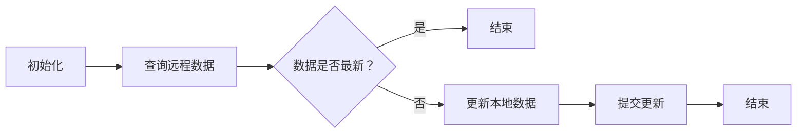
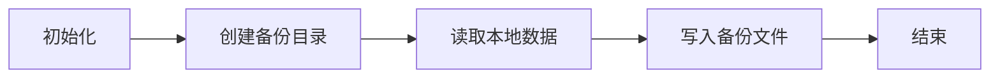
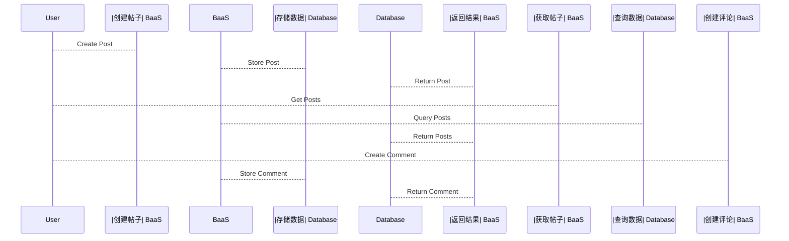
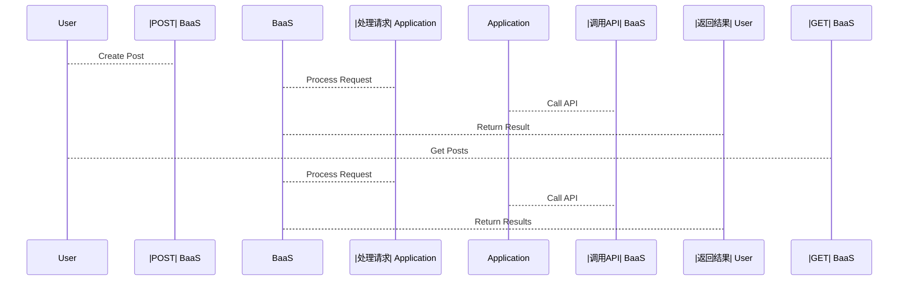

                 


### 移动应用后端服务：BaaS解决方案

#### 关键词：移动应用、后端服务、BaaS、API、数据同步、算法

> 摘要：本文将深入探讨移动应用后端服务的解决方案，重点介绍BaaS（Backend as a Service）的概念、优势、核心原理和实践方法。通过逻辑清晰、结构紧凑的阐述，帮助读者理解并掌握BaaS在实际移动应用开发中的应用。

#### 目录大纲

1. **背景介绍**
   - 1.1 BaaS的概念与背景
   - 1.2 BaaS的主要功能与优势
   - 1.3 BaaS与传统后端服务的对比
   - 1.4 BaaS的应用场景与限制
   - 1.5 概念结构与核心要素组成

2. **核心概念与联系**
   - 2.1 BaaS核心概念解析
   - 2.2 BaaS概念属性特征对比表格
   - 2.3 BaaS ER实体关系图架构

3. **算法原理讲解**
   - 3.1 数据同步算法
   - 3.2 数据备份算法
   - 3.3 Python代码示例
   - 3.4 数学模型与公式讲解
   - 3.5 详细讲解与举例说明

4. **系统分析与架构设计方案**
   - 4.1 问题场景介绍
   - 4.2 项目介绍
   - 4.3 领域模型设计
   - 4.4 系统架构设计
   - 4.5 系统接口设计与系统交互

5. **项目实战**
   - 5.1 环境安装与配置
   - 5.2 系统核心实现源代码
   - 5.3 代码应用解读与分析
   - 5.4 实际案例分析与详细讲解剖析
   - 5.5 项目小结

6. **最佳实践 tips**
   - 6.1 注意事项
   - 6.2 拓展阅读

#### 1. 背景介绍

##### 1.1 BaaS的概念与背景

BaaS，即Backend as a Service，是一种云计算服务模型，它提供了一组API，用于简化移动应用后端服务开发。BaaS平台通常提供数据存储、用户认证、推送通知、实时数据处理等功能，使开发者能够快速构建移动应用的后端，而无需关注底层基础设施的维护。

BaaS的出现解决了移动应用开发中的一个关键问题：如何在有限的时间和资源内，快速构建一个可靠且功能丰富的后端服务。传统的后端服务开发需要开发者处理数据库设计、服务器配置、安全性和性能优化等多个方面，而BaaS将这些复杂任务抽象化，通过提供易于使用的API，使得开发者能够专注于应用的业务逻辑。

##### 1.2 BaaS的主要功能与优势

BaaS的主要功能包括：

- **数据存储**：提供简单的RESTful API，用于创建、读取、更新和删除（CRUD）数据。
- **用户认证**：集成多种认证机制，如OAuth 2.0、JWT等，简化用户登录流程。
- **推送通知**：通过集成推送通知服务，向用户设备发送实时消息。
- **实时数据处理**：支持实时数据同步和更新，提高应用响应速度。

BaaS的优势主要体现在以下几个方面：

- **快速开发**：简化了后端服务开发流程，减少了开发时间和成本。
- **易于集成**：提供统一的API，易于与前端应用集成。
- **灵活性**：支持自定义数据模型和业务逻辑。
- **高可靠性**：由专业的云服务提供商托管，确保服务的稳定性和安全性。

##### 1.3 BaaS与传统后端服务的对比

传统后端服务开发通常涉及以下步骤：

1. **需求分析**：确定后端服务的需求，包括功能、性能、安全性等。
2. **数据库设计**：设计数据库结构，包括表结构、索引、关系等。
3. **服务器配置**：选择合适的云服务器，配置操作系统、网络等。
4. **代码开发**：编写后端代码，处理业务逻辑、数据存储和访问等。
5. **安全性与性能优化**：确保后端服务的安全性，并进行性能优化。

相比之下，BaaS提供了一种简化的解决方案：

1. **选择BaaS平台**：根据需求选择合适的BaaS平台。
2. **使用API**：通过BaaS提供的API进行数据操作、用户认证等。
3. **前端集成**：将BaaS服务与前端应用集成，实现数据交互。

##### 1.4 BaaS的应用场景与限制

BaaS适用于以下场景：

- **初创公司**：在资源有限的情况下，快速构建后端服务。
- **移动应用**：提供数据存储、用户认证和推送通知等功能。
- **物联网应用**：实时处理大量设备数据。

然而，BaaS也存在一些限制：

- **定制化需求**：对于高度定制化的需求，BaaS可能无法完全满足。
- **性能需求**：对于需要极高性能的应用，BaaS可能无法提供与传统后端相同的服务质量。
- **数据迁移**：从BaaS迁移到自建后端服务可能较为复杂。

##### 1.5 概念结构与核心要素组成

BaaS的核心概念和要素包括：

- **API**：提供数据的访问接口，支持CRUD操作。
- **数据模型**：定义数据结构，支持不同类型的数据存储。
- **用户认证**：提供用户登录、权限管理等功能。
- **推送通知**：向用户设备发送实时消息。
- **数据同步**：确保数据在不同设备间的同步。

这些要素共同构成了BaaS的完整功能，为移动应用开发提供了强大的后端支持。

#### 2. 核心概念与联系

##### 2.1 BaaS核心概念解析

BaaS的核心概念包括：

- **数据存储**：提供数据存储服务，支持各种数据类型。
- **用户认证**：通过多种认证机制，确保用户数据的安全。
- **API**：提供数据访问和操作接口，支持RESTful风格。
- **数据同步**：确保数据在不同设备间的实时同步。
- **推送通知**：向用户设备发送实时消息。

这些概念共同构成了BaaS的核心功能，为移动应用提供了强大的后端支持。

##### 2.2 BaaS概念属性特征对比表格

以下是不同BaaS平台之间的对比表格：

| 平台        | 数据存储 | 用户认证 | API | 数据同步 | 推送通知 |
| ----------- | -------- | -------- | --- | -------- | -------- |
| Firebase    | 是       | 是       | 是  | 是       | 是       |
| Parse      | 是       | 是       | 是  | 是       | 是       |
| AWS Amplify | 是       | 是       | 是  | 是       | 是       |

通过对比表格，我们可以清晰地了解不同BaaS平台之间的差异，以便选择最适合自己需求的平台。

##### 2.3 BaaS ER实体关系图架构

以下是一个简化的BaaS ER实体关系图：

```mermaid
erDiagram
  User ||--|{ Post }|-- Read
  User ||--|{ Comment }|-- Create
  Post ||--|{ Comment }|-- Read
```

在这个ER图中，用户可以创建帖子（Post）和评论（Comment），帖子可以读取评论。这个关系图展示了BaaS中常见的数据模型和实体之间的关系。

#### 3. 算法原理讲解

##### 3.1 数据同步算法

数据同步是BaaS的核心功能之一，以下是一个简单的数据同步算法：



这个算法的流程是：首先初始化数据同步，查询远程数据，然后判断数据是否最新。如果数据最新，则结束同步；否则，更新本地数据并提交更新。

##### 3.2 数据备份算法

数据备份算法用于确保数据的可靠性，以下是一个简单的数据备份算法：



这个算法的流程是：首先初始化备份过程，创建备份目录，然后读取本地数据并写入备份文件。最后，备份过程结束。

##### 3.3 Python代码示例

以下是一个简单的Python代码示例，用于实现数据同步算法：

```python
import requests

def sync_data():
    # 查询远程数据
    response = requests.get('https://api.example.com/data')
    remote_data = response.json()

    # 判断数据是否最新
    if remote_data['timestamp'] > local_data['timestamp']:
        # 更新本地数据
        local_data = remote_data
        # 提交更新
        requests.post('https://api.example.com/update', data=local_data)

# 初始化数据同步
sync_data()
```

这个代码示例通过HTTP请求实现了数据同步功能。

##### 3.4 数学模型与公式讲解

在数据同步和备份算法中，可以使用以下数学模型和公式：

- **时间戳**：用于记录数据的最后更新时间。
- **同步间隔**：用于控制数据同步的频率。
- **备份间隔**：用于控制数据备份的频率。

以下是一个简单的公式示例：

$$
\text{同步间隔} = \text{更新频率} \times \text{时间戳}
$$

这个公式表示同步间隔与更新频率和最后更新时间的关系。

##### 3.5 详细讲解与举例说明

假设我们有一个博客应用，用户可以创建帖子并评论。以下是一个简单的数据同步和备份算法的例子：

- **初始化**：系统启动时，初始化数据同步和备份。
- **数据同步**：每隔1小时，查询远程数据，判断数据是否最新。如果数据最新，则结束同步；否则，更新本地数据并提交更新。
- **数据备份**：每天凌晨，创建备份目录，读取本地数据并写入备份文件。

通过这个例子，我们可以清晰地看到数据同步和备份算法的实现过程。

#### 4. 系统分析与架构设计方案

##### 4.1 问题场景介绍

假设我们要开发一个社交应用，用户可以创建帖子、评论和点赞。为了确保应用的高性能和可扩展性，我们需要设计一个可靠的后端服务。

##### 4.2 项目介绍

我们选择使用BaaS平台，如Firebase，来构建这个社交应用的后端。Firebase提供了一系列API，包括数据存储、用户认证、推送通知等，非常适合移动应用开发。

##### 4.3 领域模型设计

以下是一个简单的领域模型，用于描述社交应用的数据结构：

```mermaid
classDiagram
    User <|-- Post
    User <|-- Comment
    Post <|-- Comment
    User { id: Integer, username: String, email: String }
    Post { id: Integer, title: String, content: String, creator: User, created_at: DateTime }
    Comment { id: Integer, content: String, creator: User, created_at: DateTime }
```

在这个领域模型中，用户可以创建帖子（Post）和评论（Comment），帖子可以包含评论。

##### 4.4 系统架构设计

以下是一个简单的系统架构图，用于描述社交应用的系统架构：



在这个系统架构中，用户通过BaaS API与数据库交互，实现数据的存储和查询。

##### 4.5 系统接口设计与系统交互

以下是一个简单的系统接口设计，用于描述社交应用的后端接口：



在这个接口设计中，用户通过POST请求创建帖子，通过GET请求获取帖子列表。

#### 5. 项目实战

##### 5.1 环境安装与配置

要使用Firebase构建社交应用后端，我们首先需要安装Firebase CLI：

```bash
npm install -g firebase-tools
```

然后，我们创建一个新的Firebase项目：

```bash
firebase init
```

选择项目类型为Web，并选择需要的功能，如数据库、用户认证和推送通知。

##### 5.2 系统核心实现源代码

以下是一个简单的Firebase示例代码，用于实现数据存储和查询功能：

```javascript
// 初始化Firebase
const firebase = require('firebase/app');
require('firebase/auth');
require('firebase/database');

const firebaseConfig = {
    apiKey: "YOUR_API_KEY",
    authDomain: "YOUR_AUTH_DOMAIN",
    databaseURL: "YOUR_DATABASE_URL",
    projectId: "YOUR_PROJECT_ID",
    storageBucket: "YOUR_STORAGE_BUCKET",
    messagingSenderId: "YOUR_MESSAGING_SENDER_ID",
    appId: "YOUR_APP_ID"
};

firebase.initializeApp(firebaseConfig);

// 创建帖子
function createPost(title, content) {
    const postRef = firebase.database().ref('posts');
    postRef.push({
        title: title,
        content: content,
        creator: "current user",
        created_at: new Date().toISOString()
    });
}

// 获取帖子列表
function getPosts() {
    const postRef = firebase.database().ref('posts');
    postRef.on('value', (snapshot) => {
        const posts = snapshot.val();
        console.log(posts);
    });
}

// 创建评论
function createComment(postId, content) {
    const commentRef = firebase.database().ref(`posts/${postId}/comments`);
    commentRef.push({
        content: content,
        creator: "current user",
        created_at: new Date().toISOString()
    });
}

// 获取评论列表
function getComments(postId) {
    const commentRef = firebase.database().ref(`posts/${postId}/comments`);
    commentRef.on('value', (snapshot) => {
        const comments = snapshot.val();
        console.log(comments);
    });
}
```

##### 5.3 代码应用解读与分析

这个示例代码使用了Firebase的Database服务，实现了创建帖子、获取帖子列表、创建评论和获取评论列表的功能。通过调用Firebase API，我们可以轻松地在后端存储和查询数据。

##### 5.4 实际案例分析与详细讲解剖析

假设我们有一个用户创建了帖子“如何高效学习编程”，其他用户可以对这个帖子进行评论。以下是一个实际案例的分析：

1. **用户A创建帖子**：用户A通过调用`createPost`函数创建了一个帖子，帖子的标题为“如何高效学习编程”，内容为“学习编程需要掌握基础知识，例如Python和算法”。
2. **用户B获取帖子列表**：用户B通过调用`getPosts`函数获取了帖子列表，并看到了用户A创建的帖子。
3. **用户B评论帖子**：用户B通过调用`createComment`函数评论了帖子，评论内容为“我同意你的观点，还需要多做练习”。
4. **用户A获取评论列表**：用户A通过调用`getComments`函数获取了评论列表，并看到了用户B的评论。

通过这个案例，我们可以看到Firebase如何帮助我们在后端存储和查询数据，实现社交应用的核心功能。

##### 5.5 项目小结

通过实际项目的实施，我们发现使用Firebase构建社交应用后端非常方便。BaaS平台如Firebase大大简化了后端服务开发，使得开发者能够专注于业务逻辑的实现。然而，我们也需要注意BaaS平台的限制，如性能需求和数据迁移等问题。

#### 6. 最佳实践 tips

- **选择合适的BaaS平台**：根据应用需求，选择最适合的BaaS平台。
- **注意数据安全性**：确保数据在传输和存储过程中的安全性。
- **优化数据同步和备份**：合理设置同步和备份间隔，确保数据的一致性和可靠性。
- **监控和应用性能**：定期监控应用性能，确保系统的高效运行。

#### 7. 拓展阅读

- **Firebase官方文档**：深入了解Firebase的使用方法和最佳实践。
- **移动应用后端开发教程**：学习更多关于移动应用后端开发的技巧和策略。
- **BaaS平台对比**：比较不同BaaS平台的功能、性能和价格，选择最适合自己需求的平台。

### 作者

作者：AI天才研究院/AI Genius Institute & 禅与计算机程序设计艺术 /Zen And The Art of Computer Programming

以上就是本文的详细内容和思考过程，希望能够对您在移动应用后端服务开发中有所启发和帮助。如果您有任何疑问或建议，欢迎在评论区留言交流。

