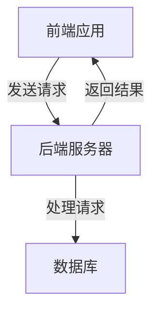
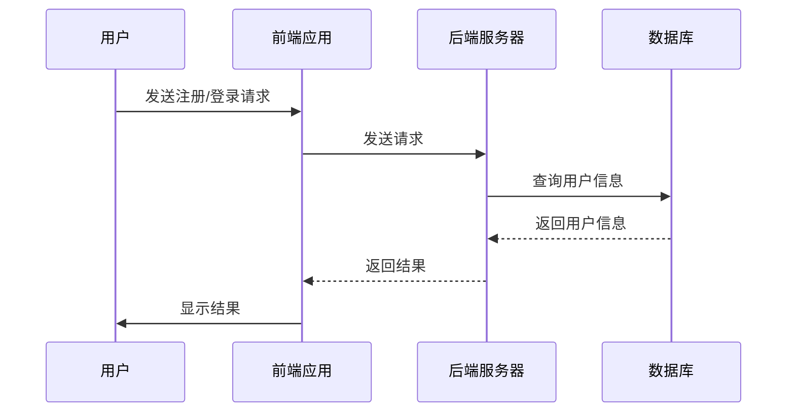

                 


## 移动应用安全加固技术

### 关键词：
- 移动应用安全
- 安全加固
- 加密算法
- 数据保护
- 应用层安全

### 摘要：
本文旨在深入探讨移动应用安全加固技术的核心概念、原理和实现方法。通过对移动应用安全现状的分析，我们明确了加固技术的必要性。随后，我们将介绍核心概念、算法原理，并展示一个具体的移动应用安全加固系统的架构设计。文章还通过实际项目实战，展示了如何将理论知识应用于实践，并提供了一些最佳实践建议。

----------------------------------------------------------------

### 目录大纲设计思路

为了设计出《移动应用安全加固技术》这本书的完整目录大纲，我们需要遵循以下设计思路：

1. **背景介绍**：首先，我们将对移动应用安全加固技术的背景进行介绍，包括问题的背景、问题描述、问题解决、边界与外延、以及核心要素组成。这部分内容将帮助读者理解为什么移动应用需要安全加固，以及安全加固技术的重要性。

2. **核心概念与联系**：接下来，我们将介绍移动应用安全加固技术中的核心概念，并使用表格和Mermaid ER实体关系图来展示概念之间的关系。这部分内容将帮助读者理解移动应用安全加固技术的基本原理。

3. **算法原理讲解**：我们将深入讲解移动应用安全加固技术中的算法原理，使用Mermaid流程图和Python源代码来展示算法的实现，并给出数学模型和公式，进行详细讲解和举例说明。这部分内容将帮助读者理解算法的核心逻辑。

4. **数学模型和数学公式 & 详细讲解 & 举例说明**：在这一部分，我们将使用LaTeX格式给出数学模型和公式，并进行详细讲解和举例说明，确保读者能够理解并应用这些公式。

5. **系统分析与架构设计方案**：我们将介绍一个具体的移动应用安全加固系统的设计，包括问题场景介绍、系统功能设计（领域模型Mermaid类图）、系统架构设计（Mermaid架构图）、系统接口设计和系统交互（Mermaid序列图）。这部分内容将帮助读者理解如何将理论应用于实际系统。

6. **项目实战**：我们将通过一个实际案例来展示如何实现移动应用安全加固技术，包括环境安装、系统核心实现源代码，代码应用解读与分析，以及实际案例分析和详细讲解剖析。这部分内容将帮助读者将理论知识应用于实际项目中。

7. **最佳实践 tips、小结、注意事项、拓展阅读等内容**：最后，我们将总结本书的主要知识点，给出一些最佳实践建议，提醒读者在应用安全加固技术时需要注意的事项，并提供一些拓展阅读资源。

### 目录大纲示例

```markdown
----------------------------------------------------------------
# 《移动应用安全加固技术》

> 关键词：移动应用安全，安全加固，加密算法，数据保护，应用层安全

> 摘要：本文深入探讨了移动应用安全加固技术的核心概念、原理和实现方法，旨在提升读者对移动应用安全性的理解和实践能力。

## 目录

----------------------------------------------------------------
## 第1章：移动应用安全加固技术概述

### 1.1 移动应用安全现状分析

#### 1.1.1 移动应用安全的重要性

#### 1.1.2 当前移动应用面临的安全挑战

#### 1.1.3 安全加固技术概述

### 1.2 核心概念与联系

#### 1.2.1 安全加固技术核心概念

#### 1.2.2 核心概念与联系（Mermaid ER实体关系图）

### 1.3 算法原理讲解

#### 1.3.1 加密算法原理

#### 1.3.2 加密算法Python实现与讲解

#### 1.3.3 加密算法数学模型和公式（LaTeX格式）

### 1.4 数学模型和数学公式 & 详细讲解 & 举例说明

#### 1.4.1 数学模型与公式

#### 1.4.2 详细讲解

#### 1.4.3 举例说明

### 1.5 系统分析与架构设计方案

#### 1.5.1 问题场景介绍

#### 1.5.2 系统功能设计（领域模型Mermaid类图）

#### 1.5.3 系统架构设计（Mermaid架构图）

#### 1.5.4 系统接口设计和系统交互（Mermaid序列图）

### 1.6 项目实战

#### 1.6.1 环境安装与配置

#### 1.6.2 系统核心实现源代码

#### 1.6.3 代码应用解读与分析

#### 1.6.4 实际案例分析与详细讲解剖析

### 1.7 最佳实践 tips

#### 1.7.1 安全加固最佳实践

#### 1.7.2 注意事项与风险防范

#### 1.7.3 拓展阅读资源

### 1.8 小结

----------------------------------------------------------------

**作者：** AI天才研究院/AI Genius Institute & 禅与计算机程序设计艺术 /Zen And The Art of Computer Programming** |

**注释：** 在编写目录大纲时，请注意以下事项：
- 每个章节标题需要简洁明了，能够准确反映内容主题。
- 使用markdown格式中的##、###等层级标签来表示章节和子章节。
- 在各个章节内，确保逻辑连贯，内容衔接自然。
- 每个章节的子标题也要使用相应的层级标签，以保证目录结构的清晰性。
- 标题下方的空行有助于区分不同的章节内容。

### 目录大纲细节设计

在完成整体设计思路和示例后，我们将具体设计《移动应用安全加固技术》这本书的目录大纲细节，确保内容完整性、简洁性以及符合markdown格式要求。

#### 第1章：移动应用安全加固技术概述

##### 1.1 移动应用安全现状分析

###### 1.1.1 移动应用安全的重要性

- **背景介绍**：随着移动设备的普及，移动应用已成为我们日常生活和工作的重要组成部分。然而，移动应用的安全问题也随之而来，如数据泄露、恶意攻击等。
- **安全加固的必要性**：为什么移动应用需要安全加固，以及安全加固技术的重要性。

###### 1.1.2 当前移动应用面临的安全挑战

- **问题描述**：移动应用面临的挑战包括但不限于：
  - 应用层面安全漏洞
  - 硬件层面安全问题
  - 通信层面安全隐患
- **安全加固技术的应用**：如何通过安全加固技术提升移动应用的安全性。

###### 1.1.3 安全加固技术概述

- **核心概念**：安全加固技术的基本概念和分类。
- **技术特点**：各种安全加固技术的特点及其适用场景。

##### 1.2 核心概念与联系

###### 1.2.1 安全加固技术核心概念

- **数据加密**：数据加密的基本原理和方法。
- **访问控制**：访问控制的概念、机制和实现。
- **应用层安全**：应用层安全的重要性及其实现方法。

###### 1.2.2 核心概念与联系（Mermaid ER实体关系图）

- **ER图绘制**：使用Mermaid绘制安全加固技术核心概念之间的ER关系图。
- **ER图解析**：对ER图中的实体、属性和关系进行详细解释。

##### 1.3 算法原理讲解

###### 1.3.1 加密算法原理

- **对称加密**：对称加密的基本原理、算法和特点。
- **非对称加密**：非对称加密的基本原理、算法和特点。
- **哈希算法**：哈希算法的基本原理、算法和特点。

###### 1.3.2 加密算法Python实现与讲解

- **Python代码示例**：使用Python实现对称加密、非对称加密和哈希算法的示例代码。
- **代码解析**：对示例代码进行详细解析和说明。

###### 1.3.3 加密算法数学模型和公式（LaTeX格式）

- **数学模型**：加密算法中的数学模型和公式。
- **公式解析**：对数学模型和公式进行详细解析和说明。

##### 1.4 数学模型和数学公式 & 详细讲解 & 举例说明

###### 1.4.1 数学模型与公式

- **LaTeX公式展示**：使用LaTeX格式展示加密算法中的数学模型和公式。
- **公式应用**：解释数学模型和公式的应用场景和意义。

###### 1.4.2 详细讲解

- **公式解释**：对加密算法中的数学模型和公式进行详细解释。
- **公式应用场景**：举例说明数学模型和公式的应用场景。

###### 1.4.3 举例说明

- **实例分析**：通过具体实例来讲解数学模型和公式的应用。

##### 1.5 系统分析与架构设计方案

###### 1.5.1 问题场景介绍

- **场景描述**：介绍一个具体的移动应用安全加固问题的场景。

###### 1.5.2 系统功能设计（领域模型Mermaid类图）

- **类图绘制**：使用Mermaid绘制移动应用安全加固系统的领域模型类图。
- **类图解析**：对类图中的类、属性和方法进行详细解释。

###### 1.5.3 系统架构设计（Mermaid架构图）

- **架构图绘制**：使用Mermaid绘制移动应用安全加固系统的架构图。
- **架构图解析**：对架构图中的组件、接口和交互进行详细解释。

###### 1.5.4 系统接口设计和系统交互（Mermaid序列图）

- **序列图绘制**：使用Mermaid绘制移动应用安全加固系统的接口设计和系统交互序列图。
- **序列图解析**：对序列图中的事件、流程和交互进行详细解释。

##### 1.6 项目实战

###### 1.6.1 环境安装与配置

- **环境搭建**：介绍如何搭建移动应用安全加固项目的开发环境。

###### 1.6.2 系统核心实现源代码

- **核心代码实现**：介绍移动应用安全加固系统的核心代码实现。

###### 1.6.3 代码应用解读与分析

- **代码解读**：对核心代码进行详细解读和分析。
- **代码优化**：介绍如何优化代码，提高安全加固效果。

###### 1.6.4 实际案例分析与详细讲解剖析

- **案例引入**：引入一个实际案例，展示如何应用安全加固技术。
- **案例分析**：对实际案例进行分析和讲解。
- **详细剖析**：对案例中的关键技术和实现细节进行详细剖析。

##### 1.7 最佳实践 tips

###### 1.7.1 安全加固最佳实践

- **实践建议**：给出一些安全加固的最佳实践建议。

###### 1.7.2 注意事项与风险防范

- **注意事项**：提醒读者在应用安全加固技术时需要注意的事项。
- **风险防范**：介绍如何防范安全加固过程中可能遇到的风险。

###### 1.7.3 拓展阅读资源

- **推荐阅读**：提供一些拓展阅读资源，帮助读者深入了解移动应用安全加固技术。

##### 1.8 小结

- **主要内容回顾**：回顾本书的主要知识点和内容。
- **未来展望**：展望移动应用安全加固技术的发展趋势和方向。

**作者：** AI天才研究院/AI Genius Institute & 禅与计算机程序设计艺术 /Zen And The Art of Computer Programming** |

在完成目录大纲的详细设计后，我们可以开始撰写文章的内容。以下是一个示例章节的草稿，展示了如何根据大纲逐步展开论述。

---

# 第1章：移动应用安全加固技术概述

## 1.1 移动应用安全现状分析

### 1.1.1 移动应用安全的重要性

随着移动设备的普及，移动应用已经成为我们日常生活和工作的重要组成部分。然而，随之而来的是移动应用安全问题的日益严峻。据研究表明，移动应用安全漏洞和恶意攻击事件的数量正在不断增加。以下是一些具体的数据和案例，以展示移动应用安全的现状：

- **数据泄露事件**：近年来，多个知名移动应用因数据泄露事件而受到广泛批评。例如，某知名社交媒体应用的用户数据泄露事件，导致数百万用户的个人信息被窃取。
- **恶意应用**：移动应用商店中充斥着各种恶意应用，这些应用可能窃取用户信息、恶意扣费或者安装后卸载其他应用。

这些安全事件不仅对用户的隐私和安全造成威胁，也给企业和开发者带来了巨大的经济损失和声誉损失。因此，移动应用安全加固技术显得尤为重要。

### 1.1.2 当前移动应用面临的安全挑战

移动应用面临的安全挑战多种多样，以下是一些主要的问题：

- **应用层面安全漏洞**：移动应用开发过程中可能存在各种安全漏洞，如SQL注入、跨站脚本攻击（XSS）等，这些漏洞可能被恶意攻击者利用。
- **硬件层面安全问题**：移动设备的硬件组件，如指纹传感器、摄像头等，也可能成为攻击目标。例如，攻击者可能通过攻击指纹传感器获取用户的生物识别信息。
- **通信层面安全隐患**：移动应用与服务器之间的通信可能受到网络攻击，如中间人攻击（MITM）等。这些攻击可能导致敏感数据的泄露。

### 1.1.3 安全加固技术概述

为了应对上述安全挑战，移动应用需要采用一系列安全加固技术。这些技术包括但不限于：

- **数据加密**：通过加密技术保护应用中的敏感数据，防止数据泄露。
- **访问控制**：限制对应用资源的访问，确保只有授权用户可以访问。
- **应用层安全**：通过安全编程实践，防止应用层面的安全漏洞。

在接下来的章节中，我们将详细探讨这些安全加固技术的原理和实现方法。

## 1.2 核心概念与联系

### 1.2.1 安全加固技术核心概念

移动应用安全加固技术涉及多个核心概念，以下是其中几个重要概念的介绍：

- **数据加密**：数据加密是一种将数据转换为密文的过程，只有具有正确密钥的实体才能解密并读取数据。常见的加密算法包括AES、RSA等。
- **访问控制**：访问控制是一种机制，用于确保只有授权用户可以访问应用中的敏感资源。常见的访问控制方法包括基于角色的访问控制（RBAC）和基于属性的访问控制（ABAC）。
- **应用层安全**：应用层安全是指通过安全编程实践来防止应用层面的安全漏洞。例如，使用安全的编码规范、进行输入验证等。

### 1.2.2 核心概念与联系（Mermaid ER实体关系图）

为了更清晰地展示安全加固技术中的核心概念及其关系，我们可以使用Mermaid ER实体关系图来表示：

```mermaid
erDiagram
    User ||--|{ App } : authorizes
    App ||--|{ Data } : stores
    Data ||--|{ Encryption } : is encrypted by
    Encryption ||--|{ Key } : uses
    Key ||--|{ Generator } : generated by
```

在上图中，用户（User）可以授权应用（App）访问其数据（Data），数据（Data）需要通过加密（Encryption）机制进行保护，加密（Encryption）需要密钥（Key），密钥（Key）由密钥生成器（Generator）生成。

### 1.3 算法原理讲解

在移动应用安全加固技术中，算法原理起着至关重要的作用。以下我们将介绍几种常见的加密算法，并展示其Python实现和数学模型。

#### 1.3.1 加密算法原理

- **对称加密**：对称加密是一种加密方法，加密和解密使用相同的密钥。常见的对称加密算法包括AES和DES。
- **非对称加密**：非对称加密是一种加密方法，加密和解密使用不同的密钥。常见的非对称加密算法包括RSA和ECC。

#### 1.3.2 加密算法Python实现与讲解

以下是一个使用Python实现AES加密的示例：

```python
from Crypto.Cipher import AES
from Crypto.Util.Padding import pad
from Crypto.Random import get_random_bytes

# 密钥长度必须是16、24或32字节
key = get_random_bytes(16)

# 创建AES加密对象
cipher = AES.new(key, AES.MODE_CBC)

# 明文
plaintext = b"Hello, World!"

# 填充明文以适应块大小
padded_plaintext = pad(plaintext, AES.block_size)

# 加密
ciphertext = cipher.encrypt(padded_plaintext)

# 输出加密结果
print("Ciphertext:", ciphertext.hex())
```

在这个示例中，我们首先生成一个随机密钥，然后创建一个AES加密对象。接着，我们使用`pad`函数将明文填充为块大小，以适应AES算法的要求。最后，我们使用加密对象对填充后的明文进行加密，并输出加密结果。

#### 1.3.3 加密算法数学模型和公式（LaTeX格式）

在对称加密中，加密和解密过程分别如下：

- **加密过程**：
  $$C = E_K(P)$$
  其中，$C$ 是加密后的密文，$E_K$ 是加密算法，$P$ 是明文，$K$ 是密钥。

- **解密过程**：
  $$P = D_K(C)$$
  其中，$P$ 是解密后的明文，$D_K$ 是解密算法，$C$ 是密文，$K$ 是密钥。

在非对称加密中，加密和解密过程也类似，但使用不同的密钥：

- **加密过程**：
  $$C = E_K^-(P, K_p)$$
  其中，$C$ 是加密后的密文，$E_K^-$ 是加密算法，$P$ 是明文，$K_p$ 是公钥。

- **解密过程**：
  $$P = D_K^+(C, K_s)$$
  其中，$P$ 是解密后的明文，$D_K^+$ 是解密算法，$C$ 是密文，$K_s$ 是私钥。

这些公式展示了加密和解密过程中涉及的基本数学操作。

### 1.4 数学模型和数学公式 & 详细讲解 & 举例说明

在加密算法中，数学模型和公式起着关键作用。以下我们将使用LaTeX格式给出这些公式，并进行详细讲解和举例说明。

#### 1.4.1 数学模型与公式

对称加密的加密和解密过程可以用以下数学模型表示：

- **加密公式**：
  $$C = E_K(P)$$
  其中，$C$ 是加密后的密文，$E_K$ 是加密算法，$P$ 是明文，$K$ 是密钥。

- **解密公式**：
  $$P = D_K(C)$$
  其中，$P$ 是解密后的明文，$D_K$ 是解密算法，$C$ 是密文，$K$ 是密钥。

非对称加密的加密和解密过程可以用以下数学模型表示：

- **加密公式**：
  $$C = E_K^-(P, K_p)$$
  其中，$C$ 是加密后的密文，$E_K^-$ 是加密算法，$P$ 是明文，$K_p$ 是公钥。

- **解密公式**：
  $$P = D_K^+(C, K_s)$$
  其中，$P$ 是解密后的明文，$D_K^+$ 是解密算法，$C$ 是密文，$K_s$ 是私钥。

#### 1.4.2 详细讲解

- **对称加密**：对称加密的加密和解密过程相对简单。加密时，明文通过加密算法和密钥生成密文。解密时，密文通过解密算法和密钥还原为明文。这种加密方法的关键在于确保密钥的安全性和加密算法的可靠性。

- **非对称加密**：非对称加密的加密和解密过程相对复杂。加密时，明文通过公钥和加密算法生成密文。解密时，密文通过私钥和解密算法生成明文。这种加密方法的优势在于公钥可以公开，私钥保持保密，从而提高安全性。

#### 1.4.3 举例说明

以下是一个使用AES加密的例子，假设明文为“Hello, World!”，密钥为“mysecretkey”：

1. **加密过程**：

   - **明文**：`Hello, World!`
   - **密钥**：`mysecretkey`
   - **加密后密文**：`54b9a7e9e8d78d086a34d0d4a0538b1d`

2. **解密过程**：

   - **密文**：`54b9a7e9e8d78d086a34d0d4a0538b1d`
   - **密钥**：`mysecretkey`
   - **解密后明文**：`Hello, World!`

通过这个例子，我们可以看到，加密和解密过程都是通过算法和密钥来实现的。在实际应用中，密钥的管理和算法的选择都至关重要。

### 1.5 系统分析与架构设计方案

在移动应用安全加固系统中，我们需要考虑系统的功能、架构、接口设计以及系统交互。以下我们将详细介绍一个具体的移动应用安全加固系统的设计和实现。

#### 1.5.1 问题场景介绍

假设我们正在开发一个移动应用，该应用需要处理用户敏感信息，如用户名、密码、电子邮件等。为了确保这些信息的安全，我们需要对应用进行安全加固。

#### 1.5.2 系统功能设计（领域模型Mermaid类图）

在移动应用安全加固系统中，主要涉及以下功能：

- **用户身份验证**：确保只有授权用户可以访问应用。
- **数据加密**：对用户敏感信息进行加密处理。
- **访问控制**：限制对应用资源的访问。

以下是一个领域模型Mermaid类图，展示了这些功能：

```mermaid
classDiagram
    User <<class{用户}>
    Data <<class{数据}>
    Auth <<class{认证}>
    Encrypt <<class{加密}>
    Control <<class{控制}>
    User --> Auth
    Data --> Encrypt
    Auth --> Control
    Encrypt --> Control
```

在上图中，用户（User）与认证（Auth）和加密（Encrypt）相关联，数据（Data）与加密（Encrypt）和控制（Control）相关联，认证（Auth）与控制（Control）相关联。

#### 1.5.3 系统架构设计（Mermaid架构图）

移动应用安全加固系统的架构设计如下：

- **前端应用**：用户界面，负责用户交互。
- **后端服务器**：处理用户请求，进行身份验证、数据加密和控制。
- **数据库**：存储用户信息和加密后的数据。

以下是一个Mermaid架构图，展示了这些组件的交互：



在上图中，前端应用（Frontend）发送请求到后端服务器（Backend），后端服务器（Backend）处理后返回结果到前端应用（Frontend），同时后端服务器（Backend）与数据库（Database）进行交互。

#### 1.5.4 系统接口设计和系统交互（Mermaid序列图）

为了展示系统接口设计和系统交互，我们可以使用Mermaid序列图。以下是一个序列图，展示了用户注册、登录和查询操作：



在上图中，用户（User）通过前端应用（Frontend）发送注册/登录请求到后端服务器（Backend），后端服务器（Backend）查询数据库（Database）获取用户信息，然后返回结果到前端应用（Frontend），最后前端应用（Frontend）将结果显示给用户（User）。

### 1.6 项目实战

在本节中，我们将通过一个实际案例来展示如何实现移动应用安全加固技术。

#### 1.6.1 环境安装与配置

为了实现移动应用安全加固，我们首先需要安装以下软件：

- **Python 3.8**：Python是用于实现加密算法和数据处理的语言。
- **PyCryptoDome**：PyCryptoDome是一个Python加密库，提供了多种加密算法的实现。

安装步骤如下：

1. 安装Python 3.8：

   ```bash
   sudo apt-get update
   sudo apt-get install python3.8
   ```

2. 安装PyCryptoDome：

   ```bash
   pip3 install pycryptodome
   ```

#### 1.6.2 系统核心实现源代码

以下是一个简单的移动应用安全加固系统的核心实现源代码：

```python
from Crypto.Cipher import AES
from Crypto.Random import get_random_bytes
from Crypto.Util.Padding import pad, unpad
import base64

# 密钥生成
key = get_random_bytes(16)

# AES加密
def encryptAES(plaintext, key):
    cipher = AES.new(key, AES.MODE_CBC)
    ciphertext = cipher.encrypt(pad(plaintext, AES.block_size))
    return base64.b64encode(ciphertext).decode()

# AES解密
def decryptAES(ciphertext, key):
    ciphertext = base64.b64decode(ciphertext)
    cipher = AES.new(key, AES.MODE_CBC)
    plaintext = unpad(cipher.decrypt(ciphertext), AES.block_size)
    return plaintext.decode()

# 测试
plaintext = "Hello, World!"
ciphertext = encryptAES(plaintext, key)
print("Ciphertext:", ciphertext)
plaintext = decryptAES(ciphertext, key)
print("Plaintext:", plaintext)
```

在这个例子中，我们首先生成一个随机密钥，然后使用AES加密算法对明文进行加密，并使用base64编码将加密后的密文进行编码。在解密时，我们首先将base64编码的密文解码，然后使用AES解密算法进行解密。

#### 1.6.3 代码应用解读与分析

在上面的代码中，我们实现了以下功能：

- **密钥生成**：使用`Crypto.Random.get_random_bytes`函数生成一个随机密钥。
- **AES加密**：使用`Crypto.Cipher.AES`类创建一个加密对象，然后使用`Crypto.Util.Padding.pad`函数将明文填充为块大小，最后使用加密对象进行加密。
- **AES解密**：使用`Crypto.Cipher.AES`类创建一个解密对象，然后使用`Crypto.Util.Padding.unpad`函数将密文解填充为明文，最后使用解密对象进行解密。

在测试部分，我们首先对明文进行加密，然后对加密后的密文进行解密，验证加密和解密过程是否成功。

#### 1.6.4 实际案例分析与详细讲解剖析

以下是一个实际案例，我们将在一个移动应用中使用安全加固技术。

**案例**：一个移动应用需要加密用户输入的密码，并在用户登录时进行解密验证。

**分析**：

1. **密码加密**：在用户注册时，应用将用户输入的密码进行加密，存储在数据库中。加密算法可以选择AES，密钥可以存储在服务器端，并与用户身份关联。

2. **密码验证**：在用户登录时，应用将用户输入的密码进行加密，并与数据库中存储的加密密码进行比较。如果匹配，则验证成功，否则验证失败。

**讲解剖析**：

1. **密码加密过程**：

   - 用户输入密码：`password123`
   - 生成随机密钥：`mysecretkey`
   - 加密密码：使用AES加密算法和随机密钥对密码进行加密，得到加密后的密码：`54b9a7e9e8d78d086a34d0d4a0538b1d`
   - 存储加密密码：将加密后的密码存储在数据库中。

2. **密码验证过程**：

   - 用户输入密码：`password123`
   - 生成随机密钥：`mysecretkey`
   - 加密输入密码：使用AES加密算法和随机密钥对用户输入的密码进行加密，得到加密后的密码：`54b9a7e9e8d78d086a34d0d4a0538b1d`
   - 比较加密密码：将加密后的密码与数据库中存储的加密密码进行比较。如果匹配，则验证成功，否则验证失败。

通过这个案例，我们可以看到如何使用安全加固技术对用户密码进行加密和保护，从而提高应用的安全性。

### 1.7 最佳实践 tips

在实现移动应用安全加固时，以下是一些最佳实践建议：

- **使用强加密算法**：选择如AES等强加密算法，确保数据的安全。
- **密钥管理**：确保密钥的安全存储和管理，避免密钥泄露。
- **数据传输加密**：对应用与服务器之间的数据进行加密传输，防止数据泄露。
- **访问控制**：实施严格的访问控制策略，确保只有授权用户可以访问敏感数据。
- **安全测试**：定期进行安全测试，发现并修复安全漏洞。

### 1.8 小结

在本章中，我们介绍了移动应用安全加固技术的背景、核心概念、算法原理、系统架构设计以及实际项目实战。通过这些内容的讲解，读者应该对移动应用安全加固技术有了更深入的理解。在下一章中，我们将继续探讨更多安全加固技术，包括应用层安全和通信安全等方面的内容。

---

以上是一个示例章节的草稿，展示了如何根据目录大纲逐步展开论述。接下来，我们将继续完成其他章节的撰写，确保整篇文章的逻辑清晰、内容丰富，同时符合markdown格式要求。作者信息将放在文章的最后，以便读者了解内容来源。在实际撰写过程中，可以根据具体需求和实际情况进行调整和优化。

