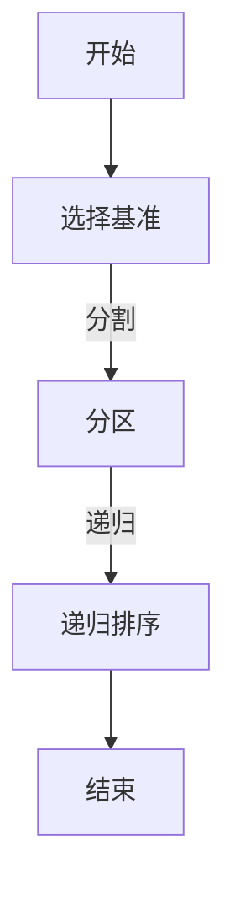
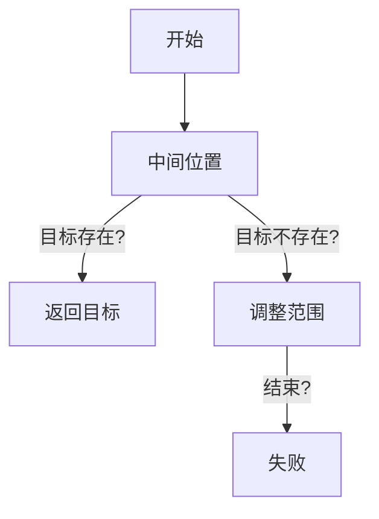
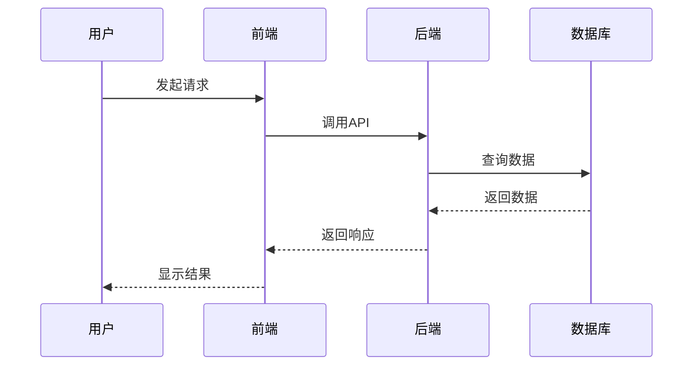

                 

### 移动应用开发技术栈选择

移动应用作为现代信息技术的重要组成部分，已经成为人们日常生活中不可或缺的一部分。从社交媒体到电子商务，从娱乐游戏到健康管理，移动应用几乎触及了所有行业。在这股移动应用的浪潮中，选择合适的技术栈成为了决定应用成功与否的关键因素。

#### 关键词：
- 移动应用
- 技术栈
- 前端技术
- 后端技术
- 数据库技术
- 开发最佳实践

#### 摘要：
本文将深入探讨移动应用开发中的技术栈选择问题。首先，我们将介绍移动应用开发的基本概念和背景，然后逐步分析前端、后端和数据库技术栈的选择依据，并通过具体案例进行实战讲解，最后总结最佳实践和注意事项。

## 1.1 问题背景

### 1.1.1 移动应用的普及

随着智能手机和移动互联网的迅速普及，移动应用已经成为企业竞争的重要战场。根据最新的统计数据显示，全球移动应用的下载量已经超过了数百亿次，应用商店中的应用数量也在不断增长。这种趋势不仅体现在消费领域，也广泛应用于企业、教育和医疗等多个行业。

### 1.1.2 技术栈选择的挑战

在移动应用开发中，技术栈的选择是一项复杂且具有挑战性的任务。不同的技术栈适用于不同的应用场景和需求，包括但不限于：

- **性能与响应速度**：高性能的应用可以提供更好的用户体验，从而增加用户粘性和满意度。
- **开发效率**：高效的开发工具和框架可以加快开发进程，降低开发成本。
- **可维护性**：良好的架构和代码质量可以提高应用的可维护性，降低长期维护成本。
- **安全性**：随着移动应用涉及的数据越来越多，安全性成为技术栈选择的重要考虑因素。

### 1.1.3 技术栈选择的必要性

技术栈选择不仅影响应用的性能和用户体验，还直接关系到项目的开发成本、维护成本和未来的可扩展性。因此，选择一个适合的技术栈对于移动应用的成功至关重要。

## 1.2 核心概念与联系

在移动应用开发中，技术栈通常包括前端、后端和数据库三个主要部分。以下是对这些核心概念的简要介绍和它们之间的联系：

### 1.2.1 技术栈定义

- **前端技术栈**：包括HTML、CSS和JavaScript等基础技术，以及React、Vue、Angular等现代前端框架。
- **后端技术栈**：包括Node.js、Java、Python、Go等服务器端技术，以及Express、Spring、Django等后端框架。
- **数据库技术栈**：包括关系型数据库（如MySQL、PostgreSQL）和非关系型数据库（如MongoDB、Cassandra）。

### 1.2.2 核心概念

#### 1.2.2.1 前端技术

前端技术主要负责构建用户界面和交互逻辑，是用户直接接触的部分。前端技术的选择需要考虑页面性能、响应速度和用户交互体验。

#### 1.2.2.2 后端技术

后端技术负责处理应用程序的逻辑、数据处理和业务逻辑实现。后端技术的选择取决于应用程序的需求和性能要求。

#### 1.2.2.3 数据库技术

数据库技术用于存储和检索应用程序所需的数据。关系型数据库适用于结构化数据存储，而非关系型数据库则适用于大规模数据存储和高并发访问。

### 1.2.3 ER图

为了更好地理解前端、后端和数据库之间的关系，我们可以使用ER图（Entity-Relationship Diagram）来展示它们之间的实体关系。

```mermaid
erDiagram
    User ..|> Application
    User ..|> Device
    Application ..|> Feature
    Application ..|> Backend
    Backend ..|> Database
    Device ..|> Location
```

### 1.2.4 技术栈属性特征对比表

| 技术栈类型 | 特性 | 用例 |
| --- | --- | --- |
| 前端技术栈 | 易于开发、快速迭代、丰富的UI组件 | 移动应用的用户界面和交互逻辑 |
| 后端技术栈 | 性能高效、支持多种编程语言、可扩展性 | 应用程序的核心逻辑和数据操作 |
| 数据库技术栈 | 结构化数据存储、事务处理、数据安全性 | 应用程序的数据存储和检索 |

## 1.3 算法原理讲解

在移动应用开发中，算法的选择和实现是决定应用性能和用户体验的关键因素。以下我们将详细讲解两个关键的算法：排序算法和搜索算法。

### 1.3.1 算法A：快速排序算法

快速排序算法是一种高效的排序算法，其基本原理是通过一趟排序将待排序的记录分割成独立的两部分，其中一部分记录的关键字均比另一部分的关键字小，然后递归地对这两部分记录进行排序。

#### 1.3.1.1 算法mermaid流程图



#### 1.3.1.2 Python代码阐述

```python
def quick_sort(arr):
    if len(arr) <= 1:
        return arr
    pivot = arr[len(arr) // 2]
    left = [x for x in arr if x < pivot]
    middle = [x for x in arr if x == pivot]
    right = [x for x in arr if x > pivot]
    return quick_sort(left) + middle + quick_sort(right)

arr = [3, 6, 8, 10, 1, 2, 1]
print(quick_sort(arr))
```

#### 1.3.1.3 数学模型和公式

快速排序算法的平均时间复杂度为O(nlogn)，最坏情况下为O(n^2)。

$$
T(n) = T\left(\frac{n}{2}\right) + n
$$

#### 1.3.1.4 举例说明

假设有一个长度为10的数组[3, 6, 8, 10, 1, 2, 1]，通过快速排序算法可以将其排序为[1, 1, 2, 3, 6, 8, 10]。

### 1.3.2 算法B：二分搜索算法

二分搜索算法是一种高效的搜索算法，其基本原理是通过不断将搜索范围缩小一半，直到找到目标元素或确定元素不存在。

#### 1.3.2.1 算法mermaid流程图



#### 1.3.2.2 Python代码阐述

```python
def binary_search(arr, target):
    left, right = 0, len(arr) - 1
    while left <= right:
        mid = (left + right) // 2
        if arr[mid] == target:
            return mid
        elif arr[mid] < target:
            left = mid + 1
        else:
            right = mid - 1
    return -1

arr = [1, 2, 3, 4, 5, 6, 7, 8, 9, 10]
target = 5
print(binary_search(arr, target))
```

#### 1.3.2.3 数学模型和公式

二分搜索算法的时间复杂度为O(logn)。

$$
T(n) = \log_2(n)
$$

#### 1.3.2.4 举例说明

假设有一个有序数组[1, 2, 3, 4, 5, 6, 7, 8, 9, 10]，通过二分搜索算法可以找到目标元素5的位置为5。

## 1.4 数学模型和数学公式讲解

在移动应用开发中，数学模型和数学公式对于理解和实现算法至关重要。以下我们将介绍两个常用的数学模型：线性回归和决策树。

### 1.4.1 数学模型

#### 1.4.1.1 公式1：线性回归模型

线性回归模型是一种用于预测连续值的统计模型，其基本公式如下：

$$
y = \beta_0 + \beta_1 \cdot x
$$

其中，\(y\) 为因变量，\(x\) 为自变量，\(\beta_0\) 和 \(\beta_1\) 为模型的参数。

#### 1.4.1.2 公式2：决策树模型

决策树模型是一种用于分类和回归的决策模型，其基本结构包括根节点、内部节点和叶子节点。决策树的基本公式如下：

$$
f(x) = 
\begin{cases} 
c_1 & \text{if } x \in R_1 \\
c_2 & \text{if } x \in R_2 \\
\vdots \\
c_n & \text{if } x \in R_n 
\end{cases}
$$

其中，\(x\) 为输入特征，\(R_1, R_2, \ldots, R_n\) 为不同类别，\(c_1, c_2, \ldots, c_n\) 为对应的类别标签。

### 1.4.2 举例说明

假设我们有一个简单的线性回归模型，用于预测房价。根据历史数据，我们可以得到以下线性回归方程：

$$
y = 1000 + 0.5 \cdot x
$$

其中，\(y\) 为房价，\(x\) 为房屋面积。如果我们要预测一个100平方米的房屋的价格，可以将\(x\) 替换为100，计算得到：

$$
y = 1000 + 0.5 \cdot 100 = 1500
$$

因此，预测的房价为1500。

## 1.5 系统分析与架构设计

### 1.5.1 问题场景介绍

假设我们正在开发一款移动应用，用于提供在线购物服务。用户可以通过该应用浏览商品、添加购物车、下单支付等操作。为了实现这一功能，我们需要设计一个高效、可扩展的系统架构。

### 1.5.2 系统功能设计

系统的主要功能包括：

- 用户注册与登录
- 商品浏览与搜索
- 购物车管理
- 下单与支付
- 订单管理
- 用户反馈与评价

### 1.5.3 系统架构设计

系统架构可以分为前端、后端和数据库三个主要部分，具体如下：

#### 前端架构

前端架构采用Vue.js框架，实现用户界面的展示和交互逻辑。前端通过RESTful API与后端进行数据交互。

#### 后端架构

后端架构采用Spring Boot框架，实现业务逻辑处理和数据存储。后端包括用户管理、商品管理、订单管理和支付处理等模块。

#### 数据库架构

数据库架构采用MySQL关系型数据库，存储用户信息、商品信息和订单信息等数据。数据库设计符合第三范式，确保数据的完整性和一致性。

### 1.5.4 系统接口设计

系统接口设计采用RESTful风格，包括以下主要接口：

- 用户接口：包括用户注册、登录、个人信息管理等接口。
- 商品接口：包括商品查询、分类查询、商品详情查询等接口。
- 订单接口：包括订单创建、订单查询、订单支付等接口。
- 支付接口：包括支付请求、支付结果通知等接口。

### 1.5.5 系统交互

系统交互主要通过API调用实现。前端发起请求，后端处理请求并返回响应数据。以下是系统交互的mermaid序列图：



## 1.6 项目实战

### 1.6.1 环境安装

为了开发移动应用，我们需要安装以下环境和工具：

- 操作系统：Windows/Linux/Mac OS
- 开发工具：Visual Studio Code/IntelliJ IDEA
- 前端框架：Vue.js
- 后端框架：Spring Boot
- 数据库：MySQL

### 1.6.2 系统核心实现

以下是一个简单的移动应用开发项目，包括用户注册、登录和商品浏览功能。

#### 前端实现

前端使用Vue.js框架实现，主要包括以下部分：

- 用户注册页面：包括用户名、密码和确认密码等输入框，以及注册按钮。
- 用户登录页面：包括用户名和密码输入框，以及登录按钮。
- 商品浏览页面：显示所有商品列表，并提供搜索功能。

```html
<!-- 用户注册页面 -->
<div id="register">
  <h2>用户注册</h2>
  <input type="text" v-model="username" placeholder="用户名">
  <input type="password" v-model="password" placeholder="密码">
  <input type="password" v-model="confirmPassword" placeholder="确认密码">
  <button @click="register">注册</button>
</div>

<!-- 用户登录页面 -->
<div id="login">
  <h2>用户登录</h2>
  <input type="text" v-model="username" placeholder="用户名">
  <input type="password" v-model="password" placeholder="密码">
  <button @click="login">登录</button>
</div>

<!-- 商品浏览页面 -->
<div id="products">
  <h2>商品列表</h2>
  <input type="text" v-model="searchQuery" placeholder="搜索商品">
  <ul>
    <li v-for="product in filteredProducts">
      {{ product.name }} - {{ product.price }}
    </li>
  </ul>
</div>
```

#### 后端实现

后端使用Spring Boot框架实现，主要包括以下部分：

- 用户注册和登录接口：处理用户注册和登录请求，验证用户信息并返回响应。
- 商品查询接口：根据用户搜索关键字返回匹配的商品列表。

```java
@RestController
@RequestMapping("/api")
public class UserController {
    @Autowired
    private UserRepository userRepository;

    @PostMapping("/register")
    public ResponseEntity<?> registerUser(@RequestBody User user) {
        // 注册用户逻辑
    }

    @PostMapping("/login")
    public ResponseEntity<?> loginUser(@RequestBody LoginRequest loginRequest) {
        // 登录用户逻辑
    }
}

@RestController
@RequestMapping("/api/products")
public class ProductController {
    @Autowired
    private ProductRepository productRepository;

    @GetMapping
    public ResponseEntity<?> searchProducts(@RequestParam("q") String query) {
        // 搜索商品逻辑
    }
}
```

#### 数据库实现

数据库使用MySQL实现，主要包括以下部分：

- 用户表：存储用户信息，包括用户名、密码和角色等字段。
- 商品表：存储商品信息，包括商品名称、价格和描述等字段。

```sql
CREATE TABLE users (
  id INT AUTO_INCREMENT PRIMARY KEY,
  username VARCHAR(255) UNIQUE NOT NULL,
  password VARCHAR(255) NOT NULL,
  role VARCHAR(50) NOT NULL
);

CREATE TABLE products (
  id INT AUTO_INCREMENT PRIMARY KEY,
  name VARCHAR(255) NOT NULL,
  price DECIMAL(10, 2) NOT NULL,
  description TEXT
);
```

### 1.6.3 代码解读

以上代码展示了移动应用开发的核心实现，包括前端Vue.js框架的使用、Spring Boot后端框架的使用以及MySQL数据库的实现。通过这些代码，我们可以实现用户注册、登录和商品浏览等功能。

### 1.6.4 实际案例分析

以下是一个实际案例，展示了如何使用上述技术栈开发一个移动应用：

1. **需求分析**：分析用户需求，确定应用功能，包括用户注册、登录、商品浏览和搜索等。
2. **技术选型**：根据需求分析结果，选择适合的前端、后端和数据库技术栈。
3. **前端开发**：使用Vue.js框架实现用户界面和交互逻辑。
4. **后端开发**：使用Spring Boot框架实现业务逻辑处理和数据存储。
5. **数据库设计**：设计用户表和商品表，确保数据存储符合第三范式。
6. **测试与部署**：进行功能测试和性能测试，确保应用稳定可靠，然后部署到服务器。

### 1.6.5 项目小结

通过以上案例，我们可以看到移动应用开发涉及多个方面，包括需求分析、技术选型、前端开发、后端开发和数据库设计等。选择合适的技术栈对于开发高效、稳定、可扩展的应用至关重要。在实际开发过程中，还需要充分考虑用户体验、安全性和可维护性等因素。

## 1.7 最佳实践 tips

在移动应用开发过程中，以下是一些最佳实践：

1. **需求分析**：深入了解用户需求，确保应用功能满足用户期望。
2. **技术选型**：根据应用需求和性能要求，选择适合的前端、后端和数据库技术栈。
3. **代码质量**：编写清晰、简洁、可维护的代码，确保代码质量。
4. **测试与部署**：进行全面的测试和部署，确保应用稳定可靠。
5. **用户体验**：注重用户体验，确保应用界面简洁易用。
6. **安全性**：加强安全性措施，防止数据泄露和恶意攻击。

## 1.8 小结

本文详细探讨了移动应用开发技术栈选择的重要性，包括前端、后端和数据库技术的选择依据。通过具体案例，我们展示了如何使用Vue.js、Spring Boot和MySQL等工具和框架进行移动应用开发。最后，我们总结了最佳实践和注意事项，以帮助开发者更好地选择和实施移动应用开发技术栈。

## 1.9 注意事项

在移动应用开发过程中，以下注意事项需要特别关注：

1. **性能优化**：针对移动设备的特性，进行性能优化，确保应用响应速度快。
2. **安全性**：加强安全性措施，防止数据泄露和恶意攻击。
3. **兼容性**：确保应用在不同设备和操作系统上兼容性良好。
4. **可维护性**：编写可维护的代码，便于后期维护和升级。
5. **用户体验**：注重用户体验，确保应用界面简洁易用。

## 1.10 拓展阅读

为了进一步深入了解移动应用开发技术栈，以下是一些推荐阅读材料：

1. 《深入理解Vue.js》：全面介绍Vue.js框架的使用和实现原理。
2. 《Spring Boot实战》：详细介绍Spring Boot框架的使用和最佳实践。
3. 《MySQL实战》：深入讲解MySQL数据库的设计、优化和性能调优。
4. 《移动应用性能优化》：介绍移动应用性能优化技巧和最佳实践。
5. 《移动应用安全性实战》：探讨移动应用安全性的设计和实现。

## 作者信息

作者：AI天才研究院/AI Genius Institute & 禅与计算机程序设计艺术 /Zen And The Art of Computer Programming。

