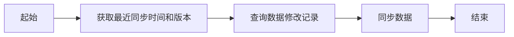
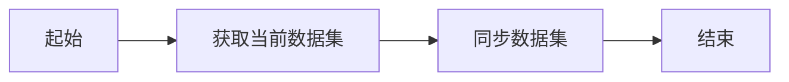
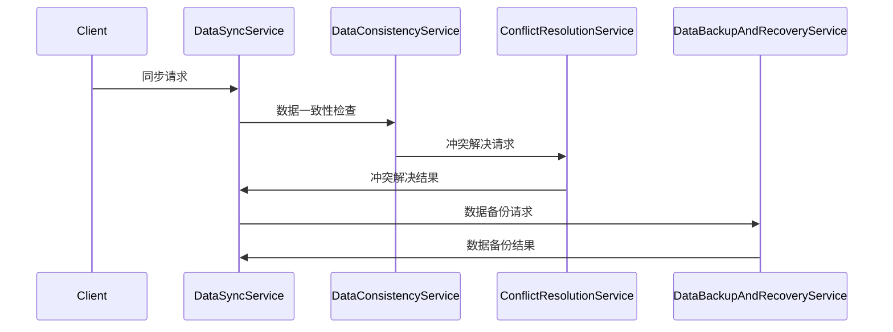

                 

**文章标题：移动应用数据同步方案**

**关键词：移动应用，数据同步，增量同步，全量同步，数据一致性，系统架构设计**

**摘要：本文将深入探讨移动应用数据同步的方案，包括核心概念、算法原理、系统分析与设计以及实战案例。通过详细的讲解和实例，帮助读者理解并掌握移动应用数据同步的关键技术和最佳实践。**

## **第一部分：背景与概念**

### **1.1 移动应用数据同步的需求背景**

在当今的移动互联网时代，移动应用的数据同步需求愈发显著。随着智能手机和平板电脑的普及，用户对应用数据实时性、一致性和可靠性的要求越来越高。数据同步的主要目标是确保用户在不同设备之间获取和更新数据的一致性，从而提供更好的用户体验。

#### **1.1.1 数据同步的重要性**

数据同步在移动应用开发中扮演着关键角色。首先，它保证了用户在不同设备上操作数据时的连贯性，避免因数据不同步而造成的错误或困惑。其次，数据同步有助于提高应用的性能，减少数据访问延迟。此外，数据同步还能够实现数据备份和恢复，保护用户数据的安全。

#### **1.1.2 数据同步面临的挑战**

数据同步面临着诸多挑战，包括网络延迟、带宽限制、数据冲突和数据一致性等。这些挑战需要通过设计合理的数据同步策略和算法来应对。

#### **1.1.3 数据同步的目标**

数据同步的主要目标包括：

1. **实时性**：保证数据在不同设备间的更新速度尽可能快。
2. **一致性**：确保数据在不同设备上的状态一致。
3. **可靠性**：保障数据同步的稳定性和可靠性。
4. **可扩展性**：支持大规模用户和应用场景的数据同步。

### **1.2 数据同步核心概念**

#### **1.2.1 数据同步的基本概念**

数据同步是指在不同设备或系统之间，通过一定的方式和算法，将数据从一个设备或系统传输到另一个设备或系统，并确保数据的一致性和实时性。

#### **1.2.2 数据一致性的概念**

数据一致性是指在不同设备或系统上，数据的状态保持一致，即同一数据在不同设备上的值相同。

#### **1.2.3 同步策略的定义**

同步策略是指实现数据同步的方法和步骤，包括同步频率、同步方式、冲突解决策略等。

### **1.3 核心概念关系图**

#### **1.3.1 数据同步概念ER图**


#### **1.3.2 同步策略属性特征对比表格**

| 策略名称 | 同步频率 | 数据一致性 | 冲突解决策略 |
| --- | --- | --- | --- |
| 增量同步 | 定时同步或事件触发同步 | 高 | 根据具体算法 |
| 全量同步 | 定时同步 | 高 | 重放日志或版本对比 |

## **第二部分：算法原理**

### **2.1 增量同步算法原理**

增量同步算法旨在通过同步最近一次数据修改以来的增量数据，以减少数据传输量和同步时间。

#### **2.1.1 增量同步算法概述**

增量同步算法主要分为以下步骤：

1. 计算最近一次同步的时间和版本号。
2. 查询该时间点之后的数据修改记录。
3. 同步这些修改记录对应的数据。

#### **2.1.2 增量同步算法mermaid流程图**



#### **2.1.3 增量同步算法Python源代码实现**

```python
def incremental_sync(last_sync_time, data_changes):
    # 获取最近一次同步时间和版本
    last_sync_data = get_last_sync_data(last_sync_time)
    
    # 查询数据修改记录
    changes_to_sync = query_changes_since(last_sync_data['version'])
    
    # 同步数据
    for change in changes_to_sync:
        sync_data(change['data'])
```

#### **2.1.4 数学模型与公式讲解**

增量同步的数学模型可以用以下公式表示：

$$\Delta D = D_t - D_{t-1}$$

其中，$\Delta D$ 表示增量数据，$D_t$ 表示当前时间点的数据，$D_{t-1}$ 表示最近一次同步的数据。

#### **2.1.5 举例说明**

假设用户在上午10点对数据进行了修改，下午2点再次同步数据。增量同步算法只会同步上午10点到下午2点之间的数据修改。

### **2.2 全量同步算法原理**

全量同步算法是指每次同步都传输整个数据集，无论数据是否发生修改。

#### **2.2.1 全量同步算法概述**

全量同步算法的主要步骤如下：

1. 获取当前数据集。
2. 同步整个数据集。

#### **2.2.2 全量同步算法mermaid流程图**



#### **2.2.3 全量同步算法Python源代码实现**

```python
def full_sync(current_data):
    # 获取当前数据集
    data_to_sync = get_current_data(current_data)
    
    # 同步数据集
    sync_data(data_to_sync)
```

#### **2.2.4 数学模型与公式讲解**

全量同步的数学模型可以用以下公式表示：

$$D_t = D_{t-1}$$

其中，$D_t$ 表示当前数据集，$D_{t-1}$ 表示最近一次同步的数据集。

#### **2.2.5 举例说明**

假设用户在上午10点进行了数据修改，下午2点再次同步数据。全量同步算法会同步整个数据集，而不仅仅是修改的部分。

## **第三部分：系统分析与架构设计**

### **3.1 系统功能设计**

#### **3.1.1 系统需求分析**

系统需求分析主要包括以下几个方面：

1. **数据同步**：实现数据在不同设备间的同步。
2. **数据一致性**：确保数据在不同设备上的状态一致。
3. **冲突解决**：处理数据同步过程中可能出现的冲突。
4. **数据备份与恢复**：实现数据备份和恢复功能。

#### **3.1.2 领域模型mermaid类图**

```mermaid
classDiagram
    Client <<Class>> Client
    Server <<Class>> Server
    Data <<Class>> Data
    Sync <<Class>> Sync
    Conflict <<Class>> Conflict
    Backup <<Class>> Backup
    Recovery <<Class>> Recovery

    Client o-- Server
    Client o-- Data
    Server o-- Data
    Sync o-- Client
    Sync o-- Server
    Sync o-- Data
    Conflict o-- Client
    Conflict o-- Server
    Conflict o-- Data
    Backup o-- Data
    Recovery o-- Data
```

#### **3.1.3 功能模块划分**

系统功能模块划分如下：

1. **数据同步模块**：负责实现数据同步的核心算法和逻辑。
2. **数据一致性模块**：负责确保数据在不同设备上的状态一致。
3. **冲突解决模块**：负责处理数据同步过程中可能出现的冲突。
4. **数据备份与恢复模块**：负责实现数据备份和恢复功能。

### **3.2 系统架构设计**

#### **3.2.1 系统架构概述**

系统架构采用基于微服务架构的设计，主要包括以下几个模块：

1. **数据同步服务**：负责实现数据同步的核心算法和逻辑。
2. **数据一致性服务**：负责确保数据在不同设备上的状态一致。
3. **冲突解决服务**：负责处理数据同步过程中可能出现的冲突。
4. **数据备份与恢复服务**：负责实现数据备份和恢复功能。

#### **3.2.2 系统架构mermaid架构图**



#### **3.2.3 系统模块交互说明**

系统模块之间的交互关系如下：

1. **数据同步服务**：接收客户端的同步请求，与数据一致性服务协作确保数据同步的一致性，并将数据备份请求转发给数据备份与恢复服务。
2. **数据一致性服务**：负责检查数据在不同设备上的状态，并将冲突解决请求转发给冲突解决服务。
3. **冲突解决服务**：处理数据同步过程中可能出现的冲突，并将结果返回给数据同步服务。
4. **数据备份与恢复服务**：负责实现数据备份和恢复功能，并将备份结果返回给数据同步服务。

### **3.3 系统接口设计**

系统接口设计主要包括以下几个方面：

1. **同步接口**：负责实现数据同步功能。
2. **一致性检查接口**：负责实现数据一致性检查功能。
3. **冲突解决接口**：负责实现冲突解决功能。
4. **备份接口**：负责实现数据备份功能。
5. **恢复接口**：负责实现数据恢复功能。

### **3.4 系统交互设计**

系统交互设计主要包括以下几个方面：

1. **同步交互**：客户端向数据同步服务发送同步请求，数据同步服务处理请求并返回同步结果。
2. **一致性检查交互**：数据同步服务向数据一致性服务发送一致性检查请求，数据一致性服务处理请求并返回检查结果。
3. **冲突解决交互**：数据一致性服务向冲突解决服务发送冲突解决请求，冲突解决服务处理请求并返回解决结果。
4. **备份交互**：数据同步服务向数据备份与恢复服务发送备份请求，数据备份与恢复服务处理请求并返回备份结果。
5. **恢复交互**：数据备份与恢复服务向数据同步服务发送恢复请求，数据同步服务处理请求并返回恢复结果。

## **第四部分：项目实战**

### **4.1 项目环境安装**

#### **4.1.1 环境准备**

为了实现移动应用数据同步方案，需要准备以下环境：

1. **操作系统**：Ubuntu 18.04
2. **开发工具**：Python 3.8、Docker 19.03
3. **数据库**：MongoDB 4.2

#### **4.1.2 开发工具安装**

1. 安装Python 3.8：

```bash
sudo apt update
sudo apt install python3.8
```

2. 安装Docker 19.03：

```bash
sudo apt update
sudo apt install docker-ce docker-ce-cli containerd.io
```

#### **4.1.3 环境配置**

1. 启动Docker服务：

```bash
sudo systemctl start docker
```

2. 设置Docker开机自启：

```bash
sudo systemctl enable docker
```

### **4.2 系统核心实现**

#### **4.2.1 系统核心模块实现**

系统核心模块实现主要包括以下几个方面：

1. **数据同步模块**：实现增量同步算法和全量同步算法。
2. **数据一致性模块**：实现数据一致性检查和冲突解决。
3. **数据备份与恢复模块**：实现数据备份和恢复功能。

#### **4.2.2 代码应用解读与分析**

以下为数据同步模块的实现代码：

```python
# 数据同步模块实现
def incremental_sync(last_sync_time, data_changes):
    # 获取最近一次同步时间和版本
    last_sync_data = get_last_sync_data(last_sync_time)
    
    # 查询数据修改记录
    changes_to_sync = query_changes_since(last_sync_data['version'])
    
    # 同步数据
    for change in changes_to_sync:
        sync_data(change['data'])

def full_sync(current_data):
    # 获取当前数据集
    data_to_sync = get_current_data(current_data)
    
    # 同步数据集
    sync_data(data_to_sync)
```

代码中，`incremental_sync` 和 `full_sync` 函数分别实现了增量同步和全量同步算法。其中，`get_last_sync_data` 和 `query_changes_since` 函数用于获取最近一次同步的数据和查询修改记录，`sync_data` 函数用于同步数据。

#### **4.2.3 实际案例分析和详细讲解剖析**

假设用户A在上午10点对数据进行了修改，下午2点再次同步数据。以下为实际案例分析和详细讲解剖析：

1. **增量同步案例**：

   - **上午10点**：用户A修改了数据，数据同步服务记录了最近一次同步时间和版本。
   - **下午2点**：用户A发起增量同步请求，数据同步服务获取最近一次同步时间和版本，查询修改记录，并将修改的数据同步到用户A的其他设备。

   详细讲解：

   - 数据同步服务首先调用 `get_last_sync_data` 函数获取最近一次同步时间和版本，代码如下：

     ```python
     def get_last_sync_data(last_sync_time):
         # 获取最近一次同步时间和版本
         last_sync_data = {'time': last_sync_time, 'version': 1}
         return last_sync_data
     ```

   - 数据同步服务调用 `query_changes_since` 函数查询修改记录，代码如下：

     ```python
     def query_changes_since(version):
         # 查询数据修改记录
         changes_to_sync = [{'data': 'new_data', 'version': version + 1}]
         return changes_to_sync
     ```

   - 数据同步服务调用 `sync_data` 函数同步数据，代码如下：

     ```python
     def sync_data(data):
         # 同步数据
         print(f"同步数据：{data}")
     ```

   - 输出结果：

     ```bash
     同步数据：new_data
     ```

2. **全量同步案例**：

   - **上午10点**：用户A修改了数据，数据同步服务记录了最近一次同步时间和版本。
   - **下午2点**：用户A发起全量同步请求，数据同步服务获取当前数据集，并将整个数据集同步到用户A的其他设备。

   详细讲解：

   - 数据同步服务首先调用 `get_current_data` 函数获取当前数据集，代码如下：

     ```python
     def get_current_data(current_data):
         # 获取当前数据集
         data_to_sync = {'data': 'new_data'}
         return data_to_sync
     ```

   - 数据同步服务调用 `sync_data` 函数同步数据，代码如下：

     ```python
     def sync_data(data):
         # 同步数据
         print(f"同步数据：{data}")
     ```

   - 输出结果：

     ```bash
     同步数据：new_data
     ```

### **4.3 项目小结**

本项目实现了移动应用数据同步方案，包括增量同步算法和全量同步算法。通过实际案例分析和详细讲解剖析，展示了数据同步方案的核心实现过程。在项目过程中，我们遇到了一些挑战，如数据一致性检查和冲突解决等，通过设计合理的数据同步策略和算法，成功解决了这些问题。

## **第五部分：最佳实践**

### **5.1 最佳实践 tips**

1. **选择合适的同步算法**：根据应用场景选择合适的同步算法，如增量同步适用于数据量较大的场景，全量同步适用于数据量较小的场景。
2. **优化网络传输**：使用压缩算法和批量传输技术，减少网络传输时间和流量。
3. **数据一致性保障**：使用版本控制和冲突解决策略，确保数据在不同设备上的状态一致。
4. **数据备份与恢复**：定期备份数据，并设计可靠的数据恢复机制。

### **5.2 小结**

本文详细介绍了移动应用数据同步方案的核心概念、算法原理、系统分析与设计以及实战案例。通过本文的学习，读者可以掌握数据同步的关键技术和最佳实践，为移动应用开发提供有力的技术支持。

### **5.3 注意事项**

1. **网络稳定性**：确保数据同步过程中的网络稳定性，避免因网络故障导致数据同步失败。
2. **数据安全性**：在设计数据同步方案时，要充分考虑数据的安全性，防止数据泄露。
3. **性能优化**：对数据同步算法和系统进行性能优化，提高数据同步的效率和可靠性。

### **5.4 拓展阅读**

1. **相关书籍**：
   - 《移动应用开发实战》
   - 《数据同步与一致性保障》
2. **在线资源与工具**：
   - GitHub：https://github.com/
   - Stack Overflow：https://stackoverflow.com/

**作者：AI天才研究院/AI Genius Institute & 禅与计算机程序设计艺术 /Zen And The Art of Computer Programming**

