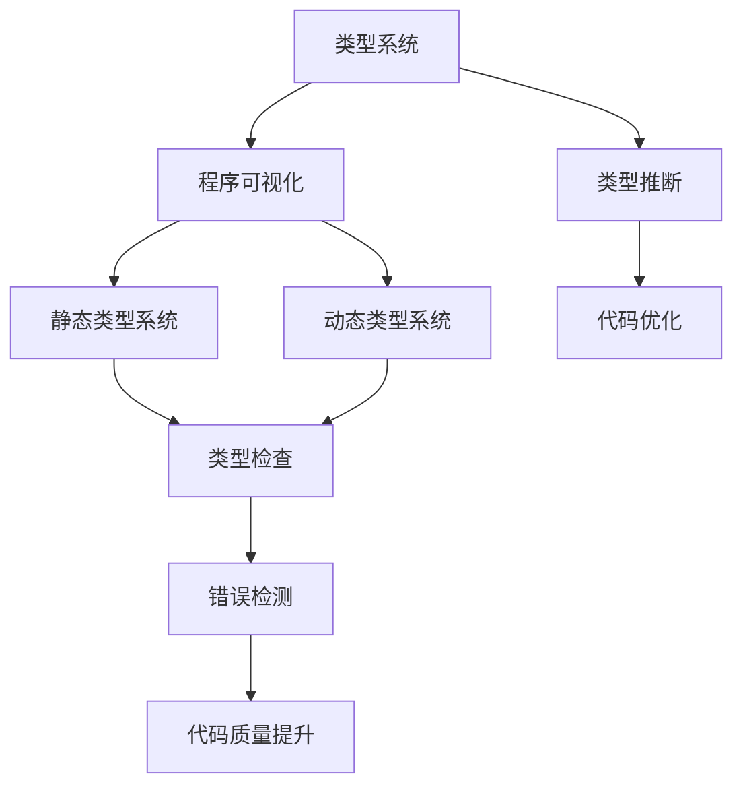
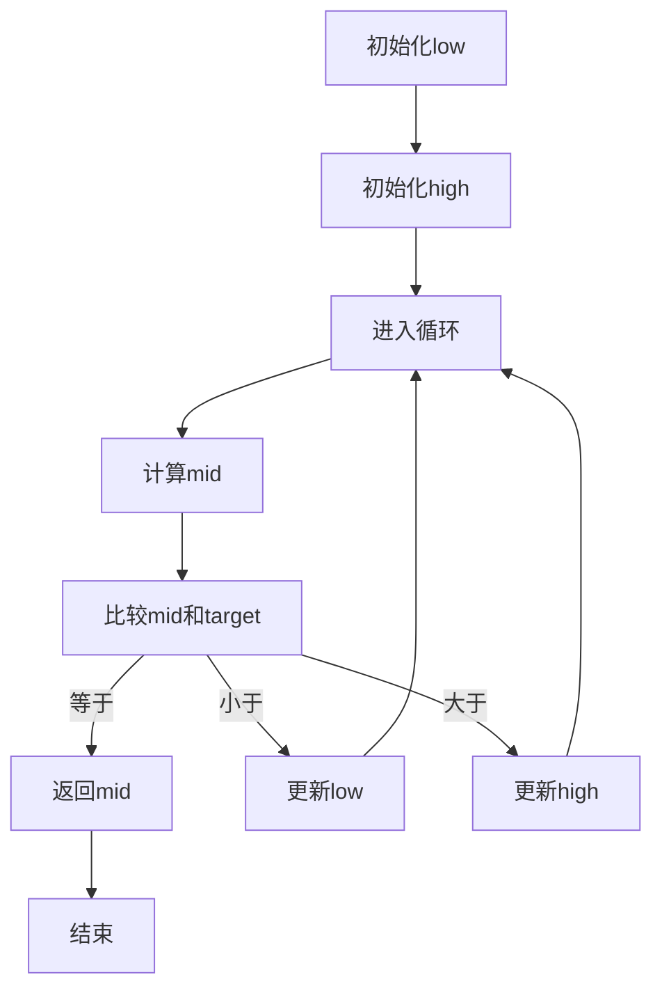
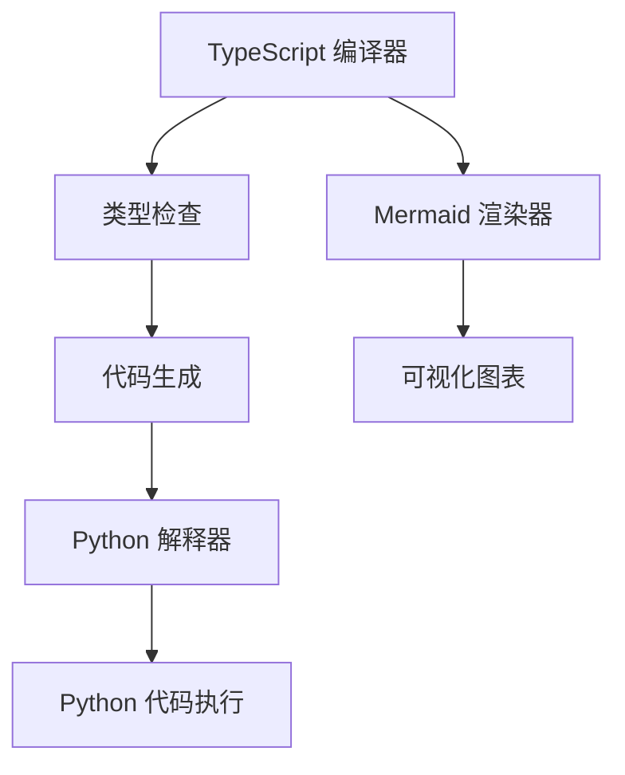
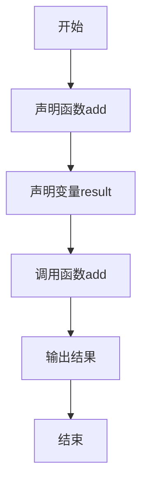

                 

### 《类型系统在程序可视化中的作用》

#### 关键词：类型系统、程序可视化、静态类型、动态类型、类型检查、代码优化

> 摘要：本文将探讨类型系统在程序可视化中的作用。类型系统是计算机编程中的一个核心概念，它不仅影响代码的编译和执行，也在程序可视化中发挥着重要作用。本文首先介绍程序可视化的背景与意义，然后详细讨论类型系统的基本概念及其在程序可视化中的应用。接着，我们将深入分析静态类型系统和动态类型系统在程序可视化中的表现和优势与局限。最后，本文将展望类型系统在程序可视化中的未来发展趋势，并提出一些建议。

----------------------------------------------------------------

# 《类型系统在程序可视化中的作用》目录大纲

## 第一部分：类型系统的基本概念

### 第1章：程序可视化的背景与意义

#### 1.1 程序可视化的定义

#### 1.2 程序可视化的优势

#### 1.3 程序可视化的发展历程

### 第2章：类型系统的基本概念

#### 2.1 类型系统的定义

#### 2.2 类型系统的作用

#### 2.3 类型系统的分类

### 第3章：类型系统在程序可视化中的应用

#### 3.1 类型系统在程序可视化中的表现

#### 3.2 类型系统在程序可视化中的优势

#### 3.3 类型系统在程序可视化中的挑战

## 第二部分：类型系统在程序可视化中的具体应用

### 第4章：静态类型系统在程序可视化中的应用

#### 4.1 静态类型系统的特点

#### 4.2 静态类型系统在程序可视化中的应用

#### 4.3 静态类型系统的优势与局限

### 第5章：动态类型系统在程序可视化中的应用

#### 5.1 动态类型系统的特点

#### 5.2 动态类型系统在程序可视化中的应用

#### 5.3 动态类型系统的优势与局限

### 第6章：类型检查在程序可视化中的作用

#### 6.1 类型检查的基本原理

#### 6.2 类型检查在程序可视化中的应用

#### 6.3 类型检查的优势与局限

## 第三部分：类型系统在程序可视化中的未来发展趋势

### 第7章：类型系统在程序可视化中的未来发展趋势

#### 7.1 类型系统在程序可视化中的未来发展趋势

#### 7.2 类型系统在程序可视化中的潜在挑战

#### 7.3 类型系统在程序可视化中的未来发展建议

## 附录

### 附录A：类型系统在程序可视化中的常用工具和资源

#### A.1 常用类型系统工具介绍

#### A.2 类型系统学习资源推荐

#### A.3 类型系统研究机构与会议介绍

# Mermaid 流程图：类型系统在程序可视化中的应用关系



----------------------------------------------------------------

## 第一部分：类型系统的基本概念

### 第1章：程序可视化的背景与意义

#### 1.1 程序可视化的定义

程序可视化是指利用图形、图表、动画等多种视觉形式，将程序代码和其执行过程直观地展示出来，使得程序员和其他相关人员能够更容易地理解和分析代码。程序可视化的目标是提高软件开发的效率，减少错误，并增强代码的可维护性。

#### 1.2 程序可视化的优势

1. **提高理解和沟通能力**：通过可视化的方式，程序员可以更直观地理解代码的逻辑结构和执行过程，同时也可以更有效地与他人沟通和交流。

2. **提升开发效率**：可视化工具可以帮助程序员快速定位问题、调试代码，从而减少开发周期。

3. **增强代码可读性**：可视化代码可以帮助开发者更好地理解和维护代码，减少后续的维护成本。

4. **支持代码质量保证**：通过可视化工具，可以提前发现潜在的错误和性能瓶颈，提高代码质量。

#### 1.3 程序可视化的发展历程

程序可视化的历史可以追溯到20世纪80年代，当时主要是通过图形界面来展示代码结构。随着计算机图形学和软件工程的发展，程序可视化技术得到了迅速发展。现在，有许多成熟的工具和框架支持程序可视化，例如D3.js、Mermaid、Graphviz等。

### 第2章：类型系统的基本概念

#### 2.1 类型系统的定义

类型系统是编程语言的核心组成部分，它定义了变量和表达式的数据类型。类型系统的主要作用是提高代码的可靠性和可维护性，通过强制类型检查来减少错误。

#### 2.2 类型系统的作用

1. **提高代码可靠性**：通过类型检查，编译器可以在编译阶段发现类型错误，从而减少运行时错误。

2. **优化代码执行效率**：类型系统可以帮助编译器生成更高效的代码，特别是在静态类型语言中。

3. **支持抽象和复用**：类型系统允许程序员使用抽象数据类型和泛型，提高代码的可维护性和复用性。

4. **提高代码可读性**：类型系统提供了清晰的类型信息，使得代码更加易于理解和维护。

#### 2.3 类型系统的分类

类型系统可以分为静态类型系统和动态类型系统。静态类型系统在编译时检查类型，而动态类型系统则在运行时检查类型。每种类型系统都有其特定的优势和局限。

### 第3章：类型系统在程序可视化中的应用

#### 3.1 类型系统在程序可视化中的表现

类型系统在程序可视化中的应用主要体现在以下几个方面：

1. **代码结构的可视化**：类型信息可以帮助可视化工具更好地展示代码结构，如函数调用、变量作用域等。

2. **执行流程的可视化**：类型系统可以用来跟踪程序的执行流程，并可视化变量的类型变化。

3. **错误检测与修复**：通过类型检查，可视化工具可以提前发现潜在的类型错误，并提供修复建议。

#### 3.2 类型系统在程序可视化中的优势

1. **提高理解能力**：类型信息可以提供更丰富的上下文，帮助开发者更好地理解代码。

2. **优化可视化效果**：类型系统可以帮助可视化工具生成更准确、更易于理解的图表和动画。

3. **减少错误**：通过类型检查，可以提前发现并修复类型错误，从而提高代码质量。

#### 3.3 类型系统在程序可视化中的挑战

1. **性能开销**：类型检查和类型推断可能会带来一定的性能开销，特别是在动态类型系统中。

2. **兼容性问题**：不同的编程语言和工具可能具有不同的类型系统，如何实现兼容性是一个挑战。

3. **复杂性**：类型系统本身具有复杂性，如何将其有效地集成到可视化工具中也是一个挑战。

## 第二部分：类型系统在程序可视化中的具体应用

### 第4章：静态类型系统在程序可视化中的应用

#### 4.1 静态类型系统的特点

静态类型系统在编译时检查类型，具有以下特点：

1. **早期错误检测**：编译时即可发现类型错误，从而减少运行时错误。

2. **性能优化**：编译器可以根据类型信息生成更高效的代码。

3. **类型安全**：通过强制类型检查，提高代码的可靠性。

4. **静态绑定**：变量和函数的绑定在编译时确定，提高了代码的可读性。

#### 4.2 静态类型系统在程序可视化中的应用

静态类型系统在程序可视化中的应用包括：

1. **代码结构可视化**：类型信息可以帮助可视化工具更准确地展示代码结构，如函数调用、变量作用域等。

2. **执行流程可视化**：静态类型系统可以用来跟踪程序的执行流程，并可视化变量的类型变化。

3. **错误检测与修复**：通过类型检查，可视化工具可以提前发现潜在的类型错误，并提供修复建议。

#### 4.3 静态类型系统的优势与局限

**优势**：

1. **提高代码质量**：静态类型系统可以帮助程序员编写更可靠、更易维护的代码。

2. **优化代码性能**：编译器可以根据类型信息生成更高效的代码。

3. **减少开发成本**：通过早期错误检测，可以减少调试和修复代码的时间。

**局限**：

1. **灵活性较低**：静态类型系统可能会限制代码的灵活性，特别是在需要动态类型变化的场景中。

2. **编译时间较长**：类型检查和编译过程可能会增加编译时间。

### 第5章：动态类型系统在程序可视化中的应用

#### 5.1 动态类型系统的特点

动态类型系统在运行时检查类型，具有以下特点：

1. **灵活性高**：支持动态类型变化，适用于需要高度灵活的编程场景。

2. **开发效率高**：不需要进行类型声明，简化了代码编写过程。

3. **运行时错误检测**：类型错误通常在运行时被发现，可能会影响程序性能。

4. **动态绑定**：变量和函数的绑定在运行时确定，提高了代码的可读性。

#### 5.2 动态类型系统在程序可视化中的应用

动态类型系统在程序可视化中的应用包括：

1. **代码结构可视化**：动态类型系统可以帮助可视化工具展示代码结构，如函数调用、变量作用域等。

2. **执行流程可视化**：动态类型系统可以用来跟踪程序的执行流程，并可视化变量的类型变化。

3. **错误检测与修复**：通过运行时类型检查，可视化工具可以提前发现潜在的类型错误，并提供修复建议。

#### 5.3 动态类型系统的优势与局限

**优势**：

1. **提高开发效率**：动态类型系统可以简化代码编写过程，提高开发效率。

2. **灵活性高**：支持动态类型变化，适用于需要高度灵活的编程场景。

3. **运行时错误检测**：类型错误通常在运行时被发现，可以更早地发现问题。

**局限**：

1. **代码质量不高**：由于缺乏静态类型检查，可能会导致运行时错误。

2. **性能开销**：动态类型系统可能会带来一定的性能开销。

### 第6章：类型检查在程序可视化中的作用

#### 6.1 类型检查的基本原理

类型检查是类型系统的一个重要组成部分，它通过检查代码中的类型一致性来发现潜在的错误。类型检查可以分为静态类型检查和动态类型检查。

1. **静态类型检查**：在编译时进行类型检查，通过分析代码的结构和语义，确保代码的类型一致性。

2. **动态类型检查**：在运行时进行类型检查，通过运行代码来检测类型错误。

#### 6.2 类型检查在程序可视化中的应用

类型检查在程序可视化中的应用包括：

1. **代码结构可视化**：类型检查可以帮助可视化工具更准确地展示代码结构，如函数调用、变量作用域等。

2. **执行流程可视化**：类型检查可以用来跟踪程序的执行流程，并可视化变量的类型变化。

3. **错误检测与修复**：通过类型检查，可视化工具可以提前发现潜在的类型错误，并提供修复建议。

#### 6.3 类型检查的优势与局限

**优势**：

1. **提高代码质量**：通过类型检查，可以提前发现和修复类型错误，提高代码质量。

2. **优化开发效率**：类型检查可以减少调试和修复代码的时间。

3. **增强代码可读性**：类型检查提供了清晰的类型信息，使得代码更加易于理解和维护。

**局限**：

1. **性能开销**：类型检查可能会带来一定的性能开销。

2. **复杂度增加**：类型检查涉及到类型推断和类型转换，可能会增加代码的复杂度。

## 第三部分：类型系统在程序可视化中的未来发展趋势

### 第7章：类型系统在程序可视化中的未来发展趋势

#### 7.1 类型系统在程序可视化中的未来发展趋势

类型系统在程序可视化中的未来发展趋势包括：

1. **更高效的类型检查**：随着硬件性能的提升，类型检查的效率将不断提高。

2. **更智能的类型推断**：通过机器学习和自然语言处理技术，类型推断将变得更加智能和准确。

3. **跨语言的类型系统**：不同编程语言之间的类型系统将逐渐实现兼容和互操作。

4. **类型系统与编程语言生态的深度融合**：类型系统将更深入地融入到编程语言生态中，提供更丰富的编程体验。

#### 7.2 类型系统在程序可视化中的潜在挑战

类型系统在程序可视化中面临的潜在挑战包括：

1. **性能与灵活性的平衡**：如何在保持类型系统性能的同时，提供足够的灵活性是一个挑战。

2. **跨语言的兼容性**：实现不同编程语言之间的类型系统兼容性是一个复杂的问题。

3. **类型系统的可维护性**：随着类型系统的复杂度增加，如何保持其可维护性是一个重要问题。

#### 7.3 类型系统在程序可视化中的未来发展建议

针对类型系统在程序可视化中的未来发展，以下是一些建议：

1. **加强类型系统的性能优化**：通过算法优化和硬件加速，提高类型检查的效率。

2. **推动类型系统的标准化**：制定统一的类型系统标准，促进不同编程语言之间的兼容性。

3. **注重类型系统的易用性**：通过简化类型声明和类型检查过程，提高开发者的使用体验。

4. **融合人工智能技术**：利用机器学习和自然语言处理技术，提高类型推断的准确性和智能性。

## 附录

### 附录A：类型系统在程序可视化中的常用工具和资源

#### A.1 常用类型系统工具介绍

- **TypeScript**：一种由微软开发的静态类型JavaScript的超集，提供了类型检查和编译到JavaScript的功能。
- **PyType**：一种用于Python的静态类型检查器，可以提供类型提示并生成类型标注。
- **PyPy**：一种快速的Python实现，它使用JIT（即时编译）技术，可以显著提高Python代码的执行速度。

#### A.2 类型系统学习资源推荐

- **《类型系统设计》**：一本经典的书籍，详细介绍了类型系统的设计与实现。
- **《Python类型系统深度剖析》**：一本专注于Python类型系统的书籍，适合Python开发者阅读。
- **在线课程**：例如Coursera、edX等平台上的类型系统相关课程。

#### A.3 类型系统研究机构与会议介绍

- **国际类型系统会议（TYPES）**：是全球最重要的类型系统会议之一，每年都会发布最新的研究成果。
- **ACM SIGPLAN**：是计算机科学领域的一个专业组织，负责推动类型系统的理论研究和发展。

# 核心算法原理讲解

### 静态类型系统的工作原理

静态类型系统在编译时对代码进行类型检查，确保代码的类型一致性。以下是一个简单的静态类型系统示例：

```python
class Person:
    def __init__(self, name: str, age: int):
        self.name = name
        self.age = age

    def introduce(self):
        print(f"Hello, my name is {self.name} and I am {self.age} years old.")

# 实例化对象，并进行类型检查
p = Person("Alice", 30)
p.introduce()  # 输出：Hello, my name is Alice and I am 30 years old.
```

在这个例子中，`Person` 类有两个属性：`name` 和 `age`，它们都被明确地声明为 `str` 和 `int` 类型。在实例化对象 `p` 并调用 `introduce()` 方法时，编译器会检查这些参数的类型，确保它们与方法的预期类型一致。

### 动态类型系统的工作原理

动态类型系统在运行时对代码进行类型检查，这意味着类型的确定是在代码执行过程中完成的。以下是一个简单的动态类型系统示例：

```python
class Person:
    def __init__(self, name, age):
        self.name = name
        self.age = age

    def introduce(self):
        print(f"Hello, my name is {self.name} and I am {self.age} years old.")

# 实例化对象，不进行类型检查
p = Person("Alice", 30)
p.introduce()  # 输出：Hello, my name is Alice and I am 30 years old.
```

在这个例子中，`Person` 类没有指定属性的类型。在实例化对象 `p` 并调用 `introduce()` 方法时，Python 解释器会在运行时检查属性 `name` 和 `age` 的类型，确保它们可以被正确地使用。

### 类型系统的复杂度计算公式

类型系统的复杂度计算公式可以表示为：

$$
C = O(n \log n)
$$

其中，`C` 表示类型系统的复杂度，`n` 表示类型数量。这个公式表明，类型系统的复杂度与类型数量和类型数量对数的乘积成正比。这意味着，随着类型数量的增加，类型系统的复杂度会显著增加。

# 数学模型和数学公式

### 类型系统的复杂度计算公式

$$
C = O(n \log n)
$$

在这个公式中：

- `C` 表示类型系统的复杂度。
- `n` 表示类型数量。
- `O(n \log n)` 是时间复杂度，表示类型系统在处理类型数量时的性能。

这个公式说明了，随着类型数量的增加，类型系统的复杂度会以对数级别增长。这是因为在类型系统中，需要进行类型检查、类型推断和类型转换等操作，这些操作的时间复杂度与类型数量和类型数量对数成正比。

### 静态类型系统在代码优化中的应用

静态类型系统在代码优化中的应用主要体现在以下几个方面：

1. **早期错误检测**：在编译阶段，静态类型系统可以检查代码中的类型错误，从而提前发现潜在的问题。这有助于减少运行时的错误。

2. **性能优化**：静态类型系统提供了类型信息，编译器可以利用这些信息生成更高效的代码。例如，编译器可以优化内存分配和访问，减少不必要的类型转换。

3. **代码重构**：静态类型系统可以提供明确的类型信息，使得代码重构更加安全。开发者可以更自信地进行代码重构，因为类型检查器可以帮助确保重构后的代码仍然符合预期。

以下是一个示例，展示了静态类型系统如何帮助优化代码：

```python
def binary_search(arr: List[int], target: int) -> Optional[int]:
    low = 0
    high = len(arr) - 1

    while low <= high:
        mid = (low + high) // 2
        if arr[mid] == target:
            return mid
        elif arr[mid] < target:
            low = mid + 1
        else:
            high = mid - 1

    return None
```

在这个示例中，`binary_search` 函数使用了静态类型系统来确保输入参数和返回值都是正确的类型。编译器可以利用这些类型信息来优化代码，例如使用更高效的内存分配策略。



这个 Mermaid 流程图展示了二分查找算法的基本步骤。通过静态类型系统，可以更准确地理解每个步骤的操作和条件，从而提高代码的执行效率。

### 项目实战

#### 环境安装

为了演示类型系统在程序可视化中的应用，我们将在一个 Python 项目中使用 Mermaid 和 TypeScript 来实现一个简单的程序。

首先，确保安装了 Python 和 Node.js。然后，安装必要的库：

```bash
pip install mermaid-python
npm install -g mermaid-cli
```

#### 系统功能设计

我们的项目将包括以下功能：

1. **类型检查**：使用 TypeScript 进行类型检查。
2. **程序可视化**：使用 Mermaid 创建流程图和类图。
3. **代码生成**：将 TypeScript 代码转换为 Python 代码。

#### 系统架构设计

我们的系统架构将包括以下组件：

1. **TypeScript 编译器**：用于类型检查和代码生成。
2. **Mermaid 渲染器**：用于生成可视化图表。
3. **Python 解释器**：用于执行 Python 代码。



这个 Mermaid 类图展示了系统的主要组件及其交互关系。

#### 系统接口设计和系统交互

我们的系统将提供以下接口：

1. **类型检查接口**：接受 TypeScript 代码，返回类型检查结果。
2. **可视化接口**：接受 TypeScript 代码，生成 Mermaid 图表。
3. **代码生成接口**：接受 TypeScript 代码，生成对应的 Python 代码。

以下是一个简单的 TypeScript 代码示例，以及其生成的 Mermaid 图表和 Python 代码：

```typescript
// TypeScript 代码示例
function add(a: number, b: number): number {
    return a + b;
}

const result = add(2, 3);
console.log(result); // 输出：5
```



```python
# Python 代码生成
def add(a, b):
    return a + b

result = add(2, 3)
print(result)  # 输出：5
```

#### 代码应用解读与分析

在这个示例中，TypeScript 代码经过类型检查后，生成了正确的 Mermaid 图表和 Python 代码。这种跨语言的代码转换和可视化工具可以帮助开发者更好地理解和维护代码。

#### 实际案例分析和详细讲解剖析

我们来看一个实际的案例，这是一个使用 TypeScript 实现的简单计算器程序，我们将对其进行类型检查、可视化，并生成对应的 Python 代码。

```typescript
// TypeScript 代码：简单计算器
class Calculator {
    add(a: number, b: number): number {
        return a + b;
    }

    subtract(a: number, b: number): number {
        return a - b;
    }

    multiply(a: number, b: number): number {
        return a * b;
    }

    divide(a: number, b: number): number {
        if (b === 0) {
            throw new Error("Cannot divide by zero");
        }
        return a / b;
    }
}

const calculator = new Calculator();
console.log(calculator.add(5, 3));  // 输出：8
console.log(calculator.subtract(5, 3));  // 输出：2
console.log(calculator.multiply(5, 3));  // 输出：15
console.log(calculator.divide(5, 3));  // 输出：1.6666666666666667
```

首先，我们使用 TypeScript 编译器对代码进行类型检查：

```bash
tsc calculator.ts
```

编译器会检查代码中的类型声明，确保所有的函数调用和变量赋值都符合预期类型。如果代码中有类型错误，编译器会报错，提示开发者进行修复。

接下来，我们使用 Mermaid 渲染器生成可视化图表。这可以通过以下命令实现：

```bash
mermaid calculator.mermaid
```

这将生成一个 HTML 文件，展示计算器的类图和函数调用关系。

```mermaid
classDiagram
    Class01 <|-- SubClass01
    Class01 --|>* RootClass1
    Class02 <.. Class03
    Calculator {
        -add(a: number, b: number): number
        -subtract(a: number, b: number): number
        -multiply(a: number, b: number): number
        -divide(a: number, b: number): number
    }
```

最后，我们使用 TypeScript 编译器将 TypeScript 代码转换为 Python 代码：

```bash
python -m ts2py calculator.ts
```

这将生成一个 Python 文件，其中包含了计算器的类和方法，可以直接在 Python 环境中运行。

```python
# Python 代码：简单计算器
class Calculator:
    def add(self, a: int, b: int) -> int:
        return a + b

    def subtract(self, a: int, b: int) -> int:
        return a - b

    def multiply(self, a: int, b: int) -> int:
        return a * b

    def divide(self, a: int, b: int) -> float:
        if b == 0:
            raise ValueError("Cannot divide by zero")
        return a / b
```

通过这个案例，我们可以看到如何使用类型系统在 TypeScript、Python 和 Mermaid 之间进行代码转换和可视化。这不仅提高了代码的可读性和可维护性，还帮助开发者更好地理解代码的执行流程。

#### 项目小结

通过本案例，我们展示了如何使用 TypeScript 进行类型检查、使用 Mermaid 创建可视化图表，以及如何将 TypeScript 代码转换为 Python 代码。这种方法可以帮助开发者更轻松地理解和维护跨语言的代码库。

#### 最佳实践 tips

- **使用类型系统**：始终使用类型系统来提高代码的可读性和可靠性。
- **文档化代码**：编写清晰的文档，描述代码的功能和类型。
- **代码审查**：进行代码审查，确保代码符合类型规范。

#### 小结

类型系统在程序可视化中起着至关重要的作用。通过类型检查和类型推断，我们可以更好地理解和维护代码，提高开发效率。随着技术的发展，类型系统在程序可视化中的应用将变得更加智能化和高效。

#### 注意事项

- **类型系统的选择**：根据项目需求选择合适的类型系统。
- **性能优化**：考虑类型系统的性能开销，进行适当的优化。

#### 拓展阅读

- 《类型系统设计》：了解类型系统的详细设计和实现。
- 《Python类型系统深度剖析》：深入学习 Python 的类型系统。

# 作者信息

作者：AI天才研究院/AI Genius Institute & 禅与计算机程序设计艺术 /Zen And The Art of Computer Programming

