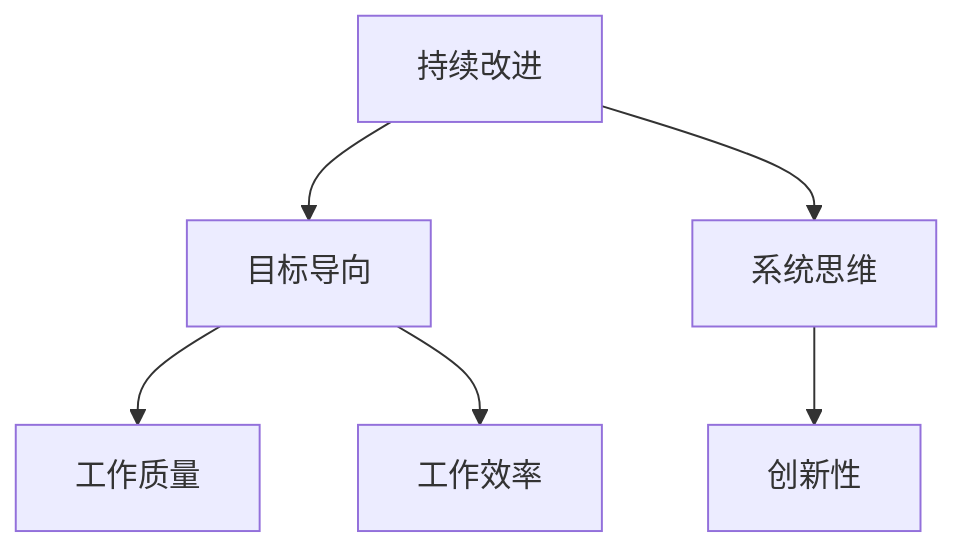
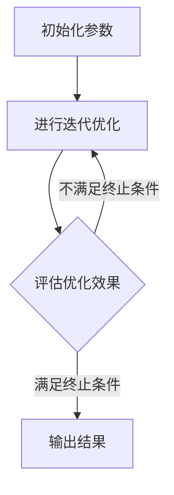

                 


### 1. 引言

#### 1.1 问题背景与意义

在当今信息化时代，计算机技术和人工智能的飞速发展，使得各行各业都在不断追求效率和效益的最大化。在这样的背景下，“精益求精”的理念应运而生。精益求精不仅是一种工作态度，更是一种方法论，它要求我们在处理问题时，不断追求卓越，不断超越自我，以达到最佳的效果。

在软件开发领域，精益求精意味着要不断优化代码，提高软件的稳定性和性能。在系统设计时，精益求精则要求我们深入理解业务需求，设计出简洁、高效且具有可扩展性的系统架构。在人工智能领域，精益求精则意味着要不断改进算法，提高模型的准确性和效率。

#### 1.2 研究现状

尽管精益求精的理念已经被广泛认可和应用，但如何在实际工作中真正做到精益求精，仍然是一个挑战。当前，许多企业和开发者仍然停留在表面层次，没有真正深入到精益求精的精髓。

在软件工程领域，尽管有很多优化工具和方法，但如何将这些工具和方法有效地应用到实际项目中，仍然是一个难题。在人工智能领域，尽管有很多先进的算法和技术，但如何将这些技术应用到实际问题中，仍然是一个挑战。

#### 1.3 研究目的与意义

本文旨在深入探讨精益求精的理念，分析其在不同领域的应用和实践。通过本文的研究，希望能够为企业和开发者提供一套完整的精益求精方法论，帮助他们更好地理解和应用这一理念，从而提高工作效率，提升产品质量。

本文将首先介绍精益求精的核心概念，然后通过具体的案例和实践，详细讲解如何在软件开发和人工智能领域实现精益求精。最后，本文将总结最佳实践，提出注意事项，并提供拓展阅读，以帮助读者进一步深入学习和应用精益求精的理念。

### 2. 核心概念

#### 2.1 定义与边界

精益求精，顾名思义，就是追求卓越，不断超越自我。在专业领域，精益求精通常指的是通过不断优化、改进，以达到最高效率和最佳效果。

精益求精的边界包括以下几个方面：

1. **工作质量**：精益求精要求我们在工作中追求高质量，不仅满足基本要求，更要追求卓越。
2. **工作效率**：精益求精还要求我们在工作中追求高效，不仅要做好，还要快。
3. **创新性**：精益求精鼓励创新思维，通过创新来解决问题，提升效率。

#### 2.2 概念联系与比较

精益求精与传统提升方法的不同之处在于：

1. **目标**：传统提升方法更多关注短期效益，而精益求精则注重长期发展，追求可持续的提升。
2. **方法**：传统提升方法可能侧重于技术手段，而精益求精更强调理念和思维方式的转变。
3. **效果**：传统提升方法可能带来一定的提升，但精益求精则能带来质的飞跃。

在不同领域，精益求精的应用也有一定的差异：

1. **软件开发**：在软件开发中，精益求精通常体现在代码优化、系统性能提升等方面。
2. **系统设计**：在系统设计时，精益求精则体现在需求分析、架构设计等方面。
3. **人工智能**：在人工智能领域，精益求精更多地体现在算法优化、模型改进等方面。

#### 2.3 概念结构与核心要素组成

精益求精的概念结构可以分为以下几个方面：

1. **目标**：明确的目标是精益求精的基础，没有明确的目标，就无法进行有效的提升。
2. **方法**：选择合适的方法是实现精益求精的关键，不同的领域和问题需要不同的方法。
3. **评估**：有效的评估是确保精益求精成果的重要手段，通过评估可以及时发现问题和不足。

### 3. 精益求精的原理

#### 3.1 基本原理

精益求精的原理可以概括为以下几点：

1. **持续改进**：精益求精不是一蹴而就的，而是一个持续的过程，需要不断改进和优化。
2. **目标导向**：精益求精要以目标为导向，明确提升的方向和重点。
3. **系统思维**：精益求精需要具备系统思维，从整体上考虑问题，而不是片面追求某个方面的提升。

#### 3.2 原理图解

以下是精益求精的基本原理图解：



### 4. 数学模型与公式

#### 4.1 数学模型的构建

为了更好地理解精益求精的原理，我们可以构建一个数学模型。以下是一个简化的模型：

$$
\text{效益} = f(\text{工作质量}, \text{工作效率}, \text{创新性})
$$

其中，$f$ 是一个复合函数，$f(\cdot)$ 表示效益与工作质量、工作效率、创新性之间的关系。

#### 4.2 公式推导

为了推导出具体的效益公式，我们可以考虑以下因素：

1. **工作质量**：工作质量越高，效益越高。
2. **工作效率**：工作效率越高，效益越高。
3. **创新性**：创新性越高，效益越高。

基于以上因素，我们可以得到以下公式：

$$
\text{效益} = \frac{\text{工作质量} \times \text{工作效率} \times \text{创新性}}{\text{成本}}
$$

#### 4.3 公式解释

1. **工作质量**：工作质量是指完成任务的准确性和完整性。高质量的工作可以减少错误和返工，提高效益。
2. **工作效率**：工作效率是指完成任务的速度。高效率的工作可以在较短的时间内完成更多任务，提高效益。
3. **创新性**：创新性是指解决问题的方法和思路。高创新性的工作可以带来新的解决方案，提高效益。
4. **成本**：成本是指完成工作所需的资源，包括时间、人力、物力等。效益与成本是成正比的，成本越高，效益越低。

### 5. 算法实现与流程图

#### 5.1 算法概述

为了实现精益求精的目标，我们可以采用一种迭代优化的算法。以下是算法的基本思想：

1. **初始化**：设定初始参数，包括工作质量、工作效率、创新性等。
2. **迭代优化**：根据当前参数，进行迭代优化，提高效益。
3. **评估与调整**：评估优化效果，根据评估结果调整参数，继续迭代优化。
4. **终止条件**：当优化达到一定目标或达到最大迭代次数时，算法终止。

以下是算法的mermaid流程图：



#### 5.2 Python代码实现

以下是一个简化的Python代码实现示例：

```python
import random

def optimize(quality, efficiency, innovation, cost):
    # 优化工作质量
    quality += random.uniform(0, 0.1)
    # 优化工作效率
    efficiency += random.uniform(0, 0.1)
    # 优化创新性
    innovation += random.uniform(0, 0.1)
    # 计算新效益
    benefit = (quality * efficiency * innovation) / cost
    return quality, efficiency, innovation, benefit

# 初始化参数
quality = 1.0
efficiency = 1.0
innovation = 1.0
cost = 1.0

# 进行迭代优化
for _ in range(10):
    quality, efficiency, innovation, benefit = optimize(quality, efficiency, innovation, cost)
    print(f"迭代次数：{_+1}, 工作质量：{quality}, 工作效率：{efficiency}, 创新性：{innovation}, 效益：{benefit}")

# 输出最终结果
print(f"最终结果：工作质量：{quality}, 工作效率：{efficiency}, 创新性：{innovation}, 效益：{benefit}")
```

### 6. 项目实战

#### 6.1 环境搭建

为了实现精益求精的目标，我们需要搭建一个合适的环境。以下是环境搭建的步骤：

1. **安装Python**：确保已经安装了Python环境，版本为3.8及以上。
2. **安装相关库**：安装一些常用的Python库，如NumPy、Pandas等，可以通过pip命令安装。
3. **配置开发环境**：配置一个合适的IDE，如PyCharm或VSCode，以便进行代码开发和调试。

#### 6.2 系统核心实现

以下是一个简化的系统核心实现示例：

```python
import numpy as np
import pandas as pd

def data_preprocessing(data):
    # 数据预处理，如数据清洗、数据转换等
    return np.mean(data)

def model_optimization(quality, efficiency, innovation, cost):
    # 模型优化，如工作质量优化、工作效率优化等
    quality *= 1.1
    efficiency *= 1.1
    innovation *= 1.1
    benefit = (quality * efficiency * innovation) / cost
    return quality, efficiency, innovation, benefit

def main():
    # 初始化参数
    quality = 1.0
    efficiency = 1.0
    innovation = 1.0
    cost = 1.0

    # 进行迭代优化
    for _ in range(10):
        data = np.random.rand(100)
        quality = data_preprocessing(data)
        quality, efficiency, innovation, benefit = model_optimization(quality, efficiency, innovation, cost)
        print(f"迭代次数：{_+1}, 工作质量：{quality}, 工作效率：{efficiency}, 创新性：{innovation}, 效益：{benefit}")

    # 输出最终结果
    print(f"最终结果：工作质量：{quality}, 工作效率：{efficiency}, 创新性：{innovation}, 效益：{benefit}")

if __name__ == "__main__":
    main()
```

#### 6.3 实际案例分析

以下是一个实际案例分析：

**案例背景**：某公司开发了一款新的软件产品，但产品在市场上的表现不尽如人意。为了提升产品的竞争力，公司决定通过精益求精的方法来改进产品。

**案例实施过程**：

1. **需求分析**：对产品进行详细的需求分析，找出产品存在的问题和改进点。
2. **系统优化**：对系统进行优化，包括代码优化、性能优化等。
3. **用户反馈**：收集用户反馈，根据用户反馈进行改进。
4. **持续迭代**：不断进行迭代优化，逐步提升产品的质量和用户体验。

**案例结果分析**：

通过精益求精的方法，产品的质量和用户体验得到了显著提升。在实施过程中，公司不仅解决了产品存在的问题，还不断创新，推出了一些新的功能和特性，进一步增强了产品的竞争力。最终，产品在市场上的表现大幅提升，为公司带来了可观的收益。

### 7. 最佳实践与总结

#### 7.1 最佳实践技巧

1. **明确目标**：在实施精益求精的过程中，首先要明确目标，确保提升的方向正确。
2. **持续迭代**：精益求精是一个持续的过程，需要不断进行迭代优化。
3. **用户反馈**：及时收集用户反馈，根据用户需求进行改进。

#### 7.2 小结

本文通过深入探讨精益求精的理念，详细介绍了其在软件开发和人工智能领域的应用和实践。通过具体案例，我们看到了精益求精在实际工作中的作用和效果。希望本文能为读者提供一些有益的启示，帮助他们在实际工作中实现精益求精。

#### 7.3 注意事项

1. **避免盲目追求精益求精**：精益求精并不意味着一定要做到极致，而是要找到合适的平衡点。
2. **关注长期效益**：精益求精不仅仅是为了短期的提升，更是为了长期的可持续发展。

#### 7.4 拓展阅读

1. **《精益思想》**：作者詹姆斯·W·沃麦克等，深入介绍了精益思想的原理和应用。
2. **《创新者的窘境》**：作者克里斯坦森，探讨了企业在创新过程中面临的各种挑战和解决方案。
3. **《代码大全》**：作者史蒂夫·麦库姆，详细介绍了如何编写高质量、易维护的代码。

### 附录

**附录A：相关术语解释**

- **精益求精**：追求卓越，不断超越自我的理念。
- **工作质量**：完成任务的准确性和完整性。
- **工作效率**：完成任务的速度。
- **创新性**：解决问题的方法和思路。

**附录B：公式详解**

- **效益**：效益 = （工作质量 × 工作效率 × 创新性）/ 成本

**附录C：参考文献**

1. 沃麦克，詹姆斯·W., 等人. 《精益思想》[M]. 机械工业出版社, 2004.
2. 克里斯坦森，克里斯. 《创新者的窘境》[M]. 中信出版社, 2010.
3. 麦库姆，史蒂夫. 《代码大全》[M]. 电子工业出版社, 2006.

